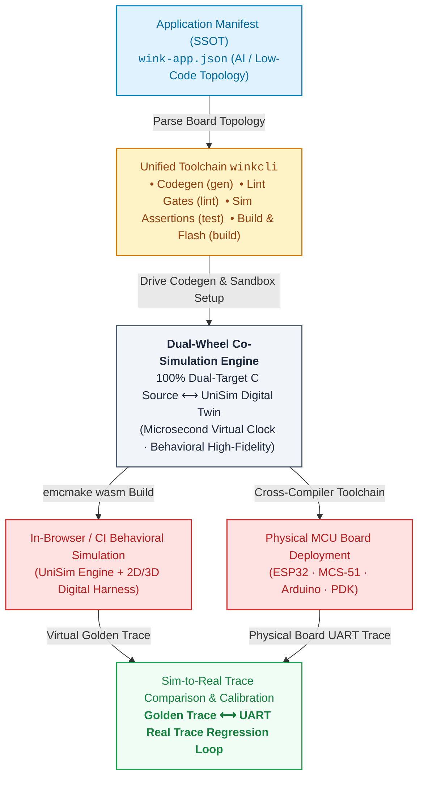
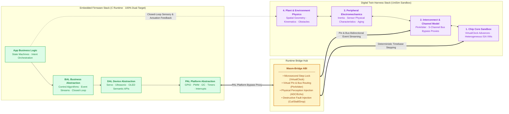

# WinkMicroOS

**AI can already write, run, test and fix software on its own. Embedded is the exception — firmware only proves itself on silicon, and silicon sits behind a human hand.**

WinkMicroOS is the deterministic digital lab that closes that loop: the same C source runs in a browser Wasm sandbox and on real MCUs — from ESP32 down to sub-$1 8-bit industrial chips — and every run leaves reviewable PASS evidence behind. *Built for agents, not just humans.*

[](https://github.com/wink-cloud-hub/wink-ai-embedded/actions/workflows/pr.yml)
[](https://github.com/wink-cloud-hub/wink-ai-embedded/actions/workflows/nightly.yml)
[](https://github.com/wink-cloud-hub/wink-ai-embedded/actions/workflows/license-gate.yml)
[](https://github.com/wink-cloud-hub/wink-ai-embedded/releases/latest)
[](./.github/license-map.json)


**English** | [简体中文](./README.zh-CN.md)
&nbsp;·&nbsp; [▶ Try it online](http://www.wink-ai.com/simulator/index.html) &nbsp;·&nbsp; [5-min guide](./docs/en/design/00-quick-start/01-5min-getting-started.md) &nbsp;·&nbsp; [Docs hub](./docs/en/README.md) &nbsp;·&nbsp; [Roadmap](./docs/en/design/01-system-overall/02-mvp-roadmap.md)

**Status:** released · public CI green · test executables (see [`wink-micro-os/TESTING.md`](./wink-micro-os/TESTING.md))

<!-- TODO(asset): add a 15-second hero GIF — import repo → run the `button-led` scenario → press the virtual button → LED lights up with the live waveform. A workbench screenshot works too. -->

---

## The loop that never closed

AI coding is already a closed loop in pure software. In embedded it never closed — because the loop runs through a human body:

```text
Pure software today — CLOSED
  generate → run → test → fix → ↻

Embedded today — OPEN (a human in the middle)
  generate ─▶ [human: flash] ─▶ [human: press keys] ─▶ [human: read scope] ─▶ [human: paste logs] ─▶ ↻

"Automated" bench rigs — STILL OPEN (a fake loop)
  generate → auto-flash → logic analyzer → [human: interpret & decide] ─▶ ↻

WinkMicroOS — CLOSED
  generate → hardware-as-code (device tree + scenario JSON)
           → deterministic run (host / wasm)
           → structured trace + PASS evidence
           → fix → ↻
```

Auto-flashing a real board and capturing waveforms automates the *tools*, not the *loop*: the physical world still needs a human to press the button, rewire the board, and reproduce the edge case. The loop only closes when hardware itself becomes code — reproducible, seedable, scriptable, and free of physical time.

That is the design premise of WinkMicroOS.

## Why WinkMicroOS

- **Where the volume actually is.** Wokwi, QEMU and friends serve ARM/RISC-V dev boards. Most industrial volume ships as 8/16-bit parts (MCS-51/STC, Cmsemicon, Padauk, Holtek, Sonix…) with no SWD/JTAG and no affordable ICE — debug-by-OTP only. WinkMicroOS simulates them instruction-level, with breakpoints, registers and stack in the browser.
- **Same source, everywhere.** One C codebase compiles for `host` (tests), `wasm32` (browser/headless simulator) and `targets/esp32`; unmodified Keil C51 sources ([ADR-0075](./docs/decisions/core/0075-mcs51-production-wasm-target-headless.md)) and unmodified Arduino sketches ([ADR-0035](./docs/decisions/core/0035-arduino-compat-polymorphism-sandbox.md)) run in simulation without a porting layer.
- **Deterministic by construction.** Virtual-clock ticking, seeded PRNG, headless scenario scripts with declared assertions. Failures are reproducible — no "works on my bench".
- **Hardware is code.** Board topology lives in JSON (`wink-app.json` + board registry), test stimulus lives in scenario JSON. No breadboard, no jumper wires, CI-friendly.
- **Shareable behavior, not oscilloscope traces.** A run produces a shareable online simulation session — customers and PMs feel the LED breathing pattern in a browser instead of squinting at waveform captures.
- **Break it on purpose.** Power dips, sensor dropouts, motor stall, thermal runaway: destructive conditions are injected with zero risk and replayed exactly.
- **Evidence you can ship on.** Every run emits a structured, replayable PASS/FAIL record with a deterministic trace (`SimTraceSpecV2`) — so AI-authored firmware can be reviewed without reading every line, and merged without a leap of faith.
- **Designed for AI agents.** Every input and output of the loop is text, documented for machine consumption ([AGENTS.md](./AGENTS.md)) — agents can scaffold a driver, run the scenario suite, and read structured failures to self-correct.

## Built for agents, not just humans

Existing simulators are good tools — for a person sitting at a keyboard. An agent needs different properties: everything text-defined, headless by default, deterministic, and producing structured evidence.

| Tool | Great at | Why it doesn't close the agent loop |
|---|---|---|
| Proteus | Circuit-level SPICE simulation, a classroom classic | Desktop, licensed, heavyweight; chip library centered on legacy 51/AVR/PIC; no machine-readable evidence output |
| Wokwi | Web Arduino/ESP32 simulator with excellent UX | Maker & education scope; no industrial test framework; no coverage of the low-cost industrial MCUs that ship by the billion |
| QEMU | Open-source instruction-level / system virtualization | Built for OS-level targets, not MCU microsecond peripheral timing; heavy to put inside a firmware CI loop |
| Renode | Multi-node IoT system simulation (Cortex-M / RISC-V) | Powerful but workflow-heavy; aimed at advanced 32-bit scenarios, not the sub-$1 8-bit ecosystem |

WinkMicroOS is not a better mousetrap for the same user. It is a different user: the agent itself. Hardware as code, deterministic scenarios, headless evidence — all of it text, all of it scriptable.

> **Scope, honestly.** Simulation left-shifts risk; it does not replace the bench. Electrical characteristics, EMC, thermal and mechanical behavior still need real hardware. The goal is to make hardware validation the last confirmation — not the first iteration.

## See it

### 1 · Describe the hardware

```json
// wink-micro-app/mcs51_button_led/wink-app.json
{
  "app_name": "mcs51_button_led",
  "board": "stc89c52_devboard",
  "mcu": "at89c52",
  "devices": {
    "btn": { "type": "button", "gpio_pin": 26, "active_low": true },
    "led": { "type": "led",    "gpio_pin": 8,  "active_high": false }
  }
}
```

### 2 · Write the logic — unmodified vendor code or WinkMicroOS APIs

Unmodified Keil C51, straight from the vendor's IDE — `sbit`, SFRs and all (build-time transpile emits the simulator artifact; the original file is never edited):

```c
// wink-micro-app/mcs51_button_led/button_led.c  (SPDX: Apache-2.0)
#include <wink_mcu.h>

sbit KEY = P3^2;    /* push button on P3.2 / INT0, active-low */
sbit LED = P1^0;    /* LED on P1.0, low-drive-on */

void main(void) {
    LED = 1;
    while (1) {
        LED = (KEY == 0) ? 0 : 1;
        _nop_();    /* microstep / cooperative yield point */
    }
}
```

…or the modern event-driven style, which is identical on host, Wasm and ESP32:

```c
// wink-micro-app/avoidance_car/app_callbacks.c  (SPDX: Apache-2.0)
static void app_on_event(const wink_event_t *evt)
{
    if (evt->device != &front_radar || evt->type != WINK_EVENT_DISTANCE_READY) {
        return;
    }
    float cm = (float)evt->param / 10.0f;
    neck_servo_set_angle(cm < 20.0f ? 1800 : 900);  /* 0.1° units */
}
```

### 3 · Prove it headlessly

Scenarios are deterministic, self-asserting and run without a browser ([SimTraceSpecV2](./docs/en/design/04-wasm-simulation/00-README.md)):

```json
// wink-micro-app/mcs51_button_led/unisim-scenarios/button-led.scenario.json (excerpt)
{
  "header": { "accuracyMode": "behavioral", "failurePolicy": "fail-fast",
              "determinism": { "prngSeed": 42 } },
  "steps": [
    { "type": "INPUT_PLUGIN_EVENT", "timeUs": "200ms", "targetPluginId": "btn",
      "action": "SET_PRESSED", "params": { "pressed": true } },
    { "type": "ASSERT_POINT", "timeUs": "800ms", "target": "plugin:led/on", "matcher": true },
    { "type": "ASSERT_POINT", "timeUs": "800ms", "target": "gpio:8", "matcher": 0 }
  ]
}
```

Run the equivalent of this on your machine in one command — no hardware, no browser:

```console
$ winkcli test                            # host build + full test suite (35 executables as of 2026-07)
[PASS] All tests passed
```

## Supported targets

Board definitions are the hardware SSOT: [`wink-tools/tools/codegen/boards/`](./wink-tools/tools/codegen/boards/README.md).

| Family | Board in registry | Simulation tier | Upstream compatibility |
|---|---|---|---|
| ESP32 (Xtensa) | `esp32_devkitc_v4` | Tier 1 — full Wasm runtime, scheduler & multitasking | Native WinkMicroOS apps (BAL / DAL) |
| MCS-51 / 8051 | `stc89c52_devboard`, `cms8s78xx_devboard` | Tier 2 — instruction interception + virtual SFR gateway | **Unmodified Keil C51** sources (`sbit`, `REGX52.H`, vendor SFRs) |
| AVR | `arduino_uno_r3` | Arduino compatibility layer | **Unmodified Arduino sketches** (`Serial`, `String`, `millis`) |
| Padauk PDK | `padauk_pfs154_devboard` | Tier 3 — 1:1 ISA virtual machine | Vendor PDK sources ([ADR-0064](./docs/decisions/unisim/0064-chip-simulation-four-tier-taxonomy.md)) |

## Architecture

The platform adopts a **"Dual-Wheel Architecture"**. To allow AI-generated firmware to safely and reliably bridge the virtual-physical divide, WinkMicroOS establishes a deterministic closed-loop across both a **macro engineering pipeline** and a **micro runtime co-simulation mechanism**.

### 1 · Macro Workflow & Closed-Loop Delivery

Driven by a single source of truth (`wink-app.json`), the unified `winkcli` toolchain orchestrates code generation, layered linting gates, and dual-target compilation. A complete Sim-to-Real loop is achieved by asserting telemetry traces streamed back from both virtual and physical targets:



### 2 · Micro Dual-Wheel Runtime Co-Simulation

Inside the core execution engine, the **Embedded C Firmware Stack** (left) mirrors the **UniSim Digital Twin Harness Stack** (right) layer by layer. They lock-step via the unified `Wasm-Bridge ABI` for microsecond-precise execution and seamless peripheral bypassing:



### 3 · Core Architectural Pillars

1. **Unified SSOT Driving Engine**: A single source of truth, `wink-app.json`, defines hardware topology and configuration. `winkcli` orchestrates C code generation, architectural linting, headless testing, and firmware builds.
2. **Dual-Wheel System**:
   * **Embedded Firmware Stack** (`App ➔ BAL ➔ DAL ➔ PAL`): 100% dual-target C code, compile-time static dispatch, zero malloc, microsecond hard real-time determinism.
   * **Digital Twin Harness Stack** (`Chip ➔ Channel ➔ Peripheral ➔ Physics`): 4-layer electromechanical and spatiotemporal digitization providing microsecond virtual clocks and physical causal closed-loops.
3. **Closed-Loop Dual Delivery (Sim-to-Real)**: A single codebase can be compiled into WebAssembly for zero-hardware interactive testing and fault injection in the browser/CI, or flashed unmodified onto real MCU hardware, with UART trace streaming back for automated model calibration.

## Repository layout

| Path | What it is | License |
|---|---|---|
| [`wink-micro-os/`](./wink-micro-os/) | The C runtime: PAL / DAL / BAL, runtime, trace, targets (`host`, `wasm`, `esp32`), MCS-51 framework, host test suite | **LGPL-3.0-only** (links into your firmware — it can stay proprietary) |
| [`wink-micro-app/`](./wink-micro-app/) | Example & regression apps (MCS-51, PDK, Arduino, ESP32), each with device tree, scenarios and prebuilt Wasm | Apache-2.0 |
| [`wink-firmware-carriers/`](./wink-firmware-carriers/) | Flashable carrier projects (ESP-IDF) for real boards | LGPL-3.0-only |
| [`wink-tools/tools/codegen/boards/`](./wink-tools/tools/codegen/boards/) | Board registry — the hardware single source of truth consumed by the WinkCli toolchain | Apache-2.0 |
| [`wink-plugin-peripherals/`](./wink-plugin-peripherals/) | Simulator peripheral plugins (TypeScript): ultrasonic, WS2812, … | GPL-3.0-only |
| [`docs/`](./docs/README.md) | Bilingual SSOT design specs, ADRs, tech designs, plans, reviews | GPL-3.0-only |

## Design principles

| Rule | Why | Reference |
|---|---|---|
| Negative error codes: `0` = OK, `< 0` = error | Uniform failure handling across all layers | [ADR-0001](./docs/decisions/core/0001-error-code-sign-convention.md) |
| Compile-time static dispatch (POD + named APIs, no vtables / `container_of`) | Predictable code size & stack on 8-bit MCUs | [ADR-0004](./docs/decisions/core/0004-static-dispatch-vs-runtime-ops.md) |
| Dual-target same source: wasm32 + xtensa from one C codebase | Simulated behavior must equal shipped behavior | [ADR-0002](./docs/decisions/unisim/0002-dual-target-compilation.md) |
| No dynamic allocation; cooperative loop execution | No heap fragmentation, bounded RAM on tiny parts | [ADR-0007](./docs/decisions/core/0007-cooperative-loop-execution-model.md) |
| PWM duty in basis points (`PAL_PWM_DUTY_PCT/PERMILLE`), floats banned for duty | Deterministic, unit-safe actuator control | [ADR-0066](./docs/decisions/core/0066-pwm-basis-points-and-float-deprecation.md) |
| Layering & API shape enforced by YAML rules in CI | Keeps App/BAL/DAL/PAL boundaries honest | [ADR-0043](./docs/decisions/tools/0043-yaml-layer-lint.md) |

## Quick start

### 1 · Zero install — run a demo in your browser

1. Open the online simulator: **<http://www.wink-ai.com/simulator/index.html>**
2. Import this repository (or just the `wink-micro-app/mcs51_button_led/` folder)
3. Run the `button-led` scenario, press the virtual button, watch the LED and the live pin waveform

### 2 · Install WinkCli (one-time)

The build / simulate / flash commands below are driven by **WinkCli**, the WinkMicroOS toolchain. Install it once:

```powershell
# Option 1 - winget (recommended on Windows)
winget install WinkAI.WinkCli

# Option 2 - GitHub Releases (offline / no package manager):
#   download winkcli-v<version>-windows-x86_64.zip from
#   https://github.com/wink-cloud-hub/wink-ai-embedded/releases
#   and add winkcli.exe to your PATH
```

> Full install & environment guide: [`wink-tools/docs/en/00-install.md`](./wink-tools/docs/en/00-install.md).

### 3 · Local build & test — no hardware required

```bash
git clone https://github.com/wink-cloud-hub/wink-ai-embedded.git
cd wink-ai-embedded
winkcli test            # everyday gate: host build + full suite
winkcli test --clean    # clean rebuild when CMake or caches are suspect
```

> The underlying flow is plain CMake + CTest: `cmake -B build-host -DTARGET_PLATFORM=host && cmake --build build-host && ctest --test-dir build-host --output-on-failure`.
> Test tiers, fidelity guarantees and the MSVC second-chain: [`wink-micro-os/TESTING.md`](./wink-micro-os/TESTING.md).

### 4 · Real hardware — flash an ESP32

```powershell
winkcli esp32 --app devkitc_smoke                       # build
winkcli esp32 --app devkitc_smoke -- -p COM3 flash monitor
```

> Requires ESP-IDF v6.x via Espressif IDE Manager. Details: [`wink-firmware-carriers/esp32/README.md`](./wink-firmware-carriers/esp32/README.md).

## Built for AI-in-the-loop development

- **Machine-readable hardware**: device tree and board registry are JSON schemas, not schematic PDFs.
- **Deterministic stimulus**: scenario scripts inject button bounce, timing races, sensor dropouts and fault conditions — seeded and replayable.
- **Structured failures & evidence**: fault codes plus the trace ring buffer (`SimTraceSpecV2`) point at root cause — and every run leaves a replayable PASS/FAIL record instead of a photo of a dead board.
- **Agent guide included**: [`AGENTS.md`](./AGENTS.md) and [`.agents/skills/`](./.agents/skills/) describe the repo's conventions, gates and safe editing rules for coding agents.

<!-- TODO: if/when a public MCP server or agent CLI exists, add a "Connect your agent" snippet here. Do not promise integrations that are not shipped. -->

## Documentation

| Hub | Contents |
|---|---|
| [Global docs hub](./docs/README.md) | Topology, governance, CLI query tools |
| [English docs](./docs/en/README.md) · [简体中文](./docs/zh/README.md) | Bilingual SSOT (design specs 01–07) |
| [Wasm simulation (UniSim)](./docs/en/design/04-wasm-simulation/00-README.md) | Mechanisms, fidelity axes, assurance |
| [Decisions (ADR)](./docs/decisions/) | Architecture decision records, by domain |
| [Implementation plans](./docs/implementation-plans/) · [Reviews](./docs/reviews/) | Execution stream & verification records |

## Roadmap

- Cross-platform winkcli distribution (Linux/macOS binaries) so public CI can build firmware end-to-end
- Wider 8/16-bit MCU coverage (more Padauk / Holtek / Sonix parts) and board-registry growth
- Scenario library expansion: fault injection, bus timing races, long-run soak tests

Current milestones and scope: [`docs/en/design/01-system-overall/02-mvp-roadmap.md`](./docs/en/design/01-system-overall/02-mvp-roadmap.md).

## Contributing

Contributions are welcome. For anything beyond a small fix, open an issue first so we can agree on the design. New here? Look for `good first issue` labels, or start with a board definition or a device driver under `wink-micro-app/`.

Using an AI coding agent? Point it at [`AGENTS.md`](./AGENTS.md) before it edits anything.

<!-- TODO(P2): add CONTRIBUTING.md, CODE_OF_CONDUCT.md, SECURITY.md and issue templates. -->

## License

Layered license map — the runtime is **LGPL-3.0-only** (your firmware may stay proprietary); the platform and docs default to **GPL-3.0-only**:

| Scope | License |
|---|---|
| `wink-micro-os/**` runtime (pal / dal / bal / runtime / trace / osal / targets / frameworks) | LGPL-3.0-only |
| `wink-micro-os/codegen/**` (driver / role descriptions & templates; outputs belong to you) | Apache-2.0 |
| `wink-micro-app/**` samples · `wink-tools/tools/codegen/boards/**` | Apache-2.0 |
| `wink-firmware-carriers/**` | LGPL-3.0-only |
| `wink-tools/**` (otherwise) · `wink-plugin-peripherals/**` · platform & docs | GPL-3.0-only |
| `wink-micro-os/third_party/**` (ArduinoCore-API, Unity) | LGPL-2.1-or-later / MIT |

Single source of truth: [`.github/license-map.json`](./.github/license-map.json), enforced by CI. Third-party attributions: [`wink-micro-os/NOTICE`](./wink-micro-os/NOTICE).
