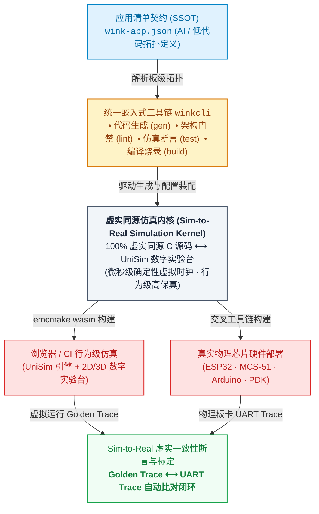
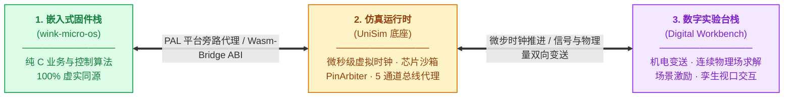
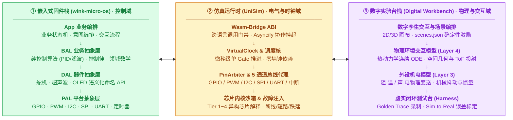

# WinkMicroOS

**软件 AI 已经会写、会跑、会自愈；嵌入式 AI 会写代码，却没人敢让它上产线——因为固件必须烧进芯片、由人按键才能验证。**

WinkMicroOS 是闭合这个环的确定性数字实验室：同一份 C 源码在浏览器 Wasm 沙盒与真实 MCU 上运行——从 ESP32 一直到超低成本的 8 位工业芯片——每次运行都留下可审查的 PASS 证据链。*为 Agent 而建，不只为人类。*

[](https://github.com/wink-cloud-hub/wink-ai-embedded/actions/workflows/pr.yml)
[](https://github.com/wink-cloud-hub/wink-ai-embedded/actions/workflows/nightly.yml)
[](https://github.com/wink-cloud-hub/wink-ai-embedded/actions/workflows/license-gate.yml)
[](https://github.com/wink-cloud-hub/wink-ai-embedded/releases/latest)
[](./.github/license-map.json)


[English](./README.md) | **简体中文**
&nbsp;·&nbsp; [▶ 在线试玩](http://www.wink-ai.com/simulator/index.html) &nbsp;·&nbsp; [5 分钟上手](./docs/zh/design/00-quick-start/01-5min-getting-started.md) &nbsp;·&nbsp; [文档中心](./docs/zh/README.md) &nbsp;·&nbsp; [路线图](./docs/zh/design/01-system-overall/02-mvp-roadmap.md)

**状态：**  已发布 · 公共 CI 绿色 · host 测试可执行（见 [`wink-micro-os/TESTING.md`](./wink-micro-os/TESTING.md)）

<!-- TODO(素材)：补充 15 秒首屏 GIF（导入仓库 → 运行 button-led 场景 → 按下虚拟按键 → LED 点亮 + 实时波形）。 -->

---

## 破除嵌入式研发的开环困境

纯软件领域的 AI 编程早已实现自动化闭环；嵌入式研发却长期受制于物理硬件在环，始终处于开环状态：

```text
纯软件 —— 已闭环
  生成 → 运行 → 测试 → 修复 → ↻

嵌入式现状 —— 开环（人在回路中央）
  生成 ─▶ [人：烧录] ─▶ [人：按键] ─▶ [人：观测示波器] ─▶ [人：提取日志反馈] ─▶ ↻

"自动化" 台架 —— 仍是开环（伪闭环）
  生成 → 自动烧录 → 逻辑分析仪 → [人：解读、决策] ─▶ ↻

WinkMicroOS —— 闭环
  生成 → 硬件即代码（设备树 + 场景 JSON）
       → 确定性运行（host / wasm）
       → 结构化 trace + PASS 证据链
       → 修复 → ↻
```

自动化烧录与抓取波形，仅实现了“局部测试工具”的自动化，而非“系统工程环路”的闭环：物理硬件依然依赖人工按键干预、硬件改线与边缘工况复现。唯有当硬件本身全面抽象为代码（Hardware-as-Code）——具备微秒级确定性、随机种子可控、完全可脚本化且不受物理时间约束——研发闭环方能真正成立。

这是 WinkMicroOS 的设计前提。

## 为什么选择 WinkMicroOS

- **真正的产业主力在低成本芯片。** Wokwi、QEMU 等方案服务的是 ARM/RISC-V 开发板；而工业出货主力是没有 SWD/JTAG、没有平价 ICE 的 8/16 位芯片（STC、中微、应广、合泰、松翰……），异常排障常沦为低效的盲调。WinkMicroOS 提供指令级仿真：断点、寄存器、堆栈，均可在浏览器与无头环境中精准观测。
- **同一份源码，处处运行。** 一份 C 代码可编译到 `host`（测试）、`wasm32`（浏览器 / 无头仿真）与 `targets/esp32`；未修改的 Keil C51 源码（[ADR-0075](./docs/decisions/core/0075-mcs51-production-wasm-target-headless.md)）与 Arduino Sketch（[ADR-0035](./docs/decisions/core/0035-arduino-compat-polymorphism-sandbox.md)）无需移植层即可直接仿真。
- **确定性是设计前提。** 虚拟时钟推进、固定随机种子、自带断言的无头场景脚本。失败具备确定性可复现性——彻底消除物理环境与时钟抖动带来的非确定性隐患。
- **硬件即代码。** 板级拓扑存 JSON（`wink-app.json` + 板卡注册表），测试激励存场景 JSON。没有面包板、没有杜邦线，天然适配 CI。
- **可分享的行为，而不是示波器截图。** 一次运行即可生成可分享的在线仿真会话——跨职能团队可在浏览器中直观检验真实器件行为与交互节拍，告别晦涩静态的示波器截图。
- **破坏性工况确定性注入。** 掉电跌落、传感器断线、电机堵转、干烧过热：极端与破坏性故障零硬件损坏风险注入，支持微秒级精准重放。
- **可交付的证据链。** 每次运行都产出结构化、可回放的 PASS/FAIL 记录与确定性 trace（`SimTraceSpec`，`traceVersion: 1`）——AI 生成的固件无需完全依赖逐行人工通读，依托确定性 PASS 证据链即可高置信度合并。
- **为 AI Agent 而设计。** 研发闭环中的每一份输入输出都是文本，并提供面向机器阅读的约定（[AGENTS.md](./AGENTS.md)）——Agent 可以生成驱动、运行场景、读取结构化失败并自我修正。

## 为 Agent 而建，不只为人类

现有仿真器都是好工具——为坐在键盘前的人而设计。Agent 需要的是另一组属性：一切皆文本、默认无头、确定性、产出结构化证据。

| 工具 | 擅长 | 为什么闭不上 Agent 的环 |
|---|---|---|
| Proteus | 电路级 SPICE 仿真，教学经典 | 桌面重型、授权昂贵；芯片库停留在传统 51/AVR/PIC；无机器可读的证据输出 |
| Wokwi | Web 端 Arduino/ESP32 模拟器，体验优秀 | 面向创客教育；缺乏工业级测试框架；对年出货百亿计的低成本工业芯片空白 |
| QEMU | 开源指令级 / 系统级虚拟化 | 为操作系统级目标而建，不适配 MCU 微秒级外设时序；接入固件 CI 环路过重 |
| Renode | 多节点物联网系统仿真（Cortex-M / RISC-V） | 能力强但工作流重；面向高端 32 位场景，不覆盖超低成本的 8 位生态 |

WinkMicroOS 并非传统桌面工具的渐进式修补，而是面向全新研发主体（AI Agent）构建的原生基础设施：硬件即代码、确定性场景、结构化证据链——全链路文本化定义，全流程可编程自动化编排。

> **工程能力边界界定**：数字仿真并不替代物理真机，而是将系统研发风险最大程度左移。极端电气特性、EMC、高精度热动力学与物理磨损仍须物理真机最终把关——平台的目标是将物理真机调试从漫长繁重的“前期试错”收敛为可控的“出厂终验”。

## 完整研发闭环演练

### 1 · 描述硬件

```json
// wink-micro-app/mcs51_button_led/wink-app.json
{
  "app_name": "mcs51_button_led",
  "board": "stc89c52_devboard",
  "mcu": "at89c52",
  "devices": {
    "btn": { "type": "button", "gpio_pin": 26, "active_low": true },
    "led": { "type": "led",    "gpio_pin": 8,  "active_high": false }
  }
}
```

### 2 · 编写逻辑 —— 原厂源码零修改，或使用 WinkMicroOS API

未修改的 Keil C51 源码，直接来自原厂 IDE —— `sbit`、SFR 全部原样（构建期转译生成仿真产物，原始文件从不被改动）：

```c
// wink-micro-app/mcs51_button_led/button_led.c  (SPDX: Apache-2.0)
#include <wink_mcu.h>

sbit KEY = P3^2;    /* push button on P3.2 / INT0, active-low */
sbit LED = P1^0;    /* LED on P1.0, low-drive-on */

void main(void) {
    LED = 1;
    while (1) {
        LED = (KEY == 0) ? 0 : 1;
        _nop_();    /* microstep / cooperative yield point */
    }
}
```

亦可采用 WinkMicroOS 现代事件驱动风格，在 host、Wasm 与 ESP32 上实现行为级完全同源：

```c
// wink-micro-app/avoidance_car/app_callbacks.c  (SPDX: Apache-2.0)
static void app_on_event(const wink_event_t *evt)
{
    if (evt->device != &front_radar || evt->type != WINK_EVENT_DISTANCE_READY) {
        return;
    }
    float cm = (float)evt->param / 10.0f;
    neck_servo_set_angle(cm < 20.0f ? 1800 : 900);  /* 0.1° units */
}
```

### 3 · 无头验证

场景是确定性的、自带断言，且无需浏览器（[SimTraceSpec](./docs/zh/design/04-wasm-simulation/00-README.md)）：

```json
// wink-micro-app/mcs51_button_led/unisim-scenarios/button-led.scenario.json (excerpt)
{
  "header": { "accuracyMode": "behavioral", "failurePolicy": "fail-fast",
              "determinism": { "prngSeed": 42 } },
  "steps": [
    { "type": "INPUT_PLUGIN_EVENT", "timeUs": "200ms", "targetPluginId": "btn",
      "action": "SET_PRESSED", "params": { "pressed": true } },
    { "type": "ASSERT_POINT", "timeUs": "800ms", "target": "plugin:led/on", "matcher": true },
    { "type": "ASSERT_POINT", "timeUs": "800ms", "target": "gpio:8", "matcher": 0 }
  ]
}
```

在本地开发环境仅需一条命令即可完成同等验证——无需连接物理硬件，亦无需启动浏览器：

```console
$ winkcli test                            # host 构建 + 全量测试（截至 2026-07 共 35 个可执行）
[PASS] All tests passed
```

## 支持的目标平台

板卡定义是硬件的单一事实来源（SSOT）：[`wink-tools/tools/codegen/boards/`](./wink-tools/tools/codegen/boards/README.md)。

| 芯片家族 | 注册表开发板 | 仿真分级 | 上游兼容性 |
|---|---|---|---|
| ESP32（Xtensa） | `esp32_devkitc_v4` | Tier 1 —— 全功能 Wasm 运行时，含调度器与多任务 | WinkMicroOS 原生应用（BAL / DAL） |
| MCS-51 / 8051 | `stc89c52_devboard`、`cms8s78xx_devboard` | Tier 2 —— 指令拦截 + SFR 虚拟网关 | **未修改的 Keil C51 源码**（`sbit`、`REGX52.H`、原厂 SFR） |
| AVR | `arduino_uno_r3` | Arduino 兼容层 | **未修改的 Arduino Sketch**（`Serial`、`String`、`millis`） |
| 应广 PDK | `padauk_pfs154_devboard` | Tier 3 —— 1:1 指令集虚拟机 | 原厂 PDK 源码（[ADR-0064](./docs/decisions/unisim/0064-chip-simulation-four-tier-taxonomy.md)） |

## 系统架构

平台围绕**“虚实同源仿真内核 (Sim-to-Real Simulation Kernel)”**构建。为了让 AI 生成的固件安全可靠地跨越虚实边界，系统从**宏观研发交付流水线**与**微观三栈协同架构**两个维度构建了完整的确定性闭环体系。

### 1 · 宏观研发与交付闭环 (Macro Workflow)

平台以单一事实源 `wink-app.json` 为起点，由统一工具链 `winkcli` 驱动代码生成、分层门禁检测与双端同源编译，最终通过虚实 Trace 回传完成自动比对与模型标定：



### 2 · 微观运行时体系：三栈协同与因果闭环

为了兼顾微观执行的高保真度与系统工程的清晰度，核心运行时正交解耦为**三大技术栈**。各栈内部职责高度内聚，通过标准抽象接口紧密协同互锁，构成完整的确定性因果闭环：



#### 2.1 三大核心栈微观架构



#### 2.2 端到端闭环链路：因果驱动与虚实标定

系统通过清晰的因果链串联三栈，消除脱离真实物理规律的开环视效与虚假仿真：

1. **控制下发（左 ➔ 中 ➔ 右）**：固件 App 经 BAL/DAL 在 PAL 输出控制信号 ➔ UniSim 的 PinArbiter 与总线路由捕获电气事件 ➔ 数字实验台外设模型将电平/PWM 变送为机械动力或热功率，驱动物理环境微分方程积分演化。
2. **环境感知（右 ➔ 中 ➔ 左）**：物理环境计算出下一微步状态量（位移/水温/声波飞行时间）➔ 外设变送器将物理量折算为连续电压/阻值 ➔ UniSim 注入 ADC 原值或边沿中断 ➔ 固件 PAL 采样捕获，驱动业务状态机闭环迭代。
3. **Sim-to-Real 闭环标定**：同一套固件源码既可在浏览器中与 UniSim 协同输出高保真 `Golden Trace`，亦可直接烧录真机 MCU（ESP32/MCS-51）并回传 `UART Trace`。通过虚实 Trace 自动对齐比对，反向标定实验台的物理模型参数，使数字孪生持续逼近真实世界。

### 3 · 架构核心支柱

1. **统一中枢驱动（SSOT）**：单一事实源 `wink-app.json` 定义硬件拓扑与配置，`winkcli` 全程驱动 C 代码生成、分层 Lint 门禁、无头测试与固件构建。
2. **虚实同源仿真内核（Sim-to-Real Simulation Kernel）**：
   由三大技术栈精密协同构成：
   * **嵌入式固件栈**（`App ➔ BAL ➔ DAL ➔ PAL`）：100% 虚实同源 C 代码，编译期静态分发，运行期零动态分配，确定性时序控制。
   * **仿真运行时**（`ABI ➔ 虚拟时钟 ➔ 总线通道 ➔ 芯片沙箱`）：微秒级确定性电气底座，零墙钟依赖，无业务物理残留。
   * **数字实验台栈**（`孪生交互 ➔ 物理环境 ➔ 机电变送`）：连续物理法则积分求解与自动化测试台架，杜绝脱离物理法则的无反馈假动画。
3. **闭环双端交付（Sim-to-Real）**：同一套业务源码，既可一键导出 WebAssembly 在浏览器与无头 CI 中零硬件成本验证与故障注入，亦可无修改直烧真实 MCU 开发板，并通过 UART Trace 回传完成实测标定。

## 仓库布局

| 路径 | 内容 | 许可 |
|---|---|---|
| [`wink-micro-os/`](./wink-micro-os/) | C 运行时：PAL / DAL / BAL、runtime、trace、targets（`host`、`wasm`、`esp32`）、MCS-51 框架、host 测试套件 | **LGPL-3.0-only**（以库形式链接进你的固件——固件可保持闭源） |
| [`wink-micro-app/`](./wink-micro-app/) | 示例与回归应用（MCS-51、PDK、Arduino、ESP32），各自包含设备树、场景与预编译 Wasm | Apache-2.0 |
| [`wink-firmware-carriers/`](./wink-firmware-carriers/) | 可烧录的固件载体工程（ESP-IDF） | LGPL-3.0-only |
| [`wink-tools/tools/codegen/boards/`](./wink-tools/tools/codegen/boards/) | 板卡注册表 —— 硬件单一事实来源（供 WinkCli 工具链消费） | Apache-2.0 |
| [`wink-plugin-peripherals/`](./wink-plugin-peripherals/) | 仿真外设插件（TypeScript）：超声波、WS2812…… | GPL-3.0-only |
| [`docs/`](./docs/README.md) | 双语 SSOT 设计规范、ADR、技术方案、计划与评审 | GPL-3.0-only |

## 设计准则

| 准则 | 原因 | 依据 |
|---|---|---|
| 负数错误码：`0` = 成功，`< 0` = 错误 | 各层统一的失败处理语义 | [ADR-0001](./docs/decisions/core/0001-error-code-sign-convention.md) |
| 编译期静态分发（POD + 命名 API，无虚表 / `container_of`） | 8 位 MCU 上可预期的代码体积与栈开销 | [ADR-0004](./docs/decisions/core/0004-static-dispatch-vs-runtime-ops.md) |
| 双 target 同源编译：wasm32 + xtensa 共用一份 C 代码 | 仿真行为必须等于真实行为 | [ADR-0002](./docs/decisions/unisim/0002-dual-target-compilation.md) |
| 禁止动态分配；协作式循环执行模型 | 无堆碎片，小芯片上内存有界 | [ADR-0007](./docs/decisions/core/0007-cooperative-loop-execution-model.md) |
| PWM 占空比使用定点（`PAL_PWM_DUTY_PCT/PERMILLE`），占空比禁浮点 | 确定、单位安全的执行器控制 | [ADR-0066](./docs/decisions/core/0066-pwm-basis-points-and-float-deprecation.md) |
| 分层与 API 形态由 YAML 规则在 CI 强制 | 保持 App/BAL/DAL/PAL 边界不腐化 | [ADR-0043](./docs/decisions/tools/0043-yaml-layer-lint.md) |

## 快速开始

> 💡 **新手入门推荐**：本节提供精炼的核心操作流程；更详细的端到端分步教程、典型场景演示与排障指引，请参阅 [**《5 分钟上手指南》**](./docs/zh/design/00-quick-start/01-5min-getting-started.md)。

### 1 · 零安装 —— 在浏览器里跑一个演示

1. 打开在线仿真器：**<http://www.wink-ai.com/simulator/index.html>**
2. clone到本地,再导入本仓库
3. 运行 `button-led` 场景，按下虚拟按键，观察 LED 与实时引脚波形

### 2 · 安装 WinkCli（一次性）

下文所有构建 / 仿真 / 烧录命令均由 **WinkCli**（WinkMicroOS 工具链）驱动。安装一次即可：

```powershell
# 方式一 - winget（Windows 推荐）
winget install WinkAI.WinkCli

# 方式二 - GitHub Releases（离线 / 免包管理器）：
#   从 https://github.com/wink-cloud-hub/wink-ai-embedded/releases
#   下载 winkcli-v<version>-windows-x86_64.zip，解压后将 winkcli.exe 加入 PATH
```

> 完整安装与环境指引：[`wink-tools/docs/zh/00-install.md`](./wink-tools/docs/zh/00-install.md)。

### 3 · 本机构建与测试 —— 无需任何硬件

```bash
git clone https://github.com/wink-cloud-hub/wink-ai-embedded.git
cd wink-ai-embedded
winkcli test            # 日常门禁：host 构建 + 全量测试
winkcli test --clean    # 怀疑 CMake / 缓存污染时全量重建
```

> 底层即纯 CMake + CTest：`cmake -B build-host -DTARGET_PLATFORM=host && cmake --build build-host && ctest --test-dir build-host --output-on-failure`。
> 测试梯队、保真度保证与 MSVC 第二编译链：[`wink-micro-os/TESTING.md`](./wink-micro-os/TESTING.md)。

### 4 · 真机 —— 烧录 ESP32

```powershell
winkcli esp32 --app devkitc_smoke                       # 构建
winkcli esp32 --app devkitc_smoke -- -p COM3 flash monitor
```

> 需要经 Espressif IDE Manager 安装 ESP-IDF v6.x。详见 [`wink-firmware-carriers/esp32/README.zh_CN.md`](./wink-firmware-carriers/esp32/README.zh_CN.md)。

## 为 AI-in-the-loop 研发而设计

- **硬件可被机器读取**：设备树与板卡注册表是 JSON Schema，而不是原理图 PDF。
- **确定性激励**：场景脚本可注入按键弹跳、时序竞争、传感器断线与故障工况——固定种子、可回放。
- **结构化失败与证据**：故障码 + 环形 trace 缓冲（`SimTraceSpec`，`traceVersion: 1`）直接指向根因，且每次运行均产出结构化可回放的 PASS/FAIL 证据链——彻底告别传统实物黑盒调试排障困难与难以复现的硬件损坏。
- **内置 Agent 指南**：[`AGENTS.md`](./AGENTS.md) 与 [`.agents/skills/`](./.agents/skills/) 描述了仓库约定、质量门禁与安全编辑规则，供 AI 编码助手遵循。

<!-- TODO: 若后续推出公开的 MCP Server 或 Agent CLI，在此补充"接入你的 Agent"代码段。不要承诺尚未交付的集成能力。 -->

## 文档导航

| 入口 | 内容 |
|---|---|
| [全局文档中心](./docs/README.md) | 文档拓扑、治理规范、CLI 查询工具 |
| [简体中文](./docs/zh/README.md) · [English](./docs/en/README.md) | 双语 SSOT（01–07 设计规范） |
| [Wasm 仿真（UniSim）](./docs/zh/design/04-wasm-simulation/00-README.md) | 仿真机制、保真度轴、保障体系 |
| [架构决策（ADR）](./docs/decisions/) | 按领域组织的决策记录 |
| [实施计划](./docs/implementation-plans/) · [评审记录](./docs/reviews/) | 执行流与验证记录 |

## 路线图

- 跨平台 winkcli 分发（Linux / macOS 二进制），让公共 CI 端到端构建固件
- 扩展 8/16 位芯片覆盖（更多应广 / 合泰 / 松翰型号）与板卡注册表
- 场景库扩充：故障注入、总线时序竞争、长时浸泡测试

当前里程碑与范围：[`docs/zh/design/01-system-overall/02-mvp-roadmap.md`](./docs/zh/design/01-system-overall/02-mvp-roadmap.md)。

## 贡献

欢迎贡献。除小修复外，请先开 Issue 对齐设计。初次参与贡献可从 `good first issue` 标签入手，或先尝试新增一个板卡定义 / 器件驱动（位于 `wink-micro-app/`）。

若使用 AI 编码助手（如 Claude Code / Antigravity），请引导其在编码前优先阅读 [`AGENTS.md`](./AGENTS.md) 遵循仓库架构准则与质量门禁。

<!-- TODO(P2): 补充 CONTRIBUTING.md、CODE_OF_CONDUCT.md、SECURITY.md 与 Issue 模板。 -->

## 开源许可

分层许可（License Map）——运行时为 **LGPL-3.0-only**（你的固件可以保持闭源）；平台与文档默认 **GPL-3.0-only**：

| 范围 | 许可 |
|---|---|
| `wink-micro-os/**` 运行时（pal / dal / bal / runtime / trace / osal / targets / frameworks） | LGPL-3.0-only |
| `wink-micro-os/codegen/**`（驱动 / 角色描述与模板，生成物归用户） | Apache-2.0 |
| `wink-micro-app/**` 示例 · `wink-tools/tools/codegen/boards/**` | Apache-2.0 |
| `wink-firmware-carriers/**` | LGPL-3.0-only |
| `wink-tools/**`（其余） · `wink-plugin-peripherals/**` · 平台与文档 | GPL-3.0-only |
| `wink-micro-os/third_party/**`（ArduinoCore-API、Unity） | LGPL-2.1-or-later / MIT |

单一事实来源：[`.github/license-map.json`](./.github/license-map.json)，由 CI 强制校验。第三方组件归属：[`wink-micro-os/NOTICE`](./wink-micro-os/NOTICE)。
