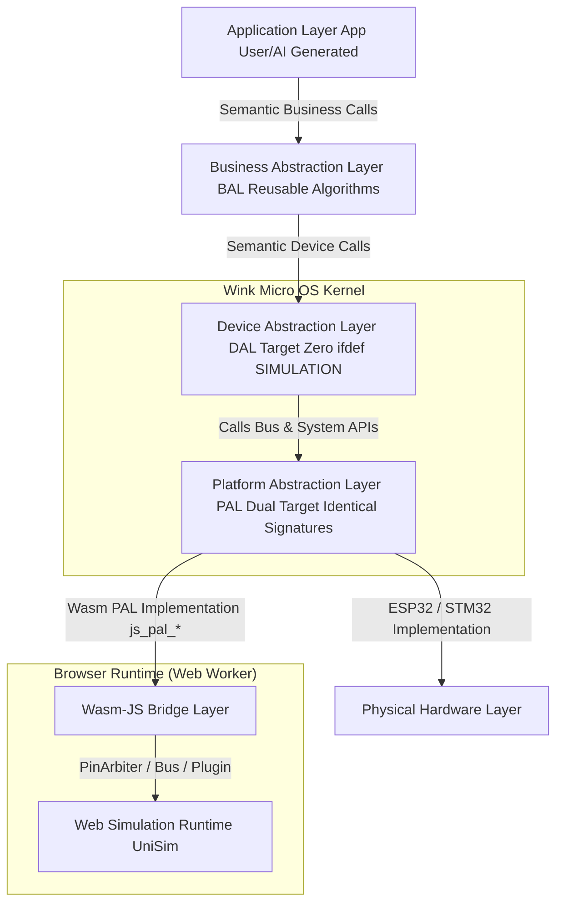

# 3.1 Device Abstraction Layer (DAL) Architecture Design Specification & Device Tree Codegen

<!-- i18n-meta
source: docs/zh/design/02-wink-micro-os/01-dal-device-abstraction.md
translated: 2026-08-17
glossary-version: v1.0
translator: AI-assisted
sync-status: up-to-date
-->

| Item | Content |
|---|---|
| **Code-Mapping (In-Repo)** | `/src/core/dal/` (`dal_gpio.h`, `dal_i2c.h`, `dal_sensor.h`) |
| **Associated ADRs** | ADR-0004, **ADR-0003**, ADR-0040, ADR-0046, ADR-0048, ADR-0050, **ADR-0051**, ADR-0056 |
| **Associated Technical Designs** | [user-surface-insulation-design.md](../../tech-designs/tools/2026-07-28-user-surface-insulation-design.md); [scannable-codegen-extension-roots-design.md](../../tech-designs/tools/2026-07-28-scannable-codegen-extension-roots-design.md) |
| **Simulation Routing Spec** | [04-wasm-simulation/03-multi-channel-sim-routing.md](../04-wasm-simulation/archive/03-multi-channel-sim-routing.md) (4-Channel PAL Bypass; DAL Target Zero Simulation Macros) |
| **Associated Implementation Plans** | [user-surface-phase1-plan.md](../../implementation-plans/frontend/2026-07-28-user-surface-phase1-plan.md) |
| **Associated Reviews** | [dal-control-semantic-completeness-review §10](../../reviews/core/2026-07-28-dal-control-semantic-completeness-review.md); [user-surface-phase1-plan-review.md](../../reviews/frontend/2026-07-28-user-surface-phase1-plan-review.md) |
| **Practical Summary** | [`dal-best-practices.md`](../../../wink-micro-os/docs/dal-development-guide/dal-best-practices.md) |

The Device Abstraction Layer (DAL, Device Abstraction Layer / Business Peripheral Layer) is a core distinctive component of the WinkMicroOS kernel. It acts as an intermediary, providing high-level semantic business interfaces to the Application Layer (App) and Business Abstraction Layer (BAL), while providing peripheral driver encapsulations over the underlying Platform Abstraction Layer (PAL).

> **Terminology Clarification**:
> - ✅ **App Layer**: User code or AI-generated one-off business logic (such as an obstacle-avoidance robot state machine).
> - ✅ **BAL Layer**: Business Abstraction Layer, containing physical augmentations, pure math algorithms, and closed-loop control (kernel static library `wink-micro-os/bal/`).
> - Both App and BAL interact exclusively with DAL interfaces, never manipulating raw hardware directly.

> **DAL Development Manual**: [`wink-micro-os/docs/dal-development-guide/`](../../../wink-micro-os/docs/dal-development-guide/README.md) (Quick Start / Adding Peripherals / Best Practices).  
> **Adding Peripherals (ADR-0046 Mechanism + ADR-0051 Path)**:  
> - **Retained Mechanism** (ADR-0046): Single registry, `list_drivers` data-driven CMake, `--mode=source|defs`, prohibition of manual edits across multiple driver tables.  
> - **SSOT Path (ADR-0051 Accepted)**: Default machine-readable descriptors in open-source extension root `wink-micro-os/codegen/` (`drivers/*.yaml` + `roles/*.yaml`); `wink-tools` acts as closed-source/engine (scan, validate, sandbox render, emit). Scan order: **Built-in → OS → env (CMake cache `WINK_CODEGEN_PATHS`) → App** (App has highest priority). Legacy `tools/codegen/drivers/*.py` can be dual-read during migration.  
> - Standard procedure documented in [`adding-peripheral.md`](../../../wink-micro-os/docs/dal-development-guide/adding-peripheral.md). Decisions: [ADR-0051](../../decisions/tools/0051-scannable-codegen-extension-roots.md), [ADR-0046](../../decisions/core/0046-dal-driver-registry-ssot.md); Design: [scannable-codegen-extension-roots-design](../../tech-designs/tools/2026-07-28-scannable-codegen-extension-roots-design.md).

---

## 1. Core Vision & Design Rationale

Exposing low-level hardware buses (GPIO, I2C, SPI, PWM) directly to high-level business logic introduces three fatal flaws:
1. **Excessive Developer Cognitive Load**: Low-code users or AI auto-generators must understand register read/write timings (e.g., HC-SR04 ultrasonic 10us high-level Trig pulse, DHT11 microsecond 1-wire handshakes), leading to timing-induced system crashes.
2. **Web Simulation Performance Nightmare**: Simulating microsecond GPIO transitions or I2C SCL clock edges cycle-by-cycle inside browser Wasm causes extreme Wasm-JS bridge call overhead, leading to browser stutter or freezes.
3. **Poor Hardware Portability**: Physical bus assignments vary across development boards (e.g., servo connected to PWM channel 0 vs channel 2). Exposing pin numbers and bus details to business logic breaks portability across target boards.

To resolve these issues, Wink-AI introduces the **Device Abstraction Layer (DAL)** between business logic (App/BAL) and PAL, enforcing:

1. **Business Semantic Interfaces**: Treating peripherals as logical components (distance in cm, angle in °, framebuffer), abstracting away register and timing complexities.
2. **Physical Quantity Source Replacement (Non-Business Bypass)**: Simulation performance optimization is contained entirely within **PAL / Wasm target**; DAL executes identical driver logic on simulation and hardware, replacing only the **source of physical quantities** (signal levels, pulse widths, I2C slave responses, ADC raw values, payload buffers; see [ADR-0003](../../decisions/unisim/0003-simulation-fidelity-boundary.md), [03-multi-channel-sim-routing](../04-wasm-simulation/archive/03-multi-channel-sim-routing.md)).

---

## 2. Overall Layered Architecture

The layered position and data flow of DAL are illustrated below:



---

### 2.1 Paradigm Differences & Capability Mapping vs Classic ops/container_of 4-Layer Architecture

> This section clarifies DAL's design paradigm. The core mechanism of classic embedded OOP 4-layer architecture (see skill reference baseline [`runtime-polymorphism/architecture.md`](../../../.claude/skills/c-runtime-polymorphism-reading/references/runtime-polymorphism/architecture.md)) is **ops table polymorphic dispatch (`me->ops->on(me)`) + `container_of` subclass inference**. DAL **deliberately diverges from this paradigm**, declared here to prevent implementer misjudgments.
>
> Relevant Decision: **[ADR-0004: Compile-Time Static Dispatch vs Runtime Ops Polymorphism Selection](../../decisions/core/0004-static-dispatch-vs-runtime-ops.md)**.
> Related Context: [Review Report §2.1](../../reviews/core/2026-06-22-architecture-review.md), [`01-system-overall/01-system-overview.md §3.1`](../01-system-overall/01-system-overview.md) mapping table.

#### 1. Paradigm Comparison

*   **DAL Paradigm Choices**:
    *   DAL device structs (e.g., `dal_ultrasonic_t`) are **pure Plain Old Data (POD) structures**, with **no `ops` pointers, no `vptr`, and no `dal_base` parent class**.
    *   Functions like `dal_ultrasonic_read` are **type-specific statically dispatched free functions**, taking an instance pointer as the first argument to invoke lower layers directly.
    *   Polymorphism is achieved via **compile-time CMake routing + independent `.c` per device**, rather than runtime ops table lookups.
    *   PAL layer similarly uses CMake static binding (see [`02-pal-platform-abstraction.md §1`](./02-pal-platform-abstraction.md)), avoiding runtime function pointer registration.
    *   **POD Represents In-Memory State, Not Wire/Flash Layout (Review P1-5 / Phase 6 Task 6-1)**: Forbids `__attribute__((packed))` / `#pragma pack` (uses natural alignment to avoid ARM/Xtensa unaligned access faults); members ordered descending by alignment; cross-process wire/flash structures must be independently named (`xxx_wire_t` / `xxx_flash_record_t`, with version/endianness/CRC), **prohibiting `memcpy` from runtime POD directly to wire/flash**, requiring explicit serialize/deserialize. See [`.claude/rules/c-code.md §4`](../../../.claude/rules/c-code.md).

*   **Why Runtime Ops Polymorphism was Abandoned**:
    1.  **AI Generability**: Named APIs (`dal_ultrasonic_read`) are more intuitive than `me->ops->read(me)`, easier for AI to generate deterministically, and simpler to validate with static analyzers and compilers for pointer safety.
    2.  **Simulation Performance**: Static dispatch eliminates `call_indirect` jump overhead in Wasm, reducing frequency and cost of Wasm-to-JS bridge invocations.
    3.  **MVP Single-Implementation Premise**: Peripheral topology is fully determined at compile time, eliminating the need to hot-swap drivers dynamically at runtime.

---

#### 2. Capability Mapping & Compensation for the 3 Classic OOP Benefits

One might ask: Does discarding runtime polymorphism forfeit its 3 classic benefits—"hardware shielding", "unified container management", and "dynamic hot-swapping"?
Answer: **We achieve equivalent compensation on the toolchain side via compile-time codegen, or define them as Non-goals.**

| Classic Benefit of Runtime Polymorphism | Platform Compensation & Design (Static Dispatch + Codegen) | Truly Lost? |
| :--- | :--- | :--- |
| **1. Hardware Shielding (Open-Closed Principle OCP)** | **Codegen Device Tree Binding**: When hardware pins or buses change, business code `dal_led_on(&front_led)` **requires zero changes**. Adjustments happen in the visual low-code editor, where Codegen regenerates global POD instances in `device_tree.c`. Platform porting switches linked `targets/` via CMake. | **Not lost**; converted from runtime jumps to compile-time bindings. |
| **2. Unified Container Lifecycle Management** | **Codegen Static Unrolling**: Instead of iterating dynamic pointer arrays with `for` loops, Codegen generates flat, explicit sequential calls in `device_tree.c` (e.g., generating `device_tree_init()` to initialize all devices). This yields **zero heap overhead, absolute static safety, and outstanding breakpoint debugging**. | **Lost at runtime, fully compensated by Codegen static expansion**. |
| **3. Runtime Dynamic Driver Replacement & Hot-Plugging** | **Defined as Non-Goal**: Peripherals in this low-code system (servos, sensors) are permanently wired upon hardware assembly; runtime hot-plugging of driver instances is not required. | **Completely discarded**, in favorable exchange for lower RAM footprint and higher AI generation success. |

> **Evolution Path & Driver Variant Compatibility Strategy**:
> The same logical device (e.g., DC motor) may be driven by different chips/modules (H-bridge L298N, TB6612, DRV8833, or I2C smart drivers). Upper layers must maintain uniform semantics. Handling strategies:
>
> 1. **Mechanism 1 — Uniform Semantics + Topology Enum (Identical Electrical Class)**: Similar control principles (brushed H-bridge) merge into a single DAL (e.g., `dal_dc_motor`). Config treats **family variants** as first-class citizens (field name standardized to **`variant`**: default **`in_in`** [PWM + IN_A + IN_B]; **reserved** `phase_enable` / `pwm_on_in`), with optional `enable_pin` (STBY/nSLEEP). Chip names serve only as JSON/board-level aliases mapped to `variant` by codegen; **prohibiting** `WINK_USE_L298N` style per-chip conditional compilation. `WINK_USE_DC_MOTOR` strips the **entire** driver class; if stripping `.text` per variant is required (Wave B), wrap `case DAL_DC_MOTOR_VARIANT_PWM_ON_IN` in capability macros (e.g., `WINK_DC_MOTOR_HAS_PWM_ON_IN`), populated via `-D` by codegen based on App JSON union (full builds default `HAS_*=1`). Default relies on runtime `switch` without pruning. See [`dal-best-practices.md §3.3`](../../../wink-micro-os/docs/dal-development-guide/dal-best-practices.md).
> 2. **Mechanism 2 — Independent DAL + Compile-Time Aliasing (Different Buses/Semantics)**: Fundamentally different interfaces (GPIO H-bridge vs I2C registers vs UART ESC) split into independent `dal_*` drivers with individual `WINK_USE_*` flags. Codegen binds identical business names via macros in `device_tree.h`:
>    ```c
>    #define left_motor_set_speed(spd)  dal_dc_motor_set_speed(&left_motor, spd)
>    /* Or bound to other semantic API types */
>    ```
> This avoids vtables while remaining hardware-transparent to App and AI. If runtime chip probing is required, route locally **inside that DAL `.c`**, **without breaking** upper static naming contracts.

---

## 3. DAL API Design Patterns

The DAL layer consists of two primary elements:
1. **High-Abstraction C Logical Handle Structs**: Defining logical properties and runtime caches without coupling to physical pin numbers.
2. **Bus-Agnostic Business Semantic Functions**: Exposing only physical-world data interfaces.

### 3.0 DAL API Stability Contract (ADR-0015 / ADR-0017)

All DAL drivers must adhere to two hard contracts:

**Contract A · Init Must Claim Physical Resources (ADR-0009 Implementation Loop)**

Every `dal_xxx_init(dev, cfg)` **must** register all hardware resources it consumes (GPIO pins, PWM channels, I2C addresses, UART ports) with `pal_resource_claim` following argument validation; otherwise `pal_resource` becomes an empty shell—pin mux conflicts remain hidden during host/wasm unit testing and only surface as electrical conflicts on physical hardware.

Rules:
- Multi-resource claims must attempt acquisition in sequence; if any step fails, **previously claimed resources must be rolled back** (e.g., `dal_ultrasonic_init` claims trig + echo: failure on echo must release trig).
- Claim failure (`WINK_ERR_BUSY` / `WINK_ERR_RESOURCE_EXHAUSTED`) **passes through the return code directly**, leaving `dev.state` untouched so upper callers receive the explicit error code. **For error semantics / recovery strategies / `WINK_PT_EXIT` conditions**: see [Error Model Spec §11](../07-platform-governance/02-error-fault-model.md#11-ai-codegen-错误码语义详表) (SSOT).
- Owner string uses `__func__` or `"dal_xxx"` constants (rodata read-only, lifecycle covers entire process).
- Detailed rollout tracking in `PLAN-20260701-WMOS-CODE-OPTIMIZATION-Q3` Track A (M1).

**Contract B · Hard Isolation of Blocking APIs (ADR-0017 3-Tier Protection)**

APIs violating ADR-0007 cooperative execution contracts (single invocation busy-waits > 1 runtime tick / hardware polling without active yields) **must** mount 3 simultaneous layers of protection:

1. **Compile-Time Attribute**: `WINK_BLOCKING` triggers `-Wdeprecated` compiler warnings (across GCC/Clang/MSVC branches);
2. **Symbol-Level Stripping**: Declarations and implementations are enclosed in `#ifndef WINK_STRICT_NONBLOCKING`; under cooperative scheduling builds, declarations disappear from headers, producing linker undefined reference errors on misuse;
3. **Runtime Detection** (Cooperative Scheduler Phase T5): `WINK_ASSERT_NONBLOCKING()` interceptor macro triggers panic + trace fault in protothread contexts.

First application point: `dal_ultrasonic_read` (worst-case ≈60ms busy-wait). Future slow sensors (DHT11 / RFID / slow SPI) follow the same pattern.

Red Lines: **Never** attach `WINK_BLOCKING` without `#ifndef` guard (AI Codegen may bypass warnings); **never** provide blocking versions without non-blocking alternatives (`@see` references mandatory).

### 3.1 Ultrasonic Distance Sensor (HC-SR04) Example

#### Header Definition: `dal_ultrasonic.h`
```c
#ifndef DAL_ULTRASONIC_H
#define DAL_ULTRASONIC_H

#include <stdint.h>
#include "wink_status.h"

/**
 * @brief Ultrasonic sensor logical handle
 * Properties are automatically generated into the Device Tree following visual composition
 */
typedef struct {
    uint16_t trig_pin;      // Logical trigger pin
    uint16_t echo_pin;      // Logical echo pin
    float last_distance;    // Cached last successful measurement (Unit: cm)
} dal_ultrasonic_t;

/**
 * @brief Requests non-blocking distance measurement (State machine, recommended API)
 * @note request_measurement + get_cached_distance form IDLE/MEASURING/READY/ERROR
 *       state machine; polled per tick in cooperative main loop via get_cached_distance.
 */
WINK_WARN_UNUSED_RESULT wink_status_t dal_ultrasonic_request_measurement(dal_ultrasonic_t *dev);
WINK_WARN_UNUSED_RESULT wink_status_t dal_ultrasonic_get_cached_distance(const dal_ultrasonic_t *dev, float *distance_cm);

#ifndef WINK_STRICT_NONBLOCKING
/**
 * @brief Reads current obstacle distance (Blocking busy-wait, @deprecated, ADR-0017 3-tier protection point)
 * @deprecated Must not be called in cooperative runtime 10ms ticks; worst-case ≈60ms busy-wait hangs physical WDT.
 *             Use request_measurement + get_cached_distance instead.
 * @note Compiler protection: `WINK_BLOCKING` triggers `-Wdeprecated` warning.
 * @note Linker protection: Under `-DWINK_STRICT_NONBLOCKING=1`, declaration and symbol vanish, causing undefined reference.
 * @note Runtime protection (Cooperative Scheduler T5): PT context calls trigger `WINK_ASSERT_NONBLOCKING()` panic + trace fault.
 */
WINK_BLOCKING WINK_WARN_UNUSED_RESULT
wink_status_t dal_ultrasonic_read(dal_ultrasonic_t *dev, float *distance_cm);
#endif  /* WINK_STRICT_NONBLOCKING */

#endif // DAL_ULTRASONIC_H
```

### 3.2 Analog RC Servo (SG90) Example

#### Header Definition: `dal_rc_servo.h`
```c
#ifndef DAL_RC_SERVO_H
#define DAL_RC_SERVO_H

#include <stdint.h>
#include <stdbool.h>
#include "wink_status.h"

/** @brief Servo PWM clock requirement (DAL semantics; does not reference pal_*, ADR-0034) */
typedef uint8_t dal_rc_servo_clock_requirement_t;
enum {
    DAL_RC_SERVO_CLOCK_AUTO            = 0,
    DAL_RC_SERVO_CLOCK_STABLE_REQUIRED = 1,
};

typedef struct {
    const char                    *owner;
    uint8_t                        pwm_channel;
    uint8_t                        resolution_bits;   /* 0 = AUTO → Platform default 13-bit */
    dal_rc_servo_clock_requirement_t  clock_requirement; /* 0 = AUTO */
    float                          min_pulse_ms;
    float                          max_pulse_ms;
} dal_rc_servo_config_t;

typedef struct {
    dal_rc_servo_config_t config;
    float              current_angle;
    bool               initialized;
} dal_rc_servo_t;

wink_status_t dal_rc_servo_init(dal_rc_servo_t *dev, const dal_rc_servo_config_t *cfg);
wink_status_t dal_rc_servo_set_angle(dal_rc_servo_t *dev, float angle);
wink_status_t dal_rc_servo_safe_off(dal_rc_servo_t *dev);
wink_status_t dal_rc_servo_deinit(dal_rc_servo_t *dev);

#endif // DAL_RC_SERVO_H
```

> **ADR-0034**: When `resolution_bits` / `clock_requirement` are 0, behavior matches standard `pal_pwm_init(ch, 50)` (13-bit + AUTO). DAL headers **must never** expose `pal_*` types; mapped in `dal_rc_servo.c` to `pal_pwm_init_ex`. Flash override wire v1 remains **9 bytes** (channel + min/max pulse), excluding advanced fields.

### 3.3 LED Indicator Example

#### Header Definition: `dal_led.h`
```c
typedef struct {
    uint16_t pin;
    bool active_high;
    bool is_on;
    bool initialized;
} dal_led_t;

wink_status_t dal_led_init(dal_led_t *dev, uint16_t pin, bool active_high);
wink_status_t dal_led_on(dal_led_t *dev);
wink_status_t dal_led_off(dal_led_t *dev);
wink_status_t dal_led_set(dal_led_t *dev, bool on);
wink_status_t dal_led_toggle(dal_led_t *dev);
```

**Simulation Channel**: Channel 1 Pin-Level (see [03-multi-channel-sim-routing](../04-wasm-simulation/archive/03-multi-channel-sim-routing.md)).  
`dal_led` contains **no** `#ifdef SIMULATION`; electrical bypasses reside entirely in `pal_gpio_write` → `js_pal_gpio_write` → `PinArbiter`.

### 3.4 Physical Push Button Example

#### Header Definition: `dal_button.h`
```c
#define DAL_BUTTON_DEBOUNCE_THRESHOLD 3

typedef uint8_t dal_button_pull_t;
enum {
    DAL_BUTTON_PULL_AUTO = 0, /* active_low → UP, otherwise DOWN (default) */
    DAL_BUTTON_PULL_UP   = 1,
    DAL_BUTTON_PULL_DOWN = 2,
    DAL_BUTTON_PULL_NONE = 3,
};

typedef struct {
    const char        *owner;
    uint16_t           pin;
    bool               active_low;
    dal_button_pull_t  pull; /* 0 = AUTO; ADR-0034 */
} dal_button_config_t;

typedef struct {
    dal_button_config_t config;
    bool    stable_pressed;
    bool    last_reported;
    bool    initialized;
    uint8_t debounce_counter;
    /* ... Wave 3/4 event / IRQ fields documented in implementation ... */
} dal_button_t;

wink_status_t dal_button_init(dal_button_t *dev, const dal_button_config_t *cfg);
wink_status_t dal_button_poll(dal_button_t *dev);
wink_status_t dal_button_is_pressed(const dal_button_t *dev, bool *out_pressed);
wink_status_t dal_button_was_pressed(dal_button_t *dev, bool *out_was_pressed);
```

**Simulation Channel**: Channel 1 Pin-Level. Debounce logic is **single-source** (no `#ifdef` in DAL);  
`pal_gpio_read` → `js_pal_gpio_read` → `PinArbiter`.  
`dal_button_poll` is invoked once per tick, maintaining an internal counting debounce state machine.

> **ADR-0034 Progressive Disclosure**:
> - `pull=AUTO` (default) preserves standard behavior: `active_low` → internal pull-up, otherwise pull-down.
> - `active_low` denotes only logical polarity, decoupled from electrical pull state (except in AUTO deduction).
> - Invalid `pull` values return `WINK_ERR_INVALID_ARG` **prior to** calling `pal_resource_claim`.
> - `pull=NONE`: When host/wasm has no injected external level, `pal_gpio_read` / `dal_button_poll` returns `WINK_ERR_DISCONNECTED`, never defaulting to pressed.

### 3.4.1 Progressive Disclosure Configuration Principle (ADR-0034)

| Layer | Exposed Content |
|---|---|
| L1 `wink-app.json` | Semantic fields only (button: `pin`/`active_low`; servo: `pwm_channel`/`min_pulse_ms`/`max_pulse_ms`) |
| L2 `advanced.*` | Expert escape hatch (`pull` / `resolution_bits` / `clock_requirement`); **sole** L2 representation |
| DAL C API | Full fields, `0`/`AUTO` = standard default; **no leakage** of `pal_*` types |

Adding fields to public POD structures bumps the ABI according to [ADR-0028](../../decisions/core/0028-host-binary-abi-toolchain-contract.md) (Target: `0.2.0` / `ABI=2`).

### 3.5 SSD1306 OLED Display Example

#### Header Definition: `dal_ssd1306.h`
```c
#define SSD1306_FB_SIZE 1024

typedef struct {
    uint8_t  i2c_port;
    uint16_t i2c_addr;
    uint16_t width;
    uint16_t height;
    const char *owner;
} dal_ssd1306_config_t;

typedef struct {
    uint8_t  framebuffer[SSD1306_FB_SIZE];
    uint16_t i2c_addr;
    uint16_t width;
    uint16_t height;
    uint8_t  i2c_port;
    uint8_t  pages;
    bool     initialized;
} dal_ssd1306_t;

wink_status_t dal_ssd1306_init(dal_ssd1306_t *dev, const dal_ssd1306_config_t *cfg);
wink_status_t dal_ssd1306_clear(dal_ssd1306_t *dev);
wink_status_t dal_ssd1306_draw_text(dal_ssd1306_t *dev, uint16_t col, uint8_t page,
                                    const char *str);
wink_status_t dal_ssd1306_flush(dal_ssd1306_t *dev);
```

**Simulation Channel**: Channel 2 Bus Protocol. `dal_ssd1306` contains **no** `#ifdef SIMULATION`;  
DAL emits raw SSD1306 commands/framebuffer bytes transmitted via `pal_i2c_transfer`.  
Bypasses route via `pal_i2c_transfer` → `js_pal_i2c_transfer` → `I2CBus` → `MonoOledPlugin` (framebuffer rendered to UI Canvas / Wokwi).

**Phase 2 Resource Governance**: `dal_ssd1306_init` calls `pal_resource_claim(PAL_RESOURCE_I2C_ADDR, pal_resource_i2c_id(port, addr), owner)`, implementing `(port, 7-bit addr)` conflict detection.

---

## 4. Virtual-Physical Dual-Mode Execution Mechanisms

DAL **no longer** uses `#ifdef SIMULATION` business shortcuts inside drivers. Dual-mode differences converge in **PAL dual-target implementations** (ESP32 vs Wasm), allowing DAL, App, and BAL to share identical driver and business code.

```text
                         ┌─────────────────────────┐
                         │   dal_ultrasonic.c       │  ← Identical on hardware & simulation
                         │   request + pulse_in     │
                         │   + conversion / timeout │
                         └────────────┬────────────┘
                                      │ pal_gpio_* / pal_gpio_pulse_in
                         ┌────────────┴────────────┐
                         ▼                         ▼
               ┌──────────────────┐      ┌──────────────────────────────┐
               │ PAL Esp32 Target │      │ PAL Wasm Target              │
               │ Real GPIO/Timers │      │ js_pal_gpio_* → PinArbiter   │
               └──────────────────┘      │ Plugin injects ECHO edges    │
                                        └──────────────────────────────┘
```

Fidelity Principles ([ADR-0003](../../decisions/unisim/0003-simulation-fidelity-boundary.md) + [03-multi-channel-sim-routing](../04-wasm-simulation/archive/03-multi-channel-sim-routing.md)):

| Tier | Rule |
|---|---|
| App / BAL / DAL | **Target Zero** `#ifdef SIMULATION`; forbidden from returning synthetic cm/°C shortcuts |
| PAL API | Dual targets share **identical signatures** |
| PAL Wasm / `wasm_dev_*` / UniSim Plugin | **Sole** legitimate points for physical quantity substitution |
| ProductWorld / Raycaster | Presentation tier only; injects distance into Plugin, **forbidden** from piercing into DAL |

### 4.1 Ultrasonic: Target Path & Deprecation Convergence

> **API Status**: Blocking `dal_ultrasonic_read` is **@deprecated** (worst-case busy-wait ≈ 60ms+); forbidden in BAL/runtime 10ms ticks. Use non-blocking `dal_ultrasonic_request_measurement` + `dal_ultrasonic_get_cached_distance`. All devices must be initialized via `dal_ultrasonic_init`.

**Target Path (Channel 1 Pin-Level, High Consistency)**:

```text
ControlHub / ProductWorld
  → UltrasonicPlugin (distanceCm)
  → Injects ECHO edges into PinArbiter under VirtualClock
  → C: pal_gpio_write(TRIG) + pal_gpio_pulse_in(ECHO)   ← Measurement path single-source
  → DAL: Pulse width → cm conversion / timeout / errors ← Business path single-source
```

**Single-Source Implementation (Schematic, zero DAL simulation branches)**:

```c
#include "dal_ultrasonic.h"
#include "pal_hal.h"
#include "pal_osal.h"

/* Shared across hardware and Wasm: Bypasses live in PAL, not here */
wink_status_t dal_ultrasonic_request_measurement(dal_ultrasonic_t *dev) {
    if (dev == NULL || !dev->initialized) return WINK_ERR_INVALID_ARG;

    pal_gpio_write(dev->trig_pin, true);
    pal_delay_us(10);
    pal_gpio_write(dev->trig_pin, false);

    uint32_t pulse_us = 0;
    wink_status_t st = pal_gpio_pulse_in(dev->echo_pin, /*high*/true,
                                         /*timeout_us*/30000u, &pulse_us);
    if (st != WINK_OK) return st;
    if (pulse_us >= 30000u) return WINK_ERR_TIMEOUT;

    dev->last_distance = (float)pulse_us * 0.017f; /* Shared conversion */
    return WINK_OK;
}
```

**Transition Cleanup**:
* Deprecated: `js_sim_trigger_ultrasonic` / `js_sim_measure_echo_pulse_us`, and reading 3D distance inside DAL `#ifdef SIMULATION`.
* Partial Legacy: `targets/wasm/devices/wasm_dev_ultrasonic.c` may still convert cm→μs via `js_sim_get_plugin_channel(..., "distanceCm")` to mock `pulse_in`—treated as a **Deprecated shortcut** to be converged per Routing Spec §2.1 / §5.1.
* Plugin Channels are **permitted** to inject physical distances into Plugins, but DAL is **forbidden** from reading channels directly to `return` values to App.

### 4.2 Core Architectural Benefits

1. **Testable Drivers**: Unit conversions, timeouts, and error recoveries execute authentically during simulation, eliminating false-positive "simulated green, hardware failed" outcomes.
2. **Controllable Performance**: Heavy protocols (I2C bit timings, WS2812 RMT streams) bypass at PAL Channels 2/4 at transaction/buffer level without stripping DAL logic.
3. **Decoupled Presentation Layer**: Three.js Raycaster and ControlHub feed Plugins cleanly, establishing clear firmware boundaries and enabling Accuracy Mode (`behavioral` / `timing`) gates.

Detailed channel taxonomy and acceptance criteria: **[04-wasm-simulation/03-multi-channel-sim-routing.md](../04-wasm-simulation/archive/03-multi-channel-sim-routing.md)**.

---

## 5. Topology Orchestration & Static Device Tree Generation (Device Tree Codegen)

In the low-code composition canvas, users wire peripherals onto virtual development boards. When clicking "Simulate" or "Build & Flash", the code generator parses the circuit topology and statically instantiates DAL device structures, generating **Device Tree Mapping Code**.

### 5.1 Generated Device Tree Header: `device_tree.h`
```c
#ifndef DEVICE_TREE_H
#define DEVICE_TREE_H

#include "dal_ultrasonic.h"
#include "dal_rc_servo.h"

// Public declarations of logical device instances
extern dal_ultrasonic_t front_radar;
extern dal_rc_servo_t neck_servo;

#endif // DEVICE_TREE_H
```

### 5.2 Generated Device Tree Source: `device_tree.c`
```c
#include "device_tree.h"

// Physical pin mapping from canvas: Trig -> 4, Echo -> 5
dal_ultrasonic_t front_radar = {
    .trig_pin = 4,
    .echo_pin = 5,
    .last_distance = 0.0f
};

// Physical PWM channel mapping: Channel -> 0, SG90 pulse range (0.5ms - 2.5ms)
dal_rc_servo_t neck_servo = {
    .pwm_channel = 0,
    .current_angle = 90.0f,
    .min_pulse_ms = 0.5f,
    .max_pulse_ms = 2.5f
};
```

### 5.3 Dynamic Flash Overrides for Static Device Trees (ADR-0008)

[ADR-0008](../../decisions/core/0008-dynamic-device-tree-config-flash.md) introduces a "no-recompile escape hatch": static POD defaults can be dynamically overridden at boot by Flash blobs (pins, pulse widths), enabling rapid hardware debugging without re-flashing binaries.

- `device_tree.c` maintains an override registry table `(device_id → dev* → apply_fn)` and provides `device_tree_apply_flash_config()`, called at the top of sample `app_init` before `dal_*_init`—reads Flash blob → mutates static instance fields → reconstructs config/pins passed into `dal_*_init`.
- Each DAL provides `dal_*_apply_override(void *dev, const uint8_t *params, uint16_t len)`, deserializing 16-byte params into typed fields with validation; invalid parameters are rejected.
- Blob parsing, CRC32 checks, and 3-target storage abstractions (Host memory / ESP32 NVS / Wasm no-op) belong to PAL (see [§4.2 PAL Specification](./02-pal-platform-abstraction.md)); corruption silently falls back to compile-time defaults without panicking.

---

## 6. Peripheral Classification Boundaries

To resolve peripheral categorization ambiguities, DAL enforces the **"Primary Intent Rule"**: peripheral classification is governed by its **core business role in the system**, rather than its underlying hardware interface or electrical protocol. The same hardware component may belong to different categories across different use cases.

| Peripheral / Device | Category | Primary Intent | Classification Rationale |
| :--- | :--- | :--- | :--- |
| **Rotary Encoder (HMI Menu)** | `input` | Human-Machine Interface | Rotated/clicked by operator for menu navigation; human input event. |
| **Rotary Encoder (Motor Tachometer)** | `sensor` | Objective Physical Measurement | Measures motor shaft RPM/direction; physical sensor data capture. |
| **NeoPixel (WS2812) LED Matrix** | `display` | Graphical / Matrix Rendering | High-bandwidth pixel visual output for graphics, animations, waveforms. |
| **NeoPixel (WS2812) Single Status LED** | `output` | Simple State Indication | Low-bandwidth status blinking (power, connection); semantically equivalent to standard LED. |
| **Passive Buzzer (Chimes)** | `output` | Simple Acoustic Signaling | Generates tone alerts; classified under Output to avoid over-engineering. |
| **Matrix Keypad / Touchscreen** | `input` | Human Input Capture | Gathers user tactile or touch coordinates. |
| **OLED / LCD Display** | `display` | Text / Graphic Rendering | SSD1306 and LCD screen drivers belong here. |
| **LED Indicator** | `output` | Binary Switching Output | Simple on/off indicator control. |
| **Physical Button / Switch** | `input` | Binary Input Capture | User button press inputs. |
| **RC Servo / Stepper Motor** | `actuator` | Physical Movement Actuation | Actuators producing mechanical motion. |
| **Ultrasonic HC-SR04 / DHTxx Temp-Humidity** | `sensor` | Environmental Sensing | Objective environmental data acquisition. |

### 6.1 Classification Directory Hierarchy

DAL uses a **flat categorized directory** structure:

```
dal/include/
├── input/        # Human input (button, keypad, encoder-hmi, touchscreen)
├── output/       # Simple output (led, buzzer, relay)
├── actuator/     # Motion actuators (servo, stepper, dc-motor)
├── display/      # Display devices (ssd1306, ws2812-matrix, lcd1602)
├── sensor/       # Sensors (ultrasonic, dht, infrared, gps)
├── comm/         # Communication peripherals (uart-wifi, nfc, can, gps)
└── storage/      # Storage devices (eeprom, spi-flash, sdcard)

dal/src/
├── input/
├── output/
├── actuator/
├── display/
├── sensor/
├── comm/
└── storage/
```

> **Note**: `comm` and `storage` categories are reserved for IoT feature expansions in Phase 3.

### 6.2 Actuator Control Semantic Classification (ADR-0048)

Motor drivers under `actuator/` are **partitioned by control semantics (controlled physical quantity)**, rather than generic "motor" naming. Decisions: [ADR-0048](../../decisions/core/0048-actuator-control-semantic-naming.md), [ADR-0050](../../decisions/core/0050-rc-servo-industrial-servo-naming.md) (`rc_servo` ↔ `industrial_servo`).

| # | DAL Driver | Control Semantics | Typical Device | Safe-Off Semantics | Status |
|---|---|---|---|---|---|
| 1 | `dal_dc_motor` | Duty Cycle / Speed (Open-Loop) | Brushed DC + H-Bridge (L298N / TB6612 / DRV8833) | `brake()` / `coast()` explicit; `safe_off` → **brake** | ✅ Implemented (T1 renamed from `dal_motor`) |
| 2 | `dal_rc_servo` | Absolute Angle (Open-Loop PWM) | SG90 / MG996R Model RC Servo | `safe_off` → limp (duty=0) | ✅ Implemented |
| 3 | `dal_stepper` | Steps / Position (Open-Loop) | 28BYJ-48, A4988, DRV8825, TMC2209 | `hold()` / `release()` | 🟡 Reserved (C3 trigger) |
| 4 | `dal_industrial_servo` | Closed-Loop Position / Velocity / Torque | Industrial Servo, ODrive, VESC (Bus-based) | disable / mechanical brake | 🟢 Roadmap |
| 5 | `dal_bldc` | Commutation / FOC | Gimbal / Hub BLDC (Native FOC) | 3-Phase Disconnect | 🟢 Roadmap ([ADR-0026](../../decisions/core/0026-foc-motor-dal-bal-separation.md); ISR layering in [ADR-0047](../../decisions/core/0047-foc-isr-layering-and-pal-hwtimer.md)) |

**Naming Quick Reference:**

- **`motor` is not a concrete DAL prefix**—generic `motor` is reserved for codegen Capability aliases (e.g., `left_wheel_set_speed` → binding concrete driver).
- **`dal_rc_servo` ≠ `dal_industrial_servo`**: The former is open-loop PWM model servo; the latter is closed-loop industrial servo; never conflate.
- **Safe-off semantics match physical device**: Each class registers authentic safe-off in `wink_actuator_registry` without generalized assumptions.
- **Cross-Profile Quantities (ADR-0056)**: DAL physical quantities are divided into Class A (actuator commands) and Class B (sensor measurements). Class A uses scaled integers across all Profiles (including 32-bit Full); Class B uses float on Full and fixed-point on Micro, absorbed by codegen bindings. See [ADR-0056](../../decisions/core/0056-cross-profile-quantity-ab-class-and-scaled-integers.md) and [`dal-api-consistency-spec.md §9`](../../../wink-micro-os/docs/dal-development-guide/dal-api-consistency-spec.md).

### 6.3 Phase 1 Control Semantic Contract (User-Surface Track C)

| Driver | Pinned Semantics | App Stable Surface |
|---|---|---|
| `dal_dc_motor` | Default `in_in`; IN/IN truth table in [`dal-best-practices §3.1`](../../../wink-micro-os/docs/dal-development-guide/dal-best-practices.md); `phase_enable`/`pwm_on_in` reserved | `open_loop_actuator`: `set_speed`/`coast`/`brake`/`safe_off` |
| `dal_encoder` | `variant` defaults to x1; `invert` = commutation polarity; x2/x4 fail-closed | `pulse_counter`: `get_count`/`reset` (**no CPR**) |
| `dal_rc_servo` | `pulse_ms = min + (angle/effective_max)*(max-min)`; `max_angle` defaults to 180° | `angular_actuator`: `set_angle` |
| `dal_mono_oled` | JSON **`type`=`mono_oled`**; `variant` defaults to ssd1306 | `text_display`: Does not expose chip name |

**User Stable Surface vs Driver Surface**: App C code prefers Roles; `type`/pins configured in App JSON (**no board templates**); Escape Hatch = direct calls to `dal_*` (emits lint warning). See [user-surface-insulation-design](../../tech-designs/tools/2026-07-28-user-surface-insulation-design.md).

---

## 7. DAL Deinit Quality Rules & Bus-Owner Static Bus Model (ADR-0024 / ADR-0023)

### 7.1 DAL Deinit Clean-Up Checklist

All DAL drivers must provide symmetric `dal_xxx_deinit(dal_xxx_t *dev)` functions, marked at header with `/* ADR-0024 §4 deinit — checked: 1/2/3/4/6/7/8/9/10 */` and strictly passing this 10-point checklist:

1. **Stop Peripheral**: Halts peripheral active states (e.g., stopping PWM output, disabling RMT reception).
2. **GPIO Release**: **Mandatory** call to `pal_gpio_reset_pin()` to release and reset all configured GPIO pins.
3. **Interrupt Deregistration Sequence**: Strictly follows: "Disable peripheral interrupt source → Remove GPIO interrupt callback (`isr_handler_remove`) → Disable peripheral clock/unbind clock source".
4. **DMA & Descriptor Cleanup**: For RMT/UART DMA drivers, release descriptors, reset FIFOs, and clear pending interrupts; aborts DMA immediately without waiting for burst completion.
5. **Bus Recovery**: Centralized in bus-owner deinit for I2C recovery (SCL 9-pulse), omitted in individual device deinits.
6. **Shared Bus Ownership**: For shared I2C devices (SSD1306/EEPROM), deinit **only** deregisters its own client instance (`i2c_master_bus_rm_device`), **never** calling `i2c_del_master_bus` or destroying the shared bus.
7. **Software State Reset**: Resets `initialized` flag to `false`, zeroing config caches, buffers, and counters.
8. **Idempotency & Args Validation**: Multiple deinit calls must be safe and return `WINK_OK`. Passing `NULL` returns `WINK_ERR_INVALID_ARG`. Calling deinit on uninitialized handles silently returns `WINK_OK`.
9. **Non-blocking Guarantee**: Deinit must never block or wait on semaphores longer than 50ms. Slow DMA operations must abort immediately.
10. **Uniform Signature**: Follows standard return signature `wink_status_t dal_xxx_deinit(dal_xxx_t *dev);`.

---

### 7.2 I2C/SPI Shared Bus (Bus-Owner) Static Model

To prevent runtime crashes caused by lifecycle conflicts when multiple peripherals share an I2C or SPI bus (e.g., SSD1306 destroying a bus needed by EEPROM), the system adopts a **Bus-Owner Static Model**:

1. **Topology Governs Lifecycle**: Bus lifecycles are managed by `device_tree.c` compile-time topological order, not dynamic reference counting.
2. **Codegen Static Emission**: Codegen scans all peripheral bus ports in `wink-app.json` (e.g., `i2c_port`), identifying shared buses and generating a static bus-owner node.
3. **Init and Deinit Sequencing**:
   - **Init Phase**: Generated `wink_device_tree_init()` first calls `pal_i2c_bus_init(port, sda, scl, hz)`, then initializes devices via `dal_xxx_init()` in topological order.
   - **Deinit Phase**: Generated `wink_device_tree_deinit()` deinits devices via `dal_xxx_deinit()` in reverse order, finally invoking `pal_i2c_bus_deinit(port)` to release the physical bus.
4. **Minimal PAL Bus API**: PAL exposes only `pal_i2c_bus_init` and `pal_i2c_bus_deinit`, with no dynamic client handles. DAL I2C drivers call `pal_i2c_transfer` directly by port number.

---

### 7.3 BAL Header Layering Boundary (Iron Rules)

As a first-class layer above DAL, BAL header declarations must remain completely hardware-agnostic:

* 🚨 **Layering Iron Rule**: `bal/include/**/*.h` is **strictly forbidden** from including any `pal_*.h` header (sole exception: `pal_log.h`, as logging macros leak no OSAL/HAL types).
* If a BAL service passes priority, stack depth, or core pinning RTOS options, it must use BAL-defined `wink_bal_opts_t` and `wink_bal_core_t` enums, mapping them to platform types like `pal_os_core_id_t` inside BAL `.c` source files (ADR-0038).

---

## 8. Smart Motion Actuator (FOC Motor) DAL Integration & Capability Evolution (ADR-0026)

For smart motor drivers with built-in FOC (ODrive, VESC) or native SimpleFOC algorithm libraries, the system defines clear division of responsibilities across DAL, BAL, and CodeGen. Component decomposition in [ADR-0026](../../decisions/core/0026-foc-motor-dal-bal-separation.md); **BAL algorithm + DAL hardware blocks + ISR trampoline (DAL/target)**, DI, `pal_hwtimer`, and numeric typing governed by [ADR-0047](../../decisions/core/0047-foc-isr-layering-and-pal-hwtimer.md).

### 8.1 Peripheral Categorization & Layer Responsibilities

FOC motors belong to **`actuator` (motion actuators)**, placed under `dal/include/actuator/`. Integration strategies depend on physical topology:

1. **External Bus-Based Smart Drivers (ODrive / VESC)**:
   * **Physical Topology**: Control loops execute on external controller boards; host MCU connects via CAN/UART.
   * **DAL Responsibility**: Acts as physical driver, initializing bus connection; encodes/decodes protocol frames (VESC CAN ID mappings); converts raw bytes to physical quantities (velocity, current, bus voltage), shielding communication details.
   * **Scope**: `dal_vesc` resides under **`actuator/`**; implemented as CAN/UART **protocol framing**, with **no** host ISR / **no** `pal_hwtimer`; **exempt from ADR-0047 gating**.
2. **Native Algorithm Drivers (SimpleFOC)** (Host MCU executes FOC; excludes external smart drivers):
   * **Physical Topology**: FOC control loops execute directly on the host MCU.
   * **3-Block Decomposition (ADR-0047 Option C)**:
     * **Algorithm BAL `control/`**: Clarke / Park / SVPWM / current loops in pure math, **no** `pal_*`; numerical typing locked (prefers Q15/Q31; float requires explicit Xtensa ISR FPU context handling).
     * **Hardware Building Blocks DAL**: 3-phase PWM, current sensing, angle sensing, **no** algorithm awareness.
     * **ISR Trampoline (DAL/target)**: `foc_isr_trampoline` registers host ISR, invokes BAL pure functions, reads/writes DAL blocks; **does not enter BAL public headers**. Control ISR and nFAULT protection ISR are **segregated** (R-007; aligned with [ADR-0024](../../decisions/core/0024-fault-three-phase-model-and-dal-deinit-contract.md)).
   * **Dependency Injection (DI)**: Codegen **statically binds** concrete `dal_*`; runtime fn/ops tables forbidden as primary path.
   * **Real-Time Isolation**: To prevent 10kHz+ FOC interrupts from starving the App cooperative scheduler, **"foreground/background physical isolation"** is enforced. Fast loop is driven by `pal_hwtimer` + PWM-ADC hardware triggers (contract in [02-pal §2.2](02-pal-platform-abstraction.md#22-pal_hwtimer--pwmadc-sync-契约草案adr-0047)); slow loop (~50Hz) runs in runtime cooperative main loop to update control targets and read estimated state.

---

### 8.2 Interface Layer "Capability" Compile-Time Alias Mapping

To prevent AI-generated App business code from tight coupling with specific motor chip APIs (such as `dal_vesc_motor_set_speed`), CodeGen introduces compile-time Capability aliasing:

1. **JSON Definition**: Device Tree JSON describes device types and attached Capabilities.
2. **CodeGen Static Unrolling**: CodeGen emits C macros and type definitions in `device_tree.h`.
   * For `left_wheel` with `motor` capability bound to `dal_vesc_motor`:
   ```c
   /* ── Capability Alias Mapping: Motor ── */
   typedef dal_vesc_motor_t left_wheel_t;
   extern left_wheel_t left_wheel;

   #define left_wheel_init(cfg)        dal_vesc_motor_init(&left_wheel, cfg)
   #define left_wheel_set_speed(spd)   dal_vesc_motor_set_speed(&left_wheel, spd)
   #define left_wheel_safe_off()       dal_vesc_motor_safe_off(&left_wheel)
   ```
This achieves interface generalization with zero runtime RAM/CPU penalty.

---

### 8.3 Simulation Physical Plant & Fast-Loop Execution Model

Dual-target compilation requires that closed-loop control logic can be debugged and verified inside browser Wasm and Host simulation environments.

**Plant & Bypass Boundaries** ([ADR-0003](../../decisions/unisim/0003-simulation-fidelity-boundary.md), [03-multi-channel-sim-routing](../04-wasm-simulation/archive/03-multi-channel-sim-routing.md)):

* **Motor/Rotor Plant** (electromagnetic and dynamic differential equations) **must not** reside in `dal/src/**`, regardless of `#ifdef SIMULATION` guards.
* DAL Target: **Zero simulation macros**; actuation and feedback route through **PAL APIs** (PWM duty, ADC raw), wired by Wasm/Host PAL or `wink_sim_physical`.
* If legacy code contains DAL `#ifdef SIMULATION`, it is restricted to thin wiring ("read actuation → invoke `wink_sim_physical_*` → feed back lowest physical quantities") slated for PAL migration; embedding dynamics equations directly is strictly forbidden.
* Protocol conversions, timeouts, and error recoveries are single-source with hardware.

#### 8.3.1 Plant Model Home: `wink_sim_physical`

| Responsibility | Location | Description |
|---|---|---|
| Motor/Rotor Plant ($V=RI+K_e\omega$, $J\,d\omega/dt$ updates) | `targets/common/wink_sim_physical.{h,c}` | Target-agnostic algorithm library shared across host/wasm (see [ADR-0009](../../decisions/unisim/0009-physical-behavior-simulation-fault-injection.md)) |
| Simulation Wiring (Target) | PAL Wasm/Host + UniSim Plugin / plant step scheduler | Read PWM/voltage → plant → feed back encoder/current **lowest physical quantities** |
| Simulation Wiring (Legacy) | Thin `#ifdef SIMULATION` in isolated `dal_*` | Same semantics; **prohibits** embedded dynamic equations; no new additions permitted |
| Hardware Path | Single-source DAL + PAL | No plant; hardware sampling and PWM actuation route via PAL |

```c
/* Target Form: Plant stepping occurs in target/simulation scheduler; DAL has no #ifdef */
/* PAL/wasm or harness per virtual tick: */
/*   duty = mirror of last pal_pwm / voltage set */
/*   wink_sim_motor_plant_step(plant_ctx, u_a, u_b, u_c, load_torque); */
/*   pal ADC/encoder sources updated to plant output */

/* Legacy transition thin wiring must remain free of plant equations: */
#ifdef SIMULATION
#include "wink_sim_physical.h"

wink_status_t dal_bldc_driver_3pwm_set_voltages(dal_bldc_driver_3pwm_t *dev,
                                                float u_a, float u_b, float u_c) {
    dev->last_u_a = u_a; dev->last_u_b = u_b; dev->last_u_c = u_c;
    wink_sim_motor_plant_step(dev->plant_ctx, u_a, u_b, u_c, dev->load_torque);
    return WINK_OK;
}
#endif
```

> **Red Line**: Adding motor/rotor dynamic equations inside `dal/src/**` under `#ifdef SIMULATION` is strictly forbidden; plant logic belongs in `wink_sim_physical`. Extend PAL channels rather than adding DAL simulation macros.

#### 8.3.2 Simulation Fast-Loop Execution Model (R-009)

Hardware SimpleFOC fast loops run on 10kHz+ hardware timer ISRs; **host/wasm lacks true 10kHz hardware interrupts**. The simulation fast loop obeys:

1. **Virtual-Time Driven**: Stepping advances strictly with virtual clocks via `pal_get_us()` / `pal_wasm_advance_virtual_clock()`; wall-clock `sleep`, host `Date.now()`, or `rand()` are **forbidden** from driving control timing ([ADR-0003](../../decisions/unisim/0003-simulation-fidelity-boundary.md)).
2. **Deterministic Stepping**: Caller steps fast loop $N$ times per virtual ms ($N = f_\text{ctrl\_hz} / 1000$); identical initial conditions + identical virtual timestamps → identical plant outputs (CI reproducible).
3. **PWM–ADC Hardware Synchronization Fallback**: Hardware ADC is hardware-triggered by PWM TRGO/Underflow; simulation degrades to **software step approximation**—at the end of each virtual fast tick, reads phase currents/voltages synchronously from plant state based on current SVPWM sector; behavior-level fidelity, not cycle-level.
4. **ISR/DI Boundary**: Fast-loop ISR host, static DI, and fixed-point strategy governed by [ADR-0047](../../decisions/core/0047-foc-isr-layering-and-pal-hwtimer.md); ISR **may** invoke BAL pure fast-loop functions (non-blocking / no `pal_log` / bounded stack / explicit shared state).

---

### 8.4 Safe-Off Semantics Specialization

Upon fatal faults triggering `safe_off`, unlike simple binary devices like LEDs, FOC motors must support specialized safe-off modes in `config` based on load and motion safety standards:

> **Brushed DC (`dal_dc_motor`)**: Default topology **`in_in`** (PWM + IN_A/IN_B). `safe_off` hierarchy (ADR-0048 Appendix; **binds brake even without enable**):
>
> 1. Configured `enable_pin` → Brake first if possible, then pull enable low (hard shutdown); returns `WINK_OK`.
> 2. No enable and `dir_pin_b >= 0` → `brake()` (ADR-0048 default binding).
> 3. No enable and single direction pin → `WINK_ERR_UNSUPPORTED` (silent coast forbidden).
>
> `coast()` is an explicit coasting API, homomorphic to `set_speed(0)`.
>
> **FOC / `dal_bldc` (Roadmap)** specializes safe-off mode in config:

```c
typedef enum {
    BLDC_SAFE_OFF_COAST = 0,  /* Free coasting: All bridge switches open */
    BLDC_SAFE_OFF_BRAKE = 1,  /* Short-circuit brake: Low-side switches fully conducting */
    BLDC_SAFE_OFF_HOLD  = 2,  /* Position lock (Thermal runaway risk) */
} dal_bldc_safe_off_mode_t;
```

`dal_bldc_safe_off()` dispatches based on `config.safe_off_mode`. Given thermal runaway risks of `Hold` during MCU lockups, **Coast and Brake modes are preferred**, or an internal 3-second timeout protection forces transition to Coast.

---

### 8.5 Future Evolution: Static Dispatch Bridge Design

If multi-motor fleet orchestration is needed (e.g., dynamically iterating all motors for emergency stop or synchronized control), "compile-time alias macros" do not provide generic pointer arrays. The system will smoothly upgrade from alias macros to a **"Static Dispatch Architecture"** (CodeGen generating device ID enums and dispatch routines).

To ensure **zero breaking changes**, upper App business code remains untouched. CodeGen achieves 100% backward compatibility in updated `device_tree.h` files via macro redirection:

```c
/* ── Upgraded device_tree.h (Static Dispatch + Backward-Compatible Bridge) ── */

/* 1. Static Dispatch Unified Interface */
typedef enum {
    MOTOR_ID_LEFT_WHEEL = 0,
    MOTOR_ID_RIGHT_WHEEL,
    MOTOR_ID_COUNT
} wink_motor_id_t;

wink_status_t wink_motor_set_speed(wink_motor_id_t id, float speed);

/* 2. Bridge Layer: Seamlessly replaces legacy alias macros with static dispatch calls */
#define left_wheel_set_speed(spd)  wink_motor_set_speed(MOTOR_ID_LEFT_WHEEL, spd)
#define right_wheel_set_speed(spd) wink_motor_set_speed(MOTOR_ID_RIGHT_WHEEL, spd)
```
Legacy AI-authored business code continues compiling and running via `left_wheel_set_speed(x)`, achieving low technical debt architectural upgrades.
