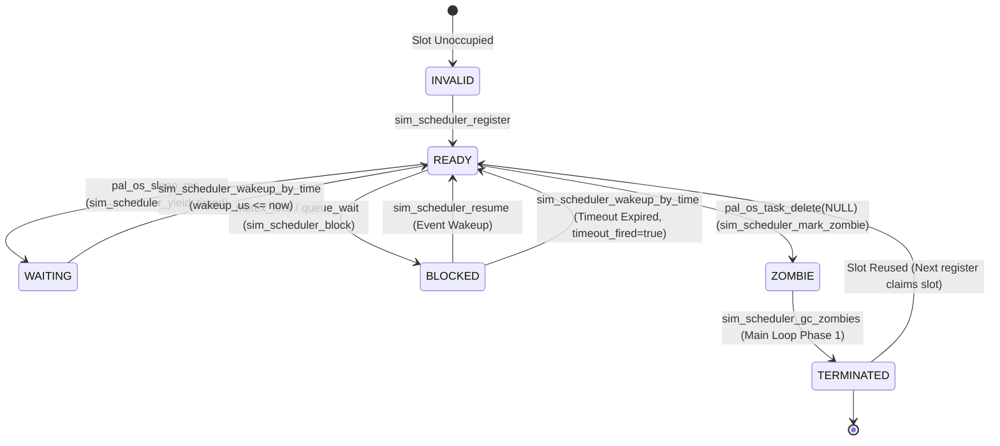

# 4.7 Simulation-Side Cooperative Deterministic Scheduler Model

<!-- i18n-meta
source: docs/zh/design/04-wasm-simulation/archive/07-scheduler-model.md
translated: 2026-08-17
glossary-version: v1.0
translator: AI-assisted
sync-status: up-to-date
-->

> **SSOT Status**: This document serves as the design specification backport of [ADR-0013 Simulation Cooperative Deterministic Scheduler](../../../decisions/unisim/0013-sim-cooperative-scheduler.md) and [ADR-0014 Simulation Single Virtual Core Trade-off](../../../decisions/unisim/0014-sim-single-virtual-core.md) (delivered via fixup plan PLAN-20260702-SIM-COOP-SCHED-FIXUP F6). ADRs record decision history; this document records the active architectural state.

## 1. Purpose

The **cooperative deterministic scheduler** (Wink Sim Scheduler) implemented across WinkMicroOS simulation targets (both host and wasm) replaces legacy synchronous direct-call task creation with true multitasking support. Core goals:

1. **Multitasking Concurrency**: Supports `while(1) { sleep; }` task patterns; producer-consumer interactions via ring buffers.
2. **Bit-Exact Parity**: Identical registration order + identical yielding patterns $\rightarrow$ 100% reproducible execution sequences.
3. **Zero Deployment Friction**: Executes within a single-threaded Wasm sandbox without requiring SharedArrayBuffer or COOP/COEP headers.
4. **Homologous with Physical Hardware**: Aligns with ESP32 FreeRTOS application-level APIs (`pal_os_task_create` / `pal_os_sleep_ms` / `pal_os_ringbuf`).

## 2. Task State Machine



State definitions (`sim_task_state_t`):

| State | Semantics | Written By |
|---|---|---|
| `INVALID` | Slot unoccupied (memset initial zero value) | `sim_scheduler_reset` |
| `READY` | Eligible for selection by pick_next | register / wakeup_by_time / resume |
| `WAITING` | Timed sleep wait; forced to READY when `wakeup_us > 0` expires | yield_timed |
| `BLOCKED` | Awaiting mutex/queue with optional timeout; `timeout_fired` allows mutex_lock to return TIMEOUT | block |
| `ZOMBIE` | Yielded with fiber pending destruction; awaits main loop GC | mark_zombie |
| `TERMINATED` | Fully reclaimed; slot eligible for reuse by next register | gc_zombies |

## 3. Main Scheduler Loop Structure

The main loop resides in `pal_sim_scheduler_run` (implemented per target). Phase execution order:

```text
loop while (main_task is not TERMINATED and max_ticks not reached):
  [Phase 0] Wasm side: poll pal_wasm_dispatch_pending_interrupts()
  [Phase 1] sim_scheduler_gc_zombies()  → Transitions ZOMBIE to TERMINATED, frees fiber
  [Phase 2] sim_scheduler_wakeup_by_time(host_sim_time_us())  → Expired WAITING/BLOCKED become READY
  [Phase 3] next = sim_scheduler_pick_next()
     ├─ NO_READY: host_sim_advance_to(next_wakeup_us); continue
     └─ Otherwise:
  [Phase 4] sim_scheduler_set_current(next)
            wall_start = host_wall_clock_us()   ← Physical wall-clock (Red Line 11)
            sim_ctx_switch(main_ctx, task_ctx)
            sim_scheduler_set_current(NO_READY) ← Red Line 15
            duration = host_wall_clock_us() - wall_start
            if duration > wcet_threshold: wink_runtime_fault(callbacks, 8002)
            if next == main_task_id: ticks_run++
```

## 4. Three Pure Decision Functions

Scheduling logic is decomposed into three side-effect-free pure functions (`wink_sim_scheduler.c`) for comprehensive unit testability:

### 4.1 `sim_scheduler_pick_next` (Round-Robin)

Pseudocode:
```text
start = (last_scheduled + 1) mod MAX_TASKS  # Starts at 0 when last_scheduled == NO_READY
for i = 0 .. MAX_TASKS-1:
    id = (start + i) mod MAX_TASKS
    if tasks[id].state == READY:
        last_scheduled = id
        return id
return NO_READY
```

**Semantic Boundary**: Does not utilize PRNG within this wave; `s_prng_state` is preserved for future Chaos Scheduling (Task 7).

### 4.2 `sim_scheduler_wakeup_by_time(now_us)`

Pseudocode:
```text
count = 0
for t in tasks:
    if t.state in (WAITING, BLOCKED) and t.wakeup_us > 0 and t.wakeup_us <= now_us:
        was_blocked = (t.state == BLOCKED)
        t.state = READY
        t.wakeup_us = 0
        if was_blocked:
            t.timeout_fired = true
            t.blocked_on = 0
        count++
return count
```

### 4.3 `sim_scheduler_gc_zombies`

Pseudocode:
```text
for t in tasks:
    if t.state == ZOMBIE:
        sim_ctx_destroy(t.ctx)  # DeleteFiber safely inside main loop context
        t.ctx = NULL
        t.state = TERMINATED
```

## 5. Host vs Wasm Semantic Comparison

| Dimension | Host (Windows) | Wasm (Emscripten) |
|---|---|---|
| Fiber API | `ConvertThreadToFiber` / `CreateFiber` / `SwitchToFiber` / `DeleteFiber` | `emscripten_fiber_init` / `emscripten_fiber_swap` |
| Clock Source (Business) | `host_sim_time_us()` — Static accumulation; tests advance via `host_sim_advance_to(us)` | `pal_wasm_advance_virtual_clock(us)` — Written exclusively by JS Worker |
| Clock Source (WCET) | `host_wall_clock_us()` (QPC) | `emscripten_get_now() * 1000` |
| Minimum Stack Size | `WINK_SIM_STACK_MIN = 32 KB` | `WINK_SIM_STACK_MIN = 16 KB` + `WINK_SIM_ASYNCIFY_MIN = 2 KB` |
| Interrupt Dispatch | no-op (no asynchronous IRQ) | `pal_wasm_dispatch_pending_interrupts()` polled per tick |
| Wall-Clock Helper | `test/stubs/host_wall_clock.h` (shared between PAL and tests) | inline `wasm_wall_clock_us` |

## 6. Known Fidelity Boundaries (ADR-0013 §Boundaries Execution)

1. **Pure CPU Computation Cannot Be Preempted Involuntarily** — If a task lacks yield points and a slice consumes $> 5\text{ms}$ of physical execution time (default `WINK_SIM_TASK_WCET_THRESHOLD_US`, overridable via `WINK_SIM_WCET_THRESHOLD_US` env; relaxed $10\times$ in `CI`), the main loop triggers `wink_runtime_fault(callbacks, 8002)`.
2. **Instruction-Level Micro-Races Cannot Be Emulated** — Single virtual core cooperative model; refer to [ADR-0014 §Specific Excluded Bug Categories](../../../decisions/unisim/0014-sim-single-virtual-core.md).
3. **Interrupt Wakeup Latency** — Wasm granularity $= O(\text{scheduler tick})$, polled at top of main loop via `pal_wasm_dispatch_pending_interrupts()`. Physical hardware exhibits sub-microsecond response.
4. **`busy_wait_us` Advances Virtual Time Only** — Consumes microseconds of CPU time, avoiding false-positive WCET 8002 faults (`test_sim_scheduler_wcet_fault.c` assertion).

## 7. `pal_os_task_delete` Semantic Contracts (Fixup R10)

Behavioral contracts across four invocation patterns to prevent AI codegen regressions:

| Invocation Form | Semantics | Implementation Path |
|---|---|---|
| `pal_os_task_delete(NULL)` (Self-deletion) | Current task enters ZOMBIE; main loop GC reclaims memory | `mark_zombie(cur) -> sim_ctx_switch(cur_ctx, main_ctx)` |
| `pal_os_task_delete(other_handle)` (Remote deletion, target not running) | Target enters ZOMBIE; main loop GC reclaims memory | `mark_zombie(id)` |
| `pal_os_task_delete(self_handle)` (Remote syntax targeting self) | Treated as remote deletion; continues to main loop switch | Same as above |
| `pal_os_task_delete(other_handle)` while target is active | ⚠️ **Forbidden in simulation** — Impossible under unicore cooperative execution | Assert failure |

## 8. `sim_scheduler_task_count` Semantic Boundaries (Fixup R11)

`task_count` returns the "number of tasks in slots with `state in {READY, WAITING, BLOCKED, ZOMBIE}`". **ZOMBIE tasks are considered active** until `gc_zombies` transitions them to TERMINATED to release the slot.

**User Perspective**: Whether this task can be introspected—ZOMBIE metadata (name/id/priority) remains queryable, hence active.

To query "currently runnable task count", invoke `sim_scheduler_count_by_state(READY)`.

## 9. Relationship with Other ADRs

- [ADR-0003 Simulation Fidelity Boundary](../../../decisions/unisim/0003-simulation-fidelity-boundary.md): Concrete realization of fidelity boundaries in multitasking dimensions.
- [ADR-0007 Cooperative Loop Execution Model](../../../decisions/core/0007-cooperative-loop-execution-model.md): Single-task cooperative foundation extended naturally to multi-task scheduling across slices.
- [ADR-0012 Contract Honesty](../../../decisions/core/0012-contract-honesty-over-silent-degradation.md): WCET 8002 fault paths must pass callback pointers to invoke App `on_fault`, forbidding silent masking.

## 10. Key Acceptance Tests

| Test | Gating Semantics |
|---|---|
| `test_sim_scheduler` | 11 unit tests covering pick_next, wakeup_by_time, block/resume, stack clamp, and zombies |
| `test_sim_scheduler_e2e` | Dual-task ring buffer producer-consumer integration |
| `test_sim_scheduler_zombie_gc` | Self-deletion fiber memory deallocation |
| `test_sim_scheduler_wcet_fault` | CPU busy-loop triggers 8002; `busy_wait_us` avoids false positives (**C2 Fix Gate**) |
| `test_sim_scheduler_determinism` | Seeded determinism verification; locks round-robin semantic boundaries |
| `test_sim_scheduler_stack_clamp` | Host fiber minimum stack clamp verification |
| `test_single_task_semantic_regression` | Validates obstacle avoidance car telemetry matches baseline (R-002) |

## 11. Multitasking Sample App

`dual_task_demo` showcases cooperative multitasking capabilities:

### 11.1 Architecture

```text
[sensor_task] --(ringbuf)--> [motor_task]
       \                         /
        \-- sleep 20ms         /-- sleep 30ms
```

- **sensor_task** (20ms interval): Simulates ultrasonic distance measurements, pushing readings to ringbuf.
- **motor_task** (30ms interval): Reads latest distance from ringbuf, controlling servo angle based on thresholds.
- **ringbuf**: Cross-task communication channel.

### 11.2 Key Code Patterns

```c
static void app_init(void) {
    /* Create ringbuf */
    s_rb = pal_os_ringbuf_create(64);
    
    /* Create tasks */
    pal_os_task_create(sensor_task, "sensor", 32*1024, NULL, 5, PAL_OS_CORE_ANY, &s_sensor_h);
    pal_os_task_create(motor_task, "motor", 32*1024, NULL, 5, PAL_OS_CORE_ANY, &s_motor_h);
}

static void sensor_task(void* arg) {
    while (1) {
        /* ... generate mock data ... */
        pal_os_ringbuf_push(s_rb, &mock_dist, sizeof(mock_dist));
        pal_os_sleep_ms(20);  /* Yield point */
    }
}

static void motor_task(void* arg) {
    while (1) {
        /* ... read from ringbuf ... */
        pal_os_sleep_ms(30);  /* Yield point */
    }
}
```

### 11.3 Scheduling Dynamics

The scheduler employs a round-robin strategy, alternating task execution:
1. `sensor_task` runs $\rightarrow$ pushes telemetry $\rightarrow$ sleeps 20ms $\rightarrow$ yields.
2. Scheduler switches to `motor_task` $\rightarrow$ consumes telemetry $\rightarrow$ sleeps 30ms $\rightarrow$ yields.
3. Scheduler cycles back to ready tasks.

Under identical PRNG seeds, scheduling sequences reproduce with 100% bit-exact parity.

## 12. Future Evolution Roadmap

- **Task 7 Chaos Scheduling**: Introduce PRNG interleaving to `pick_next` to stimulate latent race conditions.
- **Preemptive Scheduling**: Evaluate bit-exact deterministic preemption (seed-driven preemption points).
- **SMP Simulation**: Explicitly rejected in ADR-0014; any multi-core requirements necessitate a new ADR.

---

*Related Documentation: [ADR-0013](../../../decisions/unisim/0013-sim-cooperative-scheduler.md) · [ADR-0014](../../../decisions/unisim/0014-sim-single-virtual-core.md) · [ADR-0007](../../../decisions/core/0007-cooperative-loop-execution-model.md) · Fixup Plan [PLAN-20260702](../../../implementation-plans/unisim/2026-07-02-sim-cooperative-scheduler-fixup-plan.md)*
