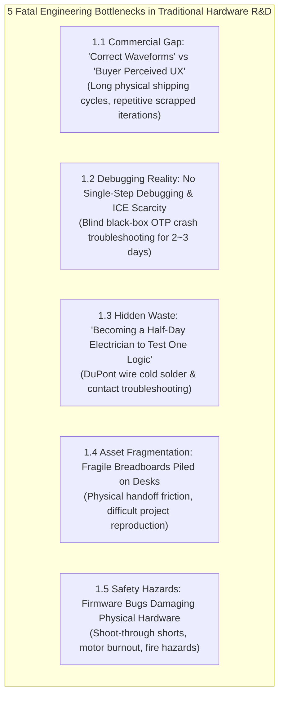
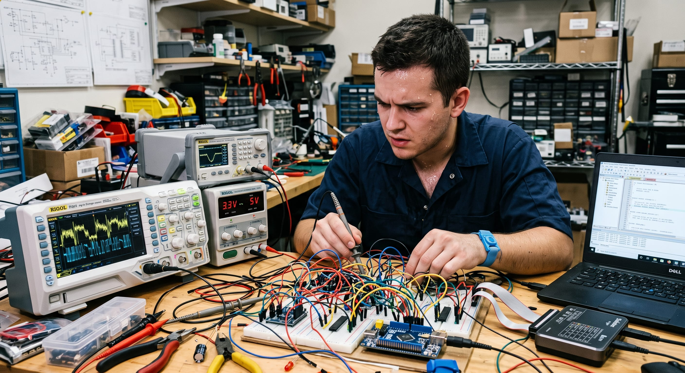
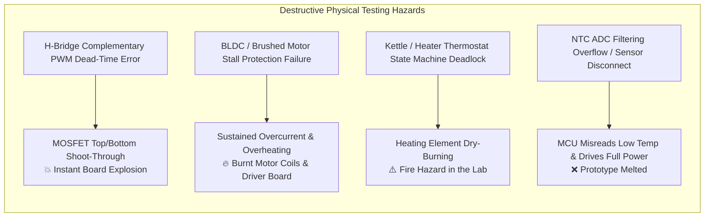
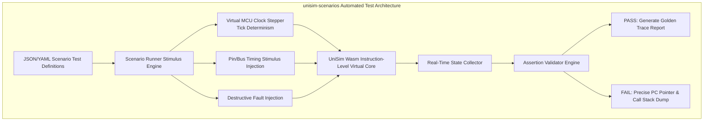
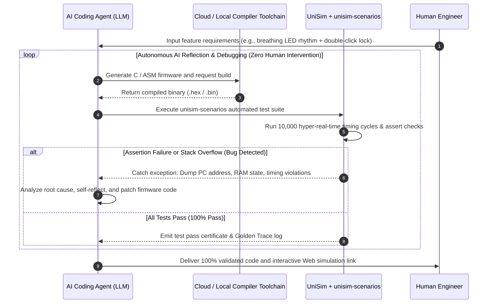
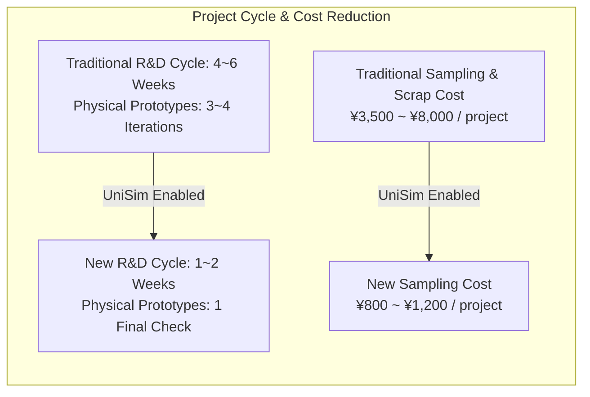

# Embedded Online Simulation Platform Commercial Analysis: Traditional R&D Dilemmas, AI-in-the-Loop Automation, and Industrial Breakthrough

<!-- i18n-meta
source: docs/zh/product/market-analysis.md
translated: 2026-09-01
glossary-version: v1.0
translator: AI-assisted
sync-status: up-to-date
-->

| Attribute | Specification |
| :--- | :--- |
| **Report Type** | Strategic Whitepaper: Industrial Pain Points, Commercial ROI Quantification & Global Competitive Landscape |
| **Module** | `wink-ai-embedded/docs/en/product/market-analysis.md` |
| **Core Topics** | Hardware Dilemmas of "DevBoard + Oscilloscope", `unisim-scenarios` & AI Closed Loop, Competitor Blind Spots & Low-Cost Domestic MCU Opportunities |
| **Target Audience** | Embedded Solution Company Founders/CTOs, Consumer Electronics Product Directors, Cross-Border Hardware Supply Chain Leads, AI Agent R&D Engineers |
| **Status** | **Release 1.0 (Commercial & Technical SSOT Baseline)** |

---

## Executive Summary

Across the multi-trillion-dollar manufacturing clusters of consumer electronics, smart toys, personal care devices, and small home appliances (represented by **Yiwu Toys, Chenghai Smart Gadgets, Shunde Home Appliances, and Shenzhen Consumer Electronics**), embedded systems engineering is trapped in a sharp contradiction: **R&D cycles are compressed to weeks, unit margins are fought over pennies, and user interaction complexity is rising exponentially—yet development workflows remain chained to physical development boards, DuPont wires, and oscilloscopes.**

For decades, the industry has relied on the traditional workflow of *"wire up dev boards, probe waveforms with logic analyzers, burn prototype samples, ship them via courier, and test physical PCBs once they arrive."* While this paradigm worked for single-engineer, simple-control scenarios, it creates **5 fatal hardware-environment engineering bottlenecks** and a crippling **Human-in-the-Loop testing bottleneck** in modern, fast-paced supply chains.

Meanwhile, mainstream global embedded simulators (such as Proteus, Wokwi, QEMU, and Renode), shaped by historical academic and high-end industrial biases, focus almost exclusively on Western 32-bit MCUs or legacy educational chips. **They collectively ignore the billions of low-cost domestic 8-bit and 16-bit industrial workhorse chips (such as Padauk, Sonix, Holtek, Cmsemicon, and Chipsea) that form the backbone of modern global manufacturing.**

```
┌──────────────────────────────────────────────────────────────────────────────────────────────────┐
│                             Traditional R&D vs. Online Simulation Paradigm                       │
├────────────────────────────────┬────────────────────────────────┬───────────────────────────────┤
│ Dimension                      │ Traditional (DevBoard + Scope) │ Online Sim (UniSim + AI)      │
├────────────────────────────────┼────────────────────────────────┼───────────────────────────────┤
│ **Customer Requirement Alignment**│ 7–15 day sample shipping cycles │ 10-second interactive Web link│
│ **Low-Cost Chip Troubleshooting** │ OTP blind guess & GPIO toggling │ Instruction whitebox & trace  │
│ **Peripheral Prototyping**     │ Half-day breadboarding & debug │ 1-minute Web canvas drag/drop │
│ **Destructive / Corner Testing**│ High risk of shorts, fire, stall│ Safe non-destructive virtual  │
│ **Testing & AI Autonomous Loop**│ Hardware pseudo-loop (manual tap)│ `unisim-scenarios` pure software│
│ **Low-Cost Industrial Chip Eco**│ Expensive, scarce ICE hardware │ Deep native support for chips │
└────────────────────────────────┴────────────────────────────────┴───────────────────────────────┘
```

This report delivers a rigorous commercial and architectural analysis covering **industrial engineering bottlenecks, integration testing limits, global competitor blind spots, quantitative ROI financial models, and strategic commercialization roadmaps** for the UniSim embedded online simulation ecosystem.

---

## 1. Real Industrial Dilemmas of Traditional R&D and Hardware Environment Friction

Many experienced embedded engineers ask a fair question:
> *"We have been developing on physical dev boards, probing waveforms on logic analyzers, and testing real PCBs for decades. Why do we need browser-based online simulation?"*

In isolated, single-engineer technical setups, the traditional workflow functions. But across modern supply chain ecosystems, **the traditional "dev board + oscilloscope" paradigm hits 5 fatal commercial and engineering roadblocks**.



---

### 1.1 Dilemma 1: The Commercial Chasm Between "Correct Waveforms" and "Buyer Perceived UX"

In cross-border consumer electronics, toys, and appliances, **engineers and commercial decision-makers speak completely different languages**:

*   **The Engineer's Perspective**: Probing on the dev board, measuring a 30% PWM duty cycle, a 2kHz square wave on the buzzer, and strictly compliant 100kbps I2C bus timings. Technically, the signal is 100% compliant.
*   **The Overseas Buyer / PM Perspective**: Foreign trade buyers, brand product managers, and international importers **cannot read oscilloscope waveforms**. They only care about:
    *   *"Does the button press tactile feel synchronize naturally with the RGB breathing light cadence?"*
    *   *"Does the doll's eyelid blinking coordinate smoothly with the audio rhythm?"*
    *   *"Is the appliance LCD menu transition responsive and intuitive?"*
*   **The Commercial Cost & Rework Quagmire**:
    *   Parties cannot establish commercial consensus over electrical waveforms. In the traditional workflow, the solution house must solder sample boards, burn firmware, assemble physical prototype enclosures, and ship them via DHL/FedEx (domestic: 2–3 days; overseas: 7–15 days).
    *   Upon receiving physical samples, buyers frequently respond with subjective feedback: *"The breathing tempo feels too rushed," "The buzzer tone sounds too sharp," "The servo motion is not cute enough."*
    *   Engineers tweak a few configuration parameters, **burn new chips, re-assemble, re-ship, and repeat this cycle 2–4 times**.
    *   **Frequently, after waiting two weeks for a sample to arrive overseas, the client says "the rhythm isn't what I wanted," rendering two weeks of engineering labor, PCB prototyping costs, and international courier fees completely wasted**, often missing critical seasonal ordering windows.

```text
【Traditional Physical Sampling Loop】 (Duration: 2–4 Weeks)
Requirements ──► Breadboard Wiring ──► Measure Waveforms ──► Solder Sample ──► Air Express ──► Buyer Tests ──► "Feels Wrong" ──► Rework (Loop)

【UniSim Interactive Digital Twin Loop】 (Duration: 10 Minutes)
Requirements ──► Drag/Drop Peripherals ──► Firmware In-Sim ──► Generate URL ──► Buyer Tests on Mobile ──► Real-Time Parameter Tweak ──► Order Confirmed
```

---

### 1.2 Dilemma 2: The Brutal Reality of "No Usable Single-Step Debugging" in Low-Cost MCU Ecosystems

In high-end 32-bit MCUs (e.g., STM32, ESP32, NXP), developers enjoy inexpensive evaluation boards equipped with SWD/JTAG hardware breakpoints and modern IDE debuggers with live variable watches and call stacks.

However, across the **billions of sub-dollar, ultra-low-cost microcontrollers (such as Padauk PDK, Sonix, Holtek, Cmsemicon, and Chipsea)**, engineers face an extraordinarily hostile debugging environment:

1.  **Original In-Circuit Emulators (ICE) Are Costly and Extremely Scarce**:
    *   Vendor hardware ICE units (e.g., Padauk, Sonix) typically cost thousands to tens of thousands of RMB ($500–$2,000 USD).
    *   Small-to-medium solution houses (5–20 engineers) usually only purchase 1 or 2 ICE units. During project crunches, multiple project teams must queue to use the single debug box, severely choking R&D throughput.
2.  **Flash Engineering Test Samples Are Expensive and Fragile**:
    *   Mass-production chips are predominantly OTP (One-Time Programmable) or tiny Flash dies. Vendor-supplied erasable engineering test chips are expensive (often 10–50x mass-production price) and have fragile write endurance (degrading or breaking down after dozens of erasures).
3.  **Black-Box Crash Troubleshooting ("Blind Men and an Elephant")**:
    *   OTP chips and ultra-low-cost production silicon have **no hardware debug interfaces (no JTAG/SWD)**.
    *   When a physical prototype crashes, enters a hard fault, or triggers a watchdog reset, the internal Program Counter (PC), CPU registers, and RAM stack are completely invisible.
    *   The engineer's only resort is **"blind instrumentation"** (e.g., toggling spare GPIOs to blink LEDs or spitting UART chars at different code branches) and re-burning the chip. When dealing with intermittent race conditions or nested interrupt lockups, **locating a single bug often burns 2–3 full engineering days**.

---

### 1.3 Dilemma 3: "Becoming a Half-Day Electrician to Test One Logic Sequence"

Before an engineer can even begin verifying application logic, physical setup imposes massive friction:

*   **Traditional Dev Board Workflow**:
    *   To verify a simple toy/appliance sequence: *"Dual-button long-press combination + RGB breathing LED + 8-segment buzzer tone + servo movement"*:
    *   The engineer must rummage through drawers for a breadboard, DuPont jumper wires, pull-up resistors, NPN driver transistors, LEDs, piezo buzzers, and a servo;
    *   Spend half a day weaving a messy nest of jumper wires, often needing a soldering iron for loose connections;
    *   During testing, broken jumper wire cores, oxidized breadboard sockets, or backwards transistor pins inevitably occur. **Engineers frequently spend 2–3 hours debugging physical wiring only to discover a cold solder joint, draining cognitive energy away from core algorithmic logic.**
*   **Web-Based Online Simulation Workflow**:
    *   On the Web canvas, the engineer drags buttons, RGB LEDs, buzzers, and servos from the component palette and connects them in 1 minute;
    *   Directly loads the compiled firmware binary (`.hex`/`.bin`), immediately launching logic execution and eliminating "electrician prep hours."


*Figure 1-1: Fragile, wire-cluttered physical dev board in traditional hardware integration (time-consuming, prone to bad contacts, difficult to reproduce).*

---

### 1.4 Dilemma 4: Fragmentation and Handoff Costs of Parallel Multi-Project Hardware Assets (The "Pre-Office Paper Archive Era")

The survival rule for small-and-medium embedded solution houses and ODM factories is "agility and high throughput," with a team commonly managing **10 to 30 active parallel client projects**.

*   **The Hardware Maintenance Nightmare (The Craft Workshop Era)**:
    *   Engineers' desks are perpetually cluttered with 10–20 fragile, bare-component breadboards and discarded hardware boxes labeled with masking tape. A slight bump can cause loose wires or accidental short circuits.
    *   When a client requests a firmware revision on a project from 3 months ago, the engineer must search storage boxes for the original hardware, decipher custom pin connections, or rebuild the setup from scratch if the board was damaged or scavenged for parts.
*   **Personnel Turnover and Knowledge Loss**:
    *   When an engineer departs, they leave behind undocumented, wire-tangled boards. New hires cannot reconstruct the exact test environment, and previous projects become unrecoverable "hardware black holes."
*   **Instant Cloud Digital Reproduction (The Office & Figma Moment for Embedded)**:
    *   **Just as Microsoft Office transformed paper memos and physical filing cabinets into searchable, collaborative digital documents, and Figma replaced offline design handoffs with real-time cloud canvases**;
    *   UniSim initiates the **"Digital Transformation of Embedded Engineering"**: fragile, irreproducible physical breadboards and wiring harnesses are completely transformed into **versioned, lightweight cloud digital assets (standardized peripheral topology JSON, pin bindings, automated scenario scripts, and firmware binaries)**.
    *   Any team member can open a **standardized URL** to faithfully clone and reproduce the exact hardware/software environment in 1 second, shifting embedded R&D assets from "physical drawer clutter" to "frictionless cloud-native digital assets."

---

### 1.5 Dilemma 5: Preventing Firmware Defects from Damaging Hardware & Destructive Extreme Condition Validation

In projects involving **power drivers, heating elements, and electromechanical actuators**, early firmware defects carry severe physical destruction risks:



1.  **MOSFET Shoot-Through Short Circuits**: When initializing PWM timers in motor driver firmware, if dead-time is misconfigured or top/bottom gate polarities are inverted, both MOSFETs conduct simultaneously. This draws tens of amperes instantly, **destroying the prototype board, power FETs, and MCU**.
2.  **Motor Stall Burnout**: During early firmware tuning for toy robot arms or massage guns, if stall-detection algorithms fail, a jammed motor continuously sinks peak stall current, burning coil windings within seconds.
3.  **Appliance Dry-Burn Fire Hazards**: When testing overheat cut-offs and boil-dry protection on electric kettles or space heaters, an unhandled firmware state-machine deadlock will cause the heating plate to run unbounded up to hundreds of degrees Celsius, creating **severe fire hazards and lab safety risks**.
4.  **Zero-Risk Virtual Validation**:
    *   In the UniSim virtual environment, engineers can **inject extreme, destructive test parameters at zero cost and zero danger** (e.g., setting heating plate temperature to 1000°C, simulating an instant NTC wire break, or forcing motor speed to 0);
    *   The simulation engine monitors shoot-through and timing violations with nanosecond precision, verifying emergency fail-safe shutdowns without sacrificing physical hardware.

---

## 2. Integration Testing Bottlenecks & The "unisim-scenarios + AI-in-the-Loop" Paradigm Shift

### 2.1 The Traditional Testing Bottleneck: The Human-in-the-Loop Manual Trap

Traditional embedded integration testing relies almost entirely on **manual operator interaction**:

```
┌────────────────────────────────────────────────────────────────────────────┐
│                  Traditional Testing: Human-in-the-Loop Trap               │
├────────────────────────────────────────────────────────────────────────────┤
│ Compile Firmware ─► Flash Chip ─► Press Buttons ─► Watch LEDs ─► Listen to │
│    ▲                                                           Buzzer      │
│    └──────────── Cannot Automate ── High Labor Cost ── Coverage < 15% ─────┘│
└────────────────────────────────────────────────────────────────────────────┘
```

*   **Expensive Labor with Zero Scalability**: QA testers must physically sit at test benches, repeatedly pressing buttons, turning knobs, and cycling power. Running basic functional verification across 10 operating modes takes 30 minutes per build, making integration into modern software CI/CD pipelines impossible.
*   **Inability to Reliably Trigger Low-Probability Corner Cases**:
    *   **Microsecond Race Conditions**: Dual-button presses occurring within a 100-microsecond delta;
    *   **Timer Overflow & Interrupt Nesting Collisions**: An ADC conversion interrupt firing at the exact microsecond a GPIO edge interrupt and timer rollover occur;
    *   **Power Rail Glitches & Switch Bouncing Extremes**: Contact bouncing at the 15–20ms boundary defeating debouncing state machines;
    *   **Stack Overflow & Memory Corruption**: Deep call nesting during rapid input sequences exceeding the tight 64-byte SRAM of an 8-bit MCU.
*   **Severe Mass-Production Defect Risks**: These 1-in-a-million edge cases are virtually impossible to trigger manually on a test bench. But once a product ships in volumes of 500,000 units, these bugs inevitably surface in consumer hands, triggering catastrophic product recalls and brand damage.

---

### 2.1.1 Debunking the Myth: Why "Auto-Flashing + Logic Analyzers" Still Fail to Close the AI Loop

Many embedded engineers and AI practitioners share an intuitive misconception:
> *"Modern LLMs write code, and we can automate firmware flashing via scripts (e.g. esptool / pyOCD) while capturing pin signals with a logic analyzer. Doesn't that already create an automated test harness and close the AI loop?"*

While this hardware test-bench approach sounds viable in theory, **four rigid physical constraints completely shatter the closed loop in real-world industrial R&D**:

```text
┌─────────────────────────────────────────────────────────────────────────────────┐
│     Four Rigid Physical Constraints of Hardware Automation (Flash + Logic Analyzer)  │
├───────────────────┬─────────────────────────────────────────────────────────────┤
│ 1. Manual User Ops │ Buttons, dual-key presses, rotary knobs still require humans│
│ 2. Unrepeatable   │ Faults & glitches cannot be safely reproduced on real boards│
│ 3. Physical Time  │ Real-time 1s = 1s; 10k stress loops take days; flash wears  │
│ 4. Static Wiring  │ Swapping pins or modules requires a human to rewire jumpers │
└───────────────────┴─────────────────────────────────────────────────────────────┘
```

1.  **Physical User Interactions Still Require Humans in the Loop**:
    *   AI can automate flashing, but testing business logic requires real-world physical actions: *"Hold button for 3 seconds to enter pairing mode," "Press dual buttons simultaneously within a 100μs window," "Turn rotary encoder rapidly to adjust setpoint."*
    *   Test operators must still sit at the bench manually pressing buttons.
    *   Attempts to use physical actuators (solenoids, servo pushers) are expensive ($1,000s per bench), mechanically fragile, prone to alignment drifts, and require more maintenance than writing the code itself.
2.  **Destructive and Edge Conditions Cannot Be Safely Reproduced on Physical Hardware**:
    *   AI cannot safely construct or deterministically reproduce extreme physical edge conditions on real dev boards: e.g., a 50μs loose-contact disconnect on an NTC thermistor, thermal runaway reaching 800°C, or critical power rail brown-out glitches. Subject to environmental drift and component tolerances, intermittent hardware bugs rarely reproduce consistently.
    *   Forcing these conditions on physical benches leads to **short circuits, blown MOSFETs, or fire hazards**, destroying test equipment, preventing safe repetition, and stalling automated pipelines.
3.  **The Rigid Trap of Real-World Time and Hardware Wear**:
    *   Physical test benches are bound to the immutable reality that 1 second equals 1 second. Verifying 10,000 state transitions for subtle memory leaks or watchdog race conditions takes hours or days.
    *   Moreover, low-cost OTP MCUs are one-time programmable, and flash engineering samples endure only a few hundred write cycles before failing.
4.  **Hardware Topology Changes Require Manual Rewiring**:
    *   When the AI optimizes pin allocation (e.g., relocating a pin to avoid an ESP32 strapping conflict) or adds a pull-up resistor, it cannot rewire physical jumpers. The pipeline must halt and await human intervention.

**Conclusion**: Physical test-bench automation is merely a **superficial pseudo-loop (Fake Loop)**. A true autonomous AI development loop must be built inside a **"Hardware as Code" pure-software, hyper-real-time digital sandbox (UniSim + unisim-scenarios)**.

---

### 2.2 `unisim-scenarios` Automation Architecture: Deterministic Timing and Script-Driven Testing

UniSim introduces **`unisim-scenarios`**, a dedicated scenario-driven test automation framework for embedded timing and peripheral interaction:



#### 2.2.1 Core Architectural Capabilities

1.  **Hyper-Real-Time Execution**:
    *   Inside the Wasm virtual core, time advancement is driven by virtual clock cycles rather than physical wall-clock time.
    *   A high-frequency endurance and state-transition test that would take 1 physical hour **completes in 3–5 seconds across tens of thousands of event loops**.
2.  **Nanosecond Deterministic Timing (Zero Flakiness)**:
    *   Every input event (button press, pin edge, ADC ready flag, UART byte) is pinned to an exact virtual CPU cycle.
    *   Tests exhibit **100% bit-level reproducibility**. Given the same random seed and firmware binary, execution traces are identical across Windows, macOS, Linux, and headless CI servers.
3.  **Scenario Fuzzing & Boundary Stress Traversal**:
    *   Built-in fuzzer engines inject randomized pulses, glitch noise, and rapid-fire inputs within `[0, 50ms]` timing windows across multiple GPIOs, systematically traversing all unhandled state machine branches to expose hidden deadlocks and stack crashes.

---

### 2.3 AI-in-the-Loop: Building Autonomous AI Coding & Self-Healing Feedback Loops

As Generative AI and Large Language Models (LLMs) reshape software engineering, **the fundamental roadblock to AI writing embedded firmware is the lack of an executable, real-time feedback loop**:

*   Previously, when asking an AI to write microcontroller C or assembly, the AI could not run its output. Humans had to flash the code into hardware, observe the failure, and feed errors back to the AI—acting as an inefficient "human flashing tester."
*   **UniSim + `unisim-scenarios` provides the ideal "virtual sandbox lab" for AI Agents**, creating a 100% software-defined **AI-in-the-Loop autonomous development closed loop**:



*   **The Paradigm Shift**: AI Agents can compile, execute, stimulate virtual pins, inspect virtual registers, and self-heal autonomously in the sandbox. Before handing code to human engineers, thousands of deterministic tests have already passed, raising AI embedded code generation viability from <30% to **>95%**.

---

## 3. Global Embedded Simulation Landscape & The Untapped Industrial Blue Ocean

To define UniSim's defensible moat, we analyze the mainstream global embedded simulation landscape:

### 3.1 Competitive Landscape Breakdown

```
                         【Global Embedded Simulation Quadrant】
   High Complexity / High-End ▲
                              │
                              │   [QEMU]                     [Renode]
                              │   • 32/64-bit Linux / Server • Multi-node IoT networks
                              │   • Pure system instruction  • Cortex-M / RISC-V industrial
                              │
                              │
                              │   [Proteus]                  [Wokwi]
                              │   • Legacy SPICE circuit     • Modern Web maker education
                              │   • Heavyweight, expensive   • Focused on Arduino / ESP32
                              │
                              │                                  ★【UniSim Defensible Blue Ocean】★
                              │                                  • Low-cost 8/16-bit industrial chips
                              │                                  • Padauk PDK / Sonix / Holtek / Chipsea
                              │                                  • Agile Web collaboration + AI testing
   Low Cost / Mass Industrial ▼
                              └─────────────────────────────────────────────────────────────►
                                 Heavy Desktop Software             Modern Web / Cloud Native
```

#### 1. Proteus (Labcenter Electronics)
*   **Focus**: Schematic-based SPICE analog/mixed-signal circuit simulation, widely used in university education and legacy electrical engineering.
*   **Key Limitations**:
    1.  **Monolithic Desktop Architecture**: Multi-gigabyte Windows installer, slow startup, no cloud or cross-platform browser collaboration.
    2.  **Prohibitive Pricing**: Commercial licenses cost thousands of dollars per seat. Small solution houses rely on ancient cracked versions without CI support.
    3.  **Zero Support for Modern Domestic Low-Cost Chips**: Chip models remain stuck on decades-old AT89C51, PIC, and AVR. **Completely lacks models for Padauk, Chipsea, Cmsemicon, or Sonix**.
    4.  **No Buyer Interaction or AI Readiness**: Raw circuit schematics mean nothing to overseas buyers, and there is no modern headless API for AI agent scripting.

#### 2. Wokwi
*   **Focus**: Web-based modern embedded simulator targeting Arduino, ESP32, Raspberry Pi Pico, and STM32 in the open-source maker ecosystem.
*   **Key Limitations**:
    1.  **Confined to Maker & STEAM Education**: Deeply tied to Arduino libraries rather than industrial ODM workflows.
    2.  **No Low-Cost Industrial Chinese MCUs**: Community-driven development revolves around AVR/ARM/ESP32, offering zero support for proprietary Padauk PDK or Holtek instruction sets.
    3.  **High-Frequency Pin Simulation Bottlenecks**: Heavy pin-toggling overhead in browsers limits industrial-grade scenario fuzzing and destructive physical fault injection.

#### 3. QEMU
*   **Focus**: Open-source machine emulator supporting 32/64-bit processors (ARM Cortex-A, x86, RISC-V, MIPS) for OS virtualization and Linux kernel development.
*   **Key Limitations**:
    1.  **Over-Engineered for Microcontrollers**: Designed for full OS workloads; cannot simulate sub-microsecond GPIO, PWM, and watchdog timing on tiny 8-bit MCUs with tens of bytes of RAM.

#### 4. Renode (Antmicro)
*   **Focus**: Multi-node network co-simulation and complex IoT systems (running Zephyr/FreeRTOS) across ARM Cortex-M and RISC-V SoC architectures.
*   **Key Limitations**:
    1.  **Academic & High-End Industrial Bias**: Tailored for high-complexity Western IoT and automotive systems using C# and Python scripting.
    2.  **Completely Disconnected from Ultra-Low-Cost Mass Manufacturing**: Irrelevant to sub-dollar appliance chips and incompatible with the rapid-turnaround development pace of Chinese solution houses.

---

### 3.2 Comprehensive Competitive Benchmark Matrix

| Dimension | Proteus | Wokwi | QEMU | Renode | **UniSim (This Project)** |
| :--- | :--- | :--- | :--- | :--- | :--- |
| **Platform Architecture** | Heavy Windows Desktop (GBs) | Web Frontend (Browser) | CLI Virtualization System | Cross-Platform Framework (CLI/GUI) | **Web/Wasm Cloud + Instant Browser Load** |
| **Target Chips** | Legacy 8051, PIC, AVR, ARM7 | AVR(Arduino), ESP32, Pico | ARMv7/v8, RISC-V, x86 | Cortex-M, RISC-V, Multi-core SoC | **Domestic 8/16-bit Industrial + 51/M0/ESP32** |
| **Low-Cost Domestic MCU Support<br>(Padauk/Sonix/Holtek/Cmsemicon)** | ❌ **None** | ❌ **None** | ❌ **None** | ❌ **None** | ✅ **Deep Support (ISA, Peripherals, OTP)** |
| **Commercial Buyer Collaboration** | ❌ Raw Schematics Only | ⚠️ Basic 2D Part Diagrams | ❌ Headless / No GUI | ❌ No Buyer UI | ✅ **High-Fidelity 2.5D/3D Dynamic Twins** |
| **Automated Testing & Fuzzing** | ⚠️ Complex VSM Scripts | ⚠️ Basic Unit Tests | ⚠️ System-level testing | ✅ Robot Framework Integration | ✅ **Native `unisim-scenarios` Hyper-Real-Time Fuzzing** |
| **AI Agent Loop Integration** | ❌ Closed Desktop App | ⚠️ Moderate | ⚠️ Complex Container Setup | ⚠️ High Configuration Overhead | ✅ **AI-Native JSON / Wasm Sandbox Interface** |
| **Destructive Fault Injection** | ⚠️ Basic Electrical Sim | ❌ Logic-level only | ❌ No peripheral destruction | ⚠️ Network Fault Injection | ✅ **Full Support (Dry-Burn, Stall, Shorts, Wire-Break)** |
| **Adoption & Deployment Friction**| High ($$$ licenses / cracks) | Low (Free + SaaS) | Medium (Complex setup) | High (Specialized scripting required) | **Zero (No install, 1-click URL sharing)** |

---

### 3.3 The Core Strategic Opportunity: Owning the "Academically Ignored, Industrially Dominant" Blue Ocean

```text
┌─────────────────────────────────────────────────────────────────────────────────┐
│                    The Reality of Global Manufacturing Silicon                  │
├─────────────────────────────────────────────────────────────────────────────────┤
│                                                                                 │
│  【Academic & Open-Source Community Focus】 (~95% of simulator attention)        │
│   • ARM Cortex-M4/M7, RISC-V 64, ESP32-S3, Heterogeneous Linux SoCs            │
│   • Applications: Autonomous Driving, Humanoid Robotics, AIoT Smart Speakers   │
│                                                                                 │
│  ─────────────────────────────────────────────────────────────────────────────  │
│                                                                                 │
│  【True Volume Drivers in Mass Manufacturing】 (Billions of units/year, zero tools)│
│   • Padauk (应广) PDK5S / PMS Series (Dual/Single Core 8-bit OTP, $0.03~$0.06 USD)│
│   • Sonix (松翰) / Holtek (合泰) 8/16-bit Appliance MCUs ($0.06~$0.18 USD)      │
│   • Cmsemicon (中微) / Chipsea (芯海) Touch / Motor Control 8-bit MCUs          │
│   • Fremont Micro (辉芒微) / Puya (普冉) / Geehy (极海) Domestic Workhorses     │
│   • Applications: Toy Blasters, LED Wands, Blankets, Massage Guns, Toothbrushes│
│                                                                                 │
└─────────────────────────────────────────────────────────────────────────────────┘
```

*   **The Ecosystem Vacuum**: Global software vendors and open-source projects dismiss sub-dollar chips as "academically uninteresting."
*   **The Commercial Reality**: These chips power tens of thousands of solution houses and hundreds of billions of dollars in consumer goods exports. Because vendor toolchains are primitive and lack modern simulation, **solution houses suffer from slow turnaround, painful debugging, and high sampling costs—creating a massive, unserved market**.
*   **UniSim's Defensible Moat**: By mastering this exact industrial blue ocean, UniSim secures a unique, highly defensible market position that global giants overlook and open-source communities cannot replicate.

---

## 4. Quantitative ROI Financial Model & Industrial Efficiency Gains

To demonstrate UniSim's clear return on investment, we model a **typical 10-engineer consumer electronics solution house delivering 40 client projects annually**:



### 4.1 Annualized Financial & Labor Savings Matrix

| Metric | Traditional Baseline (Annual) | UniSim-Enabled (Annual) | Quantified Annual Savings / Impact |
| :--- | :--- | :--- | :--- |
| **Prototyping & Courier Costs** | 40 projects × 3 sample rounds = 120 shipments<br>Sampling + shipping ≈ ¥48,000 RMB | 40 projects × 1 sample round = 40 shipments<br>Sampling + shipping ≈ ¥16,000 RMB | **Direct Cost Savings: ¥32,000 RMB / year** |
| **Wiring Prep & Wiring Debug** | 40 projects × 16 hours = 640 hours<br>(Valued at ¥80 RMB/hr engineering rate) | 40 projects × 1 hour = 40 hours<br>(Web canvas drag-and-drop) | **Saves 600 engineering hours<br>(Equivalent to ¥48,000 RMB labor value)** |
| **Intermittent Crash Debugging** | ~30 hard crashes × 2.5 days each<br>= 75 engineering days | Instruction-level whitebox trace<br>= 30 crashes × 0.5 hours = 2 days | **Frees 73 engineering workdays<br>(Value exceeding ¥58,400 RMB)** |
| **Hardware ICE Unit Purchases** | 10-engineer team needs 5 ICE units<br>Total expenditure: ¥25,000 ~ ¥50,000 | Team buys 1–2 units for final signoff<br>Daily development uses Web Sim | **One-time CAPEX Savings:<br>¥20,000 ~ ¥35,000 RMB** |
| **OTP Mask Scrapping Risk** | ~5% annual mask defect/recall rate<br>Single bad mask rework: ¥50,000–¥100,000 | `unisim-scenarios` stress testing<br>Catches 90%+ race bugs, risk <0.5% | **Avoids Bad-Debt Losses:<br>¥40,000 ~ ¥80,000 RMB / year** |
| **Order Confirmation Velocity** | 14–21 day sample shipping delay<br>Order conversion rate: ~30% | 10-minute instant interactive link<br>Order conversion rate rises to **55%+** | **2x Project Throughput Capacity<br>(15–20 additional client projects/yr)** |

> **Bottom-Line ROI**: Adopting UniSim generates **over ¥200,000 RMB (~$28,000 USD) in direct and indirect annual savings** for a 10-engineer solution house, while doubling project turnaround velocity.

---

## 5. Customer Segmentation, Willingness-to-Pay (WTP) & Go-to-Market Strategy

Target personas have distinct decision-making psychology, requiring a **"tiered monetization, hardware-bundled software, and viral network adoption"** strategy:

```
┌─────────────────────────────────────────────────────────────────────────────────┐
│                     Customer Segmentation & Viral Conversion Funnel             │
├─────────────────────────────────────────────────────────────────────────────────┤
│                                                                                 │
│  【Tier B: Foreign Trade Buyers / Brand PMs】 (Viral Network Catalyst)          │
│   • Profile: Cross-border e-commerce buyers, consumer brand product managers    │
│   • Strategy: 【100% Free Interactive Web Viewer】                               │
│     Forces solution houses to deliver prototypes via UniSim links               │
│                                      │                                          │
│                                      ▼ (Viral Mandate)                          │
│  【Tier A: Small/Medium Solution Houses & ODMs】 (Core Revenue Pillar)          │
│   • Profile: 5–20 engineers in Chenghai/Shenzhen/Shunde                         │
│   • WTP Reality: Rejects pure SaaS subscriptions; willing to buy hardware tools │
│   • Strategy: 【Desk-HIL Hardware Tooling + Pre-Mask Quality Audit Reports】     │
│                                      ▲                                          │
│                                      │ (Community Inflow)                       │
│  【Tier C: Individual Developers / Makers / Students】 (Ecosystem Foundation)    │
│   • Profile: Freelancers, electronics students, hobbyists                       │
│   • Strategy: 【Free Community Edition】 for open-source chips and components    │
│                                                                                 │
└─────────────────────────────────────────────────────────────────────────────────┘
```

### 5.1 Tier A: Small/Medium Solution Houses (Core Revenue Engine)
*   **Commercial Reality**: Small business owners strongly resist annual pure-software SaaS subscriptions. However, they routinely approve budgets for **physical hardware tools and official audit certificates**.
*   **Actionable Product Offerings**:
    1.  **Desk-HIL Hardware Integration Suite**:
        *   **Product**: WebSerial-powered desktop automation test board + 1-year UniSim Team Pro license.
        *   **Pricing**: ¥2,499 ~ ¥4,999 RMB ($350–$700 USD). USB plug-and-play dynamically bridges virtual pins to real MCU pins.
    2.  **Pre-Mask Audit Service**:
        *   **Product**: Automated compliance audit running 1M+ fuzzing cycles before OTP masking, generating an immutable *Firmware Integrity & Stack Safety Audit Report*.
        *   **Pricing**: ¥600 ~ ¥1,500 RMB ($85–$210 USD) per project, serving as "insurance" for mask investments.

### 5.2 Tier B: Trade Importers & Brand PMs (Viral Adoption Vector)
*   **Strategy**: **Permanently free industry standard viewer**.
*   **Mechanic**: Once a buyer experiences UniSim's interactive 3D and audio link on their smartphone, they mandate to their suppliers: *"Don't ship physical boards for early revisions—send me a UniSim link so I can confirm it with my overseas clients immediately."* This creates bottom-up viral pressure forcing solution houses to adopt the platform.

---

## 6. Physical Hard Boundaries and Engineering Realities (Ground Truth)

To maintain credibility and trust, **we strictly avoid overstating pure software simulation capabilities**. Product boundaries are transparently defined:

```
┌─────────────────────────────────────────────────────────────────────────────────┐
│                         Two-Tier Quality Defense Funnel                         │
├─────────────────────────────────────────────────────────────────────────────────┤
│                                                                                 │
│   【Tier 1: UniSim Pure Software Simulation】 (Eliminates 85%~90% of Defects)   │
│    • State machine deadlocks and unhandled branch logic                         │
│    • Timer overflows, interrupt re-entrancy, and race conditions                │
│    • 8-bit MCU tight SRAM stack corruption and memory out-of-bounds             │
│    • Light/sound cadence and buyer interaction validation                       │
│    • Extreme condition (dry-burn, motor stall, shoot-through) fail-safes        │
│                                                                                 │
│   ────────────────────────────────────────────────────────────────────────────  │
│                                                                                 │
│   【Tier 2: Physical Hardware Verification】 (Validates Final 10%~15% Physics)  │
│    • Oscillator thermal drift and power-rail brown-out transients               │
│    • Unbranded generic component parasitics, PCB trace impedance, EMC/EMI       │
│    • Piezo buzzer acoustic cavity resonance and plastic shell distortion        │
│    • Mechanical wear, gear backlash, and structural tolerances                  │
│    • Assembly soldering leakage, ESD strikes, and battery spring oxidation      │
│                                                                                 │
└─────────────────────────────────────────────────────────────────────────────────┘
```

*   **Core Principle**: UniSim's mission is **"eliminating all software logic bugs and requirement misunderstandings before PCB fabrication at zero hardware cost,"** rather than replacing final factory functional testing (FCT).

---

## 7. Summary and Strategic Roadmap

### 7.1 Key Takeaways
1.  **Bridging the Commercial Gap**: Transforms 7–15 day physical shipping cycles into 10-second interactive Web digital twins, accelerating export sales.
2.  **Democratizing Debugging**: Delivers whitebox instruction-level simulation for low-cost 8/16-bit chips (Padauk, Sonix, Holtek, Cmsemicon), cutting crash debugging from days to minutes.
3.  **Driving Embedded Digital Transformation (The Office Moment)**: Eliminates breadboard wiring waste and drawer hardware clutter. Just as Office digitized paper files, UniSim elevates fragile physical setups into versioned, shareable cloud digital engineering assets.
4.  **Breaking Through to True Autonomous AI Loops**: Shatters the physical constraints of benchtop "auto-flashing" setups. Through `unisim-scenarios` pure-software deterministic simulation, AI agents achieve automated stimulus injection, nanosecond debugging, and self-healing iterations without human intervention.
5.  **Dominating the Untapped Blue Ocean**: Avoids high-end Western 32-bit red oceans to build an unassailable moat in the mass-volume domestic industrial chip market.

### 7.2 Strategic Execution Priorities
1.  **Deepen Core Instruction Set Emulation**: Solidify bit-perfect cycle-accurate models for **Padauk (PDK5S/PDK82), MCS-51, STM8, and Holtek**.
2.  **Standardize `unisim-scenarios` Suite**: Open-source JSON/YAML test schemas with 1-click Golden Trace regression reports.
3.  **Execute Hardware-Bundled GTM**: Launch the affordable USB WebSerial Desk-HIL companion to penetrate solution house CAPEX budgets.
4.  **Expand 3D Appliance & Toy Component Libraries**: Continuously enrich high-fidelity panels, segmented LCDs, breathing LEDs, and mechanical assemblies for true-to-life buyer presentation.
