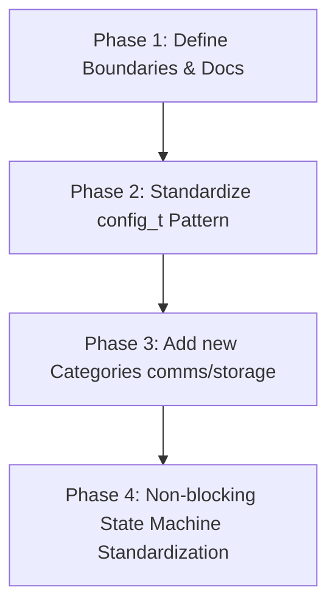

# Technical Proposal: DAL Peripheral Abstraction Refactoring & Standardization

This document details the concrete implementation plan and step-by-step execution roadmap to address the four key areas of improvement in the Device Abstraction Layer (DAL) of `wink-micro-os`.

---

## 1. Roadmap Overview & Phased Execution

To minimize breaking changes and keep the repository builds stable, the refactoring is divided into four distinct phases:



---

## 2. Detailed Improvement Steps

### Step 1: Formalize Peripheral Classification Boundaries
We will update `01-dal-device-abstraction.md` to define the **Primary Intent Rule** to resolve any ambiguity for edge-case peripherals.

| Peripheral / Device | Category | Primary Intent | Reason |
| :--- | :--- | :--- | :--- |
| **Rotary Encoder (HMI)** | `input` | Human-Machine Interface | Primarily used by human operator to rotate/select menus. |
| **Rotary Encoder (Motor Speed)** | `sensor` | Objective Measurement | Measures motor shaft rotation speed/direction. |
| **NeoPixel (WS2812) Strip** | `display` | Graph/Matrix Rendering | High-bandwidth pixel-level rendering. |
| **NeoPixel (WS2812) Status LED** | `output` | Simple Indicator | Used only for low-bandwidth status blinking. |
| **Passive Buzzer (Tones)** | `output` | Simple Indicator | Produces sound signals; categorizing as Output avoids over-complicating. |
| **Keypad / Touchscreen** | `input` | Human-Machine Interface | Collects human interaction events. |

#### Implementation Actions:
1. Append the classification rules table to the architectural design docs.
2. Structure the directory path structure according to the table above.

---

### Step 2: Standardize the `config_t` Pattern for Codegen
Currently, simple peripherals use direct parameter arguments in their `init` functions, while complex ones use config structs. We will refactor all peripherals to use a uniform configuration pattern to simplify the Python Code Generator (`app_codegen.py`).

#### Unified Design Pattern (Template):
```c
// dal_foo.h
typedef struct {
    uint16_t pin_a;
    uint16_t pin_b;
    uint32_t frequency_hz;
} dal_foo_config_t;

typedef struct {
    dal_foo_config_t config;  // Store configuration copy directly
    bool             initialized;
    // --- Runtime States ---
    uint32_t         run_counter;
} dal_foo_t;

wink_status_t dal_foo_init(dal_foo_t *dev, const dal_foo_config_t *cfg);
```

#### Migration Plan for Current Peripherals:
1. **`dal_led`**
   - **Before**: `dal_led_init(dal_led_t *dev, uint16_t pin, bool active_high)`
   - **After**:
     ```c
     typedef struct {
         uint16_t pin;
         bool active_high;
     } dal_led_config_t;
     
     typedef struct {
         dal_led_config_t config;
         bool is_on;
         bool initialized;
     } dal_led_t;
     
     wink_status_t dal_led_init(dal_led_t *dev, const dal_led_config_t *cfg);
     ```
2. **`dal_button`**
   - **Before**: `dal_button_init(dal_button_t *dev, uint16_t pin, bool active_low)`
   - **After**:
     ```c
     typedef struct {
         uint16_t pin;
         bool active_low;
     } dal_button_config_t;
     
     typedef struct {
         dal_button_config_t config;
         bool stable_pressed;
         bool last_reported;
         bool initialized;
         uint8_t debounce_counter;
     } dal_button_t;
     
     wink_status_t dal_button_init(dal_button_t *dev, const dal_button_config_t *cfg);
     ```
3. **`dal_ultrasonic`**
   - **Before**: `dal_ultrasonic_init(dal_ultrasonic_t *dev, uint16_t trig_pin, uint16_t echo_pin)`
   - **After**:
     ```c
     typedef struct {
         uint16_t trig_pin;
         uint16_t echo_pin;
         bool use_rmt;
     } dal_ultrasonic_config_t;
     
     typedef struct {
         dal_ultrasonic_config_t config;
         float last_distance;
         uint32_t last_pulse_us;
         wink_status_t last_status;
         dal_ultrasonic_state_t state;
         bool initialized;
     } dal_ultrasonic_t;
     
     wink_status_t dal_ultrasonic_init(dal_ultrasonic_t *dev, const dal_ultrasonic_config_t *cfg);
     ```

4. **Codegen Adjustments (`app_codegen.py`)**:
   - Update the codegen templates to output standard structured initializers:
     ```c
     const dal_led_config_t front_led_cfg = { .pin = 2, .active_high = true };
     dal_led_t front_led;
     // during init:
     dal_led_init(&front_led, &front_led_cfg);
     ```

---

### Step 3: Add New Peripheral Categories (`communication` & `storage`)
To support IoT features (e.g. WiFi, NFC, GPS) and local data logging (EEPROM, SPI Flash), we will create directories and template definitions.

#### Directory Expansion:
* `wink-micro-os/dal/include/communication/`
* `wink-micro-os/dal/include/storage/`
* `wink-micro-os/dal/src/communication/`
* `wink-micro-os/dal/src/storage/`

#### Skeletons / Templates:

##### `dal_eeprom.h` (Storage Category Example):
```c
#ifndef DAL_EEPROM_H
#define DAL_EEPROM_H

#include "wink_status.h"

typedef struct {
    uint8_t  i2c_port;
    uint16_t i2c_addr;
    uint32_t capacity_bytes;
    uint16_t page_size;
} dal_eeprom_config_t;

typedef struct {
    dal_eeprom_config_t config;
    bool initialized;
} dal_eeprom_t;

wink_status_t dal_eeprom_init(dal_eeprom_t *dev, const dal_eeprom_config_t *cfg);
wink_status_t dal_eeprom_read(dal_eeprom_t *dev, uint32_t addr, uint8_t *buf, uint32_t len);
wink_status_t dal_eeprom_write(dal_eeprom_t *dev, uint32_t addr, const uint8_t *buf, uint32_t len);

#endif // DAL_EEPROM_H
```

##### `dal_gps.h` (Communication Category Example):
```c
#ifndef DAL_GPS_H
#define DAL_GPS_H

#include "wink_status.h"

typedef struct {
    uint8_t uart_port;
    uint32_t baudrate;
} dal_gps_config_t;

typedef struct {
    dal_gps_config_t config;
    float last_latitude;
    float last_longitude;
    bool fix_acquired;
    bool initialized;
} dal_gps_t;

wink_status_t dal_gps_init(dal_gps_t *dev, const dal_gps_config_t *cfg);
wink_status_t dal_gps_poll(dal_gps_t *dev); // Parses NMEA strings non-blockingly
wink_status_t dal_gps_get_location(const dal_gps_t *dev, float *lat, float *lon, bool *fixed);

#endif // DAL_GPS_H
```

---

### Step 4: Non-blocking State Machine Standardization
High-latency DALs must strictly implement the standard state-machine lifecycle. Blocking waits in `read`/`write` methods (exceeding `100us`) are deprecated.

```
       +----------+                     +------------+
       |   IDLE   | --[request_xxx]-->  | MEASURING  |
       +----------+                     +------------+
            ^                                 |
            |                         [conversion done]
            |                                 v
      [get_result]                      +------------+
            |                           |   READY    |
            +-------------------------- +------------+
```

#### API Signature Rules:
1. **Trigger Action (Non-blocking)**:
   `wink_status_t dal_xxx_request(dal_xxx_t *dev)`
   - Starts measurement/write/read. Returns immediately with `WINK_OK` or `WINK_ERR_BUSY`.
2. **Execute Cycle Step (Cooperative Loop)**:
   `wink_status_t dal_xxx_poll(dal_xxx_t *dev)` (optional, if background polling is needed).
3. **Get Result (Non-blocking)**:
   `wink_status_t dal_xxx_get_result(const dal_xxx_t *dev, out_data_t *data)`
   - Returns `WINK_OK` if results are ready.
   - Returns `WINK_ERR_BUSY` if operation is still in progress.
   - Returns `WINK_ERR_TIMEOUT` or specific error codes if failed.

---

## 3. Step-by-Step Implementation Verification Checklist

1. [ ] **Step 1 Documentation Check**: Write classification boundaries into `01-dal-device-abstraction.md`.
2. [ ] **Step 2 Config Migration**:
   - Refactor `dal_led_t` and `dal_led_init`.
   - Refactor `dal_button_t` and `dal_button_init`.
   - Refactor `dal_ultrasonic_t` and `dal_ultrasonic_init`.
   - Update all e2e unit tests and samples (`avoidance_car`, `devkitc_smoke`, `oled_dashboard`).
   - Modify `app_codegen.py` to output structural init data.
   - Verify: Run unit tests via `python wink-tools/wink.py test` to ensure compilation and logical flow are 100% correct.
3. [ ] **Step 3 Category Creation**:
   - Create directories: `dal/include/communication`, `dal/include/storage`, `dal/src/communication`, `dal/src/storage`.
   - Add template headers and include them in CMake lists.
4. [ ] **Step 4 Verify Non-blocking**:
   - Review and fully deprecate any synchronous blockings in DAL APIs.
   - Ensure all cooperative loop ticks remain fast and jitter-free.
