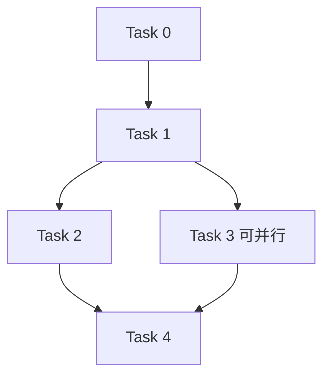

# 【模板】实施计划标准模板

> 📋 **本文档是实施计划的标准模板**：新建实施计划时请复制本文件，按实际情况填充。
> 所有 `[ ]` 标记为需要填充的内容；带有 `(可选)` 标记的章节如不需要可以删除。
>
> 🎯 **模板版本**：v2.0（2026-06-27）
> 📚 **关联规范**：`docs-adr.md` 五层文档体系、`03-coding-guidelines.md`
> 🤖 **Agent 友好**：本模板优化用于 Agentic Workflow 自动执行

---

## 1. 元数据表（🔴 必选）

| 字段 | 内容 |
|------|------|
| **计划编号** | `PLAN-YYYYMMDD-XXX` （如 `PLAN-20260627-I2C-COMPAT`） |
| **创建日期** | `YYYY-MM-DD` |
| **目标平台/SoC** | `host` / `wasm` / `ESP32` / `ESP32-S3`（多个请并列） |
| **工具链/SDK版本**| `ESP-IDF vX.Y` / `GCC vX.Y` / `Emscripten vX.Y`（关键版本必须明确） |
| **计划状态** | 📋 草稿 / 🔄 执行中 / ✅ 已完成 / ⏸️ 暂停 / ❌ 取消 |
| **优先级** | 🔴 P0（阻塞开发） / 🟡 P1（重要，不阻塞） / ⚪ P2（优化，可延后） |
| **计划版本** | `v1.0`（用于追踪计划本身的迭代） |
| **关联技术设计** | [`../tech-designs/xxx.md`](../tech-designs/xxx.md)（无则写「无，已并入本计划」） |
| **关联设计规范** | [`../0x-xxx/xxx.md`](../0x-xxx/xxx.md) |
| **关联评审记录** | [`../reviews/xxx.md`](../reviews/xxx.md)（无则写「无」） |
| **关联 ADR** | [`ADR-XXXX`](../decisions/XXXX-xxx.md)（无则写「无」） |
| **目标里程碑** | Wave X / vX.Y / 专项整改 |
| **前置依赖计划** | [`./PLAN-YYYYMMDD-XXX.md`](./xxx.md)（无则写「无」） |
| **替代/废弃** | 替代 [`./旧计划名.md`](./旧计划名.md)（如适用） |
| **计划负责人** | [架构师/开发负责人姓名] |
| **所需子代理技能** | `embedded-best-practice` + `subagent-driven-development`（根据需要增减） |

---

## 2. 背景与目标（🔴 必选）

### 2.1 问题陈述

> 用 3~5 句话清晰描述：我们要解决什么问题？为什么现在必须解决？

```
[清晰描述问题背景、触发原因、不解决的后果]
```

### 2.2 技术/业务目标

> 列出可量化、可验证的目标，不少于 3 条

- ✅ [目标 1：如：双版本兼容，同一份代码在 IDF v5.1.3 和 v6.0.x 下均可编译运行]
- ✅ [目标 2：如：零上层变更，PAL 公开 API 保持不变]
- ✅ [目标 3：如：零警告构建]
- ✅ [目标 4：如：包含完整的真机验证清单]

### 2.3 成功指标（验收出口）

> 所有指标必须可测量、可验证

| 指标 | 通过标准 | 验证方法 |
|------|----------|----------|
| 主机单元测试 | 100% 通过 | `python wink-tools/wink.py test` |
| ESP32 构建 | 0 error, 0 warning | `idf.py -C esp32_firmware build` |
| [其他指标] | [标准] | [方法] |

---

## 3. 变更范围与影响分析（🔴 必选）

### 3.1 文件变更清单

| 文件路径 | 变更类型 | 说明 |
|----------|----------|------|
| `wink-micro-os/xxx/xxx.c` | 🆕 新增 / ✏️ 修改 / 🗑️ 删除 | [简要说明] |
| `docs/design/xxx.md` | ✏️ 修改 | [简要说明] |

### 3.2 接口影响分析

| 接口层 | 是否有破坏性变更 | 影响范围 | 备注 |
|--------|------------------|----------|------|
| PAL 公开 API | ❌ 否 / ⚠️ 是 | [描述] | [说明原因与兼容策略] |
| DAL 层 | ❌ 否 / ⚠️ 是 | [描述] | |
| 应用层 | ❌ 否 / ⚠️ 是 | [描述] | |
| 构建系统 | ❌ 否 / ⚠️ 是 | [描述] | |
| 工具链 | ❌ 否 / ⚠️ 是 | [描述] | |
| 文档 | ❌ 否 / ⚠️ 是 | [描述] | |

### 3.3 架构红线（⚠️ 如有必须明确标注）

> 🚨 **架构红线：违反即拒绝合入**
> 1. [红线 1：如：不得修改 PAL 公开 API 签名，保持向后兼容]
> 2. [红线 2：如：中断处理路径不得有阻塞调用，WCET < 10μs]
> 3. [红线 3：如：必须同时兼容 host / wasm / esp32 三个 target]

### 3.4 系统资源与并发约束评估（🔴 系统级/硬件相关计划必选）

> 评估本次变更对系统物理资源及运行时安全的影响。无影响请写「无」。

| 资源/安全维度 | 预计变化/开销 | 风险与限制 | 缓解/应对策略 |
|--------------|--------------|-----------|--------------|
| **ROM / Flash 占用** | [如：估计增加约 X KB] | [空间超限风险] | [如：开启链接器垃圾回收 -ffunction-sections] |
| **RAM (静态/全局)** | [如：新增静态缓存 X 字节] | [静态内存耗尽风险] | [静态分配，严禁运行时动态扩展] |
| **栈深度 (Stack)** | [如：最大调用栈深度预计增加 X 层] | [任务栈溢出风险] | [如：扩大对应 FreeRTOS 任务栈空间] |
| **堆内存 (Dynamic Heap)**| [如：仅在初始化时动态分配 X B] | [堆碎片及内存泄漏] | [运行期严禁任何 malloc 调用] |
| **硬件通道/IO引脚** | [如：占用 I2C_NUM_0 / GPIO_X] | [引脚/外设复用冲突] | [检查硬件原理图，防范冲突] |
| **并发与中断安全** | [如：多任务并发调用 PAL 接口] | [死锁 / ISR 阻塞] | [使用 Mutex 保护临界区；严禁在 ISR 中获取互斥锁] |

---

## 4. 依赖与风险（🔴 必选）

### 4.1 前置依赖

| 依赖ID | 依赖内容 | 是否阻塞 | 验证状态 | 备注 |
|--------|----------|----------|----------|------|
| D-001 | [如：Phase 3 PAL status 化必须完成] | ✅ 是 / ❌ 否 | ✅ 已完成 / ⏳ 待完成 | |

### 4.2 外部依赖（非本项目可控）

| 依赖ID | 依赖内容 | 提供方 | 截止日期 | 风险等级 | 备注 |
|--------|----------|--------|----------|----------|------|
| E-001 | [如：前端团队实现 JS 侧 Asyncify handleSleep] | 前端团队 | YYYY-MM-DD | 🟡 中 | |

### 4.3 风险登记册

> 严重度 = 概率 × 影响（高=3 / 中=2 / 低=1），≥5 为高风险

| 风险ID | 风险描述 | 概率 | 影响 | 严重度 | 缓解措施 | 责任人 | 触发条件 |
|--------|----------|------|------|--------|----------|--------|----------|
| R-001 | [如：ESP-IDF v6.x 某驱动存在已知 bug] | 🟡 中 | 🟠 中 | 4 | 编译验证时关注 GitHub issues，必要时锁定小版本 | [姓名] | 编译失败 / 运行时死机 |

### 4.4 跨团队/跨模块协调点（🟡 必选，跨团队计划）

| 协调点ID | 描述 | 涉及团队/模块 | 计划协调时间 | 状态 | 负责人 |
|----------|------|---------------|--------------|------|--------|
| C-001 | [如：前端团队需要实现 JS 侧 Asyncify handleSleep] | 前端 / Wasm | Task X 开始前 | ⏳ 待确认 | [姓名] |

---

## 5. 优先级路线图（多 Task 计划 🟡 必选）

### 5.1 执行顺序



> 文字说明：Task 0 → Task 1 → Task 2 / Task 3 并行 → Task 4

### 5.2 优先级矩阵

| 优先级 | Task 数量 | 总预估工时 | 说明 |
|--------|-----------|------------|------|
| 🔴 P0 | N | X h | 必须完成，阻塞验收 |
| 🟡 P1 | N | Y h | 重要，不阻塞主路径 |
| ⚪ P2 | N | Z h | 优化，可延后 |
| **总计** | **N** | **X+Y+Z h** | |

### 5.3 关键路径分析

> 识别影响整体交付时间的瓶颈路径
- 关键路径：`Task X → Task Y → Task Z`（总工时：XX h）
- 可并行路径：`Task A / Task B`（可同时执行，不影响关键路径）

### 5.4 跨 Task 文件冲突矩阵

> 避免多个 Task 同时修改同一个文件导致冲突

| 文件 | 涉及 Task | 串行约束 |
|------|-----------|----------|
| `xxx.c` | Task 1 → Task 3 | **严格串行**，必须按顺序执行 |

---

## 6. 详细任务拆分与进度追踪（🔴 必选）

> ✅ **Task 完成定义（统一 DoD）**：
> 1. 代码已编写并符合编码规范
> 2. 新增代码有对应的单元测试（覆盖率 ≥ 80%）
> 3. `python wink-tools/wink.py test` 全部通过
> 4. `idf.py -C esp32_firmware build` 零错误零警告
> 5. 相关设计文档已同步更新
> 6. 代码已提交，Commit message 符合规范（含 Co-Authored-By）
> 7. CI 检查通过（如有）

> 💡 **状态标注指南**：
> - ⏳ 待开始：`- [ ]`
> - 🔄 执行中：`- [/]` (可在 Task 标题旁标注负责人及开始日期)
> - ✅ 已完成：`- [x]` (完成时需填写实际工时)

---

### Task [ID]：[任务标题] `[ 状态: ⏳ 待开始 / 🔄 执行中 / ✅ 已完成 ]`

| 字段 | 内容 |
|------|------|
| **负责人** | [姓名/Agent名] |
| **预估 / 实际工时**| X 小时 / [实际工时，完成后填写] 小时 |
| **优先级** | 🔴 P0 / 🟡 P1 / ⚪ P2 |
| **前置依赖** | Task [ID]（无则写「无」） |
| **修改文件** | `[路径1]`, `[路径2]`（包括受影响的编译单元） |
| **接口变化** | [新增/修改了什么接口] |

#### 详细步骤

- [ ] **Step 1：[步骤描述]**

  [精确的代码变更说明，如：]
  在 `xxx.h` 第 XX 行后新增：
  ```c
  [完整代码片段]
  ```

- [ ] **Step 2：[步骤描述]**

  [如：替换 `xxx.c` 第 YY-ZZ 行的 `old_code` 为：]
  ```c
  [完整的新代码]
  ```

- [ ] **Step 3：[步骤描述]**

#### 验证步骤

1. **验证命令**：`[完整命令，如：python wink-tools/wink.py test]`
2. **预期输出**：`[如：All tests passed]`
3. **额外检查**：`[如：Select-String -Path ... -Pattern ... 无匹配]`

#### 架构注意事项 / 坑点提醒

> ⚠️ [如：注意 X 参数不能为 NULL，否则会触发 XXX 问题]
> ⚠️ [如：本步骤不能与 Task N 并行，因为会修改同一个文件]

---

### Task [ID]：[任务标题] `[ 状态: ⏳ 待开始 ]`

[同上格式，每个 Task 一个独立章节]

---

## 7. 测试策略与验收标准（🔴 必选）

> 💡 **验证体系分工指南**：
> 1. **微观验证**（Task 级，见第 6 章）：单项代码修改后的局部功能检查。
> 2. **中观验收**（本章 L0-L4）：系统整体合入的准入红线（覆盖率、集成测试矩阵）。
> 3. **宏观操作**（见附录 A）：指导测试人员或 Agent 从零搭建环境、编译烧录的物理操作手册。

### L0 编译门禁（必须 100% 通过）

- [ ] host target：`python wink-tools/wink.py test` 全绿
- [ ] esp32 target：`idf.py -C esp32_firmware build` 零错误零警告
- [ ] wasm target：`[对应命令]` 成功

### L1 单元测试（必须 100% 通过）

- [ ] 新增代码单元测试覆盖率 ≥ 80%
- [ ] 边界条件测试（参数非法、空指针、资源耗尽）全部通过
- [ ] 列出关键测试用例：
  - [ ] 用例 1：[描述]
  - [ ] 用例 2：[描述]

### L2 集成测试（硬件相关计划必选）

| 测试场景 | 验收标准 | 测试环境要求 | 测量方法 |
|----------|----------|--------------|----------|
| [如：RMT 测距] | 误差 < 2cm（1m 内） | ESP32 DevKit + HC-SR04 | 已知距离目标实测对比 |
| [如：ISR 延迟] | < 10μs | 双通道示波器 | 触发沿 + ISR 翻转沿间隔测量 |

### L3 文档验收

- [ ] 设计规范已同步更新
- [ ] ADR 已记录（如涉及架构决策变更）
- [ ] 验证操作手册已更新
- [ ] 本计划状态已标记为「已完成」

### L4 架构评审

- [ ] 架构师签字确认符合整体设计规范
- [ ] 架构红线全部验证通过，无突破

---

## 8. 回滚与降级方案（🔴 必选）

> 至少提供 2 层回滚方案

### 方案 1：快速回退（配置/宏开关）

- 触发条件：[如：运行时发现严重 bug 需要立即恢复]
- 操作步骤：
  1. [步骤 1]
  2. [步骤 2]
- 预期恢复时间：< X 分钟

### 方案 2：版本回退（Git）

- 回退到 Commit：`[commit hash]`
- 操作命令：
  ```bash
  git revert [本次变更的 commit hash]
  # 或
  git reset --hard [base commit]
  ```
- 影响范围：[描述]

### 方案 3：功能降级（可选）

- 降级后功能状态：[描述]
- 操作步骤：[描述]

### 8.1 回滚验证（🔴 必选）

- [ ] 回滚方案已在测试环境验证可行
- [ ] 回滚后系统能正常启动并通过 L0 编译门禁
- [ ] 关键业务功能不受影响（回滚后验证通过）

---

## 9. 参考资料（🔴 必选）

- [ESP-IDF 官方文档：vX.Y 迁移指南](URL)
- [关联 ADR：ADR-XXXX](../decisions/XXXX-xxx.md)
- [关联技术设计](../tech-designs/xxx.md)
- [其他内部文档]

---

### 问题与变更日志（执行时填写，预留）

> 执行过程中遇到的问题、变更需求请在此处记录

| 日期 | 问题描述 | 解决方案 | 影响范围 | 提出人 |
|------|----------|----------|----------|--------|
| YYYY-MM-DD | [问题] | [方案] | [范围] | [姓名] |

### 计划版本变更记录

| 版本 | 日期 | 变更内容 | 变更人 |
|------|------|----------|--------|
| v1.0 | YYYY-MM-DD | 初始版本 | [姓名] |
| v1.1 | YYYY-MM-DD | [变更说明] | [姓名] |

---

## 附录 A：验证操作手册（硬件相关计划 🔴 必选）

> 独立完整的操作指南，任何人拿到都可以直接按步骤执行验证

### A.1 环境准备

#### 激活 ESP-IDF 环境（Windows PowerShell）

```powershell
# 激活 IDF vX.Y 环境
. "D:\software\embedded\esp\vX.Y\esp-idf\export.ps1"

# 验证版本
idf.py --version
# 预期输出：esp-idf vX.Y.Z

# 验证编译器
xtensa-esp32-elf-gcc --version
```

### A.2 编译验证

```powershell
# 进入项目根目录
cd D:\workspaces\ai-coding\wink-ai\wink-ai-embedded

# 清理旧构建
idf.py -C esp32_firmware fullclean

# 执行构建
idf.py -C esp32_firmware build 2>&1 | Tee-Object -FilePath build.log
```

**✅ 通过标准：**
- ✅ `0 error`
- ✅ `0 warning`
- ✅ [其他检查项]

### A.3 真机功能验证

#### 硬件准备

- ESP32 DevKitC 或同等开发板
- [其他外设]
- 接线说明：
  - PIN_X → PIN_Y
  - VCC → 3.3V
  - GND → GND

#### 烧录与运行

```powershell
# 烧录固件 + 监视串口
idf.py -C esp32_firmware -p COM3 flash monitor
# （将 COM3 替换为实际串口号）
```

**✅ 通过标准：**
- ✅ [标准 1]
- ✅ [标准 2]

### A.4 常见问题排查

#### 问题 1：[问题标题]

**现象描述**：[描述]

**解决步骤**：
1. [步骤 1]
2. [步骤 2]

---

## 附录 B：快速参考卡（⚪ 可选，复杂计划建议加）

### 关键命令速查

| 命令 | 用途 |
|------|------|
| `python wink-tools/wink.py test` | 主机单元测试 |
| `idf.py -C esp32_firmware build` | ESP32 构建 |
| `idf.py -C esp32_firmware -p COM3 flash monitor` | 烧录并监视 |

### 关键文件路径速查

| 文件 | 用途 |
|------|------|
| `[路径]` | [用途] |

### 联系人列表

| 角色 | 姓名 | 负责模块 |
|------|------|----------|
| 架构师 | [姓名] | 整体设计评审 |

---

## 附录 C：计划质量自检清单（🔴 必选，Plan Owner 签字）

> 计划提交前必须完成以下自检，全部打勾后方可进入执行阶段

- [ ] 元数据完整（目标平台/SoC、工具链版本、所有关联文档）
- [ ] 系统资源与并发约束已评估（硬件/系统级计划必选）
- [ ] 依赖关系清晰（前置 Task、外部依赖、跨团队协调点无遗漏）
- [ ] Task 粒度合适（单 Task 2~8 小时，超过则拆分）
- [ ] 每个 Task 有精确到行的代码变更说明
- [ ] 每个 Task 有可执行的验证步骤与预期输出
- [ ] 风险已全部识别并有缓解措施
- [ ] 回滚方案已准备且可操作（包含回滚验证）
- [ ] 验收标准可量化、可验证（L0-L4 分层清晰）
- [ ] 文档同步更新 Task 已包含
- [ ] 构建/CI 变更已考虑
- [ ] 架构红线已明确标注

**自检签字**：____________________
**日期**：YYYY-MM-DD

---

## 📝 模板使用说明（v2.1）

1. **复制本模板**：复制本文件，重命名为 `YYYY-MM-DD-[feature-name]-plan.md`
2. **填充内容**：按实际情况填充所有 `[ ]` 标记的内容
3. **删除不需要的章节**：带 `(可选)` 标记的章节如不需要可以删除
4. **完成自检**：附录 C 的自检清单必须全部打勾
5. **提交评审**：计划完成后提交架构师评审
6. **开始执行**：评审通过后按 Task 顺序执行，**直接在第 6 章更新 Task 状态**（`- [ ]` → `- [/]` → `- [x]`）

> 💡 **重要变更提示（v2.0 → v2.1）**：
> - ✅ 原第 10 章（进度追踪）已废除，进度直接在第 6 章 Task 头部更新
> - ✅ 原第 9 章（协调点）已并入第 4.4 节（跨团队协调点）
> - ✅ 新增 3.4 节（系统资源与并发约束评估），硬件/系统级计划必选
> - ✅ 元数据新增「目标平台/SoC」和「工具链/SDK版本」字段
> - ✅ 第 7 章明确了三级验证体系分工（微观/中观/宏观）
> - ✅ 回滚方案增加「回滚验证」要求

> 💡 **大型计划提示**：超过 20 个 Task 的大型计划请拆分为系列计划，并创建 `XXX-plan/00-README.md` 作为系列索引（参考 `2026-06-24-wink-micro-os-integrated-review/00-README.md`）
