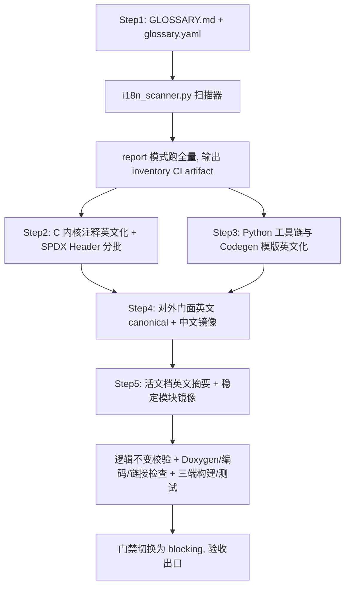

# WinkMicroOS 开源国际化准备实施计划（阶段一：术语库、代码注释英文化与对外门面双语化）

> 📋 **本文档是 WinkMicroOS 项目开源国际化改造的总体方案与阶段一实施计划**。
> 本计划遵循 `docs/implementation-plans/00-IMPLEMENTATION-PLAN-TEMPLATE.md` 规范。
>
> 🔖 **v1.2（2026-08-05）**：依据评审补充 Codegen 模板英文化、SPDX 开源 License Header 标准化、Doxygen 标签完整性检查（`--check-doxygen`）、文档相对链接校验（`--check-links`）及 UTF-8 No BOM 编码约束（`--check-encoding`）。详见文末 §9 修订记录。

---

## 1. 元数据表

| 字段 | 内容 |
|------|------|
| **计划编号** | `PLAN-20260805-OPEN-SOURCE-I18N-P1` |
| **创建日期** | `2026-08-05` |
| **目标平台/SoC** | `host` / `wasm` / `ESP32` / `Python tooling`（全平台适用） |
| **工具链/SDK版本**| `CMake v3.20+` / `ESP-IDF v5.x+v6.x` / `Emscripten v3.x` / `Python 3.10+` |
| **计划状态** | 📋 草稿（待评审） |
| **优先级** | 🟡 P1（重要开源基础设施，不阻塞当前功能开发） |
| **计划版本** | `v1.2` |
| **关联技术设计** | 无，已并入本计划 |
| **关联设计规范** | [`../../01-system-overall/00-README.md`](../../superpowers/plans/wink-micro-os-arch-restructure/00-README.md) ~ [`../../07-platform-governance/00-README.md`](../../superpowers/plans/wink-micro-os-arch-restructure/00-README.md) |
| **关联评审记录** | 无 |
| **关联 ADR** | [`ADR-0001`](../../decisions/core/0001-error-code-sign-convention.md), [`ADR-0004`](../../decisions/core/0004-static-dispatch-vs-runtime-ops.md)（翻译过程中若触发语言/文档策略决策，将新增 ADR 并回写规范） |
| **目标里程碑** | Open-Source Public Beta / Wave 3 |
| **前置依赖计划** | 无 |
| **替代/废弃** | 无 |
| **计划负责人** | WinkMicroOS 架构组 |
| **所需子代理技能** | `embedded-best-practice` + `subagent-driven-development` |

---

## 2. 背景与目标

### 2.1 问题陈述

WinkMicroOS 定位为面向 AI 生成嵌入式应用的低代码、高保真仿真与物理真机同源编译运行时。开源走向全球社区前存在两类国际化障碍：

1. **代码注释中文化**：C/C++ 内核（`wink-micro-os`）与 Python 工具链（`wink-tools`）的 Doxygen 头注释、行内注释与 Docstring 含中文。经核验（`rg -l "[一-龥]"`）约 **65 个 C/H 文件**与 **22 个 Python 文件**含中文；其中 C 代码的用户可见字符串字面量（`LOG_*`/`assert`/`printf`）实测为 **0 处中文**，故翻译主体是注释与文档，而非运行时文案。
2. **对外文档缺少英文**：仓库入口文档（`README`/`CLAUDE.md`）与核心架构规范仅提供中文，提高了非中文背景开发者的参与门槛。

由于涉及面广，必须以**工具化盘点防遗漏** + **权威术语字典** + **分阶段门禁**推进，并明确区分"持续变动的活文档"与"只读归档文档"的双语策略，避免制造无法长期维护的镜像债务。

### 2.2 技术与业务目标

- ✅ **目标 1（术语基线）**：建立 authoritative 中英文术语字典 `docs/i18n/GLOSSARY.md` + 机器可读 `glossary.yaml`（canonical 形式与别名），锁定 PAL/DAL/BAL/OSAL/HAL/UniSim/同源编译等术语的标准英文写法。
- ✅ **目标 2（防遗漏扫描器）**：实现 `i18n_scanner.py`，分类检测注释 / 字符串字面量 / 标识符中的 CJK 字符与 Non-ASCII 标点/emoji，并校验文档双语配对与链接。
- ✅ **目标 3（门禁分阶段落地）**：Phase 1 期间以 `--report`（非阻断）模式运行，翻译完成验收后切换为 blocking，集成 `wink lint --pack i18n`。
- ✅ **目标 4（代码注释英文化 & SPDX 开源 Header）**：`wink-micro-os` 与 `wink-tools`（含 Codegen C 代码模版）的注释/Docstring 全部英文化，同步注入标准 `SPDX-License-Identifier: Apache-2.0`，**仅改注释不改逻辑**，并以"剥离注释后 token 等价"自动化校验兜底。
- ✅ **目标 5（对外门面双语化）**：仓库入口文档英文 canonical、中文镜像；第 ① 层活设计规范不强求 1:1 全量镜像，采用"英文摘要 + 稳定模块择优翻译"；只读归档的 ADR 全量双语。
- ✅ **目标 6（文件编码与质量校验）**：源码与 Markdown 文件强制 `UTF-8 NO BOM` 编码；增加 Doxygen 标签格式完整性与英文文档相对链接有效性自动校验。

### 2.3 成功指标（验收出口）

| 指标 | 通过标准 | 验证方法 |
|------|----------|----------|
| **代码 CJK 注释** | 0 处（`wink-micro-os` & `wink-tools` 源码目录，排除清单生效） | `python wink-tools/tools/i18n_scanner.py --check-comments` |
| **编码规范** | 0 个文件带 BOM（全量 UTF-8 NO BOM） | `python wink-tools/tools/i18n_scanner.py --check-encoding` |
| **Doxygen 结构完整** | 公开头文件 `@brief`/`@param`/`@return` 无缺失或拼错 | `python wink-tools/tools/i18n_scanner.py --check-doxygen` |
| **文档链接有效** | 英文文档相对链接无 404 死链 | `python wink-tools/tools/i18n_scanner.py --check-links` |
| **门禁阻断** | `i18n` pack 0 error（blocking 模式启用后） | `python wink-tools/wink.py lint --pack i18n` |
| **零逻辑变更** | 注释剥离后，翻译前后非注释源码 token 等价 | `python wink-tools/tools/i18n_scanner.py --check-logic-invariant <base-ref>` |
| **对外门面双语** | `README`/`CONTRIBUTING`/`GETTING_STARTED` 具备英文版并配对 | `python wink-tools/tools/i18n_scanner.py --check-docs` |
| **同源构建** | host & wasm 0 error / 0 **新增** warning；ESP32 0 error / 项目代码 0 新增 warning | `cmake --build build_host`、`idf.py build` |
| **单元测试** | host 单测 100% 通过 | `python wink-tools/wink.py test` |

> ⚠️ "ESP32 0 warning"不作硬性指标：IDF 第三方组件可能产生其自身告警。验收以"项目自有代码 0 error、无相对基线的新增 warning"为准。

---

## 3. 变更范围与影响分析

### 3.1 文件变更清单（阶段一）

| 路径 / 模块 | 变更类型 | 说明 |
|------------|----------|------|
| `docs/i18n/GLOSSARY.md` | 🆕 新增 | 中英文专业术语与缩写权威字典（人读） |
| `docs/i18n/glossary.yaml` | 🆕 新增 | 术语 canonical/alias 机器可读映射，供 linter 校验 |
| `wink-tools/tools/i18n_scanner.py` | 🆕 新增 | 注释 CJK/编码/Doxygen/文档链接扫描 + 逻辑不变校验 |
| `wink-tools/tools/lint/packs/i18n.py` | 🆕 新增 | `i18n` lint pack（注册于 `engine/runner.py`） |
| `wink-tools/tools/lint/rules/i18n.yaml` | 🆕 新增 | i18n pack 规则配置（路径范围、排除清单、严重级别） |
| `wink-micro-os/pal/` | ✏️ 修改 | PAL 接口与 Target 实现的 Doxygen 注释英文化 + SPDX Header |
| `wink-micro-os/dal/` | ✏️ 修改 | DAL 器件驱动与注册表注释英文化 + SPDX Header |
| `wink-micro-os/bal/` `osal/` `runtime/` `trace/` | ✏️ 修改 | BAL/OSAL/调度器/Trace 注释英文化 + SPDX Header |
| `wink-micro-os/targets/` | ✏️ 修改 | host / wasm / esp32 target 实现注释英文化 + SPDX Header |
| `wink-micro-os/test/` | ✏️ 修改 | 单元/E2E 测试注释英文化（断言消息保持英文） |
| `wink-tools/tools/codegen/` | ✏️ 修改 | 代码生成脚本 Docstring 及内置 C 代码模版/字符串模版注释英文化 |
| `wink-tools/`（其他 Python 源码） | ✏️ 修改 | lint / cli 的 Docstring/注释英文化 |
| `README.md` + `README.zh-CN.md` | ✏️/🆕 | 入口 README **英文 canonical**，中文镜像 |
| `CLAUDE.md` + `CLAUDE.zh-CN.md` | ✏️/🆕 | 同上（项目指南） |
| `CONTRIBUTING.md` / `GETTING_STARTED.md` | 🆕 新增 | 英文对外贡献/上手指南（Phase 2 治理文件的最小集，Phase 1 先出英文版） |
| `docs/design/01~07/` 选定稳定模块 | 🆕 新增 | 每篇顶部英文摘要块；稳定核心模块提供 `.en.md` 镜像（非全量） |

> 📌 **盘点产物 `inventory.md` 不入库**：由扫描器在 CI 中生成并作为 artifact 上传，加入 `.gitignore`，避免反复 merge 冲突。

### 3.2 排除清单（扫描器必须忽略）

以下路径不纳入 CJK 检查（不属项目自有源码或为生成物/第三方代码）：

- `**/build*/`、`**/dist/`、`**/__pycache__/`、`**/*.pyc`
- `wink-micro-os/third_party/`
- `wink-micro-os/codegen/` 下未提交的生成产物（以 `.gitignore` 为准）
- `docs/design/04-wasm-simulation/`、`04-wasm-simulation-1.0/` 等已归档只读历史（见 Phase 2）
- `.trae/`、`.idea/`、`.vscode/` 等 IDE 目录
- 二进制与资源文件

### 3.3 接口影响分析

| 接口层 | 是否有破坏性变更 | 影响范围 | 备注 |
|--------|------------------|----------|------|
| **PAL / DAL / BAL / OSAL API** | ❌ 否 | 无 | 仅改注释，函数签名/宏/类型/逻辑 100% 不变 |
| **构建系统 & 工具链** | ❌ 否 | 无 | 源码统一 UTF-8 NO BOM + 纯 ASCII 注释，显著降低跨平台编译器编码风险 |
| **文档结构** | ❌ 否 | 低 | 原中文 `.md` 保留；新增英文镜像；入口文档改英文 canonical |

### 3.4 架构红线

> 🚨 **架构红线：违反即拒绝合入**
> 1. **零代码逻辑变更**：仅翻译注释/Docstring，禁止改动任何可执行代码、宏、函数名、变量名；以 §4.4 的逻辑不变校验自动兜底。
> 2. **术语严格对齐**：专有缩写（PAL/DAL/BAL/OSAL/HAL/UniSim 等）与架构术语必须遵循 `GLOSSARY.md` 的 canonical 形式，禁止直译或大小写漂移。
> 3. **Doxygen 结构保留**：`@brief/@param/@return/@retval/@note/@code` 等标签原样保留，只译自然语言部分，参数名必须与 C 签名完全一致。
> 4. **SPDX Header 标准化**：在清洗 C/Python 文件头注释时，文件第一行统一注入 `// SPDX-License-Identifier: Apache-2.0`（C/C++）或 `# SPDX-License-Identifier: Apache-2.0`（Python）。
> 5. **文件编码强制 UTF-8 NO BOM**：防止 Windows 编辑器隐式插入 BOM 造成 GCC/Clang/Emscripten 交叉编译告警。
> 6. **门禁单向收敛**：blocking 模式启用后，新增 CJK 注释/禁用术语一律阻断 PR，不允许临时放宽（允许路径级、有时效的 allowlist，但需 issue 跟踪）。

---

## 4. 详细实施方案



### 4.1 扫描器设计 (`i18n_scanner.py`)

#### 4.1.1 技术选型（按语言区分，避免过度工程）

| 语言 | 提取注释方式 | 理由 |
|------|-------------|------|
| **C/C++ (.c/.h/.cpp/.hpp)** | 词法正则状态机：剥离字符串/字符字面量后匹配 `// ...` 与 `/* ... */` | C 无标准库 tokenizer；自写完整 lexer 成本高且无必要。状态机能正确规避字符串内的 `//`、`/*` 与转义引号，满足检测需求 |
| **Python (.py)** | 标准库 `tokenize` 模块，取 `COMMENT` token 与字符串/`__doc__` | 精确、零依赖，天然区分注释与代码字符串 |
| **CMake / YAML / TS** | Phase 1 **仅报告不翻译**（report-only）；TS 属 Phase 2 前端范围 | 与本阶段范围一致，避免 §3.1 / Phase 2 自相矛盾 |

#### 4.1.2 分类报告（不能"匹配到中文就报错"）

扫描器按语义分类输出，不同类别处置不同：

| 类别 | 检测目标 | Phase 1 处置 |
|------|----------|-------------|
| **COMMENT** | 注释/Docstring 内的 CJK | 必须翻译 |
| **STRING_LITERAL** | 字符串字面量内的 CJK（运行时/用户可见文案） | 实测为 0；若发现属用户可见文案，**走 i18n 抽离**而非删除，单独立项 |
| **IDENTIFIER** | 标识符中的 CJK | 禁止（重构命名，需 ADR/评审） |
| **NON_ASCII_EMOJI** | 注释中的 emoji / 全角标点（如 `✅ ⚠️`、`，；（）`） | 代码注释一律转 ASCII；文档 `.md` 允许 |
| **ENCODING_BOM** | 文件开头的 Byte Order Mark (`0xEF, 0xBB, 0xBF`) | 必须消除（转为 UTF-8 NO BOM） |

> 代码注释同时禁 CJK 与 emoji/全角标点；Markdown 文档允许 emoji。gcc 编译侧以 `-finput-charset=UTF-8` 兜底，但项目代码注释目标是纯 ASCII。

#### 4.1.3 Doxygen 结构校验 (`--check-doxygen`)
- 扫描 C 公开头文件（`pal/include/`、`dal/include/` 等），校验 `@brief`、`@param`、`@return` 标签格式。
- 校验 `@param` 后的参数名是否与 C 函数原型原型中的参数名 1:1 匹配，防止重构注释时参数名拼错。

#### 4.1.4 文档配对与链接检查 (`--check-docs` & `--check-links`)
- 对外门面文件（`README.md`、`CONTRIBUTING.md`、`GETTING_STARTED.md`）必须存在，且中文镜像命名为 `*.zh-CN.md`（英文 canonical）。
- 对第 ① 层活文档：**不强制全量 `.en.md`**，仅校验"每篇含顶部英文摘要块"；被列入 `docs/i18n/translate-targets.yaml` 的稳定模块才强制配对 `.en.md`。
- `--check-links` 校验英文文档中的相对链接：目标优先指向对应的 `.en.md`，确保无 404 死链。
- ADR（只读归档）纳入 Phase 2 全量双语，Phase 1 不阻断。

### 4.2 术语治理 (Terminology Governance)

#### 4.2.1 权威术语字典 `docs/i18n/GLOSSARY.md` + `glossary.yaml`

`GLOSSARY.md` 为人读字典，`glossary.yaml` 为机器可读 canonical/alias 映射，供 linter 校验英文产物的术语一致性。结构示例：

```yaml
# glossary.yaml
canonical_forms:
  - canonical: "Platform Abstraction Layer (PAL)"
    aliases: ["Pal", "pal layer", "platform abstraction"]
    acronym: "PAL"          # 正文中保留大写缩写
  - canonical: "single-source dual-target compilation"
    aliases: ["single source", "single-source", "dual-target single-source"]
  - canonical: "compile-time static dispatch"
    aliases: ["static dispatch", "compile time dispatch"]
forbidden:
  - "friend"          # 误译 PAL 的机翻痕迹
  - "Dali"            # 误译 DAL
```

##### (A) 专有名词与分层缩写（保留大写，禁止直译）
- `PAL` Platform Abstraction Layer
- `DAL` Device Abstraction Layer
- `BAL` Business/Behavior Abstraction Layer
- `OSAL` Operating System Abstraction Layer
- `HAL` Hardware Abstraction Layer
- `UniSim` behavior-level high-fidelity Wasm simulation engine
- `Wokwi` external hardware netlist simulation adapter
- `ESP-IDF` / `Emscripten` target SDKs

##### (B) 核心架构概念标准化映射
- 同源编译 → `single-source dual-target compilation`
- 编译期静态分发 → `compile-time static dispatch`（ADR-0004 POD 结构体静态派发）
- 行为级高保真 → `behavioral high-fidelity simulation`
- 活文档 / 架构真相 → `living specification` / `Single Source of Truth (SSOT)`
- 负数错误码约定 → `negative status-code convention`（ADR-0001 `wink_status_t`）
- POD 结构体 → `Plain Old Data (POD) struct`
- 中断上下文 / 临界区 → `ISR context` / `critical section`
- 栈钳位 / 僵尸资源回收 → `stack clamping` / `zombie resource reclamation`

#### 4.2.2 3-Pass 翻译流水线
1. **Pass 1 — Term Locking**：提取文本，依据 `glossary.yaml` 将术语/缩写占位锁定，避免机翻误译。
2. **Pass 2 — Contextual Idiomatic Phrasing & SPDX Header**：
   - 采用 Doxygen 风格与祈使句（`@brief Initializes ...` 而非 `This function is used to init ...`），保留所有标签结构。
   - 文件最顶行注入标准 `SPDX-License-Identifier: Apache-2.0`。
3. **Pass 3 — Glossary Lint**：落盘前运行 `i18n_scanner.py --check-glossary`，校验 canonical 形式、禁用词、大小写一致性（不是抓中文错别字）。

---

### 4.3 双语文档架构规范

#### 4.3.1 命名约定（英文 canonical）

| 文档类型 | 英文（canonical） | 中文镜像 |
|----------|-------------------|----------|
| 入口/对外文档 | `README.md`、`CONTRIBUTING.md` | `README.zh-CN.md`、`CONTRIBUTING.zh-CN.md` |
| 第 ① 层活文档（已译模块） | `doc-name.en.md` | `doc-name.md`（中文为源） |
| ADR（Phase 2） | `NNNN-title.en.md` | `NNNN-title.md` |

> 入口文档遵循 GitHub 惯例以英文为 `README.md`；第 ① 层设计规范当前中文为事实源，故英文作 `.en.md` 镜像，避免一次性重写所有中文链接。

#### 4.3.2 顶部语言切换块

所有双语文档顶部注入 GitHub 风格提示块：

```markdown
> [!NOTE]
> **Language:** [English](doc-name.en.md) | [中文](doc-name.md)
```

未提供全量镜像的活文档，顶部改为**英文摘要块**（约 5–10 行概述本文范围与关键结论），不挂语言切换链接。

### 4.4 零逻辑变更护栏（关键自动化）

翻译注释时手滑改代码是本计划最大风险，故引入可自动化的等价校验：

- `i18n_scanner.py --check-logic-invariant <base-ref>`：对每个被改的 C/H/Python 文件，用同一套注释剥离器移除注释与 Docstring，归一化空白后比对 `<base-ref>`；若非注释内容存在差异则 **fail** 并打印 diff 行。
- 该检查在 §5 每个子任务批次合入前必须通过；它把"零逻辑变更"从口号变成机器可验证的硬门禁。
- C 侧剥离器与 §4.1 复用同一状态机；Python 侧用 `tokenize` 过滤 `COMMENT`/`STRING`(docstring) token 后重建。

### 4.5 Lint 接入方式（修正）

`wink lint` 的 pack 位于 `wink-tools/tools/lint/packs/*.py`，由 `engine/runner.py` 按 pack 名硬编码分发。新增 i18n 检查有两种接入方式，本计划采用**方式 A**：

- **方式 A（推荐，新增独立 pack）**：新增 `packs/i18n.py` 并在 `runner.py` 的分发逻辑加入 `if pack_set & {"i18n", "all"}:`。优点：可承载 inventory、glossary、文档配对、逻辑不变等多维检查。
- 方式 B（仅中文注释检测时可考虑）：直接复用现有 `packs/regex_ban.py` 的 `deny_content_regex` path_rule，把 CJK 检测作为 `layering` pack 的一条 YAML 规则。无需写 Python，但无法承载分类报告与文档配对。

> ⚠️ 注意：原计划写的 `wink-tools/lint/rules/` 路径不存在，正确路径是 `wink-tools/tools/lint/rules/`。

---

## 5. 任务拆分与执行阶段

> **执行原则**：按模块拆为独立 commit/PR，每批单独过 host/wasm/ESP32 三端构建与 `--check-logic-invariant`；严禁把 65+22 个文件塞进一个巨型 PR。

### 5.1 阶段一（Phase 1）

| 步骤 | 任务 | 细分内容 | 产出物 |
|------|------|---------|-------|
| **Step 1** | 术语库 + 扫描器 + report 门禁 | ① 写 `GLOSSARY.md`/`glossary.yaml`<br>② 写 `i18n_scanner.py`（含 CJK/BOM/Doxygen/Link 校验）<br>③ 新增 `packs/i18n.py`+`rules/i18n.yaml`，注册 `runner.py`<br>④ 以 **report 模式**跑全量，输出 inventory（CI artifact，不入库） | `docs/i18n/*`、`wink-tools/tools/i18n_scanner.py`、lint pack |
| **Step 2** | C 内核注释英文化 + SPDX（分批） | 每批一个模块、独立 PR（同步注入 SPDX Header）：<br>2a `pal/`<br>2b `dal/`<br>2c `bal/` + `osal/` + `runtime/` + `trace/`<br>2d `targets/`(host/wasm/esp32)<br>2e `test/`<br>每批过 Doxygen 标签校验 + 逻辑不变校验 + 三端构建 | 全量英文注释与 SPDX Header 的 C 代码库 |
| **Step 3** | Python 工具链与 Codegen 模版英文化 | ① `tools/codegen/` Docstring、注释及内置 C 模版/字符串模版注释英文化<br>② `tools/lint/` & `tools/cli/`<br>③ 注入 `# SPDX-License-Identifier: Apache-2.0`<br>④ 用 `tokenize` 校验逻辑不变 | 全量英文 Docstring 的 Python 工具链 |
| **Step 4** | 对外门面双语 | ① `README.md` 英文 canonical + `README.zh-CN.md`<br>② `CLAUDE.md` 同理<br>③ 英文 `CONTRIBUTING.md`/`GETTING_STARTED.md`（中文镜像可延后） | 仓库入口英文文档 |
| **Step 5** | 活文档英文摘要 + 稳定模块镜像 | ① 为 `01~07` 每篇规范加顶部英文摘要块<br>② 从 `translate-targets.yaml` 选定稳定模块（建议先 01-overall、02-pal、04-wasm-simulation overview）译 `.en.md`<br>③ 运行 `--check-links` 验证跳转无死链 | 可被全球开发者导航的活文档 |
| **Step 6** | 门禁切换与验收 | ① 全量 CJK 归零 & BOM 清零<br>② 门禁由 report 切 **blocking**<br>③ 跑 §6 验收清单<br>④ 抽样人工复核（§6.3） | blocking i18n 门禁 + 验收记录 |

### 5.2 阶段二（Phase 2 Roadmap，预告）

Phase 1 验收通过后启动：
1. **ADR 全量双语**（`docs/decisions/`，当前已至 ADR-0057+，不写死上限）：只读归档、翻译一次即永久，最适合全量镜像。
2. **技术设计规格双语**（`docs/tech-designs/`）。
3. **前端 UI i18n**（`embedded-frontend/`）：UI 字符串抽离 + 多语言资源；TS 扫描器在此阶段由 report-only 升级为强制。
4. **开源治理文件完善**：`CODE_OF_CONDUCT.md`、`SECURITY.md`、`LICENSE` 复核等。
5. **已归档历史文档**（`04-wasm-simulation/` 1.0/2.0）按需处理，不优先。

---

## 6. 验证与测试计划

### 6.1 自动化检查
```powershell
# 代码注释 CJK / emoji 检测（含分类）
python wink-tools/tools/i18n_scanner.py --check-comments
# UTF-8 NO BOM 编码检查
python wink-tools/tools/i18n_scanner.py --check-encoding
# Doxygen 标签格式完整性与参数名对齐校验
python wink-tools/tools/i18n_scanner.py --check-doxygen
# 英文文档相对链接有效性校验（无 404 死链）
python wink-tools/tools/i18n_scanner.py --check-links
# 文档双语配对 / 英文摘要
python wink-tools/tools/i18n_scanner.py --check-docs
# 术语 canonical 一致性
python wink-tools/tools/i18n_scanner.py --check-glossary
# 零逻辑变更（对每个 Step 2/3 批次，base-ref 为该批分支基线）
python wink-tools/tools/i18n_scanner.py --check-logic-invariant origin/master
# 门禁
python wink-tools/wink.py lint --pack i18n
```

### 6.2 构建与同源编译验证
```powershell
# host
cmake -S wink-micro-os -B wink-micro-os/build_host
cmake --build wink-micro-os/build_host
# wasm（按项目既定命令）
# ESP32（见 memory: 须经 EIM profile + PowerShell，不直接从 git-bash 调 idf.py）
```
ESP32 构建验收口径：项目自有代码 0 error、0 相对基线新增 warning。

### 6.3 人工抽样复核 (Review)
- 每模块随机抽 ≥10% 的 C/Python 文件，核验英文地道性、Doxygen 标签完整性、术语 canonical 一致性及 SPDX Header。
- PAL/DAL **公开头文件**的 API 契约注释（`@param/@return/@retval`）须由熟悉该层的人逐篇复核——API 契约的机翻错误比中文注释更危险。
- 验证 GitHub 渲染下语言切换块链接可达、英文摘要块显示正常。
- 确认 `GLOSSARY.md` 覆盖翻译中实际遇到的新增专有名词。

---

## 7. 风险与缓解

| 风险 | 影响 | 缓解措施 |
|------|------|---------|
| 巨型 PR 不可评审、易夹带逻辑改动 | 高 | 按 §5.1 模块分批；每批过 `--check-logic-invariant` |
| Codegen 生成的代码带中文导致 CI 报错 | 高 | §5.1 Step 3 显式覆盖 `tools/codegen/` 内置 C 代码与字符串模版注释 |
| 活文档全量镜像长期过期 | 高 | 不强制全量镜像；摘要 + 稳定模块择优；门禁不阻断活文档更新 |
| 机翻误译 API 契约误导调用者 | 高 | 公开头文件逐篇人工复核；`--check-doxygen` 校验 + 术语 3-Pass |
| 英文文档中相对链接挂死 404 | 中 | 集成 `--check-links` 自动化链接有效性校验 |
| Windows 编辑器插入 BOM 头导致交叉编译报错 | 中 | 接入 `--check-encoding` 强约束 UTF-8 NO BOM |
| 门禁一开全红阻断开发 | 中 | Phase 1 report 模式，Step 6 才切 blocking |
| 扫描器误伤字符串内中文 | 中 | 按语义分类（COMMENT/STRING/IDENTIFIER），字符串走 i18n 抽离而非删除 |
| 排除清单漏扫生成代码/第三方 | 低 | 以 `.gitignore` + 显式排除清单双保险；inventory 在 CI 可见 |
| inventory.md 入库产生冲突 | 低 | 不入库，作 CI artifact |

---

## 8. 时间与排期建议（粗略）

| 步骤 | 预估 | 可并行 |
|------|------|--------|
| Step 1 工具链 | 1–2 天 | 否（其余步骤前置） |
| Step 2a–2e C 分批 | 每批 0.5–1.5 天 | 模块间可并行（不同负责人） |
| Step 3 Python & Codegen 模版 | 1–2 天 | 与 Step 2 可并行 |
| Step 4 门面文档 | 1–2 天 | 与 Step 2/3 可并行 |
| Step 5 活文档摘要/镜像 | 2–4 天 | 摘要快、镜像按需 |
| Step 6 验收切换 | 0.5–1 天 | 否 |

---

## 9. 修订记录

- **v1.2（2026-08-05）**
  - 补充 Codegen 代码生成器模版（`tools/codegen/` 内置 C 代码片段字符串模版）注释英文化要求（Step 3）。
  - 引入 SPDX License Header 标准化规范（`// SPDX-License-Identifier: Apache-2.0`），重构文件头注释时一并注入。
  - 增加 Doxygen 标签格式完整性与参数名匹配校验（`--check-doxygen`）。
  - 增加英文文档相对链接有效性检测（`--check-links`），规避 404 挂死。
  - 增加文件 UTF-8 NO BOM 编码强制检测（`--check-encoding`），消除跨平台编译告警。
- **v1.1（2026-08-05）**
  - 修正 lint 接入路径（`wink-tools/tools/lint/`，非 `wink-tools/lint/`）与 pack 注册方式（新增 `packs/i18n.py` + 改 `engine/runner.py`）。
  - C 扫描器由"AST/tokenizer"降级为"词法正则状态机"；Python 用 stdlib `tokenize`；TS/CMake Phase 1 report-only。
  - 扫描结果按 COMMENT/STRING_LITERAL/IDENTIFIER/NON_ASCII_EMOJI 分类，不一刀切。
  - 门禁增加 report → blocking 两阶段策略。
  - 重新界定 Tier 1：入口文档英文 canonical；活文档不强求全量镜像（英文摘要 + 稳定模块）；ADR 留 Phase 2 全量双语。
  - 新增"剥离注释后 token 等价"的零逻辑变更自动化护栏。
  - 新增排除清单、emoji/全角标点策略、`inventory.md` 不入库。
  - 验收"0 warning"修正为"0 新增 warning"；ADR 编号去掉写死上限（现至 ADR-0057+）。
  - Step 2 按模块拆分为 2a–2e 可独立评审批次；补充风险表与排期。
- **v1.0（2026-08-05）**：初稿。

