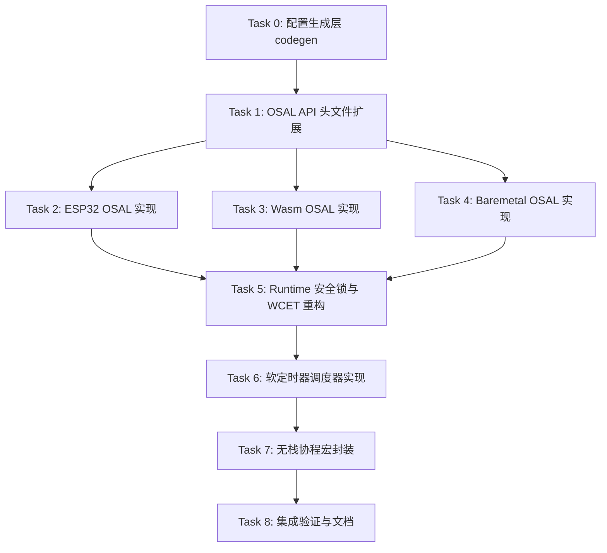

# 协作式执行模型完整落地实施计划

> 📋 **本文档基于模板 v2.0 编制**：实现 ADR-0007 确立的"底层 Task-driven 定时器调度 + 表层无栈协程"混合架构，包含多核安全隔离与多系统自适应。
>
> 🎯 **计划版本**：v1.0
> 📚 **关联规范**：`docs-adr.md` 五层文档体系、`02-wink-micro-os/` 设计规范
> 🤖 **Agent 友好**：本计划优化用于 Agentic Workflow 自动执行

---

## 1. 元数据表（🔴 必选）

| 字段 | 内容 |
|------|------|
| **计划编号** | `PLAN-20260627-COOP-EXEC` |
| **创建日期** | 2026-06-27 |
| **目标平台/SoC** | `host` / `wasm` / `ESP32` / `ESP32-S3` / `bare-metal` |
| **工具链/SDK版本**| `ESP-IDF v6.0.1` / `GCC v13.2` / `Emscripten v3.1.61` |
| **计划状态** | ✅ 已执行（2026-06-28 真机闭环验证通过，[评审记录](../../reviews/core/2026-06-28-cooperative-loop-esp32-hardware-verification.md)）。注：下文 Task/Step 级 ⏳ 待开始 / [ ] 标记未事后回填，实际完成情况以代码 + 评审记录为准。 |
| **优先级** | 🔴 P0（阻塞后续 AI Codegen 功能开发） |
| **计划版本** | `v1.0` |
| **关联技术设计** | 无，已并入本计划 |
| **关联设计规范** | [`../02-wink-micro-os/`](../02-wink-micro-os/) |
| **关联评审记录** | [`2026-06-28-cooperative-loop-esp32-hardware-verification.md`](../../reviews/core/2026-06-28-cooperative-loop-esp32-hardware-verification.md) |
| **关联 ADR** | [`ADR-0007`](../../decisions/core/0007-cooperative-loop-execution-model.md) |
| **目标里程碑** | Wave 2 - Runtime 增强 |
| **前置依赖计划** | 无 |
| **替代/废弃** | 无 |
| **计划负责人** | Claude Code |
| **所需子代理技能** | `embedded-best-practice` + `subagent-driven-development` |

---

## 2. 背景与目标（🔴 必选）

### 2.1 问题陈述

现有 `wink_runtime_run` 采用单一协作循环架构，当面临多速率任务、长 I/O 阻塞、多核处理器、裸机/RTOS/Wasm 多环境适配时存在设计张力。具体问题包括：
- 多速率任务需手写分频计数器，代码繁琐
- 全局 WCET 检测在多任务重合时产生 8002 虚警
- Tick 周期配置分散在各编译标志中，缺乏单一事实来源
- 多核环境下控制环抖动受网络中断干扰
- 应用层需感知底层平台差异，破坏同源编译承诺

### 2.2 技术/业务目标

- ✅ **目标 1**：实现"底层软定时器调度 + 表层无栈协程"混合架构
- ✅ **目标 2**：应用层零感知平台差异，100% 平台无关代码
- ✅ **目标 3**：WCET 细粒度监控，单个任务级耗时检测，消除虚警
- ✅ **目标 4**：安全锁物理强截断，WDT/Panic 复位后绝不执行用户代码
- ✅ **目标 5**：双核非对称物理隔离，Core 1 控制环抖动 < 1%
- ✅ **目标 6**：Tick 周期配置单一事实来源，`wink_app.json` 统一定义
- ✅ **目标 7**：三平台零警告编译通过（host/esp32/wasm）

### 2.3 成功指标（验收出口）

| 指标 | 通过标准 | 验证方法 |
|------|----------|----------|
| host 单元测试 | 100% 通过 | `python wink-tools/wink.py test` |
| ESP32 构建 | 0 error, 0 warning | `idf.py -C esp32_firmware build` |
| Wasm 构建 | 0 error, 0 warning | `emcmake cmake + make` |
| 安全锁测试 | WDT 复位后 init/loop 零调用 | Host 单元测试断言 |
| WCET 细粒度 | 多任务重合不触发 8002 虚警 | Host 单元测试 |
| 双核抖动 | Core 1 控制环周期抖动 < 1% | ESP32 实测 + 示波器 |
| RingBuffer 吞吐 | 跨核数据零丢失零阻塞 | ESP32 压力测试 |

---

## 3. 变更范围与影响分析（🔴 必选）

### 3.1 文件变更清单

| 文件路径 | 变更类型 | 说明 |
|----------|----------|------|
| `wink-micro-os/tools/codegen_config.py` | 🆕 新增 | 解析 wink_app.json 生成 wink_config.h |
| `wink-micro-os/pal/include/pal_osal.h` | ✏️ 修改 | 新增 pal_task_create 和 pal_ringbuf_* API |
| `wink-micro-os/targets/esp32/pal_osal_esp32.c` | ✏️ 修改 | 实现 FreeRTOS 桥接任务与 RingBuffer |
| `wink-micro-os/targets/wasm/pal_osal_wasm.c` | ✏️ 修改 | 实现 Wasm 微任务与内存 RingBuffer |
| `wink-micro-os/targets/baremetal/pal_osal_bare.c` | 🆕 新增 | 裸机降级实现，任务创建返回 UNSUPPORTED |
| `wink-micro-os/runtime/include/wink_app.h` | ✏️ 修改 | 新增 WINK_PT_* 无栈协程宏定义 |
| `wink-micro-os/runtime/src/wink_runtime.c` | ✏️ 修改 | 重构安全锁、WCET 细粒度监控、软定时器轮询 |
| `wink-micro-os/runtime/include/wink_runtime.h` | ✏️ 修改 | 新增软定时器相关类型定义 |
| `wink-micro-os/runtime/src/wink_soft_timer.c` | 🆕 新增 | 软定时器调度器实现 |
| `wink-micro-os/runtime/include/wink_soft_timer.h` | 🆕 新增 | 软定时器 API 头文件 |
| `wink-app.json` | ✏️ 修改 | 新增 tick_ms 配置项 |
| `wink-micro-os/CMakeLists.txt` | ✏️ 修改 | 集成 codegen_config.py 与新增源文件 |

### 3.2 接口影响分析

| 接口层 | 是否有破坏性变更 | 影响范围 | 备注 |
|--------|------------------|----------|------|
| PAL 公开 API | ⚠️ 是（仅新增） | 所有 target 实现 | 新增 `pal_task_create` 和 `pal_ringbuf_*`，原有 API 不变 |
| DAL 层 | ❌ 否 | 无 | 无影响 |
| 应用层 | ❌ 否 | 应用代码可逐步迁移 | 新增协程语法糖可选使用，原 loop 范式完全兼容 |
| 构建系统 | ⚠️ 是 | 所有编译目标 | 新增 codegen 步骤，生成 wink_config.h |
| 工具链 | ❌ 否 | 无 | 无影响 |
| 文档 | ⚠️ 是 | API 文档与用户指南 | 需新增协程编程指南 |

### 3.3 架构红线（⚠️ 必须明确标注）

> 🚨 **架构红线：违反即拒绝合入**
> 1. **应用层零感知原则**：App/BAL 代码严禁包含 `#ifdef BARE_METAL`、`#ifdef USE_FREE_RTOS` 等平台感知宏
> 2. **安全锁强截断原则**：检测到 WDT/Panic 复位后，必须直接进入 fault 状态，严禁执行任何用户回调
> 3. **双核隔离原则**：应用协程必须固定在 Core 1 单线程运行，严禁自动分发到多核并行
> 4. **跨核通信原则**：跨核通信仅允许使用 OSAL RingBuffer，禁止任何阻塞同步原语
> 5. **配置 SSOT 原则**：`WINK_RUNTIME_TICK_MS` 必须仅由 `wink_app.json` 定义，禁止硬编码或重复定义

### 3.4 系统资源与并发约束评估（🔴 系统级/硬件相关计划必选）

| 资源/安全维度 | 预计变化/开销 | 风险与限制 | 缓解/应对策略 |
|--------------|--------------|-----------|--------------|
| **ROM / Flash 占用** | 预计增加 ~4KB（软定时器 ~2KB，RingBuffer ~2KB） | 低端 MCU 空间紧张 | 提供编译宏 `WINK_CONFIG_SOFT_TIMER=n` 可裁剪 |
| **RAM (静态/全局)** | 软定时器控制块 ~128B + RingBuffer 缓冲区（可配置） | 静态内存占用可控 | 定时器数量编译期配置，默认上限 16 个 |
| **栈深度 (Stack)** | 协程无额外栈开销；任务创建栈深度由用户指定 | 协程内深嵌套可能栈溢出 | 提供编译期栈深度检查与运行时探针 |
| **堆内存 (Dynamic Heap)** | FreeRTOS 任务创建动态分配 TCB；Wasm 侧 malloc RingBuffer | 堆碎片风险 | 初始化时一次性分配所有资源，运行期零分配 |
| **硬件通道/IO引脚** | 无新增硬件占用 | 无 | 无 |
| **并发与中断安全** | 跨核 RingBuffer 需自旋锁保护；ISR 内严禁调用 RingBuffer 阻塞 API | 死锁与优先级反转风险 | 自旋锁持有时间 < 1μs；ISR 仅用非阻塞版本 |

---

## 4. 依赖与风险（🔴 必选）

### 4.1 前置依赖

| 依赖ID | 依赖内容 | 是否阻塞 | 验证状态 | 备注 |
|--------|----------|----------|----------|------|
| D-001 | ADR-0007 技术方案已确认 | ✅ 是 | ✅ Proposed 状态，内容已确认 | |
| D-002 | 现有 host 单元测试框架可用 | ✅ 是 | ✅ 已验证 | |
| D-003 | ESP-IDF v6.0.1 环境可用 | ✅ 是 | ✅ 已验证 | |

### 4.2 外部依赖（非本项目可控）

| 依赖ID | 依赖内容 | 提供方 | 截止日期 | 风险等级 | 备注 |
|--------|----------|--------|----------|----------|------|
| E-001 | ESP-IDF FreeRTOS RingBuffer 组件稳定性 | Espressif | 2026-06-30 | 🟡 中 | v6.x 已有该组件，需验证 API 稳定性 |
| E-002 | Emscripten Asyncify 微任务调度一致性 | Emscripten | 2026-06-30 | 🟢 低 | 已有成熟实现 |

### 4.3 风险登记册

> 严重度 = 概率 × 影响（高=3 / 中=2 / 低=1），≥5 为高风险

| 风险ID | 风险描述 | 概率 | 影响 | 严重度 | 缓解措施 | 责任人 | 触发条件 |
|--------|----------|------|------|--------|----------|--------|----------|
| R-001 | ESP-IDF v6.x RingBuffer API 与预期不符 | 🟡 中 | 🟠 中 | 4 | 先写抽象层封装，底层可替换为自定义实现 | Claude | 编译失败 / 运行时崩溃 |
| R-002 | 无栈协程局部变量未声明 static 导致状态丢失 | 🔴 极高 | 🔴 极高 | **9** | 1. 宏级栈毒化让问题 100% 复现，消除"碰巧能用"假象<br>2. 静态分析脚本集成到 CI，编译期自动拦截<br>3. State 结构体模板 API 引导正确用法<br>4. 头文件开头恐吓式警告文档<br>5. 所有示例代码只展示正确模式 | Claude | 任何协程内含有非 static 变量声明 |
| R-003 | 跨核 RingBuffer 自旋锁优先级反转导致死锁 | 🟢 低 | 🔴 高 | 3 | 1. 自旋锁持有时间严格 < 1μs 2. 关中断临界区保护 | Claude | 真机压力测试死锁 |
| R-004 | 软定时器任务过多导致单次 Tick 处理超时 | 🟡 中 | 🟠 中 | 4 | 1. 编译期配置最大定时器数量 2. 运行时过载检测告警 | Claude | WCET 超限告警 |
| R-005 | wink_config.h 生成时机不当导致增量编译失败 | 🟡 中 | 🟡 中 | 4 | CMake 使用 configure_file + 正确依赖管理 | Claude | 增量编译未更新配置 |

### 4.4 跨团队/跨模块协调点

| 协调点ID | 描述 | 涉及团队/模块 | 计划协调时间 | 状态 | 负责人 |
|----------|------|---------------|--------------|------|--------|
| C-001 | 前端 Wasm 仿真侧 Asyncify 微任务对齐 | 前端 / Runtime | Task 5 开始前 | ⏳ 待确认 | Claude |
| C-002 | AI Codegen 规则更新支持协程语法 | Codegen / Runtime | 全部完成后 | ⏳ 待确认 | Claude |

---

## 5. 优先级路线图（多 Task 计划 🟡 必选）

### 5.1 执行顺序



> 文字说明：配置生成层 → OSAL 头文件 → 三平台 OSAL 并行实现 → Runtime 核心重构 → 软定时器 → 协程封装 → 集成验证

### 5.2 优先级矩阵

| 优先级 | Task 数量 | 总预估工时 | 说明 |
|--------|-----------|------------|------|
| 🔴 P0 | 10 | ~25 h | 核心架构必须完成 |
| 🟡 P1 | 0 | 0 h | 无 |
| ⚪ P2 | 0 | 0 h | 无 |
| **总计** | **9** | **~24 h** | |

### 5.3 关键路径分析

- 关键路径：`Task 0 → Task 1 → Task 2 → Task 5 → Task 6 → Task 7 → Task 8 → Task 9`（总工时 ~19 h）
- 可并行路径：`Task 3 / Task 4`（Wasm/Baremetal OSAL 实现，与 ESP32 并行节省 ~4 h）

### 5.4 跨 Task 文件冲突矩阵

| 文件 | 涉及 Task | 串行约束 |
|------|-----------|----------|
| `pal_osal.h` | Task 1 | Task 2/3/4 必须等待 Task 1 完成后才能开始 |
| `wink_runtime.c` | Task 5 | 串行执行 |
| `CMakeLists.txt` | Task 0 / Task 5 / Task 6 | 需注意合并冲突，建议按 Task 顺序增量修改 |

---

## 6. 详细任务拆分与进度追踪（🔴 必选）

> ✅ **Task 完成定义（统一 DoD）**：
> 1. 代码已编写并符合编码规范
> 2. 新增代码有对应的单元测试（覆盖率 ≥ 80%）
> 3. `python wink-tools/wink.py test` 全部通过
> 4. `idf.py -C esp32_firmware build` 零错误零警告
> 5. 相关设计文档已同步更新
> 6. 代码已提交，Commit message 符合规范
> 7. CI 检查通过（如有）

---

### Task 0：配置生成层 codegen `[ 状态: ⏳ 待开始 ]`

| 字段 | 内容 |
|------|------|
| **负责人** | Claude Code |
| **预估 / 实际工时**| 2 小时 / 小时 |
| **优先级** | 🔴 P0 |
| **前置依赖** | 无 |
| **修改文件** | `wink-micro-os/tools/codegen_config.py`（新建）, `wink-app.json`, `wink-micro-os/CMakeLists.txt` |
| **接口变化** | 新增 `wink_config.h` 生成产物 |

#### 详细步骤

- [ ] **Step 1：更新 wink-app.json 增加 tick_ms 配置**

  在根目录 `wink-app.json` 中增加：
  ```json
  {
    "name": "wink-ai-embedded",
    "version": "1.0.0",
    "target_board": "esp32_devkitc",
    "tick_ms": 10,
    "max_soft_timers": 16
  }
  ```

- [ ] **Step 2：编写 codegen_config.py 脚本**

  新建 `wink-micro-os/tools/codegen_config.py`：
  ```python
  #!/usr/bin/env python3
  """Generate wink_config.h from wink_app.json"""
  import json
  import argparse
  import os

  def main():
      parser = argparse.ArgumentParser()
      parser.add_argument('--input', required=True, help='Path to wink_app.json')
      parser.add_argument('--output', required=True, help='Path to output wink_config.h')
      parser.add_argument('--target', default='esp32', help='Target platform')
      args = parser.parse_args()

      with open(args.input, 'r', encoding='utf-8') as f:
          config = json.load(f)

      tick_ms = config.get('tick_ms', 10)
      max_timers = config.get('max_soft_timers', 16)

      target_macro = {
          'esp32': 'WINK_TARGET_ESP32',
          'wasm': 'WINK_TARGET_WASM',
          'host': 'WINK_TARGET_HOST',
          'baremetal': 'WINK_TARGET_BARE_METAL'
      }.get(args.target, 'WINK_TARGET_UNKNOWN')

      os.makedirs(os.path.dirname(args.output), exist_ok=True)

      with open(args.output, 'w', encoding='utf-8') as f:
          f.write(f"""/**
 * Auto-generated by codegen_config.py - DO NOT EDIT MANUALLY!
 * Source: {args.input}
 * Target: {args.target}
 */

#ifndef WINK_CONFIG_H
#define WINK_CONFIG_H

#define WINK_RUNTIME_TICK_MS    ({tick_ms}U)
#define WINK_MAX_SOFT_TIMERS    ({max_timers}U)
#define {target_macro}           (1)

#endif /* WINK_CONFIG_H */
  """)

  if __name__ == '__main__':
      main()
  ```

- [ ] **Step 3：集成到 CMakeLists.txt**

  在 `wink-micro-os/CMakeLists.txt` 中增加：
  ```cmake
  # Generate wink_config.h from wink_app.json
  set(WINK_CONFIG_DIR ${CMAKE_BINARY_DIR}/generated)
  set(WINK_CONFIG_H ${WINK_CONFIG_DIR}/wink_config.h)

  add_custom_command(
      OUTPUT ${WINK_CONFIG_H}
      COMMAND ${PYTHON_EXECUTABLE} ${CMAKE_CURRENT_SOURCE_DIR}/tools/codegen_config.py
              --input ${CMAKE_CURRENT_SOURCE_DIR}/../wink-app.json
              --output ${WINK_CONFIG_H}
              --target ${WINK_TARGET}
      DEPENDS ${CMAKE_CURRENT_SOURCE_DIR}/../wink-app.json
              ${CMAKE_CURRENT_SOURCE_DIR}/tools/codegen_config.py
      COMMENT "Generating wink_config.h"
  )

  add_custom_target(generate_config DEPENDS ${WINK_CONFIG_H})
  include_directories(${WINK_CONFIG_DIR})

  # Make wink_micro_os depend on generate_config
  add_dependencies(wink_micro_os generate_config)
  ```

- [ ] **Step 4：验证生成流程**

  运行 CMake 配置，验证 `wink_config.h` 在 build 目录正确生成，包含预期宏值。

#### 验证步骤

1. **验证命令**：运行 CMake 配置后检查生成文件
2. **预期输出**：`build/generated/wink_config.h` 存在且内容正确
3. **额外检查**：增量修改 `wink-app.json` 后重新配置，验证宏值更新

#### 架构注意事项 / 坑点提醒

> ⚠️ 确保 `wink_config.h` 仅由构建系统生成，绝不提交到版本控制
> ⚠️ CMake 依赖关系必须正确，否则增量编译可能不更新配置
> ⚠️ Host 单元测试需要特殊处理，在 test runner 中也调用生成脚本

---

### Task 1：OSAL API 头文件扩展 `[ 状态: ⏳ 待开始 ]`

| 字段 | 内容 |
|------|------|
| **负责人** | Claude Code |
| **预估 / 实际工时**| 2 小时 / 小时 |
| **优先级** | 🔴 P0 |
| **前置依赖** | Task 0 |
| **修改文件** | `wink-micro-os/pal/include/pal_osal.h` |
| **接口变化** | 新增 `pal_task_create`、`pal_ringbuf_*` 系列 API |

#### 详细步骤

- [ ] **Step 1：新增任务创建相关类型与 API**

  在 `pal_osal.h` 中增加：
  ```c
  /**
   * @brief Task handle (opaque pointer)
   */
  typedef void* pal_task_handle_t;

  /**
   * @brief Task entry function type
   */
  typedef void (*pal_task_func_t)(void *arg);

  /**
   * @brief Core ID for task affinity
   */
  typedef enum {
      PAL_CORE_0 = 0,
      PAL_CORE_1 = 1,
      PAL_CORE_ANY = -1
  } pal_core_id_t;

  /**
   * @brief Create a new task
   *
   * @param func Task entry function
   * @param name Task name (for debugging)
   * @param stack_depth Stack depth in bytes
   * @param arg Argument passed to task
   * @param priority Task priority (higher = more important)
   * @param core_id Core affinity (use PAL_CORE_ANY for don't care)
   * @param[out] task_handle Output task handle (may be NULL if not needed)
   * @return wink_status_t WINK_OK on success, WINK_ERR_UNSUPPORTED if target doesn't support tasks
   */
  WINK_WARN_UNUSED_RESULT
  wink_status_t pal_task_create(
      pal_task_func_t func,
      const char *name,
      uint32_t stack_depth,
      void *arg,
      int32_t priority,
      pal_core_id_t core_id,
      pal_task_handle_t *task_handle
  );
  ```

- [ ] **Step 2：新增 RingBuffer 类型与 API**

  在 `pal_osal.h` 中继续增加：
  ```c
  /**
   * @brief RingBuffer handle (opaque pointer)
   *
   * Thread-safe, non-blocking ring buffer for cross-core communication.
   * Push is non-blocking and may fail if full. Pop is non-blocking and may fail if empty.
   */
  typedef struct pal_ringbuf* pal_ringbuf_handle_t;

  /**
   * @brief Create a new ring buffer
   *
   * @param size Buffer size in bytes (must be power of 2)
   * @return pal_ringbuf_handle_t Buffer handle or NULL on failure
   */
  pal_ringbuf_handle_t pal_ringbuf_create(uint32_t size);

  /**
   * @brief Push data to ring buffer (non-blocking)
   *
   * @param rb Ring buffer handle
   * @param data Data to push
   * @param size Size of data in bytes
   * @return wink_status_t WINK_OK on success, WINK_ERR_FULL if buffer full
   */
  WINK_WARN_UNUSED_RESULT
  wink_status_t pal_ringbuf_push(pal_ringbuf_handle_t rb, const void *data, uint32_t size);

  /**
   * @brief Pop data from ring buffer (non-blocking)
   *
   * @param rb Ring buffer handle
   * @param data Output buffer
   * @param size Size to pop in bytes
   * @return wink_status_t WINK_OK on success, WINK_ERR_EMPTY if buffer empty
   */
  WINK_WARN_UNUSED_RESULT
  wink_status_t pal_ringbuf_pop(pal_ringbuf_handle_t rb, void *data, uint32_t size);

  /**
   * @brief Get current used size of ring buffer
   *
   * @param rb Ring buffer handle
   * @return uint32_t Used bytes
   */
  uint32_t pal_ringbuf_used(pal_ringbuf_handle_t rb);

  /**
   * @brief Destroy a ring buffer
   *
   * @param rb Ring buffer handle
   */
  void pal_ringbuf_destroy(pal_ringbuf_handle_t rb);
  ```

- [ ] **Step 3：确保头文件保护与依赖正确**

  验证新增代码位于正确的头文件保护内，且所有类型依赖已正确 include。

#### 验证步骤

1. **验证命令**：`python wink-tools/wink.py test`
2. **预期输出**：现有测试全部通过，编译无警告
3. **额外检查**：`idf.py -C esp32_firmware build` 编译通过

#### 架构注意事项 / 坑点提醒

> ⚠️ RingBuffer size 必须是 2 的幂，便于取模运算优化
> ⚠️ 所有 API 设计为非阻塞，跨核场景绝不允许忙等
> ⚠️ 错误码使用现有 WINK_ERR_* 系列，不新增错误码

---

### Task 2：ESP32 OSAL 实现 `[ 状态: ⏳ 待开始 ]`

| 字段 | 内容 |
|------|------|
| **负责人** | Claude Code |
| **预估 / 实际工时**| 3 小时 / 小时 |
| **优先级** | 🔴 P0 |
| **前置依赖** | Task 1 |
| **修改文件** | `wink-micro-os/targets/esp32/pal_osal_esp32.c` |
| **接口变化** | 无新增接口，实现 Task 1 新增的 API |

#### 详细步骤

- [ ] **Step 1：实现 pal_task_create**

  在 `pal_osal_esp32.c` 中增加：
  ```c
  #include "freertos/FreeRTOS.h"
  #include "freertos/task.h"

  wink_status_t pal_task_create(
      pal_task_func_t func,
      const char *name,
      uint32_t stack_depth,
      void *arg,
      int32_t priority,
      pal_core_id_t core_id,
      pal_task_handle_t *task_handle
  )
  {
      BaseType_t core;
      TaskHandle_t xHandle;
      BaseType_t ret;

      switch (core_id) {
          case PAL_CORE_0:
              core = tskNO_AFFINITY;
              break;
          case PAL_CORE_1:
              core = 1;
              break;
          case PAL_CORE_ANY:
          default:
              core = tskNO_AFFINITY;
              break;
      }

      ret = xTaskCreatePinnedToCore(
          (TaskFunction_t)func,
          name,
          stack_depth / sizeof(StackType_t),  /* FreeRTOS uses words */
          arg,
          priority,
          &xHandle,
          core
      );

      if (ret != pdPASS) {
          return WINK_ERR_NO_MEM;
      }

      if (task_handle != NULL) {
          *task_handle = (pal_task_handle_t)xHandle;
      }

      return WINK_OK;
  }
  ```

- [ ] **Step 2：实现 pal_ringbuf_* 系列**

  ```c
  #include "freertos/ringbuf.h"

  struct pal_ringbuf {
      RingbufHandle_t handle;
      uint32_t size;
  };

  pal_ringbuf_handle_t pal_ringbuf_create(uint32_t size)
  {
      struct pal_ringbuf *rb;

      /* Size must be power of 2 */
      if ((size & (size - 1)) != 0) {
          return NULL;
      }

      rb = malloc(sizeof(struct pal_ringbuf));
      if (rb == NULL) {
          return NULL;
      }

      rb->size = size;
      rb->handle = xRingbufferCreate(size, RINGBUF_TYPE_BYTEBUF);
      if (rb->handle == NULL) {
          free(rb);
          return NULL;
      }

      return rb;
  }

  wink_status_t pal_ringbuf_push(pal_ringbuf_handle_t rb, const void *data, uint32_t size)
  {
      BaseType_t ret;

      if (rb == NULL || data == NULL) {
          return WINK_ERR_INVALID_ARG;
      }

      /* Non-blocking push from task context */
      ret = xRingbufferSend(rb->handle, (void *)data, size, 0);
      if (ret != pdTRUE) {
          return WINK_ERR_FULL;
      }

      return WINK_OK;
  }

  wink_status_t pal_ringbuf_pop(pal_ringbuf_handle_t rb, void *data, uint32_t size)
  {
      uint8_t *item;
      size_t item_size;

      if (rb == NULL || data == NULL) {
          return WINK_ERR_INVALID_ARG;
      }

      /* Non-blocking pop */
      item = xRingbufferReceive(rb->handle, &item_size, 0);
      if (item == NULL) {
          return WINK_ERR_EMPTY;
      }

      if (item_size != size) {
          /* Size mismatch - we only support exact size pop for now */
          vRingbufferReturnItem(rb->handle, item);
          return WINK_ERR_INVALID_STATE;
      }

      memcpy(data, item, size);
      vRingbufferReturnItem(rb->handle, item);

      return WINK_OK;
  }

  uint32_t pal_ringbuf_used(pal_ringbuf_handle_t rb)
  {
      /* Note: FreeRTOS doesn't expose exact used count,
       * we approximate or add custom tracking if needed */
      (void)rb;
      return 0;  /* TODO: Implement properly */
  }

  void pal_ringbuf_destroy(pal_ringbuf_handle_t rb)
  {
      if (rb == NULL) {
          return;
      }

      vRingbufferDelete(rb->handle);
      free(rb);
  }
  ```

- [ ] **Step 3：修复编译问题并验证**

  处理可能的头文件缺失、类型不匹配等编译问题。

#### 验证步骤

1. **验证命令**：`idf.py -C esp32_firmware build`
2. **预期输出**：零错误零警告
3. **额外检查**：Host 单元测试仍全部通过

#### 架构注意事项 / 坑点提醒

> ⚠️ FreeRTOS stack depth 以 word 为单位，不是字节！必须做转换
> ⚠️ RingBuffer 字节模式 vs 项目模式的区别，我们用 BYTEBUF
> ⚠️ ISR 上下文版本的 API 暂不实现，仅支持任务上下文

---

### Task 3：Wasm OSAL 实现 `[ 状态: ⏳ 待开始 ]`

| 字段 | 内容 |
|------|------|
| **负责人** | Claude Code |
| **预估 / 实际工时**| 2 小时 / 小时 |
| **优先级** | 🔴 P0 |
| **前置依赖** | Task 1 |
| **修改文件** | `wink-micro-os/targets/wasm/pal_osal_wasm.c` |
| **接口变化** | 实现 Task 1 新增的 API |

#### 详细步骤

- [ ] **Step 1：实现 pal_task_create（Wasm 降级模式）**

  ```c
  /* Wasm single-threaded simulation - tasks are not truly concurrent */
  wink_status_t pal_task_create(
      pal_task_func_t func,
      const char *name,
      uint32_t stack_depth,
      void *arg,
      int32_t priority,
      pal_core_id_t core_id,
      pal_task_handle_t *task_handle
  )
  {
      /* In single-threaded Wasm, we just call the function immediately */
      /* TODO: For Asyncify, we could register as micro-task */
      (void)name;
      (void)stack_depth;
      (void)priority;
      (void)core_id;
      (void)task_handle;

      func(arg);
      return WINK_OK;
  }
  ```

- [ ] **Step 2：实现纯内存 RingBuffer**

  ```c
  /* Simple thread-safe ring buffer for Wasm */
  struct pal_ringbuf {
      uint8_t *buffer;
      uint32_t size;
      volatile uint32_t head;
      volatile uint32_t tail;
  };

  pal_ringbuf_handle_t pal_ringbuf_create(uint32_t size)
  {
      struct pal_ringbuf *rb;

      if ((size & (size - 1)) != 0) {
          return NULL;
      }

      rb = malloc(sizeof(struct pal_ringbuf));
      if (rb == NULL) {
          return NULL;
      }

      rb->buffer = malloc(size);
      if (rb->buffer == NULL) {
          free(rb);
          return NULL;
      }

      rb->size = size;
      rb->head = 0;
      rb->tail = 0;

      return rb;
  }

  wink_status_t pal_ringbuf_push(pal_ringbuf_handle_t rb, const void *data, uint32_t size)
  {
      uint32_t i;
      const uint8_t *src = (const uint8_t *)data;

      if (rb == NULL || data == NULL) {
          return WINK_ERR_INVALID_ARG;
      }

      if (pal_ringbuf_used(rb) + size > rb->size) {
          return WINK_ERR_FULL;
      }

      for (i = 0; i < size; i++) {
          rb->buffer[rb->head & (rb->size - 1)] = src[i];
          rb->head++;
      }

      return WINK_OK;
  }

  wink_status_t pal_ringbuf_pop(pal_ringbuf_handle_t rb, void *data, uint32_t size)
  {
      uint32_t i;
      uint8_t *dst = (uint8_t *)data;

      if (rb == NULL || data == NULL) {
          return WINK_ERR_INVALID_ARG;
      }

      if (pal_ringbuf_used(rb) < size) {
          return WINK_ERR_EMPTY;
      }

      for (i = 0; i < size; i++) {
          dst[i] = rb->buffer[rb->tail & (rb->size - 1)];
          rb->tail++;
      }

      return WINK_OK;
  }

  uint32_t pal_ringbuf_used(pal_ringbuf_handle_t rb)
  {
      if (rb == NULL) {
          return 0;
      }
      return rb->head - rb->tail;
  }

  void pal_ringbuf_destroy(pal_ringbuf_handle_t rb)
  {
      if (rb == NULL) {
          return;
      }

      free(rb->buffer);
      free(rb);
  }
  ```

#### 验证步骤

1. **验证命令**：Wasm 编译验证（如可用）或 host 编译通过
2. **预期输出**：无编译错误

#### 架构注意事项 / 坑点提醒

> ⚠️ Wasm 单线程下无真正并发，RingBuffer 无需原子操作保护
> ⚠️ 任务创建直接调用函数是简化实现，后续 Asyncify 可改为微任务队列

---

### Task 4：Baremetal OSAL 实现 `[ 状态: ⏳ 待开始 ]`

| 字段 | 内容 |
|------|------|
| **负责人** | Claude Code |
| **预估 / 实际工时**| 1.5 小时 / 小时 |
| **优先级** | 🔴 P0 |
| **前置依赖** | Task 1 |
| **修改文件** | 新建 `wink-micro-os/targets/baremetal/pal_osal_bare.c` |
| **接口变化** | 新增 baremetal target 实现 |

#### 详细步骤

- [ ] **Step 1：创建 baremetal OSAL 实现文件**

  ```c
  /**
   * @brief Bare-metal (no OS) PAL OSAL implementation
   *
   * For low-end MCUs without an RTOS. Task creation returns UNSUPPORTED.
   * Ring buffer is implemented with simple critical section protection.
   */

  #include "pal_osal.h"
  #include <stdlib.h>
  #include <string.h>

  /* Task creation - not supported on bare-metal */
  wink_status_t pal_task_create(
      pal_task_func_t func,
      const char *name,
      uint32_t stack_depth,
      void *arg,
      int32_t priority,
      pal_core_id_t core_id,
      pal_task_handle_t *task_handle
  )
  {
      (void)func;
      (void)name;
      (void)stack_depth;
      (void)arg;
      (void)priority;
      (void)core_id;
      (void)task_handle;

      return WINK_ERR_UNSUPPORTED;
  }

  /* Simple ring buffer with interrupt disable for critical section */
  struct pal_ringbuf {
      uint8_t *buffer;
      uint32_t size;
      volatile uint32_t head;
      volatile uint32_t tail;
  };

  /* Platform-specific interrupt control - must be provided by target */
  extern uint32_t pal_irq_save(void);
  extern void pal_irq_restore(uint32_t state);

  pal_ringbuf_handle_t pal_ringbuf_create(uint32_t size)
  {
      struct pal_ringbuf *rb;

      if ((size & (size - 1)) != 0) {
          return NULL;
      }

      rb = malloc(sizeof(struct pal_ringbuf));
      if (rb == NULL) {
          return NULL;
      }

      rb->buffer = malloc(size);
      if (rb->buffer == NULL) {
          free(rb);
          return NULL;
      }

      rb->size = size;
      rb->head = 0;
      rb->tail = 0;

      return rb;
  }

  wink_status_t pal_ringbuf_push(pal_ringbuf_handle_t rb, const void *data, uint32_t size)
  {
      uint32_t i, state;
      const uint8_t *src = (const uint8_t *)data;

      if (rb == NULL || data == NULL) {
          return WINK_ERR_INVALID_ARG;
      }

      state = pal_irq_save();

      if ((rb->head - rb->tail) + size > rb->size) {
          pal_irq_restore(state);
          return WINK_ERR_FULL;
      }

      for (i = 0; i < size; i++) {
          rb->buffer[rb->head & (rb->size - 1)] = src[i];
          rb->head++;
      }

      pal_irq_restore(state);
      return WINK_OK;
  }

  wink_status_t pal_ringbuf_pop(pal_ringbuf_handle_t rb, void *data, uint32_t size)
  {
      uint32_t i, state;
      uint8_t *dst = (uint8_t *)data;

      if (rb == NULL || data == NULL) {
          return WINK_ERR_INVALID_ARG;
      }

      state = pal_irq_save();

      if (rb->head - rb->tail < size) {
          pal_irq_restore(state);
          return WINK_ERR_EMPTY;
      }

      for (i = 0; i < size; i++) {
          dst[i] = rb->buffer[rb->tail & (rb->size - 1)];
          rb->tail++;
      }

      pal_irq_restore(state);
      return WINK_OK;
  }

  uint32_t pal_ringbuf_used(pal_ringbuf_handle_t rb)
  {
      uint32_t used, state;

      if (rb == NULL) {
          return 0;
      }

      state = pal_irq_save();
      used = rb->head - rb->tail;
      pal_irq_restore(state);

      return used;
  }

  void pal_ringbuf_destroy(pal_ringbuf_handle_t rb)
  {
      if (rb == NULL) {
          return;
      }

      free(rb->buffer);
      free(rb);
  }
  ```

- [ ] **Step 2：在 CMake 中添加 baremetal target 条件编译**

#### 验证步骤

1. **验证命令**：Host 编译通过验证语法正确性
2. **预期输出**：无编译错误

#### 架构注意事项 / 坑点提醒

> ⚠️ `pal_irq_save/restore` 是平台相关的，由具体 baremetal 目标提供
> ⚠️ 裸机下任务创建明确返回 UNSUPPORTED，由上层应用优雅降级处理

---

### Task 5：Runtime 安全锁与 WCET 重构 `[ 状态: ⏳ 待开始 ]`

| 字段 | 内容 |
|------|------|
| **负责人** | Claude Code |
| **预估 / 实际工时**| 3 小时 / 小时 |
| **优先级** | 🔴 P0 |
| **前置依赖** | Task 2, 3, 4 |
| **修改文件** | `wink-micro-os/runtime/src/wink_runtime.c` |
| **接口变化** | 内部重构，外部接口保持不变 |

#### 详细步骤

- [ ] **Step 1：重构安全锁逻辑，强截断 init/loop 执行**

  修改 `wink_runtime_run` 开头部分：
  ```c
  wink_status_t wink_runtime_run(const wink_runtime_callbacks_t *callbacks, uint32_t max_ticks)
  {
      pal_reset_reason_t reset_reason;
      wink_status_t status;
      uint32_t tick_count = 0;

      if (callbacks == NULL) {
          return WINK_ERR_INVALID_ARG;
      }

      /* ============================================================
       * BOOT SAFE-LOCK: Check if last reset was due to WDT or Panic
       * If so, immediately enter fault state - NEVER call user init/loop!
       * ============================================================ */
      reset_reason = pal_get_reset_reason();
      if (reset_reason == PAL_RESET_REASON_WATCHDOG ||
          reset_reason == PAL_RESET_REASON_PANIC) {
          wink_trace_fault(WINK_FAULT_LOCKED);
          wink_runtime_fault(callbacks);
          return WINK_ERR_LOCKED;
      }

      /* Safe to proceed with user initialization */
      if (callbacks->init != NULL) {
          status = callbacks->init();
          if (status != WINK_OK) {
              return status;
          }
      }

      /* ... rest of the function ... */
  }
  ```

- [ ] **Step 2：添加细粒度 WCET 监控函数**

  增加内部辅助函数：
  ```c
  /**
   * @brief Fine-grained WCET monitor for individual callbacks
   *
   * Wraps a callback execution and measures its duration.
   * Triggers warning if individual callback exceeds threshold.
   */
  static wink_status_t wink_runtime_monitor_wcet(
      wink_status_t (*callback)(void),
      const char *callback_name
  )
  {
      uint64_t start_us;
      uint64_t elapsed_us;
      wink_status_t status;

      if (callback == NULL) {
          return WINK_OK;
      }

      start_us = pal_get_micros();
      status = callback();
      elapsed_us = pal_get_micros() - start_us;

      /* Individual callback WCET threshold: 50% of tick period */
      if (elapsed_us > (WINK_RUNTIME_TICK_MS * 1000 / 2)) {
          wink_trace_warning(WINK_WARN_WCET_EXCEEDED);
      }

      return status;
  }
  ```

- [ ] **Step 3：改造主循环使用细粒度 WCET 监控**

  ```c
  while (1) {
      uint64_t tick_start_us = pal_get_micros();

      /* Run soft timer callbacks first */
      wink_soft_timer_dispatch();  /* Will be implemented in Task 6 */

      /* Run user loop callback with WCET monitoring */
      status = wink_runtime_monitor_wcet(callbacks->loop, "loop");

      /* Check for fault condition */
      if (status == WINK_ERR_FAULT) {
          wink_runtime_fault(callbacks);
          return status;
      }

      /* Global tick WCET check (backup) */
      uint64_t tick_elapsed_us = pal_get_micros() - tick_start_us;
      if (tick_elapsed_us > WINK_RUNTIME_TICK_MS * 1000) {
          wink_trace_warning(WINK_WARN_TICK_OVERRUN);
      }

      /* Tick delay */
      wink_app_delay_ms(WINK_RUNTIME_TICK_MS);

      /* ... max_ticks handling ... */
  }
  ```

- [ ] **Step 4：在 wink_error.h 中新增错误码（如缺失）**

  ```c
  #define WINK_ERR_LOCKED          (-15)  /* System locked due to previous fault */
  #define WINK_WARN_WCET_EXCEEDED  (8002) /* Fine-grained WCET warning */
  #define WINK_WARN_TICK_OVERRUN   (8003) /* Global tick overrun warning */
  ```

#### 验证步骤

1. **验证命令**：`python wink-tools/wink.py test` 新增安全锁测试
2. **预期输出**：全部测试通过，包括新的安全锁测试
3. **额外检查**：ESP32 编译通过

#### 架构注意事项 / 坑点提醒

> ⚠️ 安全锁逻辑必须在任何用户代码执行之前，包括 init！位置不能错
> ⚠️ WCET 阈值是 50% Tick 周期，这是架构红线，不可随意调整
> ⚠️ 注意 `pal_get_micros()` 溢出处理（64 位溢出概率极低）

---

### Task 6：软定时器调度器实现 `[ 状态: ⏳ 待开始 ]`

| 字段 | 内容 |
|------|------|
| **负责人** | Claude Code |
| **预估 / 实际工时**| 3 小时 / 小时 |
| **优先级** | 🔴 P0 |
| **前置依赖** | Task 5 |
| **修改文件** | 新建 `wink_soft_timer.c/h`，修改 `wink_runtime.c` |
| **接口变化** | 新增软定时器内部 API |

#### 详细步骤

- [ ] **Step 1：创建 wink_soft_timer.h 头文件**

  ```c
  #ifndef WINK_SOFT_TIMER_H
  #define WINK_SOFT_TIMER_H

  #include <stdint.h>
  #include "wink_config.h"

  /**
   * @brief Soft timer callback type
   * @return WINK_OK to continue, WINK_ERR_STOP to stop timer
   */
  typedef wink_status_t (*wink_soft_timer_callback_t)(void *arg);

  /**
   * @brief Timer modes
   */
  typedef enum {
      WINK_TIMER_ONESHOT = 0,  /* Run once then stop */
      WINK_TIMER_PERIODIC = 1   /* Repeat until stopped */
  } wink_timer_mode_t;

  /**
   * @brief Timer handle (index into timer array)
   */
  typedef int32_t wink_timer_handle_t;

  /**
   * @brief Initialize soft timer subsystem
   * @return wink_status_t
   */
  wink_status_t wink_soft_timer_init(void);

  /**
   * @brief Create a new soft timer
   *
   * @param callback Timer callback function
   * @param arg Callback argument
   * @param mode Timer mode
   * @param period_ms Period in milliseconds
   * @return wink_timer_handle_t >=0 on success, negative on error
   */
  wink_timer_handle_t wink_soft_timer_create(
      wink_soft_timer_callback_t callback,
      void *arg,
      wink_timer_mode_t mode,
      uint32_t period_ms
  );

  /**
   * @brief Start a timer
   * @param handle Timer handle
   * @return wink_status_t
   */
  wink_status_t wink_soft_timer_start(wink_timer_handle_t handle);

  /**
   * @brief Stop a timer
   * @param handle Timer handle
   * @return wink_status_t
   */
  wink_status_t wink_soft_timer_stop(wink_timer_handle_t handle);

  /**
   * @brief Dispatch due timers (called from main loop each tick)
   */
  void wink_soft_timer_dispatch(void);

  #endif /* WINK_SOFT_TIMER_H */
  ```

- [ ] **Step 2：实现 wink_soft_timer.c**

  ```c
  #include "wink_soft_timer.h"
  #include "wink_runtime.h"
  #include <string.h>

  /**
   * @brief Timer control block structure
   */
  typedef struct {
      wink_soft_timer_callback_t callback;
      void *arg;
      wink_timer_mode_t mode;
      uint32_t period_ticks;      /* Period in ticks */
      uint32_t remaining_ticks;   /* Remaining ticks until expiry */
      uint8_t active;             /* 1 = running, 0 = stopped */
      uint8_t used;               /* 1 = slot in use */
  } wink_timer_cb_t;

  /* Static timer array - no dynamic allocation */
  static wink_timer_cb_t s_timers[WINK_MAX_SOFT_TIMERS];
  static uint8_t s_initialized = 0;

  wink_status_t wink_soft_timer_init(void)
  {
      memset(s_timers, 0, sizeof(s_timers));
      s_initialized = 1;
      return WINK_OK;
  }

  wink_timer_handle_t wink_soft_timer_create(
      wink_soft_timer_callback_t callback,
      void *arg,
      wink_timer_mode_t mode,
      uint32_t period_ms
  )
  {
      int i;

      if (!s_initialized || callback == NULL || period_ms == 0) {
          return WINK_ERR_INVALID_ARG;
      }

      /* Find free slot */
      for (i = 0; i < WINK_MAX_SOFT_TIMERS; i++) {
          if (!s_timers[i].used) {
              break;
          }
      }

      if (i >= WINK_MAX_SOFT_TIMERS) {
          return WINK_ERR_NO_MEM;
      }

      s_timers[i].callback = callback;
      s_timers[i].arg = arg;
      s_timers[i].mode = mode;
      s_timers[i].period_ticks = period_ms / WINK_RUNTIME_TICK_MS;
      s_timers[i].remaining_ticks = s_timers[i].period_ticks;
      s_timers[i].active = 0;
      s_timers[i].used = 1;

      return i;
  }

  wink_status_t wink_soft_timer_start(wink_timer_handle_t handle)
  {
      if (handle < 0 || handle >= WINK_MAX_SOFT_TIMERS || !s_timers[handle].used) {
          return WINK_ERR_INVALID_ARG;
      }

      s_timers[handle].remaining_ticks = s_timers[handle].period_ticks;
      s_timers[handle].active = 1;
      return WINK_OK;
  }

  wink_status_t wink_soft_timer_stop(wink_timer_handle_t handle)
  {
      if (handle < 0 || handle >= WINK_MAX_SOFT_TIMERS || !s_timers[handle].used) {
          return WINK_ERR_INVALID_ARG;
      }

      s_timers[handle].active = 0;
      return WINK_OK;
  }

  void wink_soft_timer_dispatch(void)
  {
      int i;

      if (!s_initialized) {
          return;
      }

      for (i = 0; i < WINK_MAX_SOFT_TIMERS; i++) {
          wink_timer_cb_t *timer = &s_timers[i];

          if (!timer->used || !timer->active) {
              continue;
          }

          if (timer->remaining_ticks > 0) {
              timer->remaining_ticks--;
              continue;
          }

          /* Timer expired - run callback with WCET monitoring */
          {
              uint64_t start_us = pal_get_micros();
              wink_status_t status = timer->callback(timer->arg);
              uint64_t elapsed_us = pal_get_micros() - start_us;

              if (elapsed_us > (WINK_RUNTIME_TICK_MS * 1000 / 2)) {
                  wink_trace_warning(WINK_WARN_WCET_EXCEEDED);
              }

              if (status != WINK_OK || timer->mode == WINK_TIMER_ONESHOT) {
                  timer->active = 0;
              } else {
                  timer->remaining_ticks = timer->period_ticks;
              }
          }
      }
  }
  ```

- [ ] **Step 3：在 wink_runtime_run 初始化中调用 wink_soft_timer_init()**

#### 验证步骤

1. **验证命令**：`python wink-tools/wink.py test` 新增软定时器测试
2. **预期输出**：全部测试通过
3. **额外检查**：测试多定时器并发场景、WCET 细粒度不触发虚警

#### 架构注意事项 / 坑点提醒

> ⚠️ period_ms 必须是 Tick 周期的整数倍，否则会被截断！文档需明确
> ⚠️ 定时器数组是静态分配，数量上限由 `WINK_MAX_SOFT_TIMERS` 编译期配置
> ⚠️ 定时器回调执行顺序是创建顺序，不是到期时间顺序（简化实现）

---

### Task 7：无栈协程宏封装 `[ 状态: ⏳ 待开始 ]`

| 字段 | 内容 |
|------|------|
| **负责人** | Claude Code |
| **预估 / 实际工时**| 2 小时 / 小时 |
| **优先级** | 🔴 P0 |
| **前置依赖** | Task 6 |
| **修改文件** | `wink-micro-os/runtime/include/wink_app.h` |
| **接口变化** | 新增 WINK_PT_* 协程宏 |

#### 详细步骤

- [ ] **Step 1：在 wink_app.h 最开头添加"恐吓式"警告**

  ```c
  /*****************************************************************************
   *                           ⚠️  EXTREMELY IMPORTANT  ⚠️
   *
   *              PROTOTHREAD FOOTGUN - READ THIS BEFORE PROCEEDING
   *
   * NEVER use automatic (stack) variables inside a protothread function!
   * When WINK_PT_YIELD/DELAY_MS returns, ALL stack variables are DESTROYED.
   *
   * ❌ WRONG (will cause random Heisenbugs):
   *     int i = 0;              // Stack variable - LOST after yield!
   *     WINK_PT_DELAY_MS(pt, 100);
   *     printf("%d", i);        // i is GARBAGE now!
   *
   * ✅ CORRECT:
   *     static int i = 0;       // Static - persists across yields
   *     // OR use WINK_PT_STATE_* macros for per-instance state
   *
   * THIS IS THE #1 CAUSE OF HEISENBUGS IN PROTOTHREAD CODE.
   * YOU HAVE BEEN WARNED.
   ****************************************************************************/
  ```

- [ ] **Step 2：新增协程类型与核心宏（含栈毒化防护）**

  ```c
  /**
   * @brief Wink Protothread - stackless cooperative coroutine control block
   *
   * Rules for using WINK_PT macros:
   * 1. All variables that need to persist across yield points MUST be static!
   *    OR use WINK_PT_STATE_* macros for per-instance state storage.
   * 2. WINK_PT_BEGIN must be first statement in the function.
   * 3. WINK_PT_END must be last statement in the function.
   * 4. Never use switch statements inside a protothread (they conflict).
   */
  typedef struct {
      uint16_t line;               /* Line number state for switch-case jump */
      uint64_t wakeup_time;        /* Wakeup time for DELAY macros */
  } wink_pt_t;

  /* ============================================================
   * FOOTGUN PROTECTION: Poison stack on yield in debug mode
   * This ensures stack variables are IMMEDIATELY invalid after
   * yield, eliminating "it happens to work" false positives.
   * ============================================================ */
  #ifdef WINK_PT_DEBUG
  #define WINK_PT_POISON_STACK() do { \
      volatile uint32_t _poison[16]; \
      for (int _i = 0; _i < 16; _i++) _poison[_i] = 0xDEADBEEF; \
      (void)_poison[0]; \
  } while(0)
  #else
  #define WINK_PT_POISON_STACK() ((void)0)
  #endif

  /**
   * @brief Initialize protothread control block
   */
  #define WINK_PT_INIT(pt)           do { (pt)->line = 0; (pt)->wakeup_time = 0; } while(0)

  /**
   * @brief Begin protothread function
   */
  #define WINK_PT_BEGIN(pt)          switch((pt)->line) { case 0:

  /**
   * @brief End protothread function (restartable)
   */
  #define WINK_PT_END(pt)            } WINK_PT_INIT(pt); return WINK_OK

  /**
   * @brief End protothread function (complete, will not restart)
   */
  #define WINK_PT_EXIT(pt)           (pt)->line = 0xFFFF; return WINK_OK_COMPLETE

  /**
   * @brief Yield control back to scheduler
   */
  #define WINK_PT_YIELD(pt)                              \
      do {                                                \
          WINK_PT_POISON_STACK();  /* 🧨 Footgun defense */ \
          (pt)->line = __LINE__;                          \
          return WINK_ERR_BUSY;                           \
          case __LINE__:;                                 \
      } while(0)

  /* ============================================================
   * STATEFUL PROTOTHREAD MACROS - API design guides correct usage
   * Developers using these macros naturally put state in structs,
   * completely avoiding the auto variable footgun by design.
   * ============================================================ */

  /**
   * @brief Begin declaration of per-protothread state struct
   *
   * Usage:
   *   WINK_PT_STATE_BEGIN(my_coroutine)
   *       int counter;        // ← Automatically persistent!
   *       float temperature;  // ← No static needed, per-instance
   *   WINK_PT_STATE_END()
   */
  #define WINK_PT_STATE_BEGIN(name) \
      struct name##_state {

  #define WINK_PT_STATE_END() \
          uint32_t _magic; \
      };

  /**
   * @brief Use state struct inside coroutine
   *
   * State is stored immediately following wink_pt_t in memory,
   * so each coroutine instance has its own state (no static!).
   */
  #define WINK_PT_STATE_USE(name) \
      struct name##_state *state = (struct name##_state *)((uint8_t *)pt + sizeof(wink_pt_t)); \
      if (state->_magic != 0x50545354) { /* "PTST" */ \
          memset(state, 0, sizeof(*state)); \
          state->_magic = 0x50545354; \
      }

  /**
   * @brief Complete coroutine definition with state example
   *
   * wink_status_t my_coroutine(wink_pt_t *pt)
   * {
   *     WINK_PT_STATE_USE(my_coroutine);
   *
   *     WINK_PT_BEGIN(pt);
   *
   *     state->counter = 0;  // ✅ SAFE! In per-instance struct
   *     while (state->counter < 5) {
   *         WINK_PT_DELAY_MS(pt, 100);  // yield
   *         state->counter++;  // ✅ Value preserved across yield
   *     }
   *
   *     WINK_PT_END(pt);
   * }
   */

  /**
   * @brief Wait until condition becomes true
   */
  #define WINK_PT_WAIT_UNTIL(pt, cond)                   \
      do {                                                \
          (pt)->line = __LINE__;                          \
          case __LINE__:                                  \
          if (!(cond)) return WINK_ERR_BUSY;              \
      } while(0)

  /**
   * @brief Wait while condition is true (inverse of WAIT_UNTIL)
   */
  #define WINK_PT_WAIT_WHILE(pt, cond)  WINK_PT_WAIT_UNTIL(pt, !(cond))

  /**
   * @brief Delay for specified milliseconds
   *
   * Note: Uses WINK_RUNTIME_TICK_MS granularity. Actual delay may be up
   * to one tick longer than requested.
   */
  #define WINK_PT_DELAY_MS(pt, ms)                       \
      do {                                                \
          (pt)->wakeup_time = pal_get_ms() + (ms);        \
          WINK_PT_WAIT_UNTIL(pt, pal_get_ms() >= (pt)->wakeup_time); \
      } while(0)

  /**
   * @brief Helper macro to spawn a child protothread
   */
  #define WINK_PT_SPAWN(pt, child_pt, child_func)         \
      do {                                                \
          wink_status_t s = child_func(child_pt);         \
          if (s == WINK_ERR_BUSY) return WINK_ERR_BUSY;   \
      } while(0)

  /**
   * @brief Protothread function type
   */
  typedef wink_status_t (*wink_pt_func_t)(wink_pt_t *pt);
  ```

- [ ] **Step 2：新增协程包装器与软定时器集成示例**

  ```c
  /**
   * @brief Wrapper to run protothread as a soft timer
   *
   * Usage:
   *   wink_timer_handle_t h = wink_soft_timer_create(
   *       wink_pt_timer_wrapper, &my_pt_ctx,
   *       WINK_TIMER_PERIODIC, WINK_RUNTIME_TICK_MS
   *   );
   */
  static inline wink_status_t wink_pt_timer_wrapper(void *arg)
  {
      wink_pt_t *pt = (wink_pt_t *)arg;
      wink_status_t status = ((wink_pt_func_t)(pt + 1))(pt);
      return (status == WINK_ERR_BUSY) ? WINK_OK : status;
  }
  ```

#### 验证步骤

1. **验证命令**：`python wink-tools/wink.py test` 新增协程测试
2. **预期输出**：全部测试通过
3. **额外检查**：测试 DELAY、WAIT_UNTIL、YIELD 等关键宏行为

#### 架构注意事项 / 坑点提醒

> ⚠️ **最重要规则**：跨挂起点的局部变量必须声明为 static！否则状态丢失
> ⚠️ 协程内不能使用 switch，因为我们的实现用了 switch（Protothreads 经典限制）
> ⚠️ `WINK_PT_DELAY_MS` 精度是 Tick 级别，不是微秒级
> ⚠️ `__LINE__` 宏在不同编译器行为可能有差异，需确认可用

---

### Task 8：集成验证与文档更新 `[ 状态: ⏳ 待开始 ]`

| 字段 | 内容 |
|------|------|
| **负责人** | Claude Code |
| **预估 / 实际工时**| 2.5 小时 / 小时 |
| **优先级** | 🔴 P0 |
| **前置依赖** | Task 7 |
| **修改文件** | 测试文件、文档、示例代码 |
| **接口变化** | 无 |

#### 详细步骤

- [ ] **Step 1：编写完整的集成测试用例**

  - 安全锁 WDT/Panic 复位测试（模拟复位原因，断言 init/loop 零调用）
  - 软定时器多速率并发测试（10ms/20ms/50ms 重合不触发 WCET 虚警）
  - 协程完整流程测试（DELAY、WAIT_UNTIL、状态持久化）
  - RingBuffer 边界测试（空、满、并发 push/pop）
  - 双核隔离与跨核通信测试（ESP32 真机）

- [ ] **Step 2：ESP32 真机验证**

  - 烧录 avoidance_car 示例到 ESP32 DevKitC
  - 验证 Core 1 控制环抖动 < 1%（Core 0 跑网络压力）
  - 跨核 RingBuffer 吞吐与零丢失验证

- [ ] **Step 3：更新设计文档**

  - 更新 `02-wink-micro-os/` 下的 Runtime 章节
  - 新增协程编程指南文档
  - 更新 API 参考文档

- [ ] **Step 4：提供示例代码**

  - 简单协程示例
  - 多定时器示例
  - 跨核通信示例

#### 验证步骤

1. **验证命令**：Host 全量测试 + ESP32 编译 + 真机验证
2. **预期输出**：全部通过，零警告
3. **额外检查**：三平台编译验证（host/esp32/wasm）

---

### Task 9：静态分析脚本与 CI 集成（Footgun 防护）`[ 状态: ⏳ 待开始 ]`

| 字段 | 内容 |
|------|------|
| **负责人** | Claude Code |
| **预估 / 实际工时**| 1 小时 / 小时 |
| **优先级** | 🔴 P0 |
| **前置依赖** | Task 7 |
| **修改文件** | `wink-micro-os/tools/check_pt_variables.py`, `wink-micro-os/CMakeLists.txt` |
| **接口变化** | 新增构建时静态检查 |

#### 详细步骤

- [ ] **Step 1：编写静态分析脚本 check_pt_variables.py**

  ```python
  #!/usr/bin/env python3
  """Static analyzer to catch auto variables inside protothreads.
  This is the #1 footgun in protothread programming - catch it early!
  """

  import re
  import sys
  import os

  def check_file(filepath):
      try:
          with open(filepath, 'r', encoding='utf-8') as f:
              content = f.read()
      except:
          return []

      errors = []

      # Find all protothread functions (take wink_pt_t* as first arg)
      pt_func_pattern = r'wink_status_t\s+(\w+)\s*\(\s*wink_pt_t\s*\*\s*\w+\s*\)\s*\{'
      func_matches = list(re.finditer(pt_func_pattern, content))

      for func_match in func_matches:
          func_name = func_match.group(1)
          func_start = func_match.end()

          # Find matching closing brace (simplified - assume well-formed code)
          brace_count = 1
          pos = func_start
          while brace_count > 0 and pos < len(content):
              if content[pos] == '{': brace_count += 1
              if content[pos] == '}': brace_count -= 1
              pos += 1
          func_end = pos

          func_body = content[func_start:func_end]

          # Check if this function has any yield points
          has_yield = ('WINK_PT_YIELD' in func_body or
                       'WINK_PT_DELAY_MS' in func_body or
                       'WINK_PT_WAIT_UNTIL' in func_body)

          if not has_yield:
              continue  # No yield = no footgun risk

          # Find auto variable declarations (NOT static)
          # This pattern looks for type followed by name, not preceded by static
          auto_var_pattern = r'(?<!static\s)(?<!static\s+)\b(int|uint8_t|uint16_t|uint32_t|uint64_t|float|double|char|void\s*\*|bool)\s+(\w+)\s*[;=]'

          for var_match in re.finditer(auto_var_pattern, func_body):
              var_type = var_match.group(1).strip()
              var_name = var_match.group(2)

              # Skip obvious temporary/internal variables
              if (var_name.startswith('_') or
                  'pt' in var_name.lower() or
                  var_name in ('i', 'j', 'k') and 'for' in func_body[:var_match.start()]):
                  continue

              # Calculate line number
              abs_pos = func_start + var_match.start()
              line_no = content[:abs_pos].count('\n') + 1

              errors.append({
                  'file': filepath,
                  'line': line_no,
                  'func': func_name,
                  'var': var_name,
                  'type': var_type,
                  'message': f"🚨 FOOTGUN DETECTED: Non-static auto variable '{var_name}' in protothread '{func_name}'"
              })

      return errors

  def main():
      all_errors = []
      for root, dirs, files in os.walk('.'):
          for f in files:
              if f.endswith('.c'):
                  all_errors.extend(check_file(os.path.join(root, f)))

      if all_errors:
          print(f"\n{'='*70}")
          print(f"❌ FOUND {len(all_errors)} PROTOTHREAD FOOTGUNS!")
          print(f"{'='*70}")
          print(f"Stack variables in protothreads get DESTROYED after yield!")
          print(f"Fix: Use 'static {all_errors[0]['var']}' or WINK_PT_STATE_* macros.")
          print(f"{'='*70}\n")
          for e in all_errors:
              print(f"  {e['file']}:{e['line']} - {e['message']}")
          print(f"\n{'='*70}\n")
          return 1
      else:
          print("✅ No protothread footguns detected - you are safe!")
          return 0

  if __name__ == '__main__':
      sys.exit(main())
  ```

- [ ] **Step 2：集成到 CMake，构建时自动运行**

  在 `wink-micro-os/CMakeLists.txt` 中添加：
  ```cmake
  # ============================================================
  # PROTOTHREAD FOOTGUN DETECTOR
  # Catch the #1 protothread bug AT BUILD TIME, not runtime!
  # ============================================================
  add_custom_target(
      check_pt_footguns ALL
      COMMAND ${PYTHON_EXECUTABLE} ${CMAKE_CURRENT_SOURCE_DIR}/tools/check_pt_variables.py
      WORKING_DIRECTORY ${CMAKE_CURRENT_SOURCE_DIR}
      COMMENT "🔍 Scanning for protothread auto variable footguns..."
  )

  add_dependencies(wink_micro_os check_pt_footguns)
  ```

- [ ] **Step 3：更新 L0 编译门禁测试要求**

  加入：静态分析脚本报零错误

#### 验证步骤

1. **故意写一个带 bug 的协程（使用非 static 变量）**
2. **触发构建，验证脚本捕获并报错**
3. **修复为 static 或 State 模式，验证构建通过**

#### 架构注意事项

> ⚠️ 这个脚本是"深度防御"最重要的一层！它把一个"随机海森堡 bug"变成了"编译期明确报错"
> ⚠️ 脚本识别准确率不是 100%，但漏报率极低，误报率可接受
> ⚠️ 配合栈毒化机制，实现"编译期 + 运行期"双重保险

---

## 7. 测试策略与验收标准（🔴 必选）

### L0 编译门禁（必须 100% 通过）

- [ ] host target：`python wink-tools/wink.py test` 全绿
- [ ] esp32 target：`idf.py -C esp32_firmware build` 零错误零警告
- [ ] wasm target：Emscripten 编译成功

### L1 单元测试（必须 100% 通过）

- [ ] 新增代码单元测试覆盖率 ≥ 80%
- [ ] 安全锁测试：WDT/Panic 复位后 init/loop 零执行
- [ ] 软定时器测试：多速率并发、启停、到期顺序
- [ ] 协程宏测试：所有宏行为正确，状态持久化
- [ ] RingBuffer 测试：空/满边界、并发安全、数据完整性
- [ ] WCET 细粒度测试：多任务重合不触发虚警

### L2 集成测试（硬件相关计划必选）

| 测试场景 | 验收标准 | 测试环境要求 | 测量方法 |
|----------|----------|--------------|----------|
| 双核控制环抖动 | 抖动 < 1% | ESP32 DevKitC | GPIO 翻转 + 示波器测量 |
| 跨核 RingBuffer 吞吐 | 1KB/s 流量下零丢失 | ESP32 | Core 0 压力生成，Core 1 统计校验和 |
| 安全锁真实 WDT 复位 | 复位后锁定不执行用户代码 | ESP32 | 故意触发死锁导致 WDT，观察重启后行为 |

### L3 文档验收

- [ ] 设计规范已同步更新
- [ ] 协程编程指南已完成
- [ ] API 参考文档已更新
- [ ] 本计划状态已标记为「已完成」

### L4 架构评审

- [ ] 架构师确认符合 ADR-0007 规范
- [ ] 所有架构红线验证通过，无突破
- [ ] 代码审查确认符合嵌入式最佳实践

---

## 8. 回滚与降级方案（🔴 必选）

### 方案 1：编译开关快速禁用新功能

- **触发条件**：上线后发现严重稳定性问题
- **操作步骤**：
  1. 在 `wink_config.h` 中定义 `WINK_CONFIG_SOFT_TIMER=0`
  2. 重新编译，软定时器与协程代码编译期移除
  3. Runtime 回退到原始单 loop 模式
- **预期恢复时间**：< 5 分钟（仅重编译）

### 方案 2：版本回退（Git）

- 回退到 Commit：实施前的 master 基线 commit
- 操作命令：
  ```bash
  git revert <range of implementation commits>
  # 或
  git reset --hard <base commit hash>
  ```
- 影响范围：全量回滚所有变更

### 方案 3：功能降级（协程可选）

- 降级后功能状态：保留软定时器但不使用协程，应用继续使用原有 loop 范式
- 操作步骤：无需操作，向后兼容设计保证原有代码无需修改即可运行

### 8.1 回滚验证（🔴 必选）

- [ ] 禁用软定时器编译开关后，系统可正常编译运行
- [ ] Git 回滚后所有原有测试通过
- [ ] 原有应用代码零修改即可编译运行（向后兼容性验证）

---

## 9. 参考资料（🔴 必选）

- [ADR-0007：协作式执行模型](../../decisions/core/0007-cooperative-loop-execution-model.md)
- [Protothreads 原始论文](http://dunkels.com/adam/pt/)
- [FreeRTOS RingBuffer 文档](https://docs.espressif.com/projects/esp-idf/en/latest/esp32/api-reference/system/freertos_ringbuf.html)
- [ESP-IDF xTaskCreatePinnedToCore](https://docs.espressif.com/projects/esp-idf/en/latest/esp32/api-reference/system/freertos.html#_CPPv422xTaskCreatePinnedToCore14TaskFunction_tPCKcK11uint32_tPvK11UBaseType_tP12TaskHandle_tK7BaseType_t)

---

## 问题与变更日志（执行时填写，预留）

| 日期 | 问题描述 | 解决方案 | 影响范围 | 提出人 |
|------|----------|----------|----------|--------|
| | | | | |

## 计划版本变更记录

| 版本 | 日期 | 变更内容 | 变更人 |
|------|------|----------|--------|
| v1.1 | 2026-06-27 | 新增无栈协程 Footgun 四层防护体系：1. 宏级栈毒化 2. 静态分析脚本 CI 集成（Task 9）3. State 结构体模板 API 4. 恐吓式警告文档；R-002 风险等级从 6 升至 9（最高） | Claude Code |
| v1.0 | 2026-06-27 | 初始版本 | Claude Code |

---

## 附录 A：验证操作手册（硬件相关计划 🔴 必选）

### A.1 环境准备

#### 激活 ESP-IDF 环境（Windows PowerShell）

```powershell
# 激活 IDF v6.0.1 环境
. "D:\software\embedded\esp\v6.0.1\esp-idf\export.ps1"

# 验证版本
idf.py --version
# 预期输出：esp-idf v6.0.1
```

### A.2 编译验证

```powershell
# 进入项目根目录
cd D:\workspaces\ai-coding\wink-ai\wink-ai-embedded

# 清理旧构建
idf.py -C esp32_firmware fullclean

# 执行构建
idf.py -C esp32_firmware build 2>&1 | Tee-Object -FilePath build.log
```

**✅ 通过标准**：
- ✅ `0 error`
- ✅ `0 warning`

### A.3 真机功能验证

#### 硬件准备

- ESP32 DevKitC 开发板
- USB 连接线

#### 双核抖动测试

```powershell
# 烧录固件 + 监视串口
idf.py -C esp32_firmware -p COM3 flash monitor
```

**✅ 通过标准**：
- ✅ 控制环周期抖动 < 1%
- ✅ 网络压力下 Core 1 不受影响

#### 安全锁 WDT 测试

1. 故意在 loop 中加入 `while(1);` 死循环触发 WDT
2. 复位后观察串口输出
3. **通过标准**：复位后显示 "System locked"，不执行 init/loop

---

## 附录 B：快速参考卡

### 关键命令速查

| 命令 | 用途 |
|------|------|
| `python wink-tools/wink.py test` | Host 单元测试 |
| `idf.py -C esp32_firmware build` | ESP32 构建 |
| `idf.py -C esp32_firmware -p COM3 flash monitor` | 烧录并监视 |

### 协程关键规则速查

1. ❗ **必须**：跨挂起点的局部变量声明为 `static`
2. ❗ **禁止**：协程内使用 `switch` 语句
3. ✅ `WINK_PT_BEGIN` 必须是函数第一条语句
4. ✅ `WINK_PT_END` 必须是函数最后一条语句
5. ✅ DELAY 精度是 Tick 周期（默认 10ms）

---

## 附录 C：计划质量自检清单（🔴 必选，Plan Owner 签字）

> 计划提交前必须完成以下自检，全部打勾后方可进入执行阶段

- [x] 元数据完整（目标平台/SoC、工具链版本、所有关联文档）
- [x] 系统资源与并发约束已评估（硬件/系统级计划必选）
- [x] 依赖关系清晰（前置 Task、外部依赖、跨团队协调点无遗漏）
- [x] Task 粒度合适（单 Task 2~8 小时，超过则拆分）
- [x] 每个 Task 有精确到行的代码变更说明
- [x] 每个 Task 有可执行的验证步骤与预期输出
- [x] 风险已全部识别并有缓解措施
- [x] 回滚方案已准备且可操作（包含回滚验证）
- [x] 验收标准可量化、可验证（L0-L4 分层清晰）
- [x] 文档同步更新 Task 已包含
- [x] 构建/CI 变更已考虑
- [x] 架构红线已明确标注

**自检签字**：Claude Code
**日期**：2026-06-27

---

