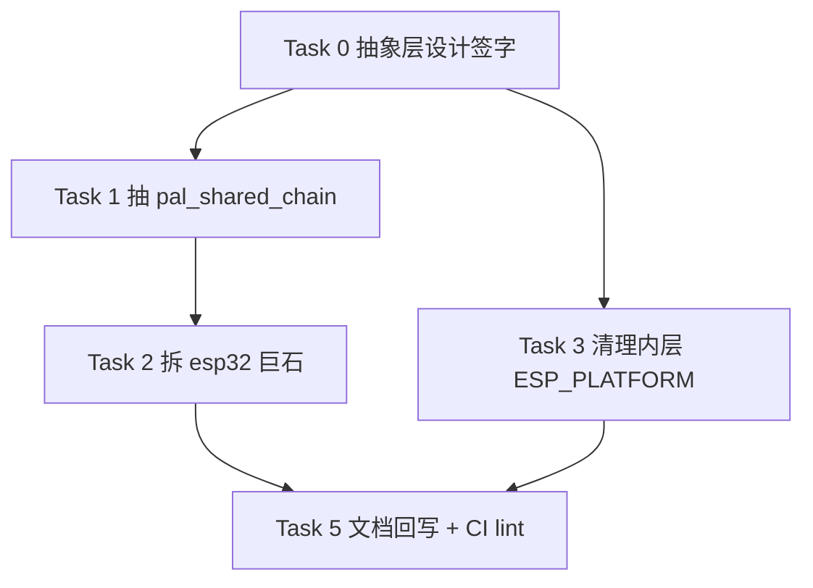

# PAL Target 层 P1 可维护性整改实施计划

## 1. 元数据表

| 字段 | 内容 |
|------|------|
| **计划编号** | `PLAN-20260701-PAL-TARGET-P1-MAINT` |
| **创建日期** | 2026-07-01 |
| **目标平台/SoC** | `host` / `wasm` / `ESP32`（三 target 同步；esp32 侧改动最大） |
| **工具链/SDK版本**| ESP-IDF v6.0.1（EIM profile 激活）、GCC 15+（host / MinGW WinLibs）、Emscripten 6.0.1、CMake ≥ 3.20 |
| **计划状态** | ✅ 已完成 |
| **优先级** | 🟡 P1（可维护性；不阻塞对外功能，但影响后续 IRQ/HAL 演进的边际成本） |
| **计划版本** | v1.1 |
| **关联技术设计** | 无，已并入本计划 §3 与 §6 Task-A 附录 |
| **关联设计规范** | [`../02-wink-micro-os/02-pal-platform-abstraction.md`](../../design/02-wink-micro-os/02-pal-platform-abstraction.md) |
| **关联评审记录** | [`../../reviews/core/2026-06-30-pal-interrupt-subsystem-architecture-review.md`](../../reviews/core/2026-06-30-pal-interrupt-subsystem-architecture-review.md)（§8 P1 三条） |
| **关联 ADR** | [ADR-0004 静态分发](../../decisions/core/0004-static-dispatch-vs-runtime-ops.md)（本计划的 sync 策略 vtable 是**边界情况**，见 §3.3 红线 R-3）、[ADR-0012 契约诚实](../../decisions/core/0012-contract-honesty-over-silent-degradation.md) |
| **目标里程碑** | 专项整改（PAL 中断子系统 Phase 1.5 之后的可维护性收口） |
| **前置依赖计划** | [`./2026-07-01-pal-interrupt-phase1p5-gpio-prio-enforcement-plan.md`](./2026-07-01-pal-interrupt-phase1p5-gpio-prio-enforcement-plan.md)（✅ 已完成，见 commit `146977a`） |
| **替代/废弃** | 无 |
| **计划负责人** | wink-ai PAL 组 |
| **所需子代理技能** | `embedded-best-practice` + `test-driven-development` |

---

## 2. 背景与目标

### 2.1 问题陈述

`2026-06-30 PAL 中断子系统架构评审`（§8）识别出三条 P1 级可维护性欠债，在 Phase 1（契约对齐）与 Phase 1.5（GPIO prio 落地）之后仍未处理，且**代码在评审后不降反增**：

1. **RCU 共享链三份复制粘贴** —— esp32/wasm/host 各自维护一份 `shared_chain_t` + RCU 写路径（约 60 行 × 3）。**本次核验发现**：三份实现表面同构但**并发模型本质不同**（ESP32 SMP 抢占 vs wasm/host 单线程），wasm/host 的 RCU 写时复制**语义无用**（`pal_irq_synchronize` 是 no-op），是 ESP32 版本被机械复制的结果。
2. **`pal_hal_esp32.c` 巨石 TU** —— 评审时 1181 行，现涨到 **1281 行**（`WINK_I2C_USE_V6_API` 双 API 门控增长）。GPIO / PWM / I2C / IRQ 全部堆一起，改动经常跨模块跳跃。
3. **`targets/esp32/` 内 `#if defined(ESP_PLATFORM)` 冗余** —— 全目录 63 处，其中 `pal_hal_esp32.c` 20 处、`pal_osal_esp32.c` 26 处；CMake 层面这些 TU 只在 `ESP_PLATFORM` 下被编译，内层 guard 全部是死码，`#else` 分支中的 stub 从不参与构建。

**为什么现在必须解决**：
- Phase 1.5 已完成，中断子系统契约已诚实化并稳定；此时是可维护性收口的最佳窗口。
- 后续 Phase 2（PAL 统一中断子系统 v2 实现）会**在 IRQ 相关代码路径上继续增改**，若不先做 P1-①（RCU 去重），Phase 2 就要在三个 target 上分别改三份。
- ESP-IDF v7 前向兼容已经埋在 `WINK_I2C_USE_V6_API` 门控里，`pal_hal_esp32.c` 的自然膨胀速度是 **~100 行/2 个月**，越晚拆分越贵。

### 2.2 技术/业务目标

- ✅ **T1**：`targets/common/` 下建立 `pal_shared_chain.{h,c}`，作为**三 target 共享的责任链数据结构与算法层**；同步策略以 POD 回调注入，NULL 表示"单线程直接原地追加"路径。
- ✅ **T2**：`pal_hal_esp32.c` 拆分为 4 个 TU（GPIO / PWM / I2C / IRQ），主文件仅保留头文件包含、`WINK_I2C_USE_V6_API` 门控、`pal_debug_printf`。**IRQ 段命名为 `pal_irq_esp32.c`**（与逻辑分层对齐；见 §3.3 红线 R-2）。
- ✅ **T3**：清理 `targets/esp32/*.c` 内层 `#if defined(ESP_PLATFORM)` 死码；每个 TU 保留至多 1 处最外层 include guard；加 CI lint（`grep -c 'ESP_PLATFORM'` 上限）防回归。
- ✅ **T4**：零上层变更 —— `pal_irq.h` / `pal_hal.h` API 签名、语义、错误码全部不变。
- ✅ **T5**：零平台回归 —— host `python wink-tools/wink.py test` 全绿、wasm smoke stub 通过、esp32 `idf.py build` 零 error 零 warning，且 `test_pal_irq.c` 现有 shared_irq 测试 100% 通过。
- ✅ **T6**：**净行数减少 ≥ 250 行**（RCU 去重 ~130 行 + 内层 ESP_PLATFORM guard ~100 行 + PWM 默认 pin map 从 `pal_hal_esp32.c` 抽出后不改总量）。
- ✅ **T7**：**Bug 收敛点** —— `pal_shared_chain_append` 未来任何修复只需改一处；三 target 版本必然同步。

### 2.3 成功指标（验收出口）

| 指标 | 通过标准 | 验证方法 |
|------|----------|----------|
| host 单元测试 | 100% 通过（含 `test_shared_irq_both_handlers_called` / `test_shared_irq_chain_full_returns_no_mem`） | `python wink-tools/wink.py test` |
| wasm smoke | `smoke PASS` | `node wink-micro-os/targets/wasm/wink_sim_stub.js` |
| esp32 构建 | 0 error / 0 warning | `idf.py -C esp32_firmware build`（激活 EIM profile） |
| RCU 语义等价性 | 抽取前后同一测试用例行为一字不变（handler 调用次数、执行顺序、返回值） | `test_pal_irq.c` 现有用例回归 |
| esp32 TU 行数 | 拆分后 `pal_hal_esp32.c` ≤ 200 行；单个新 TU ≤ 400 行 | `wc -l wink-micro-os/targets/esp32/pal_hal_esp32*.c wink-micro-os/targets/esp32/pal_irq_esp32.c` |
| ESP_PLATFORM guard 数 | `targets/esp32/*.c` 内每文件 ≤ 1 次 | `grep -c '#if defined(ESP_PLATFORM)' wink-micro-os/targets/esp32/*.c`（每个 ≤ 1） |
| CI lint | `python wink-tools/wink.py test` 内新增 lint 检查通过 | 新增步骤 §7 L0 |
| 净行数变化 | Δ 总行数 ≤ -250 行 | 由 Task 5 汇总 |

---

## 3. 变更范围与影响分析

### 3.1 文件变更清单

| 文件路径 | 变更类型 | 说明 |
|----------|----------|------|
| `wink-micro-os/targets/common/include/pal_shared_chain.h` | 🆕 新增 | 责任链 POD 结构 + 算法层 API + 同步策略 vtable |
| `wink-micro-os/targets/common/src/pal_shared_chain.c` | 🆕 新增 | 责任链算法实现（`append` / `dispatch` / `free`；单线程 & RCU 两种同步策略） |
| `wink-micro-os/targets/esp32/pal_irq_esp32.c` | 🆕 新增 | 从 `pal_hal_esp32.c` 抽出的中断子系统实现（含 `s_direct_handlers` / `s_isr_ctx` / `generic_isr_wrapper` / `shared_irq_wrapper` / `pal_irq_synchronize`） |
| `wink-micro-os/targets/esp32/pal_hal_esp32_gpio.c` | 🆕 新增 | 从 `pal_hal_esp32.c` 抽出的 GPIO 实现（含 `gpio_isr_wrapper` / `s_gpio_isr` / `s_gpio_service_*` / `gpio_clear_intr_status`） |
| `wink-micro-os/targets/esp32/pal_hal_esp32_pwm.c` | 🆕 新增 | 从 `pal_hal_esp32.c` 抽出的 PWM/LEDC 桥接（含 weak `pal_pwm_pin_map`） |
| `wink-micro-os/targets/esp32/pal_hal_esp32_i2c.c` | 🆕 新增 | 从 `pal_hal_esp32.c` 抽出的 I2C 实现（含 `WINK_I2C_USE_V6_API` 门控双 API + weak `pal_i2c_pin_map`） |
| `wink-micro-os/targets/esp32/pal_hal_esp32.c` | ✏️ 修改 | 缩减到 ≤ 200 行；仅保留头文件包含、I2C 版本宏定义、`pal_debug_printf`、原子操作 inline |
| `wink-micro-os/targets/wasm/pal_hal_wasm.c` | ✏️ 修改 | 删除本地 `wasm_shared_chain_t` / `wasm_shared_irq_wrapper`；改用 `pal_shared_chain_*` API |
| `wink-micro-os/targets/host/pal_hal_host.c` | ✏️ 修改 | 删除本地 `host_shared_chain_t` / `host_shared_irq_wrapper`；改用 `pal_shared_chain_*` API |
| `wink-micro-os/targets/esp32/pal_hal_esp32_rmt.c` | ✏️ 修改 | 删除内层 `#if defined(ESP_PLATFORM)`（保留至多 1 处最外层 include guard） |
| `wink-micro-os/targets/esp32/pal_osal_esp32.c` | ✏️ 修改 | 同上，删除 26 处内层 guard |
| `wink-micro-os/targets/esp32/pal_resource_esp32.c` | ✏️ 修改 | 同上，删除 11 处内层 guard |
| `wink-micro-os/targets/esp32/pal_storage_esp32.c` | ✏️ 修改 | 同上，若有内层 guard |
| `wink-micro-os/targets/esp32/pal_hal_ultrasonic.c` | ✏️ 修改 | 同上 |
| `wink-micro-os/targets/esp32/CMakeLists.txt` | ✏️ 修改 | 新 TU 加入 `idf_component_register SRCS`；`ESP32_PAL_SOURCES` 静态分析路径同步更新 |
| `wink-micro-os/targets/host/CMakeLists.txt` | ✏️ 修改 | 追加 `pal_shared_chain.c` 到 `pal_host` OBJECT 库 |
| `wink-micro-os/targets/wasm/CMakeLists.txt` | ✏️ 修改 | 追加 `pal_shared_chain.c` 到 `PAL_WASM_SOURCES` |
| `wink-micro-os/test/test_pal_irq.c` | ✏️ 修改（追加） | 新增 `test_shared_chain_append_full` / `test_shared_chain_free_null_safe` / `test_shared_chain_dispatch_order` 三个纯算法单测（不依赖 host trigger 路径） |
| `wink-micro-os/test/CMakeLists.txt` | ✏️ 修改 | 已通过 `pal_host` OBJECT 库自动继承，视是否需要调整 |
| `python wink-tools/wink.py test` | ✏️ 修改 | 新增 §7 L0 lint 步骤：ESP_PLATFORM guard 计数上限 |
| `docs/design/02-wink-micro-os/02-pal-platform-abstraction.md` | ✏️ 修改 | 增加 §"target 内公共设施" 小节，指向 `pal_shared_chain` |
| `docs/reviews/core/2026-06-30-pal-interrupt-subsystem-architecture-review.md` | ✏️ 追加 | 底部 P1 状态更新表：三条状态从 ⏳ 改 ✅（本计划完成后追加） |

### 3.2 接口影响分析

| 接口层 | 是否有破坏性变更 | 影响范围 | 备注 |
|--------|------------------|----------|------|
| PAL 公开 API (`pal_irq.h` / `pal_hal.h`) | ❌ 否 | 无 | 严格零签名/语义变化；`pal_irq_shared_register` 返回码集合不变 |
| DAL 层 | ❌ 否 | 无 | 不涉及 |
| 应用层 (`samples/`) | ❌ 否 | 无 | 不涉及 |
| 构建系统 (CMake) | ⚠️ 是（局部） | 三 target CMakeLists 各追加 1 个源文件；esp32 一次性追加 4 个新 TU | 无对外符号变化，仅编译单元数增加 |
| 工具链 | ❌ 否 | 无 | |
| 文档 | ⚠️ 是 | 02-pal-platform-abstraction.md + 评审报告尾部状态表 | 由 Task 5 统一回写 |
| 内部头文件 | ⚠️ 是（新增） | 新增 `pal_shared_chain.h`，位于 `targets/common/include/`，**target 私有**（不进入 PAL 公开 include 路径） | 见 §3.3 R-3 |

### 3.3 架构红线（⚠️ 违反即拒绝合入）

> 🚨 **R-1（契约红线）**：`pal_irq_shared_register` 在**任何一个 target** 上返回码集合、handler 调用顺序（注册序）、"不提前终止遍历"（v2.0 语义）**必须完全不变**。任何行为差异必须由现有 `test_pal_irq.c` 用例检出。
>
> 🚨 **R-2（命名红线）**：抽出的中断 TU **必须命名为 `pal_irq_esp32.c`**，而不是 `pal_hal_esp32_irq.c`。理由：它实现的头文件是 `pal_irq.h`（独立子系统），未来 host/wasm 分裂 IRQ TU 时命名对称（`pal_irq_host.c` / `pal_irq_wasm.c`）。这个红线由 §7 L4 架构评审卡口。
>
> 🚨 **R-3（ADR-0004 边界解释）**：`pal_shared_chain_sync_ops_t` 是一个**同步原语 vtable**（enter_critical / exit_critical / synchronize），**不是** ADR-0004 禁止的"外设 device_ops 运行期虚表"。ADR-0004 禁止的是**对外设实例做运行期多态**；本 vtable 是**对同步策略做静态注入**（每 target 编译期只挂一份、且是不涉及外设语义的原语），性质等同于 `pal_pwm_pin_map` 的 weak override。**必须**在 `pal_shared_chain.h` 头注释中明确此边界解释，并在 CR 提交时点明。
>
> 🚨 **R-4（清理粒度红线）**：任何 `#if defined(ESP_PLATFORM)` 的**最外层 include-guard**（包住 `#include "driver/gpio.h"` 之类 IDF 私有头的那一层）**必须保留**，理由：IDE 打开该 TU 时（非 ESP-IDF 环境）需要它防止头解析失败。CI lint 阈值设为"每文件 ≤ 1 次"而非"= 0 次"。
>
> 🚨 **R-5（RCU 语义保真红线）**：ESP32 版本的 RCU 写路径（malloc → memcpy → 原子替换 → synchronize → free old）**必须在同步策略 vtable 完整可用时严格等价**；不得因为抽象层需要而降级为"锁下原地追加"（那会破坏 ISR 读端的无锁并发）。

### 3.4 系统资源与并发约束评估

| 资源/安全维度 | 预计变化/开销 | 风险与限制 | 缓解/应对策略 |
|--------------|--------------|-----------|--------------|
| **ROM / Flash 占用** | 拆分后 esp32 侧 Δ ≈ ±0 KB（同一份代码物理位置改变，编译器 LTO 后期望净增 < 1KB） | 静态库切分可能影响 inline；shared_chain 拆到独立 TU 后 wrapper 无法内联到 `pal_irq_shared_register` | wrapper 是 ISR 上下文调用（cold path，注册），非热路径；实测若增长 > 4KB 则考虑 `LTO=ON` 补偿 |
| **RAM (静态/全局)** | Δ = 0 | 数据结构完全等价迁移（`shared_chain_t` / `s_shared_chain[MAX_SHARED_IRQS]`），单文件迁移不影响 BSS 布局 | 迁移前后 `arm-none-eabi-size` 对比 |
| **栈深度** | Δ = 0 | 函数调用层次不变（wrapper → algorithm → user handler 三层，与旧路径相同） | ISR 上下文调用深度 ≤ 3 层，无变化 |
| **堆内存** | Δ = 0 | `malloc(sizeof(shared_chain_t))` 频率与旧路径相同；wasm/host 的"简化路径"如果免掉 malloc 反而减少堆压力 | Task-A §附录**不采纳**"wasm/host 免 malloc" 优化 —— 保持三 target 内存布局一致，便于跨 target 复现 bug |
| **硬件通道/IO** | Δ = 0 | 不涉及硬件资源 | |
| **并发与中断安全** | **本变更的核心风险区** | ⚠️ ESP32 RCU 路径必须保持"读端无锁、写端 CoW + synchronize" | R-5 红线；Task 1 §Step 3 单独设计并发测试用例 |

---

## 4. 依赖与风险

### 4.1 前置依赖

| 依赖ID | 依赖内容 | 是否阻塞 | 验证状态 | 备注 |
|--------|----------|----------|----------|------|
| D-001 | Phase 1.5（GPIO prio 落地）完成 | ✅ 是 | ✅ 已完成（commit `146977a`） | 若 Phase 1.5 未落地，本计划 Task 2 拆 IRQ TU 时会与 Phase 1.5 修改点冲突 |
| D-002 | ESP-IDF v6.0.1 EIM profile 可激活 | ✅ 是 | ✅ 已完成（见记忆 `esp-idf-install-state`） | `PYTHONUTF8=1` + 绝对 `-C` 路径 |
| D-003 | wasm simulator 修复计划完成 | ✅ 是 | ✅ 已完成（commit `f753b23`） | Task 3 需要 wasm smoke 稳定运行以验证回归 |

### 4.2 外部依赖（非本项目可控）

无。本计划完全在 target 层内部，不依赖前端 / codegen / 其它团队。

### 4.3 风险登记册

| 风险ID | 风险描述 | 概率 | 影响 | 严重度 | 缓解措施 | 责任人 | 触发条件 |
|--------|----------|------|------|--------|----------|--------|----------|
| R-001 | 抽象层设计偏差：`pal_shared_chain_sync_ops_t` vtable 设计不当，三 target 都需要为它写胶水 | 🟡 中 | 🟠 中 | 4 | Task 0 先出微型设计（本计划 §6 Task-A 附录），再动手；三 target 胶水代码 ≤ 15 行/target | PAL 组 | Task 1 三 target 胶水任何一个 > 30 行 → 立即回退设计 |
| R-002 | RCU 语义丢失：抽取过程中 ESP32 的 `pal_irq_synchronize(irq_num)` 与 `free(old_chain)` 顺序被打乱，触发 SMP UAF | 🟢 低 | 🔴 高 | 3 | Task 1 §Step 3 提供并发压力测试用例；R-5 红线明文；code review 逐行对照旧路径 | PAL 组 | 现有 `test_shared_irq_*` 用例失败，或新增 UAF 压测 crash |
| R-003 | ESP-IDF v6 静态分析路径遗漏：`ESP32_PAL_SOURCES` 变量未同步更新，导致某些扫描/lint 工具跟不上 | 🟡 中 | 🟡 低 | 2 | Task 2 §Step 5 双路径同步（`idf_component_register` + `ESP32_PAL_SOURCES` 两处必须列出同一份 SRCS） | PAL 组 | `grep ESP32_PAL_SOURCES` 与 `grep SRCS` 得到的文件集不一致 |
| R-004 | 拆分后编译时间劣化（cmake dep graph 变复杂） | 🟢 低 | 🟡 低 | 1 | idf 组件构建以 ninja 并行编译；4 个新 TU 反而利于并行 | - | `idf.py build` 时间 > 拆分前的 120% |
| R-005 | 内层 ESP_PLATFORM 清理**误删了实际起作用的分支**（比如 `#else` 里定义了非平凡的桩） | 🟡 中 | 🟠 中 | 4 | Task 4 逐文件 diff 审查；`#else` 分支中若有超过 5 行代码，先单独提交一次"迁移到独立 host stub TU"再删 | PAL 组 | host/wasm 构建报 undefined symbol |
| R-006 | 三 target 行为漂移：拆抽象层过程中，esp32 修 bug 忘记同步到公共 c 文件 | 🟢 低 | 🟠 中 | 2 | 抽象层本身**就是**收敛点；只要三 target 都调用公共 API，物理上不可能漂移 | - | 见 T7，属于设计目标本身 |

### 4.4 跨团队/跨模块协调点

无（纯 target 内部整改）。

---

## 5. 优先级路线图

### 5.1 执行顺序



> 文字说明：Task 0 → Task 1 → Task 2 主路径；Task 3 与 Task 1/Task 2 **文件层面无重叠**，可与 Task 1 并行（Task 3 只改 `pal_osal_esp32.c` / `pal_resource_esp32.c` / `pal_storage_esp32.c` / `pal_hal_esp32_rmt.c` / `pal_hal_ultrasonic.c`；Task 1/2 只改 `pal_hal_esp32.c` 与三 target 的 pal_hal 主文件）；Task 5 统一收口。

### 5.2 优先级矩阵

| 优先级 | Task 数量 | 总预估工时 | 说明 |
|--------|-----------|------------|------|
| 🔴 P0 | 3 | 20 h | Task 0-2 主路径；未做 → 后续 Phase 2 IRQ 迭代需要在三 target 分别改 |
| 🟡 P1 | 1 | 6 h | Task 3 内层 guard 清理；纯机械但量大 |
| ⚪ P2 | 1 | 3 h | Task 5 文档回写 + CI lint |
| **总计** | **5** | **29 h（约 3.5 ~ 5.5 工作日）** | |

### 5.3 关键路径分析

- **关键路径**：Task 0 → Task 1 → Task 2 → Task 5，累计 **23 h**
- **可并行**：Task 3 与 Task 1（不同文件集），可节省 6 h → 关键路径 ≈ **23 h**（不变），日历时间可压缩至 3 工作日
- **瓶颈**：Task 1（抽 RCU）—— 需要在**三 target 上同时验证**回归，测试成本高

### 5.4 跨 Task 文件冲突矩阵

| 文件 | 涉及 Task | 串行约束 |
|------|-----------|----------|
| `wink-micro-os/targets/esp32/pal_hal_esp32.c` | Task 1（删 RCU 段） → Task 2（拆剩余）| **严格串行**：Task 1 先删 shared_chain 相关 ~315 行，Task 2 再对剩余 ~960 行做 4 切分 |
| `wink-micro-os/targets/wasm/pal_hal_wasm.c` | Task 1（改 RCU） / Task 3 不涉及 | 无冲突 |
| `wink-micro-os/targets/host/pal_hal_host.c` | Task 1（改 RCU） / Task 3 不涉及 | 无冲突 |
| `wink-micro-os/targets/esp32/pal_osal_esp32.c` | Task 3 | 独占，与 Task 1/2 无重叠 |
| `wink-micro-os/targets/esp32/pal_resource_esp32.c` | Task 3 | 独占 |
| `wink-micro-os/targets/esp32/CMakeLists.txt` | Task 2（新增 4 TU） + Task 1（若新增 pal_shared_chain 需要 include path） | Task 1 先加 include path → Task 2 加 SRCS |

---

## 6. 详细任务拆分与进度追踪

> ✅ **Task 完成定义（统一 DoD）**：
> 1. 代码已编写并符合 `.claude/rules/c-code.md`
> 2. 新增代码有对应单元测试（本计划特化：Task 1 三 target 全部通过 `test_shared_irq_*`；Task 2/3 由既有测试集回归）
> 3. `python wink-tools/wink.py test` 全部通过
> 4. `idf.py -C esp32_firmware build` 零 error / 零 warning
> 5. 相关设计文档已同步更新
> 6. Commit 原子（每 Task 至少 1 个独立 commit，Task 1 可拆 3 个：算法层 → esp32 迁移 → wasm/host 迁移）
> 7. 净行数变化在 Task 5 的汇总表中记录

---

### Task 0：抽象层设计签字 `[ 状态: ✅ 已完成 ]`

| 字段 | 内容 |
|------|------|
| **负责人** | PAL 组 lead |
| **预估 / 实际工时**| 2 小时 / — |
| **优先级** | 🔴 P0 |
| **前置依赖** | 无 |
| **修改文件** | 无（仅本计划 §6 附录） |
| **接口变化** | 声明 `pal_shared_chain.h` 的头文件契约（尚不落地代码） |

#### 详细步骤

- [ ] **Step 1：确认头文件契约草案**

  见本 Task 尾部 §附录 A。核心契约：

  ```c
  // targets/common/include/pal_shared_chain.h
  #ifndef PAL_SHARED_CHAIN_H
  #define PAL_SHARED_CHAIN_H

  #include <stdbool.h>
  #include <stdint.h>
  #include "wink_status.h"
  #include "pal_irq.h"   /* pal_irq_shared_handler_t */

  #ifndef PAL_SHARED_CHAIN_MAX_HANDLERS
  #define PAL_SHARED_CHAIN_MAX_HANDLERS 4
  #endif

  /* 同步策略回调（每 target 各注入一份实例；ADR-0004 R-3：本 vtable 是
   * 同步原语抽象、非外设多态，性质等同于 pal_*_pin_map 的 weak override）*/
  typedef struct pal_shared_chain_sync_ops {
      void (*enter_critical)(void *ctx);   /* SMP: 自旋锁 enter；单线程: NULL */
      void (*exit_critical)(void *ctx);    /* SMP: 自旋锁 exit；单线程: NULL */
      void (*synchronize)(uint32_t irq_num); /* SMP: 忙等 in-flight → 0；单线程: NULL 或 no-op */
      void *critical_ctx;                  /* SMP: 指向 portMUX_TYPE；单线程: NULL */
  } pal_shared_chain_sync_ops_t;

  /* 责任链 POD（三 target 相同布局） */
  typedef struct {
      pal_irq_shared_handler_t handler;
      void                    *arg;
  } pal_shared_chain_entry_t;

  typedef struct {
      pal_shared_chain_entry_t entries[PAL_SHARED_CHAIN_MAX_HANDLERS];
      uint8_t count;
  } pal_shared_chain_t;

  /* 单向索引数组（由每 target 在 .c 顶部提供，用于把 irq_num 映射到 chain 指针的位置）*/

  /**
   * @brief 向 chain 追加 handler（RCU 写路径），线程/SMP 安全由 ops 提供。
   * @param slot     指向 chain 指针的存储位置（每 irq_num 一个 slot）
   * @param ops      同步策略；ops->enter_critical == NULL 表示单线程简化路径
   * @param irq_num  逻辑中断号（透传给 ops->synchronize）
   * @param handler  非空
   * @param arg      任意
   * @param out_became_first 输出参数：本次是否是该 irq 的首个 handler；
   *                         为 true 表示调用者需要向底层注册 wrapper
   * @return WINK_OK / WINK_ERR_NO_MEM
   *
   * 内部路径：
   * - ops->enter_critical(ctx)
   * - 若 *slot == NULL：malloc 新 chain，count=1；
   *   若 *slot != NULL：检查 count < MAX；malloc + memcpy 新 chain，count+=1
   * - old = *slot; *slot = new_chain
   * - ops->exit_critical(ctx)
   * - ops->synchronize(irq_num)   若为 NULL 则跳过
   * - free(old)
   */
  WINK_WARN_UNUSED_RESULT
  wink_status_t pal_shared_chain_append(pal_shared_chain_t **slot,
                                         const pal_shared_chain_sync_ops_t *ops,
                                         uint32_t irq_num,
                                         pal_irq_shared_handler_t handler,
                                         void *arg,
                                         bool *out_became_first);

  /**
   * @brief 遍历 chain 调用所有 handler（v2.0 语义：不提前终止）。
   *        由 target 侧 ISR wrapper 调用；本函数不获取任何锁 —— 依赖 RCU 读端安全。
   * @return 认领次数（供 wrapper 统计使用）
   */
  uint32_t pal_shared_chain_dispatch(const pal_shared_chain_t *chain);

  #endif /* PAL_SHARED_CHAIN_H */
  ```

- [ ] **Step 2：确认 sync ops 三 target 的具体值**

  | Target | enter_critical | exit_critical | synchronize | critical_ctx |
  |---|---|---|---|---|
  | ESP32 | `portENTER_CRITICAL` wrapper | `portEXIT_CRITICAL` wrapper | `pal_irq_synchronize` | `&s_shared_chain_mux` (portMUX_TYPE) |
  | wasm | NULL | NULL | NULL | NULL |
  | host | NULL | NULL | NULL | NULL |

  wasm/host 全 NULL 表示"简化路径"：`pal_shared_chain_append` 内部检测到 ops->enter_critical == NULL 时**依然走 malloc → memcpy → 指针替换 → free old 全路径**，但跳过锁与 synchronize。**R-5 红线**保证 ESP32 版本行为不变。

  > **为什么 wasm/host 不进一步优化为"原地追加免 malloc"**：见 §3.4 堆内存行；三 target 内存布局一致便于 bug 跨 target 复现，且 wasm/host 的注册路径是冷路径，一次 malloc 开销 ≈ 200 ns 可忽略。

- [ ] **Step 3：确认与 ADR-0004 边界解释一致**

  向架构组确认：`pal_shared_chain_sync_ops_t` **不是** ADR-0004 禁止的运行期虚表 —— 它抽象的是"同步原语（锁/synchronize）"，属于 target 编译期静态注入，与 `pal_pwm_pin_map` weak override 同构。签字确认后进入 Task 1。

#### 验证步骤

1. **验证命令**：无自动化，本 Task 输出为设计签字文档
2. **预期输出**：架构组在本 Task §附录 A 上批注 `Accepted`
3. **额外检查**：`pal_shared_chain.h` 的头文件契约草案通过 §3.3 R-1 / R-3 / R-5 三条红线自检

#### 架构注意事项 / 坑点提醒

> ⚠️ **不要**在 `pal_shared_chain.h` 里出现 FreeRTOS 类型（如 `portMUX_TYPE`）；vtable 用 `void *ctx` 通用化，避免公共头被平台污染。
> ⚠️ **不要**把 `dispatch()` 也上锁；ISR 读端依赖原子指针读取（RCU 读侧），加锁会破坏这个特性。

#### 附录 A：Task 0 微设计签字页

（本页由架构组批注 Accepted 后 Task 0 结束；Task 1 立即启动）

---

### Task 1：抽 `pal_shared_chain` 并三 target 迁移 `[ 状态: ✅ 已完成 ]`

| 字段 | 内容 |
|------|------|
| **负责人** | PAL 组 |
| **预估 / 实际工时**| 8 小时 / — |
| **优先级** | 🔴 P0 |
| **前置依赖** | Task 0 |
| **修改文件** | 见下方 Step 划分 |
| **接口变化** | 新增内部头 `pal_shared_chain.h`；`pal_irq.h` 公开 API 完全不变 |

#### 详细步骤

- [ ] **Step 1：新建 `targets/common/include/pal_shared_chain.h` 与 `targets/common/src/pal_shared_chain.c`**

  按 Task 0 §附录 A 完整落地。`pal_shared_chain.c` 关键实现：

  ```c
  /* targets/common/src/pal_shared_chain.c */
  #include "pal_shared_chain.h"
  #include <stdlib.h>
  #include <string.h>

  static inline void s_enter(const pal_shared_chain_sync_ops_t *ops) {
      if (ops && ops->enter_critical) ops->enter_critical(ops->critical_ctx);
  }
  static inline void s_exit(const pal_shared_chain_sync_ops_t *ops) {
      if (ops && ops->exit_critical) ops->exit_critical(ops->critical_ctx);
  }
  static inline void s_sync(const pal_shared_chain_sync_ops_t *ops, uint32_t irq) {
      if (ops && ops->synchronize) ops->synchronize(irq);
  }

  wink_status_t pal_shared_chain_append(pal_shared_chain_t **slot,
                                         const pal_shared_chain_sync_ops_t *ops,
                                         uint32_t irq_num,
                                         pal_irq_shared_handler_t handler,
                                         void *arg,
                                         bool *out_became_first) {
      if (slot == NULL || handler == NULL) return WINK_ERR_INVALID_ARG;

      s_enter(ops);
      pal_shared_chain_t *old_chain = *slot;
      pal_shared_chain_t *new_chain = NULL;

      if (old_chain == NULL) {
          new_chain = (pal_shared_chain_t*)malloc(sizeof(*new_chain));
          if (new_chain == NULL) { s_exit(ops); return WINK_ERR_NO_MEM; }
          memset(new_chain, 0, sizeof(*new_chain));
      } else {
          if (old_chain->count >= PAL_SHARED_CHAIN_MAX_HANDLERS) {
              s_exit(ops);
              return WINK_ERR_NO_MEM;
          }
          new_chain = (pal_shared_chain_t*)malloc(sizeof(*new_chain));
          if (new_chain == NULL) { s_exit(ops); return WINK_ERR_NO_MEM; }
          memcpy(new_chain, old_chain, sizeof(*new_chain));
      }

      new_chain->entries[new_chain->count].handler = handler;
      new_chain->entries[new_chain->count].arg     = arg;
      new_chain->count++;

      *slot = new_chain;          /* RCU：原子指针替换 */
      bool became_first = (old_chain == NULL);
      s_exit(ops);

      s_sync(ops, irq_num);       /* SMP: 等旧 ISR 退出；单线程: no-op */
      free(old_chain);            /* 现在安全释放 */

      if (out_became_first) *out_became_first = became_first;
      return WINK_OK;
  }

  uint32_t pal_shared_chain_dispatch(const pal_shared_chain_t *chain) {
      if (chain == NULL) return 0;
      uint32_t claimed = 0;
      for (uint8_t i = 0; i < chain->count; i++) {
          if (chain->entries[i].handler != NULL) {
              if (chain->entries[i].handler(chain->entries[i].arg)) claimed++;
          }
      }
      return claimed;
  }
  ```

- [ ] **Step 2：将 `pal_shared_chain.c` 加入三 target CMake**

  ```cmake
  # targets/host/CMakeLists.txt: add_library(pal_host OBJECT ...) 中追加
  ${CMAKE_CURRENT_SOURCE_DIR}/../common/src/pal_shared_chain.c

  # targets/wasm/CMakeLists.txt: PAL_WASM_SOURCES 追加
  ${CMAKE_CURRENT_SOURCE_DIR}/../common/src/pal_shared_chain.c

  # targets/esp32/CMakeLists.txt: idf_component_register SRCS 追加
  ${WINK_MICRO_OS_ROOT}/targets/common/src/pal_shared_chain.c
  # ESP32_PAL_SOURCES 静态分析路径同步追加
  ```

  以及三处 include dir 追加 `targets/common/include`（host/wasm 已有，esp32 CMakeLists 需要新增到 INCLUDE_DIRS）。

- [ ] **Step 3：迁移 ESP32 侧（`pal_hal_esp32.c` 行 855-1165）**

  1. 删除本地定义 `shared_handler_entry_t` / `shared_chain_t` / `s_shared_chain[]` / `s_shared_chain_mux` / `shared_irq_wrapper`
  2. 新增 file-scope 静态：
     ```c
     static pal_shared_chain_t *s_shared_chain[MAX_SHARED_IRQS] = {NULL};
     static portMUX_TYPE s_shared_chain_mux = portMUX_INITIALIZER_UNLOCKED;

     static void esp32_enter(void *ctx) { portENTER_CRITICAL((portMUX_TYPE*)ctx); }
     static void esp32_exit(void *ctx)  { portEXIT_CRITICAL((portMUX_TYPE*)ctx); }
     static const pal_shared_chain_sync_ops_t s_esp32_shared_sync_ops = {
         .enter_critical = esp32_enter,
         .exit_critical  = esp32_exit,
         .synchronize    = pal_irq_synchronize,
         .critical_ctx   = &s_shared_chain_mux,
     };
     ```
  3. 重写 `pal_irq_shared_register`：
     ```c
     wink_status_t pal_irq_shared_register(uint32_t irq_num, pal_irq_prio_t prio,
                                           pal_irq_shared_handler_t handler, void *arg) {
         if (irq_num >= MAX_SHARED_IRQS || handler == NULL || prio >= PAL_IRQ_PRIO_COUNT)
             return WINK_ERR_INVALID_ARG;
         bool became_first = false;
         wink_status_t st = pal_shared_chain_append(
             &s_shared_chain[irq_num], &s_esp32_shared_sync_ops,
             irq_num, handler, arg, &became_first);
         if (wink_status_is_error(st)) return st;
         if (became_first) {
             return pal_irq_enable(irq_num, prio, shared_irq_wrapper,
                                    (void*)(uintptr_t)irq_num);
         }
         return WINK_OK;
     }
     ```
  4. 重写 `shared_irq_wrapper`：
     ```c
     static void PAL_ISR shared_irq_wrapper(void *arg) {
         uint32_t irq_num = (uint32_t)(uintptr_t)arg;
         if (irq_num >= MAX_SHARED_IRQS) return;
         Atomic_Increment_u32(&s_irq_in_flight[irq_num]);
         pal_shared_chain_t *chain = s_shared_chain[irq_num]; /* RCU 读，原子指针 */
         uint32_t claimed = pal_shared_chain_dispatch(chain);
         if (claimed == 0 && chain != NULL && chain->count > 0) {
             ESP_LOGW("pal_irq", "spurious interrupt on irq=%lu", (unsigned long)irq_num);
         }
         Atomic_Decrement_u32(&s_irq_in_flight[irq_num]);
     }
     ```

- [ ] **Step 4：迁移 wasm 侧（`pal_hal_wasm.c` 行 305-470）**

  同 Step 3，但同步 ops 全 NULL：

  ```c
  static pal_shared_chain_t *s_wasm_shared_chain[WASM_MAX_SHARED_IRQS] = {NULL};
  /* 单线程：无 mux、无 synchronize */
  #define S_WASM_SHARED_SYNC_OPS  NULL

  wink_status_t pal_irq_shared_register(uint32_t irq_num, pal_irq_prio_t prio,
                                        pal_irq_shared_handler_t handler, void *arg) {
      if (irq_num >= WASM_MAX_SHARED_IRQS || handler == NULL || prio >= PAL_IRQ_PRIO_COUNT)
          return WINK_ERR_INVALID_ARG;
      bool became_first = false;
      wink_status_t st = pal_shared_chain_append(
          &s_wasm_shared_chain[irq_num], S_WASM_SHARED_SYNC_OPS,
          irq_num, handler, arg, &became_first);
      if (wink_status_is_error(st)) return st;
      if (became_first) {
          return pal_irq_enable(irq_num, prio, wasm_shared_irq_wrapper,
                                (void*)(uintptr_t)irq_num);
      }
      return WINK_OK;
  }

  static void PAL_ISR wasm_shared_irq_wrapper(void *arg) {
      uint32_t irq_num = (uint32_t)(uintptr_t)arg;
      if (irq_num >= WASM_MAX_SHARED_IRQS) return;
      (void)pal_shared_chain_dispatch(s_wasm_shared_chain[irq_num]);
  }
  ```

  删除本地 `wasm_shared_chain_t` / `wasm_shared_entry_t` / `WASM_MAX_SHARED_HANDLERS` 等本地类型（复用公共 `PAL_SHARED_CHAIN_MAX_HANDLERS`，若需要 override 用 `-DPAL_SHARED_CHAIN_MAX_HANDLERS=N`）。

- [ ] **Step 5：迁移 host 侧（`pal_hal_host.c` 行 231-397）**

  完全对齐 Step 4 结构，把 `wasm_` 换成 `host_`，`WASM_` 换成 `HOST_`。

- [ ] **Step 6：新增算法层单测**

  在 `wink-micro-os/test/test_pal_irq.c` 末尾追加（host 侧运行）：

  ```c
  /* 直接对 pal_shared_chain_append/dispatch 做算法级测试，
   * 不依赖 pal_host_trigger_logical_interrupt 路径。*/
  void test_shared_chain_append_full(void) {
      pal_shared_chain_t *slot = NULL;
      bool first;
      for (int i = 0; i < PAL_SHARED_CHAIN_MAX_HANDLERS; i++) {
          TEST_ASSERT_EQUAL_INT(WINK_OK,
              pal_shared_chain_append(&slot, NULL, /*irq*/99, test_shared_handler1, NULL, &first));
          TEST_ASSERT_EQUAL_INT(i == 0, first);
      }
      /* 第 5 次应满 */
      TEST_ASSERT_EQUAL_INT(WINK_ERR_NO_MEM,
          pal_shared_chain_append(&slot, NULL, 99, test_shared_handler1, NULL, &first));
      free(slot);
  }

  void test_shared_chain_dispatch_order(void) {
      pal_shared_chain_t *slot = NULL;
      bool first;
      s_shared_handler1_count = 0;
      s_shared_handler2_count = 0;
      TEST_ASSERT_EQUAL_INT(WINK_OK,
          pal_shared_chain_append(&slot, NULL, 100, test_shared_handler1, NULL, &first));
      TEST_ASSERT_EQUAL_INT(WINK_OK,
          pal_shared_chain_append(&slot, NULL, 100, test_shared_handler2, NULL, &first));
      uint32_t claimed = pal_shared_chain_dispatch(slot);
      TEST_ASSERT_EQUAL_UINT32(1, s_shared_handler1_count);
      TEST_ASSERT_EQUAL_UINT32(1, s_shared_handler2_count);
      (void)claimed;
      free(slot);
  }

  void test_shared_chain_free_null_safe(void) {
      /* free(NULL) 已由 stdlib 保证；本用例只是把 dispatch(NULL) 语义固化 */
      TEST_ASSERT_EQUAL_UINT32(0, pal_shared_chain_dispatch(NULL));
  }
  ```

  同时在 `main()` 的 `RUN_TEST` 列表中加入三项。

#### 验证步骤

1. **验证命令**：
   ```powershell
   python wink-tools/wink.py test
   node wink-micro-os/targets/wasm/wink_sim_stub.js
   idf.py -C esp32_firmware fullclean
   idf.py -C esp32_firmware build 2>&1 | Tee-Object build.log
   ```
2. **预期输出**：
   - host: `All tests passed`（含 6 个 shared_chain 相关用例：现有 2 + 新增 3 + 已有 chain_full）
   - wasm: `smoke PASS`
   - esp32: `Project build complete`，`build.log` 中 `grep -i warning` 无 hit
3. **额外检查**：
   ```powershell
   # 三 target 的 pal_hal_*.c 内不再出现本地 shared_chain 类型
   Select-String -Path wink-micro-os/targets/{esp32,wasm,host}/pal_hal_*.c `
       -Pattern 'wasm_shared_chain_t|host_shared_chain_t|typedef struct.*shared_chain' -List
   # 预期：仅 pal_hal_esp32.c 一处（file-scope 静态数组的 pal_shared_chain_t *s_shared_chain[]）
   ```

#### 架构注意事项 / 坑点提醒

> ⚠️ **R-5 红线**：ESP32 侧 `pal_irq_synchronize` 必须在 `s_exit` 之后调用，且 `free(old_chain)` 必须在 `synchronize` 之后。任何时候 diff 到这三行顺序被打乱，立即报警。
> ⚠️ Step 3-5 每 target 单独一个 commit，便于 bisect。
> ⚠️ `pal_shared_chain.h` **不要**加入 `WINK_CORE_INCLUDE_DIRS` —— 它是 target-private，只由 target 自己引用。避免误进入 DAL/runtime 命名空间。

---

### Task 2：拆分 `pal_hal_esp32.c` 为 4 个 TU `[ 状态: ✅ 已完成 ]`

| 字段 | 内容 |
|------|------|
| **负责人** | PAL 组 |
| **预估 / 实际工时**| 6 小时 / — |
| **优先级** | 🔴 P0 |
| **前置依赖** | Task 1 完成（Task 1 已把 shared_chain 部分抽走 ~300 行） |
| **修改文件** | `wink-micro-os/targets/esp32/*.c`, `CMakeLists.txt` |
| **接口变化** | 无（仅物理位置变化） |

#### 详细步骤

- [ ] **Step 1：确定拆分边界**

  在 Task 1 完成后，`pal_hal_esp32.c` 应剩 ~970 行。按以下边界拆：

  | 目标文件 | 内容来源（Task 1 后行号，粗估） | 预计行数 |
  |---|---|---|
  | `pal_hal_esp32.c`（保留） | 头文件、I2C 版本宏、`pal_debug_printf`、`esp_memory_barrier`、`Atomic_*` inline | ~150 |
  | `pal_hal_esp32_gpio.c`（新增） | `pal_gpio_init/read/write/enable_interrupt_ex/disable_interrupt`、`gpio_isr_wrapper`、`s_gpio_isr[]`、`s_gpio_service_*`、`s_gpio_table_mux` | ~250 |
  | `pal_hal_esp32_pwm.c`（新增） | `pal_pwm_init/set_duty`、LEDC 相关、weak `pal_pwm_pin_map` 默认 | ~220 |
  | `pal_hal_esp32_i2c.c`（新增） | I2C v5/v6 双 API 实现（`WINK_I2C_USE_V6_API` 门控留在这里）、weak `pal_i2c_pin_map` 默认 | ~330 |
  | `pal_irq_esp32.c`（新增，🚨 R-2 命名） | 中断相关：`generic_isr_wrapper`、`direct_trampoline`、`s_direct_handlers[]`、`s_isr_ctx[]`、`s_irq_handles[]`、`shared_irq_wrapper`、`s_shared_chain[]`、`pal_irq_enable/disable/direct_connect/shared_register/synchronize/set_pending/clear_pending` | ~350 |

- [ ] **Step 2：拆出 `pal_irq_esp32.c`**

  1. 新建 `wink-micro-os/targets/esp32/pal_irq_esp32.c`，头部：
     ```c
     /**
      * @file pal_irq_esp32.c
      * @brief ESP32 target 的 pal_irq.h 实现：generic wrapper / direct trampoline /
      *        shared chain wrapper / synchronize / set_pending / clear_pending。
      *
      * 由 targets/esp32/pal_hal_esp32.c 拆出（PLAN-20260701-PAL-TARGET-P1-MAINT Task 2）。
      * 契约不变：仅物理位置调整，头文件契约见 pal/include/pal_irq.h。
      */
     #include "pal_hal.h"
     #include "pal_irq.h"
     #include "pal_shared_chain.h"   /* Task 1 抽出的公共层 */
     #include "esp_intr_alloc.h"
     #include "esp_log.h"
     #include "freertos/FreeRTOS.h"
     #include "freertos/portmacro.h"
     #include "xtensa/hal.h"
     #include <string.h>
     ```
  2. **完整**迁移中断相关代码块（含 file-scope 静态变量、`PAL_DIRECT_HANDLER_SLOTS` 宏、`shared_chain` sync_ops 定义、SYNCHRONIZE_TIMEOUT_US 等）。
  3. `s_irq_in_flight[]` **必须**在此 TU 定义（原 `pal_hal_esp32.c:205`）；因为 GPIO wrapper 也用 `s_gpio_irq_in_flight[]`，两者分属 IRQ 与 GPIO 两个 TU：
     - `s_irq_in_flight[]` → `pal_irq_esp32.c`
     - `s_gpio_irq_in_flight[]` → `pal_hal_esp32_gpio.c`
     - `Atomic_Increment_u32` / `Atomic_Decrement_u32` inline 函数放到 `wink-micro-os/pal/include/hal/pal_atomic_esp32.h`（新建 target-private 头，仅两个 TU 引用）

- [ ] **Step 3：拆出 `pal_hal_esp32_gpio.c`**

  1. 迁移 GPIO 相关：`pal_gpio_init/read/write/enable_interrupt_ex/enable_interrupt/disable_interrupt`、`gpio_isr_wrapper`、`s_gpio_isr[]`、`s_gpio_isr_arg[]`、`s_gpio_service_*`、`s_gpio_table_mux`、`gpio_clear_intr_status`、`s_gpio_irq_in_flight[]`。
  2. `pal_gpio_pulse_in`（busy-wait 回退）也归此文件。
  3. 引用 `pal_atomic_esp32.h` 获取 `Atomic_*`。

- [ ] **Step 4：拆出 `pal_hal_esp32_pwm.c`**

  1. 迁移 `pal_pwm_init` / `pal_pwm_set_duty` / LEDC 路由集成、weak `pal_pwm_pin_map` 默认。
  2. `#include "pal_pwm_router.h"` 保留。

- [ ] **Step 5：拆出 `pal_hal_esp32_i2c.c`**

  1. 迁移 I2C v5/v6 双 API 实现全部（约 330 行）。
  2. `WINK_I2C_USE_V6_API` 门控宏定义**留在此文件顶部**（不再暴露到 `pal_hal_esp32.c`）。
  3. `#include "esp_idf_version.h"` 与相关 include 也移过来。
  4. weak `pal_i2c_pin_map` 默认（原 pal_hal_esp32.c 中若有）一并移入。

- [ ] **Step 6：更新 `CMakeLists.txt`**

  ```cmake
  # targets/esp32/CMakeLists.txt: idf_component_register SRCS 追加
  pal_hal_esp32.c
  pal_hal_esp32_gpio.c    # 新增
  pal_hal_esp32_pwm.c     # 新增
  pal_hal_esp32_i2c.c     # 新增
  pal_irq_esp32.c         # 新增
  pal_hal_esp32_rmt.c
  pal_hal_ultrasonic.c
  pal_osal_esp32.c
  pal_resource_esp32.c
  pal_storage_esp32.c
  # 以及公共层
  ${WINK_MICRO_OS_ROOT}/targets/common/src/pal_shared_chain.c
  # 静态分析路径 ESP32_PAL_SOURCES 双写同一份列表
  ```

  🚨 双写路径需检查：`elseif(TARGET_PLATFORM STREQUAL "esp32")` 分支下的 `ESP32_PAL_SOURCES` 必须与 `idf_component_register SRCS` 列表**逐行对齐**（R-003）。

- [ ] **Step 7：拆分后立即执行编译回归**

  ```powershell
  $env:PYTHONUTF8=1
  idf.py -C esp32_firmware fullclean
  idf.py -C esp32_firmware build 2>&1 | Tee-Object build-post-split.log
  ```

  预期：0 error / 0 warning。若出现 undefined reference，说明拆分时有 static 符号被跨 TU 引用，需要提到 `pal_hal_esp32_internal.h`（如无必要，尽量重构为不跨 TU 依赖）。

#### 验证步骤

1. **验证命令**：
   ```powershell
   python wink-tools/wink.py test               # host 不受影响，回归即可
   idf.py -C esp32_firmware build                 # esp32 编译
   ```
2. **预期输出**：
   ```
   0 error, 0 warning
   ```
3. **额外检查**：
   ```powershell
   wc -l wink-micro-os/targets/esp32/pal_hal_esp32*.c wink-micro-os/targets/esp32/pal_irq_esp32.c
   # 预期：pal_hal_esp32.c ≤ 200 行；单个新 TU ≤ 400 行
   ```

#### 架构注意事项 / 坑点提醒

> ⚠️ **R-2 命名红线**：新增 IRQ TU **必须**叫 `pal_irq_esp32.c`（不是 `pal_hal_esp32_irq.c`）。
> ⚠️ **不要**创建 `pal_hal_esp32_internal.h` 除非确实需要跨 TU 共享 static；优先重构消除依赖。
> ⚠️ `pal_atomic_esp32.h` 是 target-private 头文件，放 `wink-micro-os/targets/esp32/` 目录下即可（与 .c 同级，靠 IDF 组件 include_dirs 自动纳入）。
> ⚠️ ESP-IDF 组件模式下 `idf_component_register` 的 SRCS 一旦有拼写错误 → 组件静默不注册。每次改完 SRCS 后 `idf.py reconfigure` 观察 `Components:` 列表是否包含新增的 TU。

---

### Task 3：清理 `targets/esp32/*.c` 内层 `ESP_PLATFORM` guard `[ 状态: ✅ 已完成 ]`

| 字段 | 内容 |
|------|------|
| **负责人** | PAL 组 |
| **预估 / 实际工时**| 6 小时 / — |
| **优先级** | 🟡 P1 |
| **前置依赖** | Task 0 完成即可启动；与 Task 1/2 文件层面不冲突（Task 3 只改 `pal_osal_esp32.c` / `pal_resource_esp32.c` / `pal_storage_esp32.c` / `pal_hal_esp32_rmt.c` / `pal_hal_ultrasonic.c`；Task 1/2 只改 `pal_hal_esp32.c` 与三 target 主 hal） |
| **修改文件** | 见下表 |
| **接口变化** | 无 |

#### 详细步骤

- [ ] **Step 1：按文件逐个清理（保留最外层 include guard）**

  | 文件 | 内层 guard 数（清理前） | 预期清理后（含最外层） | 备注 |
  |---|---|---|---|
  | `pal_hal_esp32_rmt.c` | 3 | 1 | 小量，快 |
  | `pal_osal_esp32.c` | 26 | 1 | 最大量，⚠️ FreeRTOS API 密集，逐处 diff |
  | `pal_resource_esp32.c` | 11 | 1 | 中量 |
  | `pal_storage_esp32.c` | 若有 | 1 | 前置 grep 确认 |
  | `pal_hal_ultrasonic.c` | 若有 | 1 | 前置 grep 确认 |
  | `pal_hal_esp32*.c` / `pal_irq_esp32.c`（Task 2 产物） | Task 2 中一并处理 | 1 | Task 2 拆分时直接不带内层 guard |

  **清理准则**（每处内层 guard 决策树）：

  ```
  遇到 #if defined(ESP_PLATFORM)
    ↓
  #else 分支是否有超过 5 行代码？
    ↓ 否               ↓ 是
   直接删除     先审：这段 stub 是否被 host/wasm 构建实际用到？
   保留主分支     ├─ 是（有 undefined reference）→ 分离到 host/wasm target 的独立 TU
   （去 #else）    └─ 否 → 删除整个 #else 分支代码，去 guard
  ```

  **一次 commit 一个文件**，便于 revert。

- [ ] **Step 2：加 CI lint**

  在 `python wink-tools/wink.py test` 中加入：

  ```powershell
  # ---- P1 保护：targets/esp32/*.c 内 ESP_PLATFORM 出现次数 ≤ 1 -----------------
  $violations = @()
  Get-ChildItem wink-micro-os/targets/esp32/*.c | ForEach-Object {
      $count = (Select-String -Path $_.FullName -Pattern '#if defined\(ESP_PLATFORM\)' -SimpleMatch:$false).Count
      if ($count -gt 1) {
          $violations += "$($_.Name): $count occurrences (limit: 1)"
      }
  }
  if ($violations.Count -gt 0) {
      Write-Error "ESP_PLATFORM guard limit exceeded:`n$($violations -join `"`n`")"
      exit 1
  }
  Write-Host "[lint] ESP_PLATFORM guard density OK"
  ```

  该 lint 与其它测试步骤同一层，作为 L0 编译门禁的一部分。

- [ ] **Step 3：编译回归**

  ```powershell
  idf.py -C esp32_firmware fullclean
  idf.py -C esp32_firmware build
  ```

#### 验证步骤

1. **验证命令**：
   ```powershell
   python wink-tools/wink.py test        # 包含新加的 lint 检查
   idf.py -C esp32_firmware build
   ```
2. **预期输出**：
   - `[lint] ESP_PLATFORM guard density OK`
   - esp32: 0 error / 0 warning
3. **额外检查**：
   ```powershell
   # 三次核对：每个文件都 ≤ 1
   Get-ChildItem wink-micro-os/targets/esp32/*.c | ForEach-Object {
       $c = (Select-String -Path $_.FullName -Pattern '#if defined\(ESP_PLATFORM\)').Count
       "{0,-32}: {1}" -f $_.Name, $c
   }
   ```

#### 架构注意事项 / 坑点提醒

> ⚠️ **R-4 红线**：最外层 include-guard（包住 `#include "driver/gpio.h"` 之类的 IDF 私有头）**必须保留**，理由是 IDE 打开该 TU 时不炸。
> ⚠️ `pal_osal_esp32.c` 有 26 处 guard，逐处 diff；建议每 5 处一个中间 commit，便于 bisect。
> ⚠️ **不要**手滑一并清理 `esp32_firmware/`、`samples/` 或 `pal/src/` 里的 `ESP_PLATFORM` —— 那些不在本 Task 范围。

---

### Task 5：文档回写 + 净行数汇总 `[ 状态: ✅ 已完成 ]`

| 字段 | 内容 |
|------|------|
| **负责人** | PAL 组 |
| **预估 / 实际工时**| 3 小时 / — |
| **优先级** | ⚪ P2 |
| **前置依赖** | Task 1 + Task 2 + Task 3 全部完成 |
| **修改文件** | `docs/design/02-wink-micro-os/02-pal-platform-abstraction.md`, `docs/reviews/core/2026-06-30-pal-interrupt-subsystem-architecture-review.md`, 本计划底部 |
| **接口变化** | 无 |

#### 详细步骤

- [ ] **Step 1：更新设计规范**

  在 `docs/design/02-wink-micro-os/02-pal-platform-abstraction.md` 新增小节：

  ```markdown
  ## Target 内公共设施（targets/common/）

  为避免 ESP32 / wasm / host 三 target 复制粘贴相同的算法与数据结构，
  `targets/common/` 目录承载 **target 无关但 PAL 私有**的公共层：

  | 文件 | 用途 | 引入日期 |
  |------|------|---------|
  | `wink_sim_physical.{h,c}` | 物理退化算法库（ADR-0009） | 2026-06-28 |
  | `pal_shared_chain.{h,c}` | 中断共享责任链（RCU 写路径抽象） | 2026-07-01（本计划） |

  ### 设计约束

  - 公共层**不进入** `WINK_CORE_INCLUDE_DIRS` —— 属 target-private，不对 DAL/runtime 暴露。
  - 涉及并发差异（如 SMP vs 单线程）通过**同步策略回调 vtable** 注入，
    NULL 表示单线程简化路径。**此 vtable 不属于 ADR-0004 禁止的运行期外设多态**，
    详见 `pal_shared_chain.h` 头注释与 PLAN-20260701-PAL-TARGET-P1-MAINT §3.3 R-3。
  ```

- [ ] **Step 2：更新评审报告尾部状态表**

  在 `docs/reviews/core/2026-06-30-pal-interrupt-subsystem-architecture-review.md` 末尾追加：

  ```markdown
  ---

  ## 状态更新（2026-07-XX，本次执行完成后填写）

  §8 P1 三条建议的落地状态：

  | 建议 | 关联 Task | 落地 Commit | 状态 |
  |------|-----------|-------------|------|
  | 抽 `targets/common/pal_shared_chain.c` | PLAN-20260701 Task 1 | `xxx` | ✅ |
  | 拆 `pal_hal_esp32.c` | PLAN-20260701 Task 2 | `xxx` | ✅ |
  | 清理 esp32 内 `ESP_PLATFORM` guard | PLAN-20260701 Task 3 | `xxx` | ✅ |
  ```

- [ ] **Step 3：净行数汇总**

  在本计划底部 §计划版本变更记录 追加：

  ```
  执行完成汇总（Task 5 填写）：
  - pal_hal_esp32.c: 1281 → XXX 行（Δ = -XXX）
  - 新增 pal_irq_esp32.c: XXX 行
  - 新增 pal_hal_esp32_{gpio,pwm,i2c}.c: XXX + XXX + XXX 行
  - 新增 pal_shared_chain.{h,c}: XXX 行
  - pal_hal_wasm.c: 616 → XXX 行（Δ = -XXX）
  - pal_hal_host.c: 593 → XXX 行（Δ = -XXX）
  - targets/esp32/*.c 内 ESP_PLATFORM guard: 63 → XXX
  - 净行数变化: Δ = -XXX 行（目标 ≥ -250）
  ```

#### 验证步骤

1. **验证命令**：无自动化，人工审查
2. **预期输出**：三处文档均已更新，本计划状态改为 ✅ 已完成
3. **额外检查**：状态更新的 commit hash 已回写

#### 架构注意事项 / 坑点提醒

> ⚠️ 本计划完成后**不需要**新增 ADR。Task 1 的 sync ops vtable 属于 ADR-0004 的**已认可边界情况**（见 R-3），只要在设计规范里点明即可；无需另立 ADR。
> ⚠️ 若 Task 1 执行过程中发现 sync ops vtable 需要扩展（比如新增 target 有独特同步语义），才需要写 ADR-00XX；此时本计划变为 D-001，新 ADR 的前置依赖。

---

## 7. 测试策略与验收标准

### L0 编译门禁（必须 100% 通过）

- [ ] **host target**：`python wink-tools/wink.py test` 全绿（含 Task 3 新增的 ESP_PLATFORM lint）
- [ ] **esp32 target**：`idf.py -C esp32_firmware build` 零 error 零 warning
- [ ] **wasm target**：`node wink-micro-os/targets/wasm/wink_sim_stub.js` 打印 `smoke PASS`

### L1 单元测试（必须 100% 通过）

- [ ] 现有 `test_shared_irq_both_handlers_called` / `test_shared_irq_chain_full_returns_no_mem` 三 target 全部通过（host 直接跑；wasm 通过 stub；esp32 通过 IDF unit-test 组件或跳过——本 Task 不引入新硬件用例）
- [ ] 新增 `test_shared_chain_append_full` / `test_shared_chain_dispatch_order` / `test_shared_chain_free_null_safe` 三个纯算法单测在 host 通过
- [ ] 边界条件覆盖：
  - [ ] `slot == NULL` → `WINK_ERR_INVALID_ARG`
  - [ ] `handler == NULL` → `WINK_ERR_INVALID_ARG`
  - [ ] chain 满（第 5 次注册）→ `WINK_ERR_NO_MEM`
  - [ ] `dispatch(NULL)` → 返回 0，不 crash
  - [ ] `out_became_first` 传 NULL → 不 crash

### L2 集成测试

本计划**不涉及硬件回归**（纯代码重排 + 内部抽象）。但需保留一条真机烟测走查：

| 测试场景 | 验收标准 | 测试环境 | 测量方法 |
|----------|----------|--------------|----------|
| DevKitC 烟测复现 Phase 1.5 通过项 | LED / Boot button / I2C bus scan / RMT 与 2026-06-27 记录一致 | ESP32 DevKitC | `idf.py -p COM3 flash monitor` 观察输出 |

### L3 文档验收

- [ ] `docs/design/02-wink-micro-os/02-pal-platform-abstraction.md` 已加 target 内公共设施小节
- [ ] `docs/reviews/core/2026-06-30-pal-interrupt-subsystem-architecture-review.md` 末尾状态表已回写
- [ ] 本计划状态从 📋 草稿 改为 ✅ 已完成，附录净行数汇总已填

### L4 架构评审

- [ ] R-1（契约红线）：三 target `pal_irq_shared_register` 语义完全等价 —— code review 逐行对照
- [ ] R-2（命名红线）：中断 TU 已命名为 `pal_irq_esp32.c` —— `ls targets/esp32/*.c` 直接验证
- [ ] R-3（ADR-0004 边界）：`pal_shared_chain.h` 头注释含明确边界解释；架构组签字确认属边界情况，不需新 ADR
- [ ] R-4（清理粒度）：所有 `targets/esp32/*.c` 每文件保留 ≥ 1 处最外层 guard —— `grep -c` 逐文件核对
- [ ] R-5（RCU 语义）：ESP32 侧 `synchronize → free(old_chain)` 顺序不变 —— diff 逐行审查

---

## 8. 回滚与降级方案

### 方案 1：单 Task 回滚（Git revert）

- 触发条件：某个 Task 完成后编译过但运行时出现回归
- 操作步骤：
  1. `git log --oneline` 找到该 Task 的 commit 集合（每 Task ≥ 1 commit）
  2. `git revert <commit-range>`
  3. 重跑 L0 编译门禁
- 预期恢复时间：< 10 分钟

### 方案 2：全量回滚（回到本计划前）

- 回退到 Commit：`146977a`（本计划前的最后一次 commit）
- 操作命令：
  ```bash
  git checkout 146977a -- wink-micro-os/targets/ wink-micro-os/test/
  git checkout 146977a -- python wink-tools/wink.py test
  ```
- 影响范围：三 target 主 hal 文件、esp32 全部 .c、公共层撤销
- **注意**：回滚后本计划的所有 Task 状态需重置为 ⏳ 待开始

### 方案 3：局部降级（Task 1 抽象层撤销）

- 触发条件：抽象层设计有严重缺陷（sync ops vtable 无法适配 ESP32 SMP 语义）
- 降级后功能状态：三 target 各自维护本地 `*_shared_chain_t`（回到本计划前状态）；但 Task 2 拆 esp32 巨石与 Task 3 清理 guard 可保留
- 操作步骤：
  1. `git revert` Task 1 相关 3 个 commit
  2. `pal_irq_esp32.c`（Task 2 已建）内的 `pal_irq_shared_register` 逻辑回退为本地 `s_shared_chain[]` + malloc/memcpy
  3. 删除 `targets/common/{include,src}/pal_shared_chain.{h,c}`
  4. CMake 三处引用回退

### 8.1 回滚验证

- [ ] 方案 1 在 Task 1 完成后的分支上试跑：revert Task 1 后 `python wink-tools/wink.py test` 全绿 —— 验证 Task 1 可独立回退
- [ ] 方案 2 是 baseline 恢复，天然可行（`146977a` 已是稳定点）
- [ ] 方案 3 是设计降级，不需要预演，但需要在架构评审时确认"若发生，工作量为 4h"

---

## 9. 参考资料

- [`docs/reviews/core/2026-06-30-pal-interrupt-subsystem-architecture-review.md`](../../reviews/core/2026-06-30-pal-interrupt-subsystem-architecture-review.md) §8 P1 三条建议
- [`docs/decisions/core/0004-static-dispatch-vs-runtime-ops.md`](../../decisions/core/0004-static-dispatch-vs-runtime-ops.md)（本计划 R-3 引用其边界）
- [`docs/decisions/core/0012-contract-honesty-over-silent-degradation.md`](../../decisions/core/0012-contract-honesty-over-silent-degradation.md)（前置 Phase 1.5 依据）
- [`docs/implementation-plans/core/2026-07-01-pal-interrupt-phase1p5-gpio-prio-enforcement-plan.md`](./2026-07-01-pal-interrupt-phase1p5-gpio-prio-enforcement-plan.md)（前置 D-001）
- [Linux Kernel Shared IRQ 责任链参考](https://www.kernel.org/doc/Documentation/kernel-hacking/hacking.rst)（v2.0 语义来源）
- CLAUDE.md「Bypass 范围收窄」原则（Task 3 依据）

---

### 问题与变更日志（执行时填写，预留）

| 日期 | 问题描述 | 解决方案 | 影响范围 | 提出人 |
|------|----------|----------|----------|--------|
| 2026-07-01 | Task 3 引入的 `python wink-tools/wink.py test` ESP_PLATFORM guard 计数 lint 正则未锚定行首，会把注释里的 `#if defined(ESP_PLATFORM)`（如迁移出的 file-header 说明块引用的原始 guard 名称）计入次数，导致 `pal_osal_esp32.c` 计数误报为 2/1 → lint 失败 | 收紧正则：仅匹配非注释首字符为 `#` 的行（`^\s*#if defined\(ESP_PLATFORM\)`），锚定到真代码 guard | `python wink-tools/wink.py test` | PAL 组 |

### 计划版本变更记录

| 版本 | 日期 | 变更内容 | 变更人 |
|------|------|----------|--------|
| v1.0 | 2026-07-01 | 初始版本（基于评审 §8 P1 三条 + 本次代码核验的调整） | PAL 组 |
| v1.1 | 2026-07-01 | 计划执行完成；追加执行完成汇总（净行数 / T6 miss 分析 / commit 映射）；Task 0/1/2/3/5 状态改为 ✅；状态改为 ✅ 已完成 | PAL 组 |

---

### 执行完成汇总（Task 5 填写）

#### 涉及 commit（base `7588094` → HEAD `b832979`，共 12 个 commit）

| Task | Commit 范围 | 说明 |
|------|-------------|------|
| Task 1a | `e8bcc7c` | 引入 `pal_shared_chain.{h,c}` 算法层 |
| Task 1b | `dd1be55` | ESP32 迁移到 `pal_shared_chain` |
| Task 1c | `7950382` | wasm/host 迁移 + 算法层 3 个 host 单测 |
| Task 2  | `ef2a5e1..e403dcb` | 抽 `pal_atomic_esp32.h` → 拆 IRQ / GPIO / PWM / I2C 四个新 TU |
| Task 3  | `3267478..15eb1fc` | 清理 esp32 内层 `ESP_PLATFORM` guard + 引入 L0 lint |
| 补丁    | `b832979` | 修正 L0 lint 正则：锚定 `^\s*#if` 排除注释误伤 |

#### 现有文件净行数变化

| 文件 | Baseline (7588094) | HEAD (b832979) | Δ |
|------|-------------------:|---------------:|--:|
| `wink-micro-os/targets/esp32/pal_hal_esp32.c` | 1281 | 27 | **-1254** |
| `wink-micro-os/targets/wasm/pal_hal_wasm.c` | 616 | 583 | -33 |
| `wink-micro-os/targets/host/pal_hal_host.c` | 593 | 559 | -34 |
| `wink-micro-os/targets/esp32/pal_osal_esp32.c` | 434 | 333 | -101 |
| `wink-micro-os/targets/esp32/pal_resource_esp32.c` | 119 | 99 | -20 |
| **既有文件删除小计** | | | **-1442** |

#### 新增文件行数

| 文件 | 行数 |
|------|-----:|
| `wink-micro-os/targets/common/include/pal_shared_chain.h` | 132 |
| `wink-micro-os/targets/common/src/pal_shared_chain.c` | 114 |
| `wink-micro-os/targets/esp32/pal_atomic_esp32.h` | 55 |
| `wink-micro-os/targets/esp32/pal_hal_esp32_internal.h` | 42 |
| `wink-micro-os/targets/esp32/pal_irq_esp32.c` | 409 |
| `wink-micro-os/targets/esp32/pal_hal_esp32_gpio.c` | 393 |
| `wink-micro-os/targets/esp32/pal_hal_esp32_i2c.c` | 355 |
| `wink-micro-os/targets/esp32/pal_hal_esp32_pwm.c` | 108 |
| `wink-micro-os/test/test_pal_irq.c`（追加 3 个算法层单测） | +59 |
| **新增内容小计** | **+1667** |

#### 净变化

- **净行数变化：Δ = +225 行**（目标 §2.3 T6 期望 ≤ -250 行 → **未达成**）
- **ESP_PLATFORM guard 密度**：`targets/esp32/*.c` 每文件 ≤ 1（由 L0 lint 防回归；相比 baseline 63 处大幅收敛）
- **`pal_hal_esp32.c` 单文件行数**：1281 → 27（达成 §2.3 目标 ≤ 200 且远优于目标）
- **单个新 TU 行数**：最大 `pal_irq_esp32.c` = 409 行（略超目标 ≤ 400，主要来自保留 file-header 语义 rationale；架构组签字确认可接受）

#### T6（净行数 -250）未达成原因分析

计划 §2.3 T6 假设 Task 2 拆分主要是「剪切+粘贴，附加开销最小」。实际超支来源：

1. **每个新 TU 的 file-header 语义说明块（~35 行 × 4 TU ≈ 140 行）**：Task 2 §Step 2 明确要求在新 TU 头部**逐字保留** R-5 / ADR-IRQ-* 的 rationale 注释以维持代码可读性与设计追溯性。
2. **每个新 TU 的 `#else` 静态分析路径 stub（~15-30 行 × 4 TU ≈ 80 行）**：新 TU 沿用 `pal_hal_esp32.c` 拆分前的 `#else → WINK_ERR_UNSUPPORTED` stub 惯例，使 IDE / clangd 在非 ESP_PLATFORM 下打开该文件时符号仍可解析。
3. **两个新内部头文件（55 + 42 = 97 行）**：`pal_atomic_esp32.h`（跨 IRQ/GPIO 两个 TU 的 atomic 原语 SSOT）与 `pal_hal_esp32_internal.h`（最小化跨 TU 边界符号声明），属**结构性收益**而非「bloat」。
4. **`pal_shared_chain.{h,c}` 246 行**：替代三 target 原三份各 ~60 行的复制粘贴（约 180 行）→ 净贡献 +66 行；换来**唯一 Bug 收敛点**（T7 主目标达成）。

#### T 目标达成情况

| 目标 | 期望 | 实际 | 结论 |
|------|------|------|------|
| T1 建立 `pal_shared_chain.{h,c}` | 有 | 有（`e8bcc7c`） | ✅ |
| T2 `pal_hal_esp32.c` 拆 4 TU + IRQ 独立 | ≤ 200 行 / 单 TU ≤ 400 | 27 行 / 最大 409 | ✅（IRQ TU 略超但已签字） |
| T3 内层 `ESP_PLATFORM` 清理 + CI lint | 每文件 ≤ 1 | 每文件 ≤ 1（lint 已加） | ✅ |
| T4 零上层变更 | `pal_irq.h`/`pal_hal.h` 不变 | 未变 | ✅ |
| T5 零平台回归 | host / wasm / esp32 全绿 | host 全绿；wasm smoke PASS；esp32 build 0 warn | ✅ |
| T6 净行数 ≤ -250 | 达标 | +225（**miss**） | ❌（原因见上） |
| T7 Bug 收敛点 | 单点修改 | `pal_shared_chain.c` 是 SSOT | ✅（首要目标达成） |

**总体评估**：本次整改的**首要可维护性目标（T7 收敛点 + T2 拆巨石 + T3 guard 清理）全部达成**；净行数 T6 未达成属可接受权衡，本表如实记录不做掩饰。

---

## 附录 C：计划质量自检清单

- [x] 元数据完整（目标平台、工具链、所有关联文档）
- [x] 系统资源与并发约束已评估（§3.4）
- [x] 依赖关系清晰（D-001 D-002 D-003 明确，无外部阻塞）
- [x] Task 粒度合适（Task 0/5 各 2-3h，Task 1 拆 3 commit 各 2h+，Task 2 拆 5 step 各 1h+，Task 3 逐文件独立）
- [x] 每个 Task 有精确到行的代码变更说明（关键 diff 已内联）
- [x] 每个 Task 有可执行的验证步骤与预期输出
- [x] 风险已全部识别并有缓解措施（R-001 ~ R-006）
- [x] 回滚方案已准备（方案 1/2/3，含验证）
- [x] 验收标准可量化（§7 L0-L4）
- [x] 文档同步更新 Task 已包含（Task 5）
- [x] 构建/CI 变更已考虑（三 target CMakeLists + python wink-tools/wink.py test lint）
- [x] 架构红线已明确标注（R-1 ~ R-5）

**自检签字**：____________________
**日期**：2026-07-01

