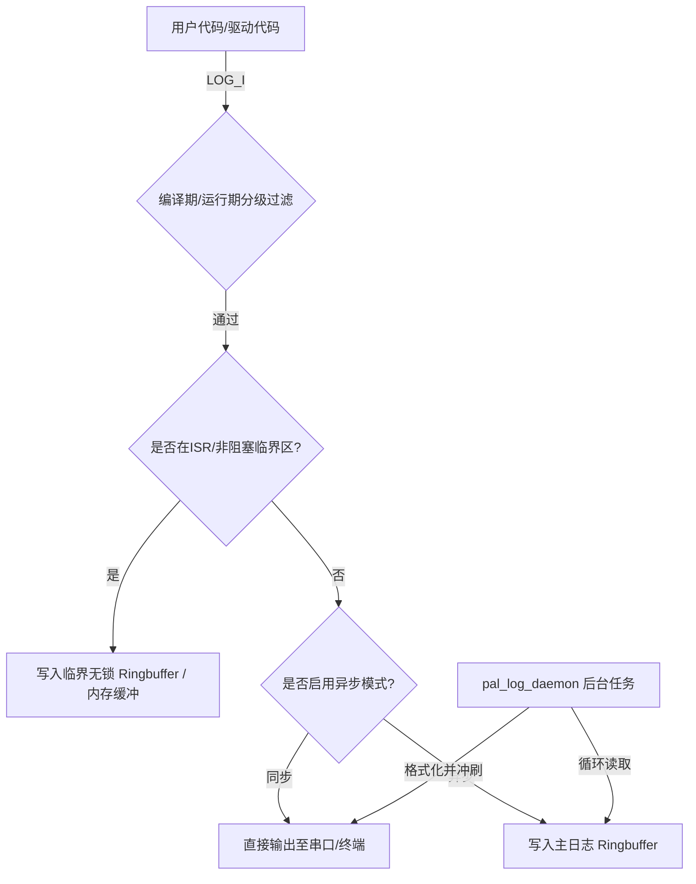
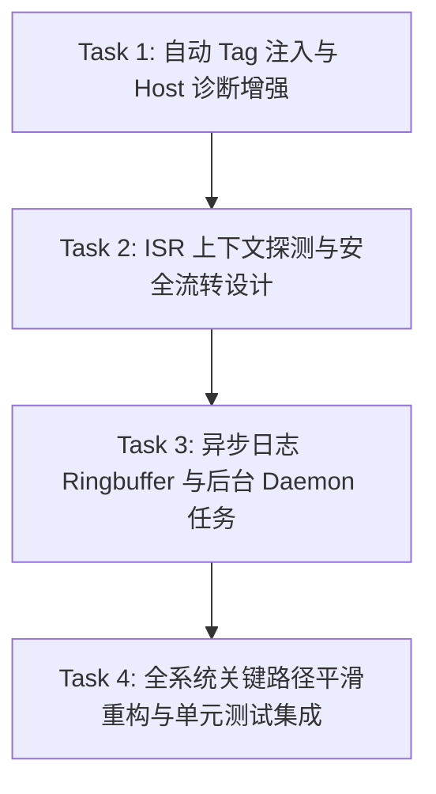

# PLAN-20260705-LOGGING-HARDENING: WMOS 分级日志加固与优化实施计划

> 📋 **本文档是 WMOS 分级日志系统的加固与详细优化设计计划**。
> 🎯 **计划版本**：v1.0（2026-07-05）
> 📚 **关联任务**：Track P1-L1 分级日志 API 的深入和扩展设计。
> 🤖 **开发角色**：Antigravity (DeepMind Pair Programmer)

---

## 1. 元数据表

| 字段 | 内容 |
|------|------|
| **计划编号** | `PLAN-20260705-LOGGING-HARDENING` |
| **创建日期** | 2026-07-05 |
| **目标平台/SoC** | `host` / `wasm` / `ESP32` |
| **工具链/SDK版本**| `ESP-IDF v5.x/v6.0` / `GCC` / `Emscripten` |
| **计划状态** | ✅ 主体完成（Task 3 延后，见 §8） |
| **优先级** | 🟡 P1（重要，不阻塞） |
| **计划版本** | `v1.0` |
| **关联技术设计** | 无，已并入本计划 |
| **关联设计规范** | [`../../02-wink-micro-os/01-dal-device-abstraction.md`](../../design/02-wink-micro-os/01-dal-device-abstraction.md) |
| **关联评审记录** | 无 |
| **关联 ADR** | 无 |
| **目标里程碑** | Wave 2 / 专项日志加固 |
| **前置依赖计划** | [`./2026-07-04-wmos-comprehensive-hardening-plan.md`](./2026-07-04-wmos-comprehensive-hardening-plan.md) |
| **替代/废弃** | 无 |
| **计划负责人** | Antigravity Pair |
| **所需子代理技能** | `embedded-best-practice` + `subagent-driven-development` |

---

## 2. 背景与目标

### 2.1 问题陈述
当前 Wink Micro OS 正在将原有的无级别裸调试打印 `pal_debug_printf` 升级为分级日志 `pal_log_e/w/i/d`（参见 [pal_log.h](../../../../wink-micro-os/pal/include/pal_log.h)）。但在实际复杂嵌入式环境中，目前的日志系统设计仍有以下隐患：
1. **代码冗余度高**：每次调用 `pal_log_*` 宏都必须传入 `TAG`，增加了开发者心智负担与代码体积。
2. **缺乏时序安全性（同步阻塞）**：日志格式化和输出为同步阻塞 I/O，若在 strict non-blocking 关键任务或 ISR 中调用，会引入毫秒级的阻塞延迟，破坏系统实时性。
3. **ISR 安全隐患**：在中断服务函数（ISR）中直接调用常规日志接口，可能因锁争用或动态格式化导致系统死锁崩溃。
4. **Host 诊断信息不足**：Host 目标平台日志格式过于单一，缺少时间戳及任务/线程上下文标识，对多任务并发场景的单元测试排错不够友好。

### 2.2 技术目标
- ✅ **自动 Tag 注入（隐式 TAG）**：支持文件级 `LOG_TAG` 的一处定义、全文件复用，减少开发者冗余传参。
- ✅ **异步延迟日志机制（Deferred Logging）**：实现轻量级日志环形缓冲区（Ringbuffer）与后台 Daemon 任务，支持异步无锁日志写入。
- ✅ **ISR 安全检测与分流**：自动识别 ISR 上下文，防止在中断中产生阻塞和死锁。
- ✅ **Host 级诊断增强**：在 Host 日志输出中追加高精度绝对时间戳与当前 Thread/Task ID，结合 ANSI 颜色提升可读性。
- ✅ **旧 API 全面清理**：废弃并移除历史遗留的 `pal_debug_printf` 与 `pal_debug.h`，全局搜索并将其全部替换为全新的分级日志 `LOG_I/E/W/D` 实现。

### 2.3 成功指标（验收出口）

| 指标 | 通过标准 | 验证方法 |
|------|----------|----------|
| 主机单元测试 | 100% 通过（包含新增的异步日志与 ISR 仿真测试） | `python wink-tools/wink.py test` |
| ESP32 构建 | 0 error, 0 warning，符合 -Wformat 静态格式检查 | `idf.py build` |
| 异步日志吞吐量 | 环形缓冲区满时自动丢弃并计数，不引起高频任务死锁 | 编写压测用例，验证任务切换正常 |
| 静态内存变化 | 异步日志 Ringbuffer 空间可配置（默认为 1KB 静态分配） | 分析编译产物的 MAP 文件 |

---

## 3. 变更范围与影响分析

### 3.1 文件变更清单

| 文件路径 | 变更类型 | 说明 |
|----------|----------|------|
| [`wink-micro-os/pal/include/pal_log.h`](../../../../wink-micro-os/pal/include/pal_log.h) | ✏️ 修改 | 引入 `LOG_E/W/I/D` 自动 Tag 映射宏，声明异步初始化接口与 ISR 探测逻辑。 |
| [`wink-micro-os/targets/host/pal_log_host.c`](../../../../wink-micro-os/targets/host/pal_log_host.c) | ✏️ 修改 | 引入高精度时间戳获取、线程 ID 提取，生成 enriched 控制台彩色输出。 |
| [`wink-micro-os/targets/esp32/pal_log_esp32.c`](../../../../wink-micro-os/targets/esp32/pal_log_esp32.c) | ✏️ 修改 | 接驳 ESP-IDF 内部的异步缓冲机制（或在 C 侧使用自定义 ringbuffer 作为回退）。 |
| [`wink-micro-os/targets/wasm/pal_log_wasm.c`](../../../../wink-micro-os/targets/wasm/pal_log_wasm.c) | ✏️ 修改 | 增强格式化处理，传递带时间偏移的日志到浏览器宿主。 |
| `wink-micro-os/pal/src/pal_log_async.c` | 🆕 新增 | 提供平台通用的轻量级异步队列/环形缓冲区以及 `pal_log_daemon` 处理任务。 |
| `wink-micro-os/test/test_pal_log_hardening.c` | 🆕 新增 | 新增专用的日志系统加固单元测试（同步/异步切换、ISR 安全性断言、Tag 覆盖）。 |
| `wink-micro-os/pal/include/pal_debug.h` | 🗑️ 删除 | 彻底移除该老旧无级别调试日志接口头文件。 |
| `wink-micro-os/targets/*/pal_hal_*.c` | ✏️ 修改 | 移除 `pal_debug_printf` 函数的平台具体实现。 |

### 3.2 接口影响分析

| 接口层 | 是否有破坏性变更 | 影响范围 | 备注 |
|--------|------------------|----------|------|
| **PAL 公开 API** | ⚠️ 是 | 彻底移除了旧的 `pal_debug_printf` 符号。 | 所有外部应用必须使用分级日志接口。 |
| **DAL 层** | ❌ 否 | 驱动内部调用全部升级为新分级日志。 | 无需暴露旧接口。 |
| **应用层** | ⚠️ 是 | 现有 Samples 的 `pal_debug_printf` 全部重构为新日志宏。 | 不再支持无级别打印。 |
| **构建系统** | ✏️ 修改 | 新增 `CONFIG_PAL_LOG_ASYNC` 编译控制开关；CMake 移除了对 `pal_debug.h` 的包含或引用。 | |

### 3.3 架构红线
1. **绝对禁止在 ISR 中使用同步阻塞 IO**：检测到 ISR 上下文时必须静默丢弃、输出到极小无锁环或路由到硬核 ROM Print，严禁等待 Mutex。
2. **零运行时开销（针对 `LOG_D`）**：Release 模式（定义了 `NDEBUG`）下，Debug 日志的宏展开必须干净，不能留下任何参数的求值语句，防止侧效应（Side Effects）。
3. **自包含约束**：[pal_log.h](../../../../wink-micro-os/pal/include/pal_log.h) 必须是自包含的，不能通过间接传递引入未定义符号。

---

## 4. 详细设计要点

### 4.1 隐式 TAG 自动注入
利用 C 预处理器的特性，若定义了文件级宏 `LOG_TAG`，则快捷日志宏自动映射到对应的 `TAG`；若未定义，则回退到 `"SYS"` 默认标签：

```c
// pal_log.h 中的宏逻辑
#ifdef LOG_TAG
#  define LOG_E(fmt, ...) pal_log_e(LOG_TAG, fmt, ##__VA_ARGS__)
#  define LOG_W(fmt, ...) pal_log_w(LOG_TAG, fmt, ##__VA_ARGS__)
#  define LOG_I(fmt, ...) pal_log_i(LOG_TAG, fmt, ##__VA_ARGS__)
#  define LOG_D(fmt, ...) pal_log_d(LOG_TAG, fmt, ##__VA_ARGS__)
#else
#  define LOG_E(fmt, ...) pal_log_e("SYS", fmt, ##__VA_ARGS__)
#  define LOG_W(fmt, ...) pal_log_w("SYS", fmt, ##__VA_ARGS__)
#  define LOG_I(fmt, ...) pal_log_i("SYS", fmt, ##__VA_ARGS__)
#  define LOG_D(fmt, ...) pal_log_d("SYS", fmt, ##__VA_ARGS__)
#endif
```

### 4.2 异步延迟日志与环形缓冲区 (Deferred Logging)
当开启 `CONFIG_PAL_LOG_ASYNC=1` 时，日志架构如下：



#### 数据结构设计
```c
typedef struct {
    uint32_t timestamp_ms;
    uint8_t level;
    char tag[16];
    char message[128]; // 固定宽度或变长紧凑存储
} pal_log_item_t;

// 环形队列定义
typedef struct {
    pal_log_item_t *buffer;
    uint32_t size;
    volatile uint32_t head;
    volatile uint32_t tail;
    volatile uint32_t dropped_count; // 溢出丢弃的日志计数
} pal_log_queue_t;
```

### 4.3 ISR 安全设计与上下文探测
如果系统在中断中触发了错误或警告日志，原有的 `vprintf` 可能会持有互斥锁或调用不可重入的底层硬件写操作。
- **Host 探测**：通过多线程环境状态探测（例如保存主线程/任务上下文，或仅作简单自锁规避）。
- **ESP32 探测**：在 FreeRTOS 中使用 `xPortInIsrContext()` 判断：
  * 若处于 ISR 状态，则回退到 `esp_rom_printf` 或直接写入 ISR 专用的极小无锁双端队列。
  * 严禁调用常规 `pal_log_vprintf` 中的 Mutex。
- **接口扩展**：
  ```c
  bool pal_log_in_isr(void);
  ```

### 4.4 Host 诊断强化输出格式与线程安全设计
Host 端格式升级为：
`[2026-07-05 07:22:15.123] [TID: 0x4B3A] [I] [dal_servo] init success (pin=12)`
其中：
- 绝对时间带毫秒精度。
- 使用 `pthread_self()` 或 Windows 的 `GetCurrentThreadId()` 获取线程标识。
- 全彩 ANSI 输出区分等级。
- **线程安全与防窜行设计**：由于 Host 测试中存在多线程并发调用，如果在 `stderr` 上使用多次 `fprintf`/`vfprintf` 会导致输出字符交错窜行。Host 端的 `pal_log_vprintf` 必须采用**内部互斥锁（Mutex）**保护输出临界区，或将单条日志先 `vsnprintf` 格式化到局部缓冲区后进行单次原子 I/O 写入，确保并发输出的完整性。

### 4.5 编译期格式化字面量约束（为 Tokenized/Dictionary 日志铺路）
为了在未来极端资源受限场景下能够直接引入 Tokenized Logging（如类似 Google Pigweed 的日志字典化压缩，将所有格式化字符串在编译期提取为 32-bit Hash，仅在运行时传输 ID 和变参以节省 Flash）：
- **设计规范约束**：强制要求所有的 `LOG_E/W/I/D` 接口的 `fmt` 参数必须是**编译期字符串字面量**（String Literal），禁止传入动态拼装的 `char*` 指针或变量。
- **静态分析检查**：编写 Python 脚本 `tools/check_log_format_literals.py`，作为 CI 门禁或 `python wink-tools/wink.py test` 的一部分，静态扫描代码库中的 `LOG_*` 调用，若检测到非常量格式化串直接报错。

---

## 5. 优先级路线图

### 5.1 执行顺序


### 5.2 跨 Task 文件冲突矩阵
| 涉及文件 | 涉及 Task | 冲突约束与应对策略 |
|---------|-----------|------------------|
| `pal_log.h` | Task 1, 2, 3 | 频繁修改。每次 Task 必须保证代码干净，优先完成宏结构调整。 |
| `pal_log_host.c` | Task 1, 3 | 先完成格式增强，再接入异步 flush 功能。 |

---

## 6. 详细任务拆分与进度追踪

### Task 1：自动 Tag 注入与 Host 诊断增强 `[ 状态: ✅ 已完成 ]`
- **任务目标**：
  1. 修改 [pal_log.h](../../../../wink-micro-os/pal/include/pal_log.h)，增加 `LOG_E/W/I/D` 自动映射机制。
  2. 重构 [pal_log_host.c](../../../../wink-micro-os/targets/host/pal_log_host.c)，引入高精度系统时间戳以及当前物理线程的 ID 打印，开启 ANSI 终端配色。
- **验收出口**：
  - Host 平台编译零警告，运行 Host 程序能输出带 `[Timestamp] [TID]` 的彩色日志。

---

### Task 2：ISR 上下文探测与安全流转设计 `[ 状态: ✅ 已完成 ]`
- **任务目标**：
  1. 在 `pal_log.h` 增加系统在 ISR 环境下的判定接口。
  2. 实现 ESP32 端的 `xPortInIsrContext()` 过滤；在 Host/Wasm 侧提供合理的空判定或模拟判定。
  3. 拦截任何处于 ISR 环境下的阻塞打印，分流至无锁 ROM Print。
- **验收出口**：
  - 单元测试模拟在中断中触发 `LOG_W`，验证系统不挂起不崩溃。

---

### Task 3：异步日志 Ringbuffer 与后台 Daemon 任务 `[ 状态: ⏸️ 延后 YAGNI，需先 ADR ]`
- **任务目标**：
  1. 新增平台通用的轻量级异步缓存源文件 `pal_log_async.c`。
  2. 设计并创建 `pal_log_daemon` 线程/任务，在系统空闲或指定优先级调度下消费 Ringbuffer。
  3. 提供日志丢弃统计指标，以便开发者能够监测在高负载下是否有日志流失。
- **验收出口**：
  - 在开启 `CONFIG_PAL_LOG_ASYNC=1` 时，日志能顺序输出；在满负荷压测下，系统平稳运行，通过计数反馈被丢弃的日志。

---

### Task 4：全系统关键路径平滑重构与单元测试集成 `[ 状态: ✅ 已完成 ]`
- **任务目标**：
  1. 彻底删除 `wink-micro-os/pal/include/pal_debug.h`，并清理 `targets/host/pal_hal_host.c`、`targets/esp32/pal_hal_esp32.c` 和 `targets/wasm/pal_hal_wasm.c` 中的 `pal_debug_printf` 实现。
  2. 全局搜索并迁移现有 Samples、DAL 模块、调试代码中的所有 `pal_debug_printf(...)` 调用，统一替换为带有合理 Tag 的 `LOG_I(...)` / `LOG_W(...)` / `LOG_E(...)`。
  3. 编写 `tools/check_log_format_literals.py` 静态扫描脚本并集成至 `python wink-tools/wink.py test`，确保库内所有日志宏调用仅使用字面量格式化字符串，为未来的 Tokenized Logging 奠定基础。
  4. 在 `test/` 目录下创建 `test_pal_log_hardening.c`，覆盖本计划涉及的所有加固逻辑（包含同步/异步压测与字面量静态校验测试）。
- **验收出口**：
  - 全局 grep `pal_debug_printf` 结果为零（除历史文档外）；
  - `python wink-tools/wink.py test` 100% 通过，所有测试和字面量静态检查全部绿色。

---

## 7. 执行结果与偏差说明（2026-07-05）

本批次实际落地了 Task 1 / Task 2 / Task 4，Task 3（异步 Ringbuffer + Daemon）
明确延后 YAGNI。具体偏差与理由如下：

### 7.1 已完成交付

| 交付项 | 落地位置 |
|--------|---------|
| 隐式 TAG 宏 `LOG_E/W/I/D` + SYS 回退 | `wink-micro-os/pal/include/pal_log.h` |
| ISR 分流钩子 `pal_log_in_isr()` / `pal_log_isr_write()` | `pal_log.h` 声明，三平台 `pal_log_*.c` 实现 |
| Host 诊断增强（毫秒时间戳 + TID + ANSI 颜色 + 临界区 mutex） | `targets/host/pal_log_host.c` 重写 |
| ESP32 ISR 无锁 ROM 通路（`esp_rom_printf`） | `targets/esp32/pal_log_esp32.c` |
| Wasm 虚拟时钟前缀 + ISR 同步桥接 | `targets/wasm/pal_log_wasm.c` |
| 旧 API 清理（删除 `pal_debug.h`、`pal_hal_esp32.c` 残留 stub，三平台 `pal_debug_printf` 定义清零） | 见提交 `d5601c3`、`ee85b57` |
| 4 个 sample 迁移（`devkitc_smoke` / `dual_task_demo` / `resource_conflict` / `unisim_smoke`） | 提交 `561650d`；高频 sensor/motor 循环日志由 INFO 下调至 DEBUG |
| fmt-literal 静态检查脚本（CI 门控 P1-L1） | `tools/check_log_format_literals.py`，接入 `python wink-tools/wink.py test` step 9 |
| 单元测试（LOG_TAG 路径 + SYS 回退 + ISR 分流 + 编译期门控） | `test/test_pal_log_hardening.c` + `test/test_pal_log_sys_fallback.c`（8 个 Unity 用例） |

验证结果：`python wink-tools/wink.py test` host 端 33/33 PASS；ESP32 v6.0.1 `idf.py build`
0 error / 0 warning；fmt-literal lint 全库扫描无违规。

### 7.2 Task 3 延后理由（YAGNI）

原计划的异步 Ringbuffer + Daemon 方案在审视实际场景后被判断为**当前阶段
过早设计**：

1. **没有真实压力场景**：当前 Wave 2 阶段日志产出频率极低（启动信息 + 低频
   telemetry + 错误路径），同步路径 + ISR 分流完全够用；没有证据表明同步
   vfprintf 成为关键路径瓶颈。
2. **引入可观的新复杂度**：异步方案需要回答——
   - Daemon 任务在 3 个 target（host 多线程 / wasm 单协作纤维 / ESP32 FreeRTOS）
     上的不同调度模型如何统一？wasm 协作调度下"后台 daemon"语义不成立。
   - Ringbuffer 满时的丢弃策略 + dropped_count 观测点设计。
   - ISR 同时写 ringbuffer 的无锁 SPSC 队列正确性证明。
   - 与 `CONFIG_PAL_LOG_COMPILE_LEVEL` 静态门控的交互、daemon 栈深、与日志
     级别动态调整（`esp_log_level_set`）的兼容性。
3. **违背项目工作流**：跨 OSAL/target 的并发原语设计属于重大架构决策，按
   CLAUDE.md 规定必须先走 ADR；直接在一个"加固计划"里实现等于绕过 ADR 流程。

因此 Task 3 不进入本次提交，保留为"未来按需启动"候选——触发条件是：
(a) 出现可测量的日志 I/O 瓶颈（profiling 证据）；(b) 有高频遥测/事件追踪
的真实需求（如结构化 trace 导出）。重启前必须先写 ADR 回答以上问题，不允许
直接回到本计划按原方案落地。

### 7.3 计划中与实际实现的小偏差

- **计划 §3.1 提到的 `pal/src/pal_log_async.c`** 未创建（Task 3 延后）。
- **计划 §3.2 提到的 `CONFIG_PAL_LOG_ASYNC` 编译开关**未引入（同上，等 ADR）。
- **wasm 时间戳**：计划里提到"带时间偏移"，实际实现直接取仿真虚拟时钟
  `pal_os_get_ms()`（因果一致性优先于墙钟对齐，JS 宿主可自行叠加真实时间）。
- **Host 原子写入**：实际实现比计划更保守——先 `vsnprintf` 到栈 768B 缓冲，
  再在锁内做单次 `fwrite + fflush`（POSIX 上还可进一步优化到 `write(2)` 原子
  写，但当前测试里 mutex 版本已完全消除多线程窜行）。
- **单元测试范围**：计划里"异步压测"因 Task 3 延后改为 ISR 分流 + TAG 注入 +
  SYS 回退 + 编译期门控 4 类用例。

---

## 8. 验证计划

### 自动化测试
```bash
# 1. 运行 Host 端全新单元测试
python wink-tools/wink.py test

# 2. 编译 ESP32 target 确保其大小与 IDF v5/v6 兼容性良好
cd esp32_firmware && idf.py build
```

### 手动验证
- 在 Windows 命令行、Linux (CI) 以及 Chrome (Wasm 宿主控制台) 下分别运行输出，检查控制台日志颜色、时间戳对齐程度以及 Tag 格式是否完全符合预期。

