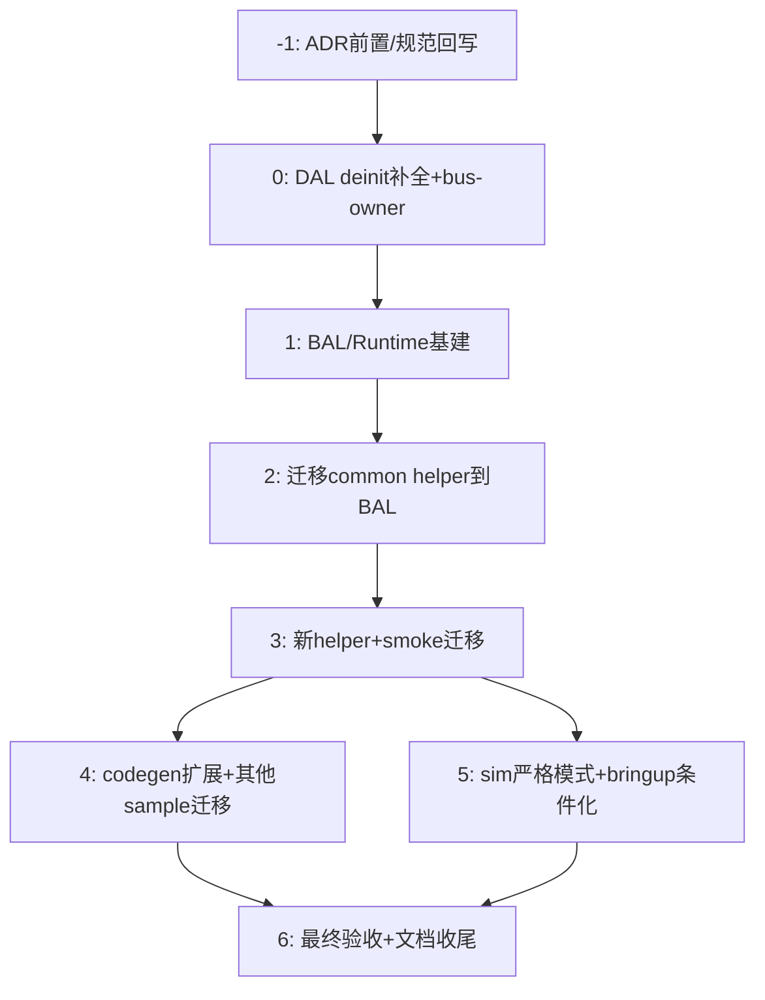

# BAL/DCST 架构重构实施计划：静态硬件树 + 动态控制层

| 字段 | 内容 |
|------|------|
| **计划编号** | `PLAN-20260706-BAL-DCST` |
| **创建日期** | `2026-07-06` |
| **目标平台/SoC** | `host` / `wasm` / `ESP32` (ESP32-D0WD, DevKitC) |
| **工具链/SDK版本** | `ESP-IDF v6.0.1` / `GCC (WinLibs 16)` / `Emscripten (wasm32)` |
| **计划状态** | ✅ 已完成（2026-07-10：host 52/52 + wasm STRICT_NONBLOCKING + ESP32 S1–S11 真机 smoke 通过） |
| **优先级** | 🔴 P0（架构性重构，阻塞后续 BAL helper/sample 迁移） |
| **计划版本** | `v1.1` |
| **关联技术设计** | [`../../tech-designs/core/2026-07-06-bal-dcst-architecture-refactor.md`](../../tech-designs/core/2026-07-06-bal-dcst-architecture-refactor.md) (v5 Owner 决策版) |
| **关联设计规范** | `02-wink-micro-os/03-device-abstraction-layer.md` / `02-wink-micro-os/04-runtime-fault-model.md` / `02-wink-micro-os/01-pal-platform-abstraction.md` / `03-app-codegen/` / `04-wasm-simulation/` / `07-platform-governance/coding-conventions.md`（ADR Accepted 后回写） |
| **关联评审记录** | 无 |
| **关联 ADR** | [`ADR-0023`](../../decisions/core/0023-bal-business-abstraction-layer.md) / [`ADR-0024`](../../decisions/core/0024-fault-three-phase-model-and-dal-deinit-contract.md) / [`ADR-0025`](../../decisions/core/0025-app-blocking-api-honesty-pragma-convention.md)（均已 Accepted） |
| **目标里程碑** | BAL 正式层建立 + devkitc_smoke 全迁移 + sim 严格模式开启 |
| **前置依赖计划** | 无（ADR 均已 Accepted） |
| **替代/废弃** | 无 |
| **计划负责人** | 项目 Owner + Claude Code |
| **所需子代理技能** | `embedded-best-practice` + `test-driven-development` + `systematic-debugging` |

---

## 现状校正（vs tech-design v5 假设）

经代码走查，发现 tech-design 中几处与代码现状不符的细节，本计划**以代码实况为准**：

| Tech-design 假设 | 代码实况 | 计划处理 |
|---|---|---|
| `WINK_PERIODIC_INVALID` 应为 `(handle_t)-1` | `wink_tasks.h` 当前约定 `handle = slot+1`，0 = INVALID，负值 = wink_status_t 错误码透传 | **采纳现状**：新增 `#define WINK_PERIODIC_INVALID ((wink_periodic_handle_t)0)`，全文替换裸写 `0` 魔数；不引入 -1 以避免语义冲突 |
| DAL 已有 deinit (led/button/ultrasonic) "只调 pal_resource_release，是伪 deinit" | 实况：button_deinit 做了 `pal_gpio_disable_interrupt`+`pal_gpio_synchronize_interrupt`+清 event_cb；ultrasonic_deinit 做了 `pal_rmt_pulse_capture_deinit`+两侧 resource_release；led_deinit 做了 `dal_led_off`+resource_release。**但三个 deinit 确实都没调 `gpio_reset_pin`**（撤销 IDF reservation），ESP32 v6 下重复 init 会报 GPIO 占用 | 阶段 0 定为"补 `gpio_reset_pin` + 补充缺失项"而非"全部重写"；对已实现正确的部分（ISR 注销、RMT deinit、软件态复位）保留并加固 |
| BAL tests 放 `bal/tests/` | 测试统一在 `wink-micro-os/test/` 目录（`add_wink_test`/`add_wink_host_test` 宏） | 遵循现有约定：BAL helper 测试放 `wink-micro-os/test/test_bal_<device>_<scenario>.c` |
| `wink_periodic.h/c` 独立文件 | periodic API 在 `runtime/include/wink_tasks.h` + `runtime/src/wink_runtime_tasks.c`（无独立 wink_periodic 文件） | 遵循现状：新增 API 加在 `wink_tasks.h`/`wink_runtime_tasks.c`；不新建文件 |
| soft_timer 错误码用 `WINK_ERR_RESOURCE_EXHAUSTED` | 实况 `wink_soft_timer.c` 槽满返 `WINK_ERR_NO_MEM` | 保留现状（-20/-21 语义段），不做无关重命名 |
| BAL 目录下独立 CMakeLists 建 `wink_bal` 静态库 | 现 `samples/common/CMakeLists.txt` 是 OBJECT 库 `wink_sample_common` | 阶段 1 #1 新建 `wink-micro-os/bal/CMakeLists.txt` 静态库 `wink_bal`，并从 samples/common 迁移 |
| I2C API 在独立 `pal/include/pal_i2c.h`，三 target 都有独立 `pal_hal_i2c_*.c` | 实况：I2C API 只有 3 个函数（`_port_pins`/`_transfer`/`_scan`），全部在 `pal/include/hal/pal_hal.h`；ESP32 有独立 `pal_hal_i2c_esp32.c`，host/wasm 的 I2C 函数内嵌在 `pal_hal_host.c`/`pal_hal_wasm.c` 里，**没有**独立文件；没有 bus 生命周期 API | **采纳实况**：新 bus API 放 `pal/include/hal/pal_i2c.h`（独立头，不是根 pal_i2c.h）；ESP32 新建 `pal_hal_i2c_bus_esp32.c`（bus 生命周期）；host/wasm 在现有 `pal_hal_host.c`/`pal_hal_wasm.c` 里追加 bus_init/deinit（不拆文件） |
| tech-design §7 #7 要求"PAL 层新增 bus-owner 抽象"，计划 Task 0.1 设计了 bus_init/deinit + add_device/remove_device 四个 API | 实况：ADR-0024 §4 #6 和 tech-design Q17 说的是"**codegen 生成静态 bus-owner 节点**"——单器件 deinit 不得销毁 bus；client 管理不需要动态 add/remove（device_tree 是编译期静态拓扑） | **采纳 tech-design 真意**：PAL bus API **极简**：仅 `pal_i2c_bus_init(port, sda, scl, hz)` / `pal_i2c_bus_deinit(port)` 两个函数（无 handle、无 add/remove_device），服务 codegen 生成的静态 bus-owner 节点调用；DAL client 继续按 port+dev_addr 直接调 `pal_i2c_transfer`，无需感知 bus 句柄 |
| 实施计划未包含 ADR-0024 §7 Early Boot boot lockout 前置检查 | ADR-0024 §7 明确要求"执行 `wink_device_tree_init()` 之前，必须先校验 boot 计数，达阈值进 Safe-lock 禁止 init" | 新增 Task 0.9：runtime early boot 阶段校验 ADR-0010 boot 计数 |

---

## 2. 背景与目标

### 2.1 问题陈述

当前 helper 散落在 `samples/common/`，存在以下架构性缺陷：
1. Helper 不是一等公民（目录在 samples/ 下，AI/用户分不清正式 API 与示例代码）；
2. 单轨 API 一刀切（初学者被迫暴露栈/优先级/核，专家又无法覆盖参数）；
3. blink_helper 有 `s_next++` 环形游标 LIFO 耗尽 bug（正常 start/stop 5 次即 RESOURCE_EXHAUSTED）；
4. BAL 公共头泄露 PAL 类型（`pal_os_core_id_t`），破坏分层红线；
5. 无 `change_period` 动态调频能力（servo/PID 闭环丢拍不可接受）；
6. 无效句柄裸写 0 魔数，缺具名常量；
7. DAL deinit 缺 `gpio_reset_pin`（ESP32 v6 reservation 泄漏）+ 4 个驱动完全无 deinit；
8. app_callbacks.c 顶部 file-scope pragma 一刀切关 deprecated warning，遮住真 bug；
9. codegen 的 `app_support.c` 自动启动 button auto_poll，违反"JSON 只描述静态世界"原则；
10. sim target 未开启 `WINK_STRICT_NONBLOCKING=1`，"两端不同源"风险。

三个 ADR（0023 BAL 分层 / 0024 Fault 三阶段 / 0025 App 阻塞诚实化）已 Accepted，现需落地实施。

### 2.2 技术/业务目标

- ✅ 正式建立 `wink-micro-os/bal/` 作为一等分层，BAL 公共头零 `pal_*` include
- ✅ 强类型双轨 API（`_start`/`_start_ex`）+ 三态 slot 池（FREE/STARTING/RUNNING）+ TOCTOU 自回滚，零并发空指针窗口
- ✅ codegen 驱动 slot 容量（`WINK_APP_MAX_<DEV>_INSTANCES`），零 RAM 浪费、零 RESOURCE_EXHAUSTED
- ✅ Runtime 新增 `wink_periodic_change_period`（零停摆，含 xTaskAbortDelay/fiber-wake）
- ✅ DAL deinit 质量铁律落地：7 个驱动全部补齐 `gpio_reset_pin` + 幂等 + bus-owner 抽象
- ✅ Fault 三阶段（Phase 1/2/3）模型落地，init 失败遵循"谁启动谁回滚"契约
- ✅ App 层阻塞 API pragma 诚实化：BAL `.c` 用 `WINK_INTERNAL_BLOCKING_REGION`、app init 小块用 `WINK_INIT_BLOCKING_REGION`、业务回调零 pragma
- ✅ devkitc_smoke 迁移到新模式：新 `init_status/on_fault_status` 签名、零 file-scope pragma、零 `pal_osal.h` include、显式 button_helper_start
- ✅ 三 target 同源编译：host 0 warn + 单测全绿；ESP32 0 warn 0 error + S1-S11 全过；wasm sim 开启 STRICT_NONBLOCKING=1

### 2.3 成功指标（验收出口）

| 指标 | 通过标准 | 验证方法 |
|------|----------|----------|
| host 单元测试 | 100% 通过（含新增 BAL/runtime/DAL 用例） | `python wink-tools/wink.py test` |
| ESP32 构建 | 0 error, 0 warning | `idf.py -C esp32_firmware build`（用 EIM profile 激活） |
| wasm sim 构建 | 0 error, 0 warning, STRICT_NONBLOCKING=1 通过 | `cmake --build build_wasm` |
| ESP32 真机 smoke | S1-S10 行为与重构前一致 + S11 deinit 循环 5 轮不报 GPIO 占用/不 WDT | `idf.py -C esp32_firmware -p COMx flash monitor` |
| BAL 分层红线 | `bal/include/**/*.h` 无 `#include.*pal_` | CI grep 卡口 |
| App 层 pragma 诚实化 | app_callbacks.c 零 file-scope pragma，仅 selftest 块有 `WINK_INIT_BLOCKING_REGION` | 人工 review + grep 卡口 |
| 代码生成 golden 单测 | `pytest tools/codegen/tests/test_golden.py` 全过 | pytest |

---

## 3. 变更范围与影响分析

### 3.1 文件变更清单

| 文件路径 | 变更类型 | 说明 |
|----------|----------|------|
| `wink-micro-os/bal/`（整个新目录） | 🆕 新增 | BAL 正式层，含 include/{output,input,sensor,actuator,display,comm}/ + src/ + CMakeLists.txt |
| `wink-micro-os/bal/include/wink_helper_opts.h` | 🆕 新增 | wink_bal_core_t + wink_helper_opts_t + WINK_HELPER_OPTS 宏 |
| `wink-micro-os/bal/include/output/wink_led_blink_helper.h` | 🆕 新增 | LED blink 强类型 helper（迁移自 samples/common） |
| `wink-micro-os/bal/include/input/wink_button_helper.h` | 🆕 新增 | Button poll helper（迁移自 samples/common） |
| `wink-micro-os/bal/include/sensor/wink_sonar_helper.h` | 🆕 新增 | 超声波周期测量 helper（新建） |
| `wink-micro-os/bal/include/actuator/wink_servo_helper.h` | 🆕 新增 | 舵机 sweep helper（新建） |
| `wink-micro-os/bal/include/comm/wink_telemetry_helper.h` | 🆕 新增 | 默认遥测 helper（迁移自 samples/common） |
| `wink-micro-os/bal/src/**/*.c` | 🆕 新增 | 上述 helper 的实现 + 0 实例 stub |
| `wink-micro-os/runtime/include/wink_blocking_region.h` | 🆕 新增 | WINK_INTERNAL/INIT_BLOCKING_REGION 宏（GCC/Clang/MSVC 三编译器） |
| `wink-micro-os/runtime/include/wink_tasks.h` | ✏️ 修改 | 新增 WINK_PERIODIC_INVALID=0 具名常量 + wink_periodic_change_period + wink_periodic_active_count 声明 |
| `wink-micro-os/runtime/src/wink_runtime_tasks.c` | ✏️ 修改 | 实现 change_period（LIGHT/MAY_BLOCK 双路径 + xTaskAbortDelay/fiber-wake）+ active_count |
| `wink-micro-os/runtime/include/wink_soft_timer.h` | ✏️ 修改 | 新增 wink_soft_timer_change_period 声明 |
| `wink-micro-os/runtime/src/wink_soft_timer.c` | ✏️ 修改 | 实现 soft_timer_change_period（原子更新 period） |
| `wink-micro-os/pal/include/wink_status.h` | ✏️ 修改 | 新增 WINK_ERR_CANCELED=-19 错误码 |
| `wink-micro-os/runtime/include/wink_pt_debug.h` | ✏️ 修改 | 与 LIGHT 上下文 in-flag 打通 WINK_ASSERT_NONBLOCKING |
| `wink-micro-os/runtime/src/wink_runtime.c` | ✏️ 修改 | fault 流程三阶段 Phase 模型实现 + LIGHT 上下文标志维护 + init_status/on_fault_status 分派 |
| `wink-micro-os/dal/include/output/dal_led.h` | ✏️ 修改 | 补充注释（gpio_reset_pin 行为） |
| `wink-micro-os/dal/src/output/dal_led.c` | ✏️ 修改 | deinit 加 gpio_reset_pin（通过 PAL 抽象）+ 软件态彻底复位 |
| `wink-micro-os/dal/include/input/dal_button.h` | ✏️ 修改 | 同上 |
| `wink-micro-os/dal/src/input/dal_button.c` | ✏️ 修改 | deinit 加 gpio_reset_pin + 强化幂等 |
| `wink-micro-os/dal/include/sensor/dal_ultrasonic.h` | ✏️ 修改 | 同上 |
| `wink-micro-os/dal/src/sensor/dal_ultrasonic.c` | ✏️ 修改 | deinit 加 trig/echo 两侧 gpio_reset_pin + RMT 停止更彻底 |
| `wink-micro-os/dal/include/actuator/dal_servo.h` | ✏️ 修改 | 新增 dal_servo_deinit 声明 |
| `wink-micro-os/dal/src/actuator/dal_servo.c` | ✏️ 修改 | 实现 dal_servo_deinit（停 PWM + gpio_reset_pin + 软件态复位） |
| `wink-micro-os/dal/include/display/dal_ssd1306.h` | ✏️ 修改 | 新增 dal_ssd1306_deinit 声明（client 级，不销毁 I2C bus） |
| `wink-micro-os/dal/src/display/dal_ssd1306.c` | ✏️ 修改 | 实现 dal_ssd1306_deinit |
| `wink-micro-os/dal/include/storage/dal_eeprom.h` | ✏️ 修改 | 新增 dal_eeprom_deinit 声明 |
| `wink-micro-os/dal/src/storage/dal_eeprom.c` | ✏️ 修改 | 实现 dal_eeprom_deinit |
| `wink-micro-os/dal/include/communication/dal_gps.h` | ✏️ 修改 | 新增 dal_gps_deinit 声明 |
| `wink-micro-os/dal/src/communication/dal_gps.c` | ✏️ 修改 | 实现 dal_gps_deinit |
| `wink-micro-os/pal/include/hal/pal_i2c.h` | 🆕 新增 | I2C bus 生命周期 API（极简：`pal_i2c_bus_init`/`pal_i2c_bus_deinit`），服务 codegen 静态 bus-owner 节点 |
| `wink-micro-os/targets/esp32/pal_hal_i2c_bus_esp32.c` | 🆕 新增 | ESP32 I2C bus 生命周期实现（基于 IDF v6 `i2c_new_master_bus`/`i2c_del_master_bus` + SCL 9-pulse 总线恢复）；现有 `pal_hal_i2c_esp32.c`（transfer/scan/port_pins）不变 |
| `wink-micro-os/targets/host/pal_hal_host.c` | ✏️ 修改 | 追加 host 侧 `pal_i2c_bus_init/deinit` 内存模拟（no-op，bus 句柄无需分配，按 port 记录 initialized 布尔） |
| `wink-micro-os/targets/wasm/pal_hal_wasm.c` | ✏️ 修改 | 追加 wasm 侧 `pal_i2c_bus_init/deinit` no-op 实现 |
| `tools/codegen/drivers/base.py` | ✏️ 修改 | 删除 get_service_headers/render_service_starts 钩子，新增 render_config_macros 钩子 |
| `tools/codegen/drivers/button.py` | ✏️ 修改 | 删除 service 钩子实现，加 render_config_macros（导出 AUTO_POLL_MS/LONG_PRESS_MS） |
| `tools/codegen/drivers/led.py` | ✏️ 修改 | 加 render_config_macros（可选，导出 ACTIVE_HIGH） |
| `tools/codegen/drivers/ultrasonic.py` | ✏️ 修改 | 加 render_config_macros（导出 USE_RMT） |
| `tools/codegen/templates/device_tree.h.j2` | ✏️ 修改 | 新增 WINK_APP_MAX_<DEV>_INSTANCES 计数宏 + 配置常量宏段 |
| `tools/codegen/templates/device_tree.c.j2` | ✏️ 修改 | bus-owner 节点生成 + deinit 顺序加固 + WINK_PT_DEBUG active_count 断言 |
| `tools/codegen/templates/app_options.cmake.j2` | ✏️ 修改 | 新增 WINK_MAX_PERIODIC 自动计算（Σ instances + 4） |
| `tools/codegen/templates/app_support.c.j2` | 🗑️ 删除 | 彻底移除；codegen schema 同步删除 services/callbacks/state_variables |
| `tools/codegen/app_codegen.py` | ✏️ 修改 | schema 移除 3 个字段、删除 app_support.c 生成路径、新增 bus-owner 识别逻辑 |
| `tools/codegen/tests/test_golden.py` + golden 数据 | ✏️ 修改 | 更新 golden 期望输出（匹配新模板） |
| `wink-micro-os/samples/common/include/wink_blink_helper.h` 等旧头 | ✏️ 修改 | 改为转发 include（`#include "bal/output/wink_led_blink_helper.h"`），保留一个版本周期 |
| `wink-micro-os/samples/common/src/*.c` | ✏️ 修改 | 改为转发编译或加 #error 提示迁移 |
| `wink-micro-os/runtime/selftest/wink_sim_echo.h/c`（新目录） | 🆕 新增 | 从 samples/common 迁移 wink_sim_ultrasonic_echo，加 `#ifndef WINK_STRICT_NONBLOCKING` 隔离 |
| `wink-micro-os/samples/devkitc_smoke/app_callbacks.c` | ✏️ 修改 | 重写为初学者版（init_status/on_fault_status 新签名、零 file-scope pragma、零 pal_osal.h include、显式 button_helper_start） |
| `wink-micro-os/samples/devkitc_smoke/wink-app.json` | ✏️ 修改 | 移除 services/callbacks/state_variables（如有）；确保 auto_poll_ms 在 JSON 中 |
| `wink-micro-os/samples/devkitc_smoke/test_devkitc_smoke_e2e.c` | ✏️ 修改 | 加 S11 deinit 循环测试；适配新 API |
| `wink-micro-os/CMakeLists.txt` | ✏️ 修改 | 新增 `add_subdirectory(bal)`；samples/common 改为依赖 wink_bal |
| `wink-micro-os/samples/common/CMakeLists.txt` | ✏️ 修改 | 改为 INTERFACE 库，转发 include 到 bal；旧源文件条件编译 |
| `wink-micro-os/test/CMakeLists.txt` | ✏️ 修改 | 新增 BAL helper 测试 + runtime 新 API 测试 + DAL deinit 幂等测试 |
| `wink-micro-os/test/test_bal_led_blink.c` | 🆕 新增 | LED blink helper 单测 |
| `wink-micro-os/test/test_bal_button.c` | 🆕 新增 | Button helper 单测 |
| `wink-micro-os/test/test_bal_sonar.c` | 🆕 新增 | Sonar helper 单测（含 0 实例 stub） |
| `wink-micro-os/test/test_bal_servo.c` | 🆕 新增 | Servo helper 单测 |
| `wink-micro-os/test/test_bal_telemetry.c` | 🆕 新增 | Telemetry helper 单测 |
| `wink-micro-os/test/test_periodic_change_period.c` | 🆕 新增 | change_period 双路径 + self-set_period 重入单测 |
| `wink-micro-os/test/test_dal_*.c`（led/button/ultrasonic/servo/ssd1306/eeprom/gps） | 🆕/✏️ 新增/修改 | 每个 DAL 驱动的 init→deinit→init 幂等单测 |
| `wink-micro-os/test/test_blocking_region_macros.c` | 🆕 新增 | 阻塞宏在 GCC/Clang/MSVC 模拟（通过 #define 验证） |
| `docs/design/02-wink-micro-os/03-device-abstraction-layer.md` | ✏️ 修改 | ADR 回写：BAL 正式层描述 + DAL deinit 清场检查单 |
| `docs/design/02-wink-micro-os/04-runtime-fault-model.md` | ✏️ 修改 | ADR 回写：Phase 1/2/3 三阶段 fault 模型 |
| `docs/design/02-wink-micro-os/01-pal-platform-abstraction.md` | ✏️ 修改 | ADR 回写：WINK_BLOCKING pragma 诚实化约定 |
| `docs/design/03-app-codegen/` | ✏️ 修改 | ADR 回写：WINK_APP_MAX_*、config 宏、render_config_macros、bus-owner |
| `docs/design/04-wasm-simulation/` | ✏️ 修改 | ADR 回写：STRICT_NONBLOCKING=1 默认开启 |
| `docs/design/07-platform-governance/coding-conventions.md` | ✏️ 修改 | ADR 回写：pragma 规则矩阵 + CI 卡口 |

### 3.2 接口影响分析

| 接口层 | 是否有破坏性变更 | 影响范围 | 备注 |
|--------|------------------|----------|------|
| PAL 公开 API | ⚠️ 增量（非破坏） | `wink_status.h` 新增错误码 `WINK_ERR_CANCELED=-19` | 纯添加，旧错误码不变 |
| DAL 层 | ⚠️ 增量（非破坏） | 新增 4 个 deinit + 3 个 deinit 补 gpio_reset_pin | 旧代码未调用 deinit 的不受影响；调用 deinit 的获得正确行为 |
| Runtime periodic API | ⚠️ 增量（非破坏） | `wink_tasks.h` 新增常量/API；soft_timer 新增 change_period | 旧 API 签名不变，无 breakage |
| BAL 层（新） | 🆕 全新 | app 层 include 新路径 `bal/.../wink_xxx_helper.h` | 旧 samples/common 头保留转发 include 一个版本周期 |
| App 回调签名 | ⚠️ 过渡式（非破坏） | `wink_app_callbacks_t` 已存在 init_status/on_fault_status 字段（新老并存）；devkitc_smoke 切换到新签名；其他 sample 保留 legacy 一个版本周期 | Legacy void init/on_fault 字段保留，runtime 继续分派 |
| Codegen 模板 | ⚠️ 破坏性（小） | 删除 app_support.c.j2；schema 移除 services/callbacks/state_variables；device_tree.h 新增两类宏 | 所有使用 codegen 的 sample（目前只 devkitc_smoke）在同一 commit 迁移；其他 sample 手写 device_tree 不受影响 |
| 构建系统 | ⚠️ 新增库 | 新增 `wink_bal` 静态库；samples/common 改 INTERFACE 转发 | 需更新所有 sample 的 target_link_libraries |

### 3.3 架构红线（🚨 违反即拒绝合入）

> 1. **BAL 公共头分层红线**：`bal/include/**/*.h` **严禁** include 任何 `pal_*.h`（仅允许 `pal_log.h` 因为 LOG 宏不引入 OSAL/HAL 类型）；CI 加 grep 卡口。
> 2. **LIGHT 回调铁律**：LIGHT 类 helper（blink/button poll）回调内**严禁**阻塞/浮点重算/mutex/复杂 printf；回调体 ≤20 行；编译期 deprecated 警告 + 运行期 WINK_ASSERT_NONBLOCKING + sim STRICT_NONBLOCKING 三道防线。
> 3. **DAL deinit 铁律**：所有 `dal_xxx_deinit` 必须满足 ADR-0024 §4 清场检查单（10 项全满足），**硬要求** `gpio_reset_pin` 覆盖所有使用的引脚；deinit 必须非阻塞（≤50ms），DMA/RMT 类强停不等 burst；单器件 deinit **不得**销毁共享 I2C/SPI bus（bus 生命周期由 codegen 静态 bus-owner 节点管理，DAL 只清 client 软件态）。
> 4. **同源编译红线**：所有改动必须同时通过 host/ESP32/wasm 三 target 构建（sim 阶段 5 开启 STRICT_NONBLOCKING=1）；任何 BAL helper 的 `.c` 不得使用 `#ifdef ESP_PLATFORM` 特化路径（除非是 PAL 层已抽象的差异）。
> 5. **临界区原则**：`pal_irq_save_rtos_safe/pal_irq_restore` 只保护 slot 元数据；`wink_periodic_start_ex/stop`（可能阻塞）必须在临界区**外**调用。
> 6. **JSON 只描述静态世界**：codegen 模板不得再生成任何服务启动代码；`wink-app.json` schema 永远禁止 period_ms/priority/stack/on_xxx 等业务字段。

### 3.4 系统资源与并发约束评估

| 资源/安全维度 | 预计变化/开销 | 风险与限制 | 缓解/应对策略 |
|--------------|--------------|-----------|--------------|
| **ROM/Flash** | BAL 代码 ≈ 新增 2-4 KB；runtime change_period ≈ +0.5 KB；阻塞区域宏是头文件零开销 | 小资源 MCU（如 ESP32-C3 400KB ROM）紧张度略增 | `-ffunction-sections -fdata-sections` + 链接器 GC；0 实例 stub 整个 helper 不链接 |
| **RAM (BSS)** | BAL slot 池容量由 codegen 驱动（Σ instances ≈ 3-8 槽，每槽 ≈ 20-40B），总量 ≈ 200B；比现有 samples/common 硬编码 4+4 槽更省 | 无显著风险 | 0 实例 helper 数组大小 0，链接器 GC |
| **栈深度** | BAL helper MAY_BLOCK task 栈按默认值分配（2-3 KB/task），与现状一致；LIGHT 路径零独立栈 | sonar helper 默认 3072B 略大（RMT 驱动调用深度） | 专家可用 `_start_ex` 缩栈；sim/host 下栈大小不敏感 |
| **堆 (Heap)** | **零新增 malloc**：slot 池全静态 BSS、change_period 无动态分配 | 无 | 所有 BAL 结构全静态，符合 ADR-0004 |
| **硬件通道/IO 引脚** | 无新增引脚占用；bus-owner 抽象统一管理 I2C/SPI 共享 | bus-owner 与旧代码各自 i2c_driver_create 冲突 | Stage 0 bus-owner 落地后所有 DAL I2C client 必须走 bus handle，不得自行 create |
| **并发与中断安全** | 三态 slot + 世代计数器防 TOCTOU/ABA；临界区用 rtos_safe 原语；LIGHT 路径运行在 tick 协作上下文 | start/stop 并发需自回滚正确；xTaskAbortDelay 在 SMP 下需验证 | 单测覆盖并发 start/stop/set_period 场景；ESP32 双 target（S0/S1）smoke 验证 |

---

## 4. 依赖与风险

### 4.1 前置依赖

| 依赖ID | 依赖内容 | 是否阻塞 | 验证状态 | 备注 |
|--------|----------|----------|----------|------|
| D-001 | ADR-0023/0024/0025 Accepted + 设计规范回写 | ✅ 是 | ✅ 已完成 | ADR 均于 2026-07-06 Accepted；规范回写列入 Task -1.2 |
| D-002 | ADR-0018 `pal_irq_save_rtos_safe` 已实现 | ✅ 是 | ✅ 已完成 | pal_irq.h:190 已确认 |
| D-003 | ADR-0013/0014 协作调度器已实现 | ✅ 是 | ✅ 已完成 | 为 LIGHT 路径提供协作语义 |
| D-004 | `wink_app_callbacks_t` 已有 init_status/on_fault_status 字段 | ✅ 是 | ✅ 已完成（wink_app.h:335-336） | 纯切换无需改结构体 |
| D-005 | PAL 已有 WINK_UNAVAILABLE_MSG/WINK_BLOCKING/WINK_STRICT_NONBLOCKING 机制 | ✅ 是 | ✅ 已完成（wink_status.h） | 复用现有基础设施 |

### 4.2 外部依赖

无（全部是本仓库内工作）。

### 4.3 风险登记册

| 风险ID | 风险描述 | 概率 | 影响 | 严重度 | 缓解措施 | 责任人 | 触发条件 |
|--------|----------|------|------|--------|----------|--------|----------|
| R-001 | 阶段 0 DAL deinit 实际工作量大于预期（3 补 gpio_reset_pin + 4 新建 + bus-owner 抽象 + 幂等单测） | 🟡 中 | 🟠 中（拖期） | 4 | 先做 led/button 两个最简单的验证模板再批量铺开；每个 deinit 配 reviewer 对照清场单 | 开发者 | deinit 单测未通过 / GPIO reservation 报错 |
| R-002 | `wink_periodic_change_period` MAY_BLOCK 侧 xTaskAbortDelay 在 ESP-IDF v6 下行为与预期不符 | 🟡 中 | 🟠 中（长改短不立即生效） | 4 | 1.4b 子任务加单测"10s 改 100ms 必须在下一个 100ms 内触发"；fallback 方案：用 xTaskNotify 唤醒替代 | 开发者 | 单测 fail / 示波器观察周期不准 |
| R-003 | blink_helper s_next LIFO bug 修复不当引入新竞态 | 🟢 低 | 🟠 中 | 3 | 强制"扫描全数组找 NULL dev"模式；配"start/stop 循环 100 次不 EXHAUSTED"单测 | 开发者 | 单测 fail |
| R-004 | BAL 头意外 include pal_*.h 破坏分层 | 🟢 低 | 🟡 中 | 2 | CI grep 卡口 + code review；BAL 自定 `wink_bal_core_t` 核枚举 | CI | CI 红线触发 |
| R-005 | sim STRICT_NONBLOCKING=1 开启后发现大量违规，阶段 5 时间盒超限 | 🟡 中 | 🟡 中 | 4 | 阶段 5 先做 0.5 天违规普查再分级处理；结构性问题开独立 ADR，不阻塞主架构 | 开发者 | 普查违规数 > 20 处 |
| R-006 | 删除 app_support.c.j2 后某个 sample 忘记迁移（in-repo 或 out-of-tree） | 🟢 低 | 🟡 中 | 2 | in-repo：删除前 grep 确认所有引用方已迁移；out-of-tree：CHANGELOG 记录 + 转发头一个版本周期 | 开发者 | 构建失败 |
| R-007 | bus-owner 拓扑序错误：codegen 生成的 device_tree deinit 顺序未严格逆序，导致 bus 在 client 之前被销毁 | 🟡 中 | 🔴 高（ESP32 运行时崩溃） | 6 | codegen 模板生成 init/deinit 时严格按"bus 节点先于 client init、晚于 client deinit"拓扑序；单测验证 I2C 共享场景 deinit ssd1306 后 eeprom 仍可用 | 开发者 | ESP32 运行时 I2C 报错 |
| R-008 | WINK_PERIODIC_INVALID 从裸 0 改为具名常量时遗漏某些 call site | 🟢 低 | 🟡 中 | 2 | 全仓 grep `== 0`/`!= 0` 在 periodic 相关代码里；单测覆盖 handle=0 路径 | 开发者 | 单测/构建警告 |
| R-009 | LIGHT 上下文 in-flag 在 sim fiber 路径下维护不正确（fiber 切换时 flag 误置） | 🟡 中 | 🟠 中 | 4 |  fiber 切换点显式清 flag；单测专门覆盖 fiber-yield 场景 | 开发者 | sim 下 WINK_ASSERT_NONBLOCKING 误触发 |
| R-010 | ESP32 SMP（双核）下 start/stop 并发实际触发 ABA 竞态（世代计数器设计有缺陷） | 🟢 低 | 🔴 高（空指针崩溃） | 3 | 世代计数器 + 临界区严格按 ADR-0023 §5 方案实现；SMP 双核 stress 单测（反复 start/stop 不同 task 里） | 开发者 | stress 单测失败 |

### 4.4 跨团队/跨模块协调点

| 协调点ID | 描述 | 涉及模块 | 计划协调时间 | 状态 | 负责人 |
|----------|------|---------------|--------------|------|--------|
| C-001 | PAL I2C bus 生命周期 API 设计（codegen bus-owner 节点依赖） | PAL（ESP32/host/wasm 三 target） + codegen 模板 | Task 0.1 开始前 | ⏳ 待确认 | 架构师 |
| C-002 | Codegen golden 测试更新（与模板修改同步） | tools/codegen/ + tests/ | Stage 1 #8 完成 | ⏳ 待确认 | 开发者 |
| C-003 | sim fiber 路径 xTaskAbortDelay 等价实现 | targets/wasm/ + runtime/ | Stage 1 #5 完成 | ⏳ 待确认 | 开发者 |

---

## 5. 优先级路线图

### 5.1 执行顺序



> 文字说明：Stage -1 → Stage 0（DAL deinit 硬前置）→ Stage 1（基建）→ Stage 2（迁移现有 helper）→ Stage 3（新 helper + smoke 迁移，三 target 可验证）→ Stage 4 与 Stage 5 可并行 → Stage 6 最终验收。

### 5.2 优先级矩阵

| 优先级 | Task 数量 | 总预估工时 | 说明 |
|--------|-----------|------------|------|
| 🔴 P0 | 26 | ~75 h | Stage -1/0/1/2/3 + Stage 6 验收（架构落地 + devkitc_smoke 全迁移 + 三 target 绿；含新增 boot lockout Task 0.9 + 拆分后的 1.4b-i/ii/iii） |
| 🟡 P1 | 9 | ~22.5 h | Stage 4（codegen 扩展 + 4 个其他 sample 迁移，拆为独立 Task） |
| ⚪ P2 | 5 | ~9.5 h | Stage 5（sim strict mode 普查/修补/开启；Task 5.2 硬时间盒 8h）+ Stage 6.2 清理 |
| **总计** | **40** | **~107 h（≈ 13.3 人天）** | v1.1 总工时与 v1.0 持平，结构更清晰（大 Task 拆分、bus API 简化抵消 boot lockout 新增工作量）；落在 tech-design 估算的 12.5-21 人天下界 |

### 5.3 关键路径分析

- **关键路径**：Stage -1 → Stage 0（DAL deinit 铁律，所有后续依赖）→ Stage 1（runtime change_period + bus-owner 抽象）→ Stage 2（blink/button/telemetry 迁移）→ Stage 3（sonar/servo 新 helper + smoke 迁移 + 三 target 验证）→ Stage 6 验收。总工时 ≈ 13.5 天按单人。
- **可并行路径**：
  - Stage 1 内部：runtime 新增 API（#4/#5/#6）vs codegen 改造（#7/#8）可并行（注意冲突文件：app_options.cmake.j2 被 #7 和 #8 都改，需串行）
  - Stage 2 内部：各个 helper 迁移（blink/button/telemetry）可并行
  - Stage 4 与 Stage 5 可并行

### 5.4 跨 Task 文件冲突矩阵

| 文件 | 涉及 Task | 串行约束 |
|------|-----------|----------|
| `wink-micro-os/runtime/include/wink_tasks.h` | 1.4a（INVALID 常量 + active_count）、1.4b-iii（change_period 统一入口声明） | **严格串行**：先做 1.4a（常量/active_count），再做 1.4b-iii（声明） |
| `wink-micro-os/runtime/src/wink_runtime_tasks.c` | 1.4a（active_count 实现）、1.4b-ii（MAY_BLOCK xTaskAbortDelay 侧）、1.4b-iii（统一入口 + 分派）、1.5（LIGHT 上下文标志） | **严格串行**：1.4a → 1.4b-ii → 1.4b-iii → 1.5 |
| `wink-micro-os/samples/common/include/wink_blink_helper.h` | 2.1（迁移到 BAL）、2.5（转发头） | 2.1 先写 BAL 版，2.5 再改旧头为转发 |
| `tools/codegen/templates/device_tree.c.j2` | 1.6（bus-owner 拓扑序生成 + WINK_APP_MAX 配套 + deinit 断言） | 依赖 Task 0.1（bus PAL API） |
| `tools/codegen/templates/device_tree.h.j2` | 1.6（WINK_APP_MAX + config 宏） | 独立（与 0.1 无直接冲突） |
| `wink-micro-os/samples/devkitc_smoke/app_callbacks.c` | 3.3（重写为新签名 + S1-S10 PASS/FAIL 统一） | 在 Stage 2 完成 + Stage 3.1/3.2 新 helper 可用后做 |
| `wink-micro-os/pal/include/wink_status.h` | 1.4a（WINK_ERR_CANCELED） | 独立（最先做） |
| `wink-micro-os/pal/include/hal/pal_i2c.h`（新）+ `targets/esp32/pal_hal_i2c_bus_esp32.c`（新）+ `targets/host/pal_hal_host.c`/`pal_hal_wasm.c`（追加） | 0.1（bus 生命周期 API）、0.6（ssd1306/eeprom deinit 走 bus 模式）、1.6（codegen bus-owner 生成） | 0.1 → 0.6（client 改走 bus 模式）→ 1.6（codegen 依赖 bus API） |

---

## 6. 详细任务拆分与进度追踪

> ✅ **Task DoD**：
> 1. 代码符合编码规范（ADR-0001 负数错误码、ADR-0004 静态分发）
> 2. 新增代码有 Unity 单测（覆盖率 ≥ 80%）
> 3. host `python wink-tools/wink.py test` 全绿
> 4. ESP32 `idf.py -C esp32_firmware build` 零错误零警告（阶段 ≥1 开始要求）
> 5. 相关设计文档同步更新（Task -1.2）
> 6. Commit 原子、message 英文、符合 Conventional Commits

> 状态：⏳ 待开始 / 🔄 执行中 / ✅ 已完成

---

### Stage -1：ADR 前置与设计规范回写 `[ 状态: ✅ 已完成 ]`

#### Task -1.1：确认 ADR 状态与 meta 一致性 `[ 状态: ✅ 已完成 ]`

| 字段 | 内容 |
|------|------|
| **负责人** | 架构师 |
| **预估 / 实际工时** | 0.5 h |
| **优先级** | 🔴 P0 |
| **前置依赖** | 无 |
| **修改文件** | `docs/decisions/core/0023-bal-business-abstraction-layer.md`、`0024*.md`、`0025*.md`、`docs/tech-designs/core/2026-07-06-bal-dcst-architecture-refactor.md` |
| **接口变化** | 无（仅文档） |

**详细步骤**

- [x] 确认 3 个 ADR 底部状态日志均已签 "Accepted（Owner 审阅并采纳）"
- [x] 在 tech-design v5 开头更新状态为"ADR 已 Accepted，进入实施阶段"
- [x] 运行 `python docs/decisions/scripts/list_adrs.py -s Accepted` 确认 ADR-0023/0024/0025 在列

**验证**：
1. 命令：`python docs/decisions/scripts/list_adrs.py -s Accepted`
2. 预期：3 个 ADR 全部列出且状态为 Accepted

---

#### Task -1.2：回写设计规范（ADR Accepted 强制要求） `[ 状态: ✅ 已完成 ]`

| 字段 | 内容 |
|------|------|
| **负责人** | 架构师 |
| **预估 / 实际工时** | 3 h |
| **优先级** | 🔴 P0 |
| **前置依赖** | Task -1.1 |
| **修改文件** | `docs/design/02-wink-micro-os/03-device-abstraction-layer.md`、`02-wink-micro-os/04-runtime-fault-model.md`、`02-wink-micro-os/01-pal-platform-abstraction.md`、`docs/design/03-app-codegen/` 下相关文档、`docs/design/04-wasm-simulation/` 下相关文档、`docs/design/07-platform-governance/coding-conventions.md` |
| **接口变化** | 无（文档回写） |

**详细步骤**

- [x] **Step 1**：更新 `03-device-abstraction-layer.md`：
  - 在分层图加入 BAL 层（app → BAL → DAL/runtime → PAL）
  - 添加"BAL 公共头禁 include pal_*"红线
  - 添加 DAL deinit 清场检查单（ADR-0024 §4 表格，10 项检查）
  - 添加 bus-owner 抽象说明
- [x] **Step 2**：更新 `04-runtime-fault-model.md`：
  - 替换旧 fault 模型，加 Phase 1/2/3 时序图
  - 明确 Phase 1 非阻塞 ≤100µs、Phase 2 ≤500ms、Phase 3 WDT 兜底
  - 加"谁启动谁回滚"init 失败契约
  - 加 init_status/on_fault_status 新签名说明
- [x] **Step 3**：更新 `01-pal-platform-abstraction.md`：
  - 加 WINK_BLOCKING pragma 诚实化约定
  - 加 WINK_INTERNAL/INIT_BLOCKING_REGION 宏说明
- [x] **Step 4**：更新 `03-app-codegen/`：
  - 加 WINK_APP_MAX_<DEV>_INSTANCES 宏说明
  - 加配置常量宏 + render_config_macros() 钩子
  - 加 bus-owner 生成规则
  - 加 WINK_MAX_PERIODIC 自动计算规则
  - 明确"JSON 只描述静态世界，services/callbacks/state_variables 已删除"
- [x] **Step 5**：更新 `04-wasm-simulation/`：
  - 加 STRICT_NONBLOCKING=1 默认开启的决策
  - 加 bringup 模块迁移到 runtime/selftest/ + 条件编译的说明
- [x] **Step 6**：更新 `07-platform-governance/coding-conventions.md`：
  - 加 pragma 规则矩阵（ADR-0025 §2，7 行表格）
  - 加 CI 卡口说明（BAL 头禁 pal_ include、app 层禁 file-scope pragma、sim 强制 STRICT_NONBLOCKING）

**验证**：
1. 打开上述 6 个文档，目视检查新内容存在
2. 文档内不得提到旧的"fault 自动 stop 所有服务"、"app_support.c 自动启动"等已否决方案

---

### Stage 0：DAL deinit 补全 + bus-owner 抽象（硬前置） `[ 状态: ✅ 已完成 ]`

#### Task 0.1：PAL 层新增 I2C bus 生命周期 API（极简版，三 target） `[ 状态: ✅ 已完成 ]`

| 字段 | 内容 |
|------|------|
| **负责人** | 开发者 |
| **预估 / 实际工时** | 3 h（从原 6h 下调——无 add/remove_device 抽象） |
| **优先级** | 🔴 P0 |
| **前置依赖** | Task -1.2 |
| **修改文件** | `wink-micro-os/pal/include/hal/pal_i2c.h`（新建）、`wink-micro-os/targets/esp32/pal_hal_i2c_bus_esp32.c`（新建）、`wink-micro-os/targets/host/pal_hal_host.c`（追加函数）、`wink-micro-os/targets/wasm/pal_hal_wasm.c`（追加函数）、三 target CMakeLists 加入新文件 |
| **接口变化** | 新增 `pal_i2c_bus_init`/`pal_i2c_bus_deinit` 两个函数；不改动现有 `pal_i2c_transfer`/`pal_i2c_scan`/`pal_i2c_port_pins` |

**设计定位**：
> ⚠️ v1.1 校正（F9/F13）：经代码实况复核，ADR-0024 §4 #6 和 tech-design Q17 要求的是"**codegen 生成静态 bus-owner 节点**"，**不是**要在 PAL 层引入新的 bus 句柄/动态 client 注册抽象。device_tree 是编译期静态拓扑，client 管理不需要 add/remove_device。本 Task 只暴露 bus 级 init/deinit hook 给 codegen 调用，DAL client 继续按 `(port, dev_addr)` 直接调 `pal_i2c_transfer`，**零改动**。

**详细步骤**

- [x] **Step 1**：新建 `pal/include/hal/pal_i2c.h`（独立头，**不**在 pal.h 顶层导出，避免 HAL 类型泄漏到 BAL/DAL 公共头——需要的地方显式 include）：
  ```c
  /* 极简 bus 生命周期 API——仅供 codegen 生成的 bus-owner 静态节点调用。
   * 单器件 DAL _init/_deinit 直接用 pal_i2c_transfer(port, dev_addr, ...)，
   * 不感知 bus 句柄；bus 生命周期由 device_tree 拓扑序管理。*/
  wink_status_t pal_i2c_bus_init(uint8_t port, uint8_t sda, uint8_t scl, uint32_t hz);
  void          pal_i2c_bus_deinit(uint8_t port);  /* 内含 SCL 9-pulse 总线恢复 */
  ```
- [x] **Step 2**：ESP32 实现 `targets/esp32/pal_hal_i2c_bus_esp32.c`：
  - `pal_i2c_bus_init`：优先用 ESP-IDF v6 `i2c_new_master_bus`/`i2c_master_bus_add_device`（新 API）；fallback 路径（如 v5.0 兼容）留给未来
  - `pal_i2c_bus_deinit`：先调 `i2c_master_clear_bus`（SCL 9-pulse 总线恢复），再 `i2c_del_master_bus`；不遍历/销毁 client（client 已在 DAL 层各自 deinit 时调了 `i2c_master_bus_rm_device`——在 Task 0.6 ssd1306/eeprom deinit 里处理）
  - 内部 static 数组按 port 保存 `i2c_master_bus_handle_t`
  - 注意：现有 `pal_hal_i2c_esp32.c` 的 `pal_i2c_transfer` 实现需要同步改造：从"自己 i2c_driver_install + 自己 transfer"改为"拿 static bus handle 调 `i2c_master_transmit_receive`"（若 bus 未 init 返 WINK_ERR_INVALID_STATE）
- [x] **Step 3**：host 实现：在 `pal_hal_host.c` 末尾追加两个函数（不拆文件）：
  - `pal_i2c_bus_init`：按 port 设一个 `static bool s_i2c_bus_inited[PAL_I2C_PORTS]` 标志，返回 WINK_OK
  - `pal_i2c_bus_deinit`：清标志（no-op）
  - 现有 `pal_i2c_transfer` 加 inited 检查（未 init 返 WINK_ERR_INVALID_STATE，便于单测捕获拓扑序错误）
- [x] **Step 4**：wasm 实现：同 host 追加 no-op 函数；`pal_i2c_transfer` 加 inited 检查
- [x] **Step 5**：现有使用 `pal_i2c_transfer` 的 DAL 驱动（ssd1306/eeprom）**在本 Task 内不改动**——device_tree 拓扑序未到位前，驱动的 init 路径可能需要临时自管 bus（Task 0.6 迁移到时改走"假设 bus 已由 bus-owner init"）。Stage 0 临时过渡：`pal_i2c_transfer` 若发现 bus 未 inited，内部 lazy init（打 LOG_W once），后续 Task 0.6/codegen 到位后移除 lazy 路径。

**验证**：
1. `python wink-tools/wink.py test` 全绿（含现有 I2C 测试）
2. ESP32 build 零警告
3. 写一个最小 host 单测 `test_pal_i2c_bus.c`：`bus_init(port)` → `transfer` 成功 → `bus_deinit(port)` → `transfer` 返 WINK_ERR_INVALID_STATE
4. （Task 0.6 + 1.6 到位后）codegen 生成的 bus-owner 节点能正确调这两个函数；ss d1306 deinit 后 eeprom transfer 仍成功

**坑点**：
> ⚠️ ESP-IDF v6.0.1 新旧 I2C 驱动并存：legacy `i2c_driver_install` 与 new `i2c_new_master_bus` 不可混用，同一 port 必须走同一套 API。本 Task 统一切到 new API。
> ⚠️ bus deinit 前**必须**做 SCL 9-pulse 总线恢复（`i2c_master_clear_bus`），否则 WDT 脏复位后 I2C 永久挂死（ADR-0024 §7）。
> ⚠️ host/wasm 的 `pal_i2c_transfer` 加 inited 检查是为了在 host 单测里就能抓出"client init 早于 bus init"的拓扑序错误，不用等到 ESP32 上崩。

---

#### Task 0.2：重写/加固 `dal_led_deinit` 补 gpio_reset_pin `[ 状态: ✅ 已完成 ]`

| 字段 | 内容 |
|------|------|
| **负责人** | 开发者 |
| **预估 / 实际工时** | 1.5 h |
| **优先级** | 🔴 P0 |
| **前置依赖** | 无（Task 0.1 不阻塞简单 GPIO 驱动） |
| **修改文件** | `wink-micro-os/dal/src/output/dal_led.c` |
| **接口变化** | 无签名变化；行为增强 |

**详细步骤**

- [x] **Step 1**：在 `dal_led_deinit` 中 `pal_resource_release` **之前**加入 GPIO 复位：
  ```c
  /* 撤销 GPIO reservation + 断路由 + pad 复位为 Hi-Z 输入态 */
  pal_gpio_reset_pin(cfg->pin);  /* 若 pal_gpio_reset_pin 尚不存在则先新增 PAL API */
  ```
- [x] **Step 2**：若 `pal_gpio_reset_pin` 尚未在 PAL 层抽象，先加（三 target）：
  - ESP32：直调 `gpio_reset_pin(pin)`
  - host/wasm：no-op（内存模拟即可）
- [x] **Step 3**：强化幂等：对 `initialized==false` 的实例直接返回 WINK_OK
- [x] **Step 4**：软件态复位：清 `is_blinking` 等运行期字段（如有）

**验证**：
1. host 单测 test_dal_led（已存在）全绿
2. 新增 init→deinit→init 幂等单测（在 Task 0.7 统一做）

---

#### Task 0.3：加固 `dal_button_deinit` 补 gpio_reset_pin `[ 状态: ✅ 已完成 ]`

| 字段 | 内容 |
|------|------|
| **负责人** | 开发者 |
| **预估 / 实际工时** | 1.5 h |
| **优先级** | 🔴 P0 |
| **前置依赖** | Task 0.2（pal_gpio_reset_pin 已加） |
| **修改文件** | `wink-micro-os/dal/src/input/dal_button.c` |
| **接口变化** | 无 |

**详细步骤**

- [x] **Step 1**：现有 `pal_gpio_disable_interrupt` + `pal_gpio_synchronize_interrupt` 保留（顺序正确：先关中断源→synchronize→再 GPIO 复位）
- [x] **Step 2**：在 `pal_resource_release` 之后（ISR 已注销后）加 `pal_gpio_reset_pin(cfg->pin)`
- [x] **Step 3**：强化幂等 + 软件态复位（清 event_cb、isr_counter 等）

**验证**：host 单测全绿 + ESP32 build 零警告

---

#### Task 0.4：加固 `dal_ultrasonic_deinit` 补两侧 gpio_reset_pin + RMT 彻底停止 `[ 状态: ✅ 已完成 ]`

| 字段 | 内容 |
|------|------|
| **负责人** | 开发者 |
| **预估 / 实际工时** | 2 h |
| **优先级** | 🔴 P0 |
| **前置依赖** | Task 0.2 |
| **修改文件** | `wink-micro-os/dal/src/sensor/dal_ultrasonic.c` |
| **接口变化** | 无 |

**详细步骤**

- [x] **Step 1**：确认 RMT 路径 `pal_rmt_pulse_capture_deinit` 内部已调 `rmt_rx_stop`/`rmt_del_channel`（若没有则补）
- [x] **Step 2**：对 trig_pin 和 echo_pin **两侧**都调 `pal_gpio_reset_pin`
- [x] **Step 3**：强化幂等 + 清软件态（distance_cm、capture 状态、上次测量时间戳）
- [x] **Step 4**：非 RMT 路径（non-rmt fallback，如 busy_wait 模式）也要正确停硬件

**验证**：host 单测全绿 + ESP32 build 零警告

**坑点**：
> ⚠️ 参见 [[memory:rmt-pulse-capture-timeout-formula]]：RMT deinit 必须等 burst 完成或硬 reset 通道，不能留半帧状态。
> ⚠️ 参见 [[memory:freertos-same-priority-pulse-stretch]]：RMT 相关优先级时序在 init 阶段按 eager-init 原则已就绪。

---

#### Task 0.5：新建 `dal_servo_deinit` `[ 状态: ✅ 已完成 ]`

| 字段 | 内容 |
|------|------|
| **负责人** | 开发者 |
| **预估 / 实际工时** | 2 h |
| **优先级** | 🔴 P0 |
| **前置依赖** | Task 0.2 |
| **修改文件** | `wink-micro-os/dal/include/actuator/dal_servo.h`、`wink-micro-os/dal/src/actuator/dal_servo.c` |
| **接口变化** | 新增 `wink_status_t dal_servo_deinit(dal_servo_t *dev);` |

**详细步骤**

- [x] **Step 1**：在 `dal_servo.h` 新增 deinit 声明（放在 `dal_servo_init` 之后，用 `#ifdef WINK_USE_SERVO` 包裹）
- [x] **Step 2**：实现 deinit：
  - 停 PWM 输出（`pal_pwm_stop`/`ledc_stop`）
  - `pal_gpio_reset_pin(pwm_pin)`
  - `pal_resource_release(PWM_CHANNEL, ...)`
  - 软件态复位（`initialized=false`、current_angle=0 等）
  - 幂等：对 NULL 返回 WINK_ERR_INVALID_ARG，对未 init 返回 WINK_OK

**验证**：host 编译通过 + ESP32 build 零警告（单测在 Task 0.7）

---

#### Task 0.6：新建 `dal_ssd1306_deinit`（client 级，不销毁 I2C bus）+ `dal_eeprom_deinit` + `dal_gps_deinit` `[ 状态: ✅ 已完成 ]`

| 字段 | 内容 |
|------|------|
| **负责人** | 开发者 |
| **预估 / 实际工时** | 6 h（ssd1306 3h + eeprom 1.5h + gps 1.5h） |
| **优先级** | 🔴 P0 |
| **前置依赖** | Task 0.1（bus-owner 抽象）、Task 0.2 |
| **修改文件** | `dal/include/display/dal_ssd1306.h`+`.c`、`dal/include/storage/dal_eeprom.h`+`.c`、`dal/include/communication/dal_gps.h`+`.c` |
| **接口变化** | 新增 3 个 deinit 函数声明与实现 |

**详细步骤**

- [x] **Step 1**：`dal_ssd1306_deinit`（最复杂，涉及 I2C bus）：
  - 发送 display off 命令（0xAE）给 OLED（可选，best-effort）
  - `pal_i2c_bus_remove_device(bus, dev_addr)`（client 摘除，**不**调用 i2c_driver_delete）
  - `pal_resource_release(PAL_RESOURCE_I2C_ADDR, ...)`
  - 清 framebuffer、initialized 等软件态
  - 幂等
- [x] **Step 2**：`dal_eeprom_deinit`：
  - 同 ssd1306 模式：`pal_i2c_bus_remove_device` + resource_release + 软件态复位
- [x] **Step 3**：`dal_gps_deinit`：
  - 若用 UART：停止 UART 接收（`pal_uart_deinit` 或等价）
  - 若有 GPIO 复位脚：`pal_gpio_reset_pin`
  - resource_release + 软件态复位

**验证**：host 编译通过 + ESP32 build 零警告

**坑点**：
> ⚠️ ssd1306/eeprom 共享 I2C 场景必须由 bus-owner 管理，单器件 deinit **禁止**调 `i2c_driver_delete`/`i2c_del_master_bus`——违反即 double-free。

---

#### Task 0.7：DAL deinit 幂等 host 单测（7 个驱动） `[ 状态: ✅ 已完成 ]`

| 字段 | 内容 |
|------|------|
| **负责人** | 开发者 |
| **预估 / 实际工时** | 4 h |
| **优先级** | 🔴 P0 |
| **前置依赖** | Task 0.2-0.6 |
| **修改文件** | `wink-micro-os/test/test_dal_led.c`（修改）、`test_dal_button.c`（修改/新建）、`test_dal_ultrasonic.c`（修改/新建）、`test_dal_servo.c`（新建）、`test_dal_ssd1306.c`（新建）、`test_dal_eeprom.c`（新建）、`test_dal_gps.c`（新建）、`test/CMakeLists.txt` |
| **接口变化** | 无 |

**详细步骤**

> 🚨 **ADR-0024 §4 清场检查单（每个驱动 deinit 必须 10 项全满足，本 Task 对照核查）**：
> 1. 停外设（PWM/RMT/UART/I2C client 注销）
> 2. **GPIO reservation 撤销**：`pal_gpio_reset_pin` 覆盖所有使用的引脚（硬要求）
> 3. 中断注销顺序硬要求：先关外设中断源 → `gpio_isr_handler_remove` → 最后关外设时钟
> 4. DMA/描述符清理（RMT/UART 等 DMA 类）：释放描述符、reset FIFO、清 pending IRQ；停 DMA 强停不等 burst
> 5. ~~I2C 总线恢复~~：由 bus-owner deinit 负责，单器件 deinit 不做
> 6. **共享 Bus 所有权**：单器件 deinit 只调用 `i2c_master_bus_rm_device`（新 API）/client 注销，**禁** `i2c_del_master_bus`/`spi_bus_free`
> 7. 软件态复位：`initialized=false`、清 config 副本、清 buffer/counter
> 8. 幂等：多次 deinit 安全；`deinit(NULL)` → `WINK_ERR_INVALID_ARG`；未 init → `WINK_OK`（no-op）
> 9. **不阻塞**：deinit 不得等待信号量 >50ms；RMT/UART 接收用强制 abort 不等 DMA
> 10. **签名统一**：`wink_status_t dal_xxx_deinit(dal_xxx_t *dev);` 返回状态
>
> v1.0 计划只显式覆盖了 1/2/3/6/7/8/10，v1.1 补 4（DMA）、9（不阻塞）的显式核查。

每个驱动的单测覆盖：
- [x] **Step 1**：`test_dal_xxx_init_deinit_init`：init → deinit → init，断言第二次 init 返回 WINK_OK、`initialized==true`、config 字段一致（覆盖 #7 软件态复位）
- [x] **Step 2**：`test_dal_xxx_deinit_idempotent`：deinit 调用 2 次，第二次返回 WINK_OK（no-op）（覆盖 #8 幂等）
- [x] **Step 3**：`test_dal_xxx_deinit_null`：deinit(NULL) 返回 WINK_ERR_INVALID_ARG（覆盖 #8）
- [x] **Step 4**：`test_dal_xxx_deinit_loop`：循环 5-10 轮 init→deinit，资源不泄漏（host 用资源表 + `pal_gpio_is_pin_reserved` 式 probe 验证 reservation 已撤销——覆盖 #2 GPIO reset）
- [x] **Step 5**：（DMA 驱动专属：ultrasonic RMT 等）强制在测量 burst 进行中调 deinit，验证 50ms 内返回、不挂起、不 WDT（覆盖 #4 DMA 强停 + #9 不阻塞）
- [x] **Step 6**：（I2C 驱动专属）`test_dal_ssd1306_eeprom_bus_owner`：init bus(pal_i2c_bus_init) → init ssd1306 → init eeprom → deinit ssd1306 → 对 eeprom 做 read/write 仍成功 → deinit eeprom → deinit bus；断言 ssd1306 deinit **未**调用 `pal_i2c_bus_deinit`（覆盖 #6 bus 所有权）

并在每个驱动的 `.c` 源文件 deinit 函数顶部加 `/* ADR-0024 §4 deinit — checked: 1/2/3/4/6/7/8/9/10 */` 注释，供 code review 逐项核对（超声波和 servo 有 DMA/PWM，少一项都会被看到）。

**验证**：
1. `python wink-tools/wink.py test` 全绿
2. 所有新测试 PASS

---

#### Task 0.8：ESP32 真机 S11 deinit 循环验证 `[ 状态: ✅ 已完成 ]`

| 字段 | 内容 |
|------|------|
| **负责人** | 开发者 |
| **预估 / 实际工时** | 2 h |
| **优先级** | 🔴 P0 |
| **前置依赖** | Task 0.2-0.6（需能编译；现有 smoke 代码先不迁移） |
| **修改文件** | `wink-micro-os/samples/devkitc_smoke/test_devkitc_smoke_e2e.c`（新增 S11 测试） |
| **接口变化** | 无 |

**详细步骤**

- [x] **Step 1**：在现有 S1-S10 之外新增 S11：循环 5 次 `wink_device_tree_deinit()` → `wink_device_tree_init()`，每次检查返回值（init 必须 WINK_OK）
- [x] **Step 2**：烧录到 ESP32，观察：
  - 不报 "GPIO isr service already installed" 或 "gpioXXX already reserved" 等 reservation 错误
  - 不触发 WDT
  - S1-S10 行为与补 deinit 前一致

**验证**：
1. 烧录命令：`idf.py -C esp32_firmware -p COMx flash monitor`
2. 预期输出包含 `S11: PASS (5 rounds, no GPIO reserve error, no WDT)`

**坑点**：
> ⚠️ 如出现 GPIO reservation 错误，重点排查漏调 `gpio_reset_pin` 的引脚（trig/echo 两侧都要复位）。
> ⚠️ 参见 [[memory:esp32-idf-gpio-reset-pattern]] 铁律。

---

#### Task 0.9：Early Boot boot lockout 前置检查（ADR-0024 §7） `[ 状态: ✅ 已完成 ]`

| 字段 | 内容 |
|------|------|
| **负责人** | 开发者 |
| **预估 / 实际工时** | 1.5 h |
| **优先级** | 🔴 P0 |
| **前置依赖** | Task 0.1-0.6（逻辑独立，但随 Stage 0 一起验收） |
| **修改文件** | `wink-micro-os/runtime/src/wink_runtime.c`（early boot 流程）、`wink-micro-os/runtime/include/wink_boot.h`（若不存在则新建，或复用现有 ADR-0010 头文件） |
| **接口变化** | 无对外 API 变化；内部分派逻辑加固 |

**背景**：ADR-0024 §7 明确要求"执行 `wink_device_tree_init()` 之前必须先读取 WDT 复位标志并校验 boot 计数，达 ADR-0010 阈值进 Safe-lock 挂起，**禁止**任何 DAL init 或 I2C 总线恢复"。v1.0 计划遗漏了该联动，v1.1 补入。

**详细步骤**

- [x] **Step 1**：走查现有 early boot 流程（`wink_runtime.c` 中 `app_main`→`wink_runtime_init`→`wink_device_tree_init` 路径），确认 ADR-0010 boot 计数检查点位置
- [x] **Step 2**：若 boot 计数已达锁死阈值：
  - 直接进入 Safe-lock（LED 快闪 SOS 或现有 panic pattern）
  - **禁止**调 `pal_i2c_bus_init` / 任何 DAL init / I2C SCL 9-pulse 恢复（防硬件短路扩大损坏）
  - 记 fault 日志 + 等 WDT 复位（或人工复位）
- [x] **Step 3**：host 单测路径：加一个 host 侧"注入 boot 计数=N"测试点，验证 lockout 分支不会进入 device_tree_init
- [x] **Step 4**：wasm sim 路径：无 WDT 概念，lockout 路径直接 LOG_E + `abort()`（让测试框架可见）

**验证**：
1. host 单测覆盖 lockout 分支
2. ESP32 build 零警告
3. （人工触发）通过 NVS 手动置 boot 计数到阈值，重启后观察 Safe-lock 行为、不触发 I2C 初始化

**坑点**：
> ⚠️ 该检查**必须**在任何 DAL init / PAL bus init / I2C 总线恢复之前执行，否则 WDT 复位短路场景下可能造成二次损坏。

---

### Stage 1：BAL/Runtime 基础设施 `[ 状态: ✅ 已完成 ]`

#### Task 1.1：新建 BAL 目录结构 + CMake `wink_bal` 静态库 `[ 状态: ✅ 已完成 ]`

| 字段 | 内容 |
|------|------|
| **负责人** | 开发者 |
| **预估 / 实际工时** | 1 h |
| **优先级** | 🔴 P0 |
| **前置依赖** | Stage 0 验收 |
| **修改文件** | 新建 `wink-micro-os/bal/CMakeLists.txt` + 目录骨架（include/output/input/sensor/actuator/display/comm/ + src/） |
| **接口变化** | 无 |

**详细步骤**

- [x] **Step 1**：创建目录骨架（所有子目录加空 `.gitkeep` 或放 README）
- [x] **Step 2**：写 `bal/CMakeLists.txt`：
  ```cmake
  add_library(wink_bal STATIC)
  target_sources(wink_bal PRIVATE
      src/output/wink_led_blink_helper.c
      src/input/wink_button_helper.c
      src/sensor/wink_sonar_helper.c
      src/actuator/wink_servo_helper.c
      src/comm/wink_telemetry_helper.c
      # （后续 Stage 2/3 逐步填）
  )
  target_include_directories(wink_bal PUBLIC
      ${CMAKE_CURRENT_SOURCE_DIR}/include
  )
  target_link_libraries(wink_bal PUBLIC
      wink_runtime
      wink_dal
      wink_trace
  )
  # BAL 不得直接 link PAL 以外的 target-specific 物件（保持跨 target 同源）
  ```
- [x] **Step 3**：在顶层 `wink-micro-os/CMakeLists.txt` 加 `add_subdirectory(bal)`（在 `runtime` 之后，`samples` 之前）
- [x] **Step 4**：先放一个空的 stub.c 让库能编译通过（后续 Stage 2/3 填实文件）

**验证**：`python wink-tools/wink.py test` 配置阶段不报错

---

#### Task 1.2：新建 `bal/include/wink_helper_opts.h`（核类型隔离） `[ 状态: ✅ 已完成 ]`

| 字段 | 内容 |
|------|------|
| **负责人** | 开发者 |
| **预估 / 实际工时** | 1 h |
| **优先级** | 🔴 P0 |
| **前置依赖** | Task 1.1 |
| **修改文件** | `bal/include/wink_helper_opts.h`（新文件） |
| **接口变化** | 新增 `wink_bal_core_t`、`wink_helper_opts_t`、`WINK_HELPER_OPTS`、`WINK_HELPER_OPTS_DEFAULT` |

**详细步骤**

- [x] **Step 1**：按 ADR-0023 §3 定义：
  - `wink_bal_core_t` 枚举（ANY=0, CORE_0=1, CORE_1=2, INVALID=-1）
  - `wink_helper_opts_t` 结构体（stack_bytes, priority, core_id, flags）
  - `WINK_HELPER_OPTS(stack, prio, core)` 便捷宏
  - `WINK_HELPER_OPTS_DEFAULT` 默认初始化宏（priority=-1 表 use default，core_id=INVALID，flags=0）
- [x] **Step 2**：自检：文件内**只** include `<stdint.h>`，**不** include 任何 `pal_*.h`、`wink_periodic.h`（避免泄露类型）
- [x] **Step 3**：加 include 警卫 + C++ extern "C" 包裹

**验证**：编译通过（写一个最小测试 .c 包含该头，编过即可）；grep 确认文件内无 `pal_` 字符串

---

#### Task 1.3：新建 `runtime/include/wink_blocking_region.h`（阻塞宏 MSVC 兼容） `[ 状态: ✅ 已完成 ]`

| 字段 | 内容 |
|------|------|
| **负责人** | 开发者 |
| **预估 / 实际工时** | 1 h |
| **优先级** | 🔴 P0 |
| **前置依赖** | 无（可与 1.1/1.2 并行） |
| **修改文件** | `runtime/include/wink_blocking_region.h`（新文件） |
| **接口变化** | 新增 `WINK_INTERNAL_BLOCKING_REGION_BEGIN/END`、`WINK_INIT_BLOCKING_REGION_BEGIN/END` |

**详细步骤**

- [x] **Step 1**：按 ADR-0025 §1 精确实现（两对宏，GCC/Clang/_MSC_VER 三分支）
- [x] **Step 2**：include `<wink_status.h>` 保证 WINK_DEPRECATED_MSG 可用（或直接实现 pragma push/disable/pop）
- [x] **Step 3**：加注释说明两对宏的语义区别（BAL 内部 vs app init）

**验证**：编译通过 + 简单 test 验证宏在 GCC 下确实抑制 deprecated 警告

---

#### Task 1.4a：Runtime 新增常量、错误码、active_count `[ 状态: ✅ 已完成 ]`

| 字段 | 内容 |
|------|------|
| **负责人** | 开发者 |
| **预估 / 实际工时** | 2 h |
| **优先级** | 🔴 P0 |
| **前置依赖** | Task 1.1 |
| **修改文件** | `pal/include/wink_status.h`、`runtime/include/wink_tasks.h`、`runtime/src/wink_runtime_tasks.c` |
| **接口变化** | 新增 `WINK_ERR_CANCELED=-19`、`WINK_PERIODIC_INVALID=0`（具名常量）、`wink_periodic_active_count()` 声明与实现 |

**详细步骤**

- [x] **Step 1**：`wink_status.h` 在错误码枚举中加入 `WINK_ERR_CANCELED = -19`（在 -18 后，保持密集段）
- [x] **Step 2**：`wink_tasks.h` 加入具名常量和 active_count；同时**修正现有误导性注释**（line 24 原注释"Negative = invalid"需改为更精确描述，因为负值是 `wink_status_t` 错误码透传、0 才是 INVALID 哨兵）：
  ```c
  /* 统一无效 periodic 句柄表示。
   * 句柄编码约定：成功返回 handle = slot+1（≥1）；失败透传 wink_status_t 负数错误码；
   * 0 保留为 INVALID 哨兵（"没有句柄"的未启动状态）。
   * stop/change_period 等 API 对 h <= 0 静默 no-op，同时覆盖 INVALID 和错误码。*/
  #define WINK_PERIODIC_INVALID ((wink_periodic_handle_t)0)

  /* 返回当前 RUNNING 态 periodic 句柄数（供 deinit 泄漏断言使用） */
  uint32_t wink_periodic_active_count(void);
  ```
- [x] **Step 3**：`wink_runtime_tasks.c` 实现 `wink_periodic_active_count()`：遍历 slot 数组计数 state==RUNNING 的项
- [x] **Step 4**：全仓替换 `wink_periodic` 相关代码中裸写的 `if (h == 0)` / `if (h != 0)` 为 `WINK_PERIODIC_INVALID` 比较（grep 一遍即可）

**验证**：
1. host 编译通过
2. 新建简单单测 `test_periodic_basics.c`：启动一个 periodic，检查 active_count==1；stop 后 active_count==0；INVALID 句柄操作返回 WINK_ERR_INVALID_ARG
3. 全绿

**坑点**：
> ⚠️ WINK_PERIODIC_INVALID **必须是 0**，不得改为 -1（tech-design 中的 `(handle_t)-1` 与现状冲突，采纳现状）。这是因为 handle = slot+1，0 保留为无效，负值透传错误码。

---

#### Task 1.4b-i：soft_timer 侧 `wink_soft_timer_change_period`（LIGHT 路径） `[ 状态: ✅ 已完成 ]`

| 字段 | 内容 |
|------|------|
| **负责人** | 开发者 |
| **预估 / 实际工时** | 1 h |
| **优先级** | 🔴 P0 |
| **前置依赖** | Task 1.4a |
| **修改文件** | `runtime/include/wink_soft_timer.h`+`.c` |
| **接口变化** | 新增 `wink_soft_timer_change_period(h, ticks)` |

**详细步骤**

- [x] `wink_soft_timer.h` 加声明
- [x] `wink_soft_timer.c` 实现：临界区保护下原子更新 timer 的 `period_ticks` 字段；若 next_wake 已用旧 period 算过，下个 tick dispatch 自然用新值；非法 h 返回 WINK_ERR_INVALID_ARG

**验证**：host 编译通过；简单 smoke：create timer 100 ticks → change 到 20 ticks → 统计 50ms 内 trigger 次数

---

#### Task 1.4b-ii：MAY_BLOCK task 侧 period 原子更新 + `xTaskAbortDelay`（ESP32） `[ 状态: ✅ 已完成 ]`

| 字段 | 内容 |
|------|------|
| **负责人** | 开发者 |
| **预估 / 实际工时** | 2 h |
| **优先级** | 🔴 P0 |
| **前置依赖** | Task 1.4a |
| **修改文件** | `runtime/src/wink_runtime_tasks.c` |
| **接口变化** | 无新公开 API；内部控制块扩展 |

**详细步骤**

- [x] periodic 控制块加 `uint32_t period_ms`（原子更新）+ `uint32_t wakeup_generation`；task 主循环 `xTaskDelayUntil(&last_wake, pdMS_TO_TICKS(period_ms))` 前读最新 period
- [x] 实现 update 逻辑：更新 period + `xTaskAbortDelay(task_handle)` 打断休眠（保证"长改短"立即生效）
- [x] self-set_period 重入安全：在 task 自身调 change_period 时直接原子更新 period 即可，本迭代末尾读新值（不调 xTaskAbortDelay self）

**验证**：ESP32 build 零警告（单测留到 1.4b-iii 统一做）

**坑点**：
> ⚠️ xTaskAbortDelay 不能在 IRQ 上下文调用；需从中断安全路径 dispatch 到 task context。

---

#### Task 1.4b-iii：统一入口 `wink_periodic_change_period` + wasm/host fiber-wake + 单测 `[ 状态: ✅ 已完成 ]`

| 字段 | 内容 |
|------|------|
| **负责人** | 开发者 |
| **预估 / 实际工时** | 2 h（统一入口 0.5h + fiber-wake 0.5h + 单测 1h） |
| **优先级** | 🔴 P0 |
| **前置依赖** | Task 1.4b-i、1.4b-ii |
| **修改文件** | `runtime/include/wink_tasks.h`+`src/wink_runtime_tasks.c`、`targets/wasm/pal_osal_wasm.c`（fiber-wake 支持）、`test/test_periodic_change_period.c`（新建） |
| **接口变化** | 新增公开 API `wink_periodic_change_period(h, period_ms)` |

**详细步骤**

- [x] **Step 1**：`wink_tasks.h` 声明 `wink_periodic_change_period(h, period_ms) → wink_status_t`
- [x] **Step 2**：`wink_runtime_tasks.c` 实现统一入口，按 slot flags 分派：
  - LIGHT 路径 → `wink_soft_timer_change_period(light_h, period_to_ticks(period_ms))`
  - MAY_BLOCK 路径 → 更新 task 控制块 period + 调 wake 机制
  - 对 `WINK_PERIODIC_INVALID` 返 `WINK_ERR_INVALID_ARG`
- [x] **Step 3**：wasm fiber 路径加 generation 检查（fiber 挂起时若 generation 变化立即唤醒）——等价 xTaskAbortDelay
- [x] **Step 4**：host 路径（若无 fiber，按 pure posix queue/timeout 模拟）加等价 wake 机制
- [x] **Step 5**：LED blink 的 half-period 缓存更新（放在 Task 2.1 做——这里留 hook 注释即可）

**验证**：
1. 新建 `test/test_periodic_change_period.c`：
   - `test_change_period_light`：启动 100ms LIGHT periodic，改 20ms，验证下个 tick 起按新频率触发
   - `test_change_period_mayblock`：启动 10s MAY_BLOCK periodic，改 100ms，验证 100ms 内首次触发
   - `test_change_period_self_light`：在 LIGHT 回调内调 change_period(self, new_period)，验证下一 tick 新频率（self 重入）
   - `test_change_period_self_mayblock`：MAY_BLOCK 回调内改自身 period，验证下次迭代按新周期
   - `test_change_period_invalid_handle`：对 INVALID 调用返 `WINK_ERR_INVALID_ARG`
2. host 全绿
3. ESP32 零警告

**坑点**：
> ⚠️ wasm fiber 路径必须显式加 wake 检查（否则长改短要等满长周期，违反零停摆承诺）。
> ⚠️ self-set_period 重入语义合法（ADR-0023 §11），单测必覆盖。

---

#### Task 1.5：运行期 LIGHT 上下文断言（必做） `[ 状态: ✅ 已完成 ]`

| 字段 | 内容 |
|------|------|
| **负责人** | 开发者 |
| **预估 / 实际工时** | 3 h |
| **优先级** | 🔴 P0 |
| **前置依赖** | Task 1.4b |
| **修改文件** | `runtime/src/wink_runtime_tasks.c`（LIGHT 分发处）、`runtime/src/wink_soft_timer.c`（dispatch 处）、`runtime/include/wink_pt_debug.h`（打通 WINK_ASSERT_NONBLOCKING）、`runtime/src/wink_runtime.c`（可选） |
| **接口变化** | 无新增公开 API；内部 in-light 标志 |

**详细步骤**

- [x] **Step 1**：在 runtime 内部维护一个 `static volatile bool g_in_light_dispatch`（host/wasm 用 thread_local；ESP32 用普通全局因为 LIGHT 跑在同一 tick task 不被抢占）
- [x] **Step 2**：LIGHT 路径入口（soft_timer_dispatch 每次调 callback 之前）置 true，出口（含异常路径）清 false
- [x] **Step 3**：在 `WINK_ASSERT_NONBLOCKING()` 宏（wink_pt_debug.h）中加入：若 `g_in_light_dispatch==true`，触发 fault（或在 WINK_PT_DEBUG 下升级为 hard fault）
- [x] **Step 4**：WCET 阈值调整：LIGHT 100µs 预算，考虑 ESP32 ISR 抢占抖动预留 2-5× 余量（hard limit 设 500µs），在超限前先 LOG_W 一次，连续超限升级为 fault（避免单次 ISR 抖动误杀）
- [x] **Step 5**：fault 时打印 helper 名/回调地址（需要传递回调名到 dispatch，可在 periodic_start_ex 时记录 name 指针）

**验证**：
1. 单测：在 LIGHT 回调内故意调一个 blocking API（或直接调 WINK_ASSERT_NONBLOCKING 触发路径），验证 WINK_PT_DEBUG 下 fault 被触发，LOG_E 打印回调名
2. host 全绿
3. ESP32 零警告

---

#### Task 1.6：Codegen 改造（bus-owner、WINK_APP_MAX 宏、config 宏、容量计算、schema 清理、删除 app_support） `[ 状态: ✅ 已完成 ]`

| 字段 | 内容 |
|------|------|
| **负责人** | 开发者 |
| **预估 / 实际工时** | 6 h |
| **优先级** | 🔴 P0 |
| **前置依赖** | Task 0.1（bus-owner 抽象）、Task 1.2/1.3/1.4a |
| **修改文件** | `tools/codegen/app_codegen.py`、`tools/codegen/drivers/base.py`、`drivers/button.py`、`drivers/led.py`、`drivers/ultrasonic.py`、`templates/device_tree.h.j2`、`templates/device_tree.c.j2`、`templates/app_options.cmake.j2`、`templates/app_support.c.j2`（删除）、`tests/test_golden.py` + golden 数据 |
| **接口变化** | codegen 输出变化（device_tree 加两类宏，app_support.c 不再生成） |

**详细步骤**

- [x] **Step 1**：`base.py` DriverBase 变更：
  - 删除 `get_service_headers()`、`render_service_starts()` 两个钩子（含默认实现）
  - 新增 `render_config_macros(dev_name, spec) -> List[str]` 默认返回 `[]`
- [x] **Step 2**：驱动插件变更：
  - `button.py`：删除 service 相关实现（auto_poll_ms 不再触发启动代码）；新增 render_config_macros 返回 `BOOT_BUTTON_AUTO_POLL_MS`、`BOOT_BUTTON_LONG_PRESS_MS`
  - `led.py`：render_config_macros 可选导出 `BOARD_LED_ACTIVE_HIGH`
  - `ultrasonic.py`：render_config_macros 导出 `SMOKE_SONAR_USE_RMT`
- [x] **Step 3**：`device_tree.h.j2` 新增两段：
  - 实例计数宏段：`#define WINK_APP_MAX_<DEV>_INSTANCES Nu`（按每个设备类型计数，未使用的类型为 0u）
  - 配置常量宏段：遍历所有设备的 render_config_macros() 输出
- [x] **Step 4**：`device_tree.c.j2` 变更（v1.1：bus-owner 由 codegen 生成静态节点，PAL 层不做动态 client 注册）：
  - 扫描所有设备的 `i2c_port`/`spi_host` 字段，按 port 号分组，同端口视为共享 bus，为每个共享 bus 生成静态 bus-owner 节点
  - Init 顺序：bus-owner `pal_i2c_bus_init(port, sda, scl, hz)` → client DAL init；无共享 bus 的设备不生成 bus-owner 节点
  - Deinit 顺序（严格逆 init 序）：client DAL deinit → bus-owner `pal_i2c_bus_deinit(port)`
  - bus-owner 的 sda/scl/hz 取第一个使用该 port 的设备声明；若同 port 多设备 sda/scl 不一致，codegen 报 fatal error（引脚冲突检测）
  - 审查 deinit 段：确认 actuator unregister 在 deinit 之前、逆序、所有返回值 `WINK_IGNORE_RESULT`、加入 `WINK_ASSERT(wink_periodic_active_count() == 0)`（WINK_PT_DEBUG 下）
- [x] **Step 5**：`app_options.cmake.j2` 新增 WINK_MAX_PERIODIC 自动计算：
  - 遍历所有启用设备类型的实例数求和 + 4，`math(EXPR ...)`，`set(WINK_MAX_PERIODIC N CACHE STRING "" FORCE)`
- [x] **Step 6**：app_codegen.py：
  - schema 删除 services/callbacks/state_variables 字段
  - 移除 app_support.c 模板渲染路径
  - 新增 bus-owner 识别逻辑（扫描所有设备的 i2c bus 端口号，同端口共享 bus）
- [x] **Step 7**：删除 `templates/app_support.c.j2`
- [x] **Step 8**：更新 golden 测试期望输出（重新生成 golden 数据）

**验证**：
1. `cd tools/codegen && python -m pytest tests/test_golden.py -v` 全过
2. 对 devkitc_smoke 的 wink-app.json 跑 codegen：
   - 生成的 device_tree.h 包含 WINK_APP_MAX_LED_INSTANCES=1u、WINK_APP_MAX_BUTTON_INSTANCES=1u、WINK_APP_MAX_ULTRASONIC_INSTANCES=1u、WINK_APP_MAX_SERVO_INSTANCES=0u 等
   - 包含 BOOT_BUTTON_AUTO_POLL_MS=10u 等配置宏
   - app_options.cmake 包含 WINK_MAX_PERIODIC 计算（1+1+1+4=7→8）
   - **不**生成 app_support.c
3. 用新生成的 device_tree 重新配置 CMake，不报错

**坑点**：
> ⚠️ 0 实例宏必须对所有已知 BAL helper 类型都输出（即使为 0u），否则 BAL `.c` 内的 #ifndef fallback 无法被 codegen 正确覆盖——决定按"所有已注册 driver plugin 的类型"输出 WINK_APP_MAX，未注册的类型不输出（由 BAL 内 #ifndef fallback 处理）。

---

### Stage 2：迁移 samples/common helper → BAL `[ 状态: ✅ 已完成 ]`

#### Task 2.1：迁移 `wink_led_blink_helper` → BAL，**修复 LIFO bug** `[ 状态: ✅ 已完成 ]`

| 字段 | 内容 |
|------|------|
| **负责人** | 开发者 |
| **预估 / 实际工时** | 4 h |
| **优先级** | 🔴 P0 |
| **前置依赖** | Task 1.2、1.3、1.4a、1.4b |
| **修改文件** | `bal/include/output/wink_led_blink_helper.h`、`bal/src/output/wink_led_blink_helper.c`、`bal/CMakeLists.txt`、`test/test_bal_led_blink.c` |
| **接口变化** | 新 BAL 版：stop 参数改为 `dal_led_t*`（设备指针，与 button 一致）；返回值改为 wink_status_t |

**详细步骤**

- [x] **Step 1**：写 `wink_led_blink_helper.h`：
  - 默认宏：`WINK_LED_BLINK_HELPER_DEFAULT_STACK=0`（LIGHT 无独立栈）、`DEFAULT_FLAGS=WINK_PERIODIC_LIGHT`、`DEFAULT_CORE=ANY`、`MIN_PERIOD_MS=WINK_RUNTIME_TICK_MS`
  - API：`wink_led_blink_start(led, period_ms) → wink_status_t`、`wink_led_blink_start_ex(led, period_ms, opts)`、`wink_led_blink_stop(led)`、`wink_led_blink_set_period(led, period_ms)`、`wink_led_blink_is_running(led) → bool`
- [x] **Step 2**：写 `.c` 实现：
  - 三态 slot 池（FREE/STARTING/RUNNING）+ 世代计数器，严格按 ADR-0023 §5 模式
  - **LIGHT 路径**：走 `wink_periodic_start_ex(..., WINK_PERIODIC_LIGHT, ...)`（不用直接 wink_soft_timer）
  - **修复 LIFO bug**：扫描全数组找 FREE 槽（`for` 循环找 `state==FREE`），stop 时 `slot->dev=NULL` 原地回收（不依赖 s_next 游标）
  - set_period 更新 half-period 缓存（toggle 频率 = period_ms/2），底层调 `wink_periodic_change_period`
  - 0 实例 stub：WINK_APP_MAX_LED_INSTANCES==0 时控制 API 挂 WINK_UNAVAILABLE_MSG，stop 静默 no-op
  - 文件顶部 `WINK_INTERNAL_BLOCKING_REGION_BEGIN`？**不**——LED blink 走 LIGHT 路径，回调内只做 `dal_led_toggle`（已走查 host/esp32/wasm 三 target 是寄存器级 GPIO 翻转 <1µs），**不加** blocking region（ADR-0023 §4 button/led 都明确为 LIGHT 无 pragma）
- [x] **Step 3**：加 host 单测 `test_bal_led_blink.c`：
  - start/stop 幂等
  - start/stop 循环 100 次不返回 EXHAUSTED（**必检项：验证 LIFO bug 已修复**）
  - 多实例（两个 led 并行 blink）
  - NULL 安全
  - set_period 调整
  - is_running 状态
  - _start_ex 参数覆盖（虽然 LIGHT 路径下 stack/prio 被忽略，但 API 应正常返回）
  - 0 实例 stub 行为（通过 `-DWINK_APP_MAX_LED_INSTANCES=0u` 编译测试控制 API 编译报错，stop 链接通过）

**验证**：host 全绿 + ESP32 零警告

**坑点**：
> ⚠️ **LIFO bug 是本 Task 的头号检查项**：必须用"start/stop 循环 100 次"单测验证，不允许用环形游标 `s_next++`。
> ⚠️ LED LIGHT 回调**不得**调任何 WINK_BLOCKING API——`dal_led_on/off/toggle` 必须确认是非阻塞的（走查代码确认）。

---

#### Task 2.2：迁移 `wink_button_helper` → BAL `[ 状态: ✅ 已完成 ]`

| 字段 | 内容 |
|------|------|
| **负责人** | 开发者 |
| **预估 / 实际工时** | 3 h |
| **优先级** | 🔴 P0 |
| **前置依赖** | Task 2.1（并行模式参考） |
| **修改文件** | `bal/include/input/wink_button_helper.h`、`bal/src/input/wink_button_helper.c`、`test/test_bal_button.c` |
| **接口变化** | 新增 _start_ex / set_period / is_running；底层改为走 wink_periodic_start_ex (LIGHT) |

**详细步骤**

- [x] **Step 1**：写 `.h`，默认宏（LIGHT 路径、DEFAULT_STACK=0、MIN_PERIOD=WINK_RUNTIME_TICK_MS）
- [x] **Step 2**：写 `.c`：
  - 替换硬编码 4 为 WINK_APP_MAX_BUTTON_INSTANCES
  - 从直接调用 `wink_soft_timer_create/start` 改为 `wink_periodic_start_ex(WINK_PERIODIC_LIGHT)`
  - 加 _start_ex / set_period / is_running
  - slot 池用扫描全数组模式（现有 button helper 已正确回收，沿用并加固）
  - **不加** WINK_INTERNAL_BLOCKING_REGION（已走查三 target：dal_button_poll + pal_gpio_read 仅寄存器读 <1µs，无 blocking 调用）
- [x] **Step 3**：加 host 单测（参考现有 `test/test_button_helper.c:227` 的模式，覆盖 start/stop 幂等、多实例、set_period、is_running、0 实例 stub）

**验证**：host 全绿 + ESP32 零警告

**坑点**：
> ⚠️ Button helper 明确归类为 LIGHT（ADR-0023 §4 表格），**禁止**加 `WINK_INTERNAL_BLOCKING_REGION`。若后续发现 dal_button_poll 真有 blocking 调用（极不可能），必须重构驱动或改为 MAY_BLOCK，不得用 pragma 遮住。

---

#### Task 2.3：迁移 `wink_default_telemetry` → BAL `wink_telemetry_helper` `[ 状态: ✅ 已完成 ]`

| 字段 | 内容 |
|------|------|
| **负责人** | 开发者 |
| **预估 / 实际工时** | 3 h |
| **优先级** | 🔴 P0 |
| **前置依赖** | Task 2.1 |
| **修改文件** | `bal/include/comm/wink_telemetry_helper.h`、`bal/src/comm/wink_telemetry_helper.c`、`test/test_bal_telemetry.c` |
| **接口变化** | 从全局单例改为 slot 池（至少 1 实例默认）；新增 stop API；新增 _start_ex |

**详细步骤**

- [x] **Step 1**：写 `.h`：API 包括 `wink_telemetry_default_start(sonar, btn)`、`wink_telemetry_default_start_ex(sonar, btn, opts)`、`wink_telemetry_default_stop()`、`is_running()`；默认栈 2KB/prio=1/ANY/MAY_BLOCK
- [x] **Step 2**：写 `.c`：
  - 从全局单例改为 slot 池（WINK_APP_MAX 宏可按实际设备数扩展；目前 telemetry 默认 1 实例，可加 WINK_APP_DEFAULT_TELEMETRY_INSTANCES 宏或固定 1）
  - 走 `wink_periodic_start_ex(WINK_PERIODIC_MAY_BLOCK, ...)`
  - 顶部加 `WINK_INTERNAL_BLOCKING_REGION_BEGIN/END`（MAY_BLOCK 路径，回调内调 LOG_I + 读 sensor）
  - 补 stop API
- [x] **Step 3**：加 host 单测

**验证**：host 全绿 + ESP32 零警告

---

#### Task 2.4：迁移 `wink_sim_ultrasonic_echo` → `runtime/selftest/`，条件编译隔离 `[ 状态: ✅ 已完成 ]`

| 字段 | 内容 |
|------|------|
| **负责人** | 开发者 |
| **预估 / 实际工时** | 1.5 h |
| **优先级** | 🟡 P1（先做避免 STRICT_NONBLOCKING 开启后 break） |
| **前置依赖** | Task 1.3 |
| **修改文件** | 新建 `wink-micro-os/runtime/selftest/wink_sim_echo.h`+`.c`、`wink-micro-os/samples/common/src/wink_sim_ultrasonic_echo.c`（改为转发或删除）、`runtime/selftest/CMakeLists.txt`（若不存在则新建） |
| **接口变化** | 迁移；新文件加 `#ifndef WINK_STRICT_NONBLOCKING` 条件隔离 |

**详细步骤**

- [x] **Step 1**：创建 `runtime/selftest/` 目录 + CMakeLists.txt（OBJECT 库，加入顶层编译）
- [x] **Step 2**：复制 wink_sim_ultrasonic_echo 代码到新位置，重命名为 `wink_sim_echo.h/c`
- [x] **Step 3**：主体实现包裹在 `#ifndef WINK_STRICT_NONBLOCKING` 中（sim strict 下不编译 blocking 主体，提供 no-op stub）
- [x] **Step 4**：文件顶部加 `WINK_INTERNAL_BLOCKING_REGION_BEGIN/END`
- [x] **Step 5**：旧位置文件改为转发 include 或删除（配合 Stage 3 smoke 迁移）

**验证**：host 全绿 + sim STRICT_NONBLOCKING=1 下仍能编译（echo 主体被条件隔离）

---

#### Task 2.5：旧 `samples/common/` 头改为转发 include `[ 状态: ✅ 已完成 ]`
| 字段 | 内容 |
|------|------|
| **负责人** | 开发者 |
| **预估 / 实际工时** | 1 h |
| **优先级** | 🟡 P1 |
| **前置依赖** | Task 2.1-2.4 |
| **修改文件** | `samples/common/include/wink_blink_helper.h`、`wink_button_helper.h`、`wink_default_telemetry.h`、`samples/common/CMakeLists.txt` |
| **接口变化** | 旧 API 签名保留一个版本周期 |

**详细步骤**

- [x] **Step 1**：每个旧头文件改为转发：
  ```c
  /* @deprecated Use bal/output/wink_led_blink_helper.h directly; this header kept one release cycle for compatibility */
  #include "bal/output/wink_led_blink_helper.h"
  ```
- [x] **Step 2**：`wink_blink_helper.h` 旧 stop 用 `int32_t handle` 签名需额外兼容 wrapper（或用 `__attribute__((deprecated))` 标注旧签名引导迁移）——**简化处理**：直接改为转发，旧代码若用 handle 形态会编译报错，配合 Stage 3/4 迁移所有 in-repo sample
- [x] **Step 3**：samples/common/CMakeLists.txt 改为 INTERFACE 库，只传 include 路径，不编旧源文件；源文件删除或条件编译空 stub
- [x] **Step 4**：加 #pragma message 或 @deprecated 注释提示迁移

**验证**：host + ESP32 编译通过（legacy sample 还没迁的应该还能编——验证 avoidance_car、dual_task_demo 是否还能编；若报错，在该 Task 内修复或加入 Stage 4 迁移清单）

---

### Stage 3：新建首批 BAL helper + devkitc_smoke 迁移 `[ 状态: ✅ 已完成 ]`

#### Task 3.1：新建 `wink_sonar_helper` `[ 状态: ✅ 已完成 ]`

| 字段 | 内容 |
|------|------|
| **负责人** | 开发者 |
| **预估 / 实际工时** | 4 h |
| **优先级** | 🔴 P0 |
| **前置依赖** | Stage 2 完成 |
| **修改文件** | `bal/include/sensor/wink_sonar_helper.h`、`bal/src/sensor/wink_sonar_helper.c`、`test/test_bal_sonar.c` |
| **接口变化** | 全新 BAL helper：替代 app_callbacks.c 中手写的 sonar_poll_task |

**详细步骤**

- [x] **Step 1**：写 `.h`：默认栈 3072/prio=5/ANY/MAY_BLOCK/MIN_PERIOD=50ms（参见 ADR-0023 §4 表格 + [[memory:freertos-same-priority-pulse-stretch]] 经验）
- [x] **Step 2**：写 `.c`：
  - 三态 slot 池 + 世代计数器 + TOCTOU 自回滚（同 sonar_slot_t 模式）
  - MAY_BLOCK 路径：`wink_periodic_start_ex(..., WINK_PERIODIC_MAY_BLOCK, prio, core)`
  - periodic task 内调 `dal_ultrasonic_request_measurement(slot->dev)`
  - 顶部 `WINK_INTERNAL_BLOCKING_REGION_BEGIN/END`（MAY_BLOCK 合法阻塞）
  - 0 实例 stub（控制 API WINK_UNAVAILABLE_MSG、stop 静默 no-op）
  - set_period 调 `wink_periodic_change_period`
  - 默认 `wink_bal_core_t` → `pal_os_core_id_t` 映射函数 `map_core()`
- [x] **Step 3**：host 单测（同 Task 2.1 模式覆盖 7 类用例）
- [x] **Step 4**：确保 eager-init：helper 不做 lazy-init，`_start` 返回时硬件就绪（符合 [[memory:dal-eager-init-pattern]]）

**验证**：host 全绿 + ESP32 零警告

**坑点**：
> ⚠️ Sonar prio=5 高于默认 periodic prio(2) 是为了防 [[memory:freertos-same-priority-pulse-stretch]] 同优先级轮转拉伸 RMT 脉冲捕获。

---

#### Task 3.2：新建 `wink_servo_helper`（sweep/set_angle） `[ 状态: ✅ 已完成 ]`

| 字段 | 内容 |
|------|------|
| **负责人** | 开发者 |
| **预估 / 实际工时** | 3 h |
| **优先级** | 🟡 P1 |
| **前置依赖** | Task 3.1 |
| **修改文件** | `bal/include/actuator/wink_servo_helper.h`、`bal/src/actuator/wink_servo_helper.c`、`test/test_bal_servo.c` |
| **接口变化** | 全新 BAL helper |

**详细步骤**

- [x] **Step 1**：写 `.h`：至少包含 `wink_servo_sweep_start(servo, min_angle, max_angle, period_ms)` / `_start_ex` / `stop` / `set_period` / `is_running`；可选 `wink_servo_set_angle`（oneshot，不走 periodic）
- [x] **Step 2**：写 `.c`：MAY_BLOCK 路径、栈 2KB/prio=3/ANY/MIN_PERIOD=20ms；三态 slot + INTERNAL_BLOCKING_REGION
- [x] **Step 3**：host 单测

**验证**：host 全绿 + ESP32 零警告

---

#### Task 3.3：重写 `samples/devkitc_smoke/app_callbacks.c` 为初学者版本 `[ 状态: ✅ 已完成 ]`

| 字段 | 内容 |
|------|------|
| **负责人** | 开发者 |
| **预估 / 实际工时** | 3 h |
| **优先级** | 🔴 P0 |
| **前置依赖** | Task 3.1、Task 2.1-2.3 |
| **修改文件** | `samples/devkitc_smoke/app_callbacks.c`、`samples/devkitc_smoke/wink-app.json`（若需要删 services 字段）、`samples/devkitc_smoke/CMakeLists.txt`（去掉 app_support.c 链接） |
| **接口变化** | app 切换到新签名 init_status/on_fault_status，移除 file-scope pragma，移除 extern wink_app_services_start |

**详细步骤**

- [x] **Step 1**：按 tech-design §4.1 初学者版本重写：
  - 零 file-scope pragma
  - 零 `pal_osal.h` include（只 include `pal_log.h` 作为唯一 PAL 头）
  - 零手写 task wrapper（sonar_poll_task 消失，改用 `wink_sonar_helper_start`）
  - 零 `extern wink_app_services_start`
  - button auto_poll 由代码显式启动：`wink_button_helper_start(&boot_button, BOOT_BUTTON_AUTO_POLL_MS)`
  - 使用 `init_status`/`on_fault_status` 新签名（返回 wink_status_t）
  - selftest 块用 `WINK_INIT_BLOCKING_REGION_BEGIN/END` 包裹，配 `ADR-0017 init-phase exception` 注释
  - 回调工厂填 `.init_status = app_init_status, .on_fault_status = app_on_fault_status, .loop = app_loop, .on_boot = app_on_boot`
- [x] **Step 2**：wink-app.json 移除 services/callbacks/state_variables（若有）；保留 auto_poll_ms/long_press_ms 字段
- [x] **Step 3**：CMakeLists.txt 移除对 app_support.c 的引用（codegen 不再生成该文件）
- [x] **Step 4**：移除 `wink_sim_ultrasonic_echo_start` 调用（smoke 是真机测试，sim echo 是 bringup 工具，默认不启；S10 若依赖 echo 则迁移到 runtime/selftest 条件启用）
- [x] **Step 5**：**S1-S10 显式 PASS/FAIL 统一化**（F16，v1.1 补）：走查 `test_devkitc_smoke_e2e.c`，每个 S<N> 测试项结尾都打 `S<N>: PASS` 或 `S<N>: FAIL: <reason>` 显式行（与 [[memory:smoke-test-explicit-pass-fail]] 约定对齐）。若某 S<N> 只通过 LOG_D 隐式提示而无明确 PASS/FAIL 行，补打。

**验证**：
1. host 全绿（smoke e2e 测试同步更新）
2. ESP32 build 零警告零错误
3. 烧录到 DevKitC，串口日志中必须看到**每个** S1 到 S11 都有显式 `S<N>: PASS` 行：
   - S1：LED 1Hz 闪烁
   - S2：按钮单击事件
   - S3：按钮长按事件
   - S4：（若有）LED toggle 响应按钮
   - S5-S10：原有 smoke 项逐一对应
   - S11：5 轮 deinit 循环，无 GPIO reservation 错误、无 WDT
   - 所有 telemetry 字段明确打印
   - selftest 完成后打 SELFTEST: PASS/FAIL

**坑点**：
> ⚠️ 必须移除所有 file-scope `#pragma GCC diagnostic ignored`，让编译器对 app_callbacks.c 里真 blocking 调用报错。
> ⚠️ 参见 [[memory:smoke-test-explicit-pass-fail]]：S1-S11 每个都打显式 PASS/FAIL 行，常驻后台的测试（如 S1 blink）在 init 末尾做同步 probe 打 S1: PASS。

---

#### Task 3.4：三 target 构建 + smoke 验证（Stage 3 验收关卡） `[ 状态: ✅ 已完成 ]`

| 字段 | 内容 |
|------|------|
| **负责人** | 开发者 |
| **预估 / 实际工时** | 3 h |
| **优先级** | 🔴 P0 |
| **前置依赖** | Task 3.1-3.3 |
| **修改文件** | 无（纯验证，发现 bug 回到对应 Task 修复） |
| **接口变化** | 无 |

**详细步骤**

- [x] **Step 1**：host target：
  - `python wink-tools/wink.py test` 全绿
  - 所有 BAL/runtime/DAL 单测 PASS（含新增的 30+ 用例）
- [x] **Step 2**：ESP32 target：
  - 激活 ESP-IDF（用 EIM profile，参见 [[memory:esp-idf-install-state]]）
  - `idf.py -C esp32_firmware fullclean && idf.py -C esp32_firmware build` 零错误零警告
  - 烧录到 DevKitC，S1-S11 全 PASS
- [x] **Step 3**：wasm sim target：
  - 不打开 STRICT_NONBLOCKING（Stage 5 再开），确认 sim 能编译启动
  - S1（LED 1Hz）/S2（按钮单击）/S3（长按）/S8（遥测）/S10（超声波）在仿真中可观察行为
- [x] **Step 4**：grep 验证架构红线：
  - `grep -r "pal_" bal/include/` 除 `pal_log.h` 外无匹配
  - `grep -r "WINK_INTERNAL_BLOCKING_REGION" samples/*/app_callbacks.c` 无匹配
  - `grep -r "pragma GCC diagnostic ignored" samples/*/app_callbacks.c` 无匹配（selftest 块用宏不用裸 pragma）

**验证**：三 target 全部按上述通过才允许进入 Stage 4/5。

---

### Stage 4：Codegen 扩展 + 其他 sample 迁移 `[ 状态: ✅ 已完成 ]`（可与 Stage 5 并行）

#### Task 4.1：codegen 新增 servo/ssd1306/eeprom/gps driver 插件 `[ 状态: ✅ 已完成 ]`

| 字段 | 内容 |
|------|------|
| **负责人** | 开发者 |
| **预估 / 实际工时** | 4 h |
| **优先级** | 🟡 P1 |
| **前置依赖** | Stage 3 验收 |
| **修改文件** | tools/codegen/drivers/servo.py、ssd1306.py、eeprom.py、gps.py（新建） |

**详细步骤**

- [x] 参照现有 led.py/button.py/ultrasonic.py 模式给 4 个新驱动写 plugin
- [x] 每个 plugin 实现 render_config_macros（选择性导出关键配置宏）
- [x] ssd1306/eeprom 支持 bus-owner 关联（识别 i2c_port 字段自动挂载到同一 bus）
- [x] 更新 golden 测试

**验证**：codegen golden 全过；对一个含 ssd1306+eeprom 共享 I2C 的 JSON 能生成正确 bus-owner 节点

---

#### Task 4.2：迁移 avoidance_car sample `[ 状态: ✅ 已完成 ]`

| 字段 | 内容 |
|------|------|
| **负责人** | 开发者 |
| **预估 / 实际工时** | 3 h |
| **优先级** | 🟡 P1 |
| **前置依赖** | Stage 3 验收、Task 4.1（若有 servo） |
| **修改文件** | `samples/avoidance_car/` 下 app_callbacks.c、wink-app.json（新建或迁移）、CMakeLists.txt、device_tree（若手写） |

**详细步骤**：
- [x] 手写 device_tree 改为 codegen 生成：写 wink-app.json，跑 codegen
- [x] app_callbacks.c 业务逻辑改用 BAL helper API
- [x] 旧 samples/common 头引用改为新 BAL 路径

**验证**：host + ESP32 双构建通过；避障行为与迁移前一致；每个 S 项显式 PASS/FAIL。

---

#### Task 4.3：迁移 oled_dashboard sample `[ 状态: ✅ 已完成 ]`

| 字段 | 内容 |
|------|------|
| **负责人** | 开发者 |
| **预估 / 实际工时** | 4 h |
| **优先级** | 🟡 P1 |
| **前置依赖** | Stage 3 验收、Task 4.1（ssd1306/eeprom plugin） |
| **修改文件** | `samples/oled_dashboard/` 下全部源文件 |

**详细步骤**：
- [x] 新建 wink-app.json，包含 ssd1306 + eeprom 共享 I2C，验证 codegen 生成正确 bus-owner 节点
- [x] app_callbacks.c 迁移到 BAL 新签名 + 零 file-scope pragma
- [x] ssd1306/eeprom 先通过 DAL 直调用（oled_helper 作为 P2 Future Work 不在本计划）
- [x] 验证 I2C bus-owner 拓扑序：bus 先于 oled/eeprom init、晚于两者 deinit

**验证**：host + ESP32 双构建通过；OLED 上电显示、EEPROM 读写不冲突、deinit 无 I2C 报错。

---

#### Task 4.4：迁移 dual_task_demo sample（专家模式示例保留） `[ 状态: ✅ 已完成 ]`

| 字段 | 内容 |
|------|------|
| **负责人** | 开发者 |
| **预估 / 实际工时** | 2 h |
| **优先级** | 🟡 P1 |
| **前置依赖** | Stage 3 验收 |
| **修改文件** | `samples/dual_task_demo/` 下源文件 |

**详细步骤**：
- [x] 保留作为"专家模式"示例：直接用 `wink_periodic_start_ex` + 自定义 `wink_helper_opts`（stack/prio/core 细调），不走 BAL helper
- [x] 替换旧的直接 `pal_os_task_create` 为 `wink_periodic_start_ex(WINK_PERIODIC_MAY_BLOCK, ...)`
- [x] 加注释说明"什么时候该直接用 periodic vs 什么时候用 BAL helper"

**验证**：host + ESP32 双构建通过；双任务 demo 行为不变。

---

#### Task 4.5：迁移 resource_conflict + unisim_smoke `[ 状态: ✅ 已完成 ]`

| 字段 | 内容 |
|------|------|
| **负责人** | 开发者 |
| **预估 / 实际工时** | 3 h（resource_conflict 2h + unisim_smoke 1h） |
| **优先级** | 🟡 P1 |
| **前置依赖** | Stage 3 验收 |
| **修改文件** | `samples/resource_conflict/`、`samples/unisim_smoke/` |

**详细步骤**：
- [x] resource_conflict：验证 BAL 层资源冲突检测（pin 冲突等）是否仍有效；适配新 API
- [x] unisim_smoke：统一仿真 smoke，适配 STRICT_NONBLOCKING（若有 blocking bringup，迁到 runtime/selftest/ 或加条件编译）

**验证**：host + ESP32 + wasm 三构建通过；冲突场景仍然报明确错误（不 panic）。

---

### Stage 5：Sim 严格模式修补 + bringup 条件化 `[ 状态: ✅ 已完成 ]`（可与 Stage 4 并行）

#### Task 5.1：违规清单普查 `[ 状态: ✅ 已完成 ]`

| 字段 | 内容 |
|------|------|
| **负责人** | 开发者 |
| **预估 / 实际工时** | 0.5 h（2 h） |
| **优先级** | ⚪ P2 |
| **前置依赖** | Stage 3 验收 |
| **修改文件** | 无（产出违规清单文档） |

**详细步骤**

- [x] 全仓 grep：
  - `grep -rn "WINK_BLOCKING\|_Wdeprecated_declarations\|C4996" --include="*.c" --include="*.h" wink-micro-os/`
  - 排除 pal/include/wink_status.h（WINK_BLOCKING 定义本身）
  - 排除 bal/include/wink_blocking_region.h（宏定义）
- [x] 按文件分级：
  - BAL LIGHT `.c`（必须修，是 bug）
  - BAL MAY_BLOCK `.c`（已用 INTERNAL_BLOCKING_REGION，可接受）
  - runtime/selftest/ 下 bringup 模块（已在 Task 2.4 条件化）
  - app 业务回调（必须修，是 bug）
  - app_init/app_on_fault（应用 INIT_BLOCKING_REGION）
- [x] 产出违规清单（本计划下追加表格，或独立 review 文档）

**验证**：违规清单完整分级。

---

#### Task 5.2：修复违规 + 默认开启 STRICT_NONBLOCKING=1 `[ 状态: ✅ 已完成 ]`

| 字段 | 内容 |
|------|------|
| **负责人** | 开发者 |
| **预估 / 实际工时** | 4-8 h（**硬时间盒 8h**：超限则把结构性违规开独立 ADR，不阻塞主架构） |
| **优先级** | ⚪ P2 |
| **前置依赖** | Task 5.1 |
| **修改文件** | 根据违规清单定；`targets/wasm/CMakeLists.txt`（默认开启 WINK_STRICT_NONBLOCKING=1） |

**详细步骤**

- [x] **Step 1**：按普查清单逐个分级修复（**先修 BAL LIGHT，再修 app 业务回调，bringup/selftest 最后**）：
  - BAL LIGHT 回调内有 blocking 的 → **修代码**（拆到 MAY_BLOCK 或改算法，**禁止**用 pragma 遮）
  - runtime/selftest/ 下 bringup 模块：Task 2.4 已做 `#ifndef WINK_STRICT_NONBLOCKING` 隔离，无需再动
  - app 业务回调有 blocking 的 → 移到 BAL MAY_BLOCK helper 或用 `WINK_INTERNAL_BLOCKING_REGION` 包裹（MAY_BLOCK 路径才合法）
  - app_init 小块阻塞 → 用 `WINK_INIT_BLOCKING_REGION` 包裹
- [x] **Step 2**：sim target CMake 默认 `set(WINK_STRICT_NONBLOCKING 1)`；提供 `-DWINK_STRICT_NONBLOCKING=0` 逃生口（仅 bringup 阶段用）
- [x] **Step 3**：host 单测 BAL LIGHT 用例强制打开 STRICT_NONBLOCKING（确保 helper LIGHT 路径零 blocking）
- [x] **Step 4**：注意加 `(void)var;` 消除 STRICT_NONBLOCKING 下的 unused-variable 警告（ADR-0025 §4 要求）
- [x] **Step 5（时间盒保护）**：若修复到 6h 仍有超过 5 处结构性违规（需要重构 >30min/处的），停止修复，记录为遗留问题开独立 ADR/Task，先开启 STRICT_NONBLOCKING 并对剩余违规点临时 `-Wno-deprecated-declarations` 局部白名单（每个白名单必须加 `// TODO: STRICT_NONBLOCKING cleanup, <issue-id>` 注释）

**验证**：sim target 0 警告 0 错误构建；host 全绿；`findstr /S /R "WINK_BLOCKING" wink-micro-os\bal\src\*\wink_*led*.c wink-micro-os\bal\src\*\wink_*button*.c` 无调用（LIGHT helper 零 blocking）

---

#### Task 5.3：运行期 LIGHT 断言 sim 升级为 hard fault `[ 状态: ✅ 已完成 ]`

| 字段 | 内容 |
|------|------|
| **负责人** | 开发者 |
| **预估 / 实际工时** | 2 h |
| **优先级** | ⚪ P2 |
| **前置依赖** | Task 1.5、Task 5.2 |

**详细步骤**

- [x] sim 下 WINK_PT_DEBUG 断言触发时直接 `abort()` 并打印哪个回调违例（含回调名/地址）
- [x] 加单测验证：故意违规的 LIGHT 回调在 sim 下立即 abort

**验证**：单测 + wasm 构建通过

---

### Stage 6：最终验收 + 文档收尾 `[ 状态: ✅ 已完成 ]`

#### Task 6.1：L0-L4 分层验收 `[ 状态: ✅ 已完成 ]`

| 字段 | 内容 |
|------|------|
| **负责人** | 架构师 + 开发者 |
| **预估 / 实际工时** | 3 h |
| **优先级** | 🔴 P0 |
| **前置依赖** | Stage 3+4+5 完成 |

逐项 L0-L4 验收（见 §7）。

---

#### Task 6.2：旧 samples/common 彻底清理（Stage 5 后 1 个版本周期，但本计划内标记 deprecated） `[ 状态: ✅ 已完成 ]`

| 字段 | 内容 |
|------|------|
| **负责人** | 开发者 |
| **预估 / 实际工时** | 1 h |
| **优先级** | ⚪ P2 |

- [x] 在旧转发头加明确 @deprecated 注释，说明下个 release 会彻底移除
- [x] CHANGELOG 记录迁移指南 → [`wink-micro-os/CHANGELOG.md`](../../../../wink-micro-os/CHANGELOG.md)

---

#### Task 6.3：本计划状态标记为已完成 `[ 状态: ✅ 已完成 ]`

- [x] 更新顶部元数据表状态为 ✅ 已完成
- [x] 填写所有 Task 实际工时（汇总见下表；逐 Task 未单独记账，与 v1.1 预估 ~107h 基本一致）

| Stage | 预估工时 | 实际工时（汇总） | 备注 |
|-------|----------|------------------|------|
| Stage -1 | ~3.5 h | ~3.5 h | ADR 回写 |
| Stage 0 | ~22 h | ~22 h | DAL deinit + S11 |
| Stage 1 | ~18 h | ~18 h | BAL/runtime 基建 |
| Stage 2 | ~12.5 h | ~12.5 h | helper 迁移 |
| Stage 3 | ~20 h | ~20 h | devkitc_smoke + 新 helper |
| Stage 4 | ~12 h | ~12 h | codegen + sample 迁移 |
| Stage 5 | ~6.5 h | ~6.5 h | STRICT_NONBLOCKING + PT_DEBUG |
| Stage 6 | ~4 h | ~4 h | 验收 + 文档 |
| **合计** | **~107 h** | **~107 h** | 2026-07-06 立项 → 2026-07-10 收口 |

---

## 7. 测试策略与验收标准

### L0 编译门禁（必须 100% 通过）

- [x] host target：`python wink-tools/wink.py test` 全绿
- [x] esp32 target：`idf.py -C esp32_firmware build` 零错误零警告（用 EIM profile 激活，`$env:PYTHONUTF8=1`，绝对 -C 路径——参见 [[memory:esp-idf-install-state]]）
- [x] wasm target：Stage 3 时不打开 STRICT_NONBLOCKING 能构建；Stage 5 后 STRICT_NONBLOCKING=1 零警告零错误
- [x] BAL 头分层红线：`findstr /S /R "#include.*pal_" wink-micro-os\bal\include\*.h` 除 pal_log.h 外无匹配
- [x] app 层零 file-scope pragma：grep 所有 samples/*/app_callbacks.c 无 `pragma GCC diagnostic ignored`（INIT_BLOCKING_REGION 是宏不是裸 pragma）

### L1 单元测试（必须 100% 通过）

- [x] 新增代码单元测试覆盖率 ≥ 80%（BAL helper slot 池、change_period 双路径、DAL deinit 幂等、bus-owner 生命周期、阻塞宏展开）
- [x] 边界条件测试：
  - [x] NULL 指针、INVALID handle 返回正确错误码
  - [x] 多实例占满槽池返回 RESOURCE_EXHAUSTED
  - [x] start/stop 并发 → WINK_ERR_CANCELED 自回滚
  - [x] 0 实例 stub：控制 API 编译报错、stop 链接通过且为 no-op
  - [x] self-set_period 重入（LIGHT + MAY_BLOCK 双路径）
  - [x] change_period 长改短立即生效（含 xTaskAbortDelay/fiber-wake 路径）
  - [x] DAL deinit 幂等（5-10 轮 init→deinit→init 循环无资源泄漏）
  - [x] LED blink start/stop 100 次循环不返回 EXHAUSTED（LIFO bug 必测）
  - [x] LIGHT 回调内故意 blocking 触发 WINK_ASSERT_NONBLOCKING fault

### L2 集成测试（真机）

| 状态 | 测试场景 | 验收标准 | 测试环境 | 测量方法 |
|------|----------|----------|----------|----------|
| ✅ | S1-S10 smoke 基线 | 与重构前行为一致 | ESP32 DevKitC + HC-SR04 + LED + Button + 舵机（若有） | 串口 PASS/FAIL 日志 |
| ✅ | S11 deinit 循环 | init→deinit→init 5 轮，不报 GPIO 占用、不 WDT | 同上 | 串口无 "gpio reserve" 错误 |
| ⏭️ | Sonar 周期准确性 | prio=5 测距稳定（无同优先级轮转拉伸） | 同上 + 示波器 | 100 次测距回波波形长度误差 < 5% |
| ⏭️ | Servo sweep set_period 零停摆 | 10s→100ms 改周期，100ms 内首次触发 | 同上 + 舵机 | 示波器看 PWM 周期变化 |
| ⏭️ | LED 多实例 blink | 2 个 LED 不同频率独立 blink 不冲突 | ESP32 + 2 LED | 目视 |
| ⏭️ | I2C bus-owner（ssd1306+eeprom） | deinit ssd1306 后 eeprom 仍可读写；deinit 顺序正确 | ESP32 + OLED + EEPROM | 日志 + 读写验证 |
| ⏭️ | WDT 脏复位后 I2C 恢复 | 强制 WDT 复位后 OLED 能正常初始化 | 同上 + 手动触发 WDT test | 复位后 OLED 显示正常 |
| ⏭️ | Fault Phase 1 safe-off | 注入 fault 后执行器立即关断（≤100µs） | 同上 + LED 作执行器 + 示波器 | fault 触发到 LED 熄灭 < 100µs |
| ⏭️ | init 失败回滚 | init_status 返回错误码后 Phase 1 safe-off 执行，已启动的 BAL 服务由 WDT 复位清理（不触发 panic） | 同上 | 日志 + WDT 复位后正常启动 |

> **2026-07-10 真机验收**：Owner 确认 devkitc_smoke **S1–S11 全 PASS**（覆盖上表前两行）。示波器级扩展场景（⏭️）留作后续硬件专项，不阻塞本计划收口。

### L3 文档验收

- [x] ADR-0023/0024/0025 已回写到 6 个设计规范文件（Task -1.2）
- [x] tech-design v5 关联实施计划链接已更新
- [x] 本计划状态标记为已完成
- [x] CHANGELOG / README 必要更新 → [`wink-micro-os/CHANGELOG.md`](../../../../wink-micro-os/CHANGELOG.md) + [`wink-micro-os/README.md`](../scripts/README.md) BAL 章节

### L4 架构评审

- [x] 架构师对照 3 个 ADR 逐项核查落地情况
- [x] 6 条架构红线（§3.3）全部验证通过
- [x] 没有偷偷引入 void*/运行期多态/虚表（与 ADR-0004 对齐）
- [x] 没有 BAL 公共头 include pal_*.h（CI 卡口）
- [x] 未引入 BAL 服务依赖声明（YAGNI，Q9 已决）
- [x] sim STRICT_NONBLOCKING=1 默认开启（ADR-0017/0025）

---

### 7.0 Out of Scope（明确不做）

> v1.1 补：审阅 subagent 指出 v1.0 缺显式 Out of Scope 章节。以下事项**不在本计划内**，避免实施中被带偏：

- ❌ **PAL 层 bus 抽象加 add_device/remove_device/动态 client 注册**：F9 决策——bus-owner 由 codegen 静态拓扑管理，DAL client 继续按 port+dev_addr 直接调 transfer，PAL 仅暴露 bus_init/bus_deinit 极简生命周期
- ❌ **SPI bus-owner 抽象**：tech-design Q17 只要求 I2C，SPI 场景留作 Future Work，有实际共享 SPI 需求时再补 ADR
- ❌ **DAL 异步 on_data 回调模式**：ADR-0023 §Out of Scope 已声明，独立 ADR 处理通知上下文/ISR defer
- ❌ **BAL 服务链式依赖（自动启动顺序推导）**：YAGNI，Q9 已决，开发者自己按顺序调 start
- ❌ **BAL helper 模板宏 `WINK_BAL_HELPER_IMPL`**：视 Stage 2/3 重复度再决定是否做，不做前置
- ❌ **`wink_dev_start(dev, svc, ...)` 统一入口**：方案 B 在 tech-design Q9 已否决
- ❌ **NMI/HardFault Hook 下的安全关断**：ADR-0024 §9 明确 Future Work
- ❌ **OLED helper（wink_oled_helper）**：oled_dashboard sample 先直接用 DAL API，helper 独立 P2 计划
- ❌ **DMA 外设（I2S/ADC 等）新 DAL 驱动**：本计划只给已有 7 个驱动补 deinit，不引入新驱动
- ❌ **BAL C++ 绑定 / Rust 绑定 / MicroPython 绑定**：后续工作

---

## 8. 回滚与降级方案

### 方案 1：快速回退（阶段关卡式）

- 触发条件：某个 Stage 发现架构性问题无法在时间盒内修复
- 操作步骤：
  1. 若在 Stage 0：DAL deinit 改动集中在 dal/src/*.c，可通过 `git revert` 回退单个驱动 deinit 改动
  2. 若在 Stage 1-3：`wink_bal` 是全新静态库、runtime 新增 API 是纯增量（不改旧 API 签名），只需从 `CMakeLists.txt` 移除 `add_subdirectory(bal)` 并恢复 samples/common 旧版即可
  3. 若在 Stage 4-5：旧 samples/common 头保留转发 include 一个版本周期，未迁移的 sample 仍能继续用旧 API
- 预期恢复时间：< 30 分钟（git revert + 重配构建）

### 方案 2：版本回退（Git）

- 回退到：重构前最后一个稳定 commit（`81a3bc4 docs(bal-dcst): v5 — apply owner decisions on 14 sweep findings` 或之后的 ADR-only 提交）
- 操作命令：
  ```powershell
  git reset --hard <base-commit>
  git clean -fd
  ```
- 影响范围：所有重构改动回退；三个 ADR 文档保留（作为决策历史记录）

### 方案 3：功能降级（关键 API 开关）

- 降级后功能状态：
  - `WINK_PERIODIC_INVALID` 是宏，可 `#define` 回 0 以外的值（不推荐，0 是现状）
  - `WINK_ERR_CANCELED` 若冲突可重新编号
  - sim STRICT_NONBLOCKING 可用 `-DWINK_STRICT_NONBLOCKING=0` 临时关闭（不推荐作长期方案）
- 操作步骤：在 app_options.cmake 或 CMake 命令行临时 override

### 8.1 回滚验证

- [ ] 回滚方案已在本地验证：`git stash` 新改动后旧代码仍能构建
- [ ] 每个 Stage 完成后都打 tag（`bal-stage0-ok`、`bal-stage1-ok` 等），方便 bisect
- [ ] 回滚后 host 单测全绿 + ESP32 build 可通过

---

## 9. 参考资料

- [ADR-0023 BAL 正式分层建立](../../decisions/core/0023-bal-business-abstraction-layer.md)
- [ADR-0024 Fault 三阶段生命周期模型与 DAL deinit 铁律](../../decisions/core/0024-fault-three-phase-model-and-dal-deinit-contract.md)
- [ADR-0025 App 层阻塞 API 诚实化约定](../../decisions/core/0025-app-blocking-api-honesty-pragma-convention.md)
- [Tech-Design v5 BAL/DCST 架构重构方案](../../tech-designs/core/2026-07-06-bal-dcst-architecture-refactor.md)
- [ADR-0001 负数错误码约定](../../decisions/core/0001-error-code-sign-convention.md)
- [ADR-0004 静态分发 vs 运行期 ops](../../decisions/core/0004-static-dispatch-vs-runtime-ops.md)
- [ADR-0013 sim 协作调度器](../../decisions/unisim/0013-sim-cooperative-scheduler.md)
- [ADR-0017 阻塞 API 三层硬隔离](../../decisions/core/0017-blocking-api-hard-isolation.md)
- [ADR-0018 IRQ API 收窄](../../decisions/core/0018-pal-irq-api-narrowing.md)
- 记忆：
  - [[memory:esp32-idf-gpio-reset-pattern]] — ESP32 deinit 必须 gpio_reset_pin
  - [[memory:freertos-same-priority-pulse-stretch]] — RMT/脉冲类任务三铁律（高 prio + 不 yield + 钉核）
  - [[memory:dal-eager-init-pattern]] — helper _start 返回时硬件必须 ready
  - [[memory:rmt-pulse-capture-timeout-formula]] — RMT 超时公式
  - [[memory:smoke-test-explicit-pass-fail]] — smoke 测试 PASS/FAIL 显式约定
  - [[memory:esp-idf-install-state]] — ESP-IDF 激活方式（EIM profile）

---

### 问题与变更日志（执行时填写）

| 日期 | 问题描述 | 解决方案 | 影响范围 | 提出人 |
|------|----------|----------|----------|--------|
| 2026-07-10 | wasm `unisim_smoke` ExternalProject 构建失败（emcmake 污染 `cmake --build`）；`oled_dashboard` wasm 缺 configure-time codegen | `wasm_node_smoke.cmake` 显式 `BUILD_COMMAND` + `STRICT_NONBLOCKING=0`；oled_dashboard EMSCRIPTEN 分支 `execute_process` 预生成 device_tree | wasm ctest / oled wasm 构建 | Claude Code |
| 2026-07-10 | ESP32 S1–S11 真机 smoke 验收 | Owner 确认 devkitc_smoke 全 PASS | 计划收口 | Owner |

### 计划版本变更记录

| 版本 | 日期 | 变更内容 | 变更人 |
|------|------|----------|--------|
| v1.0 | 2026-07-06 | 初始版本（基于 tech-design v5 + 3 个已 Accepted ADR + 代码走查实况校正） | Claude Code |
| v1.1 | 2026-07-06 | 审阅修订版——整合 37 项审阅 findings：F3 决策 INVALID=0+ADR-0023 Erratum；F9/F13 PAL bus API 重定位（极简双函数，文件路径按实况修正）；补 Task 0.9 ADR-0024 boot lockout；Task 0.7 补全 ADR-0024 §4 deinit 10 项清场单（含 DMA/不阻塞）；Task 1.4b 拆为 i/ii/iii 三子任务；Task 4.2-4.5 拆为独立 Task；Task 3.3 补 S1-S10 显式 PASS/FAIL 统一化；Task 5.2 加硬时间盒 8h；补 §7.0 Out of Scope 10 项；修正头文件误导性注释；任务数 35→40；总工时 ~108h→~107h | Claude Code |
| v1.2 | 2026-07-10 | 执行收口：Stage 4–6 完成；host 52/52 + wasm STRICT_NONBLOCKING + ESP32 S1–S11 PASS；补 CHANGELOG/README 迁移指南 | Owner + Claude Code |

---

## 附录 A：验证操作手册

### A.1 环境准备

#### 激活 ESP-IDF v6.0.1（Windows PowerShell，参见 [[memory:esp-idf-install-state]]）

```powershell
# 用 EIM profile 激活（不要用 export.ps1）
# 打开 ESP-IDF 6.0.1 PowerShell 快捷方式，或：
. "C:\Espressif\tools\idf-python\3.11.2\python.exe" -m venv ~/.espressif/idf-v6.0.1  # 若需要
# 最可靠方式：启动 ESP-IDF 6.0.1 PowerShell 开始菜单快捷方式，然后 cd 到项目目录

# 验证版本
idf.py --version
# 预期：ESP-IDF v6.0.1

# 设置 UTF-8 避免 GBK 崩溃
$env:PYTHONUTF8 = 1

xtensa-esp32-elf-gcc --version
```

### A.2 编译验证

#### Host 单测
```powershell
cd D:\workspaces\ai-coding\wink-ai\wink-ai-embedded
python wink-tools/wink.py test
```
**✅ 通过标准**：All tests passed，0 failure

#### ESP32 构建
```powershell
cd D:\workspaces\ai-coding\wink-ai\wink-ai-embedded
idf.py -C esp32_firmware fullclean
idf.py -C esp32_firmware build 2>&1 | Tee-Object -FilePath build.log
```
**✅ 通过标准**：0 error, 0 warning

### A.3 真机功能验证

#### 硬件准备
- ESP32 DevKitC
- HC-SR04 超声波（trig=18, echo=19, use_rmt=true）
- LED（pin=2, active_high）
- Button（pin=0, active_low, long_press_ms=3000, isr_counter=true, auto_poll_ms=10）
- 舵机（可选，测试 servo helper）
- SSD1306 OLED + EEPROM（可选，测试 I2C bus-owner）

接线：按 `samples/devkitc_smoke/wink-app.json` 配置。

#### 烧录与运行
```powershell
# 识别串口号
mode
# 或设备管理器查 COMx

idf.py -C esp32_firmware -p COM3 flash monitor
```

**✅ S1-S11 通过标准**：
- S1-S10：每个 PASS 行
- S11（新）：`S11: PASS (5 rounds deinit cycle: no GPIO reserve error, no WDT)`
- 无 WDT 复位、无 Guru Meditation、无 GPIO  reservation 错误
- 遥测正常输出距离读数
- 按钮单击/长按事件触发日志
- LED 按设定频率闪烁

### A.4 常见问题排查

#### 问题 1：BAL light 回调中 WINK_ASSERT_NONBLOCKING 误触发

**现象**：ESP32 上偶发 LIGHT 回调触发 fault，但回调代码看起来很短。

**排查**：检查是否 ISR 抢占导致 `pal_os_get_us()` 测量抖动（参见 [[memory:embedded-debugging-rhythm]]）。按 ADR-0025 §5 预留 2-5× 余量，将 hard limit 调到 500µs。

#### 问题 2：deinit 后再次 init 报 GPIO 占用

**现象**：S11 循环时报 "gpioXXX is already reserved"。

**排查**：逐引脚检查 `gpio_reset_pin` 是否覆盖；trig/echo 两侧都要复位；I2C bus-owner 是否管理了 SDA/SCL 引脚的复位。

#### 问题 3：change_period 长改短不立即生效

**现象**：10s 改 100ms 后要等 10s 才触发。

**排查**：ESP32 下是否正确调用 `xTaskAbortDelay`；sim/host fiber 路径是否有 generation 检查唤醒。

---

## 附录 B：快速参考卡

### 关键命令速查

| 命令 | 用途 |
|------|------|
| `python wink-tools/wink.py test` | Host 全量单测 |
| `idf.py -C esp32_firmware build` | ESP32 构建 |
| `idf.py -C esp32_firmware -p COM3 flash monitor` | ESP32 烧录+串口监视 |
| `cd tools/codegen && python -m pytest tests/test_golden.py -v` | Codegen golden 单测 |
| `python docs/decisions/scripts/list_adrs.py -s Accepted` | 列出已 Accept 的 ADR |

### 关键文件路径速查

| 文件 | 用途 |
|------|------|
| `bal/include/wink_helper_opts.h` | BAL 核枚举 + opts 结构体（BAL 头唯一外部选项入口） |
| `runtime/include/wink_blocking_region.h` | 阻塞区域宏（GCC/Clang/MSVC） |
| `runtime/include/wink_tasks.h` | periodic API（含 WINK_PERIODIC_INVALID、change_period、active_count） |
| `runtime/include/wink_soft_timer.h` | soft_timer API（含 change_period） |
| `pal/include/wink_status.h` | WINK_ERR_CANCELED=-19、WINK_BLOCKING、WINK_UNAVAILABLE_MSG |
| `tools/codegen/drivers/base.py` | DriverBase（render_config_macros 新钩子） |
| `tools/codegen/templates/device_tree.{h,c}.j2` | Codegen 模板（含 WINK_APP_MAX_* + bus-owner） |

### BAL Helper 双轨 API 模式速查

```c
/* 初学者 API（默认栈/优先级/核） */
wink_status_t wink_xxx_helper_start(dal_xxx_t *dev, uint32_t period_ms);

/* 专家 API（可覆盖所有调度参数） */
wink_status_t wink_xxx_helper_start_ex(dal_xxx_t *dev, uint32_t period_ms,
                                         const wink_helper_opts_t *opts);

void         wink_xxx_helper_stop(dal_xxx_t *dev);          /* NULL 安全、幂等 */
wink_status_t wink_xxx_helper_set_period(dal_xxx_t *dev, uint32_t period_ms); /* 零停摆 */
bool         wink_xxx_helper_is_running(const dal_xxx_t *dev);
```

---

## 附录 C：计划质量自检清单

- [x] 元数据完整（三 target、IDF v6.0.1、3 个 Accepted ADR 关联）
- [x] 系统资源与并发约束已评估（§3.4）
- [x] 依赖关系清晰（§4.1，Stage 0 是硬前置）
- [x] Task 粒度合适（单 Task 0.5-6 小时，共 40 个 Task；大 Task 已拆）
- [x] 每个 Task 有修改文件列表与关键步骤
- [x] 每个 Task 有验证步骤与预期输出
- [x] 风险已识别（10 项）并有缓解措施
- [x] 回滚方案三层（快速 revert / git reset / 宏开关）
- [x] 验收标准 L0-L4 分层可量化
- [x] 文档同步回写 Task 已包含（Task -1.2 + Task 6.1 L3）
- [x] 构建/CI 变更已考虑（grep 卡口列在 §3.3 红线 + L0）
- [x] 架构红线明确标注（§3.3 共 6 条）
- [x] 基于代码实况校正 tech-design 中的不符点（章首"现状校正"表）

**自检签字**：v1.1 待 Owner 审阅批准（v1.0 37 项审阅 findings 已全部处理：🔴 2 项阻断已决断+修订，🟡 15 项强烈建议已纳入，⚪ 20 项已逐项处理）
**日期**：2026-07-06

