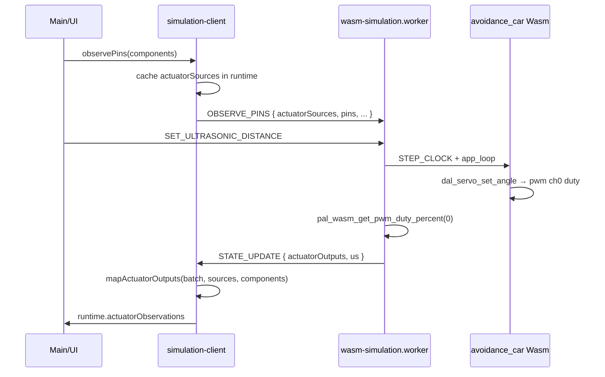

# 避障小车 Phase 1 — 舵机观测闭环实施计划

> **For agentic workers:** 按 Task 顺序执行；每 Task 结束跑对应验收命令。App 层（`wink-micro-app/avoidance_car`）**不在本计划修改范围内**。

**Goal:** 在 Workbench Simulate 模式下，加载避障模板后，用户拖超声距离滑块 → Wasm `avoidance_car` 固件执行避障逻辑 → 前端**实时显示舵机角度**（90° ↔ 180°），形成可演示、可单测的最小闭环。

**Architecture:** 从 Phase 1 起建立 **双层执行器观测模型**（对齐 W3b `ActuatorOutputBatch`，语义层升级为 `ActuatorObservation`）：

1. **Raw 层（Worker）**：读 Wasm `pal_wasm_get_pwm_duty_percent(ch)` + GPIO，产出 `ActuatorOutputBatch`
2. **Semantic 层（主线程 Mapper）**：结合 `actuatorSources` + 外设 `actuatorObserve` 配置 + `bindings`，产出统一的 `ActuatorObservation[]`
3. **消费层（UI / 未来 ActuatorMirror）**：**只读** `ActuatorObservation`，不读 PWM channel / 不读 `servo_angle` export

**W3b Spike 定论（Phase 1 正式选定）：** 采用方案 **(A)** — 扩展 `STATE_UPDATE.payload.actuatorOutputs`，**不**新增独立 `actuatorOutput` 事件。Task 7 回写 [W3b 设计文档](../../design/05-frontend-workbench/03-dual-viewport-phased-design/04-phase-w3b-physics-actuators.md) §2.4 Spike 结论。

不引入 3D / raycast / motor / ActuatorMirror。构建链修复指向 `wink-micro-app/`。

**Tech Stack:** Vue 3 + TypeScript + Vite、Vitest、Emscripten wasm32、现有 `wasm-simulation.worker.ts` + `@unisim/worker`。

## Global Constraints

- **不修改** `wink-micro-app/avoidance_car/app_callbacks.c`、`device_tree.c`（App 后续 refactor 独立进行）。
- **允许** Wasm bridge **最小增量**：`pal_wasm_get_pwm_duty_percent`（存 duty SSOT）；`pal_wasm_get_servo_angle` 保留作 C 侧 SG90 模型便捷读口，**前端不直接依赖**。
- **不修改** DAL 公开 API / App 业务逻辑。
- Phase 1 **不在前端写死** 20cm 阈值或 90°/180° 业务规则——只展示 Wasm 实测角度。
- 引脚 SSOT 必须与当前 App 一致（见 §2.3）；后续 App/codegen 改引脚时只改模板，不重写观测基础设施。
- 新外设走 `peripherals/` 插件注册，**禁止**在 `device-catalog.ts` 手写条目。
- **`deviceComponentId` SSOT**：画布 `CircuitComponentInstance.id`（= Manifest `devices[].componentId`）；`simulation.observe` 内必须用 `comp.id` 填充。
- 单测：`cd ../../../../wink-ai/packages/embedded-frontend && bun run test` 全绿为每 Task 门禁。

---

## 1. 元数据

| 字段 | 内容 |
|------|------|
| **计划编号** | `PLAN-20260711-AVOID-P1` |
| **创建日期** | `2026-07-11` |
| **计划状态** | ✅ 已完成（§10.1～§10.3 已关闭；§10.4～§10.6 仍属 Phase 2 / 可选） |
| **优先级** | P1（Workbench 演示；不阻塞 W3a/W3b） |
| **预估工期** | 1.5～2 天（T3 管道贯通建议预留 4～5h） |
| **目标平台** | 浏览器 Wasm 仿真 only |
| **前置依赖** | OLED Demo 构建链（已完成）；W2 binding 模板（已完成） |
| **关联文档** | [W3b 执行器](../../design/05-frontend-workbench/03-dual-viewport-phased-design/04-phase-w3b-physics-actuators.md)、[W3c 传感器桥接](../../design/05-frontend-workbench/03-dual-viewport-phased-design/05-phase-w3c-sensors-env-bridge.md)、[Catalog SSOT 收敛](./2026-07-11-catalog-ssot-convergence-plan.md) |
| **明确不在范围** | 3D 世界、自动 raycast、motor_driver、固件改 motor 逻辑、ESP32 烧录、e2e 专用脚本（P2） |

---

## 2. 背景与引脚 SSOT

### 2.1 现状问题

| 能力 | 状态 |
|------|------|
| 超声距离滑块 → Wasm | ✅ 已有（`SET_ULTRASONIC_DISTANCE`） |
| 固件读距 + 控舵 | ✅ App 已有（`OBSTACLE_THRESHOLD_CM=20`） |
| 前端看舵机反馈 | ❌ 无 `ActuatorObservation` 管道 |
| 统一执行器语义模型 | ❌ 未建立 |
| `servo` 外设插件 | ❌ 不存在 |
| 避障模板含舵机 | ❌ 仅 esp32 + hc-sr04 |
| `npm run wasm:build:avoidance` | ⚠️ 仍指向已空的 `wink-micro-os/samples/` |

### 2.2 Phase 1 验收标准（出口）

| # | 验收项 | 通过标准 |
|---|--------|----------|
| A1 | Wasm 构建 | `npm run wasm:build:avoidance` 成功，`wasm-app-id.txt` = `avoidance_car` |
| A2 | 模板门禁 | 加载避障模板 → Simulate 无 B-09 阻断 |
| A3 | 引脚对齐 | 模板 TRIG/ECHO = GPIO4/5；舵机 SIG = GPIO2；`neck_servo.props.pwmChannel === 0` |
| A4 | 距离→舵机 | Play 后：距离 25cm → `neck_servo · ~90°`；拖至 5cm 并保持 ≥3s → `~180°`（±5° 容差）。须在 **`actuatorObservations` 发生变化** 后判定，超时 5s 判失败（App 非阻塞测距，非固定 1～2s） |
| A5 | 单元测试 | `npm run test` 全绿 |
| A6 | App 零改动 | `wink-micro-app/avoidance_car/*.c` 无 diff |
| A7 | 协议契约 | `SimStatePayload.actuatorOutputs` + `ObservePinsPayload.actuatorSources` 类型 SSOT 在 `actuator-observation.ts` |
| A8 | 隔离性 | `SimActuatorPanel` 架构单测：无 `ActuatorOutputBatch` / `pwm_channel` / `pal_wasm_get_` 直接引用 |
| A9 | 因果可追踪 | 手动演示：DevTools 可见 `STATE_UPDATE.actuatorOutputs.pwm[0]` 变化 ↔ UI 角度同向变化 |
| A10 | 设计回写 | W3b §2.4 Spike 结论更新为方案 (A)：`STATE_UPDATE.payload.actuatorOutputs` |

### 2.3 引脚 SSOT 对照表（实施时必须遵守）

来源：`wink-micro-app/avoidance_car/wink-app.json` + `device_tree.c` + `board_config.c`

| 器件 | 逻辑字段 | 画布/Manifest 接线 |
|------|----------|-------------------|
| `front_radar` | TRIG pin 4 | TRIG → GPIO4 |
| `front_radar` | ECHO pin 5 | ECHO → GPIO5 |
| `neck_servo` | pwm_channel 0 | SIG → **GPIO2**（`pal_pwm_pin_map[0]=2`） |
| `neck_servo` | power | VCC → VCC，GND → GND |
| `neck_servo` | pulse range | `min_pulse_ms=0.5`, `max_pulse_ms=2.5`（与 `wink-app.json` 一致） |

> **Observe 用传输层键：** Worker 读 **PWM channel 0**（不是 GPIO2）。外设 `simulation.observe` 声明：
>
> ```typescript
> watchActuatorSource({
>   deviceComponentId: comp.id,           // = manifest componentId 'neck_servo'
>   transport: 'pwm_channel',
>   transportKey: comp.props.pwmChannel ?? 0,
> });
> ```

### 2.4 因果链（Phase 1 — 统一模型）

```text
[UI] 距离滑块 25→5 cm
  → SET_ULTRASONIC_DISTANCE(trig=4, echo=5, dist)
  → [Wasm] dal_ultrasonic → app_loop → dal_servo_set_angle → pwm ch0 duty
  → [Worker] pal_wasm_get_pwm_duty_percent(0) → ActuatorOutputBatch.pwm[0]
  → [Mapper] neck_servo + sg90 profile → ActuatorObservation { angular_position, 180°, deg }
  → [UI] SimActuatorPanel: "neck_servo · 180°"
```



---

## 2.5 ActuatorObservation — 改哪里（分层 SSOT）

> **原则：** UI / 3D / 因果链只消费 **`ActuatorObservation[]`**；PWM/FOC/VESC 差异消化在 Raw 层与 Mapper，不在组件里分叉。

### 分层与文件归属

```text
┌─ C / Wasm（传输层 Raw）────────────────────────────────────────────┐
│ wink-micro-os/targets/wasm/devices/wasm_dev_servo.c                  │
│   + s_pwm_duty_percent[]                                             │
│   + pal_wasm_get_pwm_duty_percent(ch)     ← Phase 1 新增             │
│   pal_wasm_get_servo_angle(ch)            ← 保留，前端不直接用        │
│ wasm_bridge.h / pal_wasm_get_* 声明                                  │
└───────────────────────────┬──────────────────────────────────────────┘
                            │ Emscripten export
┌─ Worker（采集 Raw Batch）──────────────────────────────────────────┐
│ ../../../../wink-ai/packages/embedded-frontend/src/workers/wasm-simulation.worker.ts              │
│   OBSERVE_PINS → observedActuatorSources[]                           │
│   simLoop → ActuatorOutputBatch { pwm, gpio, simTimeUs }             │
└───────────────────────────┬──────────────────────────────────────────┘
                            │ STATE_UPDATE.actuatorOutputs
┌─ 类型 SSOT（前端契约）─────────────────────────────────────────────┐
│ ../../../../wink-ai/packages/embedded-frontend/src/types/actuator-observation.ts        🆕        │
│   ActuatorQuantity, ActuatorObservation, ActuatorOutputBatch         │
│   ActuatorObserveSource, ActuatorObserveProfile                      │
│ ../../../../wink-ai/packages/embedded-frontend/src/types/sim-worker-protocol.ts         ✏️        │
│   SimStatePayload.actuatorOutputs: ActuatorOutputBatch               │
│   ObservePinsPayload.actuatorSources: ActuatorObserveSource[]        │
└───────────────────────────┬──────────────────────────────────────────┘
                            │
┌─ 注册（画布 → 观测源）─────────────────────────────────────────────┐
│ ../../../../wink-ai/packages/embedded-frontend/src/peripherals/observe-builder.ts       ✏️        │
│   watchActuatorSource(source: ActuatorObserveSource)                 │
│ ../../../../wink-ai/packages/embedded-frontend/src/peripherals/servo/definition.ts      🆕        │
│   simulation.observe → watchActuatorSource({ deviceComponentId: comp.id, ... })
│ ../../../../wink-ai/packages/embedded-frontend/src/services/simulation-client.ts        ✏️        │
│   observePins() → OBSERVE_PINS + cache actuatorSources in runtime    │
└───────────────────────────┬──────────────────────────────────────────┘
                            │
┌─ 映射（Raw → 语义）★ 统一入口 ──────────────────────────────────────┐
│ ../../../../wink-ai/packages/embedded-frontend/src/services/actuator-observation.mapper.ts 🆕     │
│   mapActuatorOutputs(batch, actuatorSources, components)             │
│   Phase 1: sg90_from_duty / 读 batch.pwm + profile.defaultQuantity   │
│   Phase 2: pwm_to_angular_velocity binding 公式                      │
│   未来: velocity_command / vesc_rpm 扩展 quantity 枚举即可            │
└───────────────────────────┬──────────────────────────────────────────┘
                            │
┌─ 数据面 + UI（只读 Observation）────────────────────────────────────┐
│ ../../../../wink-ai/packages/embedded-frontend/src/services/simulation-runtime.ts       ✏️        │
│   actuatorObservations + lastActuatorSources (shallowRef)            │
│ ../../../../wink-ai/packages/embedded-frontend/src/services/simulation-client.ts          ✏️        │
│   STATE_UPDATE handler → mapper → runtime.actuatorObservations       │
│   （方案 A：mapper 在 client，不在 applyStateUpdate 内）              │
│ ../../../../wink-ai/packages/embedded-frontend/src/components/workbench/SimActuatorPanel.vue 🆕   │
└──────────────────────────────────────────────────────────────────────┘
```

### 核心类型（`actuator-observation.ts`）🆕

```typescript
/** 统一物理量（SI 或项目约定单位；扩展非电机外设只加 enum 并在外设插件中注册 Converter） */
export type ActuatorQuantity =
  | 'angular_position'   // 角度 (unit: deg 或 rad)
  | 'angular_velocity'   // 角速度 (unit: rpm 或 rad/s)
  | 'linear_position'    // 线位置 (unit: m)
  | 'torque'             // 扭矩 (unit: N·m)
  | 'duty_cycle'         // 原始占空比
  | 'state'              // 开关状态: 'on' | 'off'
  | 'color'              // RGB 颜色 (如: '#ff0000')
  | 'pixel_colors'       // 灯带颜色阵列 (如: string[])
  | 'sound_frequency'    // 蜂鸣器频率 (Hz)
  | 'display_text';      // 文本内容

export interface ActuatorObservation {
  /** = CircuitComponentInstance.id (= manifest devices[].componentId) */
  deviceComponentId: string;
  quantity: ActuatorQuantity;
  /** TODO(phase2): tighten value type — prefer `number | string | number[] | string[]`（去掉 any[]）；见评审 2026-07-12 §4.4 */
  value: number | string | any[];
  /** UI 显示单位 */
  unit: 'deg' | 'rpm' | 'percent' | 'bool' | 'hz' | 'rgb' | 'none';
  /**
   * Phase 1 舵机 PWM 镜像固件输出 → role='command'（非传感器 feedback）。
   * 未来编码器/电流采样等才用 'feedback'。
   */
  role: 'command' | 'feedback';
  simTimeUs: string;
  /** Phase 2 预留：动力学平滑 / 质量标记，Phase 1 不填 */
  quality?: 'valid' | 'extrapolated' | 'fault';
}

/** Worker → UI Raw batch（对齐 W3b 设计文档；Phase 1 选定方案 A 嵌入 STATE_UPDATE） */
export interface ActuatorOutputBatch {
  simTimeUs: string;
  gpio: Record<number, boolean>;
  pwm: Record<number, number>;    // channel → duty 0..100
  uart?: Record<number, string>;
  i2c?: Record<number, string>;
  /** 未来：DAL 语义快照直通，Mapper 优先消费 */
  semantic?: ActuatorObservation[];
}

/** 外设插件声明：如何从 Wasm 采集 */
export interface ActuatorObserveSource {
  deviceComponentId: string;    // = comp.id
  transport: 'pwm_channel' | 'gpio_pin' | 'uart_port' | 'can_bus' | 'i2c_bus';
  transportKey: number | string;
  subAddress?: number;
}

/** 外设插件声明：如何映射为物理量（Phase 1 无 manifest binding 时用） */
export interface ActuatorObserveProfile {
  defaultQuantity: ActuatorQuantity;
  unit: ActuatorObservation['unit'];
  convert: string;                // 转换器 ID，注册在 actuatorConverterRegistry
}
```

### 与 binding（`mapping-registry.ts`）的关系

| 场景 | 谁决定语义 |
|------|-----------|
| Phase 1 舵机（无 actuator binding） | `PeripheralDefinition.actuatorObserve.profile` → `angular_position` + `sg90_from_duty` |
| Phase 2 电机（有 `pwm_to_angular_velocity`） | `manifest.bindings.actuators[]` + mapper 公式 |
| 未来 SimpleFOC | DAL Wasm export 直填 `angular_velocity` 进 `batch.semantic[]`，mapper 透传 |
| 未来 VESC | 同上，`quantity: angular_velocity`，transport 改为 `bus:vesc`（后续扩展 transport enum） |

**`mapping-registry.ts` Phase 1 不改**；Mapper 读现有 `PwmToAngularVelocity` 等类型即可。

### Mapper 输入契约（实施必须遵守）

`mapActuatorOutputs` **必须**同时接收三类输入，不可仅靠 `components[]` 推断 transport：

| 输入 | 来源 | 用途 |
|------|------|------|
| `batch` | Worker `STATE_UPDATE` | Raw duty / GPIO |
| `actuatorSources` | `observePins()` 缓存（`runtime.lastActuatorSources`） | 匹配 `transport` + `transportKey` |
| `components` | 画布实例 | 查 `registry.get(type).actuatorObserve.profile`；`comp.props` 供 converter 读 pulse 范围 |

### 未来 C 侧演进（Phase 1 不做）

当驱动不再是 PAL PWM 时，在 **DAL Wasm 设备层**增加语义快照 export，Worker 填入 `ActuatorOutputBatch.semantic?: ActuatorObservation[]`，Mapper 优先用 semantic、fallback 到 pwm/gpio。**App 层仍不改。**

---

## 3. 文件变更清单

| 文件 | 变更 | Task |
|------|------|------|
| `../../../../wink-ai/packages/embedded-frontend/scripts/build-wasm.mjs` | ✏️ 解析 `wink-micro-app/` | T1 |
| `../../../../wink-ai/packages/embedded-frontend/package.json` | ✏️（可选）文档化 app 路径 | T1 |
| `../../../../wink-ai/packages/embedded-frontend/README.md` | ✏️ 避障 demo 步骤 + 舵机可见说明 | T7 |
| `wink-micro-os/CMakeLists.txt` | ✏️ 默认 `WINK_APP_DIR` 指向 micro-app（可选，与 T1 二选一） | T1 |
| `../../../../wink-ai/packages/embedded-frontend/src/peripherals/servo/**` | 🆕 外设插件 + converter 注册 | T2 |
| `../../../../wink-ai/packages/embedded-frontend/src/peripherals/index.ts` | ✏️ import servo | T2 |
| `wink-micro-os/targets/wasm/devices/wasm_dev_servo.c` | ✏️ 存 duty + export | T0 |
| `wink-micro-os/targets/wasm/wasm_bridge.h` | ✏️ `pal_wasm_get_pwm_duty_percent` | T0 |
| `../../../../wink-ai/packages/embedded-frontend/src/types/actuator-observation.ts` | 🆕 语义 + Raw SSOT | T3 |
| `../../../../wink-ai/packages/embedded-frontend/src/services/actuator-observation.mapper.ts` | 🆕 Raw→Observation | T3 |
| `../../../../wink-ai/packages/embedded-frontend/src/services/actuator-converter-registry.ts` | 🆕 converter registry（从 mapper 拆出，避循环依赖） | T3 |
| `../../../../wink-ai/packages/embedded-frontend/src/peripherals/observe-builder.ts` | ✏️ `watchActuatorSource` | T3 |
| `../../../../wink-ai/packages/embedded-frontend/src/types/sim-worker-protocol.ts` | ✏️ `ActuatorOutputBatch` + `actuatorSources` | T3 |
| `../../../../wink-ai/packages/embedded-frontend/src/workers/wasm-simulation.worker.ts` | ✏️ 采集 Raw batch + OBSERVE_PINS | T3 |
| `../../../../wink-ai/packages/embedded-frontend/src/services/simulation-runtime.ts` | ✏️ `actuatorObservations` + `lastActuatorSources` | T3 |
| `../../../../wink-ai/packages/embedded-frontend/src/services/simulation-client.ts` | ✏️ observe 缓存 + STATE_UPDATE mapper | T3 |
| `../../../../wink-ai/packages/embedded-frontend/src/services/templates/avoidance-car-w2-minimal.ts` | ✏️ +neck_servo + props | T4 |
| `../../../../wink-ai/packages/embedded-frontend/src/components/workbench/SimActuatorPanel.vue` | 🆕 只读舵机角度 | T5 |
| `../../../../wink-ai/packages/embedded-frontend/src/views/EmbeddedWorkbench.vue` | ✏️ 挂载面板 | T5 |
| `docs/design/.../04-phase-w3b-physics-actuators.md` | ✏️ §2.4 Spike 结论回写 | T7 |
| `../../../../wink-ai/packages/embedded-frontend/src/**/__tests__/**` | 🆕/✏️ 单测 | T2–T6 |

---

## 4. Task 分解

### Task 0 — Wasm Raw 层：`pwm_duty` export（~45min）

**Modify:** `wink-micro-os/targets/wasm/devices/wasm_dev_servo.c`

- 增加 `static float s_pwm_duty_percent[MAX_PWM_CHANNELS]`
- `wasm_dev_servo_set_duty()` 写入 duty **并** 计算 angle（现有逻辑保留）
- 新增 `EMSCRIPTEN_KEEPALIVE float pal_wasm_get_pwm_duty_percent(uint8_t channel)`

**Modify:** `wasm_bridge.h` 声明；`test_wasm_devices_sim.c` 增加 duty 读回断言

- [ ] **Step 1:** 单测：set_duty(7.5%) → get_pwm_duty ≈ 7.5；set_duty(12.5%) → get_pwm_duty ≈ 12.5
- [ ] **Step 2:** host/wasm 设备单测绿（**不依赖** T1 全链路构建）

**验收：** `test_wasm_devices_sim.c` 绿；可与 T1 并行

---

### Task 1 — 修复 Wasm 构建路径（~30min）

**目标：** `npm run wasm:build:avoidance` 使用 `wink-micro-app/avoidance_car`。

**Modify:** `../../../../wink-ai/packages/embedded-frontend/scripts/build-wasm.mjs`

**逻辑（推荐）：**

```javascript
const repoRoot = path.resolve(__dirname, '../..');
const microAppDir = path.join(repoRoot, 'wink-micro-app');
const microOsDir = path.join(repoRoot, 'wink-micro-os');

function resolveAppDir(appName) {
  const microAppPath = path.join(microAppDir, appName);
  if (fs.existsSync(microAppPath)) return microAppPath;
  const legacyPath = path.join(microOsDir, 'samples', appName);
  if (fs.existsSync(legacyPath)) return legacyPath;
  return null;
}
```

- [ ] **Step 1:** 实现 `resolveAppDir`，保留目录参数 override（`node build-wasm.mjs /abs/path`）
- [ ] **Step 2:** 运行 `npm run wasm:build:avoidance`（需本机 emscripten）
- [ ] **Step 3:** 确认 `../../../../wink-ai/packages/embedded-frontend/public/wasm/wasm-app-id.txt` 内容为 `avoidance_car`
- [ ] **Step 4:** （可选）`wink-micro-os/CMakeLists.txt` 默认 `WINK_APP_DIR` 改为 `../wink-micro-app/avoidance_car`，避免裸 cmake 踩坑

**验收：** A1

---

### Task 2 — 新增 `servo` 外设插件（~2h）

**目标：** 资产库可识别舵机；画布可放置；catalog 派生正确。

**Create:** `../../../../wink-ai/packages/embedded-frontend/src/peripherals/servo/`

```
servo/
  definition.ts      # type: 'servo', catalog.id: 'servo_stub'（过渡期）
  CanvasGlyph.vue    # 简化 glyph（可参考 motor_driver_stub 虚线框）
  index.ts           # registry.register + sg90_from_duty converter 注册
  __tests__/definition.test.ts
```

**`definition.ts` 要点：**

| 字段 | 值 |
|------|-----|
| `type` | `'servo'` |
| `displayName` | `'SG90 Servo'` |
| `category` | `'actuator'` |
| `catalog.id` | `'servo_stub'` |
| `catalog.worldCoupling` | `'none'`（Phase 1 无 3D binding） |
| `pins[]` | `SIG` (`catalogType: 'pwm'`), `VCC`, `GND` |
| `props.pwmChannel` | number, default `0` |
| `props.minPulseMs` | number, default `0.5`（对齐 `wink-app.json`） |
| `props.maxPulseMs` | number, default `2.5` |
| `actuatorObserve` | `{ profile: { defaultQuantity: 'angular_position', unit: 'deg', convert: 'sg90_from_duty' } }` |
| `simulation.observe` | 见 §2.3 示例，`deviceComponentId: comp.id` |

**`index.ts` — Converter 注册（side-effect）：**

```typescript
// 从独立 registry 导入（勿从 mapper 导入，避免 servo → mapper → peripherals 循环依赖）
import { actuatorConverterRegistry } from '@/services/actuator-converter-registry';

actuatorConverterRegistry.register('sg90_from_duty', (duty, ctx) => {
  // 必须读 ctx.props.minPulseMs/maxPulseMs（缺省 0.5 / 2.5）；禁止硬编码 2.5%/12.5% 端点
  // periodMs = 20（50Hz）；minDuty/maxDuty = pulseMs/periodMs*100；再线性映射到 0..180 并 clamp
  // 默认：90° → duty 7.5%，180° → duty 12.5%（pulse 0.5/2.5 ms @ 50Hz）
  return { quantity: 'angular_position', value: /* ... */, unit: 'deg', role: 'command' };
});
```

> `PeripheralDefinition` 类型需扩展 `actuatorObserve?: { profile: ActuatorObserveProfile }`（`peripherals/types.ts`）。

- [x] **Step 1:** failing test：`registry.get('servo')` + `actuatorObserve.profile.defaultQuantity === 'angular_position'`
- [x] **Step 2:** 实现 definition + CanvasGlyph + index（含 converter 注册）
- [x] **Step 3:** `peripherals/index.ts` 增加 `import './servo'`
- [x] **Step 4:** `catalog/__tests__/derive-catalog-entry.test.ts` 或 `device-catalog-registry.test.ts` 验证 `servo_stub` **由 derive 自动生成**（交叉 [Catalog SSOT 计划](./2026-07-11-catalog-ssot-convergence-plan.md)）
- [x] **Step 5:** `npm run test` 绿
- [x] **Step 6（遗留债 §10.1）：** converter **必须**读 `ctx.props.minPulseMs/maxPulseMs`；单测覆盖非默认 pulse（如 `1.0/2.0` ms）时角度映射仍正确

**验收：** 外设注册单测通过；`deviceCatalog.getDevice('servo_stub')` 有条目且非手写；**props pulse 路径生效**（非默认 pulse 映射正确）

---

### Task 3 — 统一观测管道：Raw Batch + ActuatorObservation（~4～5h）

**目标：** `STATE_UPDATE.actuatorOutputs` → Mapper → `actuatorObservations[]`；UI 只读 Observation。

#### 3.1 类型 SSOT

**Create:** `../../../../wink-ai/packages/embedded-frontend/src/types/actuator-observation.ts`（见 §2.5）

**Modify:** `sim-worker-protocol.ts`

- `SimStatePayload.actuatorOutputs?: ActuatorOutputBatch`
- `ObservePinsPayload.actuatorSources?: ActuatorObserveSource[]`

#### 3.2 Observe 注册

**Modify:** `observe-builder.ts`

```typescript
watchActuatorSource(source: ActuatorObserveSource): void;
// ObserveResult.actuatorSources: ActuatorObserveSource[]
```

**Modify:** `peripherals/types.ts` — `actuatorObserve?: { profile: ActuatorObserveProfile }`

**Modify:** `simulation-client.ts` — `observePins()` 在 postMessage 前将 `builder.build().actuatorSources` 写入 `runtime.lastActuatorSources`

#### 3.3 Mapper（★ 统一入口）🆕

**Create:** `actuator-observation.mapper.ts`

```typescript
export type ActuatorConverter = (
  rawValue: number,
  context: {
    simTimeUs: string;
    profile: ActuatorObserveProfile;
    props?: Record<string, unknown>;  // minPulseMs / maxPulseMs
  },
) => Omit<ActuatorObservation, 'deviceComponentId' | 'simTimeUs'>;

export const actuatorConverterRegistry = { /* register / get */ };

export function mapActuatorOutputs(
  batch: ActuatorOutputBatch,
  actuatorSources: ActuatorObserveSource[],
  components: CircuitComponentInstance[],
): ActuatorObservation[];
```

Phase 1 逻辑：

1. 以 `actuatorSources` 为主循环（每项含 `deviceComponentId` + `transport` + `transportKey`）
2. 在 `components` 中按 `comp.id === source.deviceComponentId` 找实例
3. 从 `registry.get(comp.type).actuatorObserve.profile` 取 profile
4. 按 `transport` 从 `batch` 取 raw：`pwm_channel` → `batch.pwm[transportKey]`
5. 调 `actuatorConverterRegistry.get(profile.convert)`，传入 `comp.props` 作 pulse 范围
6. Phase 2：若 manifest binding 存在，优先 bindings 公式（Phase 1 跳过）

#### 3.4 Worker

**Modify:** `wasm-simulation.worker.ts`

```typescript
let observedActuatorSources: ActuatorObserveSource[] = [];

// OBSERVE_PINS handler:
observedActuatorSources = payload.actuatorSources ?? [];

// simLoop():
const pwm: Record<number, number> = {};
for (const src of observedActuatorSources) {
  if (src.transport === 'pwm_channel' && typeof src.transportKey === 'number') {
    pwm[src.transportKey] = callEmscriptenExport(
      realModule, 'pal_wasm_get_pwm_duty_percent', src.transportKey,
    ) as number;
  }
}
// payload.actuatorOutputs = { simTimeUs: currentUs, pwm, gpio: pinStates }
```

#### 3.5 数据面（方案 A — mapper 在 client）

**Modify:** `simulation-runtime.ts`

- `actuatorObservations: shallowRef<ActuatorObservation[]>([])`
- `lastActuatorSources: shallowRef<ActuatorObserveSource[]>([])`
- **`resetDataPlane()` 必须同步清空 `lastActuatorSources`**（与 `actuatorObservations` / `lastComponents` 同生命周期），避免 reset → 下一次 `observePins` 之间的脏缓存窗口
- 模板切换路径：`activeComponents` watch 会重调 `observePins()` 覆盖 sources；**不可**仅依赖此路径代替 reset 清空

**Modify:** `simulation-client.ts` — `STATE_UPDATE` handler：

```typescript
if (payload.actuatorOutputs) {
  runtime.actuatorObservations.value = mapActuatorOutputs(
    payload.actuatorOutputs,
    runtime.lastActuatorSources.value,
    activeComponents,  // 从调用方或 store 获取
  );
}
applyStateUpdate(payload);  // 现有 pinStates/oled 等不变
```

> **禁止**在 `applyStateUpdate()`（`simulation-runtime.ts`）内调 mapper，保持数据面薄层。

- [x] **Step 遗留（§10.2）：** `resetDataPlane()` 清空 `lastActuatorSources`；runtime 单测锁定

#### 3.6 端到端 Mapper 夹具（~30min）

**Create:** `actuator-observation.mapper.test.ts` — mock batch，不依赖 Wasm：

```typescript
const batch = { simTimeUs: '1000', pwm: { 0: 12.5 }, gpio: {} };
const sources = [{ deviceComponentId: 'neck_servo', transport: 'pwm_channel', transportKey: 0 }];
const components = [{ id: 'neck_servo', type: 'servo', props: { pwmChannel: 0 }, /* ... */ }];
expect(mapActuatorOutputs(batch, sources, components)[0]).toMatchObject({
  deviceComponentId: 'neck_servo', value: 180, unit: 'deg', role: 'command',
});
```

- [x] **Step 1:** 夹具单测：duty 7.5% → ~90°；12.5% → ~180°（默认 pulse）
- [x] **Step 2:** `observe-builder.test.ts` — `watchActuatorSource` + `actuatorSources` 聚合
- [x] **Step 3:** `observe-pins.test.ts` — OBSERVE_PINS payload 含 `actuatorSources`
- [x] **Step 4:** 实现 Worker + runtime + client
- [x] **Step 5:** `npm run test` 绿
- [x] **Step 6（遗留债 §10.1 / §10.3）：** 边界与 props 路径门禁（下表必须全绿）

| 场景 | 预期 |
|------|------|
| 非默认 pulse（`minPulseMs=1.0`, `maxPulseMs=2.0`） | duty 端点映射到 0°/180°；中间点线性 |
| `transport: 'gpio_pin'` | 从 `batch.gpio[transportKey]` 读取 |
| converter 未注册 | 该 source skip，不抛错 |
| `deviceComponentId` 不在 `components` | 该 source skip |
| 空 `actuatorSources` | 返回 `[]` |
| 空 / 缺失 `batch.pwm[key]` | rawValue 按 0（或约定缺省）处理 |
| duty 越界（`<0` / `>100`） | 角度 clamp 到 0..180 |
| `actuatorObserve` 缺失 | 该 source skip |
| converter 抛异常 | 该 source skip + `console.error` |

**验收：** A7；单测覆盖 mapper + observe + **上表边界**；禁止 UI 直接 import raw pwm / `servoAngles`

---

### Task 4 — 扩展避障模板（~1h）

**目标：** Workbench 一键模板包含舵机且引脚与 App 对齐。

**Modify:** `avoidance-car-w2-minimal.ts` — `createAvoidanceCarWorkbenchManifest()`

在 `devices[]` 增加：

```typescript
{
  componentId: 'neck_servo',
  modelId: 'servo_stub',
  displayName: 'Neck Servo',
  position: { x: 280, y: 360 },
  props: {
    pwmChannel: 0,
    minPulseMs: 0.5,
    maxPulseMs: 2.5,
  },
},
```

在 `connections[]` 增加：

```typescript
{ id: 'conn_servo_sig', from: { componentId: 'neck_servo', pin: 'SIG' }, to: { componentId: '__board__esp32-devkit-v1', pin: 'GPIO2' }, routing: DEFAULT_ROUTING },
{ id: 'conn_servo_vcc', from: { componentId: 'neck_servo', pin: 'VCC' }, to: { componentId: '__board__esp32-devkit-v1', pin: 'VCC' }, routing: DEFAULT_ROUTING },
{ id: 'conn_servo_gnd', from: { componentId: 'neck_servo', pin: 'GND' }, to: { componentId: '__board__esp32-devkit-v1', pin: 'GND' }, routing: DEFAULT_ROUTING },
```

**注意：** `AVOIDANCE_CAR_W2_MINIMAL`（空 bindings，M1 gate 用）**可不改**，仅改 `createAvoidanceCarWorkbenchManifest()`。

- [ ] **Step 1:** 更新 `manifest-to-canvas.test.ts` — `neck_servo.id === 'neck_servo'`，`props.pwmChannel === 0`
- [ ] **Step 2:** 更新 `binding-validation.test.ts`（simulate 仍应 pass：servo `worldCoupling=none`）
- [ ] **Step 3:** `npm run test` 绿

**验收：** A2、A3

---

### Task 5 — UI：仿真态舵机角度面板（~1.5h）

**目标：** Simulate 运行时用户能看见舵机角度变化。

**Create:** `components/workbench/SimActuatorPanel.vue`

- 只读展示：`actuatorObservations` from `simulation-runtime`
- 格式：`{deviceComponentId} · {value}{unit}`（例 `neck_servo · 180°`）
- **禁止**读 `ActuatorOutputBatch.pwm`、PWM channel 号或 `pal_wasm_get_*`
- 无数据时：`—` 或 `Waiting for simulation…`
- 仅在 `isRunning` 时有高亮；非 simulate 模式可隐藏或灰显

**Modify:** `EmbeddedWorkbench.vue`

- 在右侧/底部仿真相关区域挂载 `SimActuatorPanel`（与 Property Inspector 并列或在其下）
- 不耦合具体 App 阈值文案

**可选增强（P1.5，非阻塞）：**

- `servo/InspectorExtra.vue`：选中舵机时显示同一 `actuatorObservations` 条目

- [ ] **Step 1:** 组件渲染单测（Vitest + shallow mount）或 snapshot
- [ ] **Step 2:** 手动验证 A4、A9
- [ ] **Step 3:** TopBar `activeAppId` 非 `avoidance_car` 时显示 warning hint（可选）

**验收：** A4、A9 手动演示

---

### Task 6 — 集成回归与护栏（~1h）

- [x] **Step 1:** `actuator-observation.mapper.test.ts` happy-path 夹具（T3.6 Step 1）+ `observe-pins.test.ts`（`actuatorSources`）
- [x] **Step 2:** 架构单测 `sim-actuator-panel.arch.test.ts`：

```typescript
const src = readFileSync('SimActuatorPanel.vue', 'utf8');
expect(src).not.toMatch(/ActuatorOutputBatch|pal_wasm_get_|pwm_channel/);
```

- [x] **Step 3（遗留债 §10.3）：** T3.6 Step 6 边界表全部补齐并纳入 `npm run test` 门禁
- [ ] **Step 4:** （可选）ESLint grep 护栏补充

**验收：** A5、A8；边界表全绿（§10.3 已关闭）

---

### Task 7 — 文档与手动演示脚本（~30min）

**Modify:** `../../../../wink-ai/packages/embedded-frontend/README.md` § Avoidance Car Demo

```markdown
### Avoidance Car Demo (Phase 1)
1. npm run wasm:build:avoidance
2. npm run dev
3. 加载 🚗 避障小车模板
4. Simulate → Play
5. 拖 HC-SR04 距离滑块：25cm → `neck_servo · ~90°`；5cm 保持 3s → `~180°`
6. TopBar 确认 activeAppId = avoidance_car
```

**Modify:** [W3b §2.4](../../design/05-frontend-workbench/03-dual-viewport-phased-design/04-phase-w3b-physics-actuators.md) — Spike 结论：**方案 (A)** `STATE_UPDATE.payload.actuatorOutputs`

- [ ] **Step 1:** README 更新
- [ ] **Step 2:** W3b Spike 结论回写（A10）
- [ ] **Step 3:** 本计划状态改为 🟡 执行中 / ✅ 完成（执行后）

**验收：** A10

---

## 5. 手动演示脚本（QA）

```
前置：emscripten 可用，npm run wasm:build:avoidance 成功

1. npm run dev → 打开 Workbench
2. 3D 面板点击「🚗 避障小车模板」
3. 确认画布：HC-SR04 + SG90 Servo；线：TRIG→4, ECHO→5, SIG→2
4. 切 Simulate → Play（等待 INIT_DONE）
5. TopBar：activeAppId = avoidance_car
6. 距离滑块调至 25cm → 等待 actuatorObservations 更新（≤5s）→ SimActuatorPanel 显示 `neck_servo · ~90°`
7. 距离滑块调至 5cm 并保持 3s → 显示 `neck_servo · ~180°`
8. 距离滑块调至 30cm → 回 `neck_servo · ~90°`
9. DevTools：确认 STATE_UPDATE.actuatorOutputs.pwm[0] 与 UI 角度同向变化（A9）
10. Pause → 角度冻结
11. 切 Design 再回 Simulate → 仍正常
```

**失败排查：**

| 现象 | 检查 |
|------|------|
| 角度不变 | `activeAppId` 是否为 `avoidance_car`；`lastActuatorSources` 是否含 `neck_servo` + ch0 |
| 角度始终 0 | Worker 是否 export `pal_wasm_get_pwm_duty_percent`；mapper 是否在 client 调用；`actuatorSources` 是否下发 |
| `deviceComponentId` 对不上 | `comp.id` 是否为 `neck_servo`（非 `componentId` 字段名混用） |
| 距离无效 | TRIG/ECHO 是否 4/5；console Worker 报错；App 非阻塞测距是否完成（保持滑块 3s） |
| 构建失败 | `WINK_APP_DIR` 是否指向 `wink-micro-app/avoidance_car` |

---

## 6. 风险与缓解

| 风险 | 概率 | 缓解 |
|------|------|------|
| App 迁路径后 CI 未更新 | 高 | Task 1 双路径 fallback + README |
| 测量非即时（非阻塞 radar） | 中 | A4 改为「保持 3s + 超时 5s」；UI 文案说明非即时 |
| `deviceComponentId` / `actuatorSources` 契约遗漏 | 中 | §2.5 Mapper 输入表 + T3 夹具单测 |
| 后续 App 改 servo→motor | 中 | Phase 1 组件通用；模板/bindings 另开 Phase 2 |
| SG90 角度与 pulse 映射误差 / props 形同虚设 | 中 | **硬门禁**：converter **必须**读 `ctx.props.min/maxPulseMs`；T3.6 非默认 pulse 单测；验收 ±5° |
| `lastActuatorSources` 脏缓存窗口 | 中 | `resetDataPlane()` 同步清空；模板切换依赖 `observePins` watch 覆盖（不足替代 reset） |
| `pal_pwm_pin_map` 仅 ESP32 物理板 | 低 | Wasm 直接用 pwm channel，Manifest SIG→GPIO2 仅作画布语义 |
| W3b 协议分叉 | 低 | A10 回写 Spike 结论；Phase 1 只用 STATE_UPDATE 嵌入 |
| converter 同名覆盖 | 低 | Phase 2：`register` 时检测重复并 `console.warn` |

---

## 7. 执行顺序与 Checkpoint

```text
T0 (C export + host 单测) ──┐  可与 T1 并行
T1 (构建链) ────────────────┤
                            ├──→ T2 (servo 插件) → T3 (管道；T3.6 mock 单测可不依赖 T1)
                            │
T4 (模板) ←─────────────────┘（依赖 T2）
T5 (UI) ← T3 + T4
T6 + T7
```

| Checkpoint | 内容 | 预估 |
|------------|------|------|
| **CP-1** | T0 单测绿 + T1 wasm 可构建 | 0.5～1h |
| **CP-2** | T2+T3 完成（含 T3.6 夹具），单测绿 | +4～5h |
| **CP-3** | T4+T5 完成，手动 A4/A9 通过 | +2.5h |
| **CP-4** | T6+T7，W3b 回写，计划归档 | +1h |

---

## 8. 与后续 Phase 2 的边界

Phase 1 **交付物可复用（统一模型）：**

- `ActuatorOutputBatch` + `ActuatorObservation` 类型与 Mapper（Phase 2 motor 只加 binding 分支）
- `watchActuatorSource` / `actuatorObserve.profile` 外设声明模式
- `lastActuatorSources` 缓存 + `mapActuatorOutputs(batch, sources, components)` 三输入契约
- `pal_wasm_get_pwm_duty_percent` Raw SSOT
- `servo` 外设插件；构建链 `wink-micro-app` 解析

Phase 2 **另开计划：**

- 模板 + `motor_driver_stub` + `pwm_to_angular_velocity` binding → mapper 输出 `angular_velocity` rpm
- 3D ActuatorMirror 消费同一 `actuatorObservations`
- 3D raycast 自动距离；舵机动力学平滑（§9.1）
- **`simTimeUs` 单调递增校验**（防 STATE_UPDATE 乱序帧；见 §9.3）
- **`ActuatorObservation.value` 类型收敛**（去掉 `any[]`；见 §2.5 TODO）
- **converter `register` 重名 `console.warn`**；ObserveBuilder params 独立 namespace（防覆盖 `pins`/`oled`）

**FOC / VESC 演进：** 扩展 `ActuatorOutputBatch.semantic[]` 或 transport enum；Mapper 优先 semantic，**不改 UI 协议**。

---

## 9. 仿真设计指导（分阶段落地）

> Phase 1 **只做类型预留与文档约束**；下列条目标注了落地阶段，避免过度设计拖慢交付。

### 9.1 舵机动力学（Actuator Dynamics）— Phase 2

- SG90 约 $0.12\text{s}/60^\circ$（$\omega_{max} \approx 500^\circ/\text{s}$）。
- Phase 1：duty→角度**直接映射**（允许瞬移）。
- Phase 1 预留：`ActuatorObservation.quality?` 字段；Mapper `context` 可扩展 `previousValue` + `deltaUs`。
- Phase 2：在 Mapper 或 Virtual Device 层做角度积分平滑，避免 raycast 闭环伪影。

### 9.2 硬件级参数校验 — Phase 2+（Phase 1 不做）

- PWM 频率在 `pal_pwm_init(50Hz)` 一次性设定；`pal_wasm_get_pwm_duty_percent` **不携带频率**。
- Phase 1 **不**做 Virtual Hardware Fault。
- 若 Phase 2+ 需要：C 侧新增 `pal_wasm_get_pwm_freq(ch)` export，再在 Mapper 标记 `quality: 'fault'`。

### 9.3 闭环时序确定性 — Phase 1 约束 + Phase 2 强化

- Phase 1：**禁止** Mapper 使用 `Date.now()`；`simTimeUs` 只读 Worker 虚拟时钟。
- Phase 2：raycast 测距 → 传感器注入 → App 响应全在 Worker 虚拟时钟周期内完成；UI 异步只读。
- Phase 2：在 Mapper 或 `simulation-client` 的 STATE_UPDATE handler 增加 **monotonically-ascending guard**（`simTimeUs <= last` 则丢弃帧），供动力学 `deltaUs` 使用。

### 9.4 物理单位标准化 — 渐进收敛

- Phase 1：UI 显示 `deg`（`unit: 'deg'`）。
- Phase 2+：Mapper 内部可维护 `canonicalUnit: 'rad' | 'rad/s'`（类型预留），3D 物理引擎消费 SI 单位，UI 仍显示 deg。

### 9.5 UI 显示精度 — 可选

- Phase 1：`Math.round` 满足 A4 ±5°。
- 可选：改为 `toFixed(1)` 或增加 `data-raw-value`，便于 Phase 2 动力学非整数角度调试。

---

## 10. 完成态遗留债（二次评审 2026-07-12）

> 依据：[专家评审](../../reviews/core/2026-07-12-avoidance-car-phase1-servo-observe-review.md) + 计划二次评审。  
> **归因原则：** §4.1 为**实现偏离计划**（计划已四次写明读 props）；§4.2 / §4.3 为**计划验收门禁偏软**。不新开 Phase 1.5，在本计划关闭遗留项。

| ID | 优先级 | 问题 | 行动 | 关联 |
|----|--------|------|------|------|
| **§10.1** | P1 | ✅ `sg90_from_duty` 硬编码 pulse 端点 | 已改 converter 读 props；非默认 pulse 单测 | 评审 §4.1 |
| **§10.2** | P1 | ✅ `resetDataPlane` 不清 `lastActuatorSources` | 已同步清空 + runtime 单测 | 评审 §4.2 |
| **§10.3** | P1 | ✅ Mapper 仅 happy-path 单测 | 边界表已补齐（mapper + runtime） | 评审 §4.3 |
| §10.4 | P3 | `value: any[]` 过宽 | Phase 2 前类型收敛；§2.5 已标 TODO | 评审 §4.4 |
| §10.5 | P3 | `simTimeUs` 无单调校验 | Phase 2（§8 / §9.3） | 评审 §4.5 |
| §10.6 | P3 | UI `Math.round` | 可选（§9.5） | 评审 §4.6 |

**实现侧已确认的合理偏差（无需回退）：**

- converter registry 独立为 `actuator-converter-registry.ts`（避循环依赖）
- Mapper converter 调用处 `try/catch`
- Worker `hasEmscriptenExport` 存在性检查

**关闭条件：** §10.1～§10.3 代码修复 + `npm run test` 全绿后，将本表对应行标为 ✅，并在变更记录追加一行。

> ✅ **2026-07-12：** §10.1～§10.3 已关闭（`npm run test` 245 passed）。

---

*文档变更记录：*

- 2026-07-11：初版计划（Phase 1 最小可测 / App 层冻结友好）。
- 2026-07-11：v1.1 — 统一 ActuatorObservation 双层模型；Raw=`pwm_duty`；Mapper SSOT。
- 2026-07-11：v1.2 — 专家评审补充；动力学、硬件校验、时序与单位指导。
- 2026-07-11：v1.3 — 吸收评审修订：`comp.id` 契约、Mapper 三输入、`lastActuatorSources` 缓存、方案 A client mapper、T3.6 夹具、A7–A10、模板 props、QA 脚本对齐、W3b Spike 定论、§9 分阶段落地。
- 2026-07-12：v1.4 — 二次评审回写：§10 完成态遗留债；T2/T3.5/T3.6/T6 强化 props 与边界门禁；`resetDataPlane` 清空契约；独立 converter registry 记入变更清单；§2.5 value TODO；§8/§9.3 单调校验与重名 warn；§9.5 显示精度。
- 2026-07-12：v1.5 — 关闭 §10.1～§10.3：converter 读 props、`resetDataPlane` 清空 sources、mapper 边界单测。
