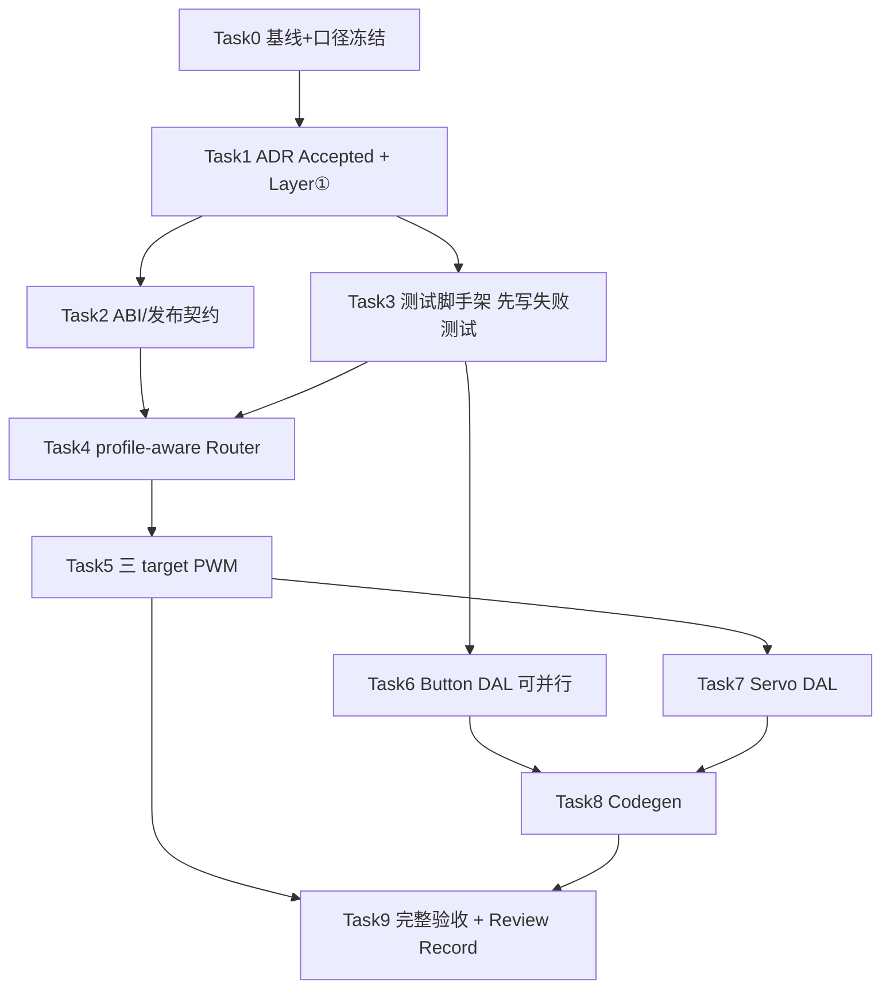

# DAL/PAL Progressive Config Disclosure Implementation Plan

> **For agentic workers:** REQUIRED SUB-SKILL: Use `embedded-best-practice` for C/DAL/PAL/codegen edits; prefer `subagent-driven-development` or `executing-plans` task-by-task. Steps use checkbox (`- [ ]`) syntax for tracking.

**Goal:** 在默认行为零变化的前提下，为 Button 上下拉与 PWM 分辨率/时钟策略提供完整可配置能力，以 `AUTO=0` 哨兵 + codegen 默认不暴露实现渐进披露；并按评审（2026-07-17 Major Revision）钉死 PWM timer profile、时钟契约、floating 语义、DAL/PAL 边界、JSON 唯一表示与 Binary SDK ABI。

**Architecture:** ADR-0034 — L1 JSON 只保留语义字段；L2 唯一 `advanced.*`；DAL 自有语义枚举（不泄漏 `pal_*`）；PAL `pal_pwm_init_ex` + **profile-aware Router**（freq + effective bits + effective clock 组成 timer 身份）；duty 公共语义为百分比，仅 ESP32 换 raw；公共 POD 增字段按 ADR-0028 bump ABI。

**Tech Stack:** C（DAL/PAL/targets）、Python codegen plugins、Unity host tests、golden codegen、Binary SDK packer、设计文档（ADR/tech-design/specs）。

## Global Constraints

- **行为兼容**：未写 advanced 的现有 App / 测试 / **默认 golden 字节级不变**。
- **零值安全**：新增字段缺省 `0` / `AUTO`；禁止依赖未初始化值。
- **契约诚实（ADR-0012）**：时钟/floating/resolution 无「或/可选/如」未决措辞。
- **ABI（ADR-0028）**：公共 POD 增字段 = 二进制不兼容 → bump SemVer + `ABI=`，头与 archive 成对发布。
- **PWM Router 按完整 effective profile**：禁止同频不同 bits 复用同一 timer。
- **DAL public API 不出现 `pal_*` 类型。**
- **JSON 唯一 L2 表示 `advanced.*`；顶层 alias（若留）与 advanced 双写一律报错。**
- **ADR-0002**：host / wasm / esp32 同源；仿真不承诺电气/时钟树保真（ADR-0003）但须诚实。
- **ADR-0004**：POD + 命名 API；禁止 vtable。
- **禁止**将 `system_clock_hz` / APB / XTAL / LEDC speed mode / 外拉 Ω 放入 `wink-app.json`。
- **Do not git commit** unless the user explicitly asks.
- 执行前先确认 **ADR-0034 Accepted 前置清单**达成（见 ADR §遵循与后续 / 本计划 Task 1）。

---

## 1. Metadata

| 字段 | 内容 |
|------|------|
| **计划编号** | `PLAN-20260716-PROG-CFG` |
| **创建日期** | 2026-07-16（v1.1 修订 2026-07-17） |
| **目标平台** | host（必验）→ wasm → ESP32（构建 + 可选 HIL）+ Binary SDK（host/wasm package/consumer） |
| **工具链** | host GCC/MSVC、Emscripten、ESP-IDF（项目锁定版本） |
| **计划状态** | ✅ 已完成（2026-07-17 — Accept with deferred HIL） |
| **优先级** | 🟡 P1（平台可扩展性；不阻塞当前样板 App） |
| **计划版本** | v1.4 |
| **关联技术设计** | [`../../tech-designs/core/2026-07-16-dal-progressive-config-disclosure.md`](../../tech-designs/core/2026-07-16-dal-progressive-config-disclosure.md) |
| **关联评审** | 设计期：[`../../reviews/core/2026-07-17-dal-progressive-config-disclosure-review.md`](../../reviews/core/2026-07-17-dal-progressive-config-disclosure-review.md)；验收复评：[`../../reviews/core/2026-07-17-dal-progressive-config-disclosure-acceptance.md`](../../reviews/core/2026-07-17-dal-progressive-config-disclosure-acceptance.md) |
| **关联设计规范** | `02-wink-micro-os/01-dal-device-abstraction.md`、`02-pal-platform-abstraction.md`、`03-app-codegen/01-app-business-logic.md`、`07-platform-governance/01-device-model-registry.md` |
| **关联 ADR** | [`ADR-0034`](../../decisions/core/0034-dal-progressive-config-disclosure.md)（**Accepted**）、[`ADR-0028`](../../decisions/core/0028-host-binary-abi-toolchain-contract.md)、[`ADR-0012`](../../decisions/core/0012-contract-honesty-over-silent-degradation.md)、[`ADR-0008`](../../decisions/core/0008-dynamic-device-tree-config-flash.md) |
| **前置依赖** | Task 0/1 已完成；代码实现从 Task 2 起 |
| **所需技能** | `embedded-best-practice` + `executing-plans` / `subagent-driven-development` |

### Acceptance export

| 指标 | 通过标准 |
|------|----------|
| 兼容 | 现有 button/servo/host/e2e 测试全绿；样板 JSON 无需改；默认 golden 字节级不变 |
| Router | 同频同 profile 复用；同频不同 bits 不复用；profile 冲突 `BUSY`；init 失败完整回滚 |
| Button | `pull=AUTO` 行为 = 旧逻辑；UP/DOWN/NONE 真值表；NONE floating；非法枚举 claim 前失败 |
| PWM duty | host/wasm 保持百分比；ESP32 按 effective bits 换 raw |
| Clock | `STABLE_REQUIRED` 语义矩阵冻结；不支持 target 返回 `UNSUPPORTED` |
| DAL 边界 | `dal_*.h` 不出现 `pal_*` 类型 |
| Codegen | 只接受 `advanced.*`；默认无 diff；advanced fixture 生成 C 可编译 |
| ABI | VERSION / `ABI=` 已 bump；**host** package + consumer smoke 通过；wasm Binary 本波次未验证（登记） |
| 文档 | ADR Accepted 与 Layer ① 回写同批完成；验收见 acceptance review |
| 红线 | JSON schema 无 `system_clock_hz` / speed mode / 外拉 Ω |
| HIL | **未验证**（缺外设）— 不阻塞；见 acceptance review |

---

## 2. Design locks（勿在实现中临时改口径）

### 2.1 Button

```c
typedef uint8_t dal_button_pull_t;
enum { DAL_BUTTON_PULL_AUTO=0, DAL_BUTTON_PULL_UP=1, DAL_BUTTON_PULL_DOWN=2, DAL_BUTTON_PULL_NONE=3 };
```

| pull | GPIO mode |
|------|-----------|
| AUTO + active_low | `PAL_GPIO_INPUT_PULLUP` |
| AUTO + !active_low | `PAL_GPIO_INPUT_PULLDOWN` |
| UP / DOWN / NONE | `PULLUP` / `PULLDOWN` / `INPUT` |

- 非法 `pull` → `WINK_ERR_INVALID_ARG`，**在 `pal_resource_claim` 之前**。
- `NONE` 未注入外部电平：host/wasm 不得默认 LOW；返回 `WINK_ERR_DISCONNECTED` 或 poll 不推进去抖 + warn。
- JSON 唯一表示 `advanced.pull`（`auto`|`up`|`down`|`none`，小写严格）。

### 2.2 PWM requested config + clock

```c
typedef enum { PAL_PWM_CLOCK_AUTO=0, PAL_PWM_CLOCK_STABLE_REQUIRED=1 } pal_pwm_clock_requirement_t;
typedef struct {
    uint32_t freq_hz;                        /* >0 */
    uint8_t  resolution_bits;                /* 0 = AUTO */
    pal_pwm_clock_requirement_t clock_requirement;
} pal_pwm_config_t;
```

| Target | AUTO | STABLE_REQUIRED |
|--------|------|-----------------|
| ESP32 | `LEDC_AUTO_CLK` | **`LEDC_USE_REF_TICK`**（DFS-stable；不可满足/硬件失败 → 见 tech-design §4.1.1） |
| host/wasm | 记录 AUTO | `WINK_ERR_UNSUPPORTED` |

- `pal_pwm_init(ch, freq)` ≡ `init_ex(ch, {freq, 0, AUTO})` → 13-bit + AUTO。
- **弃用 `FIXED` 命名**。best-effort 如需，另立 `STABLE_PREFERRED` + 强制可计数告警（本波次不做）。
- Light-sleep keep-alive PWM（`RC_FAST` + `KEEP_ALIVE`）= **Non-goal**。
- ABI 预留：`VERSION 0.2.0` / `ABI=2`（Owner 在 Task 1 确认；见 Task 0 冻结记录）。

### 2.3 Effective timer profile + Router

```c
typedef struct { uint32_t freq_hz; uint8_t resolution_bits; uint8_t clock_source; } pal_pwm_timer_profile_t;
wink_status_t pal_pwm_router_acquire(uint8_t channel, const pal_pwm_timer_profile_t *profile, uint8_t *out_timer_num);
```

规则：target 先解析 effective profile → Router；完整 profile 相同才共享；同 channel 同 profile 幂等；同 channel 不同 profile `BUSY`；不同 channel 不同 profile 另分 timer；耗尽 `RESOURCE_EXHAUSTED`；硬件失败撤销 acquire。

### 2.4 Duty 语义

`pal_pwm_set_duty(channel, percent)` 公共语义 = 百分比。仅 ESP32 换 raw（`pwm_percent_to_raw`，移位前校验 bits）。host/wasm 保持百分比，不改 `sim_last_pwm_duty()` / `js_pal_pwm_set_duty()`。

### 2.5 Servo DAL（不泄漏 PAL）

```c
typedef uint8_t dal_servo_clock_requirement_t;
enum { DAL_SERVO_CLOCK_AUTO=0, DAL_SERVO_CLOCK_STABLE_REQUIRED=1 };
```

`dal_servo.c` 内 `servo_map_pwm_config()` 映射到 `pal_pwm_config_t`。字段顺序按 ABI 布局设计，非机械尾加。

### 2.6 ABI / wire

- 公共 POD 增字段 → bump `VERSION`（`0.1.0`）+ `ABI=1`（见 Task 2 决定具体号）。
- Servo Flash wire v1 保持 9 bytes；advanced 不参与；无需 wire bump。Button override N/A。

### 2.7 非目标（本计划不做）

- 前端折叠 UI、外拉阻值、LEDC HS mode、`STABLE_PREFERRED`、修改样板 App 业务逻辑、Flash wire 扩展。

---

## 3. 变更范围

### 3.1 文件清单

| 路径 | 变更 |
|------|------|
| `docs/decisions/core/0034-dal-progressive-config-disclosure.md` | ✏️ Accepted（Task 1，与 Layer ① 同批） |
| `docs/tech-designs/unisim/2026-07-20-co-simulation-plugin-contract.md` | ✏️ 执行中按需微调 |
| `docs/design/02-wink-micro-os/01-dal-*.md`、`02-pal-*.md` | ✏️ 回写 |
| `docs/design/03-app-codegen/01-app-business-logic.md` | ✏️ schema/示例回写 |
| `docs/design/07-platform-governance/01-device-model-registry.md` | ✏️ Button API 更新 + 新字段所有权 |
| `wink-micro-os/VERSION` | ✏️ SemVer / ABI bump |
| `wink-micro-os/pal/include/hal/pal_hal.h` | ✏️ `pal_pwm_config_t` / `init_ex` |
| `wink-micro-os/pal/include/hal/pal_pwm_router.h` + `pal/src/pal_pwm_router.c` | ✏️ profile-aware acquire |
| `wink-micro-os/targets/esp32/pal_hal_pwm_esp32.c` | ✏️ init_ex、effective profile、raw duty、失败回滚 |
| `wink-micro-os/targets/host/pal_hal_host.c` | ✏️ init_ex（percent 保持）、floating 状态 |
| `wink-micro-os/targets/wasm/pal_hal_wasm.c` | ✏️ 同上 |
| `wink-micro-os/dal/include/input/dal_button.h` + `dal/src/input/dal_button.c` | ✏️ `pull` + claim 前校验 + NONE 语义 |
| `wink-micro-os/dal/include/actuator/dal_servo.h` + `dal/src/actuator/dal_servo.c` | ✏️ DAL 自有枚举 + map |
| `wink-micro-os/tools/codegen/drivers/button.py`、`servo.py` | ✏️ advanced 校验 + 条件发射 |
| `wink-micro-os/test/CMakeLists.txt` | ✏️ 注册新测试 |
| `wink-micro-os/test/test_pal_pwm_config.c`（🆕）、`test_pal_pwm_router.c`、`test_dal_button.c`、`test_dal_servo.c`、`test_host_pal.c` | ✏️/🆕 |
| `wink-micro-os/test/stubs/host_test_ctrl.h` | ✏️ floating 注入 / effective profile 观测 hook |
| `wink-micro-os/tools/codegen/tests/`（`test_golden.py` + fixtures）、`wink.py` | ✏️ `unittest discover` + advanced fixture + 生成 C 编译门禁 |
| Binary SDK packer / consumer smoke | ✏️ 成对升级验证 |

### 3.2 接口影响

| 层 | 破坏性 | 策略 |
|----|--------|------|
| PAL PWM | ⚠️ 扩展 + Router 签名变更 | 保留 `pal_pwm_init`；`router_acquire` 改 profile（内部符号，一并改调用点） |
| DAL button/servo POD | ⚠️ **ABI 破坏** | bump ABI；头/archive 成对发布 |
| App JSON | ❌ 否 | 旧文件无需改 |
| Codegen | ❌ 否（默认） | 默认输出字节级等价 |

### 3.3 架构红线

1. 未配置 advanced 时，GPIO 模式与 PWM 参数与重构前一致；默认 golden 字节级不变。
2. JSON 不增系统时钟 Hz / speed mode / 外拉 Ω。
3. 三 target 均可链接；`STABLE_REQUIRED` 在 host/wasm 诚实 `UNSUPPORTED`，不假装改物理时钟。
4. PWM Router 不允许同频不同 profile 复用 timer；硬件失败不留半初始化态。
5. DAL 公共头不出现 `pal_*` 类型。
6. 公共 POD 变更必须 bump ABI，头与 archive 成对。
7. ISR 路径不因本重构引入阻塞/堆分配。

### 3.4 资源评估

| 维度 | 变化 |
|------|------|
| ROM | 小：解析分支 + init_ex + profile 比较（&lt;1–2KB 量级） |
| RAM | 每 timer profile 结构 + 每 channel effective 状态（数十字节） |
| 栈 | 可忽略 |
| 堆 | 无 |
| 并发 | init/set_duty 仍非线程安全（与现契约一致） |

---

## 4. 依赖与风险

| ID | 风险 | 严重度 | 缓解 |
|----|------|--------|------|
| R-001 | 非法 (freq, bits, clock) 组合致 `ledc_timer_config` 失败 | 中 | target 权威校验；失败返回负数错误 + 完整回滚；单测覆盖 |
| R-002 | duty 换算改动破坏舵机角度 | 高 | 默认 13-bit 黄金对比；servo host/e2e 回归；host 保持 percent |
| R-003 | Router 重构破坏现有 servo/smoke | 高 | 先 target-independent + 单测（Task 4）再动 target；`test_pal_pwm_router` 扩展 |
| R-004 | ABI bump 波及 Binary SDK 消费者 | 中 | Task 2 成对发布 + consumer smoke；文档明确迁移须先 `{0}` |
| R-005 | 默认 golden 误触 diff | 中 | 条件发射；默认 fixture 字节级门禁 |
| R-006 | AI 乱写 advanced | 中 | 只接受 `advanced.*` + 严格校验 + UI 默认隐藏（后续） |
| R-007 | packer 扫描 `pal_hal.h` 扩大 PAL ABI | 中 | Task 2 单独登记：修复 packer 或修订 ADR-0028，不借本功能扩大 |

---

## 5. 优先级路线图



| 优先级 | Tasks | 预估 |
|--------|-------|------|
| 🔴 P0 | 0,1,2,3,4,5,9 | ~16–20 h |
| 🟡 P1 | 6,7,8 | ~8–10 h |
| **合计** | | **~24–30 h** |

关键路径：`0 → 1 → (2∥3) → 4 → 5 → 9`

---

## 6. 详细任务

> **DoD**：代码符合规范；新增单测覆盖；`python wink-tools/wink.py test --full` 绿；默认 golden 字节级不变；esp32 样板 build 零错误；相关文档同批更新；（如触及 SDK）package/consumer smoke 通过。**Do not commit unless asked.**

---

### Task 0：基线记录 + 口径冻结 `[状态: ✅ 已完成 2026-07-17]`

| 字段 | 内容 |
|------|------|
| **优先级** | 🔴 P0 |
| **前置** | 无 |
| **修改** | 技术设计 §3.3 / §4.1.1；本计划问题日志 / Design locks |

- [x] **Step 1: 记录基线**（重构前，2026-07-17）：
  - **host CTest（手动 cmake，规避 `python wink-tools/wink.py test` 把 CMake WARNING 当 terminating error）**：`build/test` — **53/54 PASS**；失败仅 `wasm_node_smoke`（缺 `build/test/wasm-unisim-smoke` 产物，非 progressive-config 回归）。含 `app_avoidance_car_e2e` / `app_oled_dashboard_e2e` / `test_dal_button` / `test_dal_servo` / `test_pal_pwm_router` 全绿。
  - **codegen golden**：当前工作树 **FAIL**（2 failures：`test_devkitc_golden` / `test_multi_device_golden`）。差异来自**既有** ultrasonic distance-events / path 文案 WIP（`wink_ultrasonic_distance_events.h` 等），**与本计划无关**；合入本计划前须先消化或隔离该漂移，否则「默认 golden 字节级不变」门槛无法公正判定。
  - **ESP32 / Binary SDK package**：本 Task 未实跑（留待 Task 2/9）；工具链路径已核实存在。
  - **CMake WARNING**：缺 `avoidance_car_semantic_baseline.h` → `test_single_task_semantic_regression` 未构建（预存）。
- [x] **Step 2: 冻结设计锁**（已写回 tech-design）：
  - 唯一 JSON 形式 `advanced.*`；
  - clock：`STABLE_REQUIRED` → ESP32 **`LEDC_USE_REF_TICK`**（DFS-stable；非 light-sleep keep-alive）；host/wasm → `UNSUPPORTED`；错误码表见 tech-design §4.1.1；
  - effective clock 编码：`PLATFORM_AUTO=0` / `REF_TICK=1`；
  - Router profile 身份（freq+bits+clock）；
  - resolution：AUTO→13-bit；越界 `INVALID_ARG`；硬件失败 `HARDWARE`+回滚；
  - floating：`INPUT`+未注入 → `pal_gpio_read`/`dal_button_poll` → `WINK_ERR_DISCONNECTED`；
  - ABI/SemVer：**预留 `0.2.0` / `ABI=2`**（pre-1.0：布局破坏用 0.x MINOR + ABI++；ADR-0028 字面 MAJOR=1.0.0 对本波次过重——**Owner 需在 Task 1 确认**）；
  - Flash wire v1 不扩展（9 bytes）。

**验证：** 基线数据留档于本 Task；Design locks 无 TBD（ABI 号待 Owner 确认）；可进入 Task 1。

---

### Task 1：ADR-0034 Accepted 与 Layer ① **同批**回写 `[状态: ✅ 已完成 2026-07-17]`

| 字段 | 内容 |
|------|------|
| **优先级** | 🔴 P0 |
| **前置** | Task 0；Owner 确认 Accepted 前置清单 |
| **修改** | `decisions/0034-*.md`、`02-wink-micro-os/01-dal-*.md`、`02-pal-*.md`、`03-app-codegen/01-app-business-logic.md`、`07-platform-governance/01-device-model-registry.md`、本技术设计、本计划 |

- [x] **Step 1:** 核对 ADR §「Accepted 前置」——设计锁定项全部达成；实现跟踪（Router/测试矩阵）留 Task 2–9。
- [x] **Step 2:** ADR 状态 → **Accepted**；ABI Owner 锁定 **`0.2.0` / `ABI=2`**；底部状态日志追加。
- [x] **Step 3:** 同批回写 Layer ①：渐进披露原则（L1/L2）、button `pull`、PWM `init_ex` + profile Router、clock 矩阵、floating/`DISCONNECTED`、非目标、SSOT 所有权表；Registry Button/Servo API 更新为 `cfg*` + L1/L2 可见性。
- [x] **Step 4:** 本计划状态 → 🔄 执行中。

> `02-project-manifest-schema.md` 仅当未来 Project Manifest 也承载 advanced 时才改；本波次目标文档是 `03-app-codegen/01-app-business-logic.md`。

**验证：** ADR Accepted；`docs-adr.md` 「Accepted 即回写」满足；无「先 Accepted 后补文档」。

---

### Task 2：ABI 与发布契约 `[状态: ✅ 部分完成 2026-07-17]`

| 字段 | 内容 |
|------|------|
| **优先级** | 🔴 P0 |
| **前置** | Task 1 |
| **修改** | `wink-micro-os/VERSION`；Binary SDK packer / consumer smoke；ABI 记录文档 |

- [x] **Step 1:** 源码兼容、二进制不兼容；`VERSION 0.2.0` / `ABI=2`（相对 0.1.0 / ABI=1）。Button `pull`、Servo `resolution_bits`/`clock_requirement`、`pal_pwm_config_t` / `init_ex` 均为公共 POD/符号变更。
- [ ] **Step 2:** Source SDK smoke（本波次未重跑；packer unit tests 绿）。
- [x] **Step 3:** Binary **host** package `wink-micro-os-sdk-binary-v0.2.0.tar.gz` + consumer `binary_sdk_smoke` **PASS**（MinGW gcc；全量 `cmake --build` 被未提交 Arduino WIP 的 `test_arduino_core_compat` 打断 → 用组件库 + `--skip-build` 打包）。
- [ ] **Step 4:** Binary **wasm** package + consumer — **未验证**（本机有 emcmake；同 Arduino WIP 阻断全量 pack build；留 Task 9 / 独立 Arduino 清理后补）。
- [x] **Step 5:** 负向：`v0.1.0` VERSION=`ABI=1` 且 archive **无** `pal_pwm_init_ex`；`v0.2.0` host archive **有** `T pal_pwm_init_ex` → 新头不可静默搭配旧 archive。
- [x] **Step 6:** 治理缺口已登记：packer 仍 auto-scan `pal/include` 并打包 `pal_hal.h`（与 ADR-0028「excluded」声明冲突）→ **不在本功能内改 packer**；跟进 issue / ADR-0028 修订。

**验证：** host package + consumer smoke 通过；ABI bump 落地；wasm 明确记未验证。

> **注**：Binary SDK packer/consumer 流水已存在；本 Task 不再允许用「仓库暂无工具链」降级。只有本机缺少具体编译器/SDK 时，才可把对应 package/consumer smoke 记为**阻断或未验证**，并在最终验收中明示；**不得**以「pre-1.0」为由跳过 ABI bump。

---

### Task 3：测试脚手架（先写失败测试） `[状态: ✅ 已并入 Task 4–8]`

| 字段 | 内容 |
|------|------|
| **优先级** | 🔴 P0 |
| **前置** | Task 1 |
| **修改** | `test/CMakeLists.txt`、`test_pal_pwm_config.c`(🆕)、`test_pal_pwm_router.c`、`test_dal_button.c`、`test_dal_servo.c`、codegen tests + `wink.py` |

- [x] **Step 1:** `test_pal_pwm_config` 已注册。
- [x] **Step 2:** floating → `WINK_ERR_DISCONNECTED`（host/wasm `pal_gpio_read`）；无新增独立 host hook（复用既有 `sim_set_gpio_ideal`）。
- [x] **Step 3:** `wink.py test` 改为 `unittest discover -s .../codegen/tests -p test_*.py`（cwd=`tools/codegen`）。
- [x] **Step 4–5:** 红→绿已在实现任务中完成（非严格 TDD 分批；覆盖矩阵见 Task 4–8）。

---

### Task 4：Profile-aware PWM Router（target-independent 先行） `[状态: ✅ 已完成]`

| 字段 | 内容 |
|------|------|
| **优先级** | 🔴 P0 |
| **前置** | Task 2、Task 3 |
| **修改** | `pal/include/hal/pal_pwm_router.h`、`pal/src/pal_pwm_router.c`、`pal/include/hal/pal_hal.h`、`test_pal_pwm_router.c` |

- [x] **Step 1–6:** profile-aware acquire、`percent_to_raw`、同频不同 bits 不复用、单测绿。

---

### Task 5：三 target PWM 实现 `[状态: ✅ 已完成]`

| 字段 | 内容 |
|------|------|
| **优先级** | 🔴 P0 |
| **前置** | Task 4 |
| **修改** | `targets/host/pal_hal_host.c`、`targets/wasm/pal_hal_wasm.c`、`targets/esp32/pal_hal_pwm_esp32.c`、`test_pal_pwm_config.c` |

- [x] host/wasm `init_ex` + `STABLE_REQUIRED`→`UNSUPPORTED`；duty 保持百分比。
- [x] ESP32 bits 映射 + REF_TICK + dynamic `percent_to_raw`；失败回滚。

---

### Task 6：Button DAL — `pull` `[状态: ✅ 已完成]`

| 字段 | 内容 |
|------|------|
| **优先级** | 🟡 P1 |
| **前置** | Task 3 |
| **修改** | `dal/include/input/dal_button.h`、`dal/src/input/dal_button.c`、`test_dal_button.c` |

- [x] `dal_button_pull_t` + claim 前校验；NONE → floating `DISCONNECTED`；单测绿。

---

### Task 7：Servo DAL（DAL 自有类型 → 映射 PAL） `[状态: ✅ 已完成 2026-07-17]`

| 字段 | 内容 |
|------|------|
| **优先级** | 🟡 P1 |
| **前置** | Task 5 |
| **修改** | `dal/include/actuator/dal_servo.h`、`dal/src/actuator/dal_servo.c`、`test_dal_servo.c` |

- [x] **Step 1:** `dal_servo_clock_requirement_t` + config `resolution_bits` / `clock_requirement`（ABI 布局排序）；**无** `pal_*` 类型。
- [x] **Step 2:** `servo_map_pwm_config()` → `pal_pwm_init_ex`。
- [x] **Step 3:** 默认行为不变；explicit bits OK；host `STABLE_REQUIRED`→`UNSUPPORTED`；非法 clock 在 claim 前失败；Flash wire 仍 9B 且不覆写 advanced。

---

### Task 8：Codegen 渐进披露（唯一 `advanced.*`） `[状态: ✅ 已完成 2026-07-17]`

| 字段 | 内容 |
|------|------|
| **优先级** | 🟡 P1 |
| **前置** | Task 6、Task 7 |
| **修改** | `tools/codegen/drivers/button.py`、`servo.py`、`advanced.py`(🆕)、`test_advanced_validate.py`(🆕)、`wink.py` |

- [x] **Step 1–6:** 只接受 `advanced.*`；顶层 alias 报错；button/servo 校验与条件发射；默认 golden 不变；`unittest discover` 28 tests OK。

---

### Task 9：完整验收 + Review Record `[状态: ✅ 已完成 2026-07-17 — Accept with deferred HIL]`

| 字段 | 内容 |
|------|------|
| **优先级** | 🔴 P0 |
| **前置** | Task 5、Task 8（Task 2 SDK 缺口如登记则标注） |

- [x] **Host（子集）:** `test_dal_servo` / `test_dal_button` / `test_pal_pwm_*` / `app_oled_dashboard_e2e` 绿。
- [x] **Codegen:** `unittest discover` 全绿；默认 golden 字节级不变（cwd=`tools/codegen`）。
- [x] **Wasm:** Owner 本机实测 Button/Servo 相关 App（含 `oled_dashboard` / `avoidance_car` 路径）**通过**（2026-07-17）。
- [ ] **ESP32 build:** 本波次未作为硬门禁；可另补。
- [x] **Binary SDK host:** package + consumer smoke PASS；wasm Binary **未验证**（登记）；`pal_hal.h` 打包缺口已登记。
- [x] **PWM Router / Button / Servo:** 单测矩阵覆盖（见 Task 4–7）。
- [x] **HIL:** **未验证 HIL**（Owner 缺 OLED/舵机等外设）——**明确不阻塞合入**；有外设后再补抽测。
- [x] 归档复评/验收记录：[`reviews/2026-07-17-dal-progressive-config-disclosure-acceptance.md`](../../reviews/core/2026-07-17-dal-progressive-config-disclosure-acceptance.md)。

**计划总状态：✅ 已完成（Accept with deferred HIL）。**

---

## 7. 测试策略（L0–L4）

### L0 编译门禁
- [ ] host `python wink-tools/wink.py test --full` 全绿
- [ ] esp32 样板 build 零错误
- [ ] wasm Button/Servo App 构建通过
- [ ] codegen `unittest discover` 全绿

### L1 单测清单
- [ ] Button AUTO × polarity 真值表
- [ ] Button UP/DOWN/NONE；NONE 未注入 / 注入 HIGH / 注入 LOW
- [ ] Button 非法 pull → INVALID_ARG（claim 前）
- [ ] `pal_pwm_init` 兼容（13-bit + AUTO）
- [ ] `pal_pwm_init_ex` 自定义 bits + `pwm_percent_to_raw` full-scale
- [ ] `STABLE_REQUIRED` host/wasm → UNSUPPORTED
- [ ] Router：同频同 profile 复用 / 同频不同 bits 不复用 / 冲突 BUSY / 失败回滚 / 耗尽
- [ ] Servo 默认无回归；DAL 头不含 `pal_*`；Flash wire 9 bytes
- [ ] Codegen：无 advanced 不发射；有 advanced 发射；alias 双写 ERROR；负测试全覆盖

### L2 集成
| 场景 | 标准 |
|------|------|
| oled_dashboard 按键 | 事件仍投递 |
| avoidance_car 舵机 | 角度逻辑不变 |
| Binary SDK consumer | 新头+新 archive 成对通过；新头+旧 archive 拒绝 |

### L3 文档
- [ ] ADR Accepted 与 Layer ① 同批回写完成
- [ ] Registry Button API 更新 + 新字段所有权

### L4 架构
- [ ] 红线 §3.3 全部满足
- [ ] Review Record 复评签字

---

## 8. 回滚（区分发布前 / ABI 发布后）

### 发布前 —— 整体 revert
API / Router / target / codegen / golden / `VERSION`+`ABI` / 文档 一并回退。

```bash
git revert <range-of-progressive-config-commits>
```

### ABI 发布后 —— 不可再删公共字段 / `pal_pwm_init_ex`
- 保留新增符号与结构体布局；
- 暂停 codegen 发射 advanced；
- advanced 请求返回明确错误；
- `pal_pwm_init` 保持 legacy 默认；
- 以新 patch/minor archive 发布兼容修复。

### 回滚验证
- [ ] revert 后 `python wink-tools/wink.py test --full` 绿；默认 golden 字节级不变
- [ ] 样板 App 无 advanced 依赖（本来就没有）

---

## 9. 参考资料

- [ADR-0034](../../decisions/core/0034-dal-progressive-config-disclosure.md)
- [技术设计](../../tech-designs/core/2026-07-16-dal-progressive-config-disclosure.md)
- [评审报告](../../reviews/core/2026-07-17-dal-progressive-config-disclosure-review.md)
- [ADR-0028 Host Binary ABI Toolchain Contract](../../decisions/core/0028-host-binary-abi-toolchain-contract.md)
- [ADR-0012 契约诚实](../../decisions/core/0012-contract-honesty-over-silent-degradation.md)
- [ADR-0008 Flash device-tree override](../../decisions/core/0008-dynamic-device-tree-config-flash.md)
- [ADR-0031 button event_drive](../../decisions/core/0031-button-event-drive-config.md)（schema 扩展先例）
- ESP-IDF LEDC：`ledc_timer_config` / `clk_cfg` / duty resolution / clock source

---

### 问题与变更日志（执行时填）

| 日期 | 问题 | 方案 | 影响 |
|------|------|------|------|
| 2026-07-17 | 评审 Major Revision | 并入 P0/P1 设计锁，重构任务序列 | 计划 v1.0 → v1.1 |
| 2026-07-17 | Task 0 基线：golden 已红 | 漂移来自 ultrasonic distance-events WIP，非本计划 | 合入前须先修 golden 或隔离基线提交 |
| 2026-07-17 | `python wink-tools/wink.py test` 遇 CMake WARNING 即终止 | 手动 `cmake -B build/test` + `ctest` 取基线 | 记录脚本脆性；非本计划必修 |
| 2026-07-17 | STABLE_REQUIRED clock 选型 | 冻结 `LEDC_USE_REF_TICK`（DFS）；明确非 sleep keep-alive | tech-design §4.1.1 |

### 计划版本

| 版本 | 日期 | 说明 |
|------|------|------|
| v1.0 | 2026-07-16 | 初稿：Button pull + PWM init_ex |
| v1.1 | 2026-07-17 | 并入评审：profile-aware Router、ABI bump、clock 契约、floating、DAL/PAL 边界、JSON 唯一表示、测试/回滚闭环 |
| v1.2 | 2026-07-17 | Task 0 完成：冻结 `LEDC_USE_REF_TICK` / floating=`DISCONNECTED` / ABI 预留 `0.2.0`/`ABI=2`；记录 host 53/54 与 golden 预存漂移 |
| v1.3 | 2026-07-17 | Task 1 完成：ADR-0034 Accepted；ABI 锁定 `0.2.0`/`ABI=2`；Layer ① 同批回写 |

---

## 附录 A：验证速查

```powershell
cd D:\workspaces\ai-coding\wink-ai\wink-ai-embedded
python wink-tools/wink.py test --full
python -m unittest discover -s wink-micro-os/tools/codegen/tests -p "test_*.py"
# ESP32 样板（按 burn-firmware skill / wink.py esp32）
```

## 附录 B：计划质量自检

- [x] 元数据与关联 ADR/tech-design/review
- [x] 资源与红线（含 ABI / Router profile / DAL 边界）
- [x] Task 粒度与依赖图（先失败测试→实现）
- [x] Design locks 无 TBD、口径统一（resolution/ clock/JSON）
- [x] 验收可量化（host/wasm/esp32/source/binary）
- [x] 回滚区分发布前 / ABI 发布后
- [ ] Owner 确认 ADR Accepted 前置清单后方可执行 Task 2+

**自检签字：** ____________________  **日期：** __________

