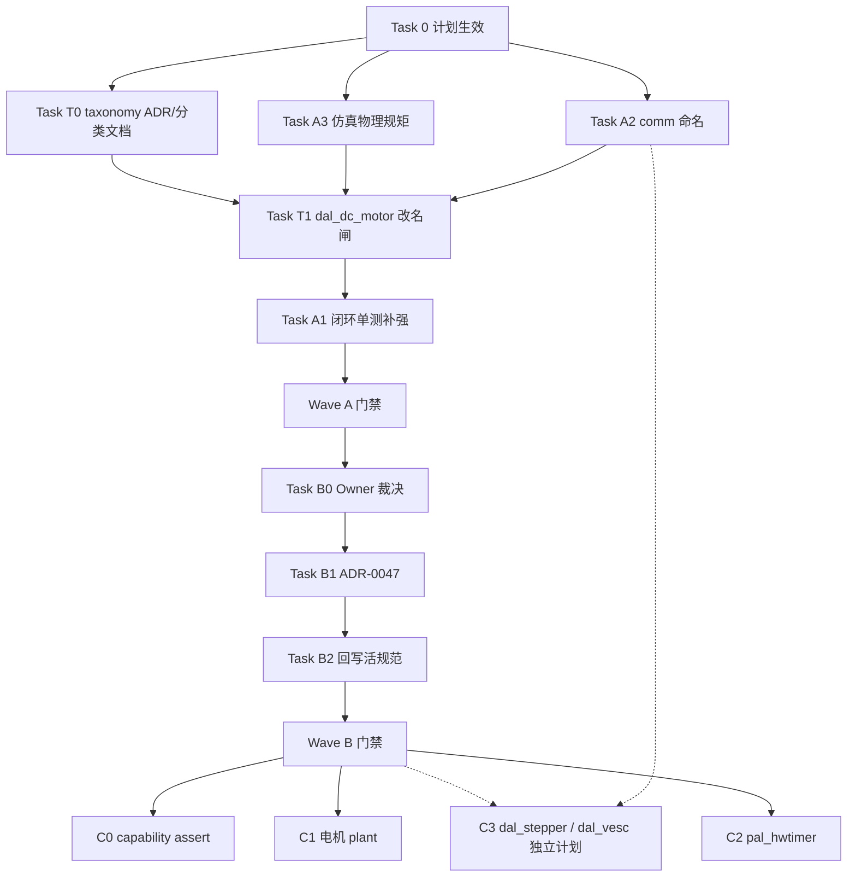

# DAL / BAL 分层评审后续整改 Implementation Plan

> **For agentic workers:** REQUIRED SUB-SKILL: Use `subagent-driven-development` (recommended) or `executing-plans` to implement this plan task-by-task. Steps use checkbox (`- [ ]`) syntax for tracking.  
> Domain skill: `embedded-best-practice`（静态分发 / ISR / 仿真保真）；文档 Task 对照 `.claude/rules/docs-adr.md`。

**Goal:** 消化 [2026-07-28 DAL/BAL 分层架构评审](../../reviews/core/2026-07-28-dal-bal-layering-architecture-review.md) 的可执行整改：统一 `comm` 命名、立仿真物理规矩、与 [actuator 电机分类评审](../../reviews/core/2026-07-28-dal-actuator-motor-taxonomy-review.md) 对齐完成 `dal_motor`→`dal_dc_motor`（含 brake/coast），再在正确符号上补强 control 闭环 host 单测；随后用 ADR 钉死 FOC ISR/DI/PAL 定时器边界；codegen capability 校验与电机 plant / `pal_hwtimer` 实现挂为触发项。

**Architecture:** 按「少返工」时间线拆波，**禁止 A1 与电机改名并行**：

| 波次 | 内容 | 并行策略 |
|------|------|----------|
| **Wave A-pre** | Task 0 → **A2 + A3**（可并行）+ **T0** taxonomy 分类 ADR/文档（可与 A2/A3 并行） | 不碰 `dal_motor` 生产符号 |
| **Wave A-gate** | **T1** `dal_motor`→`dal_dc_motor` + `brake`/`coast`/`safe_off` 绑定 | **串行闸**；阻塞 A1 |
| **Wave A-test** | **A1** 闭环单测补强（写在 `dal_dc_motor` 上） | 仅在 T1 之后 |
| **Wave B** | B0→B1→B2（FOC 文档门禁） | 可与 **C3**（`dal_stepper` / `dal_vesc` 独立计划）并行 |
| **Wave C** | C0/C1/C2 触发项（capability assert / plant / `pal_hwtimer`） | 不阻塞 A/B 合入；SimpleFOC 实现另开计划 |

**Tech Stack:** C99（host Unity 单测）、CMake、`python wink-tools/wink.py test` / `lint`、Markdown ADR / 设计规范。

## Global Constraints

- SSOT 评审入口：[2026-07-28-dal-bal-layering-architecture-review.md](../../reviews/core/2026-07-28-dal-bal-layering-architecture-review.md)。
- **交叉评审**：[2026-07-28-dal-actuator-motor-taxonomy-review.md](../../reviews/core/2026-07-28-dal-actuator-motor-taxonomy-review.md)——电机按控制语义分类；本计划 **T0/T1** 吸收其 P0（改名 + brake/coast）；其 P1 `dal_stepper` / P2 `dal_bldc` 不塞进本计划实现，见 **C3**。
- **评审定级勘误（本计划采纳）**：原分层评审 P0-1「缺闭环测」过重——已有 `test_cl_motor_failsafe_timeout`；本计划将其降为 **P1「加强注入与跟踪场景」**，不另起 DAL 整文件链接替换 fake（除非 A1 验证后仍不够）。
- **执行顺序硬约束（v1.2）**：**A1 必须在 T1（`dal_dc_motor` 改名）之后**。禁止在旧 `dal_motor` 符号上堆厚测试再改名。A2/A3/T0 可与彼此并行，但均不得与 T1 抢改同一电机源文件。
- **reviews 归档只读**：不直接改原评审正文；勘误与执行状态以本计划 +（可选）errata 附录为准。
- 静态分发（ADR-0004）：禁止为测试引入 `*_ops` / 运行期 vtable；注入走 host 测试钩子或公开 POD 字段。
- FOC 相关：**Wave B 只决策与回写文档**；Wave C 在独立 tech-design / 计划开工前禁止合入 FOC 生产代码。
- **FOC scope 澄清（重要）**：ADR-0026 分两类电机路线——**(1) SimpleFOC 本地算法型**（主控跑 FOC，需 10kHz ISR / PWM-ADC 同步 / `pal_hwtimer`）与 **(2) VESC/ODrive 外部智能驱动型**（板载 MCU 跑 FOC，主控仅走 CAN/UART 协议帧）。**本计划的 ADR-0047 / Wave B 门禁只约束 (1) SimpleFOC 本地环**；(2) VESC 是 **`actuator/` 目录下的协议型电机驱动**（`dal_vesc`：实现为组帧/解析，无主控 ISR / 无 `pal_hwtimer`），**不受 Wave B 门禁阻塞**——可独立计划先行（见 C3）。目录按**业务语义**归 `actuator/`（运动执行），不以「走总线」改塞 `comm/`。
- **ISR / 浮点 / IRAM 现实约束（Wave B 必须钉死）**：ESP32(Xtensa) 中断上下文默认不保存 FPU 上下文，ISR 回调须 IRAM-safe 且禁 flash 访问——这些是 FOC 真机翻车高发点，见 §3.3 红线与 B0 裁决表。
- Commit message 英文、按 Task 原子提交；不改无关固件逻辑。
- 验收基线：`python wink-tools/wink.py test`；触及分层时 `python wink-tools/wink.py lint --pack layering --pack api`。

---

## 1. 元数据表（🔴 必选）

| 字段 | 内容 |
|------|------|
| **计划编号** | `PLAN-20260728-DAL-BAL-FOLLOWUP` |
| **创建日期** | 2026-07-28 |
| **目标平台/SoC** | `host`（Wave A 单测）；文档全平台；Wave C 预留 `host` / `wasm` / `ESP32` |
| **工具链/SDK版本** | 现有 wink-tools + host GCC；ESP-IDF / Emscripten 仅 Wave C 触发时沿用仓库当前门禁版本 |
| **计划状态** | ✅ A/B 完成；C/C3 触发挂起 |
| **优先级** | 🔴 P0（Wave B ADR 阻塞 FOC）+ 🟡 P1（Wave A）+ ⚪ P2（capability assert） |
| **计划版本** | `v1.2.2` |
| **关联技术设计** | 无（Wave B 决策并入 ADR-0047；Wave C FOC 实现前另开 tech-design；taxonomy 扩展驱动另开计划见 C3） |
| **关联设计规范** | [01-dal-device-abstraction.md](../../design/02-wink-micro-os/01-dal-device-abstraction.md)、[02-pal-platform-abstraction.md](../../design/02-wink-micro-os/02-pal-platform-abstraction.md)、[03-directory-architecture.md](../../design/02-wink-micro-os/03-directory-architecture.md)、[06-bal-layer.md](../../design/02-wink-micro-os/06-bal-layer.md) |
| **关联评审记录** | [2026-07-28-dal-bal-layering-architecture-review.md](../../reviews/core/2026-07-28-dal-bal-layering-architecture-review.md)、[2026-07-28-dal-actuator-motor-taxonomy-review.md](../../reviews/core/2026-07-28-dal-actuator-motor-taxonomy-review.md) |
| **关联 ADR** | [ADR-0003](../../decisions/unisim/0003-simulation-fidelity-boundary.md)、[ADR-0004](../../decisions/core/0004-static-dispatch-vs-runtime-ops.md)、[ADR-0026](../../decisions/core/0026-foc-motor-dal-bal-separation.md)（Accepted-in-part；ISR/DI 由 ADR-0047 supersede）、[ADR-0047](../../decisions/core/0047-foc-isr-layering-and-pal-hwtimer.md)（Accepted，FOC 前后台切分 + DI + PAL hwtimer）、[ADR-0048](../../decisions/core/0048-actuator-control-semantic-naming.md)（Accepted，Task T0/T1） |
| **目标里程碑** | Wave A-pre → A-gate(T1) → A-test(A1) 可合入；Wave B = SimpleFOC 开工硬门禁；Wave C / C3 = 触发项 |
| **前置依赖计划** | 无（T0/T1 已并入本计划关键路径，避免跨计划空转） |
| **替代/废弃** | 无 |
| **计划负责人** | 项目 Owner + Agent |
| **所需子代理技能** | `embedded-best-practice` + `subagent-driven-development`；文档 Task 遵守 `docs-adr.md` |

---

## 2. 背景与目标（🔴 必选）

### 2.1 问题陈述

2026-07-28 分层评审确认：已落地的 LED / button / servo / ultrasonic / closed_loop_motor / chassis 纪律健康；风险集中在 **未落地的 FOC / 电机仿真** 边界模糊，以及 control 层 host 测试对反馈轨迹的注入能力不足。

同日 [actuator 电机分类评审](../../reviews/core/2026-07-28-dal-actuator-motor-taxonomy-review.md) 指出 `dal_motor` 名不副实（实为 H 桥有刷 DC 开环），若先在旧符号上加厚 A1 单测再改名将造成大面积返工——故本计划 v1.2 将 **改名闸（T1）置于 A1 之前**。

若不在 FOC 开工前用 ADR 钉死「ISR 宿主 vs FOC 数学」「仿真 plant 落点」「DI 是否允许函数指针」，将在错误地基上施工并大规模返工。control 侧虽已有 fail-safe 单测，但阶跃跟踪 / anti-windup 场景仍浅，静态分发下的测试代偿未写清。

此外，深入到 ESP32(Xtensa) 真机 FOC 现实后，评审未展开但同样会导致返工的隐藏边界包括：**(a)** 中断上下文默认不保存 FPU 上下文 → 10kHz ISR 内做 float 运算会破坏被抢占线程 FPU 状态，直接决定 BAL `control/` 数学 API 是 float 还是定点；**(b)** ADR-0026 §5C 的 **nFAULT 硬件保护中断** 与 **周期控制中断** 是两条完全不同的路径（异步亚微秒关断 vs 周期数学），不能都笼统称 "trampoline"；**(c)** `pal_hwtimer` 回调在 ESP-IDF 下须 `IRAM_ATTR` 且禁 flash 访问；**(d)** host/wasm 无真硬中断，仿真快环的执行模型（虚拟时间确定性步进）未定义，威胁同源保真度。这些必须在 B0 裁决表 / ADR-0047 一并钉死。

### 2.2 技术/业务目标

- ✅ Wave A-pre：DAL `communication/` 统一为 `comm/`（与 BAL / codegen 对齐）；规范禁止「DAL `#ifdef SIMULATION` 内嵌电机动力学方程」；plant → `wink_sim_physical`；仿真快环虚拟时间模型立规矩
- ✅ Wave A-pre/T0：ADR-0048（或等价）记录 actuator 按控制语义分类；预留 `dal_rc_servo` ≠ `dal_industrial_servo`、`dal_bldc` 命名，避免与航模舵机/FOC 混淆
- ✅ Wave A-gate/T1：`dal_motor` → `dal_dc_motor`；显式 `brake()` / `coast()`；`safe_off` 文档钉死绑定其一；BAL closed_loop / chassis / codegen / 既有单测跟随改名
- ✅ Wave A-test/A1：在 **`dal_dc_motor`** 上补强 closed_loop host 单测（注入反馈跟踪 + fail-safe 虚拟时钟 + anti-windup 观测积分器 + encoder 回绕）；BAL 规范写明 control 最低测试场景表
- ✅ Wave B：ADR-0047 Accepted（或等价修订 ADR-0026），明确 FOC 快环/慢环/**两类 ISR（周期控制环 vs nFAULT 保护）切分**、**ISR 数值类型（定点 vs float + FPU 上下文策略）**、静态 DI、`pal_hwtimer`（含 **IRAM-safe 回调 ABI**）契约方向、**仿真快环执行模型**；回写 DAL/BAL/PAL 活规范；并显式声明 scope 仅约束 SimpleFOC 本地环（VESC 为 `actuator/` 协议型电机驱动，不受门禁）
- ✅ Wave C / C3（触发项）：capability 别名编译期校验；电机 plant；`pal_hwtimer`；**`dal_stepper` / `dal_vesc` 独立计划**——**本计划只定义入口与验收，不在本计划内完成 FOC 算法或步进实现**

### 2.3 成功指标（验收出口）

| 指标 | 通过标准 | 验证方法 |
|------|----------|----------|
| host 单测 | 100% 通过，含新增 closed_loop 用例（基于 `dal_dc_motor`） | `python wink-tools/wink.py test` |
| 分层 lint | layering + api 无新增违规 | `python wink-tools/wink.py lint --pack layering --pack api` |
| `comm` 命名统一 | 仓库无 `dal/**/communication/` 残留路径（历史文档引用除外处已改） | `rg "dal/.*/communication" wink-micro-os wink-tools` |
| DC 电机正名 | 生产/测试无残留公开 `dal_motor_*` API（compat 宏若保留须文档标注废弃） | `rg "\bdal_motor_" wink-micro-os wink-tools` |
| FOC 门禁文档 | ADR-0047 Accepted；DAL §8.1 无「归入 BAL 级别」模糊句 | 人工审阅 + Owner 签字 |
| 仿真规矩 | DAL §8.3 / ADR-0026 无「动力学写进 DAL SIMULATION」 | 人工审阅 |
| Wave C 未误开工 | 本计划合入后仍无 FOC 生产 `.c` 实现 | `rg "wink_foc|simplefoc|bal_simplefoc" wink-micro-os` 无生产实现（测试/文档除外） |

---

## 3. 变更范围与影响分析（🔴 必选）

### 3.1 文件变更清单

| 文件路径 | 变更类型 | 说明 | Wave |
|----------|----------|------|------|
| `docs/implementation-plans/core/2026-07-28-dal-bal-followup-plan.md` | 🆕/✏️ | 本计划 | — |
| `wink-micro-os/dal/include/communication/` → `comm/` | ✏️/🗑️ | 目录重命名 + `dal_gps.h` | A-pre |
| `wink-micro-os/dal/src/communication/` → `comm/` | ✏️/🗑️ | `dal_gps.c` | A-pre |
| `wink-micro-os/dal/CMakeLists.txt` | ✏️ | include 路径；T1 时 motor 源文件名 | A-pre / A-gate |
| `wink-tools/tools/codegen/drivers/base.py` | ✏️ | `DriverCategory.COMMUNICATION = "comm"` | A-pre |
| `wink-tools/tools/codegen/drivers/gps.py` | ✏️ | category 跟随 | A-pre |
| `wink-tools/tools/cli/commands/new_dal.py` | ✏️ | `_CATEGORIES` | A-pre |
| `docs/design/02-wink-micro-os/01-dal-device-abstraction.md` | ✏️ | 目录名 + actuator 分类表 + §8 仿真/FOC（A2/A3/T0/B2） | A-pre / A-gate / B |
| `docs/design/02-wink-micro-os/03-directory-architecture.md` | ✏️ | `comm/` + sim physical 职责 | A-pre |
| `docs/decisions/core/0026-foc-motor-dal-bal-separation.md` | ✏️ | Consequence / 与 0047·0048 交叉 | A-pre / B |
| `docs/decisions/core/0048-actuator-control-semantic-naming.md` | 🆕 | actuator 分类 + `dal_dc_motor`（Task T0） | A-pre |
| `wink-micro-os/dal/include/actuator/dal_motor.h` → `dal_dc_motor.h` | ✏️/🗑️ | 重命名 + brake/coast API | A-gate |
| `wink-micro-os/dal/src/actuator/dal_motor.c` → `dal_dc_motor.c` | ✏️/🗑️ | 实现跟随 | A-gate |
| `wink-tools/tools/codegen/drivers/motor.py`（或 `dc_motor.py`） | ✏️ | registry / stem | A-gate |
| BAL `wink_closed_loop_motor.*` / `wink_chassis.*` | ✏️ | 类型/调用改 `dal_dc_motor_*` | A-gate |
| `wink-micro-os/test/unit/dal/test_dal_motor.c` → `test_dal_dc_motor.c` | ✏️ | 跟随改名；补 brake/coast | A-gate |
| `wink-micro-os/test/unit/bal/test_bal_closed_loop_motor.c` / `test_bal_chassis.c` | ✏️ | T1 符号跟随；**A1 再加厚用例** | A-gate / A-test |
| `wink_actuator_registry` 相关 | ✏️ | DC safe-off 语义注册 | A-gate |
| `wink-micro-os/test/stubs/host_test_ctrl.h` | ✏️ | 编码器 count / 虚拟时钟注入 | A-test |
| host PAL / encoder 相关实现或测试辅助 | ✏️ | 实现注入（见 Task A1） | A-test |
| `docs/design/02-wink-micro-os/06-bal-layer.md` | ✏️ | control 最低单测场景表（A1）；FOC/ISR 约束（B2） | A-test / B |
| `docs/decisions/core/0047-foc-isr-layering-and-pal-hwtimer.md` | 🆕 | FOC 边界 ADR | B |
| `docs/design/02-wink-micro-os/02-pal-platform-abstraction.md` | ✏️ | `pal_hwtimer` 契约草案 | B |
| `wink-tools/tools/codegen/templates/device_tree.h.j2` 等 | ✏️ | capability `_Static_assert` / 重复名检测 | C |
| `wink-micro-os/targets/common/src/wink_sim_physical.c` | ✏️ | 电机 plant（触发时） | C |
| `wink-micro-os/pal/include/hal/pal_hwtimer.h`（名可调） | 🆕 | 公共契约（触发时） | C |
| `dal_stepper` / `dal_vesc` 等 | 🆕 | **不在本计划实现**；C3 触发另开计划；二者均落 **`actuator/`**（vesc 实现为协议组帧） | C3 |

### 3.2 接口影响分析

| 接口层 | 是否有破坏性变更 | 影响范围 | 备注 |
|--------|------------------|----------|------|
| PAL 公开 API | Wave A/B：❌；Wave C：⚠️ 新增 | `pal_hwtimer_*` 仅新增 | Wave B 只文档草签；实现在 Wave C |
| DAL 层 | ⚠️ 是 | `communication/`→`comm/`；**`dal_motor_*`→`dal_dc_motor_*` + brake/coast** | T1 破坏性；可短期 compat typedef/宏，须标废弃 |
| BAL 层 | ⚠️ 是（类型名） | closed_loop / chassis 改用 `dal_dc_motor_t` | 与 T1 同 PR；A1 不改生产控制语义 |
| 应用层 | ⚠️ 若手写 device_tree | sample / codegen 输出 | T1 同步 |
| 构建系统 | ⚠️ 小 | `dal/CMakeLists.txt` include / 源文件名 | A2 + T1 |
| 工具链 | ⚠️ 小 | `new_dal` / DriverCategory / motor driver plugin | A2 + T1 |
| 文档 | ⚠️ 是 | DAL/BAL/PAL/ADR-0047/0048 | 必须回写 |

### 3.3 架构红线（⚠️ 违反即拒绝合入）

> 🚨 **架构红线**
> 1. 不得为测试引入 DAL `*_ops` / 运行期虚表（ADR-0004）。
> 2. Wave A/B **禁止**合入 FOC / SimpleFOC 生产实现；Wave B 仅 ADR + 规范。
> 3. DAL `#ifdef SIMULATION` **禁止**新增电机/转子动力学差分方程正文；plant 只许进 `targets/common/wink_sim_physical*`（或等价 targets 公共库）。
> 4. BAL 公共头继续禁 `pal_*`（`pal_log.h` 豁免策略不变）；FOC ISR 宿主不得塞进 BAL 公共头。
> 5. 双 target：host 单测变更不得破坏 esp32/wasm 编译（DAL 路径重命名须三端同改，且 A2 / T1 须做真机/wasm 实编译冒烟）。
> 6. **A1 不得先于 T1**：禁止在旧 `dal_motor` 公开 API 上新增厚测试后再改名（返工红线）。
> 7. **ISR 数值与 FPU（Wave C 施工红线，Wave B 定策）**：在 ESP32(Xtensa) 周期控制 ISR 内的数值策略必须遵守 ADR-0047 裁决——若允许 float，必须显式处理 FPU 上下文（禁止在未保存 FPU 的中断里污染被抢占线程状态）；BAL `control/` 数学 API 的数值类型（定点 / float）一旦裁定不得在 target 分支各行其是。
> 8. **两类 ISR 不得混淆**：周期控制 ISR（跑数学）与 nFAULT 硬件保护 ISR（异步、亚微秒、绕过软件层直接寄存器/硬件 BRK 关断 PWM，关联 ADR-0024 清场）必须分别定义落点、栈预算与时延预算，禁止合并为单一 "trampoline"。
> 9. **`pal_hwtimer` 回调 IRAM-safe**：任何 `pal_hwtimer` / FOC ISR 回调在 ESP-IDF 下须 `IRAM_ATTR`，禁止调用可能触发 flash 访问的 API，禁 `pal_log` / malloc / 阻塞（Wave C 施工红线，Wave B 写入契约草案）。
> 10. **按控制语义命名电机 DAL**：禁止用泛化 `dal_motor` 表示具体驱动；`dal_rc_servo`（航模）≠ `dal_industrial_servo`（工业闭环）；本地 FOC 积木命名与 ADR-0047/0048 对齐。

### 3.4 系统资源与并发约束评估

| 资源/安全维度 | 预计变化/开销 | 风险与限制 | 缓解/应对策略 |
|--------------|--------------|-----------|--------------|
| **ROM / Flash** | Wave A ≈ 0；Wave C hwtimer/FOC 另估 | — | Wave C 单独评估 |
| **RAM** | Wave A 测试钩子可忽略 | — | 测试专用，不进量产镜像 |
| **栈深度** | Wave A 无；Wave C ISR 快环关键 | ISR 栈溢出 | ADR-0047 要求标注 ISR 栈预算与禁阻塞 |
| **堆** | 无 | — | 禁止 malloc |
| **FPU / 数值** | Wave B 定策；Wave C 落地 | Xtensa 中断默认不保存 FPU → float ISR 破坏被抢占线程 FPU 上下文 / 异常 | ADR-0047 裁定定点 vs float + FPU 上下文策略；BAL `control/` 数学 API 数值类型统一 |
| **代码放置 (IRAM)** | Wave C | ESP-IDF ISR 回调若非 `IRAM_ATTR` 或 flash cache 失效期从 flash 执行 → 崩溃 | `pal_hwtimer` 契约要求回调 IRAM-safe、禁 flash 访问 |
| **硬件通道** | Wave C 占用定时器/PWM/ADC | 与现有外设冲突；PWM-ADC 需硬件同步触发（非软件中断，避免采样抖动） | device_tree 资源声明 + ADR-0024；PAL 提供 PWM–ADC 硬件联动 |
| **并发与中断安全** | Wave B 定义快/慢环共享缓冲；两类 ISR | 数据竞争；保护 ISR 与控制 ISR 优先级/抢占 | 临界区 / 原子字段；BAL 快环 API 禁阻塞、禁 log；两类 ISR 分别定优先级 |
| **仿真快环执行** | Wave B 定模型；Wave C 实现 | host/wasm 无真 10kHz 硬中断 → 保真度/确定性风险 | ADR-0047/A3 定义「虚拟时间驱动的确定性步进」，禁墙钟/rand |

---

## 4. 依赖与风险（🔴 必选）

### 4.1 前置依赖

| 依赖ID | 依赖内容 | 是否阻塞 | 验证状态 | 备注 |
|--------|----------|----------|----------|------|
| D-001 | 现有 `test_bal_closed_loop_motor` / host sim 可跑 | ✅ 是 | ✅ 已完成 | Wave A 基线 |
| D-002 | `wink_sim_physical` 已存在 | ❌ 否 | ✅ 已完成 | A3 只立规矩 |
| D-003 | Owner 批准 ADR-0047 裁决表 | ✅ 是（Wave B） | ✅ 已完成（2026-07-28 默认表全采纳） | Task B0 |
| D-004 | Owner 批准 `dal_motor`→`dal_dc_motor`（taxonomy §七） | ✅ 是（T1） | ✅ 已完成 | ADR-0048 Accepted；`safe_off`→**brake**；`dal_stepper` 挂 C3 |

### 4.2 外部依赖（非本项目可控）

| 依赖ID | 依赖内容 | 提供方 | 截止日期 | 风险等级 | 备注 |
|--------|----------|--------|----------|----------|------|
| E-001 | 无 | — | — | — | Wave A/B 无外部团队依赖 |

### 4.3 风险登记册

| 风险ID | 风险描述 | 概率 | 影响 | 严重度 | 缓解措施 | 责任人 | 触发条件 |
|--------|----------|------|------|--------|----------|--------|----------|
| R-001 | Owner 对 FOC「算法在 BAL、ISR 在 DAL/target」裁决拖延 | 🟡 中 | 🟠 高 | 6 | Wave B 提供默认裁决表；未 Accepted 前禁止 FOC 代码 | Owner | FOC 需求排期 |
| R-002 | 编码器注入破坏真机 ISR 路径语义 | 🟡 中 | 🟡 中 | 4 | 注入 API 仅 host/`HOST_TEST`；真机零编译 | Agent | A1 实现时 |
| R-003 | `communication`→`comm` 漏改 codegen/golden | 🟡 中 | 🟡 中 | 4 | Task A2 含 rg + lint + codegen 单测 | Agent | A2 |
| R-004 | 有人按旧 ADR-0026 在 DAL 写 plant | 🟡 中 | 🟠 高 | 6 | A3 改措辞 + lint/文档红线；代码审查引用本计划 | Owner | 电机仿真开工 |
| R-005 | ADR-0026 函数指针 DI 与 ADR-0004 冲突被忽略 | 🟡 中 | 🟠 高 | 6 | ADR-0047 显式否决运行期 fn 表；Codegen 静态绑定；**B1 须同步改 ADR-0026 §1 结构体示例代码**（避免后人照抄旧 fn 表示例） | Owner | B1 |
| R-006 | 未定 ISR 数值/FPU 策略即写 float 快环 → 真机 FPU 异常 / BAL 数学 API 类型返工 | 🟡 中 | 🔴 严重 | 8 | B0 裁决表新增「ISR 数值类型 + FPU 上下文」条目；未定死禁止 C2 施工 | Owner | B0/C2 |
| R-007 | 周期控制 ISR 与 nFAULT 保护 ISR 混为一谈 → fail-safe 安全等级说不清 | 🟡 中 | 🟠 高 | 6 | ADR-0047 分列两类 ISR 落点/栈/时延预算 | Owner | B1 |
| R-008 | `pal_hwtimer` 回调未标 IRAM / 触发 flash 访问 → 真机随机崩 | 🟡 中 | 🟠 高 | 6 | B2 契约草案写明 IRAM-safe / 禁 flash / 禁 log；C2 落地时 lint 检查 | Agent | C2 |
| R-009 | 仿真快环走墙钟 → 非确定性、CI flaky、与真机行为漂移 | 🟡 中 | 🟡 中 | 4 | A3/ADR-0047 定「虚拟时间确定性步进」；plant 禁墙钟/rand | Agent | A3/C1 |
| R-010 | A1 fail-safe/跟踪测试依赖真实时钟 → dt 抖动导致 flaky | 🟡 中 | 🟡 中 | 4 | A1 注入可控虚拟时钟/dt（mock `pal_get_time_ms` 或显式 dt 入参） | Agent | A1 |
| R-011 | anti-windup 用例仅断言输出夹紧 → 积分项照样无界爬升未被发现（假绿） | 🟡 中 | 🟠 高 | 6 | A1 断言 PID 积分器状态可观测（公开 POD / 测试钩子），并验证解饱和后无 overshoot | Agent | A1 |
| R-012 | encoder count int32 溢出/回绕未测 → 长跑闭环漂移 | 🟢 低 | 🟡 中 | 3 | A1 增加 wrap-around 用例，且至少一用例经 `dal_encoder_get_count` 读路径 | Agent | A1 |
| R-013 | A2 目录重命名仅 host 绿、esp32/wasm CMake glob/include 断裂 | 🟡 中 | 🟠 高 | 6 | A2 做 esp32 或 wasm 实编译冒烟（非"抽查"） | Agent | A2 |
| R-014 | C0 `_Static_assert` 在 C99 档位不可用（C11 才标准） | 🟢 低 | 🟡 中 | 3 | 提供 `WINK_STATIC_ASSERT` 宏 fallback（negative-array-size）；确认双 target 标准档 | Agent | C0 |
| R-015 | A1 与 T1 并行 → 厚测试在旧 `dal_motor` 上写完再全量改名 | 🟡 中 | 🟠 高 | 6 | **执行顺序硬约束**：T1 完成前禁止开工 A1 | Agent | A1 |
| R-016 | T1 漏改 codegen / actuator_registry / pruning 宏 | 🟡 中 | 🟠 高 | 6 | T1 含全仓 `rg dal_motor` + lint + host/esp32 冒烟 | Agent | T1 |

### 4.4 跨团队/跨模块协调点

| 协调点ID | 描述 | 涉及团队/模块 | 计划协调时间 | 状态 | 负责人 |
|----------|------|---------------|--------------|------|--------|
| C-001 | ADR-0047：选 `(a) pal_hwtimer` 进公共契约（推荐）vs `(b) target 私有` | Owner / PAL / DAL | Task B0 | ✅ 确认 → **(a)** 公共契约 | Owner |
| C-002 | FOC 快环是否允许被 ISR 调 BAL 纯函数（栈/日志约束） | Owner / BAL | Task B1 | ✅ 确认 → **允许**（无阻塞/无 log/有限栈；见 ADR-0047） | Owner |
| C-003 | ISR 数值策略：定点(Q15/Q31) vs float + FPU 上下文处理（决定 BAL control 数学 API 类型） | Owner / BAL / PAL | Task B0 | ✅ 确认 → **优先定点 Q15/Q31** | Owner |
| C-004 | 两类 ISR（周期控制 vs nFAULT 保护）的优先级、栈预算、关断路径 | Owner / DAL / PAL | Task B1 | ✅ 确认 → **分列**（细节写 ADR-0047） | Owner |
| C-005 | VESC/ODrive 外部驱动器是否本计划外独立落地（`dal_vesc` 协议型电机，**目录 `actuator/`**，不受 Wave B 门禁） | Owner / DAL | Task B0 / C3 | ✅ 确认 → **独立计划；目录 `actuator/`；不受 Wave B 门禁** | Owner |
| C-006 | 接受 taxonomy：`dal_motor`→`dal_dc_motor`；`safe_off` 默认绑 brake 还是 coast；`dal_stepper` 是否近期排期 | Owner / DAL | Task T0 | ✅ 已完成 | Owner — ADR-0048：`safe_off`=**brake**；`dal_stepper` **否**（C3） |

---

## 5. 优先级路线图（多 Task 计划 🟡 必选）

### 5.1 执行顺序



> **文字说明（v1.2 强制顺序）**：  
> `Task 0` → **`A2` ∥ `A3` ∥ `T0`**（Wave A-pre，可并行）→ **`T1`（串行闸，阻塞 A1）** → **`A1`** → Wave A 门禁 → `B0` → `B1` → `B2` → Wave B 门禁。  
> `C0/C1/C2` 为 SimpleFOC/plant/codegen 触发项。  
> `C3`（`dal_stepper` / `dal_vesc`）**不阻塞**本计划 A/B；`dal_vesc` 与 `dal_stepper` 均落 **`actuator/`**，可随时开独立计划；可与 Wave B **并行**。

### 5.2 优先级矩阵

| 优先级 | Task | 总预估工时 | 说明 |
|--------|------|------------|------|
| 🔴 P0 | T1, B0, B1, B2 | ~12–16 h | T1 阻塞 A1；B* 阻塞 SimpleFOC |
| 🟡 P1 | 0, A2, A3, T0, A1 | ~14–20 h | A-pre 可并行；A1 在 T1 后 |
| ⚪ P2 / 触发 | C0, C1, C2, C3 | 另估 | 本计划只挂契约 |
| **本计划立即执行合计** | **9 Task（0+A2+A3+T0+T1+A1+B*）** | **~26–36 h** | |

### 5.3 关键路径分析

- 关键路径（闭环测试就绪）：`Task 0 → (A2∥A3∥T0) → T1 → A1`
- 关键路径（SimpleFOC 文档门禁）：`Task 0 → … → Wave A 门禁 → B0 → B1 → B2`（B0 可不硬等 A1，但建议 A 合入后再开，减少 `01-dal` 冲突）
- 可并行：`A2 / A3 / T0`；Wave B ∥ C3（stepper/vesc 独立计划）
- **禁止并行**：`A1 ∥ T1`

### 5.4 跨 Task 文件冲突矩阵

| 文件 | 涉及 Task | 串行约束 |
|------|-----------|----------|
| `01-dal-device-abstraction.md` | A2 → A3 → T0 → B2 | **一人串行编辑**或按段落分 PR；T0 写 actuator 分类表，B2 改 §8.1 |
| `0026-foc-motor-*.md` | A3 → B1/B2 | A3 先改仿真 Consequence；B1/B2 再改状态与 ISR |
| `03-directory-architecture.md` | A2, A3 | 可合并一次提交或 A2→A3 |
| `dal_motor` / `dal_dc_motor` 源与 BAL control | **仅 T1**（A1 只读新符号写测试） | **T1 完成前 A1 不得开工** |
| `test_bal_closed_loop_motor.c` | T1（符号）→ A1（加厚） | **严格串行** |
| `host_test_ctrl.h` | 仅 A1 | 无冲突（T1 不改） |
| `0048-*.md` | 仅 T0 | 无冲突 |
| `0047-*.md` | 仅 B1 | 无冲突 |

---

## 6. 详细任务拆分与进度追踪（🔴 必选）

> ✅ **Task 完成定义（统一 DoD）**（文档 Task 可豁免编译项，但须完成对应验证）：
> 1. 变更符合编码/文档规范  
> 2. 代码 Task：相关单测通过；`python wink-tools/wink.py test` 全绿  
> 3. 触及分层：`wink lint --pack layering --pack api` 通过  
> 4. 文档已同步  
> 5. 原子 commit（英文 message）  
> 6. 本计划第 6 章 checkbox 已更新  

---

### Task 0：计划生效 + 评审勘误说明 `[ 状态: ✅ 完成 ]`

| 字段 | 内容 |
|------|------|
| **负责人** | Agent / Owner |
| **预估 / 实际工时** | 0.5 h / 0.5 h |
| **优先级** | 🟡 P1 |
| **前置依赖** | 无 |
| **修改文件** | 本计划元数据状态；可选 `docs/tech-designs/unisim/2026-07-20-co-simulation-plugin-contract.md` |
| **接口变化** | 无 |

#### 详细步骤

- [x] **Step 1：** Owner 确认本计划 **v1.2** 可执行（含 A-pre → T1 → A1 顺序）；将本计划「计划状态」改为 🔄 执行中。  
  （2026-07-28：Owner 指示「开始执行」；分支 `feat/dal-bal-followup-20260728`。）

- [x] **Step 2：** 记录勘误（写入 errata 文件 **或** 仅保留在本计划 §2.1 / Global Constraints，二选一）：  
  **采纳：勘误保留在本计划 Global Constraints + §2.1，不另建 errata 文件。**
  - 原评审 **P0-1 → P1**：已有 `test_cl_motor_failsafe_timeout`；目标改为加强注入与跟踪/anti-windup。
  - 增补 **FOC-DI**：ADR-0026 推荐 `get_angle_fn` / `set_voltage_fn` 与 ADR-0004 张力，并入 ADR-0047。
  - 原 P0-2「实时环应属 DAL」细化为本计划默认裁决：数学在 BAL，**ISR 宿主**在 DAL/target trampoline。
  - **v1.1 增补（评审未展开的真机边界）**：ISR 数值+FPU 策略、两类 ISR（周期控制 vs nFAULT 保护）切分、`pal_hwtimer` IRAM 回调 ABI、仿真快环确定性模型、VESC scope 澄清——统一在 B0 裁决表 / ADR-0047 钉死。
  - **v1.2 增补（与 taxonomy 评审对齐）**：执行顺序改为 A2∥A3∥T0 → **T1 改名闸** → A1；吸收 taxonomy P0（`dal_dc_motor` + brake/coast）；P1/P2 步进/BLDC 挂 C3，不阻塞本计划。

- [x] **Step 3：Commit（仅文档）**

```bash
git add docs/implementation-plans/core/2026-07-28-dal-bal-followup-plan.md
# 若有 errata：
# git add docs/tech-designs/unisim/2026-07-20-co-simulation-plugin-contract.md
git commit -m "$(cat <<'EOF'
docs: reorder DAL/BAL followup plan around dc_motor rename gate

EOF
)"
```

#### 验证步骤

1. 计划文件存在且元数据完整（版本 v1.2）  
2. 勘误与原评审差异对 Owner 可见  
3. §5.1 顺序与 Global Constraints「A1 不得先于 T1」一致  

#### 架构注意事项

> ⚠️ 不要修改已归档评审正文（`docs-adr`：reviews 只读）。

---

### Task A2：DAL `communication` → `comm` 命名统一 `[ 状态: ✅ 已完成 ]`

| 字段 | 内容 |
|------|------|
| **负责人** | Agent |
| **预估 / 实际工时** | 2–3 h / |
| **优先级** | 🟡 P1 |
| **前置依赖** | Task 0 |
| **修改文件** | `dal/include|src/communication/**` → `comm/`；`dal/CMakeLists.txt`；`wink-tools/.../base.py`、`gps.py`、`new_dal.py`；设计规范目录树；相关测试/文档引用 |
| **接口变化** | include 路径破坏性（仅 gps） |

#### 详细步骤

- [x] **Step 1：** 物理重命名目录：
  - `wink-micro-os/dal/include/communication/` → `include/comm/`
  - `wink-micro-os/dal/src/communication/` → `src/comm/`

- [x] **Step 2：** 更新：
  - `dal/CMakeLists.txt`：`include/communication` → `include/comm`
  - `DriverCategory.COMMUNICATION = "comm"`（`base.py`）
  - `new_dal.py`：`_CATEGORIES` 中 `"communication"` → `"comm"`（可保留别名警告一期，但默认生成 `comm`）
  - `gps.py` category 跟随
  - 凡 `#include` / 文档树中的 `communication/` DAL 路径

- [x] **Step 3：** 更新活规范：
  - `01-dal-device-abstraction.md` 目录树
  - `03-directory-architecture.md` 目录树

- [x] **Step 4：** 全仓检索残留

```powershell
rg -n "communication" wink-micro-os/dal wink-tools/tools/codegen wink-tools/tools/cli/commands/new_dal.py docs/design/02-wink-micro-os
```

- [x] **Step 5：验证 + Commit**

```powershell
python wink-tools/wink.py lint --pack layering --pack api
python wink-tools/wink.py test
```

- [x] **Step 5.5：双 target 实编译冒烟（R-013，必做，非"抽查"）** 目录/`#include` 重命名最易只在 host 绿、真机断（CMake glob、大小写、include 路径）。至少构建一个含 gps 或 comm 驱动的 sample：

```powershell
# esp32（或 wasm）实编译冒烟，以仓库实际入口为准
python wink-tools/wink.py esp32 <sample_with_comm_driver>
# 或 wasm 构建入口
```

```bash
git commit -m "$(cat <<'EOF'
refactor(dal): rename communication category to comm

EOF
)"
```

#### 验证步骤

1. gps 驱动仍能编进 host（若启用）  
2. **gps/comm 驱动能编进 esp32 或 wasm（实编译，R-013）**  
3. `list_drivers` / codegen 单测若存在 category 断言则更新为 `comm`  
4. lint / test 全绿  

#### 架构注意事项

> ⚠️ ADR-0046 registry 路径由 `resolved_category()` 派生——必须改 enum 值，否则新驱动脚手架会写错目录。  
> ⚠️ 与 Task A3 / T0 同改 `01-dal` / `03-directory` 时合并编辑，避免冲突。  
> ⚠️ **本 Task 为 DAL `comm/` 与 BAL/codegen 对齐的命名统一**；`dal_vesc` 目录归属为 **`actuator/`**（业务语义），不再依赖本 Task 作为目录前置。

---

### Task A3：仿真物理引擎落点立规矩（文档） `[ 状态: ✅ 已完成 ]`

| 字段 | 内容 |
|------|------|
| **负责人** | Agent |
| **预估 / 实际工时** | 2–3 h / |
| **优先级** | 🟡 P1 |
| **前置依赖** | Task 0；建议与 A2 串行改同一规范文件 |
| **修改文件** | `01-dal-device-abstraction.md` §8.3；`03-directory-architecture.md`；`0003-simulation-fidelity-boundary.md`（若需交叉引用）；`0026-foc-motor-dal-bal-separation.md` Consequence |
| **接口变化** | 无代码 |

#### 详细步骤

- [x] **Step 1：** 修订 DAL §8.3：删除/改写「在 DAL `#ifdef SIMULATION` 内嵌一阶电磁与动力学差分方程」示例；改为：
  - plant model → `targets/common/wink_sim_physical.*`
  - DAL 仿真分支只做最低物理量旁路 / 调用 sim 注入点（对标 ultrasonic）

- [x] **Step 2：** 修订 ADR-0026「高保真同源仿真 / Consequence」中「动力学嵌入 DAL SIMULATION」表述，改为指向 `wink_sim_physical`；注明完整 ISR/DI 边界以 ADR-0047 为准（若 B1 尚未合入，写「待 0047」）。

- [x] **Step 3：** `03-directory-architecture.md` 标明 `wink_sim_physical` 可含电机 plant；DAL `src/` 注释保持「仅旁路最低物理量」。

- [x] **Step 3.5：** 立「仿真快环执行模型」规矩（R-009，DAL §8.3 或 ADR-0003 交叉引用）：host/wasm 无真 10kHz 硬中断，仿真快环**必须由虚拟时间驱动、确定性步进**（caller 每虚拟 ms 步进 N 次控制，非墙钟、非 rand），并说明 PWM-ADC 硬件同步采样在仿真端如何降级（软步进近似）。完整 ISR/DI 边界以 ADR-0047 为准（若 B1 尚未合入，写「待 0047」）。

- [x] **Step 4：Commit（仅文档）**

```bash
git commit -m "$(cat <<'EOF'
docs: keep motor plant models out of DAL SIMULATION

EOF
)"
```

#### 验证步骤

1. `rg -n "dal_motor_physics_update|动力学差分" docs/design` → 无「放进 DAL 实现」的现行规范表述（历史 ADR 背景段可保留并标注 superseded）  
2. 本 Task **不**实现 plant 代码（那是 C1）  

#### 架构注意事项

> ⚠️ 只立规矩，不提前实现电机物理——避免半吊子 API。  
> ⚠️ 可与 A2 / T0 **并行**（注意 `01-dal` 段落冲突）。

---

### Task T0：Actuator 分类 ADR + 命名规范回写（文档） `[ 状态: ✅ 已完成 ]`

| 字段 | 内容 |
|------|------|
| **负责人** | Agent + Owner |
| **预估 / 实际工时** | 2–3 h / |
| **优先级** | 🟡 P1（阻塞 T1 的 Owner 确认） |
| **前置依赖** | Task 0；**可与 A2 / A3 并行** |
| **修改文件** | `docs/decisions/core/0048-actuator-control-semantic-naming.md`（新建）；`01-dal-device-abstraction.md` actuator 分类段；交叉链 taxonomy 评审 |
| **接口变化** | 决策层；无生产代码（代码在 T1） |

#### 详细步骤

- [x] **Step 1：** Owner 确认 C-006 / D-004（taxonomy §七）：
  - 接受 `dal_motor` → `dal_dc_motor` ✅
  - `safe_off` 默认绑定 **brake**（非 coast）✅
  - `dal_stepper` 近期排期：**否** → 仅 C3 挂起 ✅

- [x] **Step 2：** 撰写 **ADR-0048**（按仓库 ADR 模板），必须包含：
  - Context：引用 [taxonomy 评审](../../reviews/core/2026-07-28-dal-actuator-motor-taxonomy-review.md)
  - Decision：按控制语义拆分——`dal_dc_motor` / `dal_rc_servo` / `dal_stepper`（预留）/ `dal_industrial_servo`（预留）/ `dal_bldc`（预留，与 ADR-0047 对齐）
  - **`motor` 不做具体 DAL 前缀**；泛称仅 capability 别名层
  - `dal_rc_servo` ≠ `dal_industrial_servo` 命名陷阱
  - 关断语义随器件（brake/coast、hold/release、disable/抱闸）
  - Non-goals：本 ADR 不实现 stepper/FOC/VESC 代码

- [x] **Step 3：** 回写 `01-dal-device-abstraction.md`：纳入分类总表（可摘自 taxonomy §5.1）；标明现有实现仅 `dal_dc_motor` + `dal_rc_servo`。

- [x] **Step 4：** Owner 将 ADR-0048 标为 **Accepted**（或 Proposed→同 PR Accepted）。

- [x] **Step 5：Commit（仅文档）**

```bash
git commit -m "$(cat <<'EOF'
docs: add ADR-0048 actuator control-semantic naming

EOF
)"
```

#### 验证步骤

1. ADR-0048 存在且与 taxonomy 评审结论一致  
2. C-006 / D-004 无「待定」空格（至少改名与 safe_off 绑定已定）  
3. **不修改** `dal_motor.c`（留给 T1）  

#### 架构注意事项

> ⚠️ 与 A3 同改 `01-dal` 时协调段落：T0 写分类，A3 写 §8.3 仿真。  
> ⚠️ `dal_bldc` 命名须与后续 ADR-0047 / ADR-0026 积木名交叉引用，避免三套名字。

---

### Task T1：`dal_motor` → `dal_dc_motor` + brake/coast（串行闸） `[ 状态: ✅ 完成 ]`

| 字段 | 内容 |
|------|------|
| **负责人** | Agent |
| **预估 / 实际工时** | 4–6 h / ~5 h |
| **优先级** | 🔴 P0（阻塞 A1） |
| **前置依赖** | Task T0 Accepted；建议 A2/A3 已合入（降低文档冲突） |
| **修改文件** | `dal_motor.{h,c}`→`dal_dc_motor.{h,c}`；**BAL 仅** `wink_closed_loop_motor.*` / `wink_chassis.*`（及对应单测）；`test_dal_motor`→`test_dal_dc_motor`；**wink-tools** codegen `drivers/motor.py`（`type`→`"dc_motor"`）及 list_drivers/golden；**凡含 `"type":"motor"` 的 `wink-app.json`**（`wink-micro-app/**`、仓库根等）；CMake/`WINK_USE_*`；`wink_actuator_registry`；设计规范中的旧名 |
| **接口变化** | 破坏性重命名 + 新增 `brake`/`coast`；`safe_off` 绑定钉死；JSON `type` 终态为 `"dc_motor"`（与 `dal_dc_motor` stem 一致） |

#### 详细步骤

- [x] **Step 1：** 重命名文件与类型/API：
  - `dal_motor_t` → `dal_dc_motor_t`（config / init / set_speed / safe_off / deinit 同步）
  - 头/源路径改为 `dal_dc_motor.h` / `dal_dc_motor.c`
  - （可选短期）`typedef dal_dc_motor_t dal_motor_t` + 废弃宏——若采用，必须在头文件标 `@deprecated`，并设移除里程碑  
  （落地：干净改名，无长期 compat typedef；JSON `"motor"`→`dc_motor` 经 `get_driver` 短期 deprecation 别名。）

- [x] **Step 2：** 新增并实现：
  ```c
  wink_status_t dal_dc_motor_brake(dal_dc_motor_t *dev);
  wink_status_t dal_dc_motor_coast(dal_dc_motor_t *dev);
  ```
  `dal_dc_motor_safe_off` **明确调用** T0 裁定的那一个（brake 或 coast），注释与 `wink_actuator_registry` 同步。  
  （落地：`safe_off`→`brake`；单脚 `dir_pin_b < 0` 返回 `WINK_ERR_UNSUPPORTED`；closed_loop 关断回退 `coast`。）

- [x] **Step 3a：wink-tools（必做，不能只改 JSON）**
  - `tools/codegen/drivers/motor.py`：`type = "dc_motor"`（建议文件可改名为 `dc_motor.py`，或保留文件名但改 `type`/`source_stem`）
  - 生成头/类型/`get_safe_off_fn` 对齐 `dal_dc_motor_*`
  - （可选兼容窗口）`get_driver` 仍接受旧 `"motor"` → 映射到 `dc_motor` 并打 deprecation 警告；窗口结束后删除
  - 更新 `list_drivers` / codegen 单测 / golden

- [x] **Step 3b：wink-app.json（与 stem 对齐）**
  - 全仓 `rg '"type":\s*"motor"'`：凡命中改为 `"dc_motor"`（`wink-micro-app/**`、仓库根 `wink-app.json` 等）
  - **说明**：只改 JSON、不改 wink-tools → codegen 会报 `unknown device type`；只改 tools、不改 JSON → 旧 `"motor"` 在无 compat 时失败
  - 当前若尚无 sample 使用 `"motor"`，仍须改 tools，避免日后新 app 继续注册旧名

- [x] **Step 3c：BAL（仅引用 `dal_motor_t` 的组件）**
  - **必须改**：`wink_closed_loop_motor`、`wink_chassis`（头/源中的 `dal_motor_t` / `dal_motor_*` 调用 → `dal_dc_motor_*`）
  - **不必改**：未引用电机 DAL 的 BAL（如 `wink_led_blink`、`wink_button_events`、`wink_rc_servo_sweep`、`wink_pid`、telemetry 等）
  - **BAL 对外符号名**：T1 **当时**保留 `wink_closed_loop_motor_*` / `wink_chassis_*`（只换 DAL 类型）。后续由 [ADR-0049](../../decisions/core/0049-bal-closed-loop-dc-motor-naming.md) 硬切割为 `wink_closed_loop_dc_motor_*`（`chassis` 领域名保留）

- [x] **Step 3d：** 其余引用：
  - `test_bal_closed_loop_motor.c` / `test_bal_chassis.c` / `test_dal_*` / pruning 测试
  - sample 手写 `device_tree` / 直呼 `dal_motor_*` 的 App C 代码
  - **SDK/compat**：若对外发 Binary SDK / 预编译 `.a`，写明 breaking change 或保留一版废弃符号别名；与 JSON 迁移分开记录

- [x] **Step 4：** 单测：
  - 迁移/重命名 `test_dal_motor.c` → `test_dal_dc_motor.c`
  - 新增 `brake` / `coast` / `safe_off` 绑定行为断言（host）
  - **本 Task 只保证既有 closed_loop/chassis 用例仍绿**——加厚跟踪/anti-windup **留给 A1**

- [x] **Step 5：** 全仓检索 + 验证

```powershell
rg -n "\bdal_motor_" wink-micro-os wink-tools wink-micro-app docs/design/02-wink-micro-os
rg -n '"type":\s*"motor"' wink-micro-app wink-app.json
python wink-tools/wink.py lint --pack layering --pack api
python wink-tools/wink.py test
# 至少一次 esp32 或 wasm 冒烟（含电机 sample，若有）
```

- [x] **Step 6：Commit**（`87d3dd6` + follow-up `2e90ba4`）
#### 验证步骤

1. host test 全绿  
2. 公开 API 无未标注废弃的 `dal_motor_*`  
3. `known_types()` 含 `dc_motor`；无未兼容的裸 `"motor"`（或仅经 deprecation 别名）  
4. `safe_off` 路径与 ADR-0048 一致  
5. **A1 仍未开工**（本 Task 不新增跟踪/anti-windup 厚用例）  

#### 架构注意事项

> ⚠️ **本 Task 是 A1 的硬前置**（R-015）。  
> ⚠️ JSON `type` 终态 = `dal_` 后缀 = `"dc_motor"`，与 led/servo 惯例一致。  
> ⚠️ **wink-tools +（如有）wink-app.json 必须同 PR 或紧耦合合入**，禁止只改一端。  
> ⚠️ BAL：**不是**「所有 bal/ 都要改」，只改吃到 `dal_motor_t` 的 control 组件。  
> ⚠️ 不要在 T1 实现 stepper / FOC / plant。  
> ⚠️ H 桥 brake vs coast 的真机行为以 PAL PWM/GPIO 能力为准；若某 target 暂不支持 brake，须返回明确错误码而非静默 coast。  
> ⚠️ **回滚**：T1 失败时单独 `git revert` T1（含 tools + JSON + DAL/BAL）；勿误 revert 已合入的 A2 `comm/`。

---

### Task A1：control 闭环 host 单测补强 `[ 状态: ✅ 完成 ]`

| 字段 | 内容 |
|------|------|
| **负责人** | Agent |
| **预估 / 实际工时** | 4–6 h / ~4 h |
| **优先级** | 🟡 P1 |
| **前置依赖** | **Task T1 完成**（硬阻塞）；Task 0 |
| **修改文件** | `test/stubs/host_test_ctrl.h`（及对应实现）、`dal/src/sensor/dal_encoder.c` 或 host 测试辅助、`test/unit/bal/test_bal_closed_loop_motor.c`、`docs/design/02-wink-micro-os/06-bal-layer.md` |
| **接口变化** | 仅测试钩子；生产控制 API 不变（已在 T1 切到 `dal_dc_motor`） |

#### 方案锁定（执行前确认）

**推荐（默认）**：静态分发友好注入，**不**做整文件 DAL fake 链接替换。

1. **Count 注入**：因 `dal_encoder_t.count` 为公开 POD 字段，单测可直接写 `s_encoder.count = ...`；若希望 API 更清晰，在 `host_test_ctrl.h` 增加：
   ```c
   void sim_set_encoder_count(dal_encoder_t *dev, int32_t count);
   void sim_advance_encoder_count(dal_encoder_t *dev, int32_t delta);
   ```
   实现仅为赋值包装（可放在测试辅助 `.c`，避免污染量产路径）。**至少一个用例须经 `dal_encoder_get_count()` 读路径取值**（而非直读字段），以覆盖读函数的方向符号与 int32 回绕处理。
2. **Duty 观测**：复用已有 `sim_last_pwm_duty(channel)`；断言 **`dal_dc_motor`** 输出方向/幅度。
3. **虚拟时钟注入（关键，R-010）**：fail-safe 超时与跟踪测试均依赖「实测 dt」。**禁止依赖墙钟**，否则 CI flaky。方案：注入可控虚拟时钟——优先 mock `pal_get_time_ms` / `pal_get_time_us`（host 测试钩子），或让 control tick 接收显式 `dt` 入参。在 `host_test_ctrl.h` 增加：
   ```c
   void sim_set_mono_time_us(uint64_t us);
   void sim_advance_mono_time_us(uint64_t delta_us);
   ```
4. **get_count 失败注入（可选）**：仅 `#if defined(HOST_TEST) || defined(WINK_UNIT_TEST)` 在 encoder 上增加 `force_get_count_error` 测试标志；无标志则零开销。
5. **PID 积分器可观测（关键，R-011）**：anti-windup 用例仅断言「输出夹在 `[min,max]`」**不足以证明抗饱和**——输出被 clamp 时积分项仍可能无界爬升。必须能观测 `wink_pid` 的积分器状态（公开 POD 字段或测试钩子），断言饱和期间积分项**不再无界增长**，且解除饱和后**无 overshoot / 可快速恢复**。
6. **不做**：`test/fakes/dal_dc_motor_fake.c` 整库替换——列为 A1 完成后的 optional backlog，仅当注入仍不够隔离时再开 Task。

#### 详细步骤

- [x] **Step 0：门禁检查** — 确认仓库已无生产路径依赖旧 `dal_motor_*`（T1 已合入）；本 Task 全部断言针对 `dal_dc_motor_t`。

- [x] **Step 1：写失败用例（TDD）** 在 `test_bal_closed_loop_motor.c` 新增：

  - `test_cl_motor_tracks_injected_encoder_ramp`：设目标速度；每 tick 按目标近似 `advance` encoder count **并 `sim_advance_mono_time_us` 推进虚拟时钟**；断言 `dal_dc_motor` 输出收敛（或 `current_speed` / PWM duty 进入合理区间，避免过拟合绝对值）。
  - `test_cl_motor_anti_windup_under_saturation`：大 Ki + 反馈卡死/极小 → 输出饱和后**积分器状态不再无界爬升**（观测 `wink_pid` 积分字段），且**解除饱和后无 overshoot / 快速恢复**（避免只断言 `[min,max]` 夹紧而假绿）。
  - `test_cl_motor_encoder_count_wraparound`：注入接近 `INT32_MAX/MIN` 的 count 并跨越回绕，断言速度/位置计算无跳变（覆盖 R-012）。
  - 保留并确认既有 `test_cl_motor_failsafe_timeout` 仍绿（**改为虚拟时钟驱动超时**，去除墙钟依赖）；fail-safe 路径断言与 T1 的 `safe_off` 绑定一致（brake 或 coast）。

- [x] **Step 2：跑测，确认新用例 FAIL（或缺注入则不稳定）**

```powershell
python wink-tools/wink.py test
# 或收窄到 closed_loop 单测目标（以仓库实际 ctest/自定义 runner 名为准）
```

- [x] **Step 3：实现注入钩子 + 使用例 PASS**（最小改动）。

- [x] **Step 4：回写 `06-bal-layer.md`**  
  在 control 相关章节增加「最低 host 单测场景表」：

  | 场景 | 最低要求 |
  |------|----------|
  | 非法参数 / 生命周期 | 已有 |
  | 反馈丢失 fail-safe | 已有（改虚拟时钟驱动；与 `dal_dc_motor_safe_off` 绑定一致） |
  | 可注入反馈的跟踪 | **新增** |
  | 饱和 / anti-windup（观测积分器状态） | **新增（可与 math 层 PID 测互补，control 至少一场景）** |
  | encoder count 溢出/回绕 | **新增** |
  | 时间注入（禁墙钟，虚拟时钟驱动 dt） | **新增（所有依赖 dt 的场景通用要求）** |

- [x] **Step 5：Commit**（`674b6a1` + follow-up `4a5d5c6`）
#### 验证步骤

1. **验证命令**：`python wink-tools/wink.py test`  
2. **预期**：全绿；新增 2+ 用例执行  
3. **额外**：真机/量产编译单元无 `sim_set_encoder_count` 符号依赖  

#### 架构注意事项

> ⚠️ **若 T1 未合入，立即停止本 Task**（R-015）。  
> ⚠️ 禁止引入 mock vtable。  
> ⚠️ 断言优先行为（safe_off、符号方向、饱和夹紧），避免锁死某个 PID 浮点金值。  
> ⚠️ anti-windup **不得只断言输出夹紧**——必须观测积分器状态证明其停止爬升（R-011）。  
> ⚠️ 依赖 dt 的用例**禁用墙钟**，统一走虚拟时钟注入（R-010），否则 CI flaky。  
> ⚠️ 现有 failsafe 用例依赖「count 不变」——注入 API 的 `setUp` 必须清零（含虚拟时钟归零），避免串测。

---

### Task B0：Owner 裁决确认（FOC / PAL 定时器） `[ 状态: ✅ 完成 ]`

| 字段 | 内容 |
|------|------|
| **负责人** | Owner |
| **预估 / 实际工时** | 1–2 h / 0.25 h |
| **优先级** | 🔴 P0 |
| **前置依赖** | Wave A（含 T1+A1）建议完成以减少 `01-dal` 冲突；**硬阻塞 B1**。B0 裁决讨论可与 A-pre 并行准备，但 Accepted 签字建议在 A-gate 后 |
| **修改文件** | 本计划协调点状态；可附邮件/会议纪要链接 |
| **接口变化** | 无 |

#### 详细步骤

- [x] **Step 1：** Owner 确认默认裁决表（可改）：  
  （2026-07-28：Owner 指示「继续」= 全部采纳默认裁决，无差异。）

| 议题 | 默认裁决 |
|------|----------|
| FOC 数学（Clarke/Park/SVPWM/电流环） | BAL `control/` 纯函数，无 `pal_*` |
| 10kHz ISR 宿主 | DAL/target `foc_isr_trampoline`；**不进 BAL 公共头** |
| **ISR 数值类型 + FPU（R-006）** | 周期控制 ISR 优先**定点(Q15/Q31)**；若选 float，必须显式处理 Xtensa 中断 FPU 上下文（禁污染被抢占线程）。此裁决**锁定 BAL `control/` 数学 API 数值类型** |
| **两类 ISR 切分（R-007）** | **周期控制 ISR**（跑数学）与 **nFAULT 保护 ISR**（异步/亚微秒/绕软件层直接寄存器或硬件 BRK 关断，关联 ADR-0024）分列，各自定优先级/栈/时延预算 |
| 参数环（~50Hz） | BAL 非阻塞 API；共享缓冲与快环通信 |
| DI | Codegen **静态绑定**具体 `dal_*`；**禁止** ADR-0026 式运行期 fn 表作为主路径 |
| PAL 定时器 | **(a)** 公共契约 `pal_hwtimer_*` + PWM–ADC 硬件触发；禁止长期 target 野路子。**回调须 IRAM-safe / 禁 flash 访问（R-008）** |
| **仿真快环模型（R-009）** | 虚拟时间驱动的确定性步进（禁墙钟/rand）；PWM-ADC 同步在仿真端软步进降级 |
| **VESC/ODrive 外部驱动（scope，R/C-005）** | `dal_vesc`：**目录 `actuator/`**（运动执行业务语义）；实现为 CAN/UART **协议组帧**，无主控 ISR / 无 `pal_hwtimer`；**不受 ADR-0047 / Wave B 门禁约束**，可独立计划先行 |

- [x] **Step 2：** 在本计划 C-001/C-002/**C-003/C-004/C-005** 标 ✅，并记下任何与默认表的差异。  
  （无差异。）

#### 验证步骤

1. 裁决表无「待定」空格  
2. B1 作者可直接照表写 ADR  

---

### Task B1：撰写 ADR-0047 `[ 状态: ✅ 完成 ]`

| 字段 | 内容 |
|------|------|
| **负责人** | Agent + Owner |
| **预估 / 实际工时** | 3–4 h / ~1 h |
| **优先级** | 🔴 P0 |
| **前置依赖** | Task B0 |
| **修改文件** | `docs/decisions/core/0047-foc-isr-layering-and-pal-hwtimer.md`（新建）；更新 `0026` 状态为 Superseded-in-part / 交叉链接 / **修订 §1 结构体示例（去运行期 fn 表）** |
| **接口变化** | 决策层；无代码 |

#### 详细步骤

- [x] **Step 1：** 按仓库 ADR 模板新建 ADR-0047，必须包含：
  - Context：评审 P0-2、§四、ADR-0026 与 BAL 禁 `pal_*` / ADR-0004 的冲突；Xtensa 中断 FPU 上下文约束；ESP-IDF IRAM/flash-cache 约束
  - Options：至少 3 案（整包 DAL / 整包 BAL / **积木 DAL + BAL 数学 + ISR trampoline**）
  - Decision：采用 B0 裁决表，逐条落 **数学层 / ISR 数值+FPU / 两类 ISR 切分 / DI 静态化 / `pal_hwtimer` IRAM 回调 / 仿真快环模型 / VESC scope**
  - Consequences：仿真 plant 不在 DAL；`pal_hwtimer`（IRAM-safe 回调）为 FOC 前置；DI 静态化；BAL `control/` 数学 API 数值类型锁定
  - 明确 **Scope**：仅约束 SimpleFOC 本地环；VESC/ODrive 走 `dal_vesc` 协议驱动，不受本 ADR 约束
  - 明确 **Non-goals**：本 ADR 不交付 FOC 算法实现

- [x] **Step 2：** ADR-0026 文首状态改为指向 0047（例如「部分条款由 ADR-0047 supersede」），保留积木拆分有价值部分。**同步修订 ADR-0026 §1 的 `bal_simplefoc_config_t` 结构体示例**（第 84–86 行 `get_angle_fn` / `set_voltage_fn` 运行期函数指针 DI）→ 改为静态绑定/编译期别名形态，并加注「运行期 fn 表已被 ADR-0047 否决为主路径」，避免后人照抄旧示例（R-005）。

- [x] **Step 3：** Owner 将 ADR-0047 标为 **Accepted**（或先 Proposed 再同 PR Accepted）。

- [x] **Step 4：Commit**

```bash
git commit -m "$(cat <<'EOF'
docs: add ADR-0047 FOC ISR layering and pal_hwtimer

EOF
)"
```

#### 验证步骤

1. ADR 编号不与 0046 冲突  
2. 决策表可被 B2 逐条回写到活规范  

---

### Task B2：回写 DAL / BAL / PAL 活规范 `[ 状态: ✅ 完成 ]`

| 字段 | 内容 |
|------|------|
| **负责人** | Agent |
| **预估 / 实际工时** | 2–3 h / |
| **优先级** | 🔴 P0 |
| **前置依赖** | Task B1 Accepted |
| **修改文件** | `01-dal-device-abstraction.md` §8.1；`06-bal-layer.md`（FOC/ISR 约束）；`02-pal-platform-abstraction.md`（hwtimer 契约草案） |
| **接口变化** | 文档契约；头文件实现留给 C2 |

#### 详细步骤

- [x] **Step 1：** DAL §8.1：删除「归入 BAL 级别」模糊句；改为「算法 BAL + 硬件积木 DAL + ISR trampoline（DAL/target）」并链 ADR-0047。

- [x] **Step 2：** BAL：补充「可被 ISR 调用的 control 快环函数」约束清单：无阻塞、无 `pal_log`、有限栈、仅触碰显式共享状态、**遵守 ADR-0047 裁定的数值类型（定点/float+FPU 策略）**。

- [x] **Step 3：** PAL：新增 `pal_hwtimer` / PWM–ADC sync **契约草案**（可先文档，不必立刻落 `.h`；若落头文件仅注释 + 未实现 stub 需标 `WINK_ERR_UNSUPPORTED`，避免假实现）。契约草案必须写明：**回调 ABI 要求 `IRAM_ATTR`（ESP-IDF）、禁止 flash 访问 / `pal_log` / malloc / 阻塞**；两类 ISR（周期控制 vs nFAULT 保护）的注册入口与优先级约定；PWM-ADC 硬件同步触发源绑定方向（R-007/R-008）。

- [x] **Step 4：Commit**

```bash
git commit -m "$(cat <<'EOF'
docs: backport ADR-0047 into DAL BAL PAL specs

EOF
)"
```

#### 验证步骤

1. `rg -n "归入 BAL" docs/design/02-wink-micro-os` → 无匹配  
2. Wave B 门禁清单全部勾选（见 §7）  

---

### Task C0：（触发）Capability 别名编译期校验 `[ 状态: ⏳ 待开始 · 触发项 ]`

| 字段 | 内容 |
|------|------|
| **负责人** | 后续 codegen 计划认领 |
| **预估 / 实际工时** | 4–6 h（另估） |
| **优先级** | ⚪ P2 |
| **前置依赖** | Wave B；且 codegen 已生成 capability 宏别名 |
| **修改文件** | `device_tree.h.j2`、codegen 重复名检测、golden tests |
| **接口变化** | 生成头文件增强 |

#### 详细步骤（触发时执行）

- [ ] **Step 1：** Codegen 对重复 capability 逻辑名 → **生成期失败**（优于宏静默覆盖）。
- [ ] **Step 2：** 生成 `_Static_assert` / 类型兼容检查（capability ↔ 驱动 API）。**注意 C99 无 `_Static_assert`（C11 才标准）**——须确认 Emscripten / xtensa-gcc 实际标准档；若走 C99 提供 `WINK_STATIC_ASSERT` 宏 fallback（negative-array-size 技法），双 target 一致（R-014）。
- [ ] **Step 3：** golden：故意重复名 → 失败；合法树 → 通过。

#### 验证步骤

1. codegen 单测全绿  
2. 故意重复 capability 退出码非 0  

---

### Task C1：（触发）电机 plant 迁入 `wink_sim_physical` `[ 状态: ⏳ 待开始 · 触发项 ]`

| 字段 | 内容 |
|------|------|
| **负责人** | 电机仿真计划认领 |
| **预估 / 实际工时** | 另开 tech-design |
| **优先级** | 触发于「电机仿真落地」 |
| **前置依赖** | Task A3 规矩已合入 |
| **修改文件** | `wink_sim_physical.{h,c}`、`test_sim_physical.c`、相关 DAL 仿真旁路（仅接线，无方程） |

#### 详细步骤（触发时执行）

- [ ] 实现确定性 plant（caller 传虚拟时间；禁墙钟/rand）  
- [ ] DAL 仿真分支只读写 sim 状态  
- [ ] 单测覆盖阶跃 duty → ω → encoder  

> ⚠️ 完整计划另文：`YYYY-MM-DD-motor-sim-plant-plan.md`

---

### Task C2：（触发）`pal_hwtimer` 实现 + FOC 开工入口 `[ 状态: ⏳ 待开始 · 触发项 ]`

| 字段 | 内容 |
|------|------|
| **负责人** | FOC 实施计划认领 |
| **预估 / 实际工时** | 另开 tech-design + plan |
| **优先级** | 触发于「FOC 正式开工」 |
| **前置依赖** | Wave B 门禁全部通过 |
| **修改文件** | `pal/include/hal/pal_hwtimer.h`、targets/{esp32,host,wasm} 实现、DAL trampoline、BAL `wink_foc` |

#### 准入检查（缺一不可）

- [ ] ADR-0047 Accepted  
- [ ] DAL/BAL/PAL 活规范已回写  
- [ ] Owner 确认硬件方案（PWM 路数 / 电流采样拓扑）  
- [ ] 另文 tech-design 已评审  
- [ ] ADR-0048 命名与 `dal_bldc` 积木名已对齐  

---

### Task C3：（触发）`dal_stepper` / `dal_vesc` 等扩展驱动独立计划 `[ 状态: ⏳ 待开始 · 触发项 ]`

| 字段 | 内容 |
|------|------|
| **负责人** | 后续独立计划认领 |
| **预估 / 实际工时** | 另估 |
| **优先级** | 触发项（**不阻塞**本计划 A/B 合入） |
| **前置依赖** | `dal_vesc` / `dal_stepper`：T0/T1 命名与 `actuator/` 基线已定；均**不**依赖 ADR-0047；均**不**要求落在 `comm/` |
| **修改文件** | 另开 `YYYY-MM-DD-dal-stepper-plan.md` / `YYYY-MM-DD-dal-vesc-plan.md` |
| **接口变化** | 新 DAL 驱动（均 `DriverCategory` / 路径 → **`actuator`**） |

#### 详细步骤（触发时执行）

- [ ] **`dal_vesc` / ODrive**：按 taxonomy `dal_industrial_servo` 或专名 `dal_vesc` 落 **`dal/include|src/actuator/`**；实现为协议组帧（内部可调 `pal_uart` / `pal_can`），**无**主控 FOC ISR；可与 Wave B **并行**开工（C-005）。**勿**因「走总线」改放到 `comm/`——`comm/` 留给通信外设（Wi‑Fi / NFC / GPS 等），电机业务语义归 `actuator/`。
- [ ] **`dal_stepper`**：按 ADR-0048 / taxonomy API 契约另开实施计划；同样 **`actuator/`**；教育/低代码有需求时启动。
- [ ] **`dal_bldc` / SimpleFOC 积木**：必须等 Wave B（ADR-0047）Accepted 后，由 C2 关联的 FOC 计划认领——**不要**在 C3 抢先实现本地 FOC。

#### 验证步骤

1. 独立计划存在且链接回本计划 + ADR-0048  
2. 确认未绕过 Wave B 偷跑 SimpleFOC 生产代码  

---

## 7. 测试策略与验收标准（🔴 必选）

### L0 编译门禁

- [ ] host：`python wink-tools/wink.py test` 全绿（T1 后、A1 后各一次）  
- [ ] `python wink-tools/wink.py lint --pack layering --pack api` 全绿（A2 / T1 后）  
- [ ] **A2 / T1 目录或符号重命名后须做 esp32 或 wasm 实编译冒烟（R-013/R-016）**——不接受仅 host 绿  
- [ ] Wave A/B **不要求**新的 esp32/wasm FOC 符号；但 A2/T1 改路径的 sample 构建须实测不破  

### L1 单元测试

- [ ] T1：既有 closed_loop / chassis / dal_dc_motor 用例全绿；brake/coast/safe_off 绑定有测  
- [ ] `test_cl_motor_failsafe_timeout` 保持通过（改虚拟时钟驱动；A1）  
- [ ] 新增跟踪注入用例通过（虚拟时钟推进；A1）  
- [ ] 新增 anti-windup 用例通过（断言积分器状态，非仅夹紧；A1）  
- [ ] 新增 encoder count 回绕用例通过（A1）  
- [ ] C0/C1/C3 触发时有各自单测（本波不强制）  

### L2 集成测试

| 测试场景 | 验收标准 | 环境 | 测量方法 |
|----------|----------|------|----------|
| Wave A/B | 无新硬件场景 | host | 单测即可 |
| Wave C FOC | 另表 | ESP32 + 驱动板 | 示波器 / 电流环稳定性（后续计划） |
| C3 stepper/vesc | 另表 | 依独立计划 | — |

### L3 文档验收

- [x] A3 仿真规矩已回写  
- [x] ADR-0048 Accepted；`dal_dc_motor` 分类表已进 DAL 规范  
- [x] ADR-0047 Accepted 且 ADR-0026 交叉链接正确  
- [x] B2 活规范无矛盾措辞  
- [x] 本计划状态在 Wave A/B 完成后更新为「A/B ✅；C/C3 触发挂起」  

### L4 架构评审

- [ ] Owner 确认红线 3.3 全部满足（含 A1 不得先于 T1）  
- [ ] 确认本计划未误合入 FOC / stepper 生产代码  
- [x] ADR-0047 已覆盖 ISR 数值/FPU、两类 ISR 切分、IRAM 回调、仿真快环、VESC scope 五项  
- [x] ADR-0048 与 taxonomy 评审 P0 对齐  

---

## 8. 回滚与降级方案（🔴 必选）

### 方案 1：快速回退（按 Wave）

- 触发条件：A1 单测不稳定拖垮 CI  
- 操作：`git revert` A1 commit；保留 A2/A3  
- 预期恢复：< 15 min  

### 方案 2：版本回退（Git）

- 回退到本计划执行前的 base commit  
- 操作：`git revert <range>`（优先）或分支丢弃  
- 影响：勘误与命名统一一并回退时需说明  

### 方案 3：功能降级

- A1 仅保留 fail-safe 用例、暂缓 anti-windup 用例 → 仍可合入文档 Task  
- B 波若 Owner 否决 `(a)`：ADR 改写为 `(b) target 私有定时器` 并标注技术债，**仍须**写明 ISR 不进 BAL  

### 8.1 回滚验证

- [ ] revert 后 `python wink-tools/wink.py test` 恢复绿  
- [ ] 文档-only revert 不影响固件  

---

## 9. 参考资料（🔴 必选）

- [评审：2026-07-28 DAL/BAL 分层](../../reviews/core/2026-07-28-dal-bal-layering-architecture-review.md)
- [未来演进：wink-app.json role/意图双平面](./2026-07-28-wink-app-role-intent-evolution-plan.md)（⏸️ 不阻塞本计划）
- [ADR-0003 仿真保真度边界](../../decisions/unisim/0003-simulation-fidelity-boundary.md)
- [ADR-0004 静态分发](../../decisions/core/0004-static-dispatch-vs-runtime-ops.md)
- [ADR-0026 FOC DAL/BAL（Proposed）](../../decisions/core/0026-foc-motor-dal-bal-separation.md)
- [ADR-0037 BAL 域划分与闭环电机](../../decisions/core/0037-bal-domain-partition-and-closed-loop-motor.md)
- [ADR-0038 BAL 命名硬切](../../decisions/core/0038-bal-naming-hard-cut-and-layer-ssot.md)
- [ADR-0046 DAL registry SSOT](../../decisions/core/0046-dal-driver-registry-ssot.md)
- [BAL 规范](../../design/02-wink-micro-os/06-bal-layer.md)
- [DAL 规范](../../design/02-wink-micro-os/01-dal-device-abstraction.md)
- [计划模板](../00-IMPLEMENTATION-PLAN-TEMPLATE.md)

---

### 问题与变更日志（执行时填写，预留）

| 日期 | 问题描述 | 解决方案 | 影响范围 | 提出人 |
|------|----------|----------|----------|--------|
| 2026-07-28 | 评审 P0-1 与现有 fail-safe 单测不符 | 本计划降为 P1 并改目标 | Task A1 | 架构复核 |
| 2026-07-28 | taxonomy 改名与 A1 并行会返工 | v1.2 改为 T1 串行闸后再 A1；T0/T1 并入本计划 | §5 / T0 / T1 / A1 | Owner+Agent |

### 计划版本变更记录

| 版本 | 日期 | 变更内容 | 变更人 |
|------|------|----------|--------|
| v1.0 | 2026-07-28 | 初始版本：Wave A/B/C 拆分与默认裁决表 | Agent |
| v1.1 | 2026-07-28 | 嵌入式专家复核补强：新增 ISR 数值+FPU、两类 ISR 切分、IRAM 回调 ABI、仿真快环确定性模型、A1 虚拟时钟/anti-windup 可观测/encoder 回绕、A2 双 target 实编译冒烟、VESC scope 澄清、`_Static_assert` C99 fallback、ADR-0026 §1 示例修订；新增 R-006~R-014、C-003~C-005 | Agent |
| v1.2 | 2026-07-28 | **重排执行顺序**：A2∥A3∥T0 → T1（`dal_dc_motor` 改名闸）→ A1 → Wave B；并入 taxonomy P0（ADR-0048 + brake/coast）；新增 C3（stepper/vesc 触发）；新增 R-015/R-016、C-006、D-004；保留 v1.1 全部 FOC/测试强化事项 | Agent |
| v1.2.1 | 2026-07-28 | T1 补强：JSON `type` 终态 `dc_motor`；必改 wink-tools + wink-app.json；BAL 仅改 closed_loop/chassis；SDK/compat 与 T1 单独回滚说明 | Agent |
| v1.2.2 | 2026-07-28 | **C3 勘误**：`dal_vesc` 目录由 `comm/` 改为 **`actuator/`**（业务语义=运动执行；实现仍为协议组帧，无主控 ISR）；同步 C-005 / B0 表 / A2 软前置说明；回写 ADR-0047 / DAL §8.1 | Agent |

---

## 附录 A：验证操作手册

### A.1 Wave A 主机验证

```powershell
cd D:\workspaces\ai-coding\wink-ai\wink-ai-embedded
python wink-tools/wink.py test
python wink-tools/wink.py lint --pack layering --pack api
```

**✅ 通过标准：** test / lint 退出码 0；closed_loop 新增用例出现在输出中。

### A.2 Wave B 文档验证

```powershell
rg -n "归入 BAL" docs/design/02-wink-micro-os
rg -n "0047-foc" docs/decisions
rg -n "dal_motor_physics_update" docs/design/02-wink-micro-os
```

**✅ 通过标准：** 无「归入 BAL」现行规范；ADR-0047 存在且 Accepted；活规范无 DAL 内嵌动力学现行要求。

### A.3 真机验证

Wave A/B **不要求**新的真机场景。Wave C 由后续 FOC 计划附录承接。

---

## 附录 B：快速参考卡

### 关键命令

| 命令 | 用途 |
|------|------|
| `python wink-tools/wink.py test` | host 单测 |
| `python wink-tools/wink.py lint --pack layering --pack api` | 分层/API 门禁 |

### 关键路径

| 路径 | 用途 |
|------|------|
| `wink-micro-os/test/unit/bal/test_bal_closed_loop_motor.c` | 闭环单测 |
| `wink-micro-os/test/stubs/host_test_ctrl.h` | host 注入 |
| `wink-micro-os/targets/common/src/wink_sim_physical.c` | 仿真 plant 归宿 |
| `wink-micro-os/dal/include/actuator/dal_dc_motor.h` | DC 有刷驱动（T1 后） |
| `docs/decisions/core/0048-actuator-control-semantic-naming.md` | actuator 分类 ADR（待建） |
| `docs/decisions/core/0047-foc-isr-layering-and-pal-hwtimer.md` | FOC 边界 ADR（待建） |
| `docs/reviews/core/2026-07-28-dal-actuator-motor-taxonomy-review.md` | 电机分类评审 |

### 默认执行顺序（v1.2）

`0 → (A2 ∥ A3 ∥ T0) → T1 → A1 → B0 → B1 → B2`；C0/C1/C2/C3 触发项。

### 默认裁决（B0）

数学 → BAL；ISR 宿主 → DAL/target；DI → 静态；定时器 → `pal_hwtimer` 公共契约（IRAM 回调）；ISR 数值 → 优先定点/float 须处理 FPU；两类 ISR → 周期控制 vs nFAULT 保护分列；仿真快环 → 虚拟时间确定性步进；VESC → **`actuator/`** 协议型电机驱动（无主控 ISR），不受门禁。

### 默认裁决（T0 / ADR-0048）

按控制语义命名；`dal_dc_motor` + 显式 brake/coast；`dal_dc_motor_safe_off` → **brake**；`motor` 不做 DAL 前缀；舵机 ≠ 伺服电机；`dal_stepper` 近期 **不排期**（C3 触发）。

---

## 附录 C：计划质量自检清单（🔴 必选）

- [x] 元数据完整（平台、工具链、关联文档）
- [x] 系统资源与并发约束已评估（FOC/ISR 在 3.4 预告）
- [x] 依赖关系清晰（B0 Owner 裁决）
- [x] Task 粒度合适（A/B 可执行；C 标触发）
- [x] 每个立即执行 Task 有步骤与验证
- [x] 风险已识别
- [x] 回滚方案可操作
- [x] 验收标准可量化（L0–L4）
- [x] 文档同步 Task 已包含（A3/B1/B2）
- [x] 构建/CI 变更已考虑（A2 路径）
- [x] 架构红线已标注（v1.1 ISR 约束 + v1.2 A1 不得先于 T1 / 控制语义命名）
- [x] 评审勘误（P0-1 降级）已写入，避免错误执行
- [x] 默认裁决表已展开（v1.1 FOC + v1.2 taxonomy/T0）
- [x] 风险登记册已覆盖真机现实约束（R-006~R-016）
- [x] 与 taxonomy 评审的并行/串行约束已写入 §5 与 Global Constraints
- [x] v1.1 全部合理事项（虚拟时钟、anti-windup 可观测、IRAM、两类 ISR、VESC scope 等）保留未删

**自检签字**：____________________  
**日期**：2026-07-28

