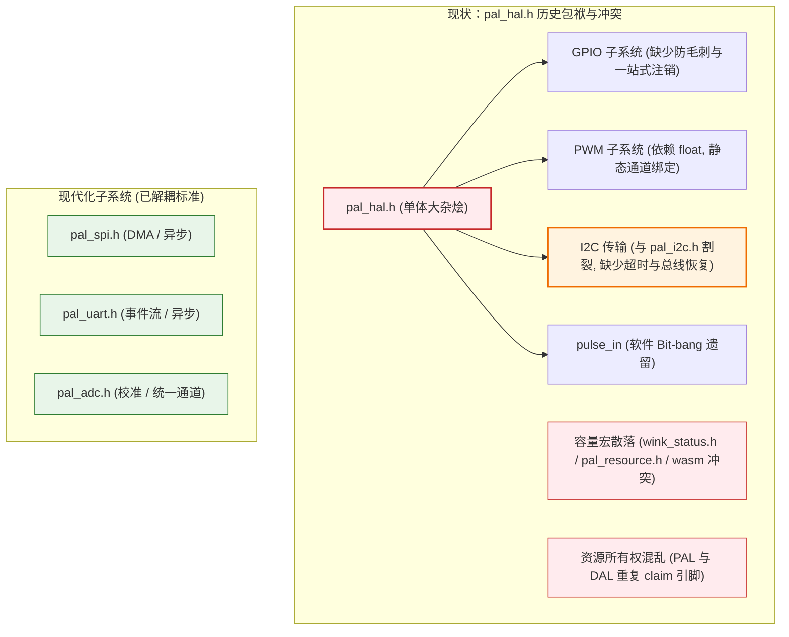
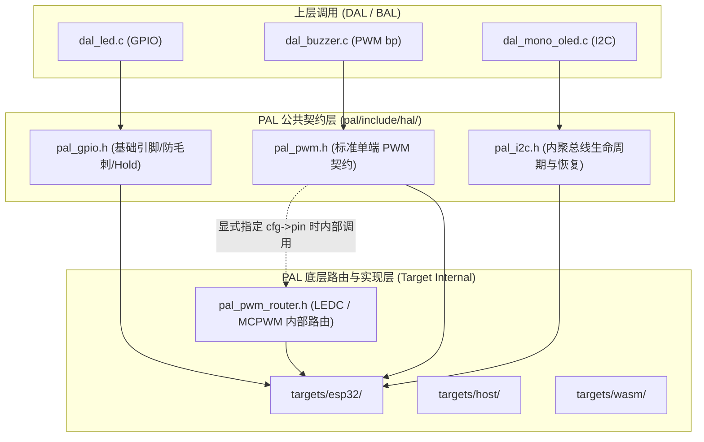
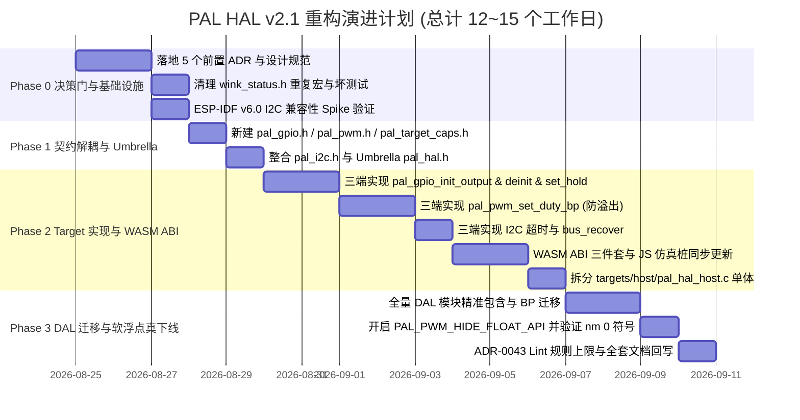

# 2026-08-24 WinkMicroOS PAL HAL 最佳实践演进与解耦重构计划 (v2.1)

| 项 | 内容 |
| :--- | :--- |
| **创建日期** | 2026-08-24 |
| **修订日期** | 2026-08-24 (v2.1 吸收全套架构评审与 4 项深度工程补充，达到 Production-Ready 状态) |
| **当前状态** | **Approved / Ready for Implementation (Phase 0 决策门就绪)** |
| **所属层级** | `wink-micro-os/pal/include/hal/` + `wink-micro-os/targets/{esp32,host,wasm}/` |
| **责任角色** | 嵌入式系统架构师 / 核心 PAL 维护组 |
| **评审文档** | [2026-08-24-pal-hal-refactor-plan-review.md](../../reviews/core/2026-08-24-pal-hal-refactor-plan-review.md) |
| **关联 ADR** | [ADR-0004 静态分发](../../decisions/core/0004-static-dispatch-vs-runtime-ops.md)、[ADR-0012 合约诚实](../../decisions/core/0012-contract-honesty-over-silent-degradation.md)、[ADR-0017 阻塞 API 隔离](../../decisions/core/0017-blocking-api-hard-isolation.md)、[ADR-0034 渐进式配置](../../decisions/core/0034-dal-progressive-config-disclosure.md)、[ADR-0041 HAL/OSAL 正交](../../decisions/core/0041-hal-osal-directory-orthogonality.md)、[ADR-0043 YAML 分层 lint](../../decisions/tools/0043-yaml-driven-layer-lint.md) |

---

## 0. 版本修订记录（Revision History）

| 版本 | 日期 | 修订说明 | 对应评审与补充项 |
| :--- | :--- | :--- | :--- |
| **v1.0** | 2026-08-24 | 初始草案（提出基础解耦思路、定点化与超时概念） | - |
| **v2.0** | 2026-08-24 | 架构评审后全面重构：<br>1. 纠正 `permille` 命名为 `bp`（Basis Points）；<br>2. 修复 PWM 整数溢出并增加四舍五入算法；<br>3. 建立 0 soft-fp 落地闭环（`PAL_PWM_HIDE_FLOAT_API` + nm 符号验证）；<br>4. 纠正 `WINK_BLOCKING` 属性冲突；<br>5. 补齐破坏性变更清单与 WASM ABI 联动契约；<br>6. 确立 PAL 硬件 RAII 资源所有权模型并引入 `pal_target_caps.h`；<br>7. 设立硬前置 **Phase 0 决策门**，工期调整为 12~15 天。 | 修复 A1~A8 全部硬伤<br>落地 B~G 架构建议 |
| **v2.1** | 2026-08-24 | 补充吸收 4 项深度工程盲区，消除落地暗礁：<br>1. 保留 `pal_gpio_pulse_in` 声明（带 deprecated 标记），避免 `dal_ultrasonic.c` 编译中断；<br>2. 明确 `pal_pwm.h` 与底层 `pal_pwm_router.h` 的清晰架构边界；<br>3. 制定 CMake Include 路径的两步式平滑迁移方案；<br>4. 补充引脚电平锁定控制接口 `pal_gpio_set_hold`。 | 彻底消灭编译阻断风险<br>完善芯片级低功耗毛刺防护 |

---

## 1. 架构背景与现状审计（Background & Problem Statement）

在 WinkMicroOS 演进中，`pal_hal.h` 承载了基础的 GPIO、PWM 与 I2C 抽象。经代码审计与架构评审，现行设计存在 8 项核心架构债务：



### 1.1 核心缺陷复盘清单

1. **命名与概念错误**：原计划将 `0..10000` 称作 `permille`（千分比），实应为 `basis points`（bp，万分比/基点）。
2. **PWM 高位计算溢出与精度截断**：ESP32-S3 等芯片在 20-bit 分辨率下（top = 1,048,575），`top * 10000` 超过 32 位无符号上限（4.29G），必须在 64 位宽下计算并做四舍五入。
3. **软浮点（soft-fp）清除不彻底**：若仅新增定点接口而保留公开的 `pal_pwm_set_duty(float)`，DAL（buzzer、servo、motor 等 7 处）持续调用仍会迫使链接器拉入 soft-fp 库（膨胀 2~4 KB Flash）。
4. **属性标记语义冲突**：`WINK_BLOCKING` 被定义为带弃用警告的宏（`WINK_DEPRECATED_MSG`），用于禁止协作式运行时中的阻塞操作。将其直接加于同步 I2C 接口会导致正常任务上下文编译报警。
5. **WASM ABI 联动断裂**：WASM 仿真层依赖 `wasm_bridge.h`、`exported_runtime_functions.json` 与 JS 仿真桩，新增/变更 C API 必须联动更新。
6. **资源所有权冲突（Double-Claim Bug）**：当前 PWM 在 PAL 内部 claim 引脚，而 GPIO 却在 DAL 侧 claim，导致双重 claim 冲突或遗漏保护。
7. **容量宏散落冲突**：全仓缺乏 `pal_target_caps.h`，`PAL_PWM_CHANNELS` 在 `wink_status.h`、`pal_hal.h`、`pal_resource.h` 中重复定义且与 WASM 16 通道冲突。
8. **I2C 总线锁死风险**：缺乏硬件级 SCL 9-Pulse 恢复机制（`pal_i2c_bus_recover`），从机死锁时单纯软件超时无法恢复总线。

---

## 2. 目标架构与设计规范（Target Architecture）

### 2.1 目录拓扑与头文件正交矩阵

```
wink-micro-os/pal/include/
├── pal.h                 # PAL 顶层聚合头 (更新内部包含)
├── pal_irq.h             # 中断与优先级定义 (含统一 pal_isr_t)
├── pal_spinlock.h        # 细粒度自旋锁
├── pal_resource.h        # 资源仲裁器
└── hal/
    ├── pal_target_caps.h # [新增 SSOT] 目标平台能力与容量定义 (由 target 注入)
    ├── pal_pin_types.h   # 引脚统一类型 (wink_pin_t, WINK_PIN_NC)
    ├── pal_gpio.h        # [新建] 高内聚 GPIO、防毛刺、引脚 Hold、一站式注销、SMP 屏障
    ├── pal_pwm.h         # [新建] 动态引脚、定点万分比 (bp)、防溢出 PWM
    ├── pal_pwm_router.h  # [已存在] 底层硬件通道动态路由分配层 (LEDC / MCPWM 路由)
    ├── pal_i2c.h         # [整合] Init、Deinit、Transfer(Timeout)、Recover、Scan
    ├── pal_spi.h         # [已存在] 工业级 SPI-DMA
    ├── pal_uart.h        # [已存在] 工业级 UART
    ├── pal_adc.h         # [已存在] ADC 子系统 (移除 hal/pal_hal.h 包含)
    └── pal_hal.h         # [Umbrella] 100% 向后兼容聚合头 (标记 deprecation 窗口)
```

### 2.2 子系统架构边界界定（Architecture Boundaries）



---

### 2.3 核心接口代码契约（C Specifications）

#### 1. `pal_target_caps.h`（SSOT 平台容量能力头）
```c
// SPDX-License-Identifier: Apache-2.0
#ifndef PAL_TARGET_CAPS_H
#define PAL_TARGET_CAPS_H

#include "wink_compiler.h"

/* 由各 target/CMakeLists.txt 映射底层能力，默认提供基线保护 */
#if defined(ESP_PLATFORM)
    #include "soc/soc_caps.h"
    #define PAL_PWM_CHANNEL_MAX     SOC_LEDC_CHANNEL_NUM
    #define PAL_I2C_PORT_MAX        SOC_I2C_NUM
    #define PAL_GPIO_PIN_MAX        SOC_GPIO_PIN_COUNT
    #define PAL_PWM_MAX_BITS        SOC_LEDC_TIMER_BIT_WIDTH
#elif defined(__wasm__)
    #define PAL_PWM_CHANNEL_MAX     8
    #define PAL_I2C_PORT_MAX        2
    #define PAL_GPIO_PIN_MAX        50
    #define PAL_PWM_MAX_BITS        16
#else /* host */
    #define PAL_PWM_CHANNEL_MAX     8
    #define PAL_I2C_PORT_MAX        2
    #define PAL_GPIO_PIN_MAX        50
    #define PAL_PWM_MAX_BITS        16
#endif

#endif /* PAL_TARGET_CAPS_H */
```

#### 2. `pal_gpio.h`（防毛刺、硬件锁定、一站式注销、SMP 屏障）
```c
// SPDX-License-Identifier: Apache-2.0
#ifndef PAL_GPIO_H
#define PAL_GPIO_H

#include <stdint.h>
#include <stdbool.h>
#include "wink_status.h"
#include "pal_irq.h"             /* 提供统一的 pal_isr_t 与 pal_irq_prio_t */
#include "hal/pal_pin_types.h"
#include "hal/pal_target_caps.h"
#include "wink_compiler.h"

#ifdef __cplusplus
extern "C" {
#endif

typedef enum {
    PAL_GPIO_INPUT               = 0,
    PAL_GPIO_INPUT_PULLUP        = 1,
    PAL_GPIO_INPUT_PULLDOWN      = 2,
    PAL_GPIO_OUTPUT_PUSH_PULL    = 3,
    PAL_GPIO_OUTPUT_OPEN_DRAIN   = 4,
    PAL_GPIO_INPUT_OUTPUT        = 5,
} pal_gpio_mode_t;

typedef enum {
    PAL_GPIO_INTR_DISABLE         = 0,
    PAL_GPIO_INTR_RISING_EDGE     = 1,
    PAL_GPIO_INTR_FALLING_EDGE    = 2,
    PAL_GPIO_INTR_ANY_EDGE        = 3,
    PAL_GPIO_INTR_LOW_LEVEL       = 4,
    PAL_GPIO_INTR_HIGH_LEVEL      = 5,
} pal_gpio_intr_t;

/* --- 生命周期与 I/O (Task Context) --- */

/**
 * @brief 基础 GPIO 初始化（默认保持高阻或安全电平）
 * @note Task-only. 内部自动执行 pal_resource_claim(PAL_RESOURCE_GPIO_PIN, pin, "pal_gpio")
 */
WINK_WARN_UNUSED_RESULT
wink_status_t pal_gpio_init(wink_pin_t pin, pal_gpio_mode_t mode);

/**
 * @brief 防毛刺原子初始化（配置方向前先在硬件寄存器预置输出电平）
 * @note Task-only. 安全关键外设（继电器/CS）建议配合外部硬件拉阻。
 */
WINK_WARN_UNUSED_RESULT
wink_status_t pal_gpio_init_output(wink_pin_t pin, pal_gpio_mode_t mode, bool initial_level);

/**
 * @brief 开启/关闭引脚芯片级电平锁定（在休眠、复位唤醒期间锁死引脚电平不产生抖动）
 * @note ESP32 映射至 gpio_hold_en/dis；Host/Wasm 仿真层返回 WINK_OK 或 WINK_ERR_UNSUPPORTED
 */
WINK_WARN_UNUSED_RESULT
wink_status_t pal_gpio_set_hold(wink_pin_t pin, bool hold_enable);

/**
 * @brief 一站式 GPIO 注销（自动完成: 禁中断 -> 同步等待 ISR -> 释放资源 -> 重置为高阻态）
 * @note Task-only.
 */
WINK_WARN_UNUSED_RESULT
wink_status_t pal_gpio_deinit(wink_pin_t pin);

/**
 * @brief 传统复位引脚接口（向后兼容，内部调用 pal_gpio_deinit）
 */
void pal_gpio_reset_pin(wink_pin_t pin);

WINK_WARN_UNUSED_RESULT
wink_status_t pal_gpio_set_direction(wink_pin_t pin, pal_gpio_mode_t mode);

/* --- 快速读写 (ISR-Safe) --- */

/** @note ISR-Safe. */
WINK_WARN_UNUSED_RESULT
wink_status_t pal_gpio_write(wink_pin_t pin, bool level);

/** @note ISR-Safe. */
WINK_WARN_UNUSED_RESULT
wink_status_t pal_gpio_read(wink_pin_t pin, bool *out_level);

/* --- 中断管理与多核安全屏障 --- */

/**
 * @brief 注册 GPIO 中断（统一使用 pal_isr_t 回调类型）
 */
WINK_WARN_UNUSED_RESULT
wink_status_t pal_gpio_enable_interrupt_ex(wink_pin_t pin,
                                            pal_gpio_intr_t intr_type,
                                            pal_irq_prio_t prio,
                                            pal_isr_t callback,
                                            void *arg);

static inline wink_status_t
pal_gpio_enable_interrupt(wink_pin_t pin, pal_gpio_intr_t intr_type,
                           pal_isr_t callback, void *arg)
{
    return pal_gpio_enable_interrupt_ex(pin, intr_type, PAL_IRQ_PRIO_NORMAL, callback, arg);
}

WINK_WARN_UNUSED_RESULT
wink_status_t pal_gpio_disable_interrupt(wink_pin_t pin);

/**
 * @brief 等待在途 ISR 执行完毕（SMP 多核屏障）
 */
WINK_WARN_UNUSED_RESULT
wink_status_t pal_gpio_synchronize_interrupt(wink_pin_t pin);

#ifndef WINK_STRICT_NONBLOCKING
/**
 * @brief 软件脉冲测量（过渡期保留，保障 dal_ultrasonic.c 零破坏编译）
 * @deprecated 计划在 Stage 0 完成 RMT/定时器捕获后彻底下线
 */
WINK_BLOCKING
WINK_WARN_UNUSED_RESULT
wink_status_t pal_gpio_pulse_in(wink_pin_t pin, bool level, uint32_t timeout_us, uint32_t *pulse_us);
#endif

#ifdef __cplusplus
}
#endif
#endif /* PAL_GPIO_H */
```

#### 3. `pal_pwm.h`（动态引脚、基点万分比、防溢出、浮点下线开关）
```c
// SPDX-License-Identifier: Apache-2.0
#ifndef PAL_PWM_H
#define PAL_PWM_H

#include <stdint.h>
#include <stdbool.h>
#include "wink_status.h"
#include "hal/pal_pin_types.h"
#include "hal/pal_target_caps.h"
#include "wink_compiler.h"

#ifdef __cplusplus
extern "C" {
#endif

typedef enum {
    PAL_PWM_CLOCK_AUTO            = 0,
    PAL_PWM_CLOCK_STABLE_REQUIRED = 1,
} pal_pwm_clock_requirement_t;

typedef struct {
    uint32_t                    struct_size;       /**< 结构体大小，防 ABI 漂移 */
    wink_pin_t                  pin;               /**< 绑定的硬件引脚 (WINK_PIN_NC 表示通道默认) */
    uint32_t                    freq_hz;           /**< PWM 频率 (Hz) */
    uint8_t                     resolution_bits;   /**< 0 = 自动根据频率计算最佳分辨率 */
    pal_pwm_clock_requirement_t clock_requirement; /**< 时钟源要求 */
} pal_pwm_config_t;

WINK_WARN_UNUSED_RESULT
wink_status_t pal_pwm_channel_pin(uint8_t channel, wink_pin_t *out_pin);

WINK_WARN_UNUSED_RESULT
wink_status_t pal_pwm_init(uint8_t channel, uint32_t frequency_hz);

WINK_WARN_UNUSED_RESULT
wink_status_t pal_pwm_init_ex(uint8_t channel, const pal_pwm_config_t *cfg);

/**
 * @brief 设置 PWM 占空比（万分比/基点 Basis Points: 0..10000 代表 0.00%..100.00%）
 * @note ISR-Safe. 采用 64 位中间乘积 + 四舍五入算法，绝对无 32 位溢出与浮点依赖。
 */
WINK_WARN_UNUSED_RESULT
wink_status_t pal_pwm_set_duty_bp(uint8_t channel, uint16_t basis_points);

#ifndef PAL_PWM_HIDE_FLOAT_API
/**
 * @brief 传统浮点占空比接口 (0.0f..1.0f)
 * @deprecated 计划在 v3.0 彻底移除，请迁移至 pal_pwm_set_duty_bp
 */
WINK_DEPRECATED_MSG("Use pal_pwm_set_duty_bp instead to eliminate soft-fp bloat")
WINK_WARN_UNUSED_RESULT
wink_status_t pal_pwm_set_duty(uint8_t channel, float duty);
#endif

WINK_WARN_UNUSED_RESULT
wink_status_t pal_pwm_set_freq(uint8_t channel, uint32_t freq_hz);

WINK_WARN_UNUSED_RESULT
wink_status_t pal_pwm_deinit(uint8_t channel);

#ifdef __cplusplus
}
#endif
#endif /* PAL_PWM_H */
```

#### 4. `pal_i2c.h`（统一内聚、超时支持、总线死锁恢复）
```c
// SPDX-License-Identifier: Apache-2.0
#ifndef PAL_I2C_H
#define PAL_I2C_H

#include <stdint.h>
#include <stddef.h>
#include <stdbool.h>
#include "wink_status.h"
#include "hal/pal_pin_types.h"
#include "hal/pal_target_caps.h"
#include "wink_compiler.h"

#ifdef __cplusplus
extern "C" {
#endif

#ifndef PAL_I2C_DEFAULT_TIMEOUT_MS
#define PAL_I2C_DEFAULT_TIMEOUT_MS 1000
#endif

WINK_WARN_UNUSED_RESULT
wink_status_t pal_i2c_port_pins(uint8_t port, wink_pin_t *out_sda, wink_pin_t *out_scl);

/**
 * @brief 初始化物理 I2C 主机总线
 * @note 参数由 uint8_t 规范升级为 wink_pin_t
 */
WINK_WARN_UNUSED_RESULT
wink_status_t pal_i2c_bus_init(uint8_t port, wink_pin_t sda, wink_pin_t scl, uint32_t hz);

WINK_WARN_UNUSED_RESULT
wink_status_t pal_i2c_bus_deinit(uint8_t port);

/**
 * @brief 执行 NXP 标准 SCL 9-Pulse + STOP 序列，恢复被从机拉死（SDA stuck low）的总线
 */
WINK_WARN_UNUSED_RESULT
wink_status_t pal_i2c_bus_recover(uint8_t port);

/**
 * @brief 带显式 Wall-Clock 超时的同步 I2C 传输（写 + 可选读）
 * @param[in] timeout_ms 超时毫秒数 (0 = 使用 PAL_I2C_DEFAULT_TIMEOUT_MS, UINT32_MAX = 无限等待)
 * @note Task-only. 若发生超时，内部将自动执行总线探测与恢复。
 */
WINK_WARN_UNUSED_RESULT
wink_status_t pal_i2c_transfer_timeout(uint8_t port, uint16_t dev_addr,
                                       const uint8_t *write_buf, uint32_t write_len,
                                       uint8_t *read_buf, uint32_t read_len,
                                       uint32_t timeout_ms);

/**
 * @brief 传统 I2C 传输（向后兼容默认超时 1000ms）
 */
static inline wink_status_t
pal_i2c_transfer(uint8_t port, uint16_t dev_addr,
                 const uint8_t *write_buf, uint32_t write_len,
                 uint8_t *read_buf, uint32_t read_len)
{
    return pal_i2c_transfer_timeout(port, dev_addr, write_buf, write_len,
                                    read_buf, read_len, PAL_I2C_DEFAULT_TIMEOUT_MS);
}

WINK_WARN_UNUSED_RESULT
wink_status_t pal_i2c_scan(uint8_t port, uint8_t start_addr, uint8_t end_addr,
                            uint8_t *out_found_bitmap, size_t bitmap_bytes);

#ifdef __cplusplus
}
#endif
#endif /* PAL_I2C_H */
```

#### 5. `pal_hal.h`（Umbrella 聚合头文件）
```c
// SPDX-License-Identifier: Apache-2.0
/**
 * @file pal_hal.h
 * @brief PAL HAL Umbrella Header (Aggregates GPIO, PWM, and I2C interfaces).
 *
 * @deprecated 新代码严禁直接包含此头文件，请包含专属头文件：
 *             - <hal/pal_gpio.h>
 *             - <hal/pal_pwm.h>
 *             - <hal/pal_i2c.h>
 *             此聚合头将在 v3.0 版本彻底废除。
 */

#ifndef PAL_HAL_H
#define PAL_HAL_H

#include "hal/pal_target_caps.h"
#include "hal/pal_pin_types.h"
#include "hal/pal_gpio.h"
#include "hal/pal_pwm.h"
#include "hal/pal_i2c.h"

#endif /* PAL_HAL_H */
```

---

## 3. 破坏性变更清单与平滑迁移策略（Breaking Changes & Migration）

### 3.1 破坏性变更矩阵（Breaking Change Matrix）

| 变更项 | 旧签名 / 行为 | 新签名 / 行为 | 影响范围 | 迁移方案 |
| :--- | :--- | :--- | :--- | :--- |
| **`pal_i2c_bus_init`** | `(..., uint8_t sda, uint8_t scl, ...)` | `(..., wink_pin_t sda, wink_pin_t scl, ...)` | EEPROM、OLED、Arduino Shim、测试用例 | 清理调用处对 `uint8_t` 的强转，直接传入 `wink_pin_t` |
| **`pal_gpio_reset_pin`** | `void pal_gpio_reset_pin(pin)` | 推荐 `wink_status_t pal_gpio_deinit(pin)` | 全量 DAL 注销逻辑 | 旧代码继续可用（返回 void wrapper），新代码改用 `pal_gpio_deinit` |
| **`pal_pwm_deinit`** | `void pal_pwm_deinit(channel)` | `wink_status_t pal_pwm_deinit(channel)` | DAL Buzzer / Servo | 增加返回值检查（契约诚实） |
| **`pal_i2c_bus_deinit`** | `void pal_i2c_bus_deinit(port)` | `wink_status_t pal_i2c_bus_deinit(port)` | DAL EEPROM / OLED | 增加返回值检查 |
| **资源所有权模型** | DAL 手动 `pal_resource_claim(GPIO_PIN)` | PAL 内部自动 claim 硬件引脚，DAL 禁 claim | 14 个 DAL 驱动 (~30 处) | 批量裁撤 DAL 冗余 claim，改为 PAL 独占 RAII |

### 3.2 CMake Include 路径的两步式平滑迁移策略

```
[Phase 1: 零破坏兼容阶段]
CMakeLists.txt 保持包含:
  - wink-micro-os/pal/include
  - wink-micro-os/pal/include/hal (保留，保障现有 51 处裸 include "pal_hal.h" 正常编译)

[Phase 3: 净化收敛阶段]
1. 执行 Python 脚本全仓正则替换:
   `#include "pal_hal.h"` -> `#include "hal/pal_gpio.h"` (按需替换为具体外设)
2. 从 CMakeLists.txt 移除 `wink-micro-os/pal/include/hal` 全局 -I
3. CI 上线 ADR-0043 Lint 规则，禁止出现任何裸 `#include "pal_*.h"`
```

---

## 4. 分阶段实施任务路线图（Phased Roadmap）



### 4.1 Phase 0：决策门与基础设施 SSOT（硬前置，先于代码合入）

- [ ] **T0.1 5 个核心 ADR 决议定稿与归档**：
  1. `ADR-0044`: Target Capabilities SSOT 头文件体系 (`pal_target_caps.h`)；
  2. `ADR-0045`: PAL 独占硬件生命周期的 RAII 资源所有权模型；
  3. `ADR-0046`: PWM Basis Points (bp) 定点规范与浮点接口下线时间表；
  4. `ADR-0047`: I2C 同步超时恢复与异步 DMA 演进路线；
  5. `ADR-0048`: 强制 `"hal/..."` 包含路径规范与 WASM 文件命名规范。
- [ ] **T0.2 仓库历史垃圾宏与坏测试清扫**：
  - 删除 `wink_status.h:128` 重复定义的 `PAL_PWM_CHANNELS`；
  - 修复 `test/unit/dal/test_dal_ws2812_sim.c:26` 错误的 `PAL_GPIO_OUTPUT` 为 `PAL_GPIO_OUTPUT_PUSH_PULL`。
- [ ] **T0.3 ESP-IDF v6.0 I2C 兼容性 Spike 预研**：
  - 在 IDF v6.0 编译环境下确认 `driver/i2c_master.h` 与 legacy 驱动现状，锁定条件编译门控。

### 4.2 Phase 1：契约拆分与向后兼容 Umbrella 层

- [ ] **T1.1 创建新头文件**：
  - 创建 `pal/include/hal/pal_target_caps.h`、`pal/include/hal/pal_gpio.h`、`pal/include/hal/pal_pwm.h`；
  - 重构 `pal/include/hal/pal_i2c.h`，归拢所有 I2C 接口；
  - 保留 `pal_gpio_pulse_in` 声明以保障 `dal_ultrasonic.c` 编译连续性。
- [ ] **T1.2 改造 `pal_hal.h` 为 Umbrella 头**：
  - 内部仅聚合子头文件，打上 `@deprecated` 警示；
  - 验证旧工程三平台零修改 100% 编译通过。

### 4.3 Phase 2：Target 实现加固与 WASM ABI 同步

- [ ] **T2.1 实现 GPIO 防毛刺、引脚 Hold 与一站式注销**：
  - ESP32：`pal_gpio_init_output` 先调用 `gpio_set_level` 写入 `out_w1ts/w1tc` 再 `gpio_config`；
  - ESP32：`pal_gpio_set_hold` 映射至 `gpio_hold_en/dis`；
  - `pal_gpio_deinit` 实现一站式清理。
- [ ] **T2.2 实现 PWM 万分比防溢出计算**：
  - 底层基于 `uint64_t` 实现 `(bp * top + 5000) / 10000` 四舍五入算法；
  - 支持 `cfg->pin` 动态引脚绑定（内部联动 `pal_pwm_router.h`）。
- [ ] **T2.3 实现 I2C 超时保护与 `pal_i2c_bus_recover`**：
  - 实现 NXP 标准 9 脉冲翻转总线恢复；
  - 替换 ESP32 硬编码 1000ms 为形参 `timeout_ms`。
- [ ] **T2.4 WASM ABI 联动与仿真桩更新**：
  - 更新 `targets/wasm/wasm_bridge.h`（新增 `js_pal_gpio_init_output`、`js_pal_gpio_set_hold`、`js_pal_pwm_set_duty_bp`、`js_pal_i2c_transfer_timeout`）；
  - 更新 `exported_runtime_functions.json`；
  - 更新 `wink_sim_js.js` 与 `wink_sim_stub.js`；
  - 重新校验 WASM ABI Hash。
- [ ] **T2.5 拆分 Host 单体实现**：
  - 将 `targets/host/pal_hal_host.c` 拆分为 `pal_hal_gpio_host.c`、`pal_hal_pwm_host.c`、`pal_hal_i2c_host.c`。

### 4.4 Phase 3：DAL 迁移、Lint 护栏与软浮点真下线

- [ ] **T3.1 全量 DAL 模块包含精准化与 RAII 资源清理**：
  - 14 个 DAL 驱动裁撤手动 `pal_resource_claim(GPIO_PIN)`；
  - 移除 DAL 对 `pal_hal.h` 的直接包含，精准包含 `hal/pal_gpio.h`、`hal/pal_pwm.h`、`hal/pal_i2c.h`；
  - 迁移 buzzer、servo、motor 等 7 处 float 调用至 `pal_pwm_set_duty_bp`。
- [ ] **T3.2 0 软浮点闭环验收**：
  - 开启 `PAL_PWM_HIDE_FLOAT_API`；
  - 执行 `arm-none-eabi-nm --size-sort build/firmware.elf | grep -E '__aeabi_[fd]|__gnu_f2'` 确认符号为 0；
  - 输出 `.map` 文件对比实际 Flash / RAM 削减量。
- [ ] **T3.3 CMake 路径净化、CI 分层 Lint 门控与文档回写**：
  - 从 CMake 移除 `pal/include/hal` 的全局 `-I`；
  - 设立 `pal_hal.h` 包含基线计数（PR 只许降不许升）；
  - 回写全套系统架构设计文档。

---

## 5. 验证矩阵与质量验收标准（Verification Plan）

| 测试项 | 验证手段 / 命令 | 验收成功标准 |
| :--- | :--- | :--- |
| **四路编译矩阵** | `idf.py build` (v5.4/v6.0)<br>`cmake --build build_host`<br>`emmake make` (Wasm) | 零 Warning、零编译报错、ABI 校验通过 |
| **PWM 万分比精度** | `test_pal_pwm_config.c` | 遍历 bits=1..20，bp=0, 1, 5000, 9999, 10000，量化误差 < 1 count，无 32 位溢出 |
| **0 软浮点验证** | `arm-none-eabi-nm build/firmware.elf \| grep -E '__aeabi_f\|__gnu_f2'` | 符号输出严格为空 |
| **I2C 死锁与恢复** | `test_i2c_timeout.c` (Host/Wasm 注入) | 模拟从机拉低 SDA，验证超时后自动触发 `bus_recover` 成功释放总线 |
| **头文件污染归零** | `arm-none-eabi-gcc -H -E dal_led.c 2>&1 \| grep -c pal_pwm` | 统计计数严格为 0 |
