# MCS-51 零代码仿真拦截层实施计划（frameworks/mcs51）

## 1. 元数据表

| 字段 | 内容 |
|------|------|
| **计划编号** | `PLAN-20260827-MCS51-SIM` |
| **创建日期** | 2026-08-27 |
| **目标平台/SoC** | `host`（GCC + MSVC）/ `wasm`（Emscripten）；ESP32 构建须零增量（不编入） |
| **工具链/SDK版本** | 宿主 GCC（MinGW/Clang）、MSVC（VS 2022+）、Emscripten（emsdk 最新 LTS）、CMake ≥ 3.16、Python 3.10+（wink-tools） |
| **计划状态** | 🏁 M0–M6 **轨 A 已验收**（2026-08-29）；M0 ✅ 治理+三 Spike；M1 ✅ blinky 三端；M2 ✅ 定时器+ISR+双时钟域；M3 ✅ UART+shim（12/12）；M4 ✅ ADC0832+数据面+Codegen（trap C-ABI/diff 边沿/Read-Latch vs Pin/通道 3 pull 轨/board-config codegen）；M5 ✅ CMS8S78xx 片内 ADC 真实寄存器图 + tier-b 原厂 adc.c 未修改收割；**M6 ✅ 轨 A：板级 codegen 缝接线 + iron_ntc NTC 闭环 e2e（冷/热/开路/短路四态）+ wasm CI job + ADR-0070/0071 Accepted + Layer-① 回写 + Layer-④ 评审；MSVC 18/18、MinGW 18/18、wasm/Node 7/7、lint 无 findings、ESP32 零增量**。**轨 B 延后**：thermal_heater_plate 插件连续热平衡（E-002 外部依赖）、夜间长跑、tier-c。 |
| **优先级** | 🔴 P0（8051 生态兼容主线） |
| **计划版本** | v1.8 |
| **关联技术设计** | [`../../tech-designs/mcs51/2026-08-27-mcs51-zero-code-simulation-and-proxy-design.md`](../../tech-designs/mcs51/2026-08-27-mcs51-zero-code-simulation-and-proxy-design.md)（总纲 SSOT）；[`...sfr-proxy-rmw-and-edge-detection-design.md`](../../tech-designs/mcs51/2026-08-27-mcs51-sfr-proxy-rmw-and-edge-detection-design.md)（数据面 SSOT）；[`...clock-domains-and-timing-consistency-design.md`](../../tech-designs/mcs51/2026-08-27-mcs51-clock-domains-and-timing-consistency-design.md)（时序面 SSOT）；[`...user-code-compatibility-and-limitations-guide.md`](../../tech-designs/mcs51/2026-08-27-mcs51-user-code-compatibility-and-limitations-guide.md)（用户手册） |
| **关联设计规范** | `docs/design/02-wink-micro-os/`（M0 建骨架，M6 回写填实）；`docs/design/03-app-codegen/`（codegen 小节） |
| **关联评审记录** | 前身审计：`docs/reviews/core/2026-07-28-8051-target-portability-feasibility-review.md`（结论已被本方案推翻重定性）；M6 产出终评 |
| **关联 ADR** | [ADR-0070](../../decisions/core/0070-mcs51-zero-code-simulation-interception-layer.md)（umbrella）、[ADR-0071](../../decisions/core/0071-sfr-proxy-rmw-edge-data-plane.md)、[ADR-0072](../../decisions/core/0072-dual-clock-domain-and-quota-catchup.md)；依赖 [ADR-0035](../../decisions/core/0035-arduino-compat-polymorphism-sandbox.md)、[ADR-0036](../../decisions/core/0036-cpp-subset-compilation-policy.md)、[ADR-0057](../../decisions/core/0057-pal-adc-subsystem-and-channel-3-analog-contract.md)、[ADR-0004](../../decisions/core/0004-static-dispatch-vs-runtime-ops.md) |
| **目标里程碑** | M0 治理+Spike → M1 blinky 三端 → M2 定时器/时钟 → M3 UART → M4 ADC0832/数据面 → M5 CMS8S → M6 电热闭环+验收 |
| **前置依赖计划** | 无（轴 A 真机加固已剥离为姊妹计划 `2026-08-27-axis-a-real-target-hardening-plan.md`，不阻塞本计划） |
| **计划负责人** | 嵌入式架构组 |
| **所需子代理技能** | `embedded-best-practice`、`subagent-driven-development`、`test-driven-development` |

---

## 2. 背景与目标

### 2.1 问题陈述

WinkMicroOS 需兼容海量经典 8051/Keil C51 教学与小家电工程（电熨斗、电水壶温控）。2026-07-28 的《8051 可移植性审计》按"wink 真机 port 到 8051"方向审计，结论为需 C90 大降级——方向错误。架构重评后定论（总方案 v2.1）：**wink 本体不跑 8051 真机**；8051 支持 = 新建 `frameworks/mcs51/` 仿真拦截层（与 `frameworks/arduino/` 同构，host/wasm 编译），用户 Keil C 源码零改动经 C++17 沙箱 + SFR 代理 + Fiber 协程在 UniSim 中高保真运行。设计文档（总方案 + 3 份 SSOT 规格书 + 用户手册）已收敛至可实施状态，本计划将其拆分为可执行里程碑。

### 2.2 技术/业务目标

- ✅ 用户经典 89C52 Keil 工程（blinky + Timer0 ISR + UART printf）**业务源码零改动**在 host（GCC+MSVC）与 wasm 三端编译运行（唯一自动变换：CMake 正则清洗 `interrupt N` → `WINK_ISR(N)`）。
- ✅ `while(1)` 裸机死循环不冻结仿真：Fiber 协程 + 配额强制切出 + Catch-Up 补账，虚拟时钟与宿主 1:1 守恒。
- ✅ 整端口 RMW / bit-bang 零虚假边沿（Zero False-Trigger），ADC0832 3 线 DIO 时序闭环、CMS8S 片内 ADC 0 周期穿透。
- ✅ 电热样例 iron_ntc 控温闭环在 host 注入测试与 wasm UniSim thermal 插件双端通过。
- ✅ ESP32 真机固件**零增量**：`frameworks/mcs51/` 在 `ESP_PLATFORM` 下不编入，CI 有 size 守卫。
- ✅ 不支持清单在 `WINK_SIM_STRICT` 下 assert、release 下降级 `pal_log_w` 告警。

### 2.3 成功指标（验收出口）

总方案 §8 七条验收标准与里程碑映射：

| # | 验收标准 | 达成里程碑 | 验证方法 |
|---|---|---|---|
| 1 | 经典 Keil 工程零改动三端编译 | M1（blinky 轮询）/ M3（+ISR+printf 完整） | ctest `-R mcs51` + emcc Node harness |
| 2 | `while(1)` 不冻结、无致命 WCET 告警 | M2 | wasm 长时运行 + 告警计数断言 |
| 3 | RMW 强隔离 + ADC0832 时序闭环 | M4 | `sfr_rmw_isolation_test` + 4 套 Zero False-Trigger 向量 |
| 4 | iron_ntc 控温闭环 + CMS8S 0 周期穿透 | M5（CMS8S）/ M6（iron_ntc） | host 注入 e2e + wasm thermal 插件 |
| 5 | ESP32 固件零增量 | M1（guard）/ M6（CI size 守卫） | esp32 docker 构建 map 无 mcs51 符号 |
| 6 | 轴 A `PAL_HAS_*` 门控 M0 链接 | 姊妹计划（轴 A） | 其自有计划门禁，M6 顺带验证 |
| 7 | STRICT assert / release 告警双态 | M3 首版 / M6 全量 | 双配置 ctest |

---

## 3. 变更范围与影响分析

### 3.1 文件变更清单（按里程碑）

| 文件路径 | 变更类型 | 里程碑 | 说明 |
|----------|----------|--------|------|
| `docs/decisions/core/0070~0072-*.md` | 🆕 | M0 | 3 份 ADR（umbrella + 数据面 + 时钟域） |
| `docs/tech-designs/mcs51/*.md` | 📦 迁移 | M0 | 4 份设计文档自 `docs/todolist/mcu-compat-mcs51/` 迁入 |
| `docs/design/02-wink-micro-os/07-mcs51-simulation-interception.md` | 🆕 骨架→✏️ 填实 | M0/M6 | Layer-① 回写 |
| `wink-micro-os/frameworks/mcs51/**` | 🆕 整树 | M1~M5 | CMakeLists、include/（REGX52.H、mcs51_proxy.hpp、mcs51_trap.h、mcs51_adc.h、wink_mcs51_isr.h、intrins.h、absacc.h、ADC0832.H、REG_CMS8S.H、mcs51_xsfr.hpp、cms8s_adc.h）、src/（runtime/sfr/timer/uart/isr/adc/adc0832/xdata/unsupported/bridge/cms8s_adc 全 .cpp） |
| `wink-micro-os/frameworks/CMakeLists.txt` | ✏️ | M1 | `add_subdirectory(mcs51)` |
| `wink-micro-os/targets/common/{include,src}/sim_ctx*` | ✏️ | M0 Spike-S1/M1 | 新增 yield API 或裁决复用 sleep 路径 |
| `wink-micro-os/test/mcs51/{samples,unit}/**` | 🆕 | M1~M6 | 样例 `.c`（samples/）+ 框架单测 `.cpp`（unit/） |
| `wink-micro-os/test/CMakeLists.txt` | ✏️ | M1 | `add_wink_mcs51_host_test()` helper + wasm harness 挂载 |
| `packages/wink-tools/tools/lint/packs/mcs51_isolation.py`（兄弟仓 wink-ai，commit 08aba9fa） | 🆕 | M1 ✅ | mcs51 沙箱隔离 pack（挂 layering 组、default-enabled）+ `tools/tests/test_lint_mcs51.py`。原拟改 `rules/layering.yaml`，实际按 arduino 先例落成独立 python 包 |
| `wink-tools/tools/codegen/generators/config_h.py`（兄弟仓） | ✅ M4 | M0 Spike/M4 | target 表加 `mcs51`（commit `22697fed`） |
| `wink-tools/tools/codegen/**`（mcs51_board_config.h 模板、device-tree 发射） | ✅ M4 | M4 | AD-10 Codegen 管道：`generators/mcs51_board_config.py` + `templates/mcs51_board_config.h.j2` + `boards/mcs51_devboard.json` + 6 测试；runtime device-tree 发射器零改动（S3 C1） |
| `wink-plugin-peripherals/builtin/thermal_heater_plate/**` | 🆕 | M6（M4 末启动） | 热学 UniSim 插件 |
| `wink-micro-app/iron_ntc/**` | 🆕 | M6 | 电熨斗样例应用 |
| `.github/workflows/pr.yml` | ✏️ | M6 | 新增 emcc/wasm job + mcs51 双矩阵 |

### 3.2 接口影响分析

| 接口层 | 破坏性变更 | 影响范围 | 备注 |
|--------|-----------|----------|------|
| PAL 公开 API | ❌ 否 | 无 | mcs51 是 framework 层，只消费 PAL（`js_pal_gpio_write`/`js_pal_adc_read_norm`） |
| DAL 层 | ❌ 否 | 无 | 不触碰 |
| 应用层 | ❌ 否 | 仅新增样例 | 用户 51 代码零改动 |
| 构建系统 | ⚠️ 新增 | `frameworks/`、test/CMakeLists、wasm 自动探测 | 仿 arduino 既有模式；ESP_PLATFORM guard |
| 工具链 | ⚠️ 跨仓 | wink-tools codegen/lint/CLI | mcs51 target 映射、板级 codegen、GBK 预处理 |
| 文档 | ⚠️ 新增+迁移 | ADR/tech-design/Layer-① | 五层文档归位 |

### 3.3 架构红线（违反即拒绝合入）

1. **零侵入**：用户 `.c` 源码不得为仿真改名/改逻辑；方言只由宏、代理、CMake 正则清洗承接。
2. **全量 .cpp 沙箱 + 4 大 extern "C" 边界**（AD-11）：`frameworks/mcs51/src/` 全 `.cpp`；仅 main 重映射、WINK_ISR、mcs51_trap.h C-ABI POD 表、wink_app_get_callbacks/mcs51_adc 注入四处 C 边界。
3. **Trap 四红线**（AD-13）：陷阱内零延时、禁止 yield、纯状态机、时钟解耦——违例重入即死锁/时钟撕裂。
4. **ESP32 零增量**：`ESP_PLATFORM` 下 mcs51 整树不编入；禁 `-fpermissive`；禁硬编码 `-finput-charset=GBK`。
5. **静态分发**（ADR-0004）：陷阱表为 POD 函数指针表，无虚表、无 container_of。
6. **RMW 读锁存器**（AD-12）：复合赋值严禁 Read-Pin，避免准双向口 FET 锁死。

### 3.4 系统资源与并发约束评估

| 资源/安全维度 | 预计变化/开销 | 风险与限制 | 缓解/应对策略 |
|--------------|--------------|-----------|--------------|
| RAM（仿真宿主） | SFR 影子 256B + 陷阱表 32×2 POD + XDATA 影子 64KB（absacc，可配） | 64KB XBYTE 影子在 wasm 线性内存可接受；尺寸策略 M3 定 | XDATA 影子尺寸做成 CMake 可配，默认 4~16KB |
| Fiber 栈 | 1 个用户 fiber（asyncify 栈预算） | wasm asyncify 栈现有 64KB 预算（`WINK_SIM_ASYNCIFY_MIN`），深度 51 嵌套需验证 | Spike-S1 验证；超限调预算 |
| 并发/ISR 安全 | 单线程协作式；ISR 由调度器在切出点派发 | Trap 重入、静态初始化顺序 fiasco | 三铁律：核心表 POD 零初始化 BSS、WinkSfr constexpr 构造常量初始化、中断派发执行期门控 `s_interrupts_enabled` |
| 宿主兼容性 | GCC/Clang/MSVC/emcc 四编译器 | `-x c++` GCC-only；MSVC 需 `LANGUAGE CXX`；警告标志链各异 | Spike-S2 退役；标志分编译器 |

---

## 4. 依赖与风险

### 4.1 前置依赖（M0 必须核实/退役）

| 依赖ID | 依赖内容 | 是否阻塞 | 验证状态 | 备注 |
|--------|----------|----------|----------|------|
| D-001 | Fiber 让出 API：`sim_ctx_yield()` 不存在；现有 `sim_ctx.h` 仅 create/switch/destroy，调度器有 `sim_scheduler_yield_timed()`；Arduino 走 `pal_os_sleep_ms()` 桥接（`frameworks/arduino/src/Common.cpp:149-170`） | ✅ M1 | ✅ Spike-S1 退役 | **不新增 API**；mcs51 层微步计费虚拟从时钟 + 配额切出，复用 `yield_timed(...,0)`+`sim_ctx_switch`。见 [`S1-yield-api.md`](../../tech-designs/mcs51/spikes/S1-yield-api.md) |
| D-002 | 三编译器方言链：sbit/`interrupt N` 清洗在 GCC/MSVC/emcc 最小编译 | ✅ M1 | ✅ Spike-S2 退役 | 清洗输出 `.cpp` 三端原生 C++17（弃 `-x c++`/`LANGUAGE CXX`）；C-ABI 边界 `extern "C"`；见 [`S2`](../../tech-designs/mcs51/spikes/S2-compiler-dialect-chain.md) |
| D-003 | wink-tools codegen 跨仓：`config_h.py` target 表无 mcs51；无 board_config 模板 | ✅ M4 | ✅ Spike-S3 退役 | **运行期 device-tree 发射器已存在且通用（零改动实证，裁决 C1）**；跨仓仅剩 3 件：config_h +1 行、新增 board JSON、新增 mcs51_board_config.h.j2。见 [`S3`](../../tech-designs/mcs51/spikes/S3-codegen-thermal-contract.md) |
| D-004 | thermal_heater_plate 热学插件不存在（无热学先例；UniSim 引擎在兄弟仓） | ✅ M6 | ✅ Spike-S3 契约锁定 | 落点 `builtin/thermal_heater_plate/1.0.0/`（对标 analog_knob，裁决 C5）；热参数只走运行期 properties（C4）；**可在本仓 wink-plugin-peripherals 先行开发，不阻塞 unisim 引擎改动** |
| D-005 | CI 无 emcc/wasm job（`pr.yml` 仅 host ubuntu+windows） | ✅ M6 | ⏳ | M6 新建 wasm job |

### 4.2 外部依赖

| 依赖ID | 内容 | 提供方 | 风险等级 | 备注 |
|--------|------|--------|----------|------|
| E-001 | mcs51 codegen 模板 + device-tree schema 合入 wink-tools | wink-tools 维护者 | 🟢 低（代码就绪） | M4 已落兄弟仓本地 master（commit `22697fed`：generator+模板+board JSON+config_h 一行，6/6 pytest）；runtime device-tree 发射器零改动（S3 C1）。推送/PR 评审走维护者流程 |
| E-002 | thermal 插件落点与热学积分契约（unisim 引擎侧） | UniSim 团队 | 🟠 高 | 排期最长，M4 末启动 |
| E-003 | 3 套真实工程（普中温控/流水灯、串口 Demo、中微 CMS8S 原厂例程） | 私有采集 | 🟢 低 | **不入库**（许可证），私有 fixture，仅提炼语法特性清单 |

### 4.3 风险登记册

| 风险ID | 风险描述 | 概率 | 影响 | 严重度 | 缓解措施 | 触发条件 |
|--------|----------|------|------|--------|----------|----------|
| R-001 | MSVC 下 C++ 沙箱编译断裂（`-x c++`/警告标志/正则 Pass 路径差异） | 🟢 低（S2 退役） | 🟠 中 | 2 | ✅ S2 三端实证通过：清洗输出 `.cpp` 弃用 `-x c++`/`LANGUAGE CXX`；C-ABI 边界 `extern "C"`（MSVC 曾抓出 LNK2019）；标志分编译器 | M1 编译失败 |
| R-002 | wasm asyncify fiber 栈溢出或让出不生效，界面冻结 | 🟢 低（S1 机制退役） | 🟠 中 | 6 | ✅ S1 host+wasm 双端实证：微步计费虚拟时钟 + 配额切出（`yield_timed(...,0)`+switch）字节一致；空 `while(1)` 由 WCET 8002 兜底。**仅余 asyncify 深嵌套栈预算留 M6 实测** | M6 wasm 深调用栈 |
| R-003 | thermal 插件排期延误拖垮 M6 | 🟢 低（S3 落点锁定） | 🟠 中 | 4 | ✅ S3 裁决 C5：插件落本仓 `wink-plugin-peripherals/builtin/thermal_heater_plate/`，**不依赖 unisim 引擎改动可先行开发**；iron_ntc host 注入测试亦不依赖插件 | M6 热模型积分联调 |
| R-004 | 静态初始化顺序 fiasco（多 TU 注册 ISR/SFR 顺序） | 🟢 低 | 🔴 高 | 3 | 三铁律（POD BSS / constexpr 常量初始化 / 执行期门控）；`test_static_init_safety` 3-TU 测试 | M2 随机崩溃 |
| R-005 | GBK 编码工程 `\` 吞码 / 字符串乱码 | 🟡 中 | 🟡 中 | 4 | wink-tools 构建前置无损探测转 UTF-8；故意 GBK fixture 测试 | 真实工程编译 |
| R-006 | 正则清洗误伤（函数指针/注释中的 `interrupt`） | 🟢 低（S2 主体退役） | 🟡 中 | 1 | ✅ S2 实测：非 void 参数/普通函数/注释单词均不误匹配；输出 build dir；不匹配 FATAL_ERROR。残留：注释内**完整模式文本** → M1 加注释预剥离 | M1 真实工程 |
| R-007 | wasm 新增导出符号（UART 控制台）破坏 ABI 哈希 | 🟢 低 | 🟡 中 | 2 | 同步 `tools/update_wasm_abi_hash.py` 与 wasm_parity lint | M3 |
| R-008 | absacc XDATA 影子尺寸/越界语义未定 | 🟢 低 | 🟢 低 | 1 | M3 PR 内定尺寸与越界策略（STRICT assert） | M3 |

### 4.4 跨模块协调点

| 协调点ID | 描述 | 涉及模块 | 时间 | 状态 |
|----------|------|----------|------|------|
| C-001 | mcs51 codegen + lint 规则合入兄弟仓 wink-tools | wink-tools | M4 前 | ✅ 本地 master 就绪（lint pack `08aba9fa`；mcs51 codegen `22697fed`，6/6 pytest），待维护者推送/评审 |
| C-002 | thermal 插件 device-tree 元件 schema 与 unisim 引脚仲裁契约 | UniSim / 插件 | M0 Spike-S3 草案，M4 末启动 | ⏳ |
| C-003 | CI wasm job（setup-emscripten + node） | DevOps | M6 | ⏳ |

---

## 5. 优先级路线图

### 5.1 执行顺序

```mermaid
graph TD
    M0[M0 治理 + 三 Spike<br/>S1 yield / S2 三编译器 / S3 codegen+thermal契约]
    M1[M1 骨架+Fiber+语法基线<br/>blinky 三端]
    M2[M2 定时器+ISR+双时钟域]
    M3[M3 UART+shim<br/>可与 M2 并行]
    CG[codegen 正式实现<br/>跨仓 wink-tools]
    M4[M4 ADC0832+数据面+trap]
    M5[M5 CMS8S 片内 ADC]
    TH[thermal 插件<br/>M4 末并行启动]
    M6[M6 iron_ntc 闭环+CI 双矩阵+验收+回写]

    M0 --> M1
    M0 --> CG
    M1 --> M2
    M1 --> M3
    M1 --> M4
    M2 --> M4
    CG --> M4
    M4 --> M5
    M4 --> TH
    M5 --> M6
    TH --> M6
    M3 --> M6
```



关键路径：**M0 → M1 → M2 → M4 → M6**（M3 仅依赖 M1 可并行；M5 仅依赖 M4 trap C-ABI；thermal 插件 M4 末并行）。

> **编排调整**：虚拟 µs 时钟 / 配额 / Catch-Up 补账原属 P3.5 时序面，**提前并入 M2**——定时器模型无法在无虚拟时钟下落地，M4 只消费时钟 API。

### 5.2 里程碑总表

| 里程碑 | 对应原路线图 | 工时 | 累计 |
|--------|-------------|------|------|
| M0 治理 + 三 Spike | 新增前置 | 3-4 天 | 3-4 |
| M1 骨架 + Fiber + 语法基线 | P1 | 4-5 天 | ~8 |
| M2 定时器 + ISR + 双时钟域 | P2（含时序面核心） | 3 天 | ~11 |
| M3 UART + shim | P3 | 2 天 | ~13（可并行） |
| M4 ADC0832 + 数据面 + Codegen | P3.5 | 3-4 天 | ~16 |
| M5 CMS8S 片内 ADC | P3.6 | 2-3 天 | ~19 |
| M6 电热闭环 + CI + 验收 | P4 | 3-4 天（thermal 插件前置 0.5-1 周并行） | ~22 |

轨道 1 合计与总方案 §6 工时估算（~3.5 周 / 16~19 开发天）一致，M0 为新增治理开销。

### 5.3 测试命名裁决（消解 .c/.cpp 不一致）

- **用户样例 `.c`**（`-x c++` 编译，证明零侵入）→ `wink-micro-os/test/mcs51/samples/`：`blinky.c`、`uart_printf.c`、`gpio_in_out.c`、`cms8s_adc_test.c`、`sfr_rmw_isolation_test.c`、`iron_ntc.c`。
- **框架内部单测 `.cpp`** → `wink-micro-os/test/mcs51/unit/`：`test_sfr_rmw_latch_integrity.cpp`、`test_sfr_edge_dispatch_accuracy.cpp`、`test_sfr_operators_coverage.cpp`、`test_adc0832_dio_shared.cpp`、`test_unisim_clock_mapping.cpp`、`test_static_init_safety.cpp`。

---

## 6. 详细任务拆分与进度追踪

> 统一 DoD：代码符合 `.claude/rules/c-code.md`；新增逻辑有测试；host ctest 全绿；wasm harness 全绿；ESP32 构建零增量；`wink lint arch` 过；文档同步。

### 6.0 Spike 结论规范（M0-2/M0-3/M0-4 交付物格式）

每个 Spike 必须产出独立结论报告，落 `docs/tech-designs/mcs51/spikes/S<n>-<slug>.md`（M0 结束评审后随相关 SSOT 转正引用或归档，不允许结论只留在对话/问题日志里）。报告必须含：

1. **问题与裁决**：候选方案对比表 → 选定结论一句话。
2. **证据**：最小验证程序路径 + 三端（host GCC/MSVC/wasm）实际运行输出摘录。
3. **可复用产物**：M1+ 直接消费的成品——S1 为 yield API 签名/调用片段；S2 为分编译器参数表 + CMake 清洗 Pass 片段；S3 为 codegen target 补丁 diff + device-tree/thermal schema 草案。
4. **回写点**：结论影响计划哪些任务行（列任务 ID），并在对应任务 checkbox 旁标注"依 S<n>"。

| Spike | 报告文件 | 主要消费里程碑 |
|---|---|---|
| S1 Fiber 让出 API | `spikes/S1-yield-api.md` | M1 runtime、M2 时钟/补账 |
| S2 三编译器方言链 | `spikes/S2-compiler-dialect-chain.md` | M1 CMake/REGX52.H |
| S3 codegen 跨仓 + thermal 契约 | `spikes/S3-codegen-thermal-contract.md` | M4 codegen、M6 thermal/CI |

---

### M0：治理归位 + 三 Spike `[ 状态: ✅ M0-1 治理（f7ddb0f/35f7c84/b87d3b2）；M0-2 S1 ✅；M0-3 S2 ✅ 三端实证；M0-4 S3 ✅ codegen 契约实证 → 三 Spike 全部出结论。余：私有 fixture 采集随 M3/E-003（仓外提供，不入库） ]`

**目标**：决策转正、文档归位、三大技术风险退役，才准进 M1。
**DoD**：3 份 ADR 落盘（Proposed）；5 份设计文档迁入 `docs/tech-designs/mcs51/` 且链接全通；3 个 Spike 各出结论报告（按 §6.0 Spike 结论规范，落 `docs/tech-designs/mcs51/spikes/`）；Layer-① 骨架就位；轴 A 姊妹计划建档。

#### Task M0-1：ADR 转正与文档归档 ✅

- [x] 新建 [ADR-0070](../../decisions/core/0070-mcs51-zero-code-simulation-interception-layer.md)（umbrella）：双轴模型、沙箱定性、4 大 extern "C" 边界、芯片范围分阶段（AD-3）、CI 门禁（AD-6）、ADC0832 首发 YAGNI（AD-7）、Codegen SSOT（AD-10）、全量 .cpp（AD-11）、3 线 DIO（AD-15）；含 **AD-1~18 → ADR 追溯表**；"非目标"声明轴 A 剥离。
- [x] 新建 [ADR-0071](../../decisions/core/0071-sfr-proxy-rmw-edge-data-plane.md)：WinkSfr/BitProxy 代理、diff 边沿分发、Read-Latch vs Read-Pin、线性引脚映射（AD-12/16/18）。
- [x] 新建 [ADR-0072](../../decisions/core/0072-dual-clock-domain-and-quota-catchup.md)：主从时钟 1:1、配额守恒、Catch-Up 补账、即时外设 0µs（AD-14/17）。
- [x] `git mv` 5 份文档（4 份 tech-design + `mcu-compat-plan.md` 总方案作 ADR-0070 背景材料）`docs/todolist/mcu-compat-mcs51/` → `docs/tech-designs/mcs51/`。
- [x] 修 2 处损坏链接：总纲 §3.4、数据面 §4.4 的 `../../../docs/design/04-wasm-simulation/...` 按迁移后新位置重算。
- [x] 迁移后全量检查文档间相对链接 + ADR 引用（0 死链）。
- [x] `docs/todolist/mcu-compat-mcs51/` 已清空移除。
- [x] Layer-① 骨架：[`docs/design/02-wink-micro-os/07-mcs51-simulation-interception.md`](../../design/02-wink-micro-os/07-mcs51-simulation-interception.md)（占位，M6 填实）。
- [x] 新建轴 A 姊妹计划骨架 [`2026-08-27-axis-a-real-target-hardening-plan.md`](2026-08-27-axis-a-real-target-hardening-plan.md)（caps 自注入、PAL_HAS_*、pal_atomic 三档、静态 ringbuf；引 ADR-0064），注明独立排期。
- [x] 修 `.claude/rules/docs-adr.md` 路径描述与仓库现实对齐，并补 todolist 草稿开工前必须迁位的明文规则。

**验证**：`python docs/decisions/scripts/list_adrs.py` 见 0070~0072（Proposed）；grep 全仓无 mcs51 死链。

#### Task M0-2：Spike-S1 — Fiber 让出 API（最高风险）✅

- [x] 在 `wink-micro-os/targets/common/` 做概念验证：
  - 方案 A：新增 `sim_ctx_yield()` —— ❌ 不必要。
  - 方案 B：mcs51 层复用 `pal_os_sleep_ms(0)` —— ⚠️ 机制对但语义绑主时钟；**裁决方案 C**：mcs51 自维护虚拟从时钟 + 拦截点微步计费 + 配额切出（复用 `sim_scheduler_yield_timed(...,0)`/`sim_ctx_switch`，**不新增调度器 API**）。
- [x] host（Win32 fiber, gcc）+ wasm（emscripten fiber + asyncify, node）双端验证：紧凑忙等 `while(!TF0)` fiber 不冻结主调度（9999 迭代 / 100 次配额切出 / TF0 恰在 50000µs 置位 / 5 tick 1:1 守恒，双端输出逐字节一致）。
- [x] 裁决配额阈值：`QUOTA_US=500`（虚拟时间片，5% tick）与墙钟 `WCET=5000`（事后兜底）**正交**；关键约束——虚拟时间必须 fiber 内微步计费推进（鸡生蛋，见报告 §3.1）。
- [x] 产出结论报告 [`S1-yield-api.md`](../../tech-designs/mcs51/spikes/S1-yield-api.md)（PoC 资产 `spikes/assets/s1/`）。

**验证**：PoC 双端 PASS（复现命令见报告 §2）。

#### Task M0-3：Spike-S2 — 三编译器方言链 ✅

- [x] 最小工程验证：未改 Keil 源（`sbit LED=P1^0;` + `code` 表 + `void Timer0_ISR(void) interrupt 1 using 1` + RMW）正则清洗后在 ① GCC g++14.2 ② MSVC cl 14.40（/std:c++17）③ emcc 4.0.5+node 三端编译链接运行，输出一致 PASS（WINK_ISR 自注册 + C 链接 + sbit 翻转）。
- [x] 参数链裁决（详见报告 §3）：**清洗 Pass 输出 `.cpp` 副本，三端原生 C++17——放弃 `-x c++`/`LANGUAGE CXX` 双轨**；GCC/emcc `-std=c++17 -Wno-write-strings`（**不加** `-Wno-pointer-sign`，C++ 无效）；MSVC `/std:c++17 /utf-8`；确认**不引入 `-fpermissive`**（三端均不需要）。
- [x] 正则清洗 Pass：`s2_cleanup.py` 严格匹配 `void <name>([void]?) interrupt <n> [using b]`，输出 build dir `.cpp`（严禁原地改源）；实测不误伤非 void 参数/普通函数/注释单词；残留：注释内完整模式文本 → M1 加注释预剥离。
- [x] MSVC 抓出真缺陷：SFR 影子跨 TU 须 `extern "C"`（C/C++ 链接不匹配 LNK2019）；`WinkSfr::operator^` 参数用 `int` 消 `P1^0` 重载歧义。
- [x] GBK 探针：编码探测→转 UTF-8 归 wink-tools build pre-step（清洗之前），编译器只面对 UTF-8；真实 GBK 工程回归随 S3 fixture。
- [x] 产出结论报告 [`S2-compiler-dialect-chain.md`](../../tech-designs/mcs51/spikes/S2-compiler-dialect-chain.md)（参数表 + CMake 片段 + PoC 资产 `spikes/assets/s2/`）。

#### Task M0-4：Spike-S3 — codegen 跨仓与 thermal 契约

- [x] **裁决 C3**：`config_h.py` target 表仅需 +1 行 `"mcs51": "WINK_TARGET_MCS51_SIM"`（草案 diff 见 S3 报告 §3）。**未在兄弟仓工作树应用**——跨仓改动属 M4 外部 PR（E-001/C-001），本仓只出草案。
- [x] `mcs51_board_config.h` 模板草案（`assets/s3/mcs51_board_config.h.j2.draft`）+ device-tree mcs51/adc0832 schema 实证（`assets/s3/boards/mcs51_devboard.json` 引脚扁平化 0~31，`s3_codegen_probe.py` 跑通，**发射器零改动**）。cms8s 片内 ADC 无外部引脚，走固件期常量（裁决 C6）。
- [x] thermal 插件落点裁决 C5：`wink-plugin-peripherals/builtin/thermal_heater_plate/1.0.0/`（对标 analog_knob）；热动力学参数只走运行期 device-tree.properties 不进固件（C4）；adc0832 + heater manifest schema 草案见报告 §3。
- [ ] 3 套真实工程采集（私有 fixture，不入库）——**延后至用户仓外提供路径**（裁决 C7 / E-003）；语法特性清单暂沿用 S2 已实证集 + SSOT，真实 GBK 转码无损回归门禁到 fixture 可用。
- [x] 产出结论报告 `docs/tech-designs/mcs51/spikes/S3-codegen-thermal-contract.md`（按 §6.0 四段规范：问题裁决 C1~C7 / 发射器零改动实证 / 可复用产物 / 回写点）。

---

### M1：骨架 + Fiber + 语法基线 `[ 状态: ✅ blinky 三端 ctest 全绿（MinGW GCC / MSVC / emcc+Node）；ESP32 零增量双重保证；layering+api lint 无 findings ]`

**目标**：空目录 → blinky（轮询版）三端编译运行。
**DoD**：`test/mcs51/samples/blinky.c` 在 host GCC、MSVC、wasm 三端通过；ESP32 构建 map 无 mcs51 符号；layering lint 过。
**完成证据**：`ctest -R mcs51` 在 `build_host`(MSVC) 与 `build_mingw`(GCC) 各 2/2 通过（`test_mcs51_blinky_host` + `wasm_mcs51_test`），输出 `[mcs51-wasm] PASS: blinky ran 200 ticks under emscripten fiber, ISR vector1 registered, P1=0x55`。ESP32 零增量：①`esp32_firmware/CMakeLists.txt` EXTRA_COMPONENT_DIRS 仅注册 `targets/esp32`+`frameworks/arduino`，不含 mcs51；②`frameworks/mcs51/CMakeLists.txt` 在 `add_library` 前对 ESP_PLATFORM `return()`。lint：`wink lint --pack layering --pack api` → No findings。
**关键实现裁决（与原任务行的偏差）**：
- 清洗 Pass 未做成 `wink_mcs51_user_app` CMake 目标，而是在 `test/CMakeLists.txt` 内以 `add_custom_command`（python mcs51_cleanup.py → build dir `.cpp`）挂载；wasm harness 同理（`test/mcs51/wasm/add_wink_wasm_mcs51_test.cmake`，仿 `test/wasm/pal_adc/`）。
- SFR 代理落点为 `src/mcs51_proxy.cpp`（非 mcs51_sfr.cpp）；运行时桥接落点为 `src/mcs51_bridge.cpp`（非 mcs51_runtime.cpp）。
- wasm 链接排除 `pal_wasm_ch*.c`（拖入整套 js_ 数据面 + BAL 事件），degradation 引用的 6 个 `pal_wasm_ch*_reset` 由 `test/mcs51/wasm/mcs51_wasm_link_stubs.c` no-op 桩闭合（仿 adc_wasm_link_stubs.c）；js_ 导入用 ESM 安全的 `mcs51_wasm_node_stub.js`（fiber 路径不触达 js_，s_main_ctx≠NULL）。
- host 必须 per-target `SIMULATION=1`（wasm 全局定义、host 否；否则 wink_runtime.c 走直接调用路径，super-loop 永不返回 → 冻结）。
- `wink_app_get_callbacks` 为**强符号** extern "C"（MinGW/PE 下无强兜底的 weak 定义解析为 null）。
**开工前必读**（任务行只给落点，语义以下列章节为准）：
- 总纲 SSOT：§2 目录结构与 CMake 流水线、§3.1 边界① main 重映射与包含时序、§3.2 边界② WINK_ISR、§7 Fiber 让出
- 数据面 SSOT：§3.1 实体声明/内存布局、§5.2 ODR 防护（inline vs static 降级）、§5.3 `#define sbit` 语法边界
- 总方案背景：§3.1 目录结构、§3.2 方言宏映射与包含时序纪律、§3.9 CMake 编译器定向
- 用户手册：§2.1 绝对位地址封禁、§5.1 头文件乱序自动吸收
- Spike 输入：S1 结论（让出 API 形态）、S2 结论（参数表 + 清洗 Pass 片段）

- [x] `frameworks/mcs51/CMakeLists.txt`：仿 `frameworks/arduino/CMakeLists.txt`；`ESP_PLATFORM` 显式 `return()` guard；host/wasm 建 `wink_mcs51_compat` 静态库（EXCLUDE_FROM_ALL）；分编译器标志链（MSVC `/std:c++17 /utf-8`；GCC/emcc `-std=c++17 -fno-exceptions -fno-rtti`；无 -fpermissive）。清洗 Pass 落在 test/CMakeLists.txt 的 add_custom_command（非独立 user_app target）。
- [x] `frameworks/CMakeLists.txt` 加 `add_subdirectory(mcs51)`（EXCLUDE_FROM_ALL + ESP_PLATFORM 自跳过）。〔顶层 CMake wasm 段 `#include <REGX52.H>` 自动探测延后到 M4 接 codegen/真实 app 时做；M1 由 test harness 直接挂库〕
- [x] `include/REGX52.H`（+ `REG52.H` 别名；`reg52.h` 小写副本待 Linux CI 阶段补，Windows 大小写不敏感冲突）：标准头预引入、方言宏（interrupt/using/reentrant/_at_/data/idata/xdata/pdata/code/bit）、sfr/sbit（C++17 `inline WinkSfr/WinkSbit`）、`#define main wink_mcs51_user_main` + extern "C" 前向声明（边界①）。
- [x] `include/mcs51_proxy.hpp` + `src/mcs51_proxy.cpp`（落点名非 mcs51_sfr.cpp）：`wink_mcs51_sfr_shadow[256]`、`WinkSfr`/`WinkSbit` 赋值/取值/`^`/RMW（`|=`,`&=`,`^=`）；sbit 双构造（命名 SFR 位 / 绝对位地址）；边沿 diff 与 on_read 重构留 M4。
- [x] `include/wink_mcs51_isr.h` + `src/mcs51_isr.cpp`：`WINK_ISR(n)` 匿名命名空间静态结构自动注册（边界②，非 `__attribute__((constructor))`，MSVC 对等）；M1 仅注册/查表，M2 接周期派发。
- [x] `src/mcs51_bridge.cpp`（落点名非 mcs51_runtime.cpp）：强符号 extern "C" `wink_app_get_callbacks()`（边界④），loop=用户 super-loop；runtime 自身在 SIMULATION 下把 loop 包成 fiber；微步每 64 次 `pal_os_sleep_ms(0)` 协作让出（Spike-S1 范式）。
- [x] `include/intrins.h` 最小版：`_nop_()` → `wink_mcs51_microstep()`（配额计数 + 周期让出）。
- [x] `test/mcs51/samples/blinky.c`（未改动 Keil：sbit LED=P1^0、code seg_table、Timer0 ISR 注册、while(1) 轮询 P1）。
- [x] `test/CMakeLists.txt` mcs51 host 块（链 `wink_mcs51_compat` + per-target `SIMULATION=1` + CXX 标志）；wasm 侧 `test/mcs51/wasm/add_wink_wasm_mcs51_test.cmake` emcc+ASYNCIFY+Node harness（仿 pal_adc，emcc/node 缺失优雅跳过）+ `mcs51_wasm_link_stubs.c`/`mcs51_wasm_node_stub.js`。
- [x] mcs51 隔离 lint 规则 —— 已直接落地跨仓 wink-ai `packages/wink-tools`（commit 08aba9fa）：新 pack `tools/lint/packs/mcs51_isolation.py`（alias `mcs51`，挂 `layering` 组且 default-enabled，镜像 legacy_arduino 包），扫内核目录 pal/dal/bal/runtime/trace/targets/osal 的 .c/.h/.cpp/.hpp，禁 REGX52.H 包含 / `wink_mcs51_*` 符号 / `WinkSfr|WinkSbit` 类型 / `WINK_ISR|WINK_MCS51_*` 宏；附 `tools/tests/test_lint_mcs51.py`（5 用例）。真阳性 4 条、内核零误报实测。余跨仓项（config_h.py target、board 模板）仍归 E-001 批次。
- [ ] 真实工程 #1（普中）—— 阻塞于私有 fixture 仓外提供（E-003，随 M3）；不入库。

**验证命令**：
```bash
cmake -B build_host -S wink-micro-os -G Ninja -DTARGET_PLATFORM=host
cmake --build build_host
ctest --test-dir build_host --output-on-failure -R "mcs51|blinky"
# wasm：emcc + Node harness（仿 test/wasm/run_gpio_semantics_emcc.ps1）
python wink.py lint arch --pack layering --pack api   # mcs51 规则
# 零增量：esp32 docker 构建，map 文件 grep 无 mcs51 符号
```

---

### M2：定时器 + ISR + 双时钟域 `[ 状态: ✅ 2026-08-28 ]`

**目标**：Timer0/1 溢出驱动 ISR；虚拟 µs 从时钟 1:1 映射 + 配额切出 + Catch-Up。
**DoD**：blinky Timer0 ISR 版波形周期断言通过；`test_unisim_clock_mapping`、`test_static_init_safety` 过；`while(1)` wasm 不冻结无致命告警（验收 #2）。
**开工前必读**：
- 时序面 SSOT：§2.1 时间主从分工、§2.2 1:1 步进契约与配额算法、§2.3 Catch-Up 补账规则、§4.2 静态初始化三铁律、§6.2/§6.3 两个测试规格
- 总纲 SSOT：§3.2 边界② WINK_ISR 跨平台注册派发、§5.2 Trap 四红线（定时器步进属调度器侧，不在 trap 内）
- [ADR-0072](../../decisions/core/0072-dual-clock-domain-and-quota-catchup.md) 全文（D1~D6 即本里程碑验收口径）
- Spike 输入：S1 结论（让出 API + 配额阈值裁决）

- [x] `src/mcs51_isr.cpp`（M1 建表，M2 扩展）：向量分发表 + WINK_ISR 静态注册运行时；执行期门控 `s_interrupts_enabled`（framework init 时开启）；`wink_mcs51_dispatch_vector()` 返回派发成功位 + 每向量派发计数；ISR 内 `s_in_isr` 标记（充电不让出，Trap 红线 2）。
- [x] `src/mcs51_timer.cpp`：Timer0/1 模式（模式 0/1/2；模式 3 / 外部 C/T 不建模，定时器静默）、TH/TL 初值重装、溢出时刻预算（功能级，AD-2 不模拟 12-T；12MHz 教学约定 1 count = 1µs）；TCON read-hook 懒求值（`while(!TF0)` 闭环）；溢出时 EA+ETx 门控派发并硬件清 TFx；模式 2 自动重装、模式 1/0 按溢出精确时刻 rebase（无漂移）；ISR 清 TRx 停表被尊重；单步溢出上限保护。
- [x] 虚拟 µs 从时钟（`src/mcs51_clock.cpp` + `include/wink_mcs51_clock.h`）：s_virtual_us 从时钟只在 fiber 内拦截点充电（S1 §3.1 鸡生蛋约束）；1ms:1ms 硬映射（AD-14）经 `pal_os_busy_wait_us()` 向主时钟计费（host: s_time_us；wasm: JS 虚拟时钟桥）；即时外设 0µs；配额耗尽 duration-0 协作让出（`pal_os_sleep_ms(0)`，Arduino yield() 同款）+ 恢复点 **Catch-Up 补账**（AD-17）驱动定时器步进；WCET 8002 仍是事后兜底。
- [x] `src/mcs51_bridge.cpp` 接入：init 回调 `mcs51_framework_init()`（clock/timer reset、catch-up hook 绑定 `wink_mcs51_timers_step_to`、开中断门）；SFR 读/写 hook 分流（读先懒求值再 microstep，写先 latch 再 microstep）；`wink_mcs51_microstep()` 定义在本 TU（边界④，`<intrins.h>_nop_()` 拦截点）。
- [x] 测试（三端 ctest 全绿，MSVC / MinGW GCC / emcc+Node）：
  - `test_mcs51_timer0_host` + `wasm_mcs51_timer0_test`：未改 Keil 样例 `samples/blinky_timer0.c`（Timer0 模式 1，50ms 中断翻转 P1.0）cleanup 后三端运行；200 tick（2000ms）预算下 ISR 向量 1 派发 39 次（期望 40±2，首溢出被初始化 microstep 平移）、quota yields=200、virt=2,000,000µs（1:1 守恒）、紧 `while(1){_nop_();}` 不冻结无 WCET 致命告警。
  - `test_mcs51_clock_mapping`（`unit/test_unisim_clock_mapping.cpp` + `unit/mcs51_clock_user.cpp`）：fiber 内 `wink_mcs51_delay_ms(100)` → 从时钟 100,000µs / 主时钟 100,000µs（= 10 个 10ms tick，SSOT §6.2），200 tick 后从时钟 2,000,000µs、yields=200（补账守恒）。
  - `test_mcs51_static_init`（`unit/test_static_init_safety.cpp` + 3 个 TU `mcs51_static_tu_a/b/c.cpp`）：三 TU 静态构造期 WINK_ISR 注册向量 2/3/5 并读 P1/P2/P3——POD BSS 表 + constexpr WinkSfr + 执行期门控三铁律验证（门开前后派发行为、runtime 健康）。

**实现偏差（已回写 ADR-0072，2026-08-28 转 Accepted 并回写 Layer-①：`02-virtual-clock.md` §6 / `03-scheduler-and-concurrency.md` §3.2）**：
1. **配额片 = 10,000µs（一个主 tick）而非 S1 PoC 提议的 500µs**。生产 runtime `pal_sim_scheduler_run` 把每次主任务 fiber 派发计为一个 tick（非 10ms 时间边界计数，PoC 用的是自定义主循环）；配额片对齐 tick 才能保持「delay_ms(100) = 10 ticks」与 1:1 计费守恒，否则每次让出向主时钟计费 10ms 而从时钟只走 500µs，守恒破裂。
2. **mcs51 层保留自有 s_virtual_us 从时钟**（不直接复用主时钟）：S1 §3.1 鸡生蛋约束——虚拟时间必须在 fiber 内 microstep 充电推进；主时钟仅作为 1:1 计费接收方。
3. **wasm Node 测试桩 `js_pal_os_busy_wait_us` 同步调用 `_pal_wasm_advance_virtual_clock(BigInt(us))`**：镜像生产 `wink_sim_js.js` 的 1:1 时钟推进（生产为 Worker async）；no-op 会让 duration-0 让出的 wakeup=0，fiber 永不被唤醒。
4. **`wink_sim_scheduler.h` 补 `extern "C"` 守卫**：该 C 头首次被 C++ TU（mcs51_clock.cpp）包含；顺带修正 C++ 侧链接名。

**架构注意**：静态初始化三铁律（POD BSS 零初始化 / WinkSfr constexpr 构造常量初始化 / 中断派发执行期门控）；Trap 内严禁 yield（ISR 上下文充电但不让出）。

**验证证据（2026-08-28）**：`ctest -R mcs51` MSVC build_host 与 MinGW build_mingw 均 6/6 通过（4 host + 2 wasm）；`wink lint --pack layering --pack api` 无 findings；ESP32 零增量保持（frameworks/mcs51/CMakeLists.txt ESP_PLATFORM 早返回，M2 仅在守卫内加源文件）。

---

### M3：UART + shim 收尾 `[ 状态: ✅ 2026-08-28 ]`（可与 M2 并行，仅依赖 M1）

**目标**：SBUF/SCON 双落点串口；intrins/absacc 补齐；STRICT 双态首版。
**DoD**：`uart_printf.c` host stdout 与 wasm Node 控制台双断言通过。
**开工前必读**：
- 总方案背景：§3.6 UART（host stdout / wasm JS 控制台双落点）、§3.7 intrins.h/absacc.h shim、§3.8 不支持清单（STRICT assert / release 告警双态依据）
- 用户手册：§2.5 字符串字面量→`char*` 诊断、§3 存储器模型与寻址限制（XBYTE 影子语义、§3.1 哈佛地址空间不模拟）
- 范式代码：`frameworks/arduino/src/WinkHardwareSerial.cpp`（串口落点范式）
- 注意 R-007：wasm 新导出符号须同步 `tools/update_wasm_abi_hash.py`

- [x] `src/mcs51_uart.cpp`：SBUF/SCON/TI/RI 模型；写 SBUF 同步置 TI（零传输延时，`while(!TI)` 首次读即闭合，不依赖定时器/catch-up）+ 字节落 host stdout（putchar + fflush），wasm 下 libc stdout 直连 Node fd 1（实证控制台输出）；EA+ES 门控派发向量 4（TI 不随派发硬件清除，同真机）；4 KiB POD 捕获缓冲 + C-ABI 取字节测试观测口；SCON 写无模型动作（`TI=0` 软件清除被尊重）。
- [x] wasm 新增导出符号时同步 `tools/update_wasm_abi_hash.py` 与 wasm_parity lint（R-007）——**实证无需同步**：ABI 哈希只覆盖 `targets/wasm/wasm_bridge.h` JS externs，mcs51 符号均为测试二进制内部 C-ABI，未触碰哈希面。
- [x] `include/intrins.h` 补全 `_crol_/_cror_`（n mod 8，n=0/8 恒等）/`_testbit_`（JBC 语义；WinkSbit& / uint8_t& / uint8_t* 三重载，MSVC 安全、不求值两次）；`include/absacc.h` + `src/mcs51_xdata.cpp`：XBYTE/XWORD（XWORD 大端）inline 代理，64KB BSS 影子 + `WINK_MCS51_XDATA_SIZE` 孔径（默认 8KB，CMake 可配，static_assert 校验 ≤64KB 且偶）；全位运算+算术 RMW（`|=,&=,^=,+=,-=,++/--`）；每次访问计 microstep；越界写丢弃/读回 0xFF（R-008）。
- [x] `WINK_SIM_STRICT` 不支持清单双态机制首版（验收 #7）：`include/wink_mcs51_strict.h` + `src/mcs51_unsupported.cpp`，10 个稳定 feature id（§3.8 全量）；STRICT（`WINK_MCS51_STRICT` 编译开关，CMake option 默认 OFF）→ `assert` + 无条件 `std::abort()`（NDEBUG 下仍 traps）；release → 每 id 一次 `pal_log_w` + 触发/告警计数；首个真实调用点：定时器外部 C/T 时钟与 Timer0 模式 3。
- [x] 样例 `samples/uart_printf.c`（`SCON=0x50` + `SBUF=c;while(!TI);TI=0;` 经典 idiom，`"MCS51-UART-OK\r\n"`×3）、`samples/gpio_in_out.c`（P3.2 按键 → P1.0 LED，未改 Keil）；host stdout 字节序列精确断言 + wasm Node 控制台实证；另增 `unit/test_uart_isr_dispatch.cpp`（向量 4 门控派发）、`unit/test_mcs51_shims.cpp`（旋转/_testbit_/XBYTE/XWORD 大端/OOB/STRICT 计数）。

**验证证据（2026-08-28）**：`ctest -R mcs51` MSVC build_host 与 MinGW build_mingw（GCC + emcc/Node）均 **12/12 通过**（8 host：blinky/timer0/uart/uart_isr/clock_mapping/static_init/shims/gpio + 4 wasm：blinky/timer0/uart/gpio）；`wink lint --pack layering --pack api` 无 findings；ESP32 零增量保持（新 TU 全在 ESP_PLATFORM 早返回守卫内）。

**实现偏差/备注**：
1. UART TI 为**写 SBUF 路径同步置位**（非"短延时"）：无 UART 波特率定时器模型，功能级零传输延时是最简正确语义，轮询 idiom 首次读即闭合。
2. 字节落点 host/wasm **统一用 libc `putchar`/stdout**（emscripten stdout 映射 Node fd 1，实证），未引入 emscripten 专用 JS 控制台桥。
3. STRICT 宏名为 `WINK_MCS51_STRICT`（规格叙述作 `WINK_SIM_STRICT`），头文件注释载明映射。
4. PBYTE/PWORD 首版未提供（无样例使用，absacc.h 注明）；M4 外接 XDATA 外设写钩子仅留注释位。
5. 既有无关破损（非本里程碑引入）：MinGW 全量 `all` 目标在 `bal/src/control/wink_closed_loop_dc_motor.c`、`wink_chassis.c` 缺 `#include "pal_irq.h"`（`PAL_CRITICAL_SECTION` 隐式声明，GCC 报错、MSVC 经传递包含通过）；mcs51 目标不链 wink_bal，不受影响。

---

### M4：ADC0832 + 数据面 + Codegen `[ 状态: ✅ 完成 2026-08-28 ]`

**目标**：trap C-ABI + diff 边沿/RMW 数据面 + 3 线 DIO 状态机 + 板级 codegen。
**DoD**：6 个数据面/时序测试全过；`mcs51_board_config.h` 由 wink-app.json 生成；`sfr_rmw_isolation_test.c` Zero False-Trigger 断言通过（验收 #3）。
**开工前必读**：
- 数据面 SSOT：§2.2 Read-Latch vs Read-Pin 硬件戒律、§3.2/§3.3 双代理完整操作符代数、§4.1 diff 分发算法、§4.3 Zero False-Trigger 测试向量、§4.4 通道 1 桥接与引脚扁平化、§7 三个测试规格
- 时序面 SSOT：§3.1~§3.3 ADC0832 4 线/3 线双模状态机与生产级代码、§6.1 `test_adc0832_dio_shared`
- 总纲 SSOT：§3.3 边界③ trap C-ABI 注册模型、§3.4 边界④ 物理量注入、§6.1 ADC0832 即时状态机
- [ADR-0071](../../decisions/core/0071-sfr-proxy-rmw-edge-data-plane.md) 全文、[ADR-0057](../../decisions/core/0057-pal-adc-subsystem-and-channel-3-analog-contract.md)（通道 3 Pull 契约）
- Spike 输入：S3 结论（codegen target 补丁 + board_config 模板 + device-tree schema）

- [x] `include/mcs51_trap.h`：Level 2 陷阱 C-ABI（POD 函数指针表 + ctx，静态分发，边界③）+ 注册 API。表存 `mcs51_sfr.cpp`（`wink_mcs51_pin_traps[4][8]`、`sfr_write_hooks[256]`/`read_hooks[256]`，C linkage）。
- [x] `mcs51_proxy.hpp`/`mcs51_sfr.cpp` 补完数据面（按数据面 SSOT）：`diff = old ^ val` 边沿分发（零差快速路径）、Read-Latch vs Read-Pin、RMW 隔离、读端口 on_read 动态重构、sfr_write/read_hooks、完整操作符代数（`<<=`/`>>=`/++/--/拷贝赋值）。所有赋值/RMW 形参取 `unsigned` 并内部掩码到位/字节（Keil `P1 &= ~0x01` 的 `~` 提升为 signed int）。
- [x] 线性引脚映射 `global_pin = (port<<3)|bit`，跳变即时 `js_pal_gpio_write(global_pin, level)`（AD-18，通道 1 零延迟）；模拟通道用合成 id 32+ch。host 侧 fallback 落 `mcs51_uni_bridge.cpp`（emscripten 下为 JS import）。
- [x] `src/mcs51_adc0832.cpp` + `ADC0832.H`：4 线/3 线 DIO 自适应状态机（IDLE/PHASE_INPUT/PHASE_OUTPUT，AD-15）、前导 Null 位对齐、总线释放写屏蔽、0µs 即时转换。
- [x] `include/mcs51_adc.h`：通道 3 Pull（`mcs51_adc_get_value` → wasm `js_pal_adc_read_norm` 折算 8-bit 码值，AD-8/ADR-0057）+ 测试轨 `mcs51_adc_set_value`（独立 flag 数组，BSS 零 = Pull 模式）+ `mcs51_adc0832_set_value` inline shim（边界④）。
- [x] codegen 正式实现（跨仓 wink-tools，D-003）：`generators/mcs51_board_config.py` + `templates/mcs51_board_config.h.j2` + `boards/mcs51_devboard.json`；wink-app.json `$board.headers.Px.y` → 线性引脚 → port/bit 分解；`config_h.py` target 表 +1 行 `mcs51 → WINK_TARGET_MCS51_SIM`。runtime device-tree 发射器零改动（S3 裁决 C1）。bridge 经 `__has_include("mcs51_board_config.h")` + `MCS51_HAS_ADC0832` 在框架 init 静态绑定。
- [x] 测试：`unit/test_sfr_rmw_latch_integrity.cpp`、`test_sfr_edge_dispatch_accuracy.cpp`、`test_sfr_operators_coverage.cpp`、`test_adc0832_dio_shared.cpp`（数据面 §7 + 时序面 §6）；`samples/sfr_rmw_isolation_test.c` + 驱动 `test_mcs51_sfr_rmw_isolation.c`（4 套 Zero False-Trigger 向量，post-init hook 绑定 trap）；另加 `samples/adc0832_read.c` + `test_mcs51_adc0832_e2e.c`。
- [ ] 真实工程 #2（串口交互 Demo）回归。**跳过**：私有工程夹具受 E-003 约束不入仓，无回归载体；M5/M6 接真实工程时补。
- [ ] **里程碑末启动 thermal 插件开发**（E-002）。**顺延 M6**：thermal 插件落点为跨仓 `wink-plugin-peripherals/builtin/thermal_heater_plate/`（S3 裁决 C5），依赖 UniSim 团队契约（E-002 外部依赖未就绪）；M6 里程碑首项已含此任务。

**验证证据（2026-08-28）**：
- MSVC host：`ctest -C Debug -R mcs51` → **14/14 passed**（含 4 个新数据面/时序单元 + RMW 隔离 Keil 样例 + adc0832 e2e）。
- MinGW host：ctest → **14/14 passed**。
- wasm/Node（emcc，`-sERROR_ON_UNDEFINED_SYMBOLS=1`）：`ctest -R wasm_mcs51` → **5/5 passed**（wasm_mcs51_test、timer0、uart、gpio、adc0832）。
- codegen（跨仓 wink-tools）：`pytest tools/codegen/tests/test_mcs51_board_config.py` → **6/6 passed**；iron_ntc 夹具生成头文件含 `MCS51_HAS_ADC0832` 与 CS/CLK/DIO = P2.0/P2.1/P2.2（port2 bit0/1/2）、heater DRIVE = P1.0（port1 bit0），热学参数（tau/watts/beta/R25）不入固件（C4 断言）。
- `wink lint arch --pack layering --pack api`（--root wink-micro-os）→ **No lint findings**。
- ESP32 零增量：`frameworks/mcs51/CMakeLists.txt` 在 `if(ESP_PLATFORM) return()` 后才定义任何 target，ESP-IDF 链接图零 mcs51 符号。

**偏差与实现决议**：
1. ADC0832 前导 Null：采用"第 3 个 CLK 上升沿与第 3 个下降沿之间半周期"对齐方案；原计划提及的"输出位镜像锁存器"经实证不需要（Null 位即镜像位时隙），未实现。
2. REGX52.H 预定义 sbit 用绝对位地址形式（`sbit P1_0 = 0x90;`，同真实 Keil REG52.H）；constexpr 构造从绝对地址推导 SFR 地址与 port 索引，保证纯常量初始化（铁律 2/ADR-0072 D5）。
3. 框架每次 `wink_runtime_run` 执行一次 init（含 `mcs51_trap_reset`/`mcs51_adc_reset`）；测试 trap/注入经 `mcs51_framework_set_post_init_hook` 在 reset 之后绑定。
4. `absacc.h` 真实 bug 修复：`XBYTE[a] = XBYTE[b]`（Ref=Ref）原走编译器平凡拷贝赋值，只重绑定 addr_ 不写存储；新增 Ref 拷贝赋值经 `wink_mcs51_xdata_read/write` 落盘（XWORD 同理）。RMW 隔离样例快照全零即由此引起。
5. MSVC `/WX` 下生成的 Keil TU 触发 C4245（signed int `~` 结果 → unsigned 形参）：`add_mcs51_host_test` MSVC CXX 选项加 `/wd4245`（代理内部已掩码，语义安全）。
6. 提交：框架数据面 `a463f4d`、测试 `9ad69d8`（本仓）；跨仓 codegen `22697fed`（wink-ai 仓）。

---

### M5：CMS8S78xx 片内 ADC `[ 状态: ✅ 完成（2026-08-29，计划 v1.5）]`

**目标**：CMS8S78xx 片内 12-bit ADC 即时转换模型（真实寄存器图，ADR-0073 Accepted）。
**DoD**：`cms8s_adc_test.c` + 单元测试 0 周期穿透 + 双对齐码值断言 + IRQ-19 通过（验收 #4 后半）。
**开工前必读**：
- 总纲 SSOT：§6.2 CMS8S78xx 片内 12-bit ADC 即时模型（真实图：ADCON0@0xDF/ADCON1@0xDE/ADCCHS@0xD9/ADRESH/L@0xDD/0xDC、ADGO 自清、ADFM 双对齐、向量 19；ADR-0073 回写）
- 用户手册：§4.4 CMS8S78xx 片内 ADC 原厂寄存器图即时转换
- 总方案背景：§3.12 增强型 51 片内外设拦截（CMS8S78xx 片内 12-bit ADC）
- 决策：[ADR-0073](../../decisions/core/0073-cms8s-adc-real-register-map-supersedes-ssot.md)（真实图取代无夹具期理想化 0xE1 图；XSFR 窗口；12-bit 轨）
- 依赖 M4：mcs51_trap C-ABI 与 sfr_write_hooks 注册位

- [x] 注入轨加宽 12-bit：`MCS51_ADC_MAX_CHANNELS` 8→32、`MCS51_ADC_RAW_MAX=4095`，pull 路径 `norm*4095+0.5` clamp；ADC0832 两个消费点 `&0xFF` 掩码不变（M4 测试回归全绿）。
- [x] xdata XSFR 窗口：合法孔径 = XRAM `[0,XDATA_SIZE)` ∪ `[0xF000,0x10000)`；OOB 双态（STRICT assert+abort / release 每类告警一次丢弃）；`absacc.h` 注释回写。
- [x] ISR 向量表 `WINK_MCS51_NUM_VECTORS` 8→28（核心 0~7、CMS8S 扩展 8~27、ADC=19；表/计数全派生自宏）。
- [x] `include/mcs51_xsfr.hpp`（新）：常量初始化 `WinkXsfr` 代理，读写/RMW 全走受检 `wink_mcs51_xdata_read/write(kind=XSFR)`，杜绝原厂 `*(unsigned char xdata*)0xF692` 清洗后的宿主野指针。
- [x] `include/REG_CMS8S.H`（新）：18 个真实 sfr 声明（PxxTRIS/EIE2/EIF2/EIP1-3/ADCMPC/ADDLYL/ADCMPL/ADCMPH/ADCCHS/ADRESL/ADRESH/ADCON1/ADCON0/ADCON2）+ XSFR 代理（ADCLDO@0xF692、P00CFG/P32CFG）+ 原厂逐字掩码宏与枚举（`ADC_ADCON0_*`/`ADC_ADCON1_*`/`ADC_ADCLDO_*`/`IRQ_EIE2/EIF2_*`/`ADC_CH_*`/`ADC_RESULT_*`/`ADC_VREF_*`/`ADC_IS_BUSY`/`ADC_GO()`）。
- [x] `src/cms8s_adc.cpp` + `include/cms8s_adc.h`（新）：ADCON0 写钩子 0 周期即时转换——门控 ADGO+ADEN → 取通道 → 12-bit 拉码（AN63 v1 返回 0）→ 按 ADFM 双对齐装载 ADRESH/L → 影子自清 ADGO → ADCIE 锁存 ADCIF、EA 下派发向量 19；`mcs51_bridge.cpp` 每次 runtime run 重注册。
- [x] 构建接线：`frameworks/mcs51/CMakeLists.txt` + wasm cmake 显式源列表。
- [x] `samples/cms8s_adc_test.c`（新，零侵入 Keil 风格）：AN0 右对齐 / AN1 左对齐 / AN25 右对齐三次转换，码值落 XBYTE 0x10~0x15。
- [x] `test_mcs51_cms8s_adc_e2e.c`（host+wasm 共用 C 驱动）：post-init hook 注入 0xABC/0x801/0xFFF，断言重组 12-bit 码值；wasm 注册 `wasm_mcs51_cms8s_adc_test`。
- [x] `unit/test_cms8s_adc_instant.cpp`（新，11 组断言）：ADGO 自清/计数、右对齐 0xABC→0x0A/0xBC 等、左对齐、EIE2+EA 向量 19 恰好一次且 ADCIF 保持锁存、ADCIE=0 无标志无派发、EA=0 只锁存不派发、ADEN=0 门控、ch25 透传、0x3F→0、WinkXsfr 0xF692 存读/RMW 无 OOB、0xE000 OOB 丢弃+0xFF+计数。
- [x] 文档回写：ADR-0073（Accepted）、SSOT §6.2 重写、mcu-compat-plan §3.12/树/验收行、用户手册 §4.4、Layer-① `07-mcs51-simulation-interception.md` §2.1。

**验证证据（2026-08-29）**：MSVC host mcs51 ctest **16/16**、MinGW host **16/16**、wasm/Node **6/6**（`-sERROR_ON_UNDEFINED_SYMBOLS=1`）；STRICT 抽测（0xF692 合法/0xE000 assert+abort，release OOB 由单测组 11 覆盖）；`wink lint --pack layering --pack api` 无发现；ESP32 零增量（mcs51 仍在 `if(ESP_PLATFORM) return()` 门控后）。

**tier-b 收割（2026-08-29 收尾，偏差 #1 解除）——未修改原厂 StdDriver `adc.c` 编译并运行**：
- [x] `frameworks/mcs51/include/cms8s78xx.h`（新，committed shim）：置于 include 路径首位遮蔽原厂 Keil 设备头（其重定义 stdint/sfr、野指针 `ADCLDO`），仅 `#include "REG_CMS8S.H"` 提供 SFR/XSFR 代理与逐字掩码；原厂夹具只读、永不入库（E-003/license）。
- [x] `tools/mcs51_cleanup.py`：UTF-8 优先 / GBK 回退解码（`read_source`）+ `--transcode` 模式，原厂 GBK `adc.c/adc.h` 在构建树规范化为 UTF-8（非编译器 charset 标志）。
- [x] `test/CMakeLists.txt`：`if(EXISTS <vendor adc.c>)` 夹具门控；custom command 转码 `inc/adc.h`→`vendor_inc/`、清洗 `src/adc.c`→`vendor_adc.cpp`；vendor include 目录标 **SYSTEM**（GCC/Clang `-isystem` 抑制第三方头 `-Wcomment`/宏重定义告警，自家 TU 仍 `-Werror`）；MSVC `/wd4005`。
- [x] `unit/test_cms8s_vendor_stdriver.cpp`（新）：以原厂 `ADC_*` API 驱动 0 周期模型——右/左对齐经 `ADC_ConfigRunMode`+`ADC_GetADCResult` 原厂公式、`ADC_Stop` 门控、`ADC_EnableInt`+EA → 向量 19 派发 + ISR `ADC_ClearIntFlag`、XSFR LDO（EnableLDO/ConfigADCVref/EnableLDOOutput… 校验 ADCLDO 0x80→0xF0→清位、无 OOB）、compare/trig/`ADC_ConfigAN63` smoke。
- [x] 构建注记：REG_CMS8S.H 与原厂重名的枚举宏采用**原厂逐字 token 间距**（如 `(0x03<<ADC_ADCLDO_VSEL_Pos)`）——GCC 无 `-Wmacro-redefined`（Clang flag 被忽略），仅两定义 token 流（含空白分隔）完全一致才静默接受重定义。

**tier-b 验证证据（2026-08-29）**：vendor exe 直跑 PASS；MSVC host mcs51 ctest **23/23**（17 host 含新 `test_mcs51_cms8s_vendor` + 6 wasm）、MinGW host **17/17**；`wink lint` 无发现。host-only（wasm 已由 `cms8s_adc` e2e 覆盖同一模型）。

**计划内偏差（延后 M6，非缺陷）**：
1. ~~原厂 StdDriver `adc.c`（tier-b）不挂构建~~ —— **已收割（2026-08-29，见上 tier-b 小节）**。
2. 完整 ADC_Ldo 例程 / 真实工程 #3（tier-c）：需 system.h/gpio.h shim 与 19 个 ISR 桩，延后 M6；E-003 私有夹具仍不入库。
3. AN63 内部通道（BGR/温度/VDD/VSS/ACMP_VREF）转换 v1 返回码值 0。
4. ADCLDO VSEL 档位 v1 不影响满量程（固定满幅注入，注释声明）。

---

### M6：电热闭环 + CI 矩阵 + 总验收 `[ 状态: ✅ 轨 A 完成（2026-08-29，计划 v1.7）；轨 B 延后 ]`

**目标**：iron_ntc 端到端闭环、AD-6 CI 双矩阵、文档回写、评审归档。
**DoD**：总方案 §8 七条验收全绿；Layer-① 回写填实；ADR Accepted；review 归档。
**开工前必读**：
- 总方案背景：§3.11 外接 ADC 拦截与电热样例（ADC0832 + NTC 温度采样、查表控温、继电器安全态）、§8 验收标准全文（本里程碑 DoD 原文）
- 总纲 SSOT：§8.2 验收样例门禁矩阵
- 用户手册：§4.2 不支持连续 RC 充放电测温（NTC 走 ADC 数字采样的边界声明）
- Spike 输入：S3 结论（thermal 插件落点 + device-tree 加热盘/NTC schema）

> **轨拆分（2026-08-29 用户拍板「先做轨 A」）**：M6 拆两轨。**轨 A**（不依赖热插件）= 板级 codegen 接线 + iron_ntc Keil 样例 + wink-app.json SSOT + host/wasm 注入式闭环 e2e（验收 #4 安全态）+ wasm CI job + ADR/回写/评审——**本轨已完成**。**轨 B**（延后）= UniSim `thermal_heater_plate` 插件连续热平衡（依赖未就绪的 UniSim 引擎契约 E-002）、夜间长跑。

- [ ] ~~thermal_heater_plate 插件落地（E-002，M4 末并行）~~ **→ 轨 B 延后**：插件落跨仓 `wink-plugin-peripherals/builtin/thermal_heater_plate/`（S3 裁决 C5），依赖 UniSim 引擎 `step(dtUs)` 契约（E-002 外部依赖未就绪）；热动力学参数（tau/watts/beta/R25）属运行期 device-tree.properties，不入固件（模板 C4 已排除）。
- [x] **板级 codegen 接线（轨 A）**：生成器 `mcs51_board_config.py`（wink-tools commit `22697fed`，已在姊妹库落地）经 host `test/CMakeLists.txt` 与 wasm `add_wink_wasm_mcs51_test.cmake` 各一条 `add_custom_command` 从 `test/mcs51/apps/iron_ntc/wink-app.json` 生成 `mcs51_board_config.h`；gen 目录 + `add_dependencies` 加在编译 `mcs51_bridge.cpp` 的 **`wink_mcs51_compat` 库**（`__has_include` 在该 TU 编译期求值）；CMake 以 `EXISTS <generator>` 夹具门控，缺失则 STATUS 跳过（同 tier-b 夹具门，fresh clone/CI 优雅降级）。
- [x] **iron_ntc 样例 + SSOT（轨 A）**：`test/mcs51/samples/iron_ntc.c`（零侵入 Keil 风格：3 线 ADC0832 bit-bang on P2.0-2.2、自带 8-bit code→温度 LUT、P1.0 继电器 bang-bang 180 °C 设定点、开路码≥250/短路码≤8 强制 `HEATER=0` + 锁存故障码）+ `test/mcs51/apps/iron_ntc/wink-app.json`（板级 codegen SSOT 输入：adc0832 CS/CLK/DIO = `$board.headers.P2.0/1/2`、heater drive = `P1.0`、setpoint 180.0）。
- [x] **控温闭环 e2e（轨 A，验收 #4）**：`test/mcs51/test_mcs51_iron_ntc_e2e.c`（host+wasm 共用 C 驱动）经 post-init hook 注入 NTC 码，跨 4 次 `wink_runtime_run()`：冷(200)→加热 ON、热(20)→OFF、开路(255)→fault1 断加热、短路(0)→fault2 断加热；断言继电器 P1.0 锁存（`wink_mcs51_sfr_shadow[0x90]&0x01`）随设定点翻转 + 安全态。**驱动不调 `mcs51_adc0832_init`**——读到注入码即证明 bridge 经 codegen 头自动绑定 P2.x（缝的端到端证明）。
- [x] **CI（轨 A）**：`.github/workflows/pr.yml` 新增 `wasm-build-and-test` job（ubuntu：setup-emsdk 3.1.64 + Node 20 + Ninja，`ctest -L wasm --output-on-failure`）；host 矩阵（ubuntu+windows）本就自动跑 mcs51 host 测试。iron_ntc 用例随 winkcli 是否含新生成器而夹具门控，缺失则跳过、其余 wasm 照常绿。
- [x] **STRICT 双态（验收 #7）**：M3 `test_mcs51_shims`（release warn-once）+ M5 XSFR/xdata OOB STRICT assert+abort 抽测已覆盖，本里程碑回归全绿。
- [x] **Layer-① 回写填实（轨 A）**：`02-wink-micro-os/07-mcs51-simulation-interception.md`（banner Active + §2.2 codegen 缝/NTC 闭环 + §3 活规范：目录树/API 面/构建/测试矩阵/回写清单）、`03-directory-architecture.md`（frameworks/mcs51 树）、`03-app-codegen/03-ai-dsl-and-codegen-pipeline.md` §10.1（板级 codegen）、`04-wasm-simulation/02-mechanisms/02-virtual-clock.md` §6.5（引脚线性映射约定）。
- [x] **ADR Accepted（轨 A）**：ADR-0070（umbrella）、ADR-0071（SFR 数据面）转 **Accepted（2026-08-29）**，证据段 + 状态日志已补；ADR-0072/0073 已于 M2/M5 Accepted。`list_adrs.py` mcs51 相关 Proposed 清零。
- [x] **Layer-④ 评审（轨 A）**：`docs/reviews/core/2026-08-29-mcs51-simulation-layer-review.md`——6 条架构红线 + 3 条 spike 结论 + §8 七条验收逐条核验，结论「通过（轨 A 验收）」。

**轨 A 验证证据（2026-08-29）**：MSVC host mcs51 ctest **18/18**、MinGW host **18/18**、emcc/wasm+Node **7/7**（含 `wasm_mcs51_iron_ntc_test`，`-sERROR_ON_UNDEFINED_SYMBOLS=1`，ctest label `wasm`）；构建树实证生成 `mcs51_board_config.h`（含 `MCS51_HAS_ADC0832` + `MCS51_HEATER_HEATER_*`，CS=P2.0/CLK=P2.1/DIO=P2.2、DRIVE=P1.0）；iron_ntc exe 直跑 PASS（cold→ON / hot→OFF / open→fault1 / short→fault2）；`wink lint --pack layering --pack api` **无发现**；ESP32 零增量（mcs51 仍在 `if(ESP_PLATFORM) return()` 门控后）。

**轨 A 实现注记**：
1. Keil 方言坑：样例 LUT 温度值曾用 `300` 溢出 `unsigned char`（MSVC C4305/C4309 narrowing）；且形参命名 `code` 与 REGX52.H 的 `#define code const` 擦除冲突（`unsigned char code)` → 匿名 `const)`，C2059）。修正：LUT 温度封顶 ≤250（最热两档只需读起来高于 180 °C 设定点）、形参改名 `adc_code`。
2. 提交：feat `M6 board-config codegen seam + iron_ntc NTC closed-loop app/e2e`、ci `add emscripten/node wasm ctest job to PR workflow`、docs `M6 track-A complete — ADR-0070/0071 Accepted, Layer-① backport, review record`。

**轨 B 遗留（延后，不阻塞轨 A 验收）**：`thermal_heater_plate` unisim 插件（连续热积分 `step(dtUs)`，`analog_knob` 为结构模板）、wasm 热平衡验证、夜间长跑 + esp32 size 守卫（AD-6 验收 #5 的 nightly 部分）、故障上电锁存；tier-c（完整 ADC_Ldo 原厂例程：system.h/gpio.h shim + 19 ISR 桩）、AN63 内部通道模型、ADCLDO VSEL 效应。

### M7：通道-1 外部数字 Read-Pin 缝（按键→LED 插件数据面）`[ 状态: ✅ 受限 harness 完成（2026-08-29，计划 v1.8，ADR-0074）；生产 worker/device-tree/Vue 集成延后 ]`

**目标**：UniSim 插件外设（按键/LED 等）与 mcs51 的数据面此前只通一半——输出（`js_pal_gpio_write`）与模拟输入（`js_pal_adc_read_norm`）已接，**数字输入方向 C 侧从不读外部电平**（Read-Pin 只查内部 `on_read` 陷阱，无则回退锁存）。本里程碑把 mcs51 Read-Pin 回接到平台既有 import `js_pal_gpio_read_state(pin)`，让未修改 Keil 代码 `if(KEY==0)` 读到按键插件驱动的真实电平。**范围**：受限 host + Node/wasm ctest 内端到端打通；**不含**生产 worker 装载 mcs51 wasm、device-tree 引脚映射、Vue 画布（延后，缝已就绪）。

- [x] **T1 C 侧读缝**：`mcs51_proxy.hpp` Read-Pin（sbit + 整口）三路解析序——① 内部 `on_read` 陷阱优先（ADC0832/CMS8S 回归不变）→ ② 外部 `js_pal_gpio_read_state` 返回 0/1 胜出 → ③ HiZ(2)/CONFLICT(3) 回退锁存；新增文件内 `mcs51_ext_pin_level()` helper。**RMW 操作符一字不改**（仍只读锁存，准双向口红线 ADR-0071 §2.2）。host fallback `mcs51_uni_bridge.cpp` 加 `s_host_ext_pin[32]`（懒初始化 HiZ）+ `wink_mcs51_host_set_ext_pin()/_reset()`；node 桩 `js_pal_gpio_read_state` 回调导出 getter `Module['_mcs51_wasm_ext_pin_state']`，未导出返 HiZ。
- [x] **T2 共用 e2e 驱动**：`test/mcs51/test_mcs51_gpio_external_e2e.c`（host+wasm）复用**零修改** `gpio_in_out` 样例（KEY=P3.2/pin26、LED=P1.0/pin8，纯输入不写 P3），post-init hook 注入三阶段外部电平（释放 HIGH→LED 灭 / 按下 LOW→LED 亮 / 再释放 HIGH→LED 灭），断言 `sfr_shadow[0x90]&0x01`。
- [x] **T3 构建接线**：host `add_mcs51_host_test(test_mcs51_gpio_external ...)`；wasm `add_wink_wasm_mcs51_test` 加可选第 4 参 `extra_emcc_flags`，新测试传 `-sEXPORTED_FUNCTIONS=_main,_mcs51_wasm_ext_pin_state`（导出符号仅此 TU 定义，故只对该测试传旗标）。
- [x] **T4 文档/ADR**：**ADR-0074**（通道-1 外部 Read-Pin 缝，Accepted 2026-08-29）；Layer-① 回写 `07-mcs51-simulation-interception.md`（§2 数据面 + §3.2 API 缝 + §3.4 矩阵 host 19/wasm 8 + §3.5 清单）、`04-wasm-simulation/02-mechanisms/02-virtual-clock.md` §6.5（两条数据路径：Level-2 陷阱 vs 通道-1 双向 import）。

**验证证据（2026-08-29）**：MSVC host 新 exe 直跑 PASS（`external pin P3.2 button drives P1.0 LED via channel-1 read seam`）；MinGW host mcs51 **19/19**；emcc/wasm+Node **8/8**（含 `wasm_mcs51_gpio_external_test`，`-sERROR_ON_UNDEFINED_SYMBOLS=1` 下新 import 在 node 桩解析、导出 getter 链接成功）；`wink lint --pack layering --pack api` **无发现**；ESP32 零增量（mcs51 仍 `EXCLUDE_FROM_ALL` + `if(ESP_PLATFORM) return()`，无 esp32 target 引用 `frameworks/mcs51`）。零回归：锁存注入 gpio 测试、blinky RMW、ADC 陷阱全绿（HiZ 回退锁存保证）。

**延后（后续生产集成里程碑，不在本计划）**：生产 worker 装载 mcs51 wasm 作 MCU 模型；board/device-tree 把线性 pin 0–31 映射到 PinArbiter 引脚空间；真实 button/led 插件经 PinArbiter → 同一 `js_pal_gpio_read_state`/`js_pal_gpio_write` 驱动画布。C 侧缝已就绪，生产集成不再改代理。

---

## 7. 测试策略与验收

### L0 编译门禁
- [x] host GCC：ctest 全绿（含 `-R mcs51`）—— MinGW 19/19（轨 A + M7）
- [x] host MSVC：同上（windows CI 矩阵）—— MSVC 19/19（轨 A + M7）
- [x] wasm emcc：Node harness 全绿 —— wasm/Node 8/8（轨 A + M7 外部读缝，CI `wasm-build-and-test` job）
- [x] ESP32：`idf.py build` 零错误零警告 **且 map 无 mcs51 符号** —— `if(ESP_PLATFORM) return()` 门控，零增量（nightly size 守卫列轨 B）
- [x] `wink lint arch --pack layering --pack api` 过 —— 无 findings

### L1 单元测试
- [x] 数据面 3 件：latch 完整性、边沿分发精度、操作符覆盖率（M4）
- [x] 时序面 2 件：DIO 共享、时钟映射/补账守恒（M2）
- [x] 静态初始化安全（3 TU）（M2）
- [x] 边界：非法中断号、XDATA 越界、不支持清单 STRICT（M3/M5）

### L2 集成/样例
| 场景 | 验收标准 | 环境 |
|------|----------|------|
| blinky 轮询/ISR | 翻转周期正确 | host + wasm |
| uart_printf | 字节序列与控制台输出一致 | host stdout + wasm Node |
| sfr_rmw_isolation | 无关引脚 trap 计数 = 0；同值快路径 0 触发 | host |
| ADC0832 读值 | 注入 8-bit 值精确读回（sbit 与整端口读一致） | host + wasm |
| CMS8S78xx ADC | ADGO 0 周期穿透；右/左对齐码值精确；IRQ-19 门控派发；XSFR 窗口合法/越界双态 | host + wasm ✅ M5 |
| iron_ntc 控温 | 注入温度→继电器翻转；开路/短路安全态 | host 注入 ✅ + wasm/Node 注入 ✅（轨 A，2026-08-29）；wasm 连续热平衡 = 轨 B 延后 |
| 外部按键→LED（channel-1 读缝） | 外部驱动 P3.2 电平经 `js_pal_gpio_read_state` 被未修改 Keil 代码读到，P1.0 LED 跟随；HiZ 回退锁存 | host ✅ + wasm/Node ✅（M7，2026-08-29，ADR-0074）；生产 PinArbiter/画布 = 后续集成延后 |

### L3 文档验收
- [x] ADR-0070~0074 Accepted 且 Layer-① 回写完成（轨 A 0070/0071 于 2026-08-29 Accepted，0072/0073 于 M2/M5；M7 ADR-0074 于 2026-08-29 Accepted 并回写）
- [x] tech-design 归档、用户手册位置随迁（M2/M5 已随迁；mcs51 tech-designs 为稳定归档）
- [x] 本计划 M0–M6 轨 A 标记完成（轨 B 另立后续，见 M6 小节）

### L4 架构评审
- [x] 6 条架构红线逐条验证（见 Layer-④ 评审 `2026-08-29-mcs51-simulation-layer-review.md`）
- [x] 三 Spike 结论在代码中落实（S1 yield/配额、S2 三编译器方言链、S3 codegen/热契约；同上评审 §三）

---

## 8. 回滚与降级方案

### 方案 1：构建开关快速隔离
- mcs51 仅在 host/wasm 编入且由 CMake 自动探测触发；回归时删除用户 app 对 `REGX52.H` 的引用或在 CMake 关闭 mcs51 子目录即可完全摘除，不影响任何既有 target。
- 预期恢复时间：< 10 分钟。

### 方案 2：Git 回退
- 各里程碑独立 PR，`git revert` 对应里程碑 merge commit 即可；frameworks/mcs51/ 为纯新增目录，回退无副作用。
- 跨仓改动（wink-tools codegen/lint）以 feature flag 或独立 PR 隔离，可单独 revert。

### 8.1 回滚验证
- [ ] 回退后 host/wasm/esp32 三靶构建恢复至基线全绿。
- [ ] 既有 arduino 兼容层与 PAL/DAL 测试不受影响。

---

## 9. 参考资料

- 总方案（AD-1~18 原始决议）：迁入 `docs/tech-designs/mcs51/` 的 mcu-compat-plan 背景材料
- [ADR-0035 Arduino 兼容多态沙箱](../../decisions/core/0035-arduino-compat-polymorphism-sandbox.md)、[ADR-0036 C++ 子集编译策略](../../decisions/core/0036-cpp-subset-compilation-policy.md)、[ADR-0057 PAL ADC 通道 3](../../decisions/core/0057-pal-adc-subsystem-and-channel-3-analog-contract.md)、[ADR-0004 静态分发](../../decisions/core/0004-static-dispatch-vs-runtime-ops.md)、[ADR-0064 target capability SSOT](../../decisions/core/0064-target-capability-ssot.md)
- 范式代码：`frameworks/arduino/CMakeLists.txt`、`frameworks/arduino/src/Common.cpp:149-170`（fiber 让出）、`frameworks/arduino/src/WinkHardwareSerial.cpp`（串口）、`targets/common/include/wink_sim_scheduler.h`
- 测试范式：`test/CMakeLists.txt`（add_wink_* helper）、`test/wasm/pal_adc/`、`targets/wasm/wasm_node_smoke.cmake`

---

### 问题与变更日志

| 日期 | 问题描述 | 解决方案 | 影响范围 | 提出人 |
|------|----------|----------|----------|--------|
| 2026-08-27 | `sim_ctx_yield()` 不存在，文档大量依赖 | Spike-S1 裁决新增 vs 复用 sleep 路径 | M1/M2 | 架构组 |
| 2026-08-27 | MSVC 不识别 `-x c++`，CI windows 矩阵风险 | Spike-S2，`LANGUAGE CXX` + 分编译器标志 | M1 | 架构组 |
| 2026-08-27 | 测试文件 .c/.cpp 命名在文档间不一致 | 裁决：samples/*.c（零侵入证明）+ unit/*.cpp（框架单测） | 全计划 | 架构组 |
| 2026-08-27 | thermal 插件无先例、排期风险 | M4 末并行启动，host 注入测试先行 | M6 | 架构组 |
| 2026-08-29 | thermal 插件依赖 UniSim 引擎契约（E-002）未就绪，阻塞 wasm 热平衡 | M6 拆两轨：轨 A（板级 codegen 缝 + iron_ntc Keil 样例 + host/wasm 注入式闭环 e2e + wasm CI + ADR/回写/评审）先行验收；轨 B（`thermal_heater_plate` 插件连续热平衡、夜间长跑）延后 | M6 | 架构组 |
| 2026-08-29 | 外置插件外设（按键/LED）已就绪，但 mcs51 数字输入方向 C 侧从不读外部电平（Read-Pin 仅内部陷阱→锁存），按键插件无法驱动未修改 Keil 输入代码 | 新增 M7（ADR-0074）：代理 Read-Pin 回接既有 `js_pal_gpio_read_state`，三路解析（内部陷阱→外部 0/1→HiZ 回退锁存），RMW 红线不触碰；受限 host/Node harness e2e 打通，生产 worker/device-tree/Vue 集成延后 | M7 | 架构组 |

### 计划版本变更记录

| 版本 | 日期 | 变更内容 | 变更人 |
|------|------|----------|--------|
| v1.0 | 2026-08-27 | 初始版本：M0~M6 里程碑拆分，承接总方案 v2.1 与 3 份 SSOT | 架构组 |
| v1.1 | 2026-08-27 | M0-1 治理项勾选完成（3 commits 落盘）；新增 §6.0 Spike 结论规范（报告落点 `docs/tech-designs/mcs51/spikes/` + 四段式模板）；M1~M6 各加"开工前必读"SSOT 章节映射 | 架构组 |
| v1.2 | 2026-08-28 | M2 完成勾选 + 验证证据：Timer0/1 功能模型（模式 0/1/2）、ISR 派发门控与计数、虚拟 µs 从时钟 + 配额对齐 10ms 主 tick（500µs 提议修正，见 M2 偏差 1）、Catch-Up 补账、三端 6/6 ctest；记录 4 项实现偏差待 ADR-0072 回写 | 架构组 |
| v1.3 | 2026-08-28 | M3 完成勾选 + 验证证据：UART SBUF/SCON 模型（同步置 TI、host stdout/wasm Node 双落点、向量 4 门控派发 + 专测）、intrins `_crol_/_cror_/_testbit_`、absacc XBYTE/XWORD 大端影子（8KB 孔径 CMake 可配、算术 RMW、OOB 双态）、WINK_SIM_STRICT 双态机制首版（10 feature id、STRICT assert+abort / release pal_log_w 一次）、uart_printf + gpio_in_out 双样例；三端 12/12 ctest（MSVC / MinGW GCC / emcc+Node）；R-007 实证无新 wasm 导出；记录 5 项偏差/备注（含既有无关 MinGW bal 破损） | 架构组 |
| v1.4 | 2026-08-28 | M4 完成勾选 + 验证证据：Level-2 trap C-ABI（POD 表/静态分发/边界③）、数据面 diff 边沿分发 + Read-Latch/Pin + 全操作符代数（unsigned 掩码）、线性引脚零延迟 `js_pal_gpio_write`、ADC0832 3/4 线 DIO FSM + 通道 3 Pull 注入轨、board-config codegen 跨仓落地（generator+模板+board JSON+config_h 一行，runtime device-tree 零改动 C1）；MSVC 14/14、MinGW 14/14、wasm/Node 5/5、codegen pytest 6/6、lint arch 无发现、ESP32 零增量；记录 6 项偏差（Null 位无镜像锁存器、绝对 sbit constexpr、post-init hook、absacc Ref=Ref 真实 bug 修复、/wd4245、thermal 插件顺延 M6）；真实工程 #2 因 E-003 跳过 | 架构组 |
| v1.5 | 2026-08-29 | M5 完成勾选 + 验证证据：原厂夹具到位后按 **ADR-0073** 采用 CMS8S78xx **真实寄存器图**（ADCON0@0xDF ADGO/ADFM、ADCON1@0xDE ADEN、ADCCHS@0xD9、ADRESH/L@0xDD/0xDC、EIE2/EIF2 bit4、Keil 向量 19、XSFR ADCLDO@0xF692），废弃无夹具期理想化 0xE1 图并回写 SSOT §6.2/mcu-compat §3.12/手册 §4.4/Layer-① §2.1；注入轨加宽 12-bit（32 通道，ADC0832 `&0xFF` 不受影响）、xdata 开 XSFR 窗口 `[0xF000,0x10000)` + `WinkXsfr` 代理、ISR 向量表 8→28；MSVC 16/16、MinGW 16/16、wasm/Node 6/6、STRICT 抽测、lint 无发现；记录 4 项计划内偏差（vendor StdDriver adc.c tier-b 不挂构建、ADC_Ldo/真实工程 #3 tier-c 延后 M6、AN63 内部通道返回 0、ADCLDO VSEL 忽略） | 架构组 |
| v1.6 | 2026-08-29 | **M5 tier-b 收割**（偏差 #1 解除，独立于 M6）：未修改原厂 StdDriver `adc.c` 经 committed shim `cms8s78xx.h`（遮蔽原厂 Keil 设备头）+ GBK→UTF-8 transcode（cleanup `--transcode`/`read_source`）+ vendor 目录 SYSTEM include 在 host 编译运行，新增 `test_mcs51_cms8s_vendor`；REG_CMS8S.H 重名枚举宏对齐原厂逐字 token 间距（GCC 无 `-Wmacro-redefined`，仅逐字一致静默）；MSVC 23/23（17 host + 6 wasm）、MinGW host 17/17、lint 无发现；ADR-0073 D6/follow-up/证据回写。tier-c（ADC_Ldo 例程/真实工程 #3）仍延后 M6 | 架构组 |
| v1.7 | 2026-08-29 | **M6 轨 A 完成**：板级 codegen 缝（`mcs51_board_config.py` 经 host/wasm 各一条 custom command 从 iron_ntc `wink-app.json` 生成 `mcs51_board_config.h`，`wink_mcs51_compat` 库 `__has_include` 自动绑定）+ 零修改 iron_ntc Keil 样例（ADC0832 bit-bang + NTC LUT + P1.0 继电器 bang-bang + 开路/短路安全态）+ host/wasm 共用注入式闭环 e2e（cold/hot/open/short 四 run）+ wasm CI job（setup-emsdk+Node，`ctest -L wasm`）；ADR-0070/0071 转 Accepted 并回写 Layer-①，Layer-④ 评审归档；MSVC/MinGW 18/18、wasm/Node 7/7、lint 无发现、ESP32 零增量。轨 B（thermal_heater_plate 连续热平衡、夜间长跑）延后 | 架构组 |
| v1.8 | 2026-08-29 | **M7 通道-1 外部数字 Read-Pin 缝**（ADR-0074）：代理 Read-Pin 回接平台既有 `js_pal_gpio_read_state`，三路解析（内部 `on_read` 陷阱→外部 0/1 驱动→HiZ/conflict 回退锁存），RMW 操作符永不读外部脚（红线不变）；host fallback `s_host_ext_pin[32]` 懒初始化 HiZ + 注入访问器，node 桩回调导出 getter `_mcs51_wasm_ext_pin_state`；新增 host+wasm 共用 `test_mcs51_gpio_external_e2e.c`（零修改 gpio_in_out，P3.2 按键→P1.0 LED 三阶段），wasm 助手加可选 `extra_emcc_flags`（`-sEXPORTED_FUNCTIONS`）；MSVC/MinGW 19/19、wasm/Node 8/8、lint 无发现、ESP32 零增量、零回归（锁存注入/RMW/ADC 陷阱全绿）。生产 worker/device-tree/Vue 集成延后 | 架构组 |
