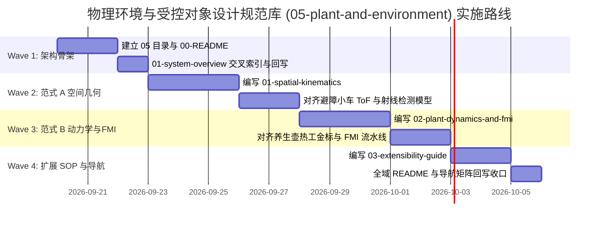

# 实施计划：物理环境与受控对象设计规范库建设 (Plant & Environment Design Docs Plan)

> 📋 **本文档是实施计划**：根据系统总体架构（`01-system-overview.md`）数字化四层模型中第 4 层“物理环境与受控对象模型”在设计文档库中的现状，规划建立 `docs/zh/design/05-plant-and-environment/` 独立设计规范模块。

---

## 1. 元数据表

| 字段 | 内容 |
|---|---|
| **计划编号** | `PLAN-20260919-PLANT-ENV-DOCS` |
| **创建日期** | 2026-09-19 |
| **目标平台/SoC** | `host` / `wasm` / `ESP32` / 仿真实验台跨端统一 |
| **工具链/SDK版本** | Markdown / Mermaid / UniSim 3.0 SSOT 体系 |
| **计划状态** | 🔄 执行中 (In Progress) |
| **优先级** | 🟡 P1（重要架构规范补齐，消除第 4 层文档悬空） |
| **计划版本** | `v1.0` |
| **关联设计规范** | [`../../zh/design/01-system-overall/01-system-overview.md`](../../zh/design/01-system-overall/01-system-overview.md)<br>[`../../zh/design/04-wasm-simulation/00-README.md`](../../zh/design/04-wasm-simulation/00-README.md) |
| **关联主仓设计** | `packages/unisim/docs/real-model/HouseholdElectricalAppliances/01-domain-and-physics/03-simulation-pyramid.md`<br>`packages/unisim/docs/design/fmi-fmu-plant-interface-and-pre-reservation-design.md`<br>`packages/unisim/docs/e2e/plan/architecture-evolution/12-end-to-end-physical-closed-loop-master-plan.md` |
| **关联 ADR** | `ADR-0027`（观测面数据分层）、`ADR-0055`（fp_mode 确定性边界）、`ADR-0067`（激励源互斥）、`ADR-0071`（受控对象 Provider 与解析架构） |
| **目标里程碑** | 文档体系完整性闭环 / 数字实验台第 4 层 SSOT 确立 |
| **计划负责人** | 系统架构组 / 物理仿真组 |

---

## 2. 背景与核心目标

### 2.1 现状与痛点诊断
1. **宏观四层架构第 4 层“悬空”**：
   在 [`01-system-overview.md`](../../zh/design/01-system-overall/01-system-overview.md) §2 中定义了系统宏观四层数字化模型：
   * 第 1 层：芯片模型 $\rightarrow$ 由 `04-wasm-simulation/` 详尽定义；
   * 第 2 层：外设通道模型 $\rightarrow$ 由 `04-wasm-simulation/02-mechanisms/` 与 `07-platform-governance/` 定义；
   * 第 3 层：外设器件模型 $\rightarrow$ 由 `07-platform-governance/01-device-model-registry.md` 统一定义；
   * **第 4 层：外设与物理环境交互模型（Plant & Environment Physics Model）** $\rightarrow$ **目前在设计文档库中仅有概括性文字，缺少独立的设计规范模块。**
2. **两类物理范式混杂**：
   目前的物理交互逻辑散落在应用计划（避障小车 ToF 空间测距）与主仓 UniSim 核心（养生壶一阶热工与 FMI 制品）中，未能清晰界定**“空间几何/射线检测类”**与**“连续动力学/能量守恒类”**的范式差异，导致开发者对“物理模型到底归属哪里”存在认知盲区。
3. **单篇文档无法承载**：
   物理世界既包含空间三维刚体碰撞、ToF 飞行时间射线检测，又包含连续微分方程数值积分、变送器对偶律与 FMI/FMU 工业制品联合仿真。单篇文档无法全面覆盖其数学原理、接口契约与工程标准，必须采用**独立目录分篇展开**。

### 2.2 建设目标
- ✅ **确立独立设计规范模块**：在 `docs/zh/design/05-plant-and-environment/` 建立完整的物理环境与受控对象设计规范；
- ✅ **明确双翼对偶律与固件零感知原则（P1~P4）**：理清“电气外设插件（变送器）”与“受控对象（连续场求解）”的边界；
- ✅ **清晰界定两大物理范式**：范式 A（空间几何与射线检测）与 范式 B（连续能量动力学与 FMI）；
- ✅ **提供标准开发者扩展 SOP**：为新家电/机器人产品新增物理模型与环境提供清晰的操作范式。

---

## 3. 规划目录结构与职责分工

设计规范目录规划落位为 **`docs/zh/design/05-plant-and-environment/`**，下设 4 篇权威设计文档：

```text
docs/zh/design/05-plant-and-environment/
├── 00-README.md
│   # 【总览】物理环境与受控对象总览与双翼对偶律
│   # - 系统四层数字化模型的顶层定位（Layer 4）
│   # - CPS 双翼对偶律：左翼外设变送器 ⇄ 右翼物理受控对象
│   # - 四大原则：P1 固件零感知 / P2 插件即变送器 / P3 纯物理闭环 / P4 确定性边界
│   # - 两大物理范式总览与路由指南
│
├── 01-spatial-kinematics-and-raycasting.md
│   # 【范式 A】空间几何、刚体运动学与传感器射线交互规范
│   # - 典型标杆：两轮差速避障小车 (avoidance_car)
│   # - 运动学方程：线速度、角速度、位姿积分与里程计
│   # - 传感器空间感知：超声波/激光 ToF 空间射线检测 (Raycasting) 与回波脉宽转换
│   # - 环境拓扑：三维障碍物、碰撞边界 (Bounding Box) 与摩擦接触阻抗
│
├── 02-plant-dynamics-and-fmi.md
│   # 【范式 B】连续动力学、微分方程求解与 FMI 联合仿真规范
│   # - 典型标杆：电热养生壶 (mcs51_health_pot) 与直流电机 (dc_motor)
│   # - 热力学与动力学积分：一阶/高阶热网络 (ODE)、电热功率转换与水温连续演化
│   # - 工业联合仿真：FMI 2.0/3.0 Co-Simulation Wasm 制品标准流水线 (Simulink/Modelica 导出)
│   # - 供应链与安全：fmu.lock.json 信任锚、sha256 锁文件与防篡改策略
│
└── 03-plant-environment-extensibility-guide.md
    # 【扩展指南】开发者作业规范：如何为新产品新增物理环境与模型
    # - 极简 3 步扩展法：驱动实现 ➜ 解析器注册 ➜ 场景/DSL 声明连线
    # - 人话参数映射与 describeUi() 控制面板渲染元数据契约
    # - 数值安全硬防线：Finite Guard 双向有限性熔断拦截 (NaN/Infinity 防护)
    # - 激励源互斥原则 (ADR-0067) 与冷改参规范 (Q8 决策)
```

---

## 4. 实施阶段与任务拆解



### 任务清单：
1. **Wave 1：架构骨架与总体契约（P0）**
   - [x] 创建 `docs/zh/design/05-plant-and-environment/00-README.md`，确立 Layer 4 权威定位与双翼对偶律；
   - [x] 回写更新 [`01-system-overview.md`](../../zh/design/01-system-overall/01-system-overview.md)，补充对 `05` 模块的交叉引用；
2. **Wave 2：范式 A 空间几何与射线检测规范（P1）**
   - [ ] 编写 `01-spatial-kinematics-and-raycasting.md`，收敛避障小车运动学、超声波 ToF 飞行时间计算与碰撞模型；
3. **Wave 3：范式 B 连续动力学与 FMI/FMU 联合仿真规范（P1）**
   - [ ] 编写 `02-plant-dynamics-and-fmi.md`，同步主仓 Phase 4.1~4.3 成果（养生壶一阶热工金标、双跑一致性、FMI 2.0 Wasm 载入器、锁文件机制）；
4. **Wave 4：开发者扩展指南与全域导航（P1）**
   - [ ] 编写 `03-plant-environment-extensibility-guide.md`，梳理新增模型 SOP、`describeUi()` 规范与数值熔断保护；
   - [ ] 更新 `docs/zh/design/README.md` 与全局文档导航索引，关闭文档缺口。

---

## 5. 验收标准 (Definition of Done)

1. **目录结构完整**：`docs/zh/design/05-plant-and-environment/` 拥有清晰的 00~03 结构，无残缺链接；
2. **架构闭环**：完全呼应 `01-system-overview.md` 中的“四层数字化模型”与“对偶双轮架构”，实现 Layer 1~4 全面有权威设计规格承载；
3. **术语与口径统一**：与主仓 UniSim 核心规范（四层物理金字塔、双翼对偶律、ADR-0055、ADR-0067、ADR-0071）完全同源且版本对齐；
4. **门禁校验通过**：通过文档链接与契约检查脚本，无死链、无越权私有路径泄露。
