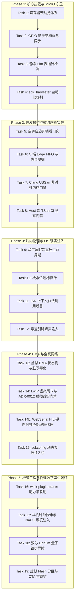

# PLAN-20260925-SIM-LIMITATIONS-AND-REMEDIES: 现行仿真架构 16 维深水区缺陷、物理盲区与工程破局实施总计划

> 📋 **本文档为平台核心架构的深度技术剖析与长期演进实施总计划（单一事实来源 SSOT）**。
> 系统性梳理 Wink-AI 现行嵌入式仿真架构（WinkMicroOS + UniSim 双轨体系）面临的核心缺点、物理鸿沟与微观失效机理，涵盖 **三层递进维度的 16 大难题**：
> 1. **第一层：7 大底层架构与编译器边界局限**（MMIO、头文件闭包、并发假性安全、微时序失真、ABI对齐与溢出、DMA断层、闭源射频）；
> 2. **第二层：5 大片内操作系统与微观物理盲区**（深度睡眠冷重启、栈溢出脱敏、看门狗与ISR禁忌、电气悬空噪声、Kconfig配置分叉）；
> 3. **第三层：4 大板级系统工程与物理数字孪生终极挑战**（动力学惯性滞后闭环、外设从机时钟拉伸与NACK忙等、多MCU协同因果时钟锁步、OTA双分区引导链）。
>
> 🎯 **计划版本**：v4.1（16 维代码-系统-物理三层全景 + 闭源射频三阶防御与 HIL 硬件协处理器版）
> 📚 **关联规范**：[`docs/zh/design/01-system-overall/01-system-overview.md`](../../zh/design/01-system-overall/01-system-overview.md)、[`docs/zh/design/04-wasm-simulation/00-README.md`](../../zh/design/04-wasm-simulation/00-README.md)
> 🏛️ **关联架构决策**：
> - [ADR-0002](../../decisions/unisim/0002-dual-target-compilation.md)（双 Target 同源编译）
> - [ADR-0003](../../decisions/unisim/0003-simulation-fidelity-boundary.md)（仿真可信度边界）
> - [ADR-0012](../../decisions/core/0012-contract-honesty-over-silent-degradation.md)（合约诚实，不支持接口 Fail-Loud）
> - [ADR-0014](../../decisions/unisim/0014-sim-single-virtual-core.md)（单虚拟核协作式任务调度器）
> - [ADR-0064](../../decisions/core/0064-target-capability-ssot.md)（目标平台与 SoC 能力 SSOT）
> - [ADR-0065](../../decisions/core/0065-pal-hardware-raII-resource-ownership.md)（PAL 独占硬件生命周期 RAII 资源所有权）
> - [ADR-0070](../../decisions/core/0070-mcs51-zero-code-simulation-interception-layer.md)（外部框架运行时桥接）
> - [ADR-0071](../unisim/docs/internals/decisions/0071-plant-model-provider-and-resolution-architecture.md)（受控物理对象 Plant 模型供给链与解析架构）
> - [ADR-0085](../../decisions/core/0085-esp-idf-facade-soc-caps-vs-pal-caps-dual-ssot.md)（ESP-IDF 门面 SoC 能力与 PAL Caps 双 SSOT 裁决）
> - [ADR-0086](../../decisions/core/0086-harvested-headers-license-contract.md)（收割头文件开源许可法律契约）

---

## 1. 元数据表

| 字段 | 内容 |
|:---|:---|
| **计划编号** | `PLAN-20260925-SIM-LIMITATIONS-AND-REMEDIES` |
| **创建日期** | 2026-09-25（v1.0 初版），2026-09-25（v4.1 射频三阶防御与 HIL 物理协处理器版） |
| **目标平台/SoC** | `wasm32-unknown-emscripten` / `host` (x86_64, Windows/Linux) / `esp32` (Xtensa/RISC-V) / `mcs51` |
| **工具链/SDK版本**| `ESP-IDF v5.1` ~ `v6.1` / `Emscripten 3.1.x+` / `Clang/LLVM 17+` / `SDCC 4.2+` |
| **计划状态** | 📋 就绪并多线推进（Phase 1 执行中 / Phase 2~5 分期规划中） |
| **优先级** | 🟡 P1（重要架构长期防御指南，护航平台工业级量产可信度） |
| **计划版本** | `v4.1` |
| **关联子计划** | - MCS-51 词法重写器：[`../mcs51/2026-09-25-mcs51-dialect-lexer-and-token-rewriter-plan.md`](../mcs51/2026-09-25-mcs51-dialect-lexer-and-token-rewriter-plan.md)<br>- SDK 自动化收割机：`wink-tools` SDK Harvester 实施计划（本地兄弟仓）<br>- 物理动力学受控对象生态：`wink-plugin-plants` 插件仓（本地兄弟仓） |
| **计划负责人** | Wink 核心运行时架构组 / 仿真安全专项小组 |

---

## 2. 背景与核心架构定位

### 2.1 架构基线回顾
Wink-AI 的嵌入式仿真体系建立在务实高效的**“多层分级代理与同源编译体系”**之上：
1. **Tier 1 (AI-Native 统一 OS 架构)**：面向 AI 自动代码生成，严格遵循 `App -> BAL -> DAL -> PAL` 规范，所有硬件旁路下沉至 PAL，上层保持 100% 虚实同源。
2. **Tier 2 (零修改生态拦截架构)**：面向海量存量驱动代码，通过 MCS-51 C++ Proxy 运算符重载、Arduino API 代理以及 ESP-IDF 门面层（Facade Pattern），使原生 C/C++ 源码未经修改即可秒级编译为 WebAssembly 并在浏览器运行。
3. **UniSim 3.0 底座**：单微秒确定性虚拟时钟（`s_virtual_us` SSOT）、4 值电气引脚仲裁器（PinArbiter）、数据面五通道路由与 Web Worker 联合仿真。
4. **S3 受控物理对象生态（wink-plugin-plants）**：基于微分方程与传递函数的连续物理场动力学插件体系，与固件构成真正的闭环数字孪生。

---

## 3. 现行架构 16 维深水区缺陷与物理盲区全景剖析

```text
┌────────────────────────────────────────────────────────────────────────────────────────┐
│                        Wink-AI 现行架构 16 维深水区缺陷全景图                          │
├────────────────────────────────────────────────────────────────────────────────────────┤
│ 【板块 A：7 大底层架构与编译器边界局限】                                               │
│  ① 直接写寄存器逃逸 (Direct MMIO Bypass) ──► 裸指针解引用导致 Wasm OOB 崩溃或静默失效   │
│  ② 影子头文件维护地狱 (Include Closure Hell) ──► 手工增量补桩易断裂，原厂升级易雪崩    │
│  ③ 并发模型的假性安全 (Concurrency Illusion) ──► 单线程协程掩盖多核真实竞态，自旋卡死  │
│  ④ 微时序与软件延时失真 (Bit-banging Distortion) ──► 软件时序打爆浏览器 IPC 或被优化   │
│  ⑤ 内存模型与 ABI 维度静默掩盖 (Silent ABI Mismatch) ──► 16位溢出被消除，非对齐崩溃漏检 │
│  ⑥ 异步 DMA 与同步 Facade 结构性断层 (Async DMA Hazard) ──► 内存双缓冲时序与踩踏失真   │
│  ⑦ 闭源射频二进制的物理天花板 (Closed RF Blobs) ──► 乐鑫闭源 Wi-Fi/BLE .a 无法入 Wasm   │
├────────────────────────────────────────────────────────────────────────────────────────┤
│ 【板块 B：5 大片内操作系统与微观物理盲区】                                             │
│  ⑧ 深度睡眠与复位生命周期的本质鸿沟 (Deep Sleep vs Reset) ──► 唤醒本是冷重启，仿真变延时│
│  ⑨ 堆栈资源受限真实性的“巨量内存脱敏” (Stack Overflow) ──► 局部大数组真机踩栈，仿真畅通│
│  ⑩ 硬件看门狗与中断上下文禁忌的穿透 (Watchdog & ISR Violations) ──► 临界区超时与API误用│
│  ⑪ 物理电气悬空态与模拟量非线性失真 (Floating Pins & ADC Drift) ──► 漏开上拉在真机随机跳│
│  ⑫ Kconfig / sdkconfig 宏分支的静默分叉 (Configuration Drift) ──► 仿真与真机跑不同分支 │
├────────────────────────────────────────────────────────────────────────────────────────┤
│ 【板块 C：4 大板级系统工程与物理数字孪生终极挑战】                                     │
│  ⑬ 物理动力学滞后与闭环反馈控制断层 (Closed-Loop Physics Lag) ──► PID 参数仿真调好真机震荡│
│  ⑭ 外设从机硬件协议的物理严苛度 (Protocol Strictness & Slave Busy) ──► 时钟拉伸与写入忙等│
│  ⑮ 板级多芯片互联的“因果时空倒流悖论” (Multi-MCU Causal Paradox) ──► 双芯联调虚拟时钟漂移│
│  ⑯ 固件在线升级 (OTA) 与双分区引导链断层 (OTA & Bootloader Chain) ──► 无法验证分区回滚 │
└────────────────────────────────────────────────────────────────────────────────────────┘
```

---

### 【板块 A：7 大底层架构与编译器边界局限】

#### 缺陷 1：直接写寄存器逃逸与内存越界崩溃（Direct MMIO Bypass）
在 32 位现代单片机（ESP32、STM32 等）中，外设是统一平坦内存编址（MMIO）。驱动常包含裸指针操作：
```c
WRITE_PERI_REG(GPIO_OUT_W1TS_REG, (1 << 4)); // 宏展开
GPIO.out_w1ts = (1 << 4);                    // 结构体直接映射
*((volatile uint32_t *)0x3FF44008) = (1 << 4); // 裸物理地址强转
```
* **失效机理**：Wasm 内存配额通常为 16MB~64MB。ESP32 硬件基地址 `0x3FF44008` 约为 1023MB。Wasm 引擎探测到写入超界，抛出 `memory access out of bounds` 崩溃。若盲目分配 2GB 内存，数据写入后没有任何外设回调，产生无反应的静默失效。

#### 缺陷 2：影子头文件维护地狱（Include Closure Hell）
为了使开源第三方代码在浏览器端零修改编译，平台自建了一套平行原厂头文件树。
* **失效机理**：在 ESP-IDF v6.1 下，最小的 `blink` 示例其传递包含就跨越 65 个以上头文件。版本升级时，原厂头文件拆解重构会导致手工补桩陷入持续维护雪崩。

#### 缺陷 3：并发模型的假性安全与自旋死锁（The Concurrency Illusion）
* **失效机理**：真机 ESP32 为双核硬件抢占多任务；而 Wasm 为单虚拟核协作调度（Fiber）。
  - **假性安全**：任务在 `vTaskDelay` 之间的代码天然原子执行，并发竞态 Bug 在仿真中一路绿灯，真机上一跑瞬间死锁或内存踩踏。
  - **自旋锁卡死**：驱动写 `while(!g_ready);` 等待另一核置位，在 Wasm 单线程中该循环独占 CPU，调度器无机会切出，导致浏览器标签页直接假死。

#### 缺陷 4：微时序与软件延时时空扭曲（Bit-banging Distortion）
* **失效机理**：小家电与传感器（DHT11、DS18B20、WS2812、模拟 I2C）大量依赖 CPU 循环软延时（`_nop_()`）。
  - 宿主机 CPU 执行速度太快，若虚拟时钟不步进，外设模型判定脉冲宽度为 0；
  - 若每次引脚翻转都发 IPC，一段 40 位数据产生数万次跨语言事件，打爆浏览器渲染；
  - Clang 在 `-O2` 下易把空循环当作 Dead Code 优化清除，延时彻底蒸发。

#### 缺陷 5：内存模型与 ABI 维度静默掩盖（Silent ABI Mismatch）
* **失效机理**：
  - **16 位溢出消除**：8051 原生 `sizeof(int) == 2`，`60000 + 10000` 会发生 16 位溢出回绕（得 4464）；而 Wasm32 中 `sizeof(int) == 4`（32 位），计算得 70000，原厂算法逻辑被掩盖。
  - **非对齐硬件崩溃**：ESP32（Xtensa）要求 32 位读写严格 4 字节对齐。执行 `*(uint32_t*)(buf + 1)` 在真机会触发 `LoadStoreAlignmentCause` 硬件 Panic，但在 Wasm 中毫无感知。

#### 缺陷 6：异步 DMA 搬运与同步 Facade 的结构性断层（Async DMA Hazard）
* **失效机理**：ESP32 高性能刷屏（SPI/I8080）依赖后台 DMA 异步搬运。若门面将 `spi_device_queue_trans` 简化为同步拷贝：用户如果在传输完成前非法修改了 `tx_buffer`，仿真中因已提前拷走而画面正常，但在真机物理 DMA 发送期间改写内存会导致屏幕撕裂与花屏。

#### 缺陷 7：乐鑫闭源 Wi-Fi/BLE 射频二进制鸿沟（Closed RF Binary Blobs）
* **失效机理**：
  - **闭源 `.a` 与未公开硬件强绑定**：ESP-IDF 底层 Wi-Fi 驱动核心（`libnet80211.a`、`libphy.a`）是原厂闭源的 Xtensa/RISC-V 目标文件。这些库不仅是机器指令，其内部充斥着对**未公开的私有物理基带/MAC/PHY 硬件寄存器（`0x3FF7xxxx` 等）的直接读写、等待硬件 PLL 锁定、DMA 描述符环形队列以及微秒级 ACK 中断**。即使引入轻量指令虚拟机（如 Micro-ISA / Unicorn），若没有整套物理基带 ASIC 硬件状态机的数字逻辑模拟，指令执行数步就会因读取不到硬件就绪信号而陷入死循环或触发内核断言 Panic；
  - **物理射频特性的纯软件伪造鸿沟**：CSMA/CA 载波侦听冲突退避、空间路径损耗衰减（Path Loss）、天线方向图、ESP-NOW 裸帧无握手广播在纯 Wasm 软件沙箱中无法低成本保真模拟；
  - **闭源底层资源泄漏不可见**：乐鑫 Wi-Fi 驱动底层硬件描述符耗尽和系统堆碎片在浏览器宿主海量内存中被彻底脱敏掩盖，真机高并发网络崩溃无法在仿真中暴露。

---

### 【板块 B：5 大片内操作系统与微观物理盲区】

#### 盲区 8：深度睡眠与复位生命周期的本质鸿沟（Deep Sleep vs Reset Cycles）
* **失效机理**：在物理硬件上，从深度睡眠（Deep Sleep）唤醒**本质是一次完整的芯片硬件冷复位（Full SoC Reboot）**，而不是普通函数返回！
  - 普通 SRAM 全局变量被硬件清零重新初始化；
  - 只有使用 `RTC_DATA_ATTR` 修饰、存放在 RTC 慢速 RAM 中的变量在休眠中保持状态；
  - 若仿真仅将 `esp_deep_sleep()` 模拟为 `delay()`，函数直接返回，普通全局变量不仅未被清零，反而保留了上次状态，导致用户“忘记加 `RTC_DATA_ATTR`”的致命 Bug 在仿真中被完全遮蔽。

#### 盲区 9：堆栈资源受限真实性的“巨量内存脱敏”（Stack Overflow Masking）
* **失效机理**：
  - 8051 内部 RAM 仅有 128~256 字节，ESP32 任务栈通常仅分配 2KB~4KB；
  - 开发者在函数内无意写下 `char buffer[2048];` 或进行深度函数递归；
  - Wasm 拥有宿主机级别的海量内存（MB 级栈空间），代码畅通无阻；但烧录真机后，第一行调用即发生**栈溢出踩踏（Stack Smashing）**，踩烂相邻任务 TCB，芯片无限崩溃重启。

#### 盲区 10：硬件看门狗与中断上下文禁忌的穿透（Watchdog & ISR Violations）
* **失效机理**：
  - **中断看门狗（IWDT）**：ESP32 关中断（`taskENTER_CRITICAL()`）超过 300ms 触发硬件复位。用户在临界区内做耗时计算，仿真中安然无恙，真机直接 Panic；
  - **中断上下文（ISR）禁忌**：ISR 内严禁调用阻塞函数（如 `vTaskDelay()`、普通获取信号量 `xSemaphoreTake()`），必须调用带 `FromISR` 后缀的专属 API。在仿真中若没有严格隔离上下文，违规调用不会暴露，真机上一跑直接触发内核断言挂死。

#### 盲区 11：物理电气悬空态与模拟量非线性失真（Floating Pins & ADC Calibration）
* **失效机理**：
  - **悬空引脚（High-Z / Floating）**：未配置内部上拉/下拉电阻的输入引脚，真机受电磁杂波影响会剧烈随机翻转（0与1跳变）；仿真器若默认返回确定性的 `LOW`，会导致用户“配置按键漏开上拉”的严重硬件设计缺陷在仿真中表现完美；
  - **ADC 非线性**：ESP32 ADC 在 0V~0.1V 与 3.1V~3.3V 存在严重饱和非线性；纯线性映射会导致电池电量与传感器阈值判定在真机失真。

#### 盲区 12：Kconfig / sdkconfig 宏分支的静默分叉（Configuration Drift Paradox）
* **失效机理**：ESP-IDF 驱动深度绑定 `sdkconfig.h`（如时钟节拍 `CONFIG_FREERTOS_HZ`、是否启用 SPIRAM 等）。若仿真端使用固定的静态影子配置，而硬件工程修改了配置，代码中大量的 `#if CONFIG_...` 条件编译将导致**仿真运行的代码路径与真机实际执行的业务分支截然不同**。

---

### 【板块 C：4 大板级系统工程与物理数字孪生终极挑战】

#### 挑战 13：物理闭环动力学与执行器惯性滞后（Closed-Loop Physics Lag）
* **失效机理**：
  - 真实物理对象（电机、加热丝、无人机姿态、小车位姿）具有**机械转动惯量（Inertia）、热阻热容（Thermal RC）与非线性滞后**；
  - 若仿真模型采用开环脚本或“瞬时响应”（PWM=100% 温度瞬间达到 100℃，电机瞬间拉满标称转速）；
  - **后果**：AI 或工程师在仿真中调优好的 PID 控制参数（$K_p, K_i, K_d$），一旦烧录到带有真实物理惯性与相移滞后的物理硬件上，系统将**瞬间剧烈震荡、超调发散甚至直接烧机**！

#### 挑战 14：外设从机硬件协议的物理严苛度（Protocol Strictness & Slave Busy NACK）
* **失效机理**：
  - **I2C 时钟拉伸（Clock Stretching）**：慢速外设（如测温中的 SHT30）在芯片内部未完成 ADC 采样前，会强行拉低 SCL 总线。若仿真器不模拟拉伸，驱动遇到真实从机拉低时钟会发生硬件总线死锁或超时报错；
  - **EEPROM 写入忙等周期（Page Write Busy）**：AT24C02 在写入 8 字节后需要耗费 **5ms 内部高压擦写时间**，在此期间对外部寻址强制回复 NACK。仿真若永远回复 ACK，用户代码中漏写“轮询 ACK 确认就绪”的致命 Bug 无法暴露，真机上后半段数据全部丢弃。

#### 挑战 15：板级多芯片互联的“因果时空倒流悖论”（Multi-MCU Causal Paradox）
* **失效机理**：
  - 现代智能硬件常采用“ESP32（Wi-Fi/主控）+ 8051（低功耗触控/电机）”双芯架构；
  - 若在浏览器同一画布中跑两个独立 Web Worker 实例：ESP32（跑 FreeRTOS/LwIP）执行 1 毫秒需要 100ms 宿主时间；而 8051 极其轻量，10ms 宿主时间就快进到了虚拟世界 5 毫秒；
  - **因果倒流**：慢芯片在 $T=1ms$ 发送的 UART 字节，抵达快芯片时对方已经跑到了 $T=5ms$。数据相当于发往了“过去”，导致双机通讯协议严重错乱。

#### 挑战 16：固件在线升级（OTA）与双分区引导链断层（OTA & Bootloader Chain）
* **失效机理**：
  - 真实量产 ESP32 依赖 `2nd stage bootloader -> 分区表 -> ota_0/ota_1 -> 防回滚校验（Anti-rollback）`；
  - Wasm 目前是单体静态加载执行，无法模拟 Flash 双分区的物理写入，也无法验证在 OTA 过程中断电变砖的自愈能力，导致核心量产升级逻辑在仿真中处于验证盲区。

---

## 4. 16 维深水区工程破局方案矩阵（Engineering Solutions）

```text
┌────────────────────────────────────────────────────────────────────────┐
│                   16 维深水区问题对应破局解法全景矩阵                   │
├────────────────────────────────────────────────────────────────────────┤
│ 【板块 A 解法：底层架构加固】                                          │
│ 1. MMIO 逃逸 ──────► 宏劫持 (WRITE_PERI_REG) + 影子结构体 + Lint 阻断  │
│ 2. 头文件地狱 ─────► LibClang 自动化闭源收割机 (sdk_harvester)         │
│ 3. 并发假性安全 ───► 空转指令计数自旋死锁卫士 + Host 端 TSan CI 门禁   │
│ 4. 微时序失真 ─────► C 端边沿 FIFO + 协议语义嗅探器 + 微步折叠         │
│ 5. ABI 静默掩盖 ───► Clang UBSan 对齐陷阱 + 方言 16 位整型修饰与溢出检查│
│ 6. DMA 异步断层 ───► 两阶段虚拟 DMA 状态机 + 内存脏写毒化警报 (Poison) │
│ 7. 闭源 Wi-Fi ─────► 语义网桥 + 契约诚实(ADR-0012) + HIL 硬件 RF 协处理器│
├────────────────────────────────────────────────────────────────────────┤
│ 【板块 B 解法：物理与 OS 现实注入】                                    │
│ 8. 深度睡眠鸿沟 ───► 掉电生命周期模拟：SRAM 清零复位 + RTC 内存段保持   │
│ 9. 堆栈脱敏掩盖 ───► 任务栈水位虚拟探针 (Watermark Guard) + 栈深断言   │
│ 10.看门狗与ISR ────► 临界区时钟预算器 + in_isr 上下文禁忌合法性断言    │
│ 11.电气悬空/ADC ───► 悬空引脚伪随机噪声注入 (Noise Injection) + eFuse校准│
│ 12.Kconfig 漂移 ───► sdkconfig 动态宏提取与 Wasm 编译器编译参数 (-D) 对齐│
├────────────────────────────────────────────────────────────────────────┤
│ 【板块 C 解法：系统工程与物理数字孪生闭环】                            │
│ 13.动力学闭环滞后 ─► wink-plugin-plants 常微分方程解析解 (ODE) 闭环联动 │
│ 14.从机物理严苛度 ─► 虚拟外设物理瑕疵注入器 (Fault Injection: NACK/拉伸)│
│ 15.多芯片因果悖论 ─► UniSim Master Timekeeper 分布式量子阻尼锁步屏障   │
│ 16.OTA 引导断层 ───► 虚拟 Flash 分区表 Blob + 双 Wasm 实例热重载引导链  │
└────────────────────────────────────────────────────────────────────────┘
```

---

### 【板块 A 落地细节：架构加固】

#### 方案 1：直接写寄存器（MMIO）三道防线
1. **宏劫持**：在 `esp_macros.h` 与 `soc/soc.h` 中劫持 `WRITE_PERI_REG`，重定向为 `wink_sim_write_reg(addr, val)`。
2. **影子结构体**：暴露 `gpio_dev_t GPIO` 分配在 Wasm 安全区，在 `vTaskDelay` 同步至 PAL。
3. **静态 Lint**：`winkcli lint` 检测硬编码指针强转 `(volatile uint32_t*)0x3F...` 并阻断。

#### 方案 2：SDK 自动化收割机（sdk_harvester）
在 `wink-tools` 中基于 `libclang` AST 自动提取 ESP-IDF 头文件树中的 Struct 布局、Enum 与宏定义，输出纯纯净的影子头文件，彻底消除手工补桩负担。

#### 方案 3：并发死锁卫士与 TSan 门禁
1. **空转指令计数器**：任务纯 CPU 循环超 50,000 次无 IO 让出，主动触发看门狗复位并打印源码行号。
2. **Host 端 ThreadSanitizer**：在 Host 自动化测试开启 `-fsanitize=thread`，精准捕获多任务无锁竞态。

#### 方案 4：C 端边沿 FIFO 与协议语义嗅探器
1. **本地 Edge FIFO**：软件模拟跳变在 Wasm 内存中极速记录 `(timestamp_us, level)`，杜绝高频 IPC。
2. **协议嗅探器**：内置轻量解码器，空闲时一次性解出温湿度或 RGB 数组推送给前端；软件延时通过 `mcs51_microstep` 推进虚拟时钟。

#### 方案 5：Clang UBSan 非对齐与 16 位整型约定
1. 编译 Wasm/Host 调试固件时注入 `-fsanitize=alignment -fsanitize-trap=alignment`，奇数地址 32 位读写立刻陷阱，复现 Xtensa 硬件崩溃。
2. 8051 头文件通过 typedef 强制绑定 16 位整型并启用 Clang 溢出捕获。

#### 方案 6：两阶段虚拟 DMA 状态机与脏写毒化
`spi_device_queue_trans` 提交时将 buffer 标记为 `DMA_LOCKED` 态，计算物理耗时并在虚拟时钟到期后释放。若 CPU 在期间修改 buffer，立即触发 `DMA Hazard` 警告。

#### 方案 7：闭源射频三阶破局体系（语义网桥 + 契约诚实 + HIL 硬件 RF 协处理器）
面对乐鑫闭源 `libnet80211.a` 强依赖未公开基带硬件的物理客观事实，放弃耗时数年且易雪崩的纯软件 ASIC 逆向，采取**三阶递进防御与降维破局策略**：

* **阶梯 7.1：L0 应用层协议语义网桥（Web-Net Bridge）**
  - 保留原版 LwIP 源码编译入 Wasm，提供虚拟的 802.11 状态机分发连接/断开事件；
  - 底层以太网链路层（Ethernet MAC）通过 WebSocket 代理直连外部真实网络或本地 Mock 代理服务器，保障 HTTP/MQTT/CoAP 等应用层业务状态机 100% 畅通。

* **阶梯 7.2：路线 A —— 契约诚实与降级登记（ADR-0012 Contract Honesty）**
  - **清晰边界界定**：在文档与 UI 工作台显著标明：Wi-Fi/BLE 在浏览器纯纯软件模式下定位为“应用层协议栈语义沙箱”，**不承诺**微观射频电磁波与 CSMA/CA 物理争用保真度；
  - **Fail-Loud 门禁断言**：当用户或 AI 生成代码调用未被模拟的原厂底层私有 API（如 `esp_wifi_80211_tx()` 发送裸帧、`esp_now_send()` 无网通信、私有 RF 校准）时，严禁静默成功，依据 ADR-0012 规则必须触发 **Fail-Loud 断言**，阻断虚假运行并明确提示“此操作需在真机或挂载 HIL 硬件调试棒运行”；
  - **Golden Trace 证据链打标**：所有由软件虚拟网卡转发的报文事件强制打上 `[TRACE_MOCK_RF]` 显式标签，确保回归测试对比时清晰识别虚实边界。

* **阶梯 7.3：路线 B —— 真机 HIL 硬件 RF 协处理器代理（Hardware-in-the-Loop RF Dongle，终极物理闭环）**
  - **技术原理**：“借力打力”——利用真实物理芯片解决纯软件无法逾越的电磁物理鸿沟。
  ```text
  ┌────────────────────────────────────────────────────────┐
  │             浏览器 Wasm 仿真环境 (Web Worker)          │
  │  - 运行业务逻辑、DAL、BAL、植物/小车物理动力学          │
  │  - 产生 ESP-NOW 广播帧或 802.11 物理原始数据包         │
  └───────────────────────────┬────────────────────────────┘
                              │ WebSerial / WebUSB (极简 RPC 帧)
                              ▼
  ┌────────────────────────────────────────────────────────┐
  │      廉价 ESP32-C3 USB Dongle (插在开发者电脑上，~15元) │
  │  - 烧录专属开源透明 RF 代理固件                        │
  │  - 原生运行官方闭源 libnet80211.a 与真实物理射频天线   │
  └───────────────────────────┬────────────────────────────┘
                              │ 真实 2.4GHz 电磁波
                              ▼
                     【真实物理世界空中无线电】
  ```
  - **三大核心收益**：
    1. **100% 绝对物理保真**：空中电磁波由乐鑫物理芯片真实发射，完整还原 CSMA/CA 冲突退避、信道干扰、RSSI 随距离平方衰减及乐鑫闭源底层时序；
    2. **两周敏捷闭环**：无需投入数名工程师耗资数百万去逆向未公开的基带 Verilog 寄存器，基于 WebSerial 仅需极简协议即可交付；
    3. **商业模式升级**：平台可标配发售低成本“Wink 硬件仿真调试棒”，从纯软件 SaaS 升级为工业级“软硬协同数字实验室”。

* **架构决议裁决说明（为什么否决 Aegis-Sim 纯软件 Micro-ISA 穿透岛）**：
  在竞品构想中，常设想利用微型 Xtensa 虚拟机在浏览器里直接跑 `libnet80211.a`。但真实工程中，闭源库内部直接操作的是未公开的 Wi-Fi MAC/PHY 硬件 ASIC 寄存器（`0x3FF7xxxx`）。缺乏物理基带硬件仿真时，指令执行数步就会因硬件无响应而死锁。路线 A（诚实守门）+ 路线 B（HIL 降维打击）是避开黑盒芯片逆向泥潭的最佳工程实践。

---

### 【板块 B 落地细节：物理现实与 OS 守卫】

#### 方案 8：深度睡眠“真实冷复位”仿真器（Reset Cycle Simulation）
```c
void esp_deep_sleep_start(void) {
    ESP_LOGI("SIM", "Entering Deep Sleep... Simulating hardware power-down.");
    wink_sim_snapshot_rtc_memory();        // 1. 保存 RTC 变量快照
    wink_sim_scheduler_advance(s_duration); // 2. 推进虚拟时钟至唤醒时刻
    wink_sim_reset_normal_sram();           // 3. 冷复位：清空普通 BSS/DATA 段
    wink_sim_restore_rtc_memory();         // 4. 恢复 RTC 变量
    s_wakeup_cause = ESP_SLEEP_WAKEUP_TIMER;
    wink_sim_restart_main_task();          // 5. 重新跳转到 app_main() 入口
}
```

#### 方案 9：虚拟栈水位监视器（Virtual Stack Watermark Guard）
在 FreeRTOS 任务包装器中，依据用户创建任务时指定的 `stack_depth` 设定水位红线；利用局部变量 SP 差值计算，一旦超标立刻主动抛出 `Stack Overflow Panic`。

#### 方案 10：中断上下文与临界区时钟预算器
1. 全局维护 `s_in_isr_context` 标记，严查 ISR 中调用阻塞 API；
2. 为 `taskENTER_CRITICAL` 设定 300ms 虚拟时间预算，超时直接触发中断看门狗（IWDT）复位。

#### 方案 11：悬空引脚伪随机噪声注入（Floating Pin Noise Injection）
当引脚配置为输入且未开内部上下拉、外部无器件驱动时，`pal_gpio_read` 自动注入随机跳变电平，**强迫开发者在仿真期暴露“按键漏开上拉”的设计缺陷**。

#### 方案 12：Kconfig 配置自动化提取与同步桥接
编译时自动提取真实工程的 `sdkconfig` 宏表并直传 Wasm 编译参数（`-D`），确保仿真端与目标硬件运行 100% 相同的业务逻辑分支。

---

### 【板块 C 落地细节：系统工程与物理数字孪生闭环】

#### 方案 13：受控物理对象闭环生态（wink-plugin-plants）全面咬合
目前已在 `wink-plugin-plants` 插件仓（本地兄弟仓）正式开工落地！
* **热力学一阶微分方程（`first_order_thermal`）**：
  $$C \frac{dT}{dt} = P - \frac{T - T_{amb}}{R}, \quad \tau = RC, \quad T_{next} = T_{steady} + (T_{current} - T_{steady}) e^{-\Delta t / \tau}$$
  彻底还原水壶、电熨斗的热传导滞后！
* **直流电机运动学模型（`dc_motor_kinematics`）**：
  $$J \frac{d\omega}{dt} = T_{motor} - b \omega, \quad \tau = \frac{J}{b}, \quad \omega_{next} = \omega + (\omega_{target} - \omega)(1 - e^{-\Delta t / \tau})$$
  精准模拟电机转动惯量与阻尼，确保小车平衡与差速 PID 算法虚实完全同源。

#### 方案 14：从机物理严苛度注入器（Slave Fault Injection）
在 I2C/SPI 外设驱动模型中增加**“严苛度状态机模式”**：
1. **EEPROM 忙等**：写完一包数据后，从机模型强制将内部状态设为 `BUSY_EEPROM_PAGE_WRITE`，持续 5ms 并在总线上主动回复 NACK。驱动必须执行标准轮询重试。
2. **时钟拉伸**：慢速传感器（SHT30）采样期间主动将虚拟 SCL 拉低，验证 MCU 硬件 I2C 模块的超时处理。

#### 方案 15：UniSim Master Timekeeper 分布式量子阻尼锁步（Lockstep Barrier）
解决双 MCU（如 ESP32 + 8051）联调时的因果倒流悖论：
```text
┌────────────────────────────────────────────────────────┐
│      UniSim Master Timekeeper 阻尼锁步屏障机制 (100μs)  │
├────────────────────────────────────────────────────────┤
│  ESP32 Worker  ──► 步进至 T=100μs ──► 挂起等待屏障同步 │
│  8051 Worker   ──► 步进至 T=100μs ──► 挂起等待屏障同步 │
│                                          │             │
│  两端全部就绪 ──► 交换板级 UART/SPI 报文 ──► 统一步进至 200μs│
└────────────────────────────────────────────────────────┘
```
以 **100 微秒为一个时间量子（Quantum Step）**，双芯严格锁步，从根本上消灭时钟漂移和因果时空倒流。

#### 方案 16：虚拟 Flash 分区表与双 Wasm 实例热重载 OTA 链
1. 在浏览器 `IndexedDB` 中开辟一块连续内存作为虚拟 Flash，按真实 `partitions.csv` 划分为 `otadata`、`ota_0`、`ota_1`；
2. 用户固件调用 `esp_ota_write()` 时，将升级数据写入 `ota_x` 扇区；
3. 固件重启时，宿主模拟 2nd stage bootloader 校验魔数与校验和，动态销毁旧 Wasm Worker 并加载新分区对应的 Wasm 实例，100% 还原 OTA 升级与失败防回滚流程。

---

## 5. 详细任务拆分与五阶段路线图



---

## 6. 测试策略与验收出口（DoD）

### L0 自动化基础门禁
- [ ] 编译通过率 100%，Clang/GCC/Emscripten 三端保持严格零警告零错误。
- [ ] `WRITE_PERI_REG` 与硬件宏操作回归测试用例全部绿灯。

### L1 片内拟真与安全防御验收
- [ ] **自旋死锁告警**：死循环空转代码在 100ms 内触发虚拟看门狗并定位行号，禁止浏览器卡死。
- [ ] **非对齐指针捕获**：奇数地址 32 位读写在 CI 中 100% 触发 UBSan 拦截，杜绝漏入真机。
- [ ] **深度睡眠冷重启**：休眠唤醒后验证普通全局变量被清零，只有 `RTC_DATA_ATTR` 累加。
- [ ] **栈溢出主动熔断**：分配 2048 字节任务栈但局部变量占用超标时，控制台直接抛出红字 Stack Smash 警告。
- [ ] **悬空引脚杂波**：未配置上拉的悬空按键引脚在读取时呈现跳变杂波，日志打印悬空告警。
- [ ] **射频诚实与 Fail-Loud 门禁**：在纯软件沙箱调用 `esp_now_send` 或底层 802.11 物理裸帧 API 时，100% 触发 Fail-Loud 阻断并提示挂载 HIL 硬件调试棒，禁止静默成功；所有软件网络事件在 Golden Trace 中强制打上 `[TRACE_MOCK_RF]` 标签。

### L2 物理闭环与板级系统验收
- [ ] **动力学惯性验证**：电水壶加热算法在 `first_order_thermal` 模型下呈现真实的指数升温曲线，PID 控制超调量与稳态误差可被量化收敛。
- [ ] **从机忙等容错验证**：针对开启 EEPROM 5ms 擦写 NACK 的用例，验证驱动能够自动触发轮询重试并成功写入。
- [ ] **双芯通信因果验证**：ESP32 与 8051 联合仿真时，双端时间轴保持严格对齐，UART 报文传输丢包率 0%。
- [ ] **OTA 引导回滚验证**：模拟在 `ota_1` 写入故意损坏的固件，验证系统重启后能够自动回退至 `factory` 分区。
- [ ] **HIL 硬件协处理器连通性**：当接入 ESP32-C3 USB Dongle 时，WebSerial 自动握手并接管射频通道，真实空中抓包验证 ESP-NOW / Wi-Fi 报文收发正常。

---

## 7. 总结与技术哲学裁决

这 16 个维度共同勾勒出嵌入式仿真从**“语法模拟（Toy Simulator）”**迈向**“工业级全数字孪生平台（Industrial Digital Twin）”**的完整全景图。

在这套体系中：
1. **代码与架构层**：通过宏劫持、影子映射与编译器 Sanitizer，保留了极速免装的 Web 体验；
2. **操作系统与片内层**：通过冷重启模拟、栈深探针与悬空噪声注入，消除真机与仿真的微观代差；
3. **物理与板级系统层**：通过 `wink-plugin-plants` 连续动力学与 UniSim 分布式锁步，打通了控制算法到物理世界的真实闭环。

这不仅是 WinkMicroOS 的长期演进指南，更是让平台形成行业绝对技术壁垒的坚固护城河。
