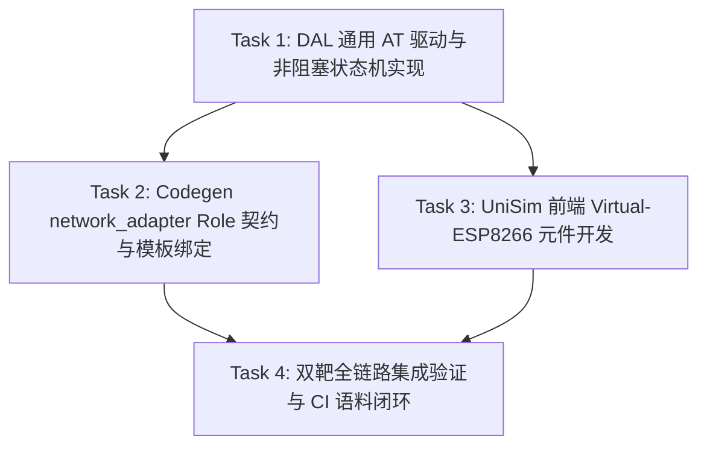

# DAL 外设级 Wi-Fi 模块架构与实施规划 (2026-09-26-dal-external-wifi-module-architecture-plan)

> 📋 **计划状态声明**：  
> 本计划为 WinkMicroOS 设备抽象层（DAL）面向**外挂式无线通信模组（Wi-Fi / 4G CAT1）**的架构规范与远期实施规划。  
> 🎯 **计划版本**：v1.0（2026-09-26，提前锚定外设级网络与片上原生网络的职责划界，防遗忘与架构防腐化）  
> 📚 **关联规范**：  
> - [`dal-role-architecture-spec.md`](../../../wink-micro-os/docs/dal-development-guide/dal-role-architecture-spec.md)（Role 5 大域分类正交矩阵：Category E 通信总线域）  
> - [`08-channel-routing.md`](../../zh/design/04-wasm-simulation/02-mechanisms/08-channel-routing.md)（四通道数据面路由：Channel 2 Bus & Channel 4 Buffer）  
> - [ADR-0057：PAL ADC 子系统与通道 3 契约（确定 PAL 保持对网络/射频无知原则）](../../decisions/core/0057-pal-adc-subsystem-and-channel-3-analog-contract.md)  
> - [ADR-0004：编译期静态分发与 POD 结构体](../../decisions/core/0004-static-dispatch-vs-runtime-ops.md)  
> - [ADR-0001：负数错误码规范](../../decisions/core/0001-error-code-sign-convention.md)  
> - [`2026-09-27-esp-idf-sim-m4-wifi-ble-connectivity-roadmap.md`](../esp32/2026-09-27-esp-idf-sim-m4-wifi-ble-connectivity-roadmap.md)（对比基准：ESP32 片上原生 Wi-Fi 仿真路线）  

---

## 1. 元数据表（🔴 必选）

| 字段 | 内容 |
|:---|:---|
| **计划编号** | `PLAN-20260926-DAL-EXTERNAL-WIFI-MODULE` |
| **创建日期** | 2026-09-26 |
| **目标平台/SoC** | `host` / `wasm32-unknown-emscripten` / `ESP32` / `MCS-51` / 通用微控制器 |
| **目标总线** | UART (AT 指令交互模式) / SPI (分包帧模式) |
| **计划状态** | 📋 远期规划草案（Draft Architecture Plan，架构防遗忘与资产锚定） |
| **优先级** | 🟡 P1（跨平台物联网应用与通用单片机外设生态演进） |
| **计划版本** | `v1.0` |
| **关联技术设计** | `docs/zh/design/04-wasm-simulation/00-README.md`、`docs/zh/design/02-wink-micro-os/02-pal-platform-abstraction.md` |
| **计划负责人** | 运行时架构团队 & DAL 外设驱动小组 |
| **主要依赖技能** | `embedded-best-practice` |

---

## 2. 背景与核心架构定位（🔴 必选）

### 2.1 问题陈述：厘清两类截然不同的“Wi-Fi”形态

在嵌入式与物联网系统中，开发者对“Wi-Fi 支持”通常存在两种完全不同的技术诉求：

```text
┌───────────────────────────────────────────────────────────────────────────────────┐
│                       嵌入式系统两类正交的 Wi-Fi 架构形态对比                      │
├───────────────────────────────────────────────────────────────────────────────────┤
│  【形态 A：片上原生 Wi-Fi (SoC On-Chip Native)】                                    │
│  - 典型硬件：ESP32、ESP8266、STM32WBA 等自带片上射频与 MAC/PHY 的 SoC               │
│  - 软件栈：乐鑫官方闭源固件库 (`libnet80211.a`) + lwIP + 原生 Socket/C-ABI          │
│  - 归属层级：SoC 核心能力，走 `frameworks/esp_idf` 门面拦截（M4 路线）              │
│  - 仿真机制：由拦截门面直接拦截 `esp_wifi` / `esp_http_client` 并桥接至宿主网络     │
├───────────────────────────────────────────────────────────────────────────────────┤
│  【形态 B：外挂式 Wi-Fi 外设模块 (External Peripheral Module)】                    │
│  - 典型硬件：单片机（MCS-51/STM32/ESP32）外挂 ESP8266-01S、Air724 4G 模组、W5500 │
│  - 软件栈：单片机无原生射频代码，仅通过 UART 串口或 SPI 总线发送 AT 指令或协议报文  │
│  - 归属层级：**DAL 设备抽象层 (`dal/include/comm/dal_wifi_*.h`)**                 │
│  - 仿真机制：MCU 固件正常发 UART/SPI 数据流，由 UniSim 虚拟前端元件模拟 AT 响应    │
└───────────────────────────────────────────────────────────────────────────────────┘
```

若将这两种形态混为一谈，最容易出现的架构腐化是：**“为了在 DAL 做一个 Wi-Fi 模块，在 PAL 抽象层盲目增加 `pal_wifi.h`，把网络协议栈引到底层”**。这彻底违反了 [ADR-0057](../../decisions/core/0057-pal-adc-subsystem-and-channel-3-analog-contract.md) 中关于“PAL 保持对网络与 RF 射频彻底无知”的硬红线。

### 2.2 技术设计核心原则

1. **PAL 绝对无感（Zero PAL Changes）**：  
   DAL 驱动与外置模组通信时，MCU 物理上只是在操作 UART 发送字符串或通过 SPI 传输数据包。PAL 只需提供已有的 `pal_uart_*` 或 `pal_spi_*`。**PAL 永远不需要知道什么叫 Wi-Fi**。
2. **100% 同源代码（Dual-Target Source Equality）**：  
   `dal_wifi_at.c` 的 C 语言驱动代码在真实硬件与浏览器 Wasm 仿真中完全同源编译，**驱动内部零 `#ifdef SIMULATION` 旁路**。
3. **UniSim 虚拟外设闭环（Virtual Peripheral Model）**：  
   仿真环境下，Wasm 发出的 UART 字节流通过已有的 **Channel 2 (Bus)** 路由至前端。UniSim 在虚拟电路板上挂载一个 `Virtual-ESP8266` 元件，解析 AT 指令并通过浏览器 Web API（`fetch` / `WebSocket`）兑现真实网络能力。

---

## 3. 总体分层架构与数据流拓扑

```text
┌──────────────────────────────────────────────────────────────────────────────────┐
│              用户应用代码 (App) / Role 动词封装 ({instance}_connect_ap)           │
└────────────────────────────────────────┬─────────────────────────────────────────┘
                                         │
┌────────────────────────────────────────▼─────────────────────────────────────────┐
│                 wink-micro-os/dal/comm/dal_wifi_at.c (设备驱动层)                 │
│  - 维护非阻塞 AT 指令状态机 (INIT -> CWMODE -> CWJAP -> CIPSTART -> DATA_TX_RX) │
│  - 组装 AT 报文，解析模组回传的 "+IPD,len:data" 与 "OK" / "ERROR" 响应          │
│  - 零堆分配：使用预分配的静态环形缓冲与状态机上下文                             │
└────────────────────────────────────────┬─────────────────────────────────────────┘
                                         │ 调用通用物理总线接口 (Channel 2)
┌────────────────────────────────────────▼─────────────────────────────────────────┐
│                 wink-micro-os/pal/hal/pal_uart.h (平台抽象层)                     │
│  - 仅暴露 pal_uart_init / pal_uart_write / pal_uart_read                         │
│  - 🚨 PAL 保持纯粹：仅传输通用字节流，完全无知上层是 Wi-Fi、GPS 还是串口屏        │
└────────────────────┬────────────────────────────────────────┬────────────────────┘
                     │ (真机硬件)                              │ (仿真 targets/wasm)
┌────────────────────▼──────────────┐       ┌─────────────────▼────────────────────┐
│      真实单片机物理 UART 引脚      │       │     Wasm Bridge 通道 2 (Bus 面)      │
│  - 电平跳变传给外接 ESP8266 硬件  │       │     (wasm_bridge.h / Channel 2)      │
└───────────────────────────────────┘       └─────────────────┬────────────────────┘
                                                              │ 抛出串口字节流
                                            ┌─────────────────▼────────────────────┐
                                            │ UniSim 前端虚拟外设 (TypeScript)     │
                                            │ 元件名: @wink-ai/virtual-esp8266     │
                                            │ - 模拟 AT 状态机响应 ("OK", "+IPD")  │
                                            │ - 真实网络交互: window.fetch() / WSS │
                                            └──────────────────────────────────────┘
```

---

## 4. 关键接口与数据契约设计 (C-ABI)

### 4.1 DAL 驱动句柄与配置契约 (`dal_wifi_at.h`)

遵循 [ADR-0004](../../decisions/core/0004-static-dispatch-vs-runtime-ops.md) 静态分发与 POD 结构体铁律：

```c
// SPDX-License-Identifier: LGPL-3.0-only
#ifndef DAL_WIFI_AT_H
#define DAL_WIFI_AT_H

#include <stdint.h>
#include <stdbool.h>
#include <stddef.h>
#include "wink_status.h"
#include "pal_hal.h"

#ifdef __cplusplus
extern "C" {
#endif

#define DAL_WIFI_AT_RX_BUF_SIZE  512
#define DAL_WIFI_AT_SSID_MAX     32
#define DAL_WIFI_AT_PWD_MAX      64

typedef enum {
    DAL_WIFI_STATUS_DISCONNECTED = 0,
    DAL_WIFI_STATUS_CONNECTING   = 1,
    DAL_WIFI_STATUS_CONNECTED    = 2,
    DAL_WIFI_STATUS_GOT_IP       = 3,
    DAL_WIFI_STATUS_ERROR        = -1
} dal_wifi_status_t;

typedef struct {
    const char *owner;          /**< 实例所有者标识 (SSOT 登记) */
    uint8_t     uart_port;      /**< 挂接的物理 UART 端口号 */
    wink_pin_t  rst_pin;        /**< 硬件复位引脚 (WINK_PIN_NONE 表示无) */
    wink_pin_t  en_pin;         /**< 模组使能引脚 (WINK_PIN_NONE 表示无) */
    uint32_t    baudrate;       /**< 串口波特率 (默认 115200) */
} dal_wifi_at_config_t;

typedef struct {
    dal_wifi_at_config_t config;
    dal_wifi_status_t    status;
    uint8_t              rx_buf[DAL_WIFI_AT_RX_BUF_SIZE];
    uint16_t             rx_len;
    uint32_t             last_poll_ms;
    uint8_t              sm_step;       /**< 内部非阻塞握手状态机阶段 */
    bool                 initialized;
} dal_wifi_at_t;

_Static_assert(offsetof(dal_wifi_at_t, config) == 0, "config must be first member");

wink_status_t dal_wifi_at_init(dal_wifi_at_t *dev, const dal_wifi_at_config_t *cfg);
wink_status_t dal_wifi_at_poll(dal_wifi_at_t *dev);
wink_status_t dal_wifi_at_connect_ap(dal_wifi_at_t *dev, const char *ssid, const char *pwd);
wink_status_t dal_wifi_at_get_status(const dal_wifi_at_t *dev, dal_wifi_status_t *out_status);
wink_status_t dal_wifi_at_send_data(dal_wifi_at_t *dev, const uint8_t *data, size_t len);
wink_status_t dal_wifi_at_deinit(dal_wifi_at_t *dev);

#ifdef __cplusplus
}
#endif

#endif /* DAL_WIFI_AT_H */
```

### 4.2 Role 映射与能力平面对接

在 [`dal-role-architecture-spec.md`](../../../wink-micro-os/docs/dal-development-guide/dal-role-architecture-spec.md) 的 **Category E（存储与通信总线域）** 中新增 Role：
- **Role ID**：`network_adapter` (或轻量形态 `web_client`)
- **标准动词契约**：
  - `connect_ap(ssid, pwd)` -> 触发联网状态机
  - `is_connected()` -> 查询连接状态
  - `publish_telemetry(topic, payload)` -> 上报简单遥测报文
  - `http_get(url, out_buf, out_len)` -> 简易 HTTP 拉取

---

## 5. UniSim 虚拟前端元件闭环机制 (TypeScript)

在 `@wink-ai/unisim` 器件生态中注册虚拟模组元件：

```typescript
// virtual-esp8266.ts (UniSim 前端器件实现简析)
export class VirtualESP8266 implements PeripheralPlugin {
  readonly id = "esp8266-wifi-module";
  private rxBuffer = "";

  // 监听来自单片机 UART TX 引脚发来的数据流 (Channel 2 Bus)
  onUartDataReceived(chunk: Uint8Array): void {
    const text = new TextDecoder().decode(chunk);
    this.rxBuffer += text;

    if (this.rxBuffer.includes("AT+CWJAP=")) {
      // 模拟 Wi-Fi 握手延时并回灌 OK 到单片机 RX
      setTimeout(() => {
        this.emitUartTx("WIFI CONNECTED\r\nWIFI GOT IP\r\n\r\nOK\r\n");
      }, 150);
      this.rxBuffer = "";
    } else if (this.rxBuffer.includes("AT+CIPSEND=")) {
      // 提取目标载荷，利用浏览器能力真实发送网络请求
      this.handleHttpProxy(this.rxBuffer);
      this.rxBuffer = "";
    }
  }

  private async handleHttpProxy(payload: string) {
    try {
      const res = await fetch("https://api.iot-mock.wink.ai/endpoint", { method: "POST", body: payload });
      const data = await res.text();
      // 将返回包按 AT 协议回填: +IPD,<len>:<data>
      this.emitUartTx(`+IPD,${data.length}:${data}\r\nOK\r\n`);
    } catch (e) {
      this.emitUartTx("ERROR\r\n");
    }
  }
}
```

---

## 6. 里程碑任务分解（Task 1 ~ Task 4）



| 任务号 | 任务名称 | 核心修改文件 | 交付准则 |
|:---|:---|:---|:---|
| **Task 1** | DAL 通用 AT 状态机驱动 | `wink-micro-os/dal/include/comm/dal_wifi_at.h`<br>`wink-micro-os/dal/src/comm/dal_wifi_at.c` | 严格 0 malloc；非阻塞 poll 调度；UT 单测覆盖 AT 状态跳转与丢包重传 |
| **Task 2** | Codegen Role 绑定 | `wink-micro-os/codegen/roles/network_adapter.yaml`<br>`wink-micro-os/codegen/drivers/wifi_at.yaml` | `wink-app.json` 可声明 `wifi_module` 实例并自动生成 `{instance}_connect_ap` 门面 |
| **Task 3** | UniSim 前端虚拟模组 | `@wink-ai/unisim/src/peripherals/comm/esp8266.ts` | 挂接 Channel 2 虚拟总线；浏览器内成功解析 AT 指令并代理 `fetch` |
| **Task 4** | 语料与双靶验证 | `wink-micro-os/test/corpus/wifi_at_demo/` | 同一份 C 代码在真实 ESP32/MCS-51 硬件与 Wasm 仿真中均能成功发送 HTTP 遥测 |

---

## 7. 架构红线与防腐化守则（DoD 约束）

1. 🚨 **PAL 绝对无网络代码（ADR-0057 铁律）**：  
   严禁在 `pal/include/hal/` 中新增任何 `pal_wifi.h`、`pal_socket.h` 或 `pal_net.h`。外置模组走普通 UART/SPI，片上原生网络走 Framework 门面，底座必须保持干净。
2. 🚨 **零运行时堆分配（0 Malloc）**：  
   `dal_wifi_at_t` 的报文发送、接收与状态缓冲必须全静态预分配，总内存开销严控在 1KB 预算内，严禁 `malloc/free`。
3. 🚨 **非阻塞驱动守则（Non-blocking Polling）**：  
   严禁在驱动中使用阻塞式死等（如 `while(!ready) delay_ms(10)`）。必须采用事件/时间片步进状态机，配合 `dal_wifi_at_poll()` 由系统主循环轮询调度，确保在纤程/协程环境中不阻塞其他任务。
4. 🚨 **开源许可合规（ADR-0083/0084）**：  
   `dal_wifi_at.h` 与 `dal_wifi_at.c` 源码严格遵循 **LGPL-3.0-only**；对应的单测与语料遵循 **GPL-3.0-only**。
