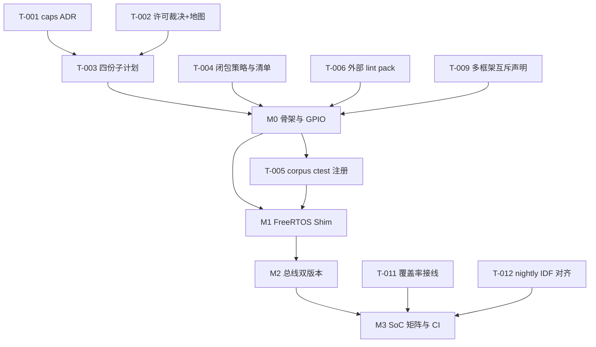
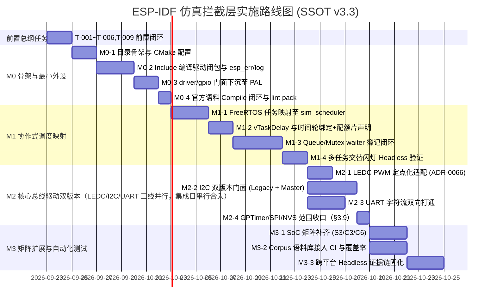

# PLAN-20260922-ESP-IDF-SIM-MASTER: ESP-IDF 源码级仿真拦截层实施总纲计划

> 📋 **本文档为实施总纲计划（Layer-③ 实施总纲）**，定义了在 WinkMicroOS 仿真体系中实现 `frameworks/esp_idf` 源码级 API 拦截层的完整架构设计、SoC 矩阵解耦、ESP-IDF v5/v6 双版本兼容方案、FreeRTOS 协作式调度映射以及派生子计划体系。
> 本文档是指导总纲级任务（T-001~T-012）与 M0~M3 分步实施子计划的 **唯一事实来源（SSOT）与执行第一纲领**。子计划仅允许细化，**不得突破本总纲的架构红线、接口契约与验收出口**；发现冲突必须先回改本总纲并升版。
>
> 🎯 **计划版本**：v3.3（2026-09-23，融合 11 条代码事实评审：P0 Handle ABA + resource_id 阻塞开工项，其余下沉 M1/M2）
> 📚 **关联规范**：[`docs/zh/tech-designs/mcs51/mcu-compat-plan.md`](../../zh/tech-designs/mcs51/mcu-compat-plan.md)（双轴模型）、[`00-IMPLEMENTATION-PLAN-TEMPLATE.md`](../00-IMPLEMENTATION-PLAN-TEMPLATE.md)
> 🏛️ **关联架构决策**：
> - [ADR-0001](../../decisions/core/0001-error-code-sign-convention.md)（负数错误码约定）
> - [ADR-0004](../../decisions/core/0004-static-dispatch-vs-runtime-ops.md)（静态分发与无虚表）
> - [ADR-0012](../../decisions/core/0012-contract-honesty-over-silent-degradation.md)（合约诚实，不支持接口 Fail-Loud）
> - [ADR-0014](../../decisions/unisim/0014-sim-single-virtual-core.md)（单虚拟核协作式任务调度器）
> - [ADR-0045](../../decisions/unisim/0045-simulation-memory-quota-and-fault-policy.md)（仿真内存配额与硬预算）
> - [ADR-0064](../../decisions/core/0064-target-capability-ssot.md)（目标平台与 SoC 能力 SSOT）
> - [ADR-0065](../../decisions/core/0065-pal-hardware-raii-resource-ownership.md)（PAL 独占硬件生命周期 RAII 资源所有权）
> - [ADR-0066](../../decisions/core/0066-pwm-basis-points-and-float-deprecation.md)（PWM 占空比定点运算）
> - [ADR-0070](../../decisions/core/0070-mcs51-zero-code-simulation-interception-layer.md)（外部框架运行时桥接与 Fiber 生命周期）
> - [ADR-0072](../../decisions/core/0072-dual-clock-domain-and-quota-catchup.md)（双时钟域与配额片强制切出，10,000 μs/片）
> - [ADR-0080](../../decisions/core/0080-external-lint-pack-discovery-and-mcs51-guard-sinking.md)（框架外部 lint pack 自动发现机制）
> - [ADR-0082](../../decisions/core/0082-mcs51-reset-semantics-fiber-exit-and-reentry.md)（系统重启与重入语义）
> - [ADR-0083](../../decisions/core/0083-adopt-gpl-3.0-only-license-policy.md) / [ADR-0084](../../decisions/core/0084-layered-license-map-lgpl-runtime.md)（开源许可分层：运行时 LGPL-3.0-only；`**/test/**` 与框架 tools = GPL-3.0-only）
>
> 🔍 **关联评审报告**：[`2026-09-22-esp-idf-simulation-interception-master-plan-review.md`](./2026-09-22-esp-idf-simulation-interception-master-plan-review.md)（v1.0 Review 的全部 P0/P1 已在 v2.0 闭环；v3.0 进一步闭环专家评审提出的机制性错误、事实核查差异与模板合规缺口）
> 📐 **事实核查基线**：ESP-IDF `v6.1` 官方源码树（本机取证路径见 §9.2.1，外部依赖登记见 §4.5 E-001）+ 本仓 `wink_sim_scheduler`/`license-map`/CI 实测（2026-09-23）

---

## 1. 元数据表

| 字段 | 内容 |
|:---|:---|
| **计划编号** | `PLAN-20260922-ESP-IDF-SIM-MASTER` |
| **创建日期** | 2026-09-22（v2.0 修订于 2026-09-23；v3.0 修订于 2026-09-23；v3.2~v3.3 修订于 2026-09-23） |
| **目标平台/SoC** | `wasm32-unknown-emscripten` / `host` (x86_64, Windows/Linux)；语料对照 SoC：`esp32` / `esp32s3` / `esp32c3` / `esp32c6` |
| **工具链/SDK版本**| `ESP-IDF v5.1.3 LTS` ~ `v6.1+`（语料与宏取证基线 = v6.1；v5.x 做双版本兼容回归） |
| **计划状态** | 📋 就绪（v3.3 融合 11 条代码事实评审，P0 已闭环，可作为执行 SSOT 第一纲领） |
| **优先级** | 🔴 P0（运行时框架层核心演进） |
| **计划版本** | `v3.3` |
| **关联技术设计** | [`docs/zh/tech-designs/core/pal-i2c-v6-compatibility.md`](../../zh/tech-designs/core/pal-i2c-v6-compatibility.md) |
| **关联设计规范** | [`docs/zh/design/04-wasm-simulation/00-README.md`](../../zh/design/04-wasm-simulation/00-README.md)、[`02-wink-micro-os/`](../../zh/design/02-wink-micro-os/README.md) |
| **关联评审记录** | [`2026-09-22-esp-idf-simulation-interception-master-plan-review.md`](./2026-09-22-esp-idf-simulation-interception-master-plan-review.md) |
| **关联 ADR** | 见页眉关联架构决策列表（含 0001/0004/0012/0014/0045/0064/0065/0066/0070/0072/0080/0082/0083/0084） |
| **目标里程碑** | M0 ~ M3（见 §6） |
| **前置依赖计划** | D-001 ~ D-005（见 §5.1，含总纲级任务 T-001~T-003 完成） |
| **替代/废弃** | 替代本文件 v2.0；废止 `PLAN-2026xxxx-*` 旧式子计划命名（改用模板规定的 `YYYY-MM-DD-*-plan.md`） |
| **计划负责人** | Wink 核心运行时组 / 仿真拦截专项小组 |
| **所属层级** | 轴 B：仿真拦截层（`wink-micro-os/frameworks/esp_idf`）*（注：此处轴 B 指 mcu-compat 双轴模型中生态拦截轴，区别于 UniSim A~F 的 B 时间基轴）* |
| **派生子计划** | - `M0`: [`2026-09-23-esp-idf-sim-m0-gpio-plan.md`](./2026-09-23-esp-idf-sim-m0-gpio-plan.md)（骨架与最小 GPIO 闭环）<br>- `M1`: [`2026-09-24-esp-idf-sim-m1-freertos-plan.md`](./2026-09-24-esp-idf-sim-m1-freertos-plan.md)（FreeRTOS 调度器 Shim）<br>- `M2`: [`2026-09-25-esp-idf-sim-m2-bus-plan.md`](./2026-09-25-esp-idf-sim-m2-bus-plan.md)（总线外设双版本与定点 PWM）<br>- `M3`: [`2026-09-26-esp-idf-sim-m3-soc-ci-plan.md`](./2026-09-26-esp-idf-sim-m3-soc-ci-plan.md)（SoC 矩阵扩展与语料测试自动化） |
| **主要依赖技能** | `embedded-best-practice` |

---

## 2. 背景与核心定性

### 2.1 问题陈述（🔴 模板必选）

WinkMicroOS 现行仿真体系已支持 Wink-Native、Arduino Proxy、MCS-51 C++ 运算符拦截与低端 ISS 四类形态，但 **ESP32 生态缺位**：用户与 AI 生成的代码大量基于 ESP-IDF 原生 C-ABI 编写，无法在浏览器 Wasm 仿真中运行。若改用 Xtensa QEMU 指令级仿真，面临启动慢（MB 级二进制）、帧率低、无法与 UniSim PinArbiter 时钟片同步等痛点，且与既有「行为级高保真 + 虚拟确定性时钟」架构路线冲突。**不解决的后果**：ESP32 轴 B 生态代码只能真机试错，AI 生成链路在 ESP-IDF 形态上断档，双 target 同源承诺失效。

### 2.2 技术目标（可量化，≥3 条）

- ✅ **目标 1**：官方语料（Tier 分级界定见 §7.1）原文 compile-only 零修改编译通过率 100%。
- ✅ **目标 2**：同一套门面源码同时通过 host（GCC/Clang `-Wall -Wextra -Werror`）与 wasm（Emscripten）双目标 0 error / 0 warning 构建。
- ✅ **目标 3**：FreeRTOS 语义 100% 桥接至既有 `wink_sim_scheduler`（不新建调度器），多任务交错 Replay 轨迹 bit-exact 一致。
- ✅ **目标 4**：SoC 能力矩阵（esp32/s3/c3/c6）按芯片真实 `SOC_*` 宏 Fail-Loud 校验，越界引脚 100% 拦截。
- ✅ **目标 5**：运行期 0 裸 `malloc`、门面层 0 `pal_resource_claim`、PWM 全定点——三条红线全部由 lint pack 机器强制（非仅文档约定）。

### 2.3 成功指标（验收出口）

| 指标 | 验收标准 | 验证方法 |
|:---|:---|:---|
| **官方语料编译通过率 (Corpus)** | Tier-A 语料（界定见 §7.1）原文 compile-only 零修改 100% 通过 | `ctest -R esp_idf_corpus`（注册方式见 §7.1） |
| **运行时单测通过率** | Host 与 Wasm 单元测试 100% 通过，0 assertion failure | `winkcli test --with-wasm` / `ctest`（⚠️ 本仓**不存在** `python wink.py test`，v2.0 该表述已废止） |
| **构建警告度** | Emscripten 及 GCC/Clang 编译 0 error, 0 warning（严格 `-Wall -Wextra -Werror`） | CI `pr.yml` host/wasm job 构建日志 |
| **分层与 API 门禁** | `winkcli lint --pack layering --pack api --pack isr_safety --pack wasm_parity` 全绿 + `frameworks/esp_idf/tools/lint/` 外部 pack（ADR-0080）全绿 | CI `pr.yml` / `clang-tidy.yml` + ctest 注册的外部 pack |
| **时序与回放确定性** | 多任务交替调度严格按虚拟逻辑时间步进，Replay 轨迹哈希 100% 一致 | Headless Evidence（执行落点见 T-008 / §7 L2） |
| **分层与许可合规** | `check_license_map.py` 全绿 **且** 许可地图与 ADR-0084 文字语义一致（T-002 裁决后） | CI `license-gate.yml` + T-002 验收 |
| **静态分析** | `clang-tidy-17` 对新增 `frameworks/esp_idf/src/*.c` 0 error（CI 自动覆盖，无需额外接线） | CI `clang-tidy.yml` |

---

## 3. 架构设计与目录拓扑（SSOT 事实标准）

### 3.1 完整自洽的目录组织树

新模块布局在 `wink-micro-os/frameworks/esp_idf`，对齐 `frameworks/mcs51` 既有成熟架构惯例：

```
wink-micro-os/frameworks/esp_idf/
├── CMakeLists.txt                    # ESP_PLATFORM 早退；host/wasm STATIC EXCLUDE_FROM_ALL
├── esp_idf_sources.cmake             # 源文件与头文件路径导出清单（SSOT 事实源）
├── README.md                         # 拦截原理、支持矩阵、多框架互斥声明（T-009）、开发者 SOP
├── docs/
│   ├── 01-architecture-and-governance-guide.md # 架构拓扑与生命周期规范
│   ├── 02-api-coverage-matrix.md     # Must/Should/Out-of-scope 矩阵 + 错误码映射表
│   │                                 #   + 语料 Tier 分级表 + 语义降级登记（优先级/双核，ADR-0012）
│   └── 03-include-closure-inventory.md # ★ 传递 include 闭包清单（编译驱动增量维护，见 §3.2）
├── include/                          # 虚拟系统 include 根目录（对齐 IDF 原生包含路径）
│   ├── sdkconfig.h                   # ★ CONFIG_IDF_TARGET_*、CONFIG_FREERTOS_HZ=100、
│   │                                 #   CONFIG_LOG_DEFAULT_LEVEL=3；语料 Kconfig 宏注入（如 CONFIG_BLINK_GPIO）
│   │                                 #   ⚠️ 不定义 ESP_PLATFORM（全局注入会污染 pal_target_caps 等真机分支）
│   ├── esp_err.h / esp_check.h       # ESP_OK, ESP_FAIL, ESP_ERROR_CHECK, ESP_RETURN_ON_ERROR 等
│   ├── esp_log.h                     # 日志门面；⚠️ 透传官方分片闭包：esp_log_config/level/color/
│   │                                 #   buffer/timestamp/write/format/args/attr.h + esp_private/log_attr.h
│   ├── esp_attr.h                    # IRAM_ATTR, DRAM_ATTR, RTC_DATA_ATTR 等宏消解为空
│   ├── esp_system.h / esp_timer.h / esp_random.h / esp_chip_info.h / esp_idf_version.h
│   ├── esp_pm.h                      # ★ ledc_basic 语料直接 include（PM 桩：CONFIG_PM_ENABLE 未定义时全空）
│   ├── esp_heap_caps.h / esp_assert.h / esp_macros.h / esp_bit_defs.h / esp_compiler.h
│   ├── esp_intr_alloc.h / esp_intr_types.h   # driver/gpio.h 传递依赖
│   ├── esp_rom_sys.h                 # esp_log.h 传递依赖
│   ├── esp_task_wdt.h                # 虚拟看门狗桩（Fail-Loud/No-op 可配）
│   ├── nvs.h / nvs_flash.h           # 虚拟 NVS 键值存储（对接 UniSim 虚拟存储）
│   ├── led_strip.h                   # ★ 语料闭包：外部托管组件 espressif/led_strip 的声明级 stub
│   │                                 #   （见 §7.1 零修改边界裁决；LED_STRIP 分支未启用则零链接依赖）
│   ├── freertos/                     # FreeRTOS 调度与并发门面
│   │   ├── FreeRTOS.h                # 基础宏 + ★ 无条件 #include "freertos/idf_additions.h"
│   │   │                             #   （复刻官方被 #ifdef ESP_PLATFORM 守卫的隐式包含，见 §4.3）
│   │   ├── FreeRTOSConfig.h          # configTICK_RATE_HZ(100)、configMAX_PRIORITIES(25)（与 IDF 默认一致）
│   │   ├── task.h / queue.h / semphr.h / timers.h
│   │   ├── stream_buffer.h / message_buffer.h / event_groups.h  # ★ idf_additions.h 传递闭包
│   │   └── idf_additions.h           # xTaskCreatePinnedToCore, xTaskGetCoreID 等多核扩展
│   ├── driver/                       # 外设驱动 API 统一头文件池
│   │   ├── gpio.h                    # gpio_config, gpio_set_level, gpio_get_level, gpio_reset_pin
│   │   ├── uart.h / ledc.h / gptimer.h / spi_master.h
│   │   ├── i2c_master.h              # v5.3+ / v6 新一代对象式 I2C Master 驱动
│   │   ├── i2c.h                     # v4 / v5 经典遗留驱动（v6 EOL，v7 计划移除）
│   │   ├── i2c_types.h               # ★ 现代驱动基础类型（driver/i2c_master.h 传递依赖）
│   │   └── i2c_types_legacy.h        # ★ i2c_cmd_handle_t 实际所在（不在 hal/，v3.0 事实修正）
│   ├── hal/                          # 基础类型定义头文件
│   │   ├── gpio_types.h / ledc_types.h / uart_types.h
│   │   └── i2c_types.h               # 仅 i2c_port_t 等（⚠️ 不含 i2c_cmd_handle_t）
│   └── soc/                          # SoC 动态能力挂接点
│       ├── soc_caps.h                # 透传 chips/${WINK_ESP_TARGET}/include/soc/soc_caps.h
│       │                             #   （官方分属 components/soc/<soc>/，取证双源见 §9.1）
│       └── gpio_num.h                # 透传 chips/.../gpio_num.h（官方分属 components/esp_hal_gpio/<soc>/）
├── chips/                            # 各 SoC 硬件能力与引脚矩阵描述（对齐原厂定义）
│   ├── esp32/     include/soc/{soc_caps.h, gpio_num.h}   # GPIO:40, I2C:2, LEDC:8
│   ├── esp32s3/   include/soc/{soc_caps.h, gpio_num.h}   # GPIO:49, I2C:2, LEDC:8
│   ├── esp32c3/   include/soc/{soc_caps.h, gpio_num.h}   # GPIO:22, I2C:1, LEDC:6
│   └── esp32c6/   include/soc/{soc_caps.h, gpio_num.h}   # GPIO:31, I2C:2, LEDC:6
├── src/                              # 拦截垫片实现（纯 C 语言编写）
│   ├── esp_idf_runtime.c             # wink_app_get_callbacks 契约与 app_main 主 Fiber 引导
│   ├── esp_idf_bridge.c              # 系统生命周期、esp_restart 与版本运行时查询
│   ├── core/
│   │   ├── esp_err.c                 # esp_err_from_wink 双向转换表与 ESP_ERROR_CHECK 陷阱
│   │   ├── esp_log.c                 # 日志等级过滤与 pal_log_* 桥接
│   │   ├── esp_system.c / esp_timer.c / esp_nvs.c
│   ├── freertos/                     # FreeRTOS 门面层（严格映射到 wink_sim_scheduler）
│   │   ├── freertos_task.c           # xTaskCreate, vTaskDelay -> sim_scheduler_*；优先级降级登记
│   │   ├── freertos_queue.c          # ★ 自建 per-queue waiter 簿记（FIFO/超时竞态），见 §4.3.3
│   │   ├── freertos_semphr.c         # 互斥量与信号量 -> 队列 + 调度器阻塞（含 waiter 簿记）
│   │   └── freertos_additions.c      # xTaskCreatePinnedToCore（忽略核心绑定，安全降级）
│   └── drivers/                      # 外设 API 门面层（汇聚到 PAL）
│       ├── esp_gpio.c                # -> pal_gpio_*（遵从 ADR-0065，严禁门面二次 claim）
│       ├── esp_uart.c / esp_ledc.c / esp_i2c_legacy.c / esp_i2c_master.c
│       ├── esp_gptimer.c / esp_spi.c
├── tools/
│   ├── run_esp_idf_headless_evidence.ps1 # Headless 确定性仿真证据链（落点见 T-008）
│   └── lint/                         # ★ ADR-0080 外部 pack：lint_esp_idf_isolation.py 等
│                                     #   （机器强制红线 3/4/5/7；注册进 ctest，见 T-006）
└── test/                             # 自动化分层测试集（许可 = GPL-3.0-only，见红线 7 / T-002）
    ├── core/                         # 门面基础单元测试（Unity host 运行）
    ├── samples/                      # 典型业务场景闭环用例（Blinky、多任务交互、I2C 传感器）
    ├── corpus/                       # ★ 原厂 examples 原文 compile-only 语料测试（Tier 分级见 §7.1）
    └── wasm/                         # emcc + Node.js Wasm 宿主测试
```

### 3.2 依赖闭包设计（v3.0 规模修正：低估 5~10 倍 → 编译驱动增量闭包）

**v2.0 缺陷**：§3.2 仅列 4 类闭包，隐含规模 ~33 头；对 ESP-IDF v6.1 实测传递 include BFS 显示 **blink 单文件 ≥65 个 quoted 头（缺口 ≈48），ledc_basic 另缺 9**，规模低估约 5~10 倍。预先穷举不可行且易腐烂，v3.0 改为 **「编译驱动增量闭包」策略**：

1. **策略**：以 Tier-A 语料为驱动器——编译报错 → 补最小桩头 → 登记入 `docs/03-include-closure-inventory.md`（含来源示例、官方原路径、桩策略：空实现/宏消解/透传）→ 回归 `ctest -R esp_idf_corpus`。**禁止**一次性猜测铺满目录树。
2. **已知必须家族**（v3.0 事实核查清单，M0 起优先铺设）：
   - `sdkconfig.h` 构建期宏（含语料 Kconfig 私有宏注入，如 `CONFIG_BLINK_GPIO`）；
   - `esp_attr.h` 内存修饰宏消解；
   - `esp_log.h` 9 个官方分片 + `esp_private/log_attr.h`；
   - `driver/gpio.h` 注入链：`esp_intr_alloc.h`、`esp_rom_gpio.h`、`driver/gpio_etm.h`、`esp_etm.h`、`hal/etm_types.h`；
   - FreeRTOS 内核链：`projdefs.h`、`portable.h`、`portmacro.h`、`list.h`、`freertos/FreeRTOSConfig_arch.h`、`stream_buffer.h`、`message_buffer.h`、`event_groups.h`；
   - `idf_additions.h` 自注入：`esp_heap_caps.h`、`esp_task.h`；
   - SoC 内部：`soc/soc_caps_eval.h`、`soc/gpio_pins.h`、`soc/clk_tree_defs.h`（仅宏级，不引入寄存器头）；
   - 语料专有：`esp_pm.h`（ledc_basic）、`led_strip.h`（blink，声明级 stub，见 §7.1）。
3. **守卫陷阱（已裁决）**：官方 `FreeRTOS.h` 对 `idf_additions.h` 的隐式包含位于 `#ifdef ESP_PLATFORM` 内。**裁决：不全局定义 `ESP_PLATFORM`**（会污染 `pal_target_caps.h` 等真机分支语义），改由本仓 `freertos/FreeRTOS.h` 桩**无条件**包含 `idf_additions.h`，行为等价、影响面最小。
4. **多语料 `sdkconfig.h` 冲突裁决（v3.1 新增，v3.2 修订可移植性，🔴 M0 设计前提）**：不同 Tier-A 语料的 Kconfig 私有宏互斥（如 `CONFIG_BLINK_GPIO` 仅属 blink），**严禁把全部语料宏塞进单一全局 `sdkconfig.h`**（会互相污染且随语料增加而腐烂）。机制锁定为**两层结构**：
    - **基础层** `include/sdkconfig_base.h`：仅放平台公共宏（`CONFIG_IDF_TARGET_*`、`CONFIG_FREERTOS_HZ`、`CONFIG_LOG_DEFAULT_LEVEL` 等，不叫 `sdkconfig.h`，避免与语料层同名冲突）；
    - **语料 overlay 层** `test/corpus/<sample>/include/sdkconfig.h`：首行显式 `#include "sdkconfig_base.h"` 后再定义本示例的 Kconfig 私有宏，CMake 为每个 `esp_idf_corpus_<sample>` 目标将**本语料 overlay 置于 include 路径首位**（`BEFORE PRIVATE`，与 §3.3.2 chips 路径前置同一手法）；
    - **严禁 `#include_next`**（MSVC 不支持，不可移植）；宏数量少时允许直接 `-DCONFIG_XXX=...` 编译期注入，不建文件。
5. **验收**：每条闭包登记项可追溯到至少一个 Tier-A 语料的编译错误；`03-include-closure-inventory.md` 与 ctest 同步演进（L3 文档验收项）。

---

### 3.3 SoC 差异解耦方案与能力 SSOT 对齐

#### 3.3.1 差异本质与宏名真实取证（v3.0 已对 IDF v6.1 源码逐项实测，0 偏差）

| SoC 型号 | 官方核心宏与真实数值 | 关键引脚与硬件限制 |
|:---|:---|:---|
| **ESP32** (经典) | `SOC_GPIO_PIN_COUNT=40`<br>`SOC_I2C_NUM=2`<br>`SOC_LEDC_CHANNEL_NUM=8` *(硬件 16 通道拆 HS/LS 各 8，IDF 统一按 8 暴露)* | GPIO 34~39 仅限输入（`SOC_GPIO_VALID_OUTPUT_GPIO_MASK` 清除 BIT34~39）；排除引脚 24, 28~31；支持 `SOC_LEDC_SUPPORT_HS_MODE` |
| **ESP32-S3** | `SOC_GPIO_PIN_COUNT=49`<br>`SOC_I2C_NUM=2`<br>`SOC_LEDC_CHANNEL_NUM=8` | 排除引脚 22~25；双核 Xtensa LX7 |
| **ESP32-C3** | `SOC_GPIO_PIN_COUNT=22`<br>`SOC_I2C_NUM=1`<br>`SOC_LEDC_CHANNEL_NUM=6` | 单核 RISC-V；无高频模式（无 `SOC_LEDC_SUPPORT_HS_MODE`） |
| **ESP32-C6** | `SOC_GPIO_PIN_COUNT=31`<br>`SOC_I2C_NUM=2`<br>`SOC_LEDC_CHANNEL_NUM=6` | RISC-V + Wi-Fi 6 / 802.15.4 |

> 取证：`components/soc/<soc>/include/soc/soc_caps.h`（v6.1 tag，2026-09-23 实测）。

#### 3.3.2 解决与 ADR-0064 `pal_target_caps.h` 的能力冲突（🔴 前置 ADR，T-001）

- **冲突事实**：仿真构建永远命中 `pal_target_caps.h` 的 `__wasm__/host` 硬编码分支（`PAL_PWM_CHANNEL_MAX=8, PAL_I2C_PORT_MAX=2, PAL_GPIO_PIN_MAX=50, ...`），而 `chips/${WINK_ESP_TARGET}` 按单芯片严校（C3 I2C=1、C6 GPIO=31）→ **双 SSOT 分叉**：门面认为合法的操作，PAL 侧配额视图可能不一致（反向：PAL 宽松不卡门面，风险方向为「门面严于 PAL」的双规则漂移）。
- **裁决（本总纲锁定方案 A + 补偿措施）**：
  1. 构建时传入 `-DWINK_ESP_TARGET=esp32c3`；CMake 将 `chips/${WINK_ESP_TARGET}/include` 置于包含路径**首位**。**未指定时默认 `esp32`**（经典芯片引脚最宽，避免默认过严卡死语料）。
  2. **门面以 `SOC_*` 与 `GPIO_IS_VALID_GPIO` 为唯一合法性判据**，越界直接 `ESP_ERR_INVALID_ARG`（仿真对单芯片能力 100% 还原）。
  3. `pal_target_caps.h` 的 wasm/host 硬编码值视为 **PAL 层绝对上限**（不因芯片缩小），两层职责显式划界：**门面管「芯片能做什么」，PAL caps 管「仿真宿主最多能开多少」**；该划界写入 T-001 ADR。
  4. 长期项：对齐 `mcu-compat-plan.md §4.1` 已提出的「caps 自注入重构」（分发 `targets/*/pal_target_caps_*.h`），作为 ADR 后续演进方向，不阻塞 M0。
- **状态**：D-003 → **T-001（前置阻塞 M0）**：按文档流转规则先出 ADR 再动代码，Accepted 后回写 `02-wink-micro-os` 设计规范。

---

### 3.4 ESP-IDF v5 与 v6/v7 双版本演进与兼容方案

#### 3.4.1 官方事实修正与版本生命周期定义（v3.0 精度修订）

- **v5.x**：Legacy 驱动与新一代 Handle 驱动共存。
- **v6.x**：Legacy I2C 仍保留在 `driver/i2c.h`，标记 **EOL**，机制为 **`#pragma message`（编译期 message，非 `#warning`——`-Werror` 下不失败，语料 0 warning 门禁不受影响）**，抑制开关 `CONFIG_I2C_SUPPRESS_DEPRECATE_WARN`。legacy Timer/ADC/DAC/RMT/I2S 以及 **SPI(`driver/spi.h`)、MCPWM、PCNT、temp_sensor、sigmadelta、periph_ctrl、rtc_cntl 彻底移除**（v2.0 列举不完整，v3.0 补齐）。用户包含路径仍为 `driver/*.h`，**严禁预置虚假的 `esp_driver_*` 头文件路径**（`esp_driver_*` 仅组件名；唯一前缀例外：ADC 新头走 `esp_adc/`）。
- **v7.0**（未来计划）：官方彻底移除 Legacy I2C。

#### 3.4.2 双门面共存设计（Dual-Facade Pattern）

1. **统一头文件池**：同时暴露 `driver/i2c.h`（Legacy）与 `driver/i2c_master.h`（Modern），配套 `driver/i2c_types.h` 与 `driver/i2c_types_legacy.h`。
2. **底层收敛至单一事实源**：无论 `i2c_master_write_read_device()` 还是 `i2c_master_transmit()`，内部统一收敛后调用：
   ```c
   pal_i2c_transfer(port, addr, tx_buf, tx_len, rx_buf, rx_len, timeout_ms);
   ```
3. **静态对象句柄池（Static Handle Pool）**：`i2c_master_bus_handle_t` 等对象句柄由预分配 POD 静态数组发放（如 `static esp_i2c_bus_t s_bus_pool[2]`），禁止初始化期无节制 `malloc`（ADR-0045）。
4. **语料选材修正（v3.0）**：官方 `examples/peripherals/i2c/*` **已 100% 迁移**到 `i2c_master.h`，无 legacy 示例；Legacy 半边语料改用 `components/driver/test_apps/legacy_i2c_driver/main/test_i2c.c`（**原文不改**，由平台提供 `unity.h` 兼容 stub），登记为 Tier-B 适配语料（见 §7.1）。

---

### 3.5 FreeRTOS 并发模型的轻量化映射（复用 `wink_sim_scheduler`，v3.0 语义勘误）

严禁另起炉灶实现并发时间轮；FreeRTOS 语义全部桥接至既有 `targets/common/include/wink_sim_scheduler.h`（ADR-0014 / ADR-0045）。

#### 3.5.1 门面映射契约（四个 API 签名已对头文件逐字核实）

1. **任务创建（`xTaskCreate` / `xTaskCreatePinnedToCore`）**：
   - 调用 `sim_scheduler_register(func, arg, name, priority, core_id, stack_depth, &out_id)`。注意调度器返回的是 **slot 下标**（见 `wink_sim_scheduler.c:111-113`，`gc` 后 slot 可复用），**不是终身稳定的 `t->id`**。
   - **Handle 生命周期隔离（v3.3 新增，🔴 M1 前提）**：门面不得把 slot 直接当 `TaskHandle_t` 交给用户，否则动态创建/删除复用 slot 会出现 ABA（旧句柄误操作新任务）。`freertos_task.c` 必须维护 `handle → {slot, generation}` 间接层（POD 静态池，`vTaskDelete` 时递增 generation，旧 handle 即失效）；M1 DoD 含 ABA 回归测试（见 §7 L1）。
   - `core_id` 范围校验后安全忽略（单虚拟核）；`xTaskGetCoreID()` 恒返回 0（与 IDF 单核语义一致）。
   - ⚠️ **语义降级（ADR-0012 诚实登记）**：调度器 `pick_next` 为**纯 RR，不读 priority/core_id**——FreeRTOS 25 级优先级**无调度效果**（但 waiter 唤醒序仍按优先级，见条目 3）。必须在 `02-api-coverage-matrix.md` 显式登记「优先级：存储但不参与调度」，M1 子计划 DoD 含此项；优先级调度列为 Out-of-scope（需新 ADR 才可引入）。
2. **任务阻塞延时（`vTaskDelay` / `vTaskDelayUntil`）**：
   - `configTICK_RATE_HZ=100`（与 IDF 官方默认一致，1 tick = 10,000 μs；**仿真固定不可改**，见条目 6 降级登记）；调用 `sim_scheduler_yield_timed(task_id, now_us, duration_us)` 让出 Fiber。
   - ⚠️ 唤醒主体勘误：由 run 主循环 `sim_scheduler_wakeup_by_time(now_us)` 依虚拟/host 时钟推进（**非 UniSim 直接回调**）。
   - **`vTaskDelay(0)` 纯让出（v3.3 新增）**：真机语义 = `taskYIELD()`（不进等待态，只让同优先级任务先跑）。shim 中 `ticks == 0` 时**不得调用 `yield_timed(..., 0)`**（会在同一 tick 内调度-让出空转），而是直接协作切回调度主循环、保持 READY 态由 RR 自然轮转；M1 DoD 含 `vTaskDelay(0)` 让出序断言。
3. **同步原语（Queue / Semaphore / Mutex / EventGroup）**：
   - 基于 `sim_scheduler_block(task_id, resource_id, now_us, timeout_us)` 与 `sim_scheduler_resume(task_id)`。
   - ⚠️ **调度器无 per-resource 等待队列**（只记 `blocked_on`，`resume` 按 task_id 单唤醒）→ **Queue/Mutex shim 必须自建 waiter 簿记**（每对象 `waiters[WINK_SIM_MAX_TASKS]`、超时竞态、与 `wakeup_by_time` 的 `timeout_fired` 协同）；参照先例 `pal_osal_wasm.c` mutex/sem 池。这是 M1 最大隐藏工作量，**单列任务**（见 §6 M1-3）。
   - **`resource_id` 命名空间（v3.3 新增，🔴 M1 接口契约）**：`blocked_on` 只是 `uint32_t` 琴键（见 `wink_sim_scheduler.c:189-198`），调度器不做分配；若 Queue 与 Mutex 各自从 0 编号，shim 的 waiter 查找会跨对象错唤醒。锁定编码 **`resource_id = (type_tag << 24) | local_index`**（`QUEUE=0x01, MUTEX=0x02, SEM=0x03, TIMER=0x04, GPTIMER=0x05`），或等价的对象静态池地址低 32 位（地址天然唯一，二选一后在 M1 登记）。
   - **唤醒策略三分（v3.3 新增）**：`resume` 每次只唤醒单个 task，shim 按原语区分——① **Priority-one**（Queue/Sem/Mutex：唤醒等待者中优先级最高者，同优先级内 FIFO，真机即此语义）；② **Broadcast-all**（EventGroup：唤醒所有满足位条件的等待者）。EventGroup 若 M1 不做，真实现推 M2/M3，但 `event_groups.h` 已在闭包中，须在 coverage matrix 标明「仅声明 / Fail-Loud」状态，不得静默半实现。
4. **强制切出与死循环（v3.0 机制勘误，撤销 v2.0 错误表述）**：
   - **WCET 5000 μs 是 fiber 返回后的墙钟事后检测** → 触发 `wink_runtime_fault(8002)` **告警，不能抢占正在死循环的 fiber**。
   - **真正的强制切出是 ADR-0072 配额片机制**（10,000 μs/片，经 `pal_os_sleep_ms(0)` 协作切出）。
   - 纯 `while(1){}` 无拦截点是协作式模型硬限制：WCET 8002 兜底 + coverage matrix 诚实声明；**严禁在计划/文档中再写「WCET 超时强制让出」**。
5. **硬预算与安全性保证（v3.0 内存重算）**：
   - 任务总数 `WINK_SIM_MAX_TASKS = 8`；**`app_main` 与 runtime 主 fiber 均计入该上限**，多语料/多样例同链时须预算任务数；
   - **wasm 单 fiber 实际栈开销 = 数据栈（min 16KB，本计划按传入 32KB）+ 必然 64KB Asyncify 栈 ≈ 96KB**；8 任务上限 ≈ **768KB**（v2.0「256KB 以内」低估 3 倍，已废止）；host 单 fiber 32KB（Win32 Fiber 真实栈）。
   - 静态结构体池（句柄/总线/waiter）目标 < 16KB；Wasm 总量对照见 §3.8。
   - 100% 单线程虚拟时钟推进，消除真实多线程竞态，Replay 确定可回放。
6. **其余 FreeRTOS 语义映射契约（v3.1 补全，v3.2 增补时间基/栈/预算/确定性，M1 DoD）**：
    | 语义 | 映射方案 | 降级/备注 |
    |:---|:---|:---|
    | `vTaskDelete` | `mark_zombie` + `gc_zombies`（调度器既有僵尸回收） | 删除后句柄使用 = 未定义行为（与真机一致，不额外保护） |
    | `xTimerCreate/Start/Stop` | **不单开 Timer Daemon 任务**；静态 timer 池 + 到期时间并入 `sim_scheduler` 唤醒源（或复用 runtime 主 fiber 软定时器派发，M1 二选一后登记） | 回调在调度上下文同步执行，禁止回调内长阻塞 |
    | Idle 任务 / `vApplicationIdleHook` | 不建模（RR 协作调度无真实 idle 槽） | 降级登记 |
    | `xQueueOverwrite`/`xQueuePeek`/ISR 级 API | 支持 Peek；`FromISR` 变体经 `pal_deferred` defer 到任务上下文（见 §3.7.2），无 defer 条件时才 Fail-Loud | defer 策略进 Out-of-scope 表 |
    | `app_main` 返回 | 视同任务正常退出 → `mark_zombie`；**不支持真机「app_main 退出后系统仍运行」的隐式 idle 语义**时须在 coverage matrix 登记实际行为 | M1 裁决后登记 |
    | 时间基统一 | 唯一换算 `tick = now_us / 10000`；`esp_timer_get_time` / `xTaskGetTickCount` / `gptimer alarm` 同源自 `sim_scheduler` 虚拟时钟，不单开 Timer 源 | M1 DoD |
    | Tick 配置冻结 | `configTICK_RATE_HZ` 仿真固定 100（1 tick = 10 ms），不可经 menuconfig 修改；`pdMS_TO_TICKS(x)` 按 100Hz 整除截断——**`< 10 ms 的延时会被截断为 0`**（如 `pdMS_TO_TICKS(5) = 0`，真机 1000Hz 下为 5，这是功能性差异不是普通降级） | `sdkconfig_base.h` 注释 + coverage matrix 降级登记；1000Hz overlay 列为 M3 可选项 |
    | `esp_timer_get_time` 精度 | 真机 1 μs，仿真 = 10 ms（`sim_scheduler` 步进粒度）；微秒级差值测量（如超声波 `end - start`）结果恒为 10000 的整数倍 | coverage matrix 降级登记；子 tick 插值（如引入）仅做读数侧伪精度、不进调度时间，否则破坏 Replay bit-exact（远期项） |
    | EventGroup | M1 若只交付 Queue/Mutex/Sem，`event_groups.h` 保持「仅声明 / Fail-Loud」，广播语义随真实现推 M2/M3 | coverage matrix 状态列明，不得静默半实现 |
    | 栈单位 | IDF `usStackDepth` 单位 = words，门面换算 `bytes = words * 4` 再钳制到 `WINK_SIM_STACK_MIN`（见 `wink_sim_scheduler.c:83-88`） | M1 |
    | 任务预算 | `WINK_SIM_MAX_TASKS = 8` 扣掉 app_main + runtime 主 fiber + Timer 软派发位，用户可用 ≤ 6；`uxTaskGetNumberOfTasks` 差值进降级表 | M1 |
    | 确定性 | `esp_random` 用门面自带 xorshift、`framework_init` 取与 `sim_scheduler_reset(seed)` 同一种子；`chip_info` / `mac` / `version` 按 `WINK_ESP_TARGET` 返回固定伪值 | M0 |
    | `vTaskDelayUntil` | 绝对时间追赶语义，不等价 `vTaskDelay`；溢出任务直接返回（同真机） | M1 |
    | 临界区 / 静态分配 | `portENTER_CRITICAL` → `pal_os_critical_enter`（task），ISR 上下文 → `_isr` 变体（ADR-0016）；`xTaskCreateStatic` / `xQueueCreateStatic` 首批支持，动态版走静态池，耗尽返回 `NULL` / `ESP_ERR_NO_MEM` | M1 |

---

### 3.6 运行时生命周期接入（ADR-0070/0082，v3.0 改按代码事实而非文档描述）

> ⚠️ v2.0「init 中注册 app_main 为 ID 0 首个 fiber」跟随的是 `mcu-compat-plan.md`/ADR-0070 的**文档描述**，与**真实代码**不符（runtime 统一注册，ID 取决于空槽顺序）。v3.0 按代码事实重述：

1. **实现契约**：`src/esp_idf_runtime.c` 导出**强符号**：
   ```c
   const wink_app_callbacks_t* wink_app_get_callbacks(void);  // 定义见 runtime/include/wink_app.h
   ```
   返回 `{init=esp_idf_framework_init, loop=esp_idf_app_loop, 其余 nullptr}`（对齐 `mcs51_bridge.cpp` 强符号模式）。
2. **生命周期（代码事实）**：
   - `init` 回调：虚拟环境初始化（Log、Err 表、VFS 桩、调度器重置、`app_main` 注册意图登记）；
   - **fiber 注册由 `wink_runtime.c` SIMULATION 分支统一执行**（`sim_scheduler_register(sim_app_main_task, ...)` → `pal_sim_scheduler_run(...)`），esp_idf 门面**不得自行抢注**；
   - `loop` 回调由 runtime 主 fiber 派发；用户 `app_main` 作为框架任务在调度器内运行。
3. **系统复位（ADR-0082，落到具体符号）**：
   - `esp_restart()` **严禁**调用 host `exit()`/`abort()`；
   - 必须走既有优雅复位通道：置 pending reset 标志并经 **`pal_wasm_target_has_pending_reset` / `pal_wasm_target_get_reset_reason` / `pal_wasm_target_clear_pending_reset`** 弱钩子族导出（对齐 `mcs51_bridge.cpp` 先例），交由外部 Runner 做实例级重载；
   - 复位清污清单（对齐 mcs51 八步先例）：调度器僵尸回收、句柄池复位、NVS 脚本状态、边沿/事件队列、引脚回弱上拉、未记账虚拟时间补账（ADR-0072）。
4. **多框架共存（v3.0 新增，T-009）**：esp_idf 与 mcs51 均为**强符号** → **不可同链**；arduino 为弱符号可让位。必须在 `README.md` 与 coverage matrix 声明互斥/优先级关系（构建系统层面保证单一框架入选）。

---

### 3.7 资源治理与错误码映射（严格遵守 ADR-0065 与 ADR-0001）

#### 3.7.1 彻底纠正资源 Claim 逻辑（P0 级红线）
* **历史教训**：在 `gpio_set_level` 等门面调用 `pal_resource_claim()` 会重新引入 Double-Claim Bug（ADR-0065 点名 Arduino `Common.cpp` 为历史病灶，该清理**不阻塞本计划**，另立跟踪项）。
* **SSOT 规范**：
  - 物理硬件资源仅由底层 PAL 在 Init 时自动 Claim、Deinit 时自动 Release；
  - **ESP-IDF 门面层一律严禁直接调用 `pal_resource_claim()`**（由 `tools/lint/` pack 机器强制，见 T-006）；
  - 门面只负责：① 参数边界合法性检查（以当前 `WINK_ESP_TARGET` 的 `SOC_*`/`GPIO_IS_VALID_GPIO` 为准）；② 状态码翻译（`WINK_ERR_RESOURCE_BUSY` → `ESP_ERR_INVALID_STATE`）。

#### 3.7.2 错误码双向转换与合约诚实（ADR-0012）
* Wink 负数错误码（ADR-0001）↔ ESP-IDF `ESP_OK=0 / ESP_FAIL=-1 / ESP_ERR_*=0x101+`：在 `src/core/esp_err.c` 实现 `esp_err_t esp_err_from_wink(wink_status_t status)` 双向映射，L1 穷举断言。
* **合约诚实**：未支持的高阶 API（BLE、Wi-Fi Raw、MCPWM 等）必须 `#error` 或链接期符号缺失，**严禁静默空函数**。
* **首批显式 Out-of-scope 清单（v3.2 修订 ISR-defer，SSOT 细表在 `02-api-coverage-matrix.md`）**：
   - 中断域：`gpio_isr_handler` / `gptimer_alarm_cb` / UART 事件经 `pal_deferred_post_from_isr`（见 `pal_deferred.h:73`）defer 到任务上下文同步派发；`portENTER_CRITICAL` 按 ADR-0016 双入口映射；真正 Fail-Loud 仅保留多核时序依赖 / cache / Flash 加密 / 深度睡眠（`gpio_install_isr_service`、`esp_intr_alloc*` 无 defer 条件时 Fail-Loud）；
   - 无线/高等外设：Wi-Fi、BT/BLE、ESP-NOW、LCD/DMA、MCPWM、PCNT、Sigma-Delta；RMT 占位见下（M0 stub，M2/M4 真门面）；
   - 真机专属：`esp_sleep` 深度睡眠、RTC 看门狗物理行为、Flash 加密；
   - 未列入且首次遭遇的 API：按「先查矩阵 → 无则 Fail-Loud → 再评估是否入矩阵」流程处理，**禁止直接写桩蒙混**。
* **门面故障与看门狗策略（v3.2 新增，0 框架变更）**：`ESP_ERROR_CHECK` 失败走 `wink_runtime_fault` + `mark_zombie` + Trace，**严禁 host `abort` / `exit`**（同 `esp_restart` 禁 `exit`）；`esp_task_wdt_*` 虚拟化（`yield` / `block` 自动喂狗，超时走 8002 告警通道，M1 顺手做）。
* **RMT 占位（v3.2 新增）**：M0 `led_strip.h` 仅声明 stub（分支启用时 Fail-Loud）；真 RMT 门面（消费 `pal_rmt.h` 静态池）排期 M2/M4，在矩阵中占位。
* **语义降级也必须登记**（v3.0 扩展）：优先级不生效、双核绑定忽略、EOL 驱动以 message 提示——凡「能编译但行为弱于真机」的项一律进 coverage matrix 降级登记表，与 Fail-Loud 同级对待。

---

### 3.8 系统资源与并发约束评估（v3.0 重算）

| 资源/安全维度 | 预计开销 / 配额限制 | 风险与限制 | 缓解与应对策略 |
|:---|:---|:---|:---|
| **Wasm 线性内存** | 任务栈最坏 **768KB**（8×(32KB 数据+64KB Asyncify)）+ 静态池 <16KB + 运行时既有开销 | 触发 Wasm 内存预算超标（**16MB 出处 = `07-platform-governance/03-security-sandbox.md`（初始 16MB/上限 64MB），非 ADR-0045**；ADR-0045 管链接期 `WINK_SIM_MEMORY_BYTES` 与 ~256KB 堆断言基线） | 任务数硬限 8；栈传参钳制策略写入 M1；对照 security-sandbox 预算做 headless 峰值采样 |
| **动态堆内存 (Heap)** | 运行期 **0 裸 malloc** | 堆碎片与泄漏 | 句柄/总线/waiter 全部静态池（POD 预分配）；lint pack 强制 |
| **并发与时序确定** | 单核协作式调度、单线程时钟轮 | 宿主多线程引入竞态与回放失真 | 严禁 Pthreads；阻塞一律经 `wink_sim_scheduler` + 自建 waiter 簿记 |
| **PinArbiter 交互** | 100 Hz / 10 ms 逻辑步进 | 死循环卡死浏览器 UI | **ADR-0072 配额片 10,000 μs 强制切出**（主机制）+ WCET 5000 μs 事后 8002 告警（兜底）；coverage matrix 声明不可抢占边界 |

---

### 3.9 外设门面实现范围补充（v3.3 新增：GPTimer / SPI / NVS 三件套定级）

> §3.1 目录树已列文件但无实现策略的三处，在此一次性定级，避免 M2 开工时返工。共同原则：只消费 `pal_*` 现有契约（红线 2），不动 PAL。

1. **GPTimer（`driver/gptimer.h` → `src/drivers/esp_gptimer.c`，M2 交付）**：
   - 虚拟化链路：`alarm` 注册到 `sim_scheduler` 唤醒时间源（复用 `wakeup_by_time` 主循环，不另起时间轮）→ 到期后经 `pal_deferred_post` 派发到任务上下文（alarm 回调视为 ISR 上下文，禁阻塞/malloc/log，与 §3.7.2 一致）；
   - 精度 = 调度 tick 粒度（10 ms）；**`< 10 ms 周期的高频 alarm → 降级登记`**（功能性限制，随 §3.5.1.6 Tick 冻结同源）；
   - M2 DoD 含 alarm 时序断言（到期误差 < 1 tick + 回调上下文断言）。
2. **SPI Master（`driver/spi_master.h` → `src/drivers/esp_spi.c`，M2 定级）**：
   - PAL 侧 `pal_spi.h` 已就绪（静态池 + DMA 引擎契约完整），门面具备真实现条件；
   - M2 范围锁定：同步传输门面（`spi_bus_initialize` / `spi_bus_add_device` / `spi_device_transmit` 收敛至 `pal_spi_*`）+ 静态设备池；异步 DMA 回调经 `pal_deferred` 派发；Tier 语料待 M2 子计划选材（若无合适官方示例则以自研 samples 覆盖，coverage matrix 登记）。
3. **NVS（`nvs.h` / `nvs_flash.h` → `src/core/esp_nvs.c`，M1 声明 / M2 真实现）**：
   - 后端 = 内存 KV 静态池（对齐红线 4 零 malloc，键值长度截断按真机 `NVS_KEY_MAX`/`ESP_ERR_NVS_*` 如实返回）；
   - 复位语义：`esp_restart()`（§3.6 系统复位弱钩子通道）**默认保留 NVS**（同真机），`nvs_flash_erase` 显式清除；命名空间隔离按真机 `nvs_open(namespace)` 语义；
   - M1 子计划 coverage matrix 先标「Fail-Loud 桩」，M2 转真实现（Wi-Fi 虽 Out-of-scope，NVS KV 本身仿真价值高，提级到 M2）。

---

## 4. 变更范围、依赖与风险（🔴 模板必选）

### 4.1 文件变更清单（模板 §3.1）

| 文件路径 | 变更类型 | 说明 |
|----------|----------|------|
| `wink-micro-os/frameworks/esp_idf/**`（整树） | 🆕 新增 | 本计划全部新模块（见 §3.1） |
| `wink-micro-os/test/CMakeLists.txt` | ✏️ 修改 | 中央注册 `esp_idf_corpus_*`、外部 lint pack、Unity host 测试（T-005/T-006） |
| `.github/license-map.json` | ✏️ 修改 | **T-002**：新增 `frameworks/esp_idf/test/**` 与 `frameworks/esp_idf/tools/**` = GPL-3.0-only 规则（须置于 `wink-micro-os/**` 兜底之前） |
| `wink-micro-os/NOTICE` | ✏️ 修改 | T-002：显式登记 esp_idf 分层许可（runtime=LGPL，test/tools=GPL） |
| `docs/implementation-plans/esp32/00-README.md` | ✏️ 修改 | T-010：修复断链（ADR-0004/0040/0066 路径错误）、登记本总纲 v3.0 与 4 份子计划 |
| `docs/implementation-plans/esp32/2026-09-2x-esp-idf-sim-m{0..3}-*.md` | 🆕 新增 | T-003：创建 4 份子计划（模板命名） |
| `docs/decisions/core/00xx-*.md` | 🆕 新增 | T-001（caps 双 SSOT 裁决）、T-002（许可归类裁决）两条 ADR |
| `.github/workflows/*.yml` | ✏️ 修改（视 T-011/T-012） | 覆盖率 job 接线；nightly IDF 版本对齐声明 |
| `pal/include/hal/pal_target_caps.h` | ❌ 默认不改 | 仅当 T-001 ADR 采纳「caps 自注入」演进时另立计划 |

### 4.2 接口影响分析（模板 §3.2）

| 接口层 | 是否有破坏性变更 | 影响范围 | 备注 |
|--------|------------------|----------|------|
| PAL 公开 API | ❌ 否 | 无 | 门面只消费 `pal_*`，红线 2 禁止反向修改 |
| DAL 层 | ❌ 否 | 无 | 红线 2 禁止越级调用 DAL |
| 应用层/既有框架 | ❌ 否 | arduino/mcs51 不受影响 | 强符号互斥仅影响「同时链接两框架」场景（T-009 声明） |
| 构建系统 | ⚠️ 是（新增可选组件） | 顶层 CMake、中央 test/CMakeLists | 新增 `ENABLE_ESP_IDF_FRAMEWORK` 开关（默认 ON 于 host/wasm）；`ESP_PLATFORM` 下 `return()` 零增量 |
| 工具链 | ❌ 否 | 无 | 不引入新编译器依赖 |
| 文档 | ⚠️ 是 | coverage matrix、closure inventory、00-README | L3 同步验收 |

### 4.3 系统资源与并发约束评估
见 §3.8（已按模板格式评估 Wasm 内存/堆/并发/PinArbiter；ROM/Flash/引脚占用对仿真计划 N/A）。

### 4.4 前置依赖

| 依赖 ID | 依赖内容 | 是否阻塞 | 状态 | 备注 |
|:---|:---|:---:|:---:|:---|
| **D-001** | `targets/common/wink_sim_scheduler.h` 接口稳定性 | ✅ 是 | ✅ 已就绪 | ADR-0014；四 API 签名已逐字核实 |
| **D-002** | `pal_i2c_transfer` 核心契约与真机双向验证 | ✅ 是 | ✅ 已就绪 | `pal-i2c-v6-compatibility.md` 已闭环 |
| **D-003** | caps 双 SSOT 裁决 | ✅ 是 | ✅ 已完成 | ADR-0085 已 Accepted (commit `9753da1c`) |
| **D-004** | 创建 4 份模板命名子计划（T-003） | ✅ 是 | ✅ 已完成 | 四份子计划已落盘，M0 详设就绪 |
| **D-005** | 许可归类裁决 + license-map 更新（T-002） | ✅ 是 | ✅ 已完成 | license-map 与 NOTICE 已更新 (commit `05a5fb1a`) |

### 4.5 外部依赖（模板 §4.2，🔴 非本项目可控）

| 依赖 ID | 依赖内容 | 提供方 | 风险等级 | 备注 |
|--------|----------|--------|----------|------|
| **E-001** | ESP-IDF v6.1 官方源码树（语料与宏取证基线） | 本机安装 / Espressif | 🟡 中 | 本机取证路径见 §9.2「官方源码取证路径」小节；**绝对路径不可移植**，正式取证以 CI `espressif/idf` 镜像 + 固定 tag 为准（T-012） |
| **E-002** | `winkcli` 工具链（test/lint/esp32 子命令） | wink-tools 发行渠道 | 🟡 中 | 经 GitHub Releases 分发，禁 pip install；本仓无 `wink.py` |
| **E-003** | 跨仓 headless runner（`wink sim run --mode headless`） | 姊妹仓 wink-ai | 🟡 中 | headless 脚本调用跨仓 CLI（mcs51 先例同款） |
| **E-004** | 官方 examples 源码与托管组件清单（`led_strip` 等） | Espressif | 🟡 中 | 语料随 IDF 版本漂移，T-012 锁定版本 |

### 4.6 风险登记册（模板 §4.3，含责任人）

> 严重度 = 概率 × 影响（高=3 / 中=2 / 低=1）

| 风险 ID | 风险描述 | 概率 | 影响 | 严重度 | 缓解措施 | 责任人 | 触发条件 |
|:---|:---|:---:|:---:|:---:|:---|:---|:---|
| **R-001** | include 闭包规模超预期（blink ≥65 头，缺口 ≈48），M0 工期膨胀 | 🟠 高 | 🟡 中 | 6 | 编译驱动增量闭包（§3.2）+ `03-include-closure-inventory.md` 逐条登记；不预先铺树 | 专项小组 | 语料编译报错连续 >10 条未收敛 |
| **R-002** | 语料外部依赖（`led_strip` 托管组件）阻塞「零修改」验收 | 🟠 高 | 🟡 中 | 6 | §7.1 零修改边界裁决：声明级 stub + coverage matrix 登记 | 专项小组 | M0-4 语料编译缺头 |
| **R-003** | 用户代码双核绑定强依赖（依赖 Core 1 抢占时序） | 🟡 中 | 🟡 中 | 4 | 单虚拟核降级 + ADR-0014 明确放弃该类 bug 还原 + R-005 降级登记 | 架构组 | 运行 SMP 强依赖算法 |
| **R-004** | Queue/Mutex waiter 簿记实现复杂度被低估（含唤醒策略三分与 `resource_id` 编码），M1 滑期 | 🟡 中 | 🟠 高 | 6 | §3.5.1.3 单列 M1-3 任务（Priority-one/Broadcast-all + type_tag 编码）；参照 `pal_osal_wasm.c` 先例；超时竞态 + ABA 专测 | 专项小组 | M1-3 >3 天未闭环 |
| **R-005** | 优先级/双核等语义降级未被上层感知，违反 ADR-0012 | 🟡 中 | 🟡 中 | 4 | coverage matrix 降级登记表 + lint 检查降级项必须挂文档锚点 | 架构组 | 代码出现未登记的行为弱化 |
| **R-006** | 许可地图（LGPL 兜底）与 ADR-0084 D3/NOTICE/AGENTS（test=GPL）冲突导致 license-gate 与文字规范打架 | 🟠 高 | 🟡 中 | 6 | **T-002 前置裁决**：新增 esp_idf test/tools GPL 规则（方案 B，本纲领锁定） | 架构组 | 首个 test 文件带 SPDX 提交 |
| **R-007** | 官方 Legacy 驱动 v7.0 废除导致构建不兼容 | 🟢 低 | 🟡 中 | 2 | Dual-Facade + CMake 退场开关，v7 配置自动裁剪 Legacy TU | 专项小组 | 接入 IDF v7 工具链 |
| **R-008** | CI nightly IDF 版本（v5.4 且 `|| true` 非阻塞）与计划 v5.1.3~v6.1 错位 | 🟡 中 | 🟡 中 | 4 | T-012：对齐镜像版本或显式声明「双版本矩阵 + 非阻塞性质」 | 工具链组 | nightly 与语料版本漂移 |
| **R-009** | 覆盖率 ≥85% 无可执行工具（全仓未接 gcov/lcov） | 🟡 中 | 🟡 中 | 4 | T-011：host 构建接 `--coverage`+lcov/gcovr；未接线前 L1 降级为「关键路径断言清单」并声明 | 专项小组 | L1 验收找不到报告产物 |
| **R-010** | 强符号 `wink_app_get_callbacks` 与 mcs51 冲突 | 🟢 低 | 🟡 中 | 2 | T-009 README 互斥声明 + 构建系统单框架入选 | 专项小组 | 尝试双框架同链 |
| **R-011** | TaskHandle 直接复用 slot 下标，动态创建/删除触发 ABA（旧句柄误操作新任务） | 🟡 中 | 🟠 高 | 6 | §3.5.1.1 Handle generation 间接层 + L1 ABA 回归；阻塞 M1 开工 | 专项小组 | 多任务动态创建/删除场景 |
| **R-012** | `resource_id` 无命名空间，Queue/Mutex 独立编号跨对象错唤醒 | 🟡 中 | 🟠 高 | 6 | §3.5.1.3 type_tag 前缀编码 + L1 跨对象无串扰回归；阻塞 M1 开工 | 专项小组 | Queue 与 Mutex 并存等待 |

### 4.7 跨团队/跨模块协调点（模板 §4.4）

| 协调点 ID | 描述 | 涉及团队/模块 | 计划协调时间 | 状态 |
|----------|------|---------------|--------------|------|
| C-001 | headless runner 跨仓契约（E-003） | 姊妹仓 wink-ai / UniSim | M1 开始前 | ⏳ 待确认 |
| C-002 | caps 自注入重构（§3.3.2 长期项）回写设计规范 | PAL / 架构组 | T-001 ADR Accepted 后 | ⏳ 待确认 |
| C-003 | Arduino `Common.cpp` 遗留 claim 清理（非阻塞） | frameworks/arduino | M3 后独立立项 | ⏳ 待确认 |

---

## 5. 总纲级任务（模板 §6 摘要；子计划内为里程碑 Task）

> ✅ **统一 DoD（每个 T-任务）**：① 代码/文档符合本纲领红线；② 关联验证命令通过（见各任务验证步骤）；③ 相关设计文档/ADR 同步；④ Commit 英文描述、原子提交；⑤ CI 相关门禁全绿。
> 状态：`- [ ]` 待开始 / `- [/]` 执行中 / `- [x]` 已完成。**子计划（M0~M3）必须先于各自开工完成 T-001~T-003 前置。**

### 5.1 执行顺序与优先级矩阵（模板 §5.1/§5.2）



| 优先级 | 任务 | 预估工时 | 说明 |
|--------|------|------------|------|
| 🔴 P0（阻塞 M0 开工） | T-001(6h), T-002(4h), T-003(3h), T-004(5h), T-005(3h), T-006(6h), T-009(3h) | 30 h | 前置裁决 + 基建接线 |
| 🟡 P1（里程碑内消化） | T-007(4h), T-008(3h), T-010(✅已完成) | 7 h | 门禁闭环与文档修复 |
| ⚪ P2（M3 前完成） | T-011(4h), T-012(4h) | 8 h | 覆盖率与 CI 版本对齐 |
| **总计** | **12（含 1 项已完成）** | **45 h** | 不含 M0~M3 里程碑 Task |

**关键路径**：`T-001/T-002 → T-003 → M0 → M1 → M2 → M3`（总纲任务 45h + 里程碑见 §6 gantt）。
**可并行路径**：T-004∥T-005∥T-006∥T-009（T-003 之后互不改同一文件）；T-011∥T-012。

**跨 Task 文件冲突矩阵（模板 §5.4）**：

| 文件 | 涉及 Task | 串行约束 |
|------|-----------|----------|
| `wink-micro-os/test/CMakeLists.txt` | T-005 → T-006 → M1/M2/M3 测试注册 | **严格串行**（中央热文件） |
| `.github/license-map.json` / `NOTICE` | T-002 | **严格串行**，仅 T-002 修改 |
| `frameworks/esp_idf/include/freertos/*` | M0 闭包 → M1 shim | M1 不得推翻 M0 已闭包头的对外形态 |
| `docs/implementation-plans/esp32/00-README.md` | T-010 | 单点修改 |

### 5.2 总纲级任务清单

#### Task T-001：caps 双 SSOT 前置 ADR `[ 状态: ✅ 已完成 (ADR-0085) ]`

| 字段 | 内容 |
|------|------|
| **负责人** | 架构组 |
| **预估工时** | 6 h |
| **优先级** | 🔴 P0（阻塞 M0） |
| **前置依赖** | 无 |
| **修改文件** | `docs/decisions/core/0085-esp-idf-facade-soc-caps-vs-pal-caps-dual-ssot.md`（新增并 Accepted）；回写 `02-wink-micro-os` 设计规范 |

- [x] 起草 ADR：锁定 §3.3.2 方案（门面 `SOC_*` 为准 + PAL caps 为绝对上限 + 双层职责划界 + 长期 caps 自注入方向）
- [x] 评审 Accepted → 回写设计规范 → 总纲 D-003 标记闭环

**验证**：ADR 状态 = Accepted；`docs/zh/design/02-wink-micro-os/` 出现对应回写段落。

#### Task T-002：许可归类裁决与 license-map 更新 `[ 状态: ✅ 已完成 (commit 05a5fb1a) ]`

| 字段 | 内容 |
|------|------|
| **负责人** | 架构组 |
| **预估工时** | 4 h |
| **优先级** | 🔴 P0（阻塞首个 test/tools 文件） |
| **前置依赖** | 无 |
| **修改文件** | `.github/license-map.json`、`wink-micro-os/NOTICE` |

- [x] **方案 B（本纲领锁定）**：license-map 在 `wink-micro-os/**` 兜底**之前**新增两条规则：
  - `wink-micro-os/frameworks/esp_idf/test/**` → `GPL-3.0-only`（对齐 ADR-0084 D3 `wink-micro-os/**/test/**` 与既有 test 惯例）
  - `wink-micro-os/frameworks/esp_idf/tools/**` → `GPL-3.0-only`（`must_have_ext: [".py"]`，对齐 mcs51 tools 惯例）
- [x] NOTICE 显式登记：`frameworks/esp_idf/{src,include,chips}` = `LGPL-3.0-only`；`test/`、`tools/*.py` = `GPL-3.0-only`（与红线 7 修订版一致）
- [x] 运行 `python .github/scripts/check_license_map.py` 全绿

**验证**：license-gate 门禁通过；ADR-0084/NOTICE/AGENTS 三方文字与地图语义一致（人工核对一次）。

#### Task T-003：创建四份模板命名子计划 `[ 状态: ✅ 已完成 ]`

| 字段 | 内容 |
|------|------|
| **负责人** | 仿真拦截专项小组 |
| **预估工时** | 3 h |
| **优先级** | 🔴 P0（阻塞 M0） |
| **前置依赖** | T-001、T-002（子计划须引用已 Accepted 的 ADR） |
| **修改文件** | `docs/implementation-plans/esp32/2026-09-2x-esp-idf-sim-m{0..3}-*.md`、`00-README.md` |

- [x] 按 `00-IMPLEMENTATION-PLAN-TEMPLATE.md` 创建：
  - `./2026-09-23-esp-idf-sim-m0-gpio-plan.md`（完整详设）
  - `./2026-09-24-esp-idf-sim-m1-freertos-plan.md`（占位继承）
  - `./2026-09-25-esp-idf-sim-m2-bus-plan.md`（占位继承）
  - `./2026-09-26-esp-idf-sim-m3-soc-ci-plan.md`（占位继承）
- [x] **先建占位后填内容**：本总纲与 `00-README` 已含四份子计划的相对链接，占位文件先于总纲提交落盘，确保链接畅通
- [x] 每份继承本纲领 7 条红线 + 对应里程碑 DoD（§6 矩阵）
- [x] `00-README.md` 索引登记状态已更新

**验证**：四文件存在、链接可点、元数据含「继承 PLAN-20260922-ESP-IDF-SIM-MASTER」及版本号；`docs-contract-gate` 通过。

#### Task T-004：include 闭包策略落地 `[ 状态: ⏳ 待开始 ]`

| 字段 | 内容 |
|------|------|
| **负责人** | 仿真拦截专项小组 |
| **预估工时** | 5 h |
| **优先级** | 🔴 P0（阻塞 M0） |
| **前置依赖** | T-003 |
| **修改文件** | `frameworks/esp_idf/docs/03-include-closure-inventory.md`、`frameworks/esp_idf/include/**` |

- [ ] 创建 `docs/03-include-closure-inventory.md`（列：官方原路径 / 桩路径 / 桩策略 / 驱动语料 / 状态）
- [ ] 按 §3.2 已知家族预铺设 M0 所需最小集（sdkconfig 基础层 + 语料 overlay 机制、attr/log 分片、idf_additions 守卫等价、include 根）
**验证**：blink 能推进到「业务符号」阶段（剩余错误仅为业务 API 而非缺头）。

#### Task T-005：corpus ctest 注册机制 `[ 状态: ⏳ 待开始 ]`

| 字段 | 内容 |
|------|------|
| **负责人** | 仿真拦截专项小组 |
| **预估工时** | 3 h |
| **优先级** | 🔴 P0（阻塞 M0 语料出口） |
| **前置依赖** | T-003 |
| **修改文件** | `wink-micro-os/test/CMakeLists.txt`（热文件，见冲突矩阵） |

- [ ] 在中央 `wink-micro-os/test/CMakeLists.txt` 以脚本驱动型 `add_test`（参照既有 `cmake -P` 先例）注册 **`esp_idf_corpus_<sample>`** 系列 + 聚合名，保证 `ctest -R esp_idf_corpus` 可整族匹配；每个目标按 §3.2.4 注入本语料 `sdkconfig` overlay
- [ ] 语料源**复制到构建树再编译**（参照 mcs51「不在原地改源」先例），原厂文件 0 修改
**验证**：`ctest -R esp_idf_corpus` 列出并执行全部已接入语料。

#### Task T-006：外部 lint pack（ADR-0080）`[ 状态: ⏳ 待开始 ]`

| 字段 | 内容 |
|------|------|
| **负责人** | 仿真拦截专项小组 |
| **预估工时** | 6 h |
| **优先级** | 🔴 P0（阻塞 M0 出口的机器红线） |
| **前置依赖** | T-002 |
| **修改文件** | `frameworks/esp_idf/tools/lint/*.py`、`wink-micro-os/test/CMakeLists.txt` |

- [ ] 编写 `tools/lint/lint_esp_idf_*.py`：机器强制 **红线 3（禁 `pal_resource_claim`）、红线 4（禁运行期 malloc，glob 限定 `frameworks/esp_idf/src/**/*.c`，显式排除 `targets/` 与 `osal/` 调度器基础设施）、红线 5（禁浮点 PWM/必须 `pal_pwm_set_duty_bp`）、红线 7（SPDX 与许可地图一致）**
- [ ] 注册进 ctest（参照 mcs51 `lint_mcs51_safety.py` 模式）；纳入 L0/L4 清单
> 说明：现有 `layering.yaml`/`api.yaml` **不含 frameworks 层**，对 esp_idf 文件不扫描——外部 pack 是唯一机器强制通道（评审 P1 闭环）。

**验证**：故意注入违规样例 → lint 失败；修复 → 通过。

#### Task T-007：门禁清单闭环 `[ 状态: ⏳ 待开始 ]`（P1，预估 4 h）

- [ ] L0~L4 各级补录：`winkcli lint --pack layering --pack api`（回归确认）、clang-tidy（CI 自动覆盖，确认 0 新增告警）、外部 pack、`check_license_map.py`
**验证**：§7 清单与 CI workflow 实际 job 一一对应，无「纸面门禁」。

#### Task T-008：headless evidence 执行落点固化 `[ 状态: ⏳ 待开始 ]`（P1，预估 3 h）

- [ ] 在 `README.md` 与 L2 验收明确：本地 Win-only 手动（对齐 mcs51 先例）为**当前落点**；是否进 nightly 作为后续可选项记录，不冒充已有 CI 能力
**验证**：脚本本地一键跑通并产出轨迹哈希。

#### Task T-009：多框架互斥声明 `[ 状态: ⏳ 待开始 ]`（预估 3 h）

- [ ] `frameworks/esp_idf/README.md` + coverage matrix：声明 esp_idf（强）与 mcs51（强）不可同链、arduino（弱）让位；构建系统保证单框架入选
**验证**：文档互斥表存在；尝试双强符号链接的负例测试（可选）符合预期失败。

#### Task T-010：00-README 断链修复与索引更新 `[ 状态: ✅ 已完成（随总纲 v3.0 落盘）]`（P1）

- [x] 修复 `../../design/decisions/0004-...` 等错误路径（正确为 `../../decisions/core/...`）；删除不存在的 ADR-0040 引用；索引登记总纲 v3.0 + 四子计划占位行（2026-09-23 已随 v3.0 执行）
**验证**：链接全绿（docs-contract-gate；四子计划链接待 T-003 落盘后转全绿）。

#### Task T-011：覆盖率工具接线 `[ 状态: ⏳ 待开始 ]`（P2，预估 4 h）

- [ ] host 构建接 `--coverage`，产出 lcov/gcovr 报告纳入 L1；未完成前 L1 按「关键路径断言清单」执行并在计划标注降级原因
**验证**：可产出 `test/core/` 覆盖率报告且 ≥85%（或已声明降级）。

#### Task T-012：nightly IDF 版本对齐 `[ 状态: ⏳ 待开始 ]`（P2，预估 4 h）

- [ ] 对齐 `nightly.yml` 镜像至计划版本矩阵（或显式声明双版本矩阵 + `|| true` 非阻塞性质与风险 R-008 接受）
**验证**：T-012 记录写入总纲变更日志。

---

## 6. 里程碑子计划分解与路线图



> 并行纪律（v3.3）：M2 三外设并行以压缩关键路径（9d → 4d + 集成 1d），但 `wink-micro-os/test/CMakeLists.txt` 为中央热文件（见 §5.1 冲突矩阵），三线测试注册必须在 M2-4 集成日串行合入，不得各线直写热文件。M3-1/M3-2 同理可部分并行，合入同纪律。

### 派生子计划矩阵表

| 里程碑 | 派生子计划文档路径 | 核心交付物 | 验收标志（DoD 出口） |
|:---|:---|:---|:---|
| **M0** | [`2026-09-23-esp-idf-sim-m0-gpio-plan.md`](./2026-09-23-esp-idf-sim-m0-gpio-plan.md) | 基础 include 闭包（编译驱动）、`esp_idf_runtime` 引导、GPIO 门面、`chips/esp32`、外部 lint pack 首版 | Tier-A 语料（blink 或无外部依赖等价示例，按 §7.1 边界）原文直接编译，引脚翻转断言通过；`ctest -R esp_idf_corpus` 可运行 |
| **M1** | [`2026-09-24-esp-idf-sim-m1-freertos-plan.md`](./2026-09-24-esp-idf-sim-m1-freertos-plan.md) | 任务/延时映射（含 Handle generation + `vTaskDelay(0)` 纯让出）、**Queue/Mutex waiter 簿记（含 `resource_id` 编码 + Priority-one/Broadcast-all）**、优先级降级登记、`ESP_PLATFORM` 守卫等价 | 两任务 200ms/500ms 交替调度，Replay 轨迹完全一致；coverage matrix 含优先级降级条目；超时竞态 + ABA + 让出序专测通过 |
| **M2** | [`2026-09-25-esp-idf-sim-m2-bus-plan.md`](./2026-09-25-esp-idf-sim-m2-bus-plan.md) | 定点 LEDC PWM、I2C Legacy + Modern 双门面、静态对象池、UART（三线并行，M2-4 集成日串行合入）+ §3.9 GPTimer/SPI/NVS 范围收口 | 现代 I2C 官方语料 + Legacy Tier-B 语料均通过编译；PWM 输出无浮点（lint pack 强制）；alarm 时序断言通过 |
| **M3** | [`2026-09-26-esp-idf-sim-m3-soc-ci-plan.md`](./2026-09-26-esp-idf-sim-m3-soc-ci-plan.md) | S3/C3/C6 能力矩阵、Corpus CI 门禁、覆盖率与 nightly 对齐（T-011/T-012） | C3 越界引脚 Fail-Loud；Tier-A 语料 100% 过 CI；许可与 lint 门禁全绿 |

---

## 7. 测试策略与分级验收出口（L0 ~ L4）

### 7.1 语料 Tier 分级与「零修改」边界裁决（v3.0 新增，🔴 验收前提）

**「零修改」定义（本纲领唯一解释）**：**不修改示例自身任何源代码行**；平台侧允许且仅允许：
1. 提供虚拟系统 include 闭包（含语料 Kconfig 宏注入，如 `sdkconfig.h` 中 `CONFIG_BLINK_GPIO`）；
2. 提供**外部托管组件的声明级 stub**（如 `led_strip.h`——blink 的 `#include` 依赖 IDF 树外 `espressif/led_strip`，`managed_components` 未拉取）；LED_STRIP 分支在未定义 `CONFIG_BLINK_LED_STRIP` 时被条件编译剔除，stub 仅需声明、零链接依赖；**若分支被启用则必须真实现或 Fail-Loud**，并在 coverage matrix 登记；
3. 将原厂文件**复制到构建树**后再编译（原地 0 改动）。

| Tier | 定义 | 用途 | 例 |
|:---|:---|:---|:---|
| **Tier-A（硬门禁）** | 官方 examples 原文 + 允许上述 1~3 平台侧闭包 | L0 100% 通过 | `blink_example_main.c`、`ledc_basic_example_main.c`、`i2c_basic_example_main.c`（仅现代 I2C） |
| **Tier-B（适配语料）** | 官方非 examples 源文（原文不改），平台提供依赖 stub（如 `unity.h`） | L0 全通过（单独 label） | `components/driver/test_apps/legacy_i2c_driver/main/test_i2c.c`（legacy 半边，官方 examples 已无 legacy 使用者） |
| **Tier-C（自研 samples）** | 仓内自写场景用例 | L1/L2 | `test/samples/*` |

**注册与命令**：中央 `test/CMakeLists.txt` 注册 `esp_idf_corpus_<sample>` 族（T-005）→ `ctest -R esp_idf_corpus`；语料清单与 Tier 归属维护在 `02-api-coverage-matrix.md`。

### L0 编译门禁（必须 100% 通过）
- [ ] **Host 目标**：GCC / Clang `-Wall -Wextra -Werror` 0 error 0 warning。
- [ ] **Wasm 目标**：Emscripten 编译 0 error 0 warning。
- [ ] **★ Tier-A 语料门禁**：`ctest -R esp_idf_corpus` 全绿（零修改边界见 §7.1）。
- [ ] **Tier-B 语料门禁**：legacy I2C test_app 语料全绿（独立 `-R` 或 label）。
- [ ] **Lint 门禁**：`winkcli lint --pack layering --pack api --pack isr_safety --pack wasm_parity`（回归，frameworks 不在层定义内属预期，确认不误伤）+ **外部 pack `lint_esp_idf_*` 全绿**（T-006）。
- [ ] **静态分析**：`clang-tidy.yml` 对新增 `.c` 0 error（CI 自动）。
- [ ] **许可门禁**：`check_license_map.py` / `license-gate.yml` 全绿（依赖 T-002 完成）。

### L1 单元测试（必须 100% 通过）
- [ ] `test/core/` 覆盖率 ≥85%（工具见 T-011；未接线期按关键路径断言清单降级执行并声明）。
- [ ] `esp_err_from_wink()` 双向错误码翻译穷举断言无遗漏。
- [ ] 引脚有效性掩码越界输入 100% 拦截返回 `ESP_ERR_INVALID_ARG`（按 `WINK_ESP_TARGET` 分芯片断言）。
- [ ] Queue/Mutex waiter：优先级唤醒序（同优先级内 FIFO）、超时竞态、阻塞-恢复-再阻塞回归（M1 专测）；`resource_id` 类型前缀编码跨对象无串扰（R-012 回归）。
- [ ] Handle 生命周期：动态创建/删除复用 slot 的 ABA 回归（旧 handle 失效断言）；`vTaskDelay(0)` 纯让出序（同优先级 READY 任务优先被选中，不进等待态）。
- [ ] GPTimer alarm 时序断言（到期误差 < 1 tick + 回调任务上下文断言，M2）。
- [ ] 语义降级登记抽查：coverage matrix 每一「降级」条目均有对应断言或文档锚点（ADR-0012）。

### L2 集成测试（功能闭环）
- [ ] **时钟片同步**：FreeRTOS 虚拟调度与 UniSim 100 Hz PinArbiter 时钟推进同步；配额片切出（ADR-0072）与 WCET 8002 兜底行为符合预期（死循环样例：8002 触发且**不**谎称可抢占）。
- [ ] **I2C 双版本**：同一工程分别调用 Legacy 与 Modern API，PAL 底层接收数据帧完全一致。
- [ ] **GPTimer/SPI/NVS（§3.9 范围）**：alarm 到期经 deferred 派发时序正确；SPI 同步传输帧与 PAL 侧一致；NVS 复位保留/erase 清除语义正确。
- [ ] **多框架互斥**：单框架入选构建成功（T-009 负例可选）。

### L3 文档验收
- [ ] `01-architecture-and-governance-guide.md`、`02-api-coverage-matrix.md`（含 Tier 表 + 降级登记表）、`03-include-closure-inventory.md` 同步。
- [ ] T-001/T-002 两条 ADR Accepted 并回写设计规范；`00-README.md` 断链修复（T-010）。
- [ ] 四份子计划状态与本总纲版本记录一致；子计划无突破红线内容。

### L4 架构评审
- [ ] 架构组签署：7 条架构红线全部验证通过（红线 3/4/5/7 以 **lint pack 机器证据**为准，非口头）。
- [ ] 许可合规：`check_license_map.py` 全绿 **且** 地图与 ADR-0084/NOTICE 语义一致（T-002 人工核对记录）。
- [ ] 模板附录 C 自检清单全部打勾（见文末）。

---

## 8. 架构红线与质量约束（DoD 准入准出；违反即拒绝合入）

1. 🚨 **C-ABI 与纯 C 实现原则**：`src/drivers/*.c` 等垫片必须标准 C99，严禁 C++ 运行时/异常。
2. 🚨 **严禁侵入式修改 PAL / DAL**：只允许依赖 `pal/include`（HAL/OSAL）与自身组件，严禁反向污染 PAL、严禁越级调用 DAL/业务。
3. 🚨 **严格遵守 ADR-0065**：门面层**严禁调用 `pal_resource_claim()`**；资源由 PAL Init/Deinit 独占管理（lint pack 强制）。
4. 🚨 **零运行期堆分配（作用域 v3.3 精确化）**：`frameworks/esp_idf/src/**` 门面代码运行期禁止 `malloc/free`，总线/设备/waiter/handle 句柄全部预分配静态池（lint pack 强制，glob 限定门面目录）。**不扫描** `targets/common/` 调度器基础设施——`sim_ctx_create`（见 `sim_ctx.h:22`）在任务创建期（初始化期）分配数据栈 + Asyncify 栈属于基础设施行为，不在本红线内；T-006 lint 规则的 glob 必须显式排除 `targets/` 与 `osal/`，避免 CI 误拦。
5. 🚨 **PWM 定点红线（ADR-0066）**：LEDC 门面全定点整数运算，底层严格 `pal_pwm_set_duty_bp()`，严禁浮点 duty（lint pack 强制；小数百分比用 `PAL_PWM_DUTY_PERMILLE(75)` 等）。
6. 🚨 **合约诚实（ADR-0012）**：不支持的 API 编译期 `#error` 或链接期符号缺失，**严禁 Silent No-op**；**一切语义降级必须登记 coverage matrix 降级表**（优先级/双核/事后 WCET 等）。
7. 🚨 **开源许可合规（ADR-0083/0084，v3.0 分层修订）**：
   - `frameworks/esp_idf/{src,include,chips}` = **`LGPL-3.0-only`**；
   - `frameworks/esp_idf/test/**` 与 `frameworks/esp_idf/tools/**`（`.py`）= **`GPL-3.0-only`**（对齐 ADR-0084 D3 与既有 test/tools 惯例；**T-002 必须同步写入 license-map 与 NOTICE**，否则 machine 与文字规范冲突）；
   - 严禁复制乐鑫非开源实现或 GPL-2.0-only 代码；改码后必跑 `python .github/scripts/check_license_map.py`。

---

## 9. 回滚、参考资料与变更记录

### 9.1 回滚与降级方案

#### 方案 1：快速配置回退（CMake 开关）
- **触发条件**：符号冲突或影响宿主构建。
- **操作**：顶层 CMake `-DENABLE_ESP_IDF_FRAMEWORK=OFF`，彻底剔除 `frameworks/esp_idf`。
- **预期恢复时间**：< 1 分钟。

#### 方案 2：版本回退（Git Revert）
- **操作**：`git revert <commit-hash>`（仅 `frameworks/esp_idf` + 对应测试）。
- **影响范围**：不动 PAL/DAL 及其它框架；若含 T-002 license-map 提交须单独评估 revert 顺序（冲突矩阵 §5.1）。

#### 方案 3：功能降级（可选）
- 语料 Tier-A 不可达时：降级为 Tier-B/自研 samples 维持 L1/L2，**并在 coverage matrix 与总纲变更日志显式记录降级原因与时限**（不得静默少测）。

#### 9.1.4 回滚验证（🔴 模板必选）
- [ ] 方案 1 在本地验证：OFF 后宿主全量 ctest 通过、零增量影响。
- [ ] 方案 2 选定一个代表性 commit 完成一次演练 revert 并恢复。
- [ ] 回滚后 L0 编译门禁通过；既有框架（arduino/mcs51）功能不受影响。

### 9.2 参考资料（外部依赖见 §4.5）

#### 9.2.1 官方源码取证路径（ESP-IDF 事实核查基线）

> 📁 **本机取证根目录（外部依赖 E-001，绝对路径仅本开发机有效，严禁作为构建输入）**：
> ```
> D:\software\embedded-tools\esp-idf\.espressif\v6.1\esp-idf
> ```
> - 版本：git tag `v6.1`（`ESP_IDF_VERSION 6.1.0`）；`.espressif` 下当前仅此一个版本（无 v5.x 交叉比对）。
> - 总纲 v3.0 全部 IDF 事实核查（§3.3.1 SoC 宏、§3.4 版本生命周期、§3.2 include 闭包、`idf_additions.h` 签名、`CONFIG_FREERTOS_HZ` 默认值）均以该树实测为准（2026-09-23）。
> - 关键取证子路径速查：
>   - SoC 能力宏：`components\soc\<soc>\include\soc\soc_caps.h`
>   - 引脚枚举：`components\esp_hal_gpio\<soc>\include\soc\gpio_num.h`（与 `soc_caps.h` **分属两组件**）
>   - FreeRTOS 扩展：`components\freertos\esp_additions\include\freertos\idf_additions.h`
>   - Legacy I2C EOL 声明：`components\driver\i2c\include\driver\i2c.h`
>   - 官方语料：`examples\get-started\blink\`、`examples\peripherals\ledc\ledc_basic\`、`examples\peripherals\i2c\i2c_basic\`
>   - Legacy I2C 语料（Tier-B）：`components\driver\test_apps\legacy_i2c_driver\main\test_i2c.c`
> - ⚠️ 可移植性：CI/其他机器以 `espressif/idf` Docker 镜像固定 tag 替代（T-012），本路径仅服务本地开发取证。

#### 9.2.2 其他参考资料

1. **乐鑫迁移指南**：[ESP-IDF v5.0 to v6.0 Migration Guides](https://docs.espressif.com/)
2. **既有框架最佳实践**：[`wink-micro-os/frameworks/mcs51/`](../../../wink-micro-os/frameworks/mcs51/)
3. **单虚拟核调度器**：[`wink-micro-os/targets/common/include/wink_sim_scheduler.h`](../../../wink-micro-os/targets/common/include/wink_sim_scheduler.h)
4. **I2C 双版本真机验证决策**：[`docs/decisions/core/0006-esp-idf-v6-i2c-compatibility.md`](../../decisions/core/0006-esp-idf-v6-i2c-compatibility.md)
5. **Wasm 内存沙箱规范**（16MB/64MB 出处）：[`docs/zh/design/07-platform-governance/03-security-sandbox.md`](../../zh/design/07-platform-governance/03-security-sandbox.md)
6. **配额片与双时钟域**：[`ADR-0072`](../../decisions/core/0072-dual-clock-domain-and-quota-catchup.md)
7. **外部 lint pack 机制**：[`ADR-0080`](../../decisions/core/0080-external-lint-pack-discovery-and-mcs51-guard-sinking.md)

### 问题与变更日志（执行时填写）

| 日期 | 问题描述 | 解决方案 | 影响范围 | 提出人 |
|------|----------|----------|----------|--------|
| YYYY-MM-DD | （预留） | | | |

### 计划版本变更记录

| 版本 | 日期 | 变更内容说明 | 变更人 |
|:---|:---|:---|:---|
| **v1.0** | 2026-09-22 | 初始草案版本提交。 | 架构组 |
| **v2.0** | 2026-09-23 | 吸收架构评审：修正 IDF 官方事实；废除门面 claim；桥接既有调度器；补齐依赖闭包；重构目录树；补充 L0~L4、7 红线、风险册与 M0~M3 索引。 | 架构组 / Review 吸收专项 |
| **v3.0** | 2026-09-23 | **吸收资深嵌入式专家评审 + IDF v6.1/本仓源码事实核查，升格为执行第一纲领**：<br>1. 🔴 勘误「WCET 强制让出」→ 双机制（ADR-0072 配额片主切出 + WCET 8002 事后告警）；<br>2. 🔴 重算 wasm 栈预算（96KB/fiber、8 任务 ≈768KB），16MB 引用改指 security-sandbox 规范；<br>3. 🔴 裁决「零修改」边界：led_strip 托管组件声明级 stub + Kconfig 宏注入 + 构建树复制，语料改 Tier-A/B/C 分级；legacy I2C 语料改指 test_apps；<br>4. 🔴 闭包策略由「预先 4 类」改为「编译驱动增量闭包」（实测 blink ≥65 头，低估 5~10 倍），新增 `03-include-closure-inventory.md`；<br>5. 🔴 许可冲突裁决（方案 B）：test/tools=GPL-3.0-only 写入红线 7 + T-002 license-map/NOTICE 任务；<br>6. 🟠 废止不存在的 `python wink.py test` → `winkcli test`；本机绝对路径降级为外部依赖 E-001；<br>7. 🟠 登记优先级 RR 降级、waiter 簿记单列 M1-3、`ESP_PLATFORM` 守卫等价裁决、生命周期改按代码事实、esp_restart 落到 `pal_wasm_target_*` 符号族、多框架强符号互斥（T-009）；<br>8. 🟠 新增总纲级任务 T-001~T-012、外部依赖表、风险责任人列、优先级矩阵/关键路径/冲突矩阵、回滚验证、附录 C 自检；子计划命名改模板式并列为 D-004 前置；<br>9. 🟡 补齐 lint pack（ADR-0080）/clang-tidy/headless/覆盖率/nightly 版本五项门禁落点；修正 ADR-0083/0084 死链、调度器/mcs51 相对路径；IDF 事实精度修订（#pragma message、移除清单补全、i2c 头归属、双组件取证源）。 | 架构组 / 专家评审吸收专项 |
| **v3.1** | 2026-09-23 | **终审收口（可开工性补漏）**：<br>1. 修复 v3.0 交叉引用错误（页眉 §9.1→§4.5/§9.2.1、目标 1 §2.3→§7.1、§7.4 幽灵锚点→T-008、附录 A.4→A.3）；<br>2. 🔴 新增多语料 `sdkconfig.h` 两层 overlay 裁决（§3.2.4，禁止全局宏大杂烩）；<br>3. 🟠 补全 FreeRTOS 语义映射契约表：`vTaskDelete`/Timer 池/Idle 不建模/`FromISR` Fail-Loud/`app_main` 返回语义/任务上限计入规则（§3.5.1.6）；<br>4. 🟠 新增首批显式 Out-of-scope 清单与「首遇 API 三步流程」（§3.7.2）；`WINK_ESP_TARGET` 缺省 = esp32；<br>5. T-003 增加「占位文件先于总纲提交」防断链约束；T-010 标记已完成；T-003~T-012 补齐负责人与工时，优先级矩阵总工时修正为 45h。 | 架构组 / 终审收口 |
| **v3.2** | 2026-09-23 | **专家补充合入（0 框架变更，全部门面/M 阶段落点）**：<br>1. §3.2.4 去 `#include_next`：基础层改名 `sdkconfig_base.h` + `BEFORE PRIVATE` overlay + `-D` 备选（MSVC 可移植）；<br>2. §3.5.1.6 增补时间基统一（`tick=now_us/10000`）、栈 words→bytes 换算、任务预算（用户可用 ≤6）、确定性（`esp_random` 自带 xorshift 同种子）、`vTaskDelayUntil` 追赶语义、临界区双入口与静态分配首批支持；`FromISR` 改 defer（`pal_deferred`）仅无条件时 Fail-Loud；<br>3. §3.7.2 ISR-defer 替代一刀切 Fail-Loud + `ESP_ERROR_CHECK` 禁 `abort` + WDT 虚拟化 + RMT 占位（M0 stub，M2/M4 真门面）。 | 架构组 |
| **v3.3** | 2026-09-23 | **融合 11 条代码事实评审（P0 阻塞开工项闭环）**：<br>1. §3.5.1.1 Handle generation 间接层 + ABA 回归（R-011）；§3.5.1.3 `resource_id` type_tag 编码 + Priority-one/Broadcast-all 唤醒三分 + EventGroup 状态声明（R-012/R-004）；<br>2. §3.5.1.2 `vTaskDelay(0)` 纯让出 + §3.5.1.6 Tick 冻结/`pdMS_TO_TICKS` 截断 + `esp_timer` 10ms 精度降级登记；<br>3. 新 §3.9 GPTimer/SPI/NVS 三件套定级（M2）；§8 红线 4 + T-006 lint glob 作用域精确化（排除 `targets/`/`osal/`）；<br>4. §6 M2 三线并行 + M2-4 集成日串行合入纪律（热文件冲突）+ 派生矩阵 M1/M2 DoD 同步；§7 L1/L2 补 ABA/让出序/alarm 时序断言；风险册新增 R-011/R-012。 | 架构组 |

---

## 附录 A：验证操作手册（本计划为 host/wasm 仿真向）

> 硬件烧录类操作 **N/A**（真机验证走轴 A `targets/esp32` 既有链路，不属于本纲领）。仿真验证手册：

### A.1 环境准备
```powershell
# 工具链（外部依赖 E-002）
winkcli --version
# 语料取证基线（E-001，可选，本地开发用）
# 指向本机 ESP-IDF v6.1 树；CI 以 espressif/idf 镜像为准
```

### A.2 编译与测试验证
```powershell
# host 构建 + 全量测试
winkcli test
# 或底层
ctest --test-dir build_host -R esp_idf_corpus --output-on-failure

# wasm 测试
winkcli test --with-wasm

# 分层/API lint（AGENTS 强制）
winkcli lint --pack layering --pack api --pack isr_safety --pack wasm_parity

# 许可门禁
python .github/scripts/check_license_map.py

# Headless 证据链（T-008 落点：本地 Win-only 手动）
pwsh wink-micro-os/frameworks/esp_idf/tools/run_esp_idf_headless_evidence.ps1
```

**✅ 通过标准**：与 §7 L0~L4 清单逐项一致（0 error/0 warning、corpus 全绿、lint 全绿、Replay 哈希一致）。

### A.3 常见问题排查
1. **语料缺头** → 登记 `03-include-closure-inventory.md` 并补最小桩（勿改原厂源）。
2. **license-gate 失败** → 先确认 T-002 规则已合入，再核对 SPDX 与所在分层（src=LGPL / test,tools.py=GPL）。
3. **死循环样例卡住** → 确认配额片切出生效；若仅 8002 告警无切出，按 ADR-0072 排查（勿归因 WCET「强制让出」）。

---

## 附录 B：快速参考卡

| 命令 / 路径 | 用途 |
|------|------|
| `ctest -R esp_idf_corpus` | 语料编译门禁 |
| `winkcli test --with-wasm` | 双目标单测 |
| `winkcli lint --pack layering --pack api` | 分层/API 门禁 |
| `python .github/scripts/check_license_map.py` | 许可门禁 |
| `wink-micro-os/frameworks/esp_idf/docs/02-api-coverage-matrix.md` | 支持矩阵 + 语料 Tier + 降级登记 |
| `wink-micro-os/frameworks/esp_idf/docs/03-include-closure-inventory.md` | 闭包清单 SSOT |
| `wink-micro-os/targets/common/include/wink_sim_scheduler.h` | 调度器契约 SSOT |

---

## 附录 C：计划质量自检清单（🔴 必选，Plan Owner 签字）

- [x] 元数据完整（平台/工具链/关联规范/评审/ADR/里程碑/前置依赖/替代关系）
- [x] 问题陈述 + ≥3 条可量化目标
- [x] 文件变更清单 + 接口影响分析
- [x] 架构红线明确（7 条，含机器强制通道）
- [x] 系统资源与并发约束已评估（§3.8，内存已按 Asyncify 重算）
- [x] 依赖关系清晰（D-001~D-005 前置 + E-001~E-004 外部 + C-001~C-003 协调）
- [x] 风险全部识别、含责任人与触发条件（R-001~R-010）
- [x] 优先级矩阵 / 关键路径 / 跨 Task 冲突矩阵
- [x] 总纲级 Task 拆分（T-001~T-012，2~8h 粒度）+ 统一 DoD；里程碑 Task 下沉子计划（D-004）
- [x] L0~L4 分层验收可量化（含 lint/clang-tidy/许可/覆盖率/headless 落点）
- [x] 回滚方案 ≥2 层 + **回滚验证** + 功能降级显式记录要求
- [x] 语料「零修改」边界与 Tier 分级已裁决（消歧 R-002）
- [x] 许可分层与 license-map/NOTICE 对齐任务（T-002，消歧 R-006）
- [x] 构建/CI 变更已考虑（T-011/T-012、pr.yml/clang-tidy/license-gate 衔接）
- [x] 附录 A（仿真向，真机 N/A 已声明）、B、C 齐全
- [x] 死链已修（ADR-0083/0084、调度器/mcs51 路径、子计划命名模板化；四子计划链接待 T-003 占位落盘）
- [x] 交叉引用自洽（§7.4 等失效锚点已于 v3.1 清除）；多语料 sdkconfig overlay（v3.2 去 `#include_next`）、FreeRTOS timers/`FromISR` defer/Out-of-scope 首批清单已裁决（v3.2）；Handle ABA + resource_id + 唤醒三分 + GPTimer/SPI/NVS 定级已合入（v3.3，R-011/R-012）

**自检签字**：____________________
**日期**：2026-09-23
