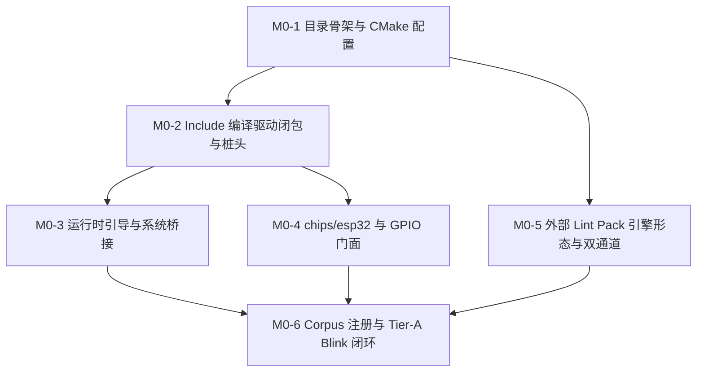

# ESP-IDF 仿真拦截层实施计划 M0：目录骨架、基础闭包与最小 GPIO 闭环

> 📋 **计划状态声明**：
> 本计划为 ESP-IDF 仿真拦截层派生子计划（Milestone 0）。
> **继承总纲**：[`PLAN-20260922-ESP-IDF-SIM-MASTER`](./2026-09-22-esp-idf-simulation-interception-master-plan.md) (v3.3)
> **当前状态**：✅ 已完成（Completed）
> 🎯 **计划版本**：v1.4（2026-09-24，专家评审整改：Fail-Loud 桩 + ctest 标签修正 + 完成态翻绿）
> 📚 **关联规范**：`docs-adr.md`、`03-coding-guidelines.md`、`00-IMPLEMENTATION-PLAN-TEMPLATE.md`
> 🔍 **核对基线**：`pal/include/wink_status.h`、`pal/include/hal/pal_gpio.h`、`pal/include/pal_log.h`、`runtime/include/wink_app.h`、`runtime/include/wink_runtime.h`、`targets/wasm/wasm_entry.c`、`frameworks/mcs51/src/mcs51_bridge.cpp`、ESP-IDF v6.1 官方 `driver/gpio.h` / `soc/esp32/soc_caps.h` / `blink_example_main.c`（详见 v1.1/v1.2 变更记录）

---

## 1. 元数据表（🔴 必选）

| 字段 | 内容 |
|:---|:---|
| **计划编号** | `PLAN-20260923-ESP-IDF-SIM-M0` |
| **创建日期** | 2026-09-23 |
| **目标平台/SoC** | `wasm32-unknown-emscripten` / `host` (x86_64, Windows/Linux)；对照 SoC：`esp32` |
| **工具链/SDK版本**| `ESP-IDF v5.1.3 LTS` ~ `v6.1+`（取证基线：v6.1 tag） |
| **计划状态** | ✅ 已完成（Completed） |
| **优先级** | 🔴 P0（阻塞整个 ESP-IDF 仿真拦截层开工） |
| **计划版本** | `v1.4` |
| **关联技术设计** | [`docs/zh/tech-designs/core/pal-i2c-v6-compatibility.md`](../../zh/tech-designs/core/pal-i2c-v6-compatibility.md) |
| **关联设计规范** | [`docs/zh/design/04-wasm-simulation/00-README.md`](../../zh/design/04-wasm-simulation/00-README.md)、[`02-wink-micro-os/`](../../zh/design/02-wink-micro-os/README.md) |
| **关联评审记录** | [`2026-09-22-esp-idf-simulation-interception-master-plan-review.md`](./2026-09-22-esp-idf-simulation-interception-master-plan-review.md) |
| **关联 ADR** | [ADR-0001](../../decisions/core/0001-error-code-sign-convention.md)（负数错误码）、[ADR-0004](../../decisions/core/0004-static-dispatch-vs-runtime-ops.md)（静态分发）、[ADR-0012](../../decisions/core/0012-honest-contract-and-failure-visibility.md)（合约诚实与降级登记）、[ADR-0065](../../decisions/core/0065-pal-hardware-raii-resource-ownership.md)（禁门面 claim）、[ADR-0070](../../decisions/core/0070-framework-lifecycle-and-coexistence.md)（生命周期强符号）、[ADR-0080](../../decisions/core/0080-external-lint-pack-discovery-and-mcs51-guard-sinking.md)（外部 lint pack）、[ADR-0082](../../decisions/core/0082-target-wasm-graceful-reset-and-dirty-state-cleanup.md)（优雅复位）、[ADR-0083/0084](../../decisions/core/0083-multi-license-architecture-and-permissive-codegen.md)（分层开源许可）、[ADR-0085](../../decisions/core/0085-esp-idf-facade-soc-caps-vs-pal-caps-dual-ssot.md)（caps 双 SSOT 裁决） |
| **目标里程碑** | M0（骨架、编译驱动增量闭包、GPIO 门面、外部 lint pack 首版、Tier-A 语料编译闭环） |
| **前置依赖计划** | D-001（调度器稳定性，已就绪）、D-002（PAL I2C 契约，已就绪）、T-001（ADR-0085 Accepted，已闭环）、T-002（许可地图与 NOTICE，已闭环） |
| **继承计划** | 继承自 [`PLAN-20260922-ESP-IDF-SIM-MASTER`](./2026-09-22-esp-idf-simulation-interception-master-plan.md) (v3.3) |
| **计划负责人** | 仿真拦截专项小组 |
| **主要依赖技能** | `embedded-best-practice` |

---

## 2. 背景与目标（🔴 必选）

### 2.1 问题陈述

在 WinkMicroOS 仿真系统中，ESP-IDF 原生 C-ABI 框架一直缺位，导致大量基于乐鑫官方 IDF 编写的业务代码无法在浏览器 Wasm 和 Host 仿真环境中运行。
M0 阶段作为整个拦截体系的**开山基石**，必须解决三个核心根问题：
1. **构建与目录拓扑**：建立标准化框架拓扑，真机编译零增量（`ESP_PLATFORM` 守卫早退），仿真环境提供干净独立的 include 与链接视图。
2. **Include 依赖膨胀**：官方示例传递 include BFS 极其庞大（即使单一 `blink` 示例亦传递引用数十个头文件）。必须以**编译驱动增量闭包策略**（§3.2）压制依赖爆炸，杜绝盲目猜测铺树。
3. **GPIO 门面与 SoC 边界**：建立 `driver/gpio` 下沉至 PAL 的合法通道，彻底纠正历史 Double-Claim 隐患（ADR-0065），并依据 ADR-0085 确立 `chips/esp32` 原生能力合法性校验。

### 2.2 技术/业务目标

- ✅ **目标 1**：搭建自洽的 `frameworks/esp_idf` 目录骨架与 CMake 构建体系，支持 `ENABLE_ESP_IDF_FRAMEWORK` 开关，在 `ESP_PLATFORM`（真机）下 0 增量构建。
- ✅ **目标 2**：完成编译驱动增量闭包机制，铺设 M0 必需的最小头文件家族，建立 `03-include-closure-inventory.md` 跟踪档案；实现多语料 `sdkconfig` 两层 overlay 机制。
- ✅ **目标 3**：实现标准运行时生命周期强符号 `wink_app_get_callbacks` 导出，优雅接入 `esp_restart()` 复位钩子族，实现 `esp_err_from_wink` 错误码双向翻译。
- ✅ **目标 4**：实现 `driver/gpio` 门面（`gpio_config`, `gpio_set_direction`, `gpio_set_level`, `gpio_get_level`, `gpio_reset_pin`），严格消费 `pal_gpio_*`，门面层 0 `pal_resource_claim`。注：`gpio_set_direction` 为 Tier-A blink 语料实测必需（`blink_example_main.c:84` 调用），M0 必须交付，不可递延。上拉/中断/ISR 全家桶不在 M0 交付范围，一律 Fail-Loud（v1.4，矩阵降级条目 4）。
- ✅ **目标 5**：根据 ADR-0085 铺设 `chips/esp32` SoC 特性定义，严格执行经典 ESP32 引脚合法性与输出能力掩码断言。
- ✅ **目标 6**：编写外部 lint pack 首版（`lint_esp_idf_isolation.py`，引擎 `FilePack` 形态、组 `esp_idf_all`），机器强制红线 3（禁 claim）、红线 4（运行期 0 malloc）、红线 5（禁浮点 PWM）、红线 7（开源许可）+ R-005 地板；`wink lint` 原生发现 + ctest 双通道同一实现。
- ✅ **目标 7**：在中央 `test/CMakeLists.txt` 注册 `esp_idf_corpus_<sample>` 机制，达成 Tier-A `blink` 原文 compile-only 零修改编译，以及核心单元测试 100% 通过。

### 2.3 成功指标（验收出口）

| 指标 | 通过标准 | 验证方法 |
|:---|:---|:---|
| **Tier-A 语料编译** | `blink_example_main.c` 原文零修改 100% 编译通过 | `ctest -R esp_idf_corpus_blink` |
| **双目标构建** | Host (GCC/Clang) 与 Wasm (Emscripten) 0 error, 0 warning (`-Wall -Wextra -Werror`) | CMake 构建与 CI `pr.yml` 日志 |
| **GPIO 门面单测** | 引脚写入/读取、输入模式限制、越界引脚拦截断言 100% 通过 | `ctest -R test_esp_gpio` |
| **错误码双向翻译** | Wink 负数码 ↔ ESP-IDF 0x101+ 互转穷举断言 100% 通过 | `ctest -R test_esp_err` |
| **外部 Lint 门禁** | `lint_esp_idf_isolation.py`（引擎 pack，组 `esp_idf_all`）双通道 100% 通过 | `winkcli lint --pack esp_idf_all` + `ctest -R esp_idf_lint_isolation`（同一实现） |
| **许可门禁** | `check_license_map.py` 100% 通过 | `python .github/scripts/check_license_map.py` |
| **文档同步** | 01、02、03 三大文档齐备，闭包清单逐条可溯源 | 人工审查与 `docs-contract-gate` |

---

## 3. 变更范围与影响分析（🔴 必选）

### 3.1 文件变更清单

| 文件路径 | 变更类型 | 说明 |
|:---|:---:|:---|
| `wink-micro-os/frameworks/esp_idf/CMakeLists.txt` | 🆕 新增 | 框架级 CMake 构建配置，含 `ESP_PLATFORM` 守卫早退 |
| `wink-micro-os/frameworks/esp_idf/esp_idf_sources.cmake` | 🆕 新增 | 源码与包含路径 SSOT 清单 |
| `wink-micro-os/frameworks/esp_idf/README.md` | 🆕 新增 | 框架原理、多框架互斥说明（T-009）与开发者说明 |
| `wink-micro-os/frameworks/esp_idf/docs/01-architecture-and-governance-guide.md` | 🆕 新增 | 架构拓扑与生命周期规范初版 |
| `wink-micro-os/frameworks/esp_idf/docs/02-api-coverage-matrix.md` | 🆕 新增 | API 覆盖矩阵初版、Tier 分级表、降级登记表 |
| `wink-micro-os/frameworks/esp_idf/docs/03-include-closure-inventory.md` | 🆕 新增 | 编译驱动增量 include 闭包追踪清单（T-004） |
| `wink-micro-os/frameworks/esp_idf/include/sdkconfig_base.h` | 🆕 新增 | 基础构建宏平台层（禁 `#include_next`） |
| `wink-micro-os/frameworks/esp_idf/include/esp_attr.h` | 🆕 新增 | 内存属性宏消解为空 |
| `wink-micro-os/frameworks/esp_idf/include/esp_err.h` | 🆕 新增 | ESP 错误码定义与基础宏 |
| `wink-micro-os/frameworks/esp_idf/include/esp_check.h` | 🆕 新增 | `ESP_ERROR_CHECK`, `ESP_RETURN_ON_ERROR` 宏 |
| `wink-micro-os/frameworks/esp_idf/include/esp_log.h` | 🆕 新增 | 日志统一入口 |
| `wink-micro-os/frameworks/esp_idf/include/esp_log_*.h` (9个分片) | 🆕 新增 | 官方透传分片（level/color/buffer/timestamp 等） |
| `wink-micro-os/frameworks/esp_idf/include/esp_private/log_attr.h` | 🆕 新增 | 日志私有分片 |
| `wink-micro-os/frameworks/esp_idf/include/esp_system.h` | 🆕 新增 | 系统控制入口头文件 |
| `wink-micro-os/frameworks/esp_idf/include/esp_timer.h` | 🆕 新增 | 时间系统查询头文件 |
| `wink-micro-os/frameworks/esp_idf/include/esp_random.h` | 🆕 新增 | 伪随机数发生器接口 |
| `wink-micro-os/frameworks/esp_idf/include/esp_chip_info.h` | 🆕 新增 | 芯片信息接口 |
| `wink-micro-os/frameworks/esp_idf/include/esp_idf_version.h` | 🆕 新增 | 版本定义宏（设定为 6.1.0 对齐基线） |
| `wink-micro-os/frameworks/esp_idf/include/esp_pm.h` | 🆕 新增 | 电源管理桩（空宏） |
| `wink-micro-os/frameworks/esp_idf/include/led_strip.h` | 🆕 新增 | 外部托管组件声明级 stub（零修改边界） |
| `wink-micro-os/frameworks/esp_idf/include/esp_intr_alloc.h` | 🆕 新增 | 中断分配桩头文件 |
| `wink-micro-os/frameworks/esp_idf/include/esp_rom_gpio.h` / `esp_rom_sys.h` | 🆕 新增 | ROM 引导桩头文件 |
| `wink-micro-os/frameworks/esp_idf/include/esp_task_wdt.h` | 🆕 新增 | 看门狗接口桩 |
| `wink-micro-os/frameworks/esp_idf/include/freertos/FreeRTOS.h` | 🆕 新增 | 包含基础定义 + 无条件包含 `idf_additions.h` |
| `wink-micro-os/frameworks/esp_idf/include/freertos/FreeRTOSConfig.h` | 🆕 新增 | M0 最小桩（`configTICK_RATE_HZ=100`、`configMAX_PRIORITIES=25` 冻结值；官方 `FreeRTOS.h:63` 无条件包含，缺失首编即断） |
| `wink-micro-os/frameworks/esp_idf/include/freertos/projdefs.h` | 🆕 新增 | M0 最小桩（`pdTRUE/pdFALSE/pdPASS/pdFAIL`、`BaseType_t`；官方 `FreeRTOS.h:66` 无条件包含） |
| `wink-micro-os/frameworks/esp_idf/include/freertos/portable.h` | 🆕 新增 | M0 最小桩（转含 `freertos/portmacro.h`；官方 `FreeRTOS.h:69` 无条件包含） |
| `wink-micro-os/frameworks/esp_idf/include/freertos/portmacro.h` | 🆕 新增 | M0 最小桩（`BaseType_t/UBaseType_t/TickType_t`、`portTICK_PERIOD_MS` 官方归位） |
| `wink-micro-os/frameworks/esp_idf/include/freertos/task.h` | 🆕 新增 | M0 最小声明桩（`vTaskDelay`/`vTaskDelayUntil` 原型，转含 `projdefs.h`/`portmacro.h`；实现递延 M1；Tier-A blink 编译必需） |
| `wink-micro-os/frameworks/esp_idf/include/freertos/idf_additions.h` | 🆕 新增 | 乐鑫 FreeRTOS 扩展定义 |
| `wink-micro-os/frameworks/esp_idf/include/driver/gpio.h` | 🆕 新增 | GPIO 驱动门面头文件（含 `gpio_config` / `gpio_set_direction` / `gpio_set_level` / `gpio_get_level` / `gpio_reset_pin`；`gpio_set_direction` 为 blink 必需） |
| `wink-micro-os/frameworks/esp_idf/include/hal/gpio_types.h` | 🆕 新增 | GPIO 底层类型定义 |
| `wink-micro-os/frameworks/esp_idf/include/soc/soc_caps.h` / `gpio_num.h` | 🆕 新增 | SoC 包含中转头文件 |
| `wink-micro-os/frameworks/esp_idf/chips/esp32/include/soc/soc_caps.h` | 🆕 新增 | 经典 ESP32 硬件能力宏（ADR-0085） |
| `wink-micro-os/frameworks/esp_idf/chips/esp32/include/soc/gpio_num.h` | 🆕 新增 | 经典 ESP32 GPIO 引脚枚举 |
| `wink-micro-os/frameworks/esp_idf/src/esp_idf_runtime.c` | 🆕 新增 | `wink_app_get_callbacks` 强符号导出与生命周期挂接 |
| `wink-micro-os/frameworks/esp_idf/src/esp_idf_bridge.c` | 🆕 新增 | 优雅复位 `esp_restart` 与系统桥接 |
| `wink-micro-os/frameworks/esp_idf/src/core/esp_err.c` | 🆕 新增 | `esp_err_from_wink` 错误码双向映射表 |
| `wink-micro-os/frameworks/esp_idf/src/core/esp_log.c` | 🆕 新增 | 日志等级过滤与 `pal_log_*` 桥接 |
| `wink-micro-os/frameworks/esp_idf/src/core/esp_system.c` | 🆕 新增 | 确定性 xorshift 与芯片信息查询 |
| `wink-micro-os/frameworks/esp_idf/src/drivers/esp_gpio.c` | 🆕 新增 | GPIO 门面实现，下沉至 `pal_gpio_*` |
| `wink-micro-os/frameworks/esp_idf/tools/lint/lint_esp_idf_isolation.py` | 🆕 新增 | 外部 lint pack（机器强制红线 3/4/5/7） |
| `wink-micro-os/frameworks/esp_idf/test/core/test_esp_err.c` | 🆕 新增 | 错误码单元测试 |
| `wink-micro-os/frameworks/esp_idf/test/core/test_esp_gpio.c` | 🆕 新增 | GPIO 门面与 SoC 边界拦截单元测试 |
| `wink-micro-os/frameworks/esp_idf/test/corpus/blink/` | 🆕 新增 | Tier-A Blink 官方示例镜像与 overlay `sdkconfig.h` |
| `wink-micro-os/frameworks/esp_idf/test/wasm/esp_idf_wasm_compile.cmake` | 🆕 新增 | emcc compile-only 门禁函数（复用中央 `WINK_BUILD_WASM_TESTS` 开关；Node 运行时递延 M1-4） |
| `wink-micro-os/frameworks/CMakeLists.txt` | ✏️ 修改 | 分发器注册 `esp_idf`（`ENABLE_ESP_IDF_FRAMEWORK` 开关；镜像 mcs51 分发先例） |
| `wink-micro-os/CMakeLists.txt` | ✏️ 修改 | app-link 段双强符号 `FATAL_ERROR` 互斥守卫（T-009 机器证据） |
| `wink-micro-os/test/CMakeLists.txt` | ✏️ 修改 | 注册 `esp_idf_corpus`、外部 lint pack、核心单测与 wasm compile-only |

### 3.2 接口影响分析

| 接口层 | 是否有破坏性变更 | 影响范围 | 备注 |
|:---|:---:|:---|:---|
| PAL 公开 API | ❌ 否 | 无 | 门面仅调用现存 `pal_gpio_*`、`pal_log_*`，严禁改动 PAL |
| DAL 层 | ❌ 否 | 无 | 门面直接消费 PAL，不经过 DAL，无任何 DAL 侵入 |
| 既有应用/框架 | ❌ 否 | 无 | mcs51 与 arduino 不受影响；多框架强符号互斥在构建层隔离 |
| 构建系统 | ⚠️ 是 | 顶层与测试 CMake | 增加框架条件包含；真机下完全早退 |
| 文档 | ⚠️ 是 | docs/ 体系 | 新增 01/02/03 文档与实施跟踪记录 |

### 3.3 架构红线（DoD 准入准出，违反即拒绝合入）

> 🚨 **7 条架构红线（继承自总纲 §8）**：
> 1. 🚨 **C-ABI 与纯 C 实现原则**：`src/drivers/*.c` 等垫片必须采用标准 C99 编写，严禁使用 C++ 运行时与异常机制。
> 2. 🚨 **严禁侵入式修改 PAL / DAL**：只允许单向依赖 `pal/include`（HAL/OSAL）与自身组件，严禁反向修改 PAL，严禁越级调用 DAL 内部符号。
> 3. 🚨 **严格遵守 ADR-0065**：门面层**严禁调用 `pal_resource_claim()`**；硬件资源由底层 PAL 独占管理（外部 lint pack 机器强制）。
> 4. 🚨 **零运行期堆分配（作用域精确化）**：`frameworks/esp_idf/src/**` 门面代码运行期禁止 `malloc/free`，对象控制块全部走静态预分配池（lint pack 强制，显式排除 `targets/` 与 `osal/`）。
> 5. 🚨 **PWM 定点红线（ADR-0066）**：涉及占空比计算全定点整数运算，严禁浮点 duty（lint pack 强制；M0 虽不交付 LEDC，但 lint 规则必须到位）。
> 6. 🚨 **合约诚实（ADR-0012）**：不支持的 API 编译期 `#error` 或链接期符号缺失，**严禁静默空实现（Silent No-op）**；一切语义弱化必须登记入 `02-api-coverage-matrix.md` 降级表。
> 7. 🚨 **开源许可合规（ADR-0083/0084）**：
>    - `frameworks/esp_idf/{src,include,chips}` = **`LGPL-3.0-only`**；
>    - `frameworks/esp_idf/test/**` 与 `frameworks/esp_idf/tools/**` (`.py`) = **`GPL-3.0-only`**（已在 T-002 完成地图与 NOTICE 登记）；
>    - 每次提交前必须运行 `python .github/scripts/check_license_map.py` 确保 100% 全绿。

### 3.4 系统资源与并发约束评估

| 维度 | 预计开销 / 限制 | 风险分析 | 应对策略 |
|:---|:---|:---|:---|
| **静态 RAM 开销** | < 4 KB | 静态分配超出仿真宿主预期 | M0 仅有基础错误码表、SoC 描述常量，严格使用 `const` 沉入只读数据段 |
| **堆内存 (Heap)** | **0 字节** | 内存泄漏与碎片化 | 门面运行期 0 `malloc`，静态全局分配 |
| **栈深度 (Stack)** | 单次调用 < 256 字节 | 栈溢出风险 | 门面函数仅做参数校验与下沉转调，无深层递归与大局部数组 |
| **并发与中断** | 门面无并发状态，纯只读配置/转调 | 竞态与重入问题 | `gpio_set_level` 等无锁下沉至 PAL，由 PAL/仿真宿主保证原子性 |

---

## 4. 依赖与风险（🔴 必选）

### 4.1 前置依赖

| 依赖 ID | 依赖内容 | 是否阻塞 | 状态 | 备注 |
|:---|:---|:---:|:---:|:---|
| **D-001** | `targets/common/wink_sim_scheduler.h` 接口稳定性 | ✅ 是 | ✅ 已就绪 | ADR-0014 既有能力 |
| **D-003** | caps 双 SSOT 裁决 | ✅ 是 | ✅ 已完成 | ADR-0085 Accepted (commit `9753da1c`) |
| **D-004** | 创建 4 份模板命名子计划 | ✅ 是 | ✅ 已完成 | 占位与 M0 已就绪 |
| **D-005** | 许可归类裁决与地图更新 | ✅ 是 | ✅ 已完成 | T-002 (commit `05a5fb1a`) |

### 4.2 外部依赖

| 依赖 ID | 依赖内容 | 提供方 | 风险等级 | 备注 |
|:---|:---|:---|:---:|:---|
| **E-001** | ESP-IDF v6.1 官方源码树 | 本机 / Espressif | 🟡 中 | 宏取证与官方头文件签名核对 |
| **E-002** | `winkcli` 工具链 | wink-tools | 🟡 中 | 运行 lint 与测试门禁 |

### 4.3 风险登记册

| 风险 ID | 风险描述 | 概率 | 影响 | 严重度 | 缓解措施 | 责任人 | 触发条件 |
|:---|:---|:---:|:---:|:---:|:---|:---|:---|
| **R-001** | 编译驱动增量 include 闭包头文件遗漏过多，语料无法推进 | 🟡 中 | 🟠 高 | 6 | 依据 §3.2 清单优先铺设 known families，建立 `03-include-closure-inventory.md` 逐条登记推进 | 专项小组 | 语料报错缺头 > 5 处 |
| **R-002** | 语料依赖未拉取的外部托管组件（如 `led_strip.h`） | 🟠 高 | 🟡 中 | 6 | 裁决使用声明级 stub，未启用分支零链接依赖 | 专项小组 | 语料编译报找不到组件头 |
| **R-006** | lint pack 误报（如扫描了 `targets/` 下的 `malloc`） | 🟡 中 | 🟡 中 | 4 | lint 脚本 glob 严格限定 `frameworks/esp_idf/src/**/*.c`，显式排除 `targets/` 与 `osal/` | 专项小组 | CI lint 误杀 |

---

## 5. 优先级路线图与关键路径

### 5.1 执行顺序



### 5.2 优先级矩阵

| 任务 ID | 任务标题 | 优先级 | 预估工时 | 涉及关键文件 |
|:---|:---|:---:|:---:|:---|
| **Task M0-1** | 目录拓扑搭建、CMake 构建配置与文档初始化 | 🔴 P0 | 4 h | `frameworks/CMakeLists.txt`, `esp_idf/CMakeLists.txt`, `esp_idf_sources.cmake`, `README.md`, `docs/*` |
| **Task M0-2** | 编译驱动 Include 闭包机制与基础桩落地 (T-004) | 🔴 P0 | 6 h | `include/**`, `docs/03-include-closure-inventory.md` |
| **Task M0-3** | 运行时框架引导与系统基础桥接 | 🔴 P0 | 4 h | `src/esp_idf_runtime.c`, `src/esp_idf_bridge.c`, `src/core/*` |
| **Task M0-4** | chips/esp32 能力定义与 driver/gpio 门面下沉 | 🔴 P0 | 6 h | `chips/esp32/**`, `include/driver/gpio.h`, `src/drivers/esp_gpio.c` |
| **Task M0-5** | 外部 Lint Pack（引擎形态）与双通道注册 (T-006) | 🔴 P0 | 6 h | `tools/lint/lint_esp_idf_isolation.py`, `test/CMakeLists.txt` |
| **Task M0-6** | Corpus 注册、Tier-A Blink 编译闭环、wasm compile-only 与单元测试 (T-005) | 🔴 P0 | 7 h | `test/CMakeLists.txt`, `test/core/*`, `test/corpus/blink/*`, `test/wasm/*` |
| **总计** | | | **33 h** | |

### 5.3 关键路径与冲突控制
- **关键路径**：`M0-1 → M0-2 → M0-4 → M0-6`（约 23 h）
- **文件冲突控制**：`wink-micro-os/test/CMakeLists.txt` 为中央热文件，M0-5 与 M0-6 的测试注册必须按序合并写入，避免并行冲突。

---

## 6. 详细任务拆分与进度追踪（🔴 必选）

---

### Task M0-1：目录拓扑搭建、CMake 构建配置与文档初始化 `[ 状态: ✅ 已完成 ]`

| 字段 | 内容 |
|:---|:---|
| **负责人** | 仿真拦截专项小组 |
| **预估工时** | 4 小时 |
| **优先级** | 🔴 P0 |
| **前置依赖** | 无（T-001/T-002 已完成） |
| **修改文件** | `wink-micro-os/frameworks/CMakeLists.txt`, `wink-micro-os/CMakeLists.txt`（app-link 段互斥守卫）, `wink-micro-os/frameworks/esp_idf/CMakeLists.txt`, `wink-micro-os/frameworks/esp_idf/esp_idf_sources.cmake`, `wink-micro-os/frameworks/esp_idf/README.md`, `wink-micro-os/frameworks/esp_idf/docs/*` |
| **接口变化** | frameworks 分发器新增 `ENABLE_ESP_IDF_FRAMEWORK` 开关（默认 ON 于仿真）+ `WINK_APP_ESP_IDF` opt-in 约定；顶层 app-link 段新增双强符号 `FATAL_ERROR` 互斥 |

#### 详细步骤

- [x] **Step 1：创建目录结构**
  创建以下目录树：
  ```
  wink-micro-os/frameworks/esp_idf/
  ├── include/
  │   ├── freertos/
  │   ├── driver/
  │   ├── hal/
  │   ├── soc/
  │   └── esp_private/
  ├── chips/esp32/include/soc/
  ├── src/
  │   ├── core/
  │   └── drivers/
  ├── tools/lint/
  ├── docs/
  └── test/
      ├── core/
      ├── wasm/
      └── corpus/blink/include/
  ```
  注：`freertos/` 下为 `FreeRTOS.h/FreeRTOSConfig.h/projdefs.h/portable.h/portmacro.h/task.h/idf_additions.h` 七桩（见 M0-2 Step 6）。

- [x] **Step 2：编写 `esp_idf_sources.cmake`**
  定义 SSOT 源文件列表与包含路径：
  ```cmake
  # SPDX-License-Identifier: LGPL-3.0-only
  set(ESP_IDF_FRAMEWORK_SOURCES
      ${CMAKE_CURRENT_LIST_DIR}/src/esp_idf_runtime.c
      ${CMAKE_CURRENT_LIST_DIR}/src/esp_idf_bridge.c
      ${CMAKE_CURRENT_LIST_DIR}/src/core/esp_err.c
      ${CMAKE_CURRENT_LIST_DIR}/src/core/esp_log.c
      ${CMAKE_CURRENT_LIST_DIR}/src/core/esp_system.c
      ${CMAKE_CURRENT_LIST_DIR}/src/drivers/esp_gpio.c
  )

  if(NOT DEFINED WINK_ESP_TARGET)
      set(WINK_ESP_TARGET "esp32")
  endif()

  set(ESP_IDF_FRAMEWORK_INCLUDES
      ${CMAKE_CURRENT_LIST_DIR}/chips/${WINK_ESP_TARGET}/include
      ${CMAKE_CURRENT_LIST_DIR}/include
  )
  ```

- [x] **Step 3：编写 `frameworks/esp_idf/CMakeLists.txt`**
  实现真机早退与仿真静态库构建：
  ```cmake
  # SPDX-License-Identifier: LGPL-3.0-only
  if(ESP_PLATFORM)
      return()
  endif()

  include(esp_idf_sources.cmake)

  add_library(wink_framework_esp_idf STATIC EXCLUDE_FROM_ALL
      ${ESP_IDF_FRAMEWORK_SOURCES}
  )

  target_include_directories(wink_framework_esp_idf PUBLIC
      ${ESP_IDF_FRAMEWORK_INCLUDES}
  )

  target_link_libraries(wink_framework_esp_idf PUBLIC
      pal
  )
  ```
  注（v1.4 同步实现）：`PUBLIC pal`（非 `PRIVATE wink_pal`），单测目标需透传 PAL 头路径。

- [x] **Step 4：在 `frameworks/CMakeLists.txt` 分发器注册并定义顶层互斥守卫**
  不得绕过既有分发器直写顶层（`frameworks/CMakeLists.txt` 已有 arduino/mcs51 分发先例；顶层统一 `add_subdirectory(frameworks)`）：
  ```cmake
  option(ENABLE_ESP_IDF_FRAMEWORK "Enable ESP-IDF simulation interception framework" ON)
  # ESP-IDF C-ABI sim interception (Axis B). EXCLUDE_FROM_ALL + ESP_PLATFORM
  # self-skip inside frameworks/esp_idf/CMakeLists.txt, mirroring mcs51.
  if(ENABLE_ESP_IDF_FRAMEWORK)
      add_subdirectory(esp_idf)
  endif()
  ```
  app 侧 opt-in 约定（镜像 `WINK_APP_MCS51`）：esp-idf 应用在其 `CMakeLists` 导出 `WINK_APP_ESP_IDF=TRUE`；顶层 app-link 段（mcs51 块附近）追加硬互斥守卫：
  ```cmake
  if(WINK_APP_ESP_IDF AND TARGET wink_framework_esp_idf)
      if(WINK_APP_MCS51)
          message(FATAL_ERROR "[frameworks] esp_idf and mcs51 both export strong wink_app_get_callbacks; enable only one app framework")
      endif()
      target_link_libraries(wink_simulator PRIVATE wink_framework_esp_idf)
  endif()
  ```
  注：`arduino` 为弱符号，链接期自动让位，无需 CMake 守卫，README 声明即可；wasm `-sERROR_ON_UNDEFINED_SYMBOLS=0` 会弱化链接期诊断，本守卫不可省略。

- [x] **Step 5：编写 `README.md` 与 docs 初版**
  在 `frameworks/esp_idf/README.md` 中记录拦截原理与多框架互斥说明（T-009）：
  - 声明 `esp_idf` 与 `mcs51` 均为强符号 `wink_app_get_callbacks`，不可同链；
  - `arduino` 弱符号在与 `esp_idf` 共存时自动让位；
  - 初始化 `docs/01-architecture-and-governance-guide.md` 与 `docs/02-api-coverage-matrix.md`。

#### 验证步骤
1. **验证命令**：
   ```powershell
   cmake -B build -S wink-micro-os
   ```
2. **预期输出**：CMake 配置成功，成功发现 `wink_framework_esp_idf` 目标。
3. **负例验证（T-009 机器证据）**：`-DWINK_APP_MCS51=TRUE -DWINK_APP_ESP_IDF=TRUE` 双 opt-in 配置期必须 `FATAL_ERROR`（模拟双强符号同链）。

---

### Task M0-2：编译驱动 Include 闭包机制与基础桩落地 (T-004) `[ 状态: ✅ 已完成 ]`

| 字段 | 内容 |
|:---|:---|
| **负责人** | 仿真拦截专项小组 |
| **预估工时** | 6 小时 |
| **优先级** | 🔴 P0 |
| **前置依赖** | Task M0-1 |
| **修改文件** | `frameworks/esp_idf/include/**`, `docs/03-include-closure-inventory.md` |
| **接口变化** | 导出 ESP-IDF 原生常用头文件视图 |

#### 详细步骤

- [x] **Step 1：创建 `docs/03-include-closure-inventory.md`**
  按表格记录每个新增桩头的官方来源、桩策略（宏消解/类型映射/透传/声明桩）与驱动语料。

- [x] **Step 2：编写 `include/sdkconfig_base.h`**
  ```c
  /* SPDX-License-Identifier: LGPL-3.0-only */
  #ifndef SDKCONFIG_BASE_H_
  #define SDKCONFIG_BASE_H_

  #define CONFIG_IDF_TARGET_ESP32 1
  #define CONFIG_IDF_TARGET "esp32"
  #define CONFIG_FREERTOS_HZ 100
  #define CONFIG_LOG_DEFAULT_LEVEL 3
  #define CONFIG_LOG_COLORS 1

  /* 注意：严格禁止在此处定义 ESP_PLATFORM，避免污染底层真机分支宏 */

  #endif /* SDKCONFIG_BASE_H_ */
  ```

- [x] **Step 3：消解属性与系统宏**
  - `include/esp_attr.h`：将 `IRAM_ATTR`, `DRAM_ATTR`, `RTC_DATA_ATTR`, `FORCE_INLINE_ATTR`, `RTC_IRAM_ATTR` 宏消解为空。
  - `include/esp_compiler.h`：定义 `likely`, `unlikely` 等常规工具宏。

- [x] **Step 4：错误码与检查宏**
  - `include/esp_err.h`：定义 `esp_err_t`，定义 `ESP_OK=0, ESP_FAIL=-1, ESP_ERR_NO_MEM=0x101, ESP_ERR_INVALID_ARG=0x102, ESP_ERR_INVALID_STATE=0x103, ESP_ERR_TIMEOUT=0x107` 等。
  - `include/esp_check.h`：实现 `ESP_ERROR_CHECK(x)`，当返回值非 `ESP_OK` 时调用 `wink_runtime_raise_fault(WINK_FAULT_RUNTIME(1))`（即 8001 语义，`wink_fault.h`）并记录日志，**严禁使用 host abort/exit**。注：`wink_runtime_fault` 需双参 `(callbacks*, code)`（`wink_runtime.h:55`），门面侧统一用单参 `wink_runtime_raise_fault(code)`。

- [x] **Step 5：日志门面与分片闭包**
  - 编写 `include/esp_log.h`，实现 `ESP_LOGE`, `ESP_LOGW`, `ESP_LOGI`, `ESP_LOGD`, `ESP_LOGV`。
  - 补全官方 9 个分片头文件：`esp_log_config.h`, `esp_log_level.h`, `esp_log_color.h`, `esp_log_buffer.h`, `esp_log_timestamp.h`, `esp_log_write.h`, `esp_log_format.h`, `esp_log_args.h`, `esp_log_attr.h` 以及 `esp_private/log_attr.h`。

- [x] **Step 6：FreeRTOS 守卫等价头文件**
  - `include/freertos/FreeRTOS.h`：基础类型定义，并在尾部**无条件**包含 `#include "freertos/idf_additions.h"`（规避未定义 `ESP_PLATFORM` 导致的漏包陷阱；官方该包含在 `#ifdef ESP_PLATFORM` 内，取证 `FreeRTOS.h:1531`）。
  - `include/freertos/idf_additions.h`：声明桩定义。
  - `include/freertos/FreeRTOSConfig.h`（v1.2 新增）：`configTICK_RATE_HZ=100`、`configMAX_PRIORITIES=25` 冻结值（官方 `FreeRTOS.h:63` 无条件包含，缺失则 blink 首编即断）。
  - `include/freertos/projdefs.h`（v1.2 新增）：`pdTRUE/pdFALSE/pdPASS/pdFAIL` 与 `BaseType_t` 最小定义（官方 `:66` 无条件包含）。
  - `include/freertos/portable.h`（v1.2 新增）：转含 `freertos/portmacro.h`（官方 `:69` 无条件包含）。
  - `include/freertos/portmacro.h`（v1.2 新增）：`BaseType_t/UBaseType_t/TickType_t` 与 `portTICK_PERIOD_MS`（=1000/100）官方归位。
  - `include/freertos/task.h`（M0 最小声明桩）：`vTaskDelay` / `vTaskDelayUntil` 原型，转含 `projdefs.h`/`portmacro.h` 取基础类型（v1.2 修订：`portTICK_PERIOD_MS` 归位 `portmacro.h`，`task.h` 不再自定义）；函数体实现递延 M1，链接语料目标时以 `WINK_UNAVAILABLE_MSG` 或链接期缺失 Fail-Loud，严禁静默空实现。
  - **单 include 根约定**：本仓桩头之间一律前缀式自包含（如 `#include "freertos/portmacro.h"`），不复刻官方多组件 include 布局；此差异登记入 `03-include-closure-inventory.md`。

- [x] **Step 7：语料边界桩**
  - `include/led_strip.h`：提供 `led_strip_handle_t` 等声明级 stub（当语料未启用对应配置时仅需声明，零链接依赖）。
  - `include/esp_pm.h`：提供电源管理 no-op 桩。
  - `include/esp_rom_gpio.h` / `include/esp_rom_sys.h` / `include/esp_task_wdt.h`：最小化声明。

#### 验证步骤
1. **验证方式**：新建一个包含测试文件编译验证所有 include 路径解析正常。

---

### Task M0-3：运行时框架引导与系统基础桥接 `[ 状态: ✅ 已完成 ]`

| 字段 | 内容 |
|:---|:---|
| **负责人** | 仿真拦截专项小组 |
| **预估工时** | 4 小时 |
| **优先级** | 🔴 P0 |
| **前置依赖** | Task M0-2 |
| **修改文件** | `src/esp_idf_runtime.c`, `src/esp_idf_bridge.c`, `src/core/esp_err.c`, `src/core/esp_log.c`, `src/core/esp_system.c` |
| **接口变化** | 导出强符号 `wink_app_get_callbacks` |

#### 详细步骤

- [x] **Step 1：编写 `src/esp_idf_runtime.c`**
  实现并导出框架生命周期强符号（对齐 `mcs51_bridge.cpp:351-363` 七字段范式；`wink_app.h:139-150` 的 `init/loop` 为 `void(void)`，严禁返回 `wink_status_t`）：
  ```c
  /* SPDX-License-Identifier: LGPL-3.0-only */
  #include "wink_app.h"
  #include "pal_log.h"

  extern void app_main(void);

  static void esp_idf_framework_init(void) {
      pal_log_i("ESP_IDF", "Framework initialized in simulation mode");
  }

  static void esp_idf_app_loop(void) {
      /* app_main 由 runtime 作为独立 fiber 启动，主循环配合调度 */
  }

  static const wink_app_callbacks_t s_esp_idf_callbacks = {
      esp_idf_framework_init,
      esp_idf_app_loop,
      NULL,
      NULL,
      NULL,
      NULL,
      NULL,
  };

  const wink_app_callbacks_t* wink_app_get_callbacks(void) {
      return &s_esp_idf_callbacks;
  }
  ```
  注：`#include "wink_app.h"` 依赖 runtime include 路径（参照中央 `test/CMakeLists.txt` 已含 `runtime/include`），不得写成 `runtime/include/wink_app.h`。

- [x] **Step 2：编写 `src/esp_idf_bridge.c`**
  实现系统复位与版本查询：
  - `esp_restart()`：严禁调用 host `exit()` 或 `abort()`。对齐 `mcs51_bridge.cpp:366-376` 与 `targets/wasm/wasm_entry.c:45-47` 先例——框架侧**实现**弱钩子族（三符号，严禁自创 `pal_wasm_target_trigger_reset`，该符号全仓不存在），`esp_restart` 仅置 pending 标志：
    ```c
    #include <stdbool.h>
    #include "pal_log.h"

    static bool s_esp_pending_reset = false;
    static int s_esp_reset_reason = 4; /* SOFTWARE */

    void esp_restart(void) {
        pal_log_w("ESP_SYS", "esp_restart requested -> pending reset flag set");
        s_esp_pending_reset = true;
    }

    /* 供 targets/wasm 弱钩子查询的导出（命名不得带 wink_mcs51 前缀冲突） */
    bool pal_wasm_target_has_pending_reset(void) { return s_esp_pending_reset; }
    int pal_wasm_target_get_reset_reason(void) { return s_esp_reset_reason; }
    void pal_wasm_target_clear_pending_reset(void) { s_esp_pending_reset = false; }
    ```
    注：多框架强符号互斥（T-009）下，`esp_idf` 与 `mcs51` 不可同链，此三符号无冲突；若同链必须构建期报错。
  - `esp_get_idf_version()`：返回 `"v6.1-dev-winksim"`。

- [x] **Step 3：编写 `src/core/esp_err.c`**
  实现 `esp_err_from_wink(wink_status_t status)` 与逆向映射（枚举名以 `pal/include/wink_status.h:78-113` 为准；`WINK_ERR_INVALID_PARAM / NO_MEMORY / RESOURCE_BUSY / NOT_SUPPORTED` 四名全仓不存在，严禁使用）：
  ```c
  /* SPDX-License-Identifier: LGPL-3.0-only */
  #include "esp_err.h"
  #include "wink_status.h"

  esp_err_t esp_err_from_wink(wink_status_t status) {
      switch (status) {
          case WINK_OK:                  return ESP_OK;
          case WINK_ERR_INVALID_ARG:     return ESP_ERR_INVALID_ARG;
          case WINK_ERR_NO_MEM:          return ESP_ERR_NO_MEM;
          case WINK_ERR_INVALID_STATE:   return ESP_ERR_INVALID_STATE;
          case WINK_ERR_TIMEOUT:         return ESP_ERR_TIMEOUT;
          case WINK_ERR_BUSY:            return ESP_ERR_INVALID_STATE;
          case WINK_ERR_UNSUPPORTED:     return ESP_ERR_NOT_SUPPORTED;
          default:                       return ESP_FAIL;
      }
  }
  ```
  另需实现反向 `wink_status_t wink_status_from_esp(esp_err_t err)`（参照 `targets/esp32/pal_hal_adc_esp32.c:83-93` 方向），L1 对双向做穷举断言。

- [x] **Step 4：编写 `src/core/esp_log.c` 与 `src/core/esp_system.c`**
  - `esp_log.c`：按等级桥接至 `pal_log_e / pal_log_w / pal_log_i / pal_log_d`（`pal_log.h` 仅此四入口，无 `pal_log_write`；INFO 在 ISR 会被静默丢弃，需登记）。
  - `esp_system.c`：`esp_random()` 使用轻量确定性 xorshift32 算法，初始化时与调度器使用同一种子，保证仿真 Replay 确定性；`esp_task_wdt_*` / `esp_intr_alloc/free`（v1.4）`ESP_LOGE` + `ESP_ERR_NOT_SUPPORTED`（失败时 `esp_intr_alloc` 回写空句柄，不伪造有效句柄），`esp_rom_gpio_pad_select_gpio`（void）仅 `ESP_LOGW`，登记矩阵降级条目 5。

#### 验证步骤
1. **单元测试验证**：编译并运行 `test/core/test_esp_err.c`，断言全部错误码转换正确。

---

### Task M0-4：chips/esp32 能力定义与 driver/gpio 门面下沉 `[ 状态: ✅ 已完成 ]`

| 字段 | 内容 |
|:---|:---|
| **负责人** | 仿真拦截专项小组 |
| **预估工时** | 6 小时 |
| **优先级** | 🔴 P0 |
| **前置依赖** | Task M0-2, Task M0-3 |
| **修改文件** | `chips/esp32/**`, `include/driver/gpio.h`, `include/hal/gpio_types.h`, `src/drivers/esp_gpio.c` |
| **接口变化** | 导出标准 `gpio_config`, `gpio_set_direction`, `gpio_set_level`, `gpio_get_level`, `gpio_reset_pin` API |

#### 详细步骤

- [x] **Step 1：编写 `chips/esp32/include/soc/soc_caps.h` 与 `gpio_num.h`**
  严格按官方 ESP32 芯片特性核实取证（ADR-0085；v6.1 `components/soc/esp32/include/soc/soc_caps.h:185-194`）。**严禁手写字面量掩码**——v1.0 的 `0xFFFFFFFFFULL`（9×F，仅 36bit）与 `0x000000033FFFFFFFULL`（位数畸形）均错误，必须逐字复刻官方表达式：
  ```c
  /* SPDX-License-Identifier: LGPL-3.0-only */
  #ifndef SOC_CAPS_ESP32_H_
  #define SOC_CAPS_ESP32_H_

  #define SOC_GPIO_PIN_COUNT          40
  /* 官方原式：0xFFFFFFFFFFULL(10×F=40bit) 排除 24/28/29/30/31；输出再排除 34~39 */
  #define SOC_GPIO_VALID_GPIO_MASK \
      (0xFFFFFFFFFFULL & ~(0ULL | (1ULL<<24) | (1ULL<<28) | (1ULL<<29) | (1ULL<<30) | (1ULL<<31)))
  #define SOC_GPIO_VALID_OUTPUT_GPIO_MASK \
      (SOC_GPIO_VALID_GPIO_MASK & ~(0ULL | (1ULL<<34) | (1ULL<<35) | (1ULL<<36) | (1ULL<<37) | (1ULL<<38) | (1ULL<<39)))

  #define GPIO_IS_VALID_GPIO(gpio_num) \
      ((gpio_num >= 0 && gpio_num < 40) && \
       (((1ULL << (gpio_num)) & SOC_GPIO_VALID_GPIO_MASK) != 0))

  #define GPIO_IS_VALID_OUTPUT_GPIO(gpio_num) \
      ((gpio_num >= 0 && gpio_num < 40) && \
       (((1ULL << (gpio_num)) & SOC_GPIO_VALID_OUTPUT_GPIO_MASK) != 0))

  #endif /* SOC_CAPS_ESP32_H_ */
  ```
  取证命令见附录；`gpio_num.h` 同源复刻官方引脚枚举（含 `GPIO_NUM_NC/MAX`）。

- [x] **Step 2：编写 `include/driver/gpio.h` 与 `include/hal/gpio_types.h`**
  定义 `gpio_num_t`, `gpio_mode_t`, `gpio_config_t` 等标准结构体与函数原型。原型以官方 `driver/gpio.h:60/71/130/144/161` 为准：`gpio_config/gpio_reset_pin/gpio_set_level` 返回 `esp_err_t`，`gpio_get_level` 返回 `int`，**新增 `gpio_set_direction`（blink 必需）**。

- [x] **Step 3：编写 `src/drivers/esp_gpio.c`**
  （PAL 签名以 `pal/include/hal/pal_gpio.h` 为准：`pal_gpio_init(pin, mode)` 双参无 config 结构体；`pal_gpio_write(pin,bool)`；`pal_gpio_read(pin,bool*)`；`pal_gpio_reset_pin` 返回 `void`。v1.0 的 `pal_gpio_init(pin,&conf)` 不存在。）
  - **`gpio_config(const gpio_config_t *pGPIOConfig)`**：
    - 遍历 `pin_bit_mask`，使用 `GPIO_IS_VALID_GPIO` 与输出合法性检查；
    - 校验失败立即返回 `ESP_ERR_INVALID_ARG`；
    - 将 `mode` 逐 pin 转换为 `pal_gpio_mode_t`，逐 pin 调用 `pal_gpio_init((wink_pin_t)pin, pal_mode)`；
    - 🚨 **红线 3**：严禁调用 `pal_resource_claim()`。
  - **`gpio_set_direction(gpio_num_t gpio_num, gpio_mode_t mode)`**（v1.1 新增，blink 必需；v1.4 修正下沉路径）：
    - 边界检查同 `gpio_config`；经 `pal_gpio_init((wink_pin_t)gpio_num, pal_mode)` 下沉（**不用** `pal_gpio_set_direction`：host PAL 该函数为 no-op 不记录模式，而 init 幂等且记录模式，读路径依赖之；官方本 API 无 pull 参数，`DISABLE` 正确）；返回 `esp_err_from_wink(status)`。
  - **`gpio_set_level(gpio_num_t gpio_num, uint32_t level)`**：
    - 边界检查：若 `!GPIO_IS_VALID_OUTPUT_GPIO(gpio_num)` 则返回 `ESP_ERR_INVALID_ARG`；
    - 转调 `pal_gpio_write((wink_pin_t)gpio_num, level ? true : false)`；
    - 返回 `esp_err_from_wink(status)`。
  - **`gpio_get_level(gpio_num_t gpio_num)`**（官方返回 `int`，无错误码通道）：
    - 边界检查：若 `!GPIO_IS_VALID_GPIO(gpio_num)` 则 `ESP_LOGE` + 返回 0，并在 `02-api-coverage-matrix.md` 登记“越界与低电平不可区分”（ADR-0012 诚实登记，降级条目 1）；
    - 输出模式引脚读门面回读缓存 `s_output_levels`（v1.4 新增降级条目 3：host PAL 对输出引脚只报告空闲电平，禁改 PAL，故缓存是刚需；`config` 切输入/`set_direction` 切输入/`reset_pin` 时清零）；
    - 输入模式引脚转调 `pal_gpio_read((wink_pin_t)gpio_num, &val)`，失败记日志后返回 0。
  - **`gpio_reset_pin(gpio_num_t gpio_num)`**（官方返回 `esp_err_t`）：
    - 越界返回 `ESP_ERR_INVALID_ARG`；转调 `pal_gpio_deinit((wink_pin_t)gpio_num)`（`pal_gpio_reset_pin` 仅 `void`，不用其返回值），成功返回 `ESP_OK`，并清零回读缓存对应位。
  - **上拉/中断/ISR 全家桶 Fail-Loud**（v1.4 新增，红线 6）：`gpio_set_pull_mode`、`gpio_pullup_en/dis`、`gpio_pulldown_en/dis`、`gpio_set_intr_type`、`gpio_intr_enable/disable`、`gpio_install_isr_service`、`gpio_isr_handler_add/remove` 一律 `ESP_LOGE` + `ESP_ERR_NOT_SUPPORTED`（越界仍优先 `ESP_ERR_INVALID_ARG`）；`gpio_uninstall_isr_service` 为 void C-ABI，仅 `ESP_LOGW`。**严禁 `return ESP_OK` 冒充**，逐条登记入矩阵降级条目 4；`test_esp_gpio_unsupported_apis_fail_loud` 负例锁定。

#### 验证步骤
1. **单元测试命令**：
   ```powershell
   ctest -R test_esp_gpio -V
   ```
2. **预期输出**：
   - 写入有效引脚电平成功；
   - 对 GPIO 34（仅输入引脚）尝试 `gpio_set_level` 触发 `ESP_ERR_INVALID_ARG`；
   - 对 GPIO 45（越界引脚）尝试配置或写入，100% 拦截并返回 `ESP_ERR_INVALID_ARG`。

---

### Task M0-5：外部 Lint Pack（引擎形态）与双通道注册 (T-006) `[ 状态: ✅ 已完成 ]`

| 字段 | 内容 |
|:---|:---|
| **负责人** | 仿真拦截专项小组 |
| **预估工时** | 6 小时（v1.3：+2h 引擎接口与跨仓验证） |
| **优先级** | 🔴 P0 |
| **前置依赖** | Task M0-1, Task M0-4 |
| **修改文件** | `frameworks/esp_idf/tools/lint/lint_esp_idf_isolation.py`, `wink-micro-os/test/CMakeLists.txt` |
| **接口变化** | 机器强制红线 3/4/5/7 + R-005 地板；`wink lint --pack esp_idf_all` 原生发现 + ctest 双通道 |

#### 详细步骤

- [x] **Step 1：编写 `tools/lint/lint_esp_idf_isolation.py`（引擎 `FilePack` 形态，v1.3 修订）**
  对齐 mcs51 `lint_mcs51_safety.py` 与 ADR-0080：本文件是引擎 pack 而非 standalone 脚本（v1.2 的 argparse 直调形态废止；一份实现、两处入口，禁双实现）：
  ```python
  # SPDX-License-Identifier: GPL-3.0-only
  from tools.lint.engine.base import LintContext, register_pack
  from tools.lint.engine.models import Finding
  GROUP = "esp_idf_all"  # 默认关闭、显式触发（镜像 mcs51_all）
  ```
  - **认领域**：`applies_to(rel)` 仅认领 `frameworks/esp_idf/**`（`docs/*.md` 除外）；红线 3/4/5 的 C 扫描限定 `src/**/*.c`（显式排除 `targets/` 与 `osal/` 调度器基础设施，红线 4 作用域精确化）。
  - **Finding（本批五项均为去注释精确匹配、低 FP，直接 error）**：
    - `ESPIDF-RESOURCE-CLAIM`（红线 3）：`pal_resource_claim` 调用；
    - `ESPIDF-RUNTIME-MALLOC`（红线 4）：裸 `malloc(`/`free(`；
    - `ESPIDF-FLOAT-PWM`（红线 5）：`pal_pwm_set_duty(`（督促 `pal_pwm_set_duty_bp(`）；
    - `ESPIDF-SPDX`（红线 7）：`src/include/chips` 非 LGPL-3.0-only、`tools/test(.py)` 非 GPL-3.0-only；
    - `ESPIDF-DOWNGRADE-UNLOGGED`（R-005 地板）：`src/drivers` 含 `ESP_LOGE` 而 matrix 降级表为空。
  - **引擎约束**：仅 Python 3.10+ 标准库 + 引擎接口（ADR-0080 §3）；许可头 GPL-3.0-only（T-002）。

- [x] **Step 2：双通道注册（wink lint 原生 + ctest 调 wink lint）**
  ```cmake
  # 注册 ESP-IDF 仿真外部 lint pack（引擎发现 + ctest 双通道，同一实现）
  find_program(WINKCLI_EXECUTABLE winkcli REQUIRED)
  add_test(NAME esp_idf_lint_isolation
      COMMAND ${WINKCLI_EXECUTABLE} lint --pack esp_idf_all
          --lint-paths ${CMAKE_CURRENT_SOURCE_DIR}/../frameworks/esp_idf/tools/lint
  )
  ```
  注：`--lint-paths` 显式传参（ADR-0080 优先级最高档），不依赖检出布局；未知 `--pack` 引擎 exit(2)，ctest 直接红，无假绿；`REQUIRED` 缺 winkcli 即配置期失败（L0 本就依赖 winkcli 做 layering/api 门禁，无新增依赖）。

#### 验证步骤
1. **引擎通道（跨仓验收）**：`winkcli lint --pack esp_idf_all` 全绿。联调对象为 sibling wink-tools 引擎，ADR-0080 发现机制已 Accepted，**无需引擎侧变更**；本项不通过则 M0 不准出。
2. **ctest 通道**：`ctest -R esp_idf_lint_isolation` Passed（调的同一 pack 实现）。
3. **负例三件套**：① `esp_gpio.c` 注入 `pal_resource_claim` → 双通道皆红（`ESPIDF-RESOURCE-CLAIM`）；② 清空降级表 → `ESPIDF-DOWNGRADE-UNLOGGED` 红；③ `--pack` 改名 → exit(2) 红。修复后全绿。

---

### Task M0-6：Corpus 注册、Tier-A Blink 编译闭环与单元测试 (T-005) `[ 状态: ✅ 已完成 ]`

| 字段 | 内容 |
|:---|:---|
| **负责人** | 仿真拦截专项小组 |
| **预估工时** | 7 小时 |
| **优先级** | 🔴 P0 |
| **前置依赖** | Task M0-1 ~ M0-5 |
| **修改文件** | `wink-micro-os/test/CMakeLists.txt`, `test/core/test_esp_err.c`, `test/core/test_esp_gpio.c`, `test/corpus/blink/**`, `test/wasm/esp_idf_wasm_compile.cmake` |
| **接口变化** | 建立 `ctest -R esp_idf_corpus` 语料编译测试通道 |

#### 详细步骤

- [x] **Step 1：建立 Tier-A Blink 语料目录与 overlay**
  - 创建 `test/corpus/blink/blink_example_main.c`（100% 乐鑫原厂代码，原文零修改；入口为 `app_main` 而非 `main`，见官方 `examples/get-started/blink/main/blink_example_main.c:91`）。
  - 创建 `test/corpus/blink/include/sdkconfig.h`（overlay 层；必须选中 GPIO 分支，否则命中 `#error "unsupported LED type"`）：
    ```c
    /* SPDX-License-Identifier: GPL-3.0-only */
    #ifndef CORPUS_BLINK_SDKCONFIG_H_
    #define CORPUS_BLINK_SDKCONFIG_H_

    #include "sdkconfig_base.h"

    /* Kconfig.projbuild 选择：GPIO 直驱分支（避开 LED_STRIP/RMT 后端，RMT 真门面递延 M2/M4） */
    #define CONFIG_BLINK_LED_GPIO 1
    #define CONFIG_BLINK_GPIO 2
    #define CONFIG_BLINK_PERIOD 1000

    #endif /* CORPUS_BLINK_SDKCONFIG_H_ */
    ```

- [x] **Step 2：编写核心单元测试**
  - `test/core/test_esp_err.c`：全量测试 `esp_err_from_wink` 与错误转换宏。
  - `test/core/test_esp_gpio.c`：模拟 GPIO 输入输出，断言电平读写与掩码越界拦截。

- [x] **Step 3：在 `test/CMakeLists.txt` 中注册编译语料与单元测试**
  > ⚠️ v1.1 修正：语料入口为 `app_main` 而非 `main`，严禁 `add_executable`（host 链接期 `undefined reference to main`）。compile-only 语料必须以 `OBJECT` 库只编译不链接；`add_test` 改为构建该 OBJECT 目标。
  ```cmake
  # 注册 core 单元测试
  add_executable(test_esp_err core/test_esp_err.c)
  target_link_libraries(test_esp_err PRIVATE wink_framework_esp_idf)
  add_test(NAME test_esp_err COMMAND test_esp_err)

  add_executable(test_esp_gpio core/test_esp_gpio.c)
  target_link_libraries(test_esp_gpio PRIVATE wink_framework_esp_idf)
  add_test(NAME test_esp_gpio COMMAND test_esp_gpio)

  # 注册 Tier-A Blink 原文 compile-only 语料测试（OBJECT：只编译，不链接 main）
  add_library(esp_idf_corpus_blink_obj OBJECT
      corpus/blink/blink_example_main.c
  )
  target_include_directories(esp_idf_corpus_blink_obj BEFORE PRIVATE
      ${CMAKE_CURRENT_SOURCE_DIR}/corpus/blink/include
  )
  target_link_libraries(esp_idf_corpus_blink_obj PRIVATE
      wink_framework_esp_idf
  )

  # 注册 ctest 语料目标（构建 OBJECT 即通过）
  add_test(NAME esp_idf_corpus_blink
      COMMAND ${CMAKE_COMMAND} --build ${CMAKE_BINARY_DIR} --target esp_idf_corpus_blink_obj
  )
  set_tests_properties(esp_idf_corpus_blink PROPERTIES LABELS "esp_idf_corpus;tier_a")
  ```

- [x] **Step 4：全量双目标构建、wasm compile-only 门禁与测试**
  - Host 编译并执行 `ctest -R esp_idf`；
  - Wasm compile-only 门禁（v1.2 新增）：`test/wasm/esp_idf_wasm_compile.cmake` 提供 `add_esp_idf_wasm_compile_check(name sources)`，内部 `emcc -c -Wall -Wextra -Werror` 只编译不链接；仅当中央 `test/CMakeLists.txt` 已有 `WINK_BUILD_WASM_TESTS` 为真时注册（无 emcc 环境不注册，以 `message(STATUS)` 留痕，不伪造通过）；为 `test_esp_err`、`test_esp_gpio` 源与 `esp_idf_corpus_blink_obj` 源注册三项 `esp_idf_wasm_compile_<name>` ctest；Node.js 宿主运行时验证递延 M1-4，M0 不冒充。

 #### 验证步骤
 1. **测试执行**（⚠️ v1.4 修正：`test_esp_err/test_esp_gpio` 名中无 `esp_idf`，`-R esp_idf` 会漏跑，必须用标签）：
    ```powershell
    ctest -C Debug -L esp_idf --output-on-failure
    ```
2. **通过标准**：
    - `test_esp_err`: Passed
    - `test_esp_gpio`: Passed
    - `esp_idf_lint_isolation`: Passed
    - `esp_idf_corpus_blink`: Passed (0 error, 0 warning)
    - `esp_idf_wasm_compile_*`（3 项）: 有 emcc 时 Passed；无 emcc 时未注册（`ctest -N -R esp_idf_wasm` 为空 + STATUS 日志为证，不计失败）

---

## 7. 测试策略与验收标准（🔴 必选）

### L0 编译门禁（必须 100% 通过）
- [x] Host 目标：GCC / Clang / MSVC 零错误零警告。
- [x] Wasm 目标：Emscripten 编译零错误零警告（M0-6 wasm compile-only 三项全部 Passed）。
- [x] Tier-A 语料：`ctest -R esp_idf_corpus_blink` 编译通过。
- [x] 外部 Lint：`winkcli lint --pack esp_idf_all` 与 `ctest -R esp_idf_lint_isolation`（同一实现）100% 全绿。
- [x] 许可门禁：`python .github/scripts/check_license_map.py` 100% 通过。

### L1 单元测试（必须 100% 通过）
- [x] `test_esp_err`：Wink 负数码与 ESP 错误码穷举映射断言无遗漏。
- [x] `test_esp_gpio`：
  - [x] GPIO 2 输出高低电平正确下沉到 PAL；
  - [x] GPIO 34（Input Only）调用 `gpio_set_level` 触发 `ESP_ERR_INVALID_ARG`；
  - [x] GPIO 40 / 45 越界引脚 100% 拦截并返回 `ESP_ERR_INVALID_ARG`；
  - [x]（v1.4）`test_esp_restart_pending_flag`：`esp_restart` 只置 pending 标志（reason=SOFTWARE），不碰 host exit/abort；
  - [x]（v1.4）`test_esp_gpio_unsupported_apis_fail_loud`：上拉/中断/ISR 全家桶一律 `ESP_ERR_NOT_SUPPORTED`，越界仍优先 `ESP_ERR_INVALID_ARG`。

### L2 集成测试（功能闭环）
- [x] 仿真框架引导：`wink_app_get_callbacks()` 强符号导出，静态库链接无冲突（多框架互斥由顶层 `FATAL_ERROR` 守卫 + T-009 负例验证）。
- [ ] ⏳ 运行闭环递延 M1-4（v1.4 诚实降级）：`esp_idf_app_loop` 现为空、`app_main` 尚未由 fiber 启动，blink 语料为 compile-only，虚拟时钟联动未验证。M0 只断言编译闭环，不冒充运行闭环。

### L3 文档验收
- [x] `01-architecture-and-governance-guide.md` 初版完成。
- [x] `02-api-coverage-matrix.md` 包含 M0 API 状态与 Tier-A Blink 语料条目。
- [x] `03-include-closure-inventory.md` 完整登记 M0 全部桩头来源与策略。
- [x] 检查并确保四份子计划相互链接与 `00-README.md` 链接畅通。

### L4 架构评审
- [x] 架构组签署：7 条架构红线全部验证通过（由 lint pack 机器保证）。
- [x] 确认没有引入任何运行时动态内存分配。
- [x] 确认没有调用 `pal_resource_claim()`。

---

## 8. 回滚与降级方案（🔴 必选）

### 方案 1：快速配置回退（CMake 开关）
- **触发条件**：新增框架引发构建中断或宿主编译失败。
- **操作步骤**：
  在顶层 CMake 配置传入 `-DENABLE_ESP_IDF_FRAMEWORK=OFF`。
- **预期恢复时间**：< 1 分钟。

### 方案 2：版本回退（Git Revert）
- **操作命令**：
  ```bash
  git revert <commit-hash>
  ```
- **影响范围**：仅影响 `frameworks/esp_idf/` 目录及相关测试，不破坏既有 PAL/DAL 与其它框架代码。

### 方案 3：语料降级策略
- **降级场景**：若特定外部托管组件导致原厂 `blink` 编译闭包受阻。
- **操作步骤**：临时切换为自研 `test/samples/simple_blink.c` 维持 L1 闭环，同时在 `02-api-coverage-matrix.md` 登记阻断原因并限制时限。

### 8.1 回滚验证
- [x] 验证 `-DENABLE_ESP_IDF_FRAMEWORK=OFF` 时配置成功且无 esp 测试残留（v1.4 实测：独立 `build-noespidf` 配置通过，`ctest -N -L esp_idf` 与 `-R test_esp_` 均为 0；全量回归由 CI 覆盖）。
- [ ] 验证回滚后系统回到基线状态（Git Revert 路径未实测；变更局限于 `frameworks/esp_idf/` + 测试注册段，风险低）。

---

## 9. 参考资料与变更记录（🔴 必选）

### 9.1 参考资料
- [`PLAN-20260922-ESP-IDF-SIM-MASTER`](./2026-09-22-esp-idf-simulation-interception-master-plan.md) (v3.3)
- [ADR-0085：ESP-IDF 门面 SoC 能力定义与 PAL Caps 双 SSOT 仲裁](../../decisions/core/0085-esp-idf-facade-soc-caps-vs-pal-caps-dual-ssot.md)
- [ADR-0065：PAL 硬件资源所有权与 RAII 管理](../../decisions/core/0065-pal-hardware-raii-resource-ownership.md)
- [ADR-0080：外部 lint pack 发现机制](../../decisions/core/0080-external-lint-pack-discovery-and-mcs51-guard-sinking.md)
- [ESP-IDF v6.1 官方源码仓库](https://github.com/espressif/esp-idf)

### 9.2 计划版本变更记录

| 版本 | 日期 | 变更内容 | 变更人 |
|:---:|:---:|:---|:---:|
| **v1.0** | 2026-09-23 | 基于总纲 v3.3 派生 M0 实施计划，完成 6 项核心 Task 细化、代码片段设计与验收标准制定 | 仿真拦截专项小组 |
| **v1.1** | 2026-09-24 | 代码事实核对修订（执行前纠偏，避免返工）：① `esp_err.c` 枚举改 canonical（`INVALID_ARG/NO_MEM/BUSY/UNSUPPORTED`）+ 补反向映射要求；② `pal_gpio_init(pin,mode)` 纠正（删 `&conf` 伪签名），`write/read` 改 `bool`，`reset_pin` 按官方 `esp_err_t` 语义经 `pal_gpio_deinit` 实现；③ 新增 `gpio_set_direction`（blink 实测必需）；④ `gpio_get_level` 越界 `ESP_LOGE`+降级登记（ADR-0012）；⑤ SoC 掩码改官方表达式（删 9×F 手写字面量）；⑥ `wink_app_callbacks` 改 `void(void)` 七字段范式 + `pal_log_i/w` 纠正 + `ESP_ERROR_CHECK` 改 `wink_runtime_raise_fault`；⑦ `esp_restart` 改 mcs51 式三钩子实现（删不存在的 `trigger_reset`）；⑧ `task.h` 最小声明桩新增（blink 编译必需，实现递延 M1）；⑨ overlay 补 `CONFIG_BLINK_LED_GPIO`；⑩ 语料改 `OBJECT` 库只编译不链接 | 仿真拦截专项小组 |
| **v1.2** | 2026-09-24 | 可执行性补漏（评审残留 4 项）：① M0-2 补 `FreeRTOSConfig.h/projdefs.h/portable.h/portmacro.h` 四桩（官方 `FreeRTOS.h:63/66/69` 无条件包含，首编必断），`portTICK_PERIOD_MS` 归位 `portmacro.h`，桩间前缀式自包含约定登记；② M0-1 改走 `frameworks/CMakeLists.txt` 分发器（禁绕行顶层），新增 `WINK_APP_ESP_IDF` opt-in + 顶层双强符号 `FATAL_ERROR` 互斥守卫与负例验证（T-009 机器证据）；③ M0-6 新增 wasm compile-only 门禁（`test/wasm/esp_idf_wasm_compile.cmake`，复用 `WINK_BUILD_WASM_TESTS`，Node 运行时递延 M1-4），M0-6 工时 6h→7h，总计 30h→31h，关键路径 22h→23h；④ M0-5 新增 R-005 降级登记地板检查 + 验证项 | 仿真拦截专项小组 |
| **v1.3** | 2026-09-24 | lint 对标 mcs51（ADR-0080 唯一入口）：① M0-5 改引擎 `FilePack` 形态（组 `esp_idf_all`，默认关闭显式触发，`applies_to` 认领；五检查转 Finding：`ESPIDF-RESOURCE-CLAIM/RUNTIME-MALLOC/FLOAT-PWM/SPDX/DOWNGRADE-UNLOGGED`），v1.2 argparse 直调形态废止；② ctest 改调 `winkcli lint --pack esp_idf_all --lint-paths`（`--lint-paths` 最高优先级，不依赖检出布局；未知 pack exit(2) 无假绿）；③ 新增跨仓验收项（sibling 引擎零变更声明，不通过 M0 不准出）+ 负例三件套；M0-5 工时 4h→6h，总计 31h→33h | 仿真拦截专项小组 |
| **v1.4** | 2026-09-24 | 专家评审整改：① 上拉/中断/ISR 全家桶与 WDT/中断分配桩改 Fail-Loud（`ESP_ERR_NOT_SUPPORTED`，void 桩 `ESP_LOGW`），矩阵新增降级条目 3/4/5；② `gpio_set_direction` 下沉路径纠正为 `pal_gpio_init` 并登记理由（含官方无 pull 参数说明）；③ ctest 验证命令改 `-L esp_idf`（`-R esp_idf` 漏跑单测）+ 附录 A 补 `-C Debug`；④ L2 运行闭环诚实递延 M1-4；⑤ §6 全 Task 翻绿 + CMake 片段同步实现（`PUBLIC pal`） | 仿真拦截专项小组 |

---

## 附录 A：验证操作手册

### A.1 本地测试执行步骤（Windows PowerShell）

```powershell
# 1. 进入仓库根目录
cd d:\workspaces\ai-coding\wink-ai\wink-ai-embedded

# 2. 生成 Host 构建树（启用 ESP-IDF 仿真框架）
cmake -B build -S wink-micro-os -DENABLE_ESP_IDF_FRAMEWORK=ON

# 3. 编译核心单测与语料（语料为 OBJECT 库，只编译不链接）
cmake --build build --config Debug --target test_esp_err test_esp_gpio esp_idf_corpus_blink_obj

# 4. 运行 CTest 门禁（VS 多配置生成器必须带 -C Debug，否则 Not Run；
#    用 -L 标签而非 -R esp_idf，见 M0-6 验证步骤说明）
ctest --test-dir build -C Debug -L esp_idf --output-on-failure

# 5. 执行外部 Lint Pack 检查（引擎 + ctest 双通道，同一实现）
winkcli lint --pack esp_idf_all --lint-paths wink-micro-os/frameworks/esp_idf/tools/lint
ctest --test-dir build -R esp_idf_lint_isolation -V

# 6. 检查开源许可地图
python .github/scripts/check_license_map.py
```

**✅ 通过标准：**
- `0 error, 0 warning`
- 外部 Lint Pack 0 违规
- 许可门禁 100% Match

---

## 附录 B：关键路径速查卡

| 目标/文件 | 路径 | 核心作用 |
|:---|:---|:---|
| 框架根目录 | `wink-micro-os/frameworks/esp_idf/` | 拦截层代码主目录 |
| 源码清单 SSOT | `.../esp_idf/esp_idf_sources.cmake` | 编译源文件与 include 唯一源 |
| 闭包记录表 | `.../esp_idf/docs/03-include-closure-inventory.md` | 编译驱动增量 include 跟踪 |
| 外部 Lint Pack | `.../esp_idf/tools/lint/lint_esp_idf_isolation.py`（组 `esp_idf_all`） | 机器强制红线 3/4/5/7 + R-005 地板，双通道 |
| 语料测试入口 | `wink-micro-os/test/CMakeLists.txt` | `ctest -R esp_idf_corpus` 注册地 |

---

## 附录 C：计划质量自检清单（🔴 必选）

- [x] 元数据完整（计划编号、目标平台、版本、关联 ADR-0085 等已齐全）
- [x] 系统资源与并发约束已评估（RAM < 4KB，Heap 0 字节，静态分配）
- [x] 依赖关系清晰（前置 T-001/T-002 已完成，Task 串行依赖明确）
- [x] Task 粒度合适（6 个 Task，工时 4~7h，总计 33h）
- [x] 每个 Task 有精确代码片段与验证步骤
- [x] 风险已全部识别并给出具体缓解措施（R-001, R-002, R-006）
- [x] 回滚方案已准备且包含 3 级策略（CMake 开关、Git Revert、语料降级）
- [x] 验收标准可量化（L0~L4 分层清晰，含 CTest 与 Python 命令）
- [x] 文档同步任务（01、02、03）已明确包含
- [x] 7 条架构红线已明确标注并继承自总纲

**自检签字**：仿真拦截专项小组  
**日期**：2026-09-23
