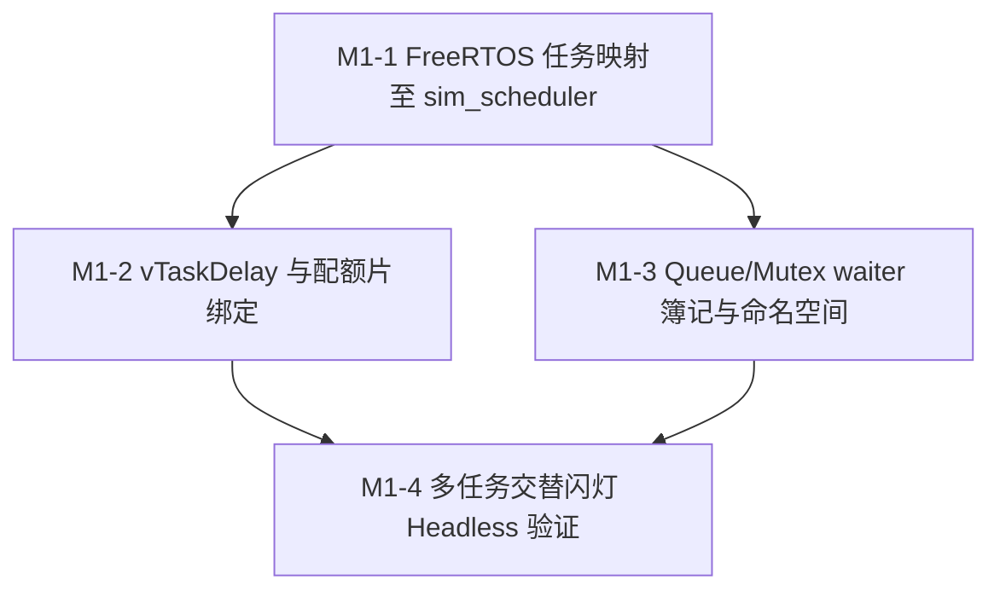

# ESP-IDF 仿真拦截层实施计划 M1：FreeRTOS 调度器 Shim 与并发原语

> 📋 **计划状态声明**：
> 本计划为 ESP-IDF 仿真拦截层派生子计划（Milestone 1）。
> **继承总纲**：[`PLAN-20260922-ESP-IDF-SIM-MASTER`](./2026-09-22-esp-idf-simulation-interception-master-plan.md) (v3.3)
> **当前状态**：📋 待开始（骨架占位，M0 验收完成后展开详细代码步骤）
> 🎯 **计划版本**：v1.0（2026-09-23）

---

## 1. 元数据表（🔴 必选）

| 字段 | 内容 |
|:---|:---|
| **计划编号** | `PLAN-20260924-ESP-IDF-SIM-M1` |
| **创建日期** | 2026-09-23 |
| **目标平台/SoC** | `wasm32-unknown-emscripten` / `host` (x86_64, Windows/Linux)；对照 SoC：`esp32` |
| **工具链/SDK版本**| `ESP-IDF v5.1.3 LTS` ~ `v6.1+` |
| **计划状态** | 📋 待开始（继承总纲，待 M0 闭环后展开） |
| **优先级** | 🔴 P0（核心并发底座） |
| **计划版本** | `v1.0` |
| **关联技术设计** | [`docs/zh/tech-designs/core/pal-i2c-v6-compatibility.md`](../../zh/tech-designs/core/pal-i2c-v6-compatibility.md) |
| **关联设计规范** | [`docs/zh/design/04-wasm-simulation/00-README.md`](../../zh/design/04-wasm-simulation/00-README.md)、[`02-wink-micro-os/`](../../zh/design/02-wink-micro-os/README.md) |
| **关联 ADR** | ADR-0012（语义降级）、ADR-0014（确定性调度）、ADR-0045（零 malloc / 内存预算）、ADR-0072（配额片）、ADR-0085（caps 双 SSOT） |
| **目标里程碑** | M1（协作式调度映射与 FreeRTOS 并发原语） |
| **前置依赖计划** | [`./2026-09-23-esp-idf-sim-m0-gpio-plan.md`](./2026-09-23-esp-idf-sim-m0-gpio-plan.md)（M0 必须 100% DoD 闭环） |
| **计划负责人** | 仿真拦截专项小组 |
| **主要依赖技能** | `embedded-best-practice` |

---

## 2. 背景与目标（继承自总纲 §3.5 / §6）

### 2.1 问题陈述
ESP-IDF 应用普遍重度依赖 FreeRTOS 多任务与并发原语（`xTaskCreate`, `vTaskDelay`, `Queue`, `Semaphore`, `Mutex`, `EventGroup`）。
WinkMicroOS 的仿真环境基于单线程协作式 Fiber 调度器 `wink_sim_scheduler`（ADR-0014），不具备真机硬件抢占与多核 SMP 能力。
M1 阶段必须在保持 100% 确定性虚拟时间推进的前提下，为 ESP-IDF 源码构建轻量、保真、无歧义的 FreeRTOS 门面层。

### 2.2 核心设计与契约（总纲 v3.3 锁定）
1. **调度桥接**：`xTaskCreate` / `vTaskDelay` 映射至 `sim_scheduler_*`；单虚拟核，`xTaskGetCoreID()` 恒返回 0。
2. **Handle 生命周期隔离（R-011 缓解）**：建立 `handle → {slot, generation}` POD 间接层，防止 `vTaskDelete` 后复用 slot 导致的 ABA 问题。
3. **自建 Waiter 簿记（R-004 缓解）**：调度器仅有全局 `blocked_on`，Queue/Mutex shim 必须自建 per-resource waiter 链，协同超时与唤醒。
4. **`resource_id` 命名空间（R-012 缓解）**：锁定 `resource_id = (type_tag << 24) | local_index` 编码（`QUEUE=0x01, MUTEX=0x02, SEM=0x03`），杜绝跨对象错唤醒。
5. **唤醒策略三分**：Priority-one（Queue/Mutex/Sem）vs Broadcast-all（EventGroup）。
6. **`vTaskDelay(0)` 纯让出**：不调用 `yield_timed(..., 0)`，直接协作切回调度循环，维持 READY 态由 RR 轮转。
7. **Tick 冻结与降级登记**：`configTICK_RATE_HZ=100`（1 tick = 10 ms）固定不可改；`< 10 ms` 延时截断为 0 并在 coverage matrix 显式登记。

### 2.3 成功指标（DoD 出口）
- ✅ 两任务 200ms / 500ms 交替调度，Replay 轨迹完全一致。
- ✅ `coverage matrix` 完备登记：优先级存储但不参与调度、单核忽略绑定、Tick 冻结截断等降级项。
- ✅ 专项回归测试通过：超时竞态、Handle ABA、`vTaskDelay(0)` 让出序、跨对象无串扰。

---

## 3. 架构红线继承（总纲 §8）

本子计划严格继承总纲 7 条架构红线：
1. 🚨 **C-ABI 与纯 C 实现原则**：标准 C99，严禁 C++ 运行时/异常。
2. 🚨 **严禁侵入式修改 PAL / DAL**：只依赖 `pal/include` 与 `targets/common/` 既有接口。
3. 🚨 **严格遵守 ADR-0065**：门面严禁调用 `pal_resource_claim()`。
4. 🚨 **零运行期堆分配**：`frameworks/esp_idf/src/**` 门面代码运行期禁止 `malloc/free`，waiter/handle 均预分配静态池。
5. 🚨 **PWM 定点红线（ADR-0066）**：LEDC 门面定点整数运算。
6. 🚨 **合约诚实（ADR-0012）**：一切语义降级必须在 coverage matrix 显式登记。
7. 🚨 **开源许可合规（ADR-0083/0084）**：`src/include` = LGPL-3.0-only，`test/` = GPL-3.0-only。

---

## 4. 里程碑任务分解概览

| 任务 ID | 任务标题 | 核心工作内容 | 预估工时 |
|:---|:---|:---|:---|
| **Task M1-1** | FreeRTOS 任务映射与 Handle 间接层 | `xTaskCreate*` 桥接、Handle generation POD 池、ABA 防御、`vTaskDelete` 僵尸回收 | 12 h |
| **Task M1-2** | 任务延时、`vTaskDelay(0)` 与时间基统一 | `vTaskDelay` / `vTaskDelayUntil`、`pdMS_TO_TICKS` 截断声明、虚拟时间统一 | 8 h |
| **Task M1-3** | Queue / Mutex / Semaphore Waiter 簿记闭环 | `resource_id` 编码、Priority-one 唤醒、超时竞态、静态控制块池 | 16 h |
| **Task M1-4** | 多任务场景用例与 Headless 回放验证 | 典型生产者-消费者与多任务交替闪灯用例、确定性哈希对比 | 8 h |

---

## 5. 待办声明

> 📌 **展开条件**：M0 计划（`2026-09-23-esp-idf-sim-m0-gpio-plan.md`）通过 L0~L4 验收准出后，本计划将补充第 6 章详细任务执行步骤、精确代码片段、测试用例清单与回滚方案。
