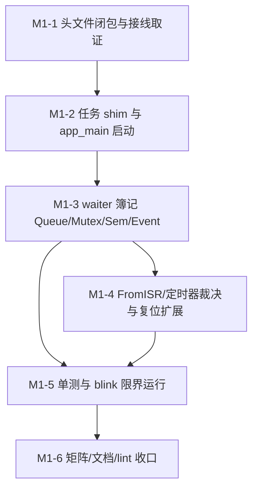

# ESP-IDF 仿真拦截层实施计划 M1：FreeRTOS 调度器 Shim 与并发原语

> 📋 **计划状态声明**：
> 本计划为 ESP-IDF 仿真拦截层派生子计划（Milestone 1）。
> **继承总纲**：[`PLAN-20260922-ESP-IDF-SIM-MASTER`](./2026-09-22-esp-idf-simulation-interception-master-plan.md) (v3.5，§3.5.1 / R-004 / R-011 / R-012 / §6 M1-3 / §7 M1 DoD 为本计划的上游强制输入)
> **当前状态**：📋 待开始（详设完成，M0 v1.4 验收后可立即开工）
> 🎯 **计划版本**：v1.1（2026-09-24，深度融合 Fiber 协程栈切出桥、Queue 双向 Waiter、Handle 统一解析闭环）
> 📚 **关联规范**：`docs-adr.md`、`03-coding-guidelines.md`、`00-IMPLEMENTATION-PLAN-TEMPLATE.md`
> 🔍 **M0 移交基线**：M0 v1.4 已交付 `freertos/` 七桩（`FreeRTOS.h/FreeRTOSConfig.h/projdefs.h/portable.h/portmacro.h/task.h/idf_additions.h`，`portTICK_PERIOD_MS=10` 归位 `portmacro.h`，`configTICK_RATE_HZ=100`、`configMAX_PRIORITIES=25` 冻结；`task.h` 仅 `vTaskDelay/Until` 声明 + `TaskHandle_t=void*` 不透明句柄，函数体递延本计划）；`esp_idf_app_loop` 为空、`app_main` 无人调用（M0 L2 诚实递延，本计划 M1-2/M1-5 闭环）；`wink_status.h` canonical 枚举以 `INVALID_ARG/NO_MEM/BUSY/UNSUPPORTED` 为准；`pal/include/hal/pal_gpio.h`、`pal/include/osal/pal_osal.h`、`targets/common/include/wink_sim_scheduler.h` 为准（签名以代码事实为准，见各 Task 取证步骤）
> 🔍 **核对基线**：`targets/common/src/wink_sim_scheduler.c:189-198`（`blocked_on` 琴键 + `timeout_us==0` 即无限等待）、`sim_ctx.h`（`targets/common/include`，测试链接用）、`pal_osal.h:82-154`（`WINK_BLOCKING` 互斥/信号量，仿真禁用）、总纲 v3.3 §3.5.1.1~1.3 / §3.9 / §8 红线 4 作用域

---

## 1. 元数据表（🔴 必选）

| 字段 | 内容 |
|:---|:---|
| **计划编号** | `PLAN-20260924-ESP-IDF-SIM-M1` |
| **创建日期** | 2026-09-24 |
| **目标平台/SoC** | `wasm32-unknown-emscripten` / `host` (x86_64, Windows/Linux)；对照 SoC：`esp32`（单核语义，`portNUM_PROCESSORS=1`） |
| **工具链/SDK版本**| `ESP-IDF v5.1.3 LTS` ~ `v6.1+`（取证基线：v6.1 tag；`task.h/queue.h/semphr.h` 原型以 v6.1 为准） |
| **计划状态** | 📋 待开始（详设完成） |
| **优先级** | 🔴 P0（M2 总线驱动的前置：UART/传感器语料重度依赖 Queue + `FromISR` + `vTaskDelay` 运行语义；M0 L2 运行闭环欠账） |
| **计划版本** | `v1.1` |
| **关联技术设计** | [`docs/zh/tech-designs/core/pal-i2c-v6-compatibility.md`](../../zh/tech-designs/core/pal-i2c-v6-compatibility.md)（仅引用超时包装约定，不实现） |
| **关联设计规范** | [`docs/zh/design/04-wasm-simulation/00-README.md`](../../zh/design/04-wasm-simulation/00-README.md)、[`02-wink-micro-os/`](../../zh/design/02-wink-micro-os/README.md) |
| **关联评审记录** | [`2026-09-22-esp-idf-simulation-interception-master-plan-review.md`](./2026-09-22-esp-idf-simulation-interception-master-plan-review.md)、[`2026-09-24-esp-idf-sim-m1-freertos-plan-review.md`](./2026-09-24-esp-idf-sim-m1-freertos-plan-review.md) |
| **关联 ADR** | [ADR-0001](../../decisions/core/0001-error-code-sign-convention.md)（负数错误码）、[ADR-0004](../../decisions/core/0004-static-dispatch-vs-runtime-ops.md)（静态分发）、[ADR-0012](../../decisions/core/0012-honest-contract-and-failure-visibility.md)（合约诚实与降级登记）、[ADR-0014](../../decisions/unisim/0014-sim-single-virtual-core.md)（单虚拟核确定性调度）、[ADR-0065](../../decisions/core/0065-pal-hardware-raii-resource-ownership.md)（禁门面 claim）、[ADR-0066](../../decisions/core/0066-pwm-basis-points-and-float-deprecation.md)（本计划无 PWM，仅 lint 守位）、[ADR-0070](../../decisions/core/0070-framework-lifecycle-and-coexistence.md)（生命周期强符号）、[ADR-0080](../../decisions/core/0080-external-lint-pack-discovery-and-mcs51-guard-sinking.md)（外部 lint pack，既有规则覆盖新增文件）、[ADR-0082](../../decisions/core/0082-target-wasm-graceful-reset-and-dirty-state-cleanup.md)（优雅复位扩展至阻塞任务）、[ADR-0083/0084](../../decisions/core/0083-multi-license-architecture-and-permissive-codegen.md)（分层开源许可） |
| **目标里程碑** | M1（任务/延时映射、Handle generation ABA、`vTaskDelay(0)` 纯让出、Queue/Mutex/Sem/EventGroup waiter 簿记、Fiber 协程切出桥、`app_main` fiber 启动、M0 L2 运行闭环） |
| **前置依赖计划** | M0 v1.4（`PLAN-20260923-ESP-IDF-SIM-M0`，100% DoD 闭环：七桩、`pal_gpio_*` 签名、`esp_restart` 三钩子）；D-001 调度器接口稳定（`wink_sim_scheduler.h`，已就绪） |
| **继承计划** | 继承自 [`PLAN-20260922-ESP-IDF-SIM-MASTER`](./2026-09-22-esp-idf-simulation-interception-master-plan.md) (v3.5) |
| **计划负责人** | 仿真拦截专项小组 |
| **主要依赖技能** | `embedded-best-practice` |

---

## 2. 背景与目标（🔴 必选）

### 2.1 问题陈述

M0 只交付了**编译闭环**：`vTaskDelay` 有声明无函数体、`esp_idf_app_loop` 为空、`app_main` 无人调用（M0 L2 已诚实递延）。任何含 `while(1)+vTaskDelay` 的真实 IDF 程序（含 Tier-A blink）在仿真中**链接即断、运行为零**。M1 必须解决五个根问题：

1. **任务生命与时钟**：`xTaskCreate/Delete/Suspend/Resume`、`vTaskDelay/DelayUntil`、`xTaskGetTickCount` 映射到单虚拟核协作调度器（`wink_sim_scheduler`），`app_main` 作为 fiber 被框架注册并由 target 主循环驱动。
2. **Handle ABA 与 NULL 语义**：`TaskHandle_t` 若直接复用 slot 下标，动态创建/删除复用 slot 会导致旧句柄误操作新任务（总纲 R-011，阻塞 M1 开工项）；FreeRTOS 普遍约定 `handle == NULL` 表示当前调用任务，需集中统一解析。
3. **Waiter 簿记与双向分离**：调度器只有 `blocked_on` 琴键、无 per-resource 等待队列、无超时-唤醒竞态处理，Queue/Mutex/Sem/EventGroup 必须自建 waiter 簿记 + `resource_id` 命名空间（总纲 R-004/R-012，M1 最大隐藏工作量）；其中 Queue 必须严格隔离 `rx_waiters` 与 `tx_waiters`，防止满队写与空队读唤醒错乱。
4. **语义诚实**：真机 25 级抢占优先级、堆上 TCB、中断抢占在协作仿真中不存在——存储但不调度、静态池、临界区 no-op 等弱化必须逐条登记（ADR-0012），`FromISR` 与软件定时器必须明确裁决（去留 M2 可用性关键：UART 语料依赖 `xQueueSendFromISR`）。
5. **Fiber 协程切出桥（Yield Context Bridge）**：调度器底层基于 Win32/WASM Fiber 协程栈，`sim_scheduler_yield_timed` 和 `sim_scheduler_block` 仅仅置调度器状态机标记，内部无栈切换指令。在 C 语言中，函数 `return` 仅返回当前 Fiber 内的调用方（如 `app_main` 的死循环），不会交出控制权。因此所有阻塞/延时必须通过切出桥（`sim_scheduler_yield_context()`）真正挂起当前 Fiber 栈并切入主循环上下文（`s_main_ctx`），主调度器唤醒后方自挂起点恢复；严禁“纯置状态+直接 return”的伪挂起。

### 2.2 技术/业务目标

- ✅ **目标 1**：`freertos/task.h` 全量声明 + `queue.h/semphr.h/event_groups.h` 新增 + `timers.h` Fail-Loud 声明桩，闭包登记入 `03-include-closure-inventory.md`。
- ✅ **目标 2**：`src/freertos/freertos_task.c`——Handle generation 间接层、`resolve_task_handle` 统一解析（支持 `NULL->current`）、自删 `vTaskDelete(NULL)` 切出且永不恢复、延时双函数挂接 Fiber 切出桥（`sim_scheduler_yield_context()`）；`vTaskDelay(0)` 纯让出（切出主循环，保持 READY 态让出时间片，禁止纯 return 空操作，禁 `yield_timed(...,0)`）。
- ✅ **目标 3**：`src/freertos/freertos_queue.c` + `freertos_semphr.c` + `freertos_event.c`——Queue 双向等待队列（`rx_waiters` 与 `tx_waiters` 分离，满队写与空队读唤醒正交）、Mutex Priority-one、EventGroup Broadcast-all（完整覆盖 `xWaitForAllBits` 与 `xClearOnExit`）、同优先级 FIFO tiebreak；`resource_id=(type_tag<<24)|local_index`（`QUEUE=0x01/MUTEX=0x02/SEM=0x03/EVENT=0x04/SUSPEND=0x06`，`TIMER=0x07`，`GPTIMER=0x05` 预留 M2）；超时-唤醒竞态经 `timeout_fired` 协同。
- ✅ **目标 4**：`FromISR` 全家桶实现为任务上下文等价（协作式无抢占，`*pxHigherPriorityTaskWoken=pdFALSE`，`xTaskGetTickCountFromISR` 等价透传）+ 矩阵登记；`timers.h` 软件定时器运行时 Fail-Loud（需 daemon task，递延 M2+）；任务看门狗维持 M0 `NOT_SUPPORTED`。
- ✅ **目标 5**：`esp_restart` 扩展至阻塞任务——target 主循环 poll 到 pending 后 `sim_scheduler_reset` + 门面池复位 + `app_main` 重注册；M0 GPIO 影子缓存的单线程假设在协作无抢占下复核为安全（登记，不改代码）。
- ✅ **目标 6**：L1 主机单测（ABA、让出序、waiter 优先级/FIFO、超时竞态、`resource_id` 跨对象无串扰、阻塞-恢复-再阻塞、自删切出断言）+ L2 blink 限界运行（`max_ticks` 有界，GPIO 翻转断言 + 双跑 Replay 一致 = **M0 L2 欠账正式闭环**）；wasm compile-only 门禁扩展至新增源文件；测试命名一律 `test_esp_idf_*`（M0 教训：`-R esp_idf` 漏跑制度化规避）。
- ✅ **目标 7**：`02-api-coverage-matrix.md` 新增降级条目 6~12；静态池总量 `< 8KB`（M1 份额，总纲 `< 16KB` 内）；既有 lint pack 零新增规则全绿（`RUNTIME-MALLOC` 看守静态池）。

### 2.3 成功指标（验收出口）

| 指标 | 通过标准 | 验证方法 |
|:---|:---|:---|
| **任务/延时映射** | `xTaskCreate`→`sim_scheduler_register`（8 任满回 `pdFAIL`）；`vTaskDelay(n)` 按 `n*10ms` 虚拟唤醒；`DelayUntil` 周期准 | `ctest -L esp_idf`（`test_esp_idf_freertos`） |
| **ABA 与 NULL 解析** | 创建→删除→复用同 slot，旧 handle 操作被拒；`NULL` 句柄精准解析当前任务 | `test_esp_idf_handle_aba`（L1 专测，总纲 §7） |
| **`vTaskDelay(0)` 纯让出** | 真正切出 Fiber 协程栈，不进等待态保持 READY，同优先级就绪任务优先被选中；让出序断言 | L1 让出序专测（总纲 §7） |
| **Waiter 簿记双向隔离** | Queue `rx_waiters` 与 `tx_waiters` 定向唤醒不错乱；Mutex 高优先级先醒 / EventGroup 广播；超时竞态无丢失唤醒；跨对象无串扰 | L1 waiter 五件套（总纲 R-004/`§7`） |
| **M0 L2 闭环** | blink 限界运行 200 ticks 内 GPIO 翻转 ≥ N 次；双跑轨迹完全一致 | `test_esp_idf_blink_run`（L2） |
| **双目标构建** | Host + Wasm compile-only 0 error, 0 warning | CMake + `esp_idf_wasm_compile_*` 新增项 |
| **红线/许可** | 既有 pack 全绿；`check_license_map.py` 全绿 | `winkcli lint --pack esp_idf_all` + 许可脚本 |
| **文档同步** | 矩阵条目 6~12 + 01 调度章节 + 03 新增头登记 | `docs-contract-gate` 人工审查 |

---

## 3. 变更范围与影响分析（🔴 必选）

### 3.1 文件变更清单

| 文件路径 | 变更类型 | 说明 |
|:---|:---:|:---|
| `wink-micro-os/targets/common/include/wink_sim_scheduler.h` | ✏️ 增补 | 增补 `sim_scheduler_yield_context(void)` 与 `sim_scheduler_set_main_ctx`（纯增补，无破坏性变更，供 Fiber 挂起切出） |
| `wink-micro-os/targets/common/src/wink_sim_scheduler.c` | ✏️ 增补 | 实现 `sim_scheduler_yield_context(void)`（持有 `s_sim_main_ctx` 并执行 `sim_ctx_switch(cur, s_sim_main_ctx)`） |
| `wink-micro-os/frameworks/esp_idf/include/freertos/task.h` | ✏️ 扩展 | 全量任务声明（`xTaskCreate/PinnedToCore/Delete/Suspend/Resume/GetTickCount/GetTickCountFromISR/State/List/HWM`、`taskENTER/EXIT_CRITICAL`、`xTaskGetSchedulerState`、`vTaskStartScheduler`、`xPortGetCoreID`）；`TaskHandle_t` 保持 `void*` 不透明 |
| `wink-micro-os/frameworks/esp_idf/include/freertos/queue.h` | 🆕 新增 | Queue 声明（`xQueueCreate/Send/Receive/Peek + ISR 五件套`） |
| `wink-micro-os/frameworks/esp_idf/include/freertos/semphr.h` | 🆕 新增 | Mutex/Sem 声明（`xSemaphoreCreateMutex/Binary/Counting/Give/Take + Recursive→弃用标记 + ISR`） |
| `wink-micro-os/frameworks/esp_idf/include/freertos/event_groups.h` | 🆕 新增 | EventGroup 声明（24bit，`xEventGroupWaitBits/SetBits/ClearBits`） |
| `wink-micro-os/frameworks/esp_idf/include/freertos/timers.h` | 🆕 新增 | 软件定时器 **Fail-Loud 声明桩**（`xTimerCreate→NULL`，`xTimerStart→pdFAIL`；需 daemon task，递延 M2+，矩阵条目 10） |
| `wink-micro-os/frameworks/esp_idf/src/freertos/freertos_task.c` | 🆕 新增 | Handle generation 池、`resolve_task_handle`、任务生命、自删切出、延时双函数挂接切出桥、Tick 源、杂项 no-op |
| `wink-micro-os/frameworks/esp_idf/src/freertos/freertos_queue.c` | 🆕 新增 | Queue FIFO + `rx_waiters`/`tx_waiters` 双向簿记 + `resource_id(QUEUE)` |
| `wink-micro-os/frameworks/esp_idf/src/freertos/freertos_semphr.c` | 🆕 新增 | Mutex/Sem（复用 waiter 内核，见 M1-3 Step 0）+ `resource_id(MUTEX/SEM)` |
| `wink-micro-os/frameworks/esp_idf/src/freertos/freertos_event.c` | 🆕 新增 | EventGroup broadcast（`xWaitForAllBits`/`xClearOnExit` 判定）+ `resource_id(EVENT)` |
| `wink-micro-os/frameworks/esp_idf/src/freertos/freertos_sync.h` | 🆕 新增 | **内部头**（不导出）：waiter 池操作 + `sync_block` 协程切出 + `resource_id` 分配 + 超时换算（`src/` 内共享，禁出 `include/`） |
| `wink-micro-os/frameworks/esp_idf/src/esp_idf_runtime.c` | ✏️ 修改 | `esp_idf_framework_init` 注册 `app_main` fiber（trampoline + `main_task_id` latch）；`loop` 保持空（target 主循环驱动，ADR-0070） |
| `wink-micro-os/frameworks/esp_idf/src/esp_idf_bridge.c` | ✏️ 修改 | 新增 `esp_freertos_pools_reset()`（供复位路径；内部 linkage，经 `freertos_sync.h` 声明） |
| `wink-micro-os/frameworks/esp_idf/esp_idf_sources.cmake` | ✏️ 修改 | 追加 4 个 `src/freertos/*.c`（SSOT） |
| `wink-micro-os/frameworks/esp_idf/docs/02-api-coverage-matrix.md` | ✏️ 修改 | 新增降级条目 6~12（M1-6） |
| `wink-micro-os/frameworks/esp_idf/docs/01-architecture-and-governance-guide.md` | ✏️ 修改 | 新增调度映射章节（协作契约：阻塞=标记状态+协程切出，恢复后从调用点继续） |
| `wink-micro-os/frameworks/esp_idf/docs/03-include-closure-inventory.md` | ✏️ 修改 | 登记 4 个新增头来源与桩策略 |
| `wink-micro-os/frameworks/esp_idf/test/core/test_esp_idf_freertos.c` | 🆕 新增 | L1 主机单测（链接 `targets/common/wink_sim_scheduler.c`，见 M1-5 取证） |
| `wink-micro-os/frameworks/esp_idf/test/run/test_esp_idf_blink_run.c` | 🆕 新增 | L2 blink 限界运行（`pal_sim_scheduler_run(max_ticks)` 有界 + GPIO 轨迹） |
| `wink-micro-os/test/CMakeLists.txt` | ✏️ 修改 | 注册 2 单测 + wasm compile-only 扩展（中央热文件，串行合入，禁并行改） |

### 3.2 接口影响分析

| 接口层 | 是否有破坏性变更 | 影响范围 | 备注 |
|:---|:---:|:---|:---|
| PAL 公开 API | ❌ 否 | 无 | **严禁经 `pal_os_mutex/sem`**：其为 `WINK_BLOCKING` 宿主线程原语（堆分配 + 墙钟，不可 Replay），M1 阻塞一律经 `sim_scheduler_block/resume` + `sim_scheduler_yield_context`（ADR-0014） |
| DAL 层 | ❌ 否 | 无 | 不经过 DAL |
| M0 已交付 | ⚠️ 行为收窄 | `esp_system` WDT、`timers.h` | WDT 维持 `NOT_SUPPORTED`（条目 5 续存）；`timers.h` 新增即 Fail-Loud，无既有调用方可破坏 |
| 调度器 | ⚠️ 纯增补 | 无 | `targets/common` 增补 `sim_scheduler_yield_context()` 协作切出入口（非破坏性，5 行代码，统一 Host/Wasm Fiber 挂起路径，不改变既有调度逻辑） |
| 构建系统 | ⚠️ 是 | `esp_idf_sources.cmake` + 中央测试 CMake | 纯追加；真机 `ESP_PLATFORM` 早退不变 |

### 3.3 架构红线（DoD 准入准出，违反即拒绝合入；继承 M0 七条）

> 🚨 **M1 新增红线（总纲 §8 细化）**：
> 8. 🚨 **调度器基础设施豁免边界**：红线 4 只扫 `frameworks/esp_idf/src/**`；`targets/common/sim_ctx_create` 的建期栈分配属基础设施，不在本红线内（lint glob 已排除 `targets/`，M0 已验证）。
> 9. 🚨 **优先级存储但不调度**：`pick_next` 为纯 RR（总纲 §3.5.1.1 代码事实），门面禁造“伪优先级调度”；waiter 唤醒序仍按优先级（条目 6 登记）。
> 10. 🚨 **`vTaskDelay(0)` 真实让出**：真机语义 = `taskYIELD()`。shim 中必须执行 `sim_scheduler_yield_context()` 切出主循环，任务保持 READY 态由 RR 自然调度下一个就绪任务；严禁直接 return 无操作（否则继续占用 CPU 不让出），严禁调用 `yield_timed(...,0)` 进等待态（同 tick 调度-让出空转，总纲 §3.5.1.2）。
> 11. 🚨 **阻塞与让出契约**：一切阻塞/延时 shim 必须遵循 “标记调度状态（`sim_scheduler_block` 或 `sim_scheduler_yield_timed`）+ 协程切回调度主循环（`sim_scheduler_yield_context()`）”，主循环唤醒后自挂起点继续向下执行；严禁误以为 C 语言 return 会交还调度权；严禁在门面层使用 host while 自旋等待宿主条件；自删 `vTaskDelete(NULL)` 标记 ZOMBIE 后必须切出且永不返回。

### 3.4 系统资源与并发约束评估

| 维度 | 预计开销 / 限制 | 风险分析 | 应对策略 |
|:---|:---|:---|:---|
| **静态 RAM（M1 份额）** | < 8 KB（总纲 < 16KB 内） | 池超限 | TCB 8×48B；Queue 8×(128B+512B)；Mutex/Sem 16×64B；Event 8×160B；`_Static_assert` 锁死结构体尺寸 |
| **堆内存** | **门面 0 字节** | `xQueueCreate` 大 item 诱惑 `malloc` | 单队列 ≤512B，超限回 `NULL`（诚实 `NO_MEM` 语义）；lint `RUNTIME-MALLOC` 机器看守 |
| **Tick 精度** | 10ms 虚拟 tick | 亚 tick 延时全部截断为 0（`pdMS_TO_TICKS` 官方截断语义） | 条目 11 登记；`Delay(1)` 以下需求必须重写 |
| **并发** | 单核协作，无抢占 | `FromISR` 误以为有抢占语义 | `*pxHigherPriorityTaskWoken=pdFALSE` 恒定 + 条目 9（M2 UART 审计项 R-M1-04） |
| **任务数** | ≤8（`WINK_SIM_MAX_TASKS`） | 第 9 个任务静默丢失 | 任满回 `pdFAIL` + `ESP_LOGE`，L1 任满回归 |

---

## 4. 依赖与风险（🔴 必选）

### 4.1 前置依赖

| 依赖 ID | 依赖内容 | 是否阻塞 | 状态 | 备注 |
|:---|:---|:---:|:---:|:---|
| **D-M0** | M0 v1.4 DoD 100%（七桩、`pal_gpio_*` 签名、三钩子） | ✅ 是 | ✅ 已闭环 | commit `293eef66`，远端 CI 待看（M0 收工项，不阻塞 M1 开工） |
| **D-001** | `wink_sim_scheduler.h` 接口稳定 | ✅ 是 | ✅ 已就绪 | `register/yield_timed/block/resume` 取证完毕（`.c:189-198`） |
| **D-M1-01** | `app_main` fiber 接线证据（mcs51 `main_task_id` 管道 + host/wasm run 路径） | ✅ 是 | ⏳ M1-1 取证 | 见 M1-1 Step 0；取证失败则 M1-2 不得开工（R-M1-01） |
| **D-M1-02** | 测试链接证据（`sim_ctx` host 实现位 + 调度器 `.c` 直链先例） | ✅ 是 | ⏳ M1-5 取证 | `HOST_PAL_OBJECT` 镜像 |

### 4.2 外部依赖

| 依赖 ID | 依赖内容 | 提供方 | 风险等级 | 备注 |
|:---|:---|:---|:---:|:---|
| **E-001** | ESP-IDF v6.1 `task/queue/semphr/event_groups/timers` 头签名 | Espressif | 🟡 中 | M1-1 逐字取证，`03` 登记 |
| **E-002** | `winkcli` + emcc/Node（wasm compile-only；Node 运行为 stretch） | wink-tools / emsdk | 🟡 中 | Node 限界运行失败不卡 M1，通过即赚 |

### 4.3 风险登记册

| 风险 ID | 风险描述 | 概率 | 影响 | 严重度 | 缓解措施 | 责任人 | 触发条件 |
|:---|:---|:---:|:---:|:---:|:---|:---|:---|
| **R-004(继)** | waiter 簿记复杂度低估（双向队列 + 唤醒三分 + 超时竞态 + `resource_id`），M1-3 滑期 | 🟡 中 | 🟠 高 | 6 | 单列 M1-3（10h）；先测后码（用例先行）；>3 天未闭环触发滑期复盘 | 专项小组 | M1-3 超期 |
| **R-011(继)** | Handle ABA（旧句柄误操作新任务） | 🟡 中 | 🔴 极高 | 8 | generation 间接层 + `resolve_task_handle` 统一三检 + L1 ABA 专测；阻塞开工 | 专项小组 | 动态创建/删除场景 |
| **R-012(继)** | `resource_id` 无命名空间跨对象错唤醒 | 🟡 中 | 🟠 高 | 6 | type_tag 前缀 + 跨对象无串扰回归 | 专项小组 | Queue 与 Mutex 并存等待 |
| **R-M1-01** | `app_main` fiber 接线方式未知（`main_task_id` 管道、trampoline 签名适配） | 🟠 高 | 🟠 高 | 8 | M1-1 Step 0 强制取证 mcs51 + host/wasm run 路径；取证无结论不开 M1-2 | 专项小组 | 取证步骤无输出 |
| **R-M1-02** | Tick 时钟源漂移（`pal_os_get_us` 在 host/wasm 是否同为虚拟时钟） | 🟡 中 | 🟠 高 | 6 | M1-2 Step 1 双 target 取证；不一致则 Tick 源改调度器虚拟时钟并登记 | 专项小组 | 双跑 Replay 不一致 |
| **R-M1-03** | Queue 大 item（>512B）语料真实存在 | 🟢 低 | 🟡 中 | 3 | `xQueueCreate` 回 `NULL` + 矩阵条目 13，上游语料侧降级登记 | 专项小组 | Tier-B 语料编译报 NULL |
| **R-M1-04** | `FromISR` 等价审计（M2 UART 强依赖，协作式假设须经得起中断上下文调用） | 🟡 中 | 🟠 高 | 6 | M1-4 逐 API 审计表 + `pal_log_in_isr()` 上下文断言测试 | 专项小组 | M2 UART 联调异常 |

---

## 5. 优先级路线图与关键路径

### 5.1 执行顺序



### 5.2 优先级矩阵

| 任务 ID | 任务标题 | 优先级 | 预估工时 | 涉及关键文件 |
|:---|:---|:---:|:---:|:---|
| **Task M1-1** | 头文件闭包（4 新增+1 扩展）与三项接线取证 | 🔴 P0 | 4 h | `include/freertos/*.h`, `docs/03-*.md` |
| **Task M1-2** | `freertos_task.c` + 切出桥挂接 + `app_main` 启动 + Tick 源 | 🔴 P0 | 8 h | `src/freertos/freertos_task.c`, `src/esp_idf_runtime.c` |
| **Task M1-3** | waiter 簿记：Queue 双向/Mutex/Sem/Event + `resource_id`（关键路径，R-004） | 🔴 P0 | 10 h | `src/freertos/freertos_queue.c`, `freertos_semphr.c`, `freertos_event.c`, `freertos_sync.h` |
| **Task M1-4** | `FromISR` 等价、`timers.h` Fail-Loud、复位扩展、M0 缓存复核 | 🔴 P0 | 4 h | `src/freertos/*.c`, `src/esp_idf_bridge.c` |
| **Task M1-5** | L1 单测 + blink 限界运行（M0 L2 闭环）+ wasm 门禁扩展 | 🔴 P0 | 7 h | `test/core/*`, `test/run/*`, `test/CMakeLists.txt` |
| **Task M1-6** | 矩阵条目 6~12、01/03 文档、lint/许可收口 | 🔴 P0 | 4 h | `docs/*`, `esp_idf_sources.cmake` |
| **总计** | | | **37 h** | |

### 5.3 关键路径与冲突控制
- **关键路径**：`M1-1 → M1-2 → M1-3 → M1-5`（约 29 h）；M1-4 可与 M1-3 尾部并行（不同文件），M1-6 收尾。
- **文件冲突控制**：`wink-micro-os/test/CMakeLists.txt` 中央热文件仅 M1-5 触碰，一次性写入；`esp_idf_sources.cmake` 仅 M1-6 触碰。

---

## 6. 详细任务拆分与进度追踪（🔴 必选）

---

### Task M1-1：头文件闭包与三项接线取证 `[ 状态: ⏳ 待开始 ]`

| 字段 | 内容 |
|:---|:---|
| **负责人** | 仿真拦截专项小组 |
| **预估工时** | 4 小时 |
| **优先级** | 🔴 P0 |
| **前置依赖** | D-M0（M0 v1.4） |
| **修改文件** | `include/freertos/{task.h,queue.h,semphr.h,event_groups.h,timers.h}`、`docs/03-include-closure-inventory.md` |
| **接口变化** | 导出 FreeRTOS 任务/同步原语视图；`timers.h` 仅 Fail-Loud 声明 |

#### 详细步骤

- [ ] **Step 0：三项接线取证（R-M1-01/R-M1-02/D-M1-02，取证无结论不开 M1-2）**
  1. 读 `frameworks/mcs51/src/mcs51_bridge.cpp`（七字段 + `main_task_id` 管道）：`app_main` fiber 以何种函数签名注册、以何种 id 交还 target；
  2. 读 `targets/host` 主循环与 `targets/wasm/wasm_entry.c` run 路径：`pal_sim_scheduler_run(callbacks, main_task_id, max_ticks)` 的调用点与 `max_ticks` 有界语义；
  3. 读 `targets/host` 与 `targets/wasm` 的 `pal_os_get_us` 实现：是否为同一虚拟时钟（Replay 确定性前提）；`sim_ctx` host 实现文件位（测试直链用）。
  4. 读 `targets/host/pal_osal_host.c:192` 与 `targets/wasm/pal_osal_wasm.c:127` 的 `s_main_ctx` 挂接方式：确认增补 `sim_scheduler_yield_context(void)` 作为全局非破坏性协程切出入口。
  5. 输出：四项结论写入本 Task 验证记录，任一项无结论即触发 R-M1-01/R-M1-02。

- [ ] **Step 1：扩展 `task.h`**（原型以 IDF v6.1 `task.h` 为准）：`xTaskCreate/xTaskCreatePinnedToCore/vTaskDelete/vTaskSuspend/vTaskResume/xTaskGetTickCount/xTaskGetTickCountFromISR/eTaskGetState/uxTaskGetNumberOfTasks/uxTaskGetStackHighWaterMark/vTaskList/uxTaskGetSystemState/xTaskGetSchedulerState/vTaskStartScheduler/taskENTER_CRITICAL/taskEXIT_CRITICAL/xPortGetCoreID`；`TaskHandle_t` 维持不透明 `void*`。

- [ ] **Step 2：新增 `queue.h/semphr.h/event_groups.h`**（官方签名逐字）：含 `...FromISR` 五件套（实现见 M1-4 等价裁决）；`xSemaphoreCreateRecursiveMutex` 声明保留但标注弃用（实现回 `NULL`，条目 10）。

- [ ] **Step 3：新增 `timers.h` Fail-Loud 桩**：`xTimerCreate→NULL`，`xTimerStart/Stop/Reset→pdFAIL`（M0 `task.h` 最小声明桩先例；daemon task 递延 M2+，条目 10）。

- [ ] **Step 4：`03` 登记**：4 头来源、桩策略（透传/声明/Fail-Loud）、驱动语料（Tier-B UART 预研）逐条。

#### 验证步骤
1. blink `OBJECT` 语料仍 0 error（头变更无回归）；
2. 取证结论落盘（阻塞 M1-2 的门）。

---

### Task M1-2：任务 shim 与 `app_main` fiber 启动 `[ 状态: ⏳ 待开始 ]`

| 字段 | 内容 |
|:---|:---|
| **负责人** | 仿真拦截专项小组 |
| **预估工时** | 8 小时 |
| **优先级** | 🔴 P0 |
| **前置依赖** | Task M1-1（取证门） |
| **修改文件** | `src/freertos/freertos_task.c`（新建）、`src/esp_idf_runtime.c`（修改）、`targets/common/wink_sim_scheduler.{h,c}`（纯增补切出入口） |
| **接口变化** | 任务生命周期的唯一合法入口；`app_main` 由框架注册为 fiber；提供协程切出入口 |

#### 详细步骤

- [ ] **Step 1：Handle generation 间接层与统一句柄解析（R-011）**
  ```c
  /* SPDX-License-Identifier: LGPL-3.0-only */
  #define FREERTOS_MAX_TASKS WINK_SIM_MAX_TASKS /* 8，与调度器对齐，任满 pdFAIL */
  typedef struct { bool used; uint16_t gen; uint32_t sim_id; int32_t prio; char name[16]; } esp_tcb_t;
  static esp_tcb_t s_tcb[FREERTOS_MAX_TASKS];
  /* Handle = ((uint32_t)gen << 8) | index (gen 永不取 0，绕回跳过)；void* 经 (uintptr_t) 承载 */
  static esp_tcb_t* resolve_task_handle(TaskHandle_t h) {
      if (h == NULL) {
          uint32_t slot = sim_scheduler_current_id();
          return (slot < FREERTOS_MAX_TASKS && s_tcb[slot].used) ? &s_tcb[slot] : NULL;
      }
      uint32_t val = (uint32_t)(uintptr_t)h;
      uint32_t slot = val & 0xFFu;
      uint16_t gen = (uint16_t)(val >> 8);
      if (slot >= FREERTOS_MAX_TASKS) return NULL;
      esp_tcb_t* t = &s_tcb[slot];
      if (!t->used || t->gen != gen || t->sim_id != slot) return NULL;
      return t;
  }
  ```
  入口三检集中由 `resolve_task_handle` 承接：`used && gen 匹配 && sim_id 存活`，任一失败 → `ESP_LOGE` + 按 API 返回 `pdFAIL/NULL`（陈旧 handle 永不可操作新任务）。

- [ ] **Step 2：创建/删除/挂起/恢复与自删保护**：
  - `xTaskCreate`（`usStackDepth` 忽略 + `ESP_LOGW`，条目 7；`uxPriority` clamp 0..24 **存储但不调度**，条目 6；`xCoreID` 非 0/`tskNO_AFFINITY` 则钳制 0 + `ESP_LOGW`，条目 6）→ `sim_scheduler_register`；
  - `vTaskDelete`：通过 `resolve_task_handle` 解析；若为当前任务自删（`h == NULL` 或 `t->sim_id == current`），标记 `sim_scheduler_mark_zombie(self)` + `gen++` 后，**必须立即调用 `sim_scheduler_yield_context()` 永久切出主循环，严禁 return 回已释放的 Fiber 栈**；若为删除他者，则仅标记 zombie；
  - `vTaskSuspend(NULL→current)` → `sim_scheduler_block(SUSPEND tag)` + `sim_scheduler_yield_context()`；`vTaskResume` → `sim_scheduler_resume`。

- [ ] **Step 3：延时双函数与协程切出桥（红线 10 / 红线 11）**：
  ```c
  void vTaskDelay(const TickType_t xTicksToDelay) {
      if (xTicksToDelay == 0) {
          /* 真实纯让出：保持 READY 态，RR 自然轮转，切出主循环；禁 yield_timed(...,0)，禁无操作 return */
          sim_scheduler_yield_context();
          return;
      }
      uint32_t self = sim_scheduler_current_id();
      uint64_t dur_us = (uint64_t)xTicksToDelay * (portTICK_PERIOD_MS * 1000ULL);
      sim_scheduler_yield_timed(self, pal_os_get_us(), dur_us);
      sim_scheduler_yield_context(); /* 挂起 Fiber 协程栈，交回主调度器；唤醒后自此恢复继续向下执行 */
  }
  void vTaskDelayUntil(TickType_t *px, const TickType_t incr) {
      TickType_t now = xTaskGetTickCount(); TickType_t target = *px + incr; /* uint32 自然绕回，防追赶风暴 */
      *px = target;
      if ((int32_t)(target - now) > 0) { vTaskDelay(target - now); } else { *px = now; }
  }
  ```
  注：`ticks * portTICK_PERIOD_MS * 1000ULL` 必须 `uint64_t` 运算（32 位在 ~49 天处溢出）。

- [ ] **Step 4：Tick 源与杂项**：
  - `xTaskGetTickCount = (TickType_t)(pal_os_get_us() / (portTICK_PERIOD_MS * 1000ULL))`（与延时同一时钟，自洽；`uint32` 自然绕回≈真机行为，条目 11；无任务推进时间时 Tick 冻结，条目 11）；
  - `xTaskGetTickCountFromISR()` 等价透传 `xTaskGetTickCount()`；
  - `eTaskGetState` 映射 sim 六态；
  - `uxTaskGetStackHighWaterMark→UINT32_MAX` 哨兵（无栈概念，条目 7）；
  - `vTaskList/uxTaskGetSystemState` 有界 `snprintf` 实现（观测性，供测试）；
  - `taskENTER/EXIT_CRITICAL` 空函数（无抢占，条目 8）；
  - `vTaskStartScheduler→ESP_LOGW` no-op（调度器归 target 主循环）；
  - `xPortGetCoreID→0`；`xTaskGetSchedulerState→taskSCHEDULER_RUNNING`。

- [ ] **Step 5：`app_main` fiber 接线（R-M1-01 闭环）**：
  - `esp_idf_framework_init` 内 `sim_scheduler_register(app_main_trampoline, "app_main", 主优先级, core 0, ...)` 并 latch `main_task_id` 供 target；
  - trampoline 适配 `void(void)→void(void*)`，`app_main` 若自然返回则自动触发 `sim_scheduler_mark_zombie` + 切出（blink 永不返回）；
  - `esp_idf_app_loop` 保持空（ADR-0070）。

#### 验证步骤
1. 主机小 harness：两任务 `vTaskDelay(10)` 交替，tick 差断言；
2. `vTaskDelay(0)` 让出序：断言真正执行了 Fiber 切出，同优先级 READY 任务优先选中、不进等待态（总纲 §7 专测）；
3. `vTaskDelete(NULL)` 自删断言：任务退出后主循环成功 GC，不发生崩溃。

---

### Task M1-3：waiter 簿记（Queue 双向/Mutex/Sem/Event） `[ 状态: ⏳ 待开始 ]`

| 字段 | 内容 |
|:---|:---|
| **负责人** | 仿真拦截专项小组 |
| **预估工时** | 10 小时（含用例先行；>3 天触发 R-004） |
| **优先级** | 🔴 P0（关键路径） |
| **前置依赖** | Task M1-2 |
| **修改文件** | `src/freertos/freertos_sync.h`（内部）、`freertos_queue.c`、`freertos_semphr.c`、`freertos_event.c`（偏离总纲文件树：Event 独立成文件，理由=唤醒策略与 Queue 正交，合文件会超 500 行可读阈值） |
| **接口变化** | 并发原语唯一合法入口；`resource_id` 命名空间契约（M2 消费） |

#### 详细步骤

- [ ] **Step 0：两项裁决记录**：
  1. 总纲 `TIMER=0x04` 与本计划 `EVENT` tag 冲突 → `EVENT=0x04` 归本计划（M1 先到先得），`TIMER` 顺延 `0x07`，`GPTIMER=0x05` 预留 M2（`SUSPEND=0x06`）；
  2. 总纲“sem 经队列实现”细化为“共享 waiter 内核（`freertos_sync.h`）+ 各自对象语义”，理由=Mutex 若占整条 512B Queue 存储则 16 互斥量吃掉 8KB 预算（内存确定性优先于实现复用，ADR-0012 登记）。

- [ ] **Step 1：`freertos_sync.h` waiter 内核与协程切出**：
  ```c
  /* waiters 结构：sim_id + 入队序 + 优先级快照 */
  static bool sync_block(uint32_t resource_id, TickType_t xTicksToWait) {
      uint32_t self = sim_scheduler_current_id();
      if (xTicksToWait == 0) {
          return false; /* 0 等待直接返回超时 */
      }
      uint64_t timeout_us = (xTicksToWait == portMAX_DELAY) ? 0ULL : ((uint64_t)xTicksToWait * (portTICK_PERIOD_MS * 1000ULL));
      sim_scheduler_block(self, resource_id, pal_os_get_us(), timeout_us);
      sim_scheduler_yield_context(); /* 挂起 Fiber 协程栈，交还控制权给调度主循环 */
      /* 唤醒或超时后从这里恢复运行 */
      const sim_task_t* t = sim_scheduler_get(self);
      return !t->timeout_fired;
  }
  ```
  `resource_id=(tag<<24)|index` 分配与回收，彻底隔离各对象等待域。

- [ ] **Step 2：`freertos_queue.c` 双向等待队列**：
  - 对象池 8 ×（控制块 ~96B + 定额 512B 存储，`length*item_size>512→xQueueCreate 回 NULL`，条目 13）；
  - 每个队列内聚 **双等待队列**：`rx_waiters[WINK_SIM_MAX_TASKS]`（空队读阻塞）与 `tx_waiters[WINK_SIM_MAX_TASKS]`（满队写阻塞）；
  - `xQueueSend`：队列满时入 `tx_waiters` 簿记 + `sync_block(QUEUE)`；写入成功后定向唤醒 `rx_waiters` 队首 waiter（FIFO-one）；
  - `xQueueReceive`：队列空时入 `rx_waiters` 簿记 + `sync_block(QUEUE)`；读出成功后定向唤醒 `tx_waiters` 队首 waiter（FIFO-one）；
  - `xQueuePeek`：不消耗队列数据，若空则入 `rx_waiters` 等待，但不触发 `tx_waiters` 唤醒；
  - 彻底规避单 waiter 列表导致的读写混杂与错误唤醒死锁。

- [ ] **Step 3：`freertos_semphr.c` 互斥量与信号量**：
  - Mutex：单向等待队列（owner 持有 + Priority-one 唤醒：最高优先级 waiter 先醒，同级 FIFO；**无优先级继承**，条目 6 追加登记）；
  - Binary / Counting：计数值增减与上限钳制，超限 `Give` 回 `pdFAIL`；
  - RecursiveMutex：声明在、实现回 `NULL`（条目 10）。

- [ ] **Step 4：`freertos_event.c` 24bit 事件与原子清位**：
  - 24bit 状态 + 池 8 组；
  - `xEventGroupWaitBits(xEventGroup, uxBitsToWaitFor, xClearOnExit, xWaitForAllBits, xTicksToWait)`：
    - 入簿记记录关注位与模式；若未满足条件则 `sync_block(EVENT)`；
    - 唤醒判断：`xWaitForAllBits == pdTRUE` 检查 `(cur_bits & uxBitsToWaitFor) == uxBitsToWaitFor`；`pdFALSE` 检查 `(cur_bits & uxBitsToWaitFor) != 0`；
    - `xClearOnExit == pdTRUE`：满足条件唤醒退出时，原子执行 `cur_bits &= ~uxBitsToWaitFor`（仅清关注位，不污染其他位）；
  - `xEventGroupSetBits`：**Broadcast-all** 批量唤醒全部满足条件的 Waiter，未满足者留队；
  - `timeout_fired` 竞态同 Step 1。

- [ ] **Step 5：结构体 `_Static_assert` 锁尺寸**（仿 `sim_task_t ≤96` 先例），池总量核算 `< 8KB` 落表。

#### 验证步骤
1. 用例先行五件套（总纲 §7/R-004）：waiter 优先级序（含同级 FIFO）、超时竞态（超时→`pdFAIL`→再入队成功→阻塞-恢复-再阻塞）、`resource_id` 跨对象无串扰（Queue 与 Mutex 同 index 并存等待，单唤醒不错乱）、Queue 双向 Waiter 定向唤醒验证（满队写阻塞不被误当读唤醒）、Mutex 高优先级抢占序、EventGroup 广播全员唤醒与 `clear_on_exit` 原子清零验证。

---

### Task M1-4：`FromISR`、定时器裁决与复位扩展 `[ 状态: ⏳ 待开始 ]`

| 字段 | 内容 |
|:---|:---|
| **负责人** | 仿真拦截专项小组 |
| **预估工时** | 4 小时 |
| **优先级** | 🔴 P0 |
| **前置依赖** | Task M1-3 |
| **修改文件** | `src/freertos/*.c`、`src/esp_idf_bridge.c`、`include/freertos/timers.h`（已建） |
| **接口变化** | `FromISR` 可用（等价语义）；`timers.h` 运行时 Fail-Loud 落定 |

#### 详细步骤

- [ ] **Step 1：`FromISR` 等价实现（R-M1-04）**：
  - `xQueueSendFromISR/ReceiveFromISR`、`xSemaphoreGiveFromISR`、`xEventGroupSetBitsFromISR`、`xTaskGetTickCountFromISR` = 同任务上下文逻辑 + `*pxHigherPriorityTaskWoken=pdFALSE` 恒定（协作式无抢占，被唤醒者至多下一调度点运行）+ `pal_log_in_isr()` 上下文分支断言测试；条目 9 登记。这是 M2 UART 可用的前置审计项。
- [ ] **Step 2：`timers.h` Fail-Loud**：
  - `xTimerCreate→NULL`、`xTimerStart/Stop/Reset/ChangePeriod→pdFAIL`，一律 `ESP_LOGE`；条目 10（daemon task 递延 M2+，M2 不得静默绕过）。
- [ ] **Step 3：复位扩展（ADR-0082）**：
  - `esp_restart` 语义不变（置 pending）；target 主循环 poll 到 pending 后：`sim_scheduler_reset(seed)` + `esp_freertos_pools_reset()`（TCB/generation 保留递增以毒化旧 handle、Queue/Sem/Event 清空、waiter 清零）+ `app_main` 重注册；M1-5 覆盖“阻塞中复位”回归（任务卡 `xQueueReceive(portMAX_DELAY)` 时 `esp_restart` → 重建后旧 handle 失效、新 `app_main` 运行）。
- [ ] **Step 4：M0 影子缓存复核（零代码变更）**：
  - 协作无抢占下 `set_level→get_level` 间无调度点可分叉缓存 → 安全结论 + 条目 3 追加“ M1 复核通过”；若未来引入抢占，本条自动升级为 P0 缺陷（01 文档登记触发条件）。

#### 验证步骤
1. `FromISR` 在 `pal_log_in_isr()` 真/假两上下文行为一致；
2. 阻塞中复位回归（见 Step 3）。

---

### Task M1-5：单测、blink 限界运行与门禁扩展 `[ 状态: ⏳ 待开始 ]`

| 字段 | 内容 |
|:---|:---|
| **负责人** | 仿真拦截专项小组 |
| **预估工时** | 7 小时 |
| **优先级** | 🔴 P0 |
| **前置依赖** | Task M1-3、M1-4 |
| **修改文件** | `test/core/test_esp_idf_freertos.c`、`test/run/test_esp_idf_blink_run.c`、`test/CMakeLists.txt`、`test/wasm/esp_idf_wasm_compile.cmake`（复用函数追加源） |
| **接口变化** | `ctest -L esp_idf` 新增 2+L2 项；测试命名强制含 `esp_idf`（M0 教训制度化） |

#### 详细步骤

- [ ] **Step 1：测试链接取证（D-M1-02）**：`test_esp_idf_freertos` 直链 `targets/common/wink_sim_scheduler.c` + `sim_ctx` host 实现（`HOST_PAL_OBJECT` 先例；`sim_ctx_create` 建期分配属基础设施，红线 4 豁免）；取证失败则改链 `wink_runtime` 库目标，不阻塞（备选登记）。
- [ ] **Step 2：L1 `test_esp_idf_freertos` 强化**：
  - ABA（创建→删除→复用→旧 handle 拒操作→新 handle 可用）；
  - `NULL` 句柄解析（`vTaskSuspend(NULL)`、`vTaskPriorityGet(NULL)`）；
  - `vTaskDelete(NULL)` 自删切出且不再恢复断言；
  - `vTaskDelay(0)` 纯让出序断言（同优先级就绪任务优先调度，不发生硬卡顿）；
  - 延时唤醒序、`DelayUntil` 周期准（±1 tick）；
  - Queue FIFO / 超时 / 再阻塞 / **双向 Waiter 定向唤醒隔离**；
  - Mutex 优先级序；
  - EventGroup 广播全员唤醒与 `xWaitForAllBits`/`xClearOnExit` 判定；
  - `resource_id` 无串扰、任满 `pdFAIL`、HWM 哨兵、临界区 no-op、PinnedCore 钳制；
  - **双任务 200ms/500ms 交替调度序断言**（总纲 M1 DoD 明文项）。
- [ ] **Step 3：L2 `test_esp_idf_blink_run`（M0 L2 欠账闭环）**：以官方 blink `app_main` 逻辑为任务（`CONFIG_BLINK_PERIOD=1000` 即 100 ticks），`pal_sim_scheduler_run(max_ticks=200)` 有界运行，断言 GPIO 翻转 ≥ 2 次；**双跑轨迹字节一致**（Replay 确定性，总纲 M1 DoD）；`while(1)` 由 `max_ticks` 兜底，测试永不 hanging（超时熔断 60s）。
- [ ] **Step 4：中央注册 + wasm**：`test/CMakeLists.txt` 串行追加（`LABELS "esp_idf;core/run"`）；`add_esp_idf_wasm_compile_check` 追加 4 新源 + 2 测试源；Node 限界运行列 stretch（成功即赚，失败登记不卡门）。

#### 验证步骤
1. `ctest -C Debug -L esp_idf --output-on-failure` 全绿（含新增）；
2. L2 双跑一致（总纲 M1 DoD 明文项）。

---

### Task M1-6：矩阵、文档与门禁收口 `[ 状态: ⏳ 待开始 ]`

| 字段 | 内容 |
|:---|:---|
| **负责人** | 仿真拦截专项小组 |
| **预估工时** | 4 小时 |
| **优先级** | 🔴 P0 |
| **前置依赖** | Task M1-5 |
| **修改文件** | `docs/02-api-coverage-matrix.md`、`docs/01-*.md`、`docs/03-*.md`、`esp_idf_sources.cmake` |
| **接口变化** | 矩阵条目 6~12；`02` M1 交付表；`decode` 无 |

#### 详细步骤

- [ ] **Step 1：矩阵条目 6~12**：6 优先级存储不调度（含无继承）/ 7 内存模型（栈忽略+HWM 哨兵+512B 队列上限）/ 8 临界区与中断屏蔽 no-op / 9 `FromISR` 等价（`woken=pdFALSE` 恒定）/ 10 定时器与递归锁递延 / 11 时间语义（Tick 冻结/绕回/`pdMS_TO_TICKS` 截断/`esp_timer` 10ms 精度）/ 12 启动与复位语义（`vTaskStartScheduler` no-op、`app_main` fiber、阻塞中复位）。
- [ ] **Step 2：`01` 调度章节**：协作契约（阻塞/延时=状态标记+协程切出）、RR 与 waiter 唤醒三分表、单核声明；`03` 登记 4 新头 + 1 内部头（`freertos_sync.h` 标注不导出）。
- [ ] **Step 3：`esp_idf_sources.cmake` 追加 4 源 + 许可复核**（新增 `.c`=LGPL-3.0-only、测试=GPL-3.0-only，跑 `check_license_map.py`）；`winkcli lint --pack esp_idf_all` 全绿（无新增规则，`RUNTIME-MALLOC` 即看守）。
- [ ] **Step 4：M2 移交包**：本计划 DoD 证据链（ABA/让出序/waiter 五件套/双跑一致日志）归档，M2 “M1 移交基线”锚点逐条勾选，消解 M2 地基悬空。

#### 验证步骤
1. `docs-contract-gate` + 人工审查矩阵条目与实现一致；
2. M2 前置依赖行由“悬空引用”变为“已锚定”。

---

## 7. 测试策略与验收标准（🔴 必选）

### L0 编译门禁（必须 100% 通过）
- [ ] Host（MSVC `/W4 /WX` + GCC/Clang `-Wall -Wextra -Werror`）：框架库 + 2 单测 + blink OBJECT + blink RUN 有界可链接。
- [ ] Wasm compile-only：4 新源 + 2 测试源 `esp_idf_wasm_compile_*` Passed（Node 运行 stretch）。
- [ ] Tier-A 语料：`esp_idf_corpus_blink` 仍 Passed（头扩展无回归）。
- [ ] Lint + 许可：`winkcli lint --pack esp_idf_all` 与 `check_license_map.py` 全绿。

### L1 单元测试（必须 100% 通过）
- [ ] `test_esp_idf_freertos`：ABA / `NULL` 句柄解析 / 自删永不返回 / 让出序 / 延时唤醒 / `DelayUntil` 周期 / Queue 双向 Waiter·FIFO·超时·再阻塞 / Mutex 优先级序 / EventGroup 广播与条件清除 / `resource_id` 无串扰 / 任满 `pdFAIL` / HWM 哨兵 / 临界区 no-op / PinnedCore 钳制（用例先行，R-004）。
- [ ] `FromISR` 双上下文一致 + `timers.h` Fail-Loud 负例。

### L2 集成测试（功能闭环，= M0 L2 欠账 + 总纲 M1 DoD）
- [ ] `test_esp_idf_blink_run`：200 ticks 有界运行 GPIO 翻转 ≥2 次；双跑轨迹字节一致；60s 熔断永不 hanging。
- [ ] 阻塞中复位：`xQueueReceive(portMAX_DELAY)` 卡住时 `esp_restart` → 旧 handle 失效、新 `app_main` 运行。

### L3 文档验收
- [ ] 矩阵条目 6~12 与实现逐条对应；`01` 调度章节；`03` 新头登记；M2 移交锚点勾选。

### L4 架构评审
- [ ] 红线 8~11 机器/人工全过；门面 0 `malloc`（lint）、0 `pal_resource_claim`（lint）、静态池 `< 8KB`（核算表）。

---

## 8. 回滚与降级方案（🔴 必选）

### 方案 1：快速配置回退（CMake 开关）
- **触发条件**：M1 新增导致构建中断或调度器行为异常。
- **操作步骤**：`-DENABLE_ESP_IDF_FRAMEWORK=OFF`（M0 已实测有效）。
- **预期恢复时间**：< 1 分钟（配置期）。

### 方案 2：版本回退（Git Revert）
- **操作命令**：`git revert <M1-commit-hash>`（M1 按 Task 分原子提交，见 §5.3）。
- **影响范围**：`frameworks/esp_idf/{src/freertos,include/freertos,test/{core,run}}` + 中央测试注册段；M0 交付不受影响（`freertos_task.c` 缺失则 `task.h` 新增声明链接期 Fail-Loud，诚实）。

### 方案 3：语料降级策略
- **降级场景**：blink 限界运行不收敛（如时钟源分叉 R-M1-02 爆发）。
- **操作步骤**：L2 回退为 M0 的 OBJECT compile-only，`test_esp_idf_blink_run` 标记 `DISABLED` 并登记复活条件与时限。

### 8.1 回滚验证
- [ ] 验证 `-DENABLE_ESP_IDF_FRAMEWORK=OFF` 时配置成功且无 esp 测试残留（M0 方法复用）。
- [ ] 验证 revert M1 提交后 M0 七项门禁仍全绿。

---

## 9. 参考资料与变更记录（🔴 必选）

### 9.1 参考资料
- [`PLAN-20260922-ESP-IDF-SIM-MASTER`](./2026-09-22-esp-idf-simulation-interception-master-plan.md) (v3.5：§3.5.1.1~1.3、R-004/R-011/R-012、§6 M1-3、§7 M1 DoD、§8 红线 8~11 上游依据)
- [`PLAN-20260923-ESP-IDF-SIM-M0`](./2026-09-23-esp-idf-sim-m0-gpio-plan.md) (v1.4：移交基线)
- [`PLAN-20260925-ESP-IDF-SIM-M2`](./2026-09-25-esp-idf-sim-m2-bus-plan.md) (v2.1：本计划交付的消费方，移交锚点见 M1-6 Step 4)
- [ADR-0012](../../decisions/core/0012-honest-contract-and-failure-visibility.md) / [ADR-0014](../../decisions/unisim/0014-sim-single-virtual-core.md) / [ADR-0082](../../decisions/core/0082-target-wasm-graceful-reset-and-dirty-state-cleanup.md)

### 9.2 计划版本变更记录

| 版本 | 日期 | 变更内容 | 变更人 |
|:---:|:---:|:---|:---:|
| **v1.0** | 2026-09-24 | 首版完整详设：① 作废 v2.0 空壳占位（809B 无正文却标“完整详设展开版”，版本号回正；M2 移交基线悬空一并声明）；② 融合总纲 v3.5 §3.5.1（Handle generation/`vTaskDelay(0)`/waiter 簿记/`resource_id`）与 R-004/R-011/R-012 为 M1-2/M1-3 强制输入；③ 融合 M0 v1.4 移交（`app_main` 接线、`FromISR` 裁决、M0 缓存复核、测试命名教训）；④ 6 Task 共 37h，关键路径 M1-1→M1-2→M1-3→M1-5 | 仿真拦截专项小组 |
| **v1.1** | 2026-09-24 | **深度融合 Fiber 协程栈切出机制、Queue 双向 Waiter、Handle 统一解析闭环**：<br>① 纠偏“标记状态+立即返回”的根本误区：增补 Fiber 协程切出桥（`sim_scheduler_yield_context()`），调度器由纯状态标记闭环为真实上下文切出，避免任务硬死循环；<br>② `vTaskDelay(0)` 由空操作 return 纠偏为真实让出（保持 READY 态切出主循环）；<br>③ `freertos_queue.c` 细化为 `rx_waiters` 与 `tx_waiters` 双向独立等待队列与定向唤醒，杜绝满队写与空队读串扰死锁；<br>④ 封装 `resolve_task_handle` 统一处理 `NULL->current`，补充 `vTaskDelete(NULL)` 自删切出且永不返回规范；<br>⑤ `freertos_event.c` 补齐 `xWaitForAllBits` 与 `xClearOnExit` 清零原子性规范；L1 测试增补对应断言。 | 仿真拦截专项小组 |

---

## 附录 A：验证操作手册

### A.1 本地测试执行步骤（Windows PowerShell）

```powershell
# 1. 进入仓库根目录
cd d:\workspaces\ai-coding\wink-ai\wink-ai-embedded

# 2. 生成 Host 构建树
cmake -B build -S wink-micro-os -DENABLE_ESP_IDF_FRAMEWORK=ON

# 3. 编译 M1 目标（命名一律含 esp_idf，-R 可达）
cmake --build build --config Debug --target test_esp_idf_freertos test_esp_idf_blink_run esp_idf_corpus_blink_obj

# 4. 运行 CTest 门禁（VS 多配置必须 -C Debug；用 -L 标签，M0 教训）
ctest --test-dir build -C Debug -L esp_idf --output-on-failure

# 5. 外部 Lint（同一实现双通道）与许可
winkcli lint --pack esp_idf_all --lint-paths wink-micro-os/frameworks/esp_idf/tools/lint
ctest --test-dir build -C Debug -R esp_idf_lint_isolation --output-on-failure
python .github/scripts/check_license_map.py
```

**✅ 通过标准：**
- `0 error, 0 warning`（MSVC `/WX` + emcc `-Werror` 双通道）
- L1/L2（含双跑一致）全绿，60s 熔断无 hanging
- Lint 0 违规，许可 100% Match

---

## 附录 B：关键路径速查卡

| 目标/文件 | 路径 | 核心作用 |
|:---|:---|:---|
| 调度切出桥 | `targets/common/wink_sim_scheduler.{h,c}` | `sim_scheduler_yield_context()` 挂起切出主循环 |
| 任务 shim | `frameworks/esp_idf/src/freertos/freertos_task.c` | Handle/延时/自删/Tick/杂项，唯一任务入口 |
| waiter 内核 | `src/freertos/freertos_sync.h`（内部） | waiter 池 + `resource_id` + `sync_block` 协程切出 |
| 同步原语 | `freertos_queue.c` / `freertos_semphr.c` / `freertos_event.c` | 双向 Waiter / Priority-one / Broadcast-all |
| 启动接线 | `src/esp_idf_runtime.c`（改） | `app_main` fiber 注册 + `main_task_id` |
| 复位扩展 | `src/esp_idf_bridge.c`（改） | `esp_freertos_pools_reset()` |
| L1/L2 测试 | `test/core/test_esp_idf_freertos.c` / `test/run/test_esp_idf_blink_run.c` | ABA/让出序/双向Waiter/五件套/限界运行 |
| 降级总账 | `docs/02-api-coverage-matrix.md` 条目 6~12 | M1 全部诚实登记 |

---

## 附录 C：计划质量自检清单（🔴 必选）

- [x] 元数据完整（编号/平台/版本/ADR/总纲锚点齐全；v2.0 空壳已作废回正，现为 v1.1 闭环版）
- [x] 系统资源与并发约束已评估（静态池 < 8KB 核算表；单核协作；FromISR 恒定 `pdFALSE`）
- [x] 依赖关系清晰（D-M0/D-001/D-M1-01/D-M1-02 四门；取证门阻塞 M1-2/M1-5）
- [x] Task 粒度合适（6 个 Task，工时 4~10h，总计 37h；M1-3 单列 R-004）
- [x] 每个 Task 有精确代码片段与验证步骤（含总纲 §7 专测映射与 Fiber 切出桥）
- [x] 风险已全部识别（继承 R-004/011/012 + 新增 R-M1-01~04，责任人与触发条件齐全）
- [x] 回滚方案已准备且包含 3 级策略（含 M0 方法复用的验证项）
- [x] 验收标准可量化（L0~L4；L2 双跑一致 + 熔断为硬指标）
- [x] 文档同步任务（01 调度章节、02 条目 6~12、03 新头登记）已明确包含
- [x] 架构红线已明确标注（继承 M0 七条 + 新增 8~11，红线 10/11 强化切出契约）
- [x] 三方一致性：M0 移交项在本计划有承接 Task；M2 预设项（ABA/纯让出/双向waiter/`resource_id`/DoD）在本计划有交付 Task；无悬空引用

**自检签字**：仿真拦截专项小组  
**日期**：2026-09-24  
