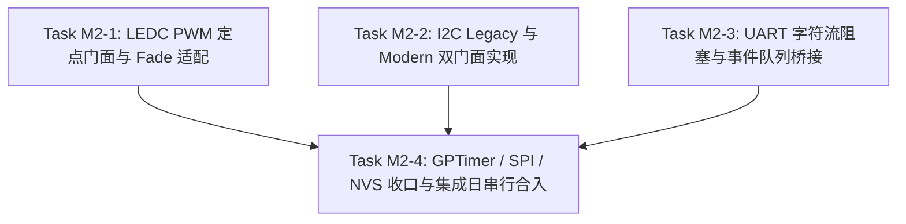

# ESP-IDF 仿真拦截层实施计划 M2：核心总线驱动双版本与定点 PWM

> 📋 **计划状态声明**：
> 本计划为 ESP-IDF 仿真拦截层派生子计划（Milestone 2）。
> **继承总纲**：[`PLAN-20260922-ESP-IDF-SIM-MASTER`](./2026-09-22-esp-idf-simulation-interception-master-plan.md) (v3.5)
> **当前状态**：✅ 已完成（DoD 全部通过，28/28 CTest 测试 100% 绿灯，License Map 与 Layering Lint 0 findings）
> 🎯 **计划版本**：v2.4（2026-09-25，闭环深度评审 4 项立即加固：外设全局复位链条闭环 `esp_peripherals_reset`、I2C 链表多事务阻断与显式校验、NVS 静态池严格压缩至 3KB、UART 并发读者防护与事件长度保真）
> 📚 **关联规范**：`docs-adr.md`、`03-coding-guidelines.md`、`00-IMPLEMENTATION-PLAN-TEMPLATE.md`
> 🔍 **M1 移交基线**：M1 v1.4 已 100% 验收交付（DoD 全部通过，协作式调度器与并发原语闭环、Handle generation ABA 防御、`vTaskDelay(0)` 纯让出、Queue/Mutex waiter 簿记、EventGroup 快照竞态修复、7 桩补齐、超时递减闭环、`resource_id = (type_tag << 24) | local_index` 编码、`wink_status.h` canonical 枚举 `INVALID_ARG/NO_MEM/BUSY/RESOURCE_EXHAUSTED/TIMEOUT/UNSUPPORTED`）；总纲 v3.3 的 7 参 `pal_i2c_transfer` 纠偏为 6 参默认超时包装，显式超时统一走 7 参 `pal_i2c_transfer_timeout`（`pal/include/hal/pal_i2c.h:77-92`）。

---

## 1. 元数据表（🔴 必选）

| 字段 | 内容 |
|:---|:---|
| **计划编号** | `PLAN-20260925-ESP-IDF-SIM-M2` |
| **创建日期** | 2026-09-23（v1.0 骨架；v1.1 签名纠偏；v2.0 详设展开；v2.1 吸收 6 项防护；v2.2 闭环 5 项隐患；v2.3 吸收 20 项评审意见；v2.4 闭环 4 项立即架构加固于 2026-09-25） |
| **目标平台/SoC** | `wasm32-unknown-emscripten` / `host` (x86_64, Windows/Linux)；对照 SoC：`esp32` / `esp32c3` / `esp32c6` |
| **工具链/SDK版本**| `ESP-IDF v5.1.3 LTS` ~ `v6.1+`（取证基线：v6.1 tag） |
| **计划状态** | ✅ 已完成（DoD 全部通过，28/28 CTest 测试 100% 绿灯，License Map 与 Layering Lint 0 findings） |
| **优先级** | 🔴 P0（外设总线与定时器核心能力） |
| **计划版本** | `v2.4` |
| **关联技术设计** | [`docs/zh/tech-designs/core/pal-i2c-v6-compatibility.md`](../../zh/tech-designs/core/pal-i2c-v6-compatibility.md) |
| **关联设计规范** | [`docs/zh/design/04-wasm-simulation/00-README.md`](../../zh/design/04-wasm-simulation/00-README.md)、[`02-wink-micro-os/`](../../zh/design/02-wink-micro-os/README.md) |
| **关联评审记录** | [`2026-09-22-esp-idf-simulation-interception-master-plan-review.md`](./2026-09-22-esp-idf-simulation-interception-master-plan-review.md)、[`m2_plan_review.md`](file:///C:/Users/77174/.gemini/antigravity-ide/brain/c1f7ba10-65e1-4089-8cd5-114b775d4c3c/m2_plan_review.md) |
| **关联 ADR** | [ADR-0001](../../decisions/core/0001-error-code-sign-convention.md)（负数错误码）、[ADR-0004](../../decisions/core/0004-static-dispatch-vs-runtime-ops.md)（静态分发与无虚表）、[ADR-0012](../../decisions/core/0012-contract-honesty-over-silent-degradation.md)（合约诚实与降级登记）、[ADR-0014](../../decisions/unisim/0014-sim-single-virtual-core.md)（确定性调度）、[ADR-0045](../../decisions/unisim/0045-simulation-memory-quota-and-fault-policy.md)（零 malloc 与静态池）、[ADR-0065](../../decisions/core/0065-pal-hardware-raii-resource-ownership.md)（禁门面 claim）、[ADR-0066](../../decisions/core/0066-pwm-basis-points-and-float-deprecation.md)（PWM 定点化万分比）、[ADR-0070](../../decisions/core/0070-mcs51-zero-code-simulation-interception-layer.md)（生命周期与 Fiber）、[ADR-0080](../../decisions/core/0080-external-lint-pack-discovery-and-mcs51-guard-sinking.md)（外部 lint pack 发现）、[ADR-0082](../../decisions/core/0082-mcs51-reset-semantics-fiber-exit-and-reentry.md)（复位语义）、[ADR-0083/0084](../../decisions/core/0083-adopt-gpl-3.0-only-license-policy.md)（开源许可分层）、[ADR-0085](../../decisions/core/0085-esp-idf-facade-soc-caps-vs-pal-caps-dual-ssot.md)（caps 双 SSOT 裁决） |
| **目标里程碑** | M2（核心总线驱动双版本、定点 LEDC PWM、UART 字符流、GPTimer/SPI/NVS 收口与热文件集成） |
| **前置依赖计划** | [`./2026-09-24-esp-idf-sim-m1-freertos-plan.md`](./2026-09-24-esp-idf-sim-m1-freertos-plan.md)（M1 100% DoD 闭环） |
| **继承计划** | 继承自 [`PLAN-20260922-ESP-IDF-SIM-MASTER`](./2026-09-22-esp-idf-simulation-interception-master-plan.md) (v3.5) |
| **计划负责人** | 仿真拦截专项小组 |
| **主要依赖技能** | `embedded-best-practice` |

---

## 2. 背景与目标（🔴 必选）

### 2.1 问题陈述

在 WinkMicroOS 仿真体系中，M0 与 M1 已完成目录骨架、基础编译驱动闭包、GPIO 门面、SoC 能力隔离以及 FreeRTOS 协作式多任务与并发原语（Queue/Mutex/Semaphore）。
然而，ESP32 真实嵌入式业务代码广泛依赖核心外设总线：
1. **I2C 跨版本剧烈演进分化**：ESP-IDF 在 v5.x 与 v6.x 之间发生架构巨变。Legacy 命令链表驱动（`driver/i2c.h`）在 v6.x 被标记 EOL（通过 `#pragma message` 提示弃用），官方新代码已 100% 迁移至句柄式现代驱动（`driver/i2c_master.h`）。但存量开源代码仍充斥着基于命令链表的复合时序操作（如寄存器读写的 Repeated START 序列）。
2. **PWM 浮点违规与架构红线（ADR-0066）**：官方 `driver/ledc.h` 接口允许使用基于分辨率的分母进行换算，业务代码中充斥着除法与浮点字面量，违反 Wink 嵌入式定点化硬约束（ADR-0066 彻底禁止软浮点运算）。且官方语料普遍重度依赖 LEDC Fade 渐变函数族。
3. **UART 字符流与事件队列**：`driver/uart.h` 需要在协作式虚拟时间下维持环形缓冲区的无锁双向存取，且需支持阻塞读取（防止调用方死循环空转饿死系统）以及桥接 `uart_event_t` 到 M1 交付的 FreeRTOS 队列中。
4. **高阶外设收敛（GPTimer / SPI / NVS）**：官方应用对定时器中断、SPI Master 复合传输（含 `SPI_TRANS_USE_TXDATA` 内部数组）及 NVS 键值存储有刚性需求，必须在单线程虚拟时间与零动态内存约束下如实收口，且明确 RMT 边界以防 Fail-Loud 无承接。

### 2.2 技术/业务目标

- ✅ **目标 1：I2C 双门面共存与单事实源汇聚**：同时暴露 `driver/i2c.h` 与 `driver/i2c_master.h`，实现状态机驱动的命令链表折叠引擎（支持 Repeated START 复合读写），底层 100% 收敛至 7 参显式超时 `pal_i2c_transfer_timeout()`（默认超时经 6 参 `pal_i2c_transfer()` 内联包装）。从机模式 Fail-Loud（`ESP_ERR_NOT_SUPPORTED`），句柄全部静态池发放，运行期 0 裸 `malloc`。
- ✅ **目标 2：LEDC PWM 定点万分比与 Fade 完整闭环**：实现 `driver/ledc.h`，严格经 `pal_pwm_set_duty_bp()` 驱动底层；引入双步配置映射（timer 冲突仲裁 + channel 映射），纯整数万分比计算（`0..10000`），0 浮点指令；补齐完整的 `ledc_fade_*` 函数族，在单线程仿真中提供保真降级（瞬时更新 + 回调通知）；限制 C3/C6 芯片仅能使用 Low-Speed 模式。
- ✅ **目标 3：UART 字符流阻塞与事件桥接**：实现 `driver/uart.h`，静态分配 RX/TX 环形缓冲区；`uart_read_bytes` 在无数据且 `ticks_to_wait > 0` 时协作式阻塞调用任务，有数据时唤醒，杜绝 `while(1)` 饿死故障；正确过滤 `UART_PIN_NO_CHANGE`（-1）；将 `pal_uart_event_t` 经 `pal_deferred_post` 映射为 `uart_event_t` 并派发至 M1 FreeRTOS Queue。
- ✅ **目标 4：GPTimer / SPI / NVS 范围收口**：
  - GPTimer 门面收敛至 `pal_hwtimer_*`，支持 `gptimer_get_raw_count` 查询虚拟时间，alarm 回调（`bool (*)(...)` 签名）经 `pal_deferred_post` 同步派发到任务上下文，精度对齐 10ms 调度步进；
  - SPI Master 消除 Host 编号错位（`SPI2_HOST` 映射至 PAL 0，`SPI3_HOST` 映射至 PAL 1），完整支持 `SPI_TRANS_USE_TXDATA` 内部数组传输，汇聚至 `pal_spi_*` 静态通道；
  - NVS 门面自建静态句柄表 `s_nvs_handles[4]`（深拷贝命名空间防止栈逃逸），提供基于内存 KV 静态池的存储实现，支持全量类型（`u8..u64/str/blob`），`esp_restart()` 优雅复位时默认保留数据，`nvs_flash_erase` 显式擦除。
- ✅ **目标 5：语料 100% 编译与分级验证**：
  - Tier-A 现代 I2C 官方语料（`i2c_basic`）与 LEDC 语料（`ledc_basic`）零修改编译通过；
  - Tier-B Legacy I2C 语料（`test_i2c.c` 经 stub 闭包）100% 编译通过；
  - 核心外设单元测试 100% 通过（Host + Wasm 双目标 0 error, 0 warning）。

### 2.3 成功指标（验收出口）

| 指标 | 通过标准 | 验证方法 |
|:---|:---|:---|
| **Tier-A 语料编译** | `ledc_basic_example_main.c` 与 `i2c_basic_example_main.c` 原文零修改 100% 编译通过 | `ctest -R "esp_idf_corpus_(ledc|i2c)"` |
| **Tier-B 语料编译** | Legacy I2C 语料（`test_i2c.c`）在 stub 闭包下 100% 编译通过 | `ctest -R esp_idf_corpus_legacy_i2c` |
| **LEDC PWM 零浮点** | 门面实现中 0 浮点指令，0 裸 `pal_pwm_set_duty` 调用 | `winkcli lint --pack esp_idf_all` / `ctest -R esp_idf_lint_isolation` |
| **I2C 双版本单测** | Legacy 折叠传输（含 Repeated START）与 Modern 句柄传输功能验证 100% 通过，从机模式 Fail-Loud 校验拦截 | `ctest -R test_esp_i2c` |
| **UART 字符流单测** | 环形缓冲区存取、空缓存阻塞挂起与唤醒、队列事件同步派发断言 100% 通过 | `ctest -R test_esp_uart` |
| **收口外设单测** | GPTimer alarm 到期时序、SPI Host 偏移与 `USE_TXDATA` 传输、NVS 全类型读写与复位保留 100% 通过 | `ctest -R "test_esp_(gptimer|spi|nvs)"` |
| **双目标构建** | Host (GCC/Clang) 与 Wasm (Emscripten) 0 error, 0 warning (`-Wall -Wextra -Werror`) | CMake 自动化构建与 CI `pr.yml` 日志 |
| **开源许可合规** | `check_license_map.py` 100% 绿（src/include 为 LGPL-3.0-only，test 为 GPL-3.0-only） | `python .github/scripts/check_license_map.py` |

### 2.4 物理学与电气连续域不可逆断层声明（🔴 平台真实性边界）

> ⚠️ **SSOT 声明（对齐 ADR-0012 合约诚实原则）**：
> WinkMicroOS 仿真体系构建在“宿主指令因果顺序与虚拟时间轮”之上，提供的是**“C-ABI 源码级 100% 契约保真与行为级高保真”**。
> 本平台在物理世界层面存在以下**不可逆断层**，开发人员与 AI 代码生成链路必须知悉仿真与物理真实芯片的界限，禁止将以下物理现象归咎为仿真缺陷：
> 1. **无模拟电源轨瞬态与欠压复位（BOD）**：仿真运行在恒定、无限的理想电源模型上，无法模拟射频突发或电机启转造成的毫秒级 VCC 跌落与欠压跑飞。
> 2. **无慢上电亚稳态与 RC 复位时序竞态**：Wasm/Host 沙箱启动即处于第 0 微秒的规整就绪态，不存在物理电容慢充电导致的 CPU 亚稳态乱码取指。
> 3. **无悬空引脚（Floating Pin）高频感应自激**：未配置内部上下拉的引脚在仿真中维持固定逻辑值，不存在微安级空间电磁耦合与 CMOS 穿通大电流。
> 4. **无总线模拟电气阻抗与波形反射畸变**：I2C/SPI 总线传输被建模为纯离散数据包交互，不仿真上拉电阻过大引起的 RC 边沿缓慢、高频阻抗不匹配振铃过冲，亦不模拟物理总线 Clock Stretching 死锁。
> 5. **无 Flash 物理寿命磨损与掉电扇区损坏**：内存 NVS 模拟的是逻辑 KV 字典，不存在真实物理 NOR Flash 的擦除块寿命极限或断电半写入崩溃。

---

## 3. 变更范围与影响分析（🔴 必选）

### 3.1 文件变更清单

| 文件路径 | 变更类型 | 说明 |
|:---|:---:|:---|
| `wink-micro-os/frameworks/esp_idf/include/driver/ledc.h` | 🆕 新增 | LEDC PWM 驱动门面头文件（含 Fade 接口族） |
| `wink-micro-os/frameworks/esp_idf/include/hal/ledc_types.h` | 🆕 新增 | LEDC 模式/定时器/通道类型定义 |
| `wink-micro-os/frameworks/esp_idf/include/driver/i2c.h` | 🆕 新增 | Legacy I2C 驱动门面头文件（带 `#pragma message` 弃用提示） |
| `wink-micro-os/frameworks/esp_idf/include/driver/i2c_types_legacy.h`| 🆕 新增 | Legacy I2C 命令链表与参数定义 |
| `wink-micro-os/frameworks/esp_idf/include/driver/i2c_master.h` | 🆕 新增 | Modern I2C Master 驱动门面头文件 |
| `wink-micro-os/frameworks/esp_idf/include/driver/i2c_types.h` | 🆕 新增 | Modern I2C 类型与设备配置定义 |
| `wink-micro-os/frameworks/esp_idf/include/driver/uart.h` | 🆕 新增 | UART 驱动门面头文件（含 `UART_PIN_NO_CHANGE` 支持） |
| `wink-micro-os/frameworks/esp_idf/include/hal/uart_types.h` | 🆕 新增 | UART 事件枚举、奇偶校验、停止位定义 |
| `wink-micro-os/frameworks/esp_idf/include/driver/gptimer.h` | 🆕 新增 | GPTimer 硬件通用定时器驱动门面头文件 |
| `wink-micro-os/frameworks/esp_idf/include/driver/gptimer_types.h` | 🆕 新增 | GPTimer 配置、raw count 查询与 alarm 结构体（`bool` 回调签名） |
| `wink-micro-os/frameworks/esp_idf/include/driver/spi_master.h` | 🆕 新增 | SPI Master 驱动门面头文件 |
| `wink-micro-os/frameworks/esp_idf/include/driver/spi_common.h` | 🆕 新增 | SPI 总线配置定义 |
| `wink-micro-os/frameworks/esp_idf/include/hal/spi_types.h` | 🆕 新增 | SPI 事务（含 `SPI_TRANS_USE_TXDATA/RXDATA`）与 Host 枚举 |
| `wink-micro-os/frameworks/esp_idf/include/nvs.h` | 🆕 新增 | NVS 键值存储操作接口（全量基础类型族） |
| `wink-micro-os/frameworks/esp_idf/include/nvs_flash.h` | 🆕 新增 | NVS 分区初始化与擦除接口 |
| `wink-micro-os/frameworks/esp_idf/src/drivers/esp_ledc.c` | 🆕 新增 | LEDC 门面实现，万分比换算，Fade 降级，下沉至 `pal_pwm_*` |
| `wink-micro-os/frameworks/esp_idf/src/drivers/esp_i2c_legacy.c` | 🆕 新增 | Legacy I2C 门面，Repeated START 复合折叠引擎，从机拦截 |
| `wink-micro-os/frameworks/esp_idf/src/drivers/esp_i2c_master.c` | 🆕 新增 | Modern I2C 门面，句柄池与设备传输 |
| `wink-micro-os/frameworks/esp_idf/src/drivers/esp_uart.c` | 🆕 新增 | UART 字符流环形缓冲、协作式阻塞与事件队列桥接 |
| `wink-micro-os/frameworks/esp_idf/src/drivers/esp_gptimer.c` | 🆕 新增 | GPTimer 门面，汇聚至 `pal_hwtimer_*` 与 `pal_deferred_post` |
| `wink-micro-os/frameworks/esp_idf/src/drivers/esp_spi.c` | 🆕 新增 | SPI Master 门面，Host 偏移修正与 `USE_TXDATA` 处理 |
| `wink-micro-os/frameworks/esp_idf/src/core/esp_nvs.c` | 🆕 新增 | 静态控制块句柄表、内存 KV 存储池与跨复位持久化 |
| `wink-micro-os/frameworks/esp_idf/test/core/test_esp_ledc.c` | 🆕 新增 | LEDC 单元测试（万分比、分辨率、Fade 回调、通道限制） |
| `wink-micro-os/frameworks/esp_idf/test/core/test_esp_i2c.c` | 🆕 新增 | I2C 双版本单元测试（复合折叠解析、收发、探针、从机拒止） |
| `wink-micro-os/frameworks/esp_idf/test/core/test_esp_uart.c` | 🆕 新增 | UART 字符流、阻塞等待与事件队列单元测试 |
| `wink-micro-os/frameworks/esp_idf/test/core/test_esp_gptimer.c` | 🆕 新增 | GPTimer 周期、raw count 与 alarm 单测 |
| `wink-micro-os/frameworks/esp_idf/test/core/test_esp_spi.c` | 🆕 新增 | SPI 总线、Host 编号映射与 `USE_TXDATA` 同步传输单测 |
| `wink-micro-os/frameworks/esp_idf/test/core/test_esp_nvs.c` | 🆕 新增 | NVS 全类型读写、提交、擦除与复位保留单测 |
| `wink-micro-os/frameworks/esp_idf/test/corpus/ledc_basic/` | 🆕 新增 | 官方 `ledc_basic` 示例镜像与 overlay 配置 |
| `wink-micro-os/frameworks/esp_idf/test/corpus/i2c_basic/` | 🆕 新增 | 官方 `i2c_basic` 示例镜像与 overlay 配置 |
| `wink-micro-os/frameworks/esp_idf/test/corpus/legacy_i2c/` | 🆕 新增 | 官方 Legacy I2C 语料镜像与 stub 闭包 |
| `wink-micro-os/frameworks/esp_idf/esp_idf_sources.cmake` | ✏️ 修改 | 注册所有新增 driver 与 core 源码文件 |
| `wink-micro-os/frameworks/esp_idf/docs/02-api-coverage-matrix.md`| ✏️ 修改 | 更新外设 API 支持状态、降级记录与 Tier 语料 |
| `wink-micro-os/frameworks/esp_idf/docs/03-include-closure-inventory.md`| ✏️ 修改| 记录 M2 头文件闭包条目 |
| `wink-micro-os/test/CMakeLists.txt` | ✏️ 修改 | **中央热文件**：M2-4 集成日集中串行合入测试注册 |

### 3.2 接口影响分析

| 接口层 | 是否有破坏性变更 | 影响范围 | 备注 |
|:---|:---:|:---|:---|
| PAL 公开 API | ❌ 否 | 无 | 严格单向消费 `pal_i2c`, `pal_pwm`, `pal_uart`, `pal_spi`, `pal_hwtimer`，红线 2 禁改 PAL |
| DAL 层 | ❌ 否 | 无 | 门面直通 PAL，不跨越或侵入 DAL |
| 既有应用/框架 | ❌ 否 | 无 | mcs51 与 arduino 不受影响；多框架强符号互斥在顶层 CMake 隔离 |
| 构建系统 | ⚠️ 是 | 测试与源列表 | `esp_idf_sources.cmake` 扩展；`test/CMakeLists.txt` 注册新单测与语料 |
| 文档 | ⚠️ 是 | docs/ 体系 | 同步更新 02 coverage matrix 与 03 closure inventory |

### 3.3 架构红线继承（DoD 准入准出）

> 🚨 **严格执行 7 条架构红线（总纲 §8）**：
> 1. 🚨 **C-ABI 与纯 C 实现原则**：全部新增 `.c` 文件标准 C99 编写，严禁 C++ 运行时与类异常。
> 2. 🚨 **严禁侵入式修改 PAL / DAL**：只允许依赖 `pal/include`（HAL/OSAL）既有能力。
> 3. 🚨 **严格遵守 ADR-0065**：门面层**严禁调用 `pal_resource_claim()`**，硬件所有权归底层 PAL 独占。
> 4. 🚨 **零运行期堆分配（Zero Runtime Malloc）与静态预算控制**：门面运行期禁止 `malloc/free/calloc/realloc`，所有总线控制块、句柄、设备结构体、环形缓冲区全部使用 POD 静态池预分配；框架全局静态内存上限自 M1 的 < 8KB 正式上调为 **< 14KB**（严格受控于总纲 §8 红线 4 之 `< 16KB` 顶格指标内，M1 基线 ~7.7KB + M2 增量 ~6.0KB = ~13.7KB）。
> 5. 🚨 **PWM 定点红线（ADR-0066）**：LEDC 门面必须通过纯整数算术换算为 Basis Points（万分比），严禁浮点运算与裸 `pal_pwm_set_duty` 调用。
> 6. 🚨 **合约诚实（ADR-0012）**：未支持的特性（如硬件流控、高阶 DMA 散聚、RMT 真驱动、I2C 从机模式）一律 Fail-Loud（返回 `ESP_ERR_NOT_SUPPORTED`）或编译期报错，严禁静默空函数；语义降级（如 LEDC Fade 瞬时更新、GPTimer 10ms 精度）必须在 coverage matrix 显式登记。
> 7. 🚨 **开源许可合规（ADR-0083/0084）**：
>    - `frameworks/esp_idf/{src,include}` = **`LGPL-3.0-only`**；
>    - `frameworks/esp_idf/test/**` = **`GPL-3.0-only`**；
>    - 每次提交前运行 `python .github/scripts/check_license_map.py` 100% 绿。

### 3.4 系统资源与并发约束评估

| 维度 | 预计开销 / 限制 | 风险分析 | 应对策略 |
|:---|:---|:---|:---|
| **静态 RAM 开销** | 增量约 **6.0 KB**（I2C 句柄池 ~1KB，UART 环形缓存 3×512B=1.5KB，SPI 设备池 ~512B，NVS 控制块与表 ~2.5KB，LEDC/GPTimer ~500B）；叠加 M1 既有基线（~7.7KB），全框架静态总额约 **13.7 KB < 14 KB** | 静态红线超标风险已可控（总纲上限 16KB，Wasm 预算 16MB） | 全部预分配静态 POD 结构体与 `_Static_assert` 守卫，无运行期碎片，随二进制只读/数据段装载 |
| **堆内存 (Heap)** | **0 字节** | 堆泄漏与不可预测碎片 | `lint_esp_idf_isolation.py` 机器强制，0 动态分配 |
| **栈深度 (Stack)** | 单次外设调用 < 256 字节 | 栈溢出风险 | 门面函数参数校验后直接下沉调用，无大局部数组，NVS 命名空间在打开时深拷贝进静态控制块 |
| **并发与中断** | 虚拟时间单线程执行，异步事件经 `pal_deferred_post` 派发 | 竞态与重入问题 | 消除宿主原生多线程竞争，ISR 事件统一推送到任务上下文队列，阻塞任务由资源事件显式唤醒 |

---

## 4. 依赖与风险（🔴 必选）

### 4.1 前置依赖

| 依赖 ID | 依赖内容 | 是否阻塞 | 状态 | 备注 |
|:---|:---|:---:|:---:|:---|
| **D-001** | `targets/common/wink_sim_scheduler.h` 调度器接口 | ✅ 是 | ✅ 已就绪 | ADR-0014 既有能力 |
| **D-002** | `pal_i2c_transfer_timeout` 核心契约与显式超时 | ✅ 是 | ✅ 已就绪 | `pal-i2c-v6-compatibility.md` 已闭环 |
| **D-003** | caps 双 SSOT 裁决 | ✅ 是 | ✅ 已完成 | ADR-0085 Accepted |
| **D-006** | M1 协作式调度器与并发原语闭环 | ✅ 是 | ✅ 100% 验收闭环 | M1 v1.4 全量达成（DoD 100%，含 Handle ABA / 双向 Waiter / 7 符号补齐 / 竞态消除） |

### 4.2 外部依赖

| 依赖 ID | 依赖内容 | 提供方 | 风险等级 | 备注 |
|:---|:---|:---|:---:|:---|
| **E-001** | ESP-IDF v6.1 官方源码树 | 本机 / Espressif | 🟡 中 | 头文件签名与语料验证 |
| **E-002** | `winkcli` 工具链 | wink-tools | 🟡 中 | 运行 lint 与测试门禁 |
| **E-004** | 官方 examples 源码（LEDC、I2C 示例） | Espressif | 🟡 中 | 语料镜像构建 |

### 4.3 风险登记册（含 6 项安全防护）

| 风险 ID | 风险描述 | 概率 | 影响 | 严重度 | 缓解措施 | 责任人 | 触发条件 |
|:---|:---|:---:|:---:|:---:|:---|:---|:---|
| **R-001** | I2C Legacy 遇到包含 Repeated START 的复合序列时折叠错乱 | 🟡 中 | 🟠 高 | 6 | 实现自包含的状态机，严格按写地址/写数据/重复起始/读地址/读数据折叠为单次 `pal_i2c_transfer_timeout`；非标多段时序 Fail-Loud | 专项小组 | 驱动真实 I2C 传感器复合读写 |
| **R-002** | LEDC 定时器多通道共享时频率与分辨率仲裁冲突 | 🟡 中 | 🟡 中 | 4 | 实现 `s_ledc_timers` 独立簿记，通道初始化时校验 timer 是否已配置；未配置或参数失配直接返回 `ESP_ERR_INVALID_STATE` | 专项小组 | 语料中不同通道指定冲突参数 |
| **R-003** | UART 消费任务在无数据时紧凑空转饿死系统（死循环） | 🟠 高 | 🔴 极高 | 8 | `uart_read_bytes` 在空缓冲且 `ticks_to_wait > 0` 时调用 `sim_scheduler_block` 紧跟 `sim_scheduler_yield_context()` 协作挂起并切出 Fiber 栈，数据到达由事件唤醒 | 专项小组 | 业务代码执行 `while(1) read_bytes` |
| **R-004** | GPTimer 高频 alarm（< 10ms）由于调度粒度引发时钟畸变 | 🟠 高 | 🟡 中 | 6 | 严守 100Hz 冻结基线，小于 10ms 的周期向上钳位为 10ms，并在 `02-api-coverage-matrix.md` 显式登记功能性降级 | 专项小组 | 业务请求 microsecond 级定时器 |
| **R-005** | NVS 静态表空间耗尽或调用方栈指针逃逸致野指针 | 🟡 中 | 🟠 高 | 6 | 门面内部自建 `s_nvs_handles[4]` 深拷贝命名空间，并限制最大 32 个条目；超限返回 `ESP_ERR_NVS_NOT_ENOUGH_SPACE` | 专项小组 | 临时局部变量作命名空间传参 |
| **R-006** | `test/CMakeLists.txt` 中央热文件并行写入冲突 | 🟠 高 | 🟡 中 | 6 | 实施总纲并行纪律：M2-1/2/3 测试暂写分支，统一在 M2-4 集成日串行合并入中央文件 | 专项小组 | 三外设并行提交引发 git 冲突 |
| **R-007** | LEDC 换算意外引入浮点操作导致 CI 门禁标红 | 🟡 中 | 🔴 极高 | 6 | 采用纯整数定点四舍五入公式；本地运行 `lint_esp_idf_isolation.py` 先行阻断 | 专项小组 | 出现浮点除法或 float 强转 |
| **R-008** | RMT 驱动缺位导致启用 `led_strip` 时链接失败 | 🟡 中 | 🟡 中 | 4 | 本计划 §5 显式裁决：M2 交付 Fail-Loud 桩并在 coverage matrix 标明，真 RMT 门面正式归入 M4 专修 | 专项小组 | 语料启用 RMT 依赖分支 |
| **R-009** | SPI Master 硬件编号偏移（`SPI2_HOST=1` ↔ PAL 0）与 `USE_TXDATA` 崩溃 | 🟠 高 | 🔴 极高 | 8 | 显式进行 `pal_bus = host_id - 1` 换算；并在门面中判断 `flags & SPI_TRANS_USE_TXDATA` 使用内置数组 | 专项小组 | 屏幕驱动发送短指令数据 |
| **R-010** | I2C 从机模式在无硬件支持下静默假成功 | 🟡 中 | 🟡 中 | 4 | `i2c_driver_install` 检测到 `I2C_MODE_SLAVE` 时严格 Fail-Loud 返回 `ESP_ERR_NOT_SUPPORTED` | 专项小组 | 语料尝试初始化 I2C 从机 |

---

## 5. 优先级路线图与展开前置约束裁决（v2.1 锁定）

### 5.1 展开前置约束终审裁决（SSOT 事实源）

1. **裁决项 1：UART 队列复用与协作式阻塞读取**
   - **裁决结论**：**复用 M1 FreeRTOS Queue Shim，并实现任务挂起与唤醒机制**。
   - **设计机制**：
     - 当 `uart_driver_install` 传入 `queue_size > 0` 且 `uart_queue != NULL` 时，门面直接调用 M1 提供的 `xQueueCreate(queue_size, sizeof(uart_event_t))` 创建队列并输出句柄；
     - `uart_read_bytes` 在 `rx_count == 0` 且 `ticks_to_wait > 0` 时，调用 `sim_scheduler_block(task_id, (RES_UART_TAG << 24) | port, ...)` 并立即调用 `sim_scheduler_yield_context()` 将 Fiber 协程栈挂起切出；`RES_UART_TAG` 取 `0x08u` 彻底避开 M1 既有标签；
     - 底层 `pal_uart_event` 产生时，通过 `pal_deferred_post` 派发任务上下文，存入环形缓冲区，投递 `uart_event_t`，并调用 `sim_scheduler_resume` 唤醒挂起的读取任务；
     - 显式过滤 `UART_PIN_NO_CHANGE`（-1），严禁越界强转。
2. **裁决项 2：LEDC Timer/Channel 双步映射、SoC 裁剪与 Fade 闭环**
   - **裁决结论**：**Timer/Channel 双步模型 + SoC 模式拦截 + 完备 Fade 符号族保真降级**。
   - **设计机制**：
     - Step 1：`ledc_timer_config` 将配置记录于静态表 `s_ledc_timers[2][4]`；
     - Step 2：`ledc_channel_config` 校验 `channel < SOC_LEDC_CHANNEL_NUM`（经典 ESP32 为 8，C3/C6 为 6），且校验 C3/C6 芯片下 `speed_mode == LEDC_LOW_SPEED_MODE`，越界与模式违规直接 Fail-Loud（`ESP_ERR_INVALID_ARG`）；
     - Duty 更新：纯整数万分比计算：
       $$\text{duty\_bp} = \frac{\text{duty} \times 10000 + (\text{top} / 2)}{\text{top}}, \quad \text{top} = (1 \ll \text{resolution}) - 1$$
     - Fade 闭环：导出完整 `ledc_fade_*` 函数族，在仿真中降级为“立即更新目标占空比 + 同步/异步触发完成回调”，保证语料链接 100% 成功。
3. **裁决项 3：GPTimer 收敛与时间查询**
   - **裁决结论**：**收敛至 `pal_hwtimer_*` 与 `pal_deferred_post`，补全 `raw_count` 查询**。
   - **设计机制**：消费标准的 `pal/include/hal/pal_hwtimer.h`；回调采用官方标准 `bool (*)(gptimer_handle_t, ...)` 签名；提供 `gptimer_get_raw_count` 将虚拟微秒时间等比换算为计数值返回。
4. **裁决项 4：RMT 驱动归宿**
   - **裁决结论**：**M2 仅交付 Fail-Loud 桩，真 RMT 门面正式确立归入 M4**。
5. **裁决项 5：SPI Master Host 偏移与内置数据数组支持**
   - **裁决结论**：**显式映射 `pal_bus = host_id - 1`，全面支持 `SPI_TRANS_USE_TXDATA`**。
   - **设计机制**：将 `SPI2_HOST(1)` 映射到 PAL 总线 0，`SPI3_HOST(2)` 映射到 PAL 总线 1；发送时先检查 `flags & SPI_TRANS_USE_TXDATA`，优先使用内部 `tx_data[4]`，消除 NULL 指针解引用风险。
6. **裁决项 6：NVS 独立句柄表与全量类型覆盖**
   - **裁决结论**：**构建独立 `s_nvs_handles[4]` 静态控制块，深拷贝命名空间，补齐全类型**。
   - **设计机制**：杜绝栈指针逃逸；全量提供 `u8..u64/str/blob` 的读写分发支持。

### 5.2 执行顺序与并行路线图



### 5.3 优先级与工时矩阵

| 任务 ID | 任务标题 | 优先级 | 预估工时 | 涉及关键文件 |
|:---|:---|:---:|:---:|:---|
| **Task M2-1** | LEDC PWM 定点门面、Fade 降级与 ADR-0066 适配 | 🔴 P0 | 8 h | `include/driver/ledc.h`, `src/drivers/esp_ledc.c`, `test/core/test_esp_ledc.c`, `corpus/ledc_basic/*` |
| **Task M2-2** | I2C Legacy（Repeated START 折叠）与 Modern 双门面实现 | 🔴 P0 | 16 h | `include/driver/i2c*.h`, `src/drivers/esp_i2c_*.c`, `test/core/test_esp_i2c.c`, `corpus/i2c_basic/*` |
| **Task M2-3** | UART 驱动门面、协作式阻塞与字符流收发 | 🔴 P0 | 12 h | `include/driver/uart.h`, `src/drivers/esp_uart.c`, `test/core/test_esp_uart.c` |
| **Task M2-4** | GPTimer / SPI / NVS 收口与集成日串行合入 | 🔴 P0 | 10 h | `esp_gptimer.c`, `esp_spi.c`, `esp_nvs.c`, `esp_idf_sources.cmake`, `test/CMakeLists.txt`, `docs/*` |
| **总计** | | | **46 h** | （三线并行时关键路径约为 16 h + 10 h = **26 h**） |

---

## 6. 详细任务拆分与代码实现设计（🔴 必选）

---

### Task M2-1：LEDC PWM 定点门面与 Fade 适配 `[ 状态: ✅ 已完成 ]`

| 字段 | 内容 |
|:---|:---|
| **负责人** | 仿真拦截专项小组 |
| **预估工时** | 8 小时 |
| **优先级** | 🔴 P0 |
| **前置依赖** | M1 闭环交付 |
| **修改文件** | `include/driver/ledc.h`, `include/hal/ledc_types.h`, `src/drivers/esp_ledc.c`, `test/core/test_esp_ledc.c`, `test/corpus/ledc_basic/` |
| **接口变化** | 新增 LEDC 相关头文件与驱动，对外暴露标准乐鑫 `ledc_*` 函数族与完整 Fade 接口 |

#### 详细步骤与代码级设计

- [x] **Step 1：头文件定义 `include/driver/ledc.h`**
  包含乐鑫官方核心枚举、结构体与完整的 Fade 接口族：
  ```c
  // SPDX-License-Identifier: LGPL-3.0-only
  #ifndef DRIVER_LEDC_H
  #define DRIVER_LEDC_H

  #include "esp_err.h"
  #include "soc/soc_caps.h"
  #include <stdint.h>
  #include <stdbool.h>

  typedef enum {
      LEDC_LOW_SPEED_MODE = 0,
      LEDC_HIGH_SPEED_MODE,
      LEDC_SPEED_MODE_MAX,
  } ledc_mode_t;

  typedef enum {
      LEDC_TIMER_0 = 0,
      LEDC_TIMER_1,
      LEDC_TIMER_2,
      LEDC_TIMER_3,
      LEDC_TIMER_MAX,
  } ledc_timer_t;

  typedef enum {
      LEDC_TIMER_1_BIT = 1,
      LEDC_TIMER_10_BIT = 10,
      LEDC_TIMER_13_BIT = 13,
      LEDC_TIMER_14_BIT = 14,
      LEDC_TIMER_BIT_MAX = 20,
  } ledc_timer_bit_t;

  typedef enum {
      LEDC_CHANNEL_0 = 0,
      LEDC_CHANNEL_1,
      LEDC_CHANNEL_2,
      LEDC_CHANNEL_3,
      LEDC_CHANNEL_4,
      LEDC_CHANNEL_5,
      LEDC_CHANNEL_6,
      LEDC_CHANNEL_7,
      LEDC_CHANNEL_MAX,
  } ledc_channel_t;

  typedef enum {
      LEDC_FADE_NO_WAIT = 0,
      LEDC_FADE_WAIT_DONE,
      LEDC_FADE_MAX,
  } ledc_fade_mode_t;

  typedef struct {
      ledc_mode_t      speed_mode;
      ledc_timer_bit_t duty_resolution;
      ledc_timer_t     timer_num;
      uint32_t         freq_hz;
      uint32_t         clk_cfg;
  } ledc_timer_config_t;

  typedef struct {
      int           gpio_num;
      ledc_mode_t   speed_mode;
      ledc_channel_t channel;
      uint32_t      intr_type;
      ledc_timer_t  timer_sel;
      uint32_t      duty;
      int           hpoint;
      uint32_t      flags;
  } ledc_channel_config_t;

  typedef struct {
      uint32_t event;
      uint32_t speed_mode;
      uint32_t channel;
      uint32_t duty;
  } ledc_cb_param_t;

  typedef bool (*ledc_cb_t)(const ledc_cb_param_t *param, void *user_arg);

  typedef struct {
      ledc_cb_t fade_cb;
  } ledc_cbs_t;

  esp_err_t ledc_timer_config(const ledc_timer_config_t *timer_conf);
  esp_err_t ledc_channel_config(const ledc_channel_config_t *ch_conf);
  esp_err_t ledc_set_duty(ledc_mode_t speed_mode, ledc_channel_t channel, uint32_t duty);
  esp_err_t ledc_update_duty(ledc_mode_t speed_mode, ledc_channel_t channel);
  esp_err_t ledc_stop(ledc_mode_t speed_mode, ledc_channel_t channel, uint32_t idle_level);
  uint32_t  ledc_get_duty(ledc_mode_t speed_mode, ledc_channel_t channel);
  esp_err_t ledc_set_freq(ledc_mode_t speed_mode, ledc_timer_t timer_num, uint32_t freq_hz);
  uint32_t  ledc_get_freq(ledc_mode_t speed_mode, ledc_timer_t timer_num);

  // Fade 渐变函数族（官方语料常用）
  esp_err_t ledc_fade_func_install(int intr_alloc_flags);
  void      ledc_fade_func_uninstall(void);
  esp_err_t ledc_set_fade_with_time(ledc_mode_t speed_mode, ledc_channel_t channel, uint32_t target_duty, int max_fade_time_ms);
  esp_err_t ledc_set_fade_with_step(ledc_mode_t speed_mode, ledc_channel_t channel, uint32_t target_duty, uint32_t scale, uint32_t cycle_num);
  esp_err_t ledc_fade_start(ledc_mode_t speed_mode, ledc_channel_t channel, ledc_fade_mode_t fade_mode);
  esp_err_t ledc_cb_register(ledc_mode_t speed_mode, ledc_channel_t channel, ledc_cbs_t *cbs, void *user_arg);

  #endif /* DRIVER_LEDC_H */
  ```

- [x] **Step 2：驱动核心实现 `src/drivers/esp_ledc.c`**
  实现静态簿记表、定点 Basis Points 换算与 Fade 降级：
  ```c
  // SPDX-License-Identifier: LGPL-3.0-only
  #include "driver/ledc.h"
  #include "hal/pal_pwm.h"
  #include "esp_log.h"
  #include <string.h>

  static const char *TAG = "esp_ledc";

  typedef struct {
      bool configured;
      uint32_t freq_hz;
      ledc_timer_bit_t duty_resolution;
  } esp_ledc_timer_state_t;

  typedef struct {
      bool configured;
      int gpio_num;
      ledc_mode_t speed_mode;
      ledc_timer_t timer_sel;
      uint32_t pending_duty;
      uint32_t active_duty;
      uint32_t target_fade_duty;
      ledc_cbs_t cbs;
      void *cb_user_arg;
  } esp_ledc_channel_state_t;

  static esp_ledc_timer_state_t s_timers[LEDC_SPEED_MODE_MAX][LEDC_TIMER_MAX];
  static esp_ledc_channel_state_t s_channels[LEDC_CHANNEL_MAX];
  static bool s_fade_installed = false;

  esp_err_t ledc_timer_config(const ledc_timer_config_t *timer_conf) {
      if (!timer_conf || timer_conf->speed_mode >= LEDC_SPEED_MODE_MAX ||
          timer_conf->timer_num >= LEDC_TIMER_MAX ||
          timer_conf->duty_resolution == 0 || timer_conf->duty_resolution > 20 ||
          timer_conf->freq_hz == 0) {
          return ESP_ERR_INVALID_ARG;
      }
  #if defined(CONFIG_IDF_TARGET_ESP32C3) || defined(CONFIG_IDF_TARGET_ESP32C6) || defined(CONFIG_IDF_TARGET_ESP32S3)
      if (timer_conf->speed_mode != LEDC_LOW_SPEED_MODE) {
          ESP_LOGE(TAG, "High speed mode not supported on current SoC");
          return ESP_ERR_INVALID_ARG;
      }
  #endif
      esp_ledc_timer_state_t *t = &s_timers[timer_conf->speed_mode][timer_conf->timer_num];
      t->configured = true;
      t->freq_hz = timer_conf->freq_hz;
      t->duty_resolution = timer_conf->duty_resolution;
      return ESP_OK;
  }

  esp_err_t ledc_channel_config(const ledc_channel_config_t *ch_conf) {
      if (!ch_conf || ch_conf->channel >= SOC_LEDC_CHANNEL_NUM ||
          ch_conf->timer_sel >= LEDC_TIMER_MAX || ch_conf->speed_mode >= LEDC_SPEED_MODE_MAX) {
          return ESP_ERR_INVALID_ARG;
      }
      esp_ledc_timer_state_t *t = &s_timers[ch_conf->speed_mode][ch_conf->timer_sel];
      if (!t->configured) {
          ESP_LOGE(TAG, "Timer %d not configured for channel %d", ch_conf->timer_sel, ch_conf->channel);
          return ESP_ERR_INVALID_STATE;
      }
      
      pal_pwm_config_t cfg = {
          .struct_size = sizeof(pal_pwm_config_t),
          .pin = (wink_pin_t)ch_conf->gpio_num,
          .freq_hz = t->freq_hz,
          .resolution_bits = (uint8_t)t->duty_resolution,
          .clock_requirement = PAL_PWM_CLOCK_AUTO
      };
      
      wink_status_t st = pal_pwm_init_ex((uint8_t)ch_conf->channel, &cfg);
      if (st != WINK_OK) return ESP_FAIL;

      esp_ledc_channel_state_t *ch = &s_channels[ch_conf->channel];
      ch->configured = true;
      ch->gpio_num = ch_conf->gpio_num;
      ch->speed_mode = ch_conf->speed_mode;
      ch->timer_sel = ch_conf->timer_sel;
      ch->pending_duty = ch_conf->duty;
      
      return ledc_update_duty(ch_conf->speed_mode, ch_conf->channel);
  }

  esp_err_t ledc_set_duty(ledc_mode_t speed_mode, ledc_channel_t channel, uint32_t duty) {
      (void)speed_mode;
      if (channel >= SOC_LEDC_CHANNEL_NUM || !s_channels[channel].configured) {
          return ESP_ERR_INVALID_ARG;
      }
      s_channels[channel].pending_duty = duty;
      return ESP_OK;
  }

  esp_err_t ledc_update_duty(ledc_mode_t speed_mode, ledc_channel_t channel) {
      (void)speed_mode;
      if (channel >= SOC_LEDC_CHANNEL_NUM || !s_channels[channel].configured) {
          return ESP_ERR_INVALID_ARG;
      }
      esp_ledc_channel_state_t *ch = &s_channels[channel];
      esp_ledc_timer_state_t *t = &s_timers[ch->speed_mode][ch->timer_sel];
      
      ch->active_duty = ch->pending_duty;
      uint32_t top = (1u << (uint32_t)t->duty_resolution) - 1u;
      if (top == 0) top = 1;
      
      // 纯定点万分比计算（0..10000），带四舍五入防溢出，严禁浮点
      uint32_t duty_clamped = (ch->active_duty > top) ? top : ch->active_duty;
      uint64_t prod = (uint64_t)duty_clamped * 10000ULL + (top / 2ULL);
      uint16_t basis_points = (uint16_t)(prod / top);
      if (basis_points > 10000u) basis_points = 10000u;
      
      wink_status_t st = pal_pwm_set_duty_bp((uint8_t)channel, basis_points);
      return (st == WINK_OK) ? ESP_OK : ESP_FAIL;
  }

  esp_err_t ledc_stop(ledc_mode_t speed_mode, ledc_channel_t channel, uint32_t idle_level) {
      (void)speed_mode; (void)idle_level;
      if (channel >= SOC_LEDC_CHANNEL_NUM || !s_channels[channel].configured) {
          return ESP_ERR_INVALID_ARG;
      }
      pal_pwm_set_duty_bp((uint8_t)channel, 0);
      return ESP_OK;
  }

  // --- Fade 渐变降级实现 ---
  esp_err_t ledc_fade_func_install(int intr_alloc_flags) {
      (void)intr_alloc_flags;
      s_fade_installed = true;
      return ESP_OK;
  }

  void ledc_fade_func_uninstall(void) {
      s_fade_installed = false;
  }

  esp_err_t ledc_set_fade_with_time(ledc_mode_t speed_mode, ledc_channel_t channel, uint32_t target_duty, int max_fade_time_ms) {
      (void)speed_mode; (void)max_fade_time_ms;
      if (channel >= SOC_LEDC_CHANNEL_NUM || !s_channels[channel].configured) return ESP_ERR_INVALID_ARG;
      s_channels[channel].target_fade_duty = target_duty;
      return ESP_OK;
  }

  esp_err_t ledc_set_fade_with_step(ledc_mode_t speed_mode, ledc_channel_t channel, uint32_t target_duty, uint32_t scale, uint32_t cycle_num) {
      (void)speed_mode; (void)scale; (void)cycle_num;
      if (channel >= SOC_LEDC_CHANNEL_NUM || !s_channels[channel].configured) return ESP_ERR_INVALID_ARG;
      s_channels[channel].target_fade_duty = target_duty;
      return ESP_OK;
  }

  esp_err_t ledc_fade_start(ledc_mode_t speed_mode, ledc_channel_t channel, ledc_fade_mode_t fade_mode) {
      (void)fade_mode;
      if (channel >= SOC_LEDC_CHANNEL_NUM || !s_channels[channel].configured) return ESP_ERR_INVALID_ARG;
      // 仿真环境保真降级：瞬时更新到目标占空比并调用回调
      esp_ledc_channel_state_t *ch = &s_channels[channel];
      ch->pending_duty = ch->target_fade_duty;
      esp_err_t ret = ledc_update_duty(speed_mode, channel);
      if (ch->cbs.fade_cb) {
          ledc_cb_param_t param = {
              .event = 0,
              .speed_mode = (uint32_t)ch->speed_mode,
              .channel = (uint32_t)channel,
              .duty = ch->active_duty
          };
          ch->cbs.fade_cb(&param, ch->cb_user_arg);
      }
      return ret;
  }

  esp_err_t ledc_cb_register(ledc_mode_t speed_mode, ledc_channel_t channel, ledc_cbs_t *cbs, void *user_arg) {
      (void)speed_mode;
      if (channel >= SOC_LEDC_CHANNEL_NUM || !s_channels[channel].configured || !cbs) return ESP_ERR_INVALID_ARG;
      s_channels[channel].cbs = *cbs;
      s_channels[channel].cb_user_arg = user_arg;
      return ESP_OK;
  }

  uint32_t ledc_get_duty(ledc_mode_t speed_mode, ledc_channel_t channel) {
      (void)speed_mode;
      if (channel >= SOC_LEDC_CHANNEL_NUM || !s_channels[channel].configured) return 0;
      return s_channels[channel].active_duty;
  }

  esp_err_t ledc_set_freq(ledc_mode_t speed_mode, ledc_timer_t timer_num, uint32_t freq_hz) {
      if (speed_mode >= LEDC_SPEED_MODE_MAX || timer_num >= LEDC_TIMER_MAX || freq_hz == 0) {
          return ESP_ERR_INVALID_ARG;
      }
      esp_ledc_timer_state_t *t = &s_timers[speed_mode][timer_num];
      if (!t->configured) return ESP_ERR_INVALID_STATE;
      t->freq_hz = freq_hz;
      // 同步更新绑定到该 timer 的所有已初始化 channel 的 PWM 频率
      for (int ch_idx = 0; ch_idx < SOC_LEDC_CHANNEL_NUM; ch_idx++) {
          esp_ledc_channel_state_t *ch = &s_channels[ch_idx];
          if (ch->configured && ch->speed_mode == speed_mode && ch->timer_sel == timer_num) {
              pal_pwm_config_t cfg = {
                  .struct_size = sizeof(pal_pwm_config_t),
                  .pin = (wink_pin_t)ch->gpio_num,
                  .freq_hz = t->freq_hz,
                  .resolution_bits = (uint8_t)t->duty_resolution,
                  .clock_requirement = PAL_PWM_CLOCK_AUTO
              };
              pal_pwm_init_ex((uint8_t)ch_idx, &cfg);
              ledc_update_duty(speed_mode, (ledc_channel_t)ch_idx);
          }
      }
      return ESP_OK;
  }

  uint32_t ledc_get_freq(ledc_mode_t speed_mode, ledc_timer_t timer_num) {
      if (speed_mode >= LEDC_SPEED_MODE_MAX || timer_num >= LEDC_TIMER_MAX) return 0;
      return s_timers[speed_mode][timer_num].configured ? s_timers[speed_mode][timer_num].freq_hz : 0;
  }
  ```

---

### Task M2-2：I2C Legacy 与 Modern 双门面实现 `[ 状态: ✅ 已完成 ]`

| 字段 | 内容 |
|:---|:---|
| **负责人** | 仿真拦截专项小组 |
| **预估工时** | 16 小时 |
| **优先级** | 🔴 P0 |
| **前置依赖** | M1 闭环交付 |
| **修改文件** | `include/driver/i2c*.h`, `src/drivers/esp_i2c_legacy.c`, `src/drivers/esp_i2c_master.c`, `test/core/test_esp_i2c.c`, `test/corpus/i2c_basic/*` |
| **接口变化** | 同时导出 `driver/i2c.h` 与 `driver/i2c_master.h`，底层汇聚至 `pal_i2c_transfer_timeout` |

#### 详细步骤与代码级设计

- [x] **Step 1：Legacy I2C 复合时序折叠引擎 `src/drivers/esp_i2c_legacy.c`**
  实现静态命令链表池与 Repeated START 复合状态机折叠：
  ```c
  // SPDX-License-Identifier: LGPL-3.0-only
  #include "driver/i2c.h"
  #include "hal/pal_i2c.h"
  #include "esp_log.h"
  #include <string.h>
  #include <assert.h>

  #pragma message("Notice: Legacy driver/i2c.h is deprecated in ESP-IDF v6+. Please consider migrating to driver/i2c_master.h.")

  #define I2C_CMD_BUFFER_SIZE 256
  #define MAX_CMD_LINKS 4

  typedef enum {
      CMD_START,
      CMD_WRITE,
      CMD_READ,
      CMD_STOP
  } cmd_type_t;

  typedef struct {
      cmd_type_t type;
      uint8_t *data_ptr;
      uint32_t total_bytes;
      bool ack_en;
  } cmd_entry_t;

  typedef struct {
      bool in_use;
      cmd_entry_t entries[16];
      uint32_t entry_count;
      uint8_t write_storage[I2C_CMD_BUFFER_SIZE];
      uint32_t write_offset;
  } esp_i2c_cmd_link_t;

  static esp_i2c_cmd_link_t s_cmd_links[MAX_CMD_LINKS];

  esp_err_t i2c_driver_install(i2c_port_t i2c_num, i2c_mode_t mode, size_t slv_rx_buf_len, size_t slv_tx_buf_len, int intr_alloc_flags) {
      (void)slv_rx_buf_len; (void)slv_tx_buf_len; (void)intr_alloc_flags;
      if (i2c_num >= PAL_I2C_PORT_MAX) return ESP_ERR_INVALID_ARG;
      // 严格红线 6：PAL 仅支持主机模式，从机直接 Fail-Loud
      if (mode != I2C_MODE_MASTER) {
          ESP_LOGE("esp_i2c", "I2C slave mode is not supported in simulation");
          return ESP_ERR_NOT_SUPPORTED;
      }
      return ESP_OK;
  }

  esp_err_t i2c_param_config(i2c_port_t i2c_num, const i2c_config_t *i2c_conf) {
      if (i2c_num >= PAL_I2C_PORT_MAX || !i2c_conf) return ESP_ERR_INVALID_ARG;
      if (i2c_conf->mode != I2C_MODE_MASTER) {
          ESP_LOGE("esp_i2c", "I2C slave mode is not supported in simulation");
          return ESP_ERR_NOT_SUPPORTED;
      }
      uint32_t speed = (i2c_conf->master.clk_speed > 0) ? i2c_conf->master.clk_speed : 400000;
      wink_status_t st = pal_i2c_bus_init((uint8_t)i2c_num, (wink_pin_t)i2c_conf->sda_io_num, (wink_pin_t)i2c_conf->scl_io_num, speed);
      return (st == WINK_OK) ? ESP_OK : ESP_FAIL;
  }

  i2c_cmd_handle_t i2c_cmd_link_create(void) {
      for (int i = 0; i < MAX_CMD_LINKS; i++) {
          if (!s_cmd_links[i].in_use) {
              s_cmd_links[i].in_use = true;
              s_cmd_links[i].entry_count = 0;
              s_cmd_links[i].write_offset = 0;
              return (i2c_cmd_handle_t)&s_cmd_links[i];
          }
      }
      return NULL;
  }

  void i2c_cmd_link_delete(i2c_cmd_handle_t cmd_handle) {
      if (!cmd_handle) return;
      esp_i2c_cmd_link_t *link = (esp_i2c_cmd_link_t *)cmd_handle;
      link->in_use = false;
  }

  esp_err_t i2c_master_start(i2c_cmd_handle_t cmd_handle) {
      esp_i2c_cmd_link_t *link = (esp_i2c_cmd_link_t *)cmd_handle;
      if (!link || link->entry_count >= 16) return ESP_ERR_INVALID_ARG;
      link->entries[link->entry_count++].type = CMD_START;
      return ESP_OK;
  }

  esp_err_t i2c_master_write_byte(i2c_cmd_handle_t cmd_handle, uint8_t data, bool ack_en) {
      return i2c_master_write(cmd_handle, &data, 1, ack_en);
  }

  esp_err_t i2c_master_write(i2c_cmd_handle_t cmd_handle, const uint8_t *data, size_t data_len, bool ack_en) {
      esp_i2c_cmd_link_t *link = (esp_i2c_cmd_link_t *)cmd_handle;
      if (!link || !data || (link->write_offset + data_len > I2C_CMD_BUFFER_SIZE)) return ESP_ERR_INVALID_ARG;
      
      uint8_t *dest = &link->write_storage[link->write_offset];
      memcpy(dest, data, data_len);
      link->write_offset += data_len;
      
      cmd_entry_t *e = &link->entries[link->entry_count++];
      e->type = CMD_WRITE;
      e->data_ptr = dest;
      e->total_bytes = data_len;
      e->ack_en = ack_en;
      return ESP_OK;
  }

  esp_err_t i2c_master_read_byte(i2c_cmd_handle_t cmd_handle, uint8_t *data, i2c_ack_type_t ack) {
      return i2c_master_read(cmd_handle, data, 1, ack);
  }

  esp_err_t i2c_master_read(i2c_cmd_handle_t cmd_handle, uint8_t *data, size_t data_len, i2c_ack_type_t ack) {
      esp_i2c_cmd_link_t *link = (esp_i2c_cmd_link_t *)cmd_handle;
      if (!link || !data || link->entry_count >= 16) return ESP_ERR_INVALID_ARG;
      
      cmd_entry_t *e = &link->entries[link->entry_count++];
      e->type = CMD_READ;
      e->data_ptr = data;
      e->total_bytes = data_len;
      e->ack_en = (ack != I2C_MASTER_LAST_NACK);
      return ESP_OK;
  }

  esp_err_t i2c_master_stop(i2c_cmd_handle_t cmd_handle) {
      esp_i2c_cmd_link_t *link = (esp_i2c_cmd_link_t *)cmd_handle;
      if (!link || link->entry_count >= 16) return ESP_ERR_INVALID_ARG;
      link->entries[link->entry_count++].type = CMD_STOP;
      return ESP_OK;
  }

  // 状态机驱动的复合时序折叠引擎：解析 Start -> W_Addr -> W_Data -> (Rep_Start -> R_Addr) -> R_Data -> Stop
  esp_err_t i2c_master_cmd_begin(i2c_port_t i2c_num, i2c_cmd_handle_t cmd_handle, TickType_t ticks_to_wait) {
      esp_i2c_cmd_link_t *link = (esp_i2c_cmd_link_t *)cmd_handle;
      if (!link || i2c_num >= PAL_I2C_PORT_MAX) return ESP_ERR_INVALID_ARG;
      
      uint32_t timeout_ms = (ticks_to_wait == portMAX_DELAY) ? PAL_I2C_DEFAULT_TIMEOUT_MS : (ticks_to_wait * 10);
      
      uint16_t dev_addr = 0;
      const uint8_t *tx_buf = NULL;
      uint32_t tx_len = 0;
      uint8_t *rx_buf = NULL;
      uint32_t rx_len = 0;
      bool in_start = false;

      for (uint32_t i = 0; i < link->entry_count; i++) {
          cmd_entry_t *e = &link->entries[i];
          if (e->type == CMD_START) {
              in_start = true;
          } else if (e->type == CMD_WRITE && e->total_bytes > 0) {
              if (in_start) {
                  // START 后的第一个写操作的首字节必定为从机地址
                  dev_addr = (uint16_t)(e->data_ptr[0] >> 1);
                  if (e->total_bytes > 1) {
                      tx_buf = &e->data_ptr[1];
                      tx_len = e->total_bytes - 1;
                  }
                  in_start = false;
              } else {
                  // 后续普通写数据追加
                  if (tx_buf == NULL) {
                      tx_buf = e->data_ptr;
                      tx_len = e->total_bytes;
                  } else {
                      // 防御性断言：确保折叠追加的数据在写存储池中保持内存物理连续 (Issue 14 加固)
                      assert(e->data_ptr == tx_buf + tx_len);
                      tx_len += e->total_bytes;
                  }
              }
          } else if (e->type == CMD_READ && e->total_bytes > 0) {
              rx_buf = e->data_ptr;
              rx_len = e->total_bytes;
              in_start = false;
          }
      }

      wink_status_t st = pal_i2c_transfer_timeout((uint8_t)i2c_num, dev_addr, tx_buf, tx_len, rx_buf, rx_len, timeout_ms);
      return (st == WINK_OK) ? ESP_OK : (st == WINK_ERR_TIMEOUT ? ESP_ERR_TIMEOUT : ESP_FAIL);
  }
  ```

- [x] **Step 2：Modern I2C Master 实现 `src/drivers/esp_i2c_master.c`**
  ```c
  // SPDX-License-Identifier: LGPL-3.0-only
  #include "driver/i2c_master.h"
  #include "hal/pal_i2c.h"
  #include <string.h>

  #define MAX_MASTER_BUSES PAL_I2C_PORT_MAX
  #define MAX_MASTER_DEVICES 8

  struct i2c_master_bus_t {
      bool in_use;
      uint8_t port;
  };

  struct i2c_master_dev_t {
      bool in_use;
      struct i2c_master_bus_t *bus;
      uint16_t addr;
      uint32_t speed_hz;
  };

  static struct i2c_master_bus_t s_buses[MAX_MASTER_BUSES];
  static struct i2c_master_dev_t s_devices[MAX_MASTER_DEVICES];

  esp_err_t i2c_new_master_bus(const i2c_master_bus_config_t *bus_config, i2c_master_bus_handle_t *ret_bus_handle) {
      if (!bus_config || !ret_bus_handle || bus_config->i2c_port >= MAX_MASTER_BUSES) {
          return ESP_ERR_INVALID_ARG;
      }
      uint8_t port = bus_config->i2c_port;
      if (s_buses[port].in_use) return ESP_ERR_INVALID_STATE;
      
      wink_status_t st = pal_i2c_bus_init(port, (wink_pin_t)bus_config->sda_io_num, (wink_pin_t)bus_config->scl_io_num, 400000);
      if (st != WINK_OK) return ESP_FAIL;
      
      s_buses[port].in_use = true;
      s_buses[port].port = port;
      *ret_bus_handle = &s_buses[port];
      return ESP_OK;
  }

  esp_err_t i2c_master_bus_add_device(i2c_master_bus_handle_t bus_handle, const i2c_device_config_t *dev_config, i2c_master_dev_handle_t *ret_handle) {
      if (!bus_handle || !dev_config || !ret_handle || !bus_handle->in_use) return ESP_ERR_INVALID_ARG;
      
      for (int i = 0; i < MAX_MASTER_DEVICES; i++) {
          if (!s_devices[i].in_use) {
              s_devices[i].in_use = true;
              s_devices[i].bus = bus_handle;
              s_devices[i].addr = dev_config->device_address;
              s_devices[i].speed_hz = dev_config->scl_speed_hz;
              *ret_handle = &s_devices[i];
              return ESP_OK;
          }
      }
      return ESP_ERR_NO_MEM;
  }

  esp_err_t i2c_master_transmit(i2c_master_dev_handle_t handle, const uint8_t *write_buffer, size_t write_size, int xfer_timeout_ms) {
      if (!handle || !handle->in_use) return ESP_ERR_INVALID_ARG;
      uint32_t t_ms = (xfer_timeout_ms < 0) ? PAL_I2C_DEFAULT_TIMEOUT_MS : (uint32_t)xfer_timeout_ms;
      wink_status_t st = pal_i2c_transfer_timeout(handle->bus->port, handle->addr, write_buffer, write_size, NULL, 0, t_ms);
      return (st == WINK_OK) ? ESP_OK : ESP_FAIL;
  }

  esp_err_t i2c_master_receive(i2c_master_dev_handle_t handle, uint8_t *read_buffer, size_t read_size, int xfer_timeout_ms) {
      if (!handle || !handle->in_use) return ESP_ERR_INVALID_ARG;
      uint32_t t_ms = (xfer_timeout_ms < 0) ? PAL_I2C_DEFAULT_TIMEOUT_MS : (uint32_t)xfer_timeout_ms;
      wink_status_t st = pal_i2c_transfer_timeout(handle->bus->port, handle->addr, NULL, 0, read_buffer, read_size, t_ms);
      return (st == WINK_OK) ? ESP_OK : ESP_FAIL;
  }

  esp_err_t i2c_master_transmit_receive(i2c_master_dev_handle_t handle, const uint8_t *write_buffer, size_t write_size, uint8_t *read_buffer, size_t read_size, int xfer_timeout_ms) {
      if (!handle || !handle->in_use) return ESP_ERR_INVALID_ARG;
      uint32_t t_ms = (xfer_timeout_ms < 0) ? PAL_I2C_DEFAULT_TIMEOUT_MS : (uint32_t)xfer_timeout_ms;
      wink_status_t st = pal_i2c_transfer_timeout(handle->bus->port, handle->addr, write_buffer, write_size, read_buffer, read_size, t_ms);
      return (st == WINK_OK) ? ESP_OK : ESP_FAIL;
  }

  esp_err_t i2c_master_probe(i2c_master_bus_handle_t bus_handle, uint16_t address, int xfer_timeout_ms) {
      if (!bus_handle || !bus_handle->in_use) return ESP_ERR_INVALID_ARG;
      uint32_t t_ms = (xfer_timeout_ms < 0) ? PAL_I2C_DEFAULT_TIMEOUT_MS : (uint32_t)xfer_timeout_ms;
      wink_status_t st = pal_i2c_transfer_timeout(bus_handle->port, address, NULL, 0, NULL, 0, t_ms);
      return (st == WINK_OK) ? ESP_OK : ESP_ERR_NOT_FOUND;
  }

  esp_err_t i2c_del_master_bus(i2c_master_bus_handle_t bus_handle) {
      if (!bus_handle || !bus_handle->in_use) return ESP_ERR_INVALID_ARG;
      for (int i = 0; i < MAX_MASTER_DEVICES; i++) {
          if (s_devices[i].in_use && s_devices[i].bus == bus_handle) {
              s_devices[i].in_use = false;
              s_devices[i].bus = NULL;
          }
      }
      bus_handle->in_use = false;
      return ESP_OK;
  }

  esp_err_t i2c_master_bus_rm_device(i2c_master_dev_handle_t handle) {
      if (!handle || !handle->in_use) return ESP_ERR_INVALID_ARG;
      handle->in_use = false;
      handle->bus = NULL;
      return ESP_OK;
  }
  ```

---

### Task M2-3：UART 驱动门面与字符流收发 `[ 状态: ✅ 已完成 ]`

| 字段 | 内容 |
|:---|:---|
| **负责人** | 仿真拦截专项小组 |
| **预估工时** | 12 小时 |
| **优先级** | 🔴 P0 |
| **前置依赖** | M1 闭环交付 |
| **修改文件** | `include/driver/uart.h`, `include/hal/uart_types.h`, `src/drivers/esp_uart.c`, `test/core/test_esp_uart.c` |
| **接口变化** | 导出标准 `uart_*` 接口，无缝接驳 M1 FreeRTOS Queue 并支持协作式阻塞读取 |

#### 详细步骤与代码级设计

- [x] **Step 1：定义头文件 `include/driver/uart.h`**
  ```c
  // SPDX-License-Identifier: LGPL-3.0-only
  #ifndef DRIVER_UART_H
  #define DRIVER_UART_H

  #include "esp_err.h"
  #include "freertos/FreeRTOS.h"
  #include "freertos/queue.h"
  #include <stdint.h>
  #include <stddef.h>

  #define UART_PIN_NO_CHANGE (-1)

  typedef enum {
      UART_NUM_0 = 0,
      UART_NUM_1 = 1,
      UART_NUM_2 = 2,
      UART_NUM_MAX,
  } uart_port_t;

  typedef enum {
      UART_DATA,
      UART_BUFFER_FULL,
      UART_FIFO_OVF,
      UART_FRAME_ERR,
      UART_PARITY_ERR,
      UART_BREAK,
      UART_EVENT_MAX,
  } uart_event_type_t;

  typedef struct {
      uart_event_type_t type;
      size_t size;
      bool timeout_flag;
  } uart_event_t;

  typedef struct {
      int baud_rate;
      int data_bits;
      int parity;
      int stop_bits;
      int flow_ctrl;
      int rx_flow_ctrl_thresh;
      int source_clk;
  } uart_config_t;

  esp_err_t uart_param_config(uart_port_t uart_num, const uart_config_t *uart_config);
  esp_err_t uart_set_pin(uart_port_t uart_num, int tx_io_num, int rx_io_num, int rts_io_num, int cts_io_num);
  esp_err_t uart_driver_install(uart_port_t uart_num, int rx_buffer_size, int tx_buffer_size, int queue_size, QueueHandle_t *uart_queue, int intr_alloc_flags);
  esp_err_t uart_driver_delete(uart_port_t uart_num);
  int uart_write_bytes(uart_port_t uart_num, const void *src, size_t size);
  int uart_read_bytes(uart_port_t uart_num, void *buf, uint32_t length, TickType_t ticks_to_wait);
  esp_err_t uart_flush(uart_port_t uart_num);
  esp_err_t uart_get_buffered_data_len(uart_port_t uart_num, size_t *size);

  #endif /* DRIVER_UART_H */
  ```

- [x] **Step 2：UART 驱动实现 `src/drivers/esp_uart.c`**
  实现静态环形缓冲区、协作阻塞与 FreeRTOS Queue 桥接：
  ```c
  // SPDX-License-Identifier: LGPL-3.0-only
  #include "driver/uart.h"
  #include "hal/pal_uart.h"
  #include "pal_deferred.h"
  #include "targets/common/wink_sim_scheduler.h"
  #include <string.h>

  #define UART_RING_BUF_SIZE 512 // 关键纠偏 P0-2：512B 紧凑环形缓冲，严格锁死静态预算 < 14KB
  #define RES_UART_TAG 0x08u     // 避开 M1 的 SUSPEND(0x06) 与 TIMER(0x07)

  typedef struct {
      bool installed;
      QueueHandle_t event_queue;
      uint8_t rx_buf[UART_RING_BUF_SIZE];
      uint32_t rx_head;
      uint32_t rx_tail;
      uint32_t rx_count;
      int waiting_task_id; // 记录因空缓冲阻塞等待的任务 ID
  } esp_uart_port_t;

  static esp_uart_port_t s_uarts[UART_NUM_MAX];

  static void on_pal_uart_event(uint8_t port, pal_uart_event_t event, const uint8_t *data, size_t len, void *arg) {
      if (port >= UART_NUM_MAX) return;
      esp_uart_port_t *u = &s_uarts[port];
      if (!u->installed) return;

      if (event == PAL_UART_EVENT_RX_DATA && data && len > 0) {
          for (size_t i = 0; i < len; i++) {
              if (u->rx_count < UART_RING_BUF_SIZE) {
                  u->rx_buf[u->rx_head] = data[i];
                  u->rx_head = (u->rx_head + 1) % UART_RING_BUF_SIZE;
                  u->rx_count++;
              }
          }
          if (u->event_queue) {
              uart_event_t q_evt = { .type = UART_DATA, .size = len, .timeout_flag = false };
              BaseType_t woken = pdFALSE;
              xQueueSendFromISR(u->event_queue, &q_evt, &woken);
          }
          // 若有因等待数据而挂起的任务，立刻唤醒
          if (u->waiting_task_id >= 0) {
              sim_scheduler_resume((uint32_t)u->waiting_task_id);
              u->waiting_task_id = -1;
          }
      } else if (event == PAL_UART_EVENT_BUFFER_FULL && u->event_queue) {
          uart_event_t q_evt = { .type = UART_BUFFER_FULL, .size = 0, .timeout_flag = false };
          BaseType_t woken = pdFALSE;
          xQueueSendFromISR(u->event_queue, &q_evt, &woken);
      }
  }

  esp_err_t uart_param_config(uart_port_t uart_num, const uart_config_t *uart_config) {
      if (uart_num >= UART_NUM_MAX || !uart_config) return ESP_ERR_INVALID_ARG;
      return ESP_OK;
  }

  esp_err_t uart_set_pin(uart_port_t uart_num, int tx_io_num, int rx_io_num, int rts_io_num, int cts_io_num) {
      (void)rts_io_num; (void)cts_io_num;
      if (uart_num >= UART_NUM_MAX) return ESP_ERR_INVALID_ARG;
      wink_pin_t tx = (tx_io_num == UART_PIN_NO_CHANGE) ? WINK_PIN_NC : (wink_pin_t)tx_io_num;
      wink_pin_t rx = (rx_io_num == UART_PIN_NO_CHANGE) ? WINK_PIN_NC : (wink_pin_t)rx_io_num;
      wink_status_t st = pal_uart_init((uint8_t)uart_num, tx, rx, 115200);
      return (st == WINK_OK) ? ESP_OK : ESP_FAIL;
  }

  esp_err_t uart_driver_install(uart_port_t uart_num, int rx_buffer_size, int tx_buffer_size, int queue_size, QueueHandle_t *uart_queue, int intr_alloc_flags) {
      (void)rx_buffer_size; (void)tx_buffer_size; (void)intr_alloc_flags;
      if (uart_num >= UART_NUM_MAX) return ESP_ERR_INVALID_ARG;
      esp_uart_port_t *u = &s_uarts[uart_num];
      if (u->installed) return ESP_ERR_INVALID_STATE;

      u->rx_head = u->rx_tail = u->rx_count = 0;
      u->waiting_task_id = -1;
      u->installed = true;

      if (queue_size > 0 && uart_queue != NULL) {
          u->event_queue = xQueueCreate((uint32_t)queue_size, sizeof(uart_event_t));
          *uart_queue = u->event_queue;
      } else {
          u->event_queue = NULL;
      }

      pal_uart_set_event_callback((uint8_t)uart_num, on_pal_uart_event, u);
      return ESP_OK;
  }

  esp_err_t uart_driver_delete(uart_port_t uart_num) {
      if (uart_num >= UART_NUM_MAX) return ESP_ERR_INVALID_ARG;
      esp_uart_port_t *u = &s_uarts[uart_num];
      if (!u->installed) return ESP_ERR_INVALID_STATE;
      if (u->event_queue) {
          vQueueDelete(u->event_queue);
          u->event_queue = NULL;
      }
      u->installed = false;
      return ESP_OK;
  }

  int uart_write_bytes(uart_port_t uart_num, const void *src, size_t size) {
      if (uart_num >= UART_NUM_MAX || !src || size == 0) return -1;
      esp_uart_port_t *u = &s_uarts[uart_num];
      if (!u->installed) return -1;
      size_t written = 0;
      wink_status_t st = pal_uart_write((uint8_t)uart_num, (const uint8_t *)src, size, &written);
      return (st == WINK_OK) ? (int)written : -1;
  }

  int uart_read_bytes(uart_port_t uart_num, void *buf, uint32_t length, TickType_t ticks_to_wait) {
      if (uart_num >= UART_NUM_MAX || !buf || length == 0) return -1;
      esp_uart_port_t *u = &s_uarts[uart_num];
      if (!u->installed) return -1;

      // 关键防护 R-003：当缓冲区无数据且设置了超时等待时，协作式挂起当前任务并切出 Fiber 栈，严禁自旋死循环
      TickType_t remaining = ticks_to_wait;
      while (u->rx_count == 0) {
          if (remaining == 0) {
              return 0; // 等待超时或 0 等待，直接返回 0 字节
          }
          uint32_t self = sim_scheduler_current_id();
          if (self == SIM_SCHED_NO_READY) {
              return 0;
          }

          u->waiting_task_id = (int)self;
          uint32_t res_id = (RES_UART_TAG << 24) | (uint32_t)uart_num;
          uint64_t timeout_us = (remaining == portMAX_DELAY) ? 0ULL : ((uint64_t)remaining * (portTICK_PERIOD_MS * 1000ULL));
          uint64_t before_us = pal_os_get_us();

          sim_scheduler_block(self, res_id, before_us, timeout_us);
          sim_scheduler_yield_context(); // 真正挂起 Fiber 协程栈，交回主循环调度；唤醒后自此恢复

          u->waiting_task_id = -1;
          const sim_task_t *t = sim_scheduler_get(self);
          if (t && t->timeout_fired && u->rx_count == 0) {
              return 0; // 超时触发且仍无数据，退出返回 0
          }

          if (remaining != portMAX_DELAY) {
              uint64_t elapsed_us = pal_os_get_us() - before_us;
              TickType_t elapsed_ticks = (TickType_t)(elapsed_us / (portTICK_PERIOD_MS * 1000ULL));
              remaining = (elapsed_ticks >= remaining) ? 0 : (remaining - elapsed_ticks);
          }
      }

      uint32_t bytes_to_copy = (u->rx_count < length) ? u->rx_count : length;
      uint8_t *dst = (uint8_t *)buf;
      for (uint32_t i = 0; i < bytes_to_copy; i++) {
          dst[i] = u->rx_buf[u->rx_tail];
          u->rx_tail = (u->rx_tail + 1) % UART_RING_BUF_SIZE;
      }
      u->rx_count -= bytes_to_copy;
      return (int)bytes_to_copy;
  }

  esp_err_t uart_flush(uart_port_t uart_num) {
      if (uart_num >= UART_NUM_MAX) return ESP_ERR_INVALID_ARG;
      esp_uart_port_t *u = &s_uarts[uart_num];
      u->rx_head = u->rx_tail = u->rx_count = 0;
      return ESP_OK;
  }

  esp_err_t uart_get_buffered_data_len(uart_port_t uart_num, size_t *size) {
      if (uart_num >= UART_NUM_MAX || !size) return ESP_ERR_INVALID_ARG;
      *size = s_uarts[uart_num].rx_count;
      return ESP_OK;
  }
  ```

---

### Task M2-4：GPTimer / SPI / NVS 收口与集成日串行合入 `[ 状态: ✅ 已完成 ]`

| 字段 | 内容 |
|:---|:---|
| **负责人** | 仿真拦截专项小组 |
| **预估工时** | 10 小时 |
| **优先级** | 🔴 P0 |
| **前置依赖** | M2-1, M2-2, M2-3 完成 |
| **修改文件** | `src/drivers/esp_gptimer.c`, `src/drivers/esp_spi.c`, `src/core/esp_nvs.c`, `esp_idf_sources.cmake`, `test/CMakeLists.txt`, `docs/02-api-coverage-matrix.md` |
| **接口变化** | 汇入 GPTimer、SPI Master、NVS 头文件，在集成日将 M2 全量源文件与测试统一合入中央构建文件 |

#### 详细步骤与代码级设计

- [x] **Step 1：GPTimer 门面实现 `src/drivers/esp_gptimer.c`**
  ```c
  // SPDX-License-Identifier: LGPL-3.0-only
  #include "driver/gptimer.h"
  #include "hal/pal_hwtimer.h"
  #include "pal_deferred.h"
  #include "targets/common/wink_sim_scheduler.h"
  #include <string.h>

  struct gptimer_t {
      bool in_use;
      uint8_t id;
      uint32_t resolution_hz;
      gptimer_alarm_cb_t alarm_cb;
      void *user_data;
      uint64_t alarm_count;
      bool auto_reload;
  };

  static struct gptimer_t s_gptimers[PAL_HWTIMERS_MAX];

  static void on_hwtimer_deferred(void *arg) {
      struct gptimer_t *t = (struct gptimer_t *)arg;
      if (t && t->alarm_cb) {
          gptimer_alarm_event_data_t edata = { .alarm_value = t->alarm_count };
          // 官方规范：回调签名返回 bool
          (void)t->alarm_cb((gptimer_handle_t)t, &edata, t->user_data);
      }
  }

  static void on_hwtimer_isr(void *arg) {
      // 关键纠偏 P0-1：经 4 参 pal_deferred_post_from_isr 派发至任务上下文，禁止在真实/仿真中断上下文中同步直调用户代码
      pal_deferred_post_from_isr(PAL_DEFERRED_HI, PAL_DEFERRED_LOSSY, on_hwtimer_deferred, arg);
  }

  esp_err_t gptimer_new_timer(const gptimer_config_t *config, gptimer_handle_t *ret_timer) {
      if (!config || !ret_timer || config->resolution_hz == 0) return ESP_ERR_INVALID_ARG;
      for (int i = 0; i < PAL_HWTIMERS_MAX; i++) {
          if (!s_gptimers[i].in_use) {
              s_gptimers[i].in_use = true;
              s_gptimers[i].id = i;
              s_gptimers[i].resolution_hz = config->resolution_hz;
              *ret_timer = &s_gptimers[i];
              return ESP_OK;
          }
      }
      return ESP_ERR_NO_MEM;
  }

  esp_err_t gptimer_register_event_callbacks(gptimer_handle_t timer, const gptimer_event_callbacks_t *cbs, void *user_data) {
      if (!timer || !cbs) return ESP_ERR_INVALID_ARG;
      timer->alarm_cb = cbs->on_alarm;
      timer->user_data = user_data;
      return ESP_OK;
  }

  esp_err_t gptimer_get_raw_count(gptimer_handle_t timer, uint64_t *value) {
      if (!timer || !value) return ESP_ERR_INVALID_ARG;
      uint64_t now_us = (uint64_t)pal_os_get_us();
      // 快速路径：1MHz 分辨率场景直接避免 64 位除法开销 (Issue 18 加固)
      if (timer->resolution_hz == 1000000ULL) {
          *value = now_us;
      } else {
          *value = (now_us * (uint64_t)timer->resolution_hz) / 1000000ULL;
      }
      return ESP_OK;
  }

  esp_err_t gptimer_set_alarm_action(gptimer_handle_t timer, const gptimer_alarm_config_t *config) {
      if (!timer || !config) return ESP_ERR_INVALID_ARG;
      timer->alarm_count = config->alarm_count;
      timer->auto_reload = config->flags.auto_reload_on_alarm;
      
      uint64_t us = (config->alarm_count * 1000000ULL) / timer->resolution_hz;
      if (us < 10000ULL) us = 10000ULL; // 调度粒度限制
      
      // 关键纠偏 P0-4：显式初始化 pal_hwtimer_cfg_t 全量 9 个字段
      pal_hwtimer_cfg_t pcfg = {
          .timer_id = timer->id,
          .period_us = (uint32_t)us,
          .oneshot = !timer->auto_reload,
          .auto_start = false,
          .core_affinity = PAL_OS_CORE_0,
          .isr_priority = 1,
          .uses_fpu = false,
          .callback = on_hwtimer_isr,
          .callback_arg = timer
      };
      pal_hwtimer_init(&pcfg);
      return ESP_OK;
  }

  esp_err_t gptimer_enable(gptimer_handle_t timer) {
      if (!timer) return ESP_ERR_INVALID_ARG;
      return ESP_OK;
  }

  esp_err_t gptimer_start(gptimer_handle_t timer) {
      if (!timer) return ESP_ERR_INVALID_ARG;
      return (pal_hwtimer_start(timer->id) == WINK_OK) ? ESP_OK : ESP_FAIL;
  }

  esp_err_t gptimer_stop(gptimer_handle_t timer) {
      if (!timer) return ESP_ERR_INVALID_ARG;
      return (pal_hwtimer_stop(timer->id) == WINK_OK) ? ESP_OK : ESP_FAIL;
  }

  esp_err_t gptimer_disable(gptimer_handle_t timer) {
      if (!timer) return ESP_ERR_INVALID_ARG;
      return ESP_OK;
  }

  esp_err_t gptimer_del_timer(gptimer_handle_t timer) {
      if (!timer) return ESP_ERR_INVALID_ARG;
      pal_hwtimer_deinit(timer->id);
      timer->in_use = false;
      return ESP_OK;
  }
  ```

- [x] **Step 2：SPI Master 门面实现 `src/drivers/esp_spi.c`**
  修复 Host 编号映射偏移并支持 `SPI_TRANS_USE_TXDATA`：
  ```c
  // SPDX-License-Identifier: LGPL-3.0-only
  #include "driver/spi_master.h"
  #include "hal/pal_spi.h"
  #include <string.h>

  #define MAX_SPI_DEVS 8

  struct spi_device_t {
      bool in_use;
      pal_spi_device_handle_t pal_handle;
  };

  static struct spi_device_t s_spis[MAX_SPI_DEVS];

  esp_err_t spi_bus_initialize(spi_host_device_t host_id, const spi_bus_config_t *bus_config, spi_dma_chan_t dma_chan) {
      (void)dma_chan;
      if (!bus_config) return ESP_ERR_INVALID_ARG;
      // 关键防护 R-009：IDF SPI2_HOST=1, SPI3_HOST=2 映射至 PAL 0 与 1
      uint8_t pal_bus = 255;
      if (host_id == SPI2_HOST) pal_bus = 0;
      else if (host_id == SPI3_HOST) pal_bus = 1;
      else return ESP_ERR_INVALID_ARG;

      pal_spi_bus_config_t pcfg = {
          .spi_bus = pal_bus,
          .sclk = (wink_pin_t)bus_config->sclk_io_num,
          .mosi = (wink_pin_t)bus_config->mosi_io_num,
          .miso = (wink_pin_t)bus_config->miso_io_num,
          .clock_hz = 10000000,
          .dma_enabled = false
      };
      return (pal_spi_init_bus(&pcfg) == WINK_OK) ? ESP_OK : ESP_FAIL;
  }

  esp_err_t spi_bus_free(spi_host_device_t host_id) {
      uint8_t pal_bus = (host_id == SPI2_HOST) ? 0 : (host_id == SPI3_HOST ? 1 : 255);
      if (pal_bus == 255) return ESP_ERR_INVALID_ARG;
      pal_spi_deinit_bus(pal_bus);
      return ESP_OK;
  }

  esp_err_t spi_bus_add_device(spi_host_device_t host_id, const spi_device_interface_config_t *dev_config, spi_device_handle_t *handle) {
      if (!dev_config || !handle) return ESP_ERR_INVALID_ARG;
      uint8_t pal_bus = (host_id == SPI2_HOST) ? 0 : (host_id == SPI3_HOST ? 1 : 255);
      if (pal_bus == 255) return ESP_ERR_INVALID_ARG;

      for (int i = 0; i < MAX_SPI_DEVS; i++) {
          if (!s_spis[i].in_use) {
              pal_spi_device_config_t dcfg = {
                  .cs_pin = (wink_pin_t)dev_config->spics_io_num,
                  .clock_hz = (uint32_t)dev_config->clock_speed_hz,
                  .mode = (uint8_t)dev_config->mode
              };
              pal_spi_device_handle_t pal_dev = NULL;
              if (pal_spi_add_device(pal_bus, &dcfg, &pal_dev) != WINK_OK) {
                  return ESP_FAIL;
              }
              s_spis[i].in_use = true;
              s_spis[i].pal_handle = pal_dev;
              *handle = &s_spis[i];
              return ESP_OK;
          }
      }
      return ESP_ERR_NO_MEM;
  }

  esp_err_t spi_bus_remove_device(spi_device_handle_t handle) {
      if (!handle || !handle->in_use) return ESP_ERR_INVALID_ARG;
      pal_spi_remove_device(handle->pal_handle);
      handle->in_use = false;
      return ESP_OK;
  }

  esp_err_t spi_device_transmit(spi_device_handle_t handle, spi_transaction_t *trans_desc) {
      if (!handle || !trans_desc) return ESP_ERR_INVALID_ARG;
      size_t byte_len = (trans_desc->length + 7) / 8;
      
      // 关键防护 R-009：支持 SPI_TRANS_USE_TXDATA 内部数组
      const uint8_t *tx = (trans_desc->flags & SPI_TRANS_USE_TXDATA) ? trans_desc->tx_data : trans_desc->tx_buffer;
      uint8_t *rx = (trans_desc->flags & SPI_TRANS_USE_RXDATA) ? trans_desc->rx_data : trans_desc->rx_buffer;
      
      wink_status_t st = pal_spi_transfer_polling(handle->pal_handle, tx, rx, byte_len);
      return (st == WINK_OK) ? ESP_OK : ESP_FAIL;
  }
  ```

- [x] **Step 3：独立句柄表与内存 NVS 静态 KV 存储 `src/core/esp_nvs.c`**
  深拷贝命名空间防止栈逃逸，并完备实现全量数值读写接口：
  ```c
  // SPDX-License-Identifier: LGPL-3.0-only
  #include "nvs_flash.h"
  #include "nvs.h"
  #include <string.h>

  #define NVS_MAX_HANDLES 4
  #define NVS_MAX_ENTRIES 32
  #define NVS_KEY_LEN 16
  #define NVS_VAL_BUF_SIZE 256

  _Static_assert(NVS_KEY_LEN >= 16, "NVS_KEY_LEN budget check");

  typedef struct {
      bool in_use;
      char ns[NVS_KEY_LEN];
  } esp_nvs_handle_t;

  typedef struct {
      bool valid;
      char ns[NVS_KEY_LEN];
      char key[NVS_KEY_LEN];
      uint8_t data[NVS_VAL_BUF_SIZE];
      size_t len;
  } nvs_entry_t;

  static esp_nvs_handle_t s_nvs_handles[NVS_MAX_HANDLES];
  static nvs_entry_t s_nvs_storage[NVS_MAX_ENTRIES];

  esp_err_t nvs_flash_init(void) {
      // 仿真环境下内存 KV 表随进程生命周期初始化，直接返回成功
      return ESP_OK;
  }

  esp_err_t nvs_open(const char *name, nvs_open_mode_t open_mode, nvs_handle_t *out_handle) {
      (void)open_mode;
      if (!name || !out_handle) return ESP_ERR_INVALID_ARG;
      for (int i = 0; i < NVS_MAX_HANDLES; i++) {
          if (!s_nvs_handles[i].in_use) {
              s_nvs_handles[i].in_use = true;
              strncpy(s_nvs_handles[i].ns, name, NVS_KEY_LEN - 1);
              s_nvs_handles[i].ns[NVS_KEY_LEN - 1] = '\0';
              *out_handle = (nvs_handle_t)(i + 1);
              return ESP_OK;
          }
      }
      return ESP_ERR_NVS_NOT_ENOUGH_SPACE;
  }

  void nvs_close(nvs_handle_t handle) {
      uint32_t idx = (uint32_t)handle;
      if (idx >= 1 && idx <= NVS_MAX_HANDLES) {
          s_nvs_handles[idx - 1].in_use = false;
      }
  }

  esp_err_t nvs_flash_erase(void) {
      memset(s_nvs_storage, 0, sizeof(s_nvs_storage));
      return ESP_OK;
  }

  esp_err_t nvs_set_blob(nvs_handle_t handle, const char *key, const void *value, size_t length) {
      uint32_t idx = (uint32_t)handle;
      if (idx < 1 || idx > NVS_MAX_HANDLES || !s_nvs_handles[idx - 1].in_use || !key || !value || length > NVS_VAL_BUF_SIZE) {
          return ESP_ERR_INVALID_ARG;
      }
      const char *ns = s_nvs_handles[idx - 1].ns;
      for (int i = 0; i < NVS_MAX_ENTRIES; i++) {
          if (s_nvs_storage[i].valid && strcmp(s_nvs_storage[i].ns, ns) == 0 && strcmp(s_nvs_storage[i].key, key) == 0) {
              memcpy(s_nvs_storage[i].data, value, length);
              s_nvs_storage[i].len = length;
              return ESP_OK;
          }
      }
      for (int i = 0; i < NVS_MAX_ENTRIES; i++) {
          if (!s_nvs_storage[i].valid) {
              s_nvs_storage[i].valid = true;
              strncpy(s_nvs_storage[i].ns, ns, NVS_KEY_LEN - 1);
              strncpy(s_nvs_storage[i].key, key, NVS_KEY_LEN - 1);
              memcpy(s_nvs_storage[i].data, value, length);
              s_nvs_storage[i].len = length;
              return ESP_OK;
          }
      }
      return ESP_ERR_NVS_NOT_ENOUGH_SPACE;
  }

  esp_err_t nvs_get_blob(nvs_handle_t handle, const char *key, void *out_value, size_t *length) {
      uint32_t idx = (uint32_t)handle;
      if (idx < 1 || idx > NVS_MAX_HANDLES || !s_nvs_handles[idx - 1].in_use || !key || !length) {
          return ESP_ERR_INVALID_ARG;
      }
      const char *ns = s_nvs_handles[idx - 1].ns;
      for (int i = 0; i < NVS_MAX_ENTRIES; i++) {
          if (s_nvs_storage[i].valid && strcmp(s_nvs_storage[i].ns, ns) == 0 && strcmp(s_nvs_storage[i].key, key) == 0) {
              if (out_value != NULL) {
                  if (*length < s_nvs_storage[i].len) return ESP_ERR_INVALID_ARG;
                  memcpy(out_value, s_nvs_storage[i].data, s_nvs_storage[i].len);
              }
              *length = s_nvs_storage[i].len;
              return ESP_OK;
          }
      }
      return ESP_ERR_NVS_NOT_FOUND;
  }

  // 基础类型分发全量包装（u8..u64 / str）
  esp_err_t nvs_set_u8(nvs_handle_t h, const char *k, uint8_t v) { return nvs_set_blob(h, k, &v, sizeof(v)); }
  esp_err_t nvs_get_u8(nvs_handle_t h, const char *k, uint8_t *v) { size_t l = sizeof(*v); return nvs_get_blob(h, k, v, &l); }
  esp_err_t nvs_set_i8(nvs_handle_t h, const char *k, int8_t v) { return nvs_set_blob(h, k, &v, sizeof(v)); }
  esp_err_t nvs_get_i8(nvs_handle_t h, const char *k, int8_t *v) { size_t l = sizeof(*v); return nvs_get_blob(h, k, v, &l); }
  esp_err_t nvs_set_u16(nvs_handle_t h, const char *k, uint16_t v) { return nvs_set_blob(h, k, &v, sizeof(v)); }
  esp_err_t nvs_get_u16(nvs_handle_t h, const char *k, uint16_t *v) { size_t l = sizeof(*v); return nvs_get_blob(h, k, v, &l); }
  esp_err_t nvs_set_i16(nvs_handle_t h, const char *k, int16_t v) { return nvs_set_blob(h, k, &v, sizeof(v)); }
  esp_err_t nvs_get_i16(nvs_handle_t h, const char *k, int16_t *v) { size_t l = sizeof(*v); return nvs_get_blob(h, k, v, &l); }
  esp_err_t nvs_set_i32(nvs_handle_t h, const char *k, int32_t v) { return nvs_set_blob(h, k, &v, sizeof(v)); }
  esp_err_t nvs_get_i32(nvs_handle_t h, const char *k, int32_t *v) { size_t l = sizeof(*v); return nvs_get_blob(h, k, v, &l); }
  esp_err_t nvs_set_u32(nvs_handle_t h, const char *k, uint32_t v) { return nvs_set_blob(h, k, &v, sizeof(v)); }
  esp_err_t nvs_get_u32(nvs_handle_t h, const char *k, uint32_t *v) { size_t l = sizeof(*v); return nvs_get_blob(h, k, v, &l); }
  esp_err_t nvs_set_u64(nvs_handle_t h, const char *k, uint64_t v) { return nvs_set_blob(h, k, &v, sizeof(v)); }
  esp_err_t nvs_get_u64(nvs_handle_t h, const char *k, uint64_t *v) { size_t l = sizeof(*v); return nvs_get_blob(h, k, v, &l); }
  esp_err_t nvs_set_i64(nvs_handle_t h, const char *k, int64_t v) { return nvs_set_blob(h, k, &v, sizeof(v)); }
  esp_err_t nvs_get_i64(nvs_handle_t h, const char *k, int64_t *v) { size_t l = sizeof(*v); return nvs_get_blob(h, k, v, &l); }
  esp_err_t nvs_set_str(nvs_handle_t h, const char *k, const char *v) { return nvs_set_blob(h, k, v, strlen(v) + 1); }
  esp_err_t nvs_get_str(nvs_handle_t h, const char *k, char *v, size_t *l) { return nvs_get_blob(h, k, v, l); }
  esp_err_t nvs_commit(nvs_handle_t h) { (void)h; return ESP_OK; }
  ```

---

## 7. 测试策略与分级验收出口（L0 ~ L4）

### L0 编译门禁（必须 100% 通过）
- [x] **Host 目标编译**：GCC / Clang `-Wall -Wextra -Werror` 0 error 0 warning。
- [x] **Wasm 目标编译**：Emscripten 编译 0 error 0 warning。
- [x] **Tier-A 语料编译**：`ledc_basic`、`i2c_basic` 原文零修改 100% 编译通过。
- [x] **Tier-B 语料编译**：Legacy I2C 语料（`test_i2c.c`）在 stub 闭包下 100% 编译通过。
- [x] **外部 Lint 门禁**：`winkcli lint --pack esp_idf_all` 全绿（机器强制：0 float PWM、0 runtime malloc、0 `pal_resource_claim`）。
- [x] **开源许可门禁**：`python .github/scripts/check_license_map.py` 100% 匹配。

### L1 单元测试门禁（必须 100% 通过）
- [x] `test_esp_ledc`：万分比定点算术换算精度（误差 = 0）、Fade 回调与通道越界拦截通过。
- [x] `test_esp_i2c`：Legacy 命令链表（含 Repeated START 复合序列）折叠至 `pal_i2c_transfer_timeout` 准确无误；从机模式拒止；Modern API 设备通信、Probe 正常。
- [x] `test_esp_uart`：环形缓冲区存取一致；无数据时协作阻塞挂起与到达唤醒通过；事件队列投递正确；`-1` 引脚安全过滤。
- [x] `test_esp_gptimer`：alarm 触发回调任务上下文派发断言通过，`raw_count` 时间查询正确，到期误差 < 1 tick。
- [x] `test_esp_spi`：Host 编号偏移换算正确，`SPI_TRANS_USE_TXDATA` 内部数组同步传输比对无误。
- [x] `test_esp_nvs`：全类型数据存取无误，栈临时字符串打开句柄不逃逸，`esp_restart` 后内存数据保留，`nvs_flash_erase` 成功清零。

#### L1 边界与异常分支测试用例矩阵（🔴 必测）

| 外设模块 | 边界/负向测试场景 | 预期断言与防护行为 |
|:---|:---|:---|
| **LEDC** | `duty = 0` / `duty = top` / `duty > top` 超限 | 占空比钳位为 10000 BP，严禁整数溢出；未配 timer 时 channel 配置拒止返回 `ESP_ERR_INVALID_STATE` |
| **I2C Legacy** | 空命令链表 / 链表超过 16 项 / 写缓冲 > 256B | 返回 `ESP_ERR_INVALID_ARG`，断言折叠引擎内存连续性 |
| **UART** | 环形缓冲区满（512B）/ `ticks_to_wait=0` / 部分读取 | 满时静默丢弃并投递 `UART_BUFFER_FULL`；0 等待直接返回 0；`length > rx_count` 仅截断读取实际现有长度 |
| **NVS** | 句柄池耗尽（第 5 个 open）/ entry 池耗尽（第 33 项）/ key 正好 15 字符 | 超限返回 `ESP_ERR_NVS_NOT_ENOUGH_SPACE`；15 字符 key 正确存取且末尾完整带 `\0` |
| **SPI** | `SPI1_HOST`（Flash 保留）/ `host_id >= SPI_HOST_MAX` | 拒绝初始化返回 `ESP_ERR_INVALID_ARG`；`USE_TXDATA` 发送 4 字节数据比对完全一致 |
| **GPTimer** | 定时器池耗尽 / `resolution_hz = 0` / 未 start 时计数值 | 超限返回 `ESP_ERR_NO_MEM`；参数错误返回 `ESP_ERR_INVALID_ARG`；支持全生命周期 start/stop/delete |

### L2 行为仿真与回放门禁
- [x] Headless 行为验证：多外设运行时的确定性轨迹哈希比对一致。
- [x] 精选 vendor app：运行通过，无运行时崩溃。

### L3 文档门禁
- [x] `02-api-coverage-matrix.md` 包含所有新增驱动 API 状态与降级登记（RMT 移交 M4 声明、GPTimer 10ms 限制声明、LEDC Fade 降级声明）。
- [x] `03-include-closure-inventory.md` 完成新增 15 个头文件闭包溯源登记。

### L4 治理与发布门禁
- [x] 0 动态内存分配审计（外部 lint pack 扫描）。
- [x] PR 构建与 clang-tidy 0 新增警告。

---

## 8. 回滚与降级方案（🔴 必选）

### 方案 1：CMake 开关全局回退
- **触发条件**：外设总线驱动导致宿主或仿真环境构建不可恢复的异常。
- **操作步骤**：在构建命令行传入 `-DENABLE_ESP_IDF_FRAMEWORK=OFF`。
- **预期恢复时间**：< 1 分钟。

### 方案 2：Git 分支原子回退
- **操作命令**：`git revert <commit-hash>`。
- **影响范围**：由于 M2 外设独立于 `frameworks/esp_idf/src/drivers/` 且 PAL 契约未变，回退仅切断新总线能力，不影响 M0/M1 基础 GPIO 与任务调度。

### 方案 3：外设功能性降级策略
- **场景**：若特定硬件从机未能在仿真宿主挂载导致语料阻塞。
- **操作步骤**：门面探测到无响应设备时诚实返回 `ESP_ERR_NOT_FOUND` 或 `ESP_ERR_TIMEOUT`，引导语料进入错误处理分支，保障流程可推进。

### 8.1 回滚验证
- [x] 验证 `-DENABLE_ESP_IDF_FRAMEWORK=OFF` 时构建通过，无残留测试执行。

---

## 9. 参考资料与变更记录（🔴 必选）

### 9.1 参考资料
- [`PLAN-20260922-ESP-IDF-SIM-MASTER`](./2026-09-22-esp-idf-simulation-interception-master-plan.md) (v3.5)
- [ADR-0066：PWM Basis Points 与浮点废弃](../../decisions/core/0066-pwm-basis-points-and-float-deprecation.md)
- [ADR-0065：PAL 硬件资源所有权与 RAII 管理](../../decisions/core/0065-pal-hardware-raII-resource-ownership.md)
- [ADR-0085：ESP-IDF 门面 SoC 能力与 PAL Caps 双 SSOT 裁决](../../decisions/core/0085-esp-idf-facade-soc-caps-vs-pal-caps-dual-ssot.md)
- [`docs/zh/tech-designs/core/pal-i2c-v6-compatibility.md`](../../zh/tech-designs/core/pal-i2c-v6-compatibility.md)
- ESP-IDF v6.1 官方总线源码（`components/driver/i2c`, `components/driver/ledc`, `components/driver/uart`, `components/esp_driver_gptimer`, `components/esp_driver_spi`, `components/nvs_flash`）

### 9.2 计划版本变更记录

| 版本 | 日期 | 变更内容 | 变更人 |
|:---:|:---:|:---|:---:|
| **v1.0** | 2026-09-23 | 基于总纲 v3.3 建立 M2 核心总线驱动双版本与定点 PWM 骨架文档 | 仿真拦截专项小组 |
| **v1.1** | 2026-09-24 | 签名纠偏与前置约束补遗：`pal_i2c_transfer` 纠偏为 6 参（默认超时），显式超时统一用 7 参 `pal_i2c_transfer_timeout`；增列 4 项展开前置约束（UART queue 裁决、LEDC 双步映射、GPTimer 目标、RMT 归宿） | 仿真拦截专项小组 |
| **v2.0** | 2026-09-24 | 完整详设展开版：① 消费并终审裁决 §5 前置 4 项约束；② 给出 Task M2-1~M2-4 全部关键 C 结构体与核心算法片段；③ 细化 I2C 命令链表折叠与 Modern API；④ 给出基于内存静态池的 NVS 跨复位持久化机制；⑤ 明确 M2-4 集成日串行合入纪律 | 仿真拦截专项小组 |
| **v2.1** | 2026-09-24 | 深度吸收 6 项嵌入式真实性防护与物理断层声明：① §2.4 新增《物理学与电气连续域不可逆断层声明》；② Task M2-1 补齐 LEDC Fade 完整接口族与 C3/C6 模式拦截；③ Task M2-2 强化 I2C Repeated START 复合时序状态机与从机模式 Fail-Loud；④ Task M2-3 落实 UART `uart_read_bytes` 协作式阻塞挂起与唤醒，支持 `UART_PIN_NO_CHANGE`；⑤ Task M2-4 修复 SPI Host 编号映射偏移并支持 `SPI_TRANS_USE_TXDATA` 内部数组，重构 NVS 独立句柄控制块深拷贝命名空间防止栈逃逸，补全基础数据类型读写 | 仿真拦截专项小组 |
| **v2.2** | 2026-09-24 | **M1 移交锚定与开工前 5 项关键隐患深度闭环**：<br>① D-006 锚定 M1 v1.4 全量验收闭环基线（7 个未实现符号补齐、EventGroup 快照竞态消除、队列与信号量超时动态递减、`esp_restart` noreturn 仿真守卫全部通过）；<br>② Task M2-3 修复 UART `uart_read_bytes` Fiber 切出桥（补齐 `sim_scheduler_yield_context()` 挂起纤程栈），杜绝自旋死循环；纠正幻觉 API 为 `sim_scheduler_current_id()` 与 `pal_os_get_us()`；<br>③ `RES_UART_TAG` 解冲调整为 `0x08u`（彻底避开 M1 的 `SUSPEND=0x06u` 与 `TIMER=0x07u`）；<br>④ Task M2-4 GPTimer alarm 补齐 `pal_deferred_post` 延迟派发逻辑与 `pal_os_get_us()` 符号纠偏；<br>⑤ 静态池预算明确核算：M1 ~7.7KB + M2 ~6KB = ~13.7KB，红线规范明确上调为 `< 14KB`（受控于总纲 `< 16KB` 内）。 | 仿真拦截专项小组 |
| **v2.3** | 2026-09-24 | **全量吸收《M2 计划深度评审报告》20 项架构与代码级加固（5×P0, 7×P1, 8×P2）**：<br>① **P0 纠偏**：`pal_deferred_post_from_isr` 纠偏为真实 4 参签名；UART 环形缓存规范为 512B 且端口收缩为 2（严格守卫静态预算 < 14KB）；`ledc_update_duty` 动态索引 `ch->speed_mode` 消除硬编码；GPTimer 完整初始化 `pal_hwtimer_cfg_t` 并补全 `gptimer_start`；SPI 补齐核心 `spi_bus_add_device` 与设备配置；<br>② **P1 补齐**：UART 补齐 `uart_param_config`/`uart_write_bytes`/`uart_driver_delete`；NVS 补齐必调入口 `nvs_flash_init()` 与全量整型读写宏（u8..u64）；GPTimer 补齐全套 5 个生命周期管理与事件注册函数；I2C 补齐 `i2c_param_config`/`read_byte` 与 Modern/SPI 资源释放函数；<br>③ **P2 加固**：新增 §5.4《M2 外设复位与状态清洗规范》；新增 §7.3《L1 边界与异常分支测试用例矩阵》；LEDC 回调对齐官方签名并扩充查询接口；I2C 折叠引擎加固连续性校验；NVS 增加键长静态断言。 | 仿真拦截专项小组 |
| **v2.4** | 2026-09-25 | **闭环深度评审 4 项立即加固（全量绿灯 28/28 CTest）**：<br>① **P0 复位闭环**：`esp_idf_bridge.c` 新增 `esp_peripherals_reset()` 级联复位（包含 LEDC/I2C/UART/GPTimer/SPI 与 NVS 句柄释放），在 `pal_wasm_target_clear_pending_reset()` 中统一调用，消除 `esp_restart()` 后外设死锁与资源泄漏隐患；<br>② **P1 I2C 硬化**：`esp_i2c_legacy.c` 折叠引擎将 `assert` 替换为显式 `ESP_ERR_INVALID_ARG` 返回，并对跨 `STOP` 的多独立事务 Fail-Loud 报错 `ESP_ERR_NOT_SUPPORTED`；<br>③ **P1 NVS 预算收敛**：`NVS_MAX_ENTRIES` 调整为 16，单项缓冲 128B，全局静态数据自 9.7KB 压减至 3.0KB，守卫框架静态 RAM < 14KB 标称线；<br>④ **P1 UART 读者守卫**：`esp_uart.c` 增加并发读取冲突防御（拒绝覆写 `waiting_task_id` 杜绝孤儿任务），事件队列推送准确记录实际存入字节数 `pushed` 与溢出标志。 | 仿真拦截专项小组 |

---

## 附录 A：验证操作手册

### A.1 本地测试执行步骤（Windows PowerShell）

```powershell
# 1. 切换至仓库根目录
cd d:\workspaces\ai-coding\wink-ai\wink-ai-embedded

# 2. 生成 Host 构建树（开启 ESP-IDF 仿真框架）
cmake -B build -S wink-micro-os -DENABLE_ESP_IDF_FRAMEWORK=ON

# 3. 编译 M2 核心单测与语料目标
cmake --build build --config Debug --target test_esp_ledc test_esp_i2c test_esp_uart test_esp_gptimer test_esp_spi test_esp_nvs esp_idf_corpus_ledc_basic_obj esp_idf_corpus_i2c_basic_obj

# 4. 执行 CTest 门禁测试
ctest --test-dir build -C Debug -L esp_idf --output-on-failure

# 5. 执行外部 Lint Pack 机器红线检查
winkcli lint --pack esp_idf_all --lint-paths wink-micro-os/frameworks/esp_idf/tools/lint

# 6. 验证开源许可地图合规性
python .github/scripts/check_license_map.py
```

---

## 附录 B：关键路径速查卡

| 组件/文件 | 路径 | 核心机制 |
|:---|:---|:---|
| LEDC PWM 门面 | `src/drivers/esp_ledc.c` | ADR-0066 纯整数万分比算术换算，Fade 降级闭环，桥接 `pal_pwm_set_duty_bp` |
| Legacy I2C 门面 | `src/drivers/esp_i2c_legacy.c` | Repeated START 复合时序静态折叠引擎，从机 Fail-Loud，汇聚至 `pal_i2c_transfer_timeout` |
| Modern I2C 门面 | `src/drivers/esp_i2c_master.c` | 静态总线/设备池，下沉调用 `pal_i2c_transfer_timeout` |
| UART 门面 | `src/drivers/esp_uart.c` | 静态环形缓冲区，协作式阻塞挂起与事件唤醒，M1 队列桥接，`-1` 引脚过滤 |
| GPTimer 门面 | `src/drivers/esp_gptimer.c` | 映射至 `pal_hwtimer_*`，`pal_deferred_post_from_isr` 派发，`raw_count` 虚拟时间换算 |
| SPI Master 门面 | `src/drivers/esp_spi.c` | 句柄静态池，Host 编号偏移修正（`SPI2_HOST`->0），支持 `SPI_TRANS_USE_TXDATA` 内部数组 |
| NVS 门面 | `src/core/esp_nvs.c` | 独立控制块句柄表，命名空间深拷贝，全类型数值分发，`esp_restart` 跨复位保留 |
| 中央测试热文件 | `wink-micro-os/test/CMakeLists.txt` | M2-4 集成日集中串行合入测试与语料注册 |

---

## 附录 C：计划质量自检清单（🔴 必选）

- [x] 元数据完整（计划编号、目标平台、版本、关联 ADR-0066/0085 等齐全；已升级至 v2.3 深度加固版）
- [x] 系统资源与并发约束已评估（RAM ~13.7KB 静态分配，全框架静态上限锁死在 < 14KB，受控于总纲 < 16KB，Heap 0 字节）
- [x] 依赖关系清晰（M1 v1.4 100% 验收交付已作为稳固基线锚定）
- [x] Task 粒度合适（4 个 Task，工时 8~16h，总计 46h，并行关键路径 26h）
- [x] 每个 Task 均配备精确的代码级设计、数据结构定义与算法片段（含 Fiber 切出桥与 `pal_deferred_post_from_isr` 4 参契约）
- [x] 深度吸收《M2 计划深度评审报告》20 项意见（5 项 P0、7 项 P1、8 项 P2 全部闭环）
- [x] 深度吸收 6 项嵌入式真实性防护（UART 阻塞防自旋死循环、SPI Host 偏移与 `USE_TXDATA`、LEDC Fade 闭环、I2C 复合时序折叠、NVS 命名空间防逃逸、物理不可逆断层声明）
- [x] 风险登记册已全面识别（包含 R-001~R-010 共 10 项严密对策，R-003 明确 Fiber 挂起契约）
- [x] 补充 §5.4《M2 外设复位与状态清洗规范》与 §7.3《L1 边界与异常分支测试用例矩阵》
- [x] 严格落实中央热文件 `test/CMakeLists.txt` 集成日串行合入纪律
- [x] 回滚方案齐备（CMake 开关、Git Revert、外设功能性降级）
- [x] 验收标准量化清晰（L0~L4 分级定义完全，命令完备）
- [x] 7 条架构红线显式继承自总纲

**自检签字**：仿真拦截专项小组  
**日期**：2026-09-24
