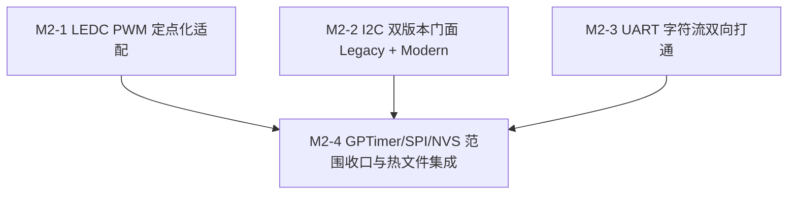

# ESP-IDF 仿真拦截层实施计划 M2：核心总线驱动双版本与定点 PWM

> 📋 **计划状态声明**：
> 本计划为 ESP-IDF 仿真拦截层派生子计划（Milestone 2）。
> **继承总纲**：[`PLAN-20260922-ESP-IDF-SIM-MASTER`](./2026-09-22-esp-idf-simulation-interception-master-plan.md) (v3.3)
> **当前状态**：📋 待开始（骨架占位，M1 验收完成后展开详细代码步骤）
> 🎯 **计划版本**：v1.1（2026-09-24，PAL 签名纠偏补遗）
> 🔍 **签名基线**：`pal_i2c_transfer` 为 6 参（默认超时），显式超时用 7 参 `pal_i2c_transfer_timeout`（`pal/include/hal/pal_i2c.h:77-92`）；总纲 v3.3 的 7 参 `pal_i2c_transfer` 写法错误，M2 一律以本基线为准

---

## 1. 元数据表（🔴 必选）

| 字段 | 内容 |
|:---|:---|
| **计划编号** | `PLAN-20260925-ESP-IDF-SIM-M2` |
| **创建日期** | 2026-09-23 |
| **目标平台/SoC** | `wasm32-unknown-emscripten` / `host` (x86_64, Windows/Linux)；对照 SoC：`esp32` |
| **工具链/SDK版本**| `ESP-IDF v5.1.3 LTS` ~ `v6.1+` |
| **计划状态** | 📋 待开始（继承总纲，待 M1 闭环后展开） |
| **优先级** | 🔴 P0（外设总线核心能力） |
| **计划版本** | `v1.1` |
| **关联技术设计** | [`docs/zh/tech-designs/core/pal-i2c-v6-compatibility.md`](../../zh/tech-designs/core/pal-i2c-v6-compatibility.md) |
| **关联设计规范** | [`docs/zh/design/04-wasm-simulation/00-README.md`](../../zh/design/04-wasm-simulation/00-README.md)、[`02-wink-micro-os/`](../../zh/design/02-wink-micro-os/README.md) |
| **关联 ADR** | ADR-0004（静态分发）、ADR-0065（禁 claim）、ADR-0066（PWM 定点化）、ADR-0085（caps 双 SSOT） |
| **目标里程碑** | M2（核心总线驱动双版本、定点 LEDC PWM 与总线闭环） |
| **前置依赖计划** | [`./2026-09-24-esp-idf-sim-m1-freertos-plan.md`](./2026-09-24-esp-idf-sim-m1-freertos-plan.md)（M1 必须 100% DoD 闭环） |
| **计划负责人** | 仿真拦截专项小组 |
| **主要依赖技能** | `embedded-best-practice` |

---

## 2. 背景与目标（继承自总纲 §3.4 / §3.9 / §6）

### 2.1 问题陈述
ESP-IDF 的总线外设在 v5 与 v6 之间经历了重大架构迁移，特别是 I2C 从基于命令链表的 Legacy API（`driver/i2c.h`）演进为现代句柄式 Master API（`driver/i2c_master.h`）。
此外，LEDC PWM 的浮点占空比违反项目定点架构红线（ADR-0066），UART/GPTimer/SPI/NVS 亦需在单线程虚拟时间框架内完成轻量保真映射。

### 2.2 核心设计与契约（总纲 v3.3 锁定）
1. **LEDC PWM 定点化**：使用 `pal_pwm_set_duty_bp()`，彻底禁止浮点运算与裸字面量；lint pack 机器强制。
2. **I2C 双门面共存**：同时提供 `driver/i2c.h` 与 `driver/i2c_master.h`，底层统一汇聚至 `pal_i2c_transfer_timeout()`（7 参显式超时；默认超时可用 6 参 `pal_i2c_transfer()` 包装）。Legacy 命令链表（start/write/read/stop）折叠为单次 transfer 的规则与 ACK-check 策略在展开详设时单列。
3. **静态句柄池（Static Handle Pool）**：禁止运行时 malloc，总线对象与设备控制块全部预分配。
4. **UART 字符流**：环形缓冲区静态分配，双向桥接 `pal_uart_*`。
5. **GPTimer / SPI / NVS 范围收口（§3.9 定级）**：
   - GPTimer alarm 接入 `sim_scheduler` 唤醒源，经 `pal_deferred_post` 派发。
   - SPI Master 收敛至 `pal_spi_*` 静态传输通道。
   - NVS 基于内存 KV 静态池，默认跨复位保留。
6. **并行纪律与热文件保护**：LEDC/I2C/UART 三线开发并行，但在 M2-4 集成日集中串行合入中央 `wink-micro-os/test/CMakeLists.txt`。

### 2.3 成功指标（DoD 出口）
- ✅ 现代 I2C 官方语料（Tier-A）与 Legacy Tier-B 语料均原文 100% 编译通过。
- ✅ LEDC PWM 输出无浮点（外部 lint pack 强制通过）。
- ✅ GPTimer alarm 时序断言通过（到期误差 < 1 tick）。
- ✅ NVS 存储与复位保留/擦除语义断言通过。

---

## 3. 架构红线继承（总纲 §8）

本子计划严格继承总纲 7 条架构红线：
1. 🚨 **C-ABI 与纯 C 实现原则**：标准 C99，严禁 C++ 运行时/异常。
2. 🚨 **严禁侵入式修改 PAL / DAL**：只依赖 `pal/include`（HAL/OSAL）既有能力。
3. 🚨 **严格遵守 ADR-0065**：门面严禁调用 `pal_resource_claim()`。
4. 🚨 **零运行期堆分配**：静态对象池，运行期 0 裸 malloc。
5. 🚨 **PWM 定点红线（ADR-0066）**：全定点整数运算，严禁浮点 duty。
6. 🚨 **合约诚实（ADR-0012）**：语义降级与功能性差异必须如实登记。
7. 🚨 **开源许可合规（ADR-0083/0084）**：`src/include` = LGPL-3.0-only，`test/` = GPL-3.0-only。

---

## 4. 里程碑任务分解概览

| 任务 ID | 任务标题 | 核心工作内容 | 预估工时 |
|:---|:---|:---|:---|
| **Task M2-1** | LEDC PWM 定点门面与 ADR-0066 适配 | `driver/ledc.h`、`pal_pwm_set_duty_bp` 桥接、定点万分比换算、0 浮点 lint | 8 h |
| **Task M2-2** | I2C Legacy 与 Modern 双门面实现 | `driver/i2c.h` 与 `driver/i2c_master.h`、静态池、汇聚至 `pal_i2c_transfer` | 16 h |
| **Task M2-3** | UART 驱动门面与字符流收发 | `driver/uart.h`、静态环形缓冲区、`pal_uart_*` 桥接 | 12 h |
| **Task M2-4** | GPTimer / SPI / NVS 收口与热文件集成 | alarm 虚拟化、SPI 同步传输、内存 NVS、热文件 `test/CMakeLists.txt` 串行合入 | 10 h |

---

## 5. 展开前置约束（v1.1 新增，防返工）

1. **UART `driver_install` queue 语义必须先裁决**：复用 M1 FreeRTOS queue shim 还是门面自建，直接决定 M2-3 工作量，展开时单列裁决项（含 `RX_FULL/FIFO_OVF` 经 `pal_deferred_post_from_isr` 路径）。
2. **LEDC 必须含 timer/channel 双步映射**：`ledc_timer_config(freq/resolution)` 冲突仲裁 + 按 `WINK_ESP_TARGET` 裁剪通道数（C3/C6=6），仅换算 duty 不够 DoD。
3. **GPTimer 收敛目标二选一**：直连 `sim_scheduler` 还是经 `pal_hwtimer_*`，红线 2 倾向后者，展开时裁决并登记。
4. **RMT 归宿**：总纲“ M2/M4”中的 M4 不存在，展开时明确 RMT 真门面归 M2 还是新立 M4，否则 `led_strip` 启用分支 Fail-Loud 无承接。

---

## 6. 待办声明

> 📌 **展开条件**：M1 计划（`2026-09-24-esp-idf-sim-m1-freertos-plan.md`）通过 L0~L4 验收准出后，本计划将补充后续章节的详细任务执行步骤、精确代码片段、测试用例清单与回滚方案（消费 §5 约束）。
