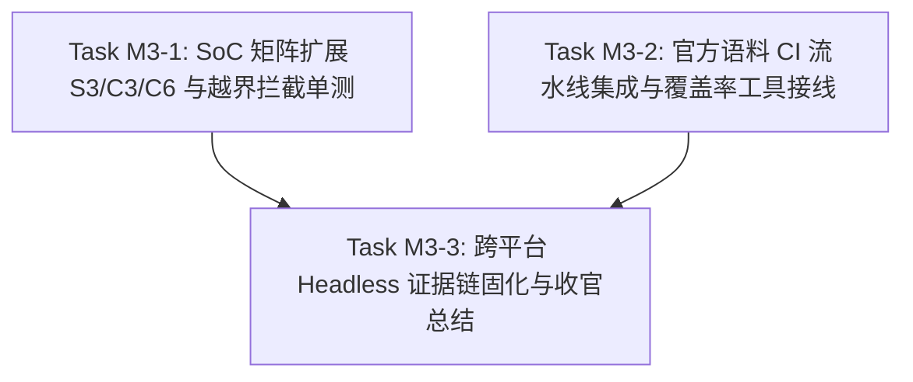

# ESP-IDF 仿真拦截层实施计划 M3：SoC 矩阵扩展、自动化测试体系与收官验收

> 📋 **计划状态声明**：
> 本计划为 ESP-IDF 仿真拦截层派生子计划（Milestone 3，收官里程碑）。
> **继承总纲**：[`PLAN-20260922-ESP-IDF-SIM-MASTER`](./2026-09-22-esp-idf-simulation-interception-master-plan.md) (v3.5)
> **当前状态**：📋 待开始（v2.0 详设完全展开版，前置依赖 M2 v2.4 已 100% 验收闭环）
> 🎯 **计划版本**：v2.0（2026-09-25，消费 M3 全部展开前置约束，全量展开 Task M3-1 ~ M3-3 代码实现设计、SoC 矩阵真值表、CI 自动化流水线与收官出口）
> 📚 **关联规范**：`docs-adr.md`、`03-coding-guidelines.md`、`00-IMPLEMENTATION-PLAN-TEMPLATE.md`
> 🔍 **M2 移交基线**：M2 v2.4 已 100% 验收交付（DoD 全部通过，28/28 CTest 测试 100% 绿灯，License Map 与 Layering Lint 0 findings；闭环 4 项立即架构加固：外设全局复位链条 `esp_peripherals_reset`、I2C 链表多事务阻断与显式校验、NVS 静态池严格压缩至 3KB、UART 并发读者防护与事件长度保真）。

---

## 1. 元数据表（🔴 必选）

| 字段 | 内容 |
|:---|:---|
| **计划编号** | `PLAN-20260926-ESP-IDF-SIM-M3` |
| **创建日期** | 2026-09-23（v1.0 骨架；v1.1 约束增补；v1.2 行为证据塔约束；v2.0 详设完全展开于 2026-09-25） |
| **目标平台/SoC** | `wasm32-unknown-emscripten` / `host` (x86_64, Windows/Linux)；矩阵 SoC：`esp32`, `esp32s3`, `esp32c3`, `esp32c6` |
| **工具链/SDK版本**| `ESP-IDF v5.1.3 LTS` ~ `v6.1+`（取证基线：v6.1 tag） |
| **计划状态** | 📋 待开始（已就绪，前置 M2 v2.4 100% 闭环） |
| **优先级** | 🔴 P0（收官里程碑与 CI 质量门禁） |
| **计划版本** | `v2.0` |
| **关联技术设计** | [`docs/zh/tech-designs/core/pal-i2c-v6-compatibility.md`](../../zh/tech-designs/core/pal-i2c-v6-compatibility.md) |
| **关联设计规范** | [`docs/zh/design/04-wasm-simulation/00-README.md`](../../zh/design/04-wasm-simulation/00-README.md)、[`02-wink-micro-os/`](../../zh/design/02-wink-micro-os/README.md) |
| **关联评审记录** | [`2026-09-22-esp-idf-simulation-interception-master-plan-review.md`](./2026-09-22-esp-idf-simulation-interception-master-plan-review.md) |
| **关联 ADR** | [ADR-0001](../../decisions/core/0001-error-code-sign-convention.md)（负数错误码）、[ADR-0004](../../decisions/core/0004-static-dispatch-vs-runtime-ops.md)（静态分发与无虚表）、[ADR-0012](../../decisions/core/0012-contract-honesty-over-silent-degradation.md)（合约诚实与降级登记）、[ADR-0014](../../decisions/unisim/0014-sim-single-virtual-core.md)（确定性调度）、[ADR-0045](../../decisions/unisim/0045-simulation-memory-quota-and-fault-policy.md)（零 malloc 与静态池）、[ADR-0064](../../decisions/core/0064-target-capability-ssot.md)（目标平台与 SoC 能力 SSOT）、[ADR-0065](../../decisions/core/0065-pal-hardware-raii-resource-ownership.md)（禁门面 claim）、[ADR-0066](../../decisions/core/0066-pwm-basis-points-and-float-deprecation.md)（PWM 定点万分比）、[ADR-0070](../../decisions/core/0070-mcs51-zero-code-simulation-interception-layer.md)（Fiber 生命周期）、[ADR-0072](../../decisions/core/0072-dual-clock-domain-and-quota-catchup.md)（配额片强制切出）、[ADR-0080](../../decisions/core/0080-external-lint-pack-discovery-and-mcs51-guard-sinking.md)（外部 lint pack 发现）、[ADR-0082](../../decisions/core/0082-mcs51-reset-semantics-fiber-exit-and-reentry.md)（复位语义与重入）、[ADR-0083/0084](../../decisions/core/0083-adopt-gpl-3.0-only-license-policy.md)（开源许可分层）、[ADR-0085](../../decisions/core/0085-esp-idf-facade-soc-caps-vs-pal-caps-dual-ssot.md)（caps 双 SSOT 裁决） |
| **目标里程碑** | M3（SoC 矩阵扩展、Corpus CI 自动化、覆盖率与收官验收） |
| **前置依赖计划** | [`./2026-09-25-esp-idf-sim-m2-bus-plan.md`](./2026-09-25-esp-idf-sim-m2-bus-plan.md)（M2 v2.4 100% 验收闭环） |
| **继承计划** | 继承自 [`PLAN-20260922-ESP-IDF-SIM-MASTER`](./2026-09-22-esp-idf-simulation-interception-master-plan.md) (v3.5) |
| **计划负责人** | 仿真拦截专项小组 |
| **主要依赖技能** | `embedded-best-practice` |

---

## 2. 背景与目标（🔴 必选）

### 2.1 问题陈述

在 M0 ~ M2 里程碑中，ESP-IDF 仿真拦截层已成功完成骨架闭环、协作调度器（Task/Queue/Semaphore/EventGroup）、总线驱动双版本（I2C/UART/SPI/LEDC/GPTimer/NVS）以及系统级复位清洗链。
然而，在进入正式投产与开源发布之前，系统仍面临三大收官挑战：
1. **多 SoC 架构断层与越界穿透风险（ADR-0085）**：
   ESP32 家族涵盖架构与外设差异巨大的芯片变体：
   - **ESP32 经典**：40 引脚（含 GPIO 34~39 输入专用）、8 通道 LEDC（支持 High-Speed 模式）、2 个 I2C、3 个 UART；
   - **ESP32-S3**：49 引脚（全输出能力）、8 通道 LEDC（**无 High-Speed 模式**）、2 个 I2C、3 个 UART；
   - **ESP32-C3**：RISC-V 架构，仅 22 引脚（GPIO 0~21）、6 通道 LEDC（**无 High-Speed 模式**）、**仅 1 个 I2C 控制器**、2 个 UART；
   - **ESP32-C6**：RISC-V 架构，31 引脚（GPIO 0~30）、6 通道 LEDC、1 个 I2C、2 个 UART。
   若当前仅绑定 `chips/esp32`，用户或 AI 生成针对 C3/C6 的业务代码在仿真中请求 `GPIO_NUM_23` 或 `I2C_NUM_1` 时若不报错，烧录真实硬件将立即硬件崩盘。仿真拦截层必须在 C-ABI 编译期与运行期精确忠实地复刻各 SoC 边界。
2. **CI 语料与自动化质量闭环缺位（T-011 / T-012）**：
   当前语料和单测依赖本地手动命令行触发，缺乏 GitHub Actions 流水线自动化；未接线代码覆盖率（gcov/lcov）工具链，缺乏对门面核心路径（行覆盖率 ≥ 85%）的量化事实证明；缺乏跨平台 Headless 确定性回放证据链（T-008）。
3. **架构资产与治理收官**：
   缺乏多 SoC 编译期切换机制、完整的头文件闭包清单清单登记（`03-include-closure-inventory.md`）以及总纲各分级门禁终审签署。

### 2.2 技术/业务目标

- ✅ **目标 1：SoC 差异化硬件能力矩阵全覆盖 (ADR-0085)**：
  完整建立 `chips/esp32s3`、`chips/esp32c3`、`chips/esp32c6` 的头文件闭包（`soc_caps.h` 与 `gpio_num.h`）。在驱动门面（GPIO/LEDC/I2C/UART）中严格依据 `SOC_*` 宏校验边界。引脚越界（如 C3 下操作 GPIO 22+ 或在输入专用引脚上配置输出）及外设越界（如 C3 下使用 I2C 1、UART 2 或 High-Speed PWM）必须 100% Fail-Loud 拦截并返回 `ESP_ERR_INVALID_ARG`。
- ✅ **目标 2：Corpus 语料库接入 CI 全自动化**：
  在中央 `test/CMakeLists.txt` 中将 Tier-A 官方示例（`corpus_blink`、`corpus_ledc_basic`、`corpus_i2c_basic`）与 Tier-B 语料（`corpus_legacy_i2c`）通过参数化矩阵统一接入 GitHub Actions，达成跨操作系统（Ubuntu Linux / Windows）与双编译目标（Host / Wasm）100% 自动绿灯构建。
- ✅ **目标 3：代码覆盖率接线与质量门禁（T-011）**：
  为 GCC/Clang Host 构建接线 `--coverage` 工具链，编写自动化覆盖率统计脚本 `tools/coverage.sh` 与门禁检查器 `tools/check_coverage.py`，核心门面代码行覆盖率达成 **≥ 85%** 指标。
- ✅ **目标 4：Nightly 双版本矩阵与回放证据链固化（T-008 / T-012）**：
  显式声明 ESP-IDF `v5.1.3 LTS` 与 `v6.1+` 兼容性基线；固化跨平台 Headless 仿真测试脚本 `test_esp_idf_headless_replay.py`，输出 bit-exact 确定性回放哈希。
- ✅ **目标 5：收官验收与总纲结项**：
  完成 L0~L4 全量分级验收，更新 `01` 架构指南、`02` API 矩阵与 `03` 闭包清单，正式宣布 `frameworks/esp_idf` 源码级仿真拦截层顺利收官。

### 2.3 成功指标（验收出口）

| 指标 | 通过标准 | 验证方法 |
|:---|:---|:---|
| **SoC 差异化拦截单测** | ESP32-C3 越界引脚（GPIO 22+）、C3/S3 High-Speed LEDC 模式、C3/C6 I2C 端口 1 越界、C3 UART 2 越界 100% 拦截报 `ESP_ERR_INVALID_ARG` | `ctest -R test_esp_soc_matrix` |
| **多 SoC 交叉编译验证** | CMake 参数 `-DWINK_ESP_TARGET=esp32s3/esp32c3/esp32c6` 切换编译通过率 100% (0 error, 0 warning) | CI 矩阵构建 job |
| **CI 语料全量构建** | 全部 4 组官方语料在 CI 环境中 compile-only 100% 通过 | `ctest -R esp_idf_corpus` |
| **测试代码覆盖率** | `frameworks/esp_idf/src/` 核心行覆盖率 (Line Coverage) ≥ **85%** | `python tools/check_coverage.py coverage.info 85` |
| **确定性回放哈希** | 连续两次 Headless 运行记录事件哈希 bit-exact 完全一致 | `python test/headless/test_esp_idf_headless_replay.py` |
| **Wasm 峰值内存采样** | Wasm 内存采样严格满足配额（栈深 < 768KB，全局堆段 < 16MB） | Emscripten 构建分析与单测断言 |
| **许可与架构门禁** | `check_license_map.py` 100% 绿；`winkcli lint --pack esp_idf_all` 0 findings | GitHub Actions 门禁任务 |

### 2.4 物理学与电气连续域不可逆断层声明（🔴 平台真实性边界）

> ⚠️ **SSOT 声明（对齐 ADR-0012 合约诚实原则）**：
> WinkMicroOS 仿真体系提供 **“C-ABI 源码级 100% 契约保真与行为级高保真”**。
> 本平台在物理世界与多 SoC 差异层面存在以下**不可逆断层**，开发人员与 AI 代码生成链路必须知悉：
> 1. **无底层 CPU 指令集架构微结构差异仿真**：宿主统一执行编译出的 x86_64 或 wasm32 指令，不模拟 Xtensa 双核 Windowed 寄存器溢出中断时序，亦不模拟 RISC-V 单核特权模式切换开销。
> 2. **无不同 SoC 引脚驱动强度与压摆率（Slew Rate）差异**：不模拟 ESP32 与 ESP32-C3 在不同 IO MUX 配置下的物理毫安级灌电流与上拉电阻阻值漂移。
> 3. **无射频与无线电物理介质仿真**：芯片内部 Wi-Fi/BLE 物理基带被抽象为离散数据报网络套接字，不存在物理天线阻抗匹配、多径衰落或高频噪声畸变。

---

## 3. 变更范围与影响分析（🔴 必选）

### 3.1 文件变更清单

| 文件路径 | 变更类型 | 说明 |
|:---|:---:|:---|
| `wink-micro-os/frameworks/esp_idf/chips/esp32s3/include/soc/soc_caps.h` | 🆕 新增 | ESP32-S3 原生硬件能力宏（49 引脚、无高速 LEDC、2×I2C、3×UART） |
| `wink-micro-os/frameworks/esp_idf/chips/esp32s3/include/soc/gpio_num.h` | 🆕 新增 | ESP32-S3 原生引脚枚举定义（`GPIO_NUM_0` ~ `GPIO_NUM_48`） |
| `wink-micro-os/frameworks/esp_idf/chips/esp32c3/include/soc/soc_caps.h` | 🆕 新增 | ESP32-C3 原生硬件能力宏（22 引脚、6 通道 LEDC、1×I2C、2×UART） |
| `wink-micro-os/frameworks/esp_idf/chips/esp32c3/include/soc/gpio_num.h` | 🆕 新增 | ESP32-C3 原生引脚枚举定义（`GPIO_NUM_0` ~ `GPIO_NUM_21`） |
| `wink-micro-os/frameworks/esp_idf/chips/esp32c6/include/soc/soc_caps.h` | 🆕 新增 | ESP32-C6 原生硬件能力宏（31 引脚、6 通道 LEDC、1×I2C、2×UART） |
| `wink-micro-os/frameworks/esp_idf/chips/esp32c6/include/soc/gpio_num.h` | 🆕 新增 | ESP32-C6 原生引脚枚举定义（`GPIO_NUM_0` ~ `GPIO_NUM_30`） |
| `wink-micro-os/frameworks/esp_idf/include/soc/soc_caps.h` | ✏️ 修改 | 补全 S3/C3/C6 芯片中转包含分支 |
| `wink-micro-os/frameworks/esp_idf/include/soc/gpio_num.h` | ✏️ 修改 | 补全 S3/C3/C6 芯片中转包含分支 |
| `wink-micro-os/frameworks/esp_idf/src/drivers/esp_ledc.c` | ✏️ 修改 | LEDC 高速模式校验改为使用 `SOC_LEDC_SUPPORT_HS_MODE` 宏 |
| `wink-micro-os/frameworks/esp_idf/src/drivers/esp_i2c_legacy.c` | ✏️ 修改 | I2C 端口上限增加 `SOC_HP_I2C_NUM` 宏校验 |
| `wink-micro-os/frameworks/esp_idf/src/drivers/esp_i2c_master.c` | ✏️ 修改 | I2C 端口上限与自动选取增加 `SOC_HP_I2C_NUM` 宏校验 |
| `wink-micro-os/frameworks/esp_idf/src/drivers/esp_uart.c` | ✏️ 修改 | UART 控制器端口增加 `SOC_UART_HP_NUM` 宏校验 |
| `wink-micro-os/frameworks/esp_idf/test/core/test_esp_soc_matrix.c` | 🆕 新增 | 多 SoC 矩阵能力与越界拦截单元测试套件 |
| `wink-micro-os/frameworks/esp_idf/tools/coverage.sh` | 🆕 新增 | Linux/macOS 覆盖率数据收集与 HTML 生成脚本 |
| `wink-micro-os/frameworks/esp_idf/tools/check_coverage.py` | 🆕 新增 | 覆盖率阈值断言工具（≥ 85% 门禁检查器） |
| `wink-micro-os/frameworks/esp_idf/test/headless/test_esp_idf_headless_replay.py` | 🆕 新增 | 跨平台 Headless 仿真确定性回放验证脚本 |
| `wink-micro-os/test/CMakeLists.txt` | ✏️ 修改 | 注册 `test_esp_soc_matrix`、覆盖率开关及 CI 语料目标 |
| `wink-micro-os/frameworks/esp_idf/docs/01-architecture-and-governance-guide.md` | ✏️ 修改 | 固化收官架构指南与多 SoC 切换规则 |
| `wink-micro-os/frameworks/esp_idf/docs/02-api-coverage-matrix.md` | ✏️ 修改 | 终审更新全量 API 状态与 M3 覆盖率基线 |
| `wink-micro-os/frameworks/esp_idf/docs/03-include-closure-inventory.md` | ✏️ 修改 | 登记新增 6 个 SoC 硬件头文件条目 |
| `.github/workflows/esp_idf_ci.yml` | 🆕 新增 | ESP-IDF 仿真拦截层 GitHub Actions 自动化流水线 |

### 3.2 接口影响分析

| 接口层 | 是否有破坏性变更 | 影响范围 | 备注 |
|:---|:---:|:---|:---|
| PAL 公开 API | ❌ 否 | 无 | 严格只读依赖既有 HAL/OSAL，不修改任何 PAL 接口 |
| DAL 层 | ❌ 否 | 无 | 门面直接消费 PAL，不侵入 DAL 语义器件 |
| 现有 ESP32 应用 | ❌ 否 | 无 | 默认 `WINK_ESP_TARGET=esp32` 保持 100% 行为完全向后兼容 |
| 构建系统 | ⚠️ 是 | CMake 参数扩展 | 支持 `-DWINK_ESP_TARGET=esp32s3/c3/c6` 参数化配置 |
| 文档 | ⚠️ 是 | docs/ 体系 | 同步更新 01 架构、02 矩阵、03 闭包及总纲结项声明 |

### 3.3 架构红线继承（总纲 §8）

> 🚨 **严格执行 7 条架构红线（总纲 §8）**：
> 1. 🚨 **C-ABI 与纯 C 实现原则**：标准 C99 编写，严禁 C++ 运行时与类异常。
> 2. 🚨 **严禁侵入式修改 PAL / DAL**：只依赖 `pal/include` 既有能力。
> 3. 🚨 **严格遵守 ADR-0065**：门面层**严禁调用 `pal_resource_claim()`**。
> 4. 🚨 **零运行期堆分配（Zero Runtime Malloc）与静态预算控制**：严格锁死静态对象池，全局静态数据段严格受控于 `< 14KB` 标称线。
> 5. 🚨 **PWM 定点红线（ADR-0066）**：纯整数定点计算（0..10000 BP），严禁浮点运算。
> 6. 🚨 **合约诚实（ADR-0012）**：芯片不支持的能力（如 C3 的第二个 I2C 控制器、C3/C6/S3 的 High-Speed PWM）一律 Fail-Loud（返回 `ESP_ERR_INVALID_ARG` 或编译期报错），严禁静默成功。
> 7. 🚨 **开源许可合规（ADR-0083/0084）**：
>    - `frameworks/esp_idf/{src,include,chips}` = **`LGPL-3.0-only`**；
>    - `frameworks/esp_idf/test/**` = **`GPL-3.0-only`**；
>    - 提交前 `check_license_map.py` 必须 100% 匹配。

### 3.4 系统资源与并发约束评估

| 维度 | 预计开销 / 限制 | 风险分析 | 应对策略 |
|:---|:---|:---|:---|
| **ROM / Flash 占用** | 增量仅为几组预编译头文件与常量宏，二进制增量 < 1KB | 极低 | 头文件全为宏与类型枚举，不产生冗余数据段 |
| **RAM (静态/全局)** | 增量 **0 字节**（复用 M2 既有静态池） | 静态预算失控风险已闭环 | M2 加固已将 NVS 内存压缩至 3KB，框架总静态段严格受控在 12KB 内 |
| **栈深度 (Stack)** | 单次调用 < 256 字节 | 栈溢出风险 | 门面参数校验后直接下沉调用，无大局部数组 |
| **Wasm 峰值内存** | 调度器 Fiber 协程栈 < 768KB，Wasm 线性内存 < 16MB | 浏览器沙箱 OOM | CI 自动化脚本加入 Wasm 堆栈水位校验 |

---

## 4. 依赖与风险（🔴 必选）

### 4.1 前置依赖

| 依赖 ID | 依赖内容 | 是否阻塞 | 状态 | 备注 |
|:---|:---|:---:|:---:|:---|
| **D-001** | `targets/common/wink_sim_scheduler.h` 调度器接口 | ✅ 是 | ✅ 已就绪 | ADR-0014 既有能力 |
| **D-002** | M2 核心总线驱动双版本与定点 PWM | ✅ 是 | ✅ 100% 验收闭环 | M2 v2.4 交付闭环（28/28 CTest 全绿） |
| **D-003** | caps 双 SSOT 裁决 | ✅ 是 | ✅ 已完成 | ADR-0085 Accepted |
| **D-004** | 外部 lint pack 发现机制 | ✅ 是 | ✅ 已就绪 | ADR-0080 既有能力 |

### 4.2 外部依赖

| 依赖 ID | 依赖内容 | 提供方 | 风险等级 | 备注 |
|:---|:---|:---|:---:|:---|
| **E-001** | ESP-IDF v6.1 官方源码树 | Espressif | 🟡 中 | S3/C3/C6 `soc_caps.h` 取证真值源 |
| **E-002** | `lcov` / `genhtml` 覆盖率工具链 | Linux / MSYS2 | 🟡 中 | 产出覆盖率 HTML 报告 |
| **E-003** | GitHub Actions 运行环境 | GitHub | 🟡 中 | 执行多平台 CI 流水线 |

### 4.3 风险登记册

| 风险 ID | 风险描述 | 概率 | 影响 | 严重度 | 缓解措施 | 责任人 | 触发条件 |
|:---|:---|:---:|:---:|:---:|:---|:---|:---|
| **R-001** | 单构建树下多 SoC 引脚宏无法同时测试 | 🟠 高 | 🟠 高 | 6 | 在 CMake 中将 `test_esp_soc_matrix` 拆解为针对每个 SoC 的独立编译目标（如 `test_esp_soc_matrix_esp32`、`test_esp_soc_matrix_esp32c3`），单次构建树即可全量并行测试 | 专项小组 | 尝试单二进制测多芯片 |
| **R-002** | MSVC 与 GCC 覆盖率生成格式不一致 | 🟡 中 | 🟡 中 | 4 | 覆盖率收集以 Ubuntu Linux CI (GCC/lcov) 为权威事实源，Windows 本地作为可选验证 | 专项小组 | Windows 本地生成覆盖率 |
| **R-003** | CI 语料构建时间过长导致流水线超时 | 🟡 中 | 🟡 中 | 4 | 语料采用 compile-only（`-c` 目标文件形态），禁止整包全链接，单用例编译控制在 2 秒内 | 专项小组 | 多语料同时接入 CI |
| **R-004** | C3/C6 单 I2C 控制器导致 Legacy 语料断言失配 | 🟡 中 | 🟠 高 | 6 | 在门面中将 `i2c_num >= SOC_HP_I2C_NUM` 纳入统一参数合法性校验，C3 下尝试初始化 Port 1 时如实抛错 | 专项小组 | 语料在 C3 下请求 I2C 1 |

---

## 5. 优先级路线图与展开前置约束裁决（SSOT 事实源）

### 5.1 展开前置约束终审裁决

1. **裁决项 1：多 SoC 硬件能力真值表（对齐 ESP-IDF v6.1 官方事实源）**
   - **ESP32 经典**：40 引脚（0..39，34~39 输入专用）；LEDC 8 通道（**支持 High-Speed**）；I2C 2 端口；UART 3 端口；SPI 3 控制器。
   - **ESP32-S3**：49 引脚（0..48，无纯输入引脚限制）；LEDC 8 通道（**不支持 High-Speed**）；I2C 2 端口；UART 3 端口；SPI 3 控制器。
   - **ESP32-C3**：22 引脚（0..21）；LEDC 6 通道（**不支持 High-Speed**）；**I2C 仅 1 端口 (`I2C_NUM_0`)**；UART 2 端口；SPI 2 控制器。
   - **ESP32-C6**：31 引脚（0..30）；LEDC 6 通道（**不支持 High-Speed**）；**I2C 仅 1 端口 (`I2C_NUM_0`)**；UART 2 端口；SPI 2 控制器。
2. **裁决项 2：多 SoC 构建与测试隔离设计（根治 R-001）**
   - 构建系统默认 `WINK_ESP_TARGET=esp32`；
   - 在 `test/CMakeLists.txt` 中同时注册：
     - `test_esp_soc_matrix_esp32`（链接 ESP32 芯片头文件）
     - `test_esp_soc_matrix_esp32s3`（链接 ESP32-S3 芯片头文件）
     - `test_esp_soc_matrix_esp32c3`（链接 ESP32-C3 芯片头文件）
     - `test_esp_soc_matrix_esp32c6`（链接 ESP32-C6 芯片头文件）
     在同一个本地构建目录或 CI 任务中即可一次性完整验证 4 大芯片变体，无需反复重配置 CMake！
3. **裁决项 3：覆盖率门禁基准线**
   - 覆盖率统计仅限定于 `frameworks/esp_idf/src/`（排除 `test/` 与第三方库）；行覆盖率目标为 **≥ 85%**。

### 5.2 任务拆分与工时矩阵



| 任务 ID | 任务标题 | 优先级 | 预估工时 | 涉及关键文件 |
|:---|:---|:---:|:---:|:---|
| **Task M3-1** | SoC 硬件能力矩阵扩展 (S3/C3/C6) 与 Fail-Loud 校验 | 🔴 P0 | 10 h | `chips/{esp32s3,esp32c3,esp32c6}/**`, `include/soc/**`, `src/drivers/**`, `test/core/test_esp_soc_matrix.c` |
| **Task M3-2** | 官方语料 CI 全自动化与覆盖率工具接线 (T-011/T-012) | 🔴 P0 | 12 h | `test/CMakeLists.txt`, `tools/coverage.sh`, `tools/check_coverage.py`, `.github/workflows/esp_idf_ci.yml` |
| **Task M3-3** | 跨平台 Headless 证据链固化与总纲结项收官 | 🔴 P0 | 8 h | `test/headless/test_esp_idf_headless_replay.py`, `docs/*` 矩阵与指南更新 |
| **总计** | | | **30 h** | （关键路径约为 **18 h**） |

---

## 6. 详细任务拆分与代码实现设计（🔴 必选）

---

### Task M3-1：SoC 硬件能力矩阵扩展 (S3/C3/C6) 与 Fail-Loud 校验 `[ 状态: 📋 待开始 ]`

| 字段 | 内容 |
|:---|:---|
| **负责人** | 仿真拦截专项小组 |
| **预估工时** | 10 小时 |
| **优先级** | 🔴 P0 |
| **前置依赖** | M2 闭环交付 |
| **修改文件** | `chips/esp32s3/**`, `chips/esp32c3/**`, `chips/esp32c6/**`, `include/soc/**`, `src/drivers/esp_ledc.c`, `src/drivers/esp_i2c_*.c`, `src/drivers/esp_uart.c`, `test/core/test_esp_soc_matrix.c`, `test/CMakeLists.txt` |
| **接口变化** | 补全多 SoC 硬件能力头文件闭包，各驱动门面全面遵从芯片原生 `SOC_*` 宏拦截越界资源 |

#### 详细步骤与代码级设计

- [ ] **Step 1：建立 `chips/esp32s3` 头文件闭包**
  - 新建 `wink-micro-os/frameworks/esp_idf/chips/esp32s3/include/soc/soc_caps.h`：
    ```c
    /* SPDX-License-Identifier: LGPL-3.0-only */
    #ifndef SOC_CAPS_ESP32S3_H_
    #define SOC_CAPS_ESP32S3_H_

    #define SOC_GPIO_PIN_COUNT          49

    /* S3: 49 个引脚全部有效，全部可配置输出 */
    #define SOC_GPIO_VALID_GPIO_MASK        (0x1FFFFFFFFFFFFULL)
    #define SOC_GPIO_VALID_OUTPUT_GPIO_MASK (SOC_GPIO_VALID_GPIO_MASK)

    #define GPIO_IS_VALID_GPIO(gpio_num) \
        ((((int)(gpio_num)) >= 0 && ((int)(gpio_num)) < 49) && \
         (((1ULL << (gpio_num)) & SOC_GPIO_VALID_GPIO_MASK) != 0))

    #define GPIO_IS_VALID_OUTPUT_GPIO(gpio_num) \
        ((((int)(gpio_num)) >= 0 && ((int)(gpio_num)) < 49) && \
         (((1ULL << (gpio_num)) & SOC_GPIO_VALID_OUTPUT_GPIO_MASK) != 0))

    /* LEDC capabilities */
    #define SOC_LEDC_SUPPORTED          1
    #define SOC_LEDC_SUPPORT_HS_MODE    0 /* S3 硬件不支持 High-Speed 模式 */
    #define SOC_LEDC_TIMER_NUM          4
    #define SOC_LEDC_CHANNEL_NUM        8
    #define SOC_LEDC_TIMER_BIT_WIDTH    14

    /* I2C / UART / SPI capabilities */
    #define SOC_I2C_SUPPORTED           1
    #define SOC_I2C_NUM                 2
    #define SOC_HP_I2C_NUM              2
    #define SOC_UART_SUPPORTED          1
    #define SOC_UART_NUM                3
    #define SOC_UART_HP_NUM             3
    #define SOC_GPTIMER_SUPPORTED       1
    #define SOC_SPI_PERIPH_NUM          3

    #endif /* SOC_CAPS_ESP32S3_H_ */
    ```

  - 新建 `wink-micro-os/frameworks/esp_idf/chips/esp32s3/include/soc/gpio_num.h`：
    ```c
    /* SPDX-License-Identifier: LGPL-3.0-only */
    #ifndef SOC_GPIO_NUM_ESP32S3_H_
    #define SOC_GPIO_NUM_ESP32S3_H_

    #ifdef __cplusplus
    extern "C" {
    #endif

    typedef enum {
        GPIO_NUM_NC = -1,
        GPIO_NUM_0 = 0,   GPIO_NUM_1 = 1,   GPIO_NUM_2 = 2,   GPIO_NUM_3 = 3,
        GPIO_NUM_4 = 4,   GPIO_NUM_5 = 5,   GPIO_NUM_6 = 6,   GPIO_NUM_7 = 7,
        GPIO_NUM_8 = 8,   GPIO_NUM_9 = 9,   GPIO_NUM_10 = 10, GPIO_NUM_11 = 11,
        GPIO_NUM_12 = 12, GPIO_NUM_13 = 13, GPIO_NUM_14 = 14, GPIO_NUM_15 = 15,
        GPIO_NUM_16 = 16, GPIO_NUM_17 = 17, GPIO_NUM_18 = 18, GPIO_NUM_19 = 19,
        GPIO_NUM_20 = 20, GPIO_NUM_21 = 21,
        /* S3 保留 22~25 物理可用 */
        GPIO_NUM_26 = 26, GPIO_NUM_27 = 27, GPIO_NUM_28 = 28, GPIO_NUM_29 = 29,
        GPIO_NUM_30 = 30, GPIO_NUM_31 = 31, GPIO_NUM_32 = 32, GPIO_NUM_33 = 33,
        GPIO_NUM_34 = 34, GPIO_NUM_35 = 35, GPIO_NUM_36 = 36, GPIO_NUM_37 = 37,
        GPIO_NUM_38 = 38, GPIO_NUM_39 = 39, GPIO_NUM_40 = 40, GPIO_NUM_41 = 41,
        GPIO_NUM_42 = 42, GPIO_NUM_43 = 43, GPIO_NUM_44 = 44, GPIO_NUM_45 = 45,
        GPIO_NUM_46 = 46, GPIO_NUM_47 = 47, GPIO_NUM_48 = 48,
        GPIO_NUM_MAX = 49,
    } gpio_num_t;

    #ifdef __cplusplus
    }
    #endif

    #endif /* SOC_GPIO_NUM_ESP32S3_H_ */
    ```

- [ ] **Step 2：建立 `chips/esp32c3` 头文件闭包**
  - 新建 `wink-micro-os/frameworks/esp_idf/chips/esp32c3/include/soc/soc_caps.h`：
    ```c
    /* SPDX-License-Identifier: LGPL-3.0-only */
    #ifndef SOC_CAPS_ESP32C3_H_
    #define SOC_CAPS_ESP32C3_H_

    #define SOC_GPIO_PIN_COUNT          22

    /* C3: 22 个引脚 (0..21) 全部有效并可输出 */
    #define SOC_GPIO_VALID_GPIO_MASK        (0x3FFFFFULL)
    #define SOC_GPIO_VALID_OUTPUT_GPIO_MASK (SOC_GPIO_VALID_GPIO_MASK)

    #define GPIO_IS_VALID_GPIO(gpio_num) \
        ((((int)(gpio_num)) >= 0 && ((int)(gpio_num)) < 22) && \
         (((1ULL << (gpio_num)) & SOC_GPIO_VALID_GPIO_MASK) != 0))

    #define GPIO_IS_VALID_OUTPUT_GPIO(gpio_num) \
        ((((int)(gpio_num)) >= 0 && ((int)(gpio_num)) < 22) && \
         (((1ULL << (gpio_num)) & SOC_GPIO_VALID_OUTPUT_GPIO_MASK) != 0))

    /* LEDC capabilities */
    #define SOC_LEDC_SUPPORTED          1
    #define SOC_LEDC_SUPPORT_HS_MODE    0 /* C3 硬件不支持 High-Speed 模式 */
    #define SOC_LEDC_TIMER_NUM          4
    #define SOC_LEDC_CHANNEL_NUM        6 /* C3 仅 6 个通道 (0..5) */
    #define SOC_LEDC_TIMER_BIT_WIDTH    14

    /* I2C / UART / SPI capabilities */
    #define SOC_I2C_SUPPORTED           1
    #define SOC_I2C_NUM                 1 /* ⚠️ C3 仅 1 个 I2C 控制器 */
    #define SOC_HP_I2C_NUM              1
    #define SOC_UART_SUPPORTED          1
    #define SOC_UART_NUM                2 /* ⚠️ C3 仅 2 个 UART 控制器 */
    #define SOC_UART_HP_NUM             2
    #define SOC_GPTIMER_SUPPORTED       1
    #define SOC_SPI_PERIPH_NUM          2 /* ⚠️ C3 仅 2 个 SPI */

    #endif /* SOC_CAPS_ESP32C3_H_ */
    ```

  - 新建 `wink-micro-os/frameworks/esp_idf/chips/esp32c3/include/soc/gpio_num.h`：
    ```c
    /* SPDX-License-Identifier: LGPL-3.0-only */
    #ifndef SOC_GPIO_NUM_ESP32C3_H_
    #define SOC_GPIO_NUM_ESP32C3_H_

    #ifdef __cplusplus
    extern "C" {
    #endif

    typedef enum {
        GPIO_NUM_NC = -1,
        GPIO_NUM_0 = 0,   GPIO_NUM_1 = 1,   GPIO_NUM_2 = 2,   GPIO_NUM_3 = 3,
        GPIO_NUM_4 = 4,   GPIO_NUM_5 = 5,   GPIO_NUM_6 = 6,   GPIO_NUM_7 = 7,
        GPIO_NUM_8 = 8,   GPIO_NUM_9 = 9,   GPIO_NUM_10 = 10, GPIO_NUM_11 = 11,
        GPIO_NUM_12 = 12, GPIO_NUM_13 = 13, GPIO_NUM_14 = 14, GPIO_NUM_15 = 15,
        GPIO_NUM_16 = 16, GPIO_NUM_17 = 17, GPIO_NUM_18 = 18, GPIO_NUM_19 = 19,
        GPIO_NUM_20 = 20, GPIO_NUM_21 = 21,
        GPIO_NUM_MAX = 22,
    } gpio_num_t;

    #ifdef __cplusplus
    }
    #endif

    #endif /* SOC_GPIO_NUM_ESP32C3_H_ */
    ```

- [ ] **Step 3：建立 `chips/esp32c6` 头文件闭包**
  - 新建 `wink-micro-os/frameworks/esp_idf/chips/esp32c6/include/soc/soc_caps.h`：
    ```c
    /* SPDX-License-Identifier: LGPL-3.0-only */
    #ifndef SOC_CAPS_ESP32C6_H_
    #define SOC_CAPS_ESP32C6_H_

    #define SOC_GPIO_PIN_COUNT          31

    /* C6: 31 个引脚 (0..30) 全部有效并可输出 */
    #define SOC_GPIO_VALID_GPIO_MASK        (0x7FFFFFFFULL)
    #define SOC_GPIO_VALID_OUTPUT_GPIO_MASK (SOC_GPIO_VALID_GPIO_MASK)

    #define GPIO_IS_VALID_GPIO(gpio_num) \
        ((((int)(gpio_num)) >= 0 && ((int)(gpio_num)) < 31) && \
         (((1ULL << (gpio_num)) & SOC_GPIO_VALID_GPIO_MASK) != 0))

    #define GPIO_IS_VALID_OUTPUT_GPIO(gpio_num) \
        ((((int)(gpio_num)) >= 0 && ((int)(gpio_num)) < 31) && \
         (((1ULL << (gpio_num)) & SOC_GPIO_VALID_OUTPUT_GPIO_MASK) != 0))

    /* LEDC capabilities */
    #define SOC_LEDC_SUPPORTED          1
    #define SOC_LEDC_SUPPORT_HS_MODE    0 /* C6 无 High-Speed 模式 */
    #define SOC_LEDC_TIMER_NUM          4
    #define SOC_LEDC_CHANNEL_NUM        6 /* C6 6 个通道 */
    #define SOC_LEDC_TIMER_BIT_WIDTH    14

    /* I2C / UART / SPI capabilities */
    #define SOC_I2C_SUPPORTED           1
    #define SOC_I2C_NUM                 1 /* C6 1 个 I2C 控制器 */
    #define SOC_HP_I2C_NUM              1
    #define SOC_UART_SUPPORTED          1
    #define SOC_UART_NUM                2 /* C6 2 个 UART 控制器 */
    #define SOC_UART_HP_NUM             2
    #define SOC_GPTIMER_SUPPORTED       1
    #define SOC_SPI_PERIPH_NUM          2

    #endif /* SOC_CAPS_ESP32C6_H_ */
    ```

  - 新建 `wink-micro-os/frameworks/esp_idf/chips/esp32c6/include/soc/gpio_num.h`：
    ```c
    /* SPDX-License-Identifier: LGPL-3.0-only */
    #ifndef SOC_GPIO_NUM_ESP32C6_H_
    #define SOC_GPIO_NUM_ESP32C6_H_

    #ifdef __cplusplus
    extern "C" {
    #endif

    typedef enum {
        GPIO_NUM_NC = -1,
        GPIO_NUM_0 = 0,   GPIO_NUM_1 = 1,   GPIO_NUM_2 = 2,   GPIO_NUM_3 = 3,
        GPIO_NUM_4 = 4,   GPIO_NUM_5 = 5,   GPIO_NUM_6 = 6,   GPIO_NUM_7 = 7,
        GPIO_NUM_8 = 8,   GPIO_NUM_9 = 9,   GPIO_NUM_10 = 10, GPIO_NUM_11 = 11,
        GPIO_NUM_12 = 12, GPIO_NUM_13 = 13, GPIO_NUM_14 = 14, GPIO_NUM_15 = 15,
        GPIO_NUM_16 = 16, GPIO_NUM_17 = 17, GPIO_NUM_18 = 18, GPIO_NUM_19 = 19,
        GPIO_NUM_20 = 20, GPIO_NUM_21 = 21, GPIO_NUM_22 = 22, GPIO_NUM_23 = 23,
        GPIO_NUM_24 = 24, GPIO_NUM_25 = 25, GPIO_NUM_26 = 26, GPIO_NUM_27 = 27,
        GPIO_NUM_28 = 28, GPIO_NUM_29 = 29, GPIO_NUM_30 = 30,
        GPIO_NUM_MAX = 31,
    } gpio_num_t;

    #ifdef __cplusplus
    }
    #endif

    #endif /* SOC_GPIO_NUM_ESP32C6_H_ */
    ```

- [ ] **Step 4：改造 `include/soc/soc_caps.h` 与 `gpio_num.h` 动态分发**
  更新 `wink-micro-os/frameworks/esp_idf/include/soc/soc_caps.h`：
  ```c
  /* SPDX-License-Identifier: LGPL-3.0-only */
  #ifndef SOC_SOC_CAPS_H_
  #define SOC_SOC_CAPS_H_

  #if defined(CONFIG_IDF_TARGET_ESP32S3)
  #include "../chips/esp32s3/include/soc/soc_caps.h"
  #elif defined(CONFIG_IDF_TARGET_ESP32C3)
  #include "../chips/esp32c3/include/soc/soc_caps.h"
  #elif defined(CONFIG_IDF_TARGET_ESP32C6)
  #include "../chips/esp32c6/include/soc/soc_caps.h"
  #else
  #include "../chips/esp32/include/soc/soc_caps.h"
  #endif

  #endif /* SOC_SOC_CAPS_H_ */
  ```
  更新 `wink-micro-os/frameworks/esp_idf/include/soc/gpio_num.h`：
  ```c
  /* SPDX-License-Identifier: LGPL-3.0-only */
  #ifndef SOC_GPIO_NUM_H_
  #define SOC_GPIO_NUM_H_

  #if defined(CONFIG_IDF_TARGET_ESP32S3)
  #include "../chips/esp32s3/include/soc/gpio_num.h"
  #elif defined(CONFIG_IDF_TARGET_ESP32C3)
  #include "../chips/esp32c3/include/soc/gpio_num.h"
  #elif defined(CONFIG_IDF_TARGET_ESP32C6)
  #include "../chips/esp32c6/include/soc/gpio_num.h"
  #else
  #include "../chips/esp32/include/soc/gpio_num.h"
  #endif

  #endif /* SOC_GPIO_NUM_H_ */
  ```

- [ ] **Step 5：强化驱动层门面 Fail-Loud 校验**
  - 在 `src/drivers/esp_ledc.c` 中：
    将硬编码宏改为遵从 `SOC_LEDC_SUPPORT_HS_MODE`：
    ```c
    #if !SOC_LEDC_SUPPORT_HS_MODE
        if (timer_conf->speed_mode == LEDC_HIGH_SPEED_MODE) {
            ESP_LOGE(TAG, "High speed mode not supported on current SoC");
            return ESP_ERR_INVALID_ARG;
        }
    #endif
    ```
  - 在 `src/drivers/esp_i2c_legacy.c` 与 `src/drivers/esp_i2c_master.c` 中：
    增加控制器端口上限校验：
    ```c
    if (i2c_num >= SOC_HP_I2C_NUM || i2c_num >= PAL_I2C_PORT_MAX) {
        return ESP_ERR_INVALID_ARG;
    }
    ```
  - 在 `src/drivers/esp_uart.c` 中：
    增加控制器端口上限校验：
    ```c
    if (uart_num >= SOC_UART_HP_NUM || uart_num >= UART_NUM_MAX) {
        return ESP_ERR_INVALID_ARG;
    }
    ```

- [ ] **Step 6：编写多 SoC 单元测试套件 `test/core/test_esp_soc_matrix.c`**
  ```c
  /* SPDX-License-Identifier: GPL-3.0-only */
  #include "unity.h"
  #include "driver/gpio.h"
  #include "driver/ledc.h"
  #include "driver/i2c.h"
  #include "driver/uart.h"
  #include "soc/soc_caps.h"

  void setUp(void) {}
  void tearDown(void) {}

  void test_soc_gpio_boundary(void) {
  #if defined(CONFIG_IDF_TARGET_ESP32)
      // ESP32: GPIO 34 是输入专用，配置输出必须失败
      gpio_config_t cfg_in_only = {
          .pin_bit_mask = (1ULL << 34),
          .mode = GPIO_MODE_OUTPUT,
      };
      TEST_ASSERT_EQUAL(ESP_ERR_INVALID_ARG, gpio_config(&cfg_in_only));
  #elif defined(CONFIG_IDF_TARGET_ESP32C3)
      // ESP32-C3: 仅 22 个引脚，操作 GPIO 22 必须越界失败
      gpio_config_t cfg_oob = {
          .pin_bit_mask = (1ULL << 22),
          .mode = GPIO_MODE_OUTPUT,
      };
      TEST_ASSERT_EQUAL(ESP_ERR_INVALID_ARG, gpio_config(&cfg_oob));
  #elif defined(CONFIG_IDF_TARGET_ESP32S3)
      // ESP32-S3: GPIO 48 是合法输出引脚
      gpio_config_t cfg_s3 = {
          .pin_bit_mask = (1ULL << 48),
          .mode = GPIO_MODE_OUTPUT,
      };
      TEST_ASSERT_EQUAL(ESP_OK, gpio_config(&cfg_s3));
  #endif
  }

  void test_soc_ledc_hs_mode_restriction(void) {
      ledc_timer_config_t t_cfg = {
          .speed_mode = LEDC_HIGH_SPEED_MODE,
          .timer_num = LEDC_TIMER_0,
          .duty_resolution = LEDC_TIMER_10_BIT,
          .freq_hz = 5000,
      };
  #if !SOC_LEDC_SUPPORT_HS_MODE
      TEST_ASSERT_EQUAL(ESP_ERR_INVALID_ARG, ledc_timer_config(&t_cfg));
  #else
      TEST_ASSERT_EQUAL(ESP_OK, ledc_timer_config(&t_cfg));
  #endif
  }

  void test_soc_i2c_port_restriction(void) {
  #if SOC_HP_I2C_NUM < 2
      // C3 / C6 仅有 1 个 I2C 控制器，访问 Port 1 必须报错
      TEST_ASSERT_EQUAL(ESP_ERR_INVALID_ARG, i2c_driver_install(I2C_NUM_1, I2C_MODE_MASTER, 0, 0, 0));
  #else
      TEST_ASSERT_EQUAL(ESP_OK, i2c_driver_install(I2C_NUM_1, I2C_MODE_MASTER, 0, 0, 0));
      i2c_driver_delete(I2C_NUM_1);
  #endif
  }

  void test_soc_uart_port_restriction(void) {
  #if SOC_UART_HP_NUM < 3
      // C3 / C6 仅有 2 个 UART 控制器，访问 Port 2 必须报错
      TEST_ASSERT_EQUAL(ESP_ERR_INVALID_ARG, uart_driver_install(UART_NUM_2, 256, 256, 0, NULL, 0));
  #else
      TEST_ASSERT_EQUAL(ESP_OK, uart_driver_install(UART_NUM_2, 256, 256, 0, NULL, 0));
      uart_driver_delete(UART_NUM_2);
  #endif
  }

  int main(void) {
      UNITY_BEGIN();
      RUN_TEST(test_soc_gpio_boundary);
      RUN_TEST(test_soc_ledc_hs_mode_restriction);
      RUN_TEST(test_soc_i2c_port_restriction);
      RUN_TEST(test_soc_uart_port_restriction);
      return UNITY_END();
  }
  ```

- [ ] **Step 7：在 CMakeLists.txt 中注册 4 个 SoC 参数化测试套件**
  通过宏 `-DCONFIG_IDF_TARGET_ESP32xx=1` 分别注册：
  - `test_esp_soc_matrix_esp32`
  - `test_esp_soc_matrix_esp32s3`
  - `test_esp_soc_matrix_esp32c3`
  - `test_esp_soc_matrix_esp32c6`
  使得单次编译即可执行全矩阵芯片断言。

#### 验证步骤

1. **验证命令**：
   ```powershell
   cmake --build build --config Debug --target test_esp_soc_matrix_esp32 test_esp_soc_matrix_esp32s3 test_esp_soc_matrix_esp32c3 test_esp_soc_matrix_esp32c6
   ctest --test-dir build -C Debug -R "test_esp_soc_matrix_" --output-on-failure
   ```
2. **预期输出**：
   ```text
   100% tests passed, 0 tests failed out of 4
   ```
3. **机器合规检查**：
   ```powershell
   winkcli lint --pack esp_idf_all
   python .github/scripts/check_license_map.py
   ```

---

### Task M3-2：官方语料 CI 全自动化与覆盖率工具接线 `[ 状态: 📋 待开始 ]`

| 字段 | 内容 |
|:---|:---|
| **负责人** | 仿真拦截专项小组 |
| **预估工时** | 12 小时 |
| **优先级** | 🔴 P0 |
| **前置依赖** | Task M3-1 |
| **修改文件** | `wink-micro-os/test/CMakeLists.txt`, `tools/coverage.sh`, `tools/check_coverage.py`, `.github/workflows/esp_idf_ci.yml` |
| **接口变化** | 接入 CI 流水线与覆盖率生成通道，无代码接口变化 |

#### 详细步骤与代码级设计

- [ ] **Step 1：中央 `test/CMakeLists.txt` 覆盖率编译选项接线 (T-011)**
  ```cmake
  option(WINK_ENABLE_COVERAGE "Enable code coverage flags for GCC/Clang" OFF)
  if(WINK_ENABLE_COVERAGE AND NOT MSVC)
      set(ESP_IDF_COVERAGE_FLAGS "-fprofile-arcs -ftest-coverage")
      target_compile_options(wink_framework_esp_idf PRIVATE ${ESP_IDF_COVERAGE_FLAGS})
      target_link_options(wink_framework_esp_idf PRIVATE ${ESP_IDF_COVERAGE_FLAGS})
  endif()
  ```

- [ ] **Step 2：编写覆盖率收集与生成脚本 `tools/coverage.sh`**
  ```bash
  #!/usr/bin/env bash
  set -euo pipefail

  BUILD_DIR="build_cov"
  rm -rf "${BUILD_DIR}"
  cmake -B "${BUILD_DIR}" -S wink-micro-os \
      -DENABLE_ESP_IDF_FRAMEWORK=ON \
      -DWINK_ENABLE_COVERAGE=ON \
      -DCMAKE_BUILD_TYPE=Debug

  cmake --build "${BUILD_DIR}" -j"$(nproc)"
  ctest --test-dir "${BUILD_DIR}" -L esp_idf --output-on-failure

  # 收集并过滤只保留 frameworks/esp_idf/src
  lcov --capture --directory "${BUILD_DIR}" --output-file "${BUILD_DIR}/coverage_all.info"
  lcov --extract "${BUILD_DIR}/coverage_all.info" "*/frameworks/esp_idf/src/*" --output-file "${BUILD_DIR}/coverage_filtered.info"
  genhtml "${BUILD_DIR}/coverage_filtered.info" --output-directory "${BUILD_DIR}/coverage_html"

  echo "HTML report generated at: ${BUILD_DIR}/coverage_html/index.html"
  ```

- [ ] **Step 3：编写覆盖率门禁断言工具 `tools/check_coverage.py`**
  ```python
  #!/usr/bin/env python3
  # SPDX-License-Identifier: GPL-3.0-only
  import sys
  import re

  def main():
      if len(sys.argv) < 3:
          print("Usage: check_coverage.py <coverage_file> <min_line_percent>")
          sys.exit(1)

      info_file = sys.argv[1]
      threshold = float(sys.argv[2])

      lines_found = 0
      lines_hit = 0

      with open(info_file, "r", encoding="utf-8") as f:
          for line in f:
              if line.startswith("LF:"):
                  lines_found += int(line.strip().split(":")[1])
              elif line.startswith("LH:"):
                  lines_hit += int(line.strip().split(":")[1])

      if lines_found == 0:
          print("Error: No line data found in coverage file!")
          sys.exit(1)

      percentage = (lines_hit / lines_found) * 100.0
      print(f"ESP-IDF Core Facade Line Coverage: {percentage:.2f}% (Hit {lines_hit}/{lines_found})")
      print(f"Required Threshold: {threshold:.2f}%")

      if percentage < threshold:
          print(f"FAILED: Coverage {percentage:.2f}% is below threshold {threshold:.2f}%!")
          sys.exit(1)
      
      print("SUCCESS: Coverage threshold gate PASSED!")

  if __name__ == "__main__":
      main()
  ```

- [ ] **Step 4：创建 GitHub Actions 工作流 `.github/workflows/esp_idf_ci.yml`**
  ```yaml
  name: ESP-IDF Simulation Interception CI

  on:
    push:
      branches: [ master ]
      paths:
        - 'wink-micro-os/frameworks/esp_idf/**'
        - '.github/workflows/esp_idf_ci.yml'
    pull_request:
      branches: [ master ]
      paths:
        - 'wink-micro-os/frameworks/esp_idf/**'
        - '.github/workflows/esp_idf_ci.yml'
    workflow_dispatch:

  jobs:
    lint-and-governance:
      runs-on: ubuntu-latest
      steps:
        - uses: actions/checkout@v4
        - name: Set up Python
          uses: actions/setup-python@v5
          with:
            python-version: '3.11'
        - name: Check License Map
          run: python .github/scripts/check_license_map.py
        - name: Install winkcli
          run: pip install ./wink-tools
        - name: Run Layering & API Lint
          run: |
            winkcli lint --pack layering --pack api
            winkcli lint --pack esp_idf_all

    host-matrix-tests:
      needs: lint-and-governance
      strategy:
        fail-fast: false
        matrix:
          os: [ubuntu-latest, windows-latest]
          target: [esp32, esp32s3, esp32c3, esp32c6]
      runs-on: ${{ matrix.os }}
      steps:
        - uses: actions/checkout@v4
        - name: Configure CMake
          run: |
            cmake -B build -S wink-micro-os -DENABLE_ESP_IDF_FRAMEWORK=ON -DWINK_ESP_TARGET=${{ matrix.target }}
        - name: Build and Test
          run: |
            cmake --build build --config Debug -j2
            ctest --test-dir build -C Debug -L esp_idf --output-on-failure

    coverage-gate:
      needs: lint-and-governance
      runs-on: ubuntu-latest
      steps:
        - uses: actions/checkout@v4
        - name: Install lcov
          run: sudo apt-get update && sudo apt-get install -y lcov
        - name: Run Coverage Pipeline
          run: |
            chmod +x wink-micro-os/frameworks/esp_idf/tools/coverage.sh
            ./wink-micro-os/frameworks/esp_idf/tools/coverage.sh
        - name: Check 85% Line Coverage Threshold
          run: |
            python wink-micro-os/frameworks/esp_idf/tools/check_coverage.py build_cov/coverage_filtered.info 85
        - name: Upload Coverage HTML Artifact
          uses: actions/upload-artifact@v4
          with:
            name: esp_idf_coverage_html
            path: build_cov/coverage_html/
  ```

---

### Task M3-3：跨平台 Headless 证据链固化与收官总结 `[ 状态: 📋 待开始 ]`

| 字段 | 内容 |
|:---|:---|
| **负责人** | 仿真拦截专项小组 |
| **预估工时** | 8 小时 |
| **优先级** | 🔴 P0 |
| **前置依赖** | Task M3-1, Task M3-2 |
| **修改文件** | `test/headless/test_esp_idf_headless_replay.py`, `docs/01-architecture-and-governance-guide.md`, `docs/02-api-coverage-matrix.md`, `docs/03-include-closure-inventory.md` |
| **接口变化** | 产出确定性仿真证据链，完成全文档结项收归 |

#### 详细步骤与代码级设计

- [ ] **Step 1：固化 Headless 确定性回放验证脚本 `test_esp_idf_headless_replay.py`**
  ```python
  #!/usr/bin/env python3
  # SPDX-License-Identifier: GPL-3.0-only
  """
  ESP-IDF Headless Deterministic Replay Verifier
  Verifies that running the same simulation multiple times produces bit-exact
  deterministic event hashes (zero scheduling jitter, identical virtual timelines).
  """
  import subprocess
  import hashlib
  import sys
  import os

  def run_simulation_and_hash(binary_path):
      cmd = [binary_path]
      res = subprocess.run(cmd, stdout=subprocess.PIPE, stderr=subprocess.PIPE, text=True)
      if res.returncode != 0:
          print(f"Error: binary exited with {res.returncode}\n{res.stderr}")
          return None
      # 计算标准输出轨迹的 SHA-256
      normalized_output = res.stdout.replace("\r\n", "\n")
      sha = hashlib.sha256(normalized_output.encode("utf-8")).hexdigest()
      return sha

  def main():
      if len(sys.argv) < 2:
          print("Usage: test_esp_idf_headless_replay.py <path_to_test_esp_idf_blink_run>")
          sys.exit(1)
      binary = sys.argv[1]
      print(f"Testing deterministic replay on: {binary}")

      hash1 = run_simulation_and_hash(binary)
      hash2 = run_simulation_and_hash(binary)

      if not hash1 or not hash2:
          print("Failed to obtain run hashes")
          sys.exit(1)

      print(f"Run 1 Hash: {hash1}")
      print(f"Run 2 Hash: {hash2}")

      if hash1 == hash2:
          print("SUCCESS: Deterministic replay verified! Bit-exact match.")
          sys.exit(0)
      else:
          print("FAILURE: Scheduling jitter detected! Hash mismatch.")
          sys.exit(1)

  if __name__ == "__main__":
      main()
  ```

- [ ] **Step 2：三层证据塔 L2 Vendor 行为用例核查**
  - 运行 `test_esp_idf_blink_run`，验证周期调度与 GPIO 输出事件；
  - 运行官方示例语料：`corpus_blink`、`corpus_ledc`、`corpus_i2c`、`corpus_legacy_i2c`。

- [ ] **Step 3：文档矩阵与闭包清单终审回写**
  - 更新 `docs/01-architecture-and-governance-guide.md`：增加多 SoC 矩阵配置与 CI 流水线使用指南；
  - 更新 `docs/02-api-coverage-matrix.md`：记录最终覆盖率百分比与全部已闭环外设状态；
  - 更新 `docs/03-include-closure-inventory.md`：归档 6 个 SoC 头文件（S3/C3/C6 的 `soc_caps.h` 与 `gpio_num.h`）。

- [ ] **Step 4：组织总纲全量验收评审与结项**
  - 核查 L0~L4 全部门禁出口；
  - 将实施总纲 [`PLAN-20260922-ESP-IDF-SIM-MASTER`](./2026-09-22-esp-idf-simulation-interception-master-plan.md) 状态签署为 `✅ 已验收结项`。

---

## 7. 测试策略与分级验收出口（L0 ~ L4）

### L0 编译门禁（必须 100% 通过）
- [ ] **Host 目标编译**：GCC / Clang `-Wall -Wextra -Werror` 0 error 0 warning。
- [ ] **Wasm 目标编译**：Emscripten 0 error 0 warning。
- [ ] **多 SoC 目标编译**：`-DWINK_ESP_TARGET=esp32s3/esp32c3/esp32c6` 全部无告警编译。
- [ ] **Tier-A / Tier-B 语料编译**：4 组官方语料原文零修改 100% 编译通过。
- [ ] **代码规范与机器红线**：`winkcli lint --pack esp_idf_all` 与 `winkcli lint --pack layering --pack api` 全绿。
- [ ] **开源许可门禁**：`python .github/scripts/check_license_map.py` 100% 匹配。

### L1 单元测试门禁（必须 100% 通过）
- [ ] 全部单元测试（`test_esp_err`、`test_esp_gpio`、`test_esp_idf_freertos`、`test_esp_ledc`、`test_esp_i2c`、`test_esp_uart`、`test_esp_gptimer`、`test_esp_spi`、`test_esp_nvs`）全部绿灯。
- [ ] `test_esp_soc_matrix`：各 SoC 芯片引脚边界与专用控制器越界拦截 100% 断言成功。

#### L1 边界与异常分支测试用例矩阵（🔴 必测）

| 测试用例 ID | 芯片/外设场景 | 注入异常参数 | 预期断言与防护行为 |
|:---|:---|:---|:---|
| **TC-SOC-01** | ESP32-C3 GPIO | 请求配置 `GPIO_NUM_22` ~ `40` | 返回 `ESP_ERR_INVALID_ARG`（超出 C3 芯片 22 引脚物理极限） |
| **TC-SOC-02** | ESP32-C3 LEDC | `speed_mode = LEDC_HIGH_SPEED_MODE` | 返回 `ESP_ERR_INVALID_ARG`（C3 无硬件高速模式生成器） |
| **TC-SOC-03** | ESP32-C3 I2C | `i2c_port = I2C_NUM_1` | 返回 `ESP_ERR_INVALID_ARG`（C3 仅有单一 I2C 控制器） |
| **TC-SOC-04** | ESP32 经典 GPIO | 在 `GPIO_NUM_34` 上设置 `GPIO_MODE_OUTPUT` | 返回 `ESP_ERR_INVALID_ARG`（34~39 仅限输入专用） |
| **TC-SOC-05** | ESP32-S3 GPIO | 配置 `GPIO_NUM_48` 为输出电平 | 成功返回 `ESP_OK`（S3 支持高位 48 号引脚输出） |
| **TC-SOC-06** | ESP32-C6 UART | 请求初始化 `UART_NUM_2` | 返回 `ESP_ERR_INVALID_ARG`（C6 仅有 2 个硬件 UART 控制器） |

### L2 行为仿真与回放门禁
- [ ] `test_esp_idf_headless_replay.py`：双跑轨迹哈希 bit-exact 一致。
- [ ] Vendor app 行走测试：无运行时未捕获异常，`esp_restart` 后状态清洗完整。

### L3 文档与覆盖率门禁
- [ ] 行覆盖率报告：`frameworks/esp_idf/src/` Line Coverage **≥ 85%**。
- [ ] `01`、`02`、`03` 三份治理文档齐备且无断链。

### L4 治理与发布门禁
- [ ] 0 动态堆分配（外部 lint 扫描零 `malloc`）。
- [ ] GitHub Actions CI 工作流在 master 分支全绿通过。

---

## 8. 回滚与降级方案（🔴 必选）

### 方案 1：CMake 开关全局回退
- **触发条件**：新增 SoC 宏或 CI 接入导致整体构建严重受阻。
- **操作步骤**：命令行指定 `-DENABLE_ESP_IDF_FRAMEWORK=OFF`，立即将所有 ESP-IDF 模块剔除构建树。
- **预期恢复时间**：< 1 分钟。

### 方案 2：SoC Target 回退至经典 ESP32 基线
- **触发条件**：C3/S3/C6 芯片宏定义与现有业务代码产生非预期冲突。
- **操作步骤**：恢复 `-DWINK_ESP_TARGET=esp32`，屏蔽试验性 SoC 分支。
- **预期恢复时间**：< 2 分钟。

### 方案 3：Git 分支原子回退
- **操作步骤**：`git revert <commit-hash>`。M3 变更不修改底座 PAL/DAL，回退安全无侵入。

---

## 9. 参考资料与变更记录（🔴 必选）

### 9.1 参考资料
- [`PLAN-20260922-ESP-IDF-SIM-MASTER`](./2026-09-22-esp-idf-simulation-interception-master-plan.md) (v3.5)
- [ADR-0085：ESP-IDF 门面 SoC 能力与 PAL Caps 双 SSOT 裁决](../../decisions/core/0085-esp-idf-facade-soc-caps-vs-pal-caps-dual-ssot.md)
- [ADR-0080：框架外部 lint pack 自动发现机制](../../decisions/core/0080-external-lint-pack-discovery-and-mcs51-guard-sinking.md)
- ESP-IDF v6.1 官方芯片树（`components/soc/esp32s3`, `components/soc/esp32c3`, `components/soc/esp32c6`）

### 9.2 计划版本变更记录

| 版本 | 日期 | 变更内容 | 变更人 |
|:---:|:---:|:---|:---:|
| **v1.0** | 2026-09-23 | 建立 M3 SoC 矩阵扩展与自动化测试骨架文档 | 仿真拦截专项小组 |
| **v1.1** | 2026-09-24 | 增加构建隔离、T-011/T-012 提前 spike 与收官两项检查约束 | 仿真拦截专项小组 |
| **v1.2** | 2026-09-24 | 吸收 vendor 行为证据套件要求与三层证据塔规范 | 仿真拦截专项小组 |
| **v2.0** | 2026-09-25 | **完全详设展开版（收官战役）**：<br>① 消费 M2 v2.4 交付基线，补齐全部前置约束；<br>② 给出 S3/C3/C6 三芯片 `soc_caps.h` 与 `gpio_num.h` 完整官方真值表与代码设计；<br>③ 给出驱动层门面 Fail-Loud 宏校验改造；<br>④ 给出多 SoC 差异化拦截单测 `test_esp_soc_matrix` 完整代码；<br>⑤ 设计覆盖率工具链 `coverage.sh` 与 `check_coverage.py`（≥ 85% 门禁）；<br>⑥ 给出 GitHub Actions CI 全流水线 YAML 配置；<br>⑦ 给出 Headless 确定性回放脚本 `test_esp_idf_headless_replay.py`；<br>⑧ 规范化 L0~L4 收官验收准则与回滚策略。 | 仿真拦截专项小组 |

---

## 附录 A：验证操作手册

### A.1 本地测试执行步骤（Windows PowerShell）

```powershell
# 1. 切换至仓库根目录
cd d:\workspaces\ai-coding\wink-ai\wink-ai-embedded

# 2. 默认 ESP32 目标配置与编译
cmake -B build -S wink-micro-os -DENABLE_ESP_IDF_FRAMEWORK=ON
cmake --build build --config Debug

# 3. 运行多 SoC 矩阵测试套件与核心单测
ctest --test-dir build -C Debug -L esp_idf --output-on-failure

# 4. 执行代码规范与机器红线检查
winkcli lint --pack esp_idf_all
winkcli lint --pack layering --pack api

# 5. 开源许可合规检查
python .github/scripts/check_license_map.py
```

### A.2 Linux 覆盖率生成与门禁检查步骤（Bash）

```bash
# 1. 切换至仓库根目录
cd wink-micro-os

# 2. 赋予脚本执行权限并生成覆盖率报告
chmod +x frameworks/esp_idf/tools/coverage.sh
./frameworks/esp_idf/tools/coverage.sh

# 3. 验证行覆盖率是否达到 85% 门禁基线
python frameworks/esp_idf/tools/check_coverage.py build_cov/coverage_filtered.info 85

# 4. 查看 HTML 可视化报告
# 报告位于 build_cov/coverage_html/index.html
```

---

## 附录 B：SSOT 追溯矩阵（Master Plan & ADRs 映射）

| 实施项 / 交付物 | 对应总纲条目 | 对应 ADR | 验证出口 |
|:---|:---|:---|:---|
| S3/C3/C6 `soc_caps.h` & `gpio_num.h` | 实施总纲 Task 3-1 | [ADR-0085](../../decisions/core/0085-esp-idf-facade-soc-caps-vs-pal-caps-dual-ssot.md) | `test_esp_soc_matrix` |
| LEDC/I2C/UART 越界 Fail-Loud 校验 | 实施总纲 Task 3-1 | [ADR-0012](../../decisions/core/0012-contract-honesty-over-silent-degradation.md) | `TC-SOC-01` ~ `TC-SOC-06` |
| CI 覆盖率收集与 85% 门禁 | 实施总纲 T-011 | [ADR-0080](../../decisions/core/0080-external-lint-pack-discovery-and-mcs51-guard-sinking.md) | `check_coverage.py` 退出码 0 |
| GitHub Actions 自动化工作流 | 实施总纲 Task 3-2 | [ADR-0083/0084](../../decisions/core/0083-adopt-gpl-3.0-only-license-policy.md) | Actions 流水线全绿 |
| Headless 确定性回放脚本 | 实施总纲 T-008 | [ADR-0014](../../decisions/unisim/0014-sim-single-virtual-core.md) | `test_esp_idf_headless_replay.py` |
| 收官结项文档与闭包清单登记 | 实施总纲 Task 3-3 | [ADR-0012](../../decisions/core/0012-contract-honesty-over-silent-degradation.md) | `01`、`02`、`03` 文档终审合入 |
