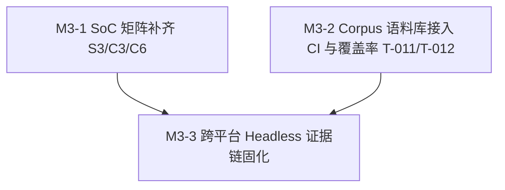

# ESP-IDF 仿真拦截层实施计划 M3：SoC 矩阵扩展与自动化测试体系

> 📋 **计划状态声明**：
> 本计划为 ESP-IDF 仿真拦截层派生子计划（Milestone 3）。
> **继承总纲**：[`PLAN-20260922-ESP-IDF-SIM-MASTER`](./2026-09-22-esp-idf-simulation-interception-master-plan.md) (v3.3)
> **当前状态**：📋 待开始（骨架占位，M2 验收完成后展开详细代码步骤）
> 🎯 **计划版本**：v1.0（2026-09-23）

---

## 1. 元数据表（🔴 必选）

| 字段 | 内容 |
|:---|:---|
| **计划编号** | `PLAN-20260926-ESP-IDF-SIM-M3` |
| **创建日期** | 2026-09-23 |
| **目标平台/SoC** | `wasm32-unknown-emscripten` / `host` (x86_64, Windows/Linux)；矩阵 SoC：`esp32`, `esp32s3`, `esp32c3`, `esp32c6` |
| **工具链/SDK版本**| `ESP-IDF v5.1.3 LTS` ~ `v6.1+` |
| **计划状态** | 📋 待开始（继承总纲，待 M2 闭环后展开） |
| **优先级** | 🔴 P0（交付收官与 CI 质量门禁） |
| **计划版本** | `v1.0` |
| **关联技术设计** | [`docs/zh/tech-designs/core/pal-i2c-v6-compatibility.md`](../../zh/tech-designs/core/pal-i2c-v6-compatibility.md) |
| **关联设计规范** | [`docs/zh/design/04-wasm-simulation/00-README.md`](../../zh/design/04-wasm-simulation/00-README.md)、[`02-wink-micro-os/`](../../zh/design/02-wink-micro-os/README.md) |
| **关联 ADR** | ADR-0080（外部 lint pack）、ADR-0083/0084（开源许可合规）、ADR-0085（caps 双 SSOT） |
| **目标里程碑** | M3（SoC 矩阵扩展、Corpus 自动化、CI 接线与收官验收） |
| **前置依赖计划** | [`./2026-09-25-esp-idf-sim-m2-bus-plan.md`](./2026-09-25-esp-idf-sim-m2-bus-plan.md)（M2 必须 100% DoD 闭环） |
| **计划负责人** | 仿真拦截专项小组 |
| **主要依赖技能** | `embedded-best-practice` |

---

## 2. 背景与目标（继承自总纲 §3.3 / §5.2 / §6）

### 2.1 问题陈述
ESP-IDF 覆盖多款架构与引脚差异巨大的芯片系列（经典 Xtensa 双核 ESP32、LX7 双核 ESP32-S3、RISC-V 单核 ESP32-C3 / C6）。
为了彻底消除不同芯片的引脚越界和能力不一致隐患，M3 必须全面铺开 SoC 能力矩阵，并在 CI 中建立全自动化构建、语料编译与覆盖率门禁。

### 2.2 核心设计与契约（总纲 v3.3 锁定）
1. **SoC 能力矩阵补齐**：扩展 `chips/esp32s3`、`chips/esp32c3`、`chips/esp32c6` 的 `soc_caps.h` 与 `gpio_num.h`，严格遵循 ADR-0085 裁决。
2. **Fail-Loud 引脚校验**：门面以芯片原生 `SOC_*` 宏与引脚掩码为唯一判据，越界 100% 拦截并返回 `ESP_ERR_INVALID_ARG`。
3. **Corpus 语料 CI 全自动化**：Tier-A 全部官方示例原文零修改编译闭环，接入 GitHub Actions CI 矩阵。
4. **覆盖率与 nightly IDF 版本接线（T-011 / T-012）**：接线 gcov/lcov，达成核心门面覆盖率 ≥85%；明确 nightly 镜像与双版本矩阵。
5. **Headless 跨平台证据链固化（T-008）**：固化 PowerShell / Bash 脚本，产出确定性仿真轨迹哈希。

### 2.3 成功指标（DoD 出口）
- ✅ ESP32-C3 越界引脚（如 GPIO 23+）在编译/运行时 100% Fail-Loud 拦截。
- ✅ Tier-A 官方语料 100% 通过 CI 门禁（`ctest -R esp_idf_corpus` 全绿）。
- ✅ 许可门禁 `check_license_map.py` 与外部 lint pack 100% 通过。
- ✅ 产出覆盖率报告且 `test/core/` 覆盖率 ≥85%。

---

## 3. 架构红线继承（总纲 §8）

本子计划严格继承总纲 7 条架构红线：
1. 🚨 **C-ABI 与纯 C 实现原则**：标准 C99，严禁 C++ 运行时/异常。
2. 🚨 **严禁侵入式修改 PAL / DAL**：只依赖 `pal/include`（HAL/OSAL）既有能力。
3. 🚨 **严格遵守 ADR-0065**：门面严禁调用 `pal_resource_claim()`。
4. 🚨 **零运行期堆分配**：静态对象池，运行期 0 裸 malloc。
5. 🚨 **PWM 定点红线（ADR-0066）**：全定点整数运算，严禁浮点 duty。
6. 🚨 **合约诚实（ADR-0012）**：语义降级与功能性差异必须如实登记。
7. 🚨 **开源许可合规（ADR-0083/0084）**：`src/include` = LGPL-3.0-only，`test/` = GPL-3.0-only。

---

## 4. 里程碑任务分解概览

| 任务 ID | 任务标题 | 核心工作内容 | 预估工时 |
|:---|:---|:---|:---|
| **Task M3-1** | SoC 硬件能力矩阵扩展 (S3/C3/C6) | `chips/{esp32s3,esp32c3,esp32c6}`、SoC 引脚掩码差异化测试、Fail-Loud 拦截断言 | 12 h |
| **Task M3-2** | Corpus 语料 CI 全集成与覆盖率接线 | `test/CMakeLists.txt` 全量语料注册、CI 工作流接线、lcov 报告产出、nightly 对齐 | 14 h |
| **Task M3-3** | 跨平台 Headless 证据链与收官验收 | 跨平台回放脚本固化、L0~L4 全量验收审查、架构师签署与总纲结项 | 10 h |

---

## 5. 待办声明

> 📌 **展开条件**：M2 计划（`2026-09-25-esp-idf-sim-m2-bus-plan.md`）通过 L0~L4 验收准出后，本计划将补充第 6 章详细任务执行步骤、精确代码片段、测试用例清单与回滚方案。
