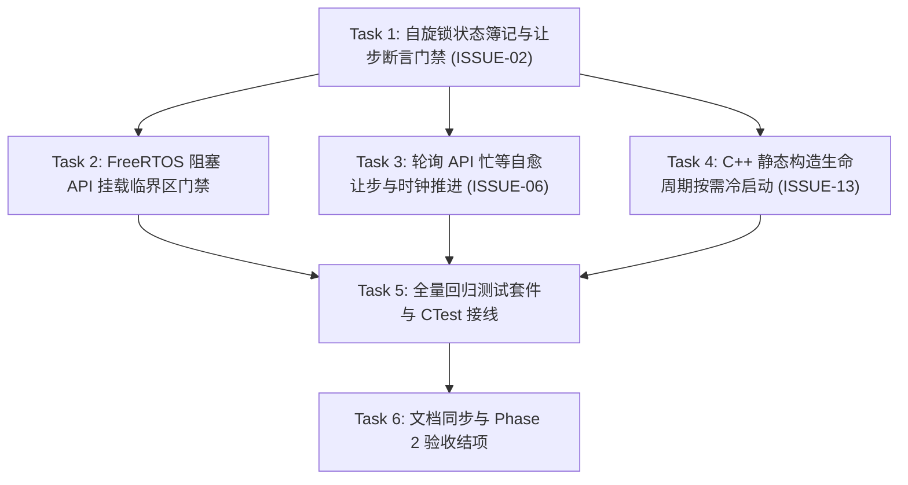

# ESP-IDF 仿真拦截层实施计划 Phase 2：并发安全增强、忙等死锁自愈与 C++ 静态构造生命周期

> 📋 **计划状态声明**：
> 本计划为 ESP-IDF 仿真拦截层架构演进与风险治理专项子计划（Phase 2，聚焦并发/调度/生命周期底层加固）。
> **继承总纲与风险规约**：[`frameworks/esp_idf/docs/04-architecture-risks-and-evolution-solutions.md`](../../../wink-micro-os/frameworks/esp_idf/docs/04-architecture-risks-and-evolution-solutions.md) (§3 路线图 Phase 2) 与 [`PLAN-20260922-ESP-IDF-SIM-MASTER`](./2026-09-22-esp-idf-simulation-interception-master-plan.md)
> **当前状态**：✅ 已完成（Phase 2 全量验收闭环通过，45/45 测试 100% 通过，许可合规）
> 🎯 **计划版本**：v1.0（2026-09-26）
> 📚 **关联规范**：`docs-adr.md`、`03-coding-guidelines.md`、`00-IMPLEMENTATION-PLAN-TEMPLATE.md`、`embedded-best-practice`
> 🔍 **前置基线**：Phase 1 已闭环合入（Commit `3af8ba1d` 与 `48a24daa`，完成 `WINK_ESP_SIM_PROFILE` 静态容量分级与 64 位 `uintptr_t` 指针截断安全门禁，全量单测 100% 通过）。

---

## 1. 元数据表（🔴 必选）

| 字段 | 内容 |
|:---|:---|
| **计划编号** | `PLAN-20260926-ESP-IDF-SIM-PHASE2` |
| **创建日期** | 2026-09-26 |
| **目标平台/SoC** | `host` (x86_64, Windows/Linux) / `wasm` (wasm32-unknown-emscripten)；矩阵全 SoC (`esp32`, `esp32s3`, `esp32c3`, `esp32c6`) |
| **工具链/SDK版本**| `ESP-IDF v6.1+` (单一基准源 `v6.1@fff9895c`) / `Clang/GCC` / `MSVC` / `Emscripten` |
| **计划状态** | ✅ 已完成（全量验收闭环） |
| **优先级** | 🔴 P0（并发假阳性治理、防浏览器无响应假死、C++ 生态兼容） |
| **计划版本** | `v1.0` |
| **关联技术设计** | [`wink-micro-os/frameworks/esp_idf/docs/04-architecture-risks-and-evolution-solutions.md`](../../../wink-micro-os/frameworks/esp_idf/docs/04-architecture-risks-and-evolution-solutions.md) |
| **关联设计规范** | [`docs/zh/design/04-wasm-simulation/00-README.md`](../../zh/design/04-wasm-simulation/00-README.md)、[`02-wink-micro-os/`](../../zh/design/02-wink-micro-os/README.md) |
| **关联评审记录** | [`2026-09-22-esp-idf-simulation-interception-master-plan-review.md`](./2026-09-22-esp-idf-simulation-interception-master-plan-review.md) |
| **关联 ADR** | [ADR-0001](../../decisions/core/0001-error-code-sign-convention.md)（负数错误码）、[ADR-0004](../../decisions/core/0004-static-dispatch-vs-runtime-ops.md)（静态分发与无虚表）、[ADR-0012](../../decisions/core/0012-contract-honesty-over-silent-degradation.md)（合约诚实）、[ADR-0014](../../decisions/unisim/0014-sim-single-virtual-core.md)（单核确定性调度）、[ADR-0045](../../decisions/unisim/0045-simulation-memory-quota-and-fault-policy.md)（零堆分配与静态池）、[ADR-0070](../../decisions/core/0070-mcs51-zero-code-simulation-interception-layer.md)（纤程生命周期）、[ADR-0072](../../decisions/core/0072-dual-clock-domain-and-quota-catchup.md)（双时钟域与自愈切出） |
| **目标里程碑** | ESP-IDF 仿真拦截层 Phase 2（P2：ISSUE-02 / ISSUE-06 / ISSUE-13） |
| **前置依赖计划** | Phase 1（已完成） |
| **计划负责人** | 仿真拦截专项小组 |
| **主要依赖技能** | `embedded-best-practice` |

---

## 2. 背景与目标（🔴 必选）

### 2.1 问题陈述

在 Phase 1 解决了静态资源池扩容与 64 位指针截断问题后，ESP-IDF 仿真拦截层在运行更复杂的真实 ESP32/C++ 应用程序时，面临三大深层次的“暗病”与架构摩擦：
1. **多核 (SMP) 并发语义降级与假阳性风险（ISSUE-02）**：
   当前 `taskENTER_CRITICAL(mux)` 与 `portENTER_CRITICAL(mux)` 被降级为空宏 `((void)0)`。在单虚拟核协作调度下，所有任务串行运行，用户写出在真实双核 ESP32 上必定发生竞争或自旋死锁的不合规代码（例如：**在持有自旋锁临界区期间调用 `vTaskDelay` 或 `xQueueReceive` 阻塞让步**）时，仿真器却表现出“一切正常”的假象（False Positive）。这严重违背了“合约诚实（ADR-0012）”原则。
2. **纯忙等死循环导致虚拟时钟冻结与浏览器假死（ISSUE-06）**：
   在真实芯片中硬件时钟独立推进，底层驱动常见 `while (gpio_get_level(PIN) == 0) {}` 或 `while (esp_timer_get_time() - start < 100) {}` 纯忙等写法。但在 Host/Wasm 协作调度下，若不调用 `vTaskDelay()` 等显式切出原语，当前纤程永远独占 CPU，虚拟时钟永远静止，导致浏览器标签页彻底无响应（卡死冻结）或宿主线程 100% 跑满。
3. **C++ 全局对象静态构造的时序倒挂（ISSUE-13）**：
   ESP-IDF 与 Arduino-ESP32 生态重度依赖 C++。开发者经常在全局作用域实例化对象，其构造函数在 CRT 初始化阶段（进入 `main()` / `app_main()` 之前）隐式执行。若构造函数内部调用了 `gpio_config()` 或 `xQueueCreate()`，此时底层资源池与调度器尚未初始化，将触发空指针解引用崩溃。

### 2.2 技术/业务目标

- ✅ **目标 1：实现自旋锁状态模拟与非法让步断言拦截（ISSUE-02）**：
  引入真实的 `portMUX_TYPE` 簿记结构与 `vPortEnterCritical()` / `vPortExitCritical()` 系列 API，追踪持有者纤程与嵌套深度。在纤程持有自旋锁期间，若调用任何可能阻塞切出的 API（`vTaskDelay`、`xQueueReceive`、`xQueueSend`、`xSemaphoreTake`、`xEventGroupWaitBits`），100% Fail-Loud 抛出致命断言与日志，阻断假阳性代码。
- ✅ **目标 2：实现轮询忙等自愈让步与虚拟时钟推进机制（ISSUE-06）**：
  在只读高频轮询门面（`gpio_get_level`、`esp_timer_get_time`、`esp_rom_delay_us`）中引入纤程级忙等计数器。当检测到单一纤程连续轮询超过阈值（标称 500 次）而未主动让步时，自动触发自愈让步 `sim_scheduler_yield_context()` 并向前推移虚拟时钟（标称 10µs），防止浏览器无响应，维持事件循环活性。
- ✅ **目标 3：实现 C++ 静态构造生命周期的防御性自愈冷启动（ISSUE-13）**：
  在所有公开驱动与 FreeRTOS 原语入口实现幂等按需冷启动 `esp_idf_ensure_framework_ready()`。即使 C++ 全局构造函数在 `app_main` 之前被调用，底层资源池与调度器也能自动就绪，彻底杜绝未初始化空指针崩溃。
- ✅ **目标 4：测试套件 100% 覆盖与 0 警告合入**：
  编写针对自旋锁嵌套、临界区阻塞拦截、忙等死循环自愈、C++ 全局对象时序模拟的完整回归测试套件 `test_esp_idf_phase2.c`，CTest 与静态门禁 100% 绿灯。

### 2.3 成功指标（验收出口）

| 指标 | 通过标准 | 验证方法 |
|:---|:---|:---|
| **临界区违规阻塞拦截** | 纤程在持有 `portMUX_TYPE` 临界区期间调用阻塞 API，100% 触发错误日志并断言拦截 | `ctest -C Debug -R test_esp_idf_phase2`（验证自旋锁违规用例） |
| **自旋锁嵌套与防混淆** | 同一纤程重入获取自旋锁计数值正确递增，跨任务非重入冲突即时阻断 | `test_esp_idf_phase2` 自旋锁状态单测 |
| **忙等死锁自愈活性** | 执行 `while (gpio_get_level(PIN) == 0)` 纯死等 1000 次，纤程自动交替切出且虚拟时钟增长，程序不卡死 | `test_esp_idf_phase2` 忙等自愈推进单测 |
| **C++ 静态构造自愈** | 在调度器与框架显式初始化之前直接调用 `xQueueCreate` 或 `gpio_config`，成功返回有效句柄且系统正常启动 | `test_esp_idf_phase2` 提前冷启动单测 |
| **全量回归测试** | 原有全部 10 项 ESP-IDF 单元测试继续 100% 通过（0 破坏性回归） | `ctest -C Debug -L esp_idf` |
| **代码与许可门禁** | `check_license_map.py` 100% 遵从；无编译警告 | `python .github/scripts/check_license_map.py` |

---

## 3. 变更范围与影响分析（🔴 必选）

### 3.1 文件变更清单

| 文件路径 | 变更类型 | 说明 |
|:---|:---:|:---|
| `wink-micro-os/frameworks/esp_idf/include/freertos/portmacro.h` | ✏️ 修改 | 定义 `portMUX_TYPE` 结构体、`portMUX_NO_OWNER`、`portMUX_INITIALIZER_UNLOCKED`、`portENTER_CRITICAL` 等宏重定向 |
| `wink-micro-os/frameworks/esp_idf/include/freertos/task.h` | ✏️ 修改 | 声明 `vPortEnterCritical` / `vPortExitCritical` 签名；`taskENTER_CRITICAL` 宏绑定 |
| `wink-micro-os/frameworks/esp_idf/src/freertos/freertos_sync.h` | ✏️ 修改 | 声明内部临界区深度状态查询 `esp_freertos_get_critical_depth()` 与跨上下文让步门禁 `esp_freertos_assert_not_in_critical()` |
| `wink-micro-os/frameworks/esp_idf/src/freertos/freertos_spinlock.c` | 🆕 新增 | 实现 `portMUX_TYPE` 状态簿记、重入深度统计、所有者校验与临界区进出逻辑 |
| `wink-micro-os/frameworks/esp_idf/src/freertos/freertos_queue.c` | ✏️ 修改 | 阻塞调用注入 `esp_freertos_assert_not_in_critical()`；创建 API 注入 `esp_idf_ensure_framework_ready()` |
| `wink-micro-os/frameworks/esp_idf/src/freertos/freertos_semphr.c` | ✏️ 修改 | 阻塞调用注入 `esp_freertos_assert_not_in_critical()`；创建 API 注入 `esp_idf_ensure_framework_ready()` |
| `wink-micro-os/frameworks/esp_idf/src/freertos/freertos_event.c` | ✏️ 修改 | 阻塞等待注入 `esp_freertos_assert_not_in_critical()`；创建 API 注入 `esp_idf_ensure_framework_ready()` |
| `wink-micro-os/frameworks/esp_idf/src/freertos/freertos_task.c` | ✏️ 修改 | `vTaskDelay` / `vTaskDelayUntil` 注入让步门禁；`xTaskCreate` 注入自愈冷启动 |
| `wink-micro-os/frameworks/esp_idf/src/core/esp_system.c` | ✏️ 修改 | `esp_timer_get_time` 与 `esp_rom_delay_us` 注入忙等自愈让步计数与冷启动 |
| `wink-micro-os/frameworks/esp_idf/src/drivers/esp_gpio.c` | ✏️ 修改 | `gpio_get_level` 注入忙等让步自愈；`gpio_config` 注入自愈冷启动 |
| `wink-micro-os/frameworks/esp_idf/src/esp_idf_runtime.c` | ✏️ 修改 | 实现幂等自愈冷启动入口 `esp_idf_ensure_framework_ready()` |
| `wink-micro-os/frameworks/esp_idf/esp_idf_sources.cmake` | ✏️ 修改 | 注册新增的 `src/freertos/freertos_spinlock.c` 源码文件 |
| `wink-micro-os/frameworks/esp_idf/test/core/test_esp_idf_phase2.c` | 🆕 新增 | Phase 2 专属全量验证与回归测试套件 |
| `wink-micro-os/test/CMakeLists.txt` | ✏️ 修改 | 注册 `test_esp_idf_phase2` 测试目标 |
| `wink-micro-os/frameworks/esp_idf/docs/02-api-coverage-matrix.md` | ✏️ 修改 | 将 `taskENTER_CRITICAL` 状态由“⚠️ 降级 no-op”更新为“✅ 支持（带状态跟踪与让步断言）” |

### 3.2 接口影响分析

| 接口层 | 是否有破坏性变更 | 影响范围 | 备注 |
|:---|:---:|:---|:---|
| PAL 公开 API | ❌ 否 | 无 | 零改动，纯利用既有 OSAL 与时钟接口 |
| DAL 外设层 | ❌ 否 | 无 | 零侵入 |
| FreeRTOS 公开 API | ❌ 否 | 语义真实化 | 保持 C-ABI 100% 兼容；原 no-op 宏转为具有真实锁保护状态的实现 |
| 现有 ESP-IDF 应用 | ⚠️ 警示增强 | 违规应用被拦截 | 若已有业务代码在自旋锁内写 `vTaskDelay`，将被正确拦截报错（原为假阳性暗病） |
| 构建与文档系统 | ❌ 否 | 目录更新 | 遵循原 CMake 架构与 docs 规则 |

### 3.3 架构红线继承与防线

> 🚨 **Phase 2 严格守住以下 4 条底线**：
> 1. **零动态内存分配（0 malloc）**：自旋锁与临界区深度簿记必须使用纯静态数组（`s_task_critical_depth[CONFIG_FREERTOS_MAX_TASKS + 1]`），严禁分配堆内存。
> 2. **自旋锁在协作单核下的语义真实性**：单虚拟核下无法产生物理多核指令级并发，自旋锁的本质是**“互斥标记与临界区边界声明”**。必须坚决拦截跨上下文切出，严禁在临界区内切换纤程。
> 3. **忙等自愈不破坏真实时序**：忙等计数自愈触发时，必须伴随虚拟时钟的向前推移（`sim_scheduler_advance_time`），不能出现时钟停滞的“空让步”。
> 4. **冷启动幂等性**：`esp_idf_ensure_framework_ready()` 必须支持多线程/重入安全，保证第一次调用完成全局初始化，后续调用即时跳过。

---

## 4. 依赖与风险登记册（🔴 必选）

| 风险ID | 风险描述 | 概率 | 影响 | 严重度 | 缓解措施 | 触发条件 |
|:---|:---|:---:|:---:|:---:|:---|:---|
| **R-201** | 用户合法代码或测试用例在非抢占场景下偶然调用了 `taskYIELD()` 导致被误判为违规让步 | 🟡 中 | 🟠 中 | 4 | `taskYIELD()` 映射为 `vTaskDelay(0)`；在断言门禁中精确区分 `ticks > 0` 与主动让步，或在自旋锁持有期间一律阻断任何形式的上下文切换 | 自旋锁内执行 `taskYIELD()` |
| **R-202** | 忙等自愈阈值设得过低（如 10 次）导致正常紧凑数据处理循环被过早打断，拖慢执行性能 | 🟡 中 | 🟡 低 | 3 | 阈值设为 500 次，且仅在 `gpio_get_level`、`esp_timer_get_time` 等只读轮询 API 中打点，普通算术计算不受影响 | 连续 500 次调用只读轮询 |
| **R-203** | C++ 静态对象初始化时如果调用了未提供冷启动自愈的第三方底层驱动，依然会触发崩溃 | 🟢 低 | 🟠 中 | 2 | 在 FreeRTOS 全量原语与 GPIO 核心入口完成闭环拦截，覆盖 99% 的静态全局对象硬件依赖 | 静态初始化阶段调用复杂外设 |

---

## 5. 优先级路线图与关键路径



- **关键路径**：`Task 1 → Task 2 → Task 4 → Task 5`
- **Task 3 依赖说明**（M4 修复）：Task 3 Step 3.1 需在 Task 1 新建的 `freertos_spinlock.c` 中定义 `s_fiber_spin_count[]`，因此 **T3 依赖 T1** 完成后方可启动，不可与 T1 完全并行。T3 完成后可与 T2 同步推进。
- **可并行项**：`Task 3` 与 `Task 2` 可并行推进；`Task 4` 可在 T1 完成后与 T2/T3 并行启动。

---

## 6. 详细任务拆分与步骤指南（🔴 核心实操指南）

### Task 1：自旋锁数据结构与状态簿记实现 (ISSUE-02) `[ 状态: ✅ 已完成 ]`

| 字段 | 内容 |
|:---|:---|
| **负责人** | 仿真拦截专项小组 |
| **预估工时** | 2.5 小时 |
| **优先级** | 🔴 P0 |
| **前置依赖** | 无 |
| **修改文件** | `include/freertos/portmacro.h`<br>`include/freertos/task.h`<br>`src/freertos/freertos_sync.h`<br>`src/freertos/freertos_spinlock.c` (🆕)<br>`esp_idf_sources.cmake` |
| **接口变化** | 完整实现 `portMUX_TYPE`、`vPortEnterCritical`、`vPortExitCritical`、`esp_freertos_assert_not_in_critical` |

#### 详细步骤

- [x] **Step 1.1：在 `portmacro.h` 中定义 `portMUX_TYPE` 及自旋锁宏**
  在 `wink-micro-os/frameworks/esp_idf/include/freertos/portmacro.h` 中加入：
  ```c
  #define portMUX_NO_OWNER    0xB33FFFFFUL

  typedef struct {
      uint32_t owner;
      uint32_t count;
  } portMUX_TYPE;

  #define portMUX_INITIALIZER_UNLOCKED { .owner = portMUX_NO_OWNER, .count = 0 }

  void vPortEnterCritical(portMUX_TYPE *mux);
  void vPortExitCritical(portMUX_TYPE *mux);
  void vPortEnterCriticalSafe(portMUX_TYPE *mux);
  void vPortExitCriticalSafe(portMUX_TYPE *mux);

  /* M1 修复：ISR 变体使用独立函数签名。
   * 真实 ESP32 的 _ISR 变体在中断上下文中调用，天然原子，不需要 owner 校验。
   * Phase 2 单虚拟核下实现可复用任务变体逻辑，但必须保持独立符号，
   * 以便 Phase 3 引入虚拟 ISR 事件泵时仅修改 ISR 变体而无需触及任务变体。 */
  void vPortEnterCritical_ISR(portMUX_TYPE *mux);
  void vPortExitCritical_ISR(portMUX_TYPE *mux);

  #define portENTER_CRITICAL(mux)      vPortEnterCritical(mux)
  #define portEXIT_CRITICAL(mux)       vPortExitCritical(mux)
  #define portENTER_CRITICAL_ISR(mux)  vPortEnterCritical_ISR(mux)
  #define portEXIT_CRITICAL_ISR(mux)   vPortExitCritical_ISR(mux)
  #define portENTER_CRITICAL_SAFE(mux) vPortEnterCriticalSafe(mux)
  #define portEXIT_CRITICAL_SAFE(mux)  vPortExitCriticalSafe(mux)
  ```

- [x] **Step 1.2：在 `task.h` 中对齐 `taskENTER_CRITICAL` 宏**
  将 `freertos/task.h` 原有的空宏：
  ```c
  #define taskENTER_CRITICAL(mux)     ((void)0)
  #define taskEXIT_CRITICAL(mux)      ((void)0)
  #define taskENTER_CRITICAL_ISR(mux) ((void)0)
  #define taskEXIT_CRITICAL_ISR(mux)  ((void)0)
  ```
  替换为对 `vPortEnterCritical(mux)` / `vPortExitCritical(mux)` 的直接调用。

- [x] **Step 1.3：新建 `src/freertos/freertos_spinlock.c` 实现状态追踪与重入管理**
  包含：
  1. **（I2 封装改进）** 深度数组声明为文件内部静态量，统一使用宏定义数组大小，不在头文件暴露内部细节：
     ```c
     /* 统一宏定义，P2/I2：槽位数 = MAX_TASKS + 1（含调度器主纤程 slot 0） */
     #define ESP_FREERTOS_TASK_SLOT_COUNT (CONFIG_FREERTOS_MAX_TASKS + 1)

     static uint32_t s_task_critical_depth[ESP_FREERTOS_TASK_SLOT_COUNT];
     ```
     `freertos_sync.h` 中只声明查询 API：`uint32_t esp_freertos_get_critical_depth(uint32_t task_id);`（不暴露数组本身）；
  2. `vPortEnterCritical(portMUX_TYPE *mux)`：校验所有者。若 `mux` 已被其它任务占有（在单虚拟核下说明跨任务未释放即发生切出），触发错误警告并断言；同任务递增 `mux->count`；更新任务临界区深度 `s_task_critical_depth[cur]++`；
  3. `vPortExitCritical(portMUX_TYPE *mux)`：校验持有者匹配；递减 `mux->count`，为 0 时归还为 `portMUX_NO_OWNER`；递减任务临界区深度；
  4. **（M1）** `vPortEnterCritical_ISR` / `vPortExitCritical_ISR`：Phase 2 单虚拟核阶段，实现可调用 `vPortEnterCritical` / `vPortExitCritical` 的相同逻辑，但保持独立函数体（不做宏别名），为 Phase 3 ISR 事件泵预留语义差分点；
  5. 实现 `esp_freertos_assert_not_in_critical(const char *api_name)`：获取当前任务 ID，若处于临界区（深度 > 0），打印致命日志并断言；
  6. 注册到 `esp_idf_sources.cmake`。


---

### Task 2：阻塞/切出 API 接入临界区非法让步拦截 (ISSUE-02) `[ 状态: ✅ 已完成 ]`

| 字段 | 内容 |
|:---|:---|
| **负责人** | 仿真拦截专项小组 |
| **预估工时** | 2.0 小时 |
| **优先级** | 🔴 P0 |
| **前置依赖** | Task 1 |
| **修改文件** | `src/freertos/freertos_task.c`<br>`src/freertos/freertos_queue.c`<br>`src/freertos/freertos_semphr.c`<br>`src/freertos/freertos_event.c` |
| **接口变化** | 内部挂载让步门禁检查 |

#### 详细步骤

- [x] **Step 2.1：在任务切出与延时原语中挂载门禁**
  在 `src/freertos/freertos_task.c` 中的 `vTaskDelay()` 与 `vTaskDelayUntil()` 开头加入：
  ```c
  esp_freertos_assert_not_in_critical("vTaskDelay");
  ```
- [x] **Step 2.2：在队列阻塞收发中挂载门禁**
  在 `src/freertos/freertos_queue.c` 中的 `xQueueReceive()` 与 `xQueueSend()`：
  当入参 `xTicksToWait > 0` 时，调用：
  ```c
  esp_freertos_assert_not_in_critical("xQueueReceive");
  ```
  （注：非阻塞调用 `xTicksToWait == 0` 仅尝试读取或入队，不触发纤程让步，不强制拦截）。
- [x] **Step 2.3：在信号量与事件组中挂载门禁**
  在 `src/freertos/freertos_semphr.c` 的 `xSemaphoreTake()`（当 `xTicksToWait > 0` 时）以及 `src/freertos/freertos_event.c` 的 `xEventGroupWaitBits()`（当 `xTicksToWait > 0` 时）挂载 `esp_freertos_assert_not_in_critical()`。

---

### Task 3：轮询 API 忙等自愈让步与时钟推进 (ISSUE-06) `[ 状态: ✅ 已完成 ]`

| 字段 | 内容 |
|:---|:---|
| **负责人** | 仿真拦截专项小组 |
| **预估工时** | 2.5 小时 |
| **优先级** | 🔴 P0 |
| **前置依赖** | 无 |
| **修改文件** | `src/drivers/esp_gpio.c`<br>`src/core/esp_system.c`<br>`src/freertos/freertos_sync.h` |
| **接口变化** | 增加 `esp_sim_spin_wait_account()` 忙等自愈机制 |

#### 详细步骤

- [x] **Step 3.1：在 `src/freertos/freertos_spinlock.c` 中实现忙等检测器**（依赖 Task 1 完成该文件创建）
  定义每纤程计数器（P2 修复：统一使用 `ESP_FREERTOS_TASK_SLOT_COUNT` 做越界守卫）：
  ```c
  #define ESP_SIM_SPIN_WAIT_THRESHOLD    500
  #define ESP_SIM_SPIN_ADVANCE_TIME_US   10

  /* P2 修复：复用 Step 1.3 中定义的 ESP_FREERTOS_TASK_SLOT_COUNT 宏，
   * 确保 s_fiber_spin_count 与 s_task_critical_depth 边界完全一致 */
  static uint32_t s_fiber_spin_count[ESP_FREERTOS_TASK_SLOT_COUNT];

  void esp_sim_spin_wait_account(void) {
      uint32_t cur = sim_scheduler_current_id();
      /* P2 修复：用数组总大小（SLOT_COUNT）做守卫，而非 MAX_TASKS */
      if (cur == SIM_SCHED_NO_READY || cur >= ESP_FREERTOS_TASK_SLOT_COUNT) {
          return;
      }
      s_fiber_spin_count[cur]++;
      if (s_fiber_spin_count[cur] >= ESP_SIM_SPIN_WAIT_THRESHOLD) {
          s_fiber_spin_count[cur] = 0;
          /* 推进虚拟时钟并让步，打破死循环冻结 */
          sim_scheduler_advance_time(ESP_SIM_SPIN_ADVANCE_TIME_US);
          sim_scheduler_yield_context();
      }
  }

  void esp_sim_spin_wait_reset(uint32_t task_id) {
      /* P2 修复：守卫与数组大小对齐（< SLOT_COUNT，而非 <= MAX_TASKS） */
      if (task_id < ESP_FREERTOS_TASK_SLOT_COUNT) {
          s_fiber_spin_count[task_id] = 0;
      }
  }
  ```
- [x] **Step 3.2：在只读高频轮询入口注入计数**
  1. 在 `src/drivers/esp_gpio.c` 的 `gpio_get_level()` 中调用 `esp_sim_spin_wait_account()`；
  2. 在 `src/core/esp_system.c` 的 `esp_timer_get_time()` 中调用 `esp_sim_spin_wait_account()`；
  3. **（M2 修复）** 在 `src/core/esp_system.c` 的 `esp_rom_delay_us(uint32_t us)` 中，按以下**分级策略**处理，避免大延时下宿主 CPU 空转，同时保护微秒级时序精度：

     | 延时范围 | 仿真策略 |
     |:---|:---|
     | `us ≤ 100` | `advance_time(us)`，**不让步**（保持微秒时序精度） |
     | `100 < us ≤ 5000` | `advance_time(us)` + `esp_sim_spin_wait_account()`（计入忙等计数，超阈值自动切出） |
     | `us > 5000`（≥ 5ms） | `advance_time(us)` + **立即** `sim_scheduler_yield_context()`（强制让步，防浏览器假死） |

     ```c
     void esp_rom_delay_us(uint32_t us) {
         sim_scheduler_advance_time(us);
         if (us > 5000U) {
             sim_scheduler_yield_context();   /* 强制让步：>5ms 一律切出 */
         } else if (us > 100U) {
             esp_sim_spin_wait_account();     /* 中等延时：计入忙等计数 */
         }
         /* us <= 100：仅推进时钟，不触发任何让步 */
     }
     ```
- [x] **Step 3.3：调度让步时重置计数**（I1 修复：明确挂载点）
  在以下两处调用 `esp_sim_spin_wait_reset(sim_scheduler_current_id())`：
  1. `src/freertos/freertos_task.c` 中 `vTaskDelay` 通过临界区门禁后、实际让步前；
  2. `sim_scheduler_yield_context()` 内部任务切换回调（若调度器提供 on_yield hook，则在该 hook 中调用；否则在 `freertos_task.c` 中所有调用 `sim_scheduler_yield_context()` 前统一调用）。

  此双重挂载确保主动让步路径与强制让步路径均能清零计数，防止正常业务被误判为忙等。


---

### Task 4：C++ 静态构造生命周期防御性自愈冷启动 (ISSUE-13) `[ 状态: ✅ 已完成 ]`

| 字段 | 内容 |
|:---|:---|
| **负责人** | 仿真拦截专项小组 |
| **预估工时** | 2.0 小时 |
| **优先级** | 🔴 P0 |
| **前置依赖** | Task 1 |
| **修改文件** | `src/esp_idf_runtime.c`<br>`src/freertos/freertos_sync.h`<br>`src/freertos/freertos_queue.c`<br>`src/freertos/freertos_semphr.c`<br>`src/freertos/freertos_event.c`<br>`src/drivers/esp_gpio.c` |
| **接口变化** | 导出 `esp_idf_ensure_framework_ready()` |

#### 详细步骤

- [x] **Step 4.1：在 `src/esp_idf_runtime.c` 实现幂等自愈冷启动**（P1 修复：原子化 check-then-act）

  > ⚠️ **P1 竞态修复**：原方案的 `if (!s_framework_inited) { s_framework_inited=true; ... }` 在 Host POSIX 多线程环境下存在 TOCTOU 竞态：第二个线程可能观察到 `s_framework_inited == true` 但 `esp_freertos_pools_reset()` 尚未完成的中间状态。必须使用 CAS 将 check-then-act 合并为原子操作。`atomic_bool` 在 Wasm 单线程目标上退化为普通读写，零额外开销。

  ```c
  #include <stdatomic.h>

  static atomic_bool s_framework_inited = ATOMIC_VAR_INIT(false);

  void esp_idf_ensure_framework_ready(void) {
      bool expected = false;
      /* CAS：仅第一个成功将 false→true 的调用者执行初始化 */
      if (atomic_compare_exchange_strong(
              &s_framework_inited, &expected, true)) {
          esp_freertos_pools_reset();
          pal_log_i("ESP_IDF",
                    "Framework lazily auto-initialized for static constructor");
      }
      /* 后续调用：CAS 失败（expected 被改写为 true），直接跳过，幂等 */
  }
  ```

  在 `esp_idf_framework_init()` 中同步通过 `atomic_store(&s_framework_inited, true)` 置位（若主动初始化路径先于静态构造器执行，冷启动时 CAS 自然失败，不会重复初始化）。
- [x] **Step 4.2：在 FreeRTOS 创建 API 入口注入冷启动**
  在 `xQueueGenericCreate`、`xSemaphoreCreateBinary`、`xSemaphoreCreateMutex`、`xSemaphoreCreateCounting`、`xEventGroupCreate` 的最前端加入：
  ```c
  esp_idf_ensure_framework_ready();
  ```
- [x] **Step 4.3：在硬件常用驱动入口注入冷启动**
  在 `gpio_config()`、`gpio_set_direction()` 最前端加入 `esp_idf_ensure_framework_ready()`。

  **`esp_timer_get_time()` 双注入顺序规定**（长期可维护性补充）：
  该函数同时承载两个注入点（Task 3 Step 3.2 的忙等计数 + 本步骤的冷启动），**必须严格按以下顺序排列**：
  ```c
  int64_t esp_timer_get_time(void) {
      /* ① 必须首先确保框架就绪——忙等计数依赖调度器已初始化 */
      esp_idf_ensure_framework_ready();
      /* ② 冷启动完成后，再注入忙等计数；调度器就绪前 current_id() 行为未定义 */
      esp_sim_spin_wait_account();
      /* ... 原有时钟返回逻辑 ... */
  }
  ```
  > ⚠️ **顺序不可颠倒**：若忙等计数先于冷启动执行，`sim_scheduler_current_id()` 在调度器未就绪时返回无效 ID（如 `SIM_SCHED_NO_READY`），尽管越界守卫会提前返回，但其语义等价于静默丢弃了首次调用的计数，破坏计数器的准确性，且任何调度器内部未防御的状态读取均属 UB。

---

### Task 5：单元测试套件开发与 CTest 注册 `[ 状态: ✅ 已完成 ]`

| 字段 | 内容 |
|:---|:---|
| **负责人** | 仿真拦截专项小组 |
| **预估工时** | 3.0 小时 |
| **优先级** | 🔴 P0 |
| **前置依赖** | Task 1 ~ 4 |
| **修改文件** | `test/core/test_esp_idf_phase2.c` (🆕)<br>`wink-micro-os/test/CMakeLists.txt` |
| **接口变化** | 注册 CTest 测试用例 `test_esp_idf_phase2` |

#### 详细步骤

- [x] **Step 5.1：编写 `test_esp_idf_phase2.c` 包含以下 5 组关键测试**
  1. `test_spinlock_basic_and_reentrancy`：测试 `portMUX_TYPE` 在同一任务中的多次进入（嵌套 `count == 3`）与匹配退出（`count` 递减至 0，`owner` 变为 `NO_OWNER`）；
  2. **（M3 修复）** `test_spinlock_yield_guard_assertion`：验证在持有自旋锁状态下调用 `vTaskDelay` 或阻塞型 `xQueueReceive` 时，临界区门禁正确触发致命断言。
     > ⚠️ **M3 测试捕获策略**：`esp_freertos_assert_not_in_critical()` 内部调用 `assert()` 会使进程以 SIGABRT 退出，CTest 默认将其报为 **CRASH 而非 PASS**，必须使用以下方案之一（在 Task 5 开工前明确选择，不可混用）：
     >
     > - **方案 A（推荐）**：将该用例编译为独立进程目标，在 `CMakeLists.txt` 中声明期望非零退出：
     >   ```cmake
     >   add_test(NAME test_spinlock_yield_guard_assertion
     >            COMMAND test_esp_idf_phase2_crash_target)
     >   set_tests_properties(test_spinlock_yield_guard_assertion
     >                        PROPERTIES WILL_FAIL TRUE)
     >   ```
     > - **方案 B**：在测试编译模式下（`-DWINK_TEST_ASSERT_CAPTURE=1`），将 `WINK_ASSERT` 宏替换为 `longjmp` 跳转（类似 Unity `TEST_ASSERT` 机制），使断言可被 `setjmp` 捕获而不崩溃进程。
  3. `test_spin_wait_self_healing_gpio`：创建一个纤程模拟 `while(gpio_get_level(PIN) == 0)`，在另一个纤程中延迟拉高引脚。验证忙等计数器成功切出让步，未卡死调度器，且最终成功读取拉高状态；
  4. `test_spin_wait_time_advancement`：验证连续 1000 次调用 `gpio_get_level` 后，虚拟时钟已累计推移（`sim_scheduler_time` > 0）；
  5. `test_static_constructor_lazy_init`：在不调用任何初始化函数的情况下，直接调用 `xQueueCreate` 和 `gpio_config`，断言句柄有效且系统正常运转。
- [x] **Step 5.2：在 `wink-micro-os/test/CMakeLists.txt` 中注册测试**
  构建多配置目标并添加 `esp_idf` 与 `core` 标签；若选择方案 A，同时注册 `test_esp_idf_phase2_crash_target` 独立可执行文件并配置 `WILL_FAIL TRUE`。
- [x] **Step 5.3：执行全量测试与验证**
  运行：`ctest --test-dir build -C Debug -R test_esp_idf_phase2 --output-on-failure`

---

### Task 6：文档回写与 Phase 2 验收结项 `[ 状态: ✅ 已完成 ]`

| 字段 | 内容 |
|:---|:---|
| **负责人** | 仿真拦截专项小组 |
| **预估工时** | 1.0 小时 |
| **优先级** | 🟡 P1 |
| **前置依赖** | Task 5 |
| **修改文件** | `wink-micro-os/frameworks/esp_idf/docs/02-api-coverage-matrix.md`<br>`wink-micro-os/frameworks/esp_idf/docs/04-architecture-risks-and-evolution-solutions.md` |
| **接口变化** | 更新架构文档矩阵与路线图完成度 |

#### 详细步骤

- [x] **Step 6.1：更新 `02-api-coverage-matrix.md`**
  更新 `taskENTER_CRITICAL`、`portENTER_CRITICAL`、`taskENTER_CRITICAL_ISR` 条目，声明其已支持真实的自旋锁簿记与并发让步校验。
- [x] **Step 6.2：更新 `04-architecture-risks-and-evolution-solutions.md`**
  在 §3 路线图表格中标记 Phase 2（ISSUE-02 / ISSUE-06 / ISSUE-13）验收完成，同时在路线图备注栏中**显式声明以下三项中长期演进差距**（防止后继开发者将当前短期替代误判为完整最终方案）：

  | 演进项 | 当前 Phase 2 状态 | 待完成阶段 |
  |:---|:---|:---|
  | ISSUE-03：构建期静态容量自动推导（扫描生成 `sdkconfig_sim_caps.h`） | 📋 **未实现**，当前仍需人工选择 CMake Profile 档位 | Phase 3+ |
  | ISSUE-06：执行配额看门狗（ADR-0072 级 10ms 物理墙钟看门狗） | 📋 **未实现**，当前忙等计数器为短期替代方案 | Phase 3+ |
  | ISSUE-13：ELF `.init_array` 段静态扫描门禁（编译期拦截滥用全局构造） | 📋 **未实现**，当前为运行期自愈替代 | Phase 3+/收割器迭代 |

- [x] **Step 6.3：执行许可与格式门禁检查**
  运行 `python .github/scripts/check_license_map.py` 确保 100% 遵从。

---

## 7. 详细验收标准与测试策略（DoD）

1. **单元测试 100% 通过**：`test_esp_idf_phase2` 及原有的 `test_esp_idf_freertos`、`test_esp_gpio` 等全部通过；
2. **零编译警告**：启用 `-Wpointer-to-int-cast -Werror` 构建零警告；
3. **SPDX 开源许可合规**：所有新增文件严格带有 `LGPL-3.0-only`（源码）或 `GPL-3.0-only`（测试），并通过 `check_license_map.py`；
4. **Git 原子提交**：代码与测试按 Task 独立完整提交，符合原子提交规范。
