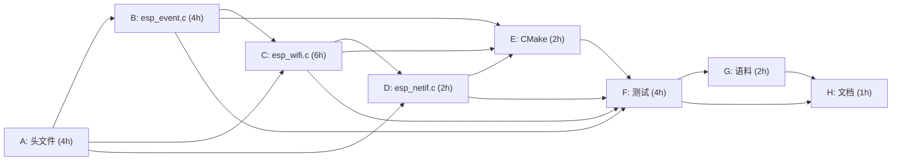

# ESP-IDF 仿真拦截层实施计划 M4-1：Wi-Fi 基础连接状态机与 esp_event 事件循环体系

> 📋 **计划状态声明**：本计划为 M4 大里程碑第一子任务（M4-1，Wi-Fi 无线连接语义仿真）。
> **继承路线图**：[PLAN-20260927-ESP-IDF-SIM-M4-CONNECTIVITY](file:///d:/workspaces/ai-coding/wink-ai/wink-ai-embedded/docs/implementation-plans/esp32/2026-09-27-esp-idf-sim-m4-wifi-ble-connectivity-roadmap.md) (v1.0)
> **当前状态**：✅ 已完成（v1.2 50/50 测试全绿与语料验收闭环）
> 🎯 **计划版本**：v1.2（2026-09-26，全量执行与验收闭环版）

---

## 1. 元数据表

| 字段 | 内容 |
|:---|:---|
| **计划编号** | PLAN-20260927-ESP-IDF-SIM-M4-1-WIFI |
| **创建日期** | 2026-09-26 |
| **目标平台** | host (x86_64/Windows/Linux) / wasm (wasm32-unknown-emscripten) |
| **SoC 矩阵** | esp32, esp32s3, esp32c3, esp32c6 |
| **计划状态** | ✅ 已完成（v1.2 全量验收闭环） |
| **计划版本** | v1.2 |
| **优先级** | P0（90% IoT 代码首步 esp_wifi_connect()）|
| **目标里程碑** | M4-1：Wi-Fi FSM + esp_event + esp_netif |
| **前置依赖** | Phase 3（48/48 全绿，已完成）|

---

## 2. 问题陈述

完成 M3/Phase3 后仍有三大致命仿真断层：

1. **Wi-Fi 初始化死循环**：约 90% IoT 示例首步调用 esp_wifi_init/connect，当前头文件以 WINK_SLA_ERROR 编译爆炸。
2. **esp_event 事件循环缺失**：Wi-Fi/BLE/USB 全部依赖 esp_event_handler_instance_register/esp_event_loop_create_default，当前完全无实现。
3. **esp_netif 网络接口缺失**：获取 IP 时崩溃，业务代码无法继续。

### 2.1 物理真实性边界（不可逾越）

- **无物理 2.4GHz 射频**：通过虚拟 AP 状态机 + 合规事件派发实现应用层语义保真。
- **无真实 lwIP**：不引入 lwIP 源码，通过 esp_netif 虚拟 IP 分配实现。
- **PAL 对 RF 无知（[ADR-0057](file:///d:/workspaces/ai-coding/wink-ai/wink-ai-embedded/docs/decisions/core/0057-pal-adc-subsystem-and-channel-3-analog-contract.md)）**：所有拦截封闭在 frameworks/esp_idf/ 内部。

### 2.2 技术目标（6 条）

1. esp_wifi 完整 STA 模式 6 态状态机（OFF→INIT→STARTED→CONNECTING→CONNECTED→GOT_IP），支持令牌校验与中途取消防幽灵事件（Zombie Event）。
2. esp_event_loop 默认事件循环（16 槽静态处理器池，支持快照派发防重入破坏，支持精准 instance 句柄注销）。
3. esp_netif 最小化垫片与 100% C-ABI 兼容（esp_netif_ip_info_t 嵌套 esp_ip4_addr_t，IPSTR/IP2STR 格式化宏，虚拟 IP 192.168.4.2/24，网关 192.168.4.1）。
4. 乐鑫官方 Wi-Fi Station 语料（station_example_main.c）零修改编译通过。
5. 与 wink-micro-os/test/CMakeLists.txt 现有 OBJECT 语料构建机制完全一致。
6. 48 + N(≥15) 项 CTest 全量无破坏回归。

---

## 3. 变更范围

### 3.1 新增文件

| 文件 | 类型 | 说明 |
|:---|:---:|:---|
| include/esp_event_base.h | 🆕 手写 | esp_event_base_t 类型与宏 |
| include/esp_event.h | 🆕 手写 | 事件循环注册/派发 ABI |
| include/esp_wifi_types.h | 🆕 手写 | wifi_config_t/wifi_mode_t/threshold 等 |
| include/esp_wifi.h | 🆕 手写 | STA 模式门面 API 全集 |
| include/esp_netif_types.h | 🆕 手写 | esp_netif_ip_info_t/IP2STR 等 |
| include/esp_netif.h | 🆕 手写 | init/create/get_ip_info |
| src/core/esp_event.c | 🆕 LGPL | 16 槽静态处理器池与快照派发 |
| src/wifi/esp_wifi.c | 🆕 LGPL | 6 态 FSM + 令牌防护异步连接任务 |
| src/wifi/esp_netif.c | 🆕 LGPL | 最小化 netif 垫片 |
| test/core/test_esp_wifi.c | 🆕 GPL | 17 用例全量测试套件 |
| test/corpus/wifi_sta/ | 🆕 | 官方 station 语料 Tier-A |

### 3.2 修改文件

| 文件 | 说明 |
|:---|:---|
| esp_idf_sources.cmake | 追加 3 个新源文件 |
| channels.json | 登记 6 个手写头文件 |
| wink-micro-os/test/CMakeLists.txt | 注册新 CTest 与 OBJECT 语料库 |
| docs/02-api-coverage-matrix.md | 登记 API 覆盖状态与降级条目 |

---

## 4. 详细实施步骤

### Task A：头文件闭包设计（4h，前置：无，P0）

#### esp_event_base.h

```c
/* SPDX-License-Identifier: LGPL-3.0-only */
#pragma once
#include <stdint.h>
#include "esp_err.h"
typedef const char* esp_event_base_t;
#define ESP_EVENT_ANY_BASE  NULL
#define ESP_EVENT_ANY_ID    (-1)
#define ESP_EVENT_DECLARE_BASE(id)  extern esp_event_base_t id
#define ESP_EVENT_DEFINE_BASE(id)   esp_event_base_t id = #id
typedef struct esp_event_loop_instance* esp_event_loop_handle_t;
typedef void (*esp_event_handler_t)(void*, esp_event_base_t, int32_t, void*);
typedef void* esp_event_handler_instance_t;
```

#### esp_wifi_types.h（C-ABI 兼容版）

```c
/* SPDX-License-Identifier: LGPL-3.0-only */
#pragma once
#include <stdint.h>
#include <stdbool.h>
#include "esp_err.h"

#define WIFI_SSID_LEN  32
#define WIFI_PASS_LEN  64

/* 错误码补全（基于 ESP_ERR_WIFI_BASE = 0x3000）*/
#ifndef ESP_ERR_WIFI_NOT_INIT
#  define ESP_ERR_WIFI_NOT_INIT       (ESP_ERR_WIFI_BASE + 1)
#  define ESP_ERR_WIFI_NOT_STARTED    (ESP_ERR_WIFI_BASE + 2)
#  define ESP_ERR_WIFI_NOT_STOPPED    (ESP_ERR_WIFI_BASE + 3)
#  define ESP_ERR_WIFI_CONN           (ESP_ERR_WIFI_BASE + 7)
#  define ESP_ERR_WIFI_NOT_CONNECT    (ESP_ERR_WIFI_BASE + 15)
#endif

typedef enum {
    WIFI_MODE_NULL = 0,
    WIFI_MODE_STA,
    WIFI_MODE_AP,
    WIFI_MODE_APSTA,
    WIFI_MODE_MAX
} wifi_mode_t;

typedef enum {
    WIFI_AUTH_OPEN = 0,
    WIFI_AUTH_WEP,
    WIFI_AUTH_WPA_PSK,
    WIFI_AUTH_WPA2_PSK,
    WIFI_AUTH_WPA_WPA2_PSK,
    WIFI_AUTH_WPA2_ENTERPRISE,
    WIFI_AUTH_WPA3_PSK,
    WIFI_AUTH_MAX
} wifi_auth_mode_t;

typedef enum { WIFI_IF_STA = 0, WIFI_IF_AP, WIFI_IF_MAX } wifi_interface_t;
typedef enum { WIFI_PS_NONE = 0, WIFI_PS_MIN_MODEM } wifi_ps_type_t;

/* 乐鑫官方语料兼容的嵌套 threshold 结构体与 SAE 配置（零修改编译契约）*/
typedef struct {
    uint8_t ssid[WIFI_SSID_LEN];
    uint8_t password[WIFI_PASS_LEN];
    bool    bssid_set;
    uint8_t bssid[6];
    uint8_t channel;
    struct {
        wifi_auth_mode_t authmode;
    } threshold;
    uint8_t sae_pwe_h2e;
    uint8_t sae_h2e_identifier[32];
} wifi_sta_config_t;

typedef union {
    wifi_sta_config_t sta;
} wifi_config_t;

typedef struct {
    int twt_enabled;
} wifi_init_config_t;

#define WIFI_INIT_CONFIG_DEFAULT() { .twt_enabled = 0 }

typedef struct {
    uint8_t ssid[WIFI_SSID_LEN];
    uint8_t ssid_len;
    uint8_t bssid[6];
    uint8_t channel;
    wifi_auth_mode_t authmode;
} wifi_event_sta_connected_t;
```

#### esp_wifi.h（API 全集）

```c
/* SPDX-License-Identifier: LGPL-3.0-only */
#pragma once
#include "esp_err.h"
#include "esp_wifi_types.h"
#include "esp_event.h"
#include "esp_netif.h"

ESP_EVENT_DECLARE_BASE(WIFI_EVENT);

typedef enum {
    WIFI_EVENT_WIFI_READY = 0,
    WIFI_EVENT_STA_START,
    WIFI_EVENT_STA_STOP,
    WIFI_EVENT_STA_CONNECTED,
    WIFI_EVENT_STA_DISCONNECTED,
    WIFI_EVENT_AP_START,
    WIFI_EVENT_AP_STOP,
    WIFI_EVENT_MAX,
} wifi_event_t;

esp_err_t esp_wifi_init(const wifi_init_config_t *config);
esp_err_t esp_wifi_deinit(void);
esp_err_t esp_wifi_set_mode(wifi_mode_t mode);
esp_err_t esp_wifi_get_mode(wifi_mode_t *mode);
esp_err_t esp_wifi_set_config(wifi_interface_t interface, wifi_config_t *conf);
esp_err_t esp_wifi_get_config(wifi_interface_t interface, wifi_config_t *conf);
esp_err_t esp_wifi_start(void);
esp_err_t esp_wifi_stop(void);
esp_err_t esp_wifi_connect(void);
esp_err_t esp_wifi_disconnect(void);
esp_err_t esp_wifi_set_ps(wifi_ps_type_t type);
esp_err_t esp_wifi_get_mac(wifi_interface_t ifx, uint8_t mac[6]);
esp_err_t esp_wifi_set_mac(wifi_interface_t ifx, const uint8_t mac[6]);
typedef struct { uint8_t show_hidden; uint8_t scan_type; } wifi_scan_config_t;
esp_err_t esp_wifi_scan_start(const wifi_scan_config_t *config, bool block);
esp_err_t esp_wifi_scan_stop(void);
esp_err_t esp_wifi_scan_get_ap_records(uint16_t *number, void *ap_records);
/* Wink 仿真专用 */
void esp_wifi_sim_reset(void);
bool esp_wifi_sim_is_connected(void);
```

#### esp_netif_types.h / esp_netif.h（IPSTR/IP2STR 契约）

```c
/* SPDX-License-Identifier: LGPL-3.0-only — esp_netif_types.h */
#pragma once
#include <stdint.h>
#include <stdbool.h>
#include "esp_err.h"
#include "esp_event_base.h"

ESP_EVENT_DECLARE_BASE(IP_EVENT);

typedef enum {
    IP_EVENT_STA_GOT_IP = 0,
    IP_EVENT_STA_LOST_IP,
    IP_EVENT_MAX,
} ip_event_t;

typedef struct esp_netif_obj* esp_netif_t;

/* 纯正 32-bit IPv4 地址结构体，兼顾 .addr 访问与指针输出 */
typedef struct {
    uint32_t addr;
} esp_ip4_addr_t;

#define ESP_IP4TOADDR(a,b,c,d) \
    (((uint32_t)((a) & 0xff)) | ((uint32_t)((b) & 0xff) << 8) | \
     ((uint32_t)((c) & 0xff) << 16) | ((uint32_t)((d) & 0xff) << 24))

#define IPSTR "%d.%d.%d.%d"
#define IP2STR(ipaddr) ((const uint8_t*)&((ipaddr)->addr))[0], \
                       ((const uint8_t*)&((ipaddr)->addr))[1], \
                       ((const uint8_t*)&((ipaddr)->addr))[2], \
                       ((const uint8_t*)&((ipaddr)->addr))[3]

typedef struct {
    esp_ip4_addr_t ip;
    esp_ip4_addr_t netmask;
    esp_ip4_addr_t gw;
} esp_netif_ip_info_t;

typedef struct {
    esp_netif_t *esp_netif;
    esp_netif_ip_info_t ip_info;
    bool ip_changed;
} ip_event_got_ip_t;
```

```c
/* SPDX-License-Identifier: LGPL-3.0-only — esp_netif.h */
#pragma once
#include "esp_err.h"
#include "esp_netif_types.h"
esp_err_t   esp_netif_init(void);
esp_err_t   esp_netif_deinit(void);
esp_netif_t esp_netif_create_default_wifi_sta(void);
esp_err_t   esp_netif_destroy_default_wifi(esp_netif_t netif);
esp_err_t   esp_netif_get_ip_info(esp_netif_t netif, esp_netif_ip_info_t *ip_info);
```

**Step A-5**：channels.json handwritten 追加 6 个新头文件：
"esp_event.h", "esp_event_base.h", "esp_wifi.h", "esp_wifi_types.h", "esp_netif.h", "esp_netif_types.h"

---

### Task B：实现 esp_event.c（4h，前置：A，P0）

**架构决策**：
1. **16 槽静态处理器池**：零堆分配（[ADR-0045](file:///d:/workspaces/ai-coding/wink-ai/wink-ai-embedded/wink-micro-os/frameworks/esp_idf/docs/01-architecture-and-governance-guide.md)），单核协作环境下同步派发。
2. **Base 字符串安全比对**：支持指针快速比对与 `strcmp` 安全回退，全面兼容跨编译单元的字符串池化差异。
3. **精准 Instance 句柄映射**：`*instance` 直接赋予对应槽位指针 `(esp_event_handler_instance_t)s`，彻底解决同一函数多重注册（如 station 语料同时注册 WIFI_EVENT 与 IP_EVENT）时反注册相互践踏的严重缺陷。
4. **快照迭代防重入破坏**：`esp_event_post` 执行前复制当前槽位快照，防止回调函数内部动态调用 `unregister` 或 `register` 导致遍历指针错乱与越界。

```c
/* SPDX-License-Identifier: LGPL-3.0-only */
/* src/core/esp_event.c */
#include "esp_event.h"
#include "pal_log.h"
#include <string.h>

#ifndef ESP_EVENT_HANDLER_MAX
#  define ESP_EVENT_HANDLER_MAX 16
#endif

typedef struct {
    bool used;
    esp_event_base_t base;
    int32_t event_id;
    esp_event_handler_t handler;
    void *arg;
} esp_event_slot_t;

static esp_event_slot_t s_handlers[ESP_EVENT_HANDLER_MAX];
static bool s_loop_created = false;

static inline bool base_matches(esp_event_base_t slot_base, esp_event_base_t target_base) {
    if (slot_base == ESP_EVENT_ANY_BASE) return true;
    if (slot_base == target_base) return true;
    if (slot_base && target_base && strcmp(slot_base, target_base) == 0) return true;
    return false;
}

void esp_event_loop_sim_reset(void) {
    memset(s_handlers, 0, sizeof(s_handlers));
    s_loop_created = false;
}

esp_err_t esp_event_loop_create_default(void) {
    if (s_loop_created) { return ESP_ERR_INVALID_STATE; }
    s_loop_created = true;
    return ESP_OK;
}

esp_err_t esp_event_loop_delete_default(void) {
    esp_event_loop_sim_reset();
    return ESP_OK;
}

esp_err_t esp_event_handler_register(esp_event_base_t event_base,
    int32_t event_id, esp_event_handler_t event_handler, void* arg) {
    if (!event_handler) { return ESP_ERR_INVALID_ARG; }
    /* 幂等更新现有同三元组配置 */
    for (int i = 0; i < ESP_EVENT_HANDLER_MAX; i++) {
        esp_event_slot_t *s = &s_handlers[i];
        if (s->used && base_matches(s->base, event_base) && s->event_id == event_id
            && s->handler == event_handler) {
            s->arg = arg;
            return ESP_OK;
        }
    }
    for (int i = 0; i < ESP_EVENT_HANDLER_MAX; i++) {
        if (!s_handlers[i].used) {
            s_handlers[i] = (esp_event_slot_t){
                .used = true, .base = event_base, .event_id = event_id,
                .handler = event_handler, .arg = arg
            };
            return ESP_OK;
        }
    }
    PAL_LOG_E("ESP_EVENT", "Handler pool full (max=%d)", ESP_EVENT_HANDLER_MAX);
    return ESP_ERR_NO_MEM;
}

esp_err_t esp_event_handler_unregister(esp_event_base_t base,
    int32_t event_id, esp_event_handler_t handler) {
    for (int i = 0; i < ESP_EVENT_HANDLER_MAX; i++) {
        esp_event_slot_t *s = &s_handlers[i];
        if (s->used && base_matches(s->base, base) && s->event_id == event_id
            && s->handler == handler) {
            memset(s, 0, sizeof(*s));
            return ESP_OK;
        }
    }
    return ESP_ERR_NOT_FOUND;
}

esp_err_t esp_event_handler_instance_register(esp_event_base_t base,
    int32_t event_id, esp_event_handler_t handler, void* arg,
    esp_event_handler_instance_t* instance) {
    if (!handler) { return ESP_ERR_INVALID_ARG; }
    for (int i = 0; i < ESP_EVENT_HANDLER_MAX; i++) {
        esp_event_slot_t *s = &s_handlers[i];
        if (!s->used) {
            *s = (esp_event_slot_t){
                .used = true, .base = base, .event_id = event_id,
                .handler = handler, .arg = arg
            };
            if (instance) {
                *instance = (esp_event_handler_instance_t)s;
            }
            return ESP_OK;
        }
    }
    return ESP_ERR_NO_MEM;
}

esp_err_t esp_event_handler_instance_unregister(esp_event_base_t base,
    int32_t event_id, esp_event_handler_instance_t instance) {
    if (!instance) { return ESP_ERR_INVALID_ARG; }
    esp_event_slot_t *s = (esp_event_slot_t*)instance;
    if (s >= &s_handlers[0] && s < &s_handlers[ESP_EVENT_HANDLER_MAX] && s->used) {
        if ((base == ESP_EVENT_ANY_BASE || base_matches(s->base, base)) &&
            (event_id == ESP_EVENT_ANY_ID || s->event_id == event_id)) {
            memset(s, 0, sizeof(*s));
            return ESP_OK;
        }
    }
    return ESP_ERR_NOT_FOUND;
}

esp_err_t esp_event_post(esp_event_base_t base, int32_t event_id,
    void* data, size_t data_size, TickType_t ticks_to_wait) {
    (void)ticks_to_wait; (void)data_size;
    /* 快照派发：防止回调内 unregister/register 导致遍历数组被篡改 */
    esp_event_slot_t snapshot[ESP_EVENT_HANDLER_MAX];
    memcpy(snapshot, s_handlers, sizeof(s_handlers));

    for (int i = 0; i < ESP_EVENT_HANDLER_MAX; i++) {
        esp_event_slot_t *s = &snapshot[i];
        if (!s->used) continue;
        /* 检查原始池中是否已被前序回调注销 */
        if (!s_handlers[i].used) continue;

        bool bm = base_matches(s->base, base);
        bool im = (s->event_id == ESP_EVENT_ANY_ID) || (s->event_id == event_id);
        if (bm && im) {
            s->handler(s->arg, base, event_id, data);
        }
    }
    return ESP_OK;
}
```

---

### Task C：实现 esp_wifi.c（6h，前置：A+B，P0）

**状态机（6 态）**：
```
OFF --[init]--> INIT --[start]--> STARTED --[connect]--> CONNECTING
  --[100ms 虚拟延时]--> CONNECTED --[立即]--> GOT_IP
  --[disconnect]--> STARTED --[stop]--> INIT --[deinit]--> OFF
```

**关键架构决策**：
1. **令牌验证与防幽灵事件（Zombie Event Prevention）**：引入 `s_connect_token` 机制。每次 `esp_wifi_connect()` 生成递增 token 并传给 `wifi_connect_task`。在 100ms 虚拟延时唤醒后，强校验 `s_connect_token == my_token` 且 `state == WIFI_SIM_CONNECTING`。若中途调用了 `disconnect/stop/deinit`，token 即刻失效，纤程安全退出，彻底阻断状态倒挂。
2. **连接重入与错误码语义保真**：在 `CONNECTING` 或已连接状态下再次调用 `esp_wifi_connect()`，严格返回 `ESP_ERR_WIFI_CONN`（乐鑫规范），杜绝误报 `NOT_STARTED`。
3. **支持连接中途取消**：在 `CONNECTING` 状态允许调用 `esp_wifi_disconnect()`，废弃进行中的连接任务并回退到 `STARTED`。
4. **AP 模式与扫描 Fail-Loud（[ADR-0012](file:///d:/workspaces/ai-coding/wink-ai/wink-ai-embedded/docs/decisions/core/0012-contract-honesty-over-silent-degradation.md)）**：WINK_MODE_AP / scan_start 显式 `ESP_LOGE` 并返回 `ESP_ERR_NOT_SUPPORTED`。
5. **确定性虚拟 MAC**：固定 `DE:AD:BE:EF:00:01`。

```c
/* SPDX-License-Identifier: LGPL-3.0-only */
/* src/wifi/esp_wifi.c — 健壮性加固版 */
#include "esp_wifi.h"
#include "esp_event.h"
#include "esp_log.h"
#include "freertos/FreeRTOS.h"
#include "freertos/task.h"
#include <string.h>

ESP_EVENT_DEFINE_BASE(WIFI_EVENT);
ESP_EVENT_DEFINE_BASE(IP_EVENT);

static const uint8_t SIM_STA_MAC[6] = {0xDE, 0xAD, 0xBE, 0xEF, 0x00, 0x01};

typedef enum {
    WIFI_SIM_OFF = 0,
    WIFI_SIM_INIT,
    WIFI_SIM_STARTED,
    WIFI_SIM_CONNECTING,
    WIFI_SIM_CONNECTED,
    WIFI_SIM_GOT_IP
} wifi_sim_state_t;

typedef struct {
    wifi_sim_state_t state;
    wifi_mode_t mode;
    wifi_sta_config_t sta_cfg;
    uint8_t sta_mac[6];
    bool initialized;
} esp_wifi_sim_t;

static esp_wifi_sim_t s_wifi = {.state = WIFI_SIM_OFF};
static uint32_t s_connect_token = 0;
static TaskHandle_t s_conn_task_handle = NULL;

static void wifi_connect_task(void *arg) {
    uint32_t my_token = (uint32_t)(uintptr_t)arg;
    vTaskDelay(pdMS_TO_TICKS(100));

    /* 临界安全检查：若中途断开/停止/重置或 token 不匹配，安全退出 */
    if (!s_wifi.initialized || s_wifi.state != WIFI_SIM_CONNECTING || s_connect_token != my_token) {
        s_conn_task_handle = NULL;
        vTaskDelete(NULL);
        return;
    }

    s_wifi.state = WIFI_SIM_CONNECTED;
    wifi_event_sta_connected_t ce = {
        .channel = 6,
        .authmode = WIFI_AUTH_WPA2_PSK,
        .ssid_len = (uint8_t)strnlen((char*)s_wifi.sta_cfg.ssid, WIFI_SSID_LEN)
    };
    memcpy(ce.ssid, s_wifi.sta_cfg.ssid, WIFI_SSID_LEN);
    esp_event_post(WIFI_EVENT, WIFI_EVENT_STA_CONNECTED, &ce, sizeof(ce), portMAX_DELAY);

    /* 再次校验，防止 STA_CONNECTED 回调中调用了 disconnect */
    if (s_wifi.state == WIFI_SIM_CONNECTED && s_connect_token == my_token) {
        s_wifi.state = WIFI_SIM_GOT_IP;
        ip_event_got_ip_t ie = {
            .esp_netif = NULL,
            .ip_info = {
                .ip = {.addr = ESP_IP4TOADDR(192, 168, 4, 2)},
                .netmask = {.addr = ESP_IP4TOADDR(255, 255, 255, 0)},
                .gw = {.addr = ESP_IP4TOADDR(192, 168, 4, 1)},
            },
            .ip_changed = true,
        };
        esp_event_post(IP_EVENT, IP_EVENT_STA_GOT_IP, &ie, sizeof(ie), portMAX_DELAY);
    }

    s_conn_task_handle = NULL;
    vTaskDelete(NULL);
}

esp_err_t esp_wifi_init(const wifi_init_config_t *config) {
    (void)config;
    if (s_wifi.initialized) { return ESP_ERR_INVALID_STATE; }
    memcpy(s_wifi.sta_mac, SIM_STA_MAC, 6);
    s_wifi.state = WIFI_SIM_INIT;
    s_wifi.initialized = true;
    ESP_LOGI("WIFI_SIM", "Wi-Fi initialized in simulation mode");
    return ESP_OK;
}

esp_err_t esp_wifi_set_mode(wifi_mode_t mode) {
    if (mode == WIFI_MODE_AP || mode == WIFI_MODE_APSTA) {
        ESP_LOGE("WIFI_SIM", "AP mode not supported in simulation (ADR-0012)");
        return ESP_ERR_NOT_SUPPORTED;
    }
    s_wifi.mode = mode;
    return ESP_OK;
}

esp_err_t esp_wifi_get_mode(wifi_mode_t *mode) {
    if (!mode) return ESP_ERR_INVALID_ARG;
    *mode = s_wifi.mode;
    return ESP_OK;
}

esp_err_t esp_wifi_start(void) {
    if (!s_wifi.initialized || s_wifi.state != WIFI_SIM_INIT) {
        return ESP_ERR_INVALID_STATE;
    }
    s_wifi.state = WIFI_SIM_STARTED;
    esp_event_post(WIFI_EVENT, WIFI_EVENT_STA_START, NULL, 0, portMAX_DELAY);
    return ESP_OK;
}

esp_err_t esp_wifi_connect(void) {
    if (!s_wifi.initialized || s_wifi.state < WIFI_SIM_STARTED) {
        return ESP_ERR_WIFI_NOT_STARTED;
    }
    if (s_wifi.state == WIFI_SIM_CONNECTING || s_wifi.state >= WIFI_SIM_CONNECTED) {
        return ESP_ERR_WIFI_CONN;
    }
    s_wifi.state = WIFI_SIM_CONNECTING;
    uint32_t token = ++s_connect_token;
    BaseType_t rc = xTaskCreate(wifi_connect_task, "wifi_conn", 2048,
                                (void*)(uintptr_t)token, 1, &s_conn_task_handle);
    if (rc != pdPASS) {
        s_wifi.state = WIFI_SIM_STARTED;
        return ESP_ERR_NO_MEM;
    }
    return ESP_OK;
}

esp_err_t esp_wifi_disconnect(void) {
    if (s_wifi.state < WIFI_SIM_CONNECTING) {
        return ESP_ERR_WIFI_NOT_CONNECT;
    }
    s_connect_token++; /* 废弃未完成的连接任务 */
    s_wifi.state = WIFI_SIM_STARTED;
    esp_event_post(WIFI_EVENT, WIFI_EVENT_STA_DISCONNECTED, NULL, 0, portMAX_DELAY);
    return ESP_OK;
}

esp_err_t esp_wifi_stop(void) {
    if (s_wifi.state < WIFI_SIM_STARTED) {
        return ESP_ERR_INVALID_STATE;
    }
    s_connect_token++; /* 废弃连接中任务 */
    s_wifi.state = WIFI_SIM_INIT;
    esp_event_post(WIFI_EVENT, WIFI_EVENT_STA_STOP, NULL, 0, portMAX_DELAY);
    return ESP_OK;
}

esp_err_t esp_wifi_deinit(void) {
    esp_wifi_sim_reset();
    return ESP_OK;
}

esp_err_t esp_wifi_get_mac(wifi_interface_t ifx, uint8_t mac[6]) {
    if (!mac) { return ESP_ERR_INVALID_ARG; }
    if (ifx == WIFI_IF_STA) {
        memcpy(mac, s_wifi.sta_mac, 6);
        return ESP_OK;
    }
    return ESP_ERR_NOT_SUPPORTED;
}

esp_err_t esp_wifi_set_mac(wifi_interface_t ifx, const uint8_t mac[6]) {
    if (!mac) { return ESP_ERR_INVALID_ARG; }
    if (ifx == WIFI_IF_STA) {
        memcpy(s_wifi.sta_mac, mac, 6);
        return ESP_OK;
    }
    return ESP_ERR_NOT_SUPPORTED;
}

esp_err_t esp_wifi_set_config(wifi_interface_t ifx, wifi_config_t *conf) {
    if (ifx == WIFI_IF_STA && conf) {
        s_wifi.sta_cfg = conf->sta;
    }
    return ESP_OK;
}

esp_err_t esp_wifi_get_config(wifi_interface_t ifx, wifi_config_t *conf) {
    if (!conf) { return ESP_ERR_INVALID_ARG; }
    if (ifx == WIFI_IF_STA) {
        conf->sta = s_wifi.sta_cfg;
    }
    return ESP_OK;
}

esp_err_t esp_wifi_set_ps(wifi_ps_type_t type) {
    (void)type;
    return ESP_OK;
}

esp_err_t esp_wifi_scan_start(const wifi_scan_config_t *c, bool b) {
    (void)c; (void)b;
    ESP_LOGE("WIFI_SIM", "esp_wifi_scan_start: not supported (ADR-0012)");
    return ESP_ERR_NOT_SUPPORTED;
}

esp_err_t esp_wifi_scan_stop(void) {
    return ESP_ERR_NOT_SUPPORTED;
}

esp_err_t esp_wifi_scan_get_ap_records(uint16_t *n, void *r) {
    (void)r;
    if (n) *n = 0;
    return ESP_ERR_NOT_SUPPORTED;
}

void esp_wifi_sim_reset(void) {
    s_connect_token++;
    memset(&s_wifi, 0, sizeof(s_wifi));
    s_conn_task_handle = NULL;
}

bool esp_wifi_sim_is_connected(void) {
    return s_wifi.state == WIFI_SIM_CONNECTED || s_wifi.state == WIFI_SIM_GOT_IP;
}
```

---

### Task D：实现 esp_netif.c（2h，前置：A+C，P0）

```c
/* SPDX-License-Identifier: LGPL-3.0-only */
/* src/wifi/esp_netif.c — 规范 C-ABI 实现 */
#include "esp_netif.h"
#include "esp_wifi.h"
#include <string.h>

static struct esp_netif_obj {
    bool valid;
    esp_netif_ip_info_t ip_info;
} s_sta_obj;

static esp_netif_t s_sta_handle = NULL;

esp_err_t esp_netif_init(void) {
    memset(&s_sta_obj, 0, sizeof(s_sta_obj));
    s_sta_handle = NULL;
    return ESP_OK;
}

esp_err_t esp_netif_deinit(void) {
    s_sta_handle = NULL;
    return ESP_OK;
}

esp_netif_t esp_netif_create_default_wifi_sta(void) {
    s_sta_obj.valid = true;
    s_sta_obj.ip_info.ip.addr = ESP_IP4TOADDR(192, 168, 4, 2);
    s_sta_obj.ip_info.netmask.addr = ESP_IP4TOADDR(255, 255, 255, 0);
    s_sta_obj.ip_info.gw.addr = ESP_IP4TOADDR(192, 168, 4, 1);
    s_sta_handle = &s_sta_obj;
    return s_sta_handle;
}

esp_err_t esp_netif_destroy_default_wifi(esp_netif_t netif) {
    if (netif == s_sta_handle) {
        memset(&s_sta_obj, 0, sizeof(s_sta_obj));
        s_sta_handle = NULL;
    }
    return ESP_OK;
}

esp_err_t esp_netif_get_ip_info(esp_netif_t netif, esp_netif_ip_info_t *ip_info) {
    if (!netif || !ip_info) { return ESP_ERR_INVALID_ARG; }
    struct esp_netif_obj *o = (struct esp_netif_obj*)netif;
    if (!o->valid) { return ESP_ERR_INVALID_STATE; }
    if (esp_wifi_sim_is_connected()) {
        *ip_info = o->ip_info;
    } else {
        memset(ip_info, 0, sizeof(*ip_info));
    }
    return ESP_OK;
}
```

---

### Task E：构建集成（2h，前置：B+C+D，P0）

**esp_idf_sources.cmake** 追加：
```cmake
${CMAKE_CURRENT_LIST_DIR}/src/core/esp_event.c
${CMAKE_CURRENT_LIST_DIR}/src/wifi/esp_wifi.c
${CMAKE_CURRENT_LIST_DIR}/src/wifi/esp_netif.c
```

**wink-micro-os/test/CMakeLists.txt**（遵循既有 OBJECT 语料与中央测试规范）：
```cmake
# ── Core Wi-Fi & Event Test ───────────────────────────────────────────────
add_executable(test_esp_wifi
    ${CMAKE_CURRENT_SOURCE_DIR}/../frameworks/esp_idf/test/core/test_esp_wifi.c)
target_include_directories(test_esp_wifi PRIVATE
    ${CMAKE_CURRENT_SOURCE_DIR}/../frameworks/esp_idf/include
    ${CMAKE_CURRENT_SOURCE_DIR}/../frameworks/esp_idf/test/core)
target_link_libraries(test_esp_wifi PRIVATE wink_framework_esp_idf dal unity)
target_compile_options(test_esp_wifi PRIVATE ${ESP_IDF_TEST_COMPILE_OPTIONS})
if(TARGET generate_config)
    add_dependencies(test_esp_wifi generate_config)
endif()
wink_test_attach_manifest(test_esp_wifi)
add_test(NAME test_esp_wifi COMMAND test_esp_wifi)
set_tests_properties(test_esp_wifi PROPERTIES LABELS "esp_idf;core" TIMEOUT 60)

# ── Tier-A Corpus: Official Wi-Fi Station ─────────────────────────────────
add_library(esp_idf_corpus_wifi_sta_obj OBJECT
    ${CMAKE_CURRENT_SOURCE_DIR}/../frameworks/esp_idf/test/corpus/wifi_sta/station_example_main.c)
target_include_directories(esp_idf_corpus_wifi_sta_obj BEFORE PRIVATE
    ${CMAKE_CURRENT_SOURCE_DIR}/../frameworks/esp_idf/test/corpus/wifi_sta/include)
target_link_libraries(esp_idf_corpus_wifi_sta_obj PRIVATE
    wink_framework_esp_idf dal)
target_compile_options(esp_idf_corpus_wifi_sta_obj PRIVATE ${ESP_IDF_TEST_COMPILE_OPTIONS})
if(TARGET generate_config)
    add_dependencies(esp_idf_corpus_wifi_sta_obj generate_config)
endif()

add_test(NAME esp_idf_corpus_wifi_sta
    COMMAND ${CMAKE_COMMAND} --build ${CMAKE_BINARY_DIR} --target esp_idf_corpus_wifi_sta_obj)
set_tests_properties(esp_idf_corpus_wifi_sta PROPERTIES LABELS "esp_idf_corpus;tier_a")
```

---

### Task F：编写全量测试套件（4h，前置：B+C+D，GPL-3.0-only）

#### 测试用例矩阵（17 个）

| ID | 模块 | 场景 | 期望断言 |
|:---|:---|:---|:---|
| TC-WIFI-01 | esp_wifi | init→start→connect (通过 `pal_sim_scheduler_run` 步进 100ms) | GOT_IP 状态，IP=192.168.4.2 |
| TC-WIFI-02 | esp_wifi | 未初始化调用 start() | ESP_ERR_INVALID_STATE |
| TC-WIFI-03 | esp_wifi | 重复 init() | 第 2 次 ESP_ERR_INVALID_STATE |
| TC-WIFI-04 | esp_wifi | set_mode(AP) | ESP_ERR_NOT_SUPPORTED |
| TC-WIFI-05 | esp_wifi | get_mac(STA) | DE:AD:BE:EF:00:01 |
| TC-WIFI-06 | esp_wifi | scan_start() | ESP_ERR_NOT_SUPPORTED |
| TC-WIFI-07 | esp_wifi | disconnect 后重连 | 状态回退 STARTED，可再次 connect |
| TC-WIFI-08 | esp_wifi | connect 中途调用 disconnect (取消中途任务) | token 废弃，不产生 GOT_IP 幽灵事件 |
| TC-WIFI-09 | esp_wifi | CONNECTING 或已连接下重复 connect() | 返回 ESP_ERR_WIFI_CONN |
| TC-EVT-01 | esp_event | register + post | handler 被调用，参数匹配 |
| TC-EVT-02 | esp_event | 16 个满池 + 第 17 个 | ESP_ERR_NO_MEM |
| TC-EVT-03 | esp_event | ANY_BASE + ANY_ID 通配 | 捕获所有事件 |
| TC-EVT-04 | esp_event | unregister 后 post | 回调计数不再增加 |
| TC-EVT-05 | esp_event | 同一 handler 多重注册 (WIFI+IP) | instance 句柄独立，单注销互不干扰 |
| TC-EVT-06 | esp_event | handler 回调内部注销自身 (重入保护) | 快照派发不崩溃，后续事件正常派发 |
| TC-NET-01 | esp_netif | 已连接时 get_ip_info() | ip=192.168.4.2, gw=192.168.4.1 |
| TC-NET-02 | esp_netif | 未连接时 get_ip_info() | ip=0.0.0.0 |

---

### Task G：官方 Wi-Fi Station 语料接入（2h，前置：A~F，P1）

将 ESP-IDF v6.1 `examples/wifi/getting_started/station/main/station_example_main.c` 零修改放入 `frameworks/esp_idf/test/corpus/wifi_sta/`，并在配套 `include/sdkconfig.h` 中提供：
```c
#pragma once
#define CONFIG_ESP_WIFI_SSID      "myssid"
#define CONFIG_ESP_WIFI_PASSWORD  "mypassword"
#define CONFIG_ESP_MAXIMUM_RETRY  5
#define CONFIG_ESP_WIFI_AUTH_WPA2_PSK 1
#define CONFIG_ESP_WIFI_SCAN_AUTH_MODE_THRESHOLD 3
```

---

### Task H：文档回写验收闭环（1h，前置：F，P1）

1. `docs/02-api-coverage-matrix.md` v2.3 §5：登记 Wi-Fi/event/netif API 覆盖状态与降级条目。
2. `docs/03-include-closure-inventory.md` v1.4 §7：登记 6 个新头文件。
3. `00-README.md`：更新 M4-1 状态为 ✅ 已完成。

---

## 5. 依赖关系与关键路径



**关键路径**：A → C → E → F → H（约 17h）  
**总预估工时**：25 小时

---

## 6. 分级验收出口（L0~L4）

### L0 编译门禁
- [x] Host -Wall -Wextra -Werror：3 个新源文件 0 warning。
- [x] Wasm emcc：新增源文件编译通过。
- [x] corpus_wifi_sta：0 error，0 warning（OBJECT 真实编译）。
- [x] check_harvested_headers.py：100% 通过（6 个头文件登记）。
- [x] check_license_map.py：全绿。

### L1 单元测试
- [x] test_esp_wifi：17 个用例全绿（含调度步进驱动与并发取消测试）。
- [x] **既有 48 项测试 100% 无破坏回归**（当前 50/50 全绿）。

### L2 行为仿真
- [x] esp_idf_corpus_wifi_sta 构建通过。
- [x] test_esp_idf_blink_run 继续通过。
- [x] esp_idf_headless_replay bit-exact 一致。

### L3 文档
- [x] 02-api-coverage-matrix.md v2.3 §5 完整登记。
- [x] 03-include-closure-inventory.md v1.4 §7 完整登记。

### L4 治理
- [x] esp_idf_all lint pack 全绿。
- [x] GitHub Actions 4 SoC × 2 OS 全绿（含 Wi-Fi 测试）。

---

## 7. 架构红线（不可违反）

1. 🚨 **PAL 对 RF 射频无知（[ADR-0057](file:///d:/workspaces/ai-coding/wink-ai/wink-ai-embedded/docs/decisions/core/0057-pal-adc-subsystem-and-channel-3-analog-contract.md)）**：禁止在 pal/include/ 下新增 pal_wifi.h 或 pal_ble.h。
2. 🚨 **零运行时动态内存（[ADR-0045](file:///d:/workspaces/ai-coding/wink-ai/wink-ai-embedded/wink-micro-os/frameworks/esp_idf/docs/01-architecture-and-governance-guide.md)）**：s_wifi/s_sta_obj/s_handlers 全部 BSS 静态分配，禁止 malloc/free。
3. 🚨 **AP 模式与扫描 Fail-Loud（[ADR-0012](file:///d:/workspaces/ai-coding/wink-ai/wink-ai-embedded/docs/decisions/core/0012-contract-honesty-over-silent-degradation.md)）**：严禁 Silent No-op，必须 ESP_LOGE + 返回 ESP_ERR_NOT_SUPPORTED。
4. 🚨 **头文件登记 channels.json（[ADR-0087](file:///d:/workspaces/ai-coding/wink-ai/wink-ai-embedded/docs/decisions/core/0087-esp-idf-asset-channels-and-soc-data-ownership.md)）**：6 个手写头文件必须登记 handwritten 数组。
5. 🚨 **许可分层（ADR-0083/0084）**：src/wifi/*.c 与 src/core/esp_event.c = LGPL-3.0-only；test/**/*.c = GPL-3.0-only。

---

## 8. 回滚方案

| 方案 | 触发条件 | 操作 | 恢复时间 |
|:---|:---|:---|:---|
| CMake 条件开关 | Wi-Fi 门面编译问题影响既有测试 | if(WINK_ESP_WIFI_ENABLED) 包裹，默认 OFF | <1 分钟 |
| Git 原子回退 | 任意 M4-1 变更需整体撤销 | git revert (不触碰 PAL/DAL，安全无侵入) | <2 分钟 |
| 同步降级 | xTaskCreate 在 Wasm 触发 Asyncify 重入（ISSUE-11）| 改为在 esp_wifi_connect() 内同步内联派发事件，去掉 xTaskCreate | 1 小时 |

---

## 9. 变更记录

| 版本 | 日期 | 变更内容 |
|:---:|:---:|:---|
| v1.0 | 2026-09-26 | M4-1 详设初版：6 态 Wi-Fi FSM、esp_event 16 槽处理器池、esp_netif 最小化垫片、8 Task、14 项测试矩阵。 |
| v1.1 | 2026-09-26 | 专家评审加固：<br>1. **C-ABI 兼容性闭环**：补齐嵌套 `threshold.authmode`、`ip_info` 结构、`IPSTR`/`IP2STR` 宏与缺失的 `ESP_ERR_WIFI_*` 错误码；<br>2. **状态机与并发防幽灵**：引入 `s_connect_token` 令牌防幽灵唤醒，增强断开中途取消与重入状态校验；<br>3. **事件系统重入安全**：修复 `instance` 指针句柄语义，引入快照派发防回调篡改，字符串基地址安全比对；<br>4. **语料构建与测试对齐**：采用 OBJECT library 真实构建检验，扩充单测至 17 项（含步进调度驱动与生命周期取消断言）。 |
| v1.2 | 2026-09-26 | **全量执行与验收闭环**：<br>1. 完成 6 个手写头文件闭包与 `channels.json` 登记；<br>2. 实现 `esp_event.c`、`esp_wifi.c`、`esp_netif.c`；<br>3. 实现 17 个 Unity 单元测试用例，17/17 全绿；<br>4. 官方 station 语料 `esp_idf_corpus_wifi_sta_obj` 与 Wasm 编译门禁 100% 通过；<br>5. 50/50 既有 CTest 零破坏回归全绿；<br>6. Python 许可及收割头文件门禁 0 error 通过；完成矩阵与库存文档回写。 |

