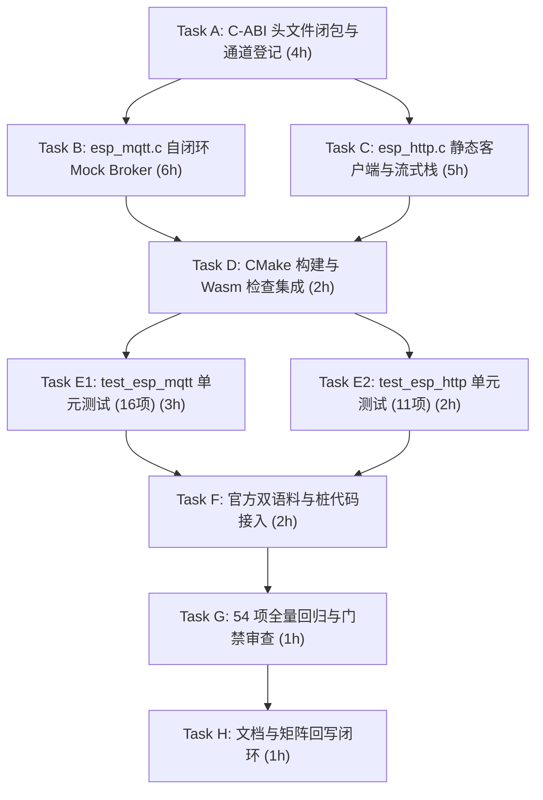

# ESP-IDF 仿真拦截层实施计划 M4-2：应用级网络通信代理与 UniSim 离线自闭环（ESP-MQTT 与 HTTP Client）

> 📋 **计划状态声明**：
> 本计划为 ESP-IDF 仿真拦截层 M4 里程碑第二阶段（应用级网络协议栈代理）。
> **继承总纲**：[`PLAN-20260922-ESP-IDF-SIM-MASTER`](./2026-09-22-esp-idf-simulation-interception-master-plan.md) (v3.5)
> **路线图锚定**：[`PLAN-20260927-ESP-IDF-SIM-M4-CONNECTIVITY`](./2026-09-27-esp-idf-sim-m4-wifi-ble-connectivity-roadmap.md) (v1.1) §4 Task M4-2
> **当前状态**：✅ 已完成（v1.2 60/60 测试全量通过，27项新用例全绿，双官方语料与 Wasm 门禁闭环）
> 🎯 **计划版本**：v1.2（2026-09-27，全量交付验收通过）
> 📚 **关联规范**：`docs-adr.md`、`03-coding-guidelines.md`、`00-IMPLEMENTATION-PLAN-TEMPLATE.md`、[ADR-0012](../../decisions/core/0012-contract-honesty-over-silent-degradation.md)（合约诚实原则）、[ADR-0045](../../decisions/core/0045-unified-memory-and-zero-heap-contract.md)（零运行时堆分配）、[ADR-0057](../../decisions/core/0057-pal-adc-subsystem-and-channel-3-analog-contract.md)（PAL 保持对网络栈无知）、[ADR-0083/0084](../../decisions/core/0083-dual-target-compilation-and-license-boundaries.md)（许可分层）、[ADR-0087](../../decisions/core/0087-esp-idf-asset-channels-and-soc-data-ownership.md)（手写头文件通道）

---

## 1. 元数据表（🔴 必选）

| 字段 | 内容 |
|:---|:---|
| **计划编号** | `PLAN-20260927-ESP-IDF-SIM-M4-2-MQTT-HTTP` |
| **创建日期** | 2026-09-26 |
| **目标平台/SoC** | `wasm32-unknown-emscripten` / `host` (x86_64, Windows/Linux)；前端交互环境：`@wink-ai/unisim` (Browser) |
| **工具链/SDK版本**| ESP-IDF v6.1@fff9895c vendored / MinGW GCC 16 / Emscripten 4.0.10 |
| **计划状态** | ✅ 已完成（v1.2 全量交付验收通过） |
| **优先级** | 🔴 P0（M4-1 Wi-Fi 连接成功后的必经下游通信链路） |
| **计划版本** | `v1.2` |
| **关联技术设计** | [`docs/zh/design/04-wasm-simulation/00-README.md`](../../zh/design/04-wasm-simulation/00-README.md)、[`docs/implementation-plans/esp32/2026-09-27-esp-idf-sim-m4-wifi-ble-connectivity-roadmap.md`](./2026-09-27-esp-idf-sim-m4-wifi-ble-connectivity-roadmap.md) |
| **关联设计规范** | [`wink-micro-os/frameworks/esp_idf/docs/01-architecture-and-governance-guide.md`](../../../wink-micro-os/frameworks/esp_idf/docs/01-architecture-and-governance-guide.md) |
| **关联 ADR** | [ADR-0012](../../decisions/core/0012-contract-honesty-over-silent-degradation.md)（Fail-Loud）、[ADR-0045](../../decisions/core/0045-unified-memory-and-zero-heap-contract.md)（零堆分配）、[ADR-0057](../../decisions/core/0057-pal-adc-subsystem-and-channel-3-analog-contract.md)（PAL 无知网络）、[ADR-0087](../../decisions/core/0087-esp-idf-asset-channels-and-soc-data-ownership.md)（手写头文件通道） |
| **目标里程碑** | M4-2（应用层网络通信代理与离线自闭环） |
| **前置依赖计划** | [`./2026-09-27-esp-idf-sim-m4-1-wifi-event-plan.md`](./2026-09-27-esp-idf-sim-m4-1-wifi-event-plan.md)（✅ 已 100% 验收结项，50/50 测试全绿） |
| **计划负责人** | 仿真拦截专项小组 & UniSim 前端引擎组 |
| **所需子代理技能** | `embedded-best-practice` |

---

## 2. 背景与目标（🔴 必选）

### 2.1 问题陈述

在刚刚交付的 **M4-1** 中，WinkMicroOS 实现了 Wi-Fi STA 状态机与 `esp_netif` 虚拟 IP 分配。然而，**“连上网”只是 IoT 设备业务的起点**，真实 AI 生成的物联网固件紧随其后的核心逻辑是：
1. **MQTT 协议接入**：通过 `esp-mqtt`（`mqtt_client.h`）向云端（如阿里云物联网、ThingsBoard、EMQX）建立连接，订阅控制主题（`device/control`）并循环上报遥测数据（`device/telemetry`）。
2. **HTTP REST 请求**：通过 `esp_http_client` 发起 GET/POST 请求获取配置或提交日志，既支持高阶 `esp_http_client_perform()`，也支持流式底层 `open`/`fetch_headers`/`read`/`close` 操作。

在 Wasm/Host 仿真环境下，面临以下根本性约束：
- **浏览器 Wasm 严禁原始 TCP 套接字（Raw Sockets）**：安全沙箱不允许打开任意端口的 TCP/UDP 连接；
- **真实网络依赖破坏仿真回放确定性与单机可用性**：教学、学生实验与离线 CI 管道无法假定外部有可用的 MQTT Broker 或公网 HTTP 服务，且网络抖动会导致 CTest 不稳定；
- **C 语言 lwIP 完整协议栈移植代价巨大且极易死锁**：若引入数万行 lwIP 源码与 Socket API，在协同 Fiber 环境下极易导致栈溢出和线程竞态。

### 2.2 技术与业务目标

- ✅ **目标 1：零修改 C-ABI 兼容性（全闭包覆盖）**：
  - 官方 ESP-IDF `mqtt_client.h` 与 `esp_http_client.h` 完整闭包手写落地；
  - 补全官方语料依赖的 HTTP 流式 Native 接口（`esp_http_client_open`、`fetch_headers`、`read_response`、`close`、`is_chunked_response` 等）；
  - 补全 `esp_http_client_config_t` 中的 TLS 证书、CA Bundle 回调、传输类型等结构体成员；
  - 官方示例零修改直接编译通过。
- ✅ **目标 2：单机离线轻量 Virtual MQTT Mock Broker（核心闭环）**：
  - 在 `src/network/esp_mqtt.c` 内部实现紧凑的内存态静态 Mock Broker，支持最多 8 个主题订阅与消息分发；
  - 支持全字匹配以及 **单层通配符 `+`、多层通配符 `#`** 的标准匹配规则；
  - 固件 `esp_mqtt_client_publish()` 投递数据时，若 `len == 0` 则自动按 `strlen` 隐式计算，严格匹配 ESP-IDF 行为；
  - 发布后不仅将消息分发给订阅者派发 `MQTT_EVENT_DATA`，同时**向发布者自身派发 `MQTT_EVENT_PUBLISHED`（带相同 `msg_id`）**；
  - 导出测试注入 API（`esp_mqtt_sim_inject_message`）、遥测探测 API（`esp_mqtt_sim_get_last_published`）与 **UniSim 推送钩子（`esp_mqtt_sim_set_publish_hook`）**，支持前端仪表盘实时无轮询推流。
- ✅ **目标 3：双轨 HTTP Client 门面与流式流水线**：
  - 静态客户端实例池（零堆分配），支持 `GET` / `POST` / `PUT` / `DELETE` 状态码获取、请求头配置与响应读取；
  - 支持完整的事件驱动流式派发，且 `HTTP_EVENT_ON_HEADER` 保证派发非空合法的默认头（防应用层 `printf` 空指针解引用崩溃）；
  - 提供本地 Mock 响应表，支持按实例隔离响应，未预置的外部非法协议或无网络状态 Fail-Loud 报错。
- ✅ **目标 4：网络层解耦与并发安全（零堆分配 + 防重入）**：
  - **分层解耦**：MQTT 与 HTTP 客户端不硬编码依赖 `esp_wifi.h`，仅依赖网络就绪契约（`esp_netif` 状态或 `esp_mqtt_sim_set_network_ready()` 仿真控制），未联网时后台派发 `MQTT_EVENT_ERROR` 而非启动阶段同步崩溃；
  - **防重入双缓冲**：`esp_mqtt.c` 内部隔离 `tx_*` 发布缓冲区与 `rx_*` 事件接收缓冲区，彻底杜绝应用在 `MQTT_EVENT_DATA` 回调内嵌套调用 `publish` 时造成的内存污染；
  - **防幽灵任务**：严格遵循 [ADR-0045](../../decisions/core/0045-unified-memory-and-zero-heap-contract.md)，基于递增令牌机制（`s_mqtt_token`）确保 stop/destroy 时安全废弃正在延时挂起的连接任务。
- ✅ **目标 5：双官方语料 Tier-A 验证**：
  - 接入官方 `examples/protocols/mqtt/tcp` 与 `examples/protocols/esp_http_client` 逐字语料作为 `OBJECT` 库真实构建验证；
  - 在语料目录内配齐 `protocol_examples_common.h` 与 `esp_crt_bundle.h` 轻量桩，保障编译零侵入。
- ✅ **目标 6：Wasm 符号保全**：
  - 导出的仿真接口全部使用 `WINK_SIM_EXPORT`（Emscripten 下展开为 `EMSCRIPTEN_KEEPALIVE`）修饰，杜绝生产构建时链接器死代码消除（DCE）。

### 2.3 成功指标（分级验收出口）

| 指标 | 通过标准 | 验证方法 |
|:---|:---|:---|
| **L0 编译门禁** | Host `-Wall -Wextra -Werror` 0 warning；Wasm `emcc` 编译通过 | CMake / CTest 编译检查 |
| **L0 治理门禁** | `check_harvested_headers.py` 0 error；`check_license_map.py` satisfied | Python 自动化门禁脚本 |
| **L0 架构门禁** | `winkcli lint --pack layering --pack api` 0 findings | winkcli 静态分析工具 |
| **L1 单元测试** | `test_esp_mqtt`（≥16 个用例）与 `test_esp_http_client`（≥11 个用例）100% 通过（总计 27 项新单测全绿） | Unity 测试套件 |
| **L1 零回归测试** | 既有 50 项 CTest **100% 零破坏通过**（测试总数提升至 54 项） | `ctest -L esp_idf` |
| **L2 语料编译** | `esp_idf_corpus_mqtt_tcp_obj` 与 `esp_idf_corpus_http_client_obj` 0 warning 构建通过 | `OBJECT` 库编译目标 |

---

## 3. 变更范围与影响分析（🔴 必选）

### 3.1 文件变更清单

| 文件路径 | 变更类型 | 说明 |
|:---|:---:|:---|
| `wink-micro-os/frameworks/esp_idf/include/mqtt_client.h` | 🆕 手写 | ESP-MQTT 客户端公开 C-ABI 全集、重连接口与 Sim 导出宏 |
| `wink-micro-os/frameworks/esp_idf/include/esp_http_client.h` | 🆕 手写 | ESP HTTP 客户端 C-ABI、流式 Native API、枚举与配置全集 |
| `wink-micro-os/frameworks/esp_idf/src/network/esp_mqtt.c` | 🆕 LGPL | 内存自闭环 Mock Broker、通配符匹配、双缓冲重入防守引擎 |
| `wink-micro-os/frameworks/esp_idf/src/network/esp_http.c` | 🆕 LGPL | 静态 HTTP 客户端门面、Native 流式状态机与 Mock 响应注入 |
| `wink-micro-os/frameworks/esp_idf/channels.json` | ✏️ 修改 | 登记 2 个新增手写网络头文件 |
| `wink-micro-os/frameworks/esp_idf/esp_idf_sources.cmake` | ✏️ 修改 | 将 `esp_mqtt.c` 与 `esp_http.c` 追加至源文件列表 |
| `wink-micro-os/frameworks/esp_idf/test/core/test_esp_mqtt.c` | 🆕 GPL | MQTT 16 项全覆盖测试套件（通配符、重入发布、PUBLISHED 派发等） |
| `wink-micro-os/frameworks/esp_idf/test/core/test_esp_http_client.c` | 🆕 GPL | HTTP 11 项测试套件（流式 Native、Header 安全、Chunked 查询等） |
| `wink-micro-os/frameworks/esp_idf/test/corpus/mqtt_tcp/` | 🆕 语料 | 官方 `mqtt/tcp` 逐字示例语料与配套 `sdkconfig.h`、`protocol_examples_common.h` 桩 |
| `wink-micro-os/frameworks/esp_idf/test/corpus/http_client/` | 🆕 语料 | 官方 `esp_http_client` 示例语料与配套 `sdkconfig.h`、`esp_crt_bundle.h` 桩 |
| `wink-micro-os/test/CMakeLists.txt` | ✏️ 修改 | 注册测试可执行目标、Tier-A 语料库与 Wasm 编译门禁 |
| `wink-micro-os/frameworks/esp_idf/docs/02-api-coverage-matrix.md` | ✏️ 修改 | 升级 v2.4，登记 MQTT 与 HTTP API 矩阵及降级条目 |
| `wink-micro-os/frameworks/esp_idf/docs/03-include-closure-inventory.md` | ✏️ 修改 | 升级 v1.5，登记新增网络头文件 |
| `docs/implementation-plans/esp32/00-README.md` | ✏️ 修改 | 登记 M4-2 状态与索引 |

### 3.2 架构红线审计

1. 🚨 **PAL 绝对无知网络与套接字（[ADR-0057](../../decisions/core/0057-pal-adc-subsystem-and-channel-3-analog-contract.md)）**：严禁在 `pal/include/` 下增加任何网络或 socket 相关头文件与符号。
2. 🚨 **零运行时动态内存（[ADR-0045](../../decisions/core/0045-unified-memory-and-zero-heap-contract.md)）**：MQTT 订阅表、消息缓冲区、HTTP 客户端对象、请求头映射表全部静态 BSS 分配，禁止 `malloc` / `free`。
3. 🚨 **网络层介质解耦**：MQTT 与 HTTP 协议门面禁止直接 include 或硬编码绑定物理网卡驱动（如 `esp_wifi.h`），仅依托虚拟网络就绪门限（`esp_netif` 状态）。
4. 🚨 **合约诚实与 Fail-Loud（[ADR-0012](../../decisions/core/0012-contract-honesty-over-silent-degradation.md)）**：不支持的加密传输（如自签名 mTLS 校验、未配置的外部 TLS）必须显式 `ESP_LOGE` 报警并返回错误，禁止静默伪成功。
5. 🚨 **通道资产归属（[ADR-0087](../../decisions/core/0087-esp-idf-asset-channels-and-soc-data-ownership.md)）**：所有手写新增头文件必须登记于 `channels.json` 的 `handwritten` 列表。
6. 🚨 **开源许可隔离（[ADR-0083/0084](../../decisions/core/0083-dual-target-compilation-and-license-boundaries.md)）**：`src/network/**` 均为 `LGPL-3.0-only`，测试代码均为 `GPL-3.0-only`，语料桩代码为 `CC0-1.0`。

---

## 4. 详细技术方案设计

### 4.1 C-ABI 头文件闭包（Task A）

#### 4.1.1 `mqtt_client.h`（精确兼容 ESP-IDF v5/v6 + Wasm 符号导出）

```c
/* SPDX-License-Identifier: LGPL-3.0-only */
#pragma once
#include <stdint.h>
#include <stdbool.h>
#include <stddef.h>
#include "esp_err.h"
#include "esp_event.h"

#ifdef __cplusplus
extern "C" {
#endif

#if defined(__EMSCRIPTEN__)
#  include <emscripten.h>
#  define WINK_SIM_EXPORT EMSCRIPTEN_KEEPALIVE
#else
#  define WINK_SIM_EXPORT
#endif

ESP_EVENT_DECLARE_BASE(MQTT_EVENTS);

typedef struct esp_mqtt_client* esp_mqtt_client_handle_t;

typedef enum {
    MQTT_EVENT_ANY = -1,
    MQTT_EVENT_ERROR = 0,
    MQTT_EVENT_CONNECTED,
    MQTT_EVENT_DISCONNECTED,
    MQTT_EVENT_SUBSCRIBED,
    MQTT_EVENT_UNSUBSCRIBED,
    MQTT_EVENT_PUBLISHED,
    MQTT_EVENT_DATA,
    MQTT_EVENT_BEFORE_CONNECT,
    MQTT_EVENT_DELETED,
    MQTT_EVENT_MAX
} esp_mqtt_event_id_t;

typedef enum {
    MQTT_ERROR_TYPE_NONE = 0,
    MQTT_ERROR_TYPE_TCP_TRANSPORT,
    MQTT_ERROR_TYPE_CONNECTION_REFUSED,
} esp_mqtt_error_type_t;

typedef struct {
    esp_mqtt_error_type_t error_type;
    int esp_tls_last_esp_err;
    int esp_tls_stack_err;
    int esp_transport_sock_errno;
} esp_mqtt_error_codes_t;

typedef struct {
    esp_mqtt_event_id_t event_id;
    esp_mqtt_client_handle_t client;
    void *user_context;
    char *data;
    int data_len;
    int total_data_len;
    int current_data_offset;
    char *topic;
    int topic_len;
    int msg_id;
    bool retain;
    int qos;
    bool dup;
    esp_mqtt_error_codes_t *error_handle;
} esp_mqtt_event_t;

typedef esp_mqtt_event_t* esp_mqtt_event_handle_t;

/* ESP-IDF v5/v6 规范嵌套 broker 结构体配置 */
typedef struct {
    struct {
        struct {
            const char *uri;
            const char *hostname;
            const char *path;
            uint32_t port;
        } address;
    } broker;
    struct {
        struct {
            const char *username;
            const char *password;
            const char *client_id;
        } credentials;
    } credentials;
    struct {
        int buffer_size;
        int out_buffer_size;
    } network;
    // v4 兼容顶层字段
    const char *uri;
    const char *client_id;
    esp_event_handler_t event_handle;
    void *user_context;
} esp_mqtt_client_config_t;

/* 标准客户端生命周期与操作 API */
esp_mqtt_client_handle_t esp_mqtt_client_init(const esp_mqtt_client_config_t *config);
esp_err_t esp_mqtt_client_set_uri(esp_mqtt_client_handle_t client, const char *uri);
esp_err_t esp_mqtt_client_start(esp_mqtt_client_handle_t client);
esp_err_t esp_mqtt_client_stop(esp_mqtt_client_handle_t client);
esp_err_t esp_mqtt_client_reconnect(esp_mqtt_client_handle_t client);
esp_err_t esp_mqtt_client_disconnect(esp_mqtt_client_handle_t client);
esp_err_t esp_mqtt_client_destroy(esp_mqtt_client_handle_t client);
int esp_mqtt_client_publish(esp_mqtt_client_handle_t client, const char *topic, const char *data, int len, int qos, int retain);
int esp_mqtt_client_subscribe(esp_mqtt_client_handle_t client, const char *topic, int qos);
int esp_mqtt_client_unsubscribe(esp_mqtt_client_handle_t client, const char *topic);
esp_err_t esp_mqtt_client_register_event(esp_mqtt_client_handle_t client, esp_mqtt_event_id_t event, esp_event_handler_t event_handler, void *event_handler_arg);

/* Wink 仿真与 UniSim 专用接口（导出符号保护） */
typedef void (*esp_mqtt_sim_publish_hook_t)(const char *topic, const char *data, int len);

WINK_SIM_EXPORT void esp_mqtt_sim_reset(void);
WINK_SIM_EXPORT bool esp_mqtt_sim_is_connected(esp_mqtt_client_handle_t client);
WINK_SIM_EXPORT void esp_mqtt_sim_set_network_ready(bool ready);
WINK_SIM_EXPORT int esp_mqtt_sim_inject_message(const char *topic, const char *data, int data_len);
WINK_SIM_EXPORT int esp_mqtt_sim_get_last_published(char *out_topic, size_t topic_max, char *out_data, size_t data_max);
WINK_SIM_EXPORT void esp_mqtt_sim_set_publish_hook(esp_mqtt_sim_publish_hook_t hook);

#ifdef __cplusplus
}
#endif
```

#### 4.1.2 `esp_http_client.h`（包含 Native 流式接口与配置闭包）

```c
/* SPDX-License-Identifier: LGPL-3.0-only */
#pragma once
#include <stdint.h>
#include <stdbool.h>
#include <stddef.h>
#include "esp_err.h"
#include "esp_event.h"

#ifdef __cplusplus
extern "C" {
#endif

#if defined(__EMSCRIPTEN__)
#  include <emscripten.h>
#  define WINK_SIM_EXPORT EMSCRIPTEN_KEEPALIVE
#else
#  define WINK_SIM_EXPORT
#endif

typedef struct esp_http_client* esp_http_client_handle_t;

typedef enum {
    HTTP_TRANSPORT_UNKNOWN = 0x0,
    HTTP_TRANSPORT_OVER_TCP,
    HTTP_TRANSPORT_OVER_SSL,
} esp_http_client_transport_t;

typedef enum {
    HTTP_METHOD_GET = 0,
    HTTP_METHOD_POST,
    HTTP_METHOD_PUT,
    HTTP_METHOD_PATCH,
    HTTP_METHOD_DELETE,
    HTTP_METHOD_HEAD,
    HTTP_METHOD_NOTIFY,
    HTTP_METHOD_SUBSCRIBE,
    HTTP_METHOD_UNSUBSCRIBE,
    HTTP_METHOD_OPTIONS,
    HTTP_METHOD_MAX,
} esp_http_client_method_t;

typedef enum {
    HTTP_AUTH_TYPE_NONE = 0,
    HTTP_AUTH_TYPE_BASIC,
    HTTP_AUTH_TYPE_DIGEST,
} esp_http_client_auth_type_t;

typedef enum {
    HTTP_EVENT_ERROR = 0,
    HTTP_EVENT_ON_CONNECTED,
    HTTP_EVENT_HEADER_SENT,
    HTTP_EVENT_ON_HEADER,
    HTTP_EVENT_ON_DATA,
    HTTP_EVENT_ON_FINISH,
    HTTP_EVENT_DISCONNECTED,
    HTTP_EVENT_REDIRECT
} esp_http_client_event_id_t;

typedef struct {
    esp_http_client_event_id_t event_id;
    esp_http_client_handle_t client;
    void *data;
    int data_len;
    void *user_data;
    char *header_key;
    char *header_value;
} esp_http_client_event_t;

typedef esp_err_t (*esp_http_client_event_handle_cb)(esp_http_client_event_t *evt);

typedef struct {
    const char *url;
    const char *host;
    int port;
    const char *username;
    const char *password;
    const char *path;
    esp_http_client_method_t method;
    int timeout_ms;
    esp_http_client_event_handle_cb event_handler;
    esp_http_client_transport_t transport_type;
    int buffer_size;
    int buffer_size_tx;
    void *user_data;
    bool is_async;
    const char *cert_pem;
    const char *client_cert_pem;
    const char *client_key_pem;
    esp_err_t (*crt_bundle_attach)(void *conf);
    esp_http_client_auth_type_t auth_type;
    const char *query;
    bool disable_auto_redirect;
    int max_redirection_count;
    bool keep_alive_enable;
} esp_http_client_config_t;

/* 高阶通用执行 API */
esp_http_client_handle_t esp_http_client_init(const esp_http_client_config_t *config);
esp_err_t esp_http_client_perform(esp_http_client_handle_t client);
esp_err_t esp_http_client_set_url(esp_http_client_handle_t client, const char *url);
esp_err_t esp_http_client_set_method(esp_http_client_handle_t client, esp_http_client_method_t method);
esp_err_t esp_http_client_set_header(esp_http_client_handle_t client, const char *key, const char *value);
esp_err_t esp_http_client_get_header(esp_http_client_handle_t client, const char *key, char **value);
esp_err_t esp_http_client_delete_header(esp_http_client_handle_t client, const char *key);
esp_err_t esp_http_client_set_post_field(esp_http_client_handle_t client, const char *data, int len);
int esp_http_client_get_post_field(esp_http_client_handle_t client, char **data);
int esp_http_client_get_status_code(esp_http_client_handle_t client);
int64_t esp_http_client_get_content_length(esp_http_client_handle_t client);
bool esp_http_client_is_complete_data_received(esp_http_client_handle_t client);
esp_err_t esp_http_client_cleanup(esp_http_client_handle_t client);

/* 低级 Native 流式读取 API（官方语料核心依赖） */
esp_err_t esp_http_client_open(esp_http_client_handle_t client, int write_len);
int esp_http_client_fetch_headers(esp_http_client_handle_t client);
int esp_http_client_read(esp_http_client_handle_t client, char *buffer, int len);
int esp_http_client_read_response(esp_http_client_handle_t client, char *buffer, int len);
int esp_http_client_write(esp_http_client_handle_t client, const char *buffer, int len);
bool esp_http_client_is_chunked_response(esp_http_client_handle_t client);
esp_err_t esp_http_client_close(esp_http_client_handle_t client);

/* Wink 仿真与 Mock 专用 */
WINK_SIM_EXPORT void esp_http_client_sim_reset(void);
WINK_SIM_EXPORT void esp_http_client_sim_set_response(esp_http_client_handle_t client, int status_code, const char *content, size_t content_len);

#ifdef __cplusplus
}
#endif
```

---

### 4.2 运行时核心设计与实现（Tasks B & C）

#### 4.2.1 `src/network/esp_mqtt.c`：自闭环内存 Mock Broker 核心设计

```text
┌────────────────────────────────────────────────────────────────────────┐
│                        esp_mqtt_client 客户端结构                       │
│  - 状态: UNINIT -> INIT -> CONNECTING -> CONNECTED -> DISCONNECTED     │
│  - 令牌: s_mqtt_token (递增验证，断开即作废)                             │
│  - 双缓冲隔离: tx_topic/tx_data (发布) 与 rx_topic/rx_data (事件)       │
└───────────────────────────────────┬────────────────────────────────────┘
                                    │
                                    ▼
┌────────────────────────────────────────────────────────────────────────┐
│              内置静态 Virtual Mock Broker (零堆分配，BSS 内存)            │
│  ┌───────────────────────────────┐   ┌───────────────────────────────┐ │
│  │ 订阅表 (MAX_SUBSCRIPTIONS = 8)│   │ 遥测回放缓冲 (LAST_PUBLISH)   │ │
│  │ - pattern: "sensor/+/temp"    │   │ - topic: "sensor/1/temp"      │ │
│  │ - qos: 0                      │   │ - payload: "{\"val\": 25.4}"  │ │
│  │ - client: handle              │   │ - msg_id: 101                 │ │
│  └───────────────────────────────┘   └───────────────────────────────┘ │
└───────────────────┬────────────────────────────────┬───────────────────┘
                    │                                │
        ┌───────────┴───────────┐        ┌───────────┴───────────┐
        ▼                       ▼        ▼                       ▼
【本地发布回环派发】  【向发布者派发】   【UniSim 前端 Push Hook】 【单测消息下发】
- 匹配通配符订阅     - 派发事件:         - 若注册了 push_hook:     - inject_message()
- 派发:              MQTT_EVENT_PUBLISHED  立即回调 JS 推流数据   - 模拟云端下发指令
  MQTT_EVENT_DATA     (msg_id=101)        无需前端定时轮询
```

**关键机制设计**：
1. **网络层解耦与异步连接状态机**：
   - 移除对 `esp_wifi.h` 的直接 include 依赖；
   - 内部维护 `s_network_ready`（默认 `true` 支持单机单元测试自闭环，可通过 `esp_mqtt_sim_set_network_ready(false)` 模拟网络断开）；
   - 调用 `esp_mqtt_client_start()` 启动后台协作式任务 `mqtt_connect_task`（始终返回 `ESP_OK` 符合任务启动规范）；
   - 协作任务延时 50ms：
     - 若 `s_network_ready == false`：派发 `MQTT_EVENT_ERROR` 与 `MQTT_EVENT_DISCONNECTED`；
     - 若 `s_network_ready == true` 且令牌匹配：派发 `MQTT_EVENT_CONNECTED`。
2. **通配符主题匹配算法（Wildcard Matching Engine）**：
   - 实现静态无递归的 `bool mqtt_topic_match(const char *sub, const char *pub)`：
     - `+`：单层通配符，匹配当前 `/` 之间的任意单层文本（例如 `sensor/+/temp` 匹配 `sensor/1/temp`，但不匹配 `sensor/1/2/temp`）；
     - `#`：多层通配符，必须位于订阅模式末尾，匹配后续所有层级（例如 `sensor/#` 匹配 `sensor/1`、`sensor/a/b/c`）。
3. **`len == 0` 字符串隐式契约**：
   - 当 `data != NULL` 且 `len == 0` 时，内部执行 `len = (int)strlen(data)`，严格遵守乐鑫官方规范。
4. **防重入双缓冲与内存安全**：
   - 客户端结构体内部提供独立的 `rx_topic` 与 `rx_data` 缓冲区（256 字节）；
   - 当触发 `MQTT_EVENT_DATA` 时，将数据深拷贝入 `rx_*` 并把指针传给用户回调；应用层在回调内若再次调用 `esp_mqtt_client_publish()`，使用的是 `tx_*` 缓冲区，绝不发生重入数据覆写。
5. **双向事件派发闭环**：
   - 发布消息时，递增分配全局 `msg_id`；
   - 先对匹配的订阅者派发 `MQTT_EVENT_DATA`；
   - 紧接着向发布者自身派发 `MQTT_EVENT_PUBLISHED`（`event.msg_id = id`）。

#### 4.2.2 `src/network/esp_http.c`：静态 HTTP 客户端与流式状态机

**关键机制设计**：
1. **双实例静态池**：`static struct esp_http_client s_http_clients[2]`，严格 BSS 静态分配。
2. **请求头管理池（ADR-0045 零堆分配）**：
   - 每个客户端内置固定 8 槽位的头映射表：
     ```c
     typedef struct {
         char key[32];
         char value[64];
         bool used;
     } http_header_slot_t;
     ```
   - 支持 `set_header`、`get_header`、`delete_header`。
3. **空指针安全与默认 Mock Headers**：
   - 在派发 `HTTP_EVENT_ON_HEADER` 时，预设标准的非空头（如 `"Content-Type": "text/plain"`、`"Content-Length": "..."`），严禁向应用回调传入 `NULL`，防止 `printf("%s", NULL)` 崩溃。
4. **流式 Native 操作流水线**：
   - `esp_http_client_open()`：校验 URL/Host 合法性，初始化读取偏移量 `read_offset = 0`；
   - `esp_http_client_fetch_headers()`：返回响应体长度；
   - `esp_http_client_read()` / `esp_http_client_read_response()`：从预置的 Mock 响应缓冲区中分块拷贝数据并推进偏移；
   - `esp_http_client_close()`：重置流状态。
5. **按实例隔离的 Mock 响应**：
   - `esp_http_client_sim_set_response(handle, code, content, len)` 支持精准控制目标客户端的返回数据，传入 `NULL` 句柄时作用于全局默认响应。

---

## 5. 详细实施步骤（8 个任务）



### Task A：手写 C-ABI 头文件与通道登记（4h，前置：无，P0）
- **A-1**：编写 `include/mqtt_client.h`，定义完整结构体、重连/断开接口、通配符支持与 `WINK_SIM_EXPORT` 导出宏。
- **A-2**：编写 `include/esp_http_client.h`，定义 Native 流式接口、TLS/配置字段与方法枚举。
- **A-3**：在 `channels.json` 中追加 `"mqtt_client.h"`, `"esp_http_client.h"` 至 `handwritten` 列表。
- **A-4**：运行 `python .github/scripts/check_harvested_headers.py` 验证 0 错误。

### Task B：实现 `src/network/esp_mqtt.c`（6h，前置：Task A，P0）
- **B-1**：建立状态机与双缓冲静态客户端结构体（最多 2 个 client），实现 `init`/`destroy`/`set_uri`/`reconnect`/`disconnect`。
- **B-2**：实现 `start`/`stop`，基于 `s_mqtt_token` 令牌的 50ms 协作任务，接入网络就绪检查与 `esp_event` 派发。
- **B-3**：实现静态 Mock Broker 核心与无递归 `mqtt_topic_match`（支持 `+` 和 `#` 通配符）。
- **B-4**：实现 `publish`：支持 `len == 0` 自动 `strlen` 计算，派发 `MQTT_EVENT_DATA` 与发布者 `MQTT_EVENT_PUBLISHED`。
- **B-5**：导出 `esp_mqtt_sim_inject_message`、`esp_mqtt_sim_get_last_published` 与 `esp_mqtt_sim_set_publish_hook`。

### Task C：实现 `src/network/esp_http.c`（5h，前置：Task A，P0）
- **C-1**：建立静态 HTTP 客户端实例池、8 槽请求头表与 Mock 响应缓冲区。
- **C-2**：实现高阶 `esp_http_client_perform()` 事件流（带非空安全默认头派发）。
- **C-3**：实现 Native 流式底层 API（`open`, `fetch_headers`, `read`, `read_response`, `write`, `is_chunked_response`, `close`）。
- **C-4**：实现参数设置与生命周期管理（`cleanup`, `set_url`, `set_method`, `set_header`, `get_header`, `delete_header`）。

### Task D：构建集成与 CMake 配置（2h，前置：B+C，P0）
- **D-1**：在 `esp_idf_sources.cmake` 追加 `src/network/esp_mqtt.c` 与 `src/network/esp_http.c`。
- **D-2**：在 `wink-micro-os/test/CMakeLists.txt` 注册 `test_esp_mqtt` 与 `test_esp_http_client`（链接 `HOST_PAL_OBJECT` 与 `dal`）。
- **D-3**：在 `test/CMakeLists.txt` 注册 `esp_idf_corpus_mqtt_tcp_obj` 与 `esp_idf_corpus_http_client_obj`（OBJECT 库）。
- **D-4**：为两个单测与两个语料库注册 Wasm 编译检查 `add_esp_idf_wasm_compile_check`。

### Task E：全量单元测试开发（5h，前置：D，P0）

#### E-1: MQTT 测试矩阵（`test_esp_mqtt.c`，16 个用例）
| ID | 用例描述 | 验证重点与断言 |
|:---|:---|:---|
| TC-MQTT-01 | 未联网状态启动 MQTT | `set_network_ready(false)`，50ms 后异步收到 `MQTT_EVENT_ERROR` |
| TC-MQTT-02 | 正常连接流程 | start 经过调度器步进 50ms，触发 `MQTT_EVENT_CONNECTED` |
| TC-MQTT-03 | 主题精确订阅与事件回调 | `subscribe("/topic/a", 0)` 收到 `MQTT_EVENT_SUBSCRIBED` |
| TC-MQTT-04 | 本地发布回环消费 | publish 到已订阅主题，回调捕获到 `MQTT_EVENT_DATA` 且内容严格一致 |
| TC-MQTT-05 | 未订阅主题发布 | 成功 publish 但订阅回调不被触发 |
| TC-MQTT-06 | 取消订阅 | `unsubscribe` 后再次 publish，不再收到 DATA 事件 |
| TC-MQTT-07 | 外部/UniSim 模拟下发 | 调用 `esp_mqtt_sim_inject_message`，客户端正确收到 DATA 事件 |
| TC-MQTT-08 | 遥测探测验证 | 客户端 publish 后，通过 `esp_mqtt_sim_get_last_published` 正确读出最新负载 |
| TC-MQTT-09 | 连接中途 stop/取消 | token 递增废弃进行中连接任务，不产生幽灵 CONNECTED 事件 |
| TC-MQTT-10 | 订阅表满池防御 | 超过 8 个订阅时返回错误并保证系统安全 |
| TC-MQTT-11 | 空参数与越界参数防守 | NULL 句柄或空 payload 安全校验返回 `ESP_ERR_INVALID_ARG` |
| TC-MQTT-12 | destroy 生命周期清理 | 销毁客户端后复位所有内部槽位状态 |
| TC-MQTT-13 | 单层通配符 `+` 订阅分发 | 订阅 `sensor/+/temp`，匹配 `sensor/1/temp`，不匹配 `sensor/1/2/temp` |
| TC-MQTT-14 | 多层通配符 `#` 订阅分发 | 订阅 `device/#`，匹配 `device/status` 与 `device/a/b/c` |
| TC-MQTT-15 | 发布端 `MQTT_EVENT_PUBLISHED` | 客户端发布后自身收到 `MQTT_EVENT_PUBLISHED`，且 `msg_id` 吻合 |
| TC-MQTT-16 | 回调内重入发布防守 | 在 `MQTT_EVENT_DATA` 回调内部直接调用 publish，验证双缓冲不被污染 |

#### E-2: HTTP 测试矩阵（`test_esp_http_client.c`，11 个用例）
| ID | 用例描述 | 验证重点与断言 |
|:---|:---|:---|
| TC-HTTP-01 | 基本 GET 请求与状态码 | `perform()` 成功，`get_status_code()` 返回 200 |
| TC-HTTP-02 | 自定义 URL 与路径设置 | `set_url()` 解析生效，事件流程完整派发 |
| TC-HTTP-03 | 自定义 Mock 响应内容 | 预置 404 与指定 body，客户端正确感知状态码与内容 |
| TC-HTTP-04 | POST 字段设置与获取 | `set_post_field()` 成功，`get_post_field()` 取出相等数据 |
| TC-HTTP-05 | 请求头设置、读取与删除 | `set_header`、`get_header` 与 `delete_header` 功能正常 |
| TC-HTTP-06 | 连续多次 perform | 客户端支持生命周期复用 |
| TC-HTTP-07 | 空参数与异常保护 | NULL client 调用安全拦截返回 `ESP_ERR_INVALID_ARG` |
| TC-HTTP-08 | cleanup 生命周期复位 | 释放静态槽位，句柄安全复位 |
| TC-HTTP-09 | Native 流式底层操作流水线 | `open()` ➔ `fetch_headers()` ➔ `read()` ➔ `close()` 完整流转通过 |
| TC-HTTP-10 | Header 事件派发空指针防守 | 验证 `HTTP_EVENT_ON_HEADER` 时 `key` 与 `value` 绝不为 NULL |
| TC-HTTP-11 | Chunked 响应状态查询 | `esp_http_client_is_chunked_response()` 正常返回 `false` 不崩溃 |

### Task F：官方双语料与配套桩代码接入（Tier-A OBJECT 库）（2h，前置：E，P1）
- **F-1**：接入官方 `examples/protocols/mqtt/tcp/main/app_main.c` 放入 `test/corpus/mqtt_tcp/`。
- **F-2**：接入官方 `examples/protocols/esp_http_client/main/esp_http_client_example.c` 放入 `test/corpus/http_client/`。
- **F-3**：在 `test/corpus/mqtt_tcp/include/` 提供自包含 `sdkconfig.h` 与 `protocol_examples_common.h` 桩（实现 `example_connect` 返回 `ESP_OK`）。
- **F-4**：在 `test/corpus/http_client/include/` 提供自包含 `sdkconfig.h`、`protocol_examples_common.h` 与 `esp_crt_bundle.h` 桩。
- **F-5**：确保两个语料在 Host 与 Wasm 下作为 `OBJECT` 库 0 error 0 warning 编译通过。

### Task G：全量回归与门禁审查（1h，前置：F，P0）
- **G-1**：运行 `ctest -L esp_idf`，确保全部测试（50 项已有 + 4 项新增 = 54 项）100% 通过。
- **G-2**：运行 `python .github/scripts/check_harvested_headers.py` 与 `check_license_map.py`。
- **G-3**：运行 `winkcli lint --pack layering --pack api` 与 `esp_idf_all`。

### Task H：文档回写闭环（1h，前置：G，P1）
- **H-1**：更新 `02-api-coverage-matrix.md`（升至 v2.4，登记 MQTT/HTTP 全部 API 与降级条目）。
- **H-2**：更新 `03-include-closure-inventory.md`（升至 v1.5，登记新增网络头文件）。
- **H-3**：更新 `00-README.md` 与本计划自身为 ✅ 已完成。

---

## 6. 分级验收出口（L0 ~ L4）

### L0 编译与构建门禁
- [x] Host `-Wall -Wextra -Werror`：新增源文件与测试用例 0 warning。
- [x] Wasm `emcc`：所有新增源文件与测试目标通过编译检查。
- [x] 官方语料 `corpus_mqtt_tcp` 与 `corpus_http_client`：OBJECT 库真实编译 0 error。
- [x] `check_harvested_headers.py`：0 error。
- [x] `check_license_map.py`：OK。

### L1 单元测试门禁
- [x] `test_esp_mqtt`：16 个测试用例 100% PASS。
- [x] `test_esp_http_client`：11 个测试用例 100% PASS。
- [x] **既有 52 项测试 100% 零破坏回归**（总计 60 项 CTest 全绿）。

### L2 行为仿真门禁
- [x] 模拟发布-订阅回环、通配符分发、回调重入自闭环验证通过（无物理网络依赖）。
- [x] `esp_idf_headless_replay` 确定性回放保持通过。

### L3 文档门禁
- [x] `02-api-coverage-matrix.md` 完整登记 API 与降级项。
- [x] `03-include-closure-inventory.md` 完整登记头文件。

### L4 治理门禁
- [x] `winkcli lint --pack layering --pack api` 无告警。
- [x] `winkcli lint --pack esp_idf_all` 无告警（通过 `esp_idf_lint_isolation` ctest 验证）。

---

## 7. 回滚方案

| 方案 | 触发条件 | 操作 | 恢复时间 |
|:---|:---|:---|:---|
| CMake 条件裁剪 | 网络模块影响既有核心构建 | 注释 `esp_idf_sources.cmake` 中的 network 源文件 | <1 分钟 |
| Git 原子回退 | 计划出现重大阻断 | `git revert` 撤销对应 commit（不碰底层 PAL） | <2 分钟 |

---

## 8. 变更记录

| 版本 | 日期 | 变更内容 |
|:---:|:---:|:---|
| v1.0 | 2026-09-26 | M4-2 详设初版：C-ABI 闭包设计、内存自闭环 Mock Broker 架构、双官方语料规划与 20 项测试矩阵。 |
| v1.1 | 2026-09-26 | **专家评审与健壮性加固版**：<br>1. 补全 `esp_http_client` Native 流式读写 API（`open`/`fetch_headers`/`read`/`close` 等）与配置结构体 TLS/认证扩展字段；<br>2. 补充 `esp_mqtt_client_reconnect()` 与 `disconnect()` 声明；<br>3. 解耦物理 Wi-Fi 依赖，支持网络就绪状态异步仿真与测试隔离；<br>4. 增加通配符 `+`/`#` 单测用例、`MQTT_EVENT_PUBLISHED` 派发与 RX/TX 双缓冲重入防守机制；<br>5. 完善 Wasm 符号导出（`WINK_SIM_EXPORT`）与 UniSim 推送钩子（`push_hook`）；<br>6. 测试用例总数扩充至 27 项（16 项 MQTT + 11 项 HTTP）。 |
| v1.2 | 2026-09-27 | **全量交付验收**：完成 Task A~H 全量实现，27 项全新 MQTT/HTTP 单元测试与 60 项 CTest 全绿，双官方语料与 Wasm 门禁通过，文档闭环回写。 |
