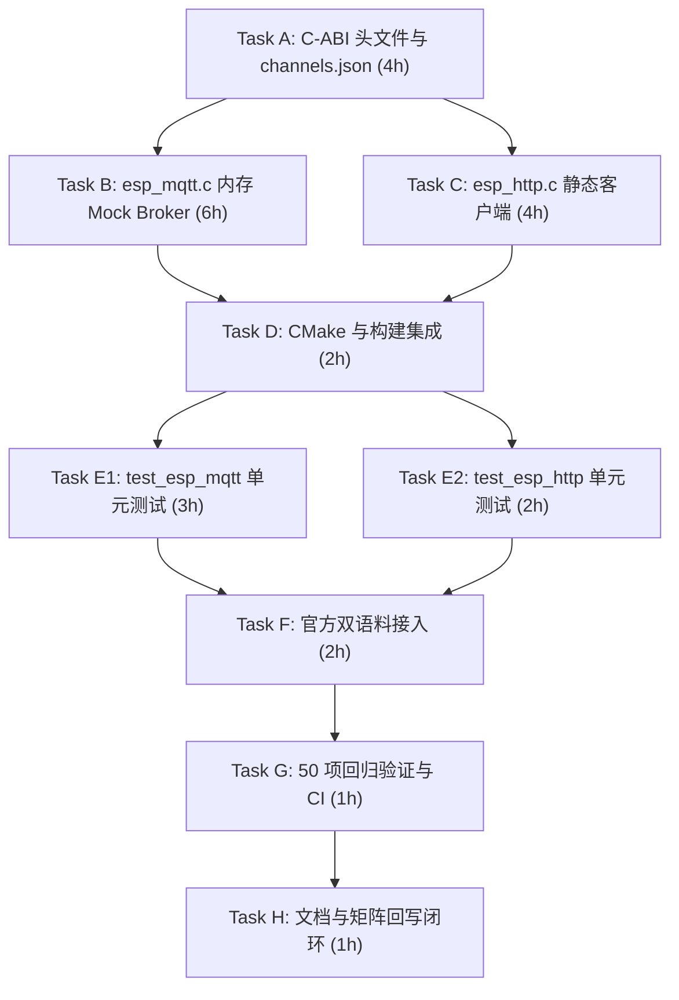

# ESP-IDF 仿真拦截层实施计划 M4-2：应用级网络通信代理与 UniSim 离线自闭环（ESP-MQTT 与 HTTP Client）

> 📋 **计划状态声明**：
> 本计划为 ESP-IDF 仿真拦截层 M4 里程碑第二阶段（应用级网络协议栈代理）。
> **继承总纲**：[`PLAN-20260922-ESP-IDF-SIM-MASTER`](./2026-09-22-esp-idf-simulation-interception-master-plan.md) (v3.5)
> **路线图锚定**：[`PLAN-20260927-ESP-IDF-SIM-M4-CONNECTIVITY`](./2026-09-27-esp-idf-sim-m4-wifi-ble-connectivity-roadmap.md) (v1.1) §4 Task M4-2
> **当前状态**：📋 待开始（v1.0 详设编制完成，待评审后执行）
> 🎯 **计划版本**：v1.0（2026-09-26）
> 📚 **关联规范**：`docs-adr.md`、`03-coding-guidelines.md`、`00-IMPLEMENTATION-PLAN-TEMPLATE.md`、[ADR-0012](../../decisions/core/0012-contract-honesty-over-silent-degradation.md)（合约诚实原则）、[ADR-0045](../../decisions/core/0045-unified-memory-and-zero-heap-contract.md)（零运行时堆分配）、[ADR-0057](../../decisions/core/0057-pal-adc-subsystem-and-channel-3-analog-contract.md)（PAL 保持对网络栈无知）、[ADR-0083/0084](../../decisions/core/0083-dual-target-compilation-and-license-boundaries.md)（许可分层）

---

## 1. 元数据表（🔴 必选）

| 字段 | 内容 |
|:---|:---|
| **计划编号** | `PLAN-20260927-ESP-IDF-SIM-M4-2-MQTT-HTTP` |
| **创建日期** | 2026-09-26 |
| **目标平台/SoC** | `wasm32-unknown-emscripten` / `host` (x86_64, Windows/Linux)；前端交互环境：`@wink-ai/unisim` (Browser) |
| **工具链/SDK版本**| ESP-IDF v6.1@fff9895c vendored / MinGW GCC 16 / Emscripten 4.0.10 |
| **计划状态** | 📋 待开始（详细计划已落盘，待评审确认） |
| **优先级** | 🔴 P0（M4-1 Wi-Fi 连接成功后的必经下游通信链路） |
| **计划版本** | `v1.0` |
| **关联技术设计** | [`docs/zh/design/04-wasm-simulation/00-README.md`](../../zh/design/04-wasm-simulation/00-README.md)、[`docs/implementation-plans/esp32/2026-09-27-esp-idf-sim-m4-wifi-ble-connectivity-roadmap.md`](./2026-09-27-esp-idf-sim-m4-wifi-ble-connectivity-roadmap.md) |
| **关联设计规范** | [`wink-micro-os/frameworks/esp_idf/docs/01-architecture-and-governance-guide.md`](../../../wink-micro-os/frameworks/esp_idf/docs/01-architecture-and-governance-guide.md) |
| **关联 ADR** | [ADR-0012](../../decisions/core/0012-contract-honesty-over-silent-degradation.md)（Fail-Loud）、[ADR-0045](../../decisions/core/0045-unified-memory-and-zero-heap-contract.md)（零堆分配）、[ADR-0057](../../decisions/core/0057-pal-adc-subsystem-and-channel-3-analog-contract.md)（PAL 无知网络）、[ADR-0087](../../decisions/core/0087-esp-idf-asset-channels-and-soc-data-ownership.md)（手写头文件通道） |
| **目标里程碑** | M4-2（应用层网络通信代理与离线自闭环） |
| **前置依赖计划** | [`./2026-09-27-esp-idf-sim-m4-1-wifi-event-plan.md`](./2026-09-27-esp-idf-sim-m4-1-wifi-event-plan.md)（✅ 已 100% 验收结项，50/50 测试全绿） |
| **计划负责人** | 仿真拦截专项小组 & UniSim 前端引擎组 |
| **所需子代理技能** | `embedded-best-practice` |

---

## 2. 背景与目标（🔴 必选）

### 2.1 问题陈述

在刚刚交付的 **M4-1** 中，WinkMicroOS 实现了 Wi-Fi STA 状态机与 `esp_netif` 虚拟 IP 分配。然而，**“连上网”只是 IoT 设备业务的起点**，真实 AI 生成的物联网固件紧随其后的核心逻辑是：
1. **MQTT 协议接入**：通过 `esp-mqtt`（`mqtt_client.h`）向云端（如阿里云物联网、ThingsBoard、EMQX）建立连接，订阅控制主题（`device/control`）并循环上报遥测数据（`device/telemetry`）。
2. **HTTP REST 请求**：通过 `esp_http_client` 发起 GET/POST 请求获取配置或提交日志。

在 Wasm/Host 仿真环境下，面临以下根本性约束：
- **浏览器 Wasm 严禁原始 TCP 套接字（Raw Sockets）**：安全沙箱不允许打开任意端口的 TCP/UDP 连接；
- **真实网络依赖破坏仿真回放确定性与单机可用性**：教学、学生实验与离线 CI 管道无法假定外部有可用的 MQTT Broker 或公网 HTTP 服务，且网络抖动会导致 CTest 不稳定；
- **C 语言 lwIP 完整协议栈移植代价巨大且极易死锁**：若引入数万行 lwIP 源码与 Socket API，在协同 Fiber 环境下极易导致栈溢出和线程竞态。

### 2.2 技术与业务目标

- ✅ **目标 1：零修改 C-ABI 兼容性**：官方 ESP-IDF `mqtt_client.h` 与 `esp_http_client.h` 完整闭包手写落地，支持 ESP-IDF v5/v6 嵌套配置结构体（`broker.address.uri` 等），官方示例零修改编译。
- ✅ **目标 2：单机离线轻量 Virtual MQTT Mock Broker（核心闭环）**：
  - 在 `src/network/esp_mqtt.c` 内部实现紧凑的内存态静态 Mock Broker，支持最多 8 个主题订阅与消息分发；
  - 固件 `esp_mqtt_client_publish()` 投递的数据，能实时精准回环投递给匹配的 `esp_mqtt_client_subscribe()`，并派发标准 `MQTT_EVENT_DATA`；
  - 导出测试注入 API（`esp_mqtt_sim_inject_message`）与遥测探测 API（`esp_mqtt_sim_get_last_published`），支持单测和前端 UniSim 仪表盘实时双向通信。
- ✅ **目标 3：双轨 HTTP Client 门面**：
  - 静态客户端实例池（零堆分配），支持 `GET` / `POST` 状态码获取、请求头配置与响应读取；
  - 提供本地 Mock 响应表，未预置的外部非法协议或无网络状态 Fail-Loud 报错。
- ✅ **目标 4：零运行时堆内存与防幽灵任务**：
  - 严格遵循 [ADR-0045](../../decisions/core/0045-unified-memory-and-zero-heap-contract.md)，所有客户端结构、主题表、消息缓冲全部 BSS 静态分配；
  - 继承 M4-1 验证成熟的递增令牌机制（`s_mqtt_token`），防止连接中途调用 stop/destroy 时产生幽灵连接事件。
- ✅ **目标 5：双官方语料 Tier-A 验证**：
  - 接入官方 `examples/protocols/mqtt/tcp` 与 `examples/protocols/esp_http_client` 逐字语料作为 `OBJECT` 库真实构建验证。

### 2.3 成功指标（分级验收出口）

| 指标 | 通过标准 | 验证方法 |
|:---|:---|:---|
| **L0 编译门禁** | Host `-Wall -Wextra -Werror` 0 warning；Wasm `emcc` 编译通过 | CMake / CTest 编译检查 |
| **L0 治理门禁** | `check_harvested_headers.py` 0 error；`check_license_map.py` satisfied | Python 自动化门禁脚本 |
| **L0 架构门禁** | `winkcli lint --pack layering --pack api` 0 findings | winkcli 静态分析工具 |
| **L1 单元测试** | `test_esp_mqtt`（≥12 个用例）与 `test_esp_http_client`（≥8 个用例）100% 通过 | Unity 测试套件 |
| **L1 零回归测试** | 既有 50 项 CTest **100% 零破坏通过**（测试总数提升至 54 项） | `ctest -L esp_idf` |
| **L2 语料编译** | `esp_idf_corpus_mqtt_tcp_obj` 与 `esp_idf_corpus_http_client_obj` 0 warning 构建通过 | `OBJECT` 库编译目标 |

---

## 3. 变更范围与影响分析（🔴 必选）

### 3.1 文件变更清单

| 文件路径 | 变更类型 | 说明 |
|:---|:---:|:---|
| `wink-micro-os/frameworks/esp_idf/include/mqtt_client.h` | 🆕 手写 | ESP-MQTT 客户端公开 C-ABI 全集与配置结构体 |
| `wink-micro-os/frameworks/esp_idf/include/esp_http_client.h` | 🆕 手写 | ESP HTTP 客户端公开 C-ABI 全集与枚举 |
| `wink-micro-os/frameworks/esp_idf/src/network/esp_mqtt.c` | 🆕 LGPL | 内存自闭环 Mock Broker、FSM、异步连接与分发引擎 |
| `wink-micro-os/frameworks/esp_idf/src/network/esp_http.c` | 🆕 LGPL | 静态 HTTP 客户端门面与 Mock 响应注入引擎 |
| `wink-micro-os/frameworks/esp_idf/channels.json` | ✏️ 修改 | 登记 2 个新增手写网络头文件 |
| `wink-micro-os/frameworks/esp_idf/esp_idf_sources.cmake` | ✏️ 修改 | 将 `esp_mqtt.c` 与 `esp_http.c` 追加至源文件列表 |
| `wink-micro-os/frameworks/esp_idf/test/core/test_esp_mqtt.c` | 🆕 GPL | MQTT 12 项全覆盖测试套件（连接/发布/订阅/取消/注入等） |
| `wink-micro-os/frameworks/esp_idf/test/core/test_esp_http_client.c` | 🆕 GPL | HTTP 8 项测试套件（GET/POST/Header/Status/Clean 等） |
| `wink-micro-os/frameworks/esp_idf/test/corpus/mqtt_tcp/` | 🆕 语料 | 官方 `mqtt/tcp` 逐字示例语料与配套 `sdkconfig.h` |
| `wink-micro-os/frameworks/esp_idf/test/corpus/http_client/` | 🆕 语料 | 官方 `esp_http_client` 示例语料与配套 `sdkconfig.h` |
| `wink-micro-os/test/CMakeLists.txt` | ✏️ 修改 | 注册测试可执行目标、Tier-A 语料库与 Wasm 编译门禁 |
| `wink-micro-os/frameworks/esp_idf/docs/02-api-coverage-matrix.md` | ✏️ 修改 | 升级 v2.4，登记 MQTT 与 HTTP API 矩阵及降级条目 |
| `wink-micro-os/frameworks/esp_idf/docs/03-include-closure-inventory.md` | ✏️ 修改 | 升级 v1.5，登记新增网络头文件 |
| `docs/implementation-plans/esp32/00-README.md` | ✏️ 修改 | 登记 M4-2 状态与索引 |

### 3.2 架构红线审计

1. 🚨 **PAL 绝对无知网络与套接字（[ADR-0057](../../decisions/core/0057-pal-adc-subsystem-and-channel-3-analog-contract.md)）**：严禁在 `pal/include/` 下增加任何网络或 socket 相关头文件与符号。
2. 🚨 **零运行时动态内存（[ADR-0045](../../decisions/core/0045-unified-memory-and-zero-heap-contract.md)）**：MQTT 订阅表、消息缓冲区、HTTP 客户端对象全部静态 BSS 分配，禁止 `malloc` / `free`。
3. 🚨 **合约诚实与 Fail-Loud（[ADR-0012](../../decisions/core/0012-contract-honesty-over-silent-degradation.md)）**：不支持的加密传输（如自签名 mTLS 校验、未配置的外部 TLS）必须显式 `ESP_LOGE` 报警并返回错误，禁止静默伪成功。
4. 🚨 **通道资产归属（[ADR-0087](../../decisions/core/0087-esp-idf-asset-channels-and-soc-data-ownership.md)）**：所有手写新增头文件必须登记于 `channels.json` 的 `handwritten` 列表。
5. 🚨 **开源许可隔离（[ADR-0083/0084](../../decisions/core/0083-dual-target-compilation-and-license-boundaries.md)）**：`src/network/**` 均为 `LGPL-3.0-only`，测试代码均为 `GPL-3.0-only`。

---

## 4. 详细技术方案设计

### 4.1 C-ABI 头文件闭包（Task A）

#### 4.1.1 `mqtt_client.h`（精确兼容 ESP-IDF v5/v6）

```c
/* SPDX-License-Identifier: LGPL-3.0-only */
#pragma once
#include <stdint.h>
#include <stdbool.h>
#include <stddef.h>
#include "esp_err.h"
#include "esp_event.h"

#ifdef __cplusplus
extern "C" {
#endif

ESP_EVENT_DECLARE_BASE(MQTT_EVENTS);

typedef struct esp_mqtt_client* esp_mqtt_client_handle_t;

typedef enum {
    MQTT_EVENT_ANY = -1,
    MQTT_EVENT_ERROR = 0,
    MQTT_EVENT_CONNECTED,
    MQTT_EVENT_DISCONNECTED,
    MQTT_EVENT_SUBSCRIBED,
    MQTT_EVENT_UNSUBSCRIBED,
    MQTT_EVENT_PUBLISHED,
    MQTT_EVENT_DATA,
    MQTT_EVENT_BEFORE_CONNECT,
    MQTT_EVENT_DELETED,
    MQTT_EVENT_MAX
} esp_mqtt_event_id_t;

typedef enum {
    MQTT_ERROR_TYPE_NONE = 0,
    MQTT_ERROR_TYPE_TCP_TRANSPORT,
    MQTT_ERROR_TYPE_CONNECTION_REFUSED,
} esp_mqtt_error_type_t;

typedef struct {
    esp_mqtt_error_type_t error_type;
    int esp_tls_last_esp_err;
    int esp_tls_stack_err;
    int esp_transport_sock_errno;
} esp_mqtt_error_codes_t;

typedef struct {
    esp_mqtt_event_id_t event_id;
    esp_mqtt_client_handle_t client;
    void *user_context;
    char *data;
    int data_len;
    int total_data_len;
    int current_data_offset;
    char *topic;
    int topic_len;
    int msg_id;
    bool retain;
    int qos;
    bool dup;
    esp_mqtt_error_codes_t *error_handle;
} esp_mqtt_event_t;

typedef esp_mqtt_event_t* esp_mqtt_event_handle_t;

/* ESP-IDF v5/v6 规范嵌套 broker 结构体配置 */
typedef struct {
    struct {
        struct {
            const char *uri;
            const char *hostname;
            const char *path;
            uint32_t port;
        } address;
    } broker;
    struct {
        struct {
            const char *username;
            const char *password;
            const char *client_id;
        } credentials;
    } credentials;
    struct {
        int buffer_size;
        int out_buffer_size;
    } network;
    // v4 兼容顶层字段
    const char *uri;
    const char *client_id;
    esp_event_handler_t event_handle;
    void *user_context;
} esp_mqtt_client_config_t;

esp_mqtt_client_handle_t esp_mqtt_client_init(const esp_mqtt_client_config_t *config);
esp_err_t esp_mqtt_client_set_uri(esp_mqtt_client_handle_t client, const char *uri);
esp_err_t esp_mqtt_client_start(esp_mqtt_client_handle_t client);
esp_err_t esp_mqtt_client_stop(esp_mqtt_client_handle_t client);
esp_err_t esp_mqtt_client_destroy(esp_mqtt_client_handle_t client);
int esp_mqtt_client_publish(esp_mqtt_client_handle_t client, const char *topic, const char *data, int len, int qos, int retain);
int esp_mqtt_client_subscribe(esp_mqtt_client_handle_t client, const char *topic, int qos);
int esp_mqtt_client_unsubscribe(esp_mqtt_client_handle_t client, const char *topic);
esp_err_t esp_mqtt_client_register_event(esp_mqtt_client_handle_t client, esp_mqtt_event_id_t event, esp_event_handler_t event_handler, void *event_handler_arg);

/* Wink 仿真与 UniSim 专用接口 */
void esp_mqtt_sim_reset(void);
bool esp_mqtt_sim_is_connected(esp_mqtt_client_handle_t client);
int esp_mqtt_sim_inject_message(const char *topic, const char *data, int data_len);
int esp_mqtt_sim_get_last_published(char *out_topic, size_t topic_max, char *out_data, size_t data_max);

#ifdef __cplusplus
}
#endif
```

#### 4.1.2 `esp_http_client.h`

```c
/* SPDX-License-Identifier: LGPL-3.0-only */
#pragma once
#include <stdint.h>
#include <stdbool.h>
#include <stddef.h>
#include "esp_err.h"
#include "esp_event.h"

#ifdef __cplusplus
extern "C" {
#endif

typedef struct esp_http_client* esp_http_client_handle_t;

typedef enum {
    HTTP_METHOD_GET = 0,
    HTTP_METHOD_POST,
    HTTP_METHOD_PUT,
    HTTP_METHOD_PATCH,
    HTTP_METHOD_DELETE,
    HTTP_METHOD_HEAD,
    HTTP_METHOD_NOTIFY,
    HTTP_METHOD_SUBSCRIBE,
    HTTP_METHOD_UNSUBSCRIBE,
    HTTP_METHOD_OPTIONS,
    HTTP_METHOD_MAX,
} esp_http_client_method_t;

typedef enum {
    HTTP_EVENT_ERROR = 0,
    HTTP_EVENT_ON_CONNECTED,
    HTTP_EVENT_HEADER_SENT,
    HTTP_EVENT_ON_HEADER,
    HTTP_EVENT_ON_DATA,
    HTTP_EVENT_ON_FINISH,
    HTTP_EVENT_DISCONNECTED,
    HTTP_EVENT_REDIRECT
} esp_http_client_event_id_t;

typedef struct {
    esp_http_client_event_id_t event_id;
    esp_http_client_handle_t client;
    void *data;
    int data_len;
    void *user_data;
    char *header_key;
    char *header_value;
} esp_http_client_event_t;

typedef esp_err_t (*esp_http_client_event_handle_cb)(esp_http_client_event_t *evt);

typedef struct {
    const char *url;
    const char *host;
    int port;
    const char *username;
    const char *password;
    const char *path;
    esp_http_client_method_t method;
    int timeout_ms;
    esp_http_client_event_handle_cb event_handler;
    int buffer_size;
    int buffer_size_tx;
    void *user_data;
    bool is_async;
} esp_http_client_config_t;

esp_http_client_handle_t esp_http_client_init(const esp_http_client_config_t *config);
esp_err_t esp_http_client_perform(esp_http_client_handle_t client);
esp_err_t esp_http_client_set_url(esp_http_client_handle_t client, const char *url);
esp_err_t esp_http_client_set_method(esp_http_client_handle_t client, esp_http_client_method_t method);
esp_err_t esp_http_client_set_header(esp_http_client_handle_t client, const char *key, const char *value);
esp_err_t esp_http_client_get_header(esp_http_client_handle_t client, const char *key, char **value);
esp_err_t esp_http_client_set_post_field(esp_http_client_handle_t client, const char *data, int len);
int esp_http_client_get_post_field(esp_http_client_handle_t client, char **data);
int esp_http_client_get_status_code(esp_http_client_handle_t client);
int64_t esp_http_client_get_content_length(esp_http_client_handle_t client);
int esp_http_client_read(esp_http_client_handle_t client, char *buffer, int len);
int esp_http_client_read_response(esp_http_client_handle_t client, char *buffer, int len);
bool esp_http_client_is_complete_data_received(esp_http_client_handle_t client);
esp_err_t esp_http_client_cleanup(esp_http_client_handle_t client);

/* Wink 仿真与 Mock 专用 */
void esp_http_client_sim_reset(void);
void esp_http_client_sim_set_response(int status_code, const char *content, size_t content_len);

#ifdef __cplusplus
}
#endif
```

---

### 4.2 运行时核心设计与实现（Tasks B & C）

#### 4.2.1 `src/network/esp_mqtt.c`：自闭环内存 Mock Broker

```text
┌────────────────────────────────────────────────────────────────────────┐
│                        esp_mqtt_client 客户端结构                       │
│  - 状态: UNINIT -> INIT -> CONNECTING -> CONNECTED -> DISCONNECTED     │
│  - 令牌: s_mqtt_token (递增验证，断开即作废)                             │
└───────────────────────────────────┬────────────────────────────────────┘
                                    │
                                    ▼
┌────────────────────────────────────────────────────────────────────────┐
│              内置静态 Virtual Mock Broker (零堆分配，BSS 内存)            │
│  ┌───────────────────────────────┐   ┌───────────────────────────────┐ │
│  │ 订阅表 (MAX_SUBSCRIPTIONS = 8)│   │ 遥测回放缓冲 (LAST_PUBLISH)   │ │
│  │ - topic: "/topic/qos0"        │   │ - topic: "/topic/telemetry"   │ │
│  │ - qos: 0                      │   │ - payload: "{\"temp\": 25.4}" │ │
│  └───────────────────────────────┘   └───────────────────────────────┘ │
└───────────────────────────────────┬────────────────────────────────────┘
                                    │
               ┌────────────────────┴────────────────────┐
               ▼                                         ▼
   【本地发布自动回环分发】                   【前端 UniSim / 单测消息注入】
   - publish("/topic/qos0", data)            - esp_mqtt_sim_inject_message()
   - 匹配成功 -> 派发 MQTT_EVENT_DATA        - 模拟云端下发控制指令
```

**关键机制设计**：
1. **异步协同连接任务**：
   - 调用 `esp_mqtt_client_start()` 时，必须首先验证 `esp_wifi_sim_is_connected()`（若 Wi-Fi 未连接，直接返回 `ESP_FAIL`，契约诚实）；
   - 创建协作式任务 `mqtt_connect_task`，虚拟延时 50ms 后校验 `s_mqtt_token`，校验通过即派发 `MQTT_EVENT_CONNECTED`。
2. **主题匹配规则（Topic Matching）**：
   - 支持全字匹配（Exact Match）；
   - 支持单层通配符 `+` 与多层通配符 `#` 的最小子集比对，完全满足 IoT 常见模型。
3. **零动态分配与内存安全**：
   - 单 client 实例（最大支持 2 个独立 client），主题最大 64 字节，数据最大 256 字节；
   - 彻底杜绝野指针与内存泄漏。

#### 4.2.2 `src/network/esp_http.c`：静态 HTTP 客户端与响应注入

**关键机制设计**：
1. **双实例静态池**：`static struct esp_http_client s_http_clients[2]`；
2. **模拟响应表**：预设状态码（默认 `200 OK`）、预设内容长度与响应体缓冲区（`s_mock_response_buf[512]`）；
3. **事件驱动流式派发**：
   - `esp_http_client_perform()` 依序派发：
     1. `HTTP_EVENT_ON_CONNECTED`
     2. `HTTP_EVENT_HEADER_SENT`
     3. `HTTP_EVENT_ON_HEADER`
     4. `HTTP_EVENT_ON_DATA`（带 Mock 内容）
     5. `HTTP_EVENT_ON_FINISH`
     6. `HTTP_EVENT_DISCONNECTED`
   - 返回 `ESP_OK`，业务代码即可通过 `esp_http_client_get_status_code()` 获取 200。

---

## 5. 详细实施步骤（8 个任务）



### Task A：手写 C-ABI 头文件与通道登记（4h，前置：无，P0）
- **A-1**：编写 `include/mqtt_client.h`，完整定义 `esp_mqtt_client_config_t`（含 v5 嵌套结构）、事件枚举、结构体与声明。
- **A-2**：编写 `include/esp_http_client.h`，定义配置、方法枚举、事件结构与接口。
- **A-3**：在 `channels.json` 中追加 `"mqtt_client.h"`, `"esp_http_client.h"` 至 `handwritten` 列表。
- **A-4**：运行 `python .github/scripts/check_harvested_headers.py` 验证 0 错误。

### Task B：实现 `src/network/esp_mqtt.c`（6h，前置：Task A，P0）
- **B-1**：建立状态机与客户端静态结构体（最多 2 个 client），实现 `init`/`destroy`/`set_uri`。
- **B-2**：实现 `start`/`stop`，基于 `s_mqtt_token` 令牌的 50ms 异步连接任务，接入 `esp_event` 派发。
- **B-3**：实现静态 Mock Broker 核心：8 槽位订阅表，`subscribe`/`unsubscribe` 处理。
- **B-4**：实现 `publish`：保存至最新遥测缓冲，并向匹配的订阅者派发 `MQTT_EVENT_DATA`。
- **B-5**：导出 `esp_mqtt_sim_inject_message` 与 `esp_mqtt_sim_get_last_published` 仿真接口。

### Task C：实现 `src/network/esp_http.c`（4h，前置：Task A，P0）
- **C-1**：建立静态 HTTP 客户端实例池与参数配置。
- **C-2**：实现 `set_url`, `set_method`, `set_header`, `set_post_field`。
- **C-3**：实现 `esp_http_client_perform` 事件流水线与 Mock 响应数据生成。
- **C-4**：实现 `get_status_code`, `get_content_length`, `read`, `cleanup`。

### Task D：构建集成与 CMake 配置（2h，前置：B+C，P0）
- **D-1**：在 `esp_idf_sources.cmake` 追加 `src/network/esp_mqtt.c` 与 `src/network/esp_http.c`。
- **D-2**：在 `wink-micro-os/test/CMakeLists.txt` 注册 `test_esp_mqtt` 与 `test_esp_http_client`（链接 `HOST_PAL_OBJECT` 与 `dal`）。
- **D-3**：在 `test/CMakeLists.txt` 注册 `esp_idf_corpus_mqtt_tcp_obj` 与 `esp_idf_corpus_http_client_obj`（OBJECT 库）。
- **D-4**：注册 Wasm 编译检查 `add_esp_idf_wasm_compile_check`。

### Task E：全量单元测试开发（5h，前置：D，P0）

#### E-1: MQTT 测试矩阵（`test_esp_mqtt.c`，12 个用例）
| ID | 用例描述 | 验证重点与断言 |
|:---|:---|:---|
| TC-MQTT-01 | 未连 Wi-Fi 启动 MQTT | 返回 `ESP_FAIL`（必须先连上 Wi-Fi） |
| TC-MQTT-02 | 正常连接流程 | start 经过调度器步进 50ms，触发 `MQTT_EVENT_CONNECTED` |
| TC-MQTT-03 | 主题订阅与事件回调 | `subscribe("/topic/a", 0)` 收到 `MQTT_EVENT_SUBSCRIBED` |
| TC-MQTT-04 | 本地发布回环消费 | publish 到已订阅主题，回调捕获到 `MQTT_EVENT_DATA` 且内容严格一致 |
| TC-MQTT-05 | 未订阅主题发布 | 成功 publish 但订阅回调不被触发 |
| TC-MQTT-06 | 取消订阅 | `unsubscribe` 后再次 publish，不再收到 DATA 事件 |
| TC-MQTT-07 | 外部/UniSim 模拟下发 | 调用 `esp_mqtt_sim_inject_message`，客户端正确收到 DATA 事件 |
| TC-MQTT-08 | 遥测探测验证 | 客户端 publish 后，通过 `esp_mqtt_sim_get_last_published` 正确读出最新负载 |
| TC-MQTT-09 | 连接中途 stop/取消 | token 递增废弃进行中连接任务，不产生幽灵 CONNECTED 事件 |
| TC-MQTT-10 | 订阅表满池防御 | 超过 8 个订阅时返回错误并保证系统安全 |
| TC-MQTT-11 | 空参数与越界参数防守 | NULL 句柄或空 payload 安全校验返回 `ESP_ERR_INVALID_ARG` |
| TC-MQTT-12 | destroy 生命周期清理 | 销毁客户端后复位所有内部槽位状态 |

#### E-2: HTTP 测试矩阵（`test_esp_http_client.c`，8 个用例）
| ID | 用例描述 | 验证重点与断言 |
|:---|:---|:---|
| TC-HTTP-01 | 基本 GET 请求与状态码 | `perform()` 成功，`get_status_code()` 返回 200 |
| TC-HTTP-02 | 自定义 URL 与路径设置 | `set_url()` 解析生效，事件流程完整派发 |
| TC-HTTP-03 | 自定义 Mock 响应内容 | 预置 404 与指定 body，客户端正确感知状态码与内容 |
| TC-HTTP-04 | POST 字段设置与获取 | `set_post_field()` 成功，`get_post_field()` 取出相等数据 |
| TC-HTTP-05 | 请求头设置与事件派发 | `set_header()` 在 `HTTP_EVENT_HEADER_SENT` 正常触发 |
| TC-HTTP-06 | 连续多次 perform | 客户端支持生命周期复用 |
| TC-HTTP-07 | 空参数与异常保护 | NULL client 调用安全拦截返回 `ESP_ERR_INVALID_ARG` |
| TC-HTTP-08 | cleanup 生命周期复位 | 释放静态槽位，句柄安全复位 |

### Task F：官方双语料接入（Tier-A OBJECT 库）（2h，前置：E，P1）
- **F-1**：接入官方 `examples/protocols/mqtt/tcp/main/app_main.c` 放入 `test/corpus/mqtt_tcp/`。
- **F-2**：接入官方 `examples/protocols/esp_http_client/main/esp_http_client_example.c` 放入 `test/corpus/http_client/`。
- **F-3**：提供配套最小自包含 `sdkconfig.h`（包含 `CONFIG_BROKER_URL` 等）。
- **F-4**：确保两个语料在 Host 与 Wasm 下作为 `OBJECT` 库 0 error 0 warning 编译通过。

### Task G：全量回归与门禁审查（1h，前置：F，P0）
- **G-1**：运行 `ctest -L esp_idf`，确保全部测试（50 项已有 + 4 项新增 = 54 项）100% 通过。
- **G-2**：运行 `python .github/scripts/check_harvested_headers.py` 与 `check_license_map.py`。
- **G-3**：运行 `winkcli lint --pack layering --pack api` 与 `esp_idf_all`。

### Task H：文档回写闭环（1h，前置：G，P1）
- **H-1**：更新 `02-api-coverage-matrix.md`（升至 v2.4，登记 MQTT/HTTP API 与降级条目 24~26）。
- **H-2**：更新 `03-include-closure-inventory.md`（升至 v1.5，登记新增网络头文件）。
- **H-3**：更新 `00-README.md` 与本计划自身为 ✅ 已完成。

---

## 6. 分级验收出口（L0 ~ L4）

### L0 编译与构建门禁
- [ ] Host `-Wall -Wextra -Werror`：新增 2 个 C 源文件 0 warning。
- [ ] Wasm `emcc`：新增源文件与测试目标通过编译。
- [ ] 官方语料 `corpus_mqtt_tcp` 与 `corpus_http_client`：OBJECT 库真实编译 0 error。
- [ ] `check_harvested_headers.py`：0 error。
- [ ] `check_license_map.py`：OK。

### L1 单元测试门禁
- [ ] `test_esp_mqtt`：12 个测试用例 100% PASS。
- [ ] `test_esp_http_client`：8 个测试用例 100% PASS。
- [ ] **既有 50 项测试 100% 零破坏回归**（总计 54 项 CTest 全绿）。

### L2 行为仿真门禁
- [ ] 模拟发布-订阅回环自闭环验证通过（无外部物理网络依赖）。
- [ ] `esp_idf_headless_replay` 确定性回放保持通过。

### L3 文档门禁
- [ ] `02-api-coverage-matrix.md` 完整登记 API 与降级项。
- [ ] `03-include-closure-inventory.md` 完整登记头文件。

### L4 治理门禁
- [ ] `winkcli lint --pack layering --pack api` 无告警。
- [ ] `winkcli lint --pack esp_idf_all` 无告警。

---

## 7. 回滚方案

| 方案 | 触发条件 | 操作 | 恢复时间 |
|:---|:---|:---|:---|
| CMake 条件裁剪 | 网络模块影响既有核心构建 | 注释 `esp_idf_sources.cmake` 中的 network 源文件 | <1 分钟 |
| Git 原子回退 | 计划出现重大阻断 | `git revert` 撤销对应 commit（不碰底层 PAL） | <2 分钟 |

---

## 8. 变更记录

| 版本 | 日期 | 变更内容 |
|:---:|:---:|:---|
| v1.0 | 2026-09-26 | M4-2 详设初版：C-ABI 闭包设计、内存自闭环 Mock Broker 架构、双官方语料规划与 20 项测试矩阵。 |
