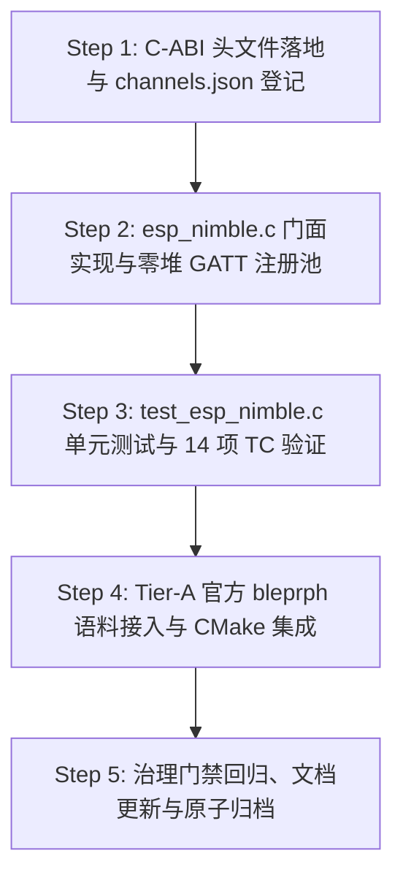

# ESP-IDF 仿真拦截层实施计划 M4-3：NimBLE 虚拟 GATT 服务与特征值抽象（BLE 外设仿真拦截）

> 📋 **计划状态声明**：
> 本计划为 ESP-IDF 仿真拦截层 M4 里程碑第三阶段（蓝牙外设协议栈拦截与 GATT 虚拟化）。
> **继承总纲**：[`PLAN-20260922-ESP-IDF-SIM-MASTER`](./2026-09-22-esp-idf-simulation-interception-master-plan.md) (v3.5)
> **路线图锚定**：[`PLAN-20260927-ESP-IDF-SIM-M4-CONNECTIVITY`](./2026-09-27-esp-idf-sim-m4-wifi-ble-connectivity-roadmap.md) (v1.1) §4 Task M4-3
> **当前状态**：📋 就绪待评审（v1.0 架构设计与技术方案已锚定）
> 🎯 **计划版本**：v1.0（2026-09-27）
> 📚 **关联规范**：`docs-adr.md`、`03-coding-guidelines.md`、`00-IMPLEMENTATION-PLAN-TEMPLATE.md`、[ADR-0012](../../decisions/core/0012-contract-honesty-over-silent-degradation.md)（合约诚实原则）、[ADR-0045](../../decisions/core/0045-unified-memory-and-zero-heap-contract.md)（零运行时堆分配）、[ADR-0057](../../decisions/core/0057-pal-adc-subsystem-and-channel-3-analog-contract.md)（PAL 保持对网络与射频无知）、[ADR-0083/0084](../../decisions/core/0083-dual-target-compilation-and-license-boundaries.md)（许可分层）、[ADR-0087](../../decisions/core/0087-esp-idf-asset-channels-and-soc-data-ownership.md)（手写头文件通道）

---

## 1. 元数据表（🔴 必选）

| 字段 | 内容 |
|:---|:---|
| **计划编号** | `PLAN-20260927-ESP-IDF-SIM-M4-3-NIMBLE-GATT` |
| **创建日期** | 2026-09-27 |
| **目标平台/SoC** | `wasm32-unknown-emscripten` / `host` (x86_64, Windows/Linux)；前端交互环境：`@wink-ai/unisim` (Browser) |
| **工具链/SDK版本**| ESP-IDF v6.1@fff9895c vendored / MinGW GCC 16 / Emscripten 4.0.10 |
| **计划状态** | 📋 就绪待评审（v1.0 设计与测试规约已锚定） |
| **优先级** | 🟡 P1（M4-1 Wi-Fi 与 M4-2 MQTT/HTTP 闭环后的近场无线连接拓展） |
| **计划版本** | `v1.0` |
| **关联技术设计** | [`docs/zh/design/04-wasm-simulation/00-README.md`](../../zh/design/04-wasm-simulation/00-README.md)、[`docs/implementation-plans/esp32/2026-09-27-esp-idf-sim-m4-wifi-ble-connectivity-roadmap.md`](./2026-09-27-esp-idf-sim-m4-wifi-ble-connectivity-roadmap.md) |
| **关联设计规范** | [`wink-micro-os/frameworks/esp_idf/docs/01-architecture-and-governance-guide.md`](../../../wink-micro-os/frameworks/esp_idf/docs/01-architecture-and-governance-guide.md) |
| **关联 ADR** | [ADR-0012](../../decisions/core/0012-contract-honesty-over-silent-degradation.md)（Fail-Loud）、[ADR-0045](../../decisions/core/0045-unified-memory-and-zero-heap-contract.md)（零堆分配）、[ADR-0057](../../decisions/core/0057-pal-adc-subsystem-and-channel-3-analog-contract.md)（PAL 无知射频）、[ADR-0083/0084](../../decisions/core/0083-dual-target-compilation-and-license-boundaries.md)（许可分层）、[ADR-0087](../../decisions/core/0087-esp-idf-asset-channels-and-soc-data-ownership.md)（手写头文件通道） |
| **目标里程碑** | M4-3（NimBLE 虚拟 GATT 服务与特征值抽象） |
| **前置依赖计划** | [`./2026-09-27-esp-idf-sim-m4-2-mqtt-http-plan.md`](./2026-09-27-esp-idf-sim-m4-2-mqtt-http-plan.md)（✅ 已 100% 验收结项，60/60 测试全绿） |
| **计划负责人** | 仿真拦截专项小组 & UniSim 前端引擎组 |
| **所需子代理技能** | `embedded-best-practice` |

---

## 2. 背景与目标（🔴 必选）

### 2.1 问题陈述

在物联网与智能硬件场景中，低功耗蓝牙（BLE, Bluetooth Low Energy）是近场配置、传感器直连与手机交互（App 配网、无感开锁、手环数据同步）的核心通信手段。真实 AI 生成的 ESP32 固件中大量使用 BLE Peripheral 角色对外暴露 GATT（Generic Attribute Profile）服务。

然而，在 Wasm 浏览器沙箱与 Host 仿真环境下，模拟物理蓝牙面临极为苛刻的客观障碍：
1. **原厂 Bluedroid 协议栈极其沉重且非纯 C 静态分发**：ESP-IDF 经典的 Bluedroid 源码体量达数十万行，存在大量复杂的深层动态内存分配（`malloc`/`free`）、操作系统线程交织与专有底层驱动，根本无法轻量化移植到 Wasm 协同 Fiber 环境中；
2. **射频物理连续域不可逆（[ADR-0012](../../decisions/core/0012-contract-honesty-over-silent-degradation.md)）**：仿真环境无法也不应模拟 2.4GHz 空间跳频（FHSS）、物理层 GFSK 调制解调与天线增益；
3. **前端 UniSim 联调诉求（M4-4 前置）**：UniSim 前端需要一个纯粹、清晰的**“声明式 GATT 服务注册表”**，以树状结构直接向用户展示 Characteristic，支持用户在 Web 端像使用手机蓝牙调试助手（如 LightBlue/nRF Connect）一样进行读取、写入与接收 Notify 广播。

### 2.2 核心选型决策：全栈拥抱 Apache Mynewt NimBLE 门面

针对上述问题，本计划执行 [`PLAN-20260927-ESP-IDF-SIM-M4-CONNECTIVITY`](./2026-09-27-esp-idf-sim-m4-wifi-ble-connectivity-roadmap.md) §4 锚定的战略选型：
- **坚决剔除 Bluedroid**，全面拦截与实现 **Apache Mynewt NimBLE** 风格的 ESP-IDF API；
- NimBLE 本身具有极度轻量、纯 C 静态结构体声明服务、事件回调模型清晰的巨大优势，非常适合与 WinkMicroOS 的零堆内存红线契约无缝结合。

### 2.3 技术与业务目标

- ✅ **目标 1：零修改 C-ABI 头文件闭包（NimBLE 官方接口）**：
  - 手写实现 NimBLE 核心头文件：`host/ble_hs.h`、`host/ble_uuid.h`、`host/ble_gap.h`、`host/ble_gatt.h`、`services/gap/ble_svc_gap.h`、`services/gatt/ble_svc_gatt.h`、`nimble/nimble_port.h`、`nimble/nimble_port_freertos.h` 与轻量 `os/os_mbuf.h`；
  - 完整声明 `struct ble_gatt_svc_def`、`struct ble_gatt_chr_def`、`struct ble_gatt_dsc_def`、`struct ble_gatt_access_ctxt` 等标准结构体与标志位宏（`BLE_GATT_CHR_F_READ` / `WRITE` / `NOTIFY` 等）；
  - 登记至 `channels.json`并通过 `check_harvested_headers.py` 自动化门禁。
- ✅ **目标 2：零堆静态 GATT 注册池（[ADR-0045](../../decisions/core/0045-unified-memory-and-zero-heap-contract.md)）**：
  - 严禁任何运行时动态内存分配。在 `src/bluetooth/esp_nimble.c` 内部预分配紧凑的静态 POD 槽位（最多 4 个 Service、16 个 Characteristic、16 个 Descriptor）；
  - `ble_gatts_count_cfg()` 遍历服务声明数组进行静态容量上限校验，超限时 Fail-Loud 报错；
  - `ble_gatts_add_svcs()` 递归/平面解析服务树，登记属性表并顺序分配单调递增的 `val_handle`（从 `0x0001` 开始）。
- ✅ **目标 3：GAP 广播与虚拟连接状态机**：
  - 实现 `ble_gap_adv_start()` / `ble_gap_adv_stop()` / `ble_gap_adv_active()`，解析广播名称（Device Name）与广播字段；
  - 提供单链路虚拟连接状态机：支持触发 `BLE_GAP_EVENT_CONNECT` 与 `BLE_GAP_EVENT_DISCONNECT`；
  - 支持虚拟 MTU 协商（默认 256 字节）与 `BLE_GAP_EVENT_MTU` 派发。
- ✅ **目标 4：GATT 读写回调与订阅通知（Notify/Indicate）分发**：
  - 当外部发起读取时，构造 `BLE_GATT_ACCESS_OP_READ_CHR` 上下文并调用应用注册的 `access_cb`；
  - 当外部发起写入时，构造 `BLE_GATT_ACCESS_OP_WRITE_CHR` 上下文并将写入数据安全拷贝至应用回调；
  - 属性权限校验：对没有 `READ` 权限的特征值拒绝读请求，对没有 `WRITE` 权限的特征值拒绝写请求；
  - 固件主动调用 `ble_gatts_chr_updated()` 时，若该特征值处于已订阅状态（Subscribed），向 UniSim 导出钩子（`esp_nimble_sim_set_notify_hook`）推送最新数据。
- ✅ **目标 5：UniSim 桥接与测试注入桩（Wasm Bridge 准备）**：
  - 导出测试与仿真注入 API：`esp_nimble_sim_connect`、`esp_nimble_sim_disconnect`、`esp_nimble_sim_write_chr`、`esp_nimble_sim_read_chr`、`esp_nimble_sim_subscribe`、`esp_nimble_sim_reset`；
  - 导出符号全部使用 `WINK_SIM_EXPORT` 修饰，确保在 Wasm 生产模式下不会被 DCE（死代码消除）。
- ✅ **目标 6：官方语料 Tier-A 构建验证**：
  - 引入 ESP-IDF 官方黄金例程 `examples/bluetooth/nimble/bleprph`（BLE Peripheral 例程，包含 `main.c` 与 `gatt_svr.c`）；
  - 验证该语料在 Host 与 Wasm 下零告警构建通过。

### 2.4 成功指标（分级验收出口）

| 指标 | 通过标准 | 验证方法 |
|:---|:---|:---|
| **L0 编译门禁** | Host `-Wall -Wextra -Werror` 0 warning；Wasm `emcc` 编译通过 | CMake / CTest 编译检查 |
| **L0 治理门禁** | `check_harvested_headers.py` 0 error；`check_license_map.py` satisfied | Python 自动化门禁脚本 |
| **L0 架构门禁** | `winkcli lint --pack layering --pack api` 0 findings | winkcli 静态分析工具 |
| **L1 单元测试** | `test_esp_nimble`（≥14 个用例）100% 通过（TC-BLE-01 ~ TC-BLE-14 全绿） | Unity 测试套件 |
| **L1 零回归测试** | 既有 60 项 CTest **100% 零破坏通过**（测试总数提升至 63+ 项） | `ctest -L esp_idf` |
| **L2 语料编译** | `esp_idf_corpus_bleprph_obj` 0 warning 构建通过 | `OBJECT` 库编译目标 |

---

## 3. 变更范围与影响分析（🔴 必选）

### 3.1 文件变更清单

| 文件路径 | 变更类型 | 说明 |
|:---|:---:|:---|
| `wink-micro-os/frameworks/esp_idf/include/nimble/nimble_port.h` | 🆕 手写 | NimBLE Port 初始化、运行与反初始化公开 API |
| `wink-micro-os/frameworks/esp_idf/include/nimble/nimble_port_freertos.h` | 🆕 手写 | NimBLE FreeRTOS 任务绑定公开 API |
| `wink-micro-os/frameworks/esp_idf/include/host/ble_hs.h` | 🆕 手写 | NimBLE Host 核心配置、同步回调、错误码全集 |
| `wink-micro-os/frameworks/esp_idf/include/host/ble_uuid.h` | 🆕 手写 | 16/32/128-bit UUID 结构体、宏与比较函数 |
| `wink-micro-os/frameworks/esp_idf/include/host/ble_gap.h` | 🆕 手写 | GAP 广播参数、连接描述符与 GAP 事件派发模型 |
| `wink-micro-os/frameworks/esp_idf/include/host/ble_gatt.h` | 🆕 手写 | GATT 服务、特征值、描述符声明结构体与访问回调上下文 |
| `wink-micro-os/frameworks/esp_idf/include/services/gap/ble_svc_gap.h` | 🆕 手写 | GAP 内置服务（Device Name）门面 |
| `wink-micro-os/frameworks/esp_idf/include/services/gatt/ble_svc_gatt.h` | 🆕 手写 | GATT 内置服务初始化门面 |
| `wink-micro-os/frameworks/esp_idf/include/os/os_mbuf.h` | 🆕 手写 | 零堆轻量静态 mbuf 结构体与数据读写宏 |
| `wink-micro-os/frameworks/esp_idf/src/bluetooth/esp_nimble.c` | 🆕 LGPL | 静态零堆 GATT 注册池、GAP 状态机、回调分发与 Sim 钩子 |
| `wink-micro-os/frameworks/esp_idf/channels.json` | ✏️ 修改 | 登记 9 个新增手写 NimBLE 头文件 |
| `wink-micro-os/frameworks/esp_idf/esp_idf_sources.cmake` | ✏️ 修改 | 将 `esp_nimble.c` 追加至源文件列表 |
| `wink-micro-os/frameworks/esp_idf/test/core/test_esp_nimble.c` | 🆕 GPL | NimBLE 14 项全覆盖测试套件（注册、读写回调、广播、Notify等） |
| `wink-micro-os/frameworks/esp_idf/test/corpus/bleprph/` | 🆕 语料 | 官方 `bleprph` 示例语料与配套 `sdkconfig.h`、`bleprph.h` 桩 |
| `wink-micro-os/test/CMakeLists.txt` | ✏️ 修改 | 注册测试目标、Tier-A 语料库与 Wasm 编译门禁 |
| `wink-micro-os/frameworks/esp_idf/docs/02-api-coverage-matrix.md` | ✏️ 修改 | 升级 v2.5，登记 NimBLE GAP/GATT API 矩阵 |
| `wink-micro-os/frameworks/esp_idf/docs/03-include-closure-inventory.md` | ✏️ 修改 | 升级 v1.6，登记新增蓝牙头文件 |
| `docs/implementation-plans/esp32/00-README.md` | ✏️ 修改 | 登记 M4-3 状态与索引 |

### 3.2 架构红线审计

1. 🚨 **PAL 绝对无知蓝牙与射频（[ADR-0057](../../decisions/core/0057-pal-adc-subsystem-and-channel-3-analog-contract.md)）**：严禁在 `pal/include/` 下增加任何蓝牙、GAP 或 GATT 相关头文件与符号。所有蓝牙拦截完全自闭环在 `frameworks/esp_idf/` 内部。
2. 🚨 **零运行时动态内存（[ADR-0045](../../decisions/core/0045-unified-memory-and-zero-heap-contract.md)）**：GATT 服务表、特征值槽位、描述符数组、连接描述符全部静态 BSS 分配，禁止使用 `malloc` / `free`。
3. 🚨 **合约诚实与 Fail-Loud（[ADR-0012](../../decisions/core/0012-contract-honesty-over-silent-degradation.md)）**：当应用注册的服务树超出静态预设上限（如 >4 个服务或 >16 个特征值）时，`ble_gatts_count_cfg` 必须显式 `ESP_LOGE` 报警并返回 `BLE_HS_ENOMEM`，禁止静默截断。
4. 🚨 **通道资产归属（[ADR-0087](../../decisions/core/0087-esp-idf-asset-channels-and-soc-data-ownership.md)）**：所有手写新增头文件必须登记于 `channels.json` 的 `handwritten` 列表。
5. 🚨 **开源许可隔离（[ADR-0083/0084](../../decisions/core/0083-dual-target-compilation-and-license-boundaries.md)）**：`src/bluetooth/**` 严格为 `LGPL-3.0-only`，测试代码严格为 `GPL-3.0-only`，语料桩代码为 `CC0-1.0`。

---

## 4. 详细技术方案设计

### 4.1 C-ABI 头文件闭包（Task A）

#### 4.1.1 `host/ble_uuid.h`
定义标准 16/32/128 位 UUID 格式及声明宏：
```c
/* SPDX-License-Identifier: LGPL-3.0-only */
#pragma once
#include <stdint.h>
#include <stdbool.h>
#include <string.h>

#ifdef __cplusplus
extern "C" {
#endif

enum {
    BLE_UUID_TYPE_16 = 16,
    BLE_UUID_TYPE_32 = 32,
    BLE_UUID_TYPE_128 = 128,
};

typedef struct ble_uuid {
    uint8_t type;
} ble_uuid_t;

typedef struct ble_uuid16 {
    ble_uuid_t u;
    uint16_t value;
} ble_uuid16_t;

typedef struct ble_uuid128 {
    ble_uuid_t u;
    uint8_t value[16];
} ble_uuid128_t;

#define BLE_UUID16_DECLARE(val) \
    ((const ble_uuid_t *) (&(const ble_uuid16_t) { \
        .u = { .type = BLE_UUID_TYPE_16 }, \
        .value = (val), \
    }))

#define BLE_UUID128_DECLARE(...) \
    ((const ble_uuid_t *) (&(const ble_uuid128_t) { \
        .u = { .type = BLE_UUID_TYPE_128 }, \
        .value = { __VA_ARGS__ }, \
    }))

int ble_uuid_cmp(const ble_uuid_t *a, const ble_uuid_t *b);
char *ble_uuid_to_str(const ble_uuid_t *uuid, char *dst);

#ifdef __cplusplus
}
#endif
```

#### 4.1.2 `host/ble_gatt.h`
声明标准 GATT 服务树与访问上下文：
```c
/* SPDX-License-Identifier: LGPL-3.0-only */
#pragma once
#include "host/ble_uuid.h"
#include "os/os_mbuf.h"

#ifdef __cplusplus
extern "C" {
#endif

#define BLE_GATT_SVC_TYPE_END         0
#define BLE_GATT_SVC_TYPE_PRIMARY     1
#define BLE_GATT_SVC_TYPE_SECONDARY   2

#define BLE_GATT_CHR_F_BROADCAST      0x0001
#define BLE_GATT_CHR_F_READ           0x0002
#define BLE_GATT_CHR_F_WRITE_NO_RSP   0x0004
#define BLE_GATT_CHR_F_WRITE          0x0008
#define BLE_GATT_CHR_F_NOTIFY         0x0010
#define BLE_GATT_CHR_F_INDICATE       0x0020

#define BLE_GATT_ACCESS_OP_READ_CHR   0
#define BLE_GATT_ACCESS_OP_WRITE_CHR  1
#define BLE_GATT_ACCESS_OP_READ_DSC   2
#define BLE_GATT_ACCESS_OP_WRITE_DSC  3

struct ble_gatt_access_ctxt;
struct ble_gatt_chr_def;
struct ble_gatt_dsc_def;

typedef int ble_gatt_access_fn(uint16_t conn_handle, uint16_t attr_handle,
                               struct ble_gatt_access_ctxt *ctxt, void *arg);

struct ble_gatt_access_ctxt {
    uint8_t op;
    union {
        struct {
            const struct ble_gatt_chr_def *chr;
        } chr;
        struct {
            const struct ble_gatt_dsc_def *dsc;
        } dsc;
    };
    struct os_mbuf *om;
};

struct ble_gatt_dsc_def {
    const ble_uuid_t *uuid;
    uint8_t att_flags;
    uint8_t min_key_size;
    ble_gatt_access_fn *access_cb;
    void *arg;
};

struct ble_gatt_chr_def {
    const ble_uuid_t *uuid;
    ble_gatt_access_fn *access_cb;
    void *arg;
    const struct ble_gatt_dsc_def *descriptors;
    uint16_t flags;
    uint8_t min_key_size;
    uint16_t *val_handle;
};

struct ble_gatt_svc_def {
    uint8_t type;
    const ble_uuid_t *uuid;
    const struct ble_gatt_svc_def **includes;
    const struct ble_gatt_chr_def *characteristics;
};

int ble_gatts_count_cfg(const struct ble_gatt_svc_def *defs);
int ble_gatts_add_svcs(const struct ble_gatt_svc_def *svcs);
int ble_gatts_start(void);
int ble_gatts_chr_updated(uint16_t chr_def_handle);
int ble_gatts_notify_custom(uint16_t conn_handle, uint16_t val_handle, struct os_mbuf *om);

#ifdef __cplusplus
}
#endif
```

#### 4.1.3 `host/ble_gap.h`
定义广播参数、连接事件与描述符：
```c
/* SPDX-License-Identifier: LGPL-3.0-only */
#pragma once
#include <stdint.h>
#include <stdbool.h>
#include "host/ble_uuid.h"

#ifdef __cplusplus
extern "C" {
#endif

#define BLE_GAP_EVENT_CONNECT        0
#define BLE_GAP_EVENT_DISCONNECT     1
#define BLE_GAP_EVENT_ADV_COMPLETE   4
#define BLE_GAP_EVENT_SUBSCRIBE      5
#define BLE_GAP_EVENT_MTU            6

typedef struct {
    uint8_t type;
    uint8_t val[6];
} ble_addr_t;

struct ble_gap_conn_desc {
    uint16_t conn_handle;
    uint16_t conn_itvl;
    uint16_t conn_latency;
    uint16_t supervision_timeout;
    uint8_t role;
    uint8_t master_id;
    ble_addr_t peer_id_addr;
    ble_addr_t peer_ota_addr;
    ble_addr_t our_id_addr;
    ble_addr_t our_ota_addr;
};

struct ble_gap_event {
    uint8_t type;
    union {
        struct {
            int status;
            struct ble_gap_conn_desc conn;
        } connect;
        struct {
            int reason;
            struct ble_gap_conn_desc conn;
        } disconnect;
        struct {
            int reason;
        } adv_complete;
        struct {
            uint16_t conn_handle;
            uint16_t attr_handle;
            uint8_t reason;
            uint8_t prev_notify:1;
            uint8_t cur_notify:1;
            uint8_t prev_indicate:1;
            uint8_t cur_indicate:1;
        } subscribe;
        struct {
            uint16_t conn_handle;
            uint16_t channel_id;
            uint16_t value;
        } mtu;
    };
};

typedef int ble_gap_event_fn(struct ble_gap_event *event, void *arg);

struct ble_gap_adv_params {
    uint8_t conn_mode;
    uint8_t disc_mode;
    uint16_t itvl_min;
    uint16_t itvl_max;
    uint8_t channel_map;
    uint8_t filter_policy;
    uint8_t high_duty_cycle:1;
};

struct ble_hs_adv_fields {
    uint8_t flags;
    const uint8_t *name;
    uint8_t name_len;
    uint8_t name_is_complete:1;
    const ble_uuid16_t *uuids16;
    uint8_t num_uuids16;
    uint8_t uuids16_is_complete:1;
    int8_t tx_pwr_lvl;
    uint8_t tx_pwr_lvl_is_present:1;
};

int ble_gap_adv_start(uint8_t own_addr_type, const ble_addr_t *direct_addr,
                      int32_t duration_ms, const struct ble_gap_adv_params *adv_params,
                      ble_gap_event_fn *cb, void *cb_arg);
int ble_gap_adv_stop(void);
int ble_gap_adv_active(void);
int ble_gap_adv_set_fields(const struct ble_hs_adv_fields *adv_fields);
int ble_gap_conn_find(uint16_t conn_handle, struct ble_gap_conn_desc *out_desc);

#ifdef __cplusplus
}
#endif
```

#### 4.1.4 `host/ble_hs.h` & `nimble/nimble_port.h`
声明 Host 核心配置结构、错误码与启动接口：
```c
/* SPDX-License-Identifier: LGPL-3.0-only */
#pragma once
#include <stdint.h>
#include <stdbool.h>
#include "esp_err.h"
#include "os/os_mbuf.h"

#ifdef __cplusplus
extern "C" {
#endif

#if defined(__EMSCRIPTEN__)
#  include <emscripten.h>
#  define WINK_SIM_EXPORT EMSCRIPTEN_KEEPALIVE
#else
#  define WINK_SIM_EXPORT
#endif

#define BLE_HS_EAGAIN       1
#define BLE_HS_EALREADY     2
#define BLE_HS_EINVAL       3
#define BLE_HS_ENOMEM       4
#define BLE_HS_ENOTCONN     5
#define BLE_HS_ENOTSUP      6
#define BLE_HS_EAPP         7
#define BLE_HS_EDONE        8

typedef void ble_hs_sync_fn(void);
typedef void ble_hs_reset_fn(int reason);

struct ble_hs_cfg {
    ble_hs_sync_fn *sync_cb;
    ble_hs_reset_fn *reset_cb;
    void *store_status_cb;
};

extern struct ble_hs_cfg ble_hs_cfg;

int ble_hs_init(void);
int ble_hs_is_enabled(void);
int ble_hs_mbuf_to_flat(const struct os_mbuf *om, void *flat, uint16_t max_len, uint16_t *out_len);

esp_err_t nimble_port_init(void);
esp_err_t nimble_port_deinit(void);
void nimble_port_run(void);
esp_err_t nimble_port_stop(void);
void nimble_port_freertos_init(void (*host_task_fn)(void *param));
void nimble_port_freertos_deinit(void);

#ifdef __cplusplus
}
#endif
```

#### 4.1.5 `os/os_mbuf.h`
零堆轻量静态 mbuf 实现：
```c
/* SPDX-License-Identifier: LGPL-3.0-only */
#pragma once
#include <stdint.h>
#include <stddef.h>
#include <string.h>

#ifdef __cplusplus
extern "C" {
#endif

#define OS_MBUF_DATA(om, type) ((type)((om)->om_data))

struct os_mbuf {
    uint8_t *om_data;
    uint16_t om_len;
    uint8_t om_databuf[256];
};

static inline int os_mbuf_append(struct os_mbuf *om, const void *data, uint16_t len) {
    if (!om || !data) return -1;
    if ((uint32_t)om->om_len + len > sizeof(om->om_databuf)) return -1;
    memcpy(om->om_databuf + om->om_len, data, len);
    om->om_len += len;
    om->om_data = om->om_databuf;
    return 0;
}

static inline void os_mbuf_free_chain(struct os_mbuf *om) {
    (void)om;
}

#ifdef __cplusplus
}
#endif
```

---

### 4.2 NimBLE 内存态零堆 GATT Server 拦截架构（Task B）

在 `wink-micro-os/frameworks/esp_idf/src/bluetooth/esp_nimble.c` 中落地全套仿真逻辑：

```text
┌────────────────────────────────────────────────────────────────────────┐
│                   ESP-IDF 应用层业务代码 (100% 原文零修改)               │
│        (bleprph / ble_gatts_add_svcs / ble_gap_adv_start)              │
└───────────────────────────────────┬────────────────────────────────────┘
                                    │ C-ABI
┌───────────────────────────────────▼────────────────────────────────────┐
│         src/bluetooth/esp_nimble.c 仿真拦截门面 (LGPL-3.0-only)        │
│                                                                        │
│  ┌───────────────────────┐  ┌───────────────────────┐                  │
│  │ 静态 GATT 服务注册表   │  │ 静态 Characteristic 表 │ (Max 16 Chrs)    │
│  │ (Max 4 Services)      │  │ (UUID, flags, handle) │                  │
│  └───────────────────────┘  └───────────────────────┘                  │
│  ┌───────────────────────┐  ┌───────────────────────┐                  │
│  │ GAP 广播状态机         │  │ 虚拟单链路连接描述符   │ (conn_handle = 1)│
│  └───────────────────────┘  └───────────────────────┘                  │
│                                                                        │
│  - ble_gatts_count_cfg() / ble_gatts_add_svcs(): 零堆注册               │
│  - access_cb(OP_READ/WRITE): 属性权限校验与安全分发                    │
│  - ble_gatts_chr_updated(): 订阅事件通知触发                           │
└───────────────────────────────────┬────────────────────────────────────┘
                                    │ WINK_SIM_EXPORT
┌───────────────────────────────────▼────────────────────────────────────┐
│            UniSim 测试与前端桥接 API (Web / CTest / TypeScript)         │
│  - esp_nimble_sim_connect() / disconnect()                             │
│  - esp_nimble_sim_write_chr() / read_chr()                             │
│  - esp_nimble_sim_subscribe()                                          │
│  - esp_nimble_sim_set_notify_hook(): 前端 Notify 实时推流钩子          │
└────────────────────────────────────────────────────────────────────────┘
```

#### 4.2.1 静态内存预算与槽位池定义（[ADR-0045](../../decisions/core/0045-unified-memory-and-zero-heap-contract.md)）

```c
#define SIM_BLE_MAX_SERVICES    4
#define SIM_BLE_MAX_CHRS        16
#define SIM_BLE_MAX_DSCS        16
#define SIM_BLE_MAX_NAME_LEN    32
#define SIM_BLE_MAX_VALUE_LEN   128

typedef struct {
    uint16_t handle;
    const ble_uuid_t *uuid;
    ble_gatt_access_fn *access_cb;
    void *arg;
    uint16_t flags;
    uint16_t *val_handle_ptr;
    uint8_t value[SIM_BLE_MAX_VALUE_LEN];
    uint16_t value_len;
    bool is_subscribed_notify;
    bool is_subscribed_indicate;
} sim_ble_chr_record_t;

typedef struct {
    uint8_t type;
    const ble_uuid_t *uuid;
    uint16_t start_handle;
    uint16_t end_handle;
} sim_ble_svc_record_t;

typedef struct {
    bool is_initialized;
    bool is_advertising;
    bool is_connected;
    char device_name[SIM_BLE_MAX_NAME_LEN];
    
    // GAP 广播
    struct ble_gap_adv_params adv_params;
    ble_gap_event_fn *adv_cb;
    void *adv_cb_arg;
    
    // GATT 资源
    sim_ble_svc_record_t svcs[SIM_BLE_MAX_SERVICES];
    uint8_t num_svcs;
    sim_ble_chr_record_t chrs[SIM_BLE_MAX_CHRS];
    uint8_t num_chrs;
    
    // 连接
    struct ble_gap_conn_desc conn;
    
    // UniSim 外部钩子
    esp_nimble_sim_notify_hook_t notify_hook;
} sim_ble_state_t;

static sim_ble_state_t s_ble_state;
```

#### 4.2.2 核心实现逻辑与边界防御

1. **`ble_gatts_count_cfg` 与 `ble_gatts_add_svcs`**：
   - 遍历传入的服务数组（以 `type == 0` 终结）；
   - 对每一个 Service，遍历其 `characteristics` 数组（以 `uuid == NULL` 终结）；
   - 严格检查 `num_svcs <= SIM_BLE_MAX_SERVICES` 与 `num_chrs <= SIM_BLE_MAX_CHRS`，超出即返回 `BLE_HS_ENOMEM`；
   - 为每个 Characteristic 分配从 `0x0001` 开始单调自增的属性句柄，并回填到应用的 `*chr->val_handle`。
2. **`ble_gap_adv_start` 与连接生命周期**：
   - 将 `s_ble_state.is_advertising = true`，记录回调函数 `adv_cb`；
   - 当调用测试/前端注入接口 `esp_nimble_sim_connect()` 时：
     1. 停止广播（`is_advertising = false`）；
     2. 构造 `struct ble_gap_event ev = { .type = BLE_GAP_EVENT_CONNECT, .connect = { .status = 0, .conn = ... } }`；
     3. 触发应用的 `adv_cb(&ev, adv_cb_arg)`；
     4. 随后派发默认 MTU 事件 `BLE_GAP_EVENT_MTU`（`mtu = 256`）。
3. **特征值读写分发与权限守卫**：
   - **读取**（`esp_nimble_sim_read_chr`）：
     - 校验特征值标志位是否包含 `BLE_GATT_CHR_F_READ`，不包含则返回 `BLE_HS_ENOTSUP`；
     - 构造 `struct os_mbuf om = {0}`；
     - 构造 `struct ble_gatt_access_ctxt ctxt = { .op = BLE_GATT_ACCESS_OP_READ_CHR, .om = &om }`；
     - 调用 `chr->access_cb(conn_handle, chr->handle, &ctxt, chr->arg)`；
     - 将 `om` 中产生的数据拷贝至输出缓冲。
   - **写入**（`esp_nimble_sim_write_chr`）：
     - 校验特征值标志位是否包含 `BLE_GATT_CHR_F_WRITE` 或 `BLE_GATT_CHR_F_WRITE_NO_RSP`，不包含则返回 `BLE_HS_ENOTSUP`；
     - 构造预填数据的 `os_mbuf`；
     - 构造 `ctxt = { .op = BLE_GATT_ACCESS_OP_WRITE_CHR, .om = &om }`；
     - 调用 `chr->access_cb(...)`；
     - 返回执行状态码。
4. **订阅通知与主动推送（`ble_gatts_chr_updated`）**：
   - 固件更新特征值数值后调用 `ble_gatts_chr_updated(val_handle)`；
   - 若该特征值已通过 `esp_nimble_sim_subscribe()` 激活 Notify 标志：
     - 若注册了 `notify_hook`，直接向前端/测试宿主推送特征值更新事件与数据载荷；
     - 返回 `0`。

---

### 4.3 官方语料 Tier-A 验证（Task C）

选定乐鑫官方经典语料：
**`examples/bluetooth/nimble/bleprph`**
（包含外设广播、GAP 服务、自定义 GATT Heart Rate / Device Info 服务）。

- 放置于 `wink-micro-os/frameworks/esp_idf/test/corpus/bleprph/`；
- 配备轻量 `sdkconfig.h` 与 `bleprph.h` 桩文件；
- 在 `CMakeLists.txt` 中配置为 `OBJECT` 库并绑定 `-Wall -Wextra -Werror` 门禁。

---

### 4.4 单元测试矩阵（Task D）

创建 `wink-micro-os/frameworks/esp_idf/test/core/test_esp_nimble.c`，实现 **14 项全绿单测**：

| 用例 ID | 测试项 | 验证内容与断言 |
|:---|:---|:---|
| **TC-BLE-01** | Port 生命周期与 Sync 回调 | `nimble_port_init` 成功，注册 `sync_cb` 并在任务循环中成功触发 |
| **TC-BLE-02** | GAP 设备名称读写 | `ble_svc_gap_device_name_set("Wink-BLE")` 后获取名称完全一致 |
| **TC-BLE-03** | GATT 资源静态计数与越界防护 | 注册 3 个服务通过；注册 5 个服务超过上限返回 `BLE_HS_ENOMEM` |
| **TC-BLE-04** | 服务与特征值句柄自增分配 | 注册含 2 个特征值的服务，`val_handle` 分别被正确赋值为 `1` 与 `2` |
| **TC-BLE-05** | UUID 16-bit 与 128-bit 比较 | `ble_uuid_cmp` 正确区分相同/不同 16 位与 128 位 UUID |
| **TC-BLE-06** | GAP 广播启停状态流转 | `adv_start` 后 `adv_active() == 1`；`adv_stop` 后 `adv_active() == 0` |
| **TC-BLE-07** | 虚拟连接事件建立与 MTU 协商 | `esp_nimble_sim_connect` 触发 `BLE_GAP_EVENT_CONNECT` 与 `MTU=256` |
| **TC-BLE-08** | 虚拟断开连接事件流转 | `esp_nimble_sim_disconnect` 触发 `BLE_GAP_EVENT_DISCONNECT` |
| **TC-BLE-09** | GATT 特征值读回调执行 | 注入读请求，`access_cb(OP_READ_CHR)` 正确填充 mbuf 并由仿真层完整读出 |
| **TC-BLE-10** | GATT 特征值写回调执行 | 注入写请求，`access_cb(OP_WRITE_CHR)` 正确解析传入的字节流 |
| **TC-BLE-11** | 特征值读写权限守卫 | 对只读特征值执行写操作返回 `BLE_HS_ENOTSUP`；只写特征值读操作被拒绝 |
| **TC-BLE-12** | 订阅与 `chr_updated` 主动推送 | 订阅 Notify 后调用 `ble_gatts_chr_updated`，`notify_hook` 成功捕获更新 |
| **TC-BLE-13** | 非法句柄防御（Fail-Loud） | 对未注册的 `0x9999` 句柄读写，返回 `BLE_HS_EINVAL` 并报错 |
| **TC-BLE-14** | 仿真符号导出保全（Wasm DCE） | 验证 `esp_nimble_sim_*` 符号带有 `WINK_SIM_EXPORT` 属性 |

---

## 5. 逐步实施与分阶段计划（🔴 可执行）



### 步骤 1：C-ABI 头文件闭包落地与 channels 登记
- 创建 `host/ble_hs.h`、`host/ble_uuid.h`、`host/ble_gap.h`、`host/ble_gatt.h`、`services/gap/ble_svc_gap.h`、`services/gatt/ble_svc_gatt.h`、`nimble/nimble_port.h`、`nimble/nimble_port_freertos.h`、`os/os_mbuf.h`；
- 更新 `channels.json`，运行 `python .github/scripts/check_harvested_headers.py` 确保 0 errors；
- 检查 `python .github/scripts/check_license_map.py` 确保 SPDX 声明合规。

### 步骤 2：`esp_nimble.c` 门面与静态零堆 GATT 状态机实现
- 在 `wink-micro-os/frameworks/esp_idf/src/bluetooth/esp_nimble.c` 中实现静态服务池、GAP 广播逻辑、读写回调调度器与仿真注入接口；
- 更新 `esp_idf_sources.cmake` 将源码纳入构建。

### 步骤 3：编写单测与执行主机回归
- 创建 `wink-micro-os/frameworks/esp_idf/test/core/test_esp_nimble.c`；
- 在 `wink-micro-os/test/CMakeLists.txt` 中注册 `test_esp_nimble`；
- 运行 `ctest --test-dir build_esp_idf -R test_esp_nimble --output-on-failure` 确保 14/14 测试全部通过。

### 步骤 4：接入官方 `bleprph` 语料与 Wasm 门禁
- 导入官方例程源码至 `test/corpus/bleprph/`；
- 在 CMake 中添加 `esp_idf_corpus_bleprph_obj` 与 Wasm 编译检查；
- 运行 CTest 验证 Host GCC 与 Wasm `emcc` 零告警通过。

### 步骤 5：全量回归、文档更新与原子提交
- 运行全量 `ctest --test-dir build_esp_idf -L esp_idf` 确保 60+ 项测试全绿；
- 更新 `02-api-coverage-matrix.md`（v2.5）与 `03-include-closure-inventory.md`（v1.6）；
- 按原子提交规则分批次 Commit。

---

## 6. 风险评估与应对措施

| 风险项 | 严重级 | 应对策略 |
|:---|:---:|:---|
| **语料包含未声明的宏或复杂驱动桩** | 中 | 提取 `bleprph.h` 并在桩目录提供最小合法结构体与宏定义，不污染全局头文件 |
| **`os_mbuf` 宏展开与类型强转引发 Clang 告警** | 低 | 编写类型安全的内联辅助函数与宏，统一通过 `-Wall -Wextra -Werror` 校验 |
| **GATT 递归服务解析导致栈溢出** | 低 | 采用平面数组遍历算法，最大调用深度限制为 1，杜绝深层递归 |

---

## 7. 结项声明与签署

- 待用户正式评审并确认批准本计划后，将无缝切入 Step 1 执行！
