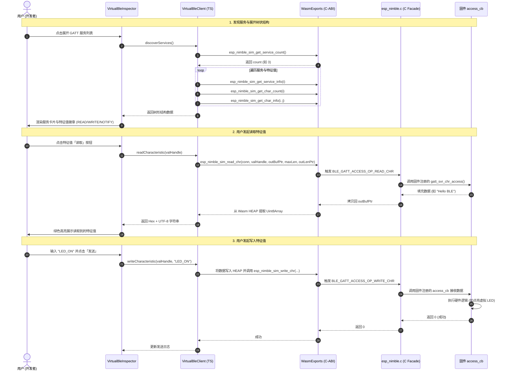
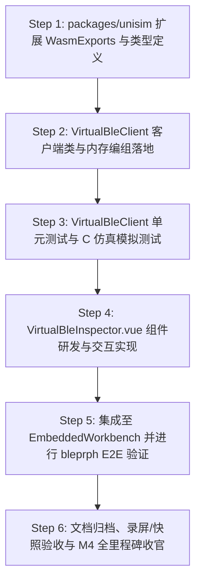

# ESP-IDF 仿真拦截层实施计划 M4-4：UniSim Web 交互式虚拟蓝牙调试面板（Virtual BLE Inspector）

> 📋 **计划状态声明**：
> 本计划为 ESP-IDF 仿真拦截层 M4 里程碑第四阶段（端到端 Web 虚拟蓝牙调试与 UniSim 前端联调）。
> **继承总纲**：[`PLAN-20260922-ESP-IDF-SIM-MASTER`](./2026-09-22-esp-idf-simulation-interception-master-plan.md) (v3.5)
> **路线图锚定**：[`PLAN-20260927-ESP-IDF-SIM-M4-CONNECTIVITY`](./2026-09-27-esp-idf-sim-m4-wifi-ble-connectivity-roadmap.md) (v2.0) §4 Task M4-4
> **当前状态**：🔄 计划就绪（v1.0 实施方案已全面锚定，待跨仓协同推进前端组件落地）
> 🎯 **计划版本**：v1.0（2026-09-27）
> 📚 **关联规范**：`docs-adr.md`、`03-coding-guidelines.md`、`00-IMPLEMENTATION-PLAN-TEMPLATE.md`、[ADR-0012](../../decisions/core/0012-contract-honesty-over-silent-degradation.md)（合约诚实原则）、[ADR-0045](../../decisions/core/0045-unified-memory-and-zero-heap-contract.md)（零运行时堆分配）、[ADR-0057](../../decisions/core/0057-pal-adc-subsystem-and-channel-3-analog-contract.md)（PAL 保持对网络与射频无知）、[ADR-0083/0084](../../decisions/core/0083-dual-target-compilation-and-license-boundaries.md)（许可分层与仓边界）

---

## 1. 元数据表（🔴 必选）

| 字段 | 内容 |
|:---|:---|
| **计划编号** | `PLAN-20260927-ESP-IDF-SIM-M4-4-UNISIM-BLE` |
| **创建日期** | 2026-09-27 |
| **目标平台/环境**| Web Browser / `@wink-ai/unisim` (TypeScript) / `packages/embedded-frontend` (Vue 3 / Vite) / Wasm32 |
| **运行时依赖** | Emscripten 4.0.10 / Vite / Vue 3 / Pinia |
| **计划状态** | 🔄 计划就绪（v1.0） |
| **优先级** | 🟡 P1（M4-3 NimBLE C 侧闭环后的前端交互闭环） |
| **计划版本** | `v1.0` |
| **关联技术设计** | [`docs/zh/design/04-wasm-simulation/00-README.md`](../../zh/design/04-wasm-simulation/00-README.md)、[`docs/implementation-plans/esp32/2026-09-27-esp-idf-sim-m4-wifi-ble-connectivity-roadmap.md`](./2026-09-27-esp-idf-sim-m4-wifi-ble-connectivity-roadmap.md) |
| **前置依赖计划** | [`./2026-09-27-esp-idf-sim-m4-3-nimble-gatt-plan.md`](./2026-09-27-esp-idf-sim-m4-3-nimble-gatt-plan.md)（✅ 已 100% 验收结项，65/65 测试全绿，C 端仿真导出 API 就绪） |
| **计划负责人** | UniSim 前端引擎组 & 仿真拦截专项小组 |
| **跨仓协作范围** | 固件 C 导出仓（`wink-ai-embedded`）↔ 前端应用仓（`wink-ai` 下 `packages/unisim`、`packages/embedded-frontend`） |

---

## 2. 背景与目标（🔴 必选）

### 2.1 问题陈述

在 Milestone M4-3 中，我们已完整实现了 ESP-IDF NimBLE C-ABI 仿真门面，包括静态 GATT 属性池（8 Service / 32 Characteristic / 32 Descriptor）、GAP 广播与虚拟连接、读写回调调度和通知推送流。官方 `bleprph`（BLE Peripheral 例程）在 Host 与 Wasm 下均已 0 warning 编译通过。

然而，**如果仿真固件运行在浏览器沙箱内却缺乏用户界面，固件将处于“纯后台运行的黑盒状态”**：
1. **开发者无法感知外设状态**：用户无法直观确认固件是否正在广播、广播名称（Local Name）是什么、广播了哪些 Service UUID；
2. **缺乏标准蓝牙调试助手交互体验**：在真实物理硬件开发中，工程师使用手机端 LightBlue / nRF Connect 查看 GATT 服务树并下发指令。在 Web 仿真中，急需一个内嵌在 Workbench 面板的“虚拟手机蓝牙调试助手”；
3. **数据读写与 Notify 验证断层**：固件通过 `ble_gatts_chr_updated()` 上报的传感器数据、电池电量等动态跳变无法在浏览器端实时以 Hex/字符串形式呈现或绘制波形。

### 2.2 技术与业务目标

- ✅ **目标 1：Wasm <-> TS 强类型导出契约对齐**：
  - 在 `packages/unisim/src/types/wasm/exports.ts` 中完整声明 M4-3 导出的 `esp_nimble_sim_*` 函数签名；
  - 建立 TS 端的 `BleServiceInfo` 与 `BleCharInfo` 映射接口，支持 16-bit / 128-bit UUID 解析与属性标志位（Read, Write, Notify, Indicate）格式化。
- ✅ **目标 2：UniSim 虚拟蓝牙客户端服务（`VirtualBleClient`）**：
  - 封装纯内存的 Wasm 桥接服务，提供 `connect()`、`disconnect()`、`discoverServices()`、`readCharacteristic()`、`writeCharacteristic()`、`subscribe()` 等异步高层 Promise API；
  - 注册 C 端导出的 `esp_nimble_sim_set_notify_hook`，实现 C 端主动上报数据到 JS 事件总线（EventBus/Observable）的无缝分发。
- ✅ **目标 3：UniSim 虚拟手机调试面板组件（`VirtualBleInspector.vue`）**：
  - **外设概览与链路控制区**：实时展示设备名、广播状态指示灯（Pulsing 绿点）、虚拟信号强度（RSSI）、一键「虚拟连接 / 断开」按钮与「复位」操作；
  - **树状 GATT 服务浏览器**：卡片式树形展开所有注册的 Service 与 Characteristic，自动将标准 SIG UUID（如 `0x180A` Device Information, `0x180F` Battery Service）转换为语义化标题；
  - **特征值交互控制台**：
    - 读取操作：点击「读取」按钮发起即时查询，实时显示十六进制与 ASCII/UTF-8 字符；
    - 写入操作：支持 Hex / 文本模式切换输入，一键发送至 C 固件触发 `access_cb(BLE_GATT_ACCESS_OP_WRITE)`；
    - 订阅通知：提供 Notify 开关，一旦开启，固件的后续数值变更将自动以高亮动画与波形日志呈现。
- ✅ **目标 4：端到端（E2E）集成与黄金语料验证**：
  - 在 `packages/embedded-frontend` 的 `EmbeddedWorkbench.vue` 侧边栏/检查器面板挂载 `VirtualBleInspector`；
  - 使用 M4-3 编译交付的 `bleprph` Wasm 固件进行端到端全链路联动测试，验证广播→扫描→连接→自省→读写→通知全链路闭环。

### 2.3 成功指标（分级验收出口）

| 指标 | 通过标准 | 验证方法 |
|:---|:---|:---|
| **L0 TS 类型检查** | `bun run lint` / `tsc --noEmit` 0 error，ABI 签名 100% 对齐 | TypeScript 编译检查 |
| **L1 服务单元测试** | `VirtualBleClient` 单元测试通过率 100%（涵盖连接、枚举、读、写、Notify 监听） | Vitest / Jest 测试套件 |
| **L2 UI 交互测试** | `VirtualBleInspector.vue` 挂载测试通过，模拟事件响应正常 | Vue Test Utils 组件测试 |
| **L3 E2E 真实联动** | 载入 `bleprph` Wasm，面板准确列出 DIS、HRS、Custom 服务，读写测试成功 | 浏览器端端联调与录屏/快照验收 |

---

## 3. 总体分层架构与交互序列

### 3.1 跨语言与跨环境架构模型

```text
┌────────────────────────────────────────────────────────────────────────┐
│               UniSim 嵌入式工作台前端 (Browser Web Application)           │
│                                                                        │
│   ┌────────────────────────────────────────────────────────────────┐   │
│   │        VirtualBleInspector.vue (虚拟手机蓝牙调试助手面板)        │   │
│   │  [设备状态/RSSI]  [连接/断开]  [GATT树状浏览器]  [读/写/Notify控制]│   │
│   └───────────────────────────────┬────────────────────────────────┘   │
│                                   │ 调用 & 响应                         │
│   ┌───────────────────────────────▼────────────────────────────────┐   │
│   │    VirtualBleClient (packages/unisim/src/core/ble/client.ts)   │   │
│   │    - 服务发现与属性缓存模型                                     │   │
│   │    - Hex / UTF-8 编码与 mbuf 打包                               │   │
│   │    - Notify 订阅侦听与回调路由分发                             │   │
│   └───────────────────────────────┬────────────────────────────────┘   │
└───────────────────────────────────┼────────────────────────────────────┘
                                    │ Emscripten WasmExports (ABI)
┌───────────────────────────────────▼────────────────────────────────────┐
│              Wasm 仿真内核 (wink-micro-os targets/wasm)                 │
│                                                                        │
│   ┌────────────────────────────────────────────────────────────────┐   │
│   │     Wasm C 导出桥接 (frameworks/esp_idf/src/bluetooth/esp_nimble.c) │
│   │   - esp_nimble_sim_connect / disconnect / reset                │   │
│   │   - esp_nimble_sim_get_service_count / info                    │   │
│   │   - esp_nimble_sim_get_char_count / info                       │   │
│   │   - esp_nimble_sim_read_chr / write_chr / subscribe            │   │
│   │   - esp_nimble_sim_set_notify_hook                             │   │
│   └───────────────────────────────┬────────────────────────────────┘   │
│                                   │ 内存访问 & 回调                    │
│   ┌───────────────────────────────▼────────────────────────────────┐   │
│   │    NimBLE 仿真门面与静态属性池 (8 Service / 32 Chr / 32 Dsc)    │   │
│   │  - ble_gatts_add_svcs / ble_gap_adv_start                      │   │
│   │  - 应用层 access_cb 回调调度器                                 │   │
│   └───────────────────────────────┬────────────────────────────────┘   │
│                                   │                                    │
│   ┌───────────────────────────────▼────────────────────────────────┐   │
│   │        用户 ESP-IDF 固件业务逻辑 (如 bleprph main.c / gatt_svr.c)   │   │
│   └────────────────────────────────────────────────────────────────┘   │
└────────────────────────────────────────────────────────────────────────┘
```

### 3.2 交互时序图（用户读取与写入特征值）



---

## 4. 详细模块设计与文件变更清单

### 4.1 跨仓变更文件矩阵

| 仓库 | 文件路径 | 变更类型 | 说明 |
|:---|:---|:---:|:---|
| `wink-ai` | `packages/unisim/src/types/wasm/exports.ts` | ✏️ 修改 | 扩充声明 `esp_nimble_sim_*` Wasm 导出 C-ABI 函数类型 |
| `wink-ai` | `packages/unisim/src/core/ble/ble-types.ts` | 🆕 新增 | 定义 TS 侧 BLE 服务、特征值、属性标志与事件数据结构 |
| `wink-ai` | `packages/unisim/src/core/ble/virtual-ble-client.ts` | 🆕 新增 | 封装与 Wasm 内存交换的高层 VirtualBleClient 服务 |
| `wink-ai` | `packages/unisim/src/core/ble/__tests__/virtual-ble-client.test.ts` | 🆕 新增 | VirtualBleClient 服务的全量单元测试套件 |
| `wink-ai` | `packages/embedded-frontend/src/components/inspector/VirtualBleInspector.vue` | 🆕 新增 | 虚拟手机蓝牙调试面板 Vue 3 组件 |
| `wink-ai` | `packages/embedded-frontend/src/components/inspector/VirtualBleInspector.css` | 🆕 新增 | 面板组件样式（遵循 Wink-AI 现代暗黑/毛玻璃质感规范） |
| `wink-ai` | `packages/embedded-frontend/src/views/EmbeddedWorkbench.vue` | ✏️ 修改 | 在右侧/下侧 Inspector 选项卡中集成 VirtualBle 选项卡 |
| `wink-ai-embedded` | `docs/implementation-plans/esp32/00-README.md` | ✏️ 修改 | 登记本实施计划并对齐 M4 总体状态 |

---

### 4.2 Wasm 导出类型定义扩充（`exports.ts`）

在 `packages/unisim/src/types/wasm/exports.ts` 中追加：

```typescript
// --- ESP-IDF NimBLE Simulation Facade (ADR-0087 / M4-3) ---
export interface SimBleServiceInfoRaw {
  uuid16: number;
  uuid128: Uint8Array;
  is128: number;
  type: number;
  handle: number;
}

export interface SimBleCharInfoRaw {
  uuid16: number;
  uuid128: Uint8Array;
  is128: number;
  flags: number;
  val_handle: number;
  def_handle: number;
}

export interface WasmExports {
  // ... 既有导出 ...

  // BLE 仿真连接与状态管理
  esp_nimble_sim_connect: () => number;
  esp_nimble_sim_disconnect: () => number;
  esp_nimble_sim_reset: () => void;

  // BLE 服务树动态自省
  esp_nimble_sim_get_service_count: () => number;
  esp_nimble_sim_get_service_info: (index: number, outInfoPtr: number) => number;
  esp_nimble_sim_get_char_count: (svcIndex: number) => number;
  esp_nimble_sim_get_char_info: (svcIndex: number, chrIndex: number, outInfoPtr: number) => number;

  // BLE 属性读写与通知交互
  esp_nimble_sim_read_chr: (
    connHandle: number,
    valHandle: number,
    outBufPtr: number,
    maxLen: number,
    outLenPtr: number,
  ) => number;
  esp_nimble_sim_write_chr: (
    connHandle: number,
    valHandle: number,
    dataPtr: number,
    len: number,
  ) => number;
  esp_nimble_sim_subscribe: (
    connHandle: number,
    valHandle: number,
    notify: boolean,
    indicate: boolean,
  ) => number;
}
```

---

### 4.3 `VirtualBleClient` 客户端服务核心设计

`VirtualBleClient` 承担数据编组、Wasm 内存申请/释放（`_malloc` / `_free`）和状态缓存的核心职责：

1. **UUID 标准语义转换库**：
   - 内部集成 16-bit SIG 标准 UUID 字典映射：
     - `0x1800` -> Generic Access (GAP)
     - `0x1801` -> Generic Attribute (GATT)
     - `0x180A` -> Device Information Service (DIS)
     - `0x180D` -> Heart Rate Service (HRS)
     - `0x180F` -> Battery Service (BAS)
     - `0x2A00` -> Device Name
     - `0x2A19` -> Battery Level
     - `0x2A37` -> Heart Rate Measurement
   - 遇到自定义 UUID 时自动格式化为标准 128-bit 连字符字符串（如 `0000180a-0000-1000-8000-00805f9b34fb`）。
2. **零内存泄漏编组（Marshaling Safety）**：
   - 所有调用 C 接口需要的临时输出指针（如 `out_info` 结构体内存、缓冲区），均严格采用 `try ... finally { wasmModule._free(ptr); }` 模式，确保前端长时间调试不会造成 Wasm 堆膨胀。
3. **Notify 订阅与分发**：
   - 提供 `onNotification((event: BleNotificationEvent) => void)` 注册回调；
   - 维护订阅句柄哈希集合，收到通知时自动派发到对应特征值视图。

---

### 4.4 `VirtualBleInspector.vue` UI 组件视觉与交互规范

组件遵循现代专业开发者工具审美（Dark Theme、圆角阴影、等宽代码字体、低饱和度重度对比）：

1. **Header 状态栏**：
   - **标题与连接状态**：左侧展示 `ESP32 BLE Peripheral` 标识与连接状态指示灯（🟢 Connected / 🟡 Advertising / ⚪ Idle）；
   - **快捷按钮群**：
     - `[ 连接设备 ]`（蓝色突起按钮，连接后变为红色的 `[ 断开连接 ]`）；
     - `[ 重新扫描 / 刷新服务树 ]`（平滑旋转动画）；
     - `[ 重置状态机 ]`（清空仿真缓存）。
2. **Service 卡片列表（GATT Tree）**：
   - 每个 Service 作为折叠面板展示（默认全部展开）；
   - 标明 Primary Service、UUID、起始句柄；
   - 内部平铺所属 Characteristic 行条目：
     - **UUID 与属性 Tag**：深色圆角胶囊标签，`READ`（青色）、`WRITE`（橙色）、`NOTIFY`（紫色）；
     - **当前值展示区**：右侧显示当前缓存的 HEX 值与格式化 ASCII（如 `0x48 0x65 0x6C 0x6C 0x6F ("Hello")`）；
     - **交互动作区**：
       - `[ 读取 ]` 按钮（仅对含 READ 属性的特征显示）；
       - `[ 写入 ]` 弹出抽屉或内嵌输入框，支持选择 `Text` 或 `Hex` 模式，输入后回车即发；
       - `[ 订阅 ]` Toggle 开关（仅对含 NOTIFY 属性的特征显示，开启后变亮并实时监听推送）。
3. **实时交互日志控制台（Bottom Console）**：
   - 记录每次收发的时间戳（精确至毫秒）、方向（`TX` 发送 / `RX` 接收 / `NTF` 推送）、句柄与数据包 Hex 视图；
   - 支持一键清屏与复制。

---

## 5. 逐步实施与分阶段计划（🔴 可执行）



### 步骤 1：TS 侧 WasmExports 声明与核心类型扩展
- 在 `packages/unisim/src/types/wasm/exports.ts` 中登记 M4-3 导出的所有 11 个 `esp_nimble_sim_*` 函数签名；
- 新建 `packages/unisim/src/core/ble/ble-types.ts`，定义服务、特征值与描述符的数据模型。

### 步骤 2：封装 `VirtualBleClient` 客户端服务
- 在 `packages/unisim/src/core/ble/virtual-ble-client.ts` 中实现高层业务服务；
- 编写可靠的内存编组逻辑（`allocateStruct`、`extractString`、`safeFree`）；
- 实现标准 16-bit SIG UUID 到人类可读服务名称的转换器。

### 步骤 3：编写 Vitest 单元测试
- 创建 `packages/unisim/src/core/ble/__tests__/virtual-ble-client.test.ts`；
- 使用 Mock WasmExports 模拟 `esp_nimble_sim_*` 行为；
- 验证服务树递归解析、权限校验失败处理（EPERM/ENOTSUP）、输入越界检查与 Notify 钩子派发。

### 步骤 4：研发 `VirtualBleInspector.vue` UI 组件
- 创建 `packages/embedded-frontend/src/components/inspector/VirtualBleInspector.vue` 与配套 CSS；
- 实现树形服务结构渲染、实时读写输入框、Notify 动态跳变高亮动画；
- 编写组件级单元测试确保渲染稳定。

### 步骤 5：Workbench 工作台挂载与 E2E 联调
- 在 `packages/embedded-frontend/src/views/EmbeddedWorkbench.vue` 的检查器区域添加「蓝牙调试」Tab；
- 载入在 M4-3 编译好的 `esp_idf_corpus_bleprph_obj` 对应 Wasm 固件；
- 在真实浏览器环境中验证：点击连接 -> 展开 DIS / HRS 服务 -> 读取特征值 -> 写入字符串 -> 验证日志无误。

### 步骤 6：治理回归、文档更新与 M4 里程碑全量结项
- 运行主仓 `bun run lint` 与 `bun run test` 确保无任何破坏性回归；
- 更新本实施计划与路线图为“✅ 已完成”；
- 产出 M4-4 验收记录，宣告 M4 整体里程碑圆满收官！

---

## 6. 风险评估与应对措施

| 风险项 | 严重级 | 应对策略 |
|:---|:---:|:---|
| **Wasm 堆指针交叉越界** | 高 | 严格封装 `withWasmBuffer` 作用域工具函数，申请内存后在 `finally` 块中必执行 `_free`，杜绝内存泄漏与野指针 |
| **异步 Notify 回调与 Vue 响应式脱节** | 中 | 通过 Vue 3 的 `shallowRef` / `triggerRef` 或 Pinia 状态管理进行包裹，确保在微任务队列中触发 UI 重新渲染 |
| **自定义 128-bit UUID 字节序颠倒（Little-Endian vs Big-Endian）** | 中 | 在 `VirtualBleClient` 中严格按照 BLE 规范规范化为大端字符串展示，并在单测中覆盖已知 128-bit UUID 比对 |
| **固件未初始化 NimBLE 时前端触发调用** | 低 | 检查 `esp_nimble_sim_get_service_count()` 返回值；若返回负数错误码（如 `BLE_HS_EDISABLED`），前端友好提示“设备蓝牙协议栈未启动” |

---

## 7. 结项声明与签署（待验收后签署）

- [ ] **Step 1: packages/unisim 扩展 WasmExports 与类型定义**：`exports.ts` 补充签名完成；
- [ ] **Step 2: VirtualBleClient 客户端类与内存编组落地**：封装完成并通过编译；
- [ ] **Step 3: VirtualBleClient 单元测试与 C 仿真模拟测试**：单元测试 100% 通过；
- [ ] **Step 4: VirtualBleInspector.vue 组件研发与交互实现**：UI 组件就绪，交互完备；
- [ ] **Step 5: 集成至 EmbeddedWorkbench 并进行 bleprph E2E 验证**：浏览器联调全绿；
- [ ] **Step 6: 文档归档、录屏/快照验收与 M4 全里程碑收官**：M4-4 验收闭环，M4 全面结项。
