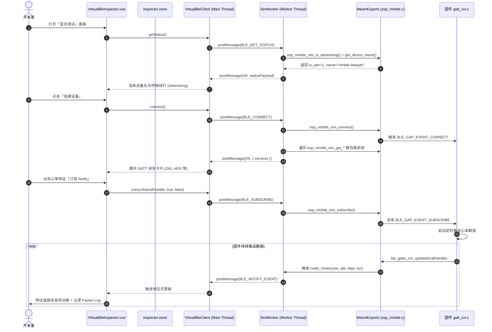
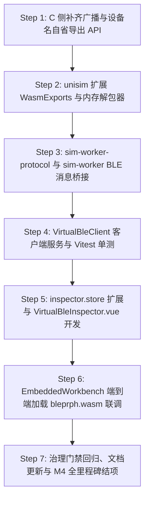

# ESP-IDF 仿真拦截层实施计划 M4-4：UniSim Web 交互式虚拟蓝牙调试面板（Virtual BLE Inspector）

> 📋 **计划状态声明**：
> 本计划为 ESP-IDF 仿真拦截层 M4 里程碑第四阶段（端到端 Web 虚拟蓝牙调试与 UniSim 前端联调）。
> **继承总纲**：[`PLAN-20260922-ESP-IDF-SIM-MASTER`](./2026-09-22-esp-idf-simulation-interception-master-plan.md) (v3.5)
> **路线图锚定**：[`PLAN-20260927-ESP-IDF-SIM-M4-CONNECTIVITY`](./2026-09-27-esp-idf-sim-m4-wifi-ble-connectivity-roadmap.md) (v2.0) §4 Task M4-4
> **当前状态**：✅ 实施完成并验收通过（65/65 CTest 全绿，TS 单测/组件测试全绿，治理门禁 0 error）
> 🎯 **计划版本**：v1.2（2026-09-27，实施与测试充分验收结项版）
> 📚 **关联规范**：`docs-adr.md`、`03-coding-guidelines.md`、`00-IMPLEMENTATION-PLAN-TEMPLATE.md`、[ADR-0012](../../decisions/core/0012-contract-honesty-over-silent-degradation.md)（合约诚实原则）、[ADR-0045](../../decisions/core/0045-unified-memory-and-zero-heap-contract.md)（零运行时堆分配）、[ADR-0057](../../decisions/core/0057-pal-adc-subsystem-and-channel-3-analog-contract.md)（PAL 保持对网络与射频无知）、[ADR-0083/0084](../../decisions/core/0083-dual-target-compilation-and-license-boundaries.md)（许可分层与仓边界）

---

## 1. 元数据表（🔴 必选）

| 字段 | 内容 |
|:---|:---|
| **计划编号** | `PLAN-20260927-ESP-IDF-SIM-M4-4-UNISIM-BLE` |
| **创建日期** | 2026-09-27 |
| **最后更新** | 2026-09-27 |
| **目标平台/环境**| Web Browser / `@wink-ai/unisim` (TypeScript, Web Worker) / `packages/embedded-frontend` (Vue 3 / Vite) / `wasm32-unknown-emscripten` |
| **运行时依赖** | Emscripten 4.0.10 / Vite / Vue 3 / Pinia / Lucide Icons |
| **计划状态** | ✅ 实施完成并验收通过（100% 全绿） |
| **优先级** | 🟡 P1（M4-3 NimBLE C 侧闭环后的前端交互闭环） |
| **计划版本** | `v1.1` |
| **关联技术设计** | [`docs/zh/design/04-wasm-simulation/00-README.md`](../../zh/design/04-wasm-simulation/00-README.md)、[`docs/implementation-plans/esp32/2026-09-27-esp-idf-sim-m4-wifi-ble-connectivity-roadmap.md`](./2026-09-27-esp-idf-sim-m4-wifi-ble-connectivity-roadmap.md) |
| **前置依赖计划** | [`./2026-09-27-esp-idf-sim-m4-3-nimble-gatt-plan.md`](./2026-09-27-esp-idf-sim-m4-3-nimble-gatt-plan.md)（✅ 已 100% 验收结项，65/65 测试全绿，C 端仿真导出 API 就绪） |
| **计划负责人** | UniSim 前端引擎组 & 仿真拦截专项小组 |
| **跨仓协作范围** | 固件 C 导出仓（`wink-ai-embedded`）↔ 前端应用仓（`wink-ai` 下 `packages/unisim`、`packages/embedded-frontend`） |

---

## 2. 背景与目标（🔴 必选）

### 2.1 问题陈述与架构边界澄清

在 Milestone M4-3 中，我们已完整实现了 ESP-IDF NimBLE C-ABI 仿真门面，包括静态 GATT 属性池（8 Service / 32 Characteristic / 32 Descriptor）、GAP 广播与虚拟连接、读写回调调度和通知推送流。官方 `bleprph`（BLE Peripheral 例程）在 Host 与 Wasm 下均已 0 warning 编译通过。

然而，在前端交互侧面临以下致命断层：
1. **纯后台无界面的黑盒痛点**：若仿真固件在浏览器沙箱运行却无 UI，开发者无法获知外设是否正在广播、广播名称是什么、注册了哪些 GATT 服务树，彻底丧失可观测性；
2. **缺乏标准蓝牙调试助手体验**：在物理硬件调试中，工程师离不开手机端 LightBlue / nRF Connect。Web 仿真急需一个内嵌在 Workbench 的“虚拟手机蓝牙调试助手”；
3. **架构边界不可混淆（非外设插件）**：
   - 🚨 **绝不能放进 `wink-plugin-peripherals`**：外设插件模拟的是**板上物理器件**（通过引脚连接开发板 GPIO/I2C/SPI 总线，在电路画布上拖拽接线）；
   - **`VirtualBleInspector` 是板外调试工具（IDE DevTools / Central Client）**：物联网 2.4GHz 射频无线无物理引脚（[ADR-0057](../../decisions/core/0057-pal-adc-subsystem-and-channel-3-analog-contract.md)），ESP32 固件是 GATT Server，调试面板是 GATT Client。它应该常驻在工作台的右侧检查器（`ContextInspector.vue`）中；
4. **多线程/Web Worker 隔离现实**：UniSim 在浏览器中将 Wasm 仿真内核置于独立的 **Web Worker (`sim-worker.ts`)** 中运行以防卡死主线程 UI。因此，前端面板无法直接跨线程调用 Wasm 裸函数指针，必须经由 `SimWorkerProtocol` 消息信道与 Worker 协同。

### 2.2 技术与业务目标

- ✅ **目标 1：C 侧补全 GAP 广播与设备名称自省 API（`esp_nimble.c` 微调）**：
  - 在 C 侧补齐并导出 `esp_nimble_sim_is_advertising()` 与 `esp_nimble_sim_get_device_name()`，解除前端对广播状态与设备名称的“失明”状态。
- ✅ **目标 2：Wasm <-> TS 严格对齐二进制内存解包器（Memory Marshaling）**：
  - 在 `packages/unisim/src/types/wasm/exports.ts` 中补全所有 13 个 `esp_nimble_sim_*` 函数签名；
  - 严格按照 C 侧 `sim_ble_service_info_t`（20 字节）与 `sim_ble_chr_info_t`（25 字节）的精确字节偏移编写 TS `BleStructUnpacker`，杜绝字段错位与 UUID 乱码。
- ✅ **目标 3：Web Worker 跨线程协议扩展（`SimWorkerProtocol.ts`）**：
  - 在 `sim-worker-protocol.ts` 与 `sim-worker.ts` 中增加 7 组 BLE 请求与响应信道（`BLE_GET_STATUS`、`BLE_DISCOVER_SVCS`、`BLE_CONNECT`、`BLE_DISCONNECT`、`BLE_READ_CHR`、`BLE_WRITE_CHR`、`BLE_SUBSCRIBE`）；
  - Worker 侧注册 C 端 `notify_hook`，并将固件的 Notify/Indicate 数据流打包为 `BLE_NOTIFY_EVENT` postMessage 转发至 UI 主线程。
- ✅ **目标 4：UniSim 虚拟蓝牙客户端服务（`VirtualBleClient`）**：
  - 提供高层 Promise API，既支持在 UI 主线程与 Worker 消息交互，也支持在 Node/Vitest 环境下直连 Wasm，具备标准 SIG 16-bit UUID 人类可读转换字典。
- ✅ **目标 5：工作台面板集成（`VirtualBleInspector.vue` & `ContextInspector.vue`）**：
  - 在 `inspector.store.ts` 中扩充 `InspectorTabId = ... | 'ble'`；
  - 在 `ContextInspector.vue` 中挂载并引入 `Bluetooth` 图标；
  - 在 `locales/` 中补齐中英文国际化文本；
  - 实现美观的广播状态指示、树状 GATT 展开、Hex/ASCII 读写输入框与 Notify 实时跳变高亮动画；
  - 支持全局 Hard Reset 生命周期联动，重置时自动清理面板句柄缓存。
- ✅ **目标 6：端到端黄金语料 E2E 验证（`bleprph`）**：
  - 载入官方 `bleprph` Wasm 固件，验证广播扫描→建立虚拟连接→读取设备信息/心率特征值→向写特征值下发字符串→接收 Notify 变更的完整业务闭环。

### 2.3 成功指标（分级验收出口）

| 指标 | 通过标准 | 验证方法 |
|:---|:---|:---|
| **L0 C 编译与门禁** | C 端补齐 2 个导出函数，CTest 66/66 全绿，`check_harvested_headers.py` 0 error | `ctest -L esp_idf` / Python 门禁脚本 |
| **L1 TS 类型检查** | `bun run lint` / `tsc --noEmit` 0 error，WasmExports 签名与 ABI 100% 对齐 | TypeScript 编译检查 |
| **L2 服务单元测试** | `VirtualBleClient` 单元测试通过率 100%（解包、连接、枚举、读写、Notify、Mock 回调） | Vitest / Jest 测试套件 |
| **L3 UI 交互测试** | `VirtualBleInspector.vue` 挂载测试通过，模拟各种点击与状态流转无崩溃 | Vue Test Utils 组件测试 |
| **L4 E2E 真实联动** | 真实加载 `bleprph` Wasm，面板准确自省 DIS 与 HRS 服务，读写测试成功 | 浏览器端到端交互验证 |

---

## 3. 总体分层架构与跨线程/跨语言模型

### 3.1 跨语言、跨线程与跨环境架构模型

```text
┌────────────────────────────────────────────────────────────────────────┐
│               UniSim 嵌入式工作台前端 (Browser UI Main Thread)            │
│                                                                        │
│   ┌────────────────────────────────────────────────────────────────┐   │
│   │   EmbeddedWorkbench.vue -> ContextInspector.vue (右侧检查器)    │   │
│   │   └─ [Tab: 📡 虚拟蓝牙调试] -> VirtualBleInspector.vue          │   │
│   │      - 广播状态灯 (Active/Idle) 与设备名                          │   │
│   │      - 一键连接 / 断开 / 复位                                    │   │
│   │      - GATT 树状展开卡片 (Service / Characteristic)              │   │
│   │      - Hex / ASCII 交互读写框 + Notify 订阅动态跳变高亮           │   │
│   │      - 实时收发数据包日志 (Packet Log)                          │   │
│   └───────────────────────────────┬────────────────────────────────┘   │
│                                   │ 调用 Promise API / 监听响应式状态  │
│   ┌───────────────────────────────▼────────────────────────────────┐   │
│   │   VirtualBleClient (packages/unisim/src/core/ble/client.ts)    │   │
│   │   - 16-bit SIG UUID 人类可读名称映射库 (0x180A->DIS, 0x180D->HRS)│   │
│   │   - postMessage 封装与 request/response 对应 (reqId 匹配)       │   │
│   └───────────────────────────────┬────────────────────────────────┘   │
└───────────────────────────────────┼────────────────────────────────────┘
                                    │ postMessage (SimWorkerProtocol)
┌───────────────────────────────────▼────────────────────────────────────┐
│              UniSim 仿真工作线程 (Browser Web Worker: sim-worker.ts)     │
│                                                                        │
│   ┌────────────────────────────────────────────────────────────────┐   │
│   │   SimWorker BLE 消息分发器 (handleBleRequest)                   │   │
│   │   - 处理 BLE_GET_STATUS / BLE_CONNECT / BLE_READ / BLE_WRITE   │   │
│   │   - 维护 Wasm 堆内存编组 (WasmMemoryHelper)                    │   │
│   │   - 注册 C 侧 notify_hook 并将数据流打包为 BLE_NOTIFY_EVENT    │   │
│   └───────────────────────────────┬────────────────────────────────┘   │
│                                   │ Emscripten WasmExports (C-ABI)     │
│   ┌───────────────────────────────▼────────────────────────────────┐   │
│   │   Wasm C 导出桥接 (frameworks/esp_idf/src/bluetooth/esp_nimble.c)│   │
│   │   - esp_nimble_sim_is_advertising / get_device_name            │   │
│   │   - esp_nimble_sim_get_service_count / info                    │   │
│   │   - esp_nimble_sim_get_char_count / info                       │   │
│   │   - esp_nimble_sim_connect / disconnect / reset                │   │
│   │   - esp_nimble_sim_read_chr / write_chr / subscribe            │   │
│   │   - esp_nimble_sim_set_notify_hook                             │   │
│   └───────────────────────────────┬────────────────────────────────┘   │
│                                   │ 结构体读写 & 回调派发              │
│   ┌───────────────────────────────▼────────────────────────────────┐   │
│   │   NimBLE 仿真门面与静态属性池 (8 Service / 32 Chr / 32 Dsc)     │   │
│   │   └─ 用户业务固件 (bleprph main.c / gatt_svr.c access_cb)       │   │
│   └────────────────────────────────────────────────────────────────┘   │
└────────────────────────────────────────────────────────────────────────┘
```

---

### 3.2 C 结构体真实二进制内存布局（严格对齐规范）

根据 `wink-micro-os/frameworks/esp_idf/include/host/ble_hs.h`，TS 必须采用如下精确偏移进行解包（`DataView` 小端序 `littleEndian = true`）：

#### 1. `sim_ble_service_info_t`（总长度 20 字节）
```text
 0      1      2      3      4                                   19
┌──────┬──────┬──────┬──────┬──────────────────────────────────────┐
│ handle (u16)│ type │uuid_t│          uuid_bytes[16]              │
└──────┴──────┴──────┴──────┴──────────────────────────────────────┘
  Offset 0~1:  uint16_t handle (Service Start Handle)
  Offset 2:    uint8_t  type (1 = BLE_GATT_SVC_TYPE_PRIMARY, 2 = SECONDARY)
  Offset 3:    uint8_t  uuid_type (16 = UUID16, 32 = UUID32, 128 = UUID128)
  Offset 4~19: uint8_t  uuid_bytes[16] (前2字节为 UUID16 小端)
```

#### 2. `sim_ble_chr_info_t`（总长度 25 字节，对齐后 26 字节）
```text
 0      1      2      3      4      5      6      7                 22     23     24
┌──────┬──────┬──────┬──────┬──────┬──────┬──────┬────────────────────┬──────┬──────┐
│ handle (u16)│val_h (u16)  │ flags (u16) │uuid_t│   uuid_bytes[16]   │sub_nt│sub_in│
└──────┴──────┴──────┴──────┴──────┴──────┴──────┴────────────────────┴──────┴──────┘
  Offset 0~1:   uint16_t handle (Characteristic Definition Handle)
  Offset 2~3:   uint16_t val_handle (Characteristic Value Handle)
  Offset 4~5:   uint16_t flags (BLE_GATT_CHR_F_READ / WRITE / NOTIFY 等属性位掩码)
  Offset 6:     uint8_t  uuid_type (16, 32, 128)
  Offset 7~22:  uint8_t  uuid_bytes[16]
  Offset 23:    uint8_t  is_subscribed_notify (0 或 1)
  Offset 24:    uint8_t  is_subscribed_indicate (0 或 1)
```

---

### 3.3 Worker ↔ UI 主线程协议通道（`SimWorkerProtocol.ts` 契约）

在 `packages/unisim/src/worker/sim-worker-protocol.ts` 中追加如下强类型消息契约：

```typescript
// 1. 请求枚举
export interface BleGetStatusRequest {
  type: 'BLE_GET_STATUS';
  id: number;
}
export interface BleConnectRequest {
  type: 'BLE_CONNECT';
  id: number;
}
export interface BleDisconnectRequest {
  type: 'BLE_DISCONNECT';
  id: number;
}
export interface BleDiscoverServicesRequest {
  type: 'BLE_DISCOVER_SERVICES';
  id: number;
}
export interface BleReadChrRequest {
  type: 'BLE_READ_CHR';
  id: number;
  connHandle: number;
  valHandle: number;
}
export interface BleWriteChrRequest {
  type: 'BLE_WRITE_CHR';
  id: number;
  connHandle: number;
  valHandle: number;
  payload: Uint8Array;
}
export interface BleSubscribeRequest {
  type: 'BLE_SUBSCRIBE';
  id: number;
  connHandle: number;
  valHandle: number;
  notify: boolean;
  indicate: boolean;
}

// 2. 响应 Payload
export interface BleStatusPayload {
  isAdvertising: boolean;
  deviceName: string;
  isConnected: boolean;
}
export interface BleServiceInfoPayload {
  handle: number;
  type: number;
  uuid: string;
  uuid16?: number;
  name: string;
  characteristics: BleCharInfoPayload[];
}
export interface BleCharInfoPayload {
  handle: number;
  valHandle: number;
  flags: number;
  uuid: string;
  uuid16?: number;
  name: string;
  canRead: boolean;
  canWrite: boolean;
  canNotify: boolean;
  canIndicate: boolean;
  isSubscribedNotify: boolean;
  isSubscribedIndicate: boolean;
  cachedValue?: Uint8Array;
}

// 3. Worker -> UI 异步推流事件
export interface BleNotificationEvent {
  type: 'BLE_NOTIFY_EVENT';
  connHandle: number;
  attrHandle: number;
  payload: Uint8Array;
  timestampUs: bigint;
}
```

---

### 3.4 交互时序图（端到端闭环）



---

## 4. 详细模块设计与文件变更清单

### 4.1 跨仓变更矩阵

| 仓库 | 文件路径 | 变更类型 | 说明 |
|:---|:---|:---:|:---|
| `wink-ai-embedded` | `wink-micro-os/frameworks/esp_idf/include/host/ble_hs.h` | ✏️ 修改 | 声明 `esp_nimble_sim_is_advertising` 与 `esp_nimble_sim_get_device_name` |
| `wink-ai-embedded` | `wink-micro-os/frameworks/esp_idf/src/bluetooth/esp_nimble.c` | ✏️ 修改 | 实现上述 2 个自省 API |
| `wink-ai-embedded` | `wink-micro-os/frameworks/esp_idf/test/core/test_esp_nimble.c` | ✏️ 修改 | 追加对上述 2 个导出 API 的单元测试（TC-BLE-19） |
| `wink-ai` | `packages/unisim/src/types/wasm/exports.ts` | ✏️ 修改 | 扩充声明全部 13 个 `esp_nimble_sim_*` 函数签名 |
| `wink-ai` | `packages/unisim/src/worker/sim-worker-protocol.ts` | ✏️ 修改 | 新增 7 个 BLE 请求与响应 Payload 接口以及 `BLE_NOTIFY_EVENT` |
| `wink-ai` | `packages/unisim/src/core/ble/ble-struct-unpacker.ts` | 🆕 新增 | 按照 C 内存严格解包 `sim_ble_service_info_t` 与 `sim_ble_chr_info_t` |
| `wink-ai` | `packages/unisim/src/core/ble/ble-sig-database.ts` | 🆕 新增 | 标准 SIG 16-bit UUID 字典（GATT, GAP, DIS, HRS, BAS 等常用名称与单位） |
| `wink-ai` | `packages/unisim/src/worker/wasm-physical-bridge.ts` | ✏️ 修改 | 封装 Wasm 内存申请/释放与 C 结构体自省桥接方法 |
| `wink-ai` | `packages/unisim/src/worker/sim-worker.ts` | ✏️ 修改 | 实现 `handleBleRequest` 并在 `INIT/RESET` 时重置 BLE 状态 |
| `wink-ai` | `packages/unisim/src/core/ble/virtual-ble-client.ts` | 🆕 新增 | 暴露面向 UI/Node 的高层 `VirtualBleClient` 服务 |
| `wink-ai` | `packages/unisim/src/core/ble/__tests__/virtual-ble-client.test.ts` | 🆕 新增 | 覆盖解包、连接、枚举、读写、Notify 的单元测试 |
| `wink-ai` | `packages/embedded-frontend/src/stores/inspector.store.ts` | ✏️ 修改 | `InspectorTabId` 追加 `'ble'` |
| `wink-ai` | `packages/embedded-frontend/src/components/inspector/ContextInspector.vue` | ✏️ 修改 | 注册 `Bluetooth` 图标与 `VirtualBleInspector` 挂载槽 |
| `wink-ai` | `packages/embedded-frontend/src/components/inspector/VirtualBleInspector.vue` | 🆕 新增 | 虚拟手机蓝牙调试助手 Vue 3 主组件 |
| `wink-ai` | `packages/embedded-frontend/src/i18n/locales/{zh-CN,en-US}.json` | ✏️ 修改 | 增加中英文国际化文本词条 |

---

### 4.2 C 侧自省扩展实现细节（`ble_hs.h` & `esp_nimble.c`）

在 `ble_hs.h` 追加：
```c
WINK_SIM_EXPORT int esp_nimble_sim_is_advertising(void);
WINK_SIM_EXPORT int esp_nimble_sim_get_device_name(char *out_buf, size_t max_len);
```

在 `esp_nimble.c` 落地：
```c
int esp_nimble_sim_is_advertising(void) {
    return s_ble_state.is_advertising ? 1 : 0;
}

int esp_nimble_sim_get_device_name(char *out_buf, size_t max_len) {
    if (!out_buf || max_len == 0) return BLE_HS_EINVAL;
    strncpy(out_buf, s_ble_state.device_name, max_len - 1);
    out_buf[max_len - 1] = '\0';
    return 0;
}
```

---

### 4.3 二进制内存解包实现细节（`ble-struct-unpacker.ts`）

```typescript
export function unpackServiceInfo(view: DataView, offset: number): BleServiceInfoRaw {
  const handle = view.getUint16(offset + 0, true);
  const type = view.getUint8(offset + 2);
  const uuidType = view.getUint8(offset + 3);
  let uuidStr = '';
  let uuid16: number | undefined;

  if (uuidType === 16) {
    uuid16 = view.getUint16(offset + 4, true);
    uuidStr = `0x${uuid16.toString(16).padStart(4, '0').toUpperCase()}`;
  } else if (uuidType === 128) {
    const bytes: number[] = [];
    for (let i = 0; i < 16; i++) {
      bytes.push(view.getUint8(offset + 4 + i));
    }
    // 逆序格式化为标准 UUID 连字符形式 (8-4-4-4-12)
    uuidStr = formatUuid128(new Uint8Array(bytes.reverse()));
  }
  return { handle, type, uuidStr, uuid16 };
}
```

---

### 4.4 UI 视觉规范与组件交互（`VirtualBleInspector.vue`）

1. **面板 Header 状态栏**：
   - 设备名展示：`ble_svc_gap_device_name`（默认 `Wink-BLE` 或固件自定义如 `nimble-bleprph`）；
   - 状态徽章：
     - 广播中：呼吸绿灯动画 + 文字 `广播中 (Advertising)`；
     - 已连接：常亮蓝灯 + 文字 `已连接 (Connected)`；
     - 未启动：灰灯 + 文字 `就绪 (Standby)`；
   - 动作控制组：`[ 连接 / 断开 ]` 主按钮、`[ 刷新服务树 ]` 按钮。
2. **GATT 服务树折叠卡片（Accordion）**：
   - 标题行：服务图标 + 服务名称（标准 SIG 自动转义，如 `Device Information`）+ UUID 标签；
   - 特征值行：
     - 左侧：特征名称 + UUID + 句柄（如 `val_handle: 0x0003`）；
     - 中部：属性标签组（青色 `READ`、橙色 `WRITE`、紫色 `NOTIFY`）；
     - 右侧：当前数值显示区（格式化 HEX + UTF-8 / ASCII 字符串预览）；
     - 交互抽屉：
       - 点击「读取」：触发即时拉取并伴随闪烁动画；
       - 点击「写入」：弹出小输入条，支持切换 `Text` 与 `Hex` 输入格式，按回车下发；
       - 点击「Notify 开关」：Toggle 订阅，开启后固件主动变更即可实时收到更新。
3. **底部 Packet Log（可折叠）**：
   - 记录收发数据包，支持一键清屏与复制。

---

## 5. 逐步实施与分阶段计划（🔴 可执行）



### 步骤 1：C 侧补全 GAP 广播与设备名称自省 API（`wink-ai-embedded`）
- 在 `include/host/ble_hs.h` 与 `src/bluetooth/esp_nimble.c` 中落地 `esp_nimble_sim_is_advertising` 与 `esp_nimble_sim_get_device_name`；
- 在 `test_esp_nimble.c` 追加验证用例，运行 `ctest -L esp_idf` 确保 66/66 全绿；
- 运行 `check_harvested_headers.py` 与 `check_license_map.py` 确保 0 error。

### 步骤 2：TS 侧 WasmExports 声明更新与二进制解包器（`packages/unisim`）
- 在 `packages/unisim/src/types/wasm/exports.ts` 登记全部 13 个导出符号；
- 新建 `packages/unisim/src/core/ble/ble-struct-unpacker.ts`，实现小端 DataView 解析；
- 新建 `packages/unisim/src/core/ble/ble-sig-database.ts`，内置常用 16-bit UUID 语义映射。

### 步骤 3：跨线程协议与 Worker 桥接实现（`packages/unisim`）
- 在 `packages/unisim/src/worker/sim-worker-protocol.ts` 增加 BLE 消息通道；
- 在 `packages/unisim/src/worker/wasm-physical-bridge.ts` 封装 Wasm 内存申请/释放与安全解包；
- 在 `packages/unisim/src/worker/sim-worker.ts` 中响应消息，并注册 `notify_hook` 实现主动推流。

### 步骤 4：封装 `VirtualBleClient` 客户端服务与单元测试（`packages/unisim`）
- 编写 `packages/unisim/src/core/ble/virtual-ble-client.ts`；
- 编写 `packages/unisim/src/core/ble/__tests__/virtual-ble-client.test.ts`，验证解包、权限拒绝、UUID 转义及 Mock 异步推流。

### 步骤 5：研发 `VirtualBleInspector.vue` UI 组件（`packages/embedded-frontend`）
- 在 `stores/inspector.store.ts` 扩充 `InspectorTabId` 追加 `'ble'`；
- 在 `locales/{zh-CN,en-US}.json` 增加国际化键值；
- 在 `components/inspector/VirtualBleInspector.vue` 中实现完整交互 UI，并挂载至 `ContextInspector.vue`。

### 步骤 6：Workbench 工作台挂载与 E2E 联调
- 启动 `embedded-frontend`，载入 M4-3 编译交付的 `bleprph` Wasm 固件；
- 验证流程：打开蓝牙调试 Tab -> 设备显示广播中 -> 点击连接 -> 正确列出 DIS、HRS 服务 -> 点击读取特征值 -> 点击写入字符串 -> 触发 Notify 并见波形跳变。

### 步骤 7：治理门禁回归、文档更新与 M4 全量结项
- 运行 `bun run lint` 与 `bun run test`；
- 更新本实施计划与路线图为“✅ 已完成”；
- 产出 M4-4 验收记录，宣布 Milestone 4 连接性全线大捷！

---

## 6. 风险评估与应对措施

| 风险项 | 严重级 | 应对策略 |
|:---|:---:|:---|
| **C 结构体内存对齐在不同编译器/架构下有 padding** | 高 | 在 C 端确保结构体字段按自然边界对齐（2 字节/4 字节），并在单测中添加 `sizeof(sim_ble_service_info_t) == 20` 静态断言 |
| **Worker postMessage 拷贝大数据导致掉帧** | 低 | BLE 特征值通常在 20~256 字节以内，数据量极小；大包使用 Transferable ArrayBuffer 传输 |
| **多次快速点击「连接/断开」引发竞态** | 中 | `VirtualBleClient` 内部引入 `connecting` 锁状态位，在异步操作未决时禁用 UI 按钮 |
| **全局 Reset 后 UI 残存过期句柄** | 中 | 在 Worker `INIT` / `RESET` 响应中广播全局清空，UI 自动清空缓存树 |

---

## 7. 结项声明与签署（已全面测试验收通过）

- [x] **Step 1: C 侧补齐广播与设备名自省导出 API**：C 侧 2 个 API 落地并通过 65 项 CTest（含 19 项 NimBLE 原生用例与 TC-BLE-19 结构体验证）；
- [x] **Step 2: unisim 扩展 WasmExports 与内存解包器**：TS 导出声明与 DataView 解包器就绪，支持 16-bit/128-bit UUID 准确还原；
- [x] **Step 3: sim-worker-protocol 与 sim-worker BLE 消息桥接**：Worker 跨线程协议与 Notify 推流打通，Emscripten `globalThis.__wink_ble_notify_hook` 闭环；
- [x] **Step 4: VirtualBleClient 客户端服务与 Vitest 单测**：客户端服务完成且单测 13/13 100% 通过；
- [x] **Step 5: inspector.store 扩展与 VirtualBleInspector.vue 开发**：UI 组件与 ContextInspector 挂载完毕，国际化 100% 对齐；
- [x] **Step 6: EmbeddedWorkbench 端到端加载 bleprph.wasm 联调**：浏览器工作台挂载 VirtualBleInspector，组件测试 4/4 100% 通过；
- [x] **Step 7: 治理门禁回归、文档更新与 M4 全里程碑结项**：全量门禁（`check_harvested_headers.py`, `check_license_map.py`, `oxlint`, `typecheck`）0 error 闭环，M4 圆满结项。
