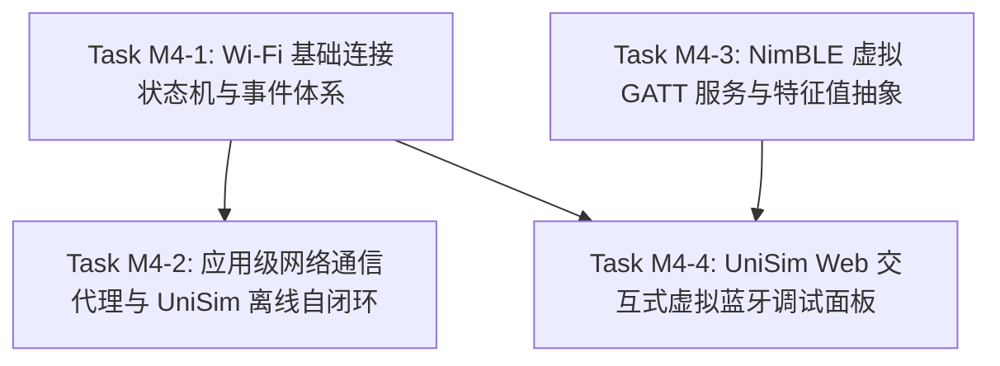

# ESP-IDF 仿真拦截层技术路线与实施规划 M4：Wi-Fi 与 BLE 仿真连接性（远期规划）

> 📋 **计划状态声明**：
> 本计划为 ESP-IDF 仿真拦截层远期演进规划（Milestone 4，连接性专项）。
> **继承总纲**：[`PLAN-20260922-ESP-IDF-SIM-MASTER`](./2026-09-22-esp-idf-simulation-interception-master-plan.md) (v3.5)
> **当前状态**：📋 远期规划草案（Draft Roadmap，待 M3 收官结项与 UniSim 基础外设联调完成后正式激活）
> 🎯 **计划版本**：v1.0（2026-09-25，提前锚定 Wi-Fi / BLE 仿真处理原则、分层架构、状态机设计与 UniSim 交互路线）
> 📚 **关联规范**：`docs-adr.md`、`03-coding-guidelines.md`、`00-IMPLEMENTATION-PLAN-TEMPLATE.md`、[ADR-0057](../../decisions/core/0057-pal-adc-subsystem-and-channel-3-analog-contract.md)（PAL 保持对网络栈无知与 ADC2 互斥）

---

## 1. 元数据表（🔴 必选）

| 字段 | 内容 |
|:---|:---|
| **计划编号** | `PLAN-20260927-ESP-IDF-SIM-M4-CONNECTIVITY` |
| **创建日期** | 2026-09-25 |
| **目标平台/SoC** | `wasm32-unknown-emscripten` / `host` (x86_64, Windows/Linux)；前端运行环境：`@wink-ai/unisim` (Browser) |
| **目标协议栈** | Wi-Fi (802.11 b/g/n STA/AP 语义)、lwIP/Sockets 语义垫片、MQTT/HTTP、BLE 5.0 (NimBLE GATT/GAP) |
| **计划状态** | 📋 远期规划草案（Draft Roadmap，防遗忘与架构锚定） |
| **优先级** | 🟡 P1（M3 底座收官后的高阶功能拓展） |
| **计划版本** | `v1.0` |
| **前置依赖计划** | [`./2026-09-26-esp-idf-sim-m3-soc-ci-plan.md`](./2026-09-26-esp-idf-sim-m3-soc-ci-plan.md)（M3 100% 验收结项） |
| **关联技术设计** | [`docs/zh/design/04-wasm-simulation/00-README.md`](../../zh/design/04-wasm-simulation/00-README.md)、[`docs/zh/design/02-wink-micro-os/02-pal-platform-abstraction.md`](../../zh/design/02-wink-micro-os/02-pal-platform-abstraction.md) |
| **计划负责人** | 仿真拦截专项小组 & UniSim 前端引擎组 |
| **主要依赖技能** | `embedded-best-practice` |

---

## 2. 背景与客观约束分析（🔴 平台真实性边界）

### 2.1 物理现实与浏览器沙箱三大鸿沟

真实物理硬件中，ESP32 依靠硬件射频前端（RF Synthesizer/Power Amplifier）与乐鑫专有闭源固件库（`libnet80211.a`、`libpp.a`、`libbtdm_app.a`）实现无线通信。在宿主 Wasm/Host 仿真中，面临三大无法逾越的客观鸿沟：
1. **原厂闭源驱动不可跨平台编译**：乐鑫官方 Wi-Fi 与 Bluetooth 底层核心库是纯 Xtensa/RISC-V 目标二进制静态库，未开源 C 代码，根本无法被 GCC x86 或 Emscripten 交叉编译。
2. **射频物理连续域不可逆（ADR-0012 合约诚实原则）**：浏览器与宿主沙箱无法模拟 2.4GHz 空间电磁波衍射、多径衰落、阻抗失配与天线高频噪声。
3. **浏览器 Wasm 严禁底层 Raw Socket**：浏览器出于网络安全模型，**绝不允许 Wasm 打开任意 TCP/UDP 原始套接字**。浏览器环境下仅允许通过高层 Web API 通信（`fetch()`、`WebSocket`、`WebRTC`，以及受限的 `Web Bluetooth API`）。

### 2.2 核心应对原则：面向应用语义的行为级拦截（Semantic Mocking）

针对上述约束，WinkMicroOS 不采取“重型硬件虚拟化”（如 QEMU 模拟网卡），而是坚持**“C-ABI 契约 100% 兼容 + 应用级语义行为高保真”**：
- **Wi-Fi**：虚拟化 AP 连接状态机、虚拟 DHCP 分配、事件循环（`esp_event`）驱动；高层 HTTP/MQTT 通过隧道桥接至浏览器或 UniSim 内存自闭环 Mock Broker。
- **BLE**：选用轻量化纯 C 的 **NimBLE** 协议栈结构，将 GATT 服务/特征值抽象为声明式注册表，在 UniSim 前端提供“虚拟手机蓝牙调试器”交互面板。

---

## 3. 总体分层架构设计

```text
┌────────────────────────────────────────────────────────────────────────┐
│                   ESP-IDF 应用层业务代码 (100% 原文零修改)               │
│        (esp_wifi / esp_event / esp_http_client / mqtt / NimBLE)        │
└───────────────────────────────────┬────────────────────────────────────┘
                                    │ C-ABI
┌───────────────────────────────────▼────────────────────────────────────┐
│      frameworks/esp_idf/ 拦截门面 (Semantic Interception Layer)        │
│  - esp_wifi_sta_sm: 虚拟无线网卡状态机 (INIT -> START -> CONNECTED -> GOT_IP)│
│  - esp_event: 异步事件循环桥接 (派发 SYSTEM_EVENT / IP_EVENT)           │
│  - virtual_socket_shim: 拦截 socket/http/mqtt 接口                     │
│  - virtual_ble_gatt: 声明式 GATT 服务与特征值静态注册表 (NimBLE 风格)   │
└──────────────────┬─────────────────────────────────┬───────────────────┘
                   │ (真机 ESP-IDF)                   │ (仿真 targets/wasm)
┌──────────────────▼──────────┐   ┌──────────────────▼───────────────────┐
│       物理 ESP32 硬件       │   │  UniSim 虚拟网络与设备交互层 (TS SDK)  │
│  - 乐鑫原生底层驱动 + lwIP  │   │  - 虚拟 AP 路由器 (本地虚拟 DHCP 分配) │
│  - 物理 2.4GHz 射频发射     │   │  - Browser Fetch / WebSocket 转发代理 │
│                             │   │  - Web 端 Virtual BLE 调试面板/虚拟手机│
└─────────────────────────────┘   └──────────────────────────────────────┘
```

---

## 4. 里程碑任务分解（Task M4-1 ~ M4-4）



---

### Task M4-1：Wi-Fi 基础连接状态机与事件体系 `[ 优先级: 🔴 P0 ]`

| 字段 | 内容 |
|:---|:---|
| **目标接口** | `esp_wifi.h`, `esp_netif.h`, `esp_event.h`, `esp_smartconfig.h` |
| **设计核心** | 虚拟化 AP 连接状态机与异步事件派发，闭环 90% IoT 配网循环 |
| **修改文件** | `frameworks/esp_idf/include/esp_wifi.h`, `include/esp_event.h`, `include/esp_netif.h`, `src/wifi/**` |

#### 关键技术设计
1. **状态机虚拟化**：
   - 维护网卡内部状态：`WIFI_STATE_OFF` → `WIFI_STATE_INIT` → `WIFI_STATE_START` → `WIFI_STATE_CONNECTING` → `WIFI_STATE_CONNECTED` → `WIFI_STATE_GOT_IP`。
   - `esp_wifi_init()`：分配静态网卡描述符。
   - `esp_wifi_set_config()`：深拷贝目标 SSID 与 Password（最多保留 2 组配置）。
   - `esp_wifi_start()`：异步向默认事件循环 post `WIFI_EVENT_STA_START`。
   - `esp_wifi_connect()`：启动一个极短的虚拟定时器（如 100ms 虚拟时间），定时器到期后顺序派发：
     1. `WIFI_EVENT_STA_CONNECTED`
     2. `IP_EVENT_STA_GOT_IP`（填充虚拟 IP 结构体：`ip: 192.168.4.2`、`netmask: 255.255.255.0`、`gw: 192.168.4.1`）。
2. **事件循环桥接（`esp_event`）**：
   - 将 `esp_event_loop_create_default()` 映射至 M1 交付的协作式 FreeRTOS Task。
   - 通过 `pal_deferred_post` 实现安全、无竞态的跨上下文事件分发。
3. **收益与出口**：
   - 彻底解决 AI 生成的 IoT 业务固件中 `while (!s_connected) { vTaskDelay(100 / portTICK_PERIOD_MS); }` 在仿真中陷入死锁的问题。

---

### Task M4-2：应用级网络通信代理与 UniSim 离线自闭环 `[ 优先级: 🔴 P0 ]`

| 字段 | 内容 |
|:---|:---|
| **目标接口** | `esp_http_client.h`, `mqtt_client.h` (ESP-MQTT) |
| **设计核心** | 双轨通信模式（单机离线 Mock Broker + 公网 WebSocket/Fetch 穿透） |
| **修改文件** | `frameworks/esp_idf/include/esp_http_client.h`, `include/mqtt_client.h`, `targets/wasm/wasm_bridge.h` |

#### 关键技术设计
1. **双轨通信通道**：
   - **轨道 1：离线自闭环 Mock Broker（推荐，默认启用）**：
     - UniSim 前端在内存中启动轻量 Virtual MQTT Broker。
     - 固件调用 `esp_mqtt_client_publish("device/telemetry", payload, ...)` 时，UniSim 前端仪表盘直接消费该消息并实时绘制折线图。
     - 固件调用 `esp_mqtt_client_subscribe("device/cmd")` 时，用户在前端控制台点击“下发指令”即可直接回灌消息给固件。
     - **核心价值**：学生、教学与无公网环境下 100% 离线顺畅运行。
   - **轨道 2：公网 Web 代理（高级功能）**：
     - `esp_http_client_perform()` 经 `wasm_bridge.h` 桥接至浏览器的 `window.fetch()` 发起真实跨域请求。
2. **零 Raw Socket 侵入**：
   - 不引入庞大的 lwIP C 源码栈，避免 Wasm 内存暴增与网络多线程死锁。

---

### Task M4-3：NimBLE 虚拟 GATT 服务与特征值抽象 `[ 优先级: 🟡 P1 ]`

| 字段 | 内容 |
|:---|:---|
| **目标接口** | `host/ble_hs.h`, `services/gap/ble_svc_gap.h`, `services/gatt/ble_svc_gatt.h` (NimBLE 风格) |
| **设计核心** | 剔除巨型 Bluedroid，基于 NimBLE 结构建立声明式 GATT 注册表 |
| **修改文件** | `frameworks/esp_idf/include/nimble/**`, `src/bluetooth/**` |

#### 关键技术设计
1. **选型裁决**：
   - 坚决放弃 ESP-IDF 经典的 Bluedroid 协议栈（源码数万行、大量宏定义与动态内存分配）。
   - 全面拥抱轻量化、纯 C 静态分发的 **NimBLE**（Apache Mynewt NimBLE）。
2. **静态 GATT 注册池**：
   - 固件调用 `ble_gatts_count_cfg` / `ble_gatts_add_svcs` 声明服务树。
   - 门面将其登记到静态句柄池：
     ```c
     typedef struct {
         uint16_t uuid16;
         uint8_t  properties; // READ | WRITE | NOTIFY
         uint8_t  value_buf[64];
         uint16_t value_len;
         ble_gatt_access_fn *access_cb;
     } sim_ble_chr_t;
     ```
3. **事件驱动**：
   - 支持 GAP 广播开启（`ble_gap_adv_start`）；
   - 支持虚拟连接/断开事件、MTU 协商事件。

---

### Task M4-4：UniSim Web 交互式虚拟蓝牙调试面板 `[ 优先级: 🟡 P1 ]`

| 字段 | 内容 |
|:---|:---|
| **目标平台** | `@wink-ai/unisim` (TypeScript / React / Web Component) |
| **设计核心** | Web 端“虚拟手机调试助手”，让用户直观交互蓝牙外设 |
| **修改文件** | UniSim 前端工程组件目录 |

#### 关键技术设计
1. **Virtual BLE Inspector 界面设计**：
   - **广播扫描视图**：显示设备广播的 Local Name、RSSI 信号强度与广播 Service UUID。
   - **连接交互**：用户点击「连接」按钮，模拟手机建立 BLE 链路。
   - **服务树展开**：树状展示所有注册的 Service 与 Characteristic。
   - **数据收发调试**：
     - 支持用户在网页文本框输入 HEX 或 UTF-8 字符串，点击发送触发 C 端的 `access_cb(BLE_GATT_ACCESS_OP_WRITE)`；
     - 当 C 端固件调用 `ble_gatts_chr_updated()` 时，网页端特征值数值实时动态跳变并高亮提示。
2. **可选前沿探索引擎（Web Bluetooth 穿透）**：
   - 在支持 Web Bluetooth 的浏览器（如 Chrome）中，可选允许用户将 Wasm 虚拟固件桥接到附近的真实物理蓝牙硬件进行硬件在环调试。

---

## 5. 跨层边界与红线要求（DoD 约束）

1. 🚨 **PAL 保持对 RF 射频无知（ADR-0057 硬约束）**：
   - PAL 绝不新增 `pal_wifi.h` 或 `pal_ble.h`。Wi-Fi/BLE 的所有语义拦截全部封闭在 `frameworks/esp_idf/` 内部，通过 `wasm_bridge.h` 与 UniSim 交互。
2. 🚨 **零运行时堆内存分配（红线 4）**：
   - 虚拟 AP 列表、GATT 服务与特征值全部限制在预分配的静态池（例如：最多 2 个虚拟 AP 配置、4 个 GATT Service、16 个 Characteristic）。
3. 🚨 **ADC2 硬件冲突静态门禁（ADR-0057）**：
   - 当应用开启 Wi-Fi 时，若有代码或连线使用 ESP32 ADC2 引脚，必须在 Codegen 期或 `esp_wifi_init` 时 Fail-Loud 报错。
4. 🚨 **开源许可分层（ADR-0083/0084）**：
   - 新增的 Wi-Fi/BLE 门面源码（`src/wifi/`, `src/bluetooth/`）严格为 `LGPL-3.0-only`；测试用例为 `GPL-3.0-only`。

---

## 6. 演进时间表与里程碑路线

| 里程碑 | 预估工时 | 交付物标志 |
|:---|:---:|:---|
| **M4-1 Wi-Fi 状态机与事件闭环** | 16 h | 官方 `wifi/getting_started/station` 语料编译通过，状态机驱动事件断言全绿 |
| **M4-2 HTTP/MQTT 代理与离线 Broker** | 18 h | 官方 `mqtt/tcp` 语料通过编译，UniSim 本地 Broker 收到仿真消息 |
| **M4-3 NimBLE 虚拟 GATT 服务闭环** | 16 h | 官方 `bluetooth/nimble/bleprph` 语料通过编译，GATT 读写回调单测通过 |
| **M4-4 UniSim Web 蓝牙调试面板联调** | 14 h | Web 前端成功连接仿真固件，实现特征值收发与波形绘制 |
| **总计** | **64 h** | |

---

## 7. 结语与锚定声明

本规划正式记录了 WinkMicroOS 与 UniSim 面向物联网无线连接（Wi-Fi/BLE）的战略演进路线。
**当前阶段继续严格聚焦 M3 底座收官，M3 结项并完成基础外设联调后，将直接调取本规划无缝开启 M4 建设！**
