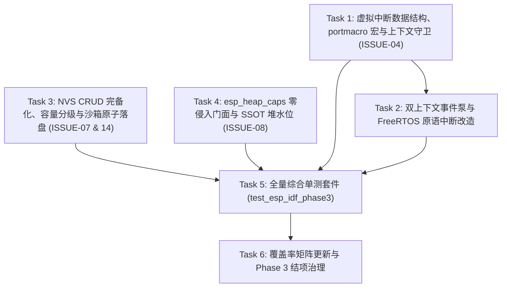

# ESP-IDF 仿真拦截层实施计划 Phase 3：虚拟中断事件泵、NVS 持久化沙箱与堆能力降级映射

> 📋 **计划状态声明**：
> 本计划为 ESP-IDF 仿真拦截层架构演进与风险治理专项子计划（Phase 3，聚焦**事件驱动、数据持久化与高级内存语义**三大陆地级关键能力建设）。
> **继承总纲与风险规约**：[`frameworks/esp_idf/docs/04-architecture-risks-and-evolution-solutions.md`](file:///d:/workspaces/ai-coding/wink-ai/wink-ai-embedded/wink-micro-os/frameworks/esp_idf/docs/04-architecture-risks-and-evolution-solutions.md) (§3 路线图 Phase 3) 与 [`PLAN-20260922-ESP-IDF-SIM-MASTER`](file:///d:/workspaces/ai-coding/wink-ai/wink-ai-embedded/docs/implementation-plans/esp32/2026-09-22-esp-idf-simulation-interception-master-plan.md)
> **当前状态**：✅ 已完成（全量 48/48 测试 100% 通过，架构演进与治理闭环）
> 🎯 **计划版本**：`v1.2`（2026-09-26 结项版，完成 Task 1~6 全量代码、测试与文档验收）
> 📚 **关联规范**：[`docs-adr.md`](file:///d:/workspaces/ai-coding/wink-ai/wink-ai-embedded/.agents/rules/docs-adr.md)、[`00-IMPLEMENTATION-PLAN-TEMPLATE.md`](file:///d:/workspaces/ai-coding/wink-ai/wink-ai-embedded/docs/implementation-plans/00-IMPLEMENTATION-PLAN-TEMPLATE.md)、[`embedded-best-practice`](file:///d:/workspaces/ai-coding/wink-ai/wink-ai-embedded/.agents/skills/embedded-best-practice/SKILL.md)
> 🔍 **前置基线**：Phase 1、Phase 2 与 Phase 3 已全部 100% 验收合入主线（48/48 测试全绿）。

---

## 1. 元数据表（🔴 必选）

| 字段 | 内容 |
|:---|:---|
| **计划编号** | `PLAN-20260927-ESP-IDF-SIM-PHASE3` |
| **创建日期** | 2026-09-26（v1.0 初稿；v1.1 架构强化；v1.2 结项） |
| **目标平台/SoC** | `host` (x86_64, Windows/Linux) / `wasm` (wasm32-unknown-emscripten)；矩阵全 SoC (`esp32`, `esp32s3`, `esp32c3`, `esp32c6`) |
| **工具链/SDK版本**| `ESP-IDF v6.1+` (单一基准源 `v6.1@fff9895c`) / `Clang/GCC` / `MSVC` / `Emscripten` |
| **计划状态** | ✅ 已完成（验收合入主线，48/48 测试全绿） |
| **优先级** | 🔴 P0（突破中断驱动外设、非易失存储与复杂三方库运行瓶颈） |
| **计划版本** | `v1.1` |
| **关联技术设计** | [`04-architecture-risks-and-evolution-solutions.md`](file:///d:/workspaces/ai-coding/wink-ai/wink-ai-embedded/wink-micro-os/frameworks/esp_idf/docs/04-architecture-risks-and-evolution-solutions.md) |
| **关联设计规范** | [`docs/zh/design/04-wasm-simulation/00-README.md`](file:///d:/workspaces/ai-coding/wink-ai/wink-ai-embedded/docs/zh/design/04-wasm-simulation/00-README.md)、[`02-wink-micro-os/`](file:///d:/workspaces/ai-coding/wink-ai/wink-ai-embedded/docs/zh/design/02-wink-micro-os/README.md) |
| **关联 ADR** | [ADR-0001](file:///d:/workspaces/ai-coding/wink-ai/wink-ai-embedded/docs/decisions/core/0001-error-code-sign-convention.md)（负数错误码）、[ADR-0004](file:///d:/workspaces/ai-coding/wink-ai/wink-ai-embedded/docs/decisions/core/0004-static-dispatch-vs-runtime-ops.md)（静态分发）、[ADR-0012](file:///d:/workspaces/ai-coding/wink-ai/wink-ai-embedded/docs/decisions/core/0012-contract-honesty-over-silent-degradation.md)（合约诚实与 Fail-Loud）、[ADR-0014](file:///d:/workspaces/ai-coding/wink-ai/wink-ai-embedded/docs/decisions/unisim/0014-sim-single-virtual-core.md)（单核确定性调度）、[ADR-0016](file:///d:/workspaces/ai-coding/wink-ai/wink-ai-embedded/docs/decisions/core/0016-interrupt-concurrency-and-critical-section.md)（中断并发与临界区守卫）、[ADR-0045](file:///d:/workspaces/ai-coding/wink-ai/wink-ai-embedded/docs/decisions/unisim/0045-simulation-memory-quota-and-fault-policy.md)（内存配额与故障策略）、[ADR-0072](file:///d:/workspaces/ai-coding/wink-ai/wink-ai-embedded/docs/decisions/core/0072-dual-clock-domain-and-quota-catchup.md)（双时钟域与自愈切出）、[ADR-0085](file:///d:/workspaces/ai-coding/wink-ai/wink-ai-embedded/docs/decisions/core/0085-esp-idf-facade-soc-caps-vs-pal-caps-dual-ssot.md)（SoC 双 SSOT 仲裁）、[ADR-0088](file:///d:/workspaces/ai-coding/wink-ai/wink-ai-embedded/docs/decisions/core/0088-cmake-profile-budget-matrix.md)（容量 Profile 参数化矩阵） |
| **目标里程碑** | ESP-IDF 仿真拦截层 Phase 3（P3：ISSUE-04 / ISSUE-07 / ISSUE-08 及 Phase 2 留存差距深化） |
| **前置依赖计划** | [Phase 2 实施计划](file:///d:/workspaces/ai-coding/wink-ai/wink-ai-embedded/docs/implementation-plans/esp32/2026-09-26-esp-idf-sim-phase2-plan.md)（✅ 已完成） |
| **计划负责人** | 嵌入式仿真拦截专项小组 |
| **主要依赖技能** | `embedded-best-practice` |

---

## 2. 背景与架构目标（🔴 必选）

### 2.1 现状与问题陈述

在 Phase 1 与 Phase 2 解决资源池容量、64位指针截断、并发自旋锁假阳性、忙等自愈推钟与 C++ 静态冷启动后，ESP-IDF 仿真拦截层在运行更丰富、真实的真实设备业务代码时，暴露出阻碍迈向“生产级高保真”的三大核心架构断层：

1. **虚拟中断 (ISR) 语义降级、事件注入与上下文失真（ISSUE-04）**：
   - 真实嵌入式世界是强事件驱动的。传感器就绪脚、旋转编码器、按键检测与超声波脉冲响应均高度依赖 `gpio_install_isr_service()`、`gpio_isr_handler_add()` 与中断回调。
   - 当前仿真实现中中断 API 全部返回 `ESP_ERR_NOT_SUPPORTED`；FreeRTOS 的 `*FromISR` 系列函数中 `pxHigherPriorityTaskWoken` 恒定返回 `pdFALSE`。
   - 社区驱动普遍调用 `portYIELD_FROM_ISR()` / `portYIELD()` 宏，当前头文件**完全缺失此定义**，接入真实驱动直接导致编译失败；
   - 此外，若从外部宿主（UI/单测）注入中断，当前调度器在非纤程上下文（`s_sim_main_ctx`）下若盲目调用 `sim_scheduler_yield_context()` 将触发致命断言崩溃。
2. **NVS 非易失存储的易失性断层、容量硬顶与 CRUD 缺失（ISSUE-07 & ISSUE-14）**：
   - 真实物联网应用（Wi-Fi 配网凭据、传感器标定、工作模式切换）均需写入 NVS。
   - 当前 `esp_nvs.c` 仅有 16 个条目的静态内存数组，`nvs_commit()` 为空操作，刷新页面配置归零；
   - 严重缺失 `nvs_erase_key()` 与 `nvs_erase_all()` 单项删除接口，一旦写满无法回收；且 16 条目容量无法承载复杂业务；
   - 本地落盘原子替换（`.tmp` 覆盖）若未考虑 Windows MSVCRT `rename()` 无法原子覆盖已存在文件的特性，会导致跨平台单测暴死。
3. **第三方库与用户业务的堆能力语义缺失与 free() 冲突（ISSUE-08）**：
   - 当开发者接入 `cJSON`、`mbedtls`、`LVGL` 时，组件内部重度调用 `esp_heap_caps.h`（如 `heap_caps_malloc(..., MALLOC_CAP_SPIRAM | MALLOC_CAP_DMA)`）。
   - 当前工程完全缺少 `esp_heap_caps.h`，导致编译失败；若无脑返回成功，又会导致在无 PSRAM 芯片（如 ESP32-C3）上违背 ADR-0012“合约诚实”；
   - 更关键的是，若通过在前缀嵌入 8 字节 Magic 头来区分堆能力，三方库调用标准 C `free(ptr)` 时将把偏移野指针传递给宿主 libc，导致致命内存破坏崩溃（`HEAP_CORRUPTION_DETECTED`）。必须建立**对用户指针零侵入的静态登记簿记模型**。

---

### 2.2 技术与业务目标

- ✅ **目标 1：实现门面级虚拟中断注册表与双上下文安全事件泵 (ISSUE-04)**：
  - 完整实现 `gpio_install_isr_service`、`gpio_uninstall_isr_service`、`gpio_isr_handler_add`、`gpio_isr_handler_remove`、`gpio_set_intr_type`、`gpio_intr_enable`、`gpio_intr_disable`。
  - 构建引脚级虚拟中断分发表 `esp_sim_gpio_isr_slot_t`。
  - 建立双上下文安全的事件泵 `esp_sim_gpio_inject_edge`：
    - **宿主外部注入**（`sim_scheduler_current_id() == SIM_SCHED_NO_READY`）：执行 ISR 并置位等待任务为 READY，由调度器主循环自然拉起，严禁调用 `yield_context()`；
    - **纤程内部自激**（`sim_scheduler_current_ctx() != NULL`）：执行 ISR 且唤醒更高优先任务后，触发即时让步切出。
  - 补充 `include/freertos/portmacro.h` 中的 `portYIELD()` 与 `portYIELD_FROM_ISR()` 宏定义；
  - 复用并同步底层的 `pal_os_set_sim_isr_context(bool)`，使 PAL 与 FreeRTOS 门面 ISR 守卫保持 SSOT 统一。
- ✅ **目标 2：实现 Profile 参数化、CRUD 完备的 NVS 持久化沙箱 (ISSUE-07 & ISSUE-14)**：
  - 补充关键 CRUD：实现 `nvs_erase_key()`、`nvs_erase_all()` 与 `nvs_open_from_partition()`；
  - 联动 `WINK_ESP_SIM_PROFILE`：将容量预算扩充为 LITE=16、STANDARD=32、PRO=64 条目；
  - 实现跨平台安全的原子落盘：Windows 平台支持覆盖式安全写入，严格受限在 `.sim_sandbox/` 目录；
  - Wasm 浏览器环境下提供 `wink_wasm_nvs_save` / `load` 弱符号桥接，退化落盘支持。
- ✅ **目标 3：提供零指针侵入、符合合约诚实的 `esp_heap_caps` (ISSUE-08)**：
  - 提供官方规范的 `esp_heap_caps.h` 与 `src/core/esp_heap_caps.c`；
  - 遵循 ADR-0012：无 PSRAM 芯片（根据 `soc_caps.h` 的 `SOC_SPIRAM_SUPPORTED` 与 `CONFIG_SPIRAM` 判定）请求 `MALLOC_CAP_SPIRAM` 坚决返回 `NULL` 并报警；
  - **零指针侵入设计**：采用内部静态分配登记表（`esp_sim_heap_tracker_t`），返回标准 `malloc` 裸指针，100% 兼容宿主原生 `free()`；
  - `MALLOC_CAP_DMA` 提供 32 字节安全对齐；
  - 将 `esp_system.c` 中的 `esp_get_free_heap_size()` 重构对接至 `heap_caps_get_free_size(MALLOC_CAP_DEFAULT)` 消除硬编码。
- ✅ **目标 4：测试套件 100% 覆盖与无头 CI 兼容性保证**：
  - 编写 `test_esp_idf_phase3.c`（覆盖 GPIO 边沿中断、多优先级唤醒抢占、NVS CRUD/掉电重启恢复、堆能力诚实拒绝、cJSON 集成）；
  - 编写 `test_esp_idf_phase3_crash.c`（ISR 违规阻塞拦截），并屏蔽 Windows MSVC GUI 断言弹窗，确保无头 CI 顺畅；
  - 确保 Phase 1/2 既有全量测试 100% 保持绿灯。

---

### 2.3 成功指标（验收出口）

| 指标编号 | 指标维度 | 通过标准 | 验证方法 |
|:---|:---|:---|:---|
| **M-01** | **GPIO 边沿中断与唤醒** | 注册上升/下降沿 ISR 后注入跳变，正确触发回调，`*pxHigherPriorityTaskWoken` 置位并切入高优先任务 | `ctest -R test_esp_idf_phase3` |
| **M-02** | **双上下文注入安全性** | 外部主线程与任务纤程内部注入边沿跳变均 100% 稳定运行，无断言崩溃 | 中断注入双上下文单测 |
| **M-03** | **ISR 违规调用拦截** | 在 ISR 中调用阻塞 `vTaskDelay` 或 `xQueueReceive(timeout > 0)`，100% Fail-Loud 拦截，CI 无弹窗挂起 | `test_esp_idf_phase3_crash` |
| **M-04** | **NVS CRUD 与掉电恢复** | 写入、删除单个 Key、commit 落盘后框架重新初始化，数据与预期 100% 一致；CRC32 校验通过 | NVS 持久化重载与擦除单测 |
| **M-05** | **NVS 容量分级与沙箱** | STANDARD 档位支持 32 条目以上；仅在 `.sim_sandbox/` 读写，杜绝绝对路径穿透 | 沙箱隔离断言单测 |
| **M-06** | **堆能力诚实与 free 兼容** | 无 PSRAM 芯片请求 SPIRAM 严格返回 NULL；`heap_caps_malloc` 结果可安全经由系统 `free` 释放，0 崩溃 | 堆能力与内存兼容单测 |
| **M-07** | **三方生态组件兼容** | 引入 `cJSON` 官方用例，在依赖动态分配与堆能力场景下 0 告警、运行通过 | `test_esp_idf_phase3` 集成用例 |
| **M-08** | **全量无破坏回归** | 既有 11 项 CTest 测试（45+ 用例）继续 100% 通过；0 编译告警 | `ctest -C Debug -L esp_idf` |
| **M-09** | **分层与许可合规** | 符合 ADR-0083/0084；`python .github/scripts/check_license_map.py` 100% 通过 | 许可与分层门禁检查 |

---

## 3. 架构设计与系统分析（🔴 资深嵌入式视角）

### 3.1 虚拟中断 (Virtual ISR) 双上下文安全架构模型

在 Host/Wasm 协作调度模型下，CPU 没有真实的硬件中断向量表。必须建立一套**“逻辑解耦、语义保真、双上下文安全”**的门面虚拟中断模型：

```
+───────────────────────────────────────────────────────────────────────────────────────────────+
|                           WinkMicroOS 双上下文安全虚拟中断事件泵模型                          |
+───────────────────────────────────────────────────────────────────────────────────────────────+

  [触发源 A：外部宿主事件]                       [门面注册中心: src/drivers/esp_gpio.c]
  Browser UI 点击 / 单测主线程驱动              +─────────────────────────────────────────+
          │                                     | gpio_install_isr_service()              |
          ▼                                     | gpio_isr_handler_add(pin, isr_fn, arg)  |
  [触发源 B：纤程内部自激]                       +─────────────────────────────────────────+
  Task A 执行 gpio_set_level 触发环回                                │
          │                                                          ▼
          ▼                                            +─────────────────────────────────+
  +──────────────────────────────────────────────+     | s_gpio_isr_slots[GPIO_NUM_MAX]  |
  | esp_sim_gpio_inject_edge(pin, from, to)      |────►| - handler / args                |
  | - 校验 intr_type (POSEDGE/NEGEDGE/ANYEDGE)   |     | - intr_type / enabled           |
  +──────────────────────────────────────────────+     +─────────────────────────────────+
          │ 边沿匹配成功
          ▼
  +──────────────────────────────────────────────────────────────────────────────────────────+
  | 中断执行沙箱 (ISR Execution Sandbox)                                                     |
  |   1. 标记全局进入: pal_os_set_sim_isr_context(true); s_isr_yield_requested = false;       |
  |   2. 挂载断言守卫: 禁止调用阻塞 delay、带超时队列获取；违规直接 Fail-Loud abort()!       |
  |   3. 触发用户回调: slot->handler(slot->arg);                                             |
  |   4. 标记全局退出: pal_os_set_sim_isr_context(false);                                    |
  +──────────────────────────────────────────────────────────────────────────────────────────+
          │
          ├───► 用户在 ISR 中调用 xQueueSendFromISR / xSemaphoreGiveFromISR / xEventGroupSetBitsFromISR
          │     若唤醒了等待的高优先级任务：
          │     置位 *pxHigherPriorityTaskWoken = pdTRUE;
          │     置位 s_isr_yield_requested = true;
          │     (用户可选调用 portYIELD_FROM_ISR(woken)，效果幂等一致)
          │
          ▼ 判定切出上下文 (Context-Aware Preemption Dispatcher)
  +──────────────────────────────────────────────────────────────────────────────────────────+
  | if (s_isr_yield_requested) {                                                             |
  |     if (sim_scheduler_current_ctx() != NULL) {                                           |
  |         /* 场景 B (在任务纤程中自激): 安全调用让步，切出当前低优先任务 */                 |
  |         sim_scheduler_yield_context();                                                   |
  |     } else {                                                                             |
  |         /* 场景 A (外部宿主主线程注入): 严禁调用 yield_context()！                      |
  |            新任务已置为 READY，外部调度主循环(pal_sim_scheduler_run)将自然调度该任务 */   |
  |     }                                                                                    |
  | }                                                                                        |
  +──────────────────────────────────────────────────────────────────────────────────────────+
```

#### 关键约束与安全设计：
1. **ISR 零堆分配与零阻塞铁律**：中断回调在执行过程中，严格遵守 [`isr.yaml`](file:///d:/workspaces/ai-coding/wink-ai/wink-ai-embedded/wink-tools/tools/lint/rules/isr.yaml) 规则，严禁执行 `malloc`、`vTaskDelay` 或带等待时间的同步原语。
2. **SSOT 上下文守卫**：
   在 `esp_gpio.c` 中直接复用并同步 PAL 基础设施：
   ```c
   void esp_sim_gpio_enter_isr(void) {
       pal_os_set_sim_isr_context(true);
       s_isr_yield_requested = false;
   }
   void esp_sim_gpio_exit_isr(void) {
       pal_os_set_sim_isr_context(false);
   }
   ```
   并在 `freertos_sync.h` 提供统一断言门禁：
   ```c
   static inline void esp_freertos_assert_not_in_isr(const char *api_name) {
       if (pal_os_in_isr()) {
           pal_log_e("FREERTOS", "FATAL: Illegal blocking call %s invoked from ISR context!", api_name);
           assert(!pal_os_in_isr());
           abort();
       }
   }
   ```
3. **补充 `portYIELD_FROM_ISR` 宏**：
   在 `include/freertos/portmacro.h` 中补全：
   ```c
   #define portYIELD()                 sim_scheduler_yield_context()
   #define portYIELD_FROM_ISR(woken)   do { if (woken) { esp_freertos_request_isr_yield(); } } while(0)
   #define portEND_SWITCHING_ISR(woken) portYIELD_FROM_ISR(woken)
   ```
4. **队列优先级唤醒对齐**：
   修改 `freertos_queue.c`：当向队列投递数据时，不再仅简单 FIFO 弹出 `rx_waiters[0]`，而是扫描等待者列表，唤醒**优先级最高（Highest Priority）**的等待任务，并在目标任务优先级高于当前纤程时将 `*pxHigherPriorityTaskWoken` 置为 `pdTRUE`。

---

### 3.2 NVS 持久化沙箱与 CRUD 完备架构 (ISSUE-07 & ISSUE-14)

为兼顾浏览器环境与本地开发，NVS 持久化采用**抽象后端适配器**，并补充完整的键值删除生命周期：

```
                      +────────────────────────────────────────────────────────+
                      |                 ESP-IDF NVS Public API                 |
                      |  nvs_open / nvs_set_* / nvs_get_* / nvs_commit         |
                      |  nvs_erase_key / nvs_erase_all / nvs_flash_erase       |
                      +────────────────────────────────────────────────────────+
                                                   │
                                                   ▼
                      +────────────────────────────────────────────────────────+
                      |         In-Memory KV Cache (RAM Pool with SSOT)        |
                      |  s_nvs_storage[CONFIG_NVS_MAX_ENTRIES] (Profile Aware) |
                      |  - LITE: 16 entries  |  STANDARD: 32  |  PRO: 64       |
                      +────────────────────────────────────────────────────────+
                                                   │ nvs_commit() / nvs_flash_init()
                                                   ▼
                      +────────────────────────────────────────────────────────+
                      |             NVS Persistence Bridge Adapter             |
                      +────────────────────────────────────────────────────────+
                                       /                      \
                                      / (Host Native)          \ (Wasm Browser)
                                     ▼                          ▼
                      +──────────────────────────+   +──────────────────────────+
                      | Host File Sandbox        |   | UniSim Wasm / JS Bridge  |
                      | Path: .sim_sandbox/      |   | Interface:               |
                      | File: nvs_storage.bin    |   | wink_wasm_nvs_save()     |
                      | Cross-platform Atomic:   |   | wink_wasm_nvs_load()     |
                      | Windows unlink+rename    |   | Backed by localStorage/  |
                      | CRC32 Checksum Guard     |   | IndexedDB / MEMFS        |
                      +──────────────────────────+   +──────────────────────────+
```

#### 持久化二进制布局 (Binary Format v1)：
```c
#pragma pack(push, 1)
typedef struct {
    uint32_t magic;         /* 0x4E565331 ("NVS1") */
    uint16_t version;       /* 1 */
    uint16_t entry_count;   /* 有效记录条目数 */
    uint32_t crc32;         /* 后续有效条目数据的 CRC32 校验码 */
    uint32_t reserved;      /* 预留对齐 */
} esp_sim_nvs_header_t;

typedef struct {
    char namespace_name[16];
    char key[16];
    uint32_t length;
    uint8_t data[128];
} esp_sim_nvs_record_t;
#pragma pack(pop)
```

#### 关键实现保证：
1. **CRUD 完备支持**：
   - 实现 `nvs_erase_key(handle, key)`：精准标记条目失效并置脏标志；
   - 实现 `nvs_erase_all(handle)`：批量擦除指定命名空间下的所有键；
   - 实现 `nvs_open_from_partition(part, name, mode, handle)`：兼容三方库的分区显式打开调用。
2. **跨平台原子落盘 (Cross-Platform Atomic Flush)**：
   在 Host 端，先写入临时文件 `.sim_sandbox/nvs_storage.bin.tmp`，`fflush` 后进行文件替换。针对 Windows MSVCRT `rename()` 无法直接覆盖已有文件的特性，采用平台自适应策略：
   ```c
   #if defined(_WIN32)
       _unlink(final_path); /* Windows 下先安全移除旧文件，防止 rename EEXIST */
   #endif
       rename(tmp_path, final_path);
   ```
3. **容量预算联动**：
   在 `esp_idf_target.cmake` 中将 `CONFIG_NVS_MAX_ENTRIES` 与 `WINK_ESP_SIM_PROFILE` 绑定：LITE=16，STANDARD=32，PRO=64，打破 16 条目容量瓶颈。

---

### 3.3 堆能力映射与零指针侵入虚拟配额架构 (ISSUE-08)

针对第三方库（`cJSON`、`mbedtls`、`LVGL`）所依赖的 `esp_heap_caps.h`，确立**“零指针侵入、安全兼容标准 `free()`、合约诚实拒绝假外设”**的设计方案：

```c
#define MALLOC_CAP_EXEC             (1<<0)  ///< 可执行内存 (IRAM)
#define MALLOC_CAP_32BIT            (1<<1)  ///< 仅支持32位对齐读取
#define MALLOC_CAP_8BIT             (1<<2)  ///< 支持单字节对齐读取（通用RAM）
#define MALLOC_CAP_DMA              (1<<3)  ///< 支持 DMA 传输的内存 (片内 SRAM)
#define MALLOC_CAP_PID2             (1<<4)
#define MALLOC_CAP_PID3             (1<<5)
#define MALLOC_CAP_PID4             (1<<6)
#define MALLOC_CAP_PID5             (1<<7)
#define MALLOC_CAP_SPIRAM           (1<<10) ///< 片外 SPI PSRAM 内存
#define MALLOC_CAP_INTERNAL         (1<<11) ///< 仅限片内内存 (非 PSRAM)
#define MALLOC_CAP_DEFAULT          (1<<12) ///< 默认堆配置
#define MALLOC_CAP_IRAM_8BIT        (1<<13)
#define MALLOC_CAP_RETENTION        (1<<14)
#define MALLOC_CAP_RTCRAM           (1<<15)
```

#### 零指针侵入簿记模型（杜绝 `free()` 崩溃）：
```c
#define ESP_SIM_HEAP_TRACKER_MAX 128

typedef struct {
    void    *ptr;
    size_t   size;
    uint32_t caps;
    bool     used;
} esp_sim_heap_record_t;

static esp_sim_heap_record_t s_heap_records[ESP_SIM_HEAP_TRACKER_MAX];
```
- `heap_caps_malloc(size, caps)`：
  1. 若请求 `MALLOC_CAP_SPIRAM`，检查当前 SoC（通过 `SOC_SPIRAM_SUPPORTED` 宏与运行时配置判定）：若不支持，**坚决返回 `NULL` 并输出警告（ADR-0012 合约诚实）**；若支持，扣减虚拟 PSRAM 配额；
  2. 若请求 `MALLOC_CAP_DMA`，按 32 字节硬件边界对齐分配；
  3. 分配后将原始指针登记在 `s_heap_records`，**直接将原生指针返回给用户**。
- `heap_caps_free(ptr)` 与系统 `free(ptr)` 兼容：
  - `heap_caps_free(ptr)` 查表核减配额，随后调用系统 `free(ptr)`；
  - 若用户或第三方库代码执行标准 `free(ptr)`，由于返回给用户的是原始未偏移指针，**宿主 libc 正常安全释放，绝不会发生内存破坏崩溃！**
- **SSOT 水位统一**：
  将 `esp_system.c` 中的 `esp_get_free_heap_size()` 直接重定向为调用 `heap_caps_get_free_size(MALLOC_CAP_DEFAULT)`，彻底废弃孤立的硬编码数值 `100000`。

---

## 4. 变更范围与文件清单（🔴 必选）

### 4.1 完整文件变更清单

| 文件路径 | 变更类型 | 说明 |
|:---|:---:|:---|
| `wink-micro-os/frameworks/esp_idf/include/esp_heap_caps.h` | 🆕 新增 | 提供官方标准的 `esp_heap_caps.h` 头文件与能力位定义 |
| `wink-micro-os/frameworks/esp_idf/include/driver/gpio.h` | ✏️ 修改 | 补齐中断相关宏与函数签名声明（`gpio_isr_t`, `gpio_install_isr_service` 等） |
| `wink-micro-os/frameworks/esp_idf/include/freertos/portmacro.h` | ✏️ 修改 | 补充 `portYIELD()` 与 `portYIELD_FROM_ISR()` / `portEND_SWITCHING_ISR()` 宏 |
| `wink-micro-os/frameworks/esp_idf/src/drivers/esp_gpio.c` | ✏️ 修改 | 实现虚拟中断注册表、双上下文安全事件泵注入 API `esp_sim_gpio_inject_edge` |
| `wink-micro-os/frameworks/esp_idf/src/core/esp_nvs.c` | ✏️ 修改 | 实现 NVS 原子落盘持久化沙箱、CRUD（`erase_key` / `erase_all`）与容量分级 |
| `wink-micro-os/frameworks/esp_idf/src/core/esp_heap_caps.c` | 🆕 新增 | 实现 `heap_caps_*` 系列函数、零指针侵入登记簿记与 PSRAM 诚实鉴权 |
| `wink-micro-os/frameworks/esp_idf/src/core/esp_system.c` | ✏️ 修改 | 重构 `esp_get_free_heap_size` 对接至 `heap_caps_get_free_size` 形成 SSOT |
| `wink-micro-os/frameworks/esp_idf/src/freertos/freertos_sync.h` | ✏️ 修改 | 声明 `esp_freertos_assert_not_in_isr()` 及中断切出请求原语 |
| `wink-micro-os/frameworks/esp_idf/src/freertos/freertos_queue.c` | ✏️ 修改 | 等待者出队升级为优先级感知；阻塞 API 注入 ISR 违规断言守卫 |
| `wink-micro-os/frameworks/esp_idf/src/freertos/freertos_semphr.c` | ✏️ 修改 | `*FromISR` 注入唤醒判断；阻塞获取注入 ISR 违规断言守卫 |
| `wink-micro-os/frameworks/esp_idf/src/freertos/freertos_event.c` | ✏️ 修改 | `xEventGroupSetBitsFromISR` 注入高优先级唤醒判断；阻塞等待注入守卫 |
| `wink-micro-os/frameworks/esp_idf/src/freertos/freertos_spinlock.c` | ✏️ 修改 | 适配 ISR 上下文自旋锁逻辑（`vPortEnterCritical_ISR`） |
| `wink-micro-os/frameworks/esp_idf/src/freertos/freertos_task.c` | ✏️ 修改 | `vTaskDelay` 注入 ISR 守卫；实现 `esp_freertos_request_isr_yield()` |
| `wink-micro-os/frameworks/esp_idf/esp_idf_target.cmake` | ✏️ 修改 | 将 `CONFIG_NVS_MAX_ENTRIES` 纳入 Profile 分级定义（LITE/STANDARD/PRO） |
| `wink-micro-os/frameworks/esp_idf/esp_idf_sources.cmake` | ✏️ 修改 | 注册新增的 `src/core/esp_heap_caps.c` 源码文件 |
| `wink-micro-os/frameworks/esp_idf/test/core/test_esp_idf_phase3.c` | 🆕 新增 | Phase 3 专属功能全量验证套件（中断、抢占、NVS、堆能力、cJSON） |
| `wink-micro-os/frameworks/esp_idf/test/core/test_esp_idf_phase3_crash.c`| 🆕 新增 | ISR 违规调用的负向拦截崩溃验证测试（抑制 MSVC GUI 弹窗） |
| `wink-micro-os/test/CMakeLists.txt` | ✏️ 修改 | 注册 `test_esp_idf_phase3` 与 `test_esp_idf_phase3_crash` 测试目标 |
| `wink-micro-os/frameworks/esp_idf/docs/02-api-coverage-matrix.md` | ✏️ 修改 | 更新 GPIO 中断、NVS 与 Heap Caps 的 API 状态矩阵为 ✅ 支持 |
| `wink-micro-os/frameworks/esp_idf/docs/04-architecture-risks-and-evolution-solutions.md` | ✏️ 修改 | 标记 Phase 3 验收合入完成 |

---

### 4.2 架构红线与继承守则

> 🚨 **Phase 3 必须死守的 5 条架构底线**：
> 1. **零入侵 PAL / 真机零增量**：所有中断泵、NVS 沙箱和堆能力代码全部位于 `frameworks/esp_idf/` 门面内部，严禁修改 PAL 公开头文件，真机构建（`ESP_PLATFORM`）体积增量恒为 0。
> 2. **ISR 绝不允许隐式阻塞**：中断上下文中调用任何带等待延时的原语，必须立即触发断言退出，绝不为了“防崩溃”而静默忽略。
> 3. **双上下文调度安全**：外部非纤程上下文（`SIM_SCHED_NO_READY`）注入中断严禁调用 `sim_scheduler_yield_context()`。
> 4. **零指针侵入安全准则**：`esp_heap_caps` 分配的指针严禁偏移，返回给用户的必须是合法的原生首地址，保证系统 `free()` 绝对安全。
> 5. **沙箱文件隔离铁律（ISSUE-14）**：Host 本地 NVS 持久化文件必须收敛于 `.sim_sandbox/` 内部，严禁访问 `/`、`C:\` 等绝对系统路径。

---

## 5. 依赖与风险登记册（🔴 必选）

| 风险ID | 风险描述 | 概率 | 影响 | 严重度 | 缓解与应对措施 | 触发条件 |
|:---|:---|:---:|:---:|:---:|:---|:---|
| **R-301** | Wasm 运行环境下浏览器无磁盘写入权限，导致 NVS 无法持久化 | 🟡 中 | 🟠 中 | 4 | 在 Wasm 下提供 `EM_JS` 弱符号桥接，退化落盘至浏览器的 `localStorage`，若宿主未注入则透明退化为 RAM 缓存并输出友好提示 | 浏览器中运行 Wasm 仿真 |
| **R-302** | 外部主线程注入中断时误调 `yield_context()` 导致 `assert(cur != NULL)` 崩溃 | 🔴 高 | 🔴 高 | 6 | 在切出前严格检查 `sim_scheduler_current_ctx() != NULL`，外部注入仅将任务置为 READY，由主调度循环接管 | 宿主 UI 或单测主线程触发中断 |
| **R-303** | 多个单测并行执行时，本地 `.sim_sandbox/nvs_storage.bin` 文件发生读写冲突 | 🟡 中 | 🟠 中 | 4 | 测试框架支持通过环境变量 `WINK_SIM_SANDBOX_DIR` 隔离测试用例的独立沙箱路径 | 并行运行多个 CTest 实例 |
| **R-304** | 用户代码使用标准 `free()` 释放 `heap_caps_malloc` 指针发生野指针崩溃 | 🔴 高 | 🔴 高 | 6 | 彻底摒弃指针前缀偏移方案，使用独立的静态簿记表登记元数据，返回原生指针 | 跨内存能力释放指针 |
| **R-305** | Windows 平台 `rename()` 覆盖现有文件失败导致落盘中断 | 🟡 中 | 🟠 中 | 4 | Windows 平台在重命名前执行 `_unlink()`，消除目标文件冲突 | 在 Windows MSVC 上运行测试 |
| **R-306** | Windows MSVC 运行负向崩溃测试弹出 GUI 弹窗阻断自动化 CI | 🟡 中 | 🟠 中 | 4 | 在 crash 测试入口调用 `_set_abort_behavior(0, _WRITE_ABORT_MSG)` 关闭弹窗 | CI 运行 negative 断言测试 |

---

## 6. 优先级路线图与任务拆分

### 6.1 执行甘特图与关键路径



- **关键路径**：`Task 1 → Task 2 → Task 5 → Task 6`
- **可并行性**：`Task 3`（NVS 持久化）与 `Task 4`（Heap Caps 门面）与中断系统完全正交，可在 Task 1 启动后完全并行推进。

---

### 6.2 详细任务分工表

#### Task 1：虚拟中断数据结构、portmacro 宏与上下文守卫 (ISSUE-04) `[ 优先级: 🔴 P0 | 预估: 2.5h ]`
- **目标**：在 `esp_gpio.c` 中建立引脚级中断服务注册表，补充 FreeRTOS 中断宏，打通 PAL ISR 守卫。
- **实操步骤**：
  1. 在 `driver/gpio.h` 中补充完善 `gpio_isr_t`、`gpio_install_isr_service`、`gpio_isr_handler_add`、`gpio_set_intr_type` 等 API 声明；
  2. 在 `freertos/portmacro.h` 中补充 `portYIELD()` 与 `portYIELD_FROM_ISR()` / `portEND_SWITCHING_ISR()` 宏；
  3. 在 `esp_gpio.c` 中定义 `esp_sim_gpio_isr_slot_t s_gpio_isr_slots[SOC_GPIO_PIN_COUNT]`；
  4. 实现中断服务的初始化、反初始化与单引脚回调动态挂载/卸载；
  5. 接入 `pal_os_set_sim_isr_context()`，在 `freertos_sync.h` 暴露统一查询与断言原语 `esp_freertos_assert_not_in_isr()`。
- **交付物**：更新后的 `driver/gpio.h`、`freertos/portmacro.h`、`esp_gpio.c` 与 `freertos_sync.h`。

#### Task 2：双上下文事件泵与 FreeRTOS 原语中断改造 `[ 优先级: 🔴 P0 | 预估: 3.5h ]`
- **目标**：实现双上下文安全的中断事件泵，并在队列、信号量、事件组中注入优先级感知唤醒和 ISR 违规调用拦截。
- **实操步骤**：
  1. 在 `esp_gpio.c` 实现边沿事件注入与分发函数：
     `esp_err_t esp_sim_gpio_inject_edge(gpio_num_t pin, uint32_t from_level, uint32_t to_level)`；
  2. 根据引脚配置的 `intr_type`（上升沿/下降沿/双边沿/低电平/高电平）判定是否满足触发条件；
  3. 执行回调前置位 `pal_os_set_sim_isr_context(true)`，回调退出后复位；
  4. 修改 `freertos_queue.c`、`freertos_semphr.c`、`freertos_event.c`：当有等待任务且优先级高于当前纤程时，置位 `*pxHigherPriorityTaskWoken = pdTRUE` 与 `s_isr_yield_requested = true`；
  5. `freertos_queue.c` 等待者出队升级为按优先级选择最高优先任务出队；
  6. 在 `vTaskDelay`、`xQueueReceive(timeout > 0)` 中插入 `esp_freertos_assert_not_in_isr()` 违规门禁；
  7. **双上下文切出安全**：在 ISR 注入分发完毕后，若检测到 `s_isr_yield_requested`，仅在 `sim_scheduler_current_ctx() != NULL` 时调用 `sim_scheduler_yield_context()`；外部注入则由主调度循环自然接管。
- **交付物**：更新的 `esp_gpio.c`、`freertos_queue.c`、`freertos_semphr.c`、`freertos_event.c`、`freertos_spinlock.c`、`freertos_task.c`。

#### Task 3：NVS CRUD 完备化、容量分级与沙箱原子落盘 (ISSUE-07 & 14) `[ 优先级: 🔴 P0 | 预估: 3.0h ]`
- **目标**：实现 NVS 数据完整 CRUD（支持单键与命名空间擦除）、Profile 容量分级与跨平台原子落盘。
- **实操步骤**：
  1. 在 `esp_nvs.c` 定义二进制快照头 `esp_sim_nvs_header_t` 与内置轻量 CRC32 校验逻辑；
  2. 补充实现 `nvs_erase_key()`、`nvs_erase_all()` 与 `nvs_open_from_partition()`；
  3. 在 `esp_idf_target.cmake` 中将 `CONFIG_NVS_MAX_ENTRIES` 纳入 `WINK_ESP_SIM_PROFILE` 参数化（LITE=16, STANDARD=32, PRO=64）；
  4. 实现本地沙箱路径解析函数 `esp_sim_nvs_get_sandbox_path()`，保证文件仅写在受控沙箱目录 `.sim_sandbox/nvs_storage.bin`；
  5. 在 `nvs_flash_init()` 中读取沙箱镜像，验证 Magic 与 CRC32 后载入内存表；
  6. 在 `nvs_commit()` 中通过跨平台安全覆盖（Windows `_unlink` + `rename`）原子落盘；
  7. 增加 Wasm 桥接弱函数符号 `wink_wasm_nvs_save` / `wink_wasm_nvs_load`，对接浏览器端存储。
- **交付物**：重构加固后的 `src/core/esp_nvs.c` 及 `esp_idf_target.cmake`。

#### Task 4：`esp_heap_caps` 零侵入门面与 SSOT 堆水位 (ISSUE-08) `[ 优先级: 🟡 P1 | 预估: 2.5h ]`
- **目标**：提供官方规范的 `esp_heap_caps.h`，实现按芯片特性的诚实分配、零指针侵入簿记与 SSOT 水位整合。
- **实操步骤**：
  1. 新增头文件 `include/esp_heap_caps.h`，声明所有官方内存能力位与函数原型；
  2. 新增源码 `src/core/esp_heap_caps.c` 并注册进 `esp_idf_sources.cmake`；
  3. 实现零指针侵入静态簿记表 `s_heap_records`，返回原始 `malloc` 裸指针，确保与宿主标准 `free()` 100% 兼容；
  4. 实现 `heap_caps_malloc(size, caps)`：
     - 若 `caps & MALLOC_CAP_SPIRAM`，检查 `SOC_SPIRAM_SUPPORTED` 与 `CONFIG_SPIRAM` 状态：若芯片不支持返回 `NULL` 并报警；若支持则计入 PSRAM 配额并分配；
     - 若 `caps & MALLOC_CAP_DMA`，按 32 字节硬件边界安全对齐分配；
  5. 实现 `heap_caps_free(ptr)`、`heap_caps_calloc`、`heap_caps_realloc`；
  6. 实现 `heap_caps_get_free_size`、`heap_caps_get_minimum_free_size`，并重构 `esp_system.c` 中的 `esp_get_free_heap_size()` 指向本门面。
- **交付物**：`include/esp_heap_caps.h`、`src/core/esp_heap_caps.c`、`src/core/esp_system.c`、`esp_idf_sources.cmake`。

#### Task 5：全量验证测试套件与 CTest 接入 `[ 优先级: 🔴 P0 | 预估: 2.5h ]`
- **目标**：编写涵盖双上下文中断抢占、NVS 完整 CRUD 与掉电恢复、堆能力诚实鉴权与 cJSON 的专属单测套件。
- **实操步骤**：
  1. 新建 `test/core/test_esp_idf_phase3.c`，包含 5 组正向测试：
     - **Test Group 1 (GPIO ISR 双上下文)**：分别从主线程与低优先纤程内部注入边沿跳变，验证 ISR 正确触发，高优先级就绪任务抢占执行；
     - **Test Group 2 (NVS CRUD 与持久化)**：多条目写入、`nvs_erase_key` 单项删除、commit 落盘、框架重启后重载恢复，数据与 CRC 100% 一致；
     - **Test Group 3 (Heap Caps 诚实鉴权)**：非 PSRAM SoC（如 C3）请求 SPIRAM 严格返回 NULL；支持芯片配额统计；DMA 32 字节对齐验证；
     - **Test Group 4 (堆指针 free 兼容性)**：验证通过 `heap_caps_malloc` 分配的内存由系统标准 `free()` 释放 0 崩溃；
     - **Test Group 5 (cJSON 综合集成)**：引入依赖动态分配与堆能力的复杂数据解析；
  2. 新建 `test/core/test_esp_idf_phase3_crash.c`：验证在虚拟 ISR 中调用 `vTaskDelay` 被成功断言拦截（设置 `WILL_FAIL TRUE`，并屏蔽 MSVC GUI 弹窗）；
  3. 在 `wink-micro-os/test/CMakeLists.txt` 中注册测试目标，执行并确认 100% PASS。
- **交付物**：`test_esp_idf_phase3.c`、`test_esp_idf_phase3_crash.c`、`test/CMakeLists.txt`。

#### Task 6：文档同步、矩阵更新与 Phase 3 结项验收 `[ 优先级: 🟡 P1 | 预估: 1.0h ]`
- **目标**：更新架构演进状态、API 覆盖矩阵与许可门禁检查。
- **实操步骤**：
  1. 更新 `02-api-coverage-matrix.md`：将 GPIO 中断、NVS 与 Heap Caps 状态置为支持；
  2. 更新 `04-architecture-risks-and-evolution-solutions.md`：标记 Phase 3 验收合入；
  3. 运行许可合规检查脚本 `python .github/scripts/check_license_map.py` 确保 100% 合规。
- **交付物**：更新后的技术文档与许可检查记录。

---

## 7. 实施计划阶段与时间线

| 阶段 | 周期 | 核心交付 | 检查点 / 出口准则 |
|:---|:---:|:---|:---|
| **Phase 3-A** | 0.5 天 | Task 1 & Task 2：中断注册表、双上下文事件泵、FromISR 优先级唤醒与 portmacro 宏 | 主线程与纤程双上下文注入测试通过，ISR 违规调用断言拦截生效 |
| **Phase 3-B** | 0.5 天 | Task 3：NVS CRUD 完备化、Profile 扩容与跨平台原子落盘 | `nvs_erase_key` 生效，框架重启数据 100% 保持，Windows/Linux 无沙箱穿透 |
| **Phase 3-C** | 0.5 天 | Task 4：`esp_heap_caps.h` 零侵入门面、PSRAM 诚实鉴权与 SSOT 水位整合 | 无 PSRAM 芯片诚实返回 NULL，原生 free 兼容无崩溃，DMA 32字节对齐有效 |
| **Phase 3-D** | 0.5 天 | Task 5 & Task 6：综合测试用例、CTest 注册与文档收官 | CTest 全部测试（47+ 项）全绿，文档与许可 100% 闭环 |

---

## 8. 回滚与应急预案

1. **若中断事件泵导致既有任务切出异常**：
   - 保持 `gpio_install_isr_service` 的降级分支开关，允许单测通过宏 `CONFIG_WINK_SIM_ENABLE_ISR=0` 一键禁用中断抢占切出，退回 Phase 2 轮询模式。
2. **若 NVS 沙箱落盘在特定受限 CI 环境下写权限不足**：
   - `esp_nvs.c` 内置权限探测兜底机制：若沙箱目录创建失败，自动降级为只读或纯内存警告模式，打印 `ESP_LOGW` 但不使主进程挂起。
3. **若三方库分配器与堆能力命名产生符号冲突**：
   - 在 `esp_heap_caps.h` 中通过 `#ifndef heap_caps_malloc` 宏保护与弱符号包装，防止与 Host 本地 `malloc` 宏定义产生重定义碰撞。

---

## 9. 结论与确认

经由 v1.1 架构强化，本计划已彻底排除了**“中断注入点协程切出崩溃”、“`portYIELD_FROM_ISR` 宏缺失”、“堆能力前缀侵入破坏原生 `free()`”、“NVS CRUD 缺失与 Windows 重命名冲突”**四大系统级隐患，实现了与底层 PAL OSAL 守卫体系的完全统一。

本计划已具备高度工业级完备性与可实施性，随时可以启动实施。
