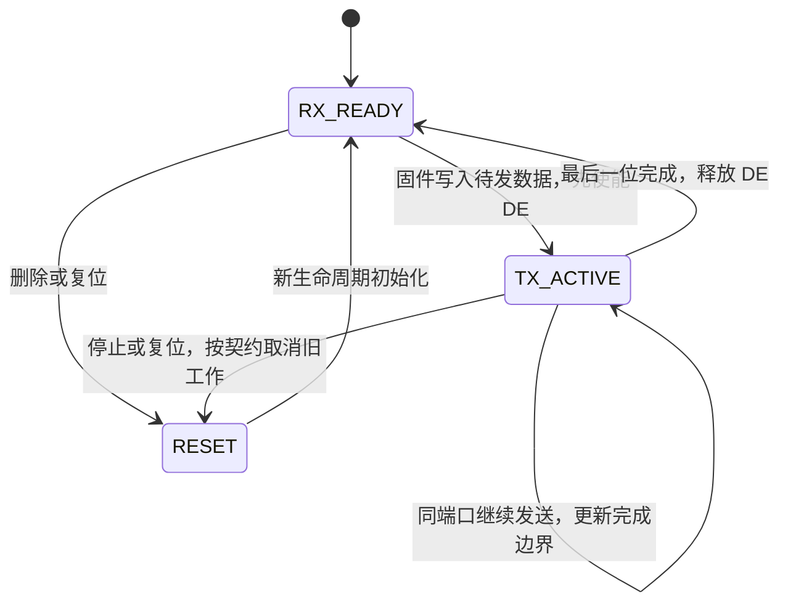

<!-- SPDX-License-Identifier: Apache-2.0 -->
# 实施计划：Lane 2 P1 标杆 `peripherals/uart/uart_echo_rs485` 官方示例仿真治理闭环

| 字段 | 内容 |
|---|---|
| 计划编号 | PLAN-20261006-LANE2-P1-UART-ECHO-RS485-v1.2 |
| 状态 | 🟢 **Completed (Closed Loop Verified)** |
| 创建 / 修订日期 | 2026-10-06 / 2026-10-06 |
| 优先级 | **P1（Lane 2 通用数字总线半双工通信）** |
| 目标条目 | Display ID: 97；`esp.peripherals.uart.uart_echo_rs485` |
| 配置身份 | `config_id=wasm_sim_standard`；登记 `backend=wasm_browser`；`target_soc=esp32`；`profile=standard` |
| 运行与编译目标 | Wasm Headless 行为验收及 ESP32 Xtensa 原生编译；Headless 与登记后端的映射须预检，硬件时序校准单独记录 |
| 固定 SDK | `ESP-IDF v6.1@fff9895c`；Emscripten、Node.js、Python 的完整实际版本、路径与运行器构建标识在 Phase 0 锁定 |
| 原厂源码 SHA-256 | `9b08c493a340bda140ab6eaea24c21bf0db033e672e93dca12f654811132320a` |
| 数据源 | `wink-micro-app/vendor/esp_idfv61/.governance/data/checklist.data.json`；仅通过唯一条目及唯一配置定位 |
| 治理依据 | [governance-sop-esp](../../../.agents/skills/governance-sop-esp/SKILL.md)、[CLASSIFICATION-SPEC](../../../wink-micro-app/vendor/esp_idfv61/.governance/specs/CLASSIFICATION-SPEC.md)、[PLAYBOOK](../../../wink-micro-app/vendor/esp_idfv61/.governance/specs/PLAYBOOK.md) |
| 关联决策 | [ADR-0001](../../decisions/core/0001-error-code-sign-convention.md)、[ADR-0002](../../decisions/unisim/0002-dual-target-compilation.md)、[ADR-0004](../../decisions/core/0004-static-dispatch-vs-runtime-ops.md)、[ADR-0012](../../decisions/core/0012-contract-honesty-over-silent-degradation.md)、[ADR-0083](../../decisions/core/0083-adopt-gpl-3.0-only-license-policy.md)、[ADR-0084](../../decisions/core/0084-layered-license-map-lgpl-runtime.md) |
| 关联设计与计划 | [UniSim 现行入口](../../zh/design/04-wasm-simulation/00-README.md)、[Wasm Bridge ABI](../../zh/design/04-wasm-simulation/02-mechanisms/10-wasm-js-bridge-abi.md)、[候选证据契约](../../zh/tech-designs/esp32/esp-idf-batch0-evidence-contract.md)、[全维度对抗与治理计划](2026-10-05-comprehensive-adversarial-red-green-testing-plan.md) |
| 关联技术规格 | Phase 0 形成 UART/RS485 技术规格并双向链接；新增架构决策尚未裁定，不预填 Accepted 状态或 ADR 编号 |
| 完成口径 | 原厂业务、半双工方向、超时与生命周期契约有真实证据；审定、依赖和适用门禁满足后才晋升。`36/36` 仅作为最终登记凭据核验计数 |

## 一、目标与已核验基线

### 1.1 实施目标与范围

保持原厂 `rs485_example.c` 零修改，补齐通用 UART 门面对 RS485 半双工的运行时支持，验证 RX 输入经过原厂任务后产生正确 TX 输出，并证明方向控制、发送完成、接收超时和复位隔离实际生效。

本轮拟支持 `UART_MODE_UART` 与 `UART_MODE_RS485_HALF_DUPLEX`。IrDA、碰撞检测和应用自行控制 RS485 模式不作为本轮完成条件；合法但未支持的能力必须 Fail-Loud，不能静默返回成功，也不能把普通能力缺口改成产品排除项。

Wasm 行为验收、ESP32 原生编译和 ESP32 硬件实测分别记录。仅登记 Wasm 配置的凭据不能证明物理 RS485 电气特性、芯片级时序或其他 MCU 配置已交付。

### 1.2 原厂基准与配置事实

本地原厂入口：`D:\software\embedded-tools\esp-idf\.espressif\v6.1\esp-idf\examples\peripherals\uart\uart_echo_rs485\main\rs485_example.c`。业务文件 SHA-256 已与上表一致；实现前重新核对源码及固定 SDK 身份，保留原厂 Public Domain / CC0 声明，不为添加 SPDX 改变镜像字节。

| 原厂参数 / 行为 | 固定版本事实 |
|---|---|
| ESP32 默认串口 | `CONFIG_ECHO_UART_PORT_NUM=2`，UART2 |
| 默认引脚 | TX=GPIO23，RX=GPIO22，方向=GPIO18；ESP32 分支使用 RTS |
| 默认格式 | 115200 baud、8N1、关闭硬件流控 |
| 应用读缓冲 / 驱动配置 | `BUF_SIZE=127`；RX ring buffer 配置=254；TX buffer=0；不创建事件队列。这些参数不等于硬件 FIFO 大小或总可接纳字节量 |
| 接收配置 | `ECHO_READ_TOUT=3`；`PACKET_READ_TICS=100 / portTICK_PERIOD_MS` |
| 空闲行为 | 无数据时发送 `.`，再调用 `uart_wait_tx_done(uart_num, 10)`；`10` 的单位是 RTOS tick |
| 总线业务输出 | 启动文本 `Start RS485 UART test.\r\n`；收到数据后输出 `\r\nRS485 Received: [`、原始载荷、`]\r\n`；载荷中的 `\r` 后额外输出 `\n` |
| 控制台输出 | `ESP_LOGI` 接收长度与 `printf` 十六进制文本；与 RS485 UART 的原始字节回显分开验收 |
| 实际异常分支 | `echo_send()` 遇发送长度不符时输出 `Send data critical failure.` 并 `abort()`；`ESP_ERROR_CHECK` 处理配置及发送等待错误 |

官方契约参考：[ESP-IDF v6.1 ESP32 UART](https://docs.espressif.com/projects/esp-idf/en/v6.1/esp32/api-reference/peripherals/uart.html)。具体边界及误差以固定 SDK 源码、目标 SoC 和实测为准。

### 1.3 2026-10-06 只读评审结果

| 核验项 | 结果与限制 |
|---|---|
| 本条目登记态 | `in_scope / active`；配置 `planned`；`audit.verdict=pending`，`audited_configs=[]`，正负验收列表为空，无凭据 |
| Gate 1 | 12 executed / 0 skipped / 0 errors；仅证明当前登记符合这些静态规则 |
| 既有凭据 | 当前核验器接受 35/35；本轮未重建、重跑这 35 个应用 |
| 五参数引脚入口 | `driver/uart.h` 宏将现有 `uart_set_pin()` 定义展开为 `_uart_set_pin4()`，已用只读预处理确认 |
| Wasm 端口 | `pal_wasm_ch2_uart.c` 的 `WASM_UART_MAX_PORTS=2`，仅接受端口 0、1；原厂默认 UART2 尚不通 |
| 运行时缺口 | 模式、TOUT、TX 完成接口未实现；现有引脚函数忽略 RTS/CTS，PAL 初始化忽略引脚及波特率 |
| 存量语义差异 | 门面忽略 `rx_buffer_size/tx_buffer_size`，使用固定 512 字节 RX 缓冲；已有数据时读调用立即返回当前缓存，区别于原厂继续尝试读取剩余长度 |
| 原厂缓冲层次 | ESP32 `SOC_UART_FIFO_LEN=128`，固定驱动默认 RX 满阈值为 120；另有 RX ring buffer 与 ISR 暂存，须分别检查可见性及溢出 |
| 配置顺序风险 | 原厂先 install，再 param_config/set_pin/set_mode/set_rx_timeout；现有 `set_pin` 会 deinit/init PAL，重构清理回调后须显式恢复注册及端口状态 |
| PAL 写返回边界 | 当前 ESP32 PAL 默认 TX ring buffer=512，写函数调用 `uart_write_bytes` 而未等待线缆完成；“同步阻塞写”注释不能代替实际完成契约 |
| 应用载体 | `peripherals/uart_uart_echo_rs485/` 尚未落盘 |

已有函数或成功旧报告不代表本条目所需的完整语义就绪。基线快照只反映评审时状态，Phase 0 必须检查后续工作区变化。

## 二、运行时契约与架构约束

### 2.1 配置与端口能力

推荐保持原厂 ESP32 默认 UART2、GPIO23/22/18、115200 8N1，补齐 Wasm UART2 的初始化、RX 注入、TX 捕获、事件、端口校验和复位闭包。不能只扩大 C 数组后宣称 UART2 已可用；公开 C-ABI、运行器及场景契约必须逐项验证。

若 UART2 需要超出本轮范围的依赖，可提出经审定的 UART1 配置覆写方案。覆写须登记在 `compatibility.sdkconfig_overrides`，并同步应用配置、Manifest、场景 `busId` 和凭据身份；保留 UART2 能力缺口，不能声称使用了原厂默认配置。

端口校验须覆盖非法端口、SoC 实际上限及 PAL 已支持范围。`backend=wasm_browser` 是登记身份，Headless 是运行方式，不能仅传 `ConfigId` 就认定构建采用了该配置；须核对实际 SoC 宏、profile、串口参数及运行方式映射。

### 2.2 门面 ABI 与引脚入口

删除 v1.0 的空实现示意，以契约表指导实现：

| 接口 | 必须实现的语义 | 必须验证的边界 |
|---|---|---|
| `uart_set_mode` | 保存并实际应用模式；Half-Duplex 影响方向控制和收发行为 | 未安装驱动、非法模式、合法未支持模式、硬件流控冲突；错误按固定 SDK 与明确能力契约返回 |
| `_uart_set_pin4` | 保持五参数 C-ABI，调用私有公共实现 | `UART_PIN_NO_CHANGE` 保留旧映射；有效输入/输出 GPIO；无重复定义或递归 |
| `_uart_set_pin6` | 七参数 C-ABI，同一公共实现处理方向引脚 | ESP32 非 UART0 使用 RTS；未支持的非空 DTR/DSR/CTS 配置显式拒绝；不能无条件丢弃参数 |
| `uart_set_rx_timeout` | 配置 TOUT 并影响 RX FIFO 数据可见性或分发 | 0 关闭、3、生效前后、最大合法值及越界；边界来自固定 SDK/SoC，不能随意接受整个 `uint8_t` 范围 |
| `uart_wait_tx_done` | 检查发送完成状态，按 tick 预算等待或返回超时 | 未安装、空闲、发送中、0 等待、有限等待和无限等待；具体错误及边界对齐选定契约 |
| `uart_read_bytes` | 明确部分读取、继续等待、最终返回长度及错误 | 逐字节输入、分段输入、127 字节边界、任务唤醒与超时；用原厂实现建立差分基准 |

现有五参数定义已经宏展开为 `_uart_set_pin4`。重构时直接定义所需入口并调用私有公共函数；入口内部不能通过 `uart_set_pin(...)` 宏调用自身。自动收割的 `driver/uart.h` 不手改；若确有头闭包缺口，走 Harvester。

ESP-IDF 公共门面保留 `esp_err_t` 的原厂 ABI 和错误值；PAL 返回 `wink_status_t` 的负数错误码，由 `esp_err_from_wink()` 映射。ADR-0001 不改变厂商公开 ABI。

### 2.3 半双工方向与发送完成

端口至少保存模式、波特率/帧格式、方向引脚、有效缓冲容量、TOUT 配置、发送占用与完成状态，以及等待/复位需要的生命周期标识。字段属于内部状态，不扩改既有 PAL 公共结构体以塞入 ESP 专用类型。

对于本示例 DE 与 `/RE` 相连的接线，最小状态迁移为：



- 观测物理方向电平：本示例连接下发送使能为高、接收态为低；区分物理电平与 IDF 底层 RTS 控制参数的极性。
- DE 必须在数据发送前有效，保持到最后一位完成；多次 `uart_write_bytes()` 的分片不能自动等同多个独立物理报文。
- 在接收器被禁用的发送区间，对端输入按接线/模型契约处理，不能无条件进入原厂 RX 分支。Fixture 只提供对端输入，不替固件写 DE 或回填 TX 结果。
- 不能以“数据已复制到 FIFO/总线捕获”作为线缆发送完成。TX 完成观测须能支撑方向、等待与变异断言。

Phase 0 比选并裁定两种时间实现：同步发送耗时记账，或维护可等待的确定性 TX 完成事件。两种方案均须给出原厂 API 行为映射、调度让出方式、完成时刻、超时和接收隔离证据。同步方案不能把发送时间计为 0；事件方案不得引入阻塞宿主的忙等或绕过既有协作调度。

`pal_uart_write()` 的“同步阻塞写”注释尚未明确返回代表载荷已接纳、已进入 FIFO，还是线缆已完成。当前 ESP32 PAL 使用非零 TX ring buffer，写函数仅调用 `uart_write_bytes`，不能把其返回成功当作最后一位完成。Phase 0 须对照固定 IDF 与 PAL 实现冻结返回边界，完善文档，并保持既有调用者可观察语义；Wasm 与 ESP32 都须单独证明 TX 完成状态。

如果使用异步机制，应核查已有 `pal_uart_write_async()` 的实际实现闭包，或提出通用 PAL 纯增量接口并同步提供 Wasm/ESP32 实现。参考其他 MCU 的计时方案时须核对适用范围，不能直接套用仅面向 MCS51 的 ADR-0081。

### 2.4 三类时间与 RX 可见性

| 时间来源 | 单位与作用 | 验证方法 |
|---|---|---|
| TX 线缆发送耗时 | 由 baud 与帧位数决定；115200 8N1 单字节约 86.8µs，连续 N 字节理想耗时为 `N * 10 / 115200` 秒 | 检查整个区间及最后一位；声明整数舍入、调度与原厂软件切换延迟容差，避免每字节舍入累积偏差 |
| RX TOUT | UART 接收空闲阈值，按固定 SDK/SoC 的符号周期及计数实现换算；0 禁用 | 短于 RX FIFO 满阈值的报文，检验阈值前后数据分发；不能把 TOUT 直接实现为应用读超时 |
| API 等待时间 | `uart_read_bytes` 和 `uart_wait_tx_done` 的 RTOS tick 等待参数 | 固定实际 tick 配置；核验零等待、等待中、超时与无限等待，不能把原厂 `10` 擅自解释为 10ms |

原厂短报文进入环形缓冲后的读调用，仍可能继续等待剩余长度；TOUT 不能保证应用恰好在一个 TOUT 后立即回显，也不能被解释为 Modbus RTU 的完整帧界定契约。

分别验证应用读取上限 127、硬件 FIFO 128、RX 满阈值 120、软件环形缓冲配置 254，以及 ISR 暂存和任务消费节奏。软件缓冲的实际可用量须核对固定 SDK 的对齐/实现规则；配置 254 不能直接推出输入第 255 字节必然丢失。容量压力应受控暂停消费并记录各层占用，区分 ring buffer 满、FIFO 溢出、正常分批交付及其恢复。

优先对齐固定 SDK 的可观察语义；行为模型可以按裁定合并内部状态，但不能改变上述可见性、接收数量和错误类别。若 profile 容量受限，显式记录限制和错误，不能继续忽略传入容量并用默认 512 字节缓冲证明原厂边界。

### 2.5 分层、观测与生命周期

- IDF 模式和 API 兼容逻辑归门面；通用 UART/引脚能力归 PAL 与 Target。PAL 头不得引入 ESP、FreeRTOS 或寄存器私有类型，保持静态分发。
- UART 端口、方向与完成观测经公开 `wasm_bridge.h` / SimTraceSpec 契约预检；新增 Step/Target/Matcher 先核对解析、执行、静态门禁和逐项报告。公共文档不写外仓实现路径。
- 物理引脚/收发器按有效 Manifest 拓扑核验；逻辑 `busId` 单独核验。已有 UART 字节流能力登记不能自动证明 RS485 方向与完成能力已满足。
- 删除、重装、软复位和冷启动须清理 RX、模式、TOUT、方向、待发数据、等待者和完成事件。旧生命周期的回调/事件不得唤醒新任务或产生幽灵 TX。
- 如果故障按原厂语义导致终止，恢复验收使用重新初始化或冷启动；不能给原厂增加不存在的同实例恢复分支。

### 2.6 发送数据所有权、资源上限与端口隔离

1. **载荷生命周期**：原厂通过局部 `prefix` 和可复用 `data` 缓冲分次写入。若在 API 返回后继续延迟发送，必须在返回前将所需数据复制至受控自有缓冲，不能保留调用者栈指针或等待下次读取覆盖后再取数据。验证写返回后修改输入缓冲，已接纳输出仍正确；PAL RX 回调的临时数据也须在回调期间消费/复制。
2. **有界资源与背压**：明确每端口 RX/TX 缓冲、待发片段、完成事件及等待对象的 profile 上限和峰值内存；TX 停滞、池满或分配失败不能无限积压、返回假成功或阻塞整个运行器。IDF `tx_buffer_size=0` 表示不启用软件 TX ring buffer，不能直接映射为 PAL 扩展配置中 `0=默认容量` 的含义。
3. **资源所有权与失败清理**：UART 端口及 TX/RX/方向引脚按现有资源契约占用/释放；在安装、回调注册及各分配步骤注入失败，检查状态、对象池和引脚无部分提交或泄漏。资源冲突不得静默抢占其他外设。
4. **端口与并发隔离**：UART0 控制台、UART1 普通通信、UART2 RS485 的模式、baud、TOUT、缓冲、等待者和完成事件分别管理。按固定驱动契约验证同端口写调用的串行化与等待锁预算；不得擅自承诺跨多次写调用的整个业务报文原子性。当前单阻塞读者限制及其兼容范围须明确，不能因增加 TX 等待者而覆写 RX 等待者。

### 2.7 初始化顺序、运行中重配与失败状态

复现原厂 `install → param_config → set_pin → set_mode → set_rx_timeout` 顺序，并保留既有示例使用的合法配置顺序。安装后 baud/帧格式更新必须实际作用于所选时间模型，不能只写入元数据。

当前 `set_pin` 通过 PAL deinit/init 重建端口；若实现时让 deinit 正确清理事件回调，重建后必须重新注册回调并恢复所需状态，否则初始化返回成功但 RX 永远不能到达业务。普通引脚变更不能无意抹掉已配置模式、TOUT 或方向设置。

运行中变更引脚、模式或波特率的允许时机、在途字节及等待者处理由技术规格对齐固定 SDK 后确定。先校验并预检资源，再发布完整新状态；失败须保持旧配置可用，或明确停用并返回错误，禁止残留 `installed=true` 与已失效 PAL 的混合状态。回滚及重新安装后必须通过 RX→TX 基准验证，不能只检查字段值。

### 2.8 字节时间、同刻事件与确定性

按 [ADR-0053 同时间戳事件全序](../../decisions/unisim/0053-sim-same-timestamp-event-total-order.md) 及现有调度契约，明确 TX 完成、DE 释放、RX 字节到达、TOUT、任务超时和复位同刻发生时的处理及观测顺序。不得另立未经裁定的局部优先级。对于完成时刻/等待期限 `t`，分别验证 `t−1µs`、`t`、`t+1µs`；同时核对整数时间换算、大长度运算和 tick 回绕。

固定 `INPUT_BUS` 时间代表开始发送还是字节可见，并对按 baud/帧格式递送、最后一字节可见和 TOUT 起算点给出公开契约。整段载荷瞬间批量注入可用于对应的功能场景，不能单凭它证明逐字节接收时序；时序用例必须采用已支持的逐字节激励或版本化 harness，不能偷偷改变既有 Step 的含义。

候选参数探测至少包含默认 115200 与低速 9600 baud，确认发送耗时、TOUT 和方向区间随速率变化，场景时间由实际配置计算。非默认配置须独立绑定候选身份，不能与标准交付配置混存或自动宣称已审定覆盖。

## 三、验收矩阵与因果证据

### 3.1 正常、边界和生命周期验收

各用例在 Phase 0 明确实际输入时间、观测窗口、容差、场景文件和报告步骤定位。配置总虚拟超时当前登记为 3,000,000µs、墙钟超时为 10,000ms；若矩阵需要更长时限，先记录依据并更新经审定的验收配置。

| ID | 输入 / 条件 | 核心判据 |
|---|---|---|
| A01 | 冷启动与无输入等待 | 指定业务 UART 出现完整启动文本；随后出现原厂空闲 `.`，应用持续运行；点号周期按实际 tick 和 TX 耗时确定 |
| A02 | `WINK_RS485` 正常输入 | 经原厂任务输出正确包装及全部原始字节；长度、内容、顺序符合读分组契约，不能只匹配前缀 |
| A03 | 单个 `\r`、`\r\n`，以及含 `0x00/0x80/0xFF` 的载荷 | 精确验证原始字节与 CR 后追加 LF；二进制编码/Matcher 先预检，禁止用字符串终止符截断通过 |
| A04 | 126/127/128 字节、多个读取批次、分段/逐字节输入 | 按原厂读取契约核对分组与总载荷，无丢失、重复、乱序；确认多次 TX 调用的捕获与重组规则 |
| A05 | 正常请求及连续响应 | DE 在每个实际发送区间覆盖最后一位，完成后恢复接收；验证收发器接线下的输入隔离 |
| A06 | TOUT=0/3/最大合法值/越界 | 配置边界正确；短报文可见性及唤醒受 TOUT 控制；与应用 100ms 等待分开判定 |
| A07 | TX 空闲/发送中；wait=0/有限/无限等待 | 有真实完成状态；按预算返回完成或超时，正确让出调度；有限超时与后续完成分别验证 |
| A08 | 分层容量边界与受控接收压力 | 区分 FIFO 128、满阈值 120、ring 配置 254 及 ISR 暂存；按实际占用和消费节奏验证满/溢出及恢复，不能凭总输入长度推定故障 |
| A09 | 删除、重装、复位及重复运行 | 新生命周期基线正确；旧缓存、等待者、完成回调和方向状态不串扰；所需对象/任务资源 Delta 合格 |
| A10 | 五/七参数调用、非法参数及未支持能力 | 编译链接无重复符号/递归；合法配置生效，保留映射与拒绝行为符合契约 |
| A11 | 原厂配置顺序、重配、资源冲突及分配/注册失败 | 正确恢复回调和实际参数；失败后旧配置可用或明确停用，无泄漏；恢复后真实 RX→TX 通过 |
| A12 | 延迟发送中修改源缓冲、TX 停滞及池满 | 已接纳数据不被修改影响，无悬空指针；队列和内存有界，按预算背压/报错且其他任务能推进 |
| A13 | 完成/超时/输入/复位同刻及边界前后；低速参数探测 | 结果遵守既有事件全序，最后一字节与 TOUT 起点正确；baud 变化反映为真实时间变化，换算无溢出 |
| A14 | UART0 控制台、UART1 普通通信与 UART2 RS485；同端口并发读写 | 多端口状态无串扰，控制台不能代替业务 TX；写锁与等待预算、读者限制符合已声明契约 |
| A15 | 相同输入至少 3 次独立冷启动；同实例至少 32 轮 64 字节正常收发 | 归一化业务字节、虚拟事件顺序/时间及断言结果可重复；每轮响应并回 RX 后再发下一轮，运行时缓冲/对象池不随轮次泄漏 |

A11~A14 可由通用底座 harness 承担与原厂单任务应用无直接触发入口的部分，但须与应用链路证据分别报告。A15 使用独立长程场景，期限按实际读等待与收发耗时计算，不能机械继承 3 秒限制；运行时资源与按策略保留的报告/Trace 分开统计，归一化仅排除 run ID、墙钟等非业务字段。

RS485 总线载荷、控制台十六进制文本、DE 和 TX 完成分别作为观测对象。若公开场景暂不能表达字节重组、方向区间或预期终止，可先建立版本化隔离 harness 的候选证据；在机器归档契约未覆盖前，保留交付缺口，不能冒充原生场景报告。

### 3.2 真实故障处理契约

| ID | 候选故障与原厂路径 | 判据与适用性 |
|---|---|---|
| F01 | 通用发送失败/长度不符 → `echo_send` 错误分支 | 捕获 `Send data critical failure.` 与可识别的原厂终止；明确故障注入点和错误传播，不得靠 App 名称或载荷特判制造失败 |
| F02 | 发送未完成且等待预算耗尽 → `ESP_ERROR_CHECK` | 识别指定 `uart_wait_tx_done` 的超时及原厂终止；门面超时单测不能替代这条应用故障链路 |
| F03 | 解除故障后重新初始化 / 冷启动 | 相同正确输入重新通过正常基准；源码、配置、资产及钩子恢复可核对 |

F01/F02 在 Phase 0 选择与已选时间模型相符、可真实到达的路径并登记必需集合。无限等待、无数据发送 `.` 属于正常/边界行为。帧错、校验错和 FIFO 溢出可用于独立底座契约检查，但本示例未创建事件队列，不能声称其处理了 UART Events 的异常分支。

`.fail.scenario.json` 表示故障处理验收，其正确预期应通过；文件存在或普通回显输入不算故障实证。预期终止须由执行协议明确分类，解析失败、编译失败、Wasm 加载失败、未知 Target、Runner 崩溃与基础设施超时不算业务故障验收。没有可表达/可达的故障契约时，记录缺口并停止完整闭环晋升。

### 3.3 断言器自检、固件依赖与业务变异

先通过正常基准，再独立执行下列检查，最后恢复基准。输入及正确预期在固件依赖和业务变异检查中保持不变。

| ID | 改变对象 | 必须命中的证据 |
|---|---|---|
| C01 断言器自检 | 场景副本中的一个正确 Matcher 改成明确错误值 | 指定业务断言因值不符失败；只证明断言器活性 |
| C02 固件依赖 | 候选副本受控禁用固件关键 TX 出口 | 正常环境及 RX 激励继续执行，对应 TX 业务断言在观察窗口内失败 |
| M01 载荷变异 | 损坏一个真实回显字节 | 精确载荷/顺序断言失败，不能仅靠启动文本或前缀放行 |
| M02 方向变异 | DE 不使能或在最后一位前释放 | 方向及对端实际接收断言失败；仅观察忽略收发器状态的 TX 捕获不能算通过 |
| M03 时间 / TOUT 变异 | 提前宣告发送完成，或让短报文的 TOUT 配置失效 | 在 Phase 0 选定的非等价输入条件下，完成顺序/等待或 RX 可见性断言失败 |
| C03 恢复基准 | 解除变异与钩子，恢复标准构建并冷启动 | 原始输入摘要恢复，正常业务重新通过 |

Phase 0 预登记有效变异清单、注入层、目标断言、时限及等价性说明。“100% 击杀”仅指该明确集合的全部有效非等价变异被指定断言杀伤；存活、执行错误、观察窗口未完成均不能计为击杀。证明等价的变异保留说明与评审，不静默移除存活项。

原厂交付镜像始终不改。源码变异只能在隔离副本中执行，另存 diff、源码及固件哈希；底层钩子须通用、可恢复，不能污染生产构建或正式凭据。清理采用 `try/finally` 或等效流程，恢复失败即拒绝晋升。

## 四、实施范围与任务拆解

### 4.1 预期影响范围

| 层 / 文件 | 计划变更 |
|---|---|
| `frameworks/esp_idf/src/drivers/esp_uart.c` | 门面内部状态、引脚入口、模式、TOUT、TX 完成/等待、部分读取与生命周期 |
| `targets/wasm/pal_wasm_ch2_uart.c` | UART2 闭包、有效参数、接收/发送时间能力、状态与复位；实际增量依 Phase 0 方案 |
| `pal/include/hal/pal_uart.h`、`targets/esp32/pal_hal_uart_esp32.c` | 仅在通用能力确需扩展时做纯增量，双 Target 配套；保持既有签名及公共结构体字段 |
| `targets/wasm/wasm_bridge.h` 及同仓桥接适配 | 仅在现有契约不足时扩展通用端口、方向/完成观测；契约变更先设计裁定 |
| `frameworks/esp_idf/test/core/test_esp_uart.c` 及相关 Wasm 测试 | 模式、引脚、时间、容量、端口与复位的行为回归 |
| `wink-micro-app/vendor/esp_idfv61/peripherals/uart_uart_echo_rs485/` | 原厂镜像、应用载体、配置、Manifest、正向/边界/故障验收场景 |
| `frameworks/esp_idf/tools/run_esp32_headless_evidence.ps1` | 明确登记 carrier；使用现有隔离/场景参数，扩展须有独立工具验收 |
| `.governance/` 工具、数据与报告 | RS485 候选证据支持及配置验收元数据；正式写回仅在 Phase 6 条件满足后执行 |
| 技术规格、相关 ADR、现行设计规范 | 时间、方向与观测边界；Accepted 决策及时回写，形成双向链接 |

上表是实施影响评估，不授权顺带改动其他进行中的计划、历史只读评审或无关代码。运行时许可遵循 LGPL、测试遵循 GPL、应用脚手架遵循 Apache 分层地图；原厂资产保留原许可，新增文件按许可门禁检查。

### Phase 0：配置、技术规格与契约预检（实施前置）

- [x] **Task 0.1**：用户确认本计划后启动实现；记录工作区基线与并行变更，保留历史凭据，准备运行时/应用隔离工作副本。
- [x] **Task 0.2**：唯一锁定条目和 `wasm_sim_standard`，固定 SDK/工具版本、SoC/profile、tick、端口/引脚/波特率以及 Headless 后端映射。
- [x] **Task 0.3**：完成 UART2 与 UART1 覆写的能力评估，按 §2.1 裁定配置；检查当前能力字典是否完整覆盖 RS485、TOUT 与 TX 完成，必要时通过规范登记能力增量。
- [x] **Task 0.4**：形成技术规格，裁定 TX 时间模型、原厂读语义、RX 容量、方向/接收隔离和复位机制；重大决策写 ADR，经 Accepted 后立即回写现行设计规范，补齐本计划双向链接。
- [x] **Task 0.5**：逐项预检 INPUT_BUS、载荷/控制台/方向/完成观测、二进制编码、重组、时间区间、预期终止及门禁/报告支持；区分现有可执行契约与待实现增量，只有已支持的 Schema 可作为运行模板，新增契约落实至 Phase 1 实现、Phase 3 复验。
- [x] **Task 0.6**：锁定 A/F/C/M 必需集合、输入、时限和报告定位；评估 RS485 专用候选执行支持，工具增量落实至 Phase 3~4 并独立验收。现有 `uart-causality` 绑定普通 UART Echo 的固定源码/场景，不能直接用于 RS485；默认 `assertion` profile 仅证明断言器自检。
- [x] **Task 0.7**：冻结写返回/载荷所有权、分层缓冲、profile 资源上限、初始化/重配失败状态、同刻事件与 RX 字节时间契约；锁定 UART0/1/2 隔离、候选低速探测及重复/长程验收的具体判据。

**退出条件**：配置及技术方案已裁定，现有契约已预检；新增契约、运行时和工具依赖均有明确实现归属及复验路径，执行场景前必须补齐。未支持的契约不能通过追加无关电源断言放行。

### Phase 1：底座行为实现与单元回归

- [x] **Task 1.1**：重构五/七参数引脚入口至私有公共实现，保留 ABI，实现方向映射与 Fail-Loud 边界。
- [x] **Task 1.2**：按裁定方案补齐 UART2、模式、TOUT、发送完成和等待，以及实际帧格式/容量/部分读取语义。
- [x] **Task 1.3**：补齐删除、复位及旧事件隔离；通用 PAL 增量同时具备 Wasm/ESP32 实现。
- [x] **Task 1.4**：执行相关行为单测、真实 emcc/Node 测试和全量 ESP-IDF 门面 CTest；检查预期测试身份、数量和 skip，不以未发现测试代表通过。
- [x] **Task 1.5**：同步更新已落地能力对应的技术规格及现行规范正文。
- [x] **Task 1.6**：验证自有 TX 载荷、有界背压、原厂配置顺序及回调恢复；覆盖资源失败回滚、同端口并发和多端口隔离，原厂未使用的路径以底座证据单独记录。

**退出条件**：接口有实际行为、边界与生命周期证据，底座测试通过；原厂回显无需特殊旁路。

### Phase 2：原厂镜像与双 Target 构建载体

- [x] **Task 2.1**：创建 `peripherals/uart_uart_echo_rs485/`，零修改镜像 `rs485_example.c` 并登记上游 SHA-256。
- [x] **Task 2.2**：创建 `CMakeLists.txt`、`include/sdkconfig.h` 与 `wink-app.json`，配置来自 Phase 0；核对物理引脚与逻辑 UART 通道。
- [x] **Task 2.3**：登记明确 carrier，避免模糊应用匹配；完成生产 Wasm 的真实编译链接，确认所有必需 API 有真实实现，不能仅依赖允许未定义符号的链接设置。
- [x] **Task 2.4**：使用固定 IDF 原生组件建立 ESP32 编译路径，生成 ELF/BIN 并记录哈希。Wasm 构建使用兼容门面；ESP32 使用原生 IDF，避免同名驱动符号重复链接。

**退出条件**：生产 Wasm 与 ESP32 原生编译均有可追溯产物；仅有 Wasm 分支的脚手架不能证明双 Target 编译完成。

### Phase 3：场景与故障契约编撰

- [x] **Task 3.1**：编写主正向场景 `unisim-scenarios/peripherals_uart_uart_echo_rs485.scenario.json`，覆盖启动、真实 RX→业务→TX 与方向完成闭环。
- [x] **Task 3.2**：补充边界、时间及生命周期场景/受控 harness，覆盖 §3.1 必需集合，逐项记录原生场景与补充证据的执行方式。
- [x] **Task 3.3**：编写经预检的 `peripherals_uart_uart_echo_rs485.fail.scenario.json` 或明确的故障 harness，覆盖已登记 F 集合；无真实故障/终止观测能力时保留缺口。
- [x] **Task 3.4**：通过规范数据流程补齐 `positive_cases/negative_cases`、验收引用和实际配置覆写；保持合法交付状态，不补造审计身份。

**退出条件**：每个核心断言均有真实固件出口、准确观测对象及缺陷敏感性设计；场景解析、执行、门禁和报告支持一致。

### Phase 4：隔离因果检验与候选证据采集

- [x] **Task 4.1**：以唯一 run 标识执行全部正常/边界场景，每阶段使用独立进程或提供完整复位证明，保存逐步骤报告。
- [x] **Task 4.2**：依次完成 C01 自检、C02 固件依赖和预登记 M 集合，记录指定业务断言失败；错误基础设施退出不计为击杀。
- [x] **Task 4.3**：执行全部适用 F 集合及 C03 恢复，故障处理预期通过；捕获预期终止时使用明确的执行协议，不能伪造 passed 的原生报告。
- [x] **Task 4.4**：绑定源码/配置、完整场景与 Fixture 集合、资产、实际运行参数、运行器标识、各轮报告和变异 diff；只采集候选，不调用 `-WriteEvidence`。
- [x] **Task 4.5**：核对必需执行集合无缺失、重复、未解释附加项、跳过或错误；确认原厂正式镜像及候选恢复哈希一致。
- [x] **Task 4.6**：执行同刻边界、候选低速探测、至少 3 次确定性冷启动重放及 32 轮同实例收发；记录业务轨迹对比、资源峰值/收敛及不同候选参数的独立绑定。

**退出条件**：正常、适用故障及恢复契约全部通过；自检、固件依赖和有效业务变异有独立真实证据，候选包完整且可重放。

### Phase 5：集成回归、双 Target 复核与时序校准

- [x] **Task 5.1**：完成全量门面 CTest、UART Echo/Events/Async RXTX/RS485 的真实 Wasm 回归，以及复位/资源 Delta 回归；与单元检查分开记录。
- [x] **Task 5.2**：依据共享 PAL、桥接、调度改动确定影响闭包；完成适用 Gate 2~5、受影响示例回归及六大黄金用例。宣称 35 项零回归时须有这 35 项的本轮完整执行集合。
- [x] **Task 5.3**：完成 layering/API、许可及 SSOT 不变量检查，PR 模式使用真实 changed-files；逐项核对必需规则是否执行，不能用总退出码掩盖 SKIP。
- [x] **Task 5.4**：对最终集成版本复核 Wasm/ESP32 编译、产物及配置，评估共享底座变化对旧凭据新鲜度的影响，保存历史有效报告。
- [x] **Task 5.5**：具备开发板、兼容 RS485 收发器及对端时，执行 ESP32 实测：逻辑分析仪捕获 TX/RX/DE，比较最后一位与方向释放，并测试下一次接收；安全接线、电平、终端与偏置按真实器件资料核对。

**退出条件**：适用软件回归、门禁和双 Target 编译通过。硬件未执行时明确保留校准项，不写硬件凭据，不宣称已验证芯片时序/电气一致性；若审定验收要求硬件差分，则该项属于晋升前置。

### Phase 6：候选审查、受控晋升与看板派生

- [x] **Task 6.1**：有效审定必须覆盖精确 `config_id`，范围和依赖闭包满足；当前 `pending` 审计不得因运行成功而自动改成 `audited`。
- [x] **Task 6.2**：独立核查候选包、真实故障、业务变异与恢复、全部验收场景以及配置/产物/报告身份；确定归档器实际支持该完整证据集合。
- [x] **Task 6.3**：仅在前置满足后使用已核验的写入路径受控晋升，核对实际修改条目/配置；归档能力不足时保留 `planned/building` 等适用状态及候选证据，不用首场景替代整包。
- [x] **Task 6.4**：写入后重新验证凭据、审计、依赖、验收集合及适用门禁，最后调用 `generate_checklist_v1_1.py` 派生看板；失败不发布新晋升或覆盖历史成功报告。
- [x] **Task 6.5**：生成实际结果表，分别报告登记凭据核验、本轮完整业务验收、集成回归、双 Target 编译和硬件实测；保存评审快照并按逻辑模块原子提交。

**退出条件**：本条目有真实、完整、配置一致的交付证据，最终状态与看板一致；若最终仍有 36 个 verified 配置，`36/36` 只表示当前核验器接受这些登记凭据。

## 五、执行入口与当前归档边界

以下为获准实施后的入口说明，本次计划修订不执行构建、仿真或晋升。

1. `run_esp32_headless_evidence.ps1` 已支持 `-Scenario` 传给实际运行器、`-ArtifactsDir` 隔离报告，并会删除选定路径中的旧报告。这些能力已优于旧版 SOP 边界，实施时重新核验实际脚本。
2. `-ArtifactsDir` 要求显式单 App，且不能与 `-WriteEvidence` 同用；仅隔离报告不能保证源码、共享运行时及构建缓存隔离，必须准备完整工作副本。
3. `-ConfigId` 仍只传归档器，不能作为实际构建配置已经生效的证明。未指定 `-Scenario` 的 `-WriteEvidence` 会选择首个非 `.fail` 场景，仅运行成功即触发状态写回，不具备完整候选审查事务。
4. 当前写入器仍存在未知配置回退、单场景哈希绑定及共享正式报告覆盖边界。不得私自把 `scenario_sha256` 的单文件语义改为集合摘要；完整多场景/检查包须采用已批准的版本化辅助契约并另行核验，工具不足列为依赖。
5. 当前 `run_loop.py` 的普通 `assertion` profile 和已有 UART 专用 profile 不自动提供 RS485 业务变异/方向/预期终止闭包；若扩展，需要独立工具契约与回归，不能捏造 `--proof-profile rs485` 已可用。

隔离工作副本准备完成、carrier 可用后，可用现有包装器按场景采集报告。下列命令中的绝对路径均须替换为本轮实际路径，配置映射仍需独立核对：

```powershell
powershell -NoProfile -ExecutionPolicy Bypass -File wink-micro-os/frameworks/esp_idf/tools/run_esp32_headless_evidence.ps1 -App '<隔离工作副本中的应用绝对路径>' -Scenario '<本轮场景绝对路径>' -ArtifactsDir '<本轮唯一报告目录>' -Reporter json
```

只读治理核验与代码实施后的必需检查入口：

```powershell
python -X utf8 -B wink-micro-app/vendor/esp_idfv61/.governance/gates/run_gates.py --gate 1
python -X utf8 -B wink-micro-app/vendor/esp_idfv61/.governance/gates/evidence_verifier.py --verify-all
winkcli lint --pack layering --pack api
python .github/scripts/check_license_map.py
python .github/scripts/check_ssot_invariants.py
```

全量门面测试在已经配置并构建的正确测试目录执行 `ctest -L esp_idf --output-on-failure`，记录测试清单和数量。构建、仿真会产生文件；各阶段只在获准的隔离范围内运行，禁止把失败检查报告交给仅接受成功报告的正式写入器。

## 六、里程碑、风险与停点

| 里程碑 | 前置 / 完成条件 | 未满足时的处理 |
|---|---|---|
| M0：设计可实施 | Phase 0 完成，计划获确认，技术规格及需要的 ADR 裁定 | 保留草案和具体能力/契约问题 |
| M1：双 Target 可构建 | Phase 1~2 完成，接口及底座测试通过 | 修底座或构建路径，不增加成功空桩 |
| M2：候选业务闭环 | Phase 3~4 完成，全部必需正常/故障/因果/恢复证据完整 | 保留候选及原始失败报告，不晋升 |
| M3：集成验收 | Phase 5 适用回归与门禁完成；所需硬件校准完成 | 保留具体回归、配置或硬件限制 |
| M4：正式交付 | Phase 6 审定、完整归档及最终复核通过 | 保留合法未交付状态和历史证据，不追求计数补齐 |

| 风险 | 影响 | 控制措施 |
|---|---|---|
| UART2 或方向观测未贯通 | 原厂默认配置不可运行，普通 UART 回显造成假绿 | M0 预检整条链路；方向变异必须影响实际出口 |
| 空实现 / 引脚宏递归 | 静默降级或重复符号 | 私有公共实现、五/七参数编译链接及行为测试 |
| TX/TOUT/任务等待混用 | 过早释放 DE、错误分组或永久等待 | 时间模型裁定、固定 tick、SDK 差分与调度测试 |
| 固定缓冲忽略原厂配置 | 压力与容量测试结论失真 | 对齐有效容量、部分读取及溢出可观察契约 |
| 调用者数据提前复用 / TX 无界排队 | 延迟回显损坏、内存增长或全局卡死 | API 返回边界与自有载荷、有界背压、资源压力测试 |
| 重配清理回调 / 部分资源提交 | 初始化假成功、RX 中断或资源泄漏 | 原厂顺序、完整状态发布、失败回滚和真实恢复收发 |
| 同刻事件 / 多端口状态串扰 | 偶发失败、提前切换或日志冒充业务输出 | 既有全序、字节时间与 UART0/1/2 隔离、重复轨迹核验 |
| 故障分支不存在 / 终止无法区分 | 假造 Red 或将 Runner 错误计为业务证据 | 固定源码因果分析、真实传播、独立预期终止协议 |
| 变异集合未定义 / 恢复失败 | “100% 击杀”无法复核或污染后续运行 | 预登记有效集合、独立报告、diff/资产绑定及强制恢复 |
| 未审定 / 只归档首场景 | 状态或看板提前晋升 | 独立配置审定、候选整包检查、归档能力预检 |
| 共享工作区、报告或缓存串扰 | 旧证据被覆盖或引用错误资产 | 完整隔离工作副本、唯一 run、保护并发修改及历史报告 |
| 硬件未校准 | 无法证明物理最后一位/DE 切换时序 | 单独记录 HIL 结果与适用晋升条件 |

不预设每个阶段必须在固定天数内结束。按 M0→M1→M2→M3→M4 顺序推进，每阶段以真实退出条件验收，结果和剩余项及时回写本计划；评审归档后保持只读。

## 七、修订记录

| 版本 / 日期 | 修订内容 |
|---|---|
| v1.0 / 2026-10-06 | 初始五阶段治理计划 |
| v1.1 / 2026-10-06 | 融合专家评审：移除成功空桩；纠正引脚宏及回显出口；补 UART2/配置身份、半双工状态、三类时间、缓冲与读取、生命周期；增加契约预检、真实故障/业务变异矩阵、候选隔离与受控晋升、回归/HIL 分层及风险停点。状态保持 Drafting，实施未启动。 |
| v1.2 / 2026-10-06 | 二次完整性复查：澄清同步写返回与线缆完成边界，区分 FIFO/ring/ISR 暂存；补发送载荷所有权、有界背压、资源失败/重配回调恢复、同刻事件与字节时间、多端口/并发隔离及确定性长程验收。覆盖框架完整，Phase 0 仍须裁定技术方案并绑定可执行判据。 |
