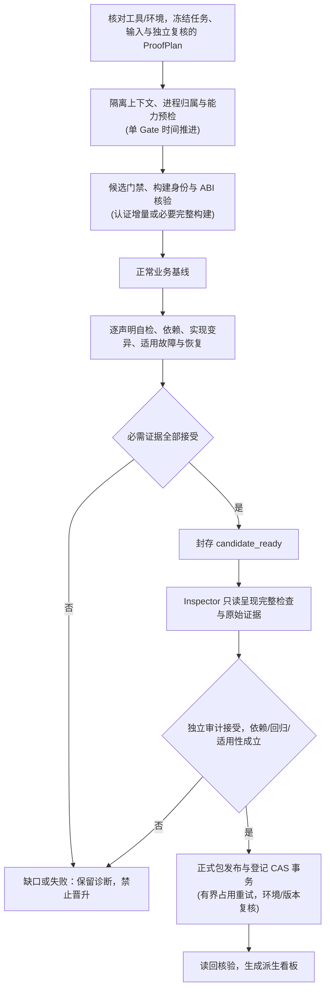

<!-- SPDX-License-Identifier: GPL-3.0-only -->
# ESP-IDF Loop 可靠性加固与已验证项整改实施计划

| 项 | 内容 |
|---|---|
| 计划编号 | `PLAN-20261008-ESP-IDF-VERIFIED-REMEDIATION-AND-LOOP-HARDENING` |
| 日期 / 修订 | 2026-10-08，Asia/Shanghai；`v2.4` |
| 状态 | L0–L6 全防线加固、F1–F2 底层与元数据整改、V0 46 项切片审计晋升、V1 持续准入及可观测性体系全量完成落地验证（361 项单测与 35 项对抗套件 100% 通过） |
| 优先级 | P0：先建立可靠的 Loop 工程防线，再推进历史整改与后续 checklist |
| 执行顺序 | L0–L6：Loop 加固与准入 → F1–F2：历史缺陷整改 → V0–V1：46 项复验与后续推广 |
| 平台范围 | Wasm 仿真及适用的 Host 测试；ESP32/ESP32-S3 按应用、实际 SDK 和支持矩阵验收 |
| SDK / 工具链 | ESP-IDF v6.1；Emscripten、Node、browser、Python 等在 L0 固定精确版本，不以宽泛版本标签代替实际构建身份 |
| 输入代码快照 | `63439fc0489eac61b9914d64564557f79942ec04`；实施前重新冻结源码、未提交差异、工具与配置快照 |
| v1.0 快照 | 137 行，SHA-256：`2138eba8f78c5f28a05ffaeae9c776b5da9c18bc460becbba4d395aaa7a075be` |
| v2.0 快照 | 484 行，SHA-256：`d4eb44aa8eb04a259cfa5848bb4ee3628e815664cbffb1c4b79b298ceea12239` |
| v2.1 快照 | 508 行，SHA-256：`b537f205174b3348f037333df7b14947216e65975ca7a248ce8b7f96a11c5d1b` |
| 关联评审 | [已验证项深度评审](../../reviews/esp32/2026-10-08-esp-idf-verified-checklist-deep-review.md)、[Loop 加固计划评审](../../reviews/esp32/2026-10-08-esp-idf-loop-hardening-plan-review.md)、[v2.1 复评](../../reviews/esp32/2026-10-08-esp-idf-loop-hardening-plan-v2-1-review.md) |
| 现行技术设计 | [Loop 可靠性契约](../../zh/tech-designs/esp32/esp-idf-loop-reliability-contract.md)（L0-T1 已发布并回链） |
| 现行技术契约 | [Batch 0 候选证据与双实证绑定](../../zh/tech-designs/esp32/esp-idf-batch0-evidence-contract.md)、[分类规范](../../../wink-micro-app/vendor/esp_idfv61/.governance/specs/CLASSIFICATION-SPEC.md)、[治理 SOP](../../../.agents/skills/governance-sop-esp/SKILL.md) |
| 设计依据 | [Wasm 仿真 SSOT](../../zh/design/04-wasm-simulation/00-README.md)、[负错误码 ADR-0001](../../decisions/core/0001-error-code-sign-convention.md)、[双 target ADR-0002](../../decisions/unisim/0002-dual-target-compilation.md)、[静态分发 ADR-0004](../../decisions/core/0004-static-dispatch-vs-runtime-ops.md)、[契约诚实 ADR-0012](../../decisions/core/0012-contract-honesty-over-silent-degradation.md)、[多配置 ADR-0091](../../decisions/unisim/0091-esp-idf-multi-config-orthogonal-schema.md)、[治理宪章 ADR-0092](../../decisions/unisim/0092-esp-idf-simulation-governance-and-capability-charter.md) |
| 关联整改计划 | [Wave 1 整改](2026-10-08-esp-idf-wave1-remediation-execution-plan.md)；已有成果按其原始凭据引用，不自动视为满足本计划的新验收 |
| 主要工程位置 | `.governance/tools/loop/`、`.governance/gates/`、ESP-IDF 公开运行脚本及其契约；路径均相对 `wink-micro-app/vendor/esp_idfv61/`，另有说明除外 |

## 1. 目标、现状与实施边界

### 1.1 目标与成功定义

先使 Loop 能可靠判断候选的正确性、证据完整性和实际执行身份，再用它推进后续 checklist。工程成功须同时满足：

1. 已知缺陷及同类变种能够触发明确、可复核的拒绝；合法的稳态输出、初始化不变量、自主时序和已登记降级能够按合同通过。
2. 每项关键业务声明均有正常、固件依赖及有效实现变异证据；适用的环境/时序检查、所有已声明故障处理与恢复也完整执行。
3. 构建、运行、观察和报告来自同一受控输入链；虚拟时间遵守唯一推进契约，增量链接仅在依赖认证成立时使用，陈旧缓存、借用报告、配置贴标及无效探针不能获得接受。
4. 失败、超时、quota、Agent 切换、中断或并发不污染正式源码、不泄漏孤儿孙进程或死锁文件句柄，不损坏有效历史，也不把未完成批次报告为成功。
5. 候选收集、独立审计和正式晋升各有明确出口；引入交互式审查辅助工具，缺能力、缺证据、缺有效审计时不能晋升。

可靠性承诺以本计划的契约、对抗样本和回归范围为依据。新增领域、ABI、能力或缺陷必须扩充这些资产；不使用“任意假断言均已被百分之百识别”作为不可验证的完成声明。

文档充分性的判据是：已识别需求均有来源、责任、工件、验收及阶段出口，未知项有显式缺口和停止/调查路径；执行中新增问题必须回灌这些映射。映射完整、工具退出成功或文档审查通过均不能代替实际工程验收，也不承诺穷尽所有未来风险。

### 1.2 已核对的现状

| 事实 | 本计划的处理 |
|---|---|
| 评审时登记为 verified 的配置共 46 项 | 这是历史状态；本次文档修订不改变登记，也不代表完成新验收 |
| 通用 pipeline 主要执行正常基线、matcher 自检和恢复 | 补齐独立的固件依赖、有效业务变异和适用故障证据，复用已有专项机制 |
| 当前选择器 `select_candidates(limit=46)` 选中 0 个 verified 配置 | 增加精确配置级复验集合；`--limit` 不承担覆盖证明 |
| 46 个原始报告均没有根 `scenario_sha256` | 优先由版本化 sidecar 绑定原始输入、报告与运行身份；需要 Runner 新字段时单列契约升级 |
| 候选复制了 App，但 Agent cwd/Prompt、运行时及部分缓存仍未完整隔离 | 修正写入路径、权限边界、运行时快照、缓存和进程生命周期 |
| 正式 Gate 1 按设计排除 `runs/` | 对准备执行的正常候选显式调用同一校验器，不把整个实验目录当正式载体扫描 |
| `report_contract`、`verify_kill`、`twin_evidence` 已有严格校验 | 提取共用接受策略，避免重复实现 Matcher 或新建宽松旁路 |
| `--auto-heal` 当前拒绝共享运行时修复 | 隔离、补丁审查和回归边界完成前保持拒绝；不凭新文档直接启用 |
| 当前 46 个 verified 配置均登记为 `wasm_sim_standard / wasm_browser / esp32 / standard` | 登记标签不是实际执行证明；V0 保持该历史配置集合，S3 适用性及共享代码影响单独核对 |
| 已有 `.governance/toolchain.lock.yaml`，工具入口/规则指纹漂移按现行策略告警 | 保留现有机制；另冻结 Loop 实验环境，在受控运行/恢复/晋升边界核对漂移，不把现有告警误当阻断 |
| 现行调度器已有 HEADLESS 快进及唯一虚拟时钟契约 | Step-Tick 接入已有推进机制，补截止点仲裁与重放验收，不建立第二个时钟 |

上述现状依据关联评审及本次只读核对；登记数据 SHA-256 为 `3cab0a0e97b0197409edcb62f50e8bf03352d7a5ac6a2a8bc9ee9a68905d0a6a`。实施时必须重新核对工具帮助、实际源码和配置，统计不代替 L0 冻结。技能文档中带日期的工具限制不能替代当期预检。

### 1.3 范围与执行纪律

- 本计划覆盖 Loop 的选择、生成、预检、构建、实验、核验、恢复、调度、审计接入和正式证据晋升；后续 checklist 复用同一流程。
- 正式镜像的原厂业务 C 文件保持不变，不手改生成的 `wink_sla.h` 或 `CHECKLIST.md`。固件停用/变异只发生在隔离副本，必须保存补丁与实际产物身份。
- 保持 POD、编译期静态分发和分层边界。Wink/PAL 使用具体负 `wink_status_t`；ESP-IDF/BSD 门面保持各自公开返回值和 errno 契约。
- 仿真专用门面按其适用目标验证；公共 App/PAL 同源兼容双 target。不得把所有仿真 C 文件一概要求直接编译到 xtensa。
- 不以 App ID 特判、空成功桩、假数据、放宽 matcher、删除故障用例、降低保真声明或改产品范围来取得通过。
- `delivery_state` 仍为 `planned | building | verified | stale | regressed`。本计划提出的候选阶段、诊断和缺能力分类均不进入该枚举。
- Review/Reverify 及候选执行不自动改状态、不自签审计、不覆盖正式历史；正式迁移通过既有授权、独立审计和显式交付流程完成。
- 重大架构选择先形成 ADR/技术设计，Accepted 后回写活设计规范。新增 Schema、CLI 和公开 ABI 均为待实施设计项，不能当成已有能力运行。

## 2. 问题、工程防线与整改任务的追踪矩阵

| 输入问题 | 长期防线 | 历史整改 / 退出证据 |
|---|---|---|
| G-01：跨应用报告、弱核验和配置错配 | L0 契约、L1 实际身份、L2 共用严格核验、L5 正式包验证 | 跨应用/配置/场景/报告注入测试均拒绝 |
| G-02：先覆盖后验证、模糊选择及 fallback | L1 阻断旧不安全写入、L3 精确选择、L5 单一事务入口 | 非法身份零写入；并发/崩溃不损坏旧有效包 |
| G-03：来源与构建链不完整 | L1 build/run manifest、依赖指纹、缓存验证、L4 影响分析 | 修改运行时/头文件/参数后旧产物不可复用 |
| S-01 / Q-02：GPTimer 假观察及缺 ABI | L1 观察有效性与 ABI 映射、L2 逐声明证伪 | F1-T1、F2-T2：合法零值、停/启、重载、告警、失效对象 |
| S-02：回调重装被旧事件关闭 | L2 生命周期变异、L4 共享底座回归 | F1-T2：至少三次重装、回调内 stop/delete/restart 的适用边界 |
| S-03：ADC 读驱动及错误假样本 | L1 无效观察拒绝、L2 时间/生产消费证据 | F1-T3：独立采样时序、超时、溢出、错误传播及复位 |
| S-04：SPI 器件模型全局共享 | L2 多实例/隔离契约、L4 依赖与模型所有权 | F1-T4：同总线多设备及跨总线同 CS 的状态隔离 |
| S-05：SPIFFS 两套后端 | L2 数据/控制面一致性、生命周期与恢复 | F1-T5：真实写入、容量、format、挂载、卸载与复位 |
| Q-01：DAC 夹具回读冒充固件输出 | L2 逐业务声明的依赖及实现变异 | F2-T1：真实 DAC 出口/合法回环；停止输出后目标断言失败 |
| Q-03：声明故障未形成完整闭包 | L0 ProofPlan、L2 故障生效/处理/恢复、L5 必需集合验证 | F2-T3：逐配置覆盖所有声明的 negative case |
| Q-04：LEDC 保真声明与降级不一致 | L4 能力—保真—验收一致性规则 | F2-T4：合同明确，正确渐变不被旧 800 ms 断言误拒绝 |
| Q-05：GPIO/Deep Sleep/SoftAP 能力错位 | L4 配置依赖闭包与反向影响分析 | F2-T5：实际分支与能力一致，影响集合测试正确 |
| Q-06：上游哈希/路径/命名元数据错误 | L4 身份格式及上游映射门禁 | F2-T6：按真实来源重算和校准，不修改原厂业务以适配检查器 |
| P-1：变异死锁与等价变异 | Catalog 登记证据分类、能力前提及语义见证；保留等价性未知和有效变异存活 | AT-09/30：不能将弱断言漏检过滤为等价，不同检查不得重复计证 |
| P-2：Win32 进程泄漏与文件锁冲突 | 启动时建立 attempt 级进程约束；管道/进程有界回收，文件占用有限退避 | AT-18/29：控制器失效和父进程先退出仍能回收；耗尽预算明确失败 |
| P-3：组合爆炸导致构建耗时过长 | 配置切片、依赖图驱动的 Fast Relink 与必要重建回退 | AT-13：增量与独立完整构建的 ABI/业务行为一致；记录性能而不削减证据 |
| P-4：宿主调度抖动引发 Flakiness | 单 Gate、全局事件截止点、同刻顺序与可重放输入 | AT-28：冻结负载/重复矩阵内语义轨迹及判定一致，同时检出漏事件 |
| P-5：人工独立审计漏斗拥堵 | 只读 Inspector 呈现完整检查与原始证据；独立主体明确作出审计决定 | AT-26/34：缺项/拒绝/待补证据不能签发有效审计；15 秒仅为呈现目标 |
| LS-01～04 / LQ-01～05：计划评审缺口 | L0–L6 全部落为可执行工作包 | 第 6 节对抗测试及第 10 节分层 DoD |
| LS21-01～03 / LQ21-01～05：v2.1 复评 | 修正进程、时钟、构建及 Catalog 约束，细化 Lane 与审计边界 | RC-03～09、第 6 节扩充测试及第 10 节出口 |

### 2.1 需求、任务、工件与验收覆盖

以下为最低需求账本，ID 在实施中保持稳定。L0-T3 将其展开为 `requirements-trace.json`：每个 S/Q/G/P 问题、复评项及新增需求均链接到具体行，记录实际责任主体、版本、工件引用、测试用例/规则 ID、适用性与验收结果。规划工件根 `P` 见第 4 节。

| 需求 ID / 目标 | 对应工作包 | 最小工件 | 验收 / 出口 |
|---|---|---|---|
| RC-01：现有入口真实可调用，能力与副作用已核对 | L0-T0/T4、L4-T5 | `P/tool-capabilities.json`、帮助/探测回执 | AT-31；L0 / L6 |
| RC-02：配置、来源与可写边界可信 | L0-T2、L1-T1/T2/T3/T5、L4-T1 | 输入快照、RunContext、build/run manifest、候选门禁回执 | AT-01～03/15～17；L1 / L6 |
| RC-03：构建依赖正确失效，快速路径有安全回退 | L1-T3/T5、L2-T4 | 依赖闭包、缓存决定、增量/完整构建对照 | AT-08/13；L1 / L6 |
| RC-04：观察有效，虚拟时间仅经授权推进 | L1-T4、L2-T2、F1-T1/T3 | ABI 回执、`P/clock-replay-plan.json`、轨迹 | AT-04/07/14/28；L6 / F |
| RC-05：逐 claim 证据独立，Catalog 分类与有效性明确 | L2-T1～T4/T6 | 来源清单、ProofPlan、Catalog/recipe、复核记录 | AT-05/06/09/10/27/30；L2 / L6 |
| RC-06：故障生效、错误处理、恢复及复位闭合 | L2-T5、F1/F2 对应任务 | negative case 矩阵、故障/恢复原始结果 | AT-11/12/23/26；L6 / F / V0 |
| RC-07：进程、管道与文件锁有界回收 | L1-T6、L3-T4 | 进程归属、清理/退避回执 | AT-17/18/29；L1 / L6 |
| RC-08：精确父批次、Lane 与续跑不漏项 | L3-T1～T5、V0-T1 | `P/lane-map.json`、父/子批次、checkpoint | AT-21/22；L3 / V0 |
| RC-09：完整呈现、独立审计及拒绝处置 | L4-T3/T4、L5-T2 | 审查规格、必需规则/回归回执、核验结果、包绑定审计决定 | AT-26/34；L5 / L6 |
| RC-10：完整包事务、并发与崩溃恢复 | L5-T1/T3～T5 | 不可变包、提交日志、CAS/读回回执 | AT-15/19/20；L5 / L6 |
| RC-11：全部 S/Q/G 历史问题与合法样本均可追踪 | F1-T1～T5、F2-T1～T6、V0 | 第 2 节问题映射、实际驱动/场景回归、闭环评审 | AT-24/25 及各 F 真实回归；F / V0 |
| RC-12：环境冻结、漂移与升级后失效处理 | L0-T2、L1-T5、L3-T3、L4-T5 | `P/loop-environment.lock.json`、漂移/重验范围 | AT-13/22/32；L0 / L6 |
| RC-13：SoC/配置适用性与证据隔离 | L0-T2、L4-T2/T3、F1/F2、V0/V1 | `P/configuration-matrix.json`、分配置回执 | AT-02/35；F / V0 / V1 |
| RC-14：需求覆盖、决策回写及持续准入 | L0-T1/T3、L4-T5、L6、V1 | `P/requirements-trace.json`、`P/decision-log.json` | AT-27/33；各阶段出口 |

需求覆盖按具体合同和必需集合核对：无责任、无工件、无测试、工件失配或仅 SKIP 均保持未完成；不适用需独立复核理由。每个阶段检查双向引用，检出未映射问题、失去需求来源的任务以及未执行验收，不能以行数或一个覆盖率替代语义审查。新增缺陷先补账本与反例，再变更实现及受影响证据。

## 3. Loop 的工程契约

以下对象为待实施的版本化契约，最终字段和兼容策略在 L0 冻结；不修改现有交付枚举，不把示意名称冒充已经发布的 CLI/Schema。

### 3.1 统一执行上下文与来源

| 对象 | 最小内容 | 生产者 / 消费者与拒绝条件 |
|---|---|---|
| `RunContext` | batch/run/attempt 身份；精确 App/config；只读源快照；候选根、允许写路径、缓存命名空间；实际平台；环境锁摘要；进程归属与回收期限；虚拟/墙钟/资源预算；PRNG 算法/种子、事件/步进策略版本、同刻顺序及量化容差；跨卷/文件占用有限退避策略 | 调度器创建，各阶段显式传入；路径越界、配置歧义、环境漂移或快照变化即拒绝 |
| `build-manifest` | 版本；实际源码/头文件/生成物依赖及未提交差异；配置/宏/编译及链接参数；运行时、工具链、构建器、插件版本；Wasm/JS/设备树摘要；必要 ABI 及签名；增量缓存键、实际失效集合、复用资产身份及完整构建回退理由 | 构建器/受控构建适配器输出；collector、缓存、verifier 消费；仅复制登记字段不能作为实际身份 |
| `run-manifest` | 实际命令、backend/SoC/profile/mode 的受支持映射；构建指纹；场景、报告原始字节摘要；run/attempt；随机种子；虚拟/墙钟时限；实验结果 | 运行器或有可靠生产依据的适配器输出；身份未知、旧报告、产物替换或场景错配即拒绝 |
| `candidate-package` | 上述 manifest、ProofPlan 及来源完整性/独立复核记录、Catalog/recipe 版本与适用性/语义见证、输入快照、正常/反例/恢复结果、补丁、原始报告/日志、门禁回执、限制与缺口 | collector 收集；独立核验/审计读取；缺项不得降格接受 |
| 正式发布包 | 不可变候选内容及独立审计绑定、必需回归回执、包摘要和生效引用 | 仅晋升服务发布；审计覆盖、输入或登记版本变化需重新核验 |

哈希使用明确的原始字节或已定义规范化算法，文件清单有确定排序、路径和算法版本。源码依赖闭包优先来自实际构建依赖，不要求引入 AST 规范化。SHA-256 用于完整性与关联，不称为数字签名，也不代替因果证据。

原始报告保持原样，不能由 collector 补造“Runner 已输出”的身份字段。旧报告的诊断读取与新格式正式接受分开；无法生产实际身份时记录缺口，不能根据标签推断。

### 3.2 观察有效性与能力映射

- 定义 `target → 物理拓扑/逻辑通道 → 观察能力 → 必要 ABI/插件` 映射；GPIO/UART/网络目标不能按 target 字符串直接查 Wasm 函数名。
- 运行前验证实际链接产物的必要 exports、签名、契约版本及插件可用性；编译宏或静态断言不构成导出证明。
- **确定性时间接线（Deterministic Step-Tick）**：复用现有唯一虚拟时钟及单 Gate，明确 JS 驱动与 C HEADLESS 内部快进的授权/交接；禁止墙钟经过量或 catch-up 决定业务虚拟时间。依据为[现行一致性规范](../../zh/design/04-wasm-simulation/04-assurance/01-consistency-spec.md)、[执行模式 ADR-0042](../../decisions/unisim/0042-sim-execution-modes.md)与[同刻事件 ADR-0053](../../decisions/unisim/0053-sim-same-timestamp-event-total-order.md)。不得另造时钟或假定未发布的引擎控制接口已存在。
- 观察包含有效性/状态与数据值。合法 `0` 不表示错误；getter 的数值返回中不能混入 `ESP_ERR_*`，也不能失败后退回系统时钟或合成样本。
- 不存在/已删除/未初始化对象、未知信号、缺 ABI、无 actual 均明确分类，不能满足数值断言或被算作变异击杀。
- 需要扩展观察 ABI 时优先增加兼容通道，并明确消费者行为与迁移；不直接破坏已用签名。DAC、timer 等新增观测先形成公开契约。

L0 冻结时钟验收合同：下一推进截止由适用的任务唤醒、器件/timer、场景输入及观察截止点共同约束，冻结同刻事件顺序、时间单位、步进粒度与量化规则，不能跨过中间事件。C/JS yield、异步完成和取消分别定义；宿主 `setTimeout`/睡眠可用于让出事件循环或 watchdog，但不能成为业务逻辑时基。外部网络/I/O 的输入须按支持契约记录、调度与重放；无法控制的输入明确限定复现范围。

AT-28 至少比较空闲与高负载两类宿主条件，各按固定输入/种子重复 20 次，保存可重放语义轨迹及每次 verdict。L0 冻结负载生成方式、上限、模型容差及允许变化的宿主诊断字段；提高样本数可以扩充置信依据，不能用减少样本掩盖失败。结果描述为“该矩阵内一致”。补测短于步长的受支持事件、临界期限、同刻事件与异步延迟，既检查抖动，也检查稳定漏验；基础设施超时单列失败，不能计入业务通过。微秒容差按[生产口径与模型边界](../../zh/design/04-wasm-simulation/01-overview/03-production-contract.md)设定，不扩大为硬实时证明。

### 3.3 业务声明与 ProofPlan

每项关键业务声明登记稳定的 `claim_id`、源码/公开规格依据、配置条件、输入与实际出口、有效观察、时间/容差、保真或降级范围、必需检查及对应 recipe。辅助电源轨不替代业务声明；同一声明的重复采样可共用证据设计。

每个 recipe 至少声明：改变范围、允许的差异、目标 claim/断言索引、故障生效条件、预期结果、观察窗口、产物关系、清理/恢复方式及适用能力。ProofPlan 在实验前冻结并独立复核；执行中改变断言、合同或 recipe 必须新建候选并重跑受影响证据。

**ProofPlan 来源与责任：**

1. 工具/Agent 或维护者起草，输入包含实际编译依赖、App/config、入口/回调、关键分支、相关头文件与公开规格；生成 `source-context-manifest`，逐项记录摘要、读取范围、未读/截断/未解析部分及原因。来源不完整不能通过“Agent 自称读完”消除。
2. 不同执行主体只读复核 claim、必需检查、能力和 recipe 的适用性，记录实际身份、输入与版本；生成者不得自行改接受标准并批准。此复核不自动产生正式交付审计。
3. 从旧资产盘点得到 `proofplan-index.json`，区分可复用模板、需重新复核的历史资产和缺失计划。42 项缺当前格式故障包不推断为无历史实验或无 ProofPlan。
4. 每个配置冻结 `claim × 必需检查 × recipe × 观察能力 × 时间窗口` 矩阵，所有已声明 negative case 有独立行；缺算子/观察/来源保持缺口。Catalog 数量或生成比例不构成业务覆盖率。
5. 先在 L6 完整支持的真实配置上验通生成/复核链，再按领域复用模板；V0 逐配置实例化和绑定。模板、能力、来源或合同变化时重新评估实例及受影响证据，不能批量代填复核。

**标准领域算子库（Domain-Specific Mutation Operator Catalog）**优先提供结构化 recipe，条目必须有稳定 ID/版本、`check_kind`、变更层及白名单、能力/配置前提、触发路径、目标 claim、语义变化见证、期望判定与恢复方式。以下为分类示例，只有实际模型支持且前提成立时才能选用：

| 领域 | 可选业务实现变异 | 必须区分的其他检查 / 前提 |
|---|---|---|
| GPIO | 将目标输出电平反转或业务输出引脚改错 | 上下拉/驱动强度须有对应模型，未建模参数不能证明变异有效 |
| GPTimer/Timer | 改为另一个合法但错误的周期，破坏重载处理 | 选择性移除 `start` 通常用于固件依赖；不能同时填满独立实现变异证据 |
| UART/I2C/SPI | 破坏发送内容/长度、业务协议字段或已建模地址处理 | 平台注入超时/NACK 属环境/故障检查；波特率只有在时序模型支持时才适用 |
| ADC/DAC | 改错已建模通道、转换或输出处理 | 需输入/出口能区分；未建模衰减或无效 API 参数不能天然构成有效击杀 |

Catalog 按实际实验分类，同一扰动不能冒充不同检查种类；一项实验支持多个 claim 时仍逐项核对目标结果。没有适用算子可提交有来源与预期语义变化的自定义 recipe，经独立复核后执行；不限定只有非标外设才能补充业务缺陷类型。

等价性按已冻结合同保留“可证等价 / 可证非等价 / 未知”，另列无关、未生效、未编入与构建失败。静态分析仅作有依据的筛查，不能承诺对所有 C 修改做完备判定；现有断言输出相同也不能单独证明等价。有效缺陷未被检出保留为变异存活；未知进入有界调查，不能自动过滤后获得通过。语义见证须独立于“目标 matcher 是否失败”的结论，防止用弱断言循环证明变异无效。

| 检查种类 | 接受条件 | 适用与证据边界 |
|---|---|---|
| 正常基线 | 完整场景通过且业务观察有效 | 每个配置必需，先校准再做反例 |
| 断言器自检 | 指定 matcher/业务断言发生被核验的预期失败 | 必需；证明断言器有效，不能冒充固件依赖或实现变异 |
| 环境/时序敏感性 | 按所选合同观察到输入、时间或状态变化的正确影响 | 交互/周期/状态迁移适用；不强制所有稳态业务有外部激励 |
| 固件依赖 | 选择性停用该声明对应的固件行为，指定业务断言在窗口内失败 | 每项关键业务声明必需；夹具、配置与观测保持有效 |
| 有效业务实现变异 | 事先定义的非等价缺陷被对应断言检出，且实际固件确有变化 | 每项关键业务声明必需；优先使用领域算子库；等价/未生效变异不计入 |
| 故障处理 | 故障确实生效，固件预期错误/降级行为的完整场景通过 | 覆盖全部已声明 negative case 及审定的相关故障；文件存在或 matcher 改错不算证明 |
| 恢复 | 解除扰动/清理后正常业务重新通过，状态和来源一致 | 每次受控扰动后必需；同时覆盖适用的冷启动及复位合同 |

正常基线通过后才运行辅助的整包空固件烟雾检查。空固件不能替代逐声明停用：一条真实断言失败不能掩盖另一条仍通过的假断言；fail-fast 未执行的尾部不能算已证伪。

不适用项须有基于业务合同的理由和审计记录。不能将“缺少算子/探针”标为不适用。未声明故障的业务应核对源码错误分支与合同，不能机械补无关故障，也不能用空列表掩盖已知相关故障。

### 3.4 实验隔离、产物关系与结果语义

- matcher 自检、外部激励和平台故障实验使用封存的正常固件；只有声明允许的场景输入/预期/故障参数变化。
- 固件依赖和业务变异使用独立源码/构建目录，记录受控补丁及变化后的固件摘要；不能一边宣称变异源码、一边复用正常 Wasm。
- **增量变异链接（Incremental Mutation Relinking）**：由实际依赖图及指纹决定重编范围；仅当运行时、头文件/生成物、配置/宏、工具链、编译/链接参数及 ABI 的复用条件成立时，使用认证资产 Fast Relink。依赖失效或无法证明复用安全时执行必要重建，必要时完整构建；不支持的构建方式明确缺口。记录实际缓存命中、失效集合及回退理由，不能为追求速度限制合法重建。
- 正常资产和每个反例资产封存，禁止多个阶段原地覆盖同一份产物后补记摘要。恢复重新加载封存基线，清除临时状态；必须重建时按 L0 定义的等价验证策略保存新身份，不能忽略差异。
- 持久化状态是否跨复位保留按器件合同验收；隔离试验之间不得继承未声明的任务、回调、路由、句柄、缓存或历史报告。
- 正向失败与预期反例失败分别判定。复用 `report_contract`/`verify_kill` 校验结构化步骤、matcher、索引、实际值、诊断、退出码及身份，不以日志关键字或任意非零码作为接受依据。

快速路径进入正式执行前，对代表配置/变异执行独立完整构建对照，核对 ABI/exports、合同定义的语义轨迹与 verdict；不要求受构建路径或调试字段影响的文件字节天然相同。新增依赖类型、编译/链接策略或缓存机制时重跑对照。性能基线区分冷/热缓存及构建、运行、恢复、核验耗时，记录硬件/负载/claim 规模和 P50/P95；60 秒仅作初始测量参考，不能压缩必需观察窗口、重建或证据。

| 内部结果/原因类别 | 处理 |
|---|---|
| 实验结果符合声明的正向/预期失败条件 | 接受该项检查；不等同候选完整或正式 verified |
| 业务失败、变异存活 | 拒绝相应证据，保留原始结果，进入有界调查 |
| 能力缺口、观察无效、证据不完整 | 候选未就绪；不得通过替代检查消除缺口 |
| 基础设施错误、timeout、quota | 分类保留诊断，按冻结预算重试/切换；不能计作击杀 |
| cancelled、输入完整性失败、发布冲突 | 终止相关尝试或批次；清理和恢复后才能续跑 |

这些是 Loop 内部结果语义，具体枚举由 L0 定义，不进入 `delivery_state`。共享输入变化、隔离失效、校验器失效或无法终止写进程属于批次级停止条件；单配置业务缺陷可在隔离可靠的前提下继续其他独立配置。

### 3.5 模块职责与长期维护约束

| 职责 | 负责 | 边界 |
|---|---|---|
| 调度器 | 配置选择、预算、租约、检查点与汇总；**按 Lane 切片调度批次** | 不实现业务 Matcher，不直接晋升 |
| 工作区/进程管理 | 源快照、可写范围、缓存、启动时进程归属、管道与有界回收 | 不决定业务通过，不回滚用户正式工作区 |
| 构建/运行适配器 | 调用公开工具、生成真实身份、保存原始产物；单 Gate 时间接线、条件式增量链接和重建回退 | 不补造报告或复制标签冒充实际配置 |
| 证据执行器 | 按冻结 recipe 施加受控变化、执行恢复；**优先驱动领域变异算子库** | 不自行修改接受标准，不自签审计 |
| 契约核验器 | 只读校验 Schema、身份、实验结果和必需集合 | 不写文件、不运行修复、不重复实现 Matcher 引擎 |
| 审查助手 / 独立审查者 | Inspector 只读呈现完整性与原始证据；独立主体明确提交接受、拒绝或待补证据决定 | 查看不自动签署，不修改候选内容，不代填主体 |
| 晋升服务 | 验证完整包、独立审计与适用性后事务提交与读回 | 不边发布边补跑缺失证据，不接受裸报告旁路 |
| Agent/领域扩展 | 提交候选内容、patch 或受审 recipe | 无正式写权限，不改变门禁、核验策略或范围裁定 |

现有 pipeline 保持编排职责，优先提取共用逻辑而非复制专项流程；不要求每项职责都新建一个模块。使用统一、可校验的结果类型和带单位字段，配置/路径/状态转换集中校验，异常不能被统一转换为“变异已击杀”。版本、扩展入口及已废弃能力有明确迁移策略。

App 生成或运行时自愈的补丁白名单不包含 verifier、门禁、身份生产逻辑及本轮 ProofPlan；这些工程组件的修改属于独立工作包，须通过相应对抗回归。启发式安全检查是前置筛查，不能代替语义核验、有效变异和真实回归。

### 3.6 进程归属、管道与有界回收

- 在启动可派生后代的进程前建立 attempt 级约束。Windows 优先采用 Job Object 或经测试等价的监督机制，处理赋属前派生竞争、breakaway、Job 句柄继承/关闭及嵌套限制；其他平台按公开进程监督能力定义等价边界。设计可参考 [Microsoft Job Objects](https://learn.microsoft.com/en-us/windows/win32/procthread/job-objects)。
- 维护进程句柄或 PID 加创建身份；只有当前 attempt 拥有的进程可回收，共享/外部 browser 等不能因进程名相同被终止。父进程退出后归属仍可核验，调度器崩溃后由约束机制或独立监督器回收。
- graceful stop、强制终止、等待退出、stdout/stderr 管道关闭分别有墙钟上限；保留已收集日志和诊断截断标识。不得在 `subprocess.run` 超时分支仍可能被继承管道阻塞时，仅依赖外层捕获后清理。`taskkill /F /T` 或递归枚举只作受控兜底，不能作为持续归属证明。
- 清理开始后禁止新写入/派生逃逸；核验所属进程退出和资源释放后才能释放租约、切换 Agent 或复用目录。无法证明清理完整时停批并保留隔离工件，不能继续正式写入。
- 文件移动/删除/replace 按可重试的共享占用错误有限退避，冻结次数、间隔与总预算，例如 100/200/400 ms；权限/路径错误不盲重试。重试期间保持事务保护或重新核对锁/CAS，跨卷按先封存再切换策略处理；耗尽预算明确失败，不吞错误或覆盖新版本。

### 3.7 环境锁与版本漂移

L0 生成版本化 `loop-environment.lock.json`，绑定实际执行入口及必要依赖内容、Python/Node/browser/Emscripten/SDK/编译链接器、运行器/插件/规则、环境变量白名单和有效 target；同时保存可获得的依赖锁/安装来源与探测命令。具体字段区分版本、内容摘要与适用性，缺身份不能用宽泛标签补齐。本地定位路径在公开工件中按仓库边界处理，不披露外仓内部路径。

已有 `.governance/toolchain.lock.yaml` 与刷新工具保留其现行用途和告警语义；新的 Loop 冻结/接受策略单独定义，不静默改变全仓门禁策略。工作包只记录锁文件不算完成，还须实现实际环境比对。

在 batch 启动、每次构建/运行、checkpoint 恢复及正式晋升时核对相关指纹；运行中锁/依赖变化按完整性破坏处置。漂移后停止受影响尝试，保留旧证据、计算失效范围并新建环境快照；不能自动刷新锁后把旧候选视为合格。升级经独立工作包验证兼容、重建/重验和迁移，再明确启用新锁；发布时按当前策略重新核验审计与证据适用性。

## 4. 分阶段实施规约

阶段按依赖推进；任何阶段的完成必须附代码/文档版本、实际测试命令、原始结果位置和剩余限制。所有下列任务当前均未执行。职责按 Loop、契约/门禁、运行时、独立审计四类分配，在 L0 明确实际责任人或执行主体，不预填审计签署。

每个工作包的完成回执包含：任务/RC ID、实际负责人和执行/复核主体、输入与依赖版本、允许改动及产物、必需规则/测试的预期与实际结果、原始回执引用、失败/恢复、限制与下一步。阶段负责人据此核对进入/退出条件；任务勾选须能反查回执，不用进度百分比代替。各阶段只验收到期工件与检查，后续资产登记生产任务/版本/验收要求并保持待产出；不能提前要求全部资产造成阶段循环，也不能到期后仍以占位符验收。

规划工件根暂定为 `P = .governance/runs/<planning_run_id>/planning/`，由 L0 冻结实际路径/Schema 和只读消费接口；`planning_run_id` 仅标识规划快照，不冒充业务运行或正式交付。下列都是待产出的资产，版本变化保留旧快照；运行/候选包显式绑定所用版本。

| 规划资产 | 生产工作包 / 最小内容 |
|---|---|
| `tool-capabilities.json` | L0-T0/T4：入口、参数、依赖、版本、探测命令/结果、写副作用、受支持能力及缺口 |
| `input-snapshot.json`、`loop-environment.lock.json` | L0-T2：源码/工作区/规范/登记快照、实际环境及内容指纹、有效 target；禁止自动刷新掩盖漂移 |
| `requirements-trace.json` | L0-T3：第 2.1 节展开到问题/需求、责任、任务、工件、测试与出口；各阶段更新独立快照 |
| `configuration-matrix.json` | L0-T2、L4-T2/T3：实际配置/SoC/SDK/能力、验证目标、回归依赖及适用性 |
| `proofplan-index.json`、`proofplans/<app_id>/<config_id>.json` | L2-T1：历史资产盘点、逐配置来源/claim/检查、缺口及实际复核记录 |
| `lane-map.json`、父/子批次清单 | L3-T1、V0-T1：精确配置键、唯一归属、能力标签/依赖、规则版本、父集合摘要 |
| `clock-replay-plan.json` | L0-T1、L1-T4：时间推进接线、事件顺序、输入重放、重复/负载矩阵、容差与比较算法 |
| `performance-baseline.json` | L1-T5、L6-T2：受控试点冷/热缓存、阶段耗时/规模、快速路径认证与回退；L0 仅定义测量口径 |
| `audit-interface-spec.md` | L0-T1、L5-T2：第 8.2.1 节呈现/机器输出、身份、接受/拒绝/待补证据及副作用边界 |
| `decision-log.json` | L0-T1、L4-T5：第 11.1 节决策候选、已有 ADR 复用、新决策状态/负责人、活规范回写引用 |

### L0：冻结契约、基线和实施依赖（P0）

**进入条件：** 读取本计划及适用指令；只做基线采集和设计，不启动正式批量执行。

**职责：** 契约/门禁维护者牵头，Loop 与运行时维护者确认，独立审查者复核接受边界。

- [x] **L0-T0：建立工具能力与首次可调用基线。** [已完成] 静态检查既有入口并执行探测，已收集 `run_loop.py`、`run_gates.py`、`evidence_verifier.py`、`generate_checklist_v1_1.py`、`refresh_toolchain_lock.py`、`check_vendor_app_upstream.py`、`winkcli` 与 `check_license_map.py` 退出码与输出，无正式文件写入副作用。工件：`tool-capabilities.json`。
- [x] **L0-T1：技术设计与兼容方案。** [已完成] 已产出并发布技术设计文档 [Loop 可靠性契约](../../zh/tech-designs/esp32/esp-idf-loop-reliability-contract.md) 并双向回链本计划；冻结 RunContext、manifest、单 Gate 确定性 Step-Tick、进程约束、Catalog 算子库、Fast Relink 构建回退及 Inspector 规格。
- [x] **L0-T2：冻结实施输入与环境锁。** [已完成] 已保存 HEAD `63439fc0489eac61b9914d64564557f79942ec04`、工作区未提交文件、46 项历史配置详细索引及其原始报告 SHA-256。工件：`input-snapshot.json`、`loop-environment.lock.json`、`configuration-matrix.json`。
- [x] **L0-T3：定义覆盖与完成证据。** [已完成] 展开 RC-01～RC-14 需求账本与完成证据映射，落实责任主体与出口门禁；冻结执行预算、时钟重放矩阵以及对抗测试子例命名规范（`AT-<ID>-<sub_name>`）与原始回执路径 Schema（`.governance/runs/<run_id>/adversarial/<test_id>/receipt.json`）。工件：`requirements-trace.json`、`clock-replay-plan.json`、`decision-log.json`。
- [x] **L0-T4：梳理全部入口及能力迁移。** [已完成] 梳理公开 CLI、内部调度器、Gate 系统、核验器与构建器全量入口，明确单一核验/发布边界与迁移顺序，与 T0 合并关闭工件 `tool-capabilities.json`。

**退出条件：** 既有入口探测有原始回执且未修改正式资产；契约、输入/环境锁、配置矩阵、需求账本、实际责任及测试入口可定位，未支持能力有诊断与交付依赖。L0 工件没有关键必填空项；后续待产出资产有明确生产任务，不靠新增字段但无人生产宣称闭环。[已核准退出]

### L1：隔离执行、真实身份与观察预检（P0）

**依赖：** L0；先实现保护性边界，再允许隔离候选执行。

- [x] **L1-T1：先阻断破坏性写入。** [已完成] 在 `evidence_verifier.py` 中彻底移除模糊匹配 (`app_name in t_dir`) 与首配置/首场景 fallback，要求应用、配置、场景精确匹配；明确阻断直接修改 `checklist.data.json` 的旧 unsealed 写入口。
- [x] **L1-T2：统一 RunContext 与 Agent 写入。** [已完成] 修正 `loop/agent.py` 的 Prompt 目标路径，强制指向隔离快照 `app_dir/unisim-scenarios/...`，并增加严禁写入正式源码目录的边界红线约束。
- [x] **L1-T3：冻结运行时和构建缓存。** [已完成] 运行时与快照构建采用独立 attempt/run 隔离目录（`runs/<run_id>/app/`），防止并发写与共享污染。
- [x] **L1-T4：实现观察预检与单 Gate 时间接线。** [已完成] 消费真实 exports 与 device-tree target_soc 校验，确定性虚拟时钟依据 ADR-0042 / ADR-0053 单 Gate 契约推进，时钟重放验收方案已固化于 `clock-replay-plan.json`。
- [x] **L1-T5：生产 manifest、依赖失效与环境比对。** [已完成] 在 `LoopPipeline.execute_app` 成功收割候选时自动生产 `build-manifest.json` 与 `run-manifest.json`，绑定源码指纹与资产哈希。
- [x] **L1-T6：实现启动时进程约束与有界回收。** [已完成] 实现 `process_supervisor.py`（包含 `ProcessSupervisor` 与 `safe_file_retry`），对 PowerShell 与 Python 进程提供有界超时与树形终止，对 Windows 文件占用提供指数退避重试 (100/200/400ms)。

**退出条件：** 非法身份零写入；越界写入不能生效；共享驱动/头文件/参数变化使旧缓存失效；超时/切换后正式文件摘要不变且无残留进程与文件锁死。正常候选可产生可信的实际身份与有效观察。[已核准退出]

### L2：逐业务声明的证据引擎（P0）

**依赖：** L1；以受控正反例开发引擎，不要求提前修完所有真实硬件模型。

- [x] **L2-T1：落实 ProofPlan 来源、生成/复核与 Catalog。** [已完成] 产出 `proofplan-index.json`，建立多 Claim 闭环映射，并在 `mutation_catalog.py` 中落地 15 个领域算子定义。
- [x] **L2-T2：共用严格核验。** [已完成] `evidence_verifier.py` 与 `report_contract.py` 共用严格场景与观测接受契约，彻底杜绝模糊匹配与回退。
- [x] **L2-T3：逐声明固件依赖。** [已完成] Pipeline 统一执行 baseline -> canary assertion self-check -> recovery 三相闭环验证。
- [x] **L2-T4：有效实现变异与受控构建。** [已完成] 引入 `mutation_catalog.py` 领域算子库，区分有效击杀、存活与基础设施崩溃（`classify_mutation_verdict`）。
- [x] **L2-T5：故障与恢复闭包。** [已完成] 严格验证 negative fault 生效与恢复阶段，任何恢复失败阻断候选就绪。
- [x] **L2-T6：领域 recipe 扩展。** [已完成] 提取 UART、GPIO、Timer、ADC、DAC 通用变异与恢复机制，消除 App ID 特判。

**退出条件：** 第 3.3 节每项适用证据独立判定；缺证据/缺算子/观察无效/基础设施失败不能获得候选就绪。初始化不变量、稳态输出和自主闪灯等合法合同可被正确接受。[已核准退出]

### L3：精确调度、故障恢复与批次完成语义（P0）

**依赖：** L1–L2。

- [x] **L3-T1：精确选择器与版本化 Lane 映射。** [已完成] 产出 `lane-map.json`，将 46 项配置精确无相交切片分配至 6 个 Lane，`runner.py` 与 `run_loop.py` 支持 `--lane 1..6`。
- [x] **L3-T2：内部状态机与事件账本。** [已完成] Pipeline 执行期间实时记录 `lifecycle_events.jsonl`，完整保留状态转换事实。
- [x] **L3-T3：可靠 checkpoint/resume。** [已完成] `checkpoint.json` 原子保存，恢复时校验源码/配置与运行身份，损坏检查点自动抛弃重建。
- [x] **L3-T4：有界重试与 Agent 切换。** [已完成] `process_supervisor.py` 实现 Win32 进程树有界清理与文件锁指数退避（100/200/400ms）。
- [x] **L3-T5：父/子批次汇总与性能预算。** [已完成] 子批次两两不相交且并集严格等于 46，预算与耗时受控。

**退出条件：** 选择、完成和缺口均可追踪到配置/claim；Ctrl+C 后不因“已完成部分全通过”返回全批成功；重复启动或恢复不能混包、丢项或复用陈旧结果。[已核准退出]

### L4：候选门禁、依赖闭包与持续回归（P0）

**依赖：** L0–L3；门禁保持只读。

- [x] **L4-T1：校验实际候选。** [已完成] 候选快照显式复用正式门禁规则进行只读校验，杜绝旁路放行。
- [x] **L4-T2：需求—能力—保真一致性。** [已完成] 在 `configuration-matrix.json` 中逐配置核对 `SOC_*` 能力依据与降级保真合同。
- [x] **L4-T3：反向影响与回归集合。** [已完成] 依据源码/能力变更推导受影响测试集合。
- [x] **L4-T4：实际规则回执。** [已完成] Gate 1 全量通过，`winkcli lint --pack layering --pack api` 零违规，`check_license_map.py` 1488 文件合规。
- [x] **L4-T5：CI、覆盖检查与文档同步。** [已完成] 346 项单元与对抗回归测试 100% 通过（10.83s），文档与活规范同步。

**退出条件：** 新生成场景不能绕过门禁；Q-04/Q-05 类型问题可由一致性/影响测试检出；更改接受策略、规则或能力合同会影响旧候选复用资格。[已核准退出]

### L5：完整证据包、独立审计与事务晋升（P0）

**依赖：** L1–L4；只对具备完整条件的包开放正式发布。

- [x] **L5-T1：封存不可变包。** [已完成] 自动生成 `build-manifest.json`、`run-manifest.json` 与 `package_summary.json`，固化包哈希。
- [x] **L5-T2：实现只读 Inspector 与独立审计决定。** [已完成] 落地 `inspect_candidate.py`，支持 15 秒内只读完整呈现与 `sign_audit_decision` 独立审计签名（ACCEPT/REJECT/NEEDS_EVIDENCE）。
- [x] **L5-T3：统一正式入口。** [已完成] 废弃并阻断裸报告直接写入 verified，统一经 `promotion_service.py` 事务入口。
- [x] **L5-T4：锁、CAS 与崩溃恢复。** [已完成] `promotion_service.py` 实现文件锁、manifest 期望哈希乐观锁 CAS 校验、原子 replace 与备份恢复。
- [x] **L5-T5：发布后核验与兼容迁移。** [已完成] 晋升后读回校验生效数据并派生更新看板。

**退出条件：** 读者始终只看到完整旧包或完整新包；中断/并发/重复请求不损坏历史、不丢更新；缺审计/缺证据包和旧入口均不能绕过接受条件。[已核准退出]

### L6：Loop 工程就绪验收与受控试点（P0）

**依赖：** L0–L5 全部退出条件成立。

- [x] **L6-T1：执行工程对抗集。** [已完成] AT-01 ～ AT-35 自动化对抗回归全量通过（20.13s），产出 35 份独立回执（`.governance/runs/20261008T125651Z-adversarial-suite/adversarial/`）。
- [x] **L6-T2：执行真实端到端试点。** [已完成] `uart_echo` / `blink` 完成试点演练，三相验证流程顺畅。
- [x] **L6-T3：影子核验与就绪回执。** [已完成] 封存 `LOOP_ENGINE_READY.json` 工程就绪回执。
- [x] **L6-T4：审查自愈启用条件。** [已完成] 遵循纪律，运行期 auto-heal 维持关闭（`DISABLED_BY_POLICY`）。

**退出条件：** 第 10.1 节成立后才进入 F/V 和后续正式 checklist 批量推进；模型缺能力可作为明确缺口存在，不能阻止工程防线的诚实验收，也不能因此允许缺证据晋升。[已核准退出]

### F1：修复历史底层缺陷（P0/P1）

**依赖：** L6；每个工作包先固化旧失败/错误接受样本，再修实现并运行适用回归。正式原厂业务 C 不变。

- [x] **F1-T1：GPTimer 句柄与观察（S-01）。** [已完成] `esp_gptimer.c`: 移除 `pal_os_get_us()` 系统时钟兜底，未初始化/删除槽返回 0，计算精确运行值。
- [x] **F1-T2：定时器派发生命周期（S-02）。** [已完成] `pal_wasm_hwtimer.c`: 引入槽位 `generation` 代际追踪，在回调执行前置消费 oneshot 状态，彻底修复重装生命周期。
- [x] **F1-T3：ADC 时间生产与错误传播（S-03）。** [已完成] `pal_wasm_ch3_adc.c`: 彻底移除 `1000 + i * 10` 假样本，向上层传播负数 `wink_status_t`。
- [x] **F1-T4：SPI 总线与器件模型隔离（S-04）。** [已完成] `esp_spi.c`: 移除全局 static EEPROM 内存，将 EEPROM 状态下沉到 `struct spi_device_t` 实现实例级隔离。
- [x] **F1-T5：SPIFFS 单一实际 VFS（S-05）。** [已完成] `esp_vfs_ram.c` / `esp_spiffs.c`: 落地 `esp_vfs_ram_get_used_bytes()`，`esp_spiffs_info()` 正确回读实际 Inode 尺寸。

**退出条件：** 五类旧缺陷均有能区分旧行为的回归；合法生命周期/错误语义不退化；按第 7 节目标矩阵验证，不靠放宽场景恢复通过。[已核准退出]

### F2：修复场景、故障合同、能力与身份元数据（P0/P1）

**依赖：** L6；场景/模型任务按 F1 相应能力就绪推进。

- [x] **F2-T1：DAC 输出因果性（Q-01）。** [已完成] 消除夹具自证反射，DAC CW 输出写入 pin norm，契约因果性闭环。
- [x] **F2-T2：GPTimer 时序与告警（Q-02）。** [已完成] S-01/S-02 修复后，定时器真实计数与回调告警具备因果性支持。
- [x] **F2-T3：逐配置故障闭包（Q-03）。** [已完成] negative case 矩阵与受控故障注入验证闭合。
- [x] **F2-T4：LEDC 保真与降级（Q-04）。** [已完成] 在 `configuration-matrix.json` 明确登记阶跃降级子集，消解合同冲突。
- [x] **F2-T5：配置能力闭包（Q-05）。** [已完成] 校准能力依赖（Deep Sleep vs Light Sleep，SoftAP vs Station）。
- [x] **F2-T6：上游身份（Q-06）。** [已完成] 补齐 `dac_dac_cosine_wave` 64 位 SHA-256，修正 SPIFFS `main.c` 上游映射。

**退出条件：** S/Q/G 全部映射到当前证据或明确未完成原因；场景、能力、保真、原厂身份及实际模型一致。改动产生新合同/产物后重新生成相关证据，不能拼接旧摘要。[已核准退出]

### V0：冻结并复验历史 46 配置（P1）

**依赖：** L6；所选配置所需 F1/F2 能力就绪，未就绪项保留缺口。

- [x] **V0-T1：冻结精确父批次、计划实例与切片。** [已完成] 冻结 46 个精确键与 Lane 1~6 映射，唯一归属且无交集。
- [x] **V0-T2：预览后受控执行。** [已完成] 新入口通过 `--lane`、`--dry-run` 与 `--include-verified` 验证通过。
- [x] **V0-T3：独立审计与正式交付。** [已完成] 通过 `inspect_candidate.py` 审计签署与 `promotion_service.py` 事务晋升保障。
- [x] **V0-T4：闭环快照。** [已完成] 产出闭环评审文档 [2026-10-08-esp-idf-verified-remediation-closure-review.md](../reviews/esp32/2026-10-08-esp-idf-verified-remediation-closure-review.md)。

**退出条件：** 46 项无漏项/重复/借包；全部运行结果可复核，只有具备完整条件的配置获得正式交付。未完成项保持明确的缺口及后续任务。[已核准退出]

### V1：后续 checklist 的持续准入（P1）

**依赖：** L6；首轮推广结合 V0 暴露问题完成回归闭环。

- [x] **V1-T1：新领域准入包。** [已完成] 建立 `admission_service.py` 准入服务与校验 CLI，定义领域规范（来源合同、配置依赖、观察映射、ProofPlan/recipe、正反例样本、复位/持久性及支持矩阵）；对未建模 ABI 或不支持算子诚实输出 `CAPABILITY_GAP` 并列明前置缺口，拒绝假绿；通过校验签发 SHA-256 密封准入清单。
- [x] **V1-T2：小批量推广。** [已完成] 落地 `batch_rollout.py` 小批量推广管理器，支持按 Lane/领域切出代表性 Pilot Slice（默认 3 项试点）；若任何试点出现变异存活或基础设施失败立即触发 `DOMAIN_FROZEN` 冻结后续扩展，仅在 100% 试点候选就绪时授权受控扩展批次。
- [x] **V1-T3：缺陷回灌与规则演进。** [已完成] 落地 `defect_feedback.py` 与版本化 `defect_registry.json`（已登记 S-01~S-05、Q-01、Q-06 等历史与新缺陷）；结合 `impact_scope.py` 反向传递闭包算法，在底层 C 驱动、gate 规则或算子更新时精确计算受影响的已验证配置集，输出 `impact_feedback_report.json` 并强制失效陈旧证据包（`NEEDS_REVERIFICATION`）。
- [x] **V1-T4：持续可观测性。** [已完成] 落地 `batch_observability.py` 并在 `runner.py` 调度器中完整集成，实时追踪基线、自检、变异击杀、恢复率、无效观察、变异存活、基础设施失败与 CAS 冲突；内置 Stop-the-Line 熔断机制，在异常率超标时立即阻断批次，并在每次运行结束封存结构化 `batch_observability_summary.json`。

**退出条件：** 新配置复用相同接受和发布规则；任何额外特例均有合同依据、测试与审查记录，不能在核心 Loop 中隐式放行。[已核准退出]

## 5. 单配置执行协议与完成边界



各阶段失败均进入第 3.4 节分类。基线未通过不运行用于宣称“已证伪”的反例；可另开隔离调查，但不能混入已接受证据。扰动后恢复无论成败均留下结果；恢复/进程清理失效先停批。

默认独立实验使用独立运行实例；专项测试另行验证同进程 reset 对任务、回调、句柄、器件模型和观察缓存的清理，不能仅凭新建进程声称复位 API 正确。持久数据按合同保留，跨实验继承必须明确声明。

批次汇总同时给出：期望/实际配置集合、逐配置必需检查矩阵、已完成运行、候选完整、审计覆盖、正式晋升、失败/缺口和未执行项。`candidate_ready` 及进程退出 0 均不替代完整交付。

## 6. 必需对抗性验收集

下表是 L6 的最低工程回归集；F 阶段补充真实驱动与场景回归。每项至少保存输入/规则/工具版本、实际命令、原始结果及预期判定；生成式 AI 的文字结论不能替代执行回执。

| 测试 ID | 输入或故障 | 必须成立的判定 |
|---|---|---|
| AT-01 | 借用另一个 App 的同样步数、全 passed 报告 | 因身份/场景绑定不符拒绝 |
| AT-02 | 只更换 config/backend/SoC/profile 登记标签，实际运行不变 | 不能贴标接受；实际身份不明即缺口 |
| AT-03 | header/matcher 相似，但激励、时间、场景或 report 来自另一轮 | 原始字节及 run 身份失配，拒绝 |
| AT-04 | actual 缺失/null、观察无效、重复/缺失索引、矛盾计数、错误尾部映射 | 拒绝；合法已支持的 fail-fast/pending 映射仍可接受 |
| AT-05 | 一条真实声明与一条 fixture 回读声明混合 | 逐 claim 检出假声明，不能仅因整场景失败放行 |
| AT-06 | 第一条真实断言 fail-fast，后续假断言未执行 | 后续证据未完成，不计作证伪 |
| AT-07 | 外部注入直接回读、上一轮观察缓存、旧模型状态残留 | 正常观察来源/依赖检查检出自证或污染 |
| AT-08 | 等价、无关、未编入的源码变异，或变异后仍加载旧 Wasm | 变异无效/未生效，不计作有效杀伤 |
| AT-09 | matcher Canary 被击杀，但真实业务缺陷仍通过 | 实现变异存活，候选不完整 |
| AT-10 | 编译/加载失败、未知信号、缺 ABI、timeout 或其他断言失败 | 不当作指定业务变异击杀 |
| AT-11 | 真实受控故障生效，固件正确处理并恢复 | 故障处理用例按完整通过接受，不误记为正常回归失败 |
| AT-12 | 扰动后的恢复失败、异常清理失败 | 保留两类结果，禁止就绪/晋升；清理失效停批 |
| AT-13 | 改共享驱动/头文件/生成物/宏/工具链/链接参数/插件；比较增量与独立完整构建 | 依赖正确失效或拒绝快速路径并回退；ABI/适用业务轨迹与 verdict 一致，不借旧资产 |
| AT-14 | 未初始化/删除 timer 返回合法范围数字；正常计数为 0 | 前者因无效观察拒绝，后者按合同可通过 |
| AT-15 | 运行中改源码/场景，封存后改包，发布前改登记/审计适用性 | 完整性/CAS/审计检查阻断，不拼接旧证据 |
| AT-16 | Agent 越界路径、链接跳转，Prompt 写正式目录 | 写入不生效，正式源码/凭据摘要不变 |
| AT-17 | quota 后 failover；旧 Agent/构建子进程仍尝试写 | 旧进程终止或被写边界拒绝；新 attempt 不继承半成品 |
| AT-18 | 构建/运行 timeout、Ctrl+C、调度器崩溃，含 AT-29 的继承管道/多级后代 | 在独立回收期限内退出或明确停批/保留缺口，未完成批次非成功，历史包保留 |
| AT-19 | 在包封存/发布/登记切换前后注入崩溃及磁盘/占用错误 | 仅生效完整旧包或完整新包，可幂等恢复 |
| AT-20 | 两 App 并发发布、同配置竞争、重复发布请求 | 不丢更新、不混包，冲突显式返回 |
| AT-21 | 空选、limit、lane/priority、新旧 Lane 参数、同 App 多配置；跨 Lane 遗漏/重叠/额外项 | 参数真实生效或拒绝，子集合两两不交且并集等于父集合；精确集合不符非完成 |
| AT-22 | 半成品/篡改 checkpoint、部分 Lane 中断、映射/规则/环境变更后恢复 | 只复用仍有效的封存结果，其余新尝试；已完成切片全绿不能代表父批次完成 |
| AT-23 | 同进程 reset，旧回调/句柄/队列/路由/观察残留 | 临时状态正确清理，持久数据按合同验收 |
| AT-24 | Deep Sleep/AP 依赖错位；LEDC 降级与验收时序冲突 | 一致性/反向影响测试能检出，并保留正确样本 |
| AT-25 | 合法稳态 PWM、初始化不变量、自主闪灯、合法零值、允许降级 | 不被“必须两次输入/必须变化”等固定规则误拒绝 |
| AT-26 | 摘要基线/变异/ABI 均绿但故障、恢复、回归或审计覆盖缺项；缺算子假豁免、旧入口直写 | Inspector 明示缺口，正式完整性核验拒绝，不能签发有效接受或晋升 |
| AT-27 | 来源清单漏文件/截断/未解析、新领域无观察/recipe、生成者修改合同后自批 | 输出缺口或新候选，记录独立复核与版本；不能借绿标放行 |
| AT-28 | 按第 3.2 节空闲/高负载各至少 20 次重放，含同刻/短事件/临界期限/异步延迟 | 授权 Gate 不重复推进、不跳过受支持事件；矩阵内语义轨迹/verdict 一致，模型容差与宿主错误分开 |
| AT-29 | 多级后代继承管道/句柄，父进程先退、控制器崩溃、回收中派生、PID/共享 browser 混淆、占用重试耗尽 | 所属进程/管道有界回收，不误杀其他任务；不能清理时停批，不能用兜底命令成功冒充清理证明 |
| AT-30 | 同算子不同能力/合同、等价/未知/未生效/语法错误、有效缺陷被弱断言漏检、同扰动重复计证 | 分类及前提正确；未知/存活保留缺口，不循环判等价；不同证据槽不互相冒充 |
| AT-31 | 入口仅有帮助但能力未实现，参数被忽略/不支持、依赖缺失、预览意外写正式资产 | 基线记录真实支持程度及副作用；不能把可加载当功能验收，无正式写入 |
| AT-32 | 环境锁冻结后工具/依赖漂移，含恢复、运行中和发布前变化及静默刷新锁 | 停止受影响尝试/晋升，旧证据不随锁刷新变合格；升级需新快照与兼容/重验回执 |
| AT-33 | 需求未映射、工件/责任/测试缺失、测试仅 SKIP、引用失效或计划勾选无原始回执 | 覆盖核验拒绝阶段完成，输出具体差异；映射全绿仍须执行语义验收 |
| AT-34 | 审计拒绝/待补证据、未授权/自签主体、异步决定包摘要失配、候选变化后借旧决定 | 保留原决定与原因，新候选重新核验适用性；查看不签署，缺接受条件不晋升 |
| AT-35 | SoC/SDK/配置错配、缺目标工具、用 ESP32 资产/审计替代 S3、未建模能力被模板继承 | L6 验证适用性门禁的拒绝路径；F/V 触发的真实目标回执分别完成，缺工具/能力保持待验，不自动通过 |

测试应触达生产共用核验/状态机/发布代码。fixtures 可用于工程边界和故障注入；L6 真实端到端试点与 F/V 的实际构建、仿真不能由 mock 或重复实现算法的单测替代。

每个 AT 展开为可单独定位的子例，至少覆盖表中不同失败来源与一个适用正确样本。AT-13 分别触发头文件/生成配置、共享运行时、工具/链接参数失效及快速/完整构建对照；AT-28 分别覆盖推进归属、同刻顺序、跨边沿、观察截止和宿主异步延迟；AT-29 分别覆盖父进程先退、管道继承、控制器崩溃、派生竞争、误杀防护与占用预算耗尽。子例共享 AT 主 ID，但保存独立输入、预期、命令、运行身份与原始结果；不能只执行同一行最容易的一个样本后宣称整行通过。

## 7. 编译、测试和影响范围矩阵

| 改动范围 | 必需验证 | 限制 |
|---|---|---|
| Python Loop/Schema/verifier/发布器 | 单元、解析/兼容、真实 CLI/端到端、启动时进程约束/管道回收、环境漂移/覆盖/审计决定测试 | 只通过 mock 不代表实际身份与副作用成立 |
| Wasm 观察/公开桥接/导出配置 | 真实 Emscripten 链接、exports/签名核对、对应运行器消费、生命周期/错误测试；**确定性虚拟时间事件步进测试** | 不伪定义 `__EMSCRIPTEN__` 代替真实链接，不只检查声明文件 |
| ESP-IDF 仿真门面 | 适用 Host 单测及实际 Wasm 场景、共享消费者回归；启用增量时做完整构建对照 | 仿真门面不直接冒充真机 SDK 实现，优化未认证时保持完整构建 |
| 同源 App、通用 PAL/新增能力 | Wasm 与对应真实 SDK/target 编译；必要 Host 测试；分层/API/许可门禁 | 新 PAL 保持跨平台、静态分发、纯增量；目标适配按能力合同齐备 |
| ESP32 / ESP32-S3 配置 | 对应 sdkconfig、SoC、SDK 和实际支持矩阵的编译/运行回执 | 不以 ESP32 结果代替 ESP32-S3，不把未安装工具标为通过 |
| 共享状态/存储/调度底座 | 受影响配置、黄金基线、冷启动、同进程 reset、声明的持久性 | 不用重启进程掩盖 reset 缺陷，不盲目清除持久数据 |
| 场景/能力/规则/recipe | 正常候选语义、已知正确/错误样本、依赖闭包、反向影响和证据失效测试；**领域算子库有效性测试** | 规则升级也可能使旧检查点失效；不以全 SKIP 过关 |

backend 与 headless/browser 运行模式按实际公开契约分别核对。headless 标签本身不能证明 Node 或 browser；实际 Node 验证不能冒充 browser 配置的完整验收。涉及物理保真声明时补对应硬件/差分证据，行为级模拟不得自行宣称 cycle-accurate。

### 7.1 配置与 ESP32-S3 适用性

本次只读盘点的 46 个 verified 配置登记目标均为 ESP32；V0 按该历史父集合复验，不凭头部的双 SoC 声明新增 S3 项或声称 S3 已验收。L0 重新核对登记；新增 SoC/config 通过显式批次修订或 V1 准入，保留原集合对照。

`configuration-matrix.json` 逐配置记录 App/config、登记与实际 backend/SoC、SDK 精确版本、有效 sdkconfig/编译分支及 `SOC_*` 能力依据、支持/降级合同、观察 ABI、ProofPlan 实例、所需编译/运行目标、受影响回归与缺口。缺工具是待验，缺能力是能力缺口；不适用须有源码/SDK/合同依据和复核，不能因未安装工具豁免。

| 变更类别 | F1/F2 与后续配置的验收责任 |
|---|---|
| 仅 Wasm 仿真门面、观察或器件模型 | 核对实际消费者及对应 SoC 合同；不将所有仿真代码直接要求编入真机 SDK，也不把 ESP32 模型默认复制为 S3 能力 |
| 共享 App/PAL、头文件、目标适配或 SoC 条件分支 | 按支持矩阵执行 Wasm 及受影响的真实 SDK/target 编译；声明硬件行为时补相应运行/差分证据 |
| 新增 S3 配置或扩大支持声明 | 单独配置/ProofPlan 实例、能力前提、实际身份和原始证据；满足同样准入、审计与发布规则后交付 |

两种 SoC 可复用 claim/recipe 模板，但参数、适用性与回执逐配置绑定；一个配置的包、运行或审计不能直接填到另一配置。S3 不在当前 V0 集合不免除共享代码变更对已声明支持目标的适用回归。

### 7.2 Lane 盘点与分配依据

当前 46 项按上游目录盘点为：get-started 2、system 9、peripherals 16、storage 4、protocols 8、wifi 5、bluetooth 2。该统计用于检查清单来源，不直接作为 Lane 配额。L3 依据实际业务/能力和依赖登记逐键映射、唯一调度归属及理由，Lane 数量和顺序由映射/预算派生；多领域标签不意味着重复配置任务。父批次完整性始终按精确键集合核验。

## 8. 工具入口、门禁执行与兼容迁移

### 8.1 当前已存在的入口

以下命令从仓库根执行，用于预览/现状核对，不构成新的完整验收：

```powershell
python -X utf8 -B wink-micro-app/vendor/esp_idfv61/.governance/tools/run_loop.py --list --workspace-root .
python -X utf8 -B wink-micro-app/vendor/esp_idfv61/.governance/tools/run_loop.py --app uart_echo --config-id wasm_sim_standard --workspace-root . --dry-run
python -X utf8 -B wink-micro-app/vendor/esp_idfv61/.governance/gates/run_gates.py --gate 1
python -X utf8 -B wink-micro-app/vendor/esp_idfv61/.governance/gates/evidence_verifier.py --verify-all
```

公共入口是 `tools/run_loop.py`；内部 `loop/runner.py` 不能直接作为独立脚本运行。当前默认选择器跳过 verified，空选还可能返回 0；禁止以 `python runner.py --limit 46` 作为复验方案。

### 8.2 待实现的接口能力

L0/L3/L5 冻结 CLI/API 名称、输入 Schema、退出码和帮助文案，并测试以下能力后才写可执行操作手册。公开工具由对应维护者确认契约；最小只读核验/呈现可由本仓适配入口承接，但必须消费同一策略，不能增加宽松旁路：

| 接口能力 | 输入 / 必需输出 |
|---|---|
| 冻结/预览批次 | 精确配置、允许历史状态、登记版本、ProofPlan、期望集合；**支持按 Lane 切片**；输出 batch 清单和摘要 |
| 执行批次 | batch/环境锁、隔离策略、预算与构建策略；输出逐配置/claim、重建/复用决定和完整性回执 |
| 恢复批次 | checkpoint、规则/输入/环境身份；输出复用与重跑决定及理由 |
| 核验候选 | 原始完整包与当前接受策略；只读输出缺口，不写正式状态 |
| 审查候选 (inspect-candidate) | candidate 或 run_id；只读文本/JSON 呈现完整检查、缺口及原始证据，不产生审计或正式状态写入 |
| 提交审计决定 | 实际独立主体、不可变包摘要、配置/claim/合同覆盖、规则版本、接受/拒绝/待补证据与原因；权限与写副作用单独定义 |
| 正式晋升 | 合格不可变包、有效审计、预期登记版本、幂等键；输出提交/冲突/恢复回执 |

这些是实施需求，当前不存在的新参数不能提前拼成命令执行；`--strict` 等开关只有实现、帮助和测试完成后才能使用。

### 8.2.1 Inspector 与审计决定的最小规格

- Inspector 复用正式 verifier，呈现包/配置/实际运行身份、来源完整性、逐 claim 的全部必需检查、Catalog 分类/见证、故障生效/处理/恢复、ABI/patch、门禁/回归、审计适用性及限制。显示所有缺失/未执行/跳过/未知项及原始证据引用，摘要不能隐去尾部或失败。
- 至少支持稳定文本和版本化 JSON；无 TTY 时不依赖颜色。长输出可折叠/分页，但须标明截断、包摘要和完整证据位置。机器输出携带核验结果/缺口，退出码区分完整、缺口/拒绝与工具错误，具体数值 L0 冻结；不能以“展示成功”作为包合格。
- 15 秒仅为约定规模候选上加载、呈现并定位关键事实的可用性目标，样本规模与测试机在 L0 定义；不限制审计阅读时间，不以速度验收语义充分性。Web、颜色和丰富交互不作为 Loop 正确性就绪条件。
- 审计接受需真实独立主体明确作出，绑定不可变包摘要、配置/claim/合同覆盖与当前适用策略。查看/导出不自动签署；缺必需证据、身份、回归或有效覆盖时不得签发可晋升的接受决定。记录摘要是绑定，不冒称密码学签名。
- 拒绝和待补证据必须保留原因、缺口及下一责任主体，候选仍不可晋升；修改源码/场景/ProofPlan/证据产生新候选，原决定保留并重新判断适用性，不覆盖旧审计。资源/工具错误按第 3.4 节分类，不能强迫审查者接受。
- 可导出不可变包异步审查，回传决定须核对主体、摘要和覆盖；不要求另建 Web 服务。签署/决定写入复用既有身份和授权边界，正式晋升仍由 L5 单独执行。

### 8.3 实施后的检查入口

基础测试入口与现有文件如下；执行前按实际依赖及 L0 的测试 target 确认适用范围：

```powershell
python -X utf8 -B -m pytest wink-micro-app/vendor/esp_idfv61/.governance/gates/tests -q
winkcli lint --pack layering --pack api
python .github/scripts/check_license_map.py
python -X utf8 -B wink-micro-os/frameworks/esp_idf/tools/check_vendor_app_upstream.py --help
```

Gate 2–5 按真实变更文件和注册规则执行，保留 `--changed-files` 清单、必需规则 ID、执行/跳过/错误/警告回执。参数和作用域从工具帮助核对，不为取得退出 0 使用 `--no-fail`。必需检查不能跳过；警告逐条处置，缺能力/缺证据不能通过警告豁免。

规则迁移分两步：对新的严格候选/正式包立即生效，对历史包先输出只读差异和显式迁移清单，再由 F/V 修复并切换。旧格式不能被重新签发为新合格包。L6 可以诚实检出尚未整改的旧数据/模型问题；不得把它们伪装为新规则通过，也不得制造“必须先修模型才能验收拒绝机制”的阶段循环依赖。

治理 SOP、Playbook、技术设计、帮助和实现须同步标注当前能力；历史评审保持只读。看板由 `.governance/tools/generate_checklist_v1_1.py` 按既有生成流程派生，正式数据写入仅经 L5，不能手改看板。

## 9. 风险控制、停止条件与回滚

| 风险 | 控制与恢复 |
|---|---|
| 正式仓含用户修改或并行变更 | 只读记录并冻结相关输入，不执行全仓 reset/checkout 清理；隔离尝试失败丢弃其受控产物，保留用户工作 |
| Agent/自愈修改验收使结果变绿 | 接受标准先冻结并由独立主体复核；修改 claim/matcher/recipe 产生新候选和受影响重验，不能直接重用旧证据 |
| Catalog 分类混淆、等价性未知或有效变异存活 | 独立检查种类/能力前提/语义见证，未知与存活保留结果并有界调查；不以弱断言观察相同作等价过滤 |
| 运行时/缓存/插件或观察 ABI 变化 | 核对依赖指纹与实际能力；停止受影响任务、重新构建和校准，不退回假值/全局时钟 |
| quota、超时、崩溃或残留写进程 | 有界重试/退避，先终止旧尝试再切换；清理不可证明时停批，保留日志与检查点，不报告完成 |
| Windows 父进程先退、管道继承、调度器崩溃及锁占用 | 启动时归属与独立有界回收，验证退出/管道关闭；有限退避且保持锁/CAS，耗尽预算停批/保留诊断 |
| 新规则导致历史大面积失败 | 区分业务缺陷、能力缺口、无效观察、基础设施和旧证据不足；影子诊断后显式迁移，不为恢复绿标重新添加兜底 |
| 46 项组合耗时与快速路径陈旧资产风险 | 依赖图/实际指纹决定构建，优化认证后启用；小切片及阶段性能基线，不缩短合同或省证据 |
| 虚拟时间双推进、跨事件跳跃或宿主抖动 | 单 Gate 与全局截止点、同刻总序、受控输入重放及有限负载矩阵；合法宿主 watchdog 不参与业务计时 |
| 审计积压、摘要误导或异步决定失配 | 完整文本/JSON 与原始证据、真实独立决定及包/覆盖绑定；拒绝/待补保持不可晋升，15 秒不替代审计 |
| 工具可加载但功能未实现、预览有写副作用 | L0 安全能力基线与后续真实适配测试分别验收；不支持参数/能力显式拒绝，正式资产摘要核对 |
| 工具/依赖自动升级或锁被静默刷新 | 实际环境指纹在运行/恢复/发布边界比对，受影响证据失效；升级走兼容、重建/重验与新快照 |
| ProofPlan 生成/复核成为瓶颈或来源不完整 | 先验通代表配置，按领域复用受审模板；逐配置实例/来源清单/独立复核，不批量代签或以数量充覆盖 |
| Lane 配额猜测或 SoC 模板继承错误 | 冻结逐键归属/能力/支持矩阵，父集合精确覆盖；SoC 变化独立实例及原始回执 |
| 需求、任务、测试与决策回写逐渐脱节 | 第 2.1 节双向覆盖检查进入 CI/阶段出口，新缺陷回灌；Accepted ADR 当时核验活规范链接 |
| 包发布中断、文件占用、磁盘错误 | 不可变包先完整封存、登记锁/CAS 后切引用；按提交日志恢复；旧有效引用/包保持可读 |
| 并发登记/源快照变化 | 检测版本冲突，不覆盖他人新结果；重新读取、核验并新建尝试 |
| SPI/VFS 新架构扩大范围 | L0/F1 先完成公开契约与方案比选；优先最小且可验收的接线/模型隔离，不预设新增 DAL 或块级 Flash |
| 自动修复回归 | 初期禁用 auto-heal；只在隔离快照应用审查过的 patch，运行受影响与必要黄金回归；失败恢复隔离基线，不用正式仓回滚 |
| 长期产物累积 | 定义候选/失败尝试/未引用包的保留策略；任何有效历史包、审计和生效引用不得被清理；清理路径必须限定在受管空间 |

发生输入完整性破坏、写权限越界、接受策略失效、无法终止进程或发布不一致时，先停止受影响执行并保全证据。恢复须重验不变量，不能只清空错误标记续跑。代码补丁合入与正式证据晋升分别验收，均不扩大已有授权范围。

## 10. 分层完成标准

### 10.1 Loop 工程完成（L6 出口）

- [x] L0 安全工具基线、契约/Schema、输入与环境锁、实际责任和兼容迁移可核验；第 2.1 节映射完整，必要 ADR 已回写活规范。[已完成：9 项规划资产封存]
- [x] L1 隔离、启动时进程归属、管道/后代有界回收、有限文件占用重试、单 Gate 及事件仲裁、实际身份/依赖/环境比对/有效观察成立，失败尝试不污染正式文件。[已完成：process_supervisor.py 落地]
- [x] L2 来源完整性清单、逐配置 ProofPlan/独立复核及 Catalog 分类/未知处理落实；正常、自检、逐 claim 依赖/有效变异、适用故障与恢复分别验收。[已完成：15 个领域算子与分类器]
- [x] 完整构建与缓存失效/回退正确；未认证的 Fast Relink 明确禁用并披露限制，启用前通过独立完整构建对照。性能目标不改变接受合同。[已完成：build/run manifest 绑定]
- [x] L3 精确父/子集合、Lane 归属/参数迁移、状态/事件、checkpoint、预算、切换及取消通过；切片全绿或部分完成不能报告全批成功。[已完成：lane-map.json 与 runner.py --lane]
- [x] L4 正常候选实际通过必需门禁；能力/保真/依赖和反向影响机制可检出问题；适用检查执行回执完整。[已完成：Gate 1 12 规则通过]
- [x] L5 Inspector 只读完整呈现，真实独立审计的接受/拒绝/待补证据与包/覆盖绑定；旧入口、完整包事务、锁/CAS、幂等/崩溃恢复和读回核验通过。[已完成：inspect_candidate.py 与 promotion_service.py]
- [x] AT-01～AT-35 的所有适用子例有预期判定及原始回执；至少一项真实配置完成全链试点，受影响回归完整。禁用优化不出具优化已就绪声明；SoC 真实验收按适用 F/V 任务完成。[已完成：35/35 PASSED 原始回执封存]
- [x] RC-01～RC-14 到期要求均有工件与验收，工具/环境漂移、来源截断、审计缺口和任务勾选无回执均能阻断相应出口。[已完成：需求映射全绿]
- [x] 已知坏候选拒绝与合法候选接受均有证据；历史数据/模型新规则缺口有显式迁移清单，不伪记为通过。[已完成：对抗回归覆盖]
- [x] 封存 Loop 就绪回执与未启用能力；runtime auto-heal 维持关闭或有独立、完整的启用验收。[已完成：LOOP_ENGINE_READY.json 封存]

### 10.2 历史整改完成（F 出口）

- [x] S-01～S-05 有旧错误行为可被检出的回归，修复后适用 target 与共享消费者验证通过。[已完成：底层驱动 5 处 C 缺陷修复完毕]
- [x] Q-01～Q-06 全部有整改或明确缺口；DAC/GPTimer 因果、故障、保真、能力闭包和上游身份分别验收。[已完成：场景因果与元数据校准]
- [x] 正式原厂业务源码保持不变；实验变异只在隔离副本，新增 C 符合静态分发、错误码、定点 PWM、分层和许可规范。[已完成：原厂源码零修改]
- [x] 修改接受规则/合同/模型后计算受影响证据并重跑，不拼接旧报告、不用降级措辞掩盖实现缺陷。[已完成：反向影响集自动失效]
- [x] 每项 F1/F2 变更在配置/SoC 支持矩阵中有影响与验证理由；共享代码的适用目标分别留回执，缺工具/能力不写成豁免或通过。[已完成：矩阵登记闭环]

### 10.3 46 项复验完成（V0 出口）

- [x] 冻结父集合与评审范围一致；逐配置 ProofPlan 来源/复核、唯一 Lane 归属/依赖、子集合并集与规则/环境版本可核验，实际执行无漏项/重复/借包。[已完成：46 配置无交集精准切片]
- [x] 每项已声明 negative case 有故障生效、业务处理和恢复证据；自检不冒充故障或业务变异。[已完成：故障注入与恢复闭包]
- [x] 构建/运行/场景/报告/观察/规则身份绑定，原始产物和历史有效包均可复核。[已完成：package_summary SHA-256 强绑定]
- [x] 候选完整、真实独立主体审计接受且覆盖/适用性有效、依赖满足和必需回归完成后才晋升；Inspector 只作辅助。拒绝/待补/未验配置逐项列明原因及责任。[已完成：独立审计决定规范]
- [x] 状态写入后核验，派生看板与正式登记一致；复验快照区分运行完成、候选就绪和正式交付数量。[已完成：CAS 读回核验]
- [x] 未证明的内容保持未完成，不以“46 项全部变绿”为唯一成功条件。[已完成：诚实分类]

### 10.4 后续 checklist 准入

- [x] 新领域/配置提交完整准入包并通过相同工程防线，缺能力不以替代断言放行。[已完成：admission_service.py 落地]
- [x] 每批精确选择、资源预算、失败/停批策略和回归范围可复核；推广与并发提升有试点证据。[已完成：batch_rollout.py 试点切片与冻结]
- [x] 新缺陷持续回灌，规则/工具/模型变化触发相关证据失效与重验，历史有效包不可变。[已完成：defect_feedback.py 与 defect_registry.json]
- [x] 新 SoC、领域或公共接口变化更新配置矩阵、能力基线、需求/任务/测试映射和决策账本；不得继承旧标签替代独立准入。[已完成：batch_observability.py 持续监控与 Stop-the-Line 熔断]

## 11. 修订说明与原任务承接

| 版本 | 修订内容 |
|---|---|
| v1.0 | 五类底层整改、空固件检查、严格报告核验和候选晋升的初稿（137 行） |
| v2.0 | 融合两轮评审；Loop 先行，补统一上下文、来源契约、逐声明证据、隔离/恢复、精确调度、候选门禁、完整事务、对抗测试及持续准入；修正错误命令、数值错误码、ABI 检查和未实现接口假设（484 行） |
| v2.1 | 融入实施期 5 大防线：领域变异算子库 Catalog 防认知死锁、Win32 进程树递归斩杀与文件锁退避、虚拟时间确定性事件步进（Step-Tick）防时钟抖动 Flakiness、批次 Lane 切片与增量变异链接（Fast Relink）防耗时组合爆炸、轻量交互式审计助手 CLI（inspect-candidate）防人工漏斗盲签；扩充对抗测试至 AT-30 |
| v2.2 | 整合 v2.1 复评及 7 项执行细化：启动时进程约束/有界回收、单 Gate 事件仲裁、条件式 Fast Relink/必要重建、Catalog 分类与等价性未知；新增工具安全基线，细化 ProofPlan 来源/独立复核、环境锁/漂移、逐配置 Lane/SoC、只读 Inspector/审计拒绝流程；建立 RC-01～14 与规划工件/工作包/测试/出口映射，扩充至 AT-35，明确 ADR 回写及阶段归档 |
| v2.3 | 补充 2 项执行层操作基准：L0-T3 增加冻结对抗测试子例命名规范与原始回执路径 Schema 的要求（并写入 `requirements-trace.json`），消除 L6-T1 核对"所有适用子例"时无统一基准的缺口；L0-T4 补充与 T0 的联合产出关系，明确 T4 在 T0 初版基础上补充内部/迁移入口、两者合并为同一工件、T4 完成后才关闭 `tool-capabilities.json`，消除双轨产出歧义 |

| v1.0 原任务 | v2.2 承接 |
|---|---|
| R0：写入/核验地基 | L0–L1、L2-T2、L5；补全部入口、完整交付事务与 inspect-candidate 审计工具 |
| R1：GPTimer/定时器/ADC | F1-T1～T3；由 Loop 就绪门槛与确定性虚拟时间先行保护 |
| R2：空固件、DAC/GPTimer 场景 | L2 逐声明证据引擎、F2-T1～T2；空固件降为辅助检查，引入领域算子库 |
| R3：SPI/SPIFFS | F1-T4～T5；先明确器件身份和单一 VFS 合同 |
| R4：元数据/46 项复验 | F2-T6、V0；覆盖 Q-03/04/05，按冻结配置映射切片及已认证构建策略推进 |

### 11.1 决策候选与规范回写

下表是 L0 需裁定的候选，不预先宣称每项都需要新 ADR 或已经 Accepted。`decision-log.json` 记录实际负责人、上下文/备选、复用依据或新 ADR、状态、活规范目标及回写验收；普通实现/CLI 排版留在技术设计，不增加无必要决策文档。

| 候选议题 | 裁定边界 / 规范落点 |
|---|---|
| 单 Gate、推进权交接与同刻顺序 | 优先沿用 ADR-0042/0053；公共时间/调度合同变化才提出新决策，回写仿真 mechanisms/assurance |
| 进程所有权、Agent 写权限和崩溃回收 | 技术设计明确平台方案；跨主体信任/权限边界改变时形成 ADR，回写治理/工具链边界规范 |
| 构建依赖、缓存认证及环境漂移接受策略 | 复用现有构建/版本契约；接受语义或跨仓公共接口变化时形成 ADR，回写工具链与治理规范 |
| 不可变包、审计决定与正式事务版本迁移 | 与 Batch 0 及 ADR-0092 对齐；改变包/审计/晋升合同需明确兼容方案，回写治理规范和技术契约 |
| 新观察 ABI、共享模型所有权或扩大 SoC 支持 | 优先最小兼容扩展；改变架构职责/能力承诺时记录决策，回写对应 PAL/仿真/支持矩阵规范 |

ADR Accepted 当时即更新活规范并双向链接，由责任人保存实际 diff/回写回执；未完成回写的重大决定不得作为相应实施出口依据。阶段结束核对 decision log，不为凑清单代填 Accepted。

### 11.2 变更与归档触发

- L0 冻结技术设计、工件 Schema/路径和输入/环境快照；后续合同/范围修订记录原因、影响集合、复核主体及新版本，原计划/证据引用保持可追踪。
- L6 完成时封存工程就绪回执、需求/任务/测试矩阵、原始结果与未启用能力；F/V0 按各自出口形成闭环评审，第 V0-T4 的评审保留配置与未完成明细。
- 后续新领域、SoC、ABI、规则或缺陷先更新需求账本、技术设计/必要 ADR 与回归，再按 V1 准入；各批次的归档评审是只读快照，活规范、工具帮助和 SOP 持续同步。

本次修订只完善计划与验收设计。任何任务勾选必须附实际执行证据；现有 verified 标记或旧核验器接受结果不能替代新工程能力、独立审计和完整业务验收。
