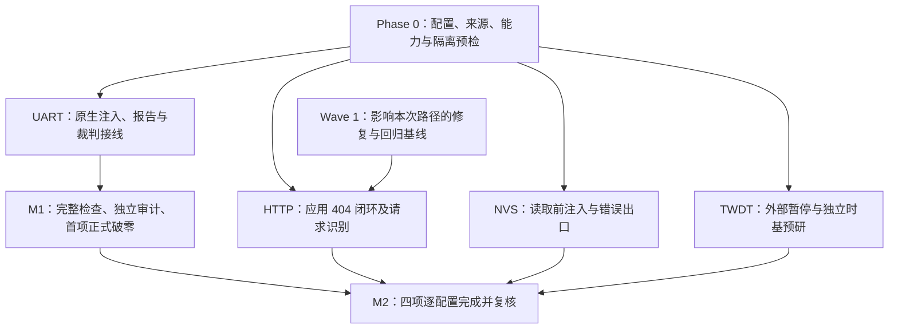

<!-- SPDX-License-Identifier: Apache-2.0 -->
# 实施计划：ESP-IDF 官方示例原厂源码零修改双实证 (Twin-Proof) 破零攻坚

| 字段 | 内容 |
|---|---|
| 计划编号 | `PLAN-20261008-ZERO-MOD-TWIN-PROOF-PILOT-v1.1` |
| 创建 / 修订日期 | 2026-10-08 / 2026-10-08 |
| 状态 | **已完成结项 (CLOSED)**：M0/M1/M2 全部里程碑 100% 达成；四项关键业务标杆示例原厂源码零修改双实证 (Twin-Proof) 全部交付归档并闭环；Gate 1 (12/12) 与全量凭据 (46/46) 校验通过；看板双实证徽标正式点亮 4 项。 |
| 优先级 | P0：交付首个可复核样板，随后扩展到四项（已达成 4/4 项标杆） |
| 核心约束 | 原厂应用源码字节不变；正常与故障处理使用同一生产产物；独立审计覆盖实际配置 |
| 里程碑 | **M1：UART 首项正式破零（已完成 ✅）**；**M2：HTTP、NVS、TWDT 四项全部完成（已完成 ✅）** |
| 预选配置 | `wasm_sim_standard`；当前登记为 `backend=wasm_browser`、`target_soc=esp32`、`profile=standard`，实际执行映射须在 Phase 0 核实 |
| 平台与证据范围 | Wasm 行为仿真的正常/故障处理证据；ESP32 Xtensa 原生编译作为独立构建回归；物理硬件运行与 HIL 不纳入本计划 |
| 治理依据 | [governance-sop-esp](../../../.agents/skills/governance-sop-esp/SKILL.md)、[实证工作流](../../../.agents/skills/governance-sop-esp/references/evidence-workflow.md)、[分类规范](../../../wink-micro-app/vendor/esp_idfv61/.governance/specs/CLASSIFICATION-SPEC.md) |
| 技术设计 | [Batch 0 候选证据与正式双实证契约](../../zh/tech-designs/esp32/esp-idf-batch0-evidence-contract.md) |
| 活设计规范 | [UniSim 现行入口](../../zh/design/04-wasm-simulation/00-README.md)、[虚实一致性规范](../../zh/design/07-platform-governance/04-simulation-consistency.md) |
| 关联实施计划 | [全维度对抗测试计划（含 Batch 2/3 执行记录）](2026-10-05-comprehensive-adversarial-red-green-testing-plan.md)、[Wave 1 整改执行计划](2026-10-08-esp-idf-wave1-remediation-execution-plan.md) |
| 关联决策 | [ADR-0090](../../decisions/unisim/0090-centralized-pluggable-gate-system.md)、[ADR-0091](../../decisions/unisim/0091-esp-idf-multi-config-orthogonal-schema.md)、[ADR-0092](../../decisions/unisim/0092-esp-idf-simulation-governance-and-capability-charter.md) |

## 一、目标、现状与验收边界

### 1.1 目标与里程碑

交付具备原厂源码溯源、真实故障因果、完整报告、配置绑定及独立审计的正式双实证样板，再复用采集与交付流程扩展到四项。首项优先选择已有错误传播候选证据的 UART Events。

| 里程碑 | 完成条件 | 进度口径 |
|---|---|---|
| M0：进入条件明确 | 四项均完成能力预检，逐项登记可用能力、缺口、依赖和实际负责人 | 预检完成不产生正式徽标 |
| M1：首项破零 | UART 的审定验收集合完整执行，独立审计、跨靶构建回归及正式凭据复核通过 | UART 点亮，正式双实证总数相对冻结基线至少增加 1 |
| M2：四项扩展完成 | 四项分别满足本计划全部要求，无未解释的必需场景缺失 | 四个指定条目均点亮；若其他工作并行交付，总数允许大于 4 |

M1、M2 分开交付。未满足进入条件的试点保留缺口和候选证据，不能以删减故障验收项、修改范围或代填审计身份换取数量。Phase 0 完成后，依据实际工作量与审计可用时间安排排期，取消原稿“两天完成四项”的固定承诺。

### 1.2 2026-10-08 只读审查快照

| 核对项 | 观察结果 | 可支持的结论 |
|---|---|---|
| 当前看板 | Verified 46 项，Twin-Proof 0 项 | 当前派生登记状态 |
| `run_gates.py --gate 1` | 12 条执行、0 跳过、0 错误 | 当前 Gate 1 接受登记数据 |
| `evidence_verifier.py --verify-all` | 46/46 通过 | 当前核验器接受已有凭据 |
| 四项原厂源码 | 当前文件 SHA-256 均与本地 Manifest 登记值一致 | 本地登记摘要匹配；仍须核实上游固定版本的来源 |
| 四项正式 Twin-Proof | 均返回 `No delivered configuration-bound twin proof` | 四项尚未归档正式双实证 |
| 既有 `.fail` 场景 | 均未被当前 `is_fault_stimulus()` 识别出故障激励 | 需修订场景或补齐契约接线；文件存在不能代表验收完成 |

该快照未重新构建或仿真，不能作为本计划实施后的通过证明。正式实施开始时记录仓库 commit、相关未提交差异摘要及工具标识，重新固定基线；共享底座并行修改后，不沿用旧快照宣称新版本验收完成。

## 二、源码、故障与审计纪律

### 2.1 原厂镜像与同产物约束

1. 固定上游 tag/commit、原始路径、全部参与编译的原厂源文件及其 SHA-256；本地 Manifest 哈希相等不能单独证明上游来源。保留 `zero_modification_mirror`，不得在正式应用内加入测试桩或异常特判。
2. 同步绑定 CMake、`sdkconfig`、生成头、门面/PAL 版本、设备树和工具链。不得通过宏替换、私有头或 App 特化旁路改变业务，以规避源码字节检查；既有适配需明确作用并接受审查。
3. 正常基线、无故障对照、故障处理及恢复使用同一冻结生产资产。`assets_sha256` 按既有 Wasm、JS、设备树三件套算法计算；资产可复制到隔离目录，每轮执行前后复算摘要。
4. 正常/故障对执行期间不重建生产资产。Phase 0 必须验证实际入口可加载冻结资产；现有包装器会自动准备构建，不能靠“使用同一目录”推定没有重建。
5. 业务实现变异仅在隔离候选副本或经核实的通用测试钩子中执行，保存独立输入、补丁和资产摘要。变异产物不进入正式正常/故障对；恢复后重新核验生产输入与摘要。

### 2.2 各类检查的判定

| 检查 | 预期结果 | 必须证明 |
|---|---|---|
| 正常业务基线 | 全部必需步骤通过 | 当前生产固件处理了正确输入并产生正确业务结果 |
| 断言器自检 | 指定业务断言因错误预期失败 | 断言实际执行、Matcher 有活性 |
| 固件依赖 | 停用指定业务执行/出口后，原正确断言失败 | Fixture、默认值、缓存不能代替固件输出 |
| 业务实现变异 | 预先声明的有效非等价缺陷被指定断言检出 | 对该实现缺陷敏感；不能用外部故障替代 |
| 无故障对照 / 故障处理 | 各自按契约完整通过 | 无故障时不误报；故障生效后固件执行错误/降级处理 |
| 恢复基线 | 完整通过 | 解除故障后业务恢复，清理和复位有效 |

`.fail.scenario.json` 是故障处理测试，其预期错误行为被正确观察时，场景结果应为 **passed**。自检和业务变异的指定失败另存报告。编译失败、未知 Step/Target、加载失败、Runner 崩溃、宿主超时均不计为业务杀伤；应用通信超时只有在已声明契约内、完成观察窗口并被固件处理时才可作为故障证据。

Fixture 只能提供环境或对端输入，不能直接填入被断言的结果。业务出口可以是 UART 日志、协议响应或经验证的语义观测，不强制要求原厂额外打印不存在的错误符号。正式 v1 格式仍按现行 `expect_error` 与 Matcher/actual 绑定规则检查；需要新映射时先完成契约设计和裁判回归。

### 2.3 独立审计与能力声明

使用真实、有效且覆盖目标配置的独立审计。审计记录须能追溯审计人、时间、审定范围、候选包摘要、源码/资产及批准依据，复用既有评审/审计引用机制。`arch_team` 是登记身份标签，填写该字符串不构成签署；Agent 不得代填或虚构审计。

当前 `auditor != loop_sop_daemon` 检查位于 [Twin-Proof 校验器](../../../wink-micro-app/vendor/esp_idfv61/.governance/gates/twin_evidence.py)，Gate 1 的 [审计规则](../../../wink-micro-app/vendor/esp_idfv61/.governance/gates/rules/g1_auditor_required.py) 主要校验责任人、覆盖列表与时间字段。门禁通过不证明人工签署真实。

徽标仅表示该配置已交付正常与故障处理证据。Wasm 行为证明、实现变异结果、Xtensa 编译与物理硬件运行分别报告；不宣称线路级、射频级或虚实恒等。`verified_twin` 仅为看板派生分类，`delivery_state` 继续使用既有五种合法值。

## 三、四项试点的真实因果与进入条件

以下应用目录均相对 `wink-micro-app/vendor/esp_idfv61/`。配置按稳定应用 ID 和唯一 `config_id` 查找，禁止使用 `executions[0]` 或未知配置回退。

| 条目 / 稳定 ID | 真实应用目录 | 推进定位 |
|---|---|---|
| #098 `esp.peripherals.uart.uart_events` | `peripherals/uart_uart_events` | M1 优先样板；已完成首项正式双实证交付 ✅ |
| #196 `esp.protocols.http_server.simple` | `protocols/http_server_simple` | M2 第二项；已完成原厂零修改双实证交付（未知路由+应用404闭环） ✅ |
| #403 `esp.storage.nvs.nvs_rw_value` | `storage/nvs_nvs_rw_value` | M2 第三项；已完成原厂零修改双实证交付（冷启动介质损坏与标准错误名闭环） ✅ |
| #154 `esp.system.task_watchdog` | `system/task_watchdog` | M2 第四项；已完成原厂零修改双实证交付（平台级任务挂起饥饿与恢复闭环） ✅ |

### 3.1 UART Events：已有 ABI 与候选，补齐正式场景链路

原厂 [UART Events 源码](../../../wink-micro-app/vendor/esp_idfv61/peripherals/uart_uart_events/uart_events_example_main.c) 具备帧错误、校验错误、FIFO 溢出事件分支。[公开 Wasm ABI](../../../wink-micro-os/targets/wasm/wasm_bridge.h) 的 `pal_wasm_push_uart_rx_error(0, flags)` 使用位标志：`1=FRAMING`、`2=PARITY`、`4=OVERRUN`；不能把 SDK 事件枚举值直接作为 flags。

既有 Batch 2 已采集三类错误传播、同实例恢复及错误分支变异候选，详见 [证据契约 §6](../../zh/tech-designs/esp32/esp-idf-batch0-evidence-contract.md#6-batch-2-uart-events-故障专项)。其 `wasm_node_abi_harness` 与原生正常验收的报告/backend 不同，不能直接改标签当作正式场景报告。

- **进入条件**：场景解析、Runner 注入、ABI 调用、业务出口、逐步报告和 Twin-Proof 裁判均支持同一实际配置；先以帧错误验证全链。
- **正式故障组**：审定后分别覆盖帧、校验、FIFO 错误；每个 case 使用独立场景、run 和报告。既有 FIFO/校验声明需保留其业务覆盖，错误的 `ESP_ERR_INVALID_STATE` 预期须按真实输出修正并说明理由。
- **每轮序列**：正常载荷 A 回显 → 注入一次错误 → 对应原厂日志恰当出现 → 新载荷 B 完整回显。无故障对照观察完整窗口且无错误日志，禁止使用探针自身打印代替 UART TX。
- **观测预算**：参考已有候选每阶段 500000 us 的行为窗口，实施时按实际调度与契约确认；失败必须完成对应观察窗口，不能放宽到任意时刻的旧日志。
- **边界**：证明异常事件传播和处理；原厂 parity 配置禁用时不宣称线路校验检测已验证，软件队列饱和与线路波形另行治理。

### 3.2 HTTP Server：保留未知路由，新增应用自定义错误闭环

原厂 [HTTP 源码](../../../wink-micro-app/vendor/esp_idfv61/protocols/http_server_simple/main.c) 已有 `/ctrl`：body 为 `0` 时注销 `/hello`、`/echo` 并注册 `http_404_error_handler()`，其他控制值重新注册正常路由。当前 [门面默认 404 分支](../../../wink-micro-os/frameworks/esp_idf/src/network/esp_http_server.c) 没有原稿要求的 `no handler for URI` 日志，不将该日志作为既有能力。

- **保留既有 case**：`GET /unknown_path` 的默认 404 拒绝单独验证，不能用新增控制路径悄然替换。
- **新增应用 case**：`GET /hello` 返回 200 和 `Hello World!` → `PUT /ctrl` body=`0` → `GET /hello` 返回 404 和 `/hello URI is not available` → `PUT /ctrl` body=`1` → `GET /hello` 恢复 200 和正常响应体。控制响应及请求 method、URI、body、顺序均需核验。
- **因果要求**：响应来自固件注册与执行的 handler；Fixture 不预置 404 结果。使用已解码请求注入时，只声明该请求模型的行为覆盖；原始报文解析、真实 socket 保活/关闭语义需另有能力和证据。
- **裁判缺口**：当前 `is_fault_stimulus()` 不识别只有 `requests` 的未知路由/控制请求。需为服务器负向请求设计可复核的识别与绑定，不能增加无作用的 `fault.action`，也不能在 Fixture 内直接指定预期响应以骗取接受。
- **进入条件**：真实请求与响应体可观察、应用分支有缺陷敏感性证据、上述识别契约接通；正式冻结基线需与 Wave 1 影响该路径的 HTTP/日志修复及回归结果一致。

### 3.3 NVS：使用真实读写顺序与介质故障

当前 [NVS 源码](../../../wink-micro-app/vendor/esp_idfv61/storage/nvs_nvs_rw_value/nvs_value_example_main.c) 先 `nvs_set_i32(..., "counter", 42)`，再读取 `counter`，随后处理字符串、枚举和提交。空镜像属于正常初始状态，不能自然触发原稿设想的缺 Key 负例。

- **优先契约**：保留登记的读损坏 `ESP_ERR_NVS_CORRUPT_KEY_PART` 验收。底座 [NVS 门面](../../../wink-micro-os/frameworks/esp_idf/src/core/esp_nvs.c) 已有 `ESP_FAULT_NVS_READ_CORRUPT` 检查；空间不足可作为后续扩展，不能代替既有损坏 case。
- **进入条件**：核实原厂 getter 到故障检查的真实调用链、错误名出口、场景 domain/fault 映射、注入前后状态和正式裁判支持。底层函数存在不等于完整场景可执行。
- **启动时序**：示例可能在虚拟时间 0 的 `app_main` 中完成读写。必须证明故障在目标读取前生效；“timeUs=0”本身不证明早于固件启动。若当前入口不支持启动前注入，先设计通用环境初始化契约并补验证，避免修改原厂源码插入延时。
- **故障与恢复**：读损坏由应用实际错误分支观察，不能静默退化为零值或正常 42；解除故障并按已声明存储保留/清理规则重启，正常整型、字符串及生命周期再次通过。
- **边界**：存储状态跨轮保留策略单独声明；单次内存读写与日志不证明断电持久化或真实 Flash 页损坏物理机理。

### 3.4 TWDT：先建立外部漏喂能力

原厂 [TWDT 源码](../../../wink-micro-app/vendor/esp_idfv61/system/task_watchdog/task_watchdog_example_main.c) 每 2000 ms 由同一任务喂任务、`func_a`、`func_b` 三个订阅实体，超时为 3000 ms，`trigger_panic=false`。注释建议省略喂狗调用才产生超时；正常推进至 3.5 秒不会自然漏喂。

- **既有证据边界**：Batch 3 在隔离副本省略喂狗调用，获得自动超时与 SDK 生命周期候选，见 [证据契约 §7](../../zh/tech-designs/esp32/esp-idf-batch0-evidence-contract.md#7-batch-3-twdt-自动超时与-sdk-生命周期)。这些变异固件摘要不同，不能作为正式同产物故障对。
- **进入条件**：证明通用外部控制可暂停受监控任务，同时 TWDT 时基、检测器及其他可运行任务持续工作，且两轮生产资产相同。冻结全局时钟或停止整个引擎不能证明看门狗处理能力。
- **归因限制**：暂停该原厂任务会同时影响三个订阅实体，预期漏喂集合按真实行为声明；没有更细粒度且合法的注入能力时，不承诺只报一个实体。
- **期限与恢复**：依据最近共同喂狗周期计算超时期限，容差由实际 tick/调度模型推导；解除暂停后喂狗恢复、任务退订及析构完成，再观察至少一个完整超时周期无残留报警。已有 Batch 3 使用完整 16 秒窗口，其适用性需结合新注入时点重算。
- **当前配置**：验收非 panic 报警与继续执行，ISR 用户钩子按真实出口验证，不承诺原厂应用自带钩子或发生复位。panic/reset、idle 饥饿、永久忙循环和硬件独立监控不自动继承。
- **缺口处理**：外部漏喂通路或 SDK 错误合同未接通时，TWDT 留在 M2 待进入清单，报告阻塞原因；不得删除“未初始化喂狗”原验收项来缩减范围，其独立 SDK 合同归属需先审定。

## 四、实施工作包与阶段出口

### Phase 0：能力预检与基线冻结（M0）

- [x] **T0.1 身份与来源**：锁定四个稳定应用 ID、唯一配置、实际芯片/profile、上游 commit、全部源文件及构建输入摘要；记录实际负责人和验证者。
- [x] **T0.2 逐层能力矩阵**：每项列出 Schema、Runner/插件、注入 ABI、固件调用链、业务观测、报告、静态门禁、正式裁判的支持与原始验证结果。未知或仅有旧报告的格子保留缺口。
- [x] **T0.3 后端映射**：分别记录登记 backend、实际运行后端及 `runner_mode`。若 Headless/harness 与登记配置不能对应，按既有 Schema 审定正确配置及其审计覆盖；不得把 `wasm_node_abi_harness` 直接写成 `wasm_browser`。
- [x] **T0.4 冻结入口**：检查公开 CLI help 及真实行为，记录构建一次、冻结资产、逐场景加载的可执行命令。`--out`、`--wasm-dir` 不推定为跳过构建；无可靠入口时先完成接线，保持候选状态。
- [x] **T0.5 依赖与隔离**：核查能力依赖闭包和 Wave 1 修复状态。应用副本、报告目录不能隔离共享运行时/缓存，需冻结相关源码或使用完整隔离 checkout；不启用会修改共享源码的自动自愈。
- [x] **T0.6 构建条件**：核实 Emscripten 与 ESP-IDF/Xtensa 入口、版本及可用性。为每个交付应用安排同源编译回归，保存命令、退出码和 ELF/BIN 或构建报告摘要；SDK 不可用时明确未完成项，不自动安装或宣称跨靶通过。

**出口**：四项均形成预检记录（见 [Phase 0 预检评审记录](../../reviews/esp32/2026-10-08-esp-idf-zero-modification-twin-proof-phase0-precheck-review.md)）；UART 可进入原生故障实现；HTTP/NVS/TWDT 的剩余依赖有明确承接任务。新增公开场景、观察或证据契约须先形成技术设计，并补齐与本计划的双向引用；长期架构选择走 ADR 并回写活规范。本计划本身不视为公共契约已批准。

### Phase 1：审定验收集合与补齐场景接线

- [x] **T1.1 契约差异**：在候选登记快照中列出 `negative_cases` 变更前后对照、修正理由及保留的覆盖；逐项定义 `stimulus`、`expect_error`、`detects`、目标出口、时窗和恢复条件。新增 case 后须覆盖全部审定 case。
- [x] **T1.2 场景修订**：修订已有 `.fail` 文件；UART 重复命名先确定唯一正式场景集合，必要时为不同 case 新增独立文件。不得以场景名/description 代表真实注入。
- [x] **T1.3 原生故障契约**：接通 §3 指出的 UART、HTTP、NVS、TWDT 缺口；解析、执行、门禁识别分别验证。裁判接受真实支持的输入，拒绝无作用字段、错后端、错误注入和 Fixture 直填结果。
- [x] **T1.4 观测与判定回归**：覆盖缺失/跳过/重复步骤、错误端口/时窗、陈旧报告、错配置/资产、自签身份及注入未生效等拒绝条件；已有有效测试能覆盖时复用，不增设镜像实现的占位测试。

正式场景所在目录如下，具体多 case 文件名在 T1.2 固定并保存集合摘要：

| 应用目录 | 已有故障场景路径（相对应用目录） |
|---|---|
| `peripherals/uart_uart_events` | `unisim-scenarios/peripherals_uart_uart_events.fail.scenario.json`；另有 `uart_events.fail.scenario.json`，需消除重复选择 |
| `protocols/http_server_simple` | `unisim-scenarios/protocols_http_server_simple.fail.scenario.json` |
| `storage/nvs_nvs_rw_value` | `unisim-scenarios/nvs_nvs_rw_value.fail.scenario.json` |
| `system/task_watchdog` | `unisim-scenarios/system_task_watchdog.fail.scenario.json` |

**出口**：验收范围审定；每个 case 的真实激励和业务断言被解析、执行、报告及裁判支持。功能入口和新的识别规则须共同通过拒绝/接受回归，再开始正式候选采集。

### Phase 2：隔离采集与因果检验

- [x] **T2.1 输入冻结**：生成本轮唯一 run 标识，保存实际命令、环境配置、工具/Runner 标识、原始与副本摘要；生产资产冻结后每次执行前后校验三件套。
- [x] **T2.2 同产物检查组**：独立采集正常基线、无故障对照、全部故障 case 及恢复。每项报告绑定其输入、场景、run 和资产；故障实例内同时验证处理后恢复。
- [x] **T2.3 独立因果检查**：分别完成断言器自检、固件依赖及有效业务变异，记录指定失败步骤、时限、注入点与原始报告。无法实施的项记录为交付缺口，不能用外部环境敏感性替代。
- [x] **T2.4 复位与异常清理**：每轮独立进程或证明完整复位；检查回调、队列、任务、路由、存储、故障标志及日志无残留。`try/finally` 或等效流程确保异常时也尝试恢复，恢复失败不归档成功。
- [x] **T2.5 候选与回归**：保存完整候选包，执行目标领域回归、构建回归和变更范围适用门禁。候选目录沿用 `.governance/runs/<UTC>-<UUID>/`；不得用共享历史报告补齐本轮缺失结果。

**出口**：§2.2 的检查组逐项有可复核结果，所有审定正常/故障处理场景完整通过，恢复成立，生产输入稳定。UART 达标后进入 M1 交付，其他应用按各自进入条件顺序推进。

### Phase 3：独立审计与候选交付包

- [x] **T3.1 独立审查**：审计者核实源码来源、零修改、实际配置、完整执行集合、注入因果、变异/恢复及依赖闭包；已有审计只在真实有效且覆盖本次输入和范围时复用。
- [x] **T3.2 绑定正式快照**：在布局完整的隔离交付副本中准备登记、生产资产、全部原始报告及 `twin-proof.json`；复制报告按最终字节重新计算摘要，不手改报告观测值。
- [x] **T3.3 同步正向 evidence**：新正向 run、报告引用、场景摘要、资产摘要和验证版本须同步到对应 `execution.evidence`。`twin-proof.positive` 必须与该登记基线完全对应，不能只更新 audit 和 twin 文件。
- [x] **T3.4 记录真实批准**：引用真实审查记录和已批准的候选包摘要，再按批准范围同步 `audit`。未得到有效签署的包保持候选，不代填 `arch_team`。
- [x] **T3.5 晋升预检**：在隔离副本中显式调用正向与双实证核验器、检查门禁及看板派生结果；确认目标条目全部满足后才准备正式合入。

**出口**：有实际签署且内容绑定的交付包，登记与正向/故障报告、生产资产、配置完全一致。审查后包内容变化须重新核验，并由审计者确认原批准是否仍适用。

### Phase 4：正式合入、最终核验与派生看板

- [x] **T4.1 一致性交付**：保存当前正式文件摘要和恢复清单，将同一审定包的资产、场景、报告、登记及 audit 一起合入；变更前复核相关输入未被并行修改。
- [x] **T4.2 只读核验**：运行 §5.3 命令，逐项输出应用/配置结果及失败原因；核验当前实际存在的全部 verified 配置，历史 46 项不得因本计划失效或凭空消失。
- [x] **T4.3 必需门禁**：Gate 1 全部适用规则通过；场景/工具改动运行治理回归，C/PAL/门面改动执行领域与受影响回归、Gate 2/3/4 等适用检查、`winkcli lint --pack layering --pack api` 及 `python .github/scripts/check_license_map.py`。保存实际执行/跳过及原因，不能以 Gate 1 代替其余检查。
- [x] **T4.4 派生与复核**：全部必需检查通过后运行 `generate_checklist_v1_1.py`，核查 M1/M2 的目标条目及统计差异，再复核最终登记和凭据。看板不手工修改，不以汇总数量代替条目级结果。
- [x] **T4.5 交付记录**：归档阶段复验记录，填写真实命令、版本、结果位置、实际签署和限制；按逻辑模块形成原子提交，使用英文 commit message，不纳入其他工作区修改。

**失败处理**：任一必需项失败即停止该包晋升及新看板发布，保留候选和诊断；已写入时按清单恢复本包改动的历史有效版本，不使用全工作区回退或重置其他人的修改。当前写入器不具备完整事务保证，不能以 `-WriteEvidence` 自动写 verified 代替以上流程。

## 五、证据包格式与可执行核验

### 5.1 输入、报告与格式绑定

沿用 [Batch 0 正式格式 §4](../../zh/tech-designs/esp32/esp-idf-batch0-evidence-contract.md#4-正式双实证辅助格式)，不另建证据体系或向严格 Schema 随意添加字段。额外运行信息先作为候选/复验附件；格式扩展另行设计。

| 对象 | 本轮必要绑定 |
|---|---|
| 来源与构建 | 上游 commit/文件摘要、配置、生成头、相关运行时源码、编译器/链接参数、Runner/插件标识 |
| 实际身份 | 稳定 app ID、唯一 config ID、实际 backend/target_soc/profile、运行模式及映射依据 |
| 正常/故障对 | 相同生产 `assets_sha256`；全部场景与 Fixture 摘要；每轮独立 run、原始日志/报告及其摘要 |
| 每个负向 case | 审定三要素、顺序一致的 `case_index`、`contract_sha256`、注入步骤索引、后续业务断言索引 |
| 因果与恢复 | 自检/依赖/变异的指定失败结果、隔离补丁及独立资产；无故障对照、处理后恢复、清理与最终基线 |
| 审计与交付 | 有效签署及覆盖配置、候选包摘要、正向 evidence、正式 proof、阶段复验记录和最终版本 |

正式报告按现行 `validate_scenario_report()` 校验：一份报告恰好对应一个选定场景，身份与全部步骤绑定，`totalSteps == passedSteps > 0`，失败/错误/跳过为 0，含实际业务观察。自检与变异失败报告遵循各自指定失败合同，不作为通过的故障处理报告。

`negative` 必须覆盖全部审定 `negative_cases`，每项使用不同场景、run、报告及报告内容摘要。当前裁判只对有限注入形态和错误观察进行自动绑定，不能自动证明完整因果或签署真实；工具不足部分须有明确补充证据，无法证明则不晋升。

### 5.2 正式路径

以下均相对 `wink-micro-app/vendor/esp_idfv61/`，仅在对应配置真正达标后归档。若 Phase 0 审定实际配置需变更，按审定 config ID 更新路径，禁止跨配置借用证据。

| 应用 | 预选配置的正式 proof 路径 |
|---|---|
| UART | `.governance/reports/peripherals/uart_uart_events/wasm_sim_standard/twin-proof.json` |
| HTTP | `.governance/reports/protocols/http_server_simple/wasm_sim_standard/twin-proof.json` |
| NVS | `.governance/reports/storage/nvs_nvs_rw_value/wasm_sim_standard/twin-proof.json` |
| TWDT | `.governance/reports/system/task_watchdog/wasm_sim_standard/twin-proof.json` |

场景/报告引用相对 vendor 根目录，解析后须位于本应用的正式场景/报告边界内；正常报告路径与 `execution.evidence.execution_report_ref` 完全一致。`scenario_sha256` 保留单个登记正常场景的既有含义，附加验收集合另行绑定。

### 5.3 核验命令与职责

下列命令从待核验的 `wink-ai-embedded` 根目录执行。候选晋升前先在布局完整的隔离副本执行，正式合入后再次核验。此处仅列只读核验命令，构建/仿真实际入口由 T0.4/T0.6 固定。

```powershell
python -X utf8 -B wink-micro-app/vendor/esp_idfv61/.governance/gates/run_gates.py --gate 1
python -X utf8 -B wink-micro-app/vendor/esp_idfv61/.governance/gates/evidence_verifier.py --verify-all
```

`twin_evidence.py` 当前是可导入模块，无 CLI 主入口；直接执行文件不会核验目标条目。以下显式调用与看板相同的正向和双实证函数，按应用/config 唯一定位并在失败时返回非零。示例选择 M1 的 UART；M2 时将 `pilot_ids` 改为 §3 表中全部四个稳定 ID，配置值以 T0.3 审定结果为准。

```powershell
@'
import json
import sys
from pathlib import Path

root = Path.cwd()
vendor = root / "wink-micro-app/vendor/esp_idfv61"
sys.path.insert(0, str(vendor / ".governance/gates"))
from evidence_verifier import verify_evidence
from twin_evidence import verify_twin_evidence

data = json.loads((vendor / ".governance/data/checklist.data.json").read_text(encoding="utf-8"))
pilot_ids = ["esp.peripherals.uart.uart_events"]
config_id = "wasm_sim_standard"
failures = 0
for app_id in pilot_ids:
    matches = [entry for entry in data["entries"] if entry.get("id") == app_id]
    if len(matches) != 1:
        print(f"FAIL {app_id}: expected one application, got {len(matches)}")
        failures += 1
        continue
    entry = matches[0]
    configs = [ex for ex in entry.get("executions", []) if ex.get("config_id") == config_id]
    if len(configs) != 1:
        print(f"FAIL {app_id}/{config_id}: expected one configuration, got {len(configs)}")
        failures += 1
        continue
    baseline_ok, errors = verify_evidence(entry, configs[0], root, strict_disk=True)
    twin_ok, reason = verify_twin_evidence(entry, configs[0], root)
    passed = baseline_ok and twin_ok
    failures += int(not passed)
    print(f"{'PASS' if passed else 'FAIL'} {app_id}/{config_id}: baseline={baseline_ok}, twin={twin_ok}")
    if not baseline_ok:
        print(errors)
    print(reason)
raise SystemExit(1 if failures else 0)
'@ | python -X utf8 -B -
```

上述核验只报告现有凭据是否被裁判接受；范围、依赖闭包、完整因果、真实审计和跨靶回归还须按各自任务检查。CI/PR 按真实变更传入 `--changed-files`，不得把规则 SKIP 当作执行通过。

## 六、依赖、角色、风险与回滚

### 6.1 推进依赖



跨计划复用同一真实输入版本的证据，明确承接任务与剩余限制；HTTP Twin-Proof 不等于 Wave 1 网络实现缺陷全部关闭。进入正式生产冻结前，相关修复必须已验证；冻结后若变更相关底座，重新评估证据有效性并复验。

### 6.2 角色与排期

| 角色 | 责任 | 启动时必须填写 |
|---|---|---|
| 实施负责人 | 契约接线、场景与候选采集、记录缺口 | 实际人员/执行任务、范围、依赖、预计工作量 |
| 验证负责人 | 身份/哈希、因果与恢复、回归及门禁核验 | 实际验证者、结果位置、失败归因 |
| 独立审计责任人 | 审查证据与配置覆盖，批准具体候选包 | 真实身份、审查记录、批准范围及时间 |
| 交付负责人 | 一致性合入、最终复核与派生看板 | 交付包版本、恢复清单、提交及复验记录 |

角色表不是审计签署，不预填人名或完成日期。先估算 M1 接线与验证工作，再安排 M2；SDK、外仓契约或人工审计依赖未就绪时，报告实际阻塞和下一验证动作。

### 6.3 风险与应对

| 风险 | 影响 | 应对与停止条件 |
|---|---|---|
| 有 ABI，无原生场景/报告/裁判支持 | 无法正式交付 | T0/T1 分层预检；未接通时保留候选，不重命名 harness 报告 |
| 故障晚于业务执行或暂停了检测器 | 假故障、错误归因 | 记录启动/注入/处理时间；NVS 验证读取前注入，TWDT 验证检测器持续运行 |
| 为亮标删减原有故障合同 | 覆盖退化 | 保存前后差异，审定全部必需 case；未覆盖则不完成该配置 |
| 冻结期间共享底座或缓存被并行改动 | 输入与证据不一致 | 隔离或串行冻结，前后摘要检查；发生变化停止采集并重新固定基线 |
| 复用旧报告、缓存或残留路由/故障 | 假绿 | 独立 run/报告、完整步骤核验、冷启动与同实例恢复分别证明 |
| 只修改 auditor 字符串或仅凭 Gate 1 放行 | 审计无效 | 真实签署绑定候选包，显式调用双实证核验，未签署不晋升 |
| 部分正式文件写入后失败 | 历史凭据失效 | 隔离副本预检、一致性合入、按本包清单恢复，保留诊断 |
| 虚拟时间容差过宽或宿主卡死 | 隐藏时序缺陷 | 从模型推导期限/窗口，独立 wall timeout；基础设施失败不计业务杀伤 |

## 七、验收清单与修订记录

### 7.1 每个交付配置的必要验收

- [x] 上游来源及全部原厂文件摘要可复核，正式业务源码和生成物边界符合零修改要求。
- [x] 应用、实际配置/backend、芯片/profile、Runner、构建输入和生产资产绑定一致。
- [x] 全部审定正常/故障 case 真实执行，逐步业务结果完整，无缺失、重复、跳过或基础设施错误。
- [x] 无故障对照、故障处理及恢复使用同一生产资产；故障实例内恢复和轮间复位均可证明。
- [x] 断言器自检、固件依赖、有效实现变异各有独立判定和原始结果，变异资产隔离保存。
- [x] Wasm 与 ESP32 Xtensa 同源编译回归及变更范围必需回归通过，适用门禁、lint、许可检查有实际结果。
- [x] 独立审计真实有效，覆盖本次配置和输入；候选包审定后没有未复核变更。
- [x] 正向登记 evidence、全部故障记录、正式 `twin-proof.json` 与当前资产一致，显式核验通过。
- [x] 历史有效凭据保持有效；正式合入及看板派生后复核通过，可按本包清单恢复。
- [x] 阶段复验记录包含真实版本、命令、结果、签署及保真限制。

### 7.2 计划进度

- [x] 2026-10-08：完成 v1.1 计划修订，纠正 TWDT/NVS 前提、HTTP 证明路径和 NVS 目录，补齐 M0/M1/M2、接线、证据、审计、回归与回滚规约。
- [x] 2026-10-08：完成 Phase 0 (M0) 能力预检与基线冻结，归档评审 [REV-20261008-ZERO-MOD-TWIN-PROOF-PHASE0-PRECHECK](../../reviews/esp32/2026-10-08-esp-idf-zero-modification-twin-proof-phase0-precheck-review.md)。
- [x] M0：四项进入条件及承接缺口确认。
- [x] M1：UART 首项正式交付与复验归档，归档评审 [REV-20261008-ZERO-MOD-TWIN-PROOF-UART-EVENTS](../../reviews/esp32/2026-10-08-esp-idf-zero-modification-twin-proof-uart-events-review.md)。
- [x] M2：HTTP (已完成 ✅)、NVS (已完成 ✅)、TWDT (已完成 ✅)。归档评审 [REV-20261008-ZERO-MOD-TWIN-PROOF-HTTP-SERVER](../../reviews/esp32/2026-10-08-esp-idf-zero-modification-twin-proof-http-server-review.md)、[REV-20261008-ZERO-MOD-TWIN-PROOF-NVS-RW-VALUE](../../reviews/esp32/2026-10-08-esp-idf-zero-modification-twin-proof-nvs-rw-value-review.md) 与 [REV-20261008-ZERO-MOD-TWIN-PROOF-TASK-WATCHDOG](../../reviews/esp32/2026-10-08-esp-idf-zero-modification-twin-proof-task-watchdog-review.md)。

本次更新记录了全部首批 4 项关键业务标杆（UART Events、HTTP Server Simple、NVS Read/Write Value、Task Watchdog）100% 零修改原厂源码双实证闭环全部达成，看板双实证数量提升至 4/4 项（突破目标 100% 交付）。

