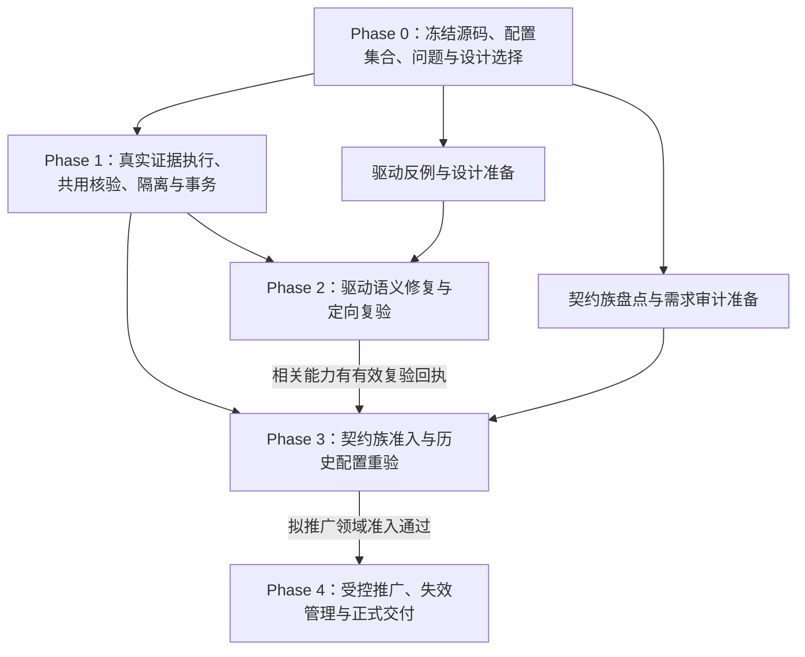

<!-- SPDX-License-Identifier: GPL-3.0-only -->
# ESP-IDF 防假绿全面整改：总控计划与执行质量基线

| 项 | 内容 |
|---|---|
| 计划编号 | `PLAN-20261009-ESP-IDF-AFG-TOTAL-REMEDIATION-MASTER` |
| 日期 / 修订 | 2026-10-09，Asia/Shanghai；`v1.1` 执行质量修订版（已确认采纳） |
| 状态 | **Active / 修订已确认采纳，Phase 0 实施中**；原 v1.0 记录的 Approved 不代表新增任务已经批准或通过验收 |
| 修订核查基线 | `acb984fdccb795c5da3d20192a6435a2151e3ee3`；本次只读核查与计划编辑未执行构建、仿真、审计签署或正式晋升 |
| 关联技术设计 | [AFG-Engine 契约](../../../zh/tech-designs/esp32/esp-idf-anti-false-green-verification-engine-contract.md)、[Loop 可靠性契约](../../../zh/tech-designs/esp32/esp-idf-loop-reliability-contract.md)、[Batch 0 证据契约](../../../zh/tech-designs/esp32/esp-idf-batch0-evidence-contract.md) |
| 关联问题与历史评审 | [Loop I-01～I-19 问题账本](../2026-10-09-esp-idf-loop-issues-and-remediation-plan.md)、[存量历史裁决](../../../reviews/esp32/2026-10-09-esp-idf-legacy-46-triage-report.md)、[Checklist 深度评审](../../../reviews/esp32/2026-10-08-esp-idf-verified-checklist-deep-review.md) |
| 共同执行规则 | [05-EXECUTION-QUALITY-GATES.md](05-EXECUTION-QUALITY-GATES.md)；全部阶段必须引用其任务完成、证据、检查集合和停止规则 |
| QG-0 基线证据 | [06-QG0-PHASE0-BASELINE-EVIDENCE.md](06-QG0-PHASE0-BASELINE-EVIDENCE.md)（Phase 0 完成，门禁已通过，解除 Phase 1/Phase 2 实施阻塞） |
| 活规范入口 | [UniSim 设计入口](../../../zh/design/04-wasm-simulation/00-README.md)、[分类与交付规范](../../../../wink-micro-app/vendor/esp_idfv61/.governance/specs/CLASSIFICATION-SPEC.md) |

## 1. 修订目标与事实边界

目标是建立能拒绝错误证据、接受正确实现、保持配置身份并保护历史证据的执行链，再按满足前置条件的配置扩大验证和交付。**整改完成以问题闭环与证据完整性判断；绿灯数量是派生结果，不是裁决输入。**

v1.0 的“6 项真正合规”“Pilot A/B 已真实通过”不能直接作为本工程可信起点。当前 `tools/verify_afg_engine.py` 的 Pilot 路径合成记录，存量裁决含按应用 ID 放行分支；它们可作为算法测试材料或历史诊断，必须经阶段一改造后的真实运行入口重新核验。当前流水线的配置摘要、工具链和探针 ABI 也有贴标值，必须改为核验实际输入与产物。

历史缺陷必须按当前源码复核。S-01 的原问题是设备观察回退为全局虚拟时钟，不能直接描述为宿主墙钟问题。当前定时器观察、单次回调重装和 ADC 采样失败传播已有源码修正，分别记录为“源码已调整，待定向复验”；ADC 生产/消费解耦等剩余缺口不得因该修正自动关闭。

## 2. 范围基线与执行单位

以下为 2026-10-09 对当前清单的只读统计，**不是新的产品范围裁定或调度授权**。执行前由 QG-0 重算并冻结成员集合。

| 指标 | 核查值 | 执行解释 |
|---|---:|---|
| 清单全部应用 | 478 | 包含现行范围外条目；本工程不自动修改范围 |
| in_scope 应用 / 配置 | 312 / 313 | 按配置执行；station 同时有 `wasm_sim_standard` 与 `wasm_sim_node` |
| in_scope active 应用 / 配置 | 267 / 268 | active 仍须满足审计覆盖、依赖与运行时前置条件 |
| in_scope deferred 应用 / 配置 | 45 / 45 | 本轮记录暂缓原因、依赖和后续安排；投入安排变更需走已有治理流程 |
| in_scope 需求审计 | audited 46；pending 266 | pending 先完成真实需求审计，不代填 auditor 或 audited_configs |
| 当前登记 verified 配置 | 46 | 登记状态不等于满足本工程全部新验收要求 |
| 清单 SHA-256 | `2910998e93f2c36e904effce4494c8bb73b5b603c8e790e92fc6129c221be122` | 历史核查指纹；发生变化重新核对输入及范围 |

最小执行实体是 `(app_id, config_id, backend, target_soc, profile)`，另绑定实际构建配置摘要、完整验收场景集合及其摘要。缺失、未知或歧义配置显式失败；禁止选首配置、首场景或复用别的配置的报告。

QG-0 同时冻结治理对账全集和本轮必需运行集合，逐配置记录其归属及已有治理依据。全集必须都有去向，本轮运行集合必须实际完成检查；其内 pending/阻塞项保留为未执行并阻止批次成功。已获合法暂缓的配置不算运行交付；任何集合调整都须记录依据、复核和影响，不能在看到失败后缩小集合。

区分两个交付面：

- **工程整改闭环**：全部 I/S/Q/G 问题有归属、当前证据、修复或经复核的适用性裁定，必需验收有真实回执；无法解决的必需问题保持未完成。
- **配置治理与发布**：312 应用 / 313 配置全部得到明确审定或当前缺口说明；只有满足完整前置条件并获有效独立审计的配置可以晋升。尚待需求审计、能力阻塞或暂缓不计为已交付，不通过改范围消除缺口。

## 3. Phase 0 与四阶段依赖

Phase 0 是所有阶段的进入条件，不新增第五个大规模实现阶段。原四阶段结构保留，领域设计与资料整理可在 QG-0 后进行；真实运行与正式发布必须满足对应出口。

| 阶段 | 责任角色 / 复核角色 | 进入条件 | 必需出口 |
|---|---|---|---|
| Phase 0 | 计划维护者 / 架构复核者 | 本修订获确认，执行范围明确 | QG-0：基线与配置集合、问题追踪、任务负责人、实际命令和设计冲突处理完成 |
| [Phase 1](01-PHASE1-PIPELINE-AND-SANDBOX.md) | 工具与证据维护者 / 独立验证维护者 | QG-0 | QG-1：真实采集与 L2 链路、实际身份、共用拒绝/接受策略、隔离、密封与事务通过反例和正例 |
| [Phase 2](02-PHASE2-DRIVER-AND-SIM-HARDENING.md) | C 驱动维护者 / 领域复核者 | QG-0；真实端到端验收依赖 QG-1 | QG-2：S-01～S-05 与相关 Q/G 缺口逐项复验；每个能力有边界、错误与恢复证据 |
| [Phase 3](03-PHASE3-ARCHETYPES-AND-LEGACY-TRIAGE.md) | 契约与场景维护者 / 需求审计及领域复核者 | QG-1；各配置依赖的 QG-2 出口成立 | QG-3：契约族注册集合及准入证据、46 历史配置完整裁决、新复验报告 |
| [Phase 4](04-PHASE4-SCALE-OUT-312-ROLLOUT.md) | 调度与发布维护者 / 独立审计者 | QG-1；拟推广领域 QG-2/QG-3 出口成立 | QG-4：精确批次与续跑、领域冻结、证据失效、版本隔离、有效审计、晋升读回与看板对账 |

先交付一条 hello_world 的真实闭环，再加入 UART Echo 的交互因果，最后加入 ADC 的自发生产/背压。统一 Pilot B 为 `esp.peripherals.uart.uart_echo`；`uart_events` 保留为另一个适用回归配置，不混用试点身份。

## 4. 全局执行约束

1. **生产证据可追溯**：正式采集链中的结论必须从本轮报告推导，绑定实际执行身份及原始文件摘要。单元测试允许合成输入，并明确标注测试层级；合成输入、错误 matcher 自检和 mock 不能进入正式业务凭据。
2. **证伪必须归因**：实现变异在 fixture、场景预期不变时使指定原业务断言失败；故障处理实验验证对应错误处理断言通过。编译失败、注入未生效、无关崩溃或基础设施超时不计击杀；合法等价变异按现行独立裁定协议处理。
3. **语义与错误域保持兼容**：DAL/PAL 使用 POD 与编译期静态分发，不引入 ops/vtable 或 container_of；可能失败的 Wink API 保持 `wink_status_t` 负错误码。ESP-IDF 门面对外保留 `esp_err_t`，POSIX/NimBLE 按自身错误域核验；不把所有函数、回调和 getter 强改为同一种返回类型。
4. **单一虚拟时间与只读观察**：遵循 [ADR-0042](../../../decisions/unisim/0042-sim-execution-modes.md) 与 [ADR-0053](../../../decisions/unisim/0053-sim-same-timestamp-event-total-order.md)。生产者与读取解耦，但不新增独立推进业务时间的宿主时钟；getter/probe 不推进时钟。
5. **编译、保真和许可分别验收**：公共 C 变更按实际目标完成 Wasm 与真实 SDK 编译链接、所需 ABI 与适用行为核验；编译通过不能证明物理行为一致。PWM 遵循 [ADR-0066](../../../decisions/core/0066-pwm-basis-points-and-float-deprecation.md)，分层/API 和 [许可地图](../../../decisions/core/0084-layered-license-map-lgpl-runtime.md)门禁按变更执行。
6. **交付态与诊断正交**：`delivery_state` 仅使用 `planned | building | verified | stale | regressed`。ELIGIBLE 是引擎资格结论，needs_driver_fix 等是诊断，均不新增为交付状态；凭据版本放入既有兼容机制或经设计冻结的版本化元数据。
7. **历史与签署保护**：历史报告只读；修复后新增复验报告。正式证据写后不再修改，以摘要检测篡改，不声称普通文件系统提供绝对不可篡改性。审计身份、覆盖配置和决定须真实可核验。
8. **设计选择先收敛**：已有规范优先复用。新增 Schema、摘要、事务或跨仓契约选择先记录 Proposed 决策并完成适用技术设计；重大决策 Accepted 后立即回写活规范。计划中的拟产物和接口不是现有工具能力。

## 5. 里程碑与关闭判据

| 里程碑 | 必需判据 | 不足以宣布完成的结果 |
|---|---|---|
| M0 / QG-0 | 冻结基线、完整问题映射、任务与检查集合、设计选择及实际环境 | 只有 HEAD、只有清单计数、未指定任务责任 |
| M1 / QG-1 | 无 ProofPlan/错身份/借用报告拒绝；真实变异击杀与正确基线恢复；全部正式接受入口一致；真实 OS 与事务验证 | 删除一处 mock、仅退出非零、合成 Pilot、只跑 unit test |
| M2 / QG-2 | 正确设备观察、自发生产、参数化背压、生命周期与存储语义的真实复验 | 固定 100ms 日志、修改回执布尔值、只做语法检查 |
| M3 / QG-3 | 冻结的契约族逐族准入；46 历史配置逐项完整裁决与原因、逐配置完整证据或明确未完成项 | 39 个 YAML 文件、Resolver 通过、强制 46/46 ELIGIBLE |
| M4 / QG-4 | 冻结配置集合全量对账；必需检查实际完成；具备条件的配置获审计并晋升读回；未交付项明确呈现 | 312 个目录、局部 limit 成功、只跑 Gate 1、汇总退出 0 |

**项目关闭**必须同时满足工程必需问题闭环与本轮配置集合完整对账；留下必需实现或验收缺口时状态保持未完成。未排入本轮的 deferred 配置记录后续工作，不宣称其运行交付完成。

## 6. 执行记录、估算与变更管理

各任务执行前填写共同模板：精确范围、实现责任人、复核责任人、修改白名单、依赖、必需检查、成功/失败判据、运行预算及回执位置。阶段复核按 [共同质量规则](05-EXECUTION-QUALITY-GATES.md)判断，不能依据实施者的一句“测试全过”关闭任务。

原 v1.0 工时不再作为完整交付承诺。QG-0 后分开估算实现、人工需求审计/领域复核、机器构建与运行、异常调查；由首条真实闭环的构建/运行 P50/P95 校正并发和 deadline。能力缺口形成独立工作包，禁止从统一 8h 自愈额度推断所有未实现接口可完成。

范围、ProofPlan、检查集合、runner 或底座版本变化时记录变更及影响集合；相关证据重验。不得在看到变异结果后修改 matcher、缩小 Claim 或追加豁免以通过本轮验收。

## 7. 修订记录

- 2026-10-09 / v1.0：原总体与四阶段计划。
- 2026-10-09 / v1.1 Draft：增加 Phase 0 与共同质量规则；按配置冻结范围；补齐 I/S/Q/G 追踪、真实执行和晋升要求；删除强制全绿完成指标；修正路径与历史事实边界。当前修订只完成计划编写，所有实现任务仍待执行。
