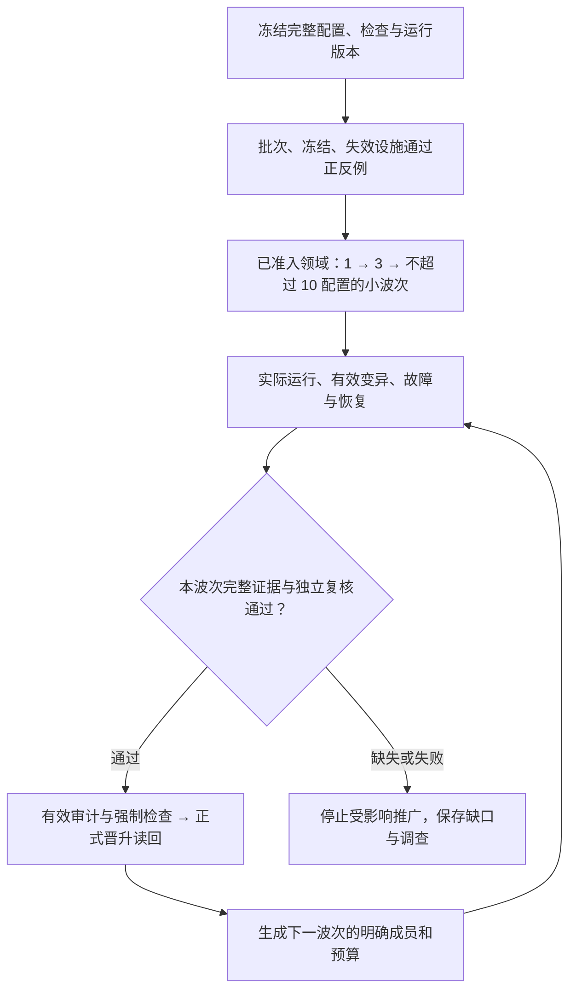

<!-- SPDX-License-Identifier: GPL-3.0-only -->
# 阶段四：精确批次、受控修复与可信晋升

| 项 | 内容 |
|---|---|
| 计划编号 | `PLAN-20261009-ESP-IDF-AFG-PHASE4-SCALE-OUT-ROLLOUT` |
| 日期 / 修订 | 2026-10-09，Asia/Shanghai；v1.1 Draft |
| 主计划 / 共同规则 | [总控计划](00-MASTER-OVERVIEW.md)、[执行质量规则](05-EXECUTION-QUALITY-GATES.md) |
| 技术依据 | [Loop 可靠性契约](../../../zh/tech-designs/esp32/esp-idf-loop-reliability-contract.md)、[AFG 契约](../../../zh/tech-designs/esp32/esp-idf-anti-false-green-verification-engine-contract.md)、[分类规范](../../../../wink-micro-app/vendor/esp_idfv61/.governance/specs/CLASSIFICATION-SPEC.md) |
| 治理依据 | [治理 SOP](../../../../.agents/skills/governance-sop-esp/SKILL.md)、[ADR-0091](../../../decisions/unisim/0091-esp-idf-multi-config-orthogonal-schema.md)、[ADR-0092](../../../decisions/unisim/0092-esp-idf-simulation-governance-and-capability-charter.md) |
| 责任 / 复核 | 调度与发布维护者 / 独立审计者；实际人员、配置覆盖和授权在任务卡填写 |
| 进入条件 | QG-1；拟推广领域的 QG-2/QG-3 有效出口；应用需求审计及配置覆盖满足现行规范 |
| 阶段出口 | QG-4：精确批次、冻结、失效与恢复通过验收；本轮配置和检查完整对账；有效候选获审计并晋升读回；未交付项明确呈现 |

## 1. 规模推广的边界

阶段四按 QG-0 冻结的本轮必需运行集合逐批执行，同时对治理全集逐项记录去向。当前快照是 312 应用 / 313 配置，其中 active 为 267 / 268、deferred 为 45 / 45；这些数字必须在执行前重算。待需求审计或能力缺口不能靠强制运行、缩小 Claim、改变范围或写入 audited 消除。

领域波次由实际清单、需求审计、契约族准入和依赖闭包生成，不沿用 v1.0 手工划分的 38/86/54 等数量。先证明调度与发布设施完整，再以小波次推广。纯构建、host_native、wasm_node 和 wasm_browser 配置使用各自合法 lane；不把全部配置强塞到同一浏览器后端或伪造 SoC 身份。

工程问题关闭、范围内配置完成裁决和运行交付完成分开报告。已明确暂缓或存在未完成项，可以形成完整进度报告；不能据此宣布所有配置已 verified 或工程必需缺口已解决。

## 2. 实施任务与可核验产物

工时在 QG-0 及首批真实运行后按实现、人工审计、机器执行、调查分别估算。所有任务依 [共同规则](05-EXECUTION-QUALITY-GATES.md) 填责任、范围、检查集合与原始回执；本表均为待执行任务。

| 任务 | 必需实现与验证 | 原始产物 / 问题归属 |
|---|---|---|
| T4.1 精确批次与续跑 | 共用配置 resolver；冻结完整成员及每配置 Claim/场景/检查；显式空选、limit、中断、失败、续跑和批次关闭语义；checkpoint 绑定版本与输入 | 成员清单及摘要、逐项调度/完成记录、缺失集合、恢复记录；I-11/I-18 |
| T4.2 注册表与领域冻结 | 损坏/截断注册表拒绝；保存冻结理由和版本；试点精确集合全通过且有有效领域授权才解冻；续跑不能重置冻结 | 正常/损坏读写、原子更新、试点部分通过与全通过对照；I-12/I-14 |
| T4.3 依赖失效传播 | 对源代码、配置、probe/ABI、SDK、runner、recipe、规则变化及新发现缺陷建立反向影响集合；所有接受入口阻断旧凭据 | 依赖指纹、影响集合、失效/重验回执；I-15/G-03 |
| T4.4 指标派生 | 从实际逐项 CheckResult 与适用性裁定计算结果；身份去重，保留缺失/无效/基础设施失败和分母；错误汇总不能反过来改变裁决 | 可重算统计与原始结果索引；I-16 |
| T4.5 版本隔离的调查修复 | 按 SOP 分类故障；受控工作区修复、独立复核、安全检查和受影响回归；合入后建立新运行版本并重验相关候选 | 调查包、补丁/提交、检查与复核、版本迁移和回归集合 |
| T4.6 领域波次实施 | 逐配置核对需求审计、能力和契约族前置；冻结波次成员；真实运行并收集完整检查；保存未启动与阻塞原因 | 各波次成员、配置级证据包、未交付工作队列；承接 T3.6 |
| T4.7 审计与正式晋升 | 本轮有效审计覆盖、完整强制检查、持锁 CAS 和只读回验；看板由事实来源派生 | 审计/引擎/事务回执、正式目录读回、清单与看板对账 |
| T4.8 项目关闭复核 | 重算完整问题、任务、配置、检查及规则集合；逐项核对真实证据和剩余范围；新增复验报告 | 最终差异报告、问题关闭证据、未交付清单与责任；I-19 |

## 3. 精确集合、冻结与批次关闭

批次身份至少绑定范围清单摘要、源码/运行时版本、配置集合、ProofPlan/recipe 和检查规则版本。实际运行记录包含 app/config/backend/SoC/profile、run_id/attempt、构建加载身份及各检查身份。checkpoint 不复用不兼容版本的完成记录。

下式针对冻结批次的必需运行成员。本轮 pending/阻塞仍属于未执行；暂缓只按冻结前的合法治理依据处理，在全集中保留，不计已交付。前置分析或完成裁决本身不能满足运行集合的检查义务。

批次必须能对账：

```text
expected_configs = completed_configs ∪ failed_configs ∪ unexecuted_configs
三者互斥，身份完整，无额外配置

batch_success =
  failed_configs 为空
  AND unexecuted_configs 为空
  AND 每配置 required_checks = 实际有效完成的检查集合
  AND 全部 mandatory 检查符合预定极性及适用恢复要求
```

`--limit` 若现有入口支持，仅能证明明示子批次；完整父批次仍保留未执行成员。中断、预算耗尽和零配置选择不能返回“全量验收成功”。不同 attempt 的完整结果可以保留，但不能从不同源码/配置/规则版本拼接一份合格凭据。重试按既有策略有界执行，保留全部失败，不无限重跑至绿。

领域冻结记录不可由“重新创建空注册表”丢弃。解冻同时要求当前基线的完整试点配置集合、全部必需检查、独立领域复核与有效授权；单个 Pilot 通过不代表领域准入。检查更新失败、JSON 损坏或锁占用须显式诊断，不能退化成空状态继续发布。

## 4. 失效管理与真实指标

| 变化 / 发现 | 必需动作 | 继续推广条件 |
|---|---|---|
| 公共驱动、PAL、运行时或共享配置变化 | 按真实依赖闭包找受影响配置，保留旧包并标明当前失效 | 新版本构建、所需 ABI/行为/变异与恢复回执齐备 |
| runner、规则、probe、场景或 recipe 变化 | 区分构建与验证影响；至少重做受影响验证，必要时重构建 | 新证据绑定变更后的身份和完整检查 |
| 新发现“接受错误证据”缺陷 | 冻结相应接受链/领域，识别曾依赖该防线的凭据 | 防线修复及正反例通过，受影响凭据复验 |
| 外部 SDK/工具不可用或能力未实现 | 保留诊断与未完成检查，不计业务失败击杀 | 依赖具备后新 attempt 验证 |

如果当前系统缺少可靠依赖索引，先采用保守的受影响全域复验，不能猜测“仅本应用受影响”。索引本身用共享依赖跨应用变更和无关变更对照核验。

看板至少区分：预期/实际配置与检查数量、合格/存活/无效变异、基础设施失败、未执行、故障激励生效与处理结果、恢复、审计待办、正式晋升及已失效凭据。变异击杀率的分母和被排除类别明确展示；无效注入、编译失败、matcher 自检不计有效击杀。指标必须能由原始记录重算，不能直接采纳 `scenario_ok=false` 或手填成功布尔值。

## 5. 调查、修复与版本切换

基线失败先定位到业务实现、模型/驱动、场景预期、配置、能力或基础设施。调查材料放在 SOP 规定的 `.governance/investigations/<entry_id>/` 下，按 config/run/attempt 建子目录或版本索引，避免并发覆盖同名报告。

自动修复仅在 SOP 的 pre-flight、保护名单与授权条件成立后进入；人工实现也须遵循相同架构边界。使用隔离工作区和版本，不能让一名修复执行者改共享运行时而其他 Runner 继续以原指纹出具凭据。

涉及 PAL 的变更保持旧接口兼容、公共头不引入平台私有类型、编译期静态分发和合法错误域；新增能力同时提供适用的 Wasm 与真实硬件实现及许可。重大接口/语义选择先按 QG-0 决策路径处理。

按 SOP 完成独立编写/裁决、H-1～H-8 检查、L1 领域回归和 L2 黄金用例；再按依赖闭包补齐本次改动影响的配置、边界和故障恢复。黄金用例不能替代这部分回归。公共 C 变更运行适用的双目标编译链接、分层/API 和许可门禁。

补丁合入后形成新的源码/运行时执行版本，重新计算指纹和失效集合。旧波次的证据保留，受影响配置在新版本重验；不得在同一冻结版本中悄悄替换产物。自愈成功不自动生成真实 auditor、改变 delivery_state 或获得正式发布资格。

## 6. 波次执行顺序与止损条件



1/3/10 是首批上限策略，不是完成数承诺。实际样本由风险和依赖选取，至少覆盖多配置、交互、生产/消费、存储恢复和目标 lane 等适用差异；若域内成员不足不凑数。每波次扩大前复核构建/执行 P50/P95、资源和清理、失败分布及剩余缺口，再冻结下一波次。并发度从测量确定，先以 1 个 Runner 验证隔离，再扩大到实测安全并发；固定 2～4 不能替代资源证据。

出现错误身份被接受、无效变异计击杀、共用路径被改、冻结丢失、档案篡改、进程泄漏、事务不一致或必需检查遗漏时，停止受影响 attempt/领域的运行或发布。明确独立领域可继续准备；共享底座影响无法划清时扩大冻结。按共同规则修复、复核、重验后恢复，不以删掉失败成员继续计全量成功。

## 7. 正式发布与实际命令边界

当前发布入口按配置使用下列参数；路径变量在执行卡中绑定本轮有效密封候选。不得把尚不存在的 `--batch-seal` 当作可执行任务：

```powershell
python -X utf8 -B wink-micro-app/vendor/esp_idfv61/.governance/loop/services/promotion_service.py --candidate $CandidatePath --expected-manifest-sha $ExpectedManifestSha --workspace-root .
```

上例只是现有 CLI 能力说明。**T1.4/T1.6/T1.7 与 T4.1～T4.4 的必需强制设施通过前，不执行正式晋升。** 拟新增批量发布入口须另行实现其事务/部分失败语义和验证，不能用总体退出 0 掩盖部分配置未晋升。

发布前按实际变更输入执行全部适用门禁，并逐 rule ID 对账：

```powershell
python -X utf8 -B wink-micro-app/vendor/esp_idfv61/.governance/gates/run_gates.py --mode pr --changed-files $ChangedFilesPath --output-json $GateReportPath
python -X utf8 -B wink-micro-app/vendor/esp_idfv61/.governance/gates/evidence_verifier.py --verify-all
```

`$ChangedFilesPath` 与 `$GateReportPath` 是任务卡的实际路径；省略 `--gate` 使用现有入口的全部适用 Gate。还须确认必需 rule 真正执行，不能把 diff 未触达、SKIP、debug `--no-fail` 或仅 `--gate 1` 的退出 0 当作 Gate 1～5 完整验收。C/公共 API 变更另执行共同规则中的 lint 与许可门禁。

正式晋升使用现行合法 `verified` 状态；资格和证据版本按冻结契约记录。审计决定须真实、有效并覆盖相应配置、产物/报告和检查集合；单有 verdict 字符串或摘要不能证明签署权威。晋升后从正式目录重读全部必需摘要与字段，重新核验权威清单，派生 CHECKLIST 并对账。历史只读，不把候选的旧成功记录当作正式目录的读回验证。

## 8. 验收标准与阶段关闭

每项验收保留正确对照和目标缺陷的实际回执，配置/检查完整性按共同规则执行。

- [ ] **AC-4.1 批次完整性**：正常完整批次通过；空选、limit、中途退出、漏场景、漏检查、重复/额外配置及跨版本 checkpoint 均被明确识别，不能关闭父批次。
- [ ] **AC-4.2 领域冻结**：损坏注册表、部分试点成功或无授权解冻失败；完整试点与有效授权对照成功；恢复后冻结历史不丢失。
- [ ] **AC-4.3 失效传播**：改共享驱动/规则可使受影响旧候选在所有接受入口被拒；无关变更对照不扩大无依据声明；重验新证据后恢复资格。
- [ ] **AC-4.4 指标准确**：从保存的 CheckResult 重算与看板一致；无效补丁、编译失败、自检、未跑和基础设施失败不会增大有效击杀/完成数。
- [ ] **AC-4.5 修复隔离**：隔离补丁完成复核和适用回归；并发 Runner 不接受变更后的旧指纹；合入后建立新版本并重验依赖闭包。
- [ ] **AC-4.6 范围与波次**：冻结成员覆盖本轮完整配置集合；所有已执行配置有完整检查，未启动/阻塞/deferred 有明确原因和责任，不计已运行交付。
- [ ] **AC-4.7 晋升前置**：无审计覆盖、漏强制检查、过期/错身份/篡改/借用报告均拒绝；具备前置的正确候选成功并正式读回一致。
- [ ] **AC-4.8 门禁与看板**：必需 rule ID 与实际有效结果集合完整；看板从权威清单和原始结果派生，不能通过局部门禁或手填指标宣称全绿。
- [ ] **AC-4.9 最终关闭**：任务与 I/S/Q/G/新增问题全部有可复核关闭证据，本轮配置完整对账；必需实现或验收缺口未解决时仍为未完成。

QG-4 复核包新增归档，不改写历史评审。明确区分“工程整改完成”“范围已完整裁决”“实际 verified 配置数”和“未交付工作”；只有相应条件真实满足才作对应声明。所有阶段实现任务当前仍待执行。
