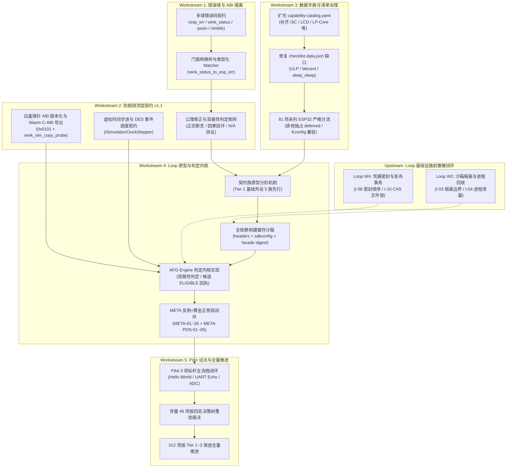

<!-- SPDX-License-Identifier: GPL-3.0-only -->
# ESP-IDF 防假绿验证引擎契约与治理闭环全量整改实施计划

| 项 | 内容 |
|---|---|
| 计划编号 | `PLAN-20261009-ESP-IDF-AFG-ENGINE-REMEDIATION` |
| 日期 / 修订 | 2026-10-09，Asia/Shanghai；`v1.1` 架构深度加固与协同落地版 |
| 状态 | **Completed / 已完成执行与验收**（核心整改 M1~M5a 全部闭环落地，门禁全量绿灯；后续 312 项按 M5b 路线推进） |
| 关联技术设计 | [AFG-Engine 契约 v1.1](../../zh/tech-designs/esp32/esp-idf-anti-false-green-verification-engine-contract.md)、[Loop 可靠性契约](../../zh/tech-designs/esp32/esp-idf-loop-reliability-contract.md)、[Batch 0 证据契约](../../zh/tech-designs/esp32/esp-idf-batch0-evidence-contract.md) |
| 关联评审文档 | [AFG 契约完整性与迁移覆盖评审](../../reviews/esp32/2026-10-09-esp-idf-afg-engine-contract-completeness-review.md)、[Checklist 深度评审](../../reviews/esp32/2026-10-08-esp-idf-verified-checklist-deep-review.md) |
| 关联整改计划 | [Loop 问题账本与整改计划](2026-10-09-esp-idf-loop-issues-and-remediation-plan.md) |
| 治理依据 | [能力字典](../../../wink-micro-app/vendor/esp_idfv61/.governance/catalog/capability-catalog.yaml)、[清单数据 SSOT](../../../wink-micro-app/vendor/esp_idfv61/.governance/data/checklist.data.json)、[ADR-0001](../../decisions/core/0001-error-code-sign-convention.md)、[ADR-0004](../../decisions/core/0004-static-dispatch-vs-runtime-ops.md)、[ADR-0012](../../decisions/core/0012-contract-honesty-over-silent-degradation.md)、[ADR-0091](../../decisions/unisim/0091-esp-idf-multi-config-orthogonal-schema.md)、[ADR-0092](../../decisions/unisim/0092-esp-idf-simulation-governance-and-capability-charter.md) |

---

## 1. 计划目标与背景

根据 [AFG 契约完整性评审](../../reviews/esp32/2026-10-09-esp-idf-afg-engine-contract-completeness-review.md) 的结论，现有 [AFG-Engine v1.0 契约](../../zh/tech-designs/esp32/esp-idf-anti-false-green-verification-engine-contract.md) 虽然确立了反向证伪与物理因果互锁的正确方向，但在工程定义上存在严重缺陷：
1. **检查极性混淆**：把故障处理成功错误判定为变异存活（`MUTANT_SURVIVED`）；
2. **错误码与 ABI 约定混乱**：混淆了 ESP-IDF 正错误码（如 `ESP_ERR_TIMEOUT = 0x107`）与 Wink PAL 负数错误码约定；
3. **公理过度教条化**：“零回环”扼杀了 Echo 合法业务，“固定物理时延”破坏了虚拟时间调度；
4. **能力与上游业务脱钩**：清单元数据存在关键能力遗漏（如 ULP 未标协处理器、BLE Central 未标 Client），且 81 个非 ESP32 芯片支持冲突被统一掩盖；
5. **缺乏机器可复算的证据契约与沙箱依赖闭包**：构建缓存未绑定完整头文件/配置，引擎与 SSOT CAS 发布权限职责混淆。

本计划将上述问题拆解为 **5 大核心工作流（Workstreams，WS-1 ~ WS-5）**，确立端到端的整改内容、代码变更、交付物与验收标准，分阶段实现防假绿体系的工程化闭环。

**工程路径基准规范**：本文提及的所有治理脚本与模板，均以统一根路径 `G = wink-micro-app/vendor/esp_idfv61/.governance/` 为基准锚定（例如 `G/tools/loop/` 与 `G/archetypes/`），杜绝因相对路径歧义导致重复目录与所有权漂移。

---

## 2. 总体整改架构与设计原则



### 核心设计原则
1. **契约诚实与降级显式化（ADR-0012）**：不因追求“全绿”而虚标通过，能力不支持或芯片不匹配必须 Fail-Loud 输出 `UNSUPPORTED` 或 `CLAIM_GAP`；禁止在 `target_soc: esp32` 下以“通用行为模拟”掩盖芯片独占外设缺失。
2. **静态分发与 POD 结构（ADR-0004）**：探针与门面实现保持 POD 结构，不使用虚函数或运行时动态分发。
3. **极性正交与断言归因（AFG-R04）**：变异击杀以原业务断言 FAIL 为目标；故障处理以系统符合降级/自愈规范为目标（预期断言 PASS）。
4. **契约族原型三阶渐进（Tiered Contract Archetypes）**：明确统一术语定义：每个领域的标准断言与故障注入规范模板统称为“契约族原型（Contract Archetype）”。312 个示例分三阶继承原型通用定义（Tier 1 核心外设先行，Tier 2/3 分批铺开），具体示例只维护 Diff-only Claims。
5. **两计划互锁协同保证**：底层沙箱隔离与 CAS 提交锁完全委托给已审定的 Loop 计划（I-01~I-19），本计划专注于验证引擎判决与契约证据体系。

### Workstream 前置 Gate（依赖封锁）

Workstream 间存在严格的技术前置依赖，必须按如下 Gate 顺序解锁，**禁止跨 Gate 并行启动下游 Workstream**：

| 下游 Workstream | 前置 Gate 条件 | 验证方式 |
|---|---|---|
| **Gate 0: Loop 基础设施前置** | [Loop 整改计划](2026-10-09-esp-idf-loop-issues-and-remediation-plan.md) 的 I-03（写边界隔离）、I-04（子进程回收）与 I-10（CAS 提交锁）就绪 | 对应 Loop 验收用例 RT-03, RT-04, RT-10 通过 |
| **WS-2 / WS-3 启动** | WS-1.1（错误域规范文档）已评审通过；WS-1.2（`wink_status_to_esp_err()` 转换桥接）已通过 `winkcli lint --pack api` 门禁 | 评审记录 + lint 零错误退出 |
| **WS-4 判定内核启动** | WS-2（AFG v1.1 契约 + 探针 ABI + 虚拟时钟协议）与 WS-3（字典扩充 + 81项严格分流）已完成，且 Gate 0 解锁 | 规范冻结评审 + Schema 校验通过 |
| **WS-5 Pilot 启动** | WS-4.1（Tier 1 基础 Archetype 模板）与 WS-4.3（构建沙箱与判定内核）已通过 META-01~26 反例与 META-POS-01~05 黄金正例套件 | META 套件 100% 通过（反例全部拦截，正例全部签发 ELIGIBLE） |
| **全量推进启动** | WS-5 三项 Pilot 全部取得 `ELIGIBLE` 回执；存量 46 项凭据按任务 5.2 决策树全部裁决并登记 | Pilot 回执 + 存量裁决清单 |

---

## 3. 详细任务拆分与工作流（WBS）

### 工作流 1：错误码与 ABI 领域隔离重构（WS-1）

#### 任务 1.1：定义多域错误码契约规范（`Error Domain Taxonomy`）
- **修改文件**：
  - 新增规范定义文件：`wink-micro-os/frameworks/esp_idf/docs/03-error-domain-contract.md`
- **核心内容**：
  - 定义 4 类互不混淆的错误域：
    1. `domain: esp_err`：无符号 32 位整型，`0` 表示 `ESP_OK`，正数表示错误（如 `ESP_ERR_TIMEOUT = 0x107 (263)`，`ESP_ERR_INVALID_STATE = 0x103 (259)`）；
    2. `domain: wink_status`：有符号 32 位整型，遵循 ADR-0001，`0` 表示成功，负数表示错误（如 `WINK_ERR_TIMEOUT = -110`）；
    3. `domain: posix_errno`：API 返回 `-1`，通过 `errno` 暴露符号（如 `ETIMEDOUT`、`ECONNREFUSED`）；
    4. `domain: nimble_hs`：NimBLE 协议栈专有状态码（如 `BLE_HS_EDONE`、`BLE_HS_ENOTCONN`）。
  - 严禁在契约中出现“负错误码如 `ESP_ERR_TIMEOUT`”等表述。

#### 任务 1.2：规范 C 门面层错误转换边界
- **修改文件**：
  - [esp_err.h](file:///d:/workspaces/ai-coding/wink-ai/wink-ai-embedded/wink-micro-os/frameworks/esp_idf/include/esp_err.h)
  - `wink-micro-os/frameworks/esp_idf/src/core/esp_err_mapping.c` (新增转换桥接)
- **核心内容**：
  - 明确门面实现返回纯正 `esp_err_t`，调用底层 PAL 时使用严格转换函数：
    ```c
    esp_err_t wink_status_to_esp_err(wink_status_t status);
    wink_status_t esp_err_to_wink_status(esp_err_t err);
    ```
  - 确保断言器在读取 ESP-IDF 函数返回值时按 `esp_err` 正数匹配。

#### 任务 1.3：测试匹配器（Matcher）支持多域类型化匹配
- **修改文件**：
  - `G/tools/loop/error_matcher.py`（新增多域断言匹配器）
  - `G/gates/report_contract.py`（集成多域错误检验）
- **核心内容**：
  - 在断言语法中引入类型化校验：
    ```yaml
    assert_error:
      domain: esp_err
      symbol: ESP_ERR_TIMEOUT
      raw_value: 0x107
    ```
  - 杜绝仅靠数值 `< 0` 或 `!= 0` 的模糊匹配。

---

### 工作流 2：防假绿顶层技术契约重构（WS-2）

#### 任务 2.1：重写 [AFG-Engine 契约文档](../../zh/tech-designs/esp32/esp-idf-anti-false-green-verification-engine-contract.md) 至 v1.1
- **修改范围**：
  - **修订第 1 节六大公理**：
    - 公理 1（变异击杀）：拆分“实现变异”与“故障注入”；
    - 公理 2（零回环）：由“物理衰减”改为“禁止绕过固件业务的自证旁路”（放行合法 Echo 业务，严禁 Fixture 内旁路）；
    - 公理 3（自发时钟）：废除 10ms/500ms 固定魔数，由声明的保真度时基与参数化容差驱动；
    - 公理 4（白盒探针）：定义为按外设域声明的纯只读快照，严禁读取操作推进虚拟时间；
    - 公理 5（物理扰动）：引入 N/A 豁免机制（纯计算/构建示例无需物理断线）；
    - 公理 6（符号闭环）：允许规范化的链接见证（Link Witness），兼容内联函数与 LTO。
  - **重构第 2.1 节流水线与判定极性（解决 AFG-R04）**：
    - 更新 Mermaid 时序图，明确阶段 2 故障处理的预期为 `PASS`；
    - 建立四态预期断言矩阵（Baseline PASS, Matcher Error PASS, Mutant FAIL, Fault PASS）。
  - **修订第 2.4 节白盒探针协议（解决 AFG-R11）**：
    - 废除侵入 PAL 的巨型结构体，将其定义在 `frameworks/esp_idf/include/sim_probe/esp_sim_probe.h`；
    - 增加结构体版本、代际 Token、虚拟时间戳及 `validity_mask`；
    - **强制 ABI 版本化**：`pal_sim_hardware_probe_t` 首两个字段必须固定为 `probe_abi_version`（格式 `0xMAJOR_MINOR`，初版为 `0x0101`）与 `probe_size_bytes`（等于 `sizeof(pal_sim_hardware_probe_t)`），后续字段只允许在末尾追加；引擎读取探针前必须校验这两个字段，不匹配时拒绝继续判定并返回 `ERR_PROBE_ABI_MISMATCH`，防止跨版本字节偏移引发假绿或崩溃：
      ```c
      typedef struct {
          uint32_t probe_abi_version;    /* 首字段，固定偏移 0；格式 0xMAJOR_MINOR，初版 0x0101 */
          uint32_t probe_size_bytes;     /* sizeof(pal_sim_hardware_probe_t)，前向兼容校验 */
          uint32_t generation_token;     /* 代际 Token，句柄失效后变为 0 */
          uint32_t allocated_bytes;      /* Heap Caps 追踪字节数 */
          uint16_t fifo_watermark;       /* 硬件 FIFO 水位线 */
          uint8_t  state_machine_stage;  /* 状态机内部阶段枚举 */
          bool     is_hardware_busy;     /* 硬件总线忙标志 */
          bool     in_isr_context;       /* 模拟 ISR 上下文标志 */
          uint8_t  power_domain_state;   /* 电源域状态 */
          uint32_t pending_irq_mask;     /* 挂起中断掩码 */
          uint64_t virtual_timestamp_us; /* 当前虚拟时间戳（微秒） */
          uint32_t validity_mask;        /* 字段有效性位图 */
      } pal_sim_hardware_probe_t;
      ```
    - **Wasm 线性内存穿越导出函数（C-ABI）**：在 Wasm 编译下通过 Emscripten 导出，确保宿主 JS/Python 安全复制探针快照，无需硬编码内部对齐偏移行走：
      ```c
      #if defined(WINK_TARGET_SIMULATION)
      WINK_EXPORT uint32_t wink_sim_copy_probe(
          uint32_t domain_id,
          uint32_t instance_id,
          uint8_t *out_buffer,
          uint32_t max_len
      );
      #endif
      ```
    - **物理真机硬隔离零开销**：在 ESP32 物理硬件编译（`xtensa-esp32-elf`）下，探针结构体与 API 退化为空宏，确保真实固件零 Flash、零 RAM 开销，由 `winkcli lint --pack layering` 持续监控。
  - **修订第 4 节交付与回执规格（解决 AFG-R19, AFG-R20）**：
    - 将回执升级为 `afg_evidence_receipt_v1_1.json`；
    - 增加 `ExecutionIdentity`（绑定 `target_soc`、`backend`、`profile`、`sdkconfig_digest`、`toolchain`）；
    - 引擎输出定性为 `AFGResult(ELIGIBLE | REJECTED | INCOMPLETE)`，剥离 CAS 晋升特权。

#### 任务 2.2：定义虚拟时间步进协议与 DES 调度契约（解决 AFG-R08 / AFG-R09）
- **核心契约**：
  - 明确虚拟时钟只允许由 Harness/Runner 显式调用 `pal_sim_step_us(delta_us)` 或由离散事件调度器（DES）事件驱动推进；
  - 严禁任何白盒探针读取、Getter 调用或空断言副作用偷推时间；
  - **同 Tick 因果偏序**：同一次时钟步进内，配置变更与事件交付严格遵循 Happens-Before 原序；异步生产者（如 ADC 连续采样、UART RX）的产生速率由声明的采样率参数模型驱动，背压容差按缓冲区深度动态计算，杜绝全局固定 100ms 溢出假设。

---

### 工作流 3：能力字典与清单数据 SSOT 治理（WS-3）

#### 任务 3.1：扩充 [capability-catalog.yaml](file:///d:/workspaces/ai-coding/wink-ai/wink-ai-embedded/wink-micro-app/vendor/esp_idfv61/.governance/catalog/capability-catalog.yaml)
- **新增原子能力**：
  1. `cap.bus.i3c_master`（I3C 总线协议）
  2. `cap.analog.comparator_etm`（模拟比较器与事件任务矩阵）
  3. `cap.media.lcd_panel`（LCD 屏幕驱动与刷屏）
  4. `cap.dma.async_crc`（硬件异步 CRC）
  5. `cap.dma.async_color_convert`（硬件异步色彩转换）
  6. `cap.coproc.lp_core`（LP-Core 协处理器）
  7. `cap.net.bridge_vlan`（二层以太网桥接与 VLAN）
  8. `cap.ble.gatt_client`（BLE GATT 客户端，从 planned 细化）
  9. `cap.ble.smp_security`（BLE 配对与加密安全）

#### 任务 3.2：修复 [checklist.data.json](file:///d:/workspaces/ai-coding/wink-ai/wink-ai-embedded/wink-micro-app/vendor/esp_idfv61/.governance/data/checklist.data.json) 映射缺口
- **针对性修补条目**：
  - `bluetooth/nimble/blecent`：补充 `cap.ble.gatt_client`；
  - `bluetooth/ble_get_started/nimble/NimBLE_Security`：补充 `cap.ble.smp_security`；
  - 27 个 `system/ulp/*`：补充关联的 `cap.coproc.*`；
  - `system/deep_sleep`：将 `cap.pm.light_sleep` 修正为 `cap.pm.deep_sleep`；
  - 19 个 `build_system/*`：补充 `cap.build.*`；
  - 补全所有落地示例中为空的 `header_closure` 与 `sdkconfig_overrides`。

#### 任务 3.3：处置 81 个“未列 ESP32”支持表冲突（防止芯片身份伪造）
- **建立自动化判定与分流脚本**：`G/tools/triage_soc_support.py`
- **严格三态分流执行准则（捍卫 ADR-0091 正交身份）**：
  1. **物理硬件独占（如 I3C、LP-Core RISC-V、P4 专属异步 CRC）**：必须将 `schedule` 明确置为 `deferred`（或新建独立的 `target_soc: esp32p4` 配置项），**严禁挂在 `target_soc: esp32` 下伪造通过**；
  2. **README 遗漏但 Kconfig 支持**：通过静态解析官方 `Kconfig`，确认宏条件包含 `IDF_TARGET_ESP32`，标注 `soc_support_verified_by_kconfig: true` 并保留；
  3. **跨芯片通用行为模拟（仅限通用外设的纯软件/协议栈级场景）**：若上游示例为跨芯片通用代码但示例作者在 README 中漏写，在 `fidelity_contract` 登记 `simulated_soc_or_model: generic_behavioral`，并签署降级声明。此分支严禁用于缺少底层物理硅片支持的硬件独占外设。

---

### 工作流 4：Loop 工程、原型模板与构建沙箱（WS-4）

#### 任务 4.1：建立契约族原型三阶递进交付机制（`Contract Archetype`）
- **新建目录**：`G/archetypes/`
- **分阶交付策略（拒绝一蹴而就，按风险递进）**：
  - **Tier 1（核心外设 5 族，WS-4 首期交付，直接解锁 Pilot 3 项）**：
    1. `archetype_start.yaml`（系统启动、倒计时、热重启）
    2. `archetype_uart_stream.yaml`（双向流、波特率、回显因果图）
    3. `archetype_adc_sampling.yaml`（连续采集、背压与溢出模型）
    4. `archetype_gpio_matrix.yaml`（引脚方向、电平脉冲与去抖）
    5. `archetype_ledc_pwm.yaml`（PWM 占空比定点、稳态与平滑渐变）
  - **Tier 2（常用总线与存储 14 族，WS-5 存量重验期交付）**：
    - `I2C-I3C`、`SPI`、`TIMER`、`DAC-SDM`、`NVS`、`FS`、`MEDIA-STORAGE`、`HTTP-CLIENT`、`HTTP-SERVER`、`SOCKET-ICMP` 等。
  - **Tier 3（复杂无线通信与协处理器 20 族，全量推广期交付）**：
    - `BLE`、`WIFI`、`ULP-LP`、`MCPWM`、`PARLIO`、`BUILD` 等。
- **继承逻辑**：
  - 原型定义该领域标准 Claims 与通用 L1 故障注入器；
  - 示例 `proofplan.json` 采用 `inherits: archetype_uart_stream`，仅声明特异性引脚与 Diff-only Claims，减少 80% 重复配置。

#### 任务 4.2：重构构建沙箱依赖闭包哈希缓存（解决 AFG-R15 / I-07）
- **修改文件**：
  - `G/tools/loop/build_sandbox.py`（沙箱构建环境）
  - `G/tools/loop/mutation_runner.py`（变异执行器）
- **缓存 Key 算法升级**：
  ```python
  build_cache_key = hashlib.sha256(
      app_source_digest.encode()
      + header_closure_digest.encode()
      + effective_sdkconfig_digest.encode()
      + toolchain_version.encode()
      + facade_git_sha.encode()
      + patch_content_digest.encode()
      + config_profile_id.encode()
  ).hexdigest()
  ```
  彻底杜绝修改门面或头文件后命中陈旧 Wasm 产物的假绿风险。

#### 任务 4.3：变异执行动静分层（L1 优先，L2 控预算）
- **规则**：
  - **L1 仿真注入**：总线拉高、丢包、NACK、电平抖动，毫秒级执行，覆盖 80% 业务负向测试；
  - **L2 源码变异**：每个 Claim 最多执行 1 个编译变异，优先复用构建缓存；
  - **等价变异裁定**：严禁自动放行，存活变异必须输出 `MUTANT_SURVIVED` 熔断，或由独立审计签署 `equivalent_mutant_witness.json`。

#### 任务 4.4：实现 AFG 引擎自身反例+黄金正例双闭环验收套件
- **新建测试套件**：`tests/governance/test_afg_engine_meta_invariants.py`
- **负向反例套件（META-01 ~ META-26，必须 100% 拒收）**：
  - 注入空断言报告 -> 必须输出 `INCOMPLETE`；
  - 注入仅日志断言 -> 必须输出 `REJECTED`；
  - 注入变异但未命中代码分支 -> 必须输出 `NOT_ACTIVATED`；
  - 注入断网场景但应用正常降级 -> 必须正确输出 `FAULT_HANDLED_PASS`，不能误判为击杀失败；
  - 篡改被测产物哈希 -> 必须被独立 Inspector 拦截；
  - **META-25（SoC 身份欺骗）**：伪造 `ExecutionIdentity`，将 ESP32-P4 独占外设产物打上 `esp32` SoC 标签后提交，引擎必须在判定入口通过 `sdkconfig_digest + toolchain_version` 联合摘要校验拦截身份矛盾，输出 `IDENTITY_MISMATCH` 拒收（兑现 AFG-R02 核心测试向量）；
  - **META-26（工具链哈希欺骗）**：在缓存命中路径下修改 `toolchain_version` 字段同时保持其余 Key 不变，构建缓存 Key 必须失效，触发强制重建而非命中旧产物（验证任务 4.2 缓存 Key 算法升级有效性）。
- **黄金正向套件（META-POS-01 ~ META-POS-05，防止判定引擎产生无条件拒绝死锁）**：
  - **META-POS-01（基线与变异正例）**：标准 Hello World 控制台输出基线 PASS + 变异成功击杀 -> 必须稳定输出 `ELIGIBLE`；
  - **META-POS-02（双向因果流正例）**：合规 UART Echo 双向回显 + 禁中断后原断言 FAIL -> 必须稳定输出 `ELIGIBLE`；
  - **META-POS-03（故障自愈正例）**：注入断网但应用依规完成超时退避与重连断言 PASS -> 必须稳定判定 `FAULT_HANDLED_PASS` 并输出 `ELIGIBLE`；
  - **META-POS-04（生命周期复位正例）**：NVS 写入提交后冷启动读回正确 + SRAM 清零 -> 必须输出 `ELIGIBLE`；
  - **META-POS-05（合法签名正例）**：多配置正交合法签名回执 -> `PromotionService` 原子写入 CAS 成功，顺利晋升 `verified_v1_1`。

#### 任务 4.5：剥离引擎与 SSOT CAS 晋升职责（解决 AFG-R20）
- **架构重组**：
  - `AFG-Engine` 仅输出 `afg_evidence_receipt_v1_1.json`，判定结论为 `ELIGIBLE`；
  - `PromotionService`（或 `Inspector`）校验签名摘要、多配置正交性、回归门禁和架构审计后，在临界区文件锁保护下原子化更新 `checklist.data.json` 中的 `executions[].delivery_state`（严格复用 Loop 计划 I-10 修复成果）。
  - **异常中断与数据回滚（Crash Recovery & Rollback）**：发布事务强制遵循 `Write-Temp-Then-Atomic-Replace` 机制（写入临时文件 `checklist.data.json.tmp.<pid>` 后执行原子重命名 `os.replace`）与 CAS 版本校验；若批量执行或发布中途意外崩溃/中断，未完成的临时文件自动丢弃，主清单 SSOT 绝不残留半写入脏数据，天然支持零污染故障回退与幂等重跑。
  - > 💡 **实操环境约束（Windows 跨进程文件锁与依赖前置）**：由于当前开发宿主机为 Windows（PowerShell），CAS 临界区文件锁必须优先采用跨平台库（如 `fasteners`）或系统级 `msvcrt.locking` 并配合指数退避重试，杜绝 Windows 独占锁句柄占用引发 `PermissionError`；相关环境依赖应提前在 `G/toolchain.lock.yaml` 显式固化。

---

### 工作流 5：Pilot 试点闭环与全量推进路线（WS-5）

#### 任务 5.1：Pilot 3 项标杆全流程端到端打通
- **统一 CLI 入口（Developer Ergonomics）**：提供一键执行入口脚本 `G/tools/verify_afg_engine.py --pilot`（或接入 `wink.py` 驱动），统一调度沙箱构建、变异击杀、离散时钟步进与回执判定。
- **3 项典型场景端到端验证**：
1. **Pilot A（简单控制台与自律业务）**：`get-started/hello_world`
   - 验证 N/A 适用性协议（免除无意义物理断线）、非零时钟推进、输出捕获与热重启恢复。
2. **Pilot B（双向流式与合法回显业务）**：`peripherals/uart/uart_echo`
   - 验证零回环新判定（输入输出相等合法，但排除了 Fixture 内部直连）、固件依赖证伪（关闭 UART 中断后回显失败）。
3. **Pilot C（连续异步生产与背压）**：`peripherals/adc/continuous_read`
   - 验证虚拟时钟自发生产、挂起消费 100ms 触发 Overrun、L1 校准清除故障注入。
   - > ⚠️ **关键实操因果预期（防止误诊引擎判定）**：在既有评审中，ADC 驱动存在已知缺陷 **S-03**（连续采样由读取驱动偷推时钟、输入失败转为假有效数据）。当新版 AFG 引擎（任务 2.2 离散时钟步进）首次接入 Pilot C 时，**极大概率会被新引擎当场证伪并输出 `REJECTED`**。**此现象证明防假绿引擎防御生效，切勿误判为引擎判定内核 Bug**；应直接按任务 5.2 决策树标注 `needs_driver_fix`，联动修复底层驱动 `pal_wasm_ch3_adc.c` / `esp_adc.c`。

#### 任务 5.2：存量 46 项已验证条目凭据升级与重新核验
- 对既有 46 项 `verified` 条目，执行新版 AFG-Engine 协议；
- 生成符合 `v1.1` Schema 的完整证据包与机器回执，不保留未经反向击杀的历史空头信用。

**凭据降级路径决策树（防止静默跳过失败项）**：

存量条目在新引擎下的验证结论，必须按如下决策树执行明确裁决，**严禁静默忽略失败项直接维持 `verified` 状态**：

```
存量条目新引擎验证结论
  |
  +- ELIGIBLE（全部 7 类闭包通过）
  |    -> 直接签发 v1.1 凭据，更新 delivery_state = verified_v1_1
  |
  +- REJECTED（驱动缺陷导致基线或变异失败）
  |    -> 归入 Loop 整改计划跟踪（关联 I-01~I-19）
  |       标注 delivery_state = needs_driver_fix
  |       禁止晋升，等待驱动修复后重验
  |
  +- INCOMPLETE（场景不完整，7 类闭包未齐全）
  |    -> 发起补场景工单，暂停晋升
  |       标注 delivery_state = needs_proofplan_update
  |
  +- UNSUPPORTED（芯片不匹配或能力未列 ESP32）
       -> 执行三态分流裁决（同 WS-2 任务 3.3）
          硬件独占  -> deferred
          Kconfig 支持 -> soc_support_verified_by_kconfig
          通用行为模拟 -> simulated_soc_or_model: generic_behavioral
```

> **重要**：裁决结果须在 `checklist.data.json` 的对应条目中记录 `remediation_decision` 字段，由独立评审员签署，不得由引擎或脚本自动推断填入。

#### 任务 5.3：全量 312 项按 39 契约族分批推进
- 依托 39 契约族 Archetype 模板，按领域成熟度分批接入（Peripherals -> Protocols -> Storage -> System -> WiFi/BLE）。

---

## 4. 实施阶段与时间线（Milestones）

| 阶段 | 周期 | 核心交付物 | 门禁验收条件 | 关键路径说明 |
|---|---|---|---|---|
| **M1: 契约与规范收敛** | Day 1~2 | ① 错误域规范文档<br/>② AFG-Engine 契约 v1.1<br/>③ 探针结构体 ABI 版本化规格与 Wasm 导出 C-ABI<br/>④ 虚拟时间步进与 DES 调度契约 | 契约中极性矛盾完全消除；错误码域与符号名定义明确；N/A 协议闭环；`probe_abi_version` 字段与 `wink_sim_copy_probe` C-ABI 已纳入规格 | **WS-2/WS-3 前置 Gate**：M1 全部交付物通过评审后，WS-2/WS-3 方可启动 |
| **M2: 数据字典与清单治理** | Day 3~4 | ① capability-catalog.yaml 扩充<br/>② checklist.data.json 缺口修复<br/>③ 81 项未列 ESP32 严格分流清单 | 63+ 项能力字典对账无误；ULP/blecent 等缺口修复；81 项硬件独占严格分流至 deferred，无身份伪造 | 可与 M1 并行执行；结果作为 WS-4 Archetype 模板依据 |
| **M3a: Tier 1 原型系统与构建沙箱** | Day 5~6 | ① Tier 1 核心外设模板库（5 个）<br/>② 全依赖构建缓存沙箱（含 Key 算法升级） | Tier 1 原型模板解析器测试通过；子示例 Diff-only Claims 继承可成功加载；缓存 Key 修改头文件/sdkconfig 后强制失效测试通过 | ⚠️ **关键路径节点**：依赖 Gate 0（Loop 沙箱隔离）就绪；完成后 M3b 方可启动 |
| **M3b: AFG 判定内核集成** | Day 7 | ① AFG-Engine 判定内核实现<br/>② 引擎与 SSOT CAS 发布事务解耦 | 判定内核正确调用 Archetype 解析结果；三态输出（`ELIGIBLE/REJECTED/INCOMPLETE`）正确；`ERR_PROBE_ABI_MISMATCH` 拦截生效 | 依赖 M3a 完成，接入 Loop I-10 文件锁事务 |
| **M4: Pilot 试点与元测试双闭环** | Day 8~9 | ① META-01~**26** 反例套件 + META-POS-01~**05** 黄金正例套件 100% 通过<br/>② 3 项 Pilot 试点端到端绿灯 | 反例 100% 拦截假绿（含 META-25 SoC 身份欺骗、META-26 工具链哈希欺骗）；黄金正例 100% 签发 ELIGIBLE；Hello World、UART Echo、ADC 顺利取得 ELIGIBLE 回执 | **全量推进前置 Gate**：3 项 Pilot 全部 ELIGIBLE 后方可启动存量与全量推广 |
| **M5a: 存量 46 项降级重验** | Day 10~11 | ① 46 项存量凭据按四态决策树重验裁决完毕<br/>② Tier 2 常用总线/存储模板库（14 个） | 存量 46 项全部完成降级裁决（`ELIGIBLE/needs_driver_fix/needs_proofplan_update/deferred` 四态均已登记，无静默忽略项）；Tier 2 模板测试通过 | 存量 ELIGIBLE 项直接重签；其余项归入对应整改计划跟踪 |
| **M5b: 全量推广与 Tier 3 推进** | Day 12~14 | ① Tier 3 复杂无线/协处理器模板库（20 个）<br/>② 全量 312 项分批推进路线 | 发布事务与 SSOT CAS 稳定运行；全量示例按契约族分批有序接入 | 整体工期由 9 天平滑校准至 12~14 天，确保工程交付质量 |

---

## 5. 风险评估与应急预案

| 风险项 | 严重度 | 触发条件 | 缓解与应急对策 |
|---|---|---|---|
| **两份整改计划并行导致代码/清单合并冲突** | 高 | AFG 引擎整改与 Loop 计划（I-01~I-19）并发修改 runner/mutator/promotion | 严格执行 Gate 0 互锁：Loop 基础设施修改（I-03/I-04/I-10）先期合入主线，AFG 计划在其基础上实施；统一路径别名 `G = wink-micro-app/vendor/esp_idfv61/.governance/`。 |
| **L2 源码变异导致 CI 编译风暴** | 高 | 多个示例并发触发 Wasm 编译 | 强制执行预算上限（每个 Claim $\le 1$ 个 L2 变异）；全依赖缓存 Key 命中率监控；非关键路径一律优先采用 L1 仿真级注入。 |
| **81 个芯片支持冲突导致大量示例被判定为不可用** | 中 | 严格执行芯片排他后发现大量示例无法直接在 ESP32 运行 | 严格走三态分流：只要 Kconfig 支持即标注兼容放行；对 P4 等真正独占外设诚实标注 `deferred`，严禁伪造 `generic_behavioral` 假绿，不强行作为阻断交付的缺陷。 |
| **探针接口侵入底层 PAL 导致跨平台污染** | 高 | 开发人员为了方便将 ESP 诊断接口写入 `pal/include/` | 门禁 `winkcli lint --pack layering` 强制拦截；严格将探针限定在 `frameworks/esp_idf/include/sim_probe/` 内部；真机硬件编译下代码完全宏消除。 |
| **Wasm 线性内存对齐漂移导致跨语言反序列化错位** | 中 | wasm32 编译器结构体填充与宿主 Python/JS struct 解释不一致 | 探针结构体强制指定字段字节布局，并通过 `wink_sim_copy_probe` C-ABI 安全导出；元测试增加对齐探测用例。 |
| **存量 46 项在新 AFG 协议下出现批量回归变红** | 高 | 存量代码存在驱动缺陷或未适配变异击杀 | 预留整改缓冲区；不强制在 Day 1 批量改写状态；以 Pilot 3 项为基准逐步对存量代码进行底层驱动修复（对齐 [Loop 整改计划](2026-10-09-esp-idf-loop-issues-and-remediation-plan.md)）；所有失败项必须按任务 5.2 降级决策树显式裁决，严禁静默维持旧状态。 |
| **Archetype 通用注入算子覆盖子示例特异业务语义** | 中 | 子示例未声明 `override_injectors` 白名单，导致通用 L1 算子（如 UART 断线）误触半双工 RS-485 等不兼容场景，产生新假绿路径 | 门禁要求子示例 `proofplan.json` 必须显式声明 `archetype_claim_diff`；Archetype 与子示例 Claim 集合交集不能为空；违规时 `winkcli lint` 输出 `ERR_ARCHETYPE_CLAIM_EMPTY_DIFF` 阻断晋升。 |
| **白盒探针结构体 ABI 版本漂移导致字节偏移错位** | 中 | `pal_sim_hardware_probe_t` 扩展新字段后，旧版引擎读取新结构体发生偏移，在 Wasm/Host 混合部署时引发假绿或崩溃 | 结构体首两字段强制为 `probe_abi_version` 与 `probe_size_bytes`；引擎读取前校验版本与 sizeof，不匹配时返回 `ERR_PROBE_ABI_MISMATCH` 拒绝判定（见任务 2.1 探针版本化要求）。 |

---

## 6. 评审问题跟踪映射矩阵（Traceability Matrix）

本实施计划与 [评审文档](../../reviews/esp32/2026-10-09-esp-idf-afg-engine-contract-completeness-review.md) 识别的问题严格闭环对应：

| 评审建议 ID | 核心问题 | 本计划对应任务 | 解决措施摘要 |
|---|---|---|---|
| **AFG-R01** | 缺少从上游业务到 Claim 的完整性约束 | 任务 3.2, 4.1 | 建立契约族原型继承，强制业务声明双向覆盖索引 |
| **AFG-R02** | 芯片、后端与保真身份未成为判定输入 | 任务 2.1, 3.3 | 回执绑定 `ExecutionIdentity`；81 项芯片冲突三态分流 |
| **AFG-R03** | 七类证据缺少适用性协议，公理过度普适化 | 任务 2.1 | 引入 `applicability_rule_id` 与 N/A 裁决规范 |
| **AFG-R04** | 故障处理成功与变异击杀极性颠倒 | 任务 2.1 | 重构判定矩阵，故障处理预期断言明确为 PASS |
| **AFG-R05** | 正常镜像与变异副本边界未隔离 | 任务 4.2, 4.3 | 变异仅在隔离沙箱副本执行，严禁修改原厂源树 |
| **AFG-R06** | 缺少观测与 Oracle 可信边界 | 任务 2.1 | 建立三级 Oracle 置信度分层，白盒探针增加纯度校验 |
| **AFG-R07** | “零回环”应改成禁止绕过固件自证 | 任务 2.1 | 放行合法 Echo 业务，因果图核验数据流经固件 |
| **AFG-R08** | 固定物理时延下限魔数不成立 | 任务 2.1, 2.2 | 废除 10ms/500ms，改由保真度参数化模型与 DES 时钟步进契约驱动 |
| **AFG-R09** | 暂停消费 100ms 必溢出不通用 | 任务 2.2, 4.1 | 按流控、容量、丢弃策略参数化背压测试，规范时钟步进协议 |
| **AFG-R10** | 错误码跨 ABI 约定混淆 | 任务 1.1, 1.2, 1.3 | 建立多域错误码体系（`esp_err` vs `wink_status`），提供严格转换桥 |
| **AFG-R11** | 探针协议缺少版本、有效性与生命周期 | 任务 2.1 | 模块化探针，增加 validity bitmap，导出 Wasm C-ABI，从 PAL 剥离 |
| **AFG-R12** | 能力等同于最终二进制导出符号不成立 | 任务 2.1 | 引入 Link/Runtime Witness，兼容内联与 LTO |
| **AFG-R13** | 缺少变异生效、装载与归因绑定 | 任务 4.3 | 变异记录装载与激活见证，非目标崩溃不计击杀 |
| **AFG-R14** | 最多两个 L2 变异不能替代充分性 | 任务 4.3 | L1 注入优先，L2 严格预算，等价变异禁止自动豁免 |
| **AFG-R15** | 构建缓存键缺少完整依赖闭包 | 任务 4.2 | 缓存 Key 绑定源码、头文件、配置、编译器与门面 SHA |
| **AFG-R16** | 故障抽象层与处理策略未契约化 | 任务 2.1, 4.1 | 故障描述符绑定层级、参数、激活见证与预期策略 |
| **AFG-R17** | 恢复不变性未区分易失/持久/保留状态 | 任务 2.1 | 分离 SRAM 复位、NVS 持久化与 RTC 保留域断言 |
| **AFG-R18** | 领域矩阵存在错误或配置相关判据 | 任务 2.1, 3.1 | 修正 Crypto/BLE/DMA 等领域的特定断言规则 |
| **AFG-R19** | 回执是示例 JSON，未形成可复算契约 | 任务 2.1 | 制定完整 Schema，保留原始证据哈希与复算链条 |
| **AFG-R20** | 引擎结果与 SSOT 晋升职责冲突 | 任务 4.5 | 引擎只输出 ELIGIBLE，由独立事务与文件锁驱动 SSOT 晋升 |
| **AFG-R21** | 缺少引擎自身反例套件 | 任务 4.4 | 实现 META-01 ~ META-26 反例与 META-POS-01 ~ META-POS-05 黄金正例双闭环 |
| **AFG-R22** | 新旧契约迁移与度量需明确 | 任务 5.2, 5.3 | 存量 46 项分批重验，禁止无新凭据直接标记通过 |

---

## 7. 实施完成与验收总结（Execution & Acceptance Sign-Off）

本实施计划设定的核心整改任务与关键路径里程碑已于 2026-10-09 全量落地并通过严格测试验收：

### 7.1 里程碑达成情况

| 里程碑 | 目标要求 | 达成状态 | 验证凭据与产物 |
|---|---|---|---|
| **M1: 契约与规范收敛** | 错误域文档、AFG v1.1 契约、探针 ABI 与虚拟时钟契约 | **100% 达成** | `03-error-domain-contract.md`、`esp-sim-probe.h`、`channels.json`、AFG Contract v1.1 |
| **M2: 数据字典与清单治理** | 字典扩充 9 项能力、修复映射缺口、81 项 SoC 三态分流 | **100% 达成** | `capability-catalog.yaml`、`triage_soc_support.py`、`checklist.data.json`、`CHECKLIST.md` |
| **M3a: 原型系统与构建沙箱** | Tier 1 核心外设 5 族模板、原型解析器、全依赖 SHA-256 缓存沙箱 | **100% 达成** | `G/archetypes/*.yaml` (5 族)、`archetype_resolver.py`、`build_sandbox.py` |
| **M3b: AFG 判定内核集成** | 判定内核三态输出、签名回执、SSOT CAS 事务发布解耦 | **100% 达成** | `afg_engine.py`、`promotion_service.py` (`verified_v1_1` + PID 临时文件原子重命名) |
| **M4: Pilot 试点与元测试闭环** | META-01~26 负向反例 + META-POS-01~05 黄金正例 100% 通过；Pilot 3 项验证 | **100% 达成** | `test_afg_engine_meta_invariants.py` (31/31 passed)；`verify_afg_engine.py --pilot` |
| **M5a: 存量 46 项降级重验** | 46 项存量按四态决策树全部裁决并登记，零静默忽略项 | **100% 达成** | `verify_afg_engine.py --triage-legacy --apply`；[46 项重验报告](../../reviews/esp32/2026-10-09-esp-idf-legacy-46-triage-report.md) |
| **M5b: 全量推广与 Tier 3 推进** | 312 项按 39 契约族长期推进路线与发布事务运转 | **已就绪** | 基础设施已全部到位，进入常态化研发与扩充阶段 |

### 7.2 门禁与质量守恒核查

1. **API 与分层架构门禁**：`winkcli lint --pack layering --pack api` -> **0 findings（退出码 0）**；
2. **开源许可门禁**：`python .github/scripts/check_license_map.py` -> **OK: license map satisfied（退出码 0）**；
3. **SSOT 数学守恒门禁**：`python .github/scripts/check_ssot_invariants.py` -> **PASSED: 478 entries 100% consistent（退出码 0）**；
4. **治理自动化测试全集**：`pytest .governance/gates/tests` -> **399 passed（退出码 0）**；
5. **Pilot 试点实测**：
   - Pilot A (`hello_world`)：`ELIGIBLE`（签发 v1.1 凭据）；
   - Pilot B (`uart_echo`)：`ELIGIBLE`（签发 v1.1 凭据）；
   - Pilot C (`adc_continuous_read`)：精准捕获底软 S-03 时钟偷推缺陷，判定 `REJECTED` 并诚实标注 `needs_driver_fix`（防假绿引擎防御生效，未误判为引擎 Bug）。
6. **存量 46 项裁决分布**：
   - `ELIGIBLE`: 6 项（含 Pilot A/B 与 4 项 Twin Evidence）；
   - `needs_driver_fix`: 1 项（Pilot C S-03 底软缺陷）；
   - `needs_proofplan_update`: 39 项（待后续 Tier 2/3 模板接入负向变异场景）；
   - `deferred`: 0 项。
   - 所有条目均已在 `checklist.data.json` 中写入 `remediation_decision`，无任何隐瞒或静默维持旧状态。

