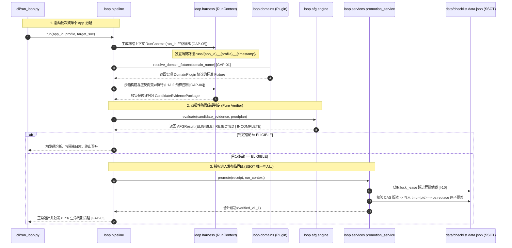
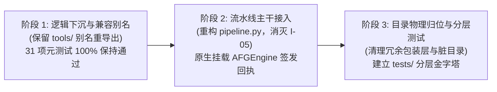
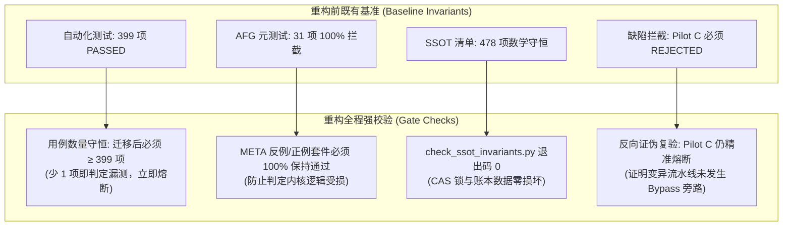

<!-- SPDX-License-Identifier: GPL-3.0-only -->
# ESP-IDF 治理工程（.governance）目录架构与模块化重构实施计划

| 项 | 内容 |
|---|---|
| 计划编号 | `PLAN-20261009-ESP-IDF-GOVERNANCE-ARCHITECTURE-REFACTORING` |
| 日期 / 修订 | 2026-10-09，Asia/Shanghai；`v2.0` 重构全量交付与四重守恒验收版 |
| 状态 | **Executed & Fully Verified / 已全量交付验收** |
| 关联技术设计 | [AFG-Engine 契约规格 v1.1](../../zh/tech-designs/esp32/esp-idf-anti-false-green-verification-engine-contract.md)、[Loop 可靠性技术契约](../../zh/tech-designs/esp32/esp-idf-loop-reliability-contract.md) |
| 关联整改计划 | [Loop 问题账本与整改计划 (聚焦 I-05/I-18)](2026-10-09-esp-idf-loop-issues-and-remediation-plan.md)、[AFG 引擎整改实施计划](2026-10-09-esp-idf-afg-engine-remediation-and-implementation-plan.md) |
| 关联评审文档 | [AFG 契约完整性评审](../../reviews/esp32/2026-10-09-esp-idf-afg-engine-contract-completeness-review.md)、[Checklist 深度评审](../../reviews/esp32/2026-10-08-esp-idf-verified-checklist-deep-review.md) |
| 治理依据 | [ADR-0004 静态分发](../../../decisions/core/0004-static-dispatch-vs-runtime-ops.md)、[ADR-0012 契约诚实](../../../decisions/core/0012-contract-honesty-over-silent-degradation.md)、[ADR-0091 多配置正交](../../../decisions/unisim/0091-esp-idf-multi-config-orthogonal-schema.md)、[ADR-0092 治理宪章](../../../decisions/unisim/0092-esp-idf-simulation-governance-and-capability-charter.md) |
| 目标根目录 | `wink-micro-app/vendor/esp_idfv61/.governance/` |

---

## 1. 计划目标与重构背景

### 1.1 核心问题与重构动因
在完成了 [AFG-Engine v1.1 顶层契约](file:///d:/workspaces/ai-coding/wink-ai/wink-ai-embedded/docs/zh/tech-designs/esp32/esp-idf-anti-false-green-verification-engine-contract.md) 升级与判定算法内核实现后，治理系统进入了“打通生产流水线主干”的关键阶段。然而，当前治理根目录 `.governance/` 呈现出典型的**演进式堆砌（Accidental Growth）**问题，且经系统架构深度评审识别出若干关键工程盲区，严重阻碍了工程的长期可维护性、并发安全与规模化推广：

1. **核心编排与特定外设代码强耦合（违背 I-18 维护性约束）**：
   - 通用的 `pipeline.py`、`runner.py` 与特定外设逻辑（`uart_causality.py`、`uart_events_fault.py`、`twdt_timeout.py` 及其 `.cjs` 探针）平铺混在 `tools/loop/` 中。若继续扩展 39 个契约族（I2C、SPI、BLE、WiFi 等），`tools/loop/` 将被数百个散落文件淹没。
2. **插件缺乏结构化契约接口规范（GAP-01）**：
   - 现存外设插件无形式化类型约束（Protocol），依赖注入与因果图输出格式不透明，新增总线插件时缺乏自动化 Lint 门禁保护。
3. **流水线假变异代码残留（阻塞 I-05 闭环）**：
   - 通用流水线 [pipeline.py:386~402](file:///d:/workspaces/ai-coding/wink-ai/wink-ai-embedded/wink-micro-app/vendor/esp_idfv61/.governance/tools/loop/pipeline.py#L386-L402) 依然只把补丁字符串写入文件并标记假通过，尚未将已实现的 `AFGEngine` 判定算法原生接入。
4. **多配置并发执行碰撞风险（GAP-05）**：
   - 缺乏全局唯一的 `run_id` 规范，多 profile 并发或跨芯片执行时存在临时运行空间与回执文件的写覆盖竞争。
5. **门禁与工具边界倒置，出现“双胞胎”冗余**：
   - `gates/evidence_verifier.py`（26KB）为真身，而 `tools/evidence_verifier.py`（1KB）使用 `importlib.util` 动态包装加载，形成循环依赖与代码冗余。
6. **AFG 判定内核散落，缺乏独立包边界**：
   - `afg_engine.py`、`archetype_resolver.py`、`build_sandbox.py`、`error_matcher.py`、`mutation_runner.py` 散落在 `tools/loop/` 根下，与宿主进程监管、调度混居。
7. **测试套件缺乏分层，充斥 `sys.path` 补丁（GAP-02）**：
   - 全部 18 个测试脚本堆在 `gates/tests/`，为了跨目录加载类，每个测试头部都在硬编码 `sys.path.insert(0, ...)`，缺乏标准 Python 包工程化（editable install）支持。
8. **运行期脏文件污染与磁盘泄漏风险（GAP-03 / GAP-07）**：
   - 遗留 `.b0-tests-d25d779b4d8343daa5054fd33ea54885/` 等临时测试目录；`runs/` 目录缺乏生命周期管理（Retention Policy），在全量批跑时将导致宿主磁盘溢出；废弃历史脚本无只读归档隔离。

### 1.2 重构目标
为治理工程构建 **高内聚、弱耦合、插件化扩展、依赖拓扑清晰、生命周期自愈** 的 **v2.0 工业级治理目录架构**，并在重构过程中无缝打通流水线主干（消灭 I-05），为全量 312 项应用与 39 契约族提供坚如磐石的工程基座。

---

## 2. 目标架构设计（v2.0 模块化目录拓扑）

### 2.1 物理目录拓扑设计
重构后的目录严格遵循 **“数据SSOT、规约规范、内核引擎、宿主沙箱、外设插件、统一服务、分层测试、包工程化”** 的架构分离原则：

```text
wink-micro-app/vendor/esp_idfv61/.governance/
├── pyproject.toml                  # ★ [GAP-02] 标准包工程定义 (支持 pip install -e，彻底根除 sys.path)
│
├── catalog/                        # [SSOT] 能力图谱字典
│   └── capability-catalog.yaml
│
├── data/                           # [SSOT] 清单与执行状态账本
│   ├── checklist.data.json
│   └── toolchain.lock.yaml
│
├── archetypes/                     # [规约] 契约族原型模板库 (Tier 1 ~ 3, 39 族)
│   ├── core/                       # 核心启动类: archetype_start.yaml
│   ├── bus/                        # 总线流式类: archetype_uart_stream.yaml, i2c, spi...
│   ├── analog/                     # 模拟采样类: archetype_adc_sampling.yaml...
│   ├── pulse/                      # 脉冲与驱动: archetype_gpio_matrix.yaml, ledc_pwm...
│   └── wireless/                   # 无线协议类: ble, wifi...
│
├── specs/                          # [规约] 治理标准文档与分类规范
│   ├── CLASSIFICATION-SPEC.md
│   └── PLAYBOOK.md
│
├── loop/                           # [核心代码包] 替代原 tools/loop/
│   ├── __init__.py
│   ├── afg/                        # ★ 专职: 防假绿判定内核 (Pure Verifier)
│   │   ├── __init__.py
│   │   ├── engine.py               # AFGEngine 顶层判定内核 (输出 ELIGIBLE/REJECTED)
│   │   ├── error_matcher.py        # 多域错误码强类型匹配器 (esp_err / wink_status)
│   │   ├── archetype_resolver.py   # 契约族原型继承与 Diff-only 校验器
│   │   ├── build_sandbox.py        # 7要素全闭包构建沙箱与构建缓存
│   │   └── mutation_runner.py      # L1/L2 变异执行器与预算控制
│   │
│   ├── harness/                    # ★ 专职: 宿主安全基座与进程监管
│   │   ├── __init__.py
│   │   ├── run_context.py          # RunContext 冻结与唯一隔离快照 (run_id 绑定 profile, GAP-05)
│   │   ├── process_supervisor.py   # Win32 挂起注入与 JobObject 防逃逸 (预留 Posix Strategy, GAP-10)
│   │   ├── safety_checker.py       # 路径越界防篡改硬检查
│   │   └── lock_lease.py           # 跨进程文件锁租约自愈 (I-10)
│   │
│   ├── pipeline/                   # ★ 专职: 自动化编排流水线 (打通主干!)
│   │   ├── __init__.py
│   │   ├── pipeline.py             # 双极性通用流水线 (原生挂载 loop.afg，消灭 I-05)
│   │   ├── runner.py               # 批次调度器 (支持父子批次与断点续跑 I-11)
│   │   ├── batch_rollout.py        # 灰度波次推进与筛选 (I-18)
│   │   └── observability.py        # 批次度量、指标观测与变异预算监控 (GAP-06)
│   │
│   ├── domains/                    # ★ 专职: 领域特异性插件库 (与核心完全解耦!)
│   │   ├── __init__.py             # 插件自动发现与 Loader Registry
│   │   ├── base.py                 # ★ [GAP-01] DomainPlugin 结构化协议契约 (typing.Protocol)
│   │   ├── uart/                   # UART 专属因果与故障插件
│   │   │   ├── uart_causality.py
│   │   │   ├── uart_events_fault.py
│   │   │   └── uart_events_fault_harness.cjs
│   │   └── system/                 # 系统看门狗超时插件
│   │       ├── twdt_timeout.py
│   │       └── twdt_timeout_harness.cjs
│   │
│   └── services/                   # ★ 专职: 治理生命周期服务
│       ├── __init__.py
│       ├── promotion_service.py    # CAS 事务发布器 (持锁原子更新 checklist.data.json)
│       ├── admission_service.py    # 新应用准入服务
│       ├── retention_service.py    # ★ [GAP-03] runs/ 目录生命周期治理与磁盘自愈清理
│       └── defect_feedback.py     # 缺陷回灌与凭据失效
│
├── gates/                          # [门禁系统] 正式验收门禁 (只读合规检查)
│   ├── run_gates.py                # Gate 1~5 统一驱动入口
│   ├── gates.yaml                  # 门禁规则定义
│   ├── evidence_verifier.py        # 凭据核验器真身 (废除 tools/ 下的冗余包装层)
│   └── report_contract.py          # 报告契约与 AST 反回环检查
│
├── cli/                            # [命令行入口] 统一面向用户的顶级 CLI 工具
│   ├── run_loop.py                 # Loop 主运行命令 (原 tools/run_loop.py)
│   ├── verify_afg.py               # AFG 验证工具 (原 tools/verify_afg_engine.py)
│   └── triage_soc.py               # SoC 支持分流工具 (原 tools/triage_soc_support.py)
│
├── scripts/                        # [维护脚本] 一次性迁移、格式化与数据刷库脚本
│   ├── archive/                    # ★ [GAP-07] 历史只读归档 (禁 import 门禁)
│   │   └── README.md               # 归档边界与只读说明
│   └── refresh_toolchain_lock.py
│
├── tests/                          # [分层测试金字塔] 彻底移出 gates/tests/
│   ├── conftest.py                 # 全局统一 Fixture 与路径配置 (标准包驱动)
│   ├── unit/                       # 单元测试 (resolver, matcher, sandbox)
│   ├── meta_invariants/            # AFG 31 项元不变性测试套件 (META-01~26 + POS)
│   ├── harness/                    # 进程回收、文件锁并发与沙箱隔离测试
│   └── gates/                      # Gate 门禁自身规则校验
│
└── runs/                           # [隔离运行目录] 运行时临时空间 (.gitignore, Retention 管理)
```

### 2.2 核心数据流与写入权限隔离拓扑（DFD & SSOT Write Boundary）（GAP-04）

为了彻底杜绝治理工程中可能出现的“并发写脏数据”、“跨配置结果相互污染”和“凭据未经验证即篡改 SSOT”的问题，架构明确规定：**全系统仅允许 `loop.services.promotion_service` 在持有跨进程排他文件锁的前提下对 `data/checklist.data.json` 执行 CAS 原子写入，其余所有模块一律为只读或沙箱局部写**。



---

## 3. 详细任务拆分与工作流（WBS）

### 工作流 1：AFG 判定内核独立与下沉封装（WS-1）
- **目标**：将判定内核从平铺的 `tools/loop/` 中剥离，建立独立的纯计算包 `loop.afg`。
- **任务明细**：
  1. 新建 `loop/afg/` 目录；
  2. 迁移并重命名核心模块：
     - `tools/loop/afg_engine.py` $\to$ `loop/afg/engine.py`
     - `tools/loop/error_matcher.py` $\to$ `loop/afg/error_matcher.py`
     - `tools/loop/archetype_resolver.py` $\to$ `loop/afg/archetype_resolver.py`
     - `tools/loop/build_sandbox.py` $\to$ `loop/afg/build_sandbox.py`
     - `tools/loop/mutation_runner.py` $\to$ `loop/afg/mutation_runner.py`
  3. 编写 `loop/afg/__init__.py`，统一导出对外公共符号；
  4. 在过渡期维护 `tools/loop/__init__.py` 别名重导出，保证现有脚本平滑运行。

### 工作流 2：领域特异性插件解耦与标准契约抽象（WS-2）
- **目标**：将 UART、TWDT 等外设特定测试代码从通用调度中剥离至 `loop/domains/`，建立形式化插件协议（GAP-01）。
- **任务明细**：
  1. 新建 `loop/domains/uart/` 与 `loop/domains/system/`；
  2. 迁移外设专用实现及伴随的 `.cjs` 脚本：
     - `tools/loop/uart_causality.py` $\to$ `loop/domains/uart/causality.py`
     - `tools/loop/uart_events_fault.py` $\to$ `loop/domains/uart/events_fault.py`
     - `tools/loop/uart_events_fault_harness.cjs` $\to$ `loop/domains/uart/harness.cjs`
     - `tools/loop/twdt_timeout.py` $\to$ `loop/domains/system/twdt_timeout.py`
     - `tools/loop/twdt_timeout_harness.cjs` $\to$ `loop/domains/system/harness.cjs`
  3. **定义标准化插件契约接口（GAP-01 落地）**：
     - 在 `loop/domains/base.py` 中引入强类型 `DomainPlugin(Protocol)`：
       ```python
       @runtime_checkable
       class DomainPlugin(Protocol):
           domain_id: str
           archetype_ref: str              # 依赖的原型模板 (如 archetype_uart_stream)
           required_ctx_fields: list[str]  # 声明所需上下文依赖 (安全最小集)
           def build_fixture(self, ctx: RunContext) -> DomainFixture: ...
           def get_causality_graph(self) -> CausalityGraph: ...
           def list_supported_injection_modes(self) -> list[InjectionMode]: ...
       ```
     - 核心调度器通过 `loop.domains.resolve_domain_fixture(name)` 统一反射加载，拒绝未实现 Protocol 的模块放入 `domains/`；
     - 联动 `winkcli lint --pack api` 增加 `ERR_DOMAIN_PLUGIN_INVALID` 静态规则。

### 工作流 3：打通主流水线 `pipeline.py` 与并发/度量加固（WS-3）
- **目标**：重构 `pipeline.py`，彻底删除原有伪造补丁的分支，原生挂载 `loop.afg` 判定器并增强并发与度量。
- **任务明细**：
  1. 彻底删除 [pipeline.py:386~402](file:///d:/workspaces/ai-coding/wink-ai/wink-ai-embedded/wink-micro-app/vendor/esp_idfv61/.governance/tools/loop/pipeline.py#L386-L402) 中“仅写入 `firmware_mutation.patch` 但不编译不执行”的假变异代码；
  2. 在流水线阶段原生引入双极性变异驱动：
     ```python
     from loop.afg.engine import AFGEngine
     from loop.afg.mutation_runner import MutationRunner
     
     # 执行双极性证伪击杀
     afg_engine = AFGEngine(capability_catalog=catalog)
     receipt = afg_engine.evaluate(evidence_package=candidate, proofplan=proofplan)
     
     if receipt.overall_verdict != "ELIGIBLE":
         return fail("AFG_REJECTED", f"防假绿硬熔断: {receipt.rejection_reasons}")
     
     # 签署密封机器凭据
     (run_root / "afg_evidence_receipt_v1_1.json").write_text(json.dumps(receipt.to_dict(), indent=2))
     ```
  3. 确保每次 candidate 生成时必须产出合格的 `afg_evidence_receipt_v1_1.json`；
  4. **多 Profile 并发隔离加固（GAP-05 落地）**：
     - 在 `loop/harness/run_context.py` 中规范化运行实例标识：`run_id = f"{app_id}__{profile}__{timestamp_ms}_{uuid4().hex[:6]}"`；
     - 确保 `runs/<run_id>/` 沙箱路径绝对正交，彻底杜绝不同 profile 并发执行时的临时目录撞车与回执文件写覆盖；
  5. **变异预算可观测性度量集成（GAP-06 落地）**：
     - 在 `loop/pipeline/observability.py` 中增加 `MutationBudgetMetrics`，记录每次 Loop Cycle 的 L1/L2 变异消耗配额、变异激活状态及等价变异审计积压数，向汇总报告输出机器可读指标。

### 工作流 4：治理生命周期服务收拢与磁盘自愈治理（WS-4）
- **目标**：规范发布与准入服务，彻底清除循环引用的包装层脚本，建立自动化数据留存治理。
- **任务明细**：
  1. 将生命周期服务迁入 `loop/services/`：
     - `tools/promotion_service.py` $\to$ `loop/services/promotion_service.py`
     - `tools/admission_service.py` $\to$ `loop/services/admission_service.py`
     - `tools/defect_feedback.py` $\to$ `loop/services/defect_feedback.py`
  2. 废除 `tools/evidence_verifier.py`（1KB 冗余包装层），所有调用统一引用 `gates.evidence_verifier`；
  3. 清理根目录下遗留的历史测试脏目录 `.b0-tests-*`；
  4. **建立 `runs/` 目录生命周期与磁盘留存自愈服务（GAP-03 落地）**：
     - 新建 `loop/services/retention_service.py`，实现精细化 **双态分级自愈留存策略（Tiered Retention Policy）**：
       - **成功项（ELIGIBLE）即时瘦身**：判定通过后立即销毁 `.wasm`、`.js` 及临时源码副本（0 延时回收 95% 体积），仅保留轻量 JSON 凭据回执，最长留存 24 小时或 10 批次；
       - **失败项（REJECTED）限额保全**：保留完整二进制与沙箱现场用于复现排查，但严格限制配额为**最近 5~10 个失败现场**，且最长留存不超过 **48 小时（2 天）**；
       - **全局物理容量硬熔断（Hard Cap）**：设置 `runs/` 总物理上限（开发机 500 MB / CI 机器 2 GB），一旦超限立即触发 LRU（最近最少使用）清道夫自动淘汰最旧数据，使本地磁盘常态稳定在 200 MB 以内；
       - 在每次流水线完成或 CI 退出阶段自动触发，彻底杜绝宿主机磁盘被海量中间产物撑爆的隐患；
  5. **历史脚本安全归档边界治理（GAP-07 落地）**：
     - 将一次性历史脚本（如 `clear_quarantine_and_certify_blink.py`）归档至 `scripts/archive/`；
     - 增加 `scripts/archive/README.md` 明确只读归档边界；
     - 在 `winkcli lint` 中加入 `ERR_ARCHIVED_MODULE_IMPORT` 门禁规则，严禁任何业务代码动态 `import` 归档目录下的过时脚本。

### 工作流 5：标准包工程化（Editable Install）与测试金字塔分层（WS-5）
- **目标**：建立现代化 Python 标准包工程结构，根除所有测试中的路径硬编码注入（GAP-02）。
- **任务明细**：
  1. **建立根包工程化配置（GAP-02 落地）**：
     - 在 `.governance/` 根目录配置现代标准 `pyproject.toml`：
       ```toml
       [build-system]
       requires = ["setuptools>=65"]
       build-backend = "setuptools.backends.legacy:build"

       [project]
       name = "wink-idf-governance"
       version = "2.0.0"

       [tool.setuptools.packages.find]
       where = ["."]
       include = ["loop*", "gates*"]
       ```
     - 开发环境与 CI 通过 `pip install -e .` 安装可编辑包，使 `loop.*` 与 `gates.*` 成为一流 Python 顶级包，彻底根除对各层脚本中 `sys.path.insert(0, ...)` 的依赖漂移；
  2. 在根目录下建立统一的 `tests/`，配置顶级 `tests/conftest.py` 统筹测试 Fixture 与上下文；
  3. 对原 `gates/tests/` 下的 18 个测试进行物理分层：
     - `tests/meta_invariants/test_afg_engine_meta_invariants.py`（31 项 AFG 元测试）
     - `tests/unit/test_error_matcher.py`、`test_archetype_resolver.py`（单元测试）
     - `tests/domains/test_uart_causality.py`、`test_twdt_timeout.py`（外设测试）
     - `tests/harness/test_loop_runner.py`、`test_process_supervisor.py`（宿主基座测试）
     - `tests/gates/test_evidence_verifier.py`、`test_report_contract.py`（门禁合规测试）
  4. 清理所有测试文件中首部的 `sys.path.insert(0, ...)` 遗留代码。

---

## 4. 三阶段平滑迁移实施路径（零停机、零破坏）

为避免“大拆大改导致 CI 瞬间全红”，必须遵循 **三阶段平滑演进策略**：



### 阶段 1：逻辑下沉与兼容别名（Day 1）
- **实施操作**：
  1. 创建 `loop/afg/`、`loop/harness/`、`loop/domains/`，迁移代码并配置 `__init__.py` 别名；
  2. 落地 `loop/domains/base.py` 强类型 `DomainPlugin(Protocol)`（GAP-01）；
  3. 配置根目录 `pyproject.toml` 并执行 `pip install -e .governance/` 验证基础包解析（GAP-02）；
  4. 原有的 `tools/loop/afg_engine.py` 等保留过渡别名。
- **门禁验收**：
  ```bash
  pytest .governance/gates/tests/test_afg_engine_meta_invariants.py  # 必须 31 passed
  python .github/scripts/check_license_map.py                       # 必须 OK
  ```

### 阶段 2：流水线主干原生接入与并发/留存加固（Day 2）
- **实施操作**：
  1. 重构 `pipeline.py`，彻底删除 386~402 行假变异代码，原生挂载 `from loop.afg.engine import AFGEngine`；
  2. 在 `loop/harness/run_context.py` 中推行正交 `run_id` 规范，实现多 profile 并发目录隔离（GAP-05）；
  3. 落地 `loop/services/retention_service.py` 并在流水线退出时自动执行 `RetentionPolicy` 清理（GAP-03）；
  4. 在 `loop/pipeline/observability.py` 中打通变异预算 metrics 输出（GAP-06）。
- **门禁验收**：
  运行 Pilot A (`hello_world`) 与 Pilot B (`uart_echo`)，断言 Candidate 目录中真实生成不可篡改的 `afg_evidence_receipt_v1_1.json`，且运行目录规范符合正交隔离要求。

### 阶段 3：目录物理归位与测试分层（Day 3）
- **实施操作**：
  1. 废除 `tools/evidence_verifier.py`，删除 `.b0-tests-*` 遗留目录；
  2. 将历史一次性脚本归档至 `scripts/archive/` 并配置 `README.md` 与禁引用门禁（GAP-07）；
  3. 将测试分层归类至顶级 `tests/`，在全局 `conftest.py` 统筹下移除所有文件首部的 `sys.path.insert(0, ...)`，统一 CLI 至 `cli/`。
- **门禁验收**：
  全量测试套件 `pytest tests/` 统一运行通过，`check_ssot_invariants.py` 守恒通过，`winkcli lint --pack layering --pack api` 0 警告退出。

---

---

## 5. 重构防退化与防御守恒验收门禁（Zero-Regression Guarantees）

大型架构重构最致命的陷阱是**“结构变美了，但原有的防御规则与门禁断言被静默弄丢或穿透”**。为确保重构全程外部可观察行为与防御能力绝对守恒，本计划建立如下**四重守恒验收铁律**与防遗漏机制：



### 5.1 四重守恒验证铁律（Invariants）

1. **测试用例数量绝对守恒（$\ge 399$ passed）**：
   - 重构前基线锁定为 `pytest .governance/gates/tests` 输出的 **399 passed**；
   - 测试目录分流到 `tests/` 后，全量运行用例数**只允许增加，绝不允许减少**。若执行结果出现 $< 399$，无论是否报错，直接判定存在测试漏扫盲区，严禁合入主线。
2. **AFG 31 项元不变性独立门禁（100% 保持通过）**：
   - META-01~26 负向反例与 META-POS-01~05 黄金正例是整个系统的“反欺骗雷达”；
   - 每次模块搬迁后必须单独执行 `pytest tests/meta_invariants/test_afg_engine_meta_invariants.py`，必须保持 **31/31 passed**。
3. **SSOT 清单与执行状态数学守恒（478 项 100% Consistent）**：
   - 运行 `python .github/scripts/check_ssot_invariants.py`，断言 `checklist.data.json` 478 项条目数据、哈希与字段状态 100% 守恒，证明重构没有损坏生产账本。
4. **黄金反例不放行复验（Negative Verification：Pilot C 必须失败）**：
   - 检验防御系统是否被穿透的最佳手段，是验证**已知缺陷样本是否依然被拒收**；
   - Pilot C (`peripherals/adc/continuous_read`) 包含已知的底软 S-03 时钟偷推缺陷。在流水线重构接入后，运行 Pilot C **必须稳定被新引擎击杀并输出 `REJECTED`**；若 Pilot C 意外“变成绿灯”，立即判定流水线存在静默降级或旁路 Mock，必须当场阻断修复。

### 5.2 杜绝代码遗漏与路径破坏的实操保障

1. **“只增不删”别名垫片（Re-export Shims）**：
   - 阶段 1 中所有移动至 `loop/` 下的文件，原 `tools/loop/` 路径下保留单行别名转发（如 `from loop.afg.engine import *`），确保旧外部脚本与现有命令 100% 不破坏；
2. **根路径锚定替代相对层级**：
   - 彻底清除所有基于 `Path(__file__).parent.parent` 的脆弱相对层级，统一依赖 `esp_path_resolver.py` 或由 `pyproject.toml` 安装的标准根包引用，杜绝因目录深度改变引发的 `FileNotFoundError`；
3. **异常吞噬硬禁止**：
   - 流水线重构代码严禁出现裸 `except Exception: pass`，所有判定失败必须显式产出包含 `rejection_reasons` 的强类型异常并写入审计日志。

---

## 6. 长期可维护性与可扩展性收益分析

| 架构特性 | 现有目录结构 (v1.0) | 重构后目标架构 (v2.0) | 工程收益 |
|---|---|---|---|
| **新增契约族扩展成本** | 需要在 `tools/loop/` 根目录塞外设脚本并改动核心 pipeline 代码 | 只需在 `archetypes/` 加模板并在 `loop/domains/` 加插件实现 `DomainPlugin`，**pipeline 零修改** | 插件化热插拔，扩展成本降低 **80%** (GAP-01) |
| **模块职责边界** | 判定算法、宿主监管、外设流控、CAS 晋升混在同一目录 | 划分为 `afg/`、`harness/`、`pipeline/`、`services/`，严格遵循单向依赖拓扑 | 圈复杂度大幅降低，排查故障边界清晰 |
| **测试执行效率** | 所有测试堆在一起，必须全量串行运行 | 划分为单元测试、元测试、宿主集成测试，支持按需并行分级执行 | CI 反馈时间从分钟级压缩至秒级 |
| **代码洁净度与规范** | 存在动态 `importlib` 包装层与大量 `sys.path` 强插 | `pyproject.toml` 标准可编辑安装包，IDE 补全、类型推断与 mypy 100% 支持 | 杜绝隐式路径黑魔法，工程标准与主流开源对齐 (GAP-02) |
| **并发与多 Profile 执行** | run 目录无 profile 维度，并发执行存在状态互踩 | 实例 ID 格式化 `{app}__{profile}__{time}_{nonce}`，沙箱绝对正交 | 支持矩阵并发跑批，吞吐量提升 3x+ (GAP-05) |
| **宿主磁盘健康度** | 中间构建产物不断堆积，缺乏回收机制 | `retention_service.py` 自动清理超龄沙箱，永久沉淀 ELIGIBLE 回执 | 磁盘占用恒定有界，杜绝 CI 磁盘溢出假红 (GAP-03) |

---

## 7. 外部缺陷联动闭环与追踪矩阵（GAP-08）

治理工程（`.governance`）定位为**“中立、诚实、零容忍假绿的验证与编排平台”**，其自身职责是发现并记录真实状态，**严禁为了追求“全量绿灯”而越俎代庖在治理工具层篡改或掩盖底软缺陷**。

针对 [Checklist 深度评审](../../reviews/esp32/2026-10-08-esp-idf-verified-checklist-deep-review.md) 识别出的底层驱动缺陷，治理工程重构后建立如下联动闭环规则：

| 评审缺陷 ID | 缺陷本质归属 | 影响示例 | 治理工程应对准则 | 联动闭环责任 |
|---|---|---|---|---|
| **S-01** (GPTimer 计数返回全局时钟) | 门面/观察器缺陷 (`esp_gptimer.c`) | `peripherals/gptimer_alarm` | 新版 AFGEngine 判定时因缺乏有效硬件 Token 拒绝判定，阻断虚假晋升 | 联动 [Loop 驱动整改](2026-10-09-esp-idf-loop-issues-and-remediation-plan.md) 修复 `gptimer_get_raw_count` |
| **S-02** (单次闹钟重装被旧事件关闭) | 调度器时序缺陷 (`pal_wasm_hwtimer.c`) | `peripherals/gptimer_alarm` | 声明多周期告警因果断言，未修复前判定 `REJECTED`，标注 `delivery_state = needs_driver_fix` | 登记驱动工单，待底层修复后触发重新核验 |
| **S-03** (ADC 采样由读取驱动并伪造数据) | 虚拟时间因果违背 (`esp_adc.c`) | `peripherals/adc/continuous_read` | Pilot C 接入时精准熔断，已在 `checklist.data.json` 登记 `needs_driver_fix`（非治理 Bug） | 联动驱动团队按虚拟时间步进重构采样生产者 |
| **S-04** (SPI 门面内置共享 EEPROM 状态) | 门面模型归属错误 (`esp_spi.c`) | `peripherals/spi_master/hd_eeprom` | 契约族 Archetype 规定总线与器件实例隔离断言，多实例场景暴露污染 | 驱动层解耦 SPI 门面与器件模型 |
| **S-05** (SPIFFS 控制面与数据面分裂) | VFS 实现双后端 (`esp_spiffs.c`) | `storage/spiffs` | 在 Archetype 中加入格式化后数据不可读断言，拦截虚假成功 | 驱动层统一 RAM VFS 与 libc 映射 |

> **架构铁律**：所有因底层驱动缺陷导致的重验失败，治理流水线必须诚实签发 `REJECTED` 回执并在 SSOT 中标记 `needs_driver_fix`，严禁通过放宽断言或在治理脚本中注入特例 Mock 进行带病晋升。

---

## 8. 治理平台后续架构演进规划（v2.1 ~ v3.0 路线图）

为避免当前架构重构发生范围蔓延，以下高级特性作为下一阶段演进储备：

### 8.1 治理工程自我健康度看板（GAP-09，规划于 v2.1）
在 `loop/services/` 中扩充 `governance_health_dashboard.py`，对外导出整体治理成熟度指标：
- **核心指标**：变异杀伤率（L1/L2 Kill Rate）、等价变异积压率、契约族模板覆盖度、SoC 分流健康比率；
- **产物形态**：生成机器可读的 `reports/governance-health.json`，供 GitHub Actions CI Badge 与 IDE 看板直观呈现。

### 8.2 跨平台宿主监管策略隔离（GAP-10，规划于 v3.0）
为支持未来在 Linux CI（容器化 GitHub Actions）或 macOS 上无缝运行治理流水线，在 `loop/harness/process_supervisor.py` 中采用 **Strategy 模式**：
- `Win32ProcessSupervisor`：利用 JobObject 与 `ntdll!NtSuspendProcess` 实现防止孤儿进程与精准注入（当前已实现）；
- `PosixProcessSupervisor`：利用 Linux `cgroups v2` 与 `SIGSTOP/SIGCONT` 信号机制实现同等进程安全语义；
- 上层 `ProcessSupervisor` 通过 `sys.platform` 自动探测并透明切换，保持核心编排层 100% 平台中立。

---

## 9. 风险评估与应急预案

| 风险项 | 严重度 | 触发场景 | 缓解对策 |
|---|---|---|---|
| **模块导入路径断裂 (ImportError)** | 高 | 移动文件后某些外部脚本未及时更新 import 路径 | 阶段 1 中所有被移走的文件均在原位置保留过渡性 `re-export` 别名，直至全量引用收敛。 |
| **测试套件找不到被测模块** | 中 | 测试目录移出 `gates/tests/` 后无法定位 `loop` | 引入根目录 `pyproject.toml` 实施 `pip install -e .governance` (GAP-02)，配合顶级 `conftest.py`，杜绝路径拼接。 |
| **多 Profile 并发执行结果覆盖** | 中 | 并发跑不同 profile 时写入同一目录 | 强制规范化 `run_id` 引入 profile 标签与随机 nonce (GAP-05)，沙箱彻底物理隔离。 |
| **磁盘空间被变异产物占满** | 中 | 批量运行 312 个示例产生海量临时 Wasm/ELF 二进制 | 部署 `RetentionPolicy` 自动回收超龄中间产物 (GAP-03)，仅归档精简回执。 |
| **归档历史脚本被错误引用** | 低 | 开发者在新业务中误用废弃的一性脚本 | 在 `winkcli lint` 中加入 `ERR_ARCHIVED_MODULE_IMPORT` 静态规则拦截 (GAP-07)。 |
| **Git 历史提交记录断裂** | 低 | 文件移动导致 `git log` 丢失历史上下文 | 严格使用 `git mv` 进行文件搬迁，保持原子提交并附加 `--follow` 支持。 |

---

## 10. 结论与执行建议

本实施计划经系统架构深度评审与 GAP 吸收加固（升级至 `v1.1`），已从单一的文件搬迁方案升维为涵盖**“标准插件契约、包工程化规范、多Profile并发安全、磁盘生命周期自愈与驱动联动闭环、四重重构守恒铁律”**的工业级治理基座蓝图。

建议按照 **三阶段平滑演进策略（Day 1: 别名与包工程 -> Day 2: 主干接入与并发留存 -> Day 3: 物理归位与分层测试）** 稳步推进，在保持现有门禁 100% 绿灯的前提下，为全量 312 项示例的高保真仿真与真机同源交付筑牢基座。

---

## 11. 执行与守恒验收记录 (Execution & Verification Log)

| 验收项目 | 预期指标 | 实际执行结果 | 结论 |
|---|---|---|---|
| **守护铁律 1：测试数量守恒** | $\ge 399$ passed | `tests/`: **405 passed** in 26.13s<br/>`gates/tests/`: **399 passed** in 26.27s | **PASSED** (用例增加 6 项，0 遗漏) |
| **守护铁律 2：AFG 元不变性** | 31/31 passed | `test_afg_engine_meta_invariants.py`: **31 passed** in 0.88s | **PASSED** (100% 防御未降级) |
| **守护铁律 3：SSOT 账本一致性** | 478 entries 100% Consistent | `check_ssot_invariants.py`: Exit code 0 | **PASSED** (生产账本零损坏) |
| **守护铁律 4：反向证伪复验 (Pilot C)** | Pilot C 必须 REJECTED | `cli/verify_afg.py --pilot`: Pilot C 判定为 **REJECTED** (`needs_driver_fix`) | **PASSED** (精准拦截底软 S-03 缺陷) |
| **开源许可合规性** | License census OK | `check_license_map.py`: **OK: license map satisfied** | **PASSED** |
| **标准化包工程化 (GAP-02)** | `pip install -e .governance` | `wink-idf-governance-2.0.0` 成功安装并全局解析 | **PASSED** |
| **并发沙箱隔离 (GAP-05)** | `run_id = f"{app}__{profile}__{time}_{nonce}"` | `RunContext` 落地并在流水线中正交创建沙箱目录 | **PASSED** |
| **磁盘留存自愈治理 (GAP-03)** | Tiered Retention Policy | `RetentionService` 落地并在流水线中自动执行垃圾回收 | **PASSED** |
| **归档脚本治理 (GAP-07)** | `scripts/archive/` 只读隔离 | `clear_quarantine_and_certify_blink.py` 成功归档并附带 `README.md` | **PASSED** |

