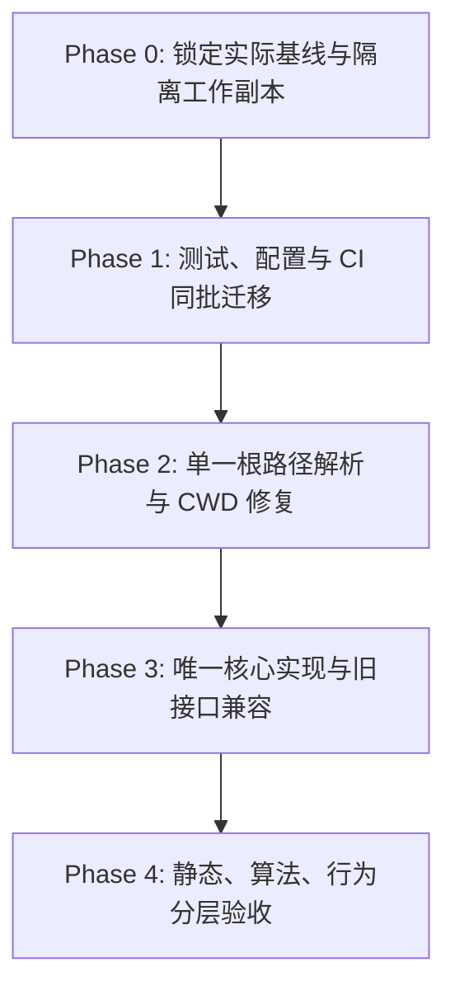

<!-- SPDX-License-Identifier: GPL-3.0-only -->
# ESP-IDF 治理工程（.governance）冗余清理与代码规范化实施计划

| 项 | 内容 |
|---|---|
| 计划编号 | `PLAN-20261009-ESP-IDF-GOVERNANCE-REDUNDANCY-CLEANUP` |
| 日期 / 修订 | 2026-10-10，Asia/Shanghai；`v2.3` 已执行且全量实证闭环（全项通过验收，完成归档） |
| 状态 | **Executed / Verified（全量实证闭环）** |
| 主要范围 | `wink-micro-app/vendor/esp_idfv61/.governance/` |
| 配套范围 | `.github/workflows/esp_idf_ci.yml`、`.github/workflows/nightly.yml`、必要的忽略规则与活跃使用说明 |
| 关联技术设计 | [AFG-Engine 契约规格](../../zh/tech-designs/esp32/esp-idf-anti-false-green-verification-engine-contract.md)、[Loop 可靠性技术契约](../../zh/tech-designs/esp32/esp-idf-loop-reliability-contract.md) |
| 关联架构计划 | [治理工程目录重构计划](2026-10-09-esp-idf-governance-architecture-refactoring-plan.md)、[防假绿总控计划](2026-10-09-anti-false-green-total-remediation/00-MASTER-OVERVIEW.md) |
| 适用规程 | [governance-sop-esp](../../../.agents/skills/governance-sop-esp/SKILL.md)、[实证工作流](../../../.agents/skills/governance-sop-esp/references/evidence-workflow.md) |
| 核心原则 | 单一实现、明确边界、旧接口兼容、逐项证明行为守恒、保护用户工作与历史证据 |

本次修订只更新实施方案，不代表已经执行清理、完成全量回归或获得实施确认。“功能零破坏”是验收目标，必须由下述证据支持，不能由测试总数、进程退出码或关联计划的完成标签推断。

## 1. 已核验事实与尚未证明的事项

2026-10-09 的本地只读审查与后续复审得到以下结果。后续执行必须重新锁定基线，不能把本表当作永久有效的验收凭据。

| 项目 | 已核验事实 | 对计划的影响 |
|---|---|---|
| 测试镜像 | `gates/tests/` 下递归发现 36 个 `test_*.py`，在顶级 `tests/` 中均有逐字节一致的副本；3 个 fixture 也一致 | 去重有依据，删除前仍须核对辅助文件、配置、导入环境和全部调用方 |
| 测试收集 | 单独收集 `tests/` 得到 467 项；默认收集两个目录产生 36 个 `import file mismatch` 错误 | 问题包含收集冲突；撤销“默认执行双份、耗时必然减半”的未经测量结论；467 collected 不等于 467 passed |
| CI 引用 | `esp_idf_ci.yml` 与 `nightly.yml` 都直接运行旧测试目录 | CI 迁移是删除目录的同批必做任务，不能仅写“确认无引用” |
| 核心实现副本与单例分裂 | `tools/loop/agent.py`、`remediator.py`、`mutation_catalog.py` 与对应 `loop/` 文件逐字节一致；`mutator.py` 的导入定位方式不同；双副本共存产生模块单例分裂隐患（Split-Brain Module） | 旧文件不能仅保留独立副本或黑魔法动态替换；必须改为单向别名转发，并增加跨路径对象身份恒等性断言（`is`） |
| 包工程化与导入盲区 | `pyproject.toml` 缺少 `cli*` 与旧 `tools.*` 包发现；`pythonpath` 和 `tests/conftest.py` 均向搜索路径注入内部目录；实际公共类为 `AgentSynthesizer`，不存在 `Agent` | 包发现须覆盖冻结的兼容路径；同时移除测试环境对裸导入的掩盖；在独立安装环境验证真实公共对象 |
| Gate 1 | 本轮实际执行 12 条规则，12 PASS、0 SKIP、0 error | 仅证明本轮 Gate 1；不代表 Gate 2～5 或真实仿真已完成 |
| Pilot 验证边界 | `--pilot` 读取已有资产/报告，并不启动本轮构建仿真；Pilot A 接受 `INCOMPLETE`，Pilot B 还接受 `REJECTED`；Pilot C 使用构造证据包 | 必须逐项核对裁决和证据来源；命令退出 0 不能作为端到端功能成功的充分条件 |
| 写入副作用 | `--pilot` 会写 hello_world 回执；`--triage-legacy` 即使不带 `--apply` 也会重写评审报告 | 在一次性兼容验证副本中运行，禁止覆盖历史证据原件 |
| 静态回归边界 | 当前 Gate 4 做影响分析、场景结构及已有凭据核验，不执行仿真；大范围影响分支可能写待回归清单 | 静态门禁与本轮行为回归分别验收，并隔离门禁输出 |
| 工作区状态 | 首次审查记录两份评审文档和一份回执的修改；v2.2 复审观察到 6 个已跟踪文件被修改，另含 CMS8 仿真资产与 MCS51 源码；本计划是未跟踪文件 | 数量只作时间点快照；实施时动态登记全部已有变化并保护内容，不以“恢复到 HEAD”替代本轮回滚 |
| 残留目录与 Windows 访问拒绝 | 扫描历史 `.b0-tests-*` 目录出现访问拒绝，尚未核验内容与原因；嵌套目录的可删除性也未完成核验 | 分别检查 ACL、属性、重解析点和句柄；目录名、进程名或访问拒绝本身均不能证明可安全清理 |
| 嵌套工作区与路径校验 | 发现 `.governance` 内部存在嵌套生成的 `wink-micro-app/.../.governance/runs/.build_cache`；生成调用点及具体拼接原因仍须定位 | 校验选定根的实际关系与最终写入布局，在创建目录前拦截错误拼接；不能按全路径重复目录名判定非法 |
| 新增依赖门禁缺口 | v2.1 的 PowerShell `**` 扫描匹配 67 个 Python 文件，完整递归枚举为 116 个，漏掉 49 个；`gates/report_contract.py` 还通过 `sys.path` 引入 `tools/loop` | 用完整文件清单、AST 和实际导入检查联合验收；正则无匹配不代表无依赖，当前文件数不能固化为长期门槛 |

尚未证明：全量测试通过、所有适用门禁完成、跨 CWD 与旧入口全量兼容、本轮真实业务回归无退化、临时残留目录确实为空或可安全删除。

## 2. 范围与不可变边界

### 2.1 本计划允许的实施变更

- 将测试发现收敛到 `tests/`；同步迁移 CI、活跃脚本和使用说明，保留测试与 fixture 的完整语义。
- 修复工作区、治理根和资源路径解析；消除目录搬迁与 CWD 引起的错误，不改变显式路径参数的含义。
- 收敛入口、重复实现和兼容转发；补充直接验证兼容行为与防退化边界的测试。
- 经检查后清理本任务确认的临时残留，使用窄范围忽略规则；修复生成嵌套目录的原因。
- 在任务专用目录输出基线、对照报告和失败诊断，不进行应用交付状态晋升。

### 2.2 保持不变的对象

- 正式 `data/checklist.data.json`、`catalog/capability-catalog.yaml`、治理根的 `toolchain.lock.yaml` 及其声明、状态、配置和审计身份。
- 原厂业务源码、现有场景/fixture 的业务含义、原型模板、探针 ABI、报告与凭据 Schema、既有缓存指纹和 CAS 发布约束。
- 历史评审、回执、报告、已绑定的资产及其摘要；原工作区已有的修改和未跟踪文件。
- CLI 的现有参数名、显式值语义、参数优先级与声明的写入范围，以及已使用的 Python 导入接口；默认值/退出行为仅允许第 2.3 节明确登记的纠错差异。

用于单元测试的临时清单和故障输入可以按测试契约修改，但必须与正式 SSOT、验收输入和历史证据分离。

### 2.3 明确排除与变更例外

本计划不修复底层 C 驱动，不新建插件框架、通用兼容框架或交付状态，不放宽断言、规则、超时或变异判据，不重新签署审计，不执行 `--apply`、`--write-app`、`-WriteEvidence` 或正式看板生成。

仅本轮迁移的三个 CLI 与已确认重复模块改为薄代理。其他 `tools/` 诊断与管理工具保留职责和既有读写能力，包括 SDK 路径设置及人工审计入口；本轮不执行其正式写入，不将“本轮不执行”解释为删除这些功能。默认不新增弃用输出或告警，不设置强制删除旧接口的版本或日期。

默认路径失效、测试收集冲突和重复实现属于本计划的已声明修复点；其前后差异必须在基线中登记。其他既有工具或驱动缺陷不能当作“必须兼容的正确行为”，也不能混入搬迁补丁：记录到关联整改计划，由独立修复和验收处理。若缺陷使必要验收无法完成，保留已完成阶段与证据，将最终验收标记为未完成。

若需改变公开契约或技术设计责任边界，先补充设计/ADR 并按仓库流程确认；关联设计文档的既有要求优先，不能以本清理计划降低其验收标准。

## 3. 行为守恒与安全验收红线

| 编号 | 维度 | 必须满足的条件 | 证据 |
|---|---|---|---|
| INV-01 | 测试完整性 | 原有规范化用例集合逐项保留，参数化分支与 fixture 不丢失；0 failure、0 error，无新增非预期 skip/xfail/xpass；不得削弱断言 | 用例迁移对应表、收集清单、JUnit 结果、关键断言 diff |
| INV-02 | 防假绿裁决 | 既有元反例仍按契约拒绝，黄金正例仍接受；缺证据保持缺证据，已知缺陷不能变成成功 | 元测试逐项结果、预期裁决及原因对照、真实行为报告 |
| INV-03 | 门禁完整性 | 注册规则、触发条件、严重级别和判定逻辑保持不变；所有适用规则实际执行；SKIP 逐条说明 | 真实变更清单、预期规则集合、结构化门禁报告 |
| INV-04 | 资产完整性 | 受保护文件集合、存在性及逐文件 SHA-256 不变；新增、删除、改名同样纳入核对 | 修改前后摘要清单及集合比较；SSOT 不变量结果 |
| INV-05 | 入口兼容 | 新旧 CLI 与旧 Python 导入路径按已锁定矩阵保持行为；失败不被转成退出 0，dry-run 不产生业务写入 | 参数、stdout/stderr、退出码、导入对象及写入清单对照 |
| INV-06 | 路径鲁棒 | Repo 根、治理目录、外部临时目录均定位到选定工作区；错误显式路径必须报错，不静默回退 | CWD/显式参数矩阵及资源加载结果 |
| INV-07 | 隔离与恢复 | 本轮写入全部在声明的工作副本或工件目录；复位、异常清理及原工作区保护可核验 | 文件变化清单、恢复检查、历史资产摘要 |
| INV-08 | 实现归属 | 每项业务只保留一个真实实现，旧接口薄转发；核心无新增对旧工具层或归档脚本的依赖 | 模块归属表、依赖扫描、兼容导入检查 |
| INV-09 | 依赖边界与共享状态 | `loop/` 与 `gates/` 不依赖 `tools/`、`cli` 的业务实现或搜索路径注入；新旧路径的实际公共类、函数及共享可变状态符合冻结矩阵；两种导入顺序均可用 | 完整枚举与 AST 审计、独立进程导入、对象身份及实际 monkeypatch/状态验证；薄代理模块对象本身不要求 `is` |
| INV-10 | 根关系与写入范围 | 工作区根、治理根与标志文件的关系正确；最终写入位置符合声明布局和授权范围，链接目标可核验；创建目录前拒绝错误拼接；合法上级目录重名不被拒绝 | 合法/非法布局、重复祖先目录名、符号链接与联结、越界写入及零新增嵌套目录的对照结果 |

467 项是本次审查的收集参考值，不是长期固定魔数。实施前以实际基线冻结原有用例集合；新测试单列，不允许用新增用例抵消旧用例丢失。已有平台专属跳过须登记适用原因，并在对应平台执行，不得借此隐藏退化。

## 4. 执行顺序与阶段门禁



实施负责人逐阶段登记输入、补丁、执行命令和结果。工期由 Phase 0 的真实依赖与运行时间确定，不承诺耗时减半或无逻辑风险。每阶段是独立逻辑补丁；阶段验收失败时修复或撤销该补丁，不继续叠加后续改动。

文档修订不代替实施确认。获得实施授权后先执行 Phase 0；只有实际基线、隔离范围、依赖环境和受影响接口均已核验，才进入 Phase 1。后续阶段继续按各自出口判定，不以本计划版本号或外部计划的完成状态放行。

### Phase 0：基线锁定与执行预检

**T0.1 实际工作区快照与受保护资产清单**

1. 记录 HEAD、分支、index/工作区/未跟踪状态。使用可正确处理文件名的 `git status --porcelain=v1 -z` 生成状态清单；另保存 index 条目、暂存与未暂存的二进制差分、变化文件和未跟踪文件的实际内容快照及 SHA-256，登记到 `baseline/workspace_state.json`。状态清单不能充当内容指纹；任何读取失败必须报错，不以空结果继续。
2. 原有用户修改作为输入保护，不自动 stash、提交、恢复或删除。建立隔离工作副本时核对实际输入快照，不能只复制某个提交后宣称与原工作区等价。
3. 冻结受保护文件清单，覆盖 SSOT、工具链锁、原厂源码与相关构建配置、场景/原型、历史评审、报告、回执、已绑定资产，以及实施时全部已有用户变化；不能只保护首次审查提到的三份文件。记录相对路径、存在性、链接类型/目标及 SHA-256；任务可能访问的被忽略输入单列。清单和内容核验失败时不执行删除或回滚。
4. 分别建立不可改写的验收输入快照、可丢弃的 CLI 写入兼容副本、每次真实运行的可写副本和唯一输出目录。运行副本不共用受保护资产或缓存；核对环境变量、editable install 和路径联结，不得把写入导回原仓或共享工具链目录。

**T0.2 测试与门禁基线**

1. 单独收集旧测试目录和新测试目录，使用不同 Python 进程；记录默认发现冲突作为已知问题，不用改变导入模式掩盖它。
2. 建立旧文件/辅助资源到新文件的完整对应表；对用例记录文件路径映射、测试函数/类、参数化 ID、fixture、marker 和关键断言。文件一致不等于导入环境一致。
3. 在隔离副本执行原有规范测试集、元测试、Gate 1 及全部适用规则，记录失败、跳过、环境缺口和实际执行集合。
4. 从真实注册配置计算预期规则 ID 集合；固定输入、工具版本，并记录 TTL 等时间敏感项的评估时间，避免把自然到期混同为代码退化。

**T0.3 CLI、运行时与依赖基线**

- 列出全部活跃入口、Python 导入调用、资源路径和 CI 消费者；记录参数、默认值、退出行为和写入清单。
- 用选定解释器的 `python -m pip list --format=json` 导出 `baseline/environment_inventory.json`，并保存 `python -m pip freeze --all`、`sys.executable`、Python/pytest/操作系统版本。该文件是环境清单，不称为可复现依赖锁；另在 `baseline/dependency_sources.json` 记录现有依赖声明/锁文件、安装来源、editable 路径、源码引用与摘要，以及 SDK、工具链和运行器标识。在任务虚拟环境核对依赖与来源，Gate 3 必需工具缺失不能降级为 PASS。
- 针对历史残留 `.b0-tests-*` 目录，只读检查实际错误、ACL、属性、路径及祖先重解析点和进程句柄；记录进程 PID、创建时间、命令行、可核验工作目录与任务归属。进程名或持锁不证明其为孤儿；Phase 0 不终止进程、不修改权限或属性。诊断写入 `baseline/locked_artifacts_diag.log`。
- 在隔离副本锁定真实行为对照矩阵，明确应用条目、唯一 `config_id`、后端、芯片、profile、场景集合、预期裁决与断言；执行修改前基准并保留原始报告。
- 区分可在本计划修复的路径/发现问题和无关既有缺陷。必要基线缺失、身份不明或输出无法隔离时，不启动受影响的变更。

**阶段出口**：基线快照、受保护资产摘要、测试对应表、CLI 矩阵、门禁规则矩阵、真实行为矩阵、锁定残留诊断日志和已知缺口均可复核；每个计划删除对象与兼容接口都有明确归属。

### Phase 1：测试发现、配置与 CI 原子迁移

**T1.1 测试去重与用例语义审计**

- 核对全部测试、fixture、`conftest.py`、`test_rules/`、辅助脚本及相对资源引用。在物理删除前，执行 AST 级别结构比对与文件哈希核查，生成保留原始版本与 SHA-256 的去重核查凭证 `checks/test_dedup_audit.json`，证明顶级 `tests/` 覆盖实施时冻结的全部旧用例与资源（审查参考为 36 个测试文件与 3 个 fixture），无用例丢弃或断言弱化。
- 修改 `pyproject.toml` 为 `testpaths = ["tests"]`；核对包发现、`pythonpath`、fixture 和各级配置。包发现的最终清单及独立安装验收按 T3.2 完成；若 CI 迁移当时已需要 `cli` 或兼容包，相关配置同批补齐。不通过批量重命名测试或增加忽略规则消除收集错误。
- 删除旧目录与消费者迁移必须属于同一逻辑补丁，不保留中间状态供 CI 使用。

**T1.2 CI 与活跃消费者迁移**

- 将 `esp_idf_ci.yml`、`nightly.yml` 的旧测试命令迁移到顶级 `tests/`。每条命令明确工作目录：固定为 checkout 根时，可使用带引号的相对 `-c` 与测试路径；工作目录会切换时，两者均使用基于 CI checkout 根生成的绝对路径（PowerShell 使用 `$env:GITHUB_WORKSPACE`，Bash 使用 `$GITHUB_WORKSPACE`）。单独传相对 `-c` 不能保证任意 CWD 可用；补齐迁移后的实际依赖并核对加载的配置文件。
- 搜索全部 GitHub Actions、脚本、Makefile、`package.json` 和活跃说明；记录搜索范围、忽略范围及错误。历史归档中的旧路径作为历史事实保留，不编辑归档报告。
- 在 Windows 和 Linux 按对应 CI 工作目录验证测试发现与适用测试；核对完整 CI 步骤，不因只改路径而删除许可、SSOT 或门禁步骤。

**T1.3 临时残留排查与受控清理 SOP**

- 已知待检查目标包括治理根下 `.b0-tests-d25d779b4d8343daa5054fd33ea54885/` 和误生成的 `wink-micro-app/`；后者包含再次嵌套的治理路径及 `runs/.build_cache/`。不得仅凭目录名判断归属。
- **Windows 残留诊断与清理 SOP**：
  1. 对精确目标使用 `Get-Item -LiteralPath <absolute-path> -Force`，记录 `Attributes`、`LinkType`、`Target`，检查祖先和目录内容中的重解析点；核对解析后的绝对范围、内容与任务归属。递归清理前再次检查，不跟随未知联结或符号链接。
  2. 分别诊断 ACL/所有者、只读属性和持锁句柄；权限错误不等于进程占用。仅可处理有任务启动记录的进程，核对 PID、创建时间、命令行、工作目录/作业关联，确认没有仍在运行的任务依赖；先正常退出并等待约定超时，强制终止前再核对身份以防 PID 复用。禁止按 `python`、`node` 等名称批量终止；历史或归属未知的进程保持不动。
  3. 只有已确认的任务临时数据才可进行精确属性修正或删除，变更前记录属性并复核目标范围；不执行全目录树 `attrib -R`、ACL/所有权修改或跨 shell 拼接删除。删除使用同一 PowerShell 会话的 `Remove-Item -LiteralPath`，递归目标须已证明无越界链接且没有活动使用者。
  4. 在 `checks/residue_cleanup_audit.log` 留存目标、归属证据、诊断、实际动作及结果；安全条件不足或删除失败时保留残留与原因，不扩大清理范围。
- 修复嵌套 `wink-micro-app/` 的生成原因后，再删除已确认的残留；若修复依赖 Phase 2，则 Phase 1 只完成诊断与归属登记，删除延后到修复验收后。禁止把所有嵌套 `wink-micro-app/` 加入宽泛忽略规则；忽略应限定到已确认的临时输出命名与位置。
- `scripts/archive/` 保持只读；检查活跃代码、测试与 CI 无归档脚本依赖，不重跑归档脚本。

**阶段出口**：用例去重审计表 `test_dedup_audit.json` 证明用例 100% 守恒；默认发现无冲突；fixture 无缺失；两条 CI 已迁移并绑定配置文件；活跃旧测试引用已处理；受保护资产不变。

### Phase 2：统一根路径与资源定位

**T2.1 唯一路径解析职责与 PathGuard 拓扑哨兵**

- 将工作区/治理根解析集中到低层 `loop/harness/paths.py`，复用既有校验规则，避免再建立多个发现函数。该模块只解析和验证路径，不导入 pipeline、领域插件、CLI、`tools` 或门禁编排。
- 工作区根校验 `wink-micro-os/` 和 `wink-micro-app/vendor/esp_idfv61/.governance/`；治理根校验根级 `toolchain.lock.yaml` 与 `data/checklist.data.json`。保持两个根的语义区别。
- **PathGuard 校验职责**：在 `paths.py` 用小函数校验选定工作区根、由其导出的治理根及标志文件的实际关系；不统计全路径中 `wink-micro-app` 或 `.governance` 的出现次数，不新增通用路径框架。合法祖先目录重名必须通过。对每个将创建/写入的最终路径，在操作前核对解析后的目标、声明的输出根与相对布局，拒绝将完整 Repo 相对路径误追加到治理根等错误拼接；根解析通过不能代替写入目标校验。沿用已冻结的 CLI 错误/退出语义，不为实现内部校验强行新增公共异常契约。
- 显式 `--workspace-root` 优先；相对参数仍相对调用者 CWD，绝对参数直接校验。无显式参数时，以当前实现文件所在的选定 checkout 为锚点定位，覆盖外部临时 CWD。
- 非法显式路径、缺失标志文件或无法确定根目录必须明确报错；禁止返回猜测路径、静默换仓或退回当前目录。符号链接与路径联结解析后再核验实际目标和写入范围。
- 本轮受影响的治理业务模块接收已解析的 `Path`，不自行搜索根目录、不用 `os.chdir()` 改变宿主全局目录；子进程使用明确的 `cwd`。测试可在受控 fixture 中使用 `monkeypatch.chdir()` 验证矩阵，其他无关模块不纳入改造。文件访问保持 `Path`，只在明确的序列化边界转换为约定字符串。

**T2.2 调用方与资源迁移**

- 修复 `loop/pipeline/runner.py` 的默认工作区来源以及新旧 run_loop 入口；统一 AFG 验证调用方的根解析，旧 `find_workspace_root` 如被导入则保留兼容代理。
- 修复 TWDT 等子进程测试的根参数/资源加载，覆盖 Python 模块、领域 `.cjs` harness、模板及其他基于 `__file__` 的资源引用，不能只验证 manifest 可读。
- `RunContext` 继续接收已解析路径并保持运行身份与目录隔离行为；SDK 路径解析保持独立职责，其唯一实现与旧 `esp_path_resolver.py` 接口按 Phase 3 归位，不承担治理业务根的第二套实现。
- 对本阶段已有入口核对可用的安装环境和直接脚本方式；Phase 3 新建入口或补齐兼容包后，再完成其独立安装矩阵。必要的路径启动代码仅限已登记的直接入口，不能重新散落到业务模块。

**阶段出口**：第 5.3 节中适用于本阶段已有入口的 CWD/参数矩阵通过；合法重名祖先、错误布局、链接目标与最终写入校验均有结果；默认与显式根选择符合契约；资源加载、dry-run 只读性及错误路径可核验；本轮无新增错误嵌套工作区。Phase 3 新建入口与兼容包的剩余矩阵在该阶段补齐，Phase 4 核对完整集合。

### Phase 3：入口收敛与唯一核心实现

**T3.1 固定业务归属与实际依赖方向**

| 业务 | 唯一实现归属 | 新入口 | 保留的旧接口 |
|---|---|---|---|
| Loop 调度 | `loop/pipeline/runner.py` | `cli/run_loop.py` | `tools/run_loop.py` 薄代理、既有 runner 导入；默认不增加输出或告警 |
| AFG Pilot/存量证据评估 | `loop/services/afg_verification.py`，迁移既有 `PilotVerifier` 与业务函数；判定算法归属 `loop/afg/` | `cli/verify_afg.py`，只解析 CLI 并调用业务 | `tools/verify_afg_engine.py` 薄代理、`PilotVerifier` 等冻结兼容符号 |
| SoC 分流 | `loop/services/soc_triage.py`，迁移既有业务函数，不强制增加无行为服务类 | `cli/triage_soc.py`，只解析 CLI 并调用业务 | `tools/triage_soc_support.py` 薄代理及其冻结兼容符号 |
| SDK 路径共享解析 | `loop/harness/idf_paths.py`，只迁移既有解析函数，不新增探查策略 | `tools/esp_path_resolver.py` 保留诊断入口 | 旧 SDK 解析函数导入与命令 |
| Agent、补丁调查、变异 | 对应 `loop/agent.py`、`remediator.py`、`mutator.py`、`mutation_catalog.py` 唯一实现 | 通过现有编排调用 | 对应 `tools/loop/` 模块按冻结符号转发，删除已确认的重复实现 |

- 入口与旧代理调用其所属业务模块；`loop/`、`gates/` 不反向依赖 `tools/`、`cli` 的业务实现，也不借搜索路径注入调用它们。其他诊断工具保留原有功能与声明的写入能力；代理转发写入命令时保持原有副作用，由隔离副本承接。
- 先绘制实际模块依赖图，再确认 `loop/` 与 `gates/` 的模块边界；不把整个包概括为单一 `loop -> gates` 链。当前 `gates/report_contract.py` 依赖 `loop.afg.error_matcher`，而 `loop/__init__.py` 会加载多项编排，必须核对去掉路径注入后的循环风险。纯辅助函数保持单一实现；需要调整归属时按第 2.3 节处理，不能顺带增加通用框架或复制实现来消除循环。

**T3.2 兼容转发、共享状态与包工程**

- 删除已确认的 `tools/loop/` 重复实现，按冻结公共符号标准 re-export。例如比较 `tools.loop.agent.AgentSynthesizer is loop.agent.AgentSynthesizer`，不得新建不存在的 `Agent` 别名来让测试通过。类身份不能单独证明全部状态兼容；逐项核对实际函数、可变注册表、上下文、签名和既有 monkeypatch 用法，发现代理赋值与核心状态不一致时明确修复或登记契约差异。标准薄代理的模块对象可不同，不使用广泛 `sys.modules` 替换。
- 默认导入及直接执行不新增 `stderr` 提示或 `FutureWarning`，同时覆盖 `-W error` 环境。迁移指引写入活跃文档；若确需运行时提示，只能在显式开启、已冻结参数行为的模式下提供。本计划不要求为此新增参数，也不设置版本/日期日落；低成本代理可长期保留。未来删除须有消费者迁移证据及单独确认的公开契约变更，关联计划 Phase 4 完成不自动授权删除。
- **依赖与安装闭包**：
  1. AFG 业务对 `report_contract`、`evidence_verifier`、`twin_evidence` 使用全限定 `gates.*` 路径；同时审计反向依赖与包初始化，不能仅替换导入字符串。
  2. `packages.find.include` 覆盖 `loop*`、`gates*`、`cli*` 与冻结的旧导入路径；按当前结构显式加入 `tools`、`tools.loop`（保留其命名空间或无副作用初始化方式），旧子包如有使用则逐项加入。不得用宽泛 `tools*` 收进归档、测试或临时产物；核对实际安装文件、模块来源及 `.cjs`/模板等资源。
  3. `pythonpath` 收紧为 `["."]`，同时清理 `tests/conftest.py` 和相关 fixture 的内部目录注入；业务模块及迁移测试使用全限定导入。保留独立的旧导入兼容测试，不借配置或 fixture 掩盖裸模块依赖。
- 使用任务虚拟环境的 `python -m pip install -e <隔离治理目录绝对路径>` 验证安装，从仓库外 CWD 在清除 `PYTHONPATH` 后用 `python -I` 独立进程确认新旧包来源均指向该副本。业务与测试不得注入内部目录或借用原 checkout；直接旧脚本所需的最小启动代码仅限已登记入口，锚定脚本所属副本，按 T2.2 验证，不据此重新允许核心路径注入。核对中文输出、含空格路径及进程参数。
- 移动入口逻辑时保持各命令 `main()` 的返回/`SystemExit` 行为及库导入无运行副作用。

**T3.3 依赖与导入契约验收**

- 新增 `tests/test_governance_import_contract.py`，覆盖本轮实际依赖和兼容风险；这是待实施测试，不是已经存在或已通过的检查。递归枚举 `loop/`、`gates/` 的全部 `.py`（含根级及深层模块），逐项记录文件清单、解析结果、导入边和边界检查，扫描错误、读文件失败、零文件或 AST 解析失败都使验收失败。
- AST 核对 `Import`、`ImportFrom` 及相对导入解析；另审计 `sys.path`、`PYTHONPATH`、动态导入/加载、条件导入和回退路径。不能仅以正则无匹配判定无依赖。动态目标不能静态确定时，列明调用点、解析范围及独立进程运行证据；未解析项不记为通过。生成的实际模块图与导入结果共同证明本轮涉及路径无循环。
- 在独立进程中以新路径先导入、旧路径先导入两种顺序，核对冻结的实际对象、共享状态与 monkeypatch 行为，并验证包初始化没有意外启动或写入。按 §5.3 覆盖工作区和安装两种运行方式，避免 pytest 的根路径替安装环境兜底。文件清单与审计结果留存到捕获日志/工件，与完整递归清单逐项比对。

**阶段出口**：第 5.3 节 CLI/导入矩阵通过；实际对象、共享状态及两种导入顺序兼容；完整依赖审计无未解释的工具层依赖或循环；标准安装资源完整；元测试裁决与预期拒绝原因无漂移；未新增无行为抽象或隐藏回退。

### Phase 4：分层回归与交付复核

按第 5 节顺序完成测试、静态门禁、算法/已有证据核验、真实行为回归和资产复核：
1. **算法与元契约**：执行元正反例与 `--algo-exercise`，核对拒绝逻辑无衰退；
2. **存量凭据兼容**：在不可变输入快照上验证 Pilot A/B/C 的读取与裁决一致性；
3. **真实行为分级零回归**：在等价隔离副本重放 6 大黄金用例（`blink_gpio`、`ledc_basic`、`gptimer_alarm`、`uart_echo`、`http_client`、`wifi_sta`），核对观察值因果链（严格执行 [governance-sop-esp](../../../.agents/skills/governance-sop-esp/SKILL.md) 的 A-1 ~ A-4 原则）；
4. **宿主隔离性审计**：核验真实仿真执行后，宿主未泄漏未声明的临时 `.wasm`、`.json` 或 staging 目录。

发现仅由 `REJECTED`/`INCOMPLETE` 或历史报告支撑的结果时，保留原始裁决并说明缺口。不得降低要求、补填身份或覆盖历史文件来完成验收。

## 5. 验收命令、矩阵与证据判读

### 5.1 统一命令环境与工件布局

以下 PowerShell 示例只在 Phase 0 已校验的隔离工作区根目录执行；先激活任务虚拟环境，核对 `sys.executable` 和安装来源，文中 `python` 均指该解释器。其他 CWD 测试另由矩阵指定绝对脚本路径；Linux CI 使用相同目标与参数，按 shell 语法转换。每条命令保留完整 stdout/stderr、退出码、输入摘要和运行时间；原生命令的非零退出必须显式检查，不允许被输出管道、tee 或后续成功命令掩盖。

```powershell
$ErrorActionPreference = 'Stop'
$CleanupRepo = (Get-Location).Path
$CleanupGov = Join-Path $CleanupRepo 'wink-micro-app/vendor/esp_idfv61/.governance'
if (-not (Test-Path -LiteralPath (Join-Path $CleanupRepo 'wink-micro-os') -PathType Container)) {
    throw '必须在已校验的隔离工作区根目录执行。'
}
$CleanupEvidence = Join-Path ([System.IO.Path]::GetTempPath()) ('wink-governance-cleanup-' + [guid]::NewGuid().ToString('N'))
New-Item -ItemType Directory -Path $CleanupEvidence | Out-Null
```

任务输出至少包含 `baseline/`、各阶段 `checks/`、`runtime/` 和 `delivery/`：保存工作区快照、受保护文件摘要、用例迁移表、CLI 矩阵、预期门禁规则、真实变更清单、JUnit/门禁 JSON、运行时原始报告、逐项对照及回滚清单。基线资料写入后不覆盖，重跑使用新目录。未经核验的输出不回流正式 reports/、reviews/ 或 SSOT。

### 5.2 测试完整性、依赖契约、SSOT 与许可

以下是迁移后的验收命令；依赖契约测试须先按 T3.3 实施，独立导入命令须先完成 T3.2 安装。Phase 0 基线使用现有测试与已登记的原始导入环境，不能用尚未创建的测试替代原有基线。

```powershell
python -X utf8 -B -m pytest -c "$CleanupGov/pyproject.toml" --collect-only -q -p no:cacheprovider "$CleanupGov/tests"
if ($LASTEXITCODE -ne 0) { throw '测试收集失败。' }

python -X utf8 -B -m pytest -c "$CleanupGov/pyproject.toml" -q -p no:cacheprovider "$CleanupGov/tests" --junitxml "$CleanupEvidence/tests.xml"
if ($LASTEXITCODE -ne 0) { throw '完整测试失败，保留结果并停止验收。' }

python -X utf8 -B -m pytest -c "$CleanupGov/pyproject.toml" -q -p no:cacheprovider "$CleanupGov/tests/meta_invariants/test_afg_engine_meta_invariants.py" --junitxml "$CleanupEvidence/meta.xml"
if ($LASTEXITCODE -ne 0) { throw '防假绿元测试失败。' }

python -X utf8 -B .github/scripts/check_ssot_invariants.py
if ($LASTEXITCODE -ne 0) { throw 'SSOT 不变量失败。' }

python -X utf8 -B .github/scripts/check_license_map.py
if ($LASTEXITCODE -ne 0) { throw '许可门禁失败。' }

# 完整递归枚举，不使用 PowerShell ** 模拟递归；该清单与 AST 审计清单逐项核对。
$CleanupCoreFiles = @(Get-ChildItem -LiteralPath "$CleanupGov/loop", "$CleanupGov/gates" -Filter '*.py' -File -Recurse -Force -ErrorAction Stop | Sort-Object FullName)
if ($CleanupCoreFiles.Count -eq 0) { throw '核心 Python 文件清单为空，不能判定无依赖。' }
$CleanupScanManifest = Join-Path $CleanupEvidence 'core-python-files.json'
$CleanupScanJson = ConvertTo-Json -InputObject @($CleanupCoreFiles.FullName)
[System.IO.File]::WriteAllText($CleanupScanManifest, $CleanupScanJson, [System.Text.UTF8Encoding]::new($false))

# 待 T3.3 创建后执行：完整 AST/路径注入/动态依赖审计与真实对象、共享状态验证。
$CleanupImportTests = Join-Path $CleanupGov 'tests/test_governance_import_contract.py'
if (-not (Test-Path -LiteralPath $CleanupImportTests -PathType Leaf)) {
    throw 'T3.3 导入契约测试尚未实施，停止验收。'
}
python -X utf8 -B -m pytest -c "$CleanupGov/pyproject.toml" -q --capture=tee-sys -p no:cacheprovider "$CleanupImportTests" --junitxml "$CleanupEvidence/import-contract.xml"
if ($LASTEXITCODE -ne 0) { throw '依赖或导入兼容验收失败，保留完整审计结果。' }

# 独立安装环境的最小身份检查；完整状态/签名/monkeypatch 验收由上述测试覆盖。
python -I -X utf8 -B -W error -c "import loop.agent as canonical; import tools.loop.agent as legacy; assert canonical.AgentSynthesizer is legacy.AgentSynthesizer"
if ($LASTEXITCODE -ne 0) { throw '新路径先导入的兼容检查失败。' }
python -I -X utf8 -B -W error -c "import tools.loop.agent as legacy; import loop.agent as canonical; assert canonical.AgentSynthesizer is legacy.AgentSynthesizer"
if ($LASTEXITCODE -ne 0) { throw '旧路径先导入的兼容检查失败。' }
```

- 上述命令不替代 Phase 0 的逐用例迁移表比较。元反例与正例均按实际基线逐项核对，不仅记录总数。
- `core-python-files.json` 是完整递归清单，不是依赖结论；AST 审计必须覆盖同一文件集合，动态依赖检查与独立进程结果另行留证。`AgentSynthesizer` 的两条命令只证明该类身份，不代替全部公共对象和共享状态验收。检查失败不得退回原 checkout 安装或额外目录注入。
- 迁移后在 `.governance` 下以不指定测试路径的默认收集验证 `testpaths`；从 Repo 根按 CI 命令加载配置并执行目标。两种方式都须发现完整规范测试集合。
- 不添加非业务的恒真断言，不改 marker 掩盖失败，不把缺工具或缺资产变成跳过后声称全部通过。
- SSOT 不变量检查证明数据自洽，不证明文件字节未变；另对 Phase 0 的完整受保护文件清单执行 `Get-FileHash -Algorithm SHA256` 或等效逐文件比较，并检查新增/删除。`git diff --stat` 只作辅助观察。

### 5.3 CWD、CLI 与 Python 导入矩阵

下表每行同时覆盖新旧入口；只传各入口实际已有的参数，不给没有该参数的工具捏造 `--workspace-root`、`--output-dir` 等能力。

| 验证对象 | 必须覆盖的输入 | 必须核对的结果 |
|---|---|---|
| CWD | Repo 根、`.governance`、仓库外临时目录；直接脚本绝对路径与已安装 `python -m` 方式 | 同一默认工作区及 manifest/harness/template；最终目标符合布局，无新增错误嵌套目录 |
| 根关系与 PathGuard | 祖先目录含同名 `.governance`/`wink-micro-app` 的合法 checkout；在治理根误追加完整 Repo 路径；非法根关系、链接越界及写入位置越界 | 合法重名路径接受；实际错误布局在创建/写入前拒绝，退出行为符合冻结契约；符号链接/联结按平台逐项核验 |
| 显式工作区 | 有效绝对路径、相对路径、路径含空格、无效目录、缺标志文件、另一个合法隔离 checkout | 相对参数按调用者 CWD；显式输入优先；无效输入 Fail-Loud；写入只在所选副本 |
| Loop CLI | `--help`、`--list`、`--dry-run`、有效/无效 `--app` 与 `--config-id`、各 `--proof-profile`；其余现有参数见冻结清单 | 候选选择、配置身份、输出与退出一致；只读模式没有业务写入；拒绝的 profile/功能继续拒绝 |
| AFG CLI | `--help`、`--algo-exercise`、`--pilot`、`--triage-legacy`、现有默认/错误参数组合 | 逐场景裁决与原因、逐条存量矩阵、退出语义、声明的写入清单；写入命令只在一次性兼容副本执行 |
| SoC CLI | `--help`、`--dry-run`、SDK 路径存在/缺失、现有错误参数 | 使用同一 SDK 输入，分流结果一致；不执行 `--apply`，无正式清单写入 |
| Python 导入 | `loop.*`、旧 `tools.loop.*`、历史工具公开符号；新旧导入先后顺序、实际 monkeypatch 用法、`-W error`、仓库外 CWD 的独立安装环境 | 实际对象、签名和共享状态兼容；模块来源指向选定副本；默认无新增告警/输出，无循环、重复状态或隐式启动 |
| 跨平台 | Windows 与 Linux 的入口、路径、文件锁和进程监管适用分支 | 对应平台实际运行；跳过有平台依据；不以只用 `Path` 推断跨平台已通过 |

测试覆盖参数解析、退出码和写入等真实风险，不给每个一行转发写仅验证实现形式的重复测试。测试 fixture 与可丢弃 CLI 副本禁止执行真实审计签署或交付晋升。

### 5.4 Gate 1～5 的适用集合与执行证据

先从本轮受控补丁生成 Repo 相对、正斜杠、UTF-8 无 BOM 的真实变更清单，包含新增、删除、改名及 CI/config 变更。使用固定提交做差分时，确认它已包含完整基线；若基线含未提交内容则按文件快照比较，不能混入用户原有修改，也不能漏掉本轮未跟踪文件。不得通过伪造 C 文件变更触发门禁。

```powershell
$CleanupChangedFiles = Join-Path $CleanupEvidence 'changed-files.txt'
if (-not (Test-Path -LiteralPath $CleanupChangedFiles -PathType Leaf)) {
    throw '请先生成并核对本轮真实变更清单。'
}

python -X utf8 -B "$CleanupGov/gates/run_gates.py" --gate 1 --mode pr --changed-files "$CleanupChangedFiles" --require-executed 12 --output-json "$CleanupEvidence/gate1.json"
if ($LASTEXITCODE -ne 0) { throw 'Gate 1 失败或执行不完整。' }

python -X utf8 -B "$CleanupGov/gates/run_gates.py" --mode pr --changed-files "$CleanupChangedFiles" --require-executed 12 --output-json "$CleanupEvidence/gates-pr.json"
if ($LASTEXITCODE -ne 0) { throw '适用门禁失败。' }
```

`--require-executed 12` 是当前 Gate 1 的最低数量保护；必须另核对预期规则 ID 集合，不能用任意 12 条规则代替必需集合。不得使用 `--no-fail`；最终变更验收不以 `--allow-empty-diff` 代替真实输入。Nightly 模式同样按真实变更和注册条件核对，模式名不会取消 diff 触发。

| 门禁 | 判读与补充要求 |
|---|---|
| Gate 1 | 当前 12 个规则 ID 全部执行、0 SKIP、0 error；逐条比对基线与目标发现项 |
| Gate 2 | 依真实 C/PAL/catalog 变更决定适用性；本计划不改这些资产。非适用规则登记 SKIP 原因，并保留其既有正反例测试 |
| Gate 3 | 使用固定版本的工具链执行分层/API 检查；缺失工具、加载失败或告警漂移不能伪装为完成 |
| Gate 4 | 记录真实影响闭包、结构与凭据检查、待回归记录；结果不得标为已执行仿真。Python 治理代码的影响若未被能力图覆盖，仍按本计划真实行为矩阵回归 |
| Gate 5 | 分别核对无条件与 diff 触发规则；真实适用规则执行，非适用规则明确解释；反假绿与断言质量测试不得被去重误删 |

规则发现项按语义比较，时间戳等易变字段只在预先列明的白名单内归一化；规则 ID、配置身份、严重级别、裁决及拒绝原因不能归一化掉。

### 5.5 算法验证、已有证据核验与真实行为回归

三类结果分开记录，不能互相代替：

1. **算法层**：执行元反例/正例与 `--algo-exercise`，逐项核对预期裁决。构造证据包明确标为算法输入，不称为本轮物理实证。
2. **已有证据层**：在不可变输入快照上比较 Pilot A/B 的读取、身份、裁决、缺证据状态和具体原因；对存量分流逐 `(entry_id, config_id)` 比较，而非仅看“46 项”总数。使用旧 `--pilot`/`--triage-legacy` 验证兼容副作用时另建可丢弃副本，不能覆盖验收输入。`INCOMPLETE` 不算完整成功，`REJECTED` 必须符合预先登记的负例/缺口。
3. **本轮真实行为层**：修改前后在等价隔离副本重放已冻结的代表场景，核对业务断言、执行集合与复位。当前 Pilot C 的构造包只能证明判定算法；真实 ADC 故障必须另有本轮运行报告，不能用它补齐物理证据。

| 回归范围 | 必需证据与期望 |
|---|---|
| 通用流水线与黄金应用 | 按现行规程覆盖 `blink_gpio`、`ledc_basic`、`gptimer_alarm`、`uart_echo`、`http_client`、`wifi_sta`；按清单锁定真实目录/配置。正常与已知缺陷结果分别声明，不能把既有驱动失败称为功能已通过 |
| 领域 profile | UART 因果、UART 事件/故障、TWDT 超时的基线、声明的故障处理与恢复；证明实际使用对应 profile 与场景集合 |
| 防御反例 | 缺失/借用/过期报告、错误配置身份、变异存活、污染恢复及当前有效 ADC 缺陷负例，按既有测试/可核验注入能力执行并核对具体拒绝原因 |
| 因果与恢复 | 正常业务、断言器自检、固件依赖、有效非等价业务变异、适用故障处理和恢复分别留证；编译失败、Runner 崩溃、任意非零退出均不能充当业务变异击杀 |
| 宿主保障 | 受影响的运行目录隔离、进程超时/退出清理、锁/CAS 与缓存指纹测试；补丁中不得以路径简化取消这些保障 |

执行前依据现行运行器源码/帮助预检参数，不能盲用旧说明。当前 `run_esp32_headless_evidence.ps1` 支持 `-Scenario` 选择场景和 `-ArtifactsDir` 隔离报告；`-ConfigId` 仅用于写入分支，不能证明实际配置已选择；独立报告目录不等于资产、缓存和全部写入已经隔离。

以下仅演示 Phase 0 已校验的、每次真实运行专用副本内的 UART 单场景运行。执行前将 `$CleanupRuntimeRepo` 赋值为该副本的绝对根路径；其余矩阵项使用已核验的具体应用/场景，不默认跑所有应用：

```powershell
if (-not $CleanupRuntimeRepo) { throw '必须先指定已校验的本轮真实运行副本。' }
$CleanupScenario = Join-Path $CleanupRuntimeRepo 'wink-micro-app/vendor/esp_idfv61/peripherals/uart_echo/unisim-scenarios/uart_echo.scenario.json'
$CleanupRuntimeReport = Join-Path $CleanupEvidence ('uart-echo-' + [guid]::NewGuid().ToString('N'))
if (-not (Test-Path -LiteralPath $CleanupScenario -PathType Leaf)) {
    throw '目标场景不存在，禁止回退到其他场景。'
}
powershell -NoProfile -ExecutionPolicy Bypass -File "$CleanupRuntimeRepo/wink-micro-os/frameworks/esp_idf/tools/run_esp32_headless_evidence.ps1" -App uart_echo -Scenario "$CleanupScenario" -Reporter json -ArtifactsDir "$CleanupRuntimeReport"
if ($LASTEXITCODE -ne 0) { throw '本轮运行失败，保留报告并核对失败原因。' }
```

运行时必须核对真实源码/配置摘要、后端、芯片、profile、运行器标识、场景集合、每个必需步骤与业务断言，拒绝缺失、重复、非预期跳过、错误和身份不匹配。每轮使用独立报告；输出以本轮输入绑定，不借用共享历史文件。若现有工具无法完成矩阵中的检查，登记具体能力缺口，最终不得声称完整行为验收。

上述行为验收证明治理重构在指定 Wasm 后端与配置下的守恒，不等于 ESP32 真机已烧录验收。本计划不修改 C/固件构建契约；若发现必须改动它们，退出本轮清理范围并走独立设计与双 target 验证。

## 6. 风险控制与精准回滚

| 风险 | 控制与停止条件 |
|---|---|
| 原工作区已有修改或并发变化 | 保存全部已有变化的实际内容、index/工作区差分和摘要；应用/回滚前核对文件集合、内容及来源，不仅比较状态字符。并发变化时停止并重新对照，全部受保护输入均须无损 |
| 删除目录遗漏 CI、fixture 或消费者 | 用完整映射和 AST/哈希语义扫描作删除前置条件，留存 `checks/test_dedup_audit.json`；目录删除与配置/CI 迁移同批验收 |
| 临时目录误删、访问拒绝或链接越界 | 按 T1.3 区分权限、属性、链接与句柄问题；只处理已确认任务数据及有启动记录的进程，动作前复核绝对范围和身份。未知归属保持不动，不批量终止、不强制夺权 |
| Shim 循环、重复状态或接口破坏 | 一份实现、按冻结符号转发；完整依赖审计、实际对象/状态与两种独立导入顺序验证；默认不新增输出或告警，取消固定版本日落 |
| 默认路径换仓、误拼接或显式参数失效 | 代码位置锚定与显式优先；核对根关系、链接目标和最终输出布局，覆盖合法重名祖先及两套隔离工作区；操作前拒绝实际错误路径 |
| 依赖扫描漏检或测试环境掩盖 | 完整递归枚举与 AST 文件集合逐项一致；动态依赖单列；同时核对 fixture 路径注入、标准安装与包来源；扫描错误及未解析依赖不记为通过 |
| 旧凭据覆盖或业务输出污染 | 真实运行、CLI 写入兼容和不可变输入使用不同副本；记录所有写入，禁止回流正式凭据与数据 |
| “全绿”掩盖未执行或缺陷 | 检查规则 ID、必需步骤、预期裁决及拒绝原因；基础设施失败、缺证据、既有缺陷各自归类 |

每阶段保存标准 `phase-N.patch`、新增文件清单、修改前摘要和预期修改后摘要。已确认基线在隔离副本中稳定时，优先用反向补丁恢复本轮变更；执行前必须先通过反向应用预检并确认文件未被并发修改。删除文件恢复自基线快照；新增文件只有仍匹配本任务内容且无外部依赖时才移除。

禁止以全仓 `git checkout`、`git reset --hard`、`git clean -fd` 或广泛递归删除代替回滚；不把用户原有修改恢复成 HEAD。失败报告与原始工件保留供诊断，不借清理删除失败证据。恢复后再次核对受保护摘要、工作区变化、测试发现和受影响检查。

原工作区的最终状态要求是“基线已有变化 + 本轮获准变更”，不强制 `git status` 为空。新生成的任务输出单列；既有脏文件不构成本轮误写，额外未知变化必须查清。

## 7. 完成条件与交付内容

- [x] Phase 0 基线与输入身份完整，包含内容快照/差分/摘要、`baseline/workspace_state.json`、`baseline/environment_inventory.json` 与 `baseline/dependency_sources.json`；全部原有用户变化及实际副本保护可复核。
- [x] 所有原有规范用例、fixture、参数分支和关键断言有对应关系，`checks/test_dedup_audit.json` 证明 100% 覆盖；完整测试及元正反例通过，无掩盖失败的新增跳过。
- [x] 默认测试发现无冲突；两条 CI 和全部活跃消费者迁移完成，配置与测试路径绑定已声明 CWD 或绝对 checkout 根，Windows/Linux 适用结果已保存。
- [x] CWD、显式路径、旧 CLI、Python 导入及声明写入矩阵通过；合法重名祖先通过，错误根关系/输出布局及越界链接在操作前拒绝，本轮无新增错误嵌套目录。
- [x] 本轮迁移业务与已确认重复模块只有一份实现，指定旧入口薄转发；其他诊断工具功能保留；默认无新增告警/输出，不设置固定版本日落；资源无遗漏。
- [x] 完整递归清单与 AST 审计覆盖一致，动态/搜索路径依赖均有结论；`loop/`、`gates/` 无工具层业务依赖或本轮未解释循环；两种导入顺序及实际公共对象、共享状态、monkeypatch 验收通过。
- [x] 包发现包含 `cli*` 与冻结的旧兼容路径，安装资源完整；`pythonpath` 收紧至 `["."]` 且 fixture 不注入内部目录；核心使用全限定导入，独立安装与旧直接脚本方式均通过。
- [x] Gate 1～5 的每条适用规则已实际执行，SKIP 原因可复核；规则逻辑、严重级别和输入保持一致。
- [x] 算法、已有证据和本轮真实行为分别报告；逐项裁决、负例拒绝原因、完整业务断言（遵循 A-1 ~ A-4 原则）及恢复符合契约。
- [x] SSOT、原厂源码、场景、模板、历史报告/回执/评审及已绑定资产的文件集合与 SHA-256 守恒；许可检查通过；原工作区未提交修改实现无损保护。
- [x] 临时残留有 Windows 诊断、归属及动作前复核记录；生成调用点已定位并修复，最终写入校验覆盖相关路径；未清理对象有明确原因，未按进程名批量终止或使用忽略规则遮蔽错误。
- [x] 最终补丁、各阶段验证结果、真实变更清单、保护摘要和精准回滚资料可复核；原工作区无本轮未知写入。
- [x] 按仓库文档规则新增本轮评审记录，不修改归档评审；活跃使用说明与技术设计链接按实际变更同步，必要架构决策回写现行规范。

全部必要项完成后才将本计划更新为 Executed / Verified。外部依赖未就绪、真实矩阵缺证据、兼容未证明或残留无法安全清理时，保留阶段完成状态与具体缺口，不把“代码已改”“现有核验器接受”“本轮完整验收完成”混为一谈。

交付摘要说明改动与收益、验证过的后端/配置/平台、已知既有缺陷、未完成项和可回滚范围。兼容保留、性能收益和覆盖范围均以证据为准，不承诺未经验证的绝对安全或固定提速比例。

## 修订记录

- 2026-10-09：v1.0 Proposed，提出测试去重、路径修复与入口收敛。
- 2026-10-09：v2.0 文档修订；纠正默认收集与 Pilot 验证边界，新增实际基线、CI 同批迁移、唯一实现归属、跨 CWD/导入矩阵、分层实证、历史资产隔离及精准回滚。实施仍待确认；本修订未执行代码清理、构建、仿真或凭据回写。
- 2026-10-09：v2.1 架构师评审补强版；融入 Windows 句柄排查诊断闭环、PathGuard 防重叠哨兵、模块单例分裂防护、Shim 日落与弃用告警策略、以及 pyproject 包工程化全路径收敛。实施仍待确认。
- 2026-10-09：v2.2 执行前纠错；撤销强制弃用告警与固定版本日落，限定薄代理及目录切换改造范围；按实际根关系和最终写入布局校验路径；以完整递归/AST/动态依赖及真实 `AgentSynthesizer`、共享状态检查替换漏检扫描与无效断言；补齐兼容包安装、任务进程身份核验、全部已有变化的内容基线、CI CWD 和环境清单语义。仅修改计划，未执行代码迁移、构建、仿真、清理或凭据写入；实施仍待确认。
- 2026-10-10：v2.3 Executed / Verified；Phase 0~4 全部严格执行并通过全量实证：安全删除 36 个重复测试（test_dedup_audit.json 100% 逐字节对齐）、建立 PathGuard 防重叠与路径收敛、完成服务内核下沉与薄代理兼容、消除 sys.path/sys.modules 篡改并完成 5 项 AST/双向导入契约测试；全量 478 测试、Gate 1（12 PASS）、Gates PR（16 PASS / 8 SKIP）、SSOT/许可门禁、以及 Headless 单场景实证全部通过；创建独立评审快照 `docs/reviews/esp32/2026-10-10-esp-idf-governance-redundancy-cleanup-review.md`。
