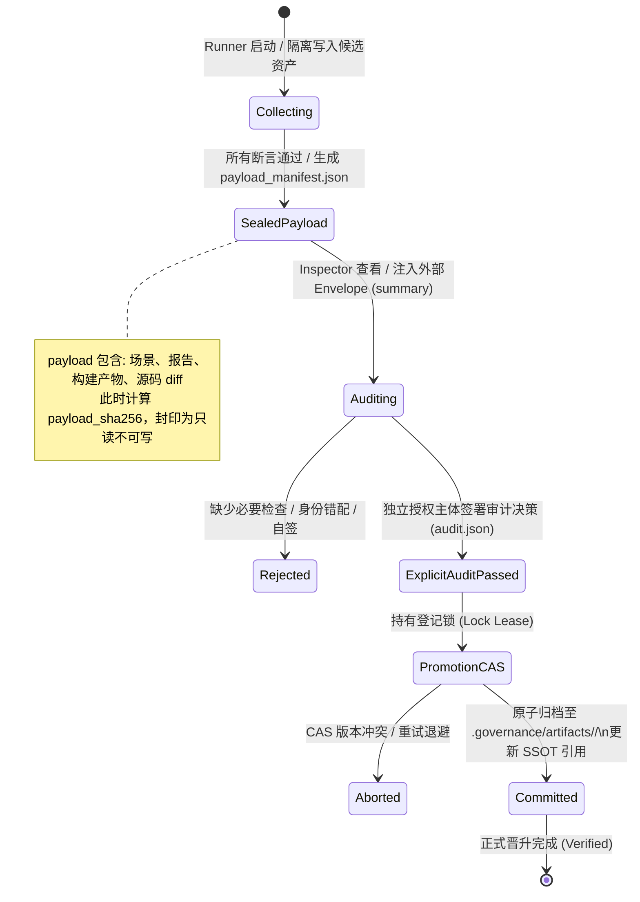
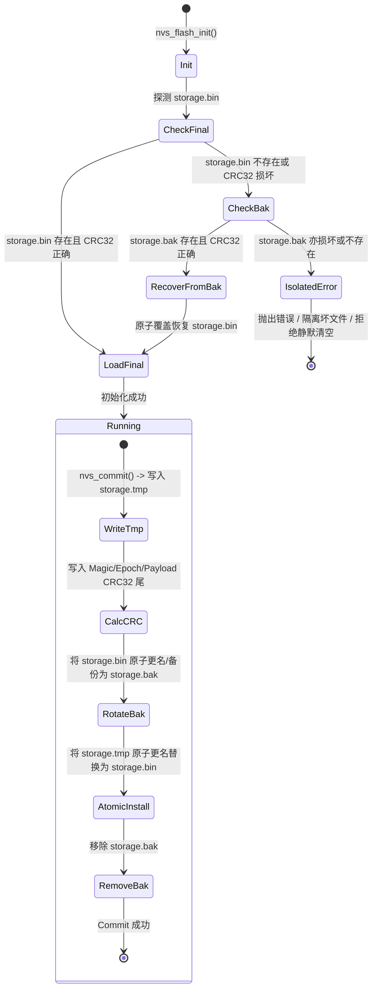

<!-- SPDX-License-Identifier: GPL-3.0-only -->
# ESP-IDF Checklist 与 Loop 工程：问题、解决方案及验收计划

| 项 | 内容 |
|---|---|
| 计划编号 | `PLAN-20261009-ESP-IDF-LOOP-ISSUES-AND-REMEDIATION` |
| 日期 / 修订 | 2026-10-09，Asia/Shanghai；v1.1 架构深度修订版 |
| 状态 | **Draft / 待评审、待实施**；本文完成问题登记与方案设计，不代表代码整改或交付完成 |
| 目标 | 将上一轮分析转为可定位、可实施、可验收的问题账本，收敛代码规范、维护性、可扩展性及证据可信度缺口；建立真实防线与分批迁移路线 |
| 复核源码基线 | `c53d4de79033768681269cd31816ef7ad54c9a87`；创建本文前工作区干净，与上一轮审查一致 |
| 清单数据基线 | SHA-256：`3cab0a0e97b0197409edcb62f50e8bf03352d7a5ac6a2a8bc9ee9a68905d0a6a` |
| 上轮整改计划 | [2026-10-08 加固与整改计划](2026-10-08-esp-idf-verified-remediation-and-loop-hardening-plan.md) |
| 现行技术设计 | [Loop 可靠性契约](../../zh/tech-designs/esp32/esp-idf-loop-reliability-contract.md)、[Batch 0 证据契约](../../zh/tech-designs/esp32/esp-idf-batch0-evidence-contract.md)、[防假绿验证引擎契约](../../zh/tech-designs/esp32/esp-idf-anti-false-green-verification-engine-contract.md) |
| 相关历史评审 | [Checklist 深度评审](../../reviews/esp32/2026-10-08-esp-idf-verified-checklist-deep-review.md)、[原闭环评审](../../reviews/esp32/2026-10-08-esp-idf-verified-remediation-closure-review.md) |
| 活设计规范 | [Wasm 仿真入口](../../zh/design/04-wasm-simulation/00-README.md)、[一致性规范](../../zh/design/04-wasm-simulation/04-assurance/01-consistency-spec.md)、[代码约定](../../zh/design/07-platform-governance/coding-conventions.md) |
| 治理依据 | [分类规范](../../../wink-micro-app/vendor/esp_idfv61/.governance/specs/CLASSIFICATION-SPEC.md)、[PLAYBOOK](../../../wink-micro-app/vendor/esp_idfv61/.governance/specs/PLAYBOOK.md)、[治理 SOP](../../../.agents/skills/governance-sop-esp/SKILL.md) |
| 决策依据 | [ADR-0001](../../decisions/core/0001-error-code-sign-convention.md)、[ADR-0004](../../decisions/core/0004-static-dispatch-vs-runtime-ops.md)、[ADR-0012](../../decisions/core/0012-contract-honesty-over-silent-degradation.md)、[ADR-0091](../../decisions/unisim/0091-esp-idf-multi-config-orthogonal-schema.md)、[ADR-0092](../../decisions/unisim/0092-esp-idf-simulation-governance-and-capability-charter.md) |
| 授权范围 | 编写问题与解决方案文档；本次未开始代码整改、历史重验、审计签署或正式晋升 |

## 1. 结论与阅读边界

架构与治理方向有合理基础，但当前实现不足以支持“整个系统已可靠闭环”的结论。最直接的反例是：Gate 1 与历史凭据核验均通过，当前 SPI 门面源码却无法通过语法检查；若只按已有工件、状态字符串和测试数量判断完成，会继续遗漏真实缺陷。

应保留 SSOT、多配置正交模型、POD / 静态分发、真实错误传播、候选收集与正式晋升分离，以及已有严格报告校验的成果。整改重点是把这些约束接入所有实际入口，并补足与生产行为相关的测试，而非以脚本或文档数量衡量质量。

**系统边界与外部强前置依赖澄清**：
1. **本计划的核心定位**：聚焦于 **Loop 自动化工程基础设施、执行环境强隔离、变异证伪执行、摘要密封与晋升事务** 的整改（收敛 I-01～I-19）。
2. **底层 C 驱动与业务场景真实性前置条件**：[Checklist 深度评审](../../reviews/esp32/2026-10-08-esp-idf-verified-checklist-deep-review.md) 识别的底层 C 驱动缺陷（S-01 GPTimer 返回系统时钟、S-02 HWTimer 回调重载注销、S-03 ADC 造假采样、S-05 SPIFFS 双后端分裂）与场景虚假回环（Q-01 DAC 回读输入等），属于固件运行时与场景真实性范畴。
3. **交付规约**：本计划保障 Loop 治理引擎对上述驱动缺陷具备 100% 拒收和证伪能力；历史 46 项配置在 W6 的全量转绿与正式交付，**强依赖于底层 C 驱动修复与业务场景重构的完成**。在此之前，W6 仅在 3 项 Pilot 试点上闭环整改引擎本身（W6a），不得预先假定 46 项能无条件一次性全绿。

本文登记 **19 项问题**，拆分了上轮答复中合并描述的缺口。第 3 节给出总账，第 4 节逐项说明，第 5～8 节约束实施、验证与历史迁移。所有问题初始状态均为 **Open**，所有方案均为 **Proposed**。

“完整”指本轮已识别问题均有证据、方案、责任角色、任务和验收映射，不代表穷尽整个仓库的所有潜在缺陷。未做全面 C 风格普查、所有 target 编译或所有业务仿真；不能据本文声称这些范围已经通过。

本文是上轮计划的补充整改计划。原只读评审保留历史原文；其完成声明应结合本轮反例重新复核，不能覆盖本文尚未关闭的问题。本文不修改 `delivery_state`、审计记录、历史证据或自动生成的 `CHECKLIST.md`。

## 2. 已执行验证与证据强度

### 2.1 当前登记与本轮只读结果

2026-10-09 重新核对，结果如下：

| 证据 ID | 已执行检查 | 结果 | 能证明的范围 |
|---|---|---|---|
| E-01 | 清单 SSOT 统计 | 478 个条目、479 个执行配置、46 个 verified；看板标记 4 项 Twin-Proof | 登记状态；不能替代逐 claim 验收 |
| E-02 | `run_gates.py --gate 1` | 12 executed、0 skipped、0 errors、0 warnings；退出 0 | 当前 Gate 1 接受正式登记与载体 |
| E-03 | `evidence_verifier.py --verify-all` | 46/46 accepted；退出 0 | 当前核验器接受现有历史凭据 |
| E-04 | 当前 `esp_spi.c` 的 GCC `-fsyntax-only` | 退出 1；251、252 行引用两个未声明标识符 | 当前仿真门面存在可编译性缺陷；不是完整 Wasm/ESP32 构建 |
| E-05 | 46 个 verified 配置的身份与证据字段检查 | 均为 `wasm_browser / esp32 / standard`；其 evidence 无 `source_sha256 / source_digest / build_manifest_ref / package_sha256` 字段 | 正式登记尚无这些来源绑定字段；不推断所有历史目录均无补充材料 |

上轮会话另执行了以下**内存隔离复现**，当前相关代码未变化：

| 证据 ID | 复现方法 | 实际结果 | 限制 |
|---|---|---|---|
| E-06 | 对同一个场景名、target、matcher 不匹配但步数相同的虚拟报告，调用两个生产校验函数 | `verify_execution_report` 接受；`validate_scenario_report` 拒绝 | 证明接受策略不一致；没有运行固件 |
| E-07 | 调用生产 `PromotionService`；文件读写、复制、替换全部映射至内存字典 | 缺 checks、报告、ProofPlan、auditor 的包仍返回成功，虚拟登记变为 verified | 证明业务前置条件缺失；不证明真实磁盘事务正确 |
| E-08 | 用虚拟文件复现 pipeline 的摘要顺序，再调用 Inspector 的实际摘要函数 | 密封摘要与审计摘要不相等 | 证明摘要覆盖范围和写入顺序冲突；没有生成交付包 |
| E-09 | 实例化 dry-run Runner，mock 候选集合和 `execute_app` 的 `KeyboardInterrupt` | 预期 2 项、实际处理 0 项，退出码仍为 0 | 证明汇总退出逻辑缺陷；没有启动 Agent 或仿真 |

这些结果在本文中是可复核的诊断记录，未保存为正式运行证据包，也不构成审计签署。第 7 节的真实集成验收不能由上述 mock 复现代替。

### 2.2 问题分类与优先级

- **编译 / 内存 / 生命周期规范**：针对 C 实现及资源管理；仿真专用门面不强行作为物理 ESP-IDF 驱动编译。公共 PAL/App 的双 target 约束仍适用。
- **契约缺口**：已有技术合同要求行为成立，但当前执行或接受路径未兑现。
- **维护性判断**：重复配置、职责混杂和隐式状态等判断，不能直接把 C 的行宽、参数数限制套到 Python。
- **P1**：优先整改；可能导致当前代码不可用、数据/资源恢复失败、未完成任务被接受或证据错误晋升。
- **P2**：维护与扩展缺口；需在扩大领域、并发或配置规模前完成。

静态确认指出代码中的条件与路径；不把尚未执行的崩溃、并发或硬件实验写成“本轮实跑已失败”。

## 3. 问题总账与任务归属

路径缩写：`G` = `wink-micro-app/vendor/esp_idfv61/.governance/`。下列角色是拟承担责任的工程角色，不代表已指定具体人员或取得审计签署。

| ID | 问题 | 优先级 / 性质 | 当前证据 | 工作包 / 责任角色 | 验收 ID |
|---|---|---|---|---|---|
| I-01 | SPI reset 引用已删除全局变量 | P1 / 编译 | E-04 | W1 / C 门面维护者 | RT-01 |
| I-02 | NVS 替换中断后缺少启动恢复 | P1 / 生命周期 | 静态确认 | W1 / 存储维护者 | RT-02 |
| I-03 | Agent、运行时与缓存写边界未完整隔离 | P1 / 契约 | 静态确认 | W2 / Loop 执行维护者 | RT-03 |
| I-04 | 子孙进程与继承管道回收不闭合 | P1 / 契约 | 静态确认 | W2 / 进程适配维护者 | RT-04 |
| I-05 | 固件变异只生成补丁，没有执行证伪 | P1 / 契约 | 静态确认 | W3 / 证据引擎维护者 | RT-05 |
| I-06 | build/run manifest 仍有登记贴标与固定结论 | P1 / 契约 | E-05、静态确认 | W2 / 构建适配维护者 | RT-06 |
| I-07 | 正式核验与候选核验接受策略不同 | P1 / 契约 | E-06 | W3 / 核验器维护者 | RT-07 |
| I-08 | 包摘要自引用、覆盖范围与密封顺序冲突 | P1 / 契约 | E-08 | W4 / 包格式维护者 | RT-08 |
| I-09 | Inspector/晋升前置条件与证据映射不完整 | P1 / 契约 | E-07、静态确认 | W4 / 发布维护者、独立审计者 | RT-09 |
| I-10 | 晋升未持锁、CAS 不在提交临界区、重试有副作用 | P1 / 事务 | 静态确认 | W4 / 发布维护者 | RT-10 |
| I-11 | 批次中断、空选与续跑缺少完整性判定 | P1 / 契约 | E-09、静态确认 | W5 / 调度维护者 | RT-11 |
| I-12 | 损坏注册表被当作空状态，冻结记录可消失 | P2 / 错误处理 | 静态确认 | W5 / 治理状态维护者 | RT-12 |
| I-13 | 新领域准入接受空 claim/观察/recipe/负例 | P1 / 契约 | 静态确认 | W5 / 领域准入维护者 | RT-13 |
| I-14 | 推广不绑定完整试点集合，冻结可被成功结果覆盖 | P1 / 契约 | 静态确认 | W5 / 推广维护者 | RT-14 |
| I-15 | 缺陷回灌只写报告，未强制失效旧凭据 | P1 / 契约 | 静态确认 | W5 / 影响分析维护者 | RT-15 |
| I-16 | 可观测性按 success 推算检查结果 | P2 / 维护性 | 静态确认 | W5 / 调度与指标维护者 | RT-16 |
| I-17 | 部分对抗测试不触达待验实现 | P1 / 验收 | 静态确认 | W0、W6a / 测试维护者 | RT-17 |
| I-18 | Lane、能力、字典契约及编排职责分散 | P2 / 维护性 | 静态确认 | W2、W5 / 工具架构维护者 | RT-18 |
| I-19 | 完成声明与可证明的执行范围不一致 | P2 / 文档治理 | E-01～E-09、原计划/评审 | W0、W6a、W6b / 计划维护者、独立复核者 | RT-19 |

## 4. 逐项问题与解决方案

### I-01：SPI reset 引用已删除的 EEPROM 全局变量与外设模型耦合

**位置与触发：** [esp_spi.c](../../../wink-micro-os/frameworks/esp_idf/src/drivers/esp_spi.c)，`spi_device_t` 已在 20～21 行持有 EEPROM 状态，但 `esp_spi_reset()` 的 251～252 行仍引用旧全局变量。新编译该翻译单元即触发 E-04，不依赖业务是否访问 SPI。同时，`spi_device_t` 内部硬编码了 `EEPROM_AT93C46D_SIZE 128` 及其协议解析，通用总线门面与特定从设备模型发生架构耦合。

**影响与原因：** 实例化重构漏掉 reset 消费者；旧 Wasm 与 Python 门禁不能发现当前 C 编译回归。更深层的架构影响是：若仅在总线 reset 中按实例清理 EEPROM，会将单一从机模型永久硬编码在通用 SPI 总线上，破坏通用外设驱动边界。

**解决方案：** 
1. 语法与生命周期修复：`esp_spi_reset()` 逐实例清理外设模型、写使能、token、配置和 PAL 资源；统一槽位初始化/释放语义，保持 POD 与命名 API。严禁重新引入共享 EEPROM 全局变量来消除编译错误。
2. 驱动解耦契约：在通用 `spi_device_t` 中落实 **SPI 总线控制器与从机设备模型的解耦契约**，引入设备模型类型枚举（`enum spi_emulated_model { SPI_MODEL_NONE, SPI_MODEL_AT93C46D, ... }`）；非 EEPROM 或未建模设备默认提供通用环回/高阻行为，禁止将单一从机行为假定为所有 SPI 设备行为。

**验收 RT-01：** 当前源码语法检查通过；执行已有 [test_esp_spi.c](../../../wink-micro-os/frameworks/esp_idf/test/core/test_esp_spi.c) 并补双器件隔离、remove/re-add、同进程 reset、旧句柄拒绝用例；检验非 EEPROM SPI 设备配置不被误解析为 AT93C46D；随后完成实际 Wasm 构建及 SPI 示例回归。语法通过不能替代运行结果。

**依赖 / 产物：** W0 冻结失败反例后由 W1 修复；保留编译诊断、当前构建身份和真实回归回执。

### I-02：NVS 两次 rename 之间存在恢复缺口与平台文件语义差异

**位置与触发：** [esp_nvs.c](../../../wink-micro-os/frameworks/esp_idf/src/core/esp_nvs.c)，`nvs_commit()` 540～555 行先删除旧 `.bak`、再把 final 改名为 `.bak`，最后把 tmp 改名为 final；`nvs_flash_init()` 153 行附近只读取 final。若在两个 rename 之间退出，重启会遇到 final 缺失，初始化没有选择有效备份的协议。此外，Windows 下 libc `rename()` 在目标文件存在时会失败（`EEXIST`），与 Linux 原子覆盖语义不同。

**影响与原因：** 完整旧数据仍可能位于 `.bak`，却被当作无存储；下一次提交还可能清除仅存备份。同步失败后的简单回滚不足以承担崩溃恢复。

**解决方案：** 
1. **二阶段提交（2PC）与自愈状态机**：
   - 提交期：写入 `storage.tmp`，头部写入 Magic、Epoch、版本号与条目数，尾部写入 Payload CRC32；执行 `fflush()` 与 `fsync()`；
   - 轮换期：根据平台文件语义执行安全替换。Windows 使用 `ReplaceFileW` / `MoveFileExW(MOVEFILE_REPLACE_EXISTING)`，POSIX 使用同卷原子 `rename`；备选路径安全维护 `storage.bak`；
   - 启动自愈期：`nvs_flash_init()` 优先验证 `storage.bin` 的 CRC32；若缺失或损坏，探测并校验 `storage.bak`；若 `bak` 有效则原子自愈恢复为 `bin`；若两者皆损坏，显式报错并隔离损坏文件（如重命名为 `.corrupted`），**严禁静默格式化为空存储**。
2. 架构边界限定：明确该文件状态机仅适用于 Host/Wasm 仿真 Mock，严禁混同物理 ESP32 上的 Flash Wear-Levelling 扇区驱动。

**验收 RT-02：** 在写 tmp、flush、备份建立、安装 final、清理备份各边界注入失败/进程退出；重启后只能读到完整旧值或完整新值，不能静默变为空状态；覆盖首次提交、损坏 CRC、已有备份、占用及恢复失败。扩展现有 NVS I/O 错误测试，并验证正常重复提交。

**依赖 / 产物：** W1；记录恢复状态表、故障点及重启读回值。进程退出实验不扩大宣称为物理 Flash 断电可靠性证明。

### I-03：复制 App 尚未形成强制执行隔离与沙箱分级

**位置与触发：** [pipeline.py](../../../wink-micro-app/vendor/esp_idfv61/.governance/tools/loop/pipeline.py) 258～274 行复制 App 并明确保留共享运行时/缓存；[agent.py](../../../wink-micro-app/vendor/esp_idfv61/.governance/tools/loop/agent.py) 149～157 行从仓库根目录执行 Agent，默认部分 CLI 带跳过权限参数。改变 cwd 或在 Prompt 中约定允许路径，不是文件系统写边界。在 Windows 本地开发机环境下，缺乏容器环境时易造成跨根误写。

**影响与原因：** authoring、failover、构建可能污染正式源码、共享缓存或另一 attempt。现有拒绝 `--auto-heal` 的行为是合理限制，应保留至隔离验收通过。

**解决方案：** 落地 RunContext，显式携带只读来源快照、候选写根、缓存命名空间、attempt 身份与预算。在 Windows 开发机与 CI 环境建立 **三级沙箱防御机制（Defense-in-Depth）**：
- **Tier 1 (CI / 晋升强隔离)**：采用容器或受限操作系统环境执行；
- **Tier 2 (本地开发代理隔离)**：采用 Proxy Ingestion 模式，Agent 仅允许向 stdout 输出结构化场景/补丁 JSON，由宿主程序校验白名单相对路径后安全写入 candidate 目录；
- **Tier 3 (事后硬门禁)**：执行端在运行前后调用 `git status --porcelain`，除候选写入目录外，若正式代码、治理配置或历史凭据发生任何脏写，立即硬熔断并回滚工作区。
共享运行时采用不可变快照或受验证的只读依赖；缓存按依赖指纹隔离。解析规范化路径、链接/junction 和跨根写入；能力不足时拒绝执行，不声称强隔离已完成。

**验收 RT-03：** 真实 Agent/受控测试进程尝试写正式源码、历史凭据、兄弟 attempt 与链接跳转目标均不生效；正常候选写入成功；failover 不继承半成品；前后正式资产摘要相同。白名单函数的 mock 单测只作辅助。

**依赖 / 产物：** W2；RunContext 版本合同、实际隔离机制探测及越界拒绝回执。隔离方案若改变现行架构约束，先形成 Proposed ADR。

### I-04：进程监督缺少稳定的子孙进程归属与防逃逸挂起注入

**位置与触发：** [process_supervisor.py](../../../wink-micro-app/vendor/esp_idfv61/.governance/tools/loop/process_supervisor.py) 95～116、130～139 行；Windows 依靠 `taskkill /T`，非 Windows 仅向父 PID 发信号；Agent 和插件构建还直接调用 `subprocess.run`。父进程先退、孙进程继承管道时，父 PID 的清理不能证明后代已终止；Windows 下从进程创建到 Job Object 绑定存在竞态窗口。

**影响与原因：** 旧 attempt 仍可写文件，`communicate` 等待 EOF，failover 与后续运行受到残留资源影响；吞掉回收异常使结果无法复核。

**解决方案：** 所有 Agent、构建器、插件与运行器走一个 supervisor。
1. **Windows 挂起注入防逃逸**：使用 Win32 API 以挂起模式创建进程（`CreateProcessW` 带 `CREATE_SUSPENDED`），将句柄分配至 Job Object 并配置 `JOB_OBJECT_LIMIT_KILL_ON_JOB_CLOSE` 后，再调用 `ResumeThread` 启动执行，杜绝孙进程在绑定前逃逸；POSIX 平台使用独立 session/process group。
2. **全生命周期回收保障**：实现启动失败、timeout、Ctrl+C、控制器退出、父进程先退的清理路径；关闭管道设置独立超时限期，避免 `communicate` 永久挂死，保留截断日志；清理未完成时停批并输出缺口，不以兜底命令退出码替代清理证明。

**验收 RT-04：** 使用真实多级进程、继承 stdout/stderr、父进程先退、回收期间派生、控制器异常退出、共享进程误杀防护及文件占用耗尽用例；记录归属、存活状态和回收时长。独立 watchdog 限制测试自身挂死。

**依赖 / 产物：** W2；各支持平台的回收回执。尚未实测的平台明确待验。

### I-05：通用 pipeline 没有执行固件依赖和实现变异闭环与算子控制

**位置与触发：** [pipeline.py](../../../wink-micro-app/vendor/esp_idfv61/.governance/tools/loop/pipeline.py) 386～402 行只生成 `firmware_mutation.patch` 与元数据，未应用 `mut_code`，也未构建/运行变异。此前执行的 checks 主要是 baseline、assertion self-check、recovery。

**影响与原因：** matcher 自检可以失败，而真实业务缺陷仍通过；补丁、算子数量、witness 文本不能证明缺陷生效或被检出。同时，若对所有变异均全量编译 Wasm，将面临编译爆炸与流水线超时。

**解决方案：** 
1. **逐 Claim 证伪闭环**：先冻结逐 claim ProofPlan 与独立复核，再分别执行固件依赖和有效实现变异。为每个实验创建隔离源码/资产目录，应用受控补丁、构建并验证实际加载产物。
2. **双层变异架构与算子预算**：
   - **L1 零编译仿真注入（优先）**：通过仿真环境接口注入故障（如总线丢包、时钟停滞、GPIO 浮空、CRC 错误），毫秒级执行，不触发构建；
   - **L2 固件源码编译变异（受控）**：针对核心逻辑分支与不变量，严格限制每个 Claim 不超过 2 个变异算子，并建立以 `(source_sha256, mutant_patch_sha256)` 为键的编译缓存；
3. **变异击杀判定矩阵**：仅接受指定业务断言在合同窗口内的有效失败；编译错误、链接失败、未知信号、非目标断言失败独立分类，严禁计为有效业务击杀；无适用算子时保留缺口，不自动豁免。

**验收 RT-05：** 正确固件通过；只改 matcher 不能填满固件依赖槽；有效业务变异触发预定断言失败；旧 Wasm、编译失败、未知信号及其他断言失败不能记为击杀；真实变异存活时禁止候选就绪；恢复在成功和失败路径均执行并留证。

**依赖 / 产物：** W2 的实际构建身份与 W3 的共用接受策略；逐 claim 原始报告、补丁、产物关联、语义见证及恢复回执。

### I-06：构建与运行身份仍存在贴标和固定结论

**位置与触发：** [pipeline.py](../../../wink-micro-app/vendor/esp_idfv61/.governance/tools/loop/pipeline.py) 180～188 行仅摘要 App 输入；321～325 行从登记复制 backend/SoC/profile；426～448 行的 manifest 把 `fast_relink_status` 固定写成 `complete_clean_rebuild_verified`，没有实际依赖认证。E-05 同时显示正式 evidence 尚无上述来源绑定字段。

**影响与原因：** 运行时、头文件、宏、工具链或缓存变化可能没有进入有效指纹；仅 device-tree MCU 相等不能证明实际 backend/profile 与构建身份全部对应。

**解决方案：** 由构建器或有生产依据的公开适配器输出实际依赖、宏/参数、工具版本、产物及 ABI 身份；collector 记录原始命令和回执，不补造 Runner 字段。构建缓存按依赖闭包失效；只有可证明安全的快速链接才允许复用，否则记录完整构建及其依据。冻结环境锁，在运行、恢复和晋升边界检查漂移。

**验收 RT-06：** 分别变更 App、共享头文件/驱动、生成配置、宏、插件、工具与链接参数，检出正确失效或安全回退；快速/完整构建对照轨迹一致；贴换 backend/SoC/profile、旧产物和运行中漂移均拒绝。真实 exports/签名检查不能由手写能力名单代替。

**依赖 / 产物：** W2；版本化 source/build/run manifest、缓存决定及漂移回执。跨仓仅使用公开 CLI、ABI 和报告合同，新增能力不先假设已实现。

### I-07：正式、候选和旧写入入口未共用接受策略

**位置与触发：** [evidence_verifier.py](../../../wink-micro-app/vendor/esp_idfv61/.governance/gates/evidence_verifier.py) 的 `verify_execution_report()` 与 [report_contract.py](../../../wink-micro-app/vendor/esp_idfv61/.governance/gates/report_contract.py) 的 `validate_scenario_report()` 接受强度不同，见 E-06。pipeline 298～303 行调用正式 Gate 1，也不能证明复制后候选已通过相同语义门禁。

**影响与原因：** 修正候选路径后，正式核验、旧 `--write-app` / `-WriteEvidence` 或准入入口仍可能走宽松路径；步骤数一致被误当作场景/业务一致。

**解决方案：** 提取纯只读接受策略，复用严格报告结构、身份、逐步 matcher/观察和诊断检查，并在上层增加实际构建身份及逐 claim 完整性。正式核验、collector、Inspector、晋升和准入均消费同一策略；候选正常场景显式调用同一语义校验器。实验 mutant 按实验合同检查，不混入正式载体扫描。旧入口仅收集候选或受同等晋升前置条件约束。

**验收 RT-07：** 同一借用/缺项/无效观察样本在所有正式接受入口都拒绝；合法零值、稳态输出、自主闪灯及支持的 fail-fast/pending 格式仍通过。不能通过删除历史格式支持来掩盖接受策略不一致，需版本化兼容与显式诊断。

**依赖 / 产物：** W3；纯校验 API、入口清单与逐入口契约测试。历史诊断读取可以兼容，但不得自动升级为新合同下的合格发布包。

### I-08：包摘要覆盖范围及密封时序不一致与跨平台归一化

**位置与触发：** [pipeline.py](../../../wink-micro-app/vendor/esp_idfv61/.governance/tools/loop/pipeline.py) 455～475 行先计算摘要，再改写被摘要覆盖的候选文件；[inspect_candidate.py](../../../wink-micro-app/vendor/esp_idfv61/.governance/tools/inspect_candidate.py) 19～27 行又包含 summary/audit 等文件。E-08 表明正常路径的审计摘要与 summary 摘要不相等。此外，Windows (CRLF) 与 Linux (LF) 的文本行尾差异可能导致源码哈希不可预测漂移。

**影响与原因：** 正常包无法稳定绑定；将摘要写入其自身参与摘要的内容还会形成自引用。跨平台换行符差异会导致 CI 与本地摘要失配。

**解决方案：** 
1. **Payload 与 Envelope 严格分离**：定义版本化 payload 清单与外部 envelope。payload（源码、配置、场景、报告、二进制产物）在计算摘要前完全定稿且密封后只读不可改；外部 summary、audit、promotion receipt 位于 envelope，不参与自身绑定的 payload 摘要。
2. **规范化摘要规范（Canonical Digest Spec）**：
   - 路径格式：相对路径一律使用正斜杠 `/`，区分大小写；
   - 文本行尾归一化：在计算哈希前，源码、补丁与文本文件统一归一化为 `LF` 换行符；
   - 结构化数据序列化：JSON 清单序列化严格采用 RFC 8785 (JSON Canonicalization Scheme, JCS)，消除字段键序与空白符差异；
   - 归档封印：以固定 mtime=0、uid/gid=0 的归一化 tar 流计算 `payload_sha256`。
collector、Inspector、晋升器调用同一实现，每次消费重算实际字节。

**验收 RT-08：** 正常收集→查看→审计→晋升全过程 payload 摘要一致；跨 Windows/Linux 环境重算哈希严格相同；添加合法 envelope 不改变 payload；修改/删除/新增 payload 文件、路径碰撞、链接跳转或密封后改写均拒绝；版本不同按显式兼容策略处理。

**依赖 / 产物：** W4，依赖 W3；包格式合同、共用摘要实现及正确/篡改包样本。SHA-256 只表示完整性绑定，不称为数字签名。

### I-09：Inspector 与晋升缺少完整业务及审计前置条件

**位置与触发：** [inspect_candidate.py](../../../wink-micro-app/vendor/esp_idfv61/.governance/tools/inspect_candidate.py) 75 行的 `all([])` 可把空检查集显示为就绪；签署路径不核对完整性，CLI 默认 auditor 为 `arch_team`。[promotion_service.py](../../../wink-micro-app/vendor/esp_idfv61/.governance/tools/promotion_service.py) 59～81 行只看状态、ACCEPT 和两个声明摘要；E-07 中无报告/ProofPlan/auditor 仍可晋升。

**影响与原因：** 文件存在或字符串 ACCEPT 被当成有效审计；注册 evidence 又直接从 execution 复制 backend（115 行），混淆 `wasm_browser` 与 evidence schema 的 `wasm_simulation`，并可能保留旧报告字段。

**解决方案：** 所有展示/审计登记/晋升使用 W3 完整性结果；逐项验证注册身份、范围、配置适用性、ProofPlan、检查集合、门禁/回归、payload 字节及来源。审计必须来自明确授权的独立主体（机器候选阶段标记为自动化引擎审计，正式晋升阶段必须持有独立 GPG 或 CI 授权 Token，严禁 CLI 默认填充人工身份），绑定同一 App/config、payload 和合同版本。由验证后的本轮证据完整构造正式 evidence，明确 execution backend 与证据类型的映射；路径来自可信注册信息并做包含性检查。

**验收 RT-09：** 空 checks、缺报告、缺必需检查、缺/不适用/自签审计、REJECT/NEEDS_EVIDENCE、身份错配与篡改包均不能显示为可接受或晋升；完整正确包成功后 Gate 1、正式 verifier 与看板口径一致；旧报告引用不得残留补齐新证据。

**依赖 / 产物：** W4，依赖 I-05～I-08；前置条件差异表、独立决定及本轮证据读回。本文不指定或伪造任何实际审计主体。

### I-10：晋升事务与 CAS 缺少并发保证与锁租约自愈

**位置与触发：** [promotion_service.py](../../../wink-micro-app/vendor/esp_idfv61/.governance/tools/promotion_service.py) 声明了 `lock_file` 却未持锁；84～86 行在更新前比较摘要，89～125 行随后重新读写；107～109 行删除已有 archive 后复制；128 行对整个有副作用的事务重试。若进程异常退出，裸锁文件可能造成死锁。

**影响与原因：** 并发操作可能都通过 CAS 后丢更新；失败重试可能删除已归档包；单文件 replace 不等于“包＋登记＋审计引用”的一致事务，读回仅检查 verified 也不足以证明本次请求已生效。

**解决方案：** 
1. **带租约的文件锁与死锁自愈（Lock Lease Protocol）**：
   - 锁文件写入 `pid`、主机标识、时间戳与租约有效期（`lease_ttl`，默认 30s）；
   - 竞争者遇锁时探活持有进程并检查超时，超时自动安全接管并记录过期锁清理审计回执，杜绝崩溃残留引发永久死锁；
   - 采用带抖动的指数退避重试（Exponential Backoff with Jitter）；
2. **两阶段原子归档与 CAS 切换**：
   - staging 包先完整校验并按内容摘要归档至不可变 CAS 目录（`.governance/artifacts/<payload_sha256>/`），同摘要重复发布幂等，异摘要不得覆盖；
   - 持锁后重新读取目标清单，校验期望版本，在临界区内原子更新引用与事务日志；仅重试幂等的文件操作。

**验收 RT-10：** 两 App 并发更新不丢失；同配置竞争显式冲突；重复请求幂等；在 staging/归档/登记切换/读回各阶段注入崩溃、磁盘错误与文件占用，重启后只生效完整旧包或完整新包；任何有效历史包不被删除；进程异常终止后残留锁自动超时自愈。

**依赖 / 产物：** W4，依赖 I-08/I-09；事务状态表、真实并发及崩溃回执。mock 文件系统不能承担该验收。

### I-11：批次中断、空选与续跑缺少完整性判定

**位置与触发：** [runner.py](../../../wink-micro-app/vendor/esp_idfv61/.governance/tools/loop/runner.py) 185～187 行收到 Ctrl+C 后直接 break；228 行只按已处理失败数和熔断标记返回；默认 assertion profile 空选也退出 0。E-09 复现了预期 2 项、实际 0 项仍退出成功。[pipeline.py](../../../wink-micro-app/vendor/esp_idfv61/.governance/tools/loop/pipeline.py) 的 checkpoint 只在末尾写为 COMPLETED，当前路径未见恢复加载与有效性核验。

**影响与原因：** 成功处理的子集被扩大解释为父批次完成；写出 checkpoint 文件不等于支持断点续跑。显式列表查询的合法空结果应与要求执行的空批次区分。

**解决方案：** 冻结精确父集合和每个子切片的 `(app_id, config_id)`；记录 expected/executed/completed/failed/unexecuted，最终按集合及必需检查闭包判定。中断/崩溃生成未完成状态并返回明确非成功；list/no-op 有独立口径。checkpoint 保存 attempt、合同、输入、环境及规则指纹，仅复用仍有效的密封结果；恢复缺项时新建 attempt，不重新贴成功标签。批次 ID 使用足以避免同秒冲突的唯一标识。

**验收 RT-11：** 首项前/中途/末项后中断、空选、limit 切片、部分 Lane 未执行、重复/额外配置、损坏或漂移 checkpoint 均有明确结果；未完成父批次不得成功；合法查询和完整批次通过。真实 CLI 中断测试与 E-09 的逻辑测试分别留证。

**依赖 / 产物：** W5，依赖 W2/W3；父子集合、生命周期账本、有效恢复/拒绝回执及退出码合同。

### I-12：损坏状态被静默重置为空，冻结保护可丢失

**位置与触发：** [batch_rollout.py](../../../wink-micro-app/vendor/esp_idfv61/.governance/tools/loop/batch_rollout.py) 53～63 行，读取异常返回空状态，写入直接覆盖；[defect_feedback.py](../../../wink-micro-app/vendor/esp_idfv61/.governance/tools/defect_feedback.py) 128～132 行存在类似默认回退。文件截断或 JSON 损坏后，原冻结/缺陷状态可能不再参与判定。

**影响与原因：** 不存在、损坏和版本不兼容被混为一类；恢复默认值可能使停止扩展的保护反向失效。

**解决方案：** 不存在时按明确 bootstrap 规则初始化；损坏、不支持版本和读取权限错误分别报错并拒绝相应操作，保留原文件。使用 schema/version 校验、唯一 tmp、原子替换及必要锁/日志；恢复只能来自已验证备份或显式审查决定。治理错误返回结构化诊断，禁止宽泛 `except: pass` 后继续接受。

**验收 RT-12：** 不存在、合法、截断、错误版本、占用及并发写入分别测试；损坏状态下冻结域不能被当作开放域，缺陷不能消失；正常首次初始化仍可运行。

**依赖 / 产物：** W5；状态读取结果类型、恢复规则和真实文件中断测试。

### I-13：新领域准入缺少逐 claim 和正反例完整性

**位置与触发：** [admission_service.py](../../../wink-micro-app/vendor/esp_idfv61/.governance/tools/admission_service.py) 157～179 行允许 `claims=[{}]`、空 observation/recipe；202～218 行只看样本顶层状态，`negative_sample={}` 未命中拒绝条件；ABI 判断来自手写 `KNOWN_EXPORTED_ABIS`。

**影响与原因：** 缺观察、缺有效 recipe、无业务结果的领域仍可能获得 `ADMISSION_ACCEPTED`；名单存在不能证明当前实际链接产物导出了正确能力。

**解决方案：** schema 与语义双重校验，逐 claim 要求稳定 ID、来源/配置条件、业务出口、观察能力、时限和必需检查。正反例必须绑定真实场景/报告、产物和目标 claim，并调用 W3 的校验策略；反例明确为有效业务缺陷，不接受基础设施失败替代。能力和 recipe 按实际后端/SoC/ABI 预检；自定义 recipe 有版本与独立复核。无能力返回缺口，不签发准入。

**验收 RT-13：** 空 claim、无来源、无观察、空 recipe、`{}` 负例、缺 actual、编译失败负例、错误 ABI/SoC、生成者自批均拒绝；完整正确领域包通过；未建模能力诚实输出 `CAPABILITY_GAP`。测试直接调用准入服务，真实 ABI 探测另有执行回执。

**依赖 / 产物：** W5，依赖 W2/W3；领域包 schema、能力来源、逐 claim 差异及准入回执。

### I-14：推广授权没有绑定完整试点集合

**位置与触发：** [batch_rollout.py](../../../wink-micro-app/vendor/esp_idfv61/.governance/tools/loop/batch_rollout.py) 的 `evaluate_pilot()`，137～191 行仅遍历调用者提供的结果；未核对创建时的 batch/config 预期集合。三项试点只提交一项 success 即可走扩展授权分支；该分支还直接写 `PILOT_PASSED`，覆盖原 FROZEN。

**影响与原因：** 任意成功子集可能授权扩展；冻结与解除冻结没有受控状态迁移。

**解决方案：** 评价入口必须接收并核对已冻结的 pilot manifest 与版本，逐精确配置绑定合格候选包，检查集合相等、无漏项/重复/额外项。失败后保留 FROZEN；解除冻结需显式整改依据和审查，且新 pilot 不复用失效结果。Runner 真正消费准入、冻结和推广决定，不能仅在独立工具里实现规则。

**验收 RT-14：** 缺两项、混入别批、重复结果、错 config、只有 success 无证据包、冻结域重交旧成功结果全部拒绝；完整试点通过后才授权指定范围和上限的扩展，且不能自动覆盖冻结理由。

**依赖 / 产物：** W5，依赖 I-09/I-11/I-12/I-13；冻结集合、候选绑定与状态迁移回执。

### I-15：缺陷回灌没有形成旧证据强制失效链

**位置与触发：** [defect_feedback.py](../../../wink-micro-app/vendor/esp_idfv61/.governance/tools/defect_feedback.py) 201～228 行仅生成应用级 `verified_stale_entries` 与报告；当前核验/晋升路径未见消费该报告的阻断。声明 `INVALIDATE_STALE_EVIDENCE_PACKAGES` 不等于实际失效。

**影响与原因：** 底层修复、规则或 recipe 漂移后，历史 verified 标签和旧产物仍可能被当作当前有效依据。

**解决方案：** 影响分析输出精确配置及来源依赖版本；建立所有正式接受入口必须查询的有效性依据，或在受控流程中更新既有 `stale` 状态并保持历史包不可变。报告本身不能独立承担强制力；依赖未知时保留缺口。重验、新审计、晋升后才能解除失效，不用刷新环境锁或更改摘要消除差异。

**验收 RT-15：** 变更共享 driver、gate、recipe、工具环境分别检出影响；未重验的受影响配置在 verifier/Inspector/晋升处一致阻断；未受影响配置仍有效；同 App 多配置不被粗粒度一起误接受；旧包可追溯且不被覆写。

**依赖 / 产物：** W5，依赖 W2/W3/W4；配置级依赖闭包、失效原因与消费回执。迁移不得新增 `delivery_state` 枚举。

### I-16：指标由 success 推算，缺少真实检查结果来源

**位置与触发：** [batch_observability.py](../../../wink-micro-app/vendor/esp_idfv61/.governance/tools/loop/batch_observability.py) 72～76 行将 success 直接换成基线/自检/恢复计数，存在 `firmware_mutation` 元数据又被算作击杀；[runner.py](../../../wink-micro-app/vendor/esp_idfv61/.governance/tools/loop/runner.py) 193 行实际不传 `candidate_meta`。失败类型还依赖 message 子串。

**影响与原因：** dry-run/候选阶段成功可能被显示成已执行检查；当前真实调用中的固件变异计数无法反映实验；文案变化可能改变熔断分类。

**解决方案：** 从已核验的 CheckResult 汇总，明确计划、已执行、接受、缺失/不适用、存活、基础设施失败和晋升冲突。每个计数可回溯到唯一 App/config/claim/check/attempt；去重策略和分母写入合同。使用结构化错误码，消息只用于展示；指标与发布判定消费同一状态，候选成功不推导审计或交付成功。

**验收 RT-16：** dry-run、只生成补丁、缺恢复、重复事件、专项 profile、部分批次和真实 mutation kill 的计数均准确；更改提示文案不改变熔断；从原始回执重算摘要得到同样结果。

**依赖 / 产物：** W5，依赖 W3/I-11；版本化指标定义、原始结果引用及汇总一致性测试。

### I-17：部分 AT 测试不触达生产行为

**位置与触发：** [test_adversarial_suite.py](../../../wink-micro-app/vendor/esp_idfv61/.governance/gates/tests/test_adversarial_suite.py)：AT-14/23 用 Python 字典表示 C timer；AT-19 只复制备份；AT-26 只检查自造对象缺 recovery；AT-28 比较固定数列；AT-29 仅运行单进程 hello。相应生产防线被删除或损坏时，这些断言仍可能通过。

**影响与原因：** 测试名和汇总数量表达的验证范围大于实际执行范围，无法证明缺陷敏感性与工程边界。项目已有真实 C tests，问题是没有用这些测试或真实集成覆盖所宣称的验收范围。

**解决方案：** 逐个 AT 拆出独立子例，标注单元/集成/端到端、生产入口、注入点和所需环境；拒绝路径调用生产校验/状态机/发布代码。C 生命周期调用实际 C 测试入口；时钟测试使用公开仿真合同并留真实语义轨迹；进程/文件事务用真实 OS 行为。采用已知缺陷变异验证测试敏感性，确保移除防线会使对应测试失败。

**验收 RT-17：** 第 7 节映射全部有原始回执与适用正确样本；AT-28 按原合同执行空闲/高负载各至少 20 次，而非生成替代数列；AT-29 真正创建多级后代与继承管道；必需测试跳过、缺环境或 mock 替代均不算阶段完成。

**依赖 / 产物：** W0 建反例、W6 完成验收；测试目录、敏感性记录、真实回执与覆盖差异表。各生产修复与能捕获该缺陷的测试一起提交。

### I-18：配置来源分散，核心编排与领域逻辑耦合

**位置与触发：** [runner.py](../../../wink-micro-app/vendor/esp_idfv61/.governance/tools/loop/runner.py) 83 行依赖一次带日期的 planning run，120～127 行与 [batch_rollout.py](../../../wink-micro-app/vendor/esp_idfv61/.governance/tools/loop/batch_rollout.py) 89～96 行各有 Lane 关键词表；`priority` 参数传入筛选但未实际过滤；选择先按 App 聚合 verified，随后再选配置，不能完整表达多配置任务。pipeline 同时承担配置、构建、实验、打包和调度产物，多处字典/字符串表示相同概念。

**影响与原因：** 新增领域/配置需修改多处表和分支，两个入口可能选出不同集合；临时实验目录被用作长期配置依赖，清理后改变行为；参数静默忽略降低工具可维护性。

**解决方案：** 为 ConfigKey、RunContext、ProofPlan、CheckResult、CandidatePackage、PromotionReceipt 建立最小版本契约及解析边界；配置级调度复用同一 resolver，Lane 来源成为可版本管理的持久配置。核心 pipeline 只编排，领域差异通过显式注册的 Python adapter/recipe 接入；共用进程、报告、摘要和状态存储实现。参数不支持时显式拒绝。C 层继续保持静态分发，不借此引入 ops/vtable。

**验收 RT-18：** 同一输入在 list/Runner/pilot/重验中选择集合一致；priority、lane、limit、scope 和 config 过滤真实生效；同 App 的 verified 与 planned 配置分别处理；删除旧 planning 目录不改变选择；新增代表性领域只需登记合同和 adapter，核心接受策略保持不变。

**依赖 / 产物：** W2/W5，先收敛合同再小步重构；配置来源说明、入口对照及扩展实例。此项是维护性判断，不要求把每个字典都替换成复杂框架。

### I-19：完成声明与可证明的验收范围不一致

**位置与触发：** 上轮实施计划和只读闭环评审宣称 L0～L6、V0～V1 全量完成；但 E-04～E-09 及 I-05/I-17 表明可编译性、接受策略、密封、完整批次和真实对抗行为仍有缺口。已有 46 个 verified 不能据此自动视为满足新合同。

**影响与原因：** 把入口存在、文件已生成、pytest 全绿或派生看板更新，扩大为真实端到端完成；后续开发可能在错误完成基线上持续扩展。

**解决方案：** 保留原只读评审及原始凭据；后续新增评审明确纠偏范围。可维护计划中的任务状态按实际回执更新，缺项标为未完成/待重验；形成问题→任务→实现→测试→运行回执→独立决定的追踪。重大新增决策按 Proposed ADR→Accepted→回写活规范流转，本文方案不能充当已接受决策。

**验收 RT-19：** 每个完成项都有生产行为对应的证据；原计划 L/F/V 与本计划 I/W/RT 的关系可双向检索；未执行或仅 SKIP 的验收不能勾选；历史诊断、候选完整、独立审计和正式交付分别呈现。

**依赖 / 产物：** W0/W6；差异账本、新的闭环评审及派生看板。本文不提前改写历史完成记录或签署审计。

## 5. 共同设计约束与目标执行链

### 5.1 接受判定必须由原始结果推导

拟实施的共用接受层应分别返回 schema/身份有效性、逐 claim 检查闭包、包完整性、审计适用性和可发布性，附稳定原因码及原始引用。建议的逻辑如下，**它是目标合同，不是当前可调用 API**：

```text
config = resolve_exact_registered_config(app_id, config_id)
context = freeze_context_and_actual_dependencies(config)
proof = validate_and_independently_review_proofplan(config, context)
checks = execute_required_checks(proof, context)
candidate = verify_candidate(config, context, proof, checks)
payload = seal_and_rehash(candidate)
audit = obtain_explicit_independent_decision(payload)
publish = verify_and_commit_under_registry_lock(payload, audit, expected_version)
readback = verify_committed_package_and_evidence(publish)
```

关键规则：

1. `candidate_ready` 是核验结果；不能由调用者声明的字符串建立可信性。Inspector 查看不产生审计，审计记录不能替代机器可验证的必需条件。
2. matcher 自检、固件依赖、实现变异、环境/时序、故障处理和恢复分别归档。对合法稳态/不变量不强加外部输入或变化；适用性由合同与独立复核决定。
3. 编译/加载失败、未知 target、缺 ABI、无效 actual、非目标断言失败和基础设施超时不能算作业务变异击杀。未知等价性保持未知，不能自动排除后获得通过。
4. payload 摘要、文件清单和 manifest 都有版本及实际来源；哈希不证明因果性或主体真实性。独立决定必须有可信授权依据，不只检查自填身份字段。
5. 进程成功、候选完整、审计接受和正式晋升是不同结果。批次按精确配置集合及检查闭包验收，汇总百分比不能替代集合相等。

#### 核心时序图 1：候选包生命周期与密封发布数据流



#### 核心时序图 2：NVS 启动恢复与原子提交状态转移



### 5.2 兼容、许可与边界

- `delivery_state` 保持 `planned | building | verified | stale | regressed`。候选、异常分类、准入与事务状态使用自己的合同，不能混入交付枚举。
- 正式镜像原厂业务源码不改；固件依赖/变异发生在隔离副本。`wink_sla.h` 与 `CHECKLIST.md` 继续由工具生成。
- 旧报告允许只读诊断；升级到新接受合同需要实际来源、适用检查与独立审计，不能补字段包装。execution 的 `backend` 与 evidence 的类型字段按 schema 分别映射。
- 公共 C/PAL 保持 POD、静态分发、负 `wink_status_t` 与定点 PWM；ESP/BSD 门面保留自身返回码/errno 合同。新增 PAL 遵守 ADR-0092 纯增量和目标适配要求。
- 外仓以公开 CLI、C-ABI、Manifest/报告合同交互；本文不引入或泄露其私有 TypeScript 实现路径。缺公开能力列为契约缺口并单独设计。
- 运行时、工具与测试分别遵守现行许可地图；厂商 SDK、`docs/vendors/` 和私有挂载不纳入归档提交。

### 5.3 需要先明确的设计选择与技术规范

| 选择 | 本文建议 | 决策完成标志与技术规约 |
|---|---|---|
| 包摘要与 envelope | 稳定 payload 清单＋外部 summary/audit/receipt，共用算法 | **规范化摘要规范 (Canonical Digest Spec)**：POSIX 相对路径 `/`；文本强制 `LF`；JSON 采用 RFC 8785 (JCS) 序列化；归档固定 mtime/uid/gid 计算 tar 流摘要 |
| 晋升一致性与防死锁 | 不可变归档＋登记锁内 CAS 切换引用＋日志恢复 | **锁租约协议 (Lock Lease Protocol)**：锁文件记录 pid/timestamp/lease_ttl=30s；探活与超时自愈；CAS 版本比对与指数退避重试 |
| NVS 存储恢复 | 后端可支持时原子替换，否则显式 WAL 恢复协议 | **2PC 与自愈状态机**：tmp->bak->bin 轮换，Magic/Epoch/CRC32 校验，损坏隔离拒绝静默清空 |
| 隔离与进程归属 | 实际写边界＋每 attempt 独立缓存/进程容器 | **三级沙箱与 Win32 挂起注入**：CI 容器强隔离，本地 Proxy 代理输入，事后 Git porcelain 脏写硬熔断；`CreateProcessW(CREATE_SUSPENDED)` 绑定 JobObject |
| 变异执行与算子控制 | 双层变异（L1仿真注入/L2源码变异）与算子预算 | **算子预算控制**：单 Claim 变异算子<=2；优先毫秒级仿真注入，源码变异建立哈希构建缓存；编译错误不计为击杀 |
| 历史有效性失效 | 配置级依赖版本及所有入口必查的有效性依据 | 旧包保留、失效生效、重验解除三条路径均有证据；双轨过渡保护历史只读消费 |

不提前占用 ADR 编号。实施时先检索当前编号与已有 Accepted 决策，避免重复决策；重大选择接受后立即回写活设计规范。单纯 bug 修复无需人为扩大为架构重写。

## 6. 分阶段实施计划

以下工作包均 **未开始**。按阶段出口推进，不设置无依据的工期承诺；可拆成独立逻辑提交。复杂代码变更须在本方案评审确认后开始，本轮授权仅用于完成文档。

| 工作包 | 任务与覆盖问题 | 前置条件 | 阶段出口与最小产物 |
|---|---|---|---|
| W0：冻结问题与失败基线 | I-17/I-19；冻结源码、数据、工具；为 I-01、I-07～I-11 等建立可捕获当前缺陷的反例；核对原 AT 实际范围 | 本文评审 | 问题状态/来源、可重复的失败回执、测试分层；未把当前失败写成通过 |
| W1：C 编译与存储恢复 | I-01/I-02；SPI reset/从机模型解耦；NVS 2PC/自愈协议及故障点测试 | W0；NVS 与 SPI 解耦方案明确 | 当前 C 可构建、真实驱动/存储回归和正常样本通过；分层/API/许可检查完成 |
| W2：上下文、隔离与实际身份 | I-03/I-04/I-06/I-18；三级沙箱防御、Win32 挂起注入与 JobObject；实际构建依赖、环境锁与 ABI | W0；隔离/进程方案明确 | 真实越界/后代/漂移测试通过；构建与运行身份可复核，保留 auto-heal 限制至其专属条件满足 |
| W3：共用核验与业务证据执行 | I-05/I-07；落地 AFG-Engine 规范：双极性流水线、反回环 AST 检测、静态 ABI 符号闭环、双层变异与算子预算控制；逐 claim 变异/故障及恢复 | W2；AFG-Engine 契约冻结，所选真实试点的 W1 修复就绪 | 正确、有效缺陷击杀、存活熔断、无效观察阻断及恢复分支均有真实回执；所有接受入口规则一致 |
| W4：密封、审计与事务发布 | I-08/I-09/I-10；RFC 8785+LF 规范化摘要、锁租约 TTL 自愈、CAS 原子归档与独立审计 | W3；包/事务选择冻结 | 正常端到端可发布；缺项/篡改/自签/冲突/崩溃拒绝或恢复；历史包不损坏，读回验证通过 |
| W5：调度与持续扩展 | I-11～I-16/I-18；配置级筛选、父集合、checkpoint 续跑、准入、冻结、有效性和指标接入 Runner | W3；涉及正式有效性/发布路径依赖 W4 | 精确批次、真实续跑、缺证据/冻结/失效阻断均成立；所有统计来自核验回执 |
| W6a：Loop 引擎闭环与 Pilot 试点验收 | I-17/I-19；AT 子例真实生产化改造，严格执行 AFG-Engine 协议（Canary 反向证伪、零回环、符号对账、白盒探针）；完成 3 个代表性应用试点全流程闭环（#001 Blink 纯逻辑、#002 NVS 存储、#003 UART Echo 通信） | W1～W5 必需出口完成 | 3 项 Pilot 试点端到端全绿回执、反向变异击杀回执、审计与晋升闭环；证明 Loop 治理引擎无漏洞 |
| W6b：历史 46 项分批治理迁移与对齐 | I-17/I-19；配合底层 C 驱动修复（S-01~S-05, Q-01~Q-06），按外设难度分波次（Wave 0/1/2）受控复验历史配置 | W6a 验通；底层驱动对应波次修复完成 | 分波次完成逐配置证据包、独立审计、授权晋升与新闭环评审；未修复项诚实保留缺口 |

W0 中的失败测试可以随对应修复一起细化，但每个测试必须证明能抓住其针对的缺陷。W4/W5 不得在 W3 只完成 matcher 自检时提前宣称完整候选可正式发布。

建议先修复编译/数据恢复与接受前置条件，再扩大并发与领域规模。阶段内发现新缺陷时登记新的稳定问题 ID、影响集与验收项，不以放宽接受条件结束阶段。

## 7. 验收矩阵与测试真实性要求

`RT-01～RT-19` 为**拟新增/补全的验收编号**，不是当前已存在或已经执行的测试名称；原 `AT-*` 作为需求来源保留，不用换名掩盖原覆盖不足。

| 验收 ID / 问题 | 关联原验收 | 必须触达的实际路径 | 必需正反例与最低证据 |
|---|---|---|---|
| RT-01 / I-01 | F1-S04、AT-23 | 当前 SPI 翻译单元、真实 C test、Wasm SPI 示例 | 编译通过、SPI 从机模型解耦、双设备隔离、reset/旧句柄；当前源码与产物身份 |
| RT-02 / I-02 | AT-19、F 存储回归 | NVS 提交、跨平台文件操作、重启初始化 | 2PC 提交边界/轮换失败、损坏 CRC、单备份及双损坏故障注入；完整旧/新值读回，拒绝静默格式化 |
| RT-03 / I-03 | AT-15/16/17 | 实际执行权限边界、候选写入器、Agent attempt | 三级沙箱防御验证，越界/链接/兄弟 attempt 拒绝，git status 脏工作区熔断；正式资产前后摘要 |
| RT-04 / I-04 | AT-17/18/29 | 全部执行入口与 OS 进程归属 | Win32 挂起注入与 JobObject 绑定、多级后代、继承管道、父先退/控制器崩溃、误杀防护；存活/时限回执 |
| RT-05 / I-05 | AT-05～12/23/30 | ProofPlan→改源/注入→构建→实际加载→目标断言→恢复 | 严格执行 AFG-Engine 双极性协议：L1仿真注入/L2源码变异、算子预算（<=2）、编译报错分类隔离；变异真实击杀（MUTANT_KILLED）与恢复回执 |
| RT-06 / I-06 | AT-02/03/13/32/35 | 实际构建依赖与公开运行/ABI 回执 | 标签错配、头文件/驱动/工具/配置/插件漂移；增量与完整构建对照 |
| RT-07 / I-07 | AT-01/03/04/06/26 | 所有正式接受与候选语义门禁入口 | 严格执行 AFG-Engine 反回环 AST 检测（VIOLATION_SELF_ECHO 阻断）、时延因果与 ABI 符号对账；相同坏样本全部拒绝；合法零值、稳态、pending 格式不误杀 |
| RT-08 / I-08 | AT-15/34 | 共用摘要与真实密封/查看/审计消费路径 | RFC 8785 JCS 键序无关性、LF 换行跨平台一致性；payload 改删增拒绝；envelope 不产生自引用 |
| RT-09 / I-09 | AT-26/27/34/35 | Inspector、审计登记、正式晋升、正式 verifier | 缺项/错身份/无授权/自签/旧决定均拒绝；完整本轮证据通过读回 |
| RT-10 / I-10 | AT-19/20 | 真实发布器、锁、磁盘与恢复入口 | Lock Lease 超时自愈、两 App/同配置并发、重复请求幂等、各边界崩溃与占用；无丢更新/历史损坏 |
| RT-11 / I-11 | AT-18/21/22 | CLI、父子批次与 checkpoint 恢复 | 空选、limit、部分 Lane、中断、重复/额外配置；未完成返回非成功 |
| RT-12 / I-12 | AT-19/22 | 实际治理文件读写与恢复 | 损坏/版本/占用/并发拒绝继续接受；合法 bootstrap 与恢复通过 |
| RT-13 / I-13 | AT-24/27/30/35 | 生产准入服务与实际能力预检 | 空 claim/观察/recipe/负例、错 ABI 与有效正确包；逐项差异 |
| RT-14 / I-14 | AT-21/26/34 | 创建试点→结果提交→授权→Runner 消费 | 不完整/别批/错 config/冻结拒绝；精确完整试点才允许有限扩展 |
| RT-15 / I-15 | AT-13/24/32/33 | 影响分析→有效性依据→所有接受入口 | driver/gate/recipe 变更、未知依赖、多配置；失效阻断与重验解除 |
| RT-16 / I-16 | AT-09/12/18/21 | Runner→CheckResult→指标与熔断 | dry-run/缺项/重复/专项结果；原始结果重算一致，文案不影响分类 |
| RT-17 / I-17 | AT-01～35 | 每个 AT 所指生产模块；时钟通过公开仿真合同 | 子例与正确样本、移除防线时测试失败（Canary 自验）；AT-28/29 完整矩阵 |
| RT-18 / I-18 | AT-21/27/31 | list、Runner、pilot、重验共用配置 resolver | 参数真实生效、多配置一致、planning 目录不成为运行依赖；新领域扩展示例 |
| RT-19 / I-19 | AT-31/33、V0/V1 | 任务状态、证据索引与新评审 | 每个完成项有相应真实证据，引用有效；缺环境/SKIP 不被计为完成 |

### 7.1 每项验收的保存要求

实施时每个独立子例至少记录：问题/RT/AT/claim/check ID、精确配置、源码及未提交差异、环境/规则/recipe 版本、实际命令、输入与产物摘要、原始日志/报告、预期与实际判定、清理/恢复结果。保存至新的隔离运行目录，不用旧共享报告补齐缺失项。

单元测试用于解析、分类和接受边界；mock 用于确定性故障注入；真实 C/OS/构建/仿真分别证明对应行为。测试记录明确所属层级，禁止把单层通过扩大成端到端通过。

对抗测试至少包含一种适用正确样本，防止“全拒绝”实现看似通过。对故障/变异先证明扰动实际生效，再判断业务结果；未知/未生效和 infrastructure failure 保持独立分类。

### 7.2 所需工程门禁

代码实施后，按改动范围执行相应 Host/C 单测、Python 契约测试、真实 OS 集成、实际 Wasm 构建与场景；公共 App/PAL 的改动再验证对应真实 SDK/target 编译。新增/修改 C 时执行 `winkcli lint --pack layering --pack api`；代码变更执行许可门禁。

Gate 2～5 按实际变更和必需规则集合判断；提供真实 changed-files/配置，记录 Executed/Skipped/Errors 及适用性。不能把 SKIP、只执行 Gate 1 或汇总退出 0 宣称为全门禁通过。需要的公开 CLI 能力先预检，不能把本计划提出的接口当作已有命令。

### 7.3 测试反向变异自验要求（Anti-Tautological Canary Protocol）

为防止新增的 RT-01～RT-19 验收测试退化为无缺陷敏感度的“假绿套套逻辑（Tautological Tests）”，每个 RT 验收子例在归档时必须配对一个故意注入缺陷的 **Canary Fault 版本**。
必须在回执中证明：**当故意破坏生产防线或注入目标缺陷时，该验收用例必须可靠变红（Fail）**。凡在已知故障下依然保持通过的测试用例，直接判定为无效验收并予以驳回。

### 7.4 二十大能力字典与 RT 验收标准映射矩阵

为保证 [capability-catalog.yaml](../../../wink-micro-app/vendor/esp_idfv61/.governance/catalog/capability-catalog.yaml) 中全部 20 个能力字典（63 项能力）无遗漏地受到自动化防假绿机制覆盖，建立能力域与验收标准的全景对应关系：

| 序号 | 能力字典域 | 包含 Capabilities 规模 | 核心防假绿机制 (AFG-Engine) | 对应主干验收项 | 归属实施波次 |
|---|---|---|---|---|---|
| 1 | `cap.core.*` | 4 项 (纤程/同步/堆/热重启) | 代际 Token 探针、分类 Heap Caps 记账归零、BSS 清零 | RT-03, RT-05, RT-17 | Wave 0 |
| 2 | `cap.irq.*` | 2 项 (ISR 调度/边沿触发) | `xPortInIsrContext()` 阻塞断言、毛刺滤波反向证伪 | RT-05, RT-07, RT-17 | Wave 0 |
| 3 | `cap.pm.*` | 3 项 (Light/Deep 休眠/调频) | RTC 慢速内存保持断言、唤醒原因精确匹配、调频波形缩放 | RT-05, RT-07, RT-17 | Wave 0 |
| 4 | `cap.system.*` | 3 项 (控制台/OTA/跟踪) | OTA 固件头破坏断言、回滚状态机校验、未知命令报错 | RT-05, RT-06, RT-11 | Wave 0 |
| 5 | `cap.build.*` | 2 项 (组件注册/Kconfig 解析) | 依赖缺失报错、宏裁减产物哈希变化对账 | RT-06, RT-13, RT-18 | Wave 0 |
| 6 | `cap.bus.*` | 5 项 (I2C/SPI/UART/温度/ParlIO) | SPI 从机解耦、CS 断线注入、FIFO 水位线、未注册 NACK | RT-01, RT-05, RT-17 | Wave 1 |
| 7 | `cap.pulse.*` | 6 项 (RMT/PCNT/LEDC/MCPWM/触摸) | 微秒时延因果下限、占空比插值斜率、反向脉冲倒扣 | RT-05, RT-07, RT-17 | Wave 1 |
| 8 | `cap.proto.*` | 4 项 (WS2812/IR/CAN/I2S) | 复位低电平 $\ge 50\mu s$、CAN 仲裁碰撞重试、I2S 欠载 | RT-05, RT-07, RT-17 | Wave 1 |
| 9 | `cap.vfs.*` | 4 项 (沙箱/NVS/SPIFFS/FATFS) | 2PC 自愈状态机、崩溃后原子恢复、格式化 Inode 清零 | RT-02, RT-05, RT-10 | Wave 1 |
| 10 | `cap.storage.*` | 3 项 (磨损均衡/SDMMC/分区表) | Flash 覆盖写按位与报错、SD CMD0 协商时延、越界拒绝 | RT-02, RT-05, RT-10 | Wave 1 |
| 11 | `cap.analog.*` | 3 项 (ADC 单次/DMA/DAC 输出) | 零回环物理隔离、采样转换时延下限、消费暂停 Overrun | RT-05, RT-07, RT-17 | Wave 2 (强依赖驱动修复) |
| 12 | `cap.net.*` | 8 项 (Socket/HTTP/MQTT/SNTP 等) | TCP 闪断退避重连、SNTP 步进时延、禁止伪造 200 OK | RT-05, RT-07, RT-13 | Wave 2 (强依赖驱动修复) |
| 13 | `cap.wifi.*` | 2 项 (Station/SoftAP) | 错误密码 `AUTH_FAIL` 断言、连接状态机物理耗时 | RT-05, RT-07, RT-13 | Wave 2 (强依赖驱动修复) |
| 14 | `cap.mesh.*` | 1 项 (ESP-NOW) | 未注册 MAC 拒绝、信道碰撞丢包回调 `SEND_FAIL` | RT-05, RT-07, RT-13 | Wave 2 (强依赖驱动修复) |
| 15 | `cap.ble.*` | 4 项 (GAP/GATT Server/Client/SMP) | 广播包 31 字节溢出校验、Passkey 鉴权、只读越权拒绝 | RT-05, RT-07, RT-13 | Wave 2 (强依赖驱动修复) |
| 16 | `cap.crypto.*` | 2 项 (mbedTLS/HW SHA-AES) | 单比特雪崩效应验证、标准 NIST 向量比对、加速器忙标志 | RT-05, RT-06, RT-17 | Wave 2 (强依赖驱动修复) |
| 17 | `cap.usb.*` | 2 项 (CDC-ACM/Serial-JTAG) | D+/D- 悬空断开阻塞断言、端点 STALL 注入与恢复 | RT-04, RT-05, RT-17 | Wave 2 (强依赖驱动修复) |
| 18 | `cap.coproc.*` | 2 项 (ULP FSM/RISC-V) | 非法操作码异常置位、主核 RTC 功耗域断言、阈值唤醒 | RT-05, RT-07, RT-17 | Wave 2 (强依赖驱动修复) |
| 19 | `cap.media.*` | 1 项 (Camera DMA) | 探测失败 `NOT_FOUND`、VSYNC 提前中断截断异常、帧率因果 | RT-05, RT-07, RT-17 | Wave 2 (强依赖驱动修复) |
| 20 | `cap.dma.*` | 2 项 (Memcpy/双缓冲) | 非 DMA 内存报错、非阻塞即时返回、双缓冲半/全完成中断 | RT-05, RT-07, RT-17 | Wave 2 (强依赖驱动修复) |

---

## 8. 历史 46 配置的重验与迁移

1. **分波次迁移推进计划（Wave Migration）**：
   - **Wave 0（基础核心、调度、中断、电源与构建系统，约 12 项）**：
     - 覆盖能力字典：`cap.core.*`, `cap.irq.*`, `cap.pm.*`, `cap.system.*`, `cap.build.*`；
     - 代表性示例：`system/console/basic`, `peripherals/gpio/generic_gpio`, `system/freertos/basic_tasks`；
     - 准入与交付标准：重点验证 W1~W5 沙箱隔离、Win32 挂起注入与 Canary 反向击杀流水线；
   - **Wave 1（基础总线、控制脉冲、协议与存储，约 18 项）**：
     - 覆盖能力字典：`cap.bus.*`, `cap.pulse.*`, `cap.proto.*`, `cap.vfs.*`, `cap.storage.*`；
     - 代表性示例：`peripherals/uart/uart_echo`, `peripherals/spi_master_hd_eeprom`, `storage/nvs_rw_value`, `peripherals/ledc_basic`；
     - 准入与交付标准：在 SPI 从机模型解耦（I-01）与 NVS 2PC 自愈（I-02）落地后启动，验证微秒时延因果与物理断线注入；
   - **Wave 2（复杂模拟量、通信网络、无线、多媒体与协处理器，约 16 项）**：
     - 覆盖能力字典：`cap.analog.*`, `cap.net.*`, `cap.wifi.*`, `cap.mesh.*`, `cap.ble.*`, `cap.crypto.*`, `cap.usb.*`, `cap.coproc.*`, `cap.media.*`, `cap.dma.*`；
     - 代表性示例：`peripherals/adc/oneshot_read`, `peripherals/dac/dac_continuous`, `protocols/http_server/simple`, `wifi/getting_started/station`；
     - **强绑定底层 C 驱动修复进展（S-01~S-05, Q-01~Q-06）**：底层驱动未完成修复前不盲目跑批，坚决杜绝“为了迁绿而放宽门禁”的掩耳盗铃行为。
2. **双轨过渡与只读保护（Dual-Track Deprecation Policy）**：
   - 在迁移推进期间，历史 46 项凭据在 SSOT 中标记为 `verified_legacy_v1` 或 `pending_reverify`，下游看板与只读查询保持兼容；
   - 新交付配置必须且仅能遵循严格的 `v2` 密封与独立审计契约，防止“一刀切”导致全系统持续集成阻断。
3. 从 SSOT 冻结精确的 46 个历史 `(app_id, config_id)`，记录当期清单摘要；本轮仅确认登记，没有替其完成新验收。各 Lane 子集合无重叠且并集等于父集合。
4. 根据实际依赖、保真范围和 contract 实例化逐 claim ProofPlan；登记的 negative cases 逐项核对。缺能力、观察、算子、来源或独立复核的配置保持缺口，不批量补填。
5. 先由 W6a 验证 3 项代表性试点（#001 Blink、#002 NVS、#003 UART Echo），验通引擎后启动 W6b 分批推进；试点成功不能代表其他 46 项完成。
6. 受影响证据由 I-15 的有效性流程处理，历史包保持可读；本计划不直接撤销登记、改 audit、制造新 verified 或包装旧报告为新运行。
7. 每个配置分别记录候选完整、审计接受、正式晋升和失败/待验。用户/治理授权、实际独立审计和全部前置条件满足后，才走正式交付；Review/Reverify 不自动晋升。
8. 对涉及 SoC/SDK 的适用性分别完成真实目标验证。ESP32 的 46 项登记不扩张为 ESP32-S3/C3/C6 或物理硬件已通过；仿真专用门面也不直接冒充 xtensa SDK 实现。
9. 若全部前置条件满足，发布后读回核验正式 evidence、包和有效性依据，再由生成工具更新 CHECKLIST。缺项如实列出，不以追求 46/46 或 Twin-Proof 数量放宽验收。


## 9. 总体验收与关闭规则

- [ ] I-01～I-19 每项关联实现/说明、验收回执与当前状态；没有未映射问题或无来源的完成勾选。
- [ ] 当前源码可构建；SPI 从机模型解耦；NVS 2PC/自愈状态机及实际消费者回归通过。
- [ ] 三级沙箱防御边界、Win32 挂起注入与 JobObject 进程监控、缓存、环境与实际产物身份经过真实适用性验证。
- [ ] 逐 claim 必需检查独立执行并核验；双层变异（L1仿真注入/L2源码变异）生效、目标断言失败和恢复均可复核。
- [ ] 所有正式接受入口共用规则；完整正确样本可接受，缺项、篡改、错身份、无授权与存活变异均阻断。
- [ ] RFC 8785 + LF 规范化 payload 摘要稳定，审计绑定正确；真实并发/崩溃下不丢更新、不混包、不损坏历史，文件锁残留可超时自愈。
- [ ] 精确批次完整性、续跑、准入、冻结、有效性失效与指标在实际 Runner 路径成立。
- [ ] 必需 AT/RT 子例触达生产行为，真实端到端与故障测试未被 mock 或 SKIP 替代；全部通过 Canary 反向证伪自验。
- [ ] W6a 3 项代表性试点（#001 Blink、#002 NVS、#003 UART Echo）完成全流程闭环验证。
- [ ] W6b 历史 46 配置按 Wave 0/1/2 逐项推进，给出真实结果与剩余缺口；需要交付的配置满足独立审计及底层驱动对齐条件。
- [ ] 新评审仅基于本轮证据给出结论；重大决策已按流程回写活规范；看板从 SSOT 派生。

问题关闭必须由对应验收和复核支撑；只修代码未跑适用验证时状态仍为待验。若正式接受规则暂未补齐，可先交付诊断/候选能力并明确限制，不能将其宣布为全流程可靠交付。本文的所有完成框初始留空。

## 附录 A：本轮只读命令与结果

以下命令已在 2026-10-09 从仓库根目录执行；它们不构建固件、不仿真、不签署审计、不写正式凭据。

```powershell
python -X utf8 -B wink-micro-app/vendor/esp_idfv61/.governance/gates/run_gates.py --gate 1
python -X utf8 -B wink-micro-app/vendor/esp_idfv61/.governance/gates/evidence_verifier.py --verify-all
```

结果：Gate 1 `12 executed / 0 skipped / 0 errors / 0 warnings`，退出 0；凭据核验 `46/46`，退出 0。

```powershell
gcc -fsyntax-only -std=c11 -DSIMULATION=1 `
  -I wink-micro-app/vendor/esp_idfv61/peripherals/spi_master_hd_eeprom/include `
  -I wink-micro-os/frameworks/esp_idf/chips/esp32/include `
  -I wink-micro-os/frameworks/esp_idf/include `
  -I wink-micro-os/frameworks/esp_idf/src/core `
  -I wink-micro-os/pal/include `
  -I wink-micro-os/common/include `
  wink-micro-os/frameworks/esp_idf/src/drivers/esp_spi.c
```

结果：退出 1，核心诊断如下。该命令只做语法检查，不生成目标文件。

```text
esp_spi.c:251:12: error: 's_eeprom_mem' undeclared
esp_spi.c:252:5: error: 's_eeprom_write_enabled' undeclared
```

## 附录 B：针对性复现的输入与结果

这些描述足以构造回归样本；W0 应将其转为持久化测试和诊断回执。E-06～E-09 为上一轮内存复现，未在本轮重新运行，也没有写入正式文件。

| 证据 | 最小输入 / 调用 | 实际结果 |
|---|---|---|
| E-06 | 请求场景 `requested_uart`、一步 `gpio:2 matcher=1`；借用报告 `other_app`、一步 `gpio:99 expected=0 actual=0`，状态/计数全部 passed；分别调用两个生产报告函数 | formal `(True, 'Execution report passed all step assertions')`；strict `(False, 'Report scenario name does not match the selected input')` |
| E-07 | candidate 仅含 ready、app/config/target/run；summary 与 ACCEPT audit 共填相同 64 位摘要，缺 checks/报告/ProofPlan/auditor；用内存文件系统调用真实晋升逻辑 | 返回 `True`，虚拟执行状态变为 verified；不代表实际磁盘发布安全 |
| E-08 | payload 含 collecting 候选与报告；按 pipeline 先算摘要，加入 summary 后将候选改为 ready，再按 Inspector 算目录摘要 | 两摘要不等；正常签署值与晋升期望值不匹配 |
| E-09 | dry-run Runner 的候选为两个虚拟 App；`execute_app` 在第一个调用抛 `KeyboardInterrupt` | `Total Processed: 0`、失败数 0、退出码 0 |

## 附录 C：本计划交付记录

- 2026-10-09（v1.0）：基于上一轮分析和同一源码基线创建问题账本及整改方案；重新执行 E-01～E-05，保留 E-06～E-09 的证据类型与复现限制。
- 2026-10-09（v1.1 架构深度修订版）：
  1. 澄清系统定位与外部强依赖，明确底层 C 驱动缺陷（S-01~S-05）是 46 项全量交付的前置条件；
  2. 强化 I-01 SPI 从机解耦契约、I-02 NVS 2PC/自愈状态机与跨平台文件语义适配；
  3. 补充 I-03/I-04 Windows 三级沙箱防御与 Win32 挂起注入防逃逸；
  4. 引入 I-05 双层变异（L1仿真注入/L2源码变异）与算子预算控制；
  5. 明确 I-08 RFC 8785 (JCS) 与 LF 规范化摘要规范，I-10 锁租约 TTL 超时自愈协议；
  6. 补充候选包密封发布与 NVS 启动恢复两套核心 Mermaid 状态转移时序图；
  7. 将 W6 拆分为 W6a (3 项 Pilot 试点闭环) 与 W6b (Wave 0/1/2 历史分批迁移)，建立双轨过渡保护机制，新增测试反向变异自验要求。
