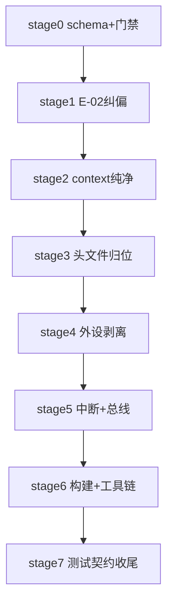

# MCS-51 通用内核与芯片专属逻辑解耦迁移系列（总纲）

| 字段 | 内容 |
|------|------|
| **系列编号** | `PLAN-20260911-MCS51-DECOUPLING` |
| **创建日期** | `2026-09-11` |
| **目标平台** | `host` / `wasm`（mcs51 仿真拦截层为 host/wasm-only，`ESP_PLATFORM` 下零符号，见框架 `CMakeLists.txt` 守卫） |
| **工具链版本** | `GCC 14.2` / `MSVC 14.40` / `Emscripten 4.0.5` / `C++17`（见框架编译方言链） |
| **系列状态** | ✅ 已完成（stage0~stage7 全关；stage7 签署见 §5 与 stage7 §7） |
| **优先级** | 🔴 P0（E-02 在线仿真假短路为阻塞性行为失真；其余为架构阻塞） |
| **系列版本** | `v1.0` |
| **审计 SSOT（发现源）** | [`docs/todolist/2026-09-11-mcs51-generic-vs-chip-specific-coupling-audit.md`](../../../todolist/2026-09-11-mcs51-generic-vs-chip-specific-coupling-audit.md)（24 项 CPL 详情以此为准，本系列不复述证据） |
| **关联技术设计** | 无，已并入本系列（表驱动家族描述符 + Trait 钩子 + 芯片包自治） |
| **关联设计规范** | `docs/zh/design/02-wink-micro-os/`（WinkMicroOS 内核） |
| **关联 ADR** | `ADR-0004`（静态分发，POD + 命名 API，无 vtable）、`ADR-0036`（无异常/无 RTTI） |
| **目标里程碑** | MCS-51 仿真拦截层解耦专项 |
| **所需技能** | `embedded-best-practice` |

---

## 1. 背景与目标

`frameworks/mcs51/` 最初面向标准 8051（AT89C52）+ 外挂 ADC0832，后为 CMS8S78xx 养生壶增量引入片上外设，大量 XSFR/重映射/分频/扩展向量硬编码进入通用 `mcs51_*` 文件。直接后果：片上 NTC 接物理 Pin 0 却读虚拟 Pin 32，上电即报 E-02 假短路；通用代码向 `if-else` 泥潭滑落；经典 8051 沦为二等公民。

可量化目标：

- ✅ E-02 根除：养生壶在线仿真冷启动读出室温阻值（约 25℃），数码管无 E-02。
- ✅ 通用零厂商残留：`src/mcs51_*.cpp` 全文 `grep -Ei 'cms8s|0xF0|ADC0832|BUZ|WDT|TA_'` 零命中（注释引用 schema 字段名除外，以各阶段 lint 为准）。
- ✅ 加新芯片零改 core：新增一个 51 家族只需加描述符行 + `chips/<new>/` 目录 + manifest，不动通用核心与工具链脚本。
- ✅ 40/40 测试全程双绿：迁移期 `core-tests` 与 `cms8s-tests` 双轨，关闭期无告警兼容残留。

## 2. CPL 总览（瘦表，详情见审计 SSOT）

| 阶段 | CPL | 一句话 |
|------|-----|--------|
| stage0 | CPL-20 | Family 描述符 v2 schema 冻结（port掩码/向量表/WDT/IAP/UART/Timer能力） |
| stage0 | CPL-24 | API 前缀门禁 + STRICT 枚举按家族拆分 + 构建 knob 下沉 |
| stage1 | CPL-01/02/17/22/23 | ADC 物理 Pin 纠偏 + ADCLDO 下沉 + 契约升版双读 + 测试双轨 |
| stage2 | CPL-11/12/18/19 | Context 纯净化（soc_priv/残留结构/复位播种/引脚掩码） |
| stage3 | CPL-09/13/14/21/24 | 头文件归位 + `wink_mcu.h` 上移 + ADC0832 下沉 `devices/` |
| stage4 | CPL-03/04/05/07/10 | GPIO/UART/Timer/ExtInt 剥离 + 外设自注册 |
| stage5 | CPL-06/08 | 中断向量表 + XSFR 白名单表驱动化 |
| stage6 | CPL-15/16/24 | CMake 分目标 + 工具链 manifest 驱动 |
| stage7 | CPL-22/23 | 删除兼容层，契约定稿归档 |

## 3. 终态架构层级与目录树规范

> 📌 **架构设计唯一事实源（Architecture SSOT）**：
> 本系列的架构设计、分层拓扑与物理目录规划严格以 [`docs/todolist/2026-09-11-mcs51-generic-vs-chip-specific-coupling-audit.md §4 及 §4.1`](../../../todolist/2026-09-11-mcs51-generic-vs-chip-specific-coupling-audit.md) 为唯一事实源。本实施大纲规定其落位与执行纪律。

### 3.1 架构分层职责与依赖单向铁律
系统严格分为五层，依赖方向**单向递进，严禁反向污染与环形依赖**：
`devices/chips → core（含 family/trap）`；`core → PAL/运行时`；`tools/test → manifests + 公共头`；`core` 永不反向依赖 `chips/devices` 的任一符号。

1. **通用内核核心层 (`wink_mcs51_core` -> `include/` + `src/`)**：仅包含 Intel 8051/8052 标准寄存器与外设时序（PC/SP/P0~P3/T0~T2 标准语义/UART0/INT0~1/外部 MOVX 总线占用跟踪），绝对零厂商命名、零专有地址。增强特性全部经 Trait 钩子或描述符外包。
2. **家族描述符与能力钩子层 (`McuFamilyDescriptor v2` & `Trait Hooks`)**：逻辑层，物理归属 core——静态描述符配置表（`mcs51_family.h`）+ `caps_cache` 快照掩码短路 + 外设注册表与 Trap 钩子机制（`mcs51_peripheral.h` / `mcs51_trap.h`，见 §3.1b 注册协议）。本层无独立目录与编译目标。
3. **厂商芯片自治扩展包 (`chips/<family>/`)**：各自独立命名空间与 Target（如 `wink_mcs51_cms8s`、`wink_mcs51_at89`）。承接全部专有 SFR、扩展定时器/中断/ADC 与私有状态 `soc_priv`。
4. **板级外挂器件层 (`devices/<device>/`)**：完全独立于芯片的板载扩展（如 `adc0832`），编译为 `wink_mcs51_adc0832`，通过 Trap 钩子按需接入，不污染 core 与 chips。
5. **配置事实源与测试治理层 (`tools/manifests/` + `test/core/` vs `test/<family>/`)**：工具链门禁与代码清洗全由 yaml 驱动；测试代码按通用与芯片物理隔离，杜绝交叉越权。测试文件归属框架目录（`frameworks/mcs51/test/`，stage1 搬迁），测试注册保留 SDK 中央 `wink-micro-os/test/CMakeLists.txt`（不复制 unity/host-PAL/wasm  wiring，见 §3.3 目录约定）。

### 3.1b 外设注册协议（ADR-0004 无 weak 符号下的唯一可行机制，stage4 落地）

core 内三处循环（`mcs51_context.cpp` init/reset、`mcs51_bridge.cpp` microstep poll、`mcs51_pcon.cpp` next-event）不能反向引用 chips 符号，故：

1. **数据结构**：core 自有有界 BSS 注册表（上限 `MCS51_MAX_PERIPHERALS`，静态断言锁死）+ `mcs51_peripheral_register(desc)`（按名指针去重、幂等）；配套测试缝 `mcs51_peripheral_registry_reset()`（仅测试用，生产路径不用）。
2. **芯片侧**：每家族提供 `xxx_register()`（如 `cms8s78xx_register()` 向注册表追加其描述符；`at89c52_register()` 为空实现——classic 即"零扩展纯净 core"，无操作本身就是协议的一部分，保持各家族协议统一）。
3. **调用点（`wink-micro-app` 用户代码零改前提）**：芯片包经**链接期自注册**接入——`chips/<family>/src/<family>_register.cpp` 的静态初始化器在 register OBJECT 被链接时向 core 注册表追加描述符；生产根构建按 manifest 解析链接唯一家族包（stage7 S7-1 定稿，删除 S4-D5 过渡默认与 `mcs51_family_select.h` 生成缝）。测试 harness 在 setup 中显式调用（测试代码可改，用户代码不动）。
4. **Hook 生命周期**：GPIO Trait 钩子（may_drive/is_analog/pullup）以 **per-context** 函数指针存于 `Mcu51Context`（file-static 全局指针在双 context 分属不同家族时必串扰，否决），由芯片 `init/reset`（持有 ctx）逐次重装——与现有 trap 注册生命周期一致；`caps_cache` 短路标准路径，file-static 仅允许 M4 诊断计数器。
5. **TA 保序**：TA 半开窗口通知必须先于逐地址 hook 派发（`mcs51_bridge.cpp` GAP-07 约束），stage3 钩子化时保留该顺序（TA hook 首注册）。

### 3.1c 家族命名对照表（唯一事实源，manifest key = 芯片目录名 = target 后缀）

| 用途 | cms8s 系 | classic 系 | 说明 |
|------|----------|-----------|------|
| `chips/` 目录名 / manifest 文件名 / `family:` key / target 后缀 | `cms8s78xx` | `at89c52` | `cms8s78xx.yaml` / `at89c52.yaml`；`wink_mcs51_cms8s` / `wink_mcs51_at89`（target 名保留现有 `at89` 缩写，key 侧统一全称） |
| 描述符 `name`（人读） | `CMS8S78xx` | `AT89C52/classic` | 仅日志/单测断言用，不参与构建选择 |
| 兼容别名（构建选择侧接受） | — | `stc89c52`（SDCC 门禁先例） | 别名→key 映射表收归 manifest schema，禁散落各脚本 |
| 51 框架内路由残留 | `mcs51_family_route.h`（新建，stage3） | 同左 | 原 `wink_mcu.h` 全平台门面上移后，51 内不留同名文件，避免混淆 |

### 3.2 终态物理目录树规范（权威目标形态）

```text
wink-micro-os/frameworks/mcs51/                # 模块根目录
├── CMakeLists.txt                             # 定义 wink_mcs51_core / _cms8s / _at89 / _adc0832（STATIC EXCLUDE_FROM_ALL）
│
├── include/                                   # ★ 通用 core 公共头：严禁 vendor 名/0xFxxx/ADCLDO/FUNCCR/PS_xx
│   ├── mcs51_context.h                        #   仅标准核状态 + void* soc_priv；无厂商私有字段
│   ├── mcs51_family.h                         #   McuFamilyDescriptor v2 骨架定义
│   ├── mcs51_peripheral.h / mcs51_trap.h      #   通用外设注册与 Trap 钩子机制
│   ├── mcs51_sfr_map.h                        #   仅 Intel 标准 SFR；专有 SFR 全部下沉
│   ├── mcs51_adc.h                            #   纯 rail key 直通（双空间分区，stage1）；无 ADCLDO、无 adc0832 shim（CPL-01/02/21）
│   ├── wink_mcs51_{gpio,uart,timer,isr,extint,clock,edge_queue,wdt}.h
│   ├── mcs51_pcon.h                         #   PCON 低功耗钩子接口（通用，留 core；注意 brace 无 wink_mcs51_pcon.h，该文件不存在）
│   ├── wink_mcs51_pwm_meter.h                   #   host 侧软 PWM 测量（通用，留 core）
│   ├── wink_mcs51_ext_bus.h                     #   外部 MOVX 总线占用跟踪（通用，stage2 由 classic_bus 改名，xram_size==0 门控）
│   ├── mcs51_proxy.hpp / mcs51_xsfr.hpp         #   SFR/XSFR C++ 代理（通用机制；xsfr 注释去厂商味，stage5）
│   ├── wink_mcs51_strict.h                    #   仅通用严格模式枚举
│   ├── mcs51_family_route.h                   #   仅 51 家族路由（stage3 由 wink_mcu.h 瘦身改名；全平台门面上移公共层）
│   └── reg51.h / REG52.H / REGX52.H / absacc.h / intrins.h   # REG52.H 为 Keil 别名头（真实工程兼容集，保留）
│
├── src/                                       # ★ 通用 core 实现：grep cms8s/CMS8S/0xF0/ADC0832/BUZ/WDT-TA 零命中
│   ├── mcs51_context.cpp                      #   仅 Intel 标准上电复位种子
│   ├── mcs51_family.cpp                       #   静态描述符注册表
│   ├── mcs51_gpio/uart/timer/isr/extint/xdata.cpp  # 标准模型，增强特性全走钩子与描述符
│   ├── mcs51_adc.cpp                          #   rail key 直透（双空间），无映射、无 ADCLDO
│   ├── mcs51_bridge.cpp / mcs51_uni_bridge.cpp#   无专有裸 include，TA 保护走钩子（保序见 §3.1b-5）
│   ├── mcs51_peripheral.cpp                   #   core 表（timer/uart/extint）+ BSS 注册表；芯片表由 xxx_register() 接入
│   └── mcs51_{sfr,pcon,clock,edge_queue,pwm_meter,unsupported}.cpp
│
├── chips/                                     # ★ 厂商芯片自治包（各独立编译 Target）
│   ├── cms8s78xx/                             #   编译为 wink_mcs51_cms8s
│   │   ├── include/
│   │   │   ├── cms8s_sfr_map.h                #   专有 SFR 地址表
│   │   │   ├── cms8s_xsfr_allowlist.h         #   专有 XSFR 白名单
│   │   │   ├── REG_CMS8S78XX.H / cms8s78xx.h / cms8s_adc.h / cms8s_buzzer.h
│   │   │   └── cms8s_priv.h                   #   私有状态结构体，经 soc_priv 绑定
│   │   └── src/
│   │       ├── cms8s_adc.cpp                  #   AN0~25 查表闭环 + ADCLDO 纠偏
│   │       ├── cms8s_buzzer.cpp               #   BUZDIV/BUZCON 硬件蜂鸣发生器
│   │       ├── cms8s_gpio.cpp                 #   PxxCFG 模拟复用 / PxTRIS / PxUP / 开漏
│   │       ├── cms8s_uart.cpp                 #   FUNCCR 多时钟源 / PS_RXD 重映射
│   │       ├── cms8s_timer.cpp                #   T3/T4 + T2-CMS8S 扩展（T2IF W0C/捕获/CCEN 系）+ W0C 标志拦截
│   │       ├── cms8s_extint.cpp               #   端口中断 + 引脚选择
│   │       ├── cms8s_sys.cpp                  #   看门狗 WDT / TA 保护 / CLKDIV 分频
│   │       └── cms8s_register.cpp             #   `cms8s78xx_register()` 注册落地点（stage4）
│   └── at89c52/                               #   编译为 wink_mcs51_at89（STATIC；classic = 零扩展纯净 core）
│       ├── include/at89_priv.h                #   预留位（当前无 classic 私有状态；外部总线跟踪在 core 侧 extbus 通用实现）
│       └── src/at89_register.cpp              #   `at89c52_register()` 空实现（协议统一占位，见 §3.1b-2）
│
├── devices/                                   # ★ 板级外挂器件（独立编译 Target）
│   └── adc0832/                               #   编译为 wink_mcs51_adc0832
│       ├── include/adc0832.h                  # 由 `ADC0832.H` 大小写改名而来（Linux CI 大小写敏感，`git mv -f`；旧路径 shim 已随 stage7 删除）
│       └── src/mcs51_adc0832.cpp              #   经 Trap 注册接入
│
├── tools/                                     # ★ 工具链配置化事实源
│   ├── manifests/chips/
│   │   ├── at89c52.yaml / cms8s78xx.yaml      #   key = 文件名 stem；头正则/内存上限/SDCC 门禁/清洗规则/别名表唯一事实源
│   │   └── schema.json
│   ├── mcs51_sdcc_gate.py                     #   Tier-S SDCC 编译门禁（手动：`python tools/mcs51_sdcc_gate.py <app>`；调 devhdr；无 CI；stage6 读 manifest）
│   ├── mcs51_cleanup.py                       #   Keil 方言清洗（构建链调用：test/CMakeLists + wasm cmake + app；自带 pytest `test_mcs51_cleanup.py` 手动跑，未进 ctest）
│   ├── mcs51_sdcc_devhdr.py                   #   原厂头转译器；仅被 sdcc_gate 调用，不独立运行
│   ├── mcs51_shim_audit.py                    #   shim↔原厂漂移门禁（ctest freshness＋手动；随头搬迁同步路径 stage3/5）
│   ├── run_mcs51_headless_evidence.ps1        #   无头取证聚合（手动，Win-only，自带 help，需外仓 wink.py）
│   ├── sdcc_gate/                             #   SDCC 编译门禁头集（按家族分发，被 gate include；stage6 改由 manifest 驱动选择）
│   └── lint/                                  #   layering（本地可执行，§6.2 起点）+ safety/sim_compat（休眠：需外仓 lint 引擎，stage6 纳入 manifest 治理）
│
└── test/                                      # ★ 测试分层体系（stage1 自 wink-micro-os/test/mcs51 整体 git mv，不丢项见下）
    ├── core/                                  #   标准 8051 + 板级器件通用测试；禁 AN 语义/扩展向量
    ├── cms8s78xx/                             #   AN 映射、扩展向量、XSFR 窗口、WDT/TA/CLKDIV
    ├── samples/                               #   Keil 样例源（host/wasm 双构建共用，随测搬迁）
    ├── wasm/                                  #   Node stub/链接桩/cmake 函数（随测搬迁，路径同步更新）
    └── apps/iron_ntc/                         #   board_config 夹具（随测搬迁）
```
> 约定补遗：测试注册保留 SDK 中央 `wink-micro-os/test/CMakeLists.txt`（unity/host-PAL/wasm emcc wiring 不复制，只改路径前缀）；`git mv` 后以 ctest 总数与基线一致为"测试不丢"验收（stage1 落表：文件→目录映射表 + 140 项计数）。

## 4. 落地硬准则（摘要，完整版见审计 SSOT §3）

1. **soc_priv 按实例 BSS 绑定（方案 A 锁定，否决 union）**：通用头仅 `void* soc_priv` + `uint8_t instance_index`，禁 include 厂商 priv 头；芯片源内 BSS 池按 index 分配并在 reset/set_family 重绑 + `memset`；双 context 串扰单测为验收。
2. **静态分发快路径**：热路径只读 `ctx->caps_cache` 位掩码短路，标准件零函数指针开销。
3. **AN→Pin 查表**：`AN_TO_PIN[26]` 常表，P3 段显式 24~27，禁线性公式，附断言与钳位。
4. **构建注入**：`wink-app.json` 的 `mcu` 字段解析注入 `wink_mcs51_core + wink_mcs51_${MCU}`，板器件按需注入。
5. **唤醒中枢统一**：芯片外设经核心 IRQ 汇聚派发，禁私自操作协程挂起。
6. **`wink_mcu.h` 上移**：移出 `frameworks/mcs51/`，51 框架内仅保留 51 家族路由。

## 5. 执行顺序与阶段索引



| 阶段 | 计划文档 | CPL | 状态 |
|------|----------|-----|------|
| stage0 | [`./stage0-family-schema-prefix-gate.md`](./stage0-family-schema-prefix-gate.md) | CPL-20/24 | ✅ 已完成（2026-09-11，`5a91356`，签署见 stage0 §7） |
| stage1 | [`./stage1-adc-pin-e02-fix.md`](./stage1-adc-pin-e02-fix.md) | CPL-01/02/17/22/23 | ✅ 已完成（2026-09-11；S1-3 Step 1 人签字"就按 32+0 落盘"，风险备忘见附录 B，签署见 §7） |
| stage2 | [`./stage2-context-purify.md`](./stage2-context-purify.md) | CPL-11/12/18/19 | ✅ 已完成（2026-09-11，签署见 stage2 §7；D6 将 T3/T4 状态移交 stage4） |
| stage3 | [`./stage3-headers-namespaces.md`](./stage3-headers-namespaces.md) | CPL-09/13/14/21/24 | ✅ 已完成（2026-09-11，S3-D1~D6 六项裁决，签署见 stage3 §7） |
| stage4 | [`./stage4-peripheral-strip.md`](./stage4-peripheral-strip.md) | CPL-03/04/05/07/10 | ✅ 已完成（2026-09-12，S4-D1~D4 四项裁决，签署见 §7） |
| stage5 | [`./stage5-irq-bus-table.md`](./stage5-irq-bus-table.md) | CPL-06/08 | ✅ 已完成（2026-09-12，S5-D1~D4 四项裁决 + S5-H1/H2 复审闭环；D-1 T2 标准语义专设立项，见附录 D，签署见 §7） |
| stage6 | [`./stage6-build-toolchain.md`](./stage6-build-toolchain.md) | CPL-15/16/24 | ✅ 已完成（2026-09-12，S6-D1~D9 九项裁决 + S6-H1~H7 复审闭环，签署见 §7/附录 B） |
| stage7 | [`./stage7-test-contract-close.md`](./stage7-test-contract-close.md) | CPL-22/23 | ✅ 已完成（2026-09-12，S7-D1~D3 裁决，签署见 stage7 §7） |

跨阶段文件冲突矩阵：`mcs51_context.h/.cpp`（stage0→stage2 严格串行）、`mcs51_adc.h/.cpp + cms8s_adc.cpp`（stage1 独占，stage2 只动 rail 默认播种部分需串在 stage1 后）、`CMakeLists.txt`（stage6 独占**目标划分与链接关系**；之前阶段允许增删源文件列表与 include 目录——stage3 头文件搬迁与 stage4 新文件编译必需，不算动目标结构）。

## 6. 统一 DoD 与阶段自审门禁规程

### 6.1 统一 DoD（各阶段 Task 均须满足）

1. 代码符合编码规范与前缀门禁（`wink_mcs51_*`/`mcs51_*` 仅通用；`cms8s_*`/`at89_*` 归芯片，`board_*` 归板级，`adc0832_*` 归器件）。
2. 新增/变更代码有单测，覆盖率 ≥ 80%。
3. `test/core` 与 `test/cms8s78xx` 双轨全绿（关闭期前允许兼容告警，不允许失败）。
4. 通用 core 增量 `grep` 零厂商残留（以各阶段 lint 命令为准）。
5. 相关设计文档与 manifest 已同步更新。
6. Commit message 符合规范，CI 通过。
7. 增删/搬迁编译源文件时，同步单体库列表与 wasm 手写源列表（stage6 删除后者后本条自动失效；搬迁头文件同步 include 目录与 shim 脚本路径）。

### 6.2 阶段自审自我检验门禁规程（Self-Audit Checkpoint Protocol）

每个 Stage 无论由谁（人类或 AI Agent）执行，在将该阶段标记为“完成”并流转至下一阶段前，**必须逐项执行以下 4 步自审并在该阶段文档尾部签署结论**：

1. **Check 1：物理目录与文件归位自审（Filesystem Audit）**
   - 检查本阶段产生的所有新文件、移动的文件是否**100% 严格落在 §3.2 终态目录树**中指定的路径下。
   - 严禁在 `src/` 或 `include/` 顶层随意堆放未经规划的临时文件、试验性代码或遗漏的兼容 shim。
2. **Check 2：依赖单向性与符号残留自审（Layering & Symbol Leak Audit）**
   - 执行架构扫描（仓库根目录）：`python wink-micro-os/frameworks/mcs51/tools/lint/lint_mcs51_layering.py`（stage0 起的本仓可执行入口；`wink-tools/wink.py lint arch` 接入后以 stage6 为准）或各阶段指定的等效 `grep` 命令。
   - 严禁通用 Core 头包含任何 `chips/` 或 `devices/` 下的私有头文件（如 `cms8s_priv.h`）；`chips/` 源只定义 `cms8s_*/at89_*` 符号，`mcs51_*/wink_mcs51_*` 符号只在 core 定义（双向命名门禁）。
3. **Check 3：契约双轨与全绿自审（Dual-Target & Contract Audit）**
   - 全量构建与双轨测试（仓库根目录，顺序执行）：
     `cmake -DTARGET_PLATFORM=host -B build-host`；
     `cmake --build build-host --parallel 8`（全覆盖 triage 加 `-- -k`）；
     `ctest --test-dir build-host/wink-micro-os/test -E "^wasm_"`（host 双轨）；
     `ctest --test-dir build-host/wink-micro-os/test -R "wasm_"`（wasm 轨，需 emcc/node）。
     确保 host 与 wasm 目标均编译通过，`core` 与 `cms8s` 测试全绿（wasm 以 stage1 Step 0a 修复为前提，修复前凭基线豁免记录执行 host 部分）。
   - 检查阶段特定的数值断言（如 Stage 1 的 E-02 消除、Stage 2 的 `sizeof(Mcu51Context)` 预算未超限）。
4. **Check 4：计划与状态闭环自审（Plan State Alignment）**
   - 核对当前 Stage 文档中的 Task Checkbox，确认全部勾选且无未竟事项。
   - 更新总纲 [00-README.md §5](file:///d:/workspaces/ai-coding/wink-ai/wink-ai-embedded/docs/implementation-plans/mcs51/2026-09-11-mcs51-decoupling/00-README.md#L145) 的状态列为 `✅ 已完成`。

## 7. 系列级风险与回滚

| 风险ID | 描述 | 缓解 |
|--------|------|------|
| R-01 | stage1 引脚语义切换致前端/仿真版本错配，静默断裂重演 | ABI 升版 + 芯片层双读一版 + 发版顺序（后端→前端→stub/文档），见 stage1/stage7 |
| R-02 | Context 结构拆分致双实例串扰或栈/BSS 超限 | 按实例 BSS 池 + `sizeof` 预算断言 + 双 context 单测，见 stage2 |
| R-03 | 头文件下沉致全仓 include 链断裂 | 阶段内保留转发 shim（告警）一版，下阶段删除，见 stage3 |
| R-04 | CMake 拆目标致 app 链接失败 | `wink-app.json mcu` 注入 + 旧单体目标保留别名一版，见 stage6 |

回滚：每阶段保留 Git 版本回退（`git revert <stage-commit>`）+ 功能开关回退（双读/双轨/别名目标），回滚后验证 L0（双轨编译全绿）+ E-02 无复发（stage1 后）。

## 8. 非功能预算

- **RAM**：终态不净增，中间增量入账（stage0/stage1/stage5 见 stage2 §4 表）。其中 64KB `xdata_shadow` 为 MOVX 地址镜像（不可裁，固定成本，见 stage2 S2-2 Step 2），预算优化对象是状态字段（~1KB 级）+ soc_priv 池（按实例另表）；"downward"指状态字段，不含镜像容器。
- **性能**：GPIO/ADC 热路径标准件零间接调用（caps 短路覆盖率 100% 走单测断言）。
- **构建**：不引入 2×2 四库膨胀，STRICT 走 per-target 定义。

## 9. 参考资料

- 审计 SSOT（24 项证据）：[`../../../todolist/2026-09-11-mcs51-generic-vs-chip-specific-coupling-audit.md`](../../../todolist/2026-09-11-mcs51-generic-vs-chip-specific-coupling-audit.md)
- 实施计划模板：[`../../00-IMPLEMENTATION-PLAN-TEMPLATE.md`](../../00-IMPLEMENTATION-PLAN-TEMPLATE.md)
- ADR-0004（静态分发）、ADR-0036（无异常/无 RTTI）
