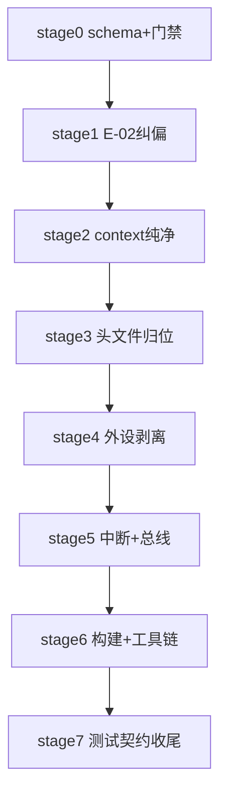

# MCS-51 通用内核与芯片专属逻辑解耦迁移系列（总纲）

| 字段 | 内容 |
|------|------|
| **系列编号** | `PLAN-20260911-MCS51-DECOUPLING` |
| **创建日期** | `2026-09-11` |
| **目标平台** | `host` / `wasm`（mcs51 仿真拦截层为 host/wasm-only，`ESP_PLATFORM` 下零符号，见框架 `CMakeLists.txt` 守卫） |
| **工具链版本** | `GCC 14.2` / `MSVC 14.40` / `Emscripten 4.0.5` / `C++17`（见框架编译方言链） |
| **系列状态** | 📋 草稿 |
| **优先级** | 🔴 P0（E-02 在线仿真假短路为阻塞性行为失真；其余为架构阻塞） |
| **系列版本** | `v1.0` |
| **审计 SSOT（发现源）** | [`docs/todolist/2026-09-11-mcs51-generic-vs-chip-specific-coupling-audit.md`](../../../todolist/2026-09-11-mcs51-generic-vs-chip-specific-coupling-audit.md)（24 项 CPL 详情以此为准，本系列不复述证据） |
| **关联技术设计** | 无，已并入本系列（表驱动家族描述符 + Trait 钩子 + 芯片包自治） |
| **关联设计规范** | `docs/zh/design/02-wink-micro-os/`（WinkMicroOS 内核） |
| **关联 ADR** | `ADR-0004`（静态分发，POD + 命名 API，无 vtable）、`ADR-0036`（无异常/无 RTTI） |
| **目标里程碑** | MCS-51 仿真拦截层解耦专项 |
| **所需技能** | `embedded-best-practice` |

---

## 1. 背景与目标

`frameworks/mcs51/` 最初面向标准 8051（AT89C52）+ 外挂 ADC0832，后为 CMS8S78xx 养生壶增量引入片上外设，大量 XSFR/重映射/分频/扩展向量硬编码进入通用 `mcs51_*` 文件。直接后果：片上 NTC 接物理 Pin 0 却读虚拟 Pin 32，上电即报 E-02 假短路；通用代码向 `if-else` 泥潭滑落；经典 8051 沦为二等公民。

可量化目标：

- ✅ E-02 根除：养生壶在线仿真冷启动读出室温阻值（约 25℃），数码管无 E-02。
- ✅ 通用零厂商残留：`src/mcs51_*.cpp` 全文 `grep -Ei 'cms8s|0xF0|ADC0832|BUZ|WDT|TA_'` 零命中（注释引用 schema 字段名除外，以各阶段 lint 为准）。
- ✅ 加新芯片零改 core：新增一个 51 家族只需加描述符行 + `chips/<new>/` 目录 + manifest，不动通用核心与工具链脚本。
- ✅ 40/40 测试全程双绿：迁移期 `core-tests` 与 `cms8s-tests` 双轨，关闭期无告警兼容残留。

## 2. CPL 总览（瘦表，详情见审计 SSOT）

| 阶段 | CPL | 一句话 |
|------|-----|--------|
| stage0 | CPL-20 | Family 描述符 v2 schema 冻结（port掩码/向量表/WDT/IAP/UART/Timer能力） |
| stage0 | CPL-24 | API 前缀门禁 + STRICT 枚举按家族拆分 + 构建 knob 下沉 |
| stage1 | CPL-01/02/17/22/23 | ADC 物理 Pin 纠偏 + ADCLDO 下沉 + 契约升版双读 + 测试双轨 |
| stage2 | CPL-11/12/18/19 | Context 纯净化（soc_priv/残留结构/复位播种/引脚掩码） |
| stage3 | CPL-09/13/14/21/24 | 头文件归位 + `wink_mcu.h` 上移 + ADC0832 下沉 `devices/` |
| stage4 | CPL-03/04/05/07/10 | GPIO/UART/Timer/ExtInt 剥离 + 外设自注册 |
| stage5 | CPL-06/08 | 中断向量表 + XSFR 白名单表驱动化 |
| stage6 | CPL-15/16/24 | CMake 分目标 + 工具链 manifest 驱动 |
| stage7 | CPL-22/23 | 删除兼容层，契约定稿归档 |

## 3. 终态架构（摘要，完整蓝图与目录树见审计 SSOT §4/§4.1）

依赖单向：`devices/chips → core（含 family/trap）`；`core → PAL/运行时`；`tools/test → manifests + 公共头`；core 永不反向依赖 chips/devices 任一符号。

- **core**（顶层 `include/+src/` = `wink_mcs51_core`）：Intel 标准语义 only。
- **family v2 + Trait 钩子**：`capabilities`（`MCS51_CAP_ENHANCED_IO` 等）+ `caps_cache`（reset/set_family 快照，热路径只读缓存）+ GPIO/SFR 钩子。
- **chips/**：`cms8s78xx`（→`wink_mcs51_cms8s`）、`at89c52`（→`wink_mcs51_at89`）。
- **devices/**：`adc0832` 板级外挂，经 trap 接入。
- **tools/manifests + test/core vs test/cms8s78xx**：工具链唯一事实源 + 测试双轨。

## 4. 落地硬准则（摘要，完整版见审计 SSOT §3）

1. **soc_priv 按实例 BSS 绑定（方案 A 锁定，否决 union）**：通用头仅 `void* soc_priv` + `uint8_t instance_index`，禁 include 厂商 priv 头；芯片源内 BSS 池按 index 分配并在 reset/set_family 重绑 + `memset`；双 context 串扰单测为验收。
2. **静态分发快路径**：热路径只读 `ctx->caps_cache` 位掩码短路，标准件零函数指针开销。
3. **AN→Pin 查表**：`AN_TO_PIN[26]` 常表，P3 段显式 24~27，禁线性公式，附断言与钳位。
4. **构建注入**：`wink-app.json` 的 `mcu` 字段解析注入 `wink_mcs51_core + wink_mcs51_${MCU}`，板器件按需注入。
5. **唤醒中枢统一**：芯片外设经核心 IRQ 汇聚派发，禁私自操作协程挂起。
6. **`wink_mcu.h` 上移**：移出 `frameworks/mcs51/`，51 框架内仅保留 51 家族路由。

## 5. 执行顺序与阶段索引

| 阶段 | 计划文档 | CPL | 状态 |
|------|----------|-----|------|
| stage0 | [`./stage0-family-schema-prefix-gate.md`](./stage0-family-schema-prefix-gate.md) | CPL-20/24 | ⏳ 待开始 |
| stage1 | [`./stage1-adc-pin-e02-fix.md`](./stage1-adc-pin-e02-fix.md) | CPL-01/02/17/22/23 | ⏳ 待开始 |
| stage2 | [`./stage2-context-purify.md`](./stage2-context-purify.md) | CPL-11/12/18/19 | ⏳ 待开始 |
| stage3 | [`./stage3-headers-namespaces.md`](./stage3-headers-namespaces.md) | CPL-09/13/14/21/24 | ⏳ 待开始 |
| stage4 | [`./stage4-peripheral-strip.md`](./stage4-peripheral-strip.md) | CPL-03/04/05/07/10 | ⏳ 待开始 |
| stage5 | [`./stage5-irq-bus-table.md`](./stage5-irq-bus-table.md) | CPL-06/08 | ⏳ 待开始 |
| stage6 | [`./stage6-build-toolchain.md`](./stage6-build-toolchain.md) | CPL-15/16/24 | ⏳ 待开始 |
| stage7 | [`./stage7-test-contract-close.md`](./stage7-test-contract-close.md) | CPL-22/23 | ⏳ 待开始 |

跨阶段文件冲突矩阵：`mcs51_context.h/.cpp`（stage0→stage2 严格串行）、`mcs51_adc.h/.cpp + cms8s_adc.cpp`（stage1 独占，stage2 只动 rail 默认播种部分需串在 stage1 后）、`CMakeLists.txt`（stage6 独占，之前阶段禁动目标结构）。

## 6. 统一 DoD（各阶段 Task 均须满足）

1. 代码符合编码规范与前缀门禁（`wink_mcs51_*` 仅通用）。
2. 新增/变更代码有单测，覆盖率 ≥ 80%。
3. `test/core` 与 `test/cms8s78xx` 双轨全绿（关闭期前允许兼容告警，不允许失败）。
4. 通用 core 增量 `grep` 零厂商残留（以各阶段 lint 命令为准）。
5. 相关设计文档与 manifest 已同步更新。
6. Commit message 符合规范，CI 通过。

## 7. 系列级风险与回滚

| 风险ID | 描述 | 缓解 |
|--------|------|------|
| R-01 | stage1 引脚语义切换致前端/仿真版本错配，静默断裂重演 | ABI 升版 + 芯片层双读一版 + 发版顺序（后端→前端→stub/文档），见 stage1/stage7 |
| R-02 | Context 结构拆分致双实例串扰或栈/BSS 超限 | 按实例 BSS 池 + `sizeof` 预算断言 + 双 context 单测，见 stage2 |
| R-03 | 头文件下沉致全仓 include 链断裂 | 阶段内保留转发 shim（告警）一版，下阶段删除，见 stage3 |
| R-04 | CMake 拆目标致 app 链接失败 | `wink-app.json mcu` 注入 + 旧单体目标保留别名一版，见 stage6 |

回滚：每阶段保留 Git 版本回退（`git revert <stage-commit>`）+ 功能开关回退（双读/双轨/别名目标），回滚后验证 L0（双轨编译全绿）+ E-02 无复发（stage1 后）。

## 8. 非功能预算

- **RAM**：`sizeof(Mcu51Context)` 从 ~68KB  downward，任何阶段不得净增；stage2 给出分家族预算表。
- **性能**：GPIO/ADC 热路径标准件零间接调用（caps 短路覆盖率 100% 走单测断言）。
- **构建**：不引入 2×2 四库膨胀，STRICT 走 per-target 定义。

## 9. 参考资料

- 审计 SSOT（24 项证据）：[`../../../todolist/2026-09-11-mcs51-generic-vs-chip-specific-coupling-audit.md`](../../../todolist/2026-09-11-mcs51-generic-vs-chip-specific-coupling-audit.md)
- 实施计划模板：[`../../00-IMPLEMENTATION-PLAN-TEMPLATE.md`](../../00-IMPLEMENTATION-PLAN-TEMPLATE.md)
- ADR-0004（静态分发）、ADR-0036（无异常/无 RTTI）
