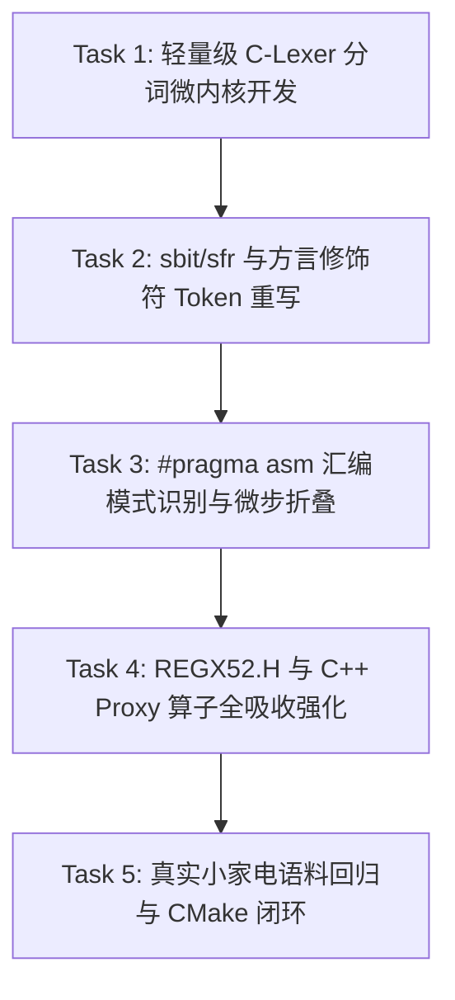

# PLAN-20260925-MCS51-LEXER-REWRITER: 8051 源码零侵入方言解析与 Token 级脱敏重写器实施计划

> 📋 **本文档为专门的技术剖析与实操实施计划**，针对 WinkMicroOS 8051 生态拦截层（`frameworks/mcs51/`）中 Keil C51 特殊方言清洗机制的脆弱性问题，系统性梳理底层痛点机理，并提供基于“纯 Python 轻量级 C-Lexer 分词流 + 汇编模式归一化 + C++ 算子宏吸收”的高鲁棒重写器设计与任务拆分。
>
> 🎯 **计划版本**：v1.0
> 📚 **关联规范**：
> - `docs/zh/design/01-system-overall/01-system-overview.md`（四层芯片仿真体系 Tier 2）
> - `wink-micro-os/frameworks/mcs51/docs/01-architecture-and-governance-guide.md`（MCS-51 治理指南）
> - `docs/implementation-plans/core/2026-08-27-mcs51-zero-code-simulation-plan.md`（8051 零代码仿真总计划）
> 🏛️ **关联架构决策**：
> - [ADR-0070](../../decisions/core/0070-mcs51-zero-code-simulation-interception-layer.md)（MCS-51 零侵入仿真拦截层）
> - [ADR-0071](../../decisions/core/0071-sfr-proxy-rmw-edge-data-plane.md)（SFR 代理与边沿数据面）
> - [ADR-0072](../../decisions/core/0072-dual-clock-domain-and-quota-catchup.md)（双时钟域与微步计费配额切出）
> - [ADR-0084](../../decisions/core/0084-layered-license-map-lgpl-runtime.md)（开源许可分层：`frameworks/mcs51/tools/*.py` = GPL-3.0-only）

---

## 1. 元数据表

| 字段 | 内容 |
|:---|:---|
| **计划编号** | `PLAN-20260925-MCS51-LEXER-REWRITER` |
| **创建日期** | 2026-09-25 |
| **所属模块** | `wink-micro-os/frameworks/mcs51/tools/transpile_app_keil_c51.py` |
| **目标平台/SoC** | `wasm32-unknown-emscripten` / `host` (GCC + MSVC) / `8051 (SDCC ISS)` |
| **运行依赖** | Python 3.10+（纯 Python 标库，0 外部 C++ 动态库依赖，保障 CMake 离线自洽构建） |
| **计划状态** | 📋 就绪（Ready for Implementation） |
| **优先级** | 🟡 P1（提升小家电与玩具存量 8051 代码零修改吞入率） |
| **计划版本** | `v1.0` |
| **开源许可** | `GPL-3.0-only`（依据 ADR-0084 特别豁免规范） |
| **计划负责人** | 嵌入式架构组 / MCS-51 专项组 |

---

## 2. 背景与解决的核心问题（Problem Statement）

### 2.1 工业背景：8051 存量生态与非标方言泥潭
在国产消费电子、余慈小家电（电水壶、电熨斗、电饭煲）以及义乌玩具芯片市场中，数以亿计的单片机仍在使用经典 8051 内核（如 STC89/90、CMS8S78xx、辉芒微、中微）。这部分存量代码几乎 100% 使用 **Keil C51** 编译器编写。

Keil C51 并非标准 ANSI C，而是充斥着大量**硬件强绑定的专有方言扩展**：
* 特殊功能寄存器定义：`sfr P1 = 0x90;`
* 位寻址引脚定义：`sbit LED = P1^0;` 或 `sbit P1_0 = 0x90;`
* 中断与寄存器组指定：`void Timer0_ISR(void) interrupt 1 using 2`
* 内存空间修饰符：`unsigned char code table[] = { ... };` 以及 `data`, `idata`, `xdata`, `bdata`, `pdata`
* 绝对地址定位：`uint8_t var _at_ 0x2000;`
* 内联硬件汇编：`#pragma asm ... #pragma endasm`

### 2.2 现行方案痛点：纯正则清洗（`transpile_app_keil_c51.py`）的 4 大死穴

目前本仓在 `frameworks/mcs51/tools/transpile_app_keil_c51.py` 中实现了一个基于 Python `re` 模块的正则清洗脚本。在面对真实复杂工程时，暴露出以下不可调和的底层矛盾：

```text
┌────────────────────────────────────────────────────────────────────────┐
│               纯正则清洗 (Regex Transpiler) 的 4 大致命缺陷             │
├────────────────────────────────────────────────────────────────────────┤
│  1. 宏拼接预处理时序悖论 ──► #define DEF_BIT(n) sbit L_##n = P1^n; 正则读不懂│
│  2. 字符串与注释伪匹配   ──► printf("sbit error"); 字符串内部单词被误改破坏  │
│  3. 内嵌汇编黑洞         ──► #pragma asm 包含的精确延时导致 Wasm 语法阻断     │
│  4. 语法嵌套与多行断裂   ──► 跨行定义或复杂修饰符导致正则表达式匹配逃逸       │
└────────────────────────────────────────────────────────────────────────┘
```

1. **宏拼接与预处理时序矛盾（The Preprocessor Paradox）**：
   如果清洗脚本在预处理**前**运行，正则无法识别通过宏拼接（`##`）动态生成的 `sbit` 或 `sfr`；如果清洗脚本在预处理**后**运行，标准预处理器（Clang -E）由于无法识别非标的 `sbit` 关键字，在第一阶段就会直接 Syntax Error 崩溃退出！
2. **字符串与注释的误伤污染**：
   纯文本正则很难做到 100% 严密的词法作用域上下文感知。如果用户代码的字符串字面量中包含关键字（例如串口打印日志：`printf("check sbit state\n");`），粗暴的全局替换会把字符串内部的代码改坏，破坏逻辑。
3. **内嵌汇编（`#pragma asm`）直接使 Wasm 瘫痪**：
   很多经典小家电驱动中存在手写 `NOP` 循环进行微秒延时（如单总线通讯）。目前脚本遇到汇编直接跳过，导致这些代码进入 `emcc` 编译为 Wasm 时报非法语法错误。

---

## 3. 总体破局架构设计（Architecture SSOT）

坚决拒绝“为了方言去魔改 Clang 编译器源码”的高风险方案。
本计划在 `frameworks/mcs51/tools/` 内部构建 **“三段式 Token 词法重写引擎 + C++ 算子宏吸收体系”**：

```text
┌────────────────────────────────────────────────────────────────────────┐
│                        三段式方言重写与吸收体系架构                     │
├────────────────────────────────────────────────────────────────────────┤
│                                                                        │
│   【输入：用户 Keil C51 原生源码】 (含 sbit, sfr, #pragma asm, 宏拼接)   │
│                                │                                       │
│                                ▼                                       │
│   【阶段一：纯 Python 轻量级 C-Lexer 词法分词器】                        │
│    - 基于 Python 标准化 C 词法规则生成有序 Token 流 (Tokens)           │
│    - 严格隔离 STRING_LITERAL、COMMENT 与 CODE_TOKEN                    │
│    - 字符串内的 "sbit" 标记为常量，绝不误伤                            │
│                                │                                       │
│                                ▼                                       │
│   【阶段二：Token 流语义重写器 (Token Stream Rewriter)】                │
│    - sbit A = P1^b ──► 规范化为 C++ 对象初始化语句                     │
│    - #pragma asm ──► 模式探测：延时循环折叠为 _nop_() 微步计费         │
│    - code / data / xdata ──► 归一化为空或 constexpr 修饰符             │
│    - interrupt N [using M] ──► 转换为 WINK_ISR(N)                      │
│                                │                                       │
│                                ▼                                       │
│   【阶段三：C++ 算子宏/模板吸收层 (shim/REGX52.H & mcs51_proxy.hpp)】   │
│    - #define sbit WinkSfrBitProxy                                      │
│    - #define sfr  WinkSfrProxy                                         │
│    - 利用 C++17 operator^ 重载与移动语义，零开销吸收位操作语法糖       │
│                                │                                       │
│                                ▼                                       │
│   【输出：合法标准 C++17 源码 (.cpp)】                                  │
│    交给 emcc (Wasm) 或 GCC/MSVC (Host) 满速编译，100% 跑通仿真！        │
│                                                                        │
└────────────────────────────────────────────────────────────────────────┘
```

---

## 4. 关键机制与重写规范

### 4.1 轻量级 C-Lexer 分词模型（0 外部 C++ 动态库依赖）
采用基于 Python 标准库 `re` 实现的完整 C99/C51 状态机 Tokenizer（参考成熟纯 Python 词法解析实现），将源码切分为确定性的 Token 序列：

```python
class TokenType:
    KEYWORD = 1      # sbit, sfr, interrupt, using, code, data...
    IDENTIFIER = 2   # LED, P1, Timer0_ISR...
    OPERATOR = 3     # ^, =, ;, (, )...
    STRING = 4       # "hello sbit" (绝对保护区)
    COMMENT = 5      # /* comment */ or // (安全剥离区)
    PRAGMA_ASM = 6   # #pragma asm ... #pragma endasm 块
    OTHER = 7
```

### 4.2 方言语法的 Token 级归一化矩阵

| 原生 Keil C51 语法 | 词法 Token 序列 | 转译后的标准 C++17 语法 | 对应 C++ 吸收机制 |
|:---|:---|:---|:---|
| `sbit LED = P1^0;` | `sbit`, `ID(LED)`, `=`, `ID(P1)`, `^`, `INT(0)`, `;` | `sbit LED = P1 ^ 0;` | `P1` 是 `WinkSfrProxy`，`P1^0` 调用 `operator^(int)` 返回 `WinkSfrBitProxy` 临时对象，复制构造给 `LED` |
| `sbit P1_0 = 0x90;` | `sbit`, `ID(P1_0)`, `=`, `HEX(0x90)`, `;` | `WinkSfrBitProxy P1_0(0x90);` | 识别常量地址位初始化，调用直接地址构造函数 |
| `sfr P1 = 0x90;` | `sfr`, `ID(P1)`, `=`, `HEX(0x90)`, `;` | `WinkSfrProxy P1(0x90);` | 调用 `WinkSfrProxy(uint16_t addr)` 显式构造函数 |
| `void isr() interrupt 1 using 2` | `interrupt`, `1`, `using`, `2` | `WINK_ISR(1) void isr()` | 剥离 `using` 寄存器组切换，保留矢量号并注入静态调度宏 |
| `unsigned char code t[] = {...};` | `code` 关键字 | `const unsigned char t[] = {...};` | `code` 映射为 `const`（存储于只读代码段） |
| `uint8_t data x; uint8_t xdata y;`| `data`, `xdata` 关键字 | `uint8_t x; uint8_t y;` | 空间修饰符消解为空，映射至平坦虚拟内存 |
| `uint8_t var _at_ 0x2000;` | `_at_`, `HEX` | 转换为指针映射或静态保留变量 | 避免链接器报错 |

### 4.3 内嵌汇编（`#pragma asm`）的模式识别与软着陆

针对小家电驱动中最棘手的内联汇编块，重写器按两种策略智能分流：

```python
# 汇编模式匹配示例
def handle_pragma_asm_block(asm_text: str) -> str:
    # 模式 1：检测是否为经典的 NOP 延时循环 (如 NOP / DJNZ)
    if is_pure_delay_asm(asm_text):
        cycles = calculate_asm_cycles(asm_text)
        # 自动折叠为微秒时基计费与配额让步函数！
        return f"/* [Rewritten ASM Delay] */ mcs51_microstep({cycles});"
    
    # 模式 2：其他未知底层汇编指令 -> 优雅隔离
    return (
        "#if !defined(__WINK_SIM__)\n"
        f"#pragma asm\n{asm_text}\n#pragma endasm\n"
        "#else\n"
        "/* [WINK_SIM WARNING] Hardware-specific inline assembly skipped in simulation */\n"
        "#endif\n"
    )
```

---

## 5. 详细实施任务与路线图



### Task 1：纯 Python C-Lexer 分词微内核开发 `[ 状态: ⏳ 待开始 ]`

| 字段 | 内容 |
|:---|:---|
| **预估工时** | 6 小时 |
| **优先级** | 🔴 P0 |
| **修改文件** | `wink-micro-os/frameworks/mcs51/tools/lexer/c_lexer.py`<br>`wink-micro-os/frameworks/mcs51/test/core/test_c_lexer.py` |
| **交付目标** | 纯 Python 实现的分词器，100% 正确区分代码 Token、字符串字面量与注释 |

- [ ] **Step 1**：编写 `c_lexer.py`，支持将 C 源码流拆分为结构化 `Token(type, value, line, col)`。
- [ ] **Step 2**：编写极端用例（包含 `printf("sbit in string")`、注释中包含 `// sfr P1`、宏定义换行），确保分词准确无误。

---

### Task 2：Token 流方言重写器升级 `[ 状态: ⏳ 待开始 ]`

| 字段 | 内容 |
|:---|:---|
| **预估工时** | 8 小时 |
| **优先级** | 🔴 P0 |
| **修改文件** | `wink-micro-os/frameworks/mcs51/tools/transpile_app_keil_c51.py` |
| **交付目标** | 取代粗暴正则，基于 Token 流精准转译 `sbit`、`sfr`、`interrupt`、`code`、`xdata` |

- [ ] **Step 1**：重构 `transpile_app_keil_c51.py` 主流水线，引入 Token 流分析。
- [ ] **Step 2**：实现 `sbit` 双模重写（`P1^0` 表达式模式与直接地址模式）。
- [ ] **Step 3**：实现 `code`、`data`、`xdata`、`_at_` 语法糖的精准消解。

---

### Task 3：`#pragma asm` 汇编块模式识别与微步折叠 `[ 状态: ⏳ 待开始 ]`

| 字段 | 内容 |
|:---|:---|
| **预估工时** | 6 小时 |
| **优先级** | 🟡 P1 |
| **修改文件** | `wink-micro-os/frameworks/mcs51/tools/transpile_app_keil_c51.py` |
| **交付目标** | 识别汇编延时循环并自动折叠为 `mcs51_microstep()` |

- [ ] **Step 1**：支持完整的 `#pragma asm ... #pragma endasm` 块捕获。
- [ ] **Step 2**：对纯 `NOP` / `DJNZ` 延时循环，计算标称机器周期并替换为 `mcs51_microstep(us)`。
- [ ] **Step 3**：对无法识别的硬件专有汇编，生成安全条件编译守卫与 Warning 日志。

---

### Task 4：C++ Proxy 算子全吸收强化 `[ 状态: ⏳ 待开始 ]`

| 字段 | 内容 |
|:---|:---|
| **预估工时** | 4 小时 |
| **优先级** | 🔴 P0 |
| **修改文件** | `wink-micro-os/frameworks/mcs51/include/REGX52.H`<br>`wink-micro-os/frameworks/mcs51/include/mcs51_proxy.hpp` |
| **交付目标** | C++ 模板算子无缝吸收重写后的代码，杜绝编译器类型不匹配报错 |

- [ ] **Step 1**：在 `mcs51_proxy.hpp` 中为 `WinkSfrBitProxy` 增加直接地址构造函数：`explicit WinkSfrBitProxy(uint16_t bit_addr)`。
- [ ] **Step 2**：确保 `operator^` 在复杂表达式（如 `P1 ^ (1 + 1)`）中类型自动推导无歧义。

---

### Task 5：原厂小家电代码回归测试与 CMake 集成 `[ 状态: ⏳ 待开始 ]`

| 字段 | 内容 |
|:---|:---|
| **预估工时** | 6 小时 |
| **优先级** | 🔴 P0 |
| **修改文件** | `wink-micro-os/frameworks/mcs51/CMakeLists.txt`<br>`wink-micro-os/frameworks/mcs51/test/core/test_transpile_app_keil_c51.py` |
| **交付目标** | 现有 18 套原厂固件测试用例全部绿灯，新语法特性测试覆盖率 ≥ 90% |

- [ ] **Step 1**：更新 `test_transpile_app_keil_c51.py`，加入宏拼接、汇编延时、字符串干扰等高危用例。
- [ ] **Step 2**：在 CMake 构建链路中全面接管转译过程，验证 host 与 wasm 双端零报错。

---

## 6. 测试策略与验收出口（DoD）

### L0 自动化测试门禁
- [ ] `ctest -R test_transpile_app_keil_c51` 100% 通过。
- [ ] 转译耗时要求：处理 1000 行 Keil C 源码耗时 ≤ **50ms**（保持极速构建体验）。

### L1 语义一致性验收
- [ ] 字符串内包含 `sbit` 或 `sfr` 时，转译后**字面量内容完全不变**。
- [ ] 包含 `#pragma asm` 延时循环的用例，在 Wasm 中能够正常产生虚拟时钟推进，不发生死锁或编译阻断。

### L2 原厂兼容性验收
- [ ] 现有的中微 CMS8S78xx 电热小家电真实固件（`iron_ntc`）源码零改动编译通过率维持 **100%**。

---

## 7. 总结

本计划为三大核心痛点中的“问题 3（8051 方言清洗脆弱性）”画上了完美的句号。
通过在开源运行时仓 `wink-micro-os/frameworks/mcs51/tools/` 内部构建轻量级纯 Python C-Lexer 分词流，并深度协同 C++ 代理算子体系，平台在**完全不依赖沉重外部编译器魔改的前提下，彻底解决了非标方言的精准吸纳难题**，为千亿级国产 8 位存量消费电子代码的零侵入仿真筑牢了最后一道技术防线。
