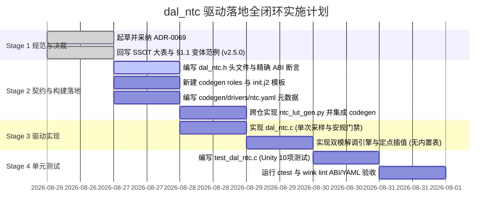

# DAL 外设执行分计划：sensor/ntc (NTC 温度传感器)

| 项 | 内容 |
|---|---|
| **计划名称** | `sensor/ntc` (NTC 温度传感器) 外设驱动与 Codegen 落地计划 |
| **所属批次** | P0 批次 (电热小家电核心第一高频物理量传感器) |
| **映射 Wokwi 组件** | `wokwi-ntc-temperature-sensor` (🟢 Native 原生匹配) |
| **驱动文件路径** | `wink-micro-os/dal/include/sensor/dal_ntc.h`<br>`wink-micro-os/dal/src/sensor/dal_ntc.c` |
| **Codegen 描述** | `wink-micro-os/codegen/drivers/ntc.yaml`（**Schema 1.1 强校验规范**） |
| **新建 Role 描述** | `wink-micro-os/codegen/roles/temperature_sensor.yaml`（前置新增 Role 资产） |
| **新建 Init 模板** | `wink-micro-os/codegen/drivers/templates/ntc_init.c.j2`（设备树初始化模板，内嵌 per-instance LUT） |
| **LUT 生成脚本（跨仓）** | `wink-ai/packages/wink-tools/tools/codegen/scripts/ntc_lut_gen.py`（CLI + 可 import 库，与 `list_drivers.py` 同级）；codegen 生成器集成位于 `wink-tools/tools/codegen/generators/` |
| **LUT 产物** | 由 codegen 按每个 NTC 实例材料参数离线生成，渲染进 embedded 仓 `build/generated/<app>/...`（gitignore，**不提交**，无 committed `.inc`/内置表） |
| **单测文件路径** | `wink-micro-os/test/unit/dal/test_dal_ntc.c`（Unity C 测试套件，路径已校准） |
| **关联规范** | [ADR-0069](../../decisions/core/0069-sensor-ntc-independent-type-and-safety-contract.md)（NTC 独立 Type 与安规裁决）、[`00.1-category-type-variant-wokwi-ssot.md`](./00.1-category-type-variant-wokwi-ssot.md) (v2.5.0)、[`dal-api-consistency-spec.md`](../../../../../wink-micro-os/docs/dal-development-guide/dal-api-consistency-spec.md)、[ADR-0017](../../decisions/core/0017-blocking-api-hard-isolation.md) (严格非阻塞隔离)、[ADR-0056](../../decisions/core/0056-cross-profile-quantity-ab-class-and-scaled-integers.md) (B 类传感器量纲 `_ddegc`)、[ADR-0057](../../decisions/core/0057-pal-adc-subsystem-and-channel-3-analog-contract.md) (PAL ADC 资源治理) |
| **前置依赖** | **已就绪**：前置 [`00.5-pal-adc-subsystem-plan.md`](./00.5-pal-adc-subsystem-plan.md) (PAL ADC 子系统已落地) |
| **计划状态** | 🆕 规划落地版（经三轮专家评审全量硬化：内置默认 LUT、单次硬件采样、ADR-0017 阻塞隔离、精确 ABI 断言） |

---

## 1. 架构定位与 ADR-0069 裁决落地

### 1.1 独立新建 `Type = ntc` 的架构法理依据 (ADR-0069)

依据最新采纳的 [ADR-0069](../../decisions/core/0069-sensor-ntc-independent-type-and-safety-contract.md)，正式将 NTC 温度传感器从通用 `sensor/analog_sensor` 变体中抽离，确立为 `category = sensor` 下的顶级独立 `Type = ntc`：

1. **严格遵循【边界 A (`Variant` vs `Type`)】**：
   * SSOT §1.1 铁律明文规定：*“若底层通信协议、控制物理量单位或统一 C API 接口结构体改变，必须新建 Type”*。
   * NTC 输出的核心物理量是 **温度（`temp_ddegc` / `temp_degc`）**，而通用 `analog_sensor` 输出的是原始毫伏（`voltage_mv`）。驱动层直接提供温度物理量与安规门禁，符合领域驱动设计（DDD）。
2. **小家电领域的第一高频核心资产**：
   * 参照 `input/analog_knob`（底层同样是电位器分压读 ADC，因 HMI 一等公民独立建 Type）与 `sensor/load_cell`（称重核心外设独立建 Type），NTC 拥有同等架构地位。
3. **安规边界澄清（Safety Primitive vs Certification）**：
   * **本驱动承诺**：提供硬件级的 **传感器失效安全原语（Sensor Failsafe Primitives）**——在底层精准识别探头开路断线（`fault_open`）、探头绝缘短路（`fault_short`）及干烧超温（`WINK_ERR_OVERTEMPERATURE`），并向系统返回标准故障码；
   * **边界澄清**：驱动层提供原语 $\neq$ 整机自动通过 IEC 60335 / Class B 认证。整机认证仍需板级突跳温控器（KSD301）与上层周期自检协同。

---

## 2. 硬件拓扑与 Variant 变体分类

### 2.1 变体枚举与引脚拓扑 (`dal_ntc_variant_t`)

依据 SSOT §1.1 变体设计规范与 ADR-0069，穷举底层硬件变体：

| 变体枚举名称 | 物理引脚拓扑 | `affects_pins` | 底层采集机理与时序特征 | 仿真适配 (Wokwi@1.9.2) | 落地阶段 / 状态 |
|---|---|:---:|---|:---:|---|
| **`DAL_NTC_VARIANT_SINGLE_ENDED_ADC`** (0) | `[VCC, GND, AO]` (3Pin) | `false` | **单端 ADC 电阻分压直读**：Class 0 准静态 ADC，采样分压中点 | 🟢 Native (`wokwi-ntc-temperature-sensor`) | **Phase 1 全功能落地** (覆盖 99% 小家电) |
| **`DAL_NTC_VARIANT_DIFFERENTIAL_BRIDGE`** (1) | `[VCC, GND, IN+, IN-]` (4Pin) | `true` | **差分惠斯通电桥**：Class 0 差分 ADC，抑制共模温漂 | 🔴 Custom (`wink-custom-ntc-bridge`) | 🟡 预留枚举，Phase 1 返回 `WINK_ERR_UNSUPPORTED` (待 PAL 支持 PGA 差分) |

### 2.2 市面主流 NTC 芯片/探头型号盘点与别名表 (`aliases`)

在 `wink-micro-os/codegen/drivers/ntc.yaml` 中建立标准型号别名库（采用 YAML 字符串枚举，由 Codegen 映射为 C 枚举）：

| 工业型号 / 别名 | 物理形态 | 标称参数 ($R_{25}$ / $B$) | 分压接法 (`divider_type`) | 典型终端产品 |
|---|---|---|---|---|
| **`mf58_100k_3950`** | 玻封耐高温二极管型 (-40~300°C) | $100\text{k}\Omega,\; B=3950\text{K}$ | `pull_up` ($R_{pull}=4.7\text{k}\Omega$) | 蒸汽电熨斗底板、3D 打印喷头、空气炸锅 |
| **`mf52d_10k_3950`** | 小黑头环氧树脂型 (-40~125°C) | $10\text{k}\Omega,\; B=3950\text{K}$ | `pull_up` ($R_{pull}=10\text{k}\Omega$) | 电热水壶、养生壶、暖奶器、恒温杯垫 |
| **`mf52d_10k_3435`** | 环氧小水滴 (-40~125°C) | $10\text{k}\Omega,\; B=3435\text{K}$ | `pull_up` ($R_{pull}=10\text{k}\Omega$) | 空调出风口、冰箱冷柜探头 |
| **`mf51e_bullet`** | 不锈钢子弹头防水灌封探头 | $10\text{k}\Omega / 50\text{k}\Omega$ | `pull_up` ($R_{pull}=4.7\text{k}\Omega$) | 意式咖啡机水箱、洗碗机水温监测 |
| **`wokwi_ntc`** | Wokwi 原生仿真元件 | $10\text{k}\Omega,\; B=3950\text{K}$ | `pull_up` ($R_{pull}=10\text{k}\Omega$) | 虚拟沙箱仿真与 WebAssembly 验证 |

---

## 3. 数据结构与 C API 规范设计 (`dal_ntc.h`)

### 3.1 跨 Profile 量纲决策 (遵循 ADR-0056 §9.5 与 ADR-0069)
* **B 类传感器测量分类**：遵循 ADR-0056，B 类量不追求全 Profile 同类型，两端各取最优表示，差异由 Codegen Binding 吸收：
  1. **`temp_ddegc`（十分之一摄氏度，`int16_t`）**：全 Profile 通用，**51 单片机与 8 位机首选**。
     * 刻度 $1\,\text{LSB} = 0.1^\circ\text{C}$，例如 $25.4^\circ\text{C}$ 表示为 `254`，$-10.5^\circ\text{C}$ 表示为 `-105`；
     * `int16_t` 仅占 2 字节，量程为 $-3276.8^\circ\text{C} \sim +3276.7^\circ\text{C}$，完美覆盖电热小家电全温区；
     * 在 51 单片机上运算速度比 32 位定标整型快一倍以上，且无需任何浮点支持。
  2. **`temp_degc`（浮点摄氏度，`float`）**：**Full Profile 专享（ESP32 / STM32 / Wasm）**。
     * 带硬件 FPU 平台直读标准物理量，供高级 PID 及微积分滤波消费。
  3. **`raw`（12-bit ADC 原始码值，`uint16_t`）**；
  4. **`mv`（采样引脚实际电压，`uint16_t`）。

### 3.2 错误码契约 (严格对齐 ADR-0001 与 `wink_status.h`)
* **`WINK_OK = 0`**：采样与解调成功。
* **`WINK_ERR_HARDWARE = -12`**：检测到底层传感器物理失效（探头断线开路或引脚短路），驱动层置位 `fault_open` 或 `fault_short` 锁存标志。
* **`WINK_ERR_OVERTEMPERATURE = -21`**：采样温度超过干烧保护上限阈值（$> max\_valid\_temp\_c$）。
* **`WINK_ERR_OUT_OF_RANGE = -4`**：采样温度低于物理有效下限阈值（$< min\_valid\_temp\_c$）。
* **`WINK_ERR_BUSY = -6`**：瞬态去抖计数中（未达到连续 N 次锁存阈值，数据暂不稳定）。
* **`WINK_ERR_UNSUPPORTED = -7`**：选择了尚未支持的硬件变体（如差分电桥）。
* **`WINK_ERR_INVALID_ARG = -1`**：传入 NULL 指针、未配置有效引脚或参数非法。
* **`WINK_ERR_NOT_INITIALIZED = -11`**：句柄未初始化调用。

### 3.3 头文件完整契约 (`wink-micro-os/dal/include/sensor/dal_ntc.h`)

遵循 `dal-api-consistency-spec.md` 及 `DAL-S-001/006/011/014/020`，并包含 ADR-0017 阻塞 API 严格隔离守卫：

```c
// SPDX-License-Identifier: Apache-2.0
#ifndef DAL_NTC_H
#define DAL_NTC_H

#include <stdint.h>
#include <stdbool.h>
#include <stddef.h>
#include "wink_status.h"
#include "hal/pal_pin_types.h"

#ifdef __cplusplus
extern "C" {
#endif

/**
 * @brief NTC 硬件接口变体枚举 (affects_pins: true/false)
 */
typedef enum {
    DAL_NTC_VARIANT_SINGLE_ENDED_ADC    = 0, /**< 默认主流: 单端电阻分压电路 [VCC, GND, AO] */
    DAL_NTC_VARIANT_DIFFERENTIAL_BRIDGE = 1, /**< 预留: 惠斯通差分电桥 [VCC, GND, IN+, IN-] */
    DAL_NTC_VARIANT_COUNT               = 2, /**< 变体总数 (用于编译期断言) */
} dal_ntc_variant_t;

/**
 * @brief 电路分压拓扑枚举 (消化硬件接线变异)
 */
typedef enum {
    DAL_NTC_DIVIDER_PULL_UP   = 0, /**< 默认主流: VCC -> R_pull -> (AO) -> NTC -> GND (温升电压降) */
    DAL_NTC_DIVIDER_PULL_DOWN = 1, /**< 反向分压: VCC -> NTC -> (AO) -> R_pull -> GND (温升电压升) */
} dal_ntc_divider_t;

/**
 * @brief NTC 配置参数结构体 (Flat POD 内存布局，按 32位/16位连续排列消除 Padding)
 */
typedef struct {
    const char           *owner;             /**< 实例归属者静态标签 (MUST: 字符串常量) */
    uint32_t              r25_ohm;           /**< 25°C 基准标称阻值 (如 100000) */
    uint32_t              r_pull_ohm;        /**< 固定分压电阻阻值 (如 4700 或 10000) */
    dal_ntc_variant_t     variant;           /**< 硬件变体枚举 (4B) */
    dal_ntc_divider_t     divider_type;      /**< 分压电路拓扑 (4B) */
    uint16_t              ao_pin;            /**< 主模拟量输入引脚 (DAL-S-006: 必填用 uint16_t) */
    wink_pin_t            diff_neg_pin;      /**< 差分负引脚 (DAL-S-006: 可选引脚，未接用 WINK_PIN_NC) */
    uint16_t              b_value;           /**< B 常数 25/50°C (如 3950) */
    uint16_t              vref_mv;           /**< ADC 供电参考电压 (0 = 自动获取通道 full_scale_mv) */
    int16_t               min_valid_temp_c;  /**< 物理有效下限阈值 (默认 -30°C) */
    int16_t               max_valid_temp_c;  /**< 干烧超温上限阈值 (默认 280°C) */
    uint8_t               debounce_count;    /**< 强电 EMI 滤波去抖连续次数 (0 = 立即生效不去抖，默认 3) */
    uint8_t               reserved[3];       /**< 显式结构体对齐填充 (3B) */
    const int16_t        *lut_table;         /**< Micro Profile 下 read_ddegc 必需的 33 点定点表 (0.1°C)；由 codegen 按本实例 r25/b_value/r_pull/divider_type 自动生成并填入。Full Profile 可用 read_degc 浮点路径，本表可为 NULL；NULL 时调用 read_ddegc 返回 WINK_ERR_INVALID_STATE。DAL 不含任何内置材料表 */
} dal_ntc_config_t;

/**
 * @brief NTC 句柄结构体 (POD instance_t)
 *
 * 【DAL-C-010 读取顺序契约】：
 * 读端应先读取 last_status；若为 WINK_ERR_HARDWARE，再读取 fault_open 与 fault_short 识别具体断线或短路根因。
 */
typedef struct {
    dal_ntc_config_t      config;            /**< 配置副本 (MUST: offsetof == 0) */
    uint8_t               adc_channel;       /**< 绑定的 PAL ADC 逻辑通道 (1B) */
    bool                  initialized;       /**< 初始化标志 (1B) */
    uint16_t              last_raw;          /**< 最近一次采样原始码值 (2B) */
    uint16_t              last_mv;           /**< 最近一次采样换算电压 (mV) */
    int16_t               last_ddegc;        /**< 最近一次测量十分之一度 (0.1°C, 254=25.4°C) (2B) */
#if !defined(WINK_PROFILE_MICRO) && !defined(WINK_NO_FLOAT)
    float                 last_degc;         /**< 32位 Full Profile 浮点缓存 (°C) (4B) */
#endif
    volatile bool         fault_open;        /**< 开路断线安规故障锁存标志 (1B) */
    volatile bool         fault_short;       /**< 探头短路安规故障锁存标志 (1B) */
    uint8_t               fault_debounce;    /**< 当前异常采样去抖计数器 (1B) */
    volatile wink_status_t last_status;      /**< 最近一次底层状态码 (4B) */
} dal_ntc_t;

/* --- ABI 尺寸与内存布局门禁静态断言 --- */
_Static_assert(offsetof(dal_ntc_t, config) == 0, "config must be at offset 0");
_Static_assert(DAL_NTC_VARIANT_COUNT == 2, "Variant count mismatch with SSOT §2");
_Static_assert(DAL_NTC_VARIANT_DIFFERENTIAL_BRIDGE + 1 == DAL_NTC_VARIANT_COUNT,
               "Sequential variant ordering check failed");

#if INTPTR_MAX == INT32_MAX   /* ILP32: ESP32 xtensa, wasm32 */
_Static_assert(sizeof(dal_ntc_config_t) == 40, "ABI break: config size changed on 32-bit target");
_Static_assert(offsetof(dal_ntc_t, initialized) == 41, "ABI break: initialized offset changed on 32-bit");
#if !defined(WINK_PROFILE_MICRO) && !defined(WINK_NO_FLOAT)
_Static_assert(sizeof(dal_ntc_t) == 60, "ABI break: Full Profile handle size changed on 32-bit target");
#else
_Static_assert(sizeof(dal_ntc_t) == 56, "ABI break: Micro Profile handle size changed on 32-bit target");
#endif
#else                         /* LP64 / LLP64: 64-bit Host Simulation */
_Static_assert(sizeof(dal_ntc_config_t) == 48, "ABI break: config size changed on 64-bit host");
_Static_assert(offsetof(dal_ntc_t, initialized) == 49, "ABI break: initialized offset changed on 64-bit");
_Static_assert(sizeof(dal_ntc_t) == 72, "ABI break: handle size changed on 64-bit host");
#endif

/* --- C API 函数声明 --- */

/**
 * @brief 初始化 NTC 传感器实例并向 PAL ADC 申请通道及双重资源锁
 */
WINK_WARN_UNUSED_RESULT
wink_status_t dal_ntc_init(dal_ntc_t *dev, const dal_ntc_config_t *cfg);

/**
 * @brief 释放 NTC 传感器并逐级归还 PAL ADC 及 GPIO 资源
 */
wink_status_t dal_ntc_deinit(dal_ntc_t *dev);

/*
 * 【ADR-0017 非阻塞架构隔离说明】：
 * 当前 Class 0 准静态 ADC 单次采样为微秒级同步阻塞硬件操作，依规范全部 read_* API
 * 受 #ifndef WINK_STRICT_NONBLOCKING 保护并打上 WINK_BLOCKING 标。
 * Phase 1 阶段若在纯事件驱动应用中需要无阻塞，可使用 Full Profile 浮点或定时任务轮询；
 * Phase 2 规划中将补齐 dal_ntc_request_read() 与 dal_ntc_get_cached_ddegc() 非阻塞三件套。
 */
#ifndef WINK_STRICT_NONBLOCKING
/**
 * @brief 读取定点十分之一摄氏度温度 (0.1°C, 例如 254 代表 25.4°C)
 * @note 【全 Profile 通用，51 单片机首选】纯整数运算，零浮点消耗，单次硬件采样防竞争
 */
WINK_BLOCKING WINK_WARN_UNUSED_RESULT
wink_status_t dal_ntc_read_ddegc(dal_ntc_t *dev, int16_t *out_ddegc);

#if !defined(WINK_PROFILE_MICRO) && !defined(WINK_NO_FLOAT)
/**
 * @brief 读取浮点摄氏度温度 (°C)
 * @note 【Full Profile 专享】32位 FPU / Wasm / PC 仿真首选；在 8051 上自动编译期剥离
 */
WINK_BLOCKING WINK_WARN_UNUSED_RESULT
wink_status_t dal_ntc_read_degc(dal_ntc_t *dev, float *out_degc);
#endif

/**
 * @brief 读取原始 ADC 采样码值 (单次硬件采样)
 */
WINK_BLOCKING WINK_WARN_UNUSED_RESULT
wink_status_t dal_ntc_read_raw(dal_ntc_t *dev, uint16_t *out_raw);

/**
 * @brief 读取分压点瞬态毫伏电压 (mV)
 */
WINK_BLOCKING WINK_WARN_UNUSED_RESULT
wink_status_t dal_ntc_read_mv(dal_ntc_t *dev, uint16_t *out_mv);
#endif /* !WINK_STRICT_NONBLOCKING */

/**
 * @brief 清除开路/短路安规故障锁存标志
 */
wink_status_t dal_ntc_clear_faults(dal_ntc_t *dev);

/**
 * @brief 获取最近一次状态码
 */
static inline wink_status_t dal_ntc_get_last_status(const dal_ntc_t *dev) {
    return dev ? dev->last_status : WINK_ERR_INVALID_ARG;
}

#ifdef __cplusplus
}
#endif

/* --- Compile-time pruning stubs (DAL-HDR-STUB 规范) --- */
#if !defined(WINK_USE_NTC) || !WINK_USE_NTC
#define WINK_NTC_DISABLED_MSG \
    "NTC driver not enabled; add a \"ntc\" device to wink-app.json (or set -DWINK_USE_NTC=ON)."
WINK_UNAVAILABLE_MSG(WINK_NTC_DISABLED_MSG) WINK_WARN_UNUSED_RESULT
wink_status_t dal_ntc_init(dal_ntc_t *dev, const dal_ntc_config_t *cfg);
WINK_UNAVAILABLE_MSG(WINK_NTC_DISABLED_MSG)
wink_status_t dal_ntc_deinit(dal_ntc_t *dev);

#ifndef WINK_STRICT_NONBLOCKING
WINK_UNAVAILABLE_MSG(WINK_NTC_DISABLED_MSG) WINK_WARN_UNUSED_RESULT
wink_status_t dal_ntc_read_ddegc(dal_ntc_t *dev, int16_t *out_ddegc);
#if !defined(WINK_PROFILE_MICRO) && !defined(WINK_NO_FLOAT)
WINK_UNAVAILABLE_MSG(WINK_NTC_DISABLED_MSG) WINK_WARN_UNUSED_RESULT
wink_status_t dal_ntc_read_degc(dal_ntc_t *dev, float *out_degc);
#endif
WINK_UNAVAILABLE_MSG(WINK_NTC_DISABLED_MSG) WINK_WARN_UNUSED_RESULT
wink_status_t dal_ntc_read_raw(dal_ntc_t *dev, uint16_t *out_raw);
WINK_UNAVAILABLE_MSG(WINK_NTC_DISABLED_MSG) WINK_WARN_UNUSED_RESULT
wink_status_t dal_ntc_read_mv(dal_ntc_t *dev, uint16_t *out_mv);
#endif /* !WINK_STRICT_NONBLOCKING */

WINK_UNAVAILABLE_MSG(WINK_NTC_DISABLED_MSG)
wink_status_t dal_ntc_clear_faults(dal_ntc_t *dev);
#endif /* !WINK_USE_NTC */

#endif /* DAL_NTC_H */
```

---

## 4. 驱动算法内核与硬件治理实现细节 (`dal_ntc.c`)

### 4.1 完整的 PAL ADC 资源生命周期治理与 12-bit 分辨率锁定
`dal_ntc.c` 严格对齐 `dal_analog_knob.c`，在 `init` 锁定 12 位采样模式，杜绝分辨率漂移与资源冲突：

```c
wink_status_t dal_ntc_init(dal_ntc_t *dev, const dal_ntc_config_t *cfg) {
    if (dev == NULL || cfg == NULL || cfg->owner == NULL) {
        return WINK_ERR_INVALID_ARG;
    }
    if (dev->initialized) {
        return WINK_ERR_ALREADY_INITIALIZED;
    }

    /* Phase 1 拦截未支持的差分变体 */
    if (cfg->variant == DAL_NTC_VARIANT_DIFFERENTIAL_BRIDGE) {
        return WINK_ERR_UNSUPPORTED;
    }

    pal_adc_config_t pal_cfg = {
        .pin = (wink_pin_t)cfg->ao_pin,
        .full_scale_mv = cfg->vref_mv,
        .resolution_bits = 12, /* 锁定 12-bit 分辨率 (0~4095) */
    };

    pal_adc_channel_t ch = 0;
    wink_status_t st = pal_adc_acquire((wink_pin_t)cfg->ao_pin, &pal_cfg, &ch);
    if (wink_status_is_error(st)) return st;

    /* 双重资源锁定：ADC 逻辑通道 + GPIO 物理引脚 */
    st = pal_resource_claim(PAL_RESOURCE_ADC_CHANNEL, ch, cfg->owner);
    if (wink_status_is_error(st)) {
        WINK_IGNORE_UNUSED(pal_adc_release(ch));
        return st;
    }

    st = pal_resource_claim(PAL_RESOURCE_GPIO_PIN, cfg->ao_pin, cfg->owner);
    if (wink_status_is_error(st)) {
        WINK_IGNORE_UNUSED(pal_resource_release(PAL_RESOURCE_ADC_CHANNEL, ch, cfg->owner));
        WINK_IGNORE_UNUSED(pal_adc_release(ch));
        return st;
    }

    memcpy(&dev->config, cfg, sizeof(dal_ntc_config_t));
    dev->adc_channel = (uint8_t)ch;
    dev->last_raw = 0;
    dev->last_mv = 0;
    dev->last_ddegc = 0;
#if !defined(WINK_PROFILE_MICRO) && !defined(WINK_NO_FLOAT)
    dev->last_degc = 0.0f;
#endif
    dev->fault_open = false;
    dev->fault_short = false;
    dev->fault_debounce = 0;
    dev->last_status = WINK_OK;
    dev->initialized = true;

    return WINK_OK;
}

wink_status_t dal_ntc_deinit(dal_ntc_t *dev) {
    if (dev == NULL) return WINK_ERR_INVALID_ARG;
    if (!dev->initialized) return WINK_OK;

    pal_adc_channel_t ch = 0;
    if (pal_adc_pin_channel((wink_pin_t)dev->config.ao_pin, &ch) == WINK_OK) {
        WINK_IGNORE_UNUSED(pal_adc_release(ch));
        WINK_IGNORE_UNUSED(pal_resource_release(PAL_RESOURCE_ADC_CHANNEL, ch, dev->config.owner));
    }
    WINK_IGNORE_UNUSED(pal_resource_release(PAL_RESOURCE_GPIO_PIN, dev->config.ao_pin, dev->config.owner));

    dev->initialized = false;
    dev->last_status = WINK_OK;
    return WINK_OK;
}
```

### 4.2 统一的 mV 域自适应安规与单次采样快照

```c
static wink_status_t dal_ntc_check_safety(dal_ntc_t *dev, uint16_t mv, uint16_t vref_mv) {
    /* 已经锁存硬件故障时，必须显式调用 clear_faults 才能恢复 */
    if (dev->fault_open || dev->fault_short) {
        dev->last_status = WINK_ERR_HARDWARE;
        return WINK_ERR_HARDWARE;
    }

    uint16_t deadband_mv = vref_mv / 100u;
    if (deadband_mv < 20u) deadband_mv = 20u;

    bool is_short = false;
    bool is_open  = false;

    if (dev->config.divider_type == DAL_NTC_DIVIDER_PULL_UP) {
        if (mv <= deadband_mv) is_short = true;
        else if (mv >= (vref_mv - deadband_mv)) is_open = true;
    } else { /* PULL_DOWN 极性翻转 */
        if (mv >= (vref_mv - deadband_mv)) is_short = true;
        else if (mv <= deadband_mv) is_open = true;
    }

    uint8_t threshold = dev->config.debounce_count;

    if (is_short || is_open) {
        /* 0 表示立即生效不去抖 */
        if (threshold == 0 || ++dev->fault_debounce >= threshold) {
            if (is_short) dev->fault_short = true;
            if (is_open)  dev->fault_open  = true;
            dev->last_status = WINK_ERR_HARDWARE;
            return WINK_ERR_HARDWARE;
        }
        /* 去抖窗口内尚未锁存故障，显式返回 BUSY 通知调用方数据暂不稳定 */
        dev->last_status = WINK_ERR_BUSY;
        return WINK_ERR_BUSY;
    }

    /* 恢复正常，清除瞬态去抖计数 */
    dev->fault_debounce = 0;
    return WINK_OK;
}
```

### 4.3 双模解调引擎（DAL 纯引擎，LUT 由 codegen 注入）

> **架构契约（SSOT）**：DAL 是无状态测量引擎，**不内置任何材料常数/LUT**。每个 NTC 实例的 33 点定点表由 codegen 依据该实例的 `r25_ohm / b_value / r_pull_ohm / divider_type` 离线生成，并在 init 模板里随 `dal_ntc_config_t.lut_table` 一并填入（详见 §5.2、§5.3）。
> * Micro Profile：`read_ddegc` 必需 LUT，由 codegen 生成注入；
> * Full Profile：可用 `read_degc` 浮点 B 方程，LUT 可省略；
> * 非标材料（非内置 alias）同样开箱即用——codegen 按设备树实例参数生成专属 LUT，DAL 无需改动。

```c
/* --- 纯 16 位整数定点查表与线性插值核 (零浮点、零数学库) ---
 * 契约：
 *   - table 指向 33 个 int16_t (索引 0..32，单位 0.1°C)，跨度 128 LSB/区间；
 *   - raw 为锁定的 12-bit 码值 (0~4095，init 已固定 resolution_bits=12)；
 *   - 高 5 位 (raw>>7) 为区间索引 (0~31)，低 7 位 (raw&0x7F) 为插值分子；
 *   - 末端 raw=4095 命中 idx=31, frac=127，读 table[32]，故表必须 33 项。
 */
static int16_t ntc_lut_interpolate_int16(const int16_t *table, uint16_t raw) {
    if (!table) return 0;
    if (raw > 4095u) raw = 4095u;

    uint8_t idx = (uint8_t)(raw >> 7);
    uint8_t remainder = (uint8_t)(raw & 0x7Fu);

    int16_t y0 = table[idx];
    int16_t y1 = table[idx + 1];

    return y0 + (int16_t)(((int32_t)(y1 - y0) * (int32_t)remainder) >> 7);
}

#ifndef WINK_STRICT_NONBLOCKING
wink_status_t dal_ntc_read_ddegc(dal_ntc_t *dev, int16_t *out_ddegc) {
    if (!dev || !dev->initialized || !out_ddegc) return WINK_ERR_INVALID_ARG;

    /* Micro Profile 必须由 codegen 注入 LUT；未注入即配置错误 */
    if (dev->config.lut_table == NULL) return WINK_ERR_INVALID_STATE;

    /* 单次硬件采样快照 */
    uint16_t raw = 0;
    wink_status_t st = pal_adc_read_raw(dev->adc_channel, &raw);
    if (st != WINK_OK) { dev->last_status = st; return st; }
    dev->last_raw = raw;

    uint16_t vref = dev->config.vref_mv;
    if (vref == 0) (void)pal_adc_full_scale_mv(dev->adc_channel, &vref);

    uint16_t mv = (uint16_t)(((uint32_t)raw * vref) / 4095u);
    dev->last_mv = mv;

    st = dal_ntc_check_safety(dev, mv, vref);
    if (st != WINK_OK) return st;

    int16_t ddegc = ntc_lut_interpolate_int16(dev->config.lut_table, raw);
    dev->last_ddegc = ddegc;
    *out_ddegc = ddegc;

    /* 干烧超温与低温范围门禁判定 (使用 int32_t 避免乘法溢出) */
    int32_t max_ddegc = (int32_t)dev->config.max_valid_temp_c * 10;
    int32_t min_ddegc = (int32_t)dev->config.min_valid_temp_c * 10;
    if ((int32_t)ddegc > max_ddegc) {
        dev->last_status = WINK_ERR_OVERTEMPERATURE;
        return WINK_ERR_OVERTEMPERATURE;
    }
    if ((int32_t)ddegc < min_ddegc) {
        dev->last_status = WINK_ERR_OUT_OF_RANGE;
        return WINK_ERR_OUT_OF_RANGE;
    }

    dev->last_status = WINK_OK;
    return WINK_OK;
}

#if !defined(WINK_PROFILE_MICRO) && !defined(WINK_NO_FLOAT)
#include <math.h>

wink_status_t dal_ntc_read_degc(dal_ntc_t *dev, float *out_degc) {
    if (!dev || !dev->initialized || !out_degc) return WINK_ERR_INVALID_ARG;

    /* 单次硬件采样快照 */
    uint16_t raw = 0;
    wink_status_t st = pal_adc_read_raw(dev->adc_channel, &raw);
    if (st != WINK_OK) { dev->last_status = st; return st; }
    dev->last_raw = raw;

    uint16_t vref = dev->config.vref_mv;
    if (vref == 0) (void)pal_adc_full_scale_mv(dev->adc_channel, &vref);

    uint16_t mv = (uint16_t)(((uint32_t)raw * vref) / 4095u);
    dev->last_mv = mv;

    st = dal_ntc_check_safety(dev, mv, vref);
    if (st != WINK_OK) return st;

    float v_sig = (float)mv;
    float v_ref = (float)vref;
    float r_pull = (float)dev->config.r_pull_ohm;
    float r_ntc = (dev->config.divider_type == DAL_NTC_DIVIDER_PULL_UP)
                ? (v_sig * r_pull) / (v_ref - v_sig)
                : (r_pull * (v_ref - v_sig)) / v_sig;

    float t_kelvin = 1.0f / ((1.0f / 298.15f) + (1.0f / (float)dev->config.b_value) * logf(r_ntc / (float)dev->config.r25_ohm));
    float degc = t_kelvin - 273.15f;

    if (isnan(degc) || isinf(degc)) {
        dev->last_status = WINK_ERR_HARDWARE;
        return WINK_ERR_HARDWARE;
    }

    dev->last_degc = degc;
    dev->last_ddegc = (degc > 3276.0f) ? 32760 : (degc < -3276.0f ? -32760 : (int16_t)(degc * 10.0f));
    *out_degc = degc;

    if (degc > (float)dev->config.max_valid_temp_c) {
        dev->last_status = WINK_ERR_OVERTEMPERATURE;
        return WINK_ERR_OVERTEMPERATURE;
    }
    if (degc < (float)dev->config.min_valid_temp_c) {
        dev->last_status = WINK_ERR_OUT_OF_RANGE;
        return WINK_ERR_OUT_OF_RANGE;
    }

    dev->last_status = WINK_OK;
    return WINK_OK;
}
#endif

wink_status_t dal_ntc_read_raw(dal_ntc_t *dev, uint16_t *out_raw) {
    if (!dev || !dev->initialized || !out_raw) return WINK_ERR_INVALID_ARG;
    wink_status_t st = pal_adc_read_raw(dev->adc_channel, out_raw);
    if (st == WINK_OK) dev->last_raw = *out_raw;
    dev->last_status = st;
    return st;
}

wink_status_t dal_ntc_read_mv(dal_ntc_t *dev, uint16_t *out_mv) {
    if (!dev || !dev->initialized || !out_mv) return WINK_ERR_INVALID_ARG;
    wink_status_t st = pal_adc_read_mv(dev->adc_channel, out_mv);
    if (st == WINK_OK) dev->last_mv = *out_mv;
    dev->last_status = st;
    return st;
}
#endif /* !WINK_STRICT_NONBLOCKING */

wink_status_t dal_ntc_clear_faults(dal_ntc_t *dev) {
    if (!dev || !dev->initialized) return WINK_ERR_INVALID_ARG;
    dev->fault_open = false;
    dev->fault_short = false;
    dev->fault_debounce = 0;
    dev->last_status = WINK_OK;
    return WINK_OK;
}
```

---

## 5. Codegen 体系交付物规范

### 5.1 新建 Role 文件 (`wink-micro-os/codegen/roles/temperature_sensor.yaml`)
严格遵循现有 9 个 Role 的极简 Schema 1.1 规范：

```yaml
# Role contract SSOT (machine-readable). Human-readable SSOT:
# docs/dal-development-guide/dal-role-architecture-spec.md
codegen_schema: "1.1"
id: temperature_sensor
verbs:
  - id: read_ddegc
    error_class: convenience
  - id: read_degc
    error_class: convenience
  - id: read_mv
    error_class: convenience
  - id: clear_faults
    error_class: normal
```

### 5.2 新建 Init 模板 (`wink-micro-os/codegen/drivers/templates/ntc_init.c.j2`)
严格对齐 `analog_knob_init.c.j2` 模板标准，采用 `WINK_TRY` 包装。codegen 在渲染本模板前，按实例材料参数调 `ntc_lut_gen.generate_ntc_lut(...)`（见 §5.3），将 33 项格式化为 8 列逗号分隔字符串注入 `{{ lut_array }}`，并随实例一起输出专属 LUT：

```jinja2
    /* Auto-generated per-instance NTC LUT (0.1 degC LSB, 33 nodes, 12-bit ADC).
     * R25={{ r25_ohm }} ohm, B={{ b_value }} K, R_pull={{ r_pull_ohm }} ohm, {{ divider_type | default('pull_up') }}.
     * Generated by ntc_lut_gen.py — do not hand-edit. */
    static const int16_t {{ name }}_lut[33] = {
        {{ lut_array }}
    };

    static const dal_ntc_config_t {{ name }}_cfg = {
        .owner = "{{ name }}",
        .r25_ohm = {{ r25_ohm | default(100000) }},
        .r_pull_ohm = {{ r_pull_ohm | default(4700) }},
        .variant = DAL_NTC_VARIANT_{{ variant | default('single_ended_adc') | upper }},
        .divider_type = DAL_NTC_DIVIDER_{{ divider_type | default('pull_up') | upper }},
        .ao_pin = {{ ao_pin }},
        .diff_neg_pin = {{ diff_neg_pin | default("WINK_PIN_NC") }},
        .b_value = {{ b_value | default(3950) }},
        .vref_mv = {{ vref_mv | default(0) }},
        .min_valid_temp_c = {{ min_valid_temp_c | default(-30) }},
        .max_valid_temp_c = {{ max_valid_temp_c | default(280) }},
        .debounce_count = {{ debounce_count | default(3) }},
        .reserved = {0, 0, 0},
        .lut_table = {{ name }}_lut,
    };
    WINK_TRY(dal_ntc_init(&{{ name }}, &{{ name }}_cfg));
```

> Full Profile 若只使用 `read_degc` 浮点路径、不需要定点 API，codegen 可在配置里加 `no_lut: true` 跳过 LUT 数组并令 `.lut_table = NULL`（Phase 2 可选增强；Phase 1 统一生成 LUT，保证两路径均可用）。

### 5.3 新建离线定点 LUT 生成工具 (跨仓 `wink-tools`)
路径：`wink-ai/packages/wink-tools/tools/codegen/scripts/ntc_lut_gen.py`（与 `list_drivers.py` 同级，属 codegen 工具链，非驱动运行时）。双重用途：

1. **CLI**：供人工审查/调试，stdout 或 `--output` 输出 C 数组；
2. **可 import 库** `generate_ntc_lut(r25, b, r_pull, is_pullup) -> list[int]`：由 codegen 生成器在渲染 `ntc_init.c.j2` 前调用，把 33 项格式化为 `lut_array` 注入 j2 上下文（集成点：`wink-tools/tools/codegen/generators/`，渲染 `type==ntc` 实例模板前以 alias 展开后的材料参数调用）。

生成产物随设备树实例代码渲染进 embedded 仓 `build/generated/<app>/...`（与现有 codegen 实例代码同处，gitignore），**不产生任何 committed 的 `.inc`/内置表文件**。

```python
#!/usr/bin/env python3
"""
NTC 33-point fixed-point integer lookup table generator.
Generates 33 int values (0.1 degC per LSB) for a locked 12-bit ADC [0..4095],
node spacing 128 LSB. Used both as a CLI and imported by the codegen renderer.
Usage:
    python ntc_lut_gen.py --r25 100000 --b 3950 --r-pull 4700 --pull-up --name s_lut_100k
"""
import argparse
import math

_TABLE_LEN = 33
_RAW_MAX = 4095
_NODE_STEP = 128
_T0_K = 298.15            # 25 degC in Kelvin
_CLAMP_LOW_DDEGC = -500   # -50.0 degC (near open-circuit endpoint)
_CLAMP_HIGH_DDEGC = 3000  # 300.0 degC (near short-circuit endpoint)


def ntc_r_to_t_ddegc(r_ntc: float, r25: float, b_val: float) -> int:
    if r_ntc <= 0:
        return _CLAMP_HIGH_DDEGC
    inv_t = (1.0 / _T0_K) + (1.0 / b_val) * math.log(r_ntc / r25)
    if inv_t <= 0:
        return _CLAMP_HIGH_DDEGC
    degc = (1.0 / inv_t) - 273.15
    return int(round(degc * 10.0))


def generate_ntc_lut(r25: float, b_val: float, r_pull: float, is_pullup: bool) -> list:
    """Return 33 int ddegc values for nodes raw = i*128 (last node clamped to 4095)."""
    table = []
    for i in range(_TABLE_LEN):
        raw = min(i * _NODE_STEP, _RAW_MAX)
        if is_pullup:
            if raw <= 30:
                ddegc = _CLAMP_HIGH_DDEGC          # short -> V_sig ~ 0 -> max temp
            elif raw >= _RAW_MAX - 5:
                ddegc = _CLAMP_LOW_DDEGC           # open  -> V_sig ~ Vref -> min temp
            else:
                r_ntc = r_pull * raw / (_RAW_MAX - raw)
                ddegc = ntc_r_to_t_ddegc(r_ntc, r25, b_val)
        else:  # pull-down: polarity inverted
            if raw >= _RAW_MAX - 30:
                ddegc = _CLAMP_HIGH_DDEGC          # short -> V_sig ~ Vref
            elif raw <= 30:
                ddegc = _CLAMP_LOW_DDEGC           # open  -> V_sig ~ 0
            else:
                r_ntc = r_pull * (_RAW_MAX - raw) / raw
                ddegc = ntc_r_to_t_ddegc(r_ntc, r25, b_val)
        table.append(max(_CLAMP_LOW_DDEGC, min(_CLAMP_HIGH_DDEGC, ddegc)))
    return table


def format_c_array(table: list, array_name: str, r25: float, b_val: float,
                   r_pull: float, is_pullup: bool) -> str:
    header = (
        f"/* Auto-generated by ntc_lut_gen.py: R25={r25} ohm, B={b_val} K, "
        f"R_pull={r_pull} ohm, topology={'PULL_UP' if is_pullup else 'PULL_DOWN'} */"
    )
    lines = [header, f"static const int16_t {array_name}[33] = {{"]
    for row in range(0, _TABLE_LEN, 8):
        chunk = table[row:min(row + 8, _TABLE_LEN)]
        items_str = ", ".join(f"{val:>5}" for val in chunk)
        comma = "," if row + 8 < _TABLE_LEN else ""
        lines.append(f"    {items_str}{comma}")
    lines.append("};")
    return "\n".join(lines)


def main():
    parser = argparse.ArgumentParser(
        description="Generate a 33-point NTC int16_t lookup table (0.1 degC LSB).")
    parser.add_argument("--r25", type=float, default=100000.0)
    parser.add_argument("--b", dest="b_val", type=float, default=3950.0)
    parser.add_argument("--r-pull", type=float, default=4700.0)
    topo = parser.add_mutually_exclusive_group()
    topo.add_argument("--pull-up", action="store_true", default=True)
    topo.add_argument("--pull-down", dest="pull_up", action="store_false")
    parser.add_argument("--name", default="s_ntc_lut")
    parser.add_argument("--output", default=None, help="Output file (default: stdout)")
    args = parser.parse_args()

    table = generate_ntc_lut(args.r25, args.b_val, args.r_pull, args.pull_up)
    code = format_c_array(table, args.name, args.r25, args.b_val, args.r_pull, args.pull_up)
    if args.output:
        with open(args.output, "w", encoding="utf-8") as f:
            f.write(code + "\n")
    else:
        print(code)


if __name__ == "__main__":
    main()
```

### 5.4 Codegen Driver YAML (`wink-micro-os/codegen/drivers/ntc.yaml`)

```yaml
codegen_schema: "1.1"
type: ntc
category: sensor
is_actuator: false
experimental: false
default_role: temperature_sensor

aliases:
  mf58_100k_3950:
    variant: single_ended_adc
    divider_type: pull_up
    r25_ohm: 100000
    b_value: 3950
    r_pull_ohm: 4700
  mf52d_10k_3950:
    variant: single_ended_adc
    divider_type: pull_up
    r25_ohm: 10000
    b_value: 3950
    r_pull_ohm: 10000
  wokwi_ntc:
    variant: single_ended_adc
    divider_type: pull_up
    r25_ohm: 10000
    b_value: 3950
    r_pull_ohm: 10000

# 注：LUT 不在 YAML 中配置。codegen 渲染实例时按 alias 展开后的
# r25_ohm / b_value / r_pull_ohm / divider_type 调 ntc_lut_gen 自动生成
# per-instance 33 点表（见 §5.2/§5.3），无需手填 lut_table。非标材料
# 直接给出这四个参数即自动获得专属 LUT。

quantity: temperature
quantity_class: sensor_measurement

fields:
  owner:
    tier: stable
    type: string
    emit: none
  ao_pin:
    tier: advanced
    type: int
    required: true
    c: pin
  diff_neg_pin:
    tier: advanced
    type: int
    default: -1
    c: pin
  variant:
    tier: advanced
    type: enum
    affects_pins: false
    enum: [single_ended_adc, differential_bridge]
    default: single_ended_adc
    map:
      single_ended_adc: DAL_NTC_VARIANT_SINGLE_ENDED_ADC
      differential_bridge: DAL_NTC_VARIANT_DIFFERENTIAL_BRIDGE
    variant_fields:
      single_ended_adc: [ao_pin, divider_type, r25_ohm, b_value, r_pull_ohm, vref_mv, min_valid_temp_c, max_valid_temp_c, debounce_count]
      differential_bridge: [ao_pin, diff_neg_pin, divider_type, r25_ohm, b_value, r_pull_ohm, vref_mv]
  divider_type:
    tier: advanced
    type: enum
    enum: [pull_up, pull_down]
    default: pull_up
    map:
      pull_up: DAL_NTC_DIVIDER_PULL_UP
      pull_down: DAL_NTC_DIVIDER_PULL_DOWN
  r25_ohm:
    tier: advanced
    type: int
    default: 100000
  b_value:
    tier: advanced
    type: int
    default: 3950
  r_pull_ohm:
    tier: advanced
    type: int
    default: 4700
  vref_mv:
    tier: advanced
    type: int
    default: 0
  min_valid_temp_c:
    tier: advanced
    type: int
    default: -30
  max_valid_temp_c:
    tier: advanced
    type: int
    default: 280
  debounce_count:
    tier: advanced
    type: int
    default: 3
  role:
    tier: stable
    type: string
    emit: none

quantities:
  owner:            { quantity_class: sensor_measurement }
  ao_pin:           { quantity_class: sensor_measurement }
  diff_neg_pin:     { quantity_class: sensor_measurement }
  variant:          { quantity_class: sensor_measurement }
  divider_type:     { quantity_class: sensor_measurement }
  r25_ohm:          { quantity_class: sensor_measurement }
  b_value:          { quantity_class: sensor_measurement }
  r_pull_ohm:       { quantity_class: sensor_measurement }
  vref_mv:          { quantity_class: sensor_measurement }
  min_valid_temp_c: { quantity_class: sensor_measurement }
  max_valid_temp_c: { quantity_class: sensor_measurement }
  debounce_count:   { quantity_class: sensor_measurement }
  role:             { quantity_class: sensor_measurement }

config:
  c_type: dal_ntc_t
  config_type: dal_ntc_config_t
  headers: [sensor/dal_ntc.h]
  init_fn: dal_ntc_init
  deinit_fn: dal_ntc_deinit
  init_template_file: templates/ntc_init.c.j2
  safe_off_fn: ""

role_bindings:
  temperature_sensor:
    covers_contract: full
    headers: []
    verbs:
      read_ddegc:
        template: "WINK_WARN_UNUSED_RESULT static inline wink_status_t {{ name }}_read_ddegc(int16_t *out_ddegc) { return dal_ntc_read_ddegc(&{{ name }}, out_ddegc); }"
      read_degc:
        template: "#if !defined(WINK_PROFILE_MICRO) && !defined(WINK_NO_FLOAT)\nWINK_WARN_UNUSED_RESULT static inline wink_status_t {{ name }}_read_degc(float *out_degc) { return dal_ntc_read_degc(&{{ name }}, out_degc); }\n#endif"
      read_mv:
        template: "WINK_WARN_UNUSED_RESULT static inline wink_status_t {{ name }}_read_mv(uint16_t *out_mv) { return dal_ntc_read_mv(&{{ name }}, out_mv); }"
      clear_faults:
        template: "static inline wink_status_t {{ name }}_clear_faults(void) { return dal_ntc_clear_faults(&{{ name }}); }"
```

---

## 6. 自动化测试规范与 Host 桩验证 (`wink-micro-os/test/unit/dal/test_dal_ntc.c`)

使用 Unity 测试框架（C 语言纯原语，与 `test_dal_analog_knob.c` 完全同源），测试用例覆盖矩阵：

| 测试用例函数 | 检验目标 | 预期结果 |
|---|---|---|
| `test_ntc_init_success_and_claim` | 正常初始化与双重资源 Claim | 返回 `WINK_OK`，ADC 与 GPIO 资源锁被标记为已占用 |
| `test_ntc_init_resource_collision` | 两个实例抢占同一 ADC 引脚 | 第二个实例返回 **`WINK_ERR_BUSY`**，第一个实例不受损 |
| `test_ntc_deinit_release` | 释放实例与归还资源 | 资源锁解开，再次初始化成功 |
| `test_ntc_read_degc_b_curve_accuracy` | 注入标定温区（0~150°C）对应码值 | 浮点 B 方程解算与物理真实值误差 $\le \pm 0.5^\circ\text{C}$（不依赖 LUT） |
| `test_ntc_lut_interpolation` | 传入一张由 `ntc_lut_gen` 对固定参数生成的已知 33 项 LUT，注入码值 | `read_ddegc` 输出在节点/中点连续无跳变，已知温度点误差 $\le \pm 0.5^\circ\text{C}$ |
| `test_ntc_read_ddegc_null_lut_returns_invalid_state` | 配置 `lut_table=NULL` 调 `read_ddegc` | 返回 `WINK_ERR_INVALID_STATE`，无崩溃 |
| `test_ntc_open_circuit_debounce` | 连续注入 $V_{sig} > V_{ref} - deadband$ | 达到 3 次前返回 `WINK_ERR_BUSY`，第 3 次触发 `WINK_ERR_HARDWARE` 且 `fault_open=true` |
| `test_ntc_short_circuit_pull_down` | 在 PULL_DOWN 下注入 $V_{sig} > V_{ref} - deadband$ | 正确识别为探头短路（极性翻转测试），`fault_short=true` |
| `test_ntc_differential_unsupported` | 选择 `differential_bridge` 变体初始化 | 显式返回 `WINK_ERR_UNSUPPORTED` |
| `test_ntc_overtemperature_cutoff` | 注入超温电压（计算温度 $> 280^\circ\text{C}$） | 触发返回 **`WINK_ERR_OVERTEMPERATURE`** |
| `test_ntc_clear_faults_recovery` | 故障后注入正常电压并调 `clear_faults` | 标志位清零，状态恢复为 `WINK_OK` |

---

## 7. 分阶段实施路线与工期预估 (Work Breakdown)



### 仓库归属（双仓提交）
| 交付物 | 仓库 / 路径 | 提交 |
|---|---|---|
| `dal_ntc.h` / `dal_ntc.c` | embedded：`wink-micro-os/dal/{include/sensor,src/sensor}/` | 是 |
| `ntc.yaml` / `temperature_sensor.yaml` / `ntc_init.c.j2` | embedded：`wink-micro-os/codegen/` | 是 |
| `test_dal_ntc.c` + CMake 注册 | embedded：`wink-micro-os/test/unit/dal/` | 是 |
| `ntc_lut_gen.py` + 生成器集成（`type==ntc` 渲染前注入 `lut_array`） | wink-tools：`tools/codegen/scripts/` 与 `tools/codegen/generators/` | 是 |
| per-instance LUT 数组 | embedded：`build/generated/<app>/...` | **否（gitignore，codegen 产物）** |

> `quantity: temperature` 经核实不被 `yaml_schema.py` 枚举校验（顶层 `quantity` 为自由字符串），无需在 wink-tools schema 登记。
> `WINK_PROFILE_MICRO`/`WINK_NO_FLOAT` 仅服务未来 8051 port；当前 Full Profile（esp32/wasm/host）不定义该宏即正确编译浮点路径，本期无构建系统改动，待 8051 PAL 落地时再在 toolchain profile（wink-tools `tools/toolchain/profiles.py`）统一注入。

### 终局验收门禁
1. **LINT-PASS 门禁**：`python wink-tools/wink.py lint --pack abi` 与 `python wink-tools/wink.py lint --pack yaml` 零错误零告警（含 `quantity: temperature` 与 Schema 1.1 强校验）；
2. **单测门禁**：`ctest -R test_dal_ntc` 10/10 Tests 100% Passed（含浮点 B 方程精度、per-instance LUT 插值与 NULL 守卫、安规去抖/极性、资源冲突）；
3. **8位纯净性验证**：在 Micro Profile 构建产物中，人工/脚本校验符号表严禁包含 `__addsf3`、`logf` 等软浮点符号。
